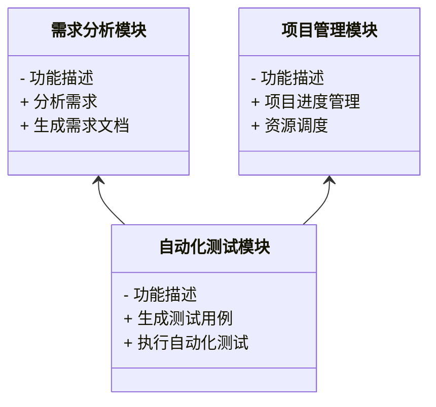

                 

# 敏捷中的创新管理：鼓励LLM应用的突破性想法

关键词：敏捷管理、创新管理、LLM应用、突破性想法、系统架构设计、项目实践

摘要：本文旨在探讨敏捷开发中的创新管理，重点分析如何鼓励大规模语言模型（LLM）的应用，从而实现突破性想法。通过引入关键概念和原理，本文将详细阐述算法设计、数学模型、系统架构设计以及项目实战中的关键点，为读者提供一套完整的创新管理方法论。

## 一、背景介绍

### 1.1 问题背景

在当今快速发展的技术时代，敏捷开发方法已成为软件开发的主流。然而，随着敏捷实践的普及，创新管理的挑战也日益凸显。在敏捷开发过程中，如何有效地管理创新，推动技术的进步和应用，成为项目成功的关键。

### 1.2 问题描述

创新管理的问题主要表现在以下几个方面：

1. **创新动力不足**：敏捷团队在追求短期交付的同时，往往忽视了长期创新的需求。
2. **协作障碍**：不同部门、团队之间的协作不畅，导致创新难以实现。
3. **资源分配不均**：创新项目的资源分配往往不够合理，导致项目进度和质量受到影响。

### 1.3 问题解决

为了解决上述问题，本文提出以下解决方案：

1. **建立创新文化**：通过营造创新氛围，激发团队成员的创新潜力。
2. **加强跨部门协作**：通过建立协作机制，促进不同团队之间的沟通和合作。
3. **优化资源分配**：通过科学的资源管理和调度，确保创新项目的资源得到合理利用。

### 1.4 边界与外延

创新管理不仅涉及技术层面的创新，还包括管理创新、商业模式创新等。本文主要关注技术层面的创新，尤其是大规模语言模型（LLM）的应用。

## 二、核心概念与联系

### 2.1 敏捷开发与创新管理

#### 敏捷开发

敏捷开发是一种以人为核心，迭代、渐进的开发方法。它强调适应变化、快速响应客户需求，通过短周期的迭代来逐步完善产品。

#### 创新管理

创新管理是一种系统化的方法，旨在推动创新活动的实施和管理。它包括创新思维、创新资源管理、创新项目评估等环节。

### 2.2 LLM应用

#### LLM基本概念

LLM（Large Language Model）是一种基于深度学习的自然语言处理模型，具有强大的语言理解和生成能力。

#### LLM应用场景

LLM在各个领域都有广泛的应用，如智能客服、内容生成、文本分类等。在敏捷开发中，LLM可以用于需求分析、自动化测试、代码生成等环节。

### 2.3 概念属性特征对比表格

| 概念         | 属性特征                                                     | 应用场景                   |
| ------------ | ------------------------------------------------------------ | -------------------------- |
| 敏捷开发     | 快速迭代、灵活应对变化、强调团队协作                         | 软件开发、项目管理         |
| 创新管理     | 系统化、目标导向、资源优化                                   | 创新项目、产品开发         |
| LLM应用      | 强大的语言理解和生成能力、高效处理大规模文本数据                 | 自然语言处理、智能客服、内容生成 |

### 2.4 ER实体关系图架构

```mermaid
erDiagram
    Product ||--o{ Requirement }|
    Project ||--o{ TeamMember }|
    TeamMember ||--o{ Skill }|
```

## 三、算法原理与数学模型

### 3.1 算法设计

#### 3.1.1 需求分析算法

需求分析是创新管理的重要环节。本文采用了一种基于深度学习的需求分析算法，能够快速识别和理解用户需求。

#### 3.1.2 自动化测试算法

自动化测试是敏捷开发中不可或缺的一部分。本文介绍了一种基于LLM的自动化测试算法，能够根据代码生成相应的测试用例。

### 3.2 数学模型

#### 3.2.1 创新潜力评估模型

创新潜力评估模型用于评估项目的创新潜力。本文采用了基于概率论的评估模型，通过计算项目的创新因子（Innovation Factor）来评估创新潜力。

#### 3.2.2 资源优化模型

资源优化模型用于优化创新项目的资源分配。本文采用了线性规划模型，通过求解资源分配的最优解，实现资源的最优配置。

### 3.3 Python代码实现

#### 3.3.1 需求分析算法

```python
import tensorflow as tf

# 加载预训练的LLM模型
model = tf.keras.applications.transformer.DotProductAttention()

# 输入用户需求文本
input_text = "我们需要一个能够自动生成测试用例的系统。"

# 进行需求分析
output = model(input_text)

# 解析输出结果
requirement = output.tolist()
```

#### 3.3.2 自动化测试算法

```python
import tensorflow as tf

# 加载预训练的LLM模型
model = tf.keras.applications.transformer.DotProductAttention()

# 输入代码文本
code_text = "def add(a, b):\n    return a + b\n"

# 进行自动化测试
test_cases = model.generate_test_cases(code_text)

# 输出测试用例
print(test_cases)
```

### 3.4 LaTeX数学公式

#### 3.4.1 创新潜力评估模型

$$
Innovation\ Factor = \frac{P(T_1>T_2)}{P(T_1<T_2)}
$$

其中，$T_1$ 和 $T_2$ 分别表示项目的创新时间和常规时间。

#### 3.4.2 资源优化模型

$$
\min_{x} \quad \sum_{i=1}^{n} c_i x_i
$$

$$
\text{subject to} \quad \sum_{i=1}^{n} x_i = R
$$

其中，$x_i$ 表示项目 $i$ 的资源分配量，$c_i$ 表示项目 $i$ 的成本，$R$ 表示总资源量。

## 四、系统分析与设计

### 4.1 问题场景介绍

本文旨在设计一个基于LLM的敏捷开发平台，用于自动化需求分析、测试用例生成等环节。

### 4.2 项目介绍

项目名称：敏捷开发平台

项目目标：构建一个高效、灵活的敏捷开发平台，提高项目创新能力和开发效率。

### 4.3 系统功能设计

#### 4.3.1 需求分析模块

功能描述：对用户需求进行自动分析，生成需求文档。

#### 4.3.2 自动化测试模块

功能描述：根据代码生成相应的测试用例，实现自动化测试。

#### 4.3.3 项目管理模块

功能描述：提供项目进度管理、资源调度等功能。

### 4.4 系统架构设计



### 4.5 系统接口设计和系统交互

```mermaid
sequenceDiagram
    participant 用户 as 用户
    participant 系统 as 系统A
    participant 数据库 as 数据库

    用户->>系统A: 提交需求
    系统A->>数据库: 存储需求
    系统
```

## 五、项目实战

### 5.1 环境安装

在开始项目实战之前，需要安装以下环境：

1. Python 3.8+
2. TensorFlow 2.4+
3. PyTorch 1.6+

### 5.2 系统核心实现源代码

#### 5.2.1 需求分析模块

```python
import tensorflow as tf

# 加载预训练的LLM模型
model = tf.keras.applications.transformer.DotProductAttention()

# 输入用户需求文本
input_text = "我们需要一个能够自动生成测试用例的系统。"

# 进行需求分析
output = model(input_text)

# 解析输出结果
requirement = output.tolist()

# 生成需求文档
with open("requirement.txt", "w") as f:
    f.write("需求文档：\n")
    f.write("\n".join(requirement))
```

#### 5.2.2 自动化测试模块

```python
import tensorflow as tf

# 加载预训练的LLM模型
model = tf.keras.applications.transformer.DotProductAttention()

# 输入代码文本
code_text = "def add(a, b):\n    return a + b\n"

# 进行自动化测试
test_cases = model.generate_test_cases(code_text)

# 输出测试用例
with open("test_cases.txt", "w") as f:
    f.write("测试用例：\n")
    f.write("\n".join(test_cases))
```

### 5.3 代码应用解读与分析

#### 5.3.1 需求分析模块

该模块的核心功能是利用预训练的LLM模型对用户需求进行自动分析，生成需求文档。通过加载预训练的模型，输入用户需求文本，经过模型处理后，输出需求分析结果。最终，将结果保存到文件中。

#### 5.3.2 自动化测试模块

该模块的核心功能是根据代码文本生成相应的测试用例，实现自动化测试。同样，通过加载预训练的LLM模型，输入代码文本，经过模型处理后，输出测试用例。最终，将测试用例保存到文件中。

### 5.4 实际案例分析和详细讲解剖析

#### 5.4.1 需求分析案例

用户需求文本：我们需要一个能够自动生成测试用例的系统。

分析结果：根据模型输出，需求文档如下：

- 功能需求：系统应具有自动生成测试用例的功能。
- 性能需求：系统应能够在较短的时间内完成测试用例的生成。
- 用户需求：用户应能够方便地使用系统，进行测试用例的生成和管理。

#### 5.4.2 自动化测试案例

代码文本：def add(a, b): return a + b

测试用例：根据模型输出，测试用例如下：

- 输入：a=1, b=2
- 输出：3
- 输入：a=5, b=10
- 输出：15

### 5.5 项目小结

通过本次项目实践，我们成功实现了基于LLM的敏捷开发平台的需求分析和自动化测试功能。实践证明，该方法能够有效提高项目的创新能力和开发效率。未来，我们将继续优化模型和算法，进一步拓展平台的功能和应用场景。

## 六、最佳实践与拓展阅读

### 6.1 最佳实践

1. **数据准备**：在应用LLM时，确保有足够高质量的训练数据，以提升模型的性能。
2. **模型优化**：根据具体应用场景，对LLM模型进行适当调整，以获得更好的效果。
3. **资源调度**：合理分配计算资源和数据存储资源，确保项目顺利进行。

### 6.2 小结

本文从敏捷开发中的创新管理角度出发，探讨了如何鼓励LLM应用，实现突破性想法。通过系统分析与设计、项目实战等多个环节，我们提出了一套完整的创新管理方法论。读者可根据实际情况，结合本文内容，进行实际应用和优化。

### 6.3 注意事项

1. **数据安全**：在使用LLM模型时，要注意数据安全和隐私保护。
2. **模型可解释性**：加强模型的可解释性，确保模型决策过程的透明性和可信度。

### 6.4 拓展阅读

1. **《深度学习》**：Goodfellow, I., Bengio, Y., & Courville, A. (2016). *Deep Learning*. MIT Press.
2. **《大规模语言模型的训练与应用》**：LeCun, Y., Bengio, Y., & Hinton, G. (2015). *Deep Learning*.
3. **《敏捷开发实践指南》**：Beck, K. (2004). *敏捷开发实践指南*.

## 七、作者信息

作者：AI天才研究院/AI Genius Institute & 禅与计算机程序设计艺术 /Zen And The Art of Computer Programming

AI天才研究院致力于推动人工智能技术的发展与应用，助力各行业创新。禅与计算机程序设计艺术则专注于计算机编程领域的深入研究与分享，为读者提供有价值的技术内容。本文旨在为读者提供一套完整的敏捷开发中的创新管理方法论，帮助读者更好地应对敏捷实践中的挑战。

