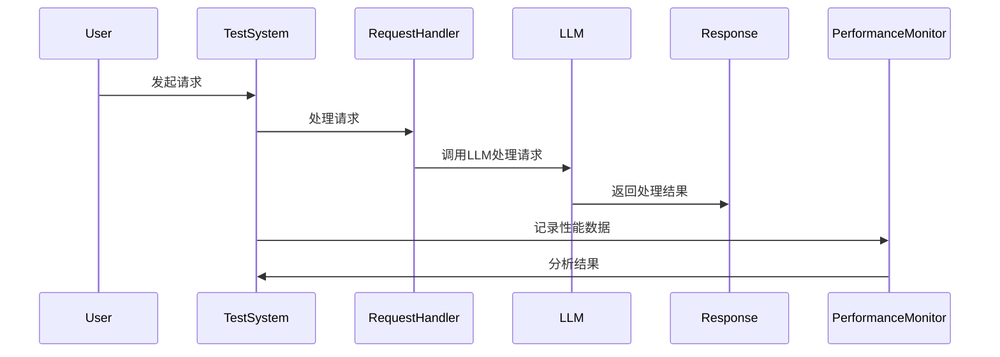
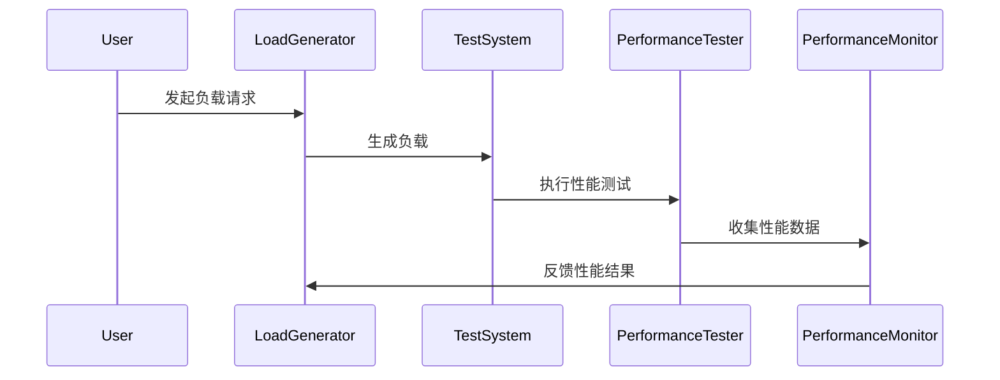

                 


# 敏捷中的性能测试：确保LLM应用在各种条件下的表现

> 关键词：敏捷开发、性能测试、语言模型、负载测试、性能优化

> 摘要：本文探讨了敏捷开发中的性能测试，重点分析了性能测试在确保大型语言模型（LLM）应用在各种条件下的表现。通过深入阐述性能测试的核心概念、算法原理、系统架构设计以及实战案例，本文为开发者和测试人员提供了一套完整的性能测试实践指南。

## 1. 背景介绍

### 1.1 性能测试在敏捷开发中的重要性

在敏捷开发中，性能测试扮演着至关重要的角色。随着软件系统变得越来越复杂，性能成为影响用户满意度、业务成功的关键因素。传统的瀑布式开发模式往往在项目后期才进行性能测试，可能导致性能问题在发布后才发现，进而影响系统的稳定性和用户体验。而敏捷开发提倡持续集成和持续交付，性能测试被融入到开发周期中，确保每次迭代交付的软件都具备良好的性能。

### 1.2 性能测试的需求背景和目标

性能测试的需求背景在于验证系统在高负载、多用户、异构环境等条件下是否能够稳定、高效地运行。具体目标包括：

- **可靠性**：确保系统在预期负载下能够稳定运行，不出现崩溃、数据丢失等问题。
- **性能**：评估系统的响应时间、吞吐量、并发处理能力等关键性能指标。
- **可扩展性**：验证系统在资源增加或减少时，是否能够自适应调整，保持性能稳定。

## 2. 核心概念与联系

### 2.1 敏捷开发与性能测试的对比

| 特点 | 敏捷开发 | 性能测试 |
| --- | --- | --- |
| 方法论 | 模块化、迭代、反馈 | 测试性、自动化、持续 |
| 目标 | 灵活响应需求变化 | 确保系统性能 |
| 强调 | 用户满意度 | 系统稳定性 |
| 过程 | 持续交付 | 持续集成 |

敏捷开发与性能测试的融合，可以使得性能测试更加贴近实际应用场景，及时发现并解决性能问题。

### 2.2 相关实体与关系

#### 2.2.1 ER实体关系图

```mermaid
erDiagram
    User ||--|{ Product } : uses
    Product ||--|{ TestCase } : includes
    TestCase ||--|{ PerformanceMetric } : measures
```

在敏捷性能测试中，用户、产品、测试用例和性能指标构成了主要的实体关系。用户使用产品，测试用例包含性能指标，用于衡量产品的性能。

## 3. 算法原理讲解

### 3.1 常用性能测试算法

#### 3.1.1 算法概述

性能测试常用的算法包括负载生成算法、响应时间分析算法、吞吐量分析算法等。这些算法旨在模拟真实用户行为，分析系统的性能表现。

#### 3.1.2 算法流程图


### 3.2 算法原理与示例

#### 3.2.1 算法原理

以负载生成算法为例，其基本原理是模拟多个用户同时对系统发起请求，以评估系统在高并发条件下的性能。

#### 3.2.2 数学模型和公式

负载生成算法的核心是确定每个用户的请求间隔时间。假设系统在理想状态下，每个用户请求的平均间隔时间为 $T$，则负载生成算法的目标是使得每个用户的请求时间间隔尽量接近 $T$。

$$
T = \frac{1}{\lambda}
$$

其中，$\lambda$ 是系统的平均请求率。

#### 3.2.3 算法示例

假设系统在理想状态下的平均请求率为 10 次/秒，使用负载生成算法模拟 100 个用户同时请求系统。

$$
T = \frac{1}{10} = 0.1 \text{秒}
$$

每个用户的请求时间间隔应在 0.1 秒附近波动。

## 4. 系统分析与架构设计方案

### 4.1 性能测试系统场景描述

#### 4.1.1 项目背景

本文针对一款大型语言模型（LLM）应用进行性能测试，以验证其在大规模用户访问和复杂请求条件下的性能表现。

#### 4.1.2 系统功能设计

系统功能设计包括以下模块：

- **用户管理模块**：负责用户的注册、登录、权限管理等。
- **请求处理模块**：负责接收用户请求，调用LLM进行处理。
- **性能测试模块**：负责生成负载、收集性能数据、分析结果。

### 4.2 系统架构设计

#### 4.2.1 系统架构图



### 4.3 系统接口设计

系统接口设计主要包括用户接口和性能测试接口。

#### 4.3.1 用户接口

- **登录接口**：用户登录系统。
- **请求接口**：用户发起请求。

#### 4.3.2 性能测试接口

- **负载生成接口**：生成模拟负载。
- **性能数据收集接口**：收集性能数据。

### 4.4 系统交互序列图



## 5. 项目实战

### 5.1 环境安装步骤

#### 5.1.1 安装前的准备

确保系统环境满足以下要求：

- 操作系统：Linux或Windows
- Python版本：3.8及以上
- 安装工具：pip、conda等

#### 5.1.2 安装过程

1. 安装Python环境。
2. 安装性能测试相关库：`pytest`、`locust`、`elasticsearch`等。
3. 配置系统环境。

### 5.2 系统核心实现

#### 5.2.1 源代码

以下为系统核心实现代码示例：

```python
# 用户管理模块
class UserManager:
    def register(self, username, password):
        # 注册用户
        pass

    def login(self, username, password):
        # 登录用户
        pass

# 请求处理模块
class RequestHandler:
    def handle_request(self, request):
        # 处理用户请求
        pass

# 性能测试模块
class PerformanceTester:
    def generate_load(self, num_users):
        # 生成负载
        pass

    def collect_performance_data(self):
        # 收集性能数据
        pass

# 主程序
if __name__ == "__main__":
    user_manager = UserManager()
    request_handler = RequestHandler()
    performance_tester = PerformanceTester()

    # 执行性能测试
    performance_tester.generate_load(100)
    performance_tester.collect_performance_data()
```

#### 5.2.2 代码应用解读

- **用户管理模块**：负责用户的注册和登录。
- **请求处理模块**：负责处理用户的请求。
- **性能测试模块**：负责生成负载和收集性能数据。

### 5.3 实际案例分析与讲解

#### 5.3.1 案例背景

假设有一款基于LLM的问答应用，需要测试其在大规模用户访问下的性能表现。

#### 5.3.2 案例分析

1. **负载生成**：模拟 100 个用户同时访问应用。
2. **性能数据收集**：记录每个用户的请求响应时间、吞吐量等。
3. **结果分析**：分析性能数据，找出可能的问题和瓶颈。

## 6. 最佳实践与总结

### 6.1 敏捷性能测试最佳实践

- **尽早开始**：在开发周期的早期就开始性能测试，以便及时发现问题。
- **持续监控**：持续收集和分析性能数据，及时发现潜在问题。
- **自动化**：使用自动化工具进行性能测试，提高测试效率。
- **合作**：开发、测试和运维团队紧密合作，共同优化系统性能。

### 6.2 小结与拓展

本文介绍了敏捷开发中的性能测试，从核心概念、算法原理到系统架构设计，再到实战案例分析，为开发者提供了全面的性能测试实践指南。在未来的工作中，应继续优化性能测试流程，提高系统性能，为用户提供更好的体验。

### 6.3 注意事项

- 性能测试应覆盖各种场景，包括正常、异常和极端条件。
- 性能测试结果应与业务目标紧密相关，确保测试的有效性。
- 性能优化应针对具体问题进行，避免过度优化。

### 6.4 拓展阅读推荐

- 《高性能MySQL》
- 《性能之巅》
- 《敏捷开发实践指南》

## 7. 作者信息

作者：AI天才研究院/AI Genius Institute & 禅与计算机程序设计艺术 /Zen And The Art of Computer Programming

