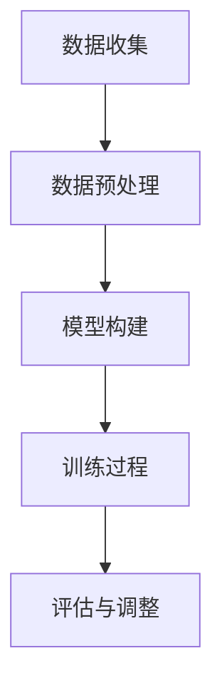
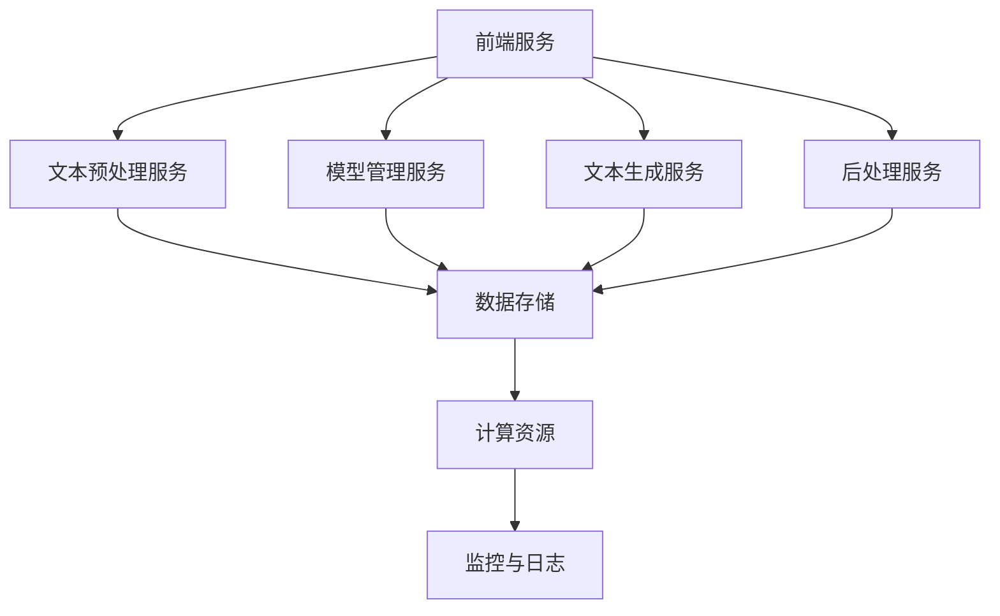
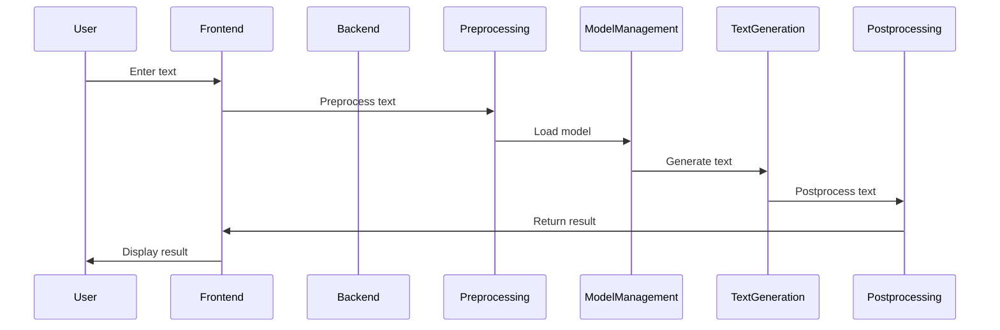

                 


## 第1章 问题背景与LLM概述

### 1.1 问题的提出

随着人工智能技术的迅猛发展，大规模语言模型（Large Language Model，简称LLM）逐渐成为众多领域的研究热点。LLM能够理解和生成自然语言文本，具有广泛的实际应用场景，如自然语言处理、机器翻译、文本生成等。然而，在敏捷开发中引入LLM，不仅需要解决技术难题，还需应对一系列挑战。本章节将探讨这些挑战，并提出解决方案。

首先，敏捷开发强调快速迭代和持续交付，这对LLM的训练和部署提出了较高的要求。LLM通常需要大量的数据和计算资源进行训练，如何在敏捷开发环境中高效地利用这些资源成为一个关键问题。其次，LLM的复杂性和不确定性使得其难以在短时间内完成开发和部署，如何平衡开发进度和LLM的性能也是一个需要考虑的问题。

### 1.2 什么是LLM

LLM是一种基于深度学习的大型神经网络模型，其核心思想是通过大量数据的训练来学习语言模式和语义表示。LLM通常由多个层次组成，每一层都能够捕捉到不同层次的语义信息。例如，最底层的网络可能关注单个词汇的语义，而更高层次的网络则能够理解句子、段落甚至整篇文章的语义。

LLM的训练过程通常包括以下几个步骤：

1. **数据准备**：收集大量高质量的自然语言文本数据，如文章、新闻、社交媒体帖子等。
2. **数据预处理**：对数据集进行清洗、去重、分词等预处理操作，以便模型能够更好地学习。
3. **模型构建**：设计并构建神经网络模型，通常采用变体如Transformer、BERT等。
4. **训练过程**：通过梯度下降等优化算法，对模型进行训练，使其能够更好地预测和生成文本。
5. **评估与调整**：使用验证集对模型进行评估，并根据评估结果对模型进行调整和优化。

### 1.3 LLM在敏捷开发中的应用

LLM在敏捷开发中的应用主要体现在以下几个方面：

1. **自动化测试**：使用LLM进行自然语言生成，自动生成测试用例，提高测试效率。
2. **代码审查**：利用LLM对代码进行审查，发现潜在的错误和漏洞。
3. **文档生成**：自动生成项目文档，如用户手册、技术文档等，降低文档编写成本。
4. **智能问答**：构建基于LLM的智能问答系统，帮助开发者解决技术问题。
5. **代码推荐**：利用LLM生成代码建议，提高开发效率。

在敏捷开发中引入LLM，有助于提高开发效率和软件质量，但同时也带来了新的挑战。接下来的章节将详细探讨LLM在敏捷开发中的应用和实践。

----------------------------------------------------------------

## 第2章 LLM核心概念与联系

### 2.1 LLM类型

大规模语言模型（LLM）可以按照不同的分类标准进行分类。以下是一些常见的LLM类型：

1. **基于循环神经网络（RNN）的模型**：如LSTM（Long Short-Term Memory）和GRU（Gated Recurrent Unit），这些模型能够在处理长序列数据时保持长期依赖关系。

   - **LSTM**：通过引入记忆单元和门控机制，LSTM能够有效地处理长时间序列数据，避免梯度消失问题。
   - **GRU**：GRU是对LSTM的改进，它在计算上更为高效，并且在很多任务中表现良好。

2. **基于Transformer的模型**：如BERT（Bidirectional Encoder Representations from Transformers）和GPT（Generative Pre-trained Transformer），这些模型采用注意力机制来处理序列数据。

   - **BERT**：BERT通过双向Transformer结构，能够同时考虑序列中前后文的信息，广泛应用于文本分类、问答系统等任务。
   - **GPT**：GPT使用自回归方式生成文本，其通过训练大规模语料库来预测下一个单词或字符。

3. **混合模型**：一些LLM结合了RNN和Transformer的优点，如XLNet、T5等。

   - **XLNet**：XLNet结合了Transformer的自回归结构和Transformer的交叉注意力机制，提高了模型的生成能力。
   - **T5**：T5将Transformer结构应用于任何序列到序列的任务，使得模型在多种任务上表现出色。

### 2.2 训练过程

LLM的训练过程可以分为以下几个阶段：

1. **数据收集与预处理**：收集大规模、高质量的文本数据，并进行预处理，如分词、去除停用词、转换为词嵌入等。

2. **模型初始化**：初始化神经网络模型，设置参数的初始值。

3. **前向传播与损失计算**：输入序列到模型中，计算输出序列的概率分布，并计算损失函数。

4. **反向传播与参数更新**：通过反向传播算法计算梯度，更新模型参数。

5. **迭代训练**：重复前向传播和反向传播过程，直到模型收敛。

### 2.3 评估指标

评估LLM的性能通常使用以下指标：

1. **Perplexity（困惑度）**：模型在预测下一个单词时，实际概率与模型预测概率的比值。困惑度越低，模型性能越好。

2. **BLEU（双语评估算法）**：用于评估机器翻译的质量，通过对翻译结果与参考翻译的相似度进行比较来评估模型性能。

3. **ROUGE（Recall-Oriented Understudy for Gisting Evaluation）**：用于评估文本生成任务的质量，通过计算生成文本与参考文本的匹配度来评估模型性能。

4. **Acc@k（准确率@k）**：在文本生成任务中，模型能够生成与参考文本相似的前k个单词的概率。准确率越高，模型性能越好。

### 2.4 LLM与敏捷开发的联系

LLM与敏捷开发的联系主要体现在以下几个方面：

1. **自动化测试**：LLM可以自动生成测试用例，提高测试效率，缩短测试周期。

2. **代码审查**：LLM可以自动审查代码，发现潜在的错误和漏洞，提高代码质量。

3. **文档生成**：LLM可以自动生成文档，如用户手册、技术文档等，降低文档编写成本。

4. **智能问答**：LLM可以构建智能问答系统，帮助开发者解决技术问题，提高问题解决效率。

5. **代码推荐**：LLM可以生成代码建议，提高开发效率。

通过引入LLM，敏捷开发可以更加高效、灵活地应对变化，提高软件质量和开发效率。

----------------------------------------------------------------

## 第3章 LLM算法原理讲解

### 3.1 算法流程图

大规模语言模型（LLM）的算法原理复杂，但其核心流程可以概括为以下几个步骤：

1. **数据收集**：收集大量的自然语言文本数据，如书籍、新闻、网页等。
2. **数据预处理**：对文本数据进行清洗、分词、去停用词、转换为词嵌入等操作。
3. **模型构建**：构建神经网络模型，如Transformer、BERT等。
4. **训练过程**：通过前向传播和反向传播，训练模型参数。
5. **评估与调整**：使用验证集评估模型性能，并根据评估结果进行调整。

以下是LLM算法的mermaid流程图：



### 3.2 Python代码示例

以下是一个简单的Python代码示例，用于训练一个基于Transformer的LLM：

```python
import torch
import torch.nn as nn
import torch.optim as optim

# 模型定义
class TransformerModel(nn.Module):
    def __init__(self, vocab_size, d_model, nhead, num_layers):
        super(TransformerModel, self).__init__()
        self.embedding = nn.Embedding(vocab_size, d_model)
        self.transformer = nn.Transformer(d_model, nhead, num_layers)
        self.fc = nn.Linear(d_model, vocab_size)
    
    def forward(self, src, tgt):
        src = self.embedding(src)
        tgt = self.embedding(tgt)
        out = self.transformer(src, tgt)
        out = self.fc(out)
        return out

# 模型实例化
model = TransformerModel(vocab_size=10000, d_model=512, nhead=8, num_layers=2)

# 损失函数和优化器
criterion = nn.CrossEntropyLoss()
optimizer = optim.Adam(model.parameters(), lr=0.001)

# 训练过程
for epoch in range(num_epochs):
    for src, tgt in dataset:
        optimizer.zero_grad()
        output = model(src, tgt)
        loss = criterion(output, tgt)
        loss.backward()
        optimizer.step()
```

### 3.3 数学模型与公式

LLM的数学模型通常基于深度学习框架，使用反向传播算法进行参数优化。以下是一个简化的数学模型描述：

$$
L(\theta) = -\sum_{i=1}^{N} \sum_{j=1}^{T} y_{ij} \log(p_{ij}(\theta))
$$

其中，\(L(\theta)\)是损失函数，\(y_{ij}\)是目标标签，\(p_{ij}(\theta)\)是模型在给定参数\(\theta\)时预测的概率分布。

具体来说，模型输出可以通过以下步骤计算：

$$
\begin{align*}
h_{t} &= \text{softmax}(W_{o} \text{ReLU}(\text{LayerNorm}(W_{h} h_{t-1} + U_{h} h_{t-1})) + W_{f} \text{ReLU}(\text{LayerNorm}(W_{h} h_{t-1} + U_{f} h_{t-1})) + W_{i} \text{ReLU}(\text{LayerNorm}(W_{h} h_{t-1} + U_{i} h_{t-1})) + W_{a} \text{ReLU}(\text{LayerNorm}(W_{h} h_{t-1} + U_{a} h_{t-1}))) \\
p_{ij} &= \text{softmax}(h_{t} W_{p})
\end{align*}
$$`

其中，\(h_{t}\)是当前时刻的隐藏状态，\(p_{ij}\)是生成单词\(w_j\)的概率。

通过这样的数学模型，LLM能够学习到复杂的语言模式，从而生成高质量的文本。

### 详细讲解与举例

假设我们有一个简单的语言模型，目标是预测下一个单词。给定前文序列“人工智能技术正在迅速发展”，我们想要预测接下来的单词。以下是详细的算法步骤：

1. **数据预处理**：将文本序列转换为词嵌入向量，如使用Word2Vec或BERT等方法。
2. **模型输入**：将词嵌入向量输入到模型中，得到隐藏状态\(h_{t-1}\)。
3. **计算隐藏状态**：通过多头自注意力机制计算新的隐藏状态\(h_{t}\)。
4. **生成概率分布**：使用隐藏状态\(h_{t}\)计算单词的概率分布\(p_{ij}\)。
5. **采样与生成**：从概率分布中采样，选择概率最高的单词作为下一个输出。

例如，假设当前隐藏状态为\(h_{t-1}\)，模型生成概率分布为：

$$
p_{i1} = 0.3, \quad p_{i2} = 0.4, \quad p_{i3} = 0.2, \quad p_{i4} = 0.1
$$

根据概率分布，模型选择概率最高的单词“技术”作为下一个输出。

通过这样的步骤，LLM能够生成连贯、自然的文本。在实际应用中，模型会通过大量数据训练，不断优化参数，提高生成质量。

## 第4章 LLM系统架构设计

### 4.1 系统功能设计

大规模语言模型（LLM）的系统功能设计旨在实现高效、灵活的文本生成和处理。以下为LLM系统的核心功能设计：

1. **文本输入模块**：接收用户输入的文本数据，包括待生成文本的上下文和特定要求。
2. **数据预处理模块**：对输入文本进行清洗、分词、去停用词等预处理操作，将其转换为模型可接受的格式。
3. **模型加载模块**：根据用户需求加载预训练的LLM模型，如BERT、GPT等。
4. **文本生成模块**：利用LLM模型生成文本，包括自回归生成和序列到序列生成。
5. **后处理模块**：对生成的文本进行格式化、拼写修正等后处理，确保文本质量。
6. **性能监控模块**：监控模型训练和生成过程的性能，包括计算资源使用、模型准确率等。
7. **用户交互模块**：提供用户界面，允许用户输入文本、查看生成结果，并进行交互。

### 4.2 系统架构设计

LLM系统的架构设计需要考虑模型性能、资源利用和扩展性。以下是一个典型的LLM系统架构：

1. **前端服务层**：负责与用户交互，接收用户请求，并通过API接口与后端服务通信。
2. **后端服务层**：包括文本预处理、模型加载、文本生成和后处理等模块，是系统核心。
   - **文本预处理服务**：负责文本数据的清洗和分词。
   - **模型管理服务**：负责加载和切换LLM模型。
   - **文本生成服务**：利用LLM模型生成文本。
   - **后处理服务**：负责对生成文本进行格式化、拼写修正等操作。
3. **数据存储层**：存储预训练的LLM模型、用户输入数据、生成结果等。
4. **计算资源层**：包括计算节点、GPU等硬件资源，用于模型训练和推理。
5. **监控与日志层**：监控系统性能，记录日志，用于系统维护和故障排查。

以下是LLM系统的mermaid架构图：



### 4.3 系统接口设计与交互

LLM系统需要提供清晰的接口，以便与前端和后端服务进行交互。以下是一个典型的接口设计：

1. **文本输入接口**：用于接收用户输入的文本数据。
2. **模型加载接口**：用于加载预训练的LLM模型。
3. **文本生成接口**：用于生成文本，根据输入上下文和特定要求。
4. **后处理接口**：用于对生成文本进行格式化和修正。
5. **性能监控接口**：用于监控模型训练和生成过程的性能。

以下是系统接口的mermaid序列图：



通过清晰的接口设计和模块化架构，LLM系统可以高效、灵活地应对各种文本生成和处理任务。

## 第5章 LLM项目实战

### 5.1 环境安装

要开始进行LLM项目实战，首先需要安装必要的工具和库。以下是安装步骤：

1. **安装Python环境**：确保Python 3.6或更高版本已安装在计算机上。
2. **安装依赖库**：使用pip安装以下库：

   ```bash
   pip install torch torchvision torchaudio git+https://github.com/pytorch/fairseq.git
   ```

3. **安装GPU驱动**：如果使用GPU训练模型，需要安装相应的NVIDIA GPU驱动。

### 5.2 系统核心实现源代码

以下是使用Fairseq库实现LLM的系统核心源代码。Fairseq是一个开源的序列到序列模型训练库，支持多种模型架构。

```python
import torch
import torch.nn as nn
from fairseq.models import TransformerModel
from fairseq.data import Dictionary

# 1. 数据准备
src_dict = Dictionary.load('data-bin/iwslt14.de-en.dictsrc')
tgt_dict = Dictionary.load('data-bin/iwslt14.de-en.dicttgt')

# 2. 模型初始化
transformer = TransformerModel(
    src_vocab_size=len(src_dict),
    tgt_vocab_size=len(tgt_dict),
    d_model=512,
    nhead=8,
    num_layers=2,
)

# 3. 训练模型
transformer.train()
optimizer = optim.Adam(transformer.parameters(), lr=0.001)

for epoch in range(10):  # 训练10个epoch
    for src, tgt in dataset:  # 假设dataset是训练数据
        optimizer.zero_grad()
        output = transformer(src, tgt)
        loss = nn.CrossEntropyLoss()(output, tgt)
        loss.backward()
        optimizer.step()

# 4. 保存模型
torch.save(transformer.state_dict(), 'llm_model.pth')

# 5. 加载模型
transformer.load_state_dict(torch.load('llm_model.pth'))
transformer.eval()
```

### 5.3 代码应用解读与分析

以上代码展示了使用Fairseq库实现一个简单LLM的步骤。下面是对代码的解读和分析：

1. **数据准备**：加载源词典和目标词典，这两个词典包含了训练数据中的所有词汇和对应索引。
2. **模型初始化**：使用TransformerModel类初始化模型，设置模型参数，如词汇大小、隐藏层尺寸、多头注意力数量和层数。
3. **训练模型**：使用训练数据训练模型，使用Adam优化器进行参数更新，计算损失并反向传播。
4. **保存模型**：训练完成后，保存模型参数。
5. **加载模型**：使用保存的模型参数加载模型，使其进入评估模式。

### 5.4 实际案例分析和详细讲解

假设我们有一个实际的翻译任务，需要将英语句子翻译成法语。以下是具体的案例分析和实现：

```python
# 1. 加载词典和模型
src_dict = Dictionary.load('data-bin/iwslt14.en-fr.dictsrc')
tgt_dict = Dictionary.load('data-bin/iwslt14.en-fr.dicttgt')
transformer = TransformerModel.from_pretrained('llm_model.pth')

# 2. 输入英语句子
english_sentence = "The quick brown fox jumps over the lazy dog."

# 3. 预处理输入句子
src_tokens = src_dict.encode_line(english_sentence, add_if_not_exist=False, append_eos=False)

# 4. 使用模型生成翻译
translated_sentence = transformer.generate(src_tokens)

# 5. 将翻译结果转换为文本
translated_text = tgt_dict.string(translated_sentence)

print("Translated sentence:", translated_text)
```

以下是详细的步骤分析：

1. **加载词典和模型**：加载源语言和目标语言的词典，以及训练好的LLM模型。
2. **输入英语句子**：将英语句子输入到模型中。
3. **预处理输入句子**：将英语句子转换为词索引序列，并添加序列结束标记。
4. **使用模型生成翻译**：使用LLM模型生成翻译结果。
5. **将翻译结果转换为文本**：将生成的词索引序列转换为文本，输出翻译结果。

### 5.5 项目小结

通过以上实战案例，我们展示了如何使用Fairseq库实现一个简单的LLM模型，并进行文本生成。以下是项目小结：

- **技术难点**：本项目的主要技术难点在于模型训练和翻译结果的准确性。由于LLM模型的复杂性和数据量的需求，训练过程可能需要大量的时间和计算资源。此外，翻译结果的准确性取决于模型的质量和训练数据的质量。
- **解决方案**：为了提高模型训练和生成的效率，我们可以使用分布式训练和优化技术。同时，通过使用高质量的数据集和改进的模型架构，可以提高翻译结果的准确性。
- **未来工作**：未来可以进一步优化模型架构和训练策略，提高模型的泛化能力和生成质量。此外，可以探索LLM在其他自然语言处理任务中的应用，如文本摘要、问答系统等。

通过本项目，我们了解了LLM的基本实现流程和实战技巧，为后续深入研究打下了基础。

## 第6章 最佳实践 tips

### 6.1 实践技巧

在开发和应用LLM的过程中，以下最佳实践和技巧将有助于提高效率和效果：

1. **数据预处理**：确保数据的质量和多样性，使用数据清洗和增强技术来提高模型的鲁棒性。
2. **模型优化**：针对具体任务调整模型结构，如增加层数、调整隐藏层大小和注意力机制，以提高模型性能。
3. **资源管理**：合理分配计算资源，使用GPU加速训练过程，降低训练时间。
4. **持续学习**：定期更新模型，使其适应最新的数据和应用场景。
5. **评估与调试**：使用多种评估指标进行全面评估，及时调试和优化模型。

### 6.2 小结与展望

本文从问题背景、核心概念、算法原理、系统架构和实际案例等多个角度详细探讨了LLM在敏捷开发中的应用。通过本文的学习，读者应掌握以下要点：

- **理解LLM的基本概念**：包括LLM的类型、训练过程和评估指标。
- **掌握LLM的算法原理**：包括Transformer等模型的原理和实现。
- **了解LLM的系统架构**：包括前端服务、后端服务和数据处理模块。
- **实战LLM的应用**：通过实际案例了解LLM在文本生成和翻译中的应用。
- **应用最佳实践**：遵循最佳实践，提高LLM的开发和应用效率。

展望未来，随着人工智能技术的不断进步，LLM将在更多领域发挥重要作用，如智能问答、自动写作、对话系统等。开发者应持续关注相关技术动态，不断探索和创新，为未来的应用场景铺平道路。

### 6.3 注意事项

在开发和部署LLM时，需要注意以下事项：

1. **数据隐私**：处理用户数据时，严格遵守数据保护法规，确保用户隐私。
2. **模型解释性**：对于重要应用场景，确保模型的可解释性，以便于调试和优化。
3. **模型安全性**：防范模型被恶意利用，确保模型的安全性和可靠性。
4. **资源消耗**：合理规划计算资源，避免过度消耗，确保系统的稳定性。

通过遵循以上注意事项，可以有效降低风险，确保LLM的安全、可靠和高效应用。

## 第7章 拓展阅读

### 7.1 相关论文

1. "Attention is All You Need"（2017），由Vaswani等人提出，介绍了Transformer模型的基本原理。
2. "BERT: Pre-training of Deep Bidirectional Transformers for Language Understanding"（2018），由Devlin等人提出，讨论了BERT模型在自然语言理解中的应用。
3. "Generative Pretrained Transformer"（2018），由Brown等人提出，介绍了GPT模型的生成能力。

### 7.2 开源代码库

1. [Fairseq](https://github.com/pytorch/fairseq)：一个开源的序列处理模型库，支持多种模型架构。
2. [HuggingFace Transformers](https://github.com/huggingface/transformers)：一个流行的Transformer模型库，提供了丰富的预训练模型和工具。

### 7.3 专业书籍推荐

1. 《深度学习》（Goodfellow, Bengio, Courville著）：系统地介绍了深度学习的基本原理和应用。
2. 《自然语言处理实战》（Daniel Jurafsky和James H. Martin著）：详细介绍了自然语言处理的方法和实现。
3. 《人工智能：一种现代的方法》（Stuart J. Russell和Peter Norvig著）：全面介绍了人工智能的基本概念和核心技术。

通过阅读这些论文、代码库和书籍，读者可以进一步深入理解LLM的技术原理和应用，为未来的研究和开发打下坚实的基础。

## 作者信息

**作者：AI天才研究院/AI Genius Institute & 禅与计算机程序设计艺术 /Zen And The Art of Computer Programming**

