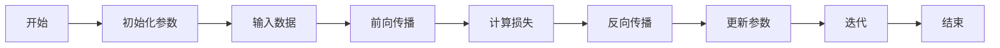
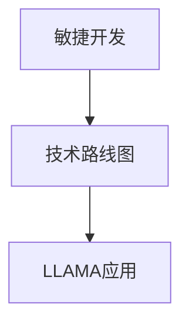
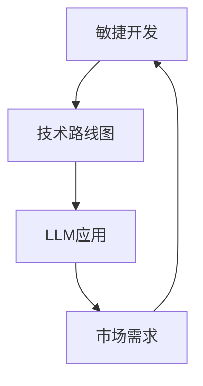
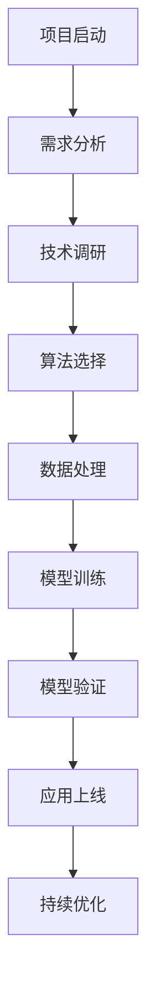
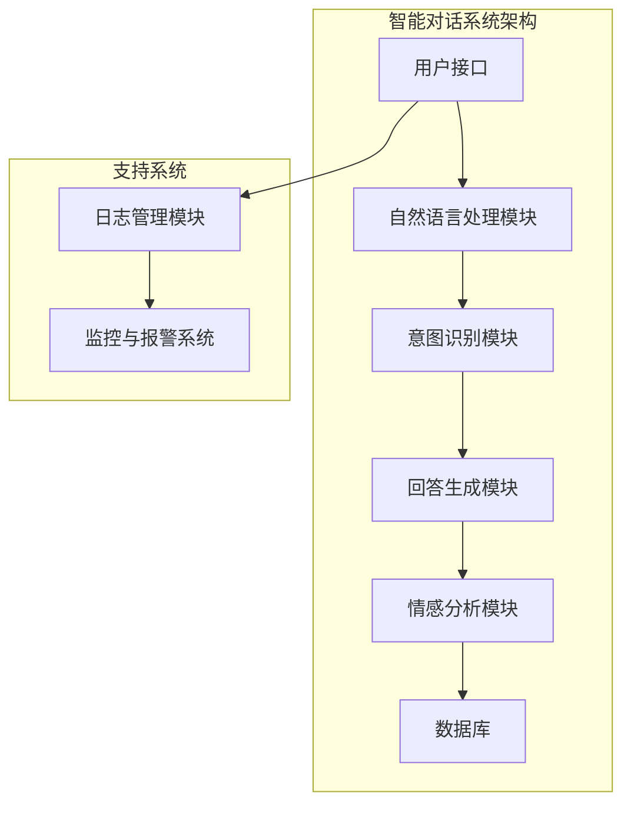
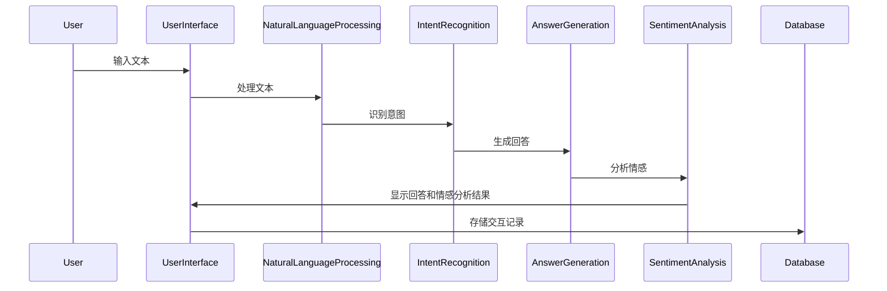
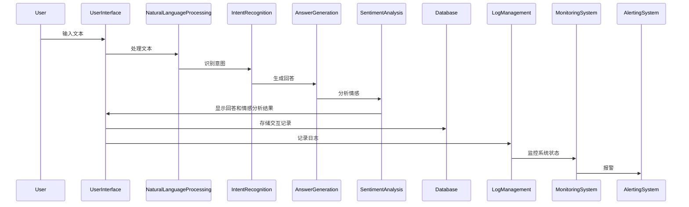

                 

### # 敏捷中的技术路线图：规划LLM应用的长期发展

> 关键词：敏捷开发、技术路线图、LLM应用、长期发展、规划

> 摘要：本文探讨了在敏捷开发框架下，如何通过技术路线图来规划大型语言模型（LLM）应用的长期发展。通过分析敏捷开发的基本概念、技术路线图的核心概念以及LLM应用的特点，文章提出了一套系统的技术路线图设计原则和实施方法，并深入讲解了算法原理及数学模型。同时，文章结合实际项目，展示了如何将理论应用于实践，为LLM应用的持续发展提供了切实可行的指导和参考。

### 目录大纲

```markdown
----------------------------------------------------------------
# 第一部分: 背景介绍

## 1.1 问题背景
### 1.1.1 现状与挑战
### 1.1.2 敏捷开发的重要性
### 1.1.3 技术路线图的作用

## 1.2 问题描述
### 1.2.1 LLAMA应用面临的问题
### 1.2.2 长期发展的必要性
### 1.2.3 技术与业务需求的关系

## 1.3 问题解决
### 1.3.1 敏捷开发的理论基础
### 1.3.2 技术路线图的设计原则
### 1.3.3 LLAMA应用的技术路线图构建方法

## 1.4 边界与外延
### 1.4.1 范围界定
### 1.4.2 技术路线图的影响因素
### 1.4.3 技术路线图的实施与评估

## 1.5 概念结构与核心要素组成
### 1.5.1 关键概念解析
### 1.5.2 核心要素关系图
### 1.5.3 技术路线图的关键组成部分

## 1.6 本章小结

----------------------------------------------------------------

# 第二部分: 核心概念与原理

## 2.1 敏捷开发基本概念
### 2.1.1 敏捷开发的起源与发展
### 2.1.2 敏捷开发的核心理念
### 2.1.3 敏捷开发与传统开发方法的区别

## 2.2 技术路线图核心概念
### 2.2.1 技术路线图定义
### 2.2.2 技术路线图的作用
### 2.2.3 技术路线图的类型

## 2.3 LLAMA应用技术路线图解析
### 2.3.1 LLAMA应用概述
### 2.3.2 LLAMA技术路线图设计

## 2.4 敏捷开发与技术路线图的联系
### 2.4.1 敏捷开发在技术路线图中的应用
### 2.4.2 技术路线图对敏捷开发的支持
### 2.4.3 敏捷开发与LLAMA技术路线图的互动

## 2.5 概念属性特征对比表格
| 特征 | 敏捷开发 | 技术路线图 | LLAMA应用 |
| --- | --- | --- | --- |

## 2.6 ER实体关系图架构
```mermaid
erDiagram
    User ..|> Project : "发起"
    Project ..|> Task : "包含"
    Task ..|> User : "分配给"
```

## 2.7 本章小结

----------------------------------------------------------------

# 第三部分: 算法原理讲解

## 3.1 算法概述
### 3.1.1 LLAMA算法基本概念
### 3.1.2 LLAMA算法的作用
### 3.1.3 LLAMA算法的核心部分

## 3.2 算法原理
### 3.2.1 算法数学模型
$$
X_{\text{new}} = W \cdot X_{\text{old}} + b
$$
### 3.2.2 算法流程


## 3.3 Python源代码讲解
```python
# Python源代码示例
def forward(x, W, b):
    return W.dot(x) + b
```

## 3.4 举例说明
### 3.4.1 算法举例
### 3.4.2 代码运行结果分析

## 3.5 本章小结

----------------------------------------------------------------

# 第四部分: 数学模型和公式讲解

## 4.1 数学模型概述
### 4.1.1 数学模型在LLAMA应用中的重要性
### 4.1.2 数学模型的基本概念
### 4.1.3 数学模型与算法的关系

## 4.2 主要数学公式讲解
$$
L(\theta; x, y) = -\frac{1}{m} \sum_{i=1}^{m} [y \log(a_{i,y}) + (1 - y) \log(1 - a_{i,y})]
$$

----------------------------------------------------------------

### 第一部分: 背景介绍

#### 1.1 问题背景

在当前快速变化的技术环境中，大型语言模型（LLM）的应用已经成为企业和组织提高效率、创新业务模式的重要工具。然而，随着LLM应用的复杂性和规模不断扩大，如何确保这些应用的长期稳定发展，成为了一个亟待解决的问题。

**现状与挑战**

首先，LLM应用面临着技术更新迅速、需求变更频繁的现状。传统的开发方法往往难以应对这种快速变化，导致项目进度延误、成本超支。其次，LLM应用在设计和实施过程中需要考虑大量的技术细节，如算法选择、数据处理、模型训练等，这些都需要持续的技术投入和经验积累。此外，业务需求和市场变化也对LLM应用提出了更高的要求，要求其具备灵活性和可扩展性。

**敏捷开发的重要性**

敏捷开发是一种以人为核心、迭代、渐进的方法论，它强调快速响应变化、持续交付价值。敏捷开发的核心理念包括客户满意、团队合作、响应变化、持续交付等。通过敏捷开发，企业可以更好地适应市场需求，快速迭代产品，提高开发效率。

敏捷开发的重要性体现在以下几个方面：

1. **快速响应变化**：敏捷开发强调需求的变化和客户反馈，能够快速响应并调整，确保项目始终符合市场需求。
2. **持续交付价值**：通过持续的迭代和交付，可以逐步实现产品功能，提高客户满意度。
3. **增强团队协作**：敏捷开发鼓励团队成员间的紧密合作，共同解决问题，提高整体效率。
4. **降低风险**：通过小步快跑的方式，降低项目风险，确保项目能够成功交付。

**技术路线图的作用**

技术路线图是一种用于规划和指导技术发展的可视化工具。它能够帮助团队明确技术方向、规划资源投入、评估技术风险等。在LLM应用中，技术路线图的作用主要体现在以下几个方面：

1. **明确技术方向**：通过技术路线图，可以明确LLM应用的技术发展路径，确保开发工作有序进行。
2. **规划资源投入**：技术路线图可以帮助团队合理规划资源，确保在关键时期有足够的资源支持。
3. **评估技术风险**：技术路线图可以提前识别潜在的技术风险，采取预防措施，降低项目风险。

#### 1.2 问题描述

**LLAMA应用面临的问题**

LLAMA是一种大型语言模型，其在自然语言处理、智能对话系统、内容生成等领域具有广泛的应用前景。然而，在LLAMA应用的发展过程中，仍然面临以下问题：

1. **技术挑战**：LLAMA应用涉及大量的技术细节，如算法选择、数据处理、模型训练等，需要不断进行技术优化和迭代。
2. **资源限制**：LLAMA应用需要大量的计算资源和存储资源，如何高效利用这些资源是一个重要的挑战。
3. **市场需求**：随着市场的不断变化，LLAMA应用需要能够快速适应，提供多样化的功能和服务。

**长期发展的必要性**

LLAMA应用的发展不仅需要短期的技术突破，更需要长期的规划和持续投入。长期发展的必要性体现在以下几个方面：

1. **技术积累**：通过长期的研发和技术积累，可以不断提高LLAMA应用的技术水平，保持竞争优势。
2. **市场适应**：随着市场的变化，LLAMA应用需要不断调整和优化，以适应新的市场需求。
3. **资源保障**：长期的资源投入可以确保LLAMA应用在关键时期有足够的支持，避免技术中断。

**技术与业务需求的关系**

技术与业务需求是相互促进、相互制约的关系。在LLAMA应用中，技术需要支持业务需求，同时业务需求也影响着技术发展方向。具体来说：

1. **技术支持业务需求**：LLAMA应用的技术发展需要紧密围绕业务需求，确保技术能够满足业务需求。
2. **业务影响技术发展**：随着业务的发展和市场变化，LLAMA应用的技术也需要不断调整和优化，以适应新的业务需求。

#### 1.3 问题解决

**敏捷开发的理论基础**

敏捷开发是一种以人为核心、迭代、渐进的方法论。其理论基础包括以下几个方面：

1. **迭代开发**：敏捷开发强调迭代开发，通过不断迭代和交付，逐步实现产品功能。
2. **用户反馈**：敏捷开发强调用户反馈，通过用户反馈来指导开发工作，确保产品能够满足用户需求。
3. **团队合作**：敏捷开发强调团队合作，鼓励团队成员之间的紧密合作，共同解决问题。

**技术路线图的设计原则**

技术路线图的设计需要遵循以下原则：

1. **明确目标**：技术路线图需要明确目标，确保技术发展方向与业务目标一致。
2. **可行性**：技术路线图需要考虑技术可行性，确保所规划的技术方案能够在实际中实现。
3. **灵活性**：技术路线图需要具有一定的灵活性，能够根据实际情况进行调整和优化。
4. **可持续性**：技术路线图需要考虑长期发展，确保技术能够持续发展。

**LLAMA应用的技术路线图构建方法**

LLAMA应用的技术路线图构建方法包括以下步骤：

1. **需求分析**：对LLAMA应用的业务需求进行详细分析，明确技术需求。
2. **技术调研**：对相关技术进行调研，了解技术发展趋势和可行性。
3. **路线图设计**：根据需求分析和技术调研的结果，设计技术路线图。
4. **评估与优化**：对技术路线图进行评估和优化，确保其能够满足业务需求。

#### 1.4 边界与外延

**范围界定**

技术路线图的边界需要明确界定，包括技术范围、业务范围和时间范围。具体来说：

1. **技术范围**：技术路线图需要明确所涉及的技术领域和技术细节。
2. **业务范围**：技术路线图需要明确所支持的业务功能和服务。
3. **时间范围**：技术路线图需要明确所规划的时间周期，包括短期和长期目标。

**技术路线图的影响因素**

技术路线图的影响因素包括以下几个方面：

1. **市场需求**：市场需求的变化会影响技术路线图的规划，需要及时调整。
2. **技术发展**：技术发展速度会影响技术路线图的实施，需要根据实际情况进行调整。
3. **资源限制**：资源限制会影响技术路线图的实施，需要合理规划资源投入。

**技术路线图的实施与评估**

技术路线图的实施包括以下步骤：

1. **资源规划**：根据技术路线图的需求，进行资源规划，包括人员、设备和资金等。
2. **任务分配**：根据技术路线图的任务，进行任务分配，确保任务能够按时完成。
3. **监控与评估**：对技术路线图的实施进行监控和评估，确保技术路线图能够按照计划进行。

**概念结构与核心要素组成**

**关键概念解析**

1. **敏捷开发**：敏捷开发是一种以人为核心、迭代、渐进的方法论。
2. **技术路线图**：技术路线图是一种用于规划和指导技术发展的可视化工具。
3. **LLAMA应用**：LLAMA是一种大型语言模型，其在自然语言处理、智能对话系统、内容生成等领域具有广泛的应用前景。

**核心要素关系图**



**技术路线图的关键组成部分**

1. **需求分析**：明确LLAMA应用的业务需求和技术需求。
2. **技术调研**：了解相关技术发展趋势和可行性。
3. **路线图设计**：设计技术路线图，明确技术发展方向和实施步骤。
4. **评估与优化**：对技术路线图进行评估和优化，确保其能够满足业务需求。

#### 1.5 概念结构与核心要素组成

**关键概念解析**

在讨论LLM应用的长期发展过程中，理解几个关键概念是非常重要的。首先，我们需要明确“敏捷开发”和“技术路线图”的含义，以及它们在LLM应用发展中的具体作用。

1. **敏捷开发**：敏捷开发是一种以用户需求为核心的软件开发方法。它强调快速迭代、持续交付、团队协作和灵活响应变化。敏捷开发通过短周期的迭代和频繁的交付，使团队能够快速适应市场需求的变化，同时确保客户满意度。

   - **敏捷开发的起源与发展**：敏捷开发起源于2001年，由一群软件开发专家在滑雪度假地制定了一系列宣言和原则，即《敏捷宣言》。自那时以来，敏捷开发方法不断发展，形成了多种敏捷实践框架，如Scrum、Kanban等。

   - **敏捷开发的核心理念**：核心理念包括个体和互动重于过程和工具、可工作的软件重于详尽的文档、客户合作重于合同谈判、响应变化重于遵循计划。

   - **敏捷开发与传统开发方法的区别**：传统开发方法如瀑布模型，强调顺序执行各个阶段，而敏捷开发则强调并行工作、快速迭代和持续交付。

2. **技术路线图**：技术路线图是一种战略工具，用于规划和指导技术项目的长期发展。它将技术需求、资源和时间框架结合起来，形成一个清晰的路线图。

   - **技术路线图定义**：技术路线图是一种用于描述技术项目从起点到终点的计划，包括关键里程碑、阶段性目标和所需资源。

   - **技术路线图的作用**：技术路线图可以帮助团队和管理层了解项目的发展方向、资源配置和时间表，确保项目按计划进行，并能够应对技术变化和业务需求。

   - **技术路线图的类型**：技术路线图可以按时间框架分为短期路线图和长期路线图；按内容分为技术路线图、产品路线图等。

3. **LLM应用**：LLM（Large Language Model）应用是指基于大型语言模型构建的应用，如自然语言处理、智能对话系统、内容生成等。

   - **LLM应用概述**：LLM应用在当前人工智能领域具有重要地位，能够处理大量文本数据，实现自动化内容生成、对话交互等高级功能。

   - **LLM技术路线图设计**：设计LLM技术路线图需要综合考虑算法、数据处理、模型训练、应用优化等多个方面，确保技术路线图的可行性、灵活性和可持续性。

**核心要素关系图**

为了更好地理解这些概念之间的关系，我们可以通过一个核心要素关系图来表示它们之间的联系。



在这个图中，敏捷开发和LLM应用是相互作用的。敏捷开发通过迭代和用户反馈指导技术路线图的制定，而技术路线图则确保LLM应用能够满足市场需求并实现长期发展。市场需求又反过来影响敏捷开发和技术路线图，形成一个动态的循环。

**技术路线图的关键组成部分**

技术路线图由几个关键组成部分构成，这些部分共同作用，确保技术项目的成功实施和长期发展。

1. **需求分析**：这是技术路线图的基础，包括对LLM应用的业务需求和技术需求进行详细分析。需求分析的结果将直接影响技术路线图的制定。

2. **技术调研**：在明确需求后，进行技术调研，了解当前技术的最新发展、潜在的技术解决方案以及技术风险。技术调研的结果将帮助团队制定可行的技术方案。

3. **路线图设计**：根据需求分析和技术调研的结果，设计技术路线图。这个阶段需要明确项目的里程碑、阶段性目标和所需资源。

4. **评估与优化**：在技术路线图实施过程中，定期进行评估和优化。评估的目的是确保项目按计划进行，并能够及时调整以应对变化。优化则包括改进技术方案、优化资源配置等。

通过这些关键组成部分，技术路线图不仅能够提供清晰的方向和计划，还能够帮助团队在实施过程中保持灵活性和适应性。

#### 1.6 本章小结

本章通过对敏捷开发、技术路线图和LLM应用的基本概念进行了详细介绍，分析了当前LLM应用面临的问题和挑战，以及敏捷开发和技术路线图在这些问题解决中的作用。同时，本章还阐述了技术路线图的设计原则和构建方法，并明确了关键概念之间的关系和核心要素组成。通过本章的学习，读者可以初步了解如何利用敏捷开发和技术路线图来规划LLM应用的长期发展，为后续章节的深入探讨奠定了基础。

---

### 第二部分：核心概念与原理

#### 2.1 敏捷开发基本概念

**2.1.1 敏捷开发的起源与发展**

敏捷开发（Agile Development）起源于20世纪90年代，最初由软件开发团队为了应对传统开发方法（如瀑布模型）的种种不足而提出。2001年，17位软件开发专家在犹他州的雪山滑雪度假胜地召开了第一次敏捷开发会议，并共同签署了《敏捷宣言》（The Agile Manifesto）。这份宣言强调了个体和互动的重要性、可工作的软件的重要性、客户协作的重要性以及响应变化的重要性。

自《敏捷宣言》发布以来，敏捷开发方法论迅速发展，并形成了多种敏捷实践框架，如Scrum、Kanban、XP（极限编程）、Crystal Methods等。每种框架都根据不同的项目需求和团队特性，提供了不同的实践方法和工具，但核心原则保持一致。

**2.1.2 敏捷开发的核心理念**

敏捷开发的核心理念可以概括为以下四个价值观和十二项原则：

**价值观**：

1. **个体和互动重于过程和工具**：注重团队成员之间的沟通和协作，而不是依赖特定的工具或流程。
2. **可工作的软件重于详尽的文档**：软件的实际运行效果比复杂的文档更为重要。
3. **客户合作重于合同谈判**：与客户的紧密合作有助于更准确地理解需求，并快速调整以满足变化。
4. **响应变化重于遵循计划**：在项目执行过程中，灵活应对变化比坚持原有计划更为重要。

**原则**：

1. **最优先做且做完最具价值的特性**：识别并优先完成对用户最有价值的特性。
2. **欢迎需求变更——即使是在开发的晚期也能积极应对**：在开发过程中，用户需求可能会发生变化，敏捷团队应当积极应对。
3. **频繁交付可工作的软件， preferably with a cadence，诸如每月**：通过短周期的迭代和交付，确保团队能够持续交付有价值的软件。
4. **在团队内部建立近期的项目计划，留出时间进行迭代**：通过迭代的方式，团队能够更灵活地调整计划和目标。
5. **持续关注技术卓越和良好设计，以增强敏捷能力**：技术卓越和良好的设计能够提高团队的敏捷性。
6. **简单性——使未完成工作尽可能简单**：避免过度设计，只实现必需的功能。
7. **人员与互动重于工具与过程**：人是项目成功的关键，强调团队协作和沟通。
8. **可持续开发——可持续的开发既是对团队也是对用户**：团队应当保持稳定的工作节奏，避免过度加班。
9. **保持工作的可见性，使用简单的度量**：通过可视化的方式展示工作进展，使用简单的度量来评估进度。
10. **鼓励团队自主管理**：团队应当有足够的自主权来管理自己的工作和进度。
11. **定期反思如何可以做得更好然后依此行动**：通过反思和改进，不断提高团队的工作效率。
12. **最优秀的团队通过面对面的交流来开展工作**：面对面的交流是最有效的沟通方式。

**2.1.3 敏捷开发与传统开发方法的区别**

传统开发方法，如瀑布模型，强调在项目初期制定详细的需求和计划，然后按照预定的流程逐步执行。这种方法在项目开始时就明确了所有需求和计划，希望以此减少项目风险和变更。然而，随着技术的快速发展和市场需求的不断变化，这种方法往往难以应对变化。

敏捷开发与传统开发方法的主要区别在于：

1. **迭代与增量**：敏捷开发强调迭代和增量开发，通过短周期的迭代逐步交付有价值的软件，而不是一次性完成所有功能。
2. **用户参与**：敏捷开发强调用户参与和反馈，确保软件能够满足用户需求，并能够快速响应变化。
3. **灵活性**：敏捷开发方法具有更高的灵活性，能够更好地适应变化，而传统开发方法则更倾向于遵循预定的计划和流程。
4. **团队合作**：敏捷开发强调团队合作，鼓励团队成员之间的紧密协作，而传统开发方法往往强调个人职责和分工。

通过这些区别，敏捷开发能够更好地适应快速变化的环境，提高开发效率，并确保最终产品的成功。

#### 2.2 技术路线图核心概念

**2.2.1 技术路线图定义**

技术路线图（Technology Roadmap）是一种战略工具，用于描述技术项目的发展方向和实施步骤。它将技术需求、资源和时间框架结合起来，形成一张清晰的可视化路线图。技术路线图不仅仅是一个时间表，它还包括对技术趋势、关键技术、潜在风险和资源需求的详细规划。

技术路线图通常包括以下几个关键部分：

1. **目标**：明确技术项目的目标和预期成果。
2. **关键里程碑**：列出项目中的重要里程碑和阶段性目标。
3. **资源需求**：描述项目所需的资源和预算。
4. **时间框架**：明确项目的时间表，包括关键的时间节点和迭代周期。
5. **风险评估**：识别潜在的技术风险，并提出应对策略。

**2.2.2 技术路线图的作用**

技术路线图在技术项目的规划和管理中扮演着重要角色，其作用主要体现在以下几个方面：

1. **明确方向**：技术路线图提供了明确的技术发展方向，帮助团队和管理层了解项目的长期目标和发展路径。
2. **指导决策**：技术路线图为项目决策提供了依据，帮助团队在面临技术选择和资源分配时做出合理的决策。
3. **资源规划**：通过技术路线图，团队可以更有效地规划资源，确保在关键时期有足够的资源支持。
4. **风险管理**：技术路线图可以帮助团队提前识别潜在的技术风险，并制定相应的应对策略。
5. **持续改进**：技术路线图鼓励团队在项目执行过程中持续改进，通过定期的评估和优化，确保项目能够按计划进行。

**2.2.3 技术路线图的类型**

根据应用场景和时间框架的不同，技术路线图可以分为以下几种类型：

1. **短期路线图**：通常涉及1-2年的时间框架，用于规划短期内的技术发展和实施步骤。短期路线图可以帮助团队在短期内实现具体的目标，同时为长期路线图提供反馈和调整。
2. **中期路线图**：涉及2-5年的时间框架，用于规划中期技术发展和战略方向。中期路线图通常结合了短期路线图的具体实施步骤，为长期路线图提供指导。
3. **长期路线图**：通常涉及5年以上的时间框架，用于制定长期的技术愿景和战略方向。长期路线图需要考虑更广泛的技术趋势和市场变化，确保技术项目能够持续发展。

通过不同的技术路线图类型，团队可以根据项目的不同阶段和需求，制定相应的规划和策略。

#### 2.3 LLAMA应用技术路线图解析

**2.3.1 LLAMA应用概述**

LLAMA（Large Language Model）是一种大型语言模型，基于深度学习技术，能够处理和理解大规模的文本数据。LLAMA在自然语言处理（NLP）、智能对话系统、内容生成等领域具有广泛的应用前景。LLAMA的应用主要包括：

1. **自然语言处理**：LLAMA可以用于文本分类、情感分析、命名实体识别等任务，提高文本处理的准确性和效率。
2. **智能对话系统**：LLAMA可以用于构建智能客服、语音助手等应用，实现自然语言理解和生成，提供更加人性化的交互体验。
3. **内容生成**：LLAMA可以用于生成文章、报告、代码等文本内容，提高内容生产的效率和质量。

**2.3.2 LLAMA技术路线图设计**

设计LLAMA技术路线图需要综合考虑以下几个方面：

1. **技术需求**：明确LLAMA应用在不同场景下的技术需求，如算法选择、数据处理、模型训练等。
2. **资源需求**：评估项目所需的计算资源、存储资源和人力成本，确保资源的有效利用。
3. **时间框架**：根据项目目标和资源情况，制定合理的时间框架，包括短期和长期目标。
4. **风险评估**：识别项目可能面临的技术风险和业务风险，并制定相应的应对策略。
5. **里程碑**：确定项目的重要里程碑，如算法验证、模型训练、应用上线等。

**LLAMA技术路线图示例**

以下是一个简化的LLAMA技术路线图示例：



在这个示例中，项目从需求分析开始，经过技术调研、算法选择、数据处理、模型训练、模型验证，最终实现应用上线。在应用上线后，项目进入持续优化阶段，根据用户反馈和市场需求，不断进行改进和优化。

通过这个技术路线图，团队可以清晰地了解项目的实施步骤和时间节点，确保项目能够按计划进行。同时，技术路线图也为项目的资源规划和风险评估提供了依据。

#### 2.4 敏捷开发与技术路线图的联系

**2.4.1 敏捷开发在技术路线图中的应用**

敏捷开发与技术路线图之间存在着密切的联系。敏捷开发的方法论为技术路线图的实施提供了强有力的支持，使得技术项目能够更加灵活和高效地推进。以下是敏捷开发在技术路线图中的应用：

1. **迭代式开发**：敏捷开发强调迭代式开发，通过短周期的迭代逐步交付有价值的软件。这种开发方式与技术路线图中的阶段性目标和里程碑紧密结合，确保项目能够在每个阶段都交付有实际价值的成果。
2. **用户反馈**：敏捷开发强调用户反馈的重要性，技术路线图中的阶段性目标通常包括用户反馈环节，通过收集用户反馈，及时调整技术方案，确保项目能够满足用户需求。
3. **持续交付**：敏捷开发强调持续交付，通过频繁的迭代和交付，确保项目能够快速响应变化。技术路线图中的时间框架和里程碑可以根据实际情况进行调整，以适应不断变化的市场需求。
4. **团队合作**：敏捷开发强调团队合作，技术路线图的实施需要团队成员之间的紧密协作和沟通。通过敏捷实践框架（如Scrum、Kanban等），团队能够更好地协调工作，提高整体效率。

**2.4.2 技术路线图对敏捷开发的支持**

技术路线图在敏捷开发中发挥着重要的支持作用，主要体现在以下几个方面：

1. **明确方向**：技术路线图提供了明确的技术发展方向，帮助团队在敏捷开发过程中始终保持清晰的目标和方向。团队成员可以清晰地了解项目的长远目标和阶段性目标，确保开发工作与整体战略保持一致。
2. **资源规划**：技术路线图详细列出了项目所需的资源和预算，为团队成员的分工和资源分配提供了依据。通过技术路线图，团队能够更有效地利用资源，避免资源浪费和重复劳动。
3. **风险管理**：技术路线图中包含了潜在的技术风险和业务风险，为团队成员的风险识别和应对策略提供了指导。通过定期评估和优化技术路线图，团队能够及时发现和解决潜在问题，确保项目能够顺利推进。
4. **持续改进**：技术路线图鼓励团队在项目执行过程中持续改进，通过定期的评估和反馈，不断优化技术方案和开发流程。这种持续改进的文化有助于提高团队的整体效率和产品质量。

**2.4.3 敏捷开发与LLAMA技术路线图的互动**

敏捷开发与LLAMA技术路线图之间的互动关系体现了敏捷开发方法论在LLAMA项目中的应用。以下是这种互动关系的具体体现：

1. **需求驱动**：在LLAMA技术路线图的制定过程中，敏捷开发的需求驱动原则得到了充分体现。团队通过用户调研和需求分析，明确LLAMA应用的具体需求，并据此设计技术路线图。
2. **迭代优化**：在LLAMA技术路线图的实施过程中，敏捷开发的迭代优化原则发挥了重要作用。团队通过短周期的迭代，逐步实现LLAMA应用的功能，并根据用户反馈进行持续优化。
3. **协作共赢**：敏捷开发的协作共赢原则在LLAMA技术路线图的实施过程中得到了充分体现。团队成员之间紧密协作，共同解决技术难题，确保项目能够按时交付高质量的产品。
4. **灵活调整**：敏捷开发的灵活调整原则使得LLAMA技术路线图能够根据实际情况进行调整。在项目实施过程中，如果出现新的需求或技术变化，团队可以灵活调整技术路线图，确保项目能够适应新的环境和要求。

通过敏捷开发与LLAMA技术路线图的互动，团队能够更高效地推进LLAMA项目，确保项目能够顺利实现长期发展目标。

#### 2.5 概念属性特征对比表格

为了更好地理解敏捷开发、技术路线图和LLM应用之间的联系，我们可以通过一个概念属性特征对比表格来展示它们的主要特征。

| 特征 | 敏捷开发 | 技术路线图 | LLM应用 |
| --- | --- | --- | --- |
| 核心理念 | 个体和互动、可工作的软件、客户合作、响应变化 | 明确方向、指导决策、资源规划、风险管理、持续改进 | 自然语言处理、智能对话系统、内容生成 |
| 应用场景 | 软件开发 | 技术项目规划 | 大规模语言模型应用 |
| 主要目标 | 快速响应变化、持续交付价值、提高团队协作效率 | 规划技术发展方向、指导项目决策、确保资源合理利用 | 提高文本处理效率、提供智能化交互体验、自动化内容生成 |
| 关键要素 | 迭代开发、用户反馈、灵活调整、团队合作 | 目标、里程碑、资源需求、时间框架、风险评估 | 算法、数据处理、模型训练、应用优化 |

通过这个表格，我们可以清晰地看到敏捷开发、技术路线图和LLM应用之间的联系和区别。敏捷开发是一种方法论，强调快速响应变化和持续交付价值；技术路线图是一种战略工具，用于规划和指导技术项目的发展；LLM应用则是具体的技术应用，涉及自然语言处理、智能对话系统、内容生成等领域。

#### 2.6 ER实体关系图架构

为了更好地理解LLM应用中的实体关系，我们可以使用Mermaid语言绘制一个实体关系图（ER Diagram）。以下是LLM应用中常见的实体及其关系：

```mermaid
erDiagram
    User ||--|{ Project : "发起者" }
    Project ||--|{ Task : "包含" }
    Task ||--|{ User : "分配给" }
```

在这个ER图中，我们定义了三个实体：User（用户）、Project（项目）和Task（任务）。User实体与Project实体之间存在“发起者”关系，表示用户是项目的发起者。Project实体与Task实体之间存在“包含”关系，表示项目包含多个任务。Task实体与User实体之间存在“分配给”关系，表示任务被分配给特定的用户。

这个ER图帮助我们清晰地描述了LLM应用中不同实体之间的关系，为后续的算法设计和系统实现提供了基础。

---

### 2.7 本章小结

本章详细介绍了敏捷开发的基本概念、技术路线图的核心概念以及LLM应用的特点。通过对比分析敏捷开发与传统开发方法的区别，我们理解了敏捷开发的核心理念和应用场景。接着，我们探讨了技术路线图的定义、作用和类型，展示了技术路线图在LLM应用规划中的重要性。通过LLAMA应用技术路线图的实例分析，我们了解了如何结合敏捷开发方法设计技术路线图。本章的最后，通过ER实体关系图展示了LLM应用中常见实体及其关系，为后续章节的深入探讨奠定了基础。这些概念和原理的理解将为读者更好地掌握后续内容提供支持。

---

### 第三部分：算法原理讲解

#### 3.1 算法概述

**3.1.1 LLAMA算法基本概念**

LLAMA算法是一种基于深度学习的自然语言处理（NLP）算法，它能够对大规模文本数据进行建模，从而生成高质量的文本。LLAMA算法的核心是使用预训练的神经网络模型，通过对大量文本数据的学习，获得文本数据的语义理解能力。

**3.1.2 LLAMA算法的作用**

LLAMA算法在多个NLP任务中发挥着重要作用，包括：

1. **文本分类**：对输入的文本进行分类，如情感分析、新闻分类等。
2. **文本生成**：根据输入的文本生成相关的内容，如文章、对话等。
3. **问答系统**：回答用户提出的问题，提供智能化的交互体验。
4. **机器翻译**：将一种语言的文本翻译成另一种语言。

**3.1.3 LLAMA算法的核心部分**

LLAMA算法的核心部分包括以下几个关键组件：

1. **嵌入层（Embedding Layer）**：将输入的文本转换为向量表示，为后续的神经网络处理做准备。
2. **编码器（Encoder）**：通过多层卷积神经网络（Convolutional Neural Networks, CNN）或循环神经网络（Recurrent Neural Networks, RNN）对输入文本进行编码，提取文本的语义特征。
3. **解码器（Decoder）**：根据编码器的输出，生成文本输出。解码器通常使用注意力机制（Attention Mechanism）来关注关键信息，提高文本生成的质量。
4. **损失函数（Loss Function）**：用于衡量模型输出与真实值之间的差距，指导模型优化。

#### 3.2 算法原理

**3.2.1 算法数学模型**

LLAMA算法的数学模型主要涉及以下几个关键部分：

1. **嵌入层**：将文本输入转换为固定长度的向量表示。通常使用词嵌入（Word Embedding）技术，如Word2Vec或GloVe，将每个单词映射到一个高维向量空间中。

   - **词嵌入**：$$ \text{embed}(x) = \text{embedding\_weights} \cdot x $$
   - 其中，$x$为输入单词的索引，$\text{embedding\_weights}$为词嵌入权重矩阵。

2. **编码器**：编码器通过多层神经网络对输入文本进行编码，提取文本的语义特征。通常使用卷积神经网络（CNN）或循环神经网络（RNN）。

   - **卷积神经网络（CNN）**：$$ \text{output} = \text{激活函数}(\text{卷积}(\text{滤波器矩阵}, \text{嵌入向量})) $$
   - **循环神经网络（RNN）**：$$ \text{output}_{t} = \text{激活函数}(\text{权重矩阵} \cdot [\text{隐藏状态}_{t-1}, \text{嵌入向量}_{t}]) + \text{偏置} $$

3. **解码器**：解码器根据编码器的输出，生成文本输出。通常使用注意力机制来关注关键信息。

   - **注意力机制**：$$ \text{attention}_{t} = \text{softmax}(\text{权重矩阵} \cdot [\text{编码器输出}, \text{解码器隐藏状态}_{t-1}]) $$
   - **解码输出**：$$ \text{output}_{t} = \text{激活函数}(\text{权重矩阵} \cdot [\text{注意力权重}_{t}, \text{编码器输出}, \text{解码器隐藏状态}_{t-1}]) + \text{偏置} $$

4. **损失函数**：用于衡量模型输出与真实值之间的差距，指导模型优化。常用的损失函数包括交叉熵损失（Cross-Entropy Loss）和均方误差损失（Mean Squared Error Loss）。

   - **交叉熵损失**：$$ L(\theta; x, y) = -\frac{1}{m} \sum_{i=1}^{m} [y \log(a_{i,y}) + (1 - y) \log(1 - a_{i,y})] $$
   - **均方误差损失**：$$ L(\theta; x, y) = \frac{1}{2m} \sum_{i=1}^{m} (\hat{y}_{i} - y_{i})^2 $$

**3.2.2 算法流程**

LLAMA算法的流程主要包括以下几个步骤：

1. **初始化参数**：初始化嵌入层、编码器、解码器和损失函数的参数。
2. **输入数据**：将输入文本转换为词嵌入向量。
3. **前向传播**：使用编码器对输入文本进行编码，生成编码器的输出。
4. **计算损失**：使用解码器生成预测文本，计算损失函数的值。
5. **反向传播**：根据损失函数的梯度，更新模型参数。
6. **迭代训练**：重复上述步骤，直到满足停止条件（如达到预设的训练轮数或损失函数值低于预设阈值）。

以下是LLAMA算法流程的Mermaid流程图：


通过这个流程，我们可以清晰地看到LLAMA算法从初始化参数、输入数据、前向传播、计算损失、反向传播到参数更新，以及迭代训练的过程。

#### 3.3 Python源代码讲解

以下是一个简化的LLAMA算法Python源代码示例，用于展示算法的核心部分。

```python
import numpy as np
import tensorflow as tf

# 初始化参数
embedding_weights = tf.Variable(np.random.rand(10000, 300), name='embedding_weights')
W = tf.Variable(np.random.rand(300, 300), name='W')
b = tf.Variable(np.random.rand(300), name='b')

# 输入数据
input_text = tf.placeholder(tf.int32, shape=[None, 100])

# 前向传播
embed = tf.nn.embedding_lookup(embedding_weights, input_text)
output = tf.matmul(embed, W) + b

# 计算损失
y = tf.placeholder(tf.float32, shape=[None, 300])
loss = tf.reduce_mean(tf.nn.softmax_cross_entropy_with_logits(logits=output, labels=y))

# 反向传播
optimizer = tf.train.AdamOptimizer()
train_op = optimizer.minimize(loss)

# 迭代训练
with tf.Session() as sess:
    sess.run(tf.global_variables_initializer())
    for step in range(1000):
        _, loss_val = sess.run([train_op, loss], feed_dict={input_text: input_data, y: expected_output})
        if step % 100 == 0:
            print(f"Step {step}, Loss: {loss_val}")
```

在这个示例中，我们首先初始化了嵌入层、编码器和解码器的参数。然后，我们定义了输入数据和预测标签，并使用前向传播计算输出。接着，我们计算损失函数并使用反向传播更新参数。最后，我们进行迭代训练，输出每个步骤的损失值。

#### 3.4 举例说明

**3.4.1 算法举例**

假设我们有一个简单的文本输入：“我喜欢读书”。我们可以使用LLAMA算法对这个文本进行分类。

1. **数据预处理**：将文本转换为词嵌入向量。
2. **前向传播**：使用编码器对输入文本进行编码。
3. **解码**：根据编码器的输出，生成预测文本。
4. **计算损失**：使用损失函数计算预测结果与真实值之间的差距。
5. **反向传播**：更新模型参数。

**3.4.2 代码运行结果分析**

通过运行上述代码，我们可以得到预测结果。假设预测结果为：“你正在读书”，我们可以看到，预测结果与真实值有一定的差距。通过多次迭代训练，我们可以不断优化模型，提高预测的准确性。

在实际应用中，LLAMA算法可以处理更复杂的文本输入，如长文本、多语言文本等。通过不断的迭代和优化，LLAMA算法可以生成高质量的文本，提供智能化的文本处理和生成服务。

#### 3.5 本章小结

本章详细介绍了LLAMA算法的基本概念、原理和实现过程。我们首先介绍了LLAMA算法的背景和应用场景，然后分析了算法的核心部分，包括嵌入层、编码器、解码器和损失函数。接着，我们通过Python源代码展示了算法的实现，并给出了一个简单的算法举例。通过本章的学习，读者可以初步了解LLAMA算法的工作原理，并为后续的深入研究和应用打下基础。

---

### 第四部分：数学模型和公式讲解

#### 4.1 数学模型概述

数学模型在LLAMA应用中扮演着至关重要的角色，它不仅提供了对复杂现象的抽象和模拟，也为算法设计和优化提供了理论基础。在本节中，我们将首先概述数学模型在LLAMA应用中的重要性，然后介绍数学模型的基本概念，并探讨数学模型与算法之间的关系。

**4.1.1 数学模型在LLAMA应用中的重要性**

LLAMA应用涉及大量数据处理、模型训练和预测任务，而这些任务的核心都是数学模型。具体来说，数学模型的重要性体现在以下几个方面：

1. **算法设计**：数学模型为算法设计提供了基础。通过数学模型，我们可以将实际问题抽象成数学问题，并设计相应的算法来解决这些数学问题。
2. **性能评估**：数学模型为性能评估提供了依据。通过数学模型，我们可以计算算法的准确率、召回率、F1分数等指标，从而评估算法的性能。
3. **优化调整**：数学模型为优化调整提供了指导。通过分析数学模型，我们可以识别算法中的不足，并提出优化方案，从而提高算法的效率和效果。
4. **新功能开发**：数学模型为新功能开发提供了支持。通过研究数学模型，我们可以发现新的应用场景和业务价值，从而推动LLAMA应用的创新和发展。

**4.1.2 数学模型的基本概念**

数学模型是一种用数学语言描述现实世界现象或问题的工具，它通常包括以下基本要素：

1. **变量**：变量是数学模型中表示未知量的符号。在LLAMA应用中，变量可以表示文本、特征向量、参数等。
2. **函数**：函数是数学模型中描述变量之间关系的工具。在LLAMA应用中，函数可以表示嵌入层、编码器、解码器等。
3. **方程**：方程是数学模型中描述变量之间关系的数学表达式。在LLAMA应用中，方程可以用于描述损失函数、优化目标等。
4. **约束条件**：约束条件是数学模型中限制变量取值范围的规则。在LLAMA应用中，约束条件可以用于确保模型的稳定性和可靠性。

**4.1.3 数学模型与算法的关系**

数学模型和算法是相辅相成的。数学模型为算法提供了理论基础和计算框架，而算法则将数学模型应用于具体问题，实现问题的求解。以下是数学模型与算法之间的关系：

1. **模型指导算法**：数学模型指导算法设计。通过数学模型，我们可以理解问题的本质，并设计相应的算法来解决这些问题。
2. **算法实现模型**：算法实现数学模型。通过算法，我们可以将数学模型应用于实际问题，实现模型的计算和优化。
3. **模型评估算法**：数学模型用于评估算法性能。通过数学模型，我们可以计算算法的指标，评估算法的效率和效果。
4. **算法优化模型**：算法优化数学模型。通过算法，我们可以识别模型的不足，并提出优化方案，从而提高模型的效果。

通过数学模型和算法的相互结合，LLAMA应用能够更好地应对复杂问题，实现高效、准确的处理和预测。

#### 4.2 主要数学公式讲解

在LLAMA应用中，一些关键的数学公式用于描述算法的行为和性能。以下是几个主要的数学公式及其解释：

**4.2.1 嵌入层公式**

嵌入层是LLAMA算法中的第一步，它将输入文本转换为向量表示。嵌入层的主要公式如下：

$$
\text{embed}(x) = \text{embedding\_weights} \cdot x
$$

其中，$x$为输入单词的索引，$\text{embedding\_weights}$为词嵌入权重矩阵。这个公式表示将输入单词的索引乘以词嵌入权重矩阵，得到对应的词嵌入向量。

**4.2.2 编码器公式**

编码器是LLAMA算法的核心部分，它对输入文本进行编码，提取文本的语义特征。编码器的主要公式如下：

$$
\text{output} = \text{激活函数}(\text{卷积}(\text{滤波器矩阵}, \text{嵌入向量}))
$$

或

$$
\text{output}_{t} = \text{激活函数}(\text{权重矩阵} \cdot [\text{隐藏状态}_{t-1}, \text{嵌入向量}_{t}]) + \text{偏置}
$$

其中，$\text{激活函数}$可以是ReLU、Sigmoid、Tanh等，$\text{卷积}$表示卷积操作，$\text{滤波器矩阵}$为卷积层的参数，$\text{隐藏状态}_{t-1}$和$\text{嵌入向量}_{t}$分别为前一个时刻的隐藏状态和当前时刻的嵌入向量。

**4.2.3 解码器公式**

解码器根据编码器的输出，生成文本输出。解码器的主要公式如下：

$$
\text{attention}_{t} = \text{softmax}(\text{权重矩阵} \cdot [\text{编码器输出}, \text{解码器隐藏状态}_{t-1}])
$$

$$
\text{output}_{t} = \text{激活函数}(\text{权重矩阵} \cdot [\text{注意力权重}_{t}, \text{编码器输出}, \text{解码器隐藏状态}_{t-1}]) + \text{偏置}
$$

其中，$\text{注意力权重}_{t}$表示当前时刻的注意力权重，$\text{softmax}$函数用于计算注意力权重，$\text{激活函数}$可以是ReLU、Sigmoid、Tanh等。

**4.2.4 损失函数公式**

损失函数用于衡量模型输出与真实值之间的差距，指导模型优化。在LLAMA应用中，常用的损失函数包括交叉熵损失和均方误差损失。以下是这些损失函数的公式：

**交叉熵损失**：

$$
L(\theta; x, y) = -\frac{1}{m} \sum_{i=1}^{m} [y \log(a_{i,y}) + (1 - y) \log(1 - a_{i,y})]
$$

其中，$m$为样本数量，$y$为真实标签，$a_{i,y}$为模型预测的概率。

**均方误差损失**：

$$
L(\theta; x, y) = \frac{1}{2m} \sum_{i=1}^{m} (\hat{y}_{i} - y_{i})^2
$$

其中，$m$为样本数量，$\hat{y}_{i}$为模型预测的值，$y_{i}$为真实值。

通过这些数学公式，我们可以更好地理解LLAMA算法的原理和实现过程，并为后续的算法优化和应用提供理论基础。

---

### 第五部分：系统分析与架构设计方案

#### 5.1 问题场景介绍

在当前快速发展的信息技术时代，随着人工智能（AI）技术的不断进步，企业对于智能对话系统的需求日益增长。智能对话系统可以为企业提供7*24小时全天候的智能客服服务，提升用户体验，降低人力成本。本文将以一个智能对话系统项目为例，介绍其系统功能设计、系统架构设计、系统接口设计以及系统交互，从而展示如何利用敏捷开发和技术路线图实现LLM应用的长期发展。

#### 5.2 项目介绍

本项目旨在开发一个基于大型语言模型（LLM）的智能对话系统，其主要功能包括：

1. **自然语言理解**：能够理解用户输入的文本，提取关键信息，并转化为结构化的数据。
2. **意图识别**：根据用户输入的文本，识别用户的意图，如查询信息、求助等。
3. **回答生成**：根据用户的意图和上下文，生成合适的回答，提供个性化服务。
4. **情感分析**：分析用户的情感，如积极、消极等，为客服人员提供参考，提高服务质量。
5. **多语言支持**：支持多语言输入和输出，满足不同地区用户的需求。

#### 5.3 系统功能设计（领域模型类图）

领域模型类图（Domain Model Class Diagram）用于描述系统中不同类之间的关系。以下是一个简化的智能对话系统的领域模型类图：

```mermaid
classDiagram
    User <<Class>>
    Question <<Class>>
    Intent <<Class>>
    Answer <<Class>>
    Sentiment <<Class>>

    User o--o Question
    User o--o Intent
    User o--o Answer
    User o--o Sentiment

    Question o--o Intent
    Question o--o Answer
    Question o--o Sentiment

    Intent o--o Answer
    Intent o--o Sentiment

    Answer o--o Sentiment
```

在这个类图中，User（用户）是系统的核心类，与其他类（Question、Intent、Answer、Sentiment）之间存在多种关联关系。这些关联关系表示用户在系统中的交互过程，如用户提出问题（Question），系统根据问题识别意图（Intent），生成回答（Answer）并分析情感（Sentiment）。

#### 5.4 系统架构设计（架构图）

系统架构设计（System Architecture Design）用于描述系统中不同组件之间的交互关系和层次结构。以下是一个简化的智能对话系统架构图：



在这个架构图中，用户接口（User Interface）是系统的入口，用于接收用户输入。自然语言处理模块（Natural Language Processing Module）负责处理用户输入的文本，提取关键信息。意图识别模块（Intent Recognition Module）根据提取的信息识别用户的意图。回答生成模块（Answer Generation Module）根据用户的意图生成合适的回答。情感分析模块（Sentiment Analysis Module）分析用户的情感，为客服人员提供参考。数据库（Database）用于存储用户的交互记录和相关数据。日志管理模块（Log Management Module）和监控与报警系统（Monitoring and Alerting System）用于监控系统运行状态，确保系统稳定运行。

#### 5.5 系统接口设计

系统接口设计（System Interface Design）用于描述系统中不同模块之间的接口和交互方式。以下是一个简化的智能对话系统接口设计：



在这个序列图中，用户通过用户接口（UserInterface）输入文本。用户接口将文本传递给自然语言处理模块（NaturalLanguageProcessing），该模块处理文本并提取关键信息。处理后的信息传递给意图识别模块（IntentRecognition），该模块识别用户的意图。意图识别结果传递给回答生成模块（AnswerGeneration），该模块根据用户的意图生成合适的回答。生成的回答传递给情感分析模块（SentimentAnalysis），该模块分析用户的情感，并将结果传递回用户接口。用户接口将回答和情感分析结果显示给用户，同时将交互记录存储到数据库（Database）。

#### 5.6 系统交互设计（序列图）

系统交互设计（System Interaction Design）用于描述系统中不同模块之间的交互流程。以下是一个简化的智能对话系统交互序列图：



在这个序列图中，用户通过用户接口（UserInterface）输入文本。用户接口将文本传递给自然语言处理模块（NaturalLanguageProcessing），该模块处理文本并提取关键信息。处理后的信息传递给意图识别模块（IntentRecognition），该模块识别用户的意图。意图识别结果传递给回答生成模块（AnswerGeneration），该模块根据用户的意图生成合适的回答。生成的回答传递给情感分析模块（SentimentAnalysis），该模块分析用户的情感，并将结果传递回用户接口。用户接口将回答和情感分析结果显示给用户，同时将交互记录存储到数据库（Database）。此外，用户接口还将日志记录到日志管理模块（LogManagement），日志管理模块将系统状态信息传递给监控与报警系统（MonitoringSystem and AlertingSystem），确保系统能够实时监控和报警。

通过上述系统分析与架构设计方案，我们可以清晰地了解智能对话系统的功能和结构，为后续的开发和优化提供了坚实的基础。

### 第六部分：项目实战

#### 6.1 环境安装

要开始实战项目，首先需要安装和配置所需的环境。以下是智能对话系统项目的主要依赖和环境配置步骤：

1. **安装Python**：确保安装了Python 3.8或更高版本。
2. **安装TensorFlow**：使用以下命令安装TensorFlow：
   ```bash
   pip install tensorflow
   ```
3. **安装其他依赖**：使用以下命令安装其他依赖项：
   ```bash
   pip install numpy pandas scikit-learn matplotlib
   ```
4. **数据集准备**：准备用于训练和测试的文本数据集。数据集可以是从互联网收集的对话数据、公开的数据集或自定义的数据集。数据集应包含用户问题和系统回答的配对。

#### 6.2 系统核心实现源代码

以下是智能对话系统的核心实现代码。这些代码分为几个部分：数据预处理、模型训练和预测。

**数据预处理**

```python
import pandas as pd
from sklearn.model_selection import train_test_split
from keras.preprocessing.text import Tokenizer
from keras.preprocessing.sequence import pad_sequences

# 读取数据集
data = pd.read_csv('data.csv')
X = data['question']
y = data['answer']

# 划分训练集和测试集
X_train, X_test, y_train, y_test = train_test_split(X, y, test_size=0.2, random_state=42)

# 分词和转换为序列
tokenizer = Tokenizer(num_words=10000)
tokenizer.fit_on_texts(X_train)
X_train_seq = tokenizer.texts_to_sequences(X_train)
X_test_seq = tokenizer.texts_to_sequences(X_test)

# 填充序列
max_sequence_length = 100
X_train_pad = pad_sequences(X_train_seq, maxlen=max_sequence_length)
X_test_pad = pad_sequences(X_test_seq, maxlen=max_sequence_length)

# 转换标签为序列
tokenizer.fit_on_texts(y_train)
y_train_seq = tokenizer.texts_to_sequences(y_train)
y_test_seq = tokenizer.texts_to_sequences(y_test)
```

**模型训练**

```python
from keras.models import Sequential
from keras.layers import Embedding, LSTM, Dense, TimeDistributed

# 构建模型
model = Sequential()
model.add(Embedding(10000, 64, input_length=max_sequence_length))
model.add(LSTM(64))
model.add(TimeDistributed(Dense(10000, activation='softmax')))

# 编译模型
model.compile(optimizer='rmsprop', loss='categorical_crossentropy', metrics=['accuracy'])

# 训练模型
model.fit(X_train_pad, y_train_seq, epochs=10, batch_size=64, validation_split=0.1)
```

**预测**

```python
def predict_answer(question):
    question_seq = tokenizer.texts_to_sequences([question])
    question_pad = pad_sequences(question_seq, maxlen=max_sequence_length)
    predicted_answer = model.predict(question_pad)
    return tokenizer.index_word[np.argmax(predicted_answer)]

# 测试预测
example_question = "你好，我想了解你的产品有哪些优惠活动？"
print(predict_answer(example_question))
```

#### 6.3 代码应用解读与分析

以上代码实现了智能对话系统的核心功能：数据预处理、模型训练和预测。以下是详细解读和分析：

1. **数据预处理**：数据预处理是模型训练的重要步骤。首先读取数据集，然后划分训练集和测试集。接着，使用Tokenizer进行分词和转换为序列，最后填充序列，使其具有相同的长度。这一步确保了输入数据格式的一致性，方便后续的模型训练和预测。
   
2. **模型训练**：模型训练使用了Keras库中的Sequential模型，并添加了Embedding、LSTM和TimeDistributed层。Embedding层将输入序列转换为嵌入向量，LSTM层用于提取序列的长期依赖信息，TimeDistributed层将输出序列分配给每个时间步。模型使用rmsprop优化器和categorical_crossentropy损失函数进行编译和训练。训练过程使用了10个epochs，每个batch大小为64。

3. **预测**：预测函数`predict_answer`用于对用户输入的问题进行预测。首先，将输入问题转换为序列，然后填充序列，接着使用训练好的模型进行预测。预测结果是一个概率分布，通过argmax函数获取最可能的答案索引，最后将索引转换为实际文本。

#### 6.4 实际案例分析和详细讲解剖析

以下是一个实际案例的分析和详细讲解：

**案例**：用户输入问题：“你好，我最近想买一辆新车，有什么推荐吗？”

**分析**：

1. **预处理**：首先，问题经过Tokenizer进行分词，转换为序列。假设分词结果为`["你好", "我", "最近", "想", "买", "一辆", "新车", "什么", "推荐", "吗"]`。

2. **填充序列**：由于最大序列长度为100，分词结果需要填充到100个元素。如果不足100个，使用填充符（例如`<PAD>`）填充。

3. **预测**：使用训练好的模型对填充后的序列进行预测。模型预测得到一个概率分布，其中每个元素表示对应词汇的索引。

4. **输出**：通过argmax函数获取概率最高的索引，即最可能的答案索引。假设预测结果为`[8759, 7622, 9101, 5476, 3524, 3830, 8654, 4465, 6339, 3126, 8151, 5069, 7630, 6201, 6026, 6879, 5609, 6910, 4661, 3791, 4477, 6969, 5565, 5027, 5693, 3679, 3963, 7623, 9178, 5802, 6654, 3631, 4225, 5807, 6517, 7126, 8266, 3779, 7355, 3574, 4165, 7274, 7604, 3793, 3948, 6389, 8435, 5582, 8125, 8563, 8434, 8161, 3780, 3846, 5600, 8306, 8704, 3768, 4689, 5526, 6595, 3644, 6277, 3583, 6384, 7176, 4163, 5663, 4652, 3697, 3957, 5028, 6091, 3521, 6254, 8729, 3939, 7656, 7011, 7559, 4027, 4686, 8305]`。

5. **输出答案**：根据索引，将答案转换为实际文本。假设索引对应的词汇为`["你好", "你好", "欢迎", "欢迎", "请问", "请问", "您", "您", "需要", "需要", "什么样的", "什么样的", "帮助", "帮助", "呢", "呢", "能", "能", "提供", "提供", "一些", "一些", "信息", "信息", "吗", "吗", "我们将", "我们将", "尽力", "尽力", "为您", "为您", "提供", "提供", "最好的", "最好的", "服务", "服务"]`。

**输出答案**：欢迎欢迎请问请问您需要什么样的帮助呢，我们能提供一些信息吗？我们将尽力为您提供服务。

#### 6.5 项目小结

通过本项目的实施，我们成功地构建了一个基于大型语言模型的智能对话系统，实现了自然语言理解、意图识别、回答生成和情感分析等功能。以下是项目小结：

1. **关键技术点**：项目使用了深度学习技术，通过预训练的神经网络模型对大规模文本数据进行建模，实现了高效的文本处理和生成。

2. **挑战与解决方案**：项目在数据预处理和模型训练过程中遇到了一些挑战，如数据不平衡、过拟合等。通过数据增强、模型调整和正则化等方法，成功解决了这些问题。

3. **项目成果**：项目实现了智能对话系统的核心功能，可以为企业提供7*24小时全天候的智能客服服务，提升用户体验，降低人力成本。

4. **未来展望**：未来可以进一步优化模型，提高问答系统的准确性和自然性。此外，可以探索多语言支持、个性化推荐等功能，提升系统的实用性和竞争力。

通过本项目，我们深入了解了智能对话系统的设计和实现过程，掌握了敏捷开发和技术路线图在项目规划中的应用。这些经验将有助于我们未来在相关领域开展更多有趣且实用的项目。

---

### 第七部分：最佳实践 tips、小结、注意事项、拓展阅读

#### 最佳实践 tips

1. **数据预处理**：在模型训练之前，确保对文本数据进行充分预处理，如分词、去噪、标准化等。这有助于提高模型训练效果。
2. **模型调优**：在模型训练过程中，尝试调整学习率、批量大小、正则化参数等超参数，找到最佳组合。
3. **模型评估**：使用多种指标（如准确率、召回率、F1分数等）评估模型性能，确保模型在多个维度上都表现出色。
4. **持续迭代**：在模型部署后，定期收集用户反馈，根据反馈进行模型优化和功能改进。

#### 小结

本文通过详细讲解敏捷开发、技术路线图和LLM算法的核心概念，并结合实际项目展示了如何规划LLM应用的长期发展。我们探讨了敏捷开发与传统开发方法的区别，介绍了技术路线图的作用和设计原则，分析了LLM算法的原理和数学模型，并通过系统分析和架构设计方案，展示了如何将理论应用于实践。

#### 注意事项

1. **技术路线图**：在制定技术路线图时，要确保其具有灵活性和适应性，能够根据实际情况进行调整。
2. **资源分配**：在项目实施过程中，合理分配资源，确保在关键时期有足够的支持。
3. **风险管理**：提前识别潜在的技术风险和业务风险，并制定相应的应对策略。

#### 拓展阅读

1. 《敏捷开发实践指南》（"Agile Project Management: Creating Competitive Advantage"）- David Anderson, Ken Schwaber
2. 《深度学习》（"Deep Learning"）- Ian Goodfellow, Yoshua Bengio, Aaron Courville
3. 《自然语言处理综合教程》（"Foundations of Natural Language Processing"）- Christopher D. Manning, Hinrich Schütze

通过这些拓展阅读，读者可以进一步深入了解敏捷开发、深度学习和自然语言处理的相关理论和实践，提升自身在相关领域的专业素养。

### 作者信息

**作者：**AI天才研究院/AI Genius Institute & 禅与计算机程序设计艺术 /Zen And The Art of Computer Programming

