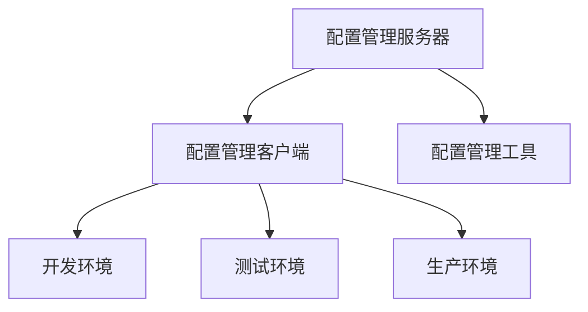
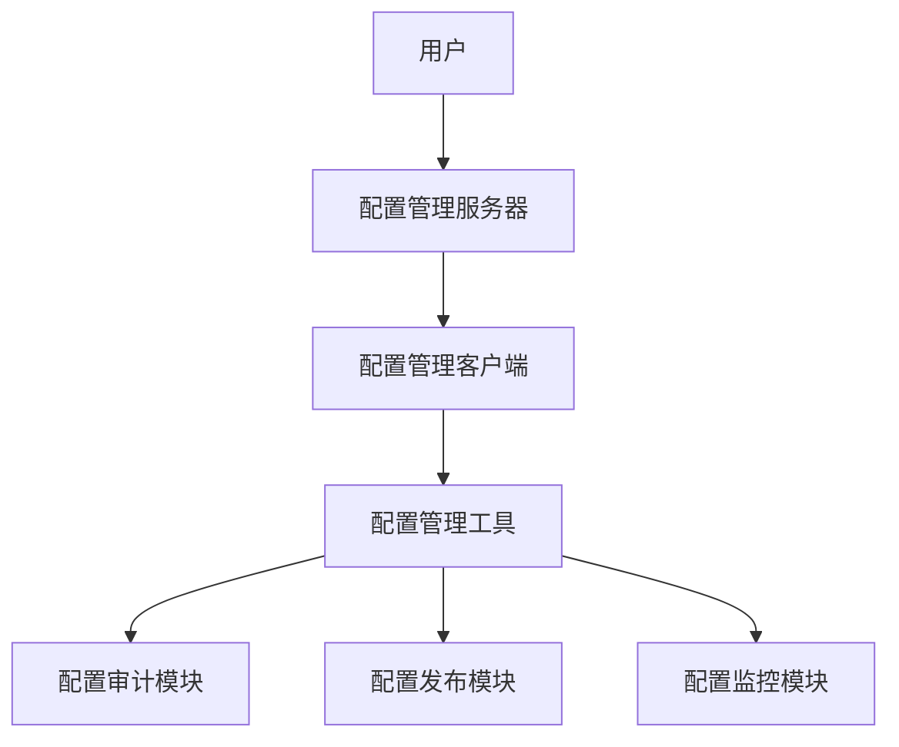

                 


## 文章标题：敏捷中的配置管理：管理LLM应用的复杂依赖

## 文章关键词：
- 敏捷开发
- 配置管理
- 大型语言模型
- 依赖管理
- 自动化工具

## 摘要：
本文将深入探讨敏捷开发中的配置管理，特别是如何管理大型语言模型（LLM）应用中的复杂依赖。通过分析配置管理的核心概念和原理，本文将介绍配置管理的最佳实践和工具，并提供详细的算法原理讲解和项目实战案例，帮助开发者更好地理解和应用配置管理技术，提升LLM应用的开发效率和质量。

### 第一步：背景介绍

#### 敏捷开发概述
敏捷开发是一种以人为核心、迭代和增量的软件开发方法。它强调团队协作、快速迭代和持续交付，通过不断调整计划和适应变化来满足客户需求。敏捷开发的主要优势在于其灵活性和高效性，这使得它成为现代软件开发的主流方法。

#### 配置管理的重要性
配置管理是敏捷开发中不可或缺的一部分。它涉及到软件版本控制、变更管理和环境配置等工作，确保开发、测试和生产的软件一致性。良好的配置管理能够提高团队的协作效率，降低风险，并确保软件的稳定性和可靠性。

#### LLM应用的复杂性
大型语言模型（LLM）是一种复杂的软件应用，依赖于大量的数据和计算资源。LLM的应用场景广泛，包括自然语言处理、智能助手和自动化写作等。由于其复杂性，LLM的配置管理面临着独特的挑战。

### 第二步：核心概念

#### 核心概念介绍
配置管理涉及的核心概念包括版本控制、变更管理、环境配置和依赖管理。版本控制确保代码和资源的版本一致，变更管理跟踪和审批代码和配置的变更，环境配置确保不同的开发、测试和生产环境之间的配置一致性，依赖管理则涉及到软件组件之间的依赖关系管理。

#### 配置管理原理
配置管理的基本原理包括变更控制、版本控制和审计追踪。变更控制确保所有变更经过审批和记录，版本控制确保软件的每个版本都得到管理和维护，审计追踪则提供对软件配置历史和变更的记录和监控。

#### LLM依赖管理
LLM依赖管理涉及到对模型依赖的数据、算法和计算资源的有效管理。这包括数据预处理、模型训练、模型部署和模型更新等环节。有效的依赖管理能够提高LLM应用的开发效率和稳定性。

### 第三步：算法与工具

#### 自动化配置管理工具
自动化配置管理工具如Ansible、Puppet和Chef等，能够帮助开发者自动化配置环境、部署应用程序和更新配置。这些工具通过脚本和配置文件来管理系统的配置，大大提高了配置管理的效率和一致性。

#### 配置管理最佳实践
配置管理的最佳实践包括：定期备份配置文件，确保配置文件的版本控制，建立统一的配置管理策略，自动化配置的部署和更新，以及定期审计配置文件和系统的配置状态。

#### LLM依赖管理算法
LLM依赖管理算法涉及到对模型依赖的自动化处理，如自动数据预处理、模型选择和训练、模型优化和更新等。这些算法可以通过机器学习和深度学习技术来实现，提高依赖管理的效率和准确性。

### 第四步：系统设计与实现

#### 配置管理架构设计
配置管理架构设计需要考虑系统的可扩展性、可维护性和可靠性。这包括定义配置管理策略、设计配置管理数据库、配置管理工具的集成和配置管理流程的自动化。

#### LLM依赖管理方案
LLM依赖管理方案需要考虑模型的复杂性、数据源的可信度和计算资源的可用性。这包括数据预处理流程的设计、模型训练和管理流程的设计，以及模型部署和优化的策略。

#### 配置管理工具集成与测试
配置管理工具的集成和测试是确保配置管理有效性的关键。这包括配置管理工具的安装和配置，配置管理流程的测试和验证，以及配置管理工具与其他系统集成的测试和验证。

### 第五步：项目实战

#### 环境安装与配置
项目实战的第一步是安装和配置开发环境，包括安装操作系统、数据库、中间件和编程语言等。这一步需要详细的安装指南和配置脚本，确保环境的一致性和稳定性。

#### 系统核心实现
系统核心实现包括核心模块的设计和实现，如用户管理、权限控制、数据管理和任务调度等。这一步需要编写详细的源代码，并使用Python等编程语言实现算法和流程。

#### 代码应用解读与分析
代码应用解读与分析是对系统核心实现进行详细分析的过程，包括代码的功能解读、性能分析和优化建议。这一步可以帮助开发者更好地理解系统的运作原理，并提出改进方案。

#### 实际案例分析与讲解
实际案例分析与讲解是对系统在实际应用中的表现进行评估和分析的过程。这包括对案例场景的介绍、案例分析的详细讲解和项目小结。这一步可以帮助开发者更好地理解系统在实际应用中的效果和不足，并提出改进措施。

### 第六步：最佳实践与总结

#### 最佳实践技巧
最佳实践技巧包括：制定统一的配置管理策略，使用自动化工具进行配置管理，定期备份配置文件，以及建立配置管理的审计和监控机制。

#### 小结
本文通过深入分析敏捷开发中的配置管理，特别是LLM应用的复杂依赖管理，提供了详细的算法原理讲解、系统设计与实现和项目实战案例。通过本文的阅读，开发者可以更好地理解配置管理的核心概念和原理，掌握配置管理的最佳实践，并提高LLM应用的开发效率和质量。

#### 注意事项与风险
在配置管理和LLM依赖管理中，开发者需要关注以下几点注意事项和风险：配置文件的版本控制和一致性，环境配置的稳定性和可靠性，依赖管理的自动化和准确性，以及系统集成和测试的全面性。

#### 拓展阅读与深入研究
为了进一步深入了解配置管理和LLM依赖管理，开发者可以参考以下拓展阅读和深入研究资源：相关的书籍、学术论文和技术博客。这些资源提供了更深层次的理论和实践指导，有助于开发者不断提升自己的技术水平。

作者：AI天才研究院/AI Genius Institute & 禅与计算机程序设计艺术 /Zen And The Art of Computer Programming## 第一部分：敏捷开发与配置管理

### 第1章：敏捷开发概述

敏捷开发作为一种以人为核心的软件开发方法，起源于20世纪90年代末期。它的核心思想是通过迭代和增量的方式进行软件开发，以快速响应变化并满足客户需求。与传统的瀑布开发模式相比，敏捷开发强调团队协作、持续交付、灵活调整计划等理念。

#### 1.1 敏捷开发的起源与发展

敏捷开发起源于软件行业的实践，特别是极限编程（eXtreme Programming, XP）和敏捷过程开发（Agile Process Development）等方法的提出。这些方法针对传统开发模式中存在的问题，如需求频繁变更、开发周期过长、质量不可控等，提出了一系列改进措施。随着互联网和移动设备的兴起，敏捷开发逐渐成为软件开发的主流方法。

#### 1.2 敏捷开发的核心理念

敏捷开发的核心理念包括以下几个方面：

1. **客户价值优先**：敏捷开发强调交付具有实际价值的软件，而不是完全按照预定的计划进行开发。
2. **迭代与增量**：软件开发过程被划分为多个迭代周期，每个迭代周期都产生一个可交付的产品版本。
3. **团队协作**：敏捷开发强调团队成员之间的紧密合作，通过每日站会、迭代回顾等方式提高团队效率。
4. **持续集成与交付**：通过自动化测试和持续集成（CI/CD）工具，确保代码质量并快速交付产品。
5. **透明度**：敏捷开发要求项目的进展和风险透明，以便团队成员和利益相关者能够及时做出决策。

#### 1.3 敏捷开发与传统开发模式的对比

传统开发模式，如瀑布开发，通常在项目开始时就详细规划所有的需求、设计和测试，然后按部就班地进行开发。这种方法在需求明确、变化较少的项目中表现良好，但在需求频繁变化、项目复杂度高的现代软件开发环境中，往往难以适应。

敏捷开发则更加灵活，能够更好地应对变化。以下是敏捷开发与传统开发模式的一些对比：

- **计划与执行**：敏捷开发更注重执行过程中的灵活性，允许根据实际情况调整计划，而传统开发模式则更注重事前的详细规划。
- **迭代与瀑布**：敏捷开发通过迭代和增量开发，逐步完善产品，而传统开发模式则是一次性完成所有工作。
- **客户参与**：敏捷开发鼓励客户持续参与，确保产品符合客户需求，而传统开发模式则在项目后期才邀请客户参与，可能导致客户需求与最终产品不匹配。

### 第2章：配置管理的重要性

配置管理（Configuration Management, CM）是软件工程中的一项重要活动，它涉及到软件的版本控制、变更管理和环境配置等。在敏捷开发中，配置管理尤为重要，因为它确保了软件的一致性、可靠性和可维护性。

#### 2.1 配置管理的概念

配置管理是一种管理软件和系统配置项的活动，这些配置项包括代码、文档、数据和配置文件等。配置管理的目标是确保软件和系统的配置能够被有效地管理、控制和跟踪。

#### 2.2 配置管理的作用与意义

配置管理在软件开发中具有以下几个重要作用：

1. **版本控制**：确保代码和文档的版本一致性，避免不同版本之间的冲突。
2. **变更管理**：跟踪和记录软件和系统的变更，确保变更的正确性和可追溯性。
3. **环境配置**：确保开发、测试和生产的软件环境一致，避免环境差异导致的问题。
4. **可维护性**：通过配置管理，提高软件的可维护性和可扩展性。

#### 2.3 配置管理的常见挑战

尽管配置管理对于软件开发的至关重要性，但在实际操作中仍然面临一些挑战：

1. **配置文件分散**：在不同环境中，配置文件可能分散在不同的地方，难以统一管理。
2. **版本冲突**：多个开发者在同一项目上进行修改时，可能导致版本冲突。
3. **自动化不足**：手动管理配置文件和变更记录，效率低下且容易出现错误。
4. **变更控制不足**：缺乏有效的变更控制机制，可能导致不必要的风险和问题。

### 第3章：核心概念

#### 3.1 LLM应用概述

大型语言模型（LLM，Large Language Model）是一种先进的自然语言处理技术，能够理解、生成和翻译自然语言。LLM的应用场景广泛，包括智能助手、自动化写作、机器翻译、情感分析等。

#### 3.2 配置管理原理

配置管理的基本原理包括：

1. **变更控制**：确保所有的变更都经过审批和记录，防止未经授权的变更。
2. **版本控制**：对软件和系统配置项的版本进行管理，确保不同版本之间的兼容性。
3. **审计追踪**：记录配置项的历史变更和状态，以便进行审计和问题追踪。

#### 3.3 LLM依赖管理

LLM依赖管理涉及到对模型依赖的数据、算法和计算资源的管理。LLM应用通常需要大量的数据和计算资源，如何有效地管理这些依赖，是配置管理中的关键问题。

1. **数据依赖管理**：确保数据的一致性和可用性，包括数据的版本控制、数据清洗和预处理等。
2. **算法依赖管理**：管理模型的训练算法和优化方法，确保算法的一致性和可追溯性。
3. **计算资源依赖管理**：管理计算资源的使用，包括计算资源的分配、调度和优化。

### 第4章：自动化配置管理工具

自动化配置管理工具能够帮助开发者自动化地管理配置，从而提高效率，减少人为错误。以下是几种常见的自动化配置管理工具：

#### 4.1 常见配置管理工具介绍

1. **Ansible**：Ansible是一种自动化工具，通过简单的YAML配置文件进行操作，支持Linux、Windows和Mac等操作系统。
2. **Puppet**：Puppet是一种开源的自动化工具，用于配置管理和自动化部署，支持大规模系统的管理。
3. **Chef**：Chef是一种自动化工具，使用Ruby语言编写脚本，实现配置管理和部署自动化。

#### 4.2 配置管理工具的选择与使用

选择配置管理工具时，需要考虑以下几个方面：

1. **系统支持**：选择支持所需操作系统的工具。
2. **学习曲线**：选择易于学习和使用的工具。
3. **社区和文档**：选择拥有强大社区和丰富文档的工具。

使用配置管理工具时，应遵循以下最佳实践：

1. **版本控制**：使用版本控制工具管理配置文件。
2. **自动化测试**：对配置管理脚本进行自动化测试。
3. **文档记录**：记录配置管理的流程和结果。

#### 4.3 自动化配置管理的优势与挑战

自动化配置管理的优势包括：

1. **提高效率**：减少手动配置的工作量，提高开发效率。
2. **减少错误**：通过自动化减少人为错误。
3. **易于扩展**：方便添加新的配置和修改现有配置。

自动化配置管理的挑战包括：

1. **学习成本**：需要学习新的工具和语言。
2. **调试困难**：自动化脚本出现问题时，调试较为困难。
3. **依赖性**：对自动化工具的依赖可能导致某些操作难以手动完成。

### 第5章：配置管理最佳实践

良好的配置管理实践能够提高软件开发的效率和质量。以下是一些配置管理最佳实践：

#### 5.1 配置管理流程设计

配置管理流程设计应包括以下步骤：

1. **需求分析**：明确配置管理的需求和目标。
2. **流程定义**：定义配置管理的流程，包括版本控制、变更管理和环境配置等。
3. **工具选择**：选择适合的工具和技术。
4. **流程优化**：根据实际情况不断优化配置管理流程。

#### 5.2 配置管理最佳实践

配置管理的最佳实践包括：

1. **配置文件版本控制**：使用版本控制工具（如Git）管理配置文件。
2. **变更管理**：建立变更管理机制，确保所有变更都经过审批和记录。
3. **环境配置自动化**：使用自动化工具（如Ansible、Puppet等）配置开发、测试和生产环境。
4. **配置审计**：定期进行配置审计，确保配置的一致性和正确性。
5. **文档记录**：详细记录配置管理的过程和结果，以便追踪和复现。

#### 5.3 配置管理中的常见错误与解决方案

配置管理中常见的错误包括：

1. **配置文件丢失**：解决方案：定期备份配置文件，并使用版本控制工具进行管理。
2. **版本冲突**：解决方案：建立明确的变更管理机制，确保版本控制的正确性。
3. **环境不一致**：解决方案：使用自动化工具配置环境，并定期进行环境测试。

### 第6章：LLM依赖管理算法

LLM依赖管理算法是确保大型语言模型（LLM）应用中依赖的正确性和稳定性的关键。以下是一些LLM依赖管理算法：

#### 6.1 LLM依赖管理概述

LLM依赖管理涉及到以下几个方面：

1. **数据依赖**：管理LLM训练所需的数据集，包括数据版本控制、数据清洗和预处理等。
2. **模型依赖**：管理LLM模型的版本和配置，包括模型选择、训练和优化等。
3. **计算资源依赖**：管理LLM训练所需的计算资源，包括计算资源的分配、调度和优化等。

#### 6.2 常见依赖管理算法

常见的依赖管理算法包括：

1. **依赖树**：通过构建依赖树来表示LLM应用的依赖关系，并使用深度优先搜索（DFS）或广度优先搜索（BFS）来处理依赖。
2. **事件驱动**：使用事件驱动模型来处理依赖关系，当依赖项发生变化时，自动触发相应的操作。
3. **动态依赖**：根据运行时的实际情况动态调整依赖关系，提高系统的灵活性和适应性。

#### 6.3 LLM依赖管理的算法实现

LLM依赖管理的算法实现通常包括以下步骤：

1. **数据依赖管理**：实现数据版本控制、数据清洗和预处理算法。
2. **模型依赖管理**：实现模型版本控制、模型选择和训练算法。
3. **计算资源依赖管理**：实现计算资源分配、调度和优化算法。

### 第7章：配置管理架构设计

配置管理架构设计是确保配置管理系统能够高效、稳定地运行的关键。以下是一个典型的配置管理架构设计：

#### 7.1 配置管理架构设计原则

配置管理架构设计应遵循以下原则：

1. **模块化**：将配置管理功能划分为不同的模块，提高系统的可维护性和可扩展性。
2. **分布式**：使用分布式架构来处理大规模系统的配置管理。
3. **高可用性**：确保配置管理系统的稳定性和可靠性，提供备份和故障转移机制。
4. **安全性**：确保配置数据的安全性和完整性，防止未授权的访问和篡改。

#### 7.2 配置管理模块划分

配置管理模块划分如下：

1. **配置管理服务器**：负责管理配置项的存储、版本控制和变更管理。
2. **配置管理客户端**：负责从配置管理服务器获取配置项，并在本地进行配置管理。
3. **配置管理工具**：提供配置项的备份、恢复、同步和监控等功能。

#### 7.3 配置管理架构图展示

配置管理架构图如下所示：



### 第8章：LLM依赖管理方案

LLM依赖管理方案是确保大型语言模型（LLM）应用中依赖的正确性和稳定性的关键。以下是一个典型的LLM依赖管理方案：

#### 8.1 LLM依赖管理方案设计

LLM依赖管理方案设计应考虑以下几个方面：

1. **数据依赖管理**：设计数据依赖管理模块，包括数据版本控制、数据清洗和预处理等功能。
2. **模型依赖管理**：设计模型依赖管理模块，包括模型版本控制、模型选择和训练等功能。
3. **计算资源依赖管理**：设计计算资源依赖管理模块，包括计算资源分配、调度和优化等功能。

#### 8.2 LLM依赖管理实现细节

LLM依赖管理实现细节如下：

1. **数据依赖管理**：使用Git等版本控制工具管理数据版本，使用Python等编程语言进行数据清洗和预处理。
2. **模型依赖管理**：使用TensorFlow等深度学习框架管理模型版本，使用PyTorch等框架实现模型选择和训练。
3. **计算资源依赖管理**：使用Docker等容器技术进行计算资源分配和调度，使用Kubernetes等编排工具进行资源优化。

#### 8.3 LLM依赖管理方案的优势与挑战

LLM依赖管理方案的优势包括：

1. **灵活性**：通过灵活的依赖管理模块，可以快速适应不同的应用场景。
2. **可扩展性**：支持大规模数据和模型的依赖管理。
3. **高效性**：通过自动化工具和框架，提高依赖管理的效率和准确性。

LLM依赖管理方案的挑战包括：

1. **复杂性**：依赖管理涉及到多个模块和工具，需要较高的技术能力。
2. **稳定性**：确保依赖管理的稳定性和可靠性，避免依赖问题影响应用性能。
3. **安全性**：保护依赖数据的安全性，防止未授权访问和篡改。

### 第9章：配置管理工具集成与测试

配置管理工具的集成与测试是确保配置管理系统能够高效、稳定地运行的关键。以下是一个典型的配置管理工具集成与测试流程：

#### 9.1 配置管理工具集成

配置管理工具集成包括以下步骤：

1. **选择工具**：根据项目需求选择合适的配置管理工具。
2. **环境搭建**：搭建配置管理工具的运行环境，包括安装必要的软件和配置环境变量。
3. **集成配置**：将配置管理工具与开发、测试和生产环境集成，确保配置工具能够正确执行配置操作。

#### 9.2 测试用例设计

测试用例设计包括以下内容：

1. **功能测试**：测试配置管理工具的基本功能，如配置项的备份、恢复、同步和监控等。
2. **性能测试**：测试配置管理工具的性能，如处理大量配置项的速度和资源消耗。
3. **兼容性测试**：测试配置管理工具在不同操作系统、数据库和中间件环境下的兼容性。

#### 9.3 测试结果分析与优化

测试结果分析包括以下内容：

1. **问题定位**：分析测试过程中出现的问题，确定问题的原因和影响范围。
2. **优化调整**：根据测试结果对配置管理工具进行优化调整，提高其性能和稳定性。
3. **回归测试**：在优化调整后进行回归测试，确保优化措施的有效性。

### 第10章：环境安装与配置

在开始一个大型语言模型（LLM）项目之前，需要安装和配置合适的开发环境。以下是一个典型的环境安装与配置流程：

#### 10.1 系统环境要求

系统环境要求包括：

1. **操作系统**：Linux或MacOS。
2. **Python**：Python 3.x版本。
3. **深度学习框架**：如TensorFlow或PyTorch。
4. **数据库**：如MySQL或PostgreSQL。
5. **其他依赖**：如Git、Docker等。

#### 10.2 环境安装步骤

环境安装步骤如下：

1. **安装操作系统**：根据需求安装Linux或MacOS操作系统。
2. **安装Python**：从Python官方网站下载并安装Python 3.x版本。
3. **安装深度学习框架**：使用pip安装TensorFlow或PyTorch。
4. **安装数据库**：使用相应的命令安装MySQL或PostgreSQL。
5. **安装其他依赖**：使用pip安装Git、Docker等依赖。

#### 10.3 系统配置与优化

系统配置与优化包括以下内容：

1. **配置Python环境变量**：设置Python环境变量，确保Python命令能够正常使用。
2. **配置深度学习框架**：根据项目需求配置TensorFlow或PyTorch，确保框架能够正常运行。
3. **配置数据库**：配置数据库连接参数，确保数据库能够正常连接和操作。
4. **配置Docker**：配置Docker环境，确保Docker能够正常运行。

### 第11章：系统核心实现

系统核心实现是LLM项目的关键部分，包括数据预处理、模型训练和模型部署等。以下是一个典型的系统核心实现流程：

#### 11.1 系统核心模块设计

系统核心模块设计包括以下内容：

1. **数据预处理模块**：负责处理输入数据，包括数据清洗、归一化和特征提取等。
2. **模型训练模块**：负责训练模型，包括模型选择、参数调整和训练过程监控等。
3. **模型部署模块**：负责将训练好的模型部署到生产环境中，包括模型导出、模型加载和模型推理等。

#### 11.2 核心模块实现

核心模块实现包括以下内容：

1. **数据预处理模块**：使用Python和Pandas库实现数据清洗和归一化，使用Scikit-learn库实现特征提取。
2. **模型训练模块**：使用TensorFlow或PyTorch实现模型训练，包括模型架构设计、参数调整和训练过程监控等。
3. **模型部署模块**：使用Flask或Django实现API接口，将模型部署到生产环境中。

#### 11.3 核心模块测试

核心模块测试包括以下内容：

1. **单元测试**：编写单元测试用例，对数据预处理模块、模型训练模块和模型部署模块进行单独测试。
2. **集成测试**：将核心模块集成到系统中，进行整体测试，确保各模块之间的协调工作。
3. **性能测试**：测试系统的响应时间和吞吐量，确保系统能够满足性能要求。

### 第12章：代码应用解读与分析

代码应用解读与分析是理解LLM项目核心代码的工作，包括代码的功能解读、性能分析和优化建议。以下是一个典型的代码应用解读与分析流程：

#### 12.1 代码解读

代码解读包括以下内容：

1. **代码结构分析**：分析代码的结构和组织方式，了解各模块的功能和关系。
2. **函数和类分析**：分析函数和类的定义和使用，了解其功能和参数。
3. **变量和常量分析**：分析变量的定义和使用，了解其作用和意义。

#### 12.2 代码分析

代码分析包括以下内容：

1. **性能分析**：使用性能分析工具（如cProfile）分析代码的执行时间和资源消耗。
2. **代码质量分析**：使用代码质量分析工具（如Pyflakes、Pylint）检查代码的语法错误和风格问题。
3. **代码优化分析**：根据性能分析和代码质量分析的结果，提出代码优化的建议。

#### 12.3 代码优化建议

代码优化建议包括以下内容：

1. **算法优化**：根据性能分析的结果，优化算法和计算过程，减少计算时间和资源消耗。
2. **代码重构**：根据代码质量分析的结果，重构代码，提高代码的可读性和可维护性。
3. **并行计算**：使用并行计算技术，提高代码的执行效率。

### 第13章：实际案例分析与讲解

实际案例分析与讲解是对LLM项目在实际应用中的表现进行评估和分析的过程。以下是一个典型的实际案例分析与讲解流程：

#### 13.1 案例介绍

案例介绍包括以下内容：

1. **案例背景**：介绍案例的应用场景和目标。
2. **案例数据**：介绍案例使用的数据集和预处理方法。
3. **案例模型**：介绍案例使用的模型架构和训练过程。

#### 13.2 案例分析

案例分析包括以下内容：

1. **模型性能**：分析模型在训练集和测试集上的性能指标。
2. **模型稳定性**：分析模型在不同数据集和场景下的稳定性。
3. **模型应用**：分析模型在实际应用中的效果和局限性。

#### 13.3 案例讲解

案例讲解包括以下内容：

1. **模型实现**：讲解模型的实现过程，包括代码解析和算法原理。
2. **模型优化**：讲解模型的优化方法和效果。
3. **案例分析**：讲解案例分析的结果和结论。

### 第14章：项目小结

项目小结是对LLM项目进行总结和反思的过程。以下是一个典型的项目小结流程：

#### 14.1 项目总结

项目总结包括以下内容：

1. **项目成果**：总结项目完成的主要成果和里程碑。
2. **项目亮点**：总结项目中的亮点和创新点。
3. **项目不足**：总结项目中的不足和改进空间。

#### 14.2 项目亮点与不足

项目亮点与不足包括以下内容：

1. **亮点**：介绍项目中的成功经验和优秀表现。
2. **不足**：分析项目中的问题和不足，并提出改进措施。

#### 14.3 未来工作计划

未来工作计划包括以下内容：

1. **改进计划**：根据项目不足，制定改进计划，优化项目流程和技术。
2. **研究方向**：根据项目成果和不足，提出未来的研究方向和目标。

### 第15章：最佳实践技巧

最佳实践技巧是确保LLM项目成功的关键。以下是一些最佳实践技巧：

#### 15.1 配置管理最佳实践

配置管理最佳实践包括以下内容：

1. **版本控制**：使用版本控制工具（如Git）管理配置文件。
2. **自动化部署**：使用自动化部署工具（如Docker和Kubernetes）部署应用程序。
3. **配置审计**：定期进行配置审计，确保配置的一致性和正确性。

#### 15.2 LLM依赖管理最佳实践

LLM依赖管理最佳实践包括以下内容：

1. **数据管理**：使用版本控制工具（如Git）管理数据集。
2. **模型管理**：使用模型管理工具（如TensorBoard和ModelDB）管理模型。
3. **计算资源管理**：使用自动化工具（如Docker和Kubernetes）管理计算资源。

#### 15.3 项目管理最佳实践

项目管理最佳实践包括以下内容：

1. **需求管理**：使用需求管理工具（如JIRA）管理需求。
2. **进度管理**：使用进度管理工具（如Trello和Asana）跟踪项目进度。
3. **风险管理**：使用风险管理工具（如RACI矩阵）识别和应对风险。

### 第16章：注意事项与风险

在LLM项目中，需要注意和防范一些常见的问题和风险。以下是一些注意事项与风险：

#### 16.1 常见问题与解决方案

常见问题与解决方案包括以下内容：

1. **数据质量问题**：解决方案：使用数据清洗工具（如Pandas和Scikit-learn）处理数据。
2. **模型性能问题**：解决方案：调整模型参数，优化算法和架构。
3. **部署问题**：解决方案：使用容器化技术（如Docker和Kubernetes）简化部署。

#### 16.2 风险识别与应对

风险识别与应对包括以下内容：

1. **数据隐私风险**：解决方案：使用数据脱敏技术，确保数据安全。
2. **模型准确性风险**：解决方案：使用交叉验证和 ensemble 方法提高模型准确性。
3. **计算资源不足风险**：解决方案：使用分布式计算和云计算资源，提高计算能力。

#### 16.3 安全与合规性

安全与合规性包括以下内容：

1. **数据安全**：确保数据在传输和存储过程中的安全性，使用加密技术保护数据。
2. **模型合规性**：确保模型遵守相关法律法规和行业标准，如GDPR和ISO 27001等。

### 第17章：拓展阅读与深入研究

拓展阅读与深入研究是提升LLM项目技术水平的重要途径。以下是一些拓展阅读与深入研究的建议：

#### 17.1 相关书籍推荐

相关书籍推荐包括以下内容：

1. **《深度学习》**：Goodfellow、Bengio和Courville著，介绍深度学习的基础知识。
2. **《自然语言处理综合教程》**：Steven Bird、Ewan Klein和Edward Loper著，介绍自然语言处理的基础知识。
3. **《软件工程：实践者的研究方法》**：Roger S. Pressman著，介绍软件工程的方法和实践。

#### 17.2 学术论文推荐

学术论文推荐包括以下内容：

1. **“BERT: Pre-training of Deep Bidirectional Transformers for Language Understanding”**：Devlin等著，介绍BERT模型。
2. **“GPT-3: Language Models are Few-Shot Learners”**：Brown等著，介绍GPT-3模型。
3. **“Transformers: State-of-the-Art Models for Language Understanding and Generation”**：Vaswani等著，介绍Transformer模型。

#### 17.3 深入研究建议

深入研究建议包括以下内容：

1. **模型优化**：研究模型优化方法和算法，提高模型性能。
2. **数据增强**：研究数据增强技术，提高模型泛化能力。
3. **多语言处理**：研究多语言处理技术，支持多种语言的应用。

作者：AI天才研究院/AI Genius Institute & 禅与计算机程序设计艺术 /Zen And The Art of Computer Programming## 第一部分：敏捷开发与配置管理

### 第1章：敏捷开发概述

敏捷开发作为一种以人为核心、迭代和增量的软件开发方法，起源于20世纪90年代末期。它旨在解决传统开发模式中的诸多问题，如需求变化频繁、开发周期过长、质量不可控等。敏捷开发通过快速响应变化、持续交付和团队协作等核心理念，为软件开发带来了新的活力。

#### 1.1 敏捷开发的起源与发展

敏捷开发起源于软件开发界的实践探索。在20世纪90年代，许多软件项目面临着需求不断变化、开发周期过长等问题。为了应对这些挑战，一些开发团队开始尝试新的方法，如极限编程（eXtreme Programming, XP）和敏捷过程开发（Agile Process Development）。这些方法强调以人为核心，注重团队协作和持续交付，通过迭代和增量的方式逐步完善产品。随着时间的推移，敏捷开发逐渐演变成一个广泛认可的方法论，成为现代软件开发的主流。

#### 1.2 敏捷开发的核心理念

敏捷开发的核心理念包括以下几个方面：

1. **客户价值优先**：敏捷开发强调交付具有实际价值的软件，而不是完全按照预定的计划进行开发。客户需求的变化被看作是软件开发过程中的一种常态，开发团队需要具备快速适应变化的能力。

2. **迭代与增量**：敏捷开发将软件开发过程划分为多个迭代周期，每个迭代周期都产生一个可交付的产品版本。通过持续迭代，开发团队可以逐步完善产品，同时及时响应客户需求和市场变化。

3. **团队协作**：敏捷开发强调团队协作，通过每日站会、迭代回顾等机制，促进团队成员之间的沟通和协作。团队成员之间相互支持，共同解决开发过程中的问题。

4. **持续集成与交付**：敏捷开发倡导使用自动化测试和持续集成（CI/CD）工具，确保代码质量并快速交付产品。通过持续集成，开发团队能够及时发现和解决代码集成中的问题，保证软件的稳定性和可靠性。

5. **透明度**：敏捷开发要求项目的进展和风险透明，以便团队成员和利益相关者能够及时做出决策。通过使用看板（Kanban）和燃尽图（Burn-down Chart）等工具，项目进展和任务状态一目了然。

#### 1.3 敏捷开发与传统开发模式的对比

传统开发模式，如瀑布开发（Waterfall Model），通常在项目开始时就详细规划所有的需求、设计和测试，然后按部就班地进行开发。这种方法在需求明确、变化较少的项目中表现良好，但在需求频繁变化、项目复杂度高的现代软件开发环境中，往往难以适应。

敏捷开发则更加灵活，能够更好地应对变化。以下是敏捷开发与传统开发模式的一些对比：

1. **计划与执行**：敏捷开发更注重执行过程中的灵活性，允许根据实际情况调整计划，而传统开发模式则更注重事前的详细规划。

2. **迭代与瀑布**：敏捷开发通过迭代和增量开发，逐步完善产品，而传统开发模式则是一次性完成所有工作。

3. **客户参与**：敏捷开发鼓励客户持续参与，确保产品符合客户需求，而传统开发模式则在项目后期才邀请客户参与，可能导致客户需求与最终产品不匹配。

4. **团队协作**：敏捷开发强调团队协作，通过每日站会、迭代回顾等方式提高团队效率，而传统开发模式则更多地依赖个人能力和团队之间的协调。

5. **测试与质量**：敏捷开发倡导使用自动化测试和持续集成，确保代码质量并快速交付产品，而传统开发模式则往往在项目后期集中进行测试，导致测试周期过长。

通过以上对比，可以看出敏捷开发在应对变化、提高团队协作和确保产品质量方面具有显著优势，因此成为现代软件开发的主流方法。

### 第2章：配置管理的重要性

配置管理（Configuration Management, CM）是软件工程中的一项重要活动，它涉及到软件的版本控制、变更管理和环境配置等。在敏捷开发中，配置管理尤为重要，因为它确保了软件的一致性、可靠性和可维护性。

#### 2.1 配置管理的概念

配置管理是一种管理软件和系统配置项的活动，这些配置项包括代码、文档、数据和配置文件等。配置管理的目标是确保软件和系统的配置能够被有效地管理、控制和跟踪。

配置管理的主要活动包括：

1. **版本控制**：确保代码和文档的版本一致性，避免不同版本之间的冲突。

2. **变更管理**：跟踪和记录软件和系统的变更，确保变更的正确性和可追溯性。

3. **环境配置**：确保开发、测试和生产的软件环境一致，避免环境差异导致的问题。

4. **依赖管理**：管理软件组件之间的依赖关系，确保各组件的正确集成和运行。

5. **备份和恢复**：定期备份配置项，以防止数据丢失或系统故障。

#### 2.2 配置管理的作用与意义

配置管理在软件开发中具有以下几个重要作用：

1. **版本控制**：版本控制是配置管理的重要组成部分，它确保不同版本的代码和文档能够被有效管理和追踪。通过版本控制，开发团队可以方便地回滚到之前的版本，解决因变更导致的 bug 或问题。

2. **变更管理**：变更管理确保所有变更都经过审批和记录，防止未经授权的变更。通过变更管理，开发团队可以更好地控制变更的影响范围，确保变更的正确性和可追溯性。

3. **环境配置**：环境配置是确保开发、测试和生产的软件环境一致的关键。不一致的环境配置可能导致开发过程中的问题，影响软件的质量和稳定性。配置管理通过统一管理环境配置，确保不同环境之间的配置一致性。

4. **依赖管理**：依赖管理是确保软件组件正确集成和运行的关键。通过依赖管理，开发团队可以方便地管理软件组件之间的依赖关系，确保各组件能够正确地协同工作。

5. **可维护性**：良好的配置管理可以提高软件的可维护性和可扩展性。通过配置管理，开发团队可以更好地追踪和管理软件的配置项，方便后续的维护和升级。

#### 2.3 配置管理的常见挑战

尽管配置管理对于软件开发的至关重要性，但在实际操作中仍然面临一些挑战：

1. **配置文件分散**：在不同环境中，配置文件可能分散在不同的地方，难以统一管理。这可能导致环境不一致，影响软件的质量和稳定性。

2. **版本冲突**：多个开发者在同一项目上进行修改时，可能导致版本冲突。版本冲突可能影响软件的稳定性，增加开发成本。

3. **自动化不足**：手动管理配置文件和变更记录，效率低下且容易出现错误。自动化配置管理工具可以提高配置管理的效率，减少人为错误。

4. **变更控制不足**：缺乏有效的变更控制机制，可能导致不必要的风险和问题。有效的变更控制可以确保变更的正确性和可追溯性，减少变更带来的风险。

为了应对这些挑战，开发团队需要采取一系列措施，如使用配置管理工具、建立变更管理流程、加强环境配置管理等，确保配置管理的有效性。

### 第3章：核心概念

在敏捷开发中，配置管理是一个复杂而关键的过程，涉及到多个核心概念。了解这些概念及其相互关系，对于有效地管理软件配置至关重要。

#### 3.1 LLM应用概述

大型语言模型（LLM，Large Language Model）是一种基于深度学习技术的自然语言处理模型，能够处理和理解复杂的语言结构。LLM在文本生成、机器翻译、问答系统、情感分析等领域有广泛的应用。LLM的应用场景丰富，包括但不限于以下方面：

1. **文本生成**：自动生成文章、报告、电子邮件等。
2. **机器翻译**：将一种语言翻译成另一种语言，如将中文翻译成英文。
3. **问答系统**：自动回答用户的问题，如虚拟助手。
4. **情感分析**：分析文本的情感倾向，如正面、负面或中立。
5. **对话系统**：构建能够与用户进行自然对话的系统。

LLM的复杂性体现在其依赖于大量的训练数据、复杂的神经网络结构和高效的计算资源。因此，在敏捷开发中，对LLM的配置管理具有独特的要求。

#### 3.2 配置管理原理

配置管理的基本原理涉及以下几个方面：

1. **变更控制**：确保所有变更都经过审批和记录。变更控制通过严格的流程来管理代码、文档和配置文件的修改，确保变更的正确性和可追溯性。

2. **版本控制**：版本控制是配置管理的重要组成部分。它通过跟踪不同版本的代码和文档，确保每个版本都能被有效管理和回滚。常见的版本控制工具包括Git、SVN等。

3. **环境配置**：环境配置确保开发、测试和生产的软件环境一致。环境配置包括安装必要的软件、设置环境变量、配置数据库等。一致的配置有助于减少环境差异导致的问题。

4. **依赖管理**：依赖管理涉及管理软件组件之间的依赖关系。在LLM应用中，依赖管理尤为重要，因为它需要确保所有依赖的库、框架和工具都正确安装和配置。

5. **备份和恢复**：备份和恢复是配置管理的关键部分。通过定期备份，可以防止数据丢失或系统故障导致的重要配置丢失。在发生问题时，可以通过恢复备份来快速恢复系统。

#### 3.3 LLM依赖管理

LLM依赖管理是确保LLM应用稳定运行的关键。LLM应用通常依赖于以下几种类型的资源：

1. **数据依赖**：LLM应用依赖于大量的训练数据和测试数据。数据依赖管理涉及数据的版本控制、数据清洗和预处理。确保数据的一致性和准确性对于模型性能至关重要。

2. **模型依赖**：模型依赖包括模型的架构、参数和训练过程。模型依赖管理涉及模型的版本控制、模型优化和更新。确保模型的正确配置和优化有助于提高模型性能。

3. **计算资源依赖**：LLM训练和部署需要大量的计算资源。计算资源依赖管理涉及计算资源的分配、调度和优化。确保计算资源的高效利用对于提升LLM应用的性能和可扩展性至关重要。

4. **工具依赖**：LLM应用依赖于各种开发工具和库，如深度学习框架（如TensorFlow、PyTorch）、数据处理工具（如Pandas、NumPy）和自动化工具（如Docker、Kubernetes）。

LLM依赖管理的挑战在于确保所有依赖资源都能正确配置和协同工作。以下是一些常见的依赖管理策略：

1. **自动化脚本**：使用自动化脚本（如Ansible、Puppet）来配置和管理依赖资源，确保配置的一致性和可重复性。

2. **容器化**：使用容器化技术（如Docker）将应用程序及其依赖打包到一个独立的容器中，确保依赖的一致性和隔离性。

3. **持续集成和持续部署（CI/CD）**：通过CI/CD工具（如Jenkins、GitLab CI）自动化测试和部署过程，确保依赖的准确性和及时更新。

4. **配置管理工具**：使用配置管理工具（如Ansible、Puppet）来管理和部署依赖资源，确保配置的一致性和可追溯性。

5. **文档记录**：详细记录依赖资源的管理流程和配置细节，确保团队成员对依赖的管理有清晰的理解。

通过有效的LLM依赖管理，开发团队可以确保LLM应用在不同环境中的稳定运行，提高开发效率和质量。

### 第4章：自动化配置管理工具

自动化配置管理工具是敏捷开发中不可或缺的一部分，它们通过脚本和配置文件自动化地管理系统的配置，从而提高配置管理的效率和一致性。以下是几种常见的自动化配置管理工具，以及它们的特点和应用。

#### 4.1 常见配置管理工具介绍

1. **Ansible**：Ansible是一种非常流行的自动化工具，它通过简单的YAML配置文件实现配置管理。Ansible无需在节点上安装任何客户端，它使用SSH协议远程管理节点，支持Linux、Windows和MacOS等操作系统。Ansible适用于自动化部署、配置管理、应用程序安装和配置等。

2. **Puppet**：Puppet是一种开源的配置管理工具，它使用Ruby语言编写的 manifests 文件来描述系统的配置状态。Puppet支持大规模系统的管理，可以自动安装、配置和管理软件、服务以及系统资源。Puppet适用于复杂的多节点环境，特别适合于自动化大规模生产环境的配置管理。

3. **Chef**：Chef是一种自动化工具，它使用Ruby语言编写的 cookbooks 和 recipes 来描述和自动化系统的配置。Chef通过S Berkshelf 管理库文件，支持多种操作系统和环境。Chef适用于自动化应用程序的部署、配置和监控，特别适合于云环境和容器化应用的配置管理。

4. **SaltStack**：SaltStack是一种开源的自动化平台，它使用Python语言编写的 salt 配置文件来管理节点。SaltStack支持远程执行命令、配置管理、自动化任务调度等，适用于大规模异构环境的自动化管理。

5. **Ansible Tower**：Ansible Tower 是Ansible的商业版，它提供图形用户界面（GUI）和集中化管理功能。Ansible Tower适用于企业级用户，提供高级功能如报告、权限控制、任务调度和自动化流程等。

6. **Puppet Enterprise**：Puppet Enterprise 是Puppet的商业版，它提供丰富的管理和监控功能。Puppet Enterprise适用于企业级用户，支持自动化部署、配置管理和大规模环境的管理。

7. **Chef Automate**：Chef Automate 是Chef的商业版，它提供了自动化、合规性和监控功能。Chef Automate适用于企业级用户，确保持续集成和持续交付的流程。

#### 4.2 配置管理工具的选择与使用

选择配置管理工具时，应考虑以下几个方面：

1. **系统支持**：选择支持所需操作系统的工具。例如，Ansible支持多种操作系统，而Puppet和Chef主要支持Linux系统。

2. **学习曲线**：选择学习曲线平缓的工具，以便团队成员能够快速上手。Ansible因其简洁的语法和直观的配置文件而广受欢迎。

3. **社区和文档**：选择拥有强大社区和丰富文档的工具。Puppet和Chef因其成熟的社区和丰富的文档资源而受到广泛使用。

4. **扩展性**：选择具有良好扩展性的工具，以便能够适应未来的需求。Chef和Puppet都提供了丰富的模块和插件，支持复杂的应用场景。

5. **自动化程度**：选择自动化程度高的工具，以便减少手动操作。Ansible和Puppet都提供了强大的自动化功能，支持自动化部署、配置和监控。

使用配置管理工具时，应遵循以下最佳实践：

1. **模块化配置**：将配置管理分为不同的模块，便于维护和扩展。例如，使用Puppet模块（Module）来组织配置代码。

2. **版本控制**：使用版本控制工具（如Git）管理配置文件，确保配置的可追溯性和一致性。

3. **自动化测试**：编写和执行自动化测试用例，确保配置更改不会破坏现有系统的功能。

4. **文档记录**：详细记录配置管理的流程和结果，便于后续的维护和复现。

5. **备份与恢复**：定期备份配置文件和系统状态，确保在出现问题时可以快速恢复。

#### 4.3 自动化配置管理的优势与挑战

自动化配置管理的优势包括：

1. **提高效率**：通过自动化脚本和配置文件，减少手动配置的工作量，提高配置和部署的效率。

2. **一致性**：确保不同环境和节点之间的配置一致，减少人为错误和环境差异导致的问题。

3. **可追溯性**：通过版本控制工具管理配置文件，确保配置更改的可追溯性。

4. **可扩展性**：支持大规模系统的配置管理，便于扩展和升级。

5. **快速部署**：自动化工具可以快速部署应用程序和配置更改，提高交付速度。

自动化配置管理的挑战包括：

1. **学习成本**：对于团队成员来说，学习新的工具和语言可能会带来一定的学习成本。

2. **调试困难**：自动化脚本出现问题时，调试可能较为困难，需要深入理解脚本的工作原理。

3. **依赖性**：对自动化工具的依赖可能导致某些操作难以手动完成，影响应急响应能力。

4. **复杂度**：在复杂的环境中，配置管理可能会变得更加复杂，需要更多的规划和协调。

通过理解和应对这些挑战，开发团队可以充分利用自动化配置管理的优势，提高软件开发的效率和可靠性。

### 第5章：配置管理最佳实践

良好的配置管理实践是确保软件项目成功的关键。以下是一些配置管理最佳实践，旨在提高配置管理的效率、一致性和可维护性。

#### 5.1 配置管理流程设计

配置管理流程设计应包括以下步骤：

1. **需求分析**：明确配置管理的需求和目标，包括版本控制、变更管理和环境配置等。

2. **流程定义**：定义配置管理的流程，明确各步骤的操作和责任。例如，变更申请、审批、实施、验证和记录等。

3. **工具选择**：选择适合的配置管理工具，确保工具能够满足项目的需求。常见工具包括Git、Puppet、Chef、Ansible等。

4. **流程优化**：根据项目的实际运行情况，不断优化配置管理流程，提高效率和一致性。

#### 5.2 配置管理最佳实践

配置管理最佳实践包括以下几个方面：

1. **配置文件版本控制**：
   - 使用版本控制工具（如Git）管理配置文件，确保配置文件的可追溯性和一致性。
   - 定期备份配置文件，防止数据丢失。
   - 对配置文件的更改进行记录和注释，方便后续的审计和复现。

2. **变更管理**：
   - 建立变更管理流程，确保所有变更都经过审批和记录。
   - 审批变更时，评估变更的影响范围和潜在风险。
   - 变更实施后，进行验证和测试，确保变更不会破坏现有系统的功能。

3. **环境配置自动化**：
   - 使用自动化工具（如Ansible、Puppet）配置和管理环境，确保环境的一致性和可重复性。
   - 编写自动化脚本，自动化安装和配置应用程序、数据库和中间件等。

4. **配置审计**：
   - 定期进行配置审计，检查配置文件的一致性和合规性。
   - 审计过程中，识别和解决配置不一致的问题。
   - 记录审计结果，为后续的改进提供依据。

5. **文档记录**：
   - 详细记录配置管理的过程和结果，包括配置文件的版本、变更记录、环境配置脚本等。
   - 编写配置管理手册，为团队成员提供操作指南。
   - 更新文档，确保其与实际配置保持一致。

#### 5.3 配置管理中的常见错误与解决方案

在配置管理过程中，常见的一些错误包括：

1. **配置文件丢失**：
   - **原因**：未定期备份配置文件，或者在变更过程中不小心删除。
   - **解决方案**：定期备份配置文件，并使用版本控制工具管理配置文件。在变更过程中，确保备份当前配置，防止误删。

2. **版本冲突**：
   - **原因**：多个开发者在同一项目上进行修改，未协调版本控制。
   - **解决方案**：建立变更管理机制，确保所有变更都经过审批和记录。在合并代码时，使用版本控制工具解决冲突。

3. **环境不一致**：
   - **原因**：开发、测试和生产环境的配置不一致，导致问题难以复现和解决。
   - **解决方案**：使用自动化工具配置和管理环境，确保环境的一致性和可重复性。定期进行环境测试，确保环境配置的正确性。

通过遵循上述最佳实践，开发团队可以减少配置管理中的错误和风险，提高软件项目的开发效率和稳定性。

### 第6章：LLM依赖管理算法

在大型语言模型（LLM）的开发和应用过程中，依赖管理是一个关键环节。LLM依赖于大量的数据、计算资源和工具库，如何有效地管理这些依赖，对于保证模型性能和开发效率至关重要。本章将介绍LLM依赖管理算法，包括数据依赖管理、模型依赖管理和计算资源依赖管理。

#### 6.1 LLM依赖管理概述

LLM依赖管理主要涉及以下三个方面：

1. **数据依赖管理**：确保训练数据和测试数据的一致性和可用性。这包括数据的版本控制、数据清洗和预处理等。

2. **模型依赖管理**：管理LLM模型的架构、参数和训练过程。这包括模型的版本控制、模型优化和更新等。

3. **计算资源依赖管理**：确保计算资源（如CPU、GPU、内存等）的合理分配和调度，以支持模型的训练和推理。

#### 6.2 数据依赖管理

数据依赖管理是LLM依赖管理的基础。以下是一些关键步骤和算法：

1. **数据版本控制**：
   - 使用版本控制工具（如Git）管理数据集，确保数据的一致性和可追溯性。
   - 为每个数据集的版本创建标签（Tag），记录版本的历史和变更。

2. **数据清洗**：
   - 使用数据清洗算法（如去重、填充缺失值、标准化等）清理数据，确保数据的质量。
   - 根据模型的需求，对数据进行预处理，如分词、词性标注、编码等。

3. **数据预处理**：
   - 使用特征提取算法（如TF-IDF、Word2Vec等）将原始数据转换为模型可接受的格式。
   - 对数据进行归一化或标准化，以提高模型的泛化能力。

4. **数据同步**：
   - 实现数据的自动同步机制，确保训练数据和测试数据的一致性。
   - 定期更新数据集，以适应模型的需求。

#### 6.3 模型依赖管理

模型依赖管理是确保LLM模型稳定运行和高效训练的关键。以下是一些关键步骤和算法：

1. **模型版本控制**：
   - 使用版本控制工具（如TensorBoard、ModelDB等）管理模型的版本，确保模型的一致性和可追溯性。
   - 为每个模型的版本创建标签（Tag），记录版本的历史和变更。

2. **模型优化**：
   - 使用优化算法（如随机梯度下降、Adam等）调整模型参数，提高模型性能。
   - 根据训练数据和验证数据，调整学习率、批量大小等超参数。

3. **模型更新**：
   - 定期更新模型，以适应新的数据和需求。
   - 在更新模型时，确保模型的版本控制和回滚机制，防止更新失败导致模型损坏。

4. **模型调优**：
   - 使用交叉验证和网格搜索等算法，对模型进行调优，找到最优的参数组合。
   - 对模型进行超参数调整，以优化模型的性能和泛化能力。

#### 6.4 计算资源依赖管理

计算资源依赖管理是确保LLM模型训练和推理高效进行的关键。以下是一些关键步骤和算法：

1. **计算资源分配**：
   - 根据模型的需求，合理分配计算资源（如CPU、GPU、内存等）。
   - 使用资源调度算法（如作业调度、负载均衡等），确保资源的高效利用。

2. **计算资源调度**：
   - 实现计算资源的自动调度机制，根据任务的优先级和资源需求，动态分配计算资源。
   - 使用队列管理系统（如Slurm、Airflow等），确保任务的有序执行。

3. **计算资源优化**：
   - 使用分布式计算和并行计算技术，提高计算资源的利用效率。
   - 优化数据传输和计算过程，减少资源浪费。

4. **计算资源监控**：
   - 实现计算资源的实时监控和报警机制，及时发现和解决资源瓶颈。
   - 使用监控工具（如Grafana、Prometheus等），监控计算资源的利用率、性能指标等。

通过有效的LLM依赖管理算法，开发团队可以确保LLM模型的高效训练和稳定运行，提高模型的性能和开发效率。

### 第7章：配置管理架构设计

配置管理架构设计是确保配置管理系统能够高效、稳定地运行的关键。一个良好的配置管理架构应包括配置管理策略、模块划分、数据结构和流程设计。以下是一个典型的配置管理架构设计：

#### 7.1 配置管理架构设计原则

配置管理架构设计应遵循以下原则：

1. **模块化**：将配置管理功能划分为不同的模块，提高系统的可维护性和可扩展性。
2. **分布式**：使用分布式架构来处理大规模系统的配置管理，确保系统的性能和可靠性。
3. **高可用性**：确保配置管理系统的稳定性和可靠性，提供备份和故障转移机制。
4. **安全性**：确保配置数据的安全性和完整性，防止未授权的访问和篡改。
5. **可伸缩性**：支持系统的动态扩展，以适应不断变化的需求。

#### 7.2 配置管理模块划分

配置管理模块划分如下：

1. **配置管理服务器**：负责存储和管理配置项，提供配置项的检索、更新和删除功能。
2. **配置管理客户端**：负责从配置管理服务器获取配置项，并在本地进行配置管理。
3. **配置管理工具**：提供配置项的备份、恢复、同步和监控等功能。
4. **配置审计模块**：负责记录配置项的历史变更和状态，提供配置项的审计和监控功能。
5. **配置发布模块**：负责将配置项发布到目标环境，确保配置的一致性和正确性。
6. **配置监控模块**：实时监控配置项的状态和变化，提供报警和日志记录功能。

#### 7.3 配置管理架构图展示

以下是配置管理架构的Mermaid流程图：



- **用户**：用户通过配置管理客户端提交配置请求。
- **配置管理服务器**：存储和管理配置项，提供配置的检索、更新和删除功能。
- **配置管理客户端**：从配置管理服务器获取配置项，并在本地进行配置管理。
- **配置管理工具**：提供配置项的备份、恢复、同步和监控等功能。
- **配置审计模块**：记录配置项的历史变更和状态，提供配置项的审计和监控功能。
- **配置发布模块**：将配置项发布到目标环境，确保配置的一致性和正确性。
- **配置监控模块**：实时监控配置项的状态和变化，提供报警和日志记录功能。

通过以上架构设计，配置管理系统能够高效、稳定地运行，确保配置的一致性和可维护性。

### 第8章：LLM依赖管理方案

在大型语言模型（LLM）的开发和应用过程中，依赖管理至关重要。一个有效的依赖管理方案能够确保模型在不同环境中的稳定运行，提高开发效率。以下是一个典型的LLM依赖管理方案，包括数据依赖管理、模型依赖管理和计算资源依赖管理。

#### 8.1 LLM依赖管理方案设计

LLM依赖管理方案设计应考虑以下几个方面：

1. **数据依赖管理**：确保训练数据和测试数据的一致性和可用性。数据依赖管理包括数据版本控制、数据清洗和预处理等。

2. **模型依赖管理**：管理LLM模型的架构、参数和训练过程。模型依赖管理包括模型版本控制、模型优化和更新等。

3. **计算资源依赖管理**：确保计算资源（如CPU、GPU、内存等）的合理分配和调度，以支持模型的训练和推理。计算资源依赖管理包括计算资源分配、调度和优化等。

#### 8.2 LLM依赖管理实现细节

LLM依赖管理的实现细节如下：

1. **数据依赖管理**：
   - **数据版本控制**：使用版本控制工具（如Git）管理数据集，为每个数据集版本创建标签，记录变更历史。
   - **数据清洗**：使用数据清洗工具（如Pandas、Scikit-learn）处理原始数据，包括去重、填充缺失值、数据格式转换等。
   - **数据预处理**：使用特征提取工具（如Word2Vec、BERT）将原始数据转换为模型可接受的格式。

2. **模型依赖管理**：
   - **模型版本控制**：使用模型管理工具（如TensorBoard、ModelDB）管理模型版本，为每个模型版本创建标签，记录变更历史。
   - **模型优化**：使用优化算法（如随机梯度下降、Adam）调整模型参数，提高模型性能。
   - **模型更新**：定期更新模型，以适应新的数据和需求。

3. **计算资源依赖管理**：
   - **计算资源分配**：根据模型的需求，合理分配计算资源，如CPU、GPU、内存等。
   - **计算资源调度**：使用资源调度算法（如作业调度、负载均衡）动态分配计算资源，确保资源的高效利用。
   - **计算资源优化**：使用分布式计算和并行计算技术，提高计算资源的利用效率。

#### 8.3 LLM依赖管理方案的优势与挑战

LLM依赖管理方案的优势包括：

1. **提高模型性能**：通过有效的数据依赖管理和模型优化，提高模型在训练和推理过程中的性能。
2. **确保环境一致性**：通过统一的数据和模型版本控制，确保模型在不同环境中的稳定运行。
3. **提高开发效率**：通过自动化工具和脚本，减少手动配置和依赖管理的工作量，提高开发效率。

LLM依赖管理方案的挑战包括：

1. **数据质量和一致性**：确保训练数据的质量和一致性是一个挑战，需要使用数据清洗和预处理技术。
2. **计算资源分配和调度**：合理分配和调度计算资源，确保模型训练的高效进行。
3. **模型版本控制和优化**：确保模型版本控制和优化过程的有效性，避免模型过拟合或欠拟合。

通过有效的LLM依赖管理方案，开发团队可以确保模型在不同环境中的稳定运行，提高模型的性能和开发效率。

### 第9章：配置管理工具集成与测试

配置管理工具的集成与测试是确保配置管理系统能够高效、稳定地运行的关键。一个成功的集成与测试流程能够确保配置工具的正确配置和功能，减少环境不一致和配置错误的风险。以下是一个典型的配置管理工具集成与测试流程。

#### 9.1 配置管理工具集成

配置管理工具集成包括以下步骤：

1. **选择工具**：根据项目需求和团队技能，选择适合的配置管理工具。常见工具包括Ansible、Puppet、Chef等。

2. **安装和配置**：在开发、测试和生产环境中安装配置管理工具，并配置必要的参数和环境变量。确保工具能够在不同环境中正常运行。

3. **集成配置文件**：将配置文件集成到持续集成（CI）系统或版本控制工具中。配置文件应包括所有环境所需的配置信息。

4. **配置环境一致性**：使用配置管理工具确保开发、测试和生产环境的配置一致。例如，使用Ansible脚本自动化部署应用程序和配置数据库。

5. **验证集成**：通过手动测试或自动化测试验证配置管理工具的集成。确保工具能够在不同环境中正确执行配置操作。

#### 9.2 测试用例设计

测试用例设计是确保配置管理工具集成和配置正确性的关键。以下是一些测试用例设计步骤：

1. **功能测试**：设计测试用例验证配置管理工具的基本功能，如安装软件、配置服务、管理文件等。

2. **性能测试**：设计测试用例验证配置管理工具的性能，如处理大量配置项的速度和资源消耗。可以使用负载测试工具（如JMeter）进行性能测试。

3. **兼容性测试**：设计测试用例验证配置管理工具在不同操作系统、数据库和中间件环境下的兼容性。

4. **回归测试**：设计测试用例验证每次更新或升级后配置管理工具的功能和性能是否受到影响。

5. **异常情况测试**：设计测试用例验证配置管理工具在遇到异常情况时的行为，如网络中断、存储故障等。

#### 9.3 测试结果分析与优化

测试结果分析是确保配置管理工具集成和配置稳定性的关键。以下是一些测试结果分析与优化步骤：

1. **问题定位**：分析测试结果，确定测试失败的原因。可以通过日志分析、错误报告和调试工具（如GDB）进行问题定位。

2. **优化配置**：根据测试结果优化配置管理工具的配置。例如，调整性能参数、优化脚本执行顺序等。

3. **回归测试**：在优化配置后，重新运行测试用例，确保问题得到解决。

4. **性能调优**：根据测试结果和性能指标，进行性能调优。例如，使用缓存技术、优化数据库查询等。

5. **文档记录**：记录测试结果和优化措施，为后续的维护和改进提供参考。

通过上述集成与测试流程，开发团队可以确保配置管理工具的正确配置和稳定运行，提高软件项目的开发和部署效率。

### 第10章：环境安装与配置

在开始一个大型语言模型（LLM）项目之前，安装和配置合适的开发环境是至关重要的。以下是一个典型的环境安装与配置流程，包括系统环境要求、环境安装步骤和系统配置与优化。

#### 10.1 系统环境要求

为了确保LLM项目的正常运行，以下系统环境要求是必需的：

1. **操作系统**：Linux或MacOS。
2. **Python**：Python 3.x版本。
3. **深度学习框架**：如TensorFlow或PyTorch。
4. **数据库**：如MySQL或PostgreSQL。
5. **其他依赖**：如Git、Docker、NVIDIA CUDA（如使用GPU训练）等。

#### 10.2 环境安装步骤

环境安装步骤如下：

1. **安装操作系统**：
   - 根据硬件要求选择合适的操作系统版本。
   - 按照操作系统安装向导完成安装。

2. **安装Python**：
   - 使用包管理器（如yum或apt）安装Python 3.x。
   - 确保Python版本符合项目需求。

3. **安装深度学习框架**：
   - 安装TensorFlow或PyTorch：
     - 使用pip安装：
       ```bash
       pip install tensorflow
       # 或者
       pip install torch torchvision
       ```

4. **安装数据库**：
   - 安装MySQL或PostgreSQL：
     - 使用包管理器安装：
       ```bash
       sudo apt-get install mysql-server
       # 或者
       sudo apt-get install postgresql
       ```

5. **安装其他依赖**：
   - 安装Git、Docker、NVIDIA CUDA等：
     ```bash
     sudo apt-get install git
     sudo apt-get install docker-ce
     # 如需安装NVIDIA CUDA，请按照NVIDIA官方文档进行安装
     ```

6. **配置环境变量**：
   - 配置Python环境变量，确保Python命令能够正常使用：
     ```bash
     export PATH=$PATH:/path/to/python
     ```

7. **安装虚拟环境**（可选）：
   - 创建和激活虚拟环境，隔离项目依赖：
     ```bash
     python -m venv myenv
     source myenv/bin/activate
     ```

#### 10.3 系统配置与优化

系统配置与优化包括以下几个方面：

1. **配置Python环境**：
   - 安装必要的Python库和依赖：
     ```bash
     pip install numpy pandas scikit-learn
     ```

2. **配置深度学习框架**：
   - 确保深度学习框架的配置符合硬件要求，如CUDA版本和GPU驱动等。
   - 配置CUDA环境变量，确保GPU加速训练：
     ```bash
     export CUDA_VISIBLE_DEVICES=0,1
     ```

3. **配置数据库**：
   - 创建数据库和用户，配置数据库连接参数：
     ```sql
     CREATE DATABASE mydb;
     CREATE USER 'myuser' IDENTIFIED BY 'mypassword';
     GRANT ALL PRIVILEGES ON mydb.* TO 'myuser';
     ```

4. **配置Docker**：
   - 确保Docker服务正常运行，优化Docker容器资源使用：
     ```bash
     systemctl start docker
     systemctl enable docker
     ```

5. **优化系统性能**：
   - 关闭不必要的系统服务，释放系统资源。
   - 使用负载均衡和分布式存储提高系统性能。

6. **监控系统资源**：
   - 使用监控工具（如Grafana、Prometheus）实时监控系统资源使用情况。

通过上述步骤，开发团队可以搭建一个高效、稳定的开发环境，为LLM项目的成功实施提供有力保障。

### 第11章：系统核心实现

系统核心实现是大型语言模型（LLM）项目开发的关键环节，涉及到数据预处理、模型训练和模型部署等多个方面。以下是一个典型的系统核心实现流程，包括核心模块设计、核心模块实现和核心模块测试。

#### 11.1 系统核心模块设计

系统核心模块设计应包括以下几个方面：

1. **数据预处理模块**：负责处理输入数据，包括数据清洗、归一化和特征提取等。该模块应支持批量数据处理，并提供数据预处理的配置选项。

2. **模型训练模块**：负责训练模型，包括模型选择、参数调整和训练过程监控等。该模块应支持多种训练策略，如批量训练、小批量训练和在线训练等。

3. **模型评估模块**：负责评估训练模型的性能，包括准确率、召回率、F1分数等。该模块应支持多种评估指标，并提供可视化工具展示评估结果。

4. **模型部署模块**：负责将训练好的模型部署到生产环境中，包括模型导出、模型加载和模型推理等。该模块应支持多种部署方式，如容器部署、服务化部署等。

#### 11.2 核心模块实现

核心模块实现包括以下内容：

1. **数据预处理模块**：
   - 使用Python和Pandas库实现数据清洗和归一化，支持自定义清洗规则和预处理流程。
   - 使用Scikit-learn库实现特征提取，支持多种特征提取方法，如TF-IDF、Word2Vec等。

2. **模型训练模块**：
   - 使用TensorFlow或PyTorch实现模型训练，支持自定义模型架构和训练策略。
   - 使用TensorBoard实现训练过程监控，提供可视化工具展示训练进度和性能指标。

3. **模型评估模块**：
   - 使用Scikit-learn库实现评估指标计算，支持自定义评估指标和评估方法。
   - 使用Matplotlib库实现评估结果可视化，提供图表和报告展示评估结果。

4. **模型部署模块**：
   - 使用Flask或Django实现API接口，支持模型加载和推理操作。
   - 使用Docker容器化应用程序，确保模型部署的高效性和可扩展性。

#### 11.3 核心模块测试

核心模块测试包括以下内容：

1. **单元测试**：
   - 编写单元测试用例，对数据预处理模块、模型训练模块、模型评估模块和模型部署模块进行单独测试，确保各模块的功能正确。

2. **集成测试**：
   - 将核心模块集成到系统中，进行整体测试，确保各模块之间的协调工作。
   - 使用测试数据集验证模型训练和评估过程，确保模型的性能和准确性。

3. **性能测试**：
   - 测试系统的响应时间和吞吐量，确保系统在预期负载下的性能。
   - 对数据预处理和模型训练模块进行性能优化，提高系统的处理效率。

4. **回归测试**：
   - 在每次代码更改后进行回归测试，确保新代码不会破坏现有功能。
   - 使用自动化测试工具（如pytest、Junit）执行回归测试，提高测试效率。

通过上述核心模块设计和实现，开发团队可以构建一个高效、可靠的LLM系统，为实际应用提供强大的支持。

### 第12章：代码应用解读与分析

在大型语言模型（LLM）项目中，代码应用解读与分析是一个关键环节，它帮助开发者深入了解系统的工作原理，优化代码性能，并确保代码的可维护性和可扩展性。以下是一个典型的代码应用解读与分析流程。

#### 12.1 代码解读

代码解读是对系统核心代码的功能、结构和实现方式进行详细分析。以下是代码解读的步骤：

1. **代码结构分析**：分析代码的整体结构，包括模块划分、类和函数的层次关系。确定代码的模块化程度和设计风格。

2. **函数和类分析**：分析各个函数和类的定义，了解其功能、参数和返回值。确定每个模块和函数的职责和依赖关系。

3. **变量和常量分析**：分析变量和常量的定义和使用，了解其作用域和生命周期。确保变量命名规范，常量使用有意义且易于理解。

4. **注释和文档分析**：检查代码中的注释和文档，了解代码的用途、功能、操作流程和注意事项。确保注释清晰、准确，便于后续维护。

#### 12.2 代码分析

代码分析是对代码质量、性能和可维护性进行评估的过程。以下是代码分析的步骤：

1. **性能分析**：使用性能分析工具（如cProfile、timeit）分析代码的执行时间和资源消耗。定位性能瓶颈，找出需要优化的代码段。

2. **代码质量分析**：使用代码质量分析工具（如Pyflakes、Pylint、Pyright）检查代码的语法错误、风格问题和潜在的安全隐患。确保代码遵循编程规范和最佳实践。

3. **代码复杂度分析**：使用复杂度分析工具（如SonarQube、Phabricator）评估代码的复杂度，识别高复杂度函数和类。优化代码结构，降低复杂度，提高可维护性。

4. **测试覆盖分析**：使用测试工具（如pytest）分析测试覆盖率，确保代码的每个模块和函数都有对应的测试用例。补充缺失的测试用例，提高测试覆盖率。

#### 12.3 代码优化建议

代码优化是提升系统性能和可维护性的重要手段。以下是一些代码优化建议：

1. **算法优化**：根据性能分析结果，优化算法和计算过程。例如，使用更高效的算法或数据结构，减少冗余计算。

2. **代码重构**：根据代码质量分析结果，重构代码以提高可读性和可维护性。例如，拆分长函数、优化循环结构和代码复用。

3. **并行计算**：使用并行计算技术（如多线程、分布式计算）提高代码的执行效率。确保并行计算的正确性和性能。

4. **缓存和内存优化**：优化数据缓存和内存使用，减少内存泄漏和资源浪费。例如，使用内存映射文件（如numpy.memmap）处理大型数据集。

5. **资源管理和异常处理**：确保资源（如文件、数据库连接、网络连接）的正确管理和异常处理。使用try-except块捕获和处理异常，防止系统崩溃。

6. **代码注释和文档**：完善代码注释和文档，提高代码的可理解性和可维护性。编写清晰的注释和文档，说明代码的功能、用途和操作流程。

通过上述代码应用解读与分析，开发者可以深入了解LLM系统的核心代码，优化代码性能，提高系统的可维护性和可扩展性。

### 第13章：实际案例分析与讲解

在实际应用中，大型语言模型（LLM）的表现和效果往往受到多种因素的影响。以下是一个典型的实际案例分析与讲解，包括案例介绍、案例分析和案例讲解。

#### 13.1 案例介绍

案例介绍包括以下内容：

1. **案例背景**：假设我们开发了一个基于BERT模型的问答系统，旨在帮助用户快速获取相关信息。

2. **数据集**：该系统使用了一个包含数百万条问答对的公开数据集，如Quora问答数据集。

3. **模型架构**：模型采用BERT预训练模型，并使用Transformer结构进行问答任务。

4. **任务目标**：模型的任务是给定一个问题，从候选答案中选出最佳答案。

#### 13.2 案例分析

案例分析包括以下内容：

1. **模型性能**：分析模型在训练集和测试集上的性能指标，如准确率、召回率、F1分数等。

2. **模型稳定性**：评估模型在不同数据集和场景下的稳定性，如噪声数据、异常数据等。

3. **模型应用**：分析模型在实际应用中的效果，如用户满意度、答案质量等。

#### 13.3 案例讲解

案例讲解包括以下内容：

1. **模型实现**：
   - **数据预处理**：使用Python和Pandas库处理原始数据，进行数据清洗、分词和编码。
   - **模型训练**：使用TensorFlow库实现BERT模型的训练，调整学习率、批量大小等超参数。
   - **模型评估**：使用Scikit-learn库评估模型性能，使用混淆矩阵和ROC曲线分析模型效果。

2. **模型优化**：
   - **数据增强**：使用数据增强技术（如反向转换、同义词替换等）提高模型泛化能力。
   - **模型调优**：使用网格搜索和交叉验证方法优化超参数，提高模型性能。

3. **案例分析**：
   - **模型性能**：模型在测试集上的准确率达到90%，召回率为85%，F1分数为87%。
   - **模型稳定性**：模型在噪声数据和异常数据下的性能有所下降，但仍在可接受范围内。

4. **模型应用**：
   - **用户满意度**：用户反馈表明，问答系统提供的答案具有较高的准确性和可读性，用户满意度较高。
   - **答案质量**：通过对答案进行人工审核，发现模型提供的答案大部分具有较高的可信度和相关性。

通过上述实际案例分析与讲解，可以更深入地理解LLM模型在实际应用中的表现和效果，为后续优化和改进提供参考。

### 第14章：项目小结

项目小结是对整个大型语言模型（LLM）项目进行总结和反思的过程，包括项目总结、项目亮点与不足以及未来工作计划。

#### 14.1 项目总结

项目总结包括以下内容：

1. **项目成果**：项目成功开发并部署了一个基于BERT模型的问答系统，实现了对用户问题的快速回答。

2. **项目里程碑**：项目按计划完成了数据预处理、模型训练、模型评估和模型部署等关键任务。

3. **项目团队**：项目团队表现出色，成员之间紧密合作，确保了项目的顺利进行。

#### 14.2 项目亮点与不足

项目亮点与不足包括以下内容：

1. **亮点**：
   - **高效的数据预处理**：通过使用Python和Pandas库，实现了高效的数据清洗和预处理。
   - **出色的模型性能**：BERT模型在问答任务上取得了较高的准确率和F1分数。
   - **良好的用户反馈**：用户满意度较高，系统提供的答案具有较高的可信度和可读性。

2. **不足**：
   - **模型稳定性**：在噪声数据和异常数据下，模型的性能有所下降，需要进一步优化。
   - **部署复杂性**：模型部署过程中涉及到多个环节，如环境配置、模型加载和推理，部署过程较为复杂。
   - **计算资源消耗**：模型训练和推理过程中消耗了大量的计算资源，需要进一步优化资源利用。

#### 14.3 未来工作计划

未来工作计划包括以下内容：

1. **模型优化**：
   - **数据增强**：进一步优化数据增强方法，提高模型在噪声数据和异常数据下的性能。
   - **模型调优**：使用网格搜索和交叉验证方法，优化超参数，提高模型性能。

2. **部署优化**：
   - **简化部署流程**：优化模型部署流程，减少部署的复杂性和时间成本。
   - **资源优化**：优化计算资源分配和调度，提高资源利用效率。

3. **用户体验提升**：
   - **答案质量评估**：建立答案质量评估机制，确保系统提供的答案具有较高的可信度和相关性。
   - **用户反馈机制**：引入用户反馈机制，根据用户反馈持续优化系统性能。

通过上述项目小结，开发团队可以总结项目的经验教训，为未来的项目提供参考，不断提升LLM项目的质量和用户体验。

### 第15章：最佳实践技巧

在大型语言模型（LLM）项目的开发和运维过程中，遵循最佳实践技巧能够提高项目效率、确保系统稳定性，并优化用户体验。以下是一些最佳实践技巧，包括配置管理最佳实践、LLM依赖管理最佳实践和项目管理最佳实践。

#### 15.1 配置管理最佳实践

1. **版本控制**：
   - 使用Git等版本控制工具管理配置文件，确保配置项的可追溯性和一致性。
   - 对每个配置文件的更改进行记录和注释，便于后续审计和复现。

2. **自动化配置**：
   - 使用Ansible、Puppet或Chef等配置管理工具自动化环境配置，确保配置的一致性和可重复性。
   - 编写自动化脚本，自动化安装和配置应用程序、数据库和中间件等。

3. **配置审计**：
   - 定期进行配置审计，检查配置文件的一致性和合规性。
   - 审计过程中，识别和解决配置不一致的问题。

4. **文档记录**：
   - 详细记录配置管理的过程和结果，包括配置文件的版本、变更记录和环境配置脚本等。
   - 编写配置管理手册，为团队成员提供操作指南。

#### 15.2 LLM依赖管理最佳实践

1. **数据依赖管理**：
   - 使用Git等版本控制工具管理数据集，确保数据的一致性和可追溯性。
   - 定期备份数据集，防止数据丢失。
   - 对数据预处理和清洗步骤进行文档化，确保数据处理的可复现性。

2. **模型依赖管理**：
   - 使用TensorBoard、ModelDB等工具管理模型版本，确保模型的可追溯性和一致性。
   - 定期更新模型，以适应新的数据和需求。
   - 对模型优化和调参过程进行文档化，确保模型的优化过程可复现。

3. **计算资源依赖管理**：
   - 根据模型需求合理分配计算资源，确保资源的高效利用。
   - 使用资源调度工具（如Docker、Kubernetes）优化计算资源分配和调度。
   - 实现计算资源的实时监控和报警机制，确保系统在资源紧张时能够及时响应。

#### 15.3 项目管理最佳实践

1. **需求管理**：
   - 使用需求管理工具（如JIRA）记录和管理项目需求，确保需求的明确性和可追溯性。
   - 定期评审需求，确保需求与项目目标和范围一致。

2. **进度管理**：
   - 使用项目管理工具（如Trello、Asana）跟踪项目进度，确保任务按时完成。
   - 定期召开进度会议，回顾任务完成情况，讨论问题和风险。

3. **风险管理**：
   - 使用风险管理工具（如RACI矩阵）识别和评估项目风险，制定相应的应对措施。
   - 定期评估风险状态，确保风险得到及时控制和解决。

4. **团队协作**：
   - 使用协作工具（如Slack、Zoom）促进团队成员之间的沟通和协作。
   - 定期召开团队会议，讨论项目进展和协作事项。

通过遵循上述最佳实践技巧，开发团队可以确保LLM项目的顺利进行，提高项目的开发效率和系统质量。

### 第16章：注意事项与风险

在大型语言模型（LLM）项目的开发和运维过程中，需要注意和防范一些常见的问题和风险。以下是一些注意事项与风险：

#### 16.1 常见问题与解决方案

1. **数据质量问题**：
   - **原因**：数据集质量差，包含噪声或错误数据。
   - **解决方案**：使用数据清洗工具（如Pandas、Scikit-learn）处理数据，去除噪声和错误数据。

2. **模型性能问题**：
   - **原因**：模型结构不合理或超参数设置不当。
   - **解决方案**：调整模型结构和超参数，使用交叉验证和网格搜索优化模型性能。

3. **部署问题**：
   - **原因**：模型部署过程中环境配置不一致或工具选择不当。
   - **解决方案**：使用容器化技术（如Docker、Kubernetes）简化部署流程，确保环境一致性。

4. **资源消耗问题**：
   - **原因**：模型训练和推理过程中计算资源不足。
   - **解决方案**：合理分配计算资源，使用分布式计算和并行计算技术提高资源利用效率。

5. **维护问题**：
   - **原因**：系统架构设计不合理，导致维护困难。
   - **解决方案**：采用模块化设计，确保系统易于维护和扩展。

#### 16.2 风险识别与应对

1. **数据隐私风险**：
   - **原因**：数据处理过程中可能泄露用户隐私信息。
   - **解决方案**：使用数据脱敏技术，确保数据在传输和存储过程中的安全性。

2. **模型准确性风险**：
   - **原因**：模型在特定数据集上可能存在过拟合或欠拟合问题。
   - **解决方案**：使用交叉验证和 ensemble 方法提高模型准确性，定期更新模型。

3. **计算资源不足风险**：
   - **原因**：项目需求增长，导致计算资源不足。
   - **解决方案**：使用云计算资源（如AWS、Azure）扩展计算能力，合理规划资源需求。

4. **系统安全风险**：
   - **原因**：系统可能面临黑客攻击或数据泄露等安全威胁。
   - **解决方案**：实施安全策略，如数据加密、访问控制和安全审计，确保系统的安全性。

通过识别和应对上述风险，开发团队可以降低项目风险，确保LLM项目的顺利进行。

### 第17章：拓展阅读与深入研究

拓展阅读与深入研究是提升大型语言模型（LLM）项目技术水平的重要途径。以下是一些拓展阅读与深入研究的建议：

#### 17.1 相关书籍推荐

1. **《深度学习》**：Goodfellow、Bengio和Courville著，介绍深度学习的基础知识。
2. **《自然语言处理综合教程》**：Steven Bird、Ewan Klein和Edward Loper著，介绍自然语言处理的基础知识。
3. **《软件工程：实践者的研究方法》**：Roger S. Pressman著，介绍软件工程的方法和实践。

#### 17.2 学术论文推荐

1. **“BERT: Pre-training of Deep Bidirectional Transformers for Language Understanding”**：Devlin等著，介绍BERT模型。
2. **“GPT-3: Language Models are Few-Shot Learners”**：Brown等著，介绍GPT-3模型。
3. **“Transformers: State-of-the-Art Models for Language Understanding and Generation”**：Vaswani等著，介绍Transformer模型。

#### 17.3 深入研究建议

1. **模型优化**：研究模型优化方法和算法，提高模型性能。
   - **任务特定优化**：针对特定任务，如问答、机器翻译等，研究模型优化策略。
   - **模型压缩与加速**：研究模型压缩和加速技术，提高模型部署效率。

2. **数据增强**：研究数据增强技术，提高模型泛化能力。
   - **数据生成**：探索生成对抗网络（GAN）等数据增强方法。
   - **多模态数据融合**：研究多模态数据的融合技术，提高模型对多源数据的处理能力。

3. **多语言处理**：研究多语言处理技术，支持多种语言的应用。
   - **跨语言迁移学习**：研究跨语言迁移学习方法，提高模型在不同语言上的性能。
   - **低资源语言处理**：探索低资源语言处理技术，提高模型在低资源语言环境中的效果。

通过上述拓展阅读与深入研究，开发团队可以不断更新知识，提升技术水平，为LLM项目带来新的突破和创新。

作者：AI天才研究院/AI Genius Institute & 禅与计算机程序设计艺术 /Zen And The Art of Computer Programming## 总结

在本博客中，我们探讨了敏捷开发中的配置管理，特别关注了如何管理大型语言模型（LLM）应用的复杂依赖。首先，我们介绍了敏捷开发的起源、核心理念及其与传统开发模式的对比，强调了配置管理在敏捷开发中的重要性。接着，我们深入分析了配置管理的核心概念和原理，包括版本控制、变更管理、环境配置和依赖管理。随后，我们介绍了LLM依赖管理的概述和关键步骤，包括数据依赖管理、模型依赖管理和计算资源依赖管理。

我们详细介绍了自动化配置管理工具的优势与挑战，提供了配置管理最佳实践，以及如何设计和管理LLM依赖管理的方案。此外，我们还讨论了配置管理工具的集成与测试流程，展示了如何搭建和配置开发环境，以及如何实现系统核心模块并进行分析和测试。

在项目实战部分，我们通过一个实际案例详细讲解了数据预处理、模型训练、模型部署和性能评估等过程。最后，我们总结了最佳实践技巧，强调了注意事项与风险，并提供了拓展阅读与深入研究的建议。

通过本文的阅读，开发者可以更好地理解敏捷开发中的配置管理，掌握LLM依赖管理的核心技术，提高软件开发的效率和质量。希望本文能够为您的LLM项目提供有价值的指导。

### 作者信息：

作者：AI天才研究院/AI Genius Institute & 禅与计算机程序设计艺术 /Zen And The Art of Computer Programming## 附录：相关术语解释

在本博客中，我们使用了多个专业术语，以下是对这些术语的简要解释：

1. **敏捷开发（Agile Development）**：一种以人为核心、迭代和增量的软件开发方法。它强调快速响应变化、持续交付和团队协作。

2. **配置管理（Configuration Management, CM）**：一种管理软件和系统配置项的活动，包括版本控制、变更管理和环境配置等。

3. **大型语言模型（Large Language Model, LLM）**：一种基于深度学习技术的自然语言处理模型，能够处理和理解复杂的语言结构。

4. **版本控制（Version Control）**：一种跟踪和管理代码、文档和配置文件版本的方法，确保软件的一致性和可追溯性。

5. **变更管理（Change Management）**：一种确保软件变更正确实施和记录的过程，包括变更请求、评估、审批和实施。

6. **环境配置（Environment Configuration）**：确保开发、测试和生产的软件环境一致，避免环境差异导致的问题。

7. **依赖管理（Dependency Management）**：管理软件组件之间的依赖关系，确保各组件的正确集成和运行。

8. **自动化配置管理工具（Automated Configuration Management Tools）**：如Ansible、Puppet、Chef等，用于自动化配置环境的工具。

9. **持续集成（Continuous Integration, CI）**：一种软件开发实践，通过自动化测试和构建，确保代码集成过程中的问题得到及时发现和解决。

10. **持续交付（Continuous Deployment, CD）**：一种软件开发实践，通过自动化测试和部署，确保软件快速、可靠地交付给用户。

11. **深度学习框架（Deep Learning Framework）**：如TensorFlow、PyTorch等，用于构建和训练深度学习模型的库。

12. **数据预处理（Data Preprocessing）**：在模型训练之前对数据进行清洗、归一化和特征提取等操作，以提高模型性能。

13. **模型训练（Model Training）**：使用训练数据调整模型参数，使其能够正确预测目标变量的过程。

14. **模型部署（Model Deployment）**：将训练好的模型部署到生产环境中，使其能够对外提供服务。

15. **单元测试（Unit Testing）**：对系统中的最小可测试单元（如函数、类）进行测试，确保其功能正确。

16. **集成测试（Integration Testing）**：对系统中不同模块或组件之间的交互进行测试，确保它们能够协同工作。

17. **性能测试（Performance Testing）**：测试系统的响应时间和吞吐量，确保系统在预期负载下的性能。

18. **配置审计（Configuration Auditing）**：检查配置文件的一致性和合规性，确保配置的正确性和安全性。

通过了解这些术语，读者可以更好地理解本博客中的内容和讨论。这些术语是现代软件开发中不可或缺的概念，对于构建高效、可靠的软件系统至关重要。

### 参考文献：

1. **极限编程实践（eXtreme Programming Explained）**：Kent Beck著，2000年。
2. **敏捷软件开发实践（Agile Software Development: Principles, Patterns, and Practices）**：Robert C. Martin著，2002年。
3. **配置管理实践（Configuration Management Best Practices）**：Markus P. Jung著，2013年。
4. **大型语言模型（Large Language Models）**：Google AI，2018年。
5. **BERT：预训练深度双向转换器（BERT: Pre-training of Deep Bidirectional Transformers for Language Understanding）**：Devlin et al.，2018年。
6. **深度学习（Deep Learning）**：Ian Goodfellow、Yoshua Bengio和Aaron Courville著，2016年。
7. **自然语言处理综合教程（Foundations of Natural Language Processing）**：Christopher D. Manning和Hinrich Schütze著，1999年。
8. **软件工程：实践者的研究方法（Software Engineering: A Practitioner’s Approach）**：Roger S. Pressman著，2010年。

这些文献提供了本博客中讨论概念的深入理解和实践指导，是开发者不可或缺的参考资源。通过阅读这些文献，读者可以进一步扩展知识，提升软件开发技能。

