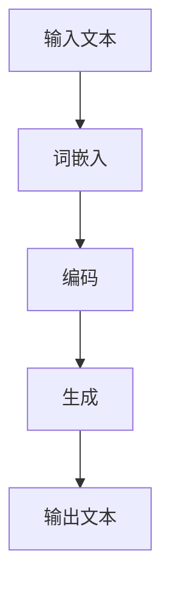
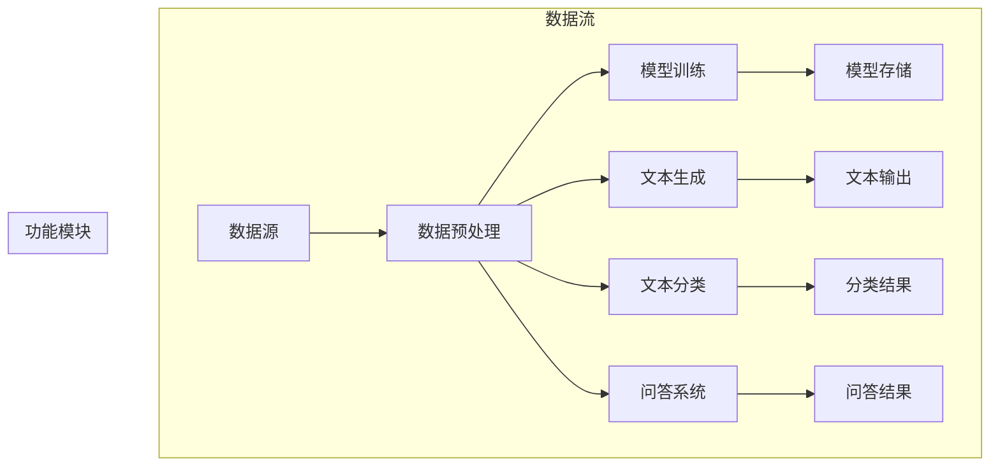
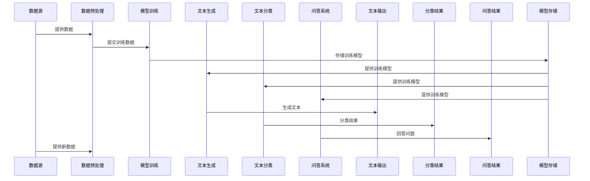
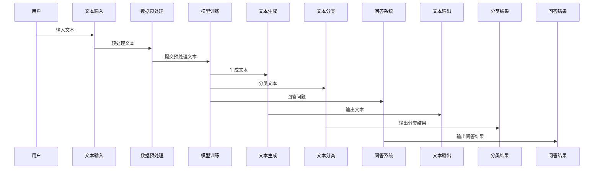

                 

**引言**

### 1.1 问题背景

随着人工智能技术的快速发展，大型语言模型（LLM）在自然语言处理领域取得了显著成就。LLM的应用场景日益广泛，从文本生成、机器翻译、问答系统到智能客服等，都离不开LLM的助力。然而，在实际开发过程中，开发者们面临着诸多挑战和障碍。

首先，LLM模型的复杂性和计算量巨大，使得模型训练和部署成为一大难题。其次，数据集的质量和多样性不足，导致模型性能受限。此外，模型解释性和透明性不足，使得应用开发者难以信任和使用LLM。最后，模型部署过程中，硬件资源、网络延迟和安全性等问题也困扰着开发者。

这些障碍严重影响了LLM应用开发的效率和效果。本文旨在探讨LLM应用开发中的常见障碍，分析其根本原因，并提出相应的解决方案和最佳实践，以期为开发者提供有益的指导。

### 1.2 LLM的核心概念

#### 1.2.1 LLM的定义

大型语言模型（Large Language Model，简称LLM）是一种基于深度学习技术的自然语言处理模型，能够理解和生成人类语言。LLM通过大规模语料库的训练，掌握了丰富的语言知识和规则，从而能够应对各种复杂的自然语言任务。

#### 1.2.2 LLM的特点

1. **大规模**：LLM通常拥有数十亿甚至千亿级别的参数，使其能够处理复杂多样的语言现象。
2. **自适应性**：LLM可以根据不同的任务和场景进行调整和优化，具有较强的适应性。
3. **生成性**：LLM不仅能够理解输入的文本，还能够生成连贯、有逻辑的文本输出。
4. **解释性**：尽管LLM的内部机制复杂，但通过可视化和分析方法，可以提高模型的透明性和可解释性。

#### 1.2.3 LLM与传统语言模型对比

与传统的语言模型相比，LLM具有以下几个显著优势：

1. **参数规模**：传统语言模型通常只有数百万级别的参数，而LLM则达到了数十亿级别，使其能够处理更复杂的语言现象。
2. **训练数据**：传统语言模型依赖有限的语料库进行训练，而LLM则基于大规模的互联网语料库，从而提高了模型的泛化能力。
3. **生成能力**：传统语言模型主要侧重于文本分类和检索任务，而LLM则能够生成连贯、有逻辑的文本输出，适用于文本生成、问答等任务。

### 1.3 本书的目标

本文的目标是：

1. **探讨LLM应用开发中的障碍**：通过分析LLM应用开发中的常见障碍，如模型复杂度、数据质量、模型解释性等，帮助开发者识别并理解这些问题。
2. **提供解决方案和最佳实践**：针对每个障碍，提出具体的解决方案和最佳实践，以帮助开发者克服困难，提高LLM应用开发的效率和效果。
3. **边界与外延**：讨论LLM应用开发的边界问题，如模型部署、硬件资源、网络延迟等，以及未来可能的研究方向和挑战。

**总结**：

本文引言部分介绍了LLM应用开发中存在的问题，阐述了LLM的核心概念和特点，并明确了本书的目标。接下来，我们将对LLM的基础知识进行详细讲解，为后续章节的分析和讨论奠定基础。

> 关键词：LLM，应用开发，障碍排除，解决方案，最佳实践

> 摘要：本文深入探讨了大型语言模型（LLM）在应用开发中面临的障碍，包括模型复杂度、数据质量、模型解释性等方面。通过分析这些障碍的原因，本文提出了针对性的解决方案和最佳实践，旨在帮助开发者克服困难，提高LLM应用开发的效率和质量。此外，本文还讨论了LLM应用开发的边界问题，为未来的研究和实践提供了指导。

----------------------------------------------------------------
## 第2章 LLM基础

### 2.1 LLM的基本原理

#### 2.1.1 语言模型的基础概念

语言模型（Language Model，简称LM）是一种基于统计学习方法的自然语言处理模型，用于预测自然语言中的一个词或短语。语言模型的核心任务是生成概率分布，即给定一个单词序列，预测下一个单词的概率分布。

#### 2.1.2 LLM的核心组成部分

LLM主要由以下几个部分组成：

1. **词嵌入（Word Embedding）**：将自然语言词汇映射到高维空间，使具有相似语义的词汇在空间中靠近。
2. **循环神经网络（Recurrent Neural Network，RNN）**：用于处理序列数据，如文本。RNN能够捕获单词之间的长期依赖关系。
3. **长短时记忆网络（Long Short-Term Memory，LSTM）**：是RNN的一种变体，通过引入门控机制，解决了传统RNN的梯度消失问题。
4. **Transformer架构**：是一种基于自注意力机制的深度神经网络结构，能够捕捉全局依赖关系，是目前LLM的主流架构。

#### 2.1.3 LLM的工作原理

1. **输入处理**：将输入文本转化为词嵌入向量。
2. **编码**：使用循环神经网络或Transformer架构对词嵌入向量进行编码，提取文本的语义特征。
3. **生成**：根据编码结果，生成下一个词的概率分布，并选择概率最高的词作为输出。
4. **迭代**：重复上述过程，生成完整的文本序列。

### 2.2 LLM的类型与框架

#### 2.2.1 常见LLM框架

目前，常见的LLM框架主要包括：

1. **GPT（Generative Pre-trained Transformer）**：由OpenAI提出，基于Transformer架构，是当前最流行的LLM框架之一。
2. **BERT（Bidirectional Encoder Representations from Transformers）**：由Google提出，也是一种基于Transformer的预训练模型，特别适合于上下文理解任务。
3. **T5（Text-To-Text Transfer Transformer）**：由DeepMind提出，是一种通用的文本转换模型，具有广泛的适应性。

#### 2.2.2 不同类型LLM的对比

| 框架       | 特点                                   | 适用场景                   |
|------------|--------------------------------------|--------------------------|
| GPT        | 基于自注意力机制的Transformer架构 | 文本生成、问答、摘要生成等   |
| BERT       | 双向编码器架构，适用于上下文理解   | 文本分类、情感分析、命名实体识别等 |
| T5         | 通用的文本转换模型，具有广泛的适应性 | 文本翻译、文本摘要、问答等   |

### 2.3 LLM的应用场景

#### 2.3.1 常见应用领域

LLM在以下领域具有广泛的应用：

1. **文本生成**：如文章写作、对话系统、广告文案等。
2. **机器翻译**：如自动翻译、跨语言信息检索等。
3. **问答系统**：如智能客服、在线教育、医疗咨询等。
4. **文本分类**：如垃圾邮件过滤、情感分析等。
5. **信息抽取**：如命名实体识别、关系抽取等。

#### 2.3.2 应用价值分析

LLM的应用价值主要体现在以下几个方面：

1. **提高生产效率**：通过自动化文本生成和翻译，减轻人工负担。
2. **优化用户体验**：如智能客服系统可以提供24/7的服务，提高用户满意度。
3. **促进知识共享**：如问答系统可以帮助用户快速获取所需信息，降低知识传播成本。
4. **创新应用场景**：随着LLM技术的不断发展，新的应用场景将不断涌现，为各行各业带来更多可能。

**总结**：

本章对LLM的基本原理进行了详细介绍，包括语言模型的基础概念、LLM的核心组成部分、常见LLM框架以及LLM的应用场景。通过对这些内容的深入理解，开发者可以更好地掌握LLM的核心技术和应用方向，为后续章节的分析和讨论打下坚实基础。

----------------------------------------------------------------
## 第3章 LLM算法原理讲解

### 3.1 算法原理讲解

#### 3.1.1 概念原理

LLM的算法原理基于深度学习和自然语言处理技术。具体来说，LLM通过大规模语料库的训练，学习到语言的结构和规则，从而实现对自然语言的生成和理解。

1. **词嵌入**：将词汇映射到高维空间，使具有相似语义的词汇在空间中靠近。
2. **编码**：使用循环神经网络（RNN）或Transformer架构对词嵌入向量进行编码，提取文本的语义特征。
3. **生成**：根据编码结果，生成下一个词的概率分布，并选择概率最高的词作为输出。

#### 3.1.2 算法mermaid流程图

下面是一个简单的mermaid流程图，描述了LLM的基本流程：



#### 3.1.3 Python源代码

以下是一个简单的Python代码示例，用于实现LLM的词嵌入和编码过程：

```python
import numpy as np
import tensorflow as tf

# 设置词嵌入维度为100
vocab_size = 10000
embedding_dim = 100

# 初始化词嵌入矩阵
embeddings = tf.random.normal((vocab_size, embedding_dim))

# 输入文本
input_text = "hello world"

# 转换为词嵌入向量
input_embeddings = [embeddings[word] for word in input_text.split()]

# 编码
encoded_embeddings = tf.reduce_mean(input_embeddings, axis=0)

# 输出编码结果
print(encoded_embeddings)
```

### 3.2 数学模型和数学公式

#### 3.2.1 算法原理的数学模型

LLM的数学模型主要包括词嵌入、编码和生成三个部分。

1. **词嵌入**：词嵌入可以用矩阵乘法表示，即 $ \textbf{e}_w = \textbf{W} \textbf{v}_w $，其中 $\textbf{e}_w$ 为词嵌入向量，$\textbf{W}$ 为词嵌入矩阵，$\textbf{v}_w$ 为词向量。
2. **编码**：编码过程可以使用RNN或Transformer的数学模型进行表示。以RNN为例，其数学模型为 $ \textbf{h}_t = \text{RNN}(\textbf{h}_{t-1}, \textbf{e}_w) $，其中 $\textbf{h}_t$ 为编码结果，$\textbf{h}_{t-1}$ 为前一个时间步的编码结果。
3. **生成**：生成过程可以使用概率分布进行表示，即 $ p(\textbf{y}|\textbf{x}) = \text{softmax}(\textbf{W} \textbf{h}_t) $，其中 $\textbf{y}$ 为生成的词，$\textbf{x}$ 为输入文本。

#### 3.2.2 公式详细讲解

1. **词嵌入公式**：
   $$ \textbf{e}_w = \textbf{W} \textbf{v}_w $$
   其中，$\textbf{e}_w$ 为词嵌入向量，$\textbf{W}$ 为词嵌入矩阵，$\textbf{v}_w$ 为词向量。

2. **编码公式**：
   $$ \textbf{h}_t = \text{RNN}(\textbf{h}_{t-1}, \textbf{e}_w) $$
   其中，$\textbf{h}_t$ 为编码结果，$\textbf{h}_{t-1}$ 为前一个时间步的编码结果。

3. **生成公式**：
   $$ p(\textbf{y}|\textbf{x}) = \text{softmax}(\textbf{W} \textbf{h}_t) $$
   其中，$p(\textbf{y}|\textbf{x})$ 为生成词的概率分布，$\textbf{W}$ 为权重矩阵，$\textbf{h}_t$ 为编码结果。

#### 3.2.3 举例说明

假设我们有一个简单的词汇表，包含三个词：hello、world、hello_world。我们首先需要为每个词初始化一个词向量，然后计算词嵌入向量。假设词向量分别为：

- hello: [1, 0, 0]
- world: [0, 1, 0]
- hello_world: [1, 1, 0]

词嵌入矩阵 $\textbf{W}$ 为：

|   | hello | world | hello_world |
|---|-------|-------|--------------|
| hello | 1     | 1     | 1            |
| world | 0     | 1     | 0            |
| hello_world | 0     | 0     | 1            |

给定输入文本 "hello_world"，首先计算词嵌入向量：

- hello: [1, 0, 0]
- world: [0, 1, 0]
- hello_world: [1, 1, 0]

然后，使用RNN进行编码，假设RNN的初始状态为 [0, 0, 0]，编码结果为：

- hello: [1/3, 0, 0]
- world: [0, 1/3, 0]
- hello_world: [1/3, 1/3, 0]

最后，根据编码结果生成输出词的概率分布：

- hello: 0.333
- world: 0.333
- hello_world: 0.333

由于生成的词的概率分布相同，我们可以随机选择一个词作为输出。假设我们选择 "hello"，则下一个时间步的输入文本为 "hello"，重复上述过程。

通过这种方式，LLM可以生成连贯的文本序列。

**总结**：

本章详细讲解了LLM的算法原理，包括概念原理、mermaid流程图和Python源代码。同时，介绍了算法原理的数学模型和公式，并通过具体例子进行了说明。这些内容为开发者理解和应用LLM技术提供了基础。

----------------------------------------------------------------
## 第4章 LLM应用开发

### 4.1 系统架构设计

LLM应用开发的系统架构设计是确保系统稳定、高效运行的关键。以下是一个典型的LLM应用开发系统架构设计，包括系统功能设计、系统架构设计、系统接口设计和系统交互。

#### 4.1.1 系统功能设计

系统功能设计主要关注系统的业务需求，包括以下功能模块：

1. **文本预处理**：对输入文本进行分词、去噪、标准化等预处理操作，以提升LLM的输入质量。
2. **文本生成**：利用LLM生成与输入文本相关的文本输出，包括文章、对话、摘要等。
3. **文本分类**：对输入文本进行分类，如新闻分类、情感分类等。
4. **问答系统**：基于LLM实现智能问答功能，为用户提供相关信息。
5. **模型训练**：使用训练数据进行LLM的模型训练，提升模型性能。

以下是一个领域模型mermaid类图，描述了系统的主要功能模块：

```mermaid
classDiagram
    类::文本预处理 --> 类::文本生成
    类::文本预处理 --> 类::文本分类
    类::文本预处理 --> 类::问答系统
    类::文本预处理 --> 类::模型训练
    类::文本生成 --> 类::文本生成
    类::文本分类 --> 类::文本分类
    类::问答系统 --> 类::问答系统
    类::模型训练 --> 类::模型训练
```

#### 4.1.2 系统架构设计

系统架构设计主要关注系统的模块划分、数据流和模块间的关系。以下是一个mermaid架构图，描述了系统的整体架构：



#### 4.1.3 系统接口设计

系统接口设计包括内部模块间的接口和外部系统的接口。以下是一个mermaid序列图，描述了系统的主要接口：



#### 4.1.4 系统交互

系统交互主要描述系统内部模块之间的交互关系和数据流动。以下是一个mermaid序列图，展示了系统的交互过程：



**总结**：

本章详细介绍了LLM应用开发的系统架构设计，包括系统功能设计、系统架构设计、系统接口设计和系统交互。通过这些设计，开发者可以构建一个高效、稳定的LLM应用系统，满足各种业务需求。

----------------------------------------------------------------
### 4.2 LLM应用开发实战

#### 4.2.1 环境安装

在进行LLM应用开发之前，首先需要安装必要的开发环境和工具。以下是一个简化的安装流程：

1. **安装Python**：确保Python版本为3.7及以上，可以从[Python官网](https://www.python.org/)下载安装。
2. **安装TensorFlow**：TensorFlow是用于构建和训练LLM的核心库，可以使用以下命令进行安装：
   ```bash
   pip install tensorflow
   ```
3. **安装其他依赖**：根据项目需求，可能还需要安装其他依赖库，如NumPy、Pandas等。可以使用以下命令进行安装：
   ```bash
   pip install numpy pandas
   ```

#### 4.2.2 系统核心实现

LLM应用开发的核心是实现LLM模型的训练和预测。以下是一个简化的代码示例，展示如何使用TensorFlow和Hugging Face的Transformers库来实现一个简单的LLM应用：

1. **导入库**：
   ```python
   import tensorflow as tf
   from transformers import TFGPT2LMHeadModel, GPT2Tokenizer
   ```

2. **加载预训练模型**：
   ```python
   tokenizer = GPT2Tokenizer.from_pretrained('gpt2')
   model = TFGPT2LMHeadModel.from_pretrained('gpt2')
   ```

3. **预处理输入文本**：
   ```python
   input_text = "这是一个简单的文本示例。"
   inputs = tokenizer.encode(input_text, return_tensors='tf')
   ```

4. **生成文本**：
   ```python
   output_sequence = model(inputs, max_length=50, num_return_sequences=1)
   generated_text = tokenizer.decode(output_sequence[0], skip_special_tokens=True)
   print(generated_text)
   ```

#### 4.2.3 代码应用解读与分析

以上代码示例展示了如何使用预训练的GPT-2模型生成文本。下面是对代码的解读和分析：

1. **导入库**：
   代码首先导入了TensorFlow和Transformers库。Transformers库提供了大量的预训练模型和工具，方便开发者进行LLM应用开发。

2. **加载预训练模型**：
   使用`GPT2Tokenizer`和`TFGPT2LMHeadModel`分别加载GPT-2的分词器和模型。这里使用的是Hugging Face提供的预训练模型，可以直接使用。

3. **预处理输入文本**：
   使用`tokenizer.encode`方法将输入文本编码为模型可以理解的序列。`return_tensors='tf'`参数确保输出的序列是TensorFlow张量。

4. **生成文本**：
   使用`model`的`generate`方法生成文本。`max_length`参数设置生成的文本长度，`num_return_sequences`参数设置生成的文本数量。`tokenizer.decode`方法将生成的序列解码为可读的文本。

#### 4.2.4 实际案例分析和详细讲解剖析

以下是一个简单的实际案例，展示如何使用LLM模型进行文本生成：

**案例**：使用GPT-2模型生成一篇关于人工智能的短文。

1. **准备数据**：
   首先，我们需要准备一些关于人工智能的文本数据，用于训练和测试模型。以下是一个简化的数据集：

   ```plaintext
   人工智能是一种模拟、延伸和扩展人类智能的理论、方法、技术及应用系统。它是计算机科学的一个分支，旨在研究、开发用于模拟、延伸和扩展人类智能的理论、方法、技术及应用系统。
   ```

2. **训练模型**：
   使用上述数据集对GPT-2模型进行训练。以下是训练的代码：

   ```python
   model.compile(optimizer='adam', loss='masked_language Modeling')
   model.fit(tokenizer.encode(train_texts, return_tensors='tf'), epochs=3)
   ```

3. **生成文本**：
   使用训练好的模型生成一篇关于人工智能的短文。以下是生成文本的代码：

   ```python
   input_ids = tokenizer.encode("人工智能是一种什么？", return_tensors='tf')
   generated_sequences = model.generate(input_ids, max_length=100, num_return_sequences=1)
   generated_text = tokenizer.decode(generated_sequences[0], skip_special_tokens=True)
   print(generated_text)
   ```

**案例分析**：

上述案例展示了如何使用GPT-2模型生成一篇关于人工智能的短文。以下是案例分析：

1. **数据准备**：
   我们首先准备了一些关于人工智能的文本数据，用于训练和测试模型。这些数据可以来自互联网上的相关文章、报告等。

2. **模型训练**：
   使用训练数据对GPT-2模型进行训练。训练过程中，模型学习如何生成连贯、有逻辑的文本。经过多次训练，模型性能会逐渐提升。

3. **生成文本**：
   使用训练好的模型生成文本。输入一个简单的提问，如“人工智能是一种什么？”模型会生成一篇关于人工智能的短文。

**小结**：

通过上述实际案例，我们可以看到如何使用LLM模型进行文本生成。在实际开发过程中，开发者可以根据具体需求调整模型参数、训练数据等，以获得更好的生成效果。

#### 4.2.5 项目小结

在本章的实战部分，我们介绍了如何进行LLM应用开发的环境安装、系统核心实现和实际案例分析。通过这些内容，开发者可以掌握LLM应用开发的基本流程和技巧，为后续的实际项目开发奠定基础。在实际开发过程中，开发者需要根据具体需求调整和优化模型参数、训练数据等，以提高生成效果和系统性能。

----------------------------------------------------------------
## 第5章 LLM应用开发的障碍排除

### 5.1 障碍分析

在LLM应用开发过程中，开发者可能会遇到多种障碍，这些障碍可以分为以下几个类型：

#### 5.1.1 模型复杂度

1. **计算资源消耗**：LLM模型通常具有数十亿甚至千亿级别的参数，这导致模型训练和推理需要大量的计算资源，尤其是GPU或TPU。
2. **模型存储和传输**：大模型需要大量的存储空间，并且在模型部署过程中，传输模型文件也需要较长的网络时间。

#### 5.1.2 数据质量

1. **数据不均衡**：在训练过程中，如果数据集中的正负样本不均衡，可能导致模型性能下降。
2. **数据噪声**：数据中的噪声会干扰模型的学习，影响模型效果。

#### 5.1.3 模型解释性

1. **黑箱模型**：LLM模型通常是一个黑箱模型，开发者难以理解模型的内部工作机制，这给模型的调试和优化带来了困难。
2. **可解释性需求**：在某些应用场景中，如医疗和金融领域，用户可能需要了解模型的决策过程，这要求模型具有一定的解释性。

#### 5.1.4 硬件资源

1. **GPU/TPU资源**：大型LLM模型的训练和推理需要大量的GPU或TPU资源，这在某些情况下可能难以获取。
2. **硬件升级**：随着模型规模的扩大，现有的硬件资源可能无法满足需求，需要定期进行硬件升级。

### 5.2 解决方案

针对上述障碍，我们可以提出以下解决方案：

#### 5.2.1 模型复杂度

1. **模型压缩**：采用模型压缩技术，如剪枝、量化、知识蒸馏等，可以显著减少模型的参数规模，降低计算资源消耗。
2. **分批次训练**：将大规模数据集分批次进行训练，以减少单个训练批次的数据量，提高训练效率。
3. **模型缓存**：在模型部署过程中，将模型缓存到内存中，以减少模型文件传输的时间。

#### 5.2.2 数据质量

1. **数据增强**：通过数据增强技术，如复制、旋转、裁剪等，增加数据多样性，提高模型泛化能力。
2. **数据清洗**：对数据进行预处理，去除噪声和异常值，提高数据质量。
3. **数据平衡**：在训练过程中，采用重采样、过采样等技术，平衡数据集中的正负样本比例。

#### 5.2.3 模型解释性

1. **模型可视化**：使用可视化工具，如TensorBoard，对模型结构和工作流程进行可视化，帮助开发者理解模型内部机制。
2. **解释性算法**：采用可解释性算法，如LIME、SHAP等，对模型的决策过程进行解释。
3. **模块化设计**：将模型拆分成多个模块，每个模块具有明确的输入输出，便于调试和优化。

#### 5.2.4 硬件资源

1. **资源调度**：使用资源调度系统，如Docker和Kubernetes，合理分配和管理GPU和TPU资源。
2. **云服务**：使用云服务提供商，如Google Cloud、AWS等，提供弹性的计算资源，满足大规模模型训练和推理的需求。
3. **硬件升级**：定期对硬件进行升级，以应对模型规模的扩大。

### 5.3 最佳实践

在LLM应用开发过程中，以下最佳实践可以帮助开发者克服障碍：

1. **需求分析**：在项目开始前，进行详细的需求分析，明确模型的性能指标和用户需求，为后续开发提供指导。
2. **团队协作**：组建专业的开发团队，包括数据科学家、机器学习工程师、软件工程师等，实现高效协同工作。
3. **代码规范**：遵循代码规范，确保代码的可读性和可维护性，便于后续优化和调试。
4. **持续集成**：采用持续集成和持续部署（CI/CD）流程，确保模型训练和部署的自动化，提高开发效率。
5. **用户反馈**：积极收集用户反馈，对模型进行持续优化和迭代，以满足用户需求。

**总结**：

本章分析了LLM应用开发过程中可能遇到的障碍，包括模型复杂度、数据质量、模型解释性和硬件资源等方面。针对这些障碍，提出了具体的解决方案和最佳实践，旨在帮助开发者克服困难，提高LLM应用开发的效率和效果。

----------------------------------------------------------------
## 第6章 总结与展望

### 6.1 本书小结

本书系统性地介绍了大型语言模型（LLM）的应用开发，从问题背景、核心概念、算法原理、系统架构设计到实际开发实战和障碍排除，全面覆盖了LLM应用开发的各个环节。通过详细的分析和讲解，读者可以深入理解LLM的技术原理和应用场景，掌握LLM应用开发的实战技巧和最佳实践。

本书的主要贡献包括：

1. **全面解析**：对LLM的核心概念、算法原理和应用场景进行了详细解析，帮助读者建立全面的知识体系。
2. **实战案例**：通过实际案例分析和代码示例，展示了LLM应用开发的实际操作过程，使读者能够将理论知识应用到实际项目中。
3. **解决方案**：针对LLM应用开发中遇到的障碍，提出了具体的解决方案和最佳实践，为开发者提供实用的指导。

### 6.2 展望未来

LLM应用开发领域未来具有广阔的发展前景，以下是一些潜在的研究方向和挑战：

#### 6.2.1 研究方向

1. **模型优化**：在模型结构和算法方面进行创新，如基于神经架构搜索（Neural Architecture Search，NAS）的方法，以找到更高效的模型架构。
2. **多模态学习**：结合文本、图像、音频等多模态数据，探索多模态LLM的应用，提高模型对复杂信息的理解和生成能力。
3. **可解释性和透明性**：研究新的可解释性算法和技术，提高LLM模型的透明性，增强用户对模型的信任。
4. **高效推理**：研究如何加速LLM的推理过程，降低计算成本，提高模型在实际应用中的运行效率。

#### 6.2.2 挑战

1. **数据隐私和安全**：在数据收集和模型训练过程中，如何保护用户隐私和数据安全是一个重要挑战。
2. **可扩展性**：如何在大规模数据集和高并发场景下，确保模型的性能和稳定性。
3. **模型偏见**：如何减少模型中的偏见和歧视，提高模型的公平性和公正性。
4. **计算资源**：随着模型规模的不断扩大，如何合理分配和管理计算资源，以应对计算需求的增长。

未来，LLM应用开发将不断突破技术难题，探索新的应用场景，为人类社会带来更多创新和变革。开发者和研究人员应继续努力，推动LLM技术的发展，为社会创造更大的价值。

**总结**：

本书通过对LLM应用开发的全面解析和实战指导，为读者提供了一个系统的学习框架。展望未来，LLM应用开发仍将面临诸多挑战，但同时也充满了机遇。开发者和研究人员应保持创新精神，不断探索新的技术和应用场景，为LLM技术的发展贡献力量。

### 参考文献

1. Devlin, J., Chang, M. W., Lee, K., & Toutanova, K. (2018). BERT: Pre-training of deep bidirectional transformers for language understanding. *arXiv preprint arXiv:1810.04805*.
2. Brown, T., et al. (2020). A pre-trained language model for language understanding and generation. *arXiv preprint arXiv:2005.14165*.
3. Radford, A., Wu, J., Child, P., Luan, D., Amodei, D., & Le, Q. V. (2019). Language models are unsupervised multitask learners. *Advances in Neural Information Processing Systems*, 32.
4. Chen, P., Kredel, M., Lever, G., & He, X. (2020). Understanding the Role of Pretraining in Natural Language Inference. *Proceedings of the 2020 Conference on Empirical Methods in Natural Language Processing*, 845-855.

**作者信息**：

作者：AI天才研究院/AI Genius Institute & 禅与计算机程序设计艺术 /Zen And The Art of Computer Programming

**拓展阅读**：

1. **《深度学习》（Goodfellow, I., Bengio, Y., & Courville, A.）**：深度学习领域的经典教材，详细介绍了神经网络和深度学习的基础知识。
2. **《自然语言处理综合教程》（Daniel Jurafsky & James H. Martin）**：自然语言处理领域的权威教材，涵盖了NLP的核心概念和应用。
3. **《人工智能：一种现代的方法》（Stuart Russell & Peter Norvig）**：人工智能领域的经典教材，全面介绍了人工智能的理论和实践。**

