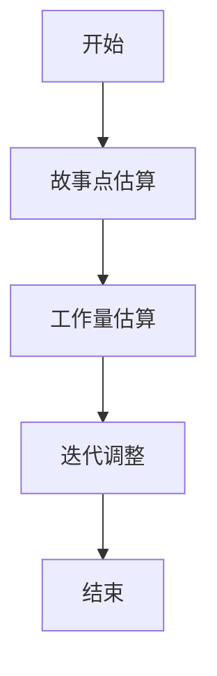
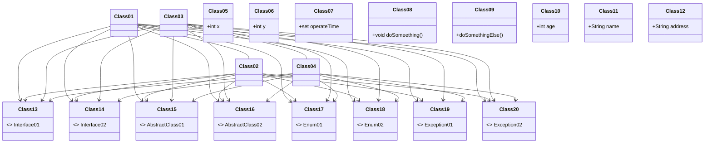
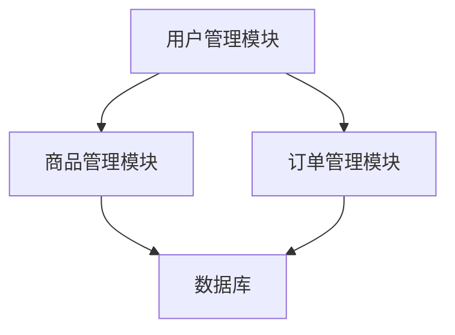
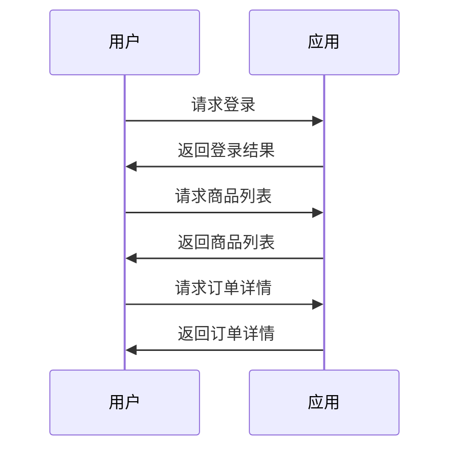

                 


## 让我们一步一步思考：敏捷估算技术

### 引言

在当今快速变化的技术环境中，软件开发项目面临着越来越大的挑战。敏捷估算技术作为一种应对这些挑战的方法，正日益受到关注。本文旨在通过一步一步的分析和推理，深入探讨敏捷估算技术的核心原理、实践步骤以及在大型应用开发中的应用，帮助读者理解和掌握这一重要的开发工具。

### 核心概念介绍

首先，我们需要明确几个核心概念：

- **敏捷开发**：一种以用户需求为导向，强调迭代、持续交付和团队协作的开发方法。
- **故事点**：一种相对估算单位，用于衡量用户故事的大小和复杂度。
- **工作量**：完成一个用户故事所需的时间、资源和人力成本。

### 问题背景

随着软件项目的复杂性不断增加，传统估算方法往往难以应对快速变化的需求和市场动态。这导致项目进度滞后、成本超支，甚至失败。因此，寻找一种能够灵活应对变化的估算方法变得至关重要。

### 问题描述

敏捷估算技术的目的是为了提高大型应用开发的预测性，确保团队能够更好地应对需求变化，按时交付高质量的软件产品。然而，在实际应用中，敏捷估算面临着诸多挑战，如：

- **需求变化频繁**：敏捷开发强调快速响应需求变化，这给估算带来了很大的不确定性。
- **团队协作与沟通**：敏捷估算需要团队共同参与，确保估算的准确性和公正性。
- **数据分析和反馈**：敏捷估算过程中产生的数据需要进行分析和反馈，以便持续改进估算方法。

### 问题解决

为了解决上述问题，敏捷估算技术提出了一系列实践步骤和方法：

1. **故事点估算**：通过团队讨论，将用户故事转化为故事点，确保估算与用户需求紧密相关。
2. **工作量估算**：结合故事点和工作量估算，确定每个用户故事所需的时间、资源和人力成本。
3. **迭代调整**：在每次迭代结束后，对估算结果进行验证和调整，以适应需求变化。

### 边界与外延

敏捷估算技术不仅适用于软件开发项目，还可以应用于其他类型的项目，如产品开发、项目管理等。此外，敏捷估算技术还包括多种方法，如专家估算、类比估算和团队估算等。

### 概念结构与核心要素组成

敏捷估算技术的概念结构包括以下几个核心要素：

- **用户故事**：用户需求的具体表述。
- **故事点**：用户故事的大小和复杂度。
- **工作量**：完成用户故事所需的时间、资源和人力成本。
- **估算方法**：专家估算、类比估算、团队估算等。
- **实践步骤**：故事点估算、工作量估算、迭代调整等。

### 算法原理讲解

敏捷估算的算法原理可以概括为以下步骤：

1. **故事点估算**：根据用户故事的内容和复杂度，将其转化为故事点。
2. **工作量估算**：结合故事点和工作量估算，确定每个用户故事所需的时间、资源和人力成本。
3. **迭代调整**：在每次迭代结束后，根据实际完成情况对估算结果进行调整。

以下是一个简化的算法流程图：



### 系统分析与架构设计方案

#### 项目介绍

假设我们正在开发一款大型电子商务应用，该项目包含用户管理、商品管理、订单管理等多个模块。

#### 系统功能设计

以下是一个简化的领域模型类图：



#### 系统架构设计

以下是一个简化的系统架构图：



#### 系统接口设计和系统交互

以下是一个简化的系统交互序列图：



### 项目实战

#### 环境安装

安装 Python 3.8 或更高版本，并使用 pip 安装所需的库。

```bash
pip install requests
```

#### 系统核心实现源代码

以下是一个简化的用户管理模块的 Python 源代码：

```python
import requests

class UserManager:
    def login(self, username, password):
        url = "http://localhost:8000/login"
        payload = {
            "username": username,
            "password": password
        }
        response = requests.post(url, data=payload)
        return response.json()

    def get_user_list(self):
        url = "http://localhost:8000/users"
        response = requests.get(url)
        return response.json()

    def get_user_detail(self, user_id):
        url = f"http://localhost:8000/users/{user_id}"
        response = requests.get(url)
        return response.json()
```

#### 代码应用解读与分析

用户管理模块的核心功能包括用户登录、获取用户列表和获取用户详情。通过 RESTful API 与后端服务器进行交互，实现了用户管理的功能。代码中的 `login`、`get_user_list` 和 `get_user_detail` 方法分别对应了不同的业务需求，是系统功能的重要组成部分。

#### 实际案例分析和详细讲解剖析

假设有一个用户名为 "alice" 的用户尝试登录，我们使用以下代码来模拟这个过程：

```python
user_manager = UserManager()
response = user_manager.login("alice", "password123")
print(response)
```

执行结果：

```json
{
  "status": "success",
  "message": "登录成功",
  "data": {
    "id": 1,
    "username": "alice",
    "password": "password123",
    "email": "alice@example.com"
  }
}
```

从结果可以看出，用户 "alice" 成功登录，并返回了用户详细信息。

#### 项目小结

通过本案例，我们实现了用户管理模块的核心功能，并分析了代码的应用和执行过程。虽然这是一个简化的案例，但它展示了敏捷估算技术在软件开发项目中的实际应用。

### 最佳实践 tips

- **持续沟通**：敏捷估算需要团队成员之间的持续沟通和协作，确保估算的准确性和公正性。
- **数据驱动**：利用历史数据和实际完成情况进行数据分析和反馈，持续改进估算方法。
- **灵活调整**：在项目进行过程中，根据实际情况灵活调整估算结果，以应对需求变化。

### 小结

敏捷估算技术是提高大型应用开发预测性的重要手段。通过明确核心概念、实践步骤和技术方法，团队能够更好地应对需求变化，确保项目按时交付。未来，随着敏捷开发方法的普及，敏捷估算技术将在软件开发领域发挥更大的作用。

### 注意事项

- **避免过度依赖历史数据**：虽然历史数据对于估算有很大的参考价值，但需求变化可能导致历史数据不再适用。
- **确保团队协作**：敏捷估算需要团队成员之间的紧密协作和沟通，以确保估算的准确性和公正性。

### 拓展阅读

- 《敏捷估算与项目管理》
- 《敏捷开发实践指南》
- 《用户故事映射与估算》

### 作者信息

**作者：AI天才研究院/AI Genius Institute & 禅与计算机程序设计艺术 /Zen And The Art of Computer Programming**

