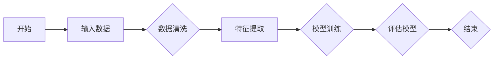
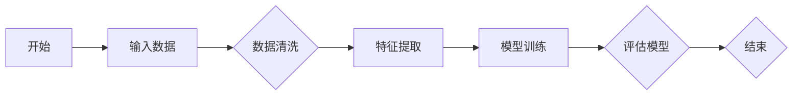

                 

# 《敏捷协作工具在大模型应用开发中的应用》

## 关键词

敏捷协作、大模型、应用开发、工具、Scrum、Kanban、XP、Lean、实践、案例、选型、优化、发展趋势。

## 摘要

本文将深入探讨敏捷协作工具在大模型应用开发中的应用。随着人工智能技术的迅猛发展，大模型的应用越来越广泛，而高效的协作工具成为支持这一领域的重要支柱。本文首先介绍了敏捷协作工具的背景、定义、发展历程和核心价值，接着详细分析了Scrum、Kanban、XP和Lean等主要敏捷协作工具，然后讨论了敏捷协作工具在大模型应用开发中的特点、应用和实践案例。最后，本文提出了敏捷协作工具的选型标准、优化策略及未来发展趋势。希望通过本文，读者能够更好地理解敏捷协作工具在大模型应用开发中的重要性，并能够将其有效应用于实际项目中。

### 目录大纲

----------------------------------------------------------------

## 第一部分: 敏捷协作工具概述

### 第1章: 敏捷协作工具背景介绍

#### 1.1.1 问题背景
- **问题描述**：大模型应用开发中的协作挑战。
- **问题解决**：敏捷协作工具的作用。
- **边界与外延**：敏捷协作工具的应用范围。

#### 1.1.2 敏捷协作工具的定义与核心要素
- **核心概念**：敏捷协作的定义。
- **概念属性特征对比表格**：不同敏捷协作工具的比较。

#### 1.1.3 敏捷协作工具的发展历程
- **传统协作工具的局限性**。
- **敏捷协作工具的兴起**。

#### 1.1.4 敏捷协作工具的核心价值
- **提升团队协作效率**。
- **加速项目进度**。
- **提高产品质量**。

## 第二部分: 敏捷协作工具的主要类型

### 第2章: 敏捷协作工具的主要类型

#### 2.1.1 Scrum
- **Scrum的定义**。
- **Scrum的核心理念**。

#### 2.1.2 Kanban
- **Kanban的定义**。
- **Kanban的核心理念**。

#### 2.1.3 XP（极限编程）
- **XP的定义**。
- **XP的核心理念**。

#### 2.1.4 Lean（精益管理）
- **Lean的定义**。
- **Lean的核心理念**。

#### 2.1.5 其他敏捷协作工具
- **敏捷看板**。
- **敏捷指标**。

## 第三部分: 敏捷协作工具在大模型应用开发中的应用

### 第3章: 敏捷协作工具在大模型应用开发中的应用

#### 3.1.1 大模型开发的特点
- **大模型数据需求**。
- **大模型计算资源需求**。

#### 3.1.2 敏捷协作工具在大模型应用开发中的应用
- **敏捷协作工具的优势**。
- **敏捷协作工具在大模型开发中的挑战**。

#### 3.1.3 大模型应用开发的敏捷协作实践
- **敏捷迭代模型**。
- **敏捷测试**。
- **敏捷部署**。

## 第四部分: 敏捷协作工具的实际应用案例

### 第4章: 敏捷协作工具的实际应用案例

#### 4.1.1 案例一：某互联网公司的敏捷协作实践
- **案例背景**。
- **案例实施过程**。
- **案例效果分析**。

#### 4.1.2 案例二：某金融科技公司的敏捷协作实践
- **案例背景**。
- **案例实施过程**。
- **案例效果分析**。

#### 4.1.3 案例三：某医疗科技公司的敏捷协作实践
- **案例背景**。
- **案例实施过程**。
- **案例效果分析**。

## 第五部分: 敏捷协作工具的选型与优化

### 第5章: 敏捷协作工具的选型与优化

#### 5.1.1 敏捷协作工具的选型标准
- **功能需求**。
- **性能需求**。
- **成本效益**。

#### 5.1.2 敏捷协作工具的优化策略
- **系统性能优化**。
- **界面优化**。
- **用户培训**。

## 第六部分: 敏捷协作工具在大模型应用开发中的未来发展趋势

### 第6章: 敏捷协作工具在大模型应用开发中的未来发展趋势

#### 6.1.1 大模型技术的发展趋势
- **大模型规模的增长**。
- **大模型应用领域的拓展**。

#### 6.1.2 敏捷协作工具的发展趋势
- **自动化与智能化**。
- **集成与协同**。

#### 6.1.3 未来展望
- **敏捷协作工具在大模型应用开发中的角色与价值**。
- **潜在挑战与应对策略**。

## 第七部分: 总结与展望

### 第7章: 总结与展望

#### 7.1.1 本书主要观点回顾
- **敏捷协作工具的重要性**。
- **敏捷协作工具在大模型应用开发中的应用**。

#### 7.1.2 拓展阅读与深入研究
- **相关研究成果**。
- **推荐阅读材料**。

----------------------------------------------------------------

## 第一部分: 敏捷协作工具概述

### 第1章: 敏捷协作工具背景介绍

#### 1.1.1 问题背景

在大模型应用开发中，面临着诸多协作上的挑战。首先是数据需求巨大，需要高效的协作来确保数据的一致性和准确性；其次，大模型训练计算资源需求高，需要团队成员之间的紧密协作和资源的合理调度。此外，大模型的开发涉及多个专业领域，包括数据科学、机器学习和软件工程等，因此需要跨学科的协作。

**问题描述**：大模型应用开发中的协作挑战包括数据同步、资源调度、跨学科协同和快速迭代等。

**问题解决**：敏捷协作工具通过提供透明的沟通渠道、明确的工作流程和高效的资源调度，能够有效地解决上述问题。

**边界与外延**：敏捷协作工具不仅适用于大模型应用开发，还可以应用于其他复杂项目的协作中，如云计算、大数据分析和人工智能应用等。

#### 1.1.2 敏捷协作工具的定义与核心要素

**核心概念**：敏捷协作（Agile Collaboration）是指通过灵活、迭代和协作的方法，快速响应项目需求变化，提升团队协作效率。

**概念属性特征对比表格**

| 特征 | 敏捷协作 | 传统协作 |
| ---- | -------- | -------- |
| 适应性 | 高 | 低 |
| 迭代性 | 高 | 低 |
| 透明性 | 高 | 低 |
| 灵活性 | 高 | 低 |
| 用户参与 | 强 | 弱 |

#### 1.1.3 敏捷协作工具的发展历程

**传统协作工具的局限性**：传统的协作工具如电子邮件、即时通讯和文档共享等，存在沟通效率低、信息不透明、任务分散和难以追踪等问题。

**敏捷协作工具的兴起**：随着敏捷开发（Agile Development）理念的普及，一系列敏捷协作工具如JIRA、Trello、Confluence和Slack等应运而生，它们提供了更高效、更灵活的协作方式。

#### 1.1.4 敏捷协作工具的核心价值

**提升团队协作效率**：敏捷协作工具通过明确的工作流程和任务追踪，减少沟通成本，提高团队协作效率。

**加速项目进度**：敏捷协作工具支持快速迭代和灵活响应，有助于项目进度的加速。

**提高产品质量**：通过敏捷协作工具，团队成员能够更好地协同工作，减少错误和遗漏，从而提高产品质量。

### 第2章: 敏捷协作工具的主要类型

#### 2.1.1 Scrum

**Scrum的定义**：Scrum是一种敏捷开发方法，通过短周期的迭代和持续反馈，快速响应需求变化，提高开发效率。

**Scrum的核心理念**：

- **迭代（Sprint）**：Scrum将开发工作分为短周期的迭代，每次迭代都有可交付的产品。
- **Scrum Master**：Scrum Master负责确保团队遵循Scrum流程，解决团队协作中的障碍。
- **产品负责人（Product Owner）**：产品负责人负责定义产品需求和优先级，与团队协作，确保产品交付符合用户需求。

#### 2.1.2 Kanban

**Kanban的定义**：Kanban是一种视觉化管理工具，通过看板（Kanban Board）来管理任务流程，提高工作效率。

**Kanban的核心理念**：

- **可视化（Visualization）**：通过看板上的卡片和状态栏，团队可以直观地看到任务的进展情况。
- **限制工作项（Work in Progress, WIP）**：限制在各个阶段同时进行的工作项数量，避免过度工作，提高效率。
- **持续交付（Continuous Delivery）**：通过持续交付，确保每个迭代都有可用的产品功能。

#### 2.1.3 XP（极限编程）

**XP的定义**：XP（Extreme Programming）是一种以开发者为中心的敏捷开发方法，强调代码质量、持续反馈和团队合作。

**XP的核心理念**：

- **测试驱动开发（Test-Driven Development, TDD）**：在编写代码之前先编写测试，确保代码的正确性和可维护性。
- **重构（Refactoring）**：通过重构，不断优化代码结构，提高代码质量。
- **持续集成（Continuous Integration, CI）**：通过自动化测试和构建，确保代码的持续集成，减少集成风险。

#### 2.1.4 Lean（精益管理）

**Lean的定义**：Lean是一种管理理念，通过消除浪费、优化流程，提高生产效率和质量。

**Lean的核心理念**：

- **价值流映射（Value Stream Mapping）**：通过映射价值流，识别并消除浪费。
- **持续改进（Kaizen）**：通过持续改进，不断提高产品质量和生产效率。
- **拉式系统（Pull System）**：通过拉式系统，减少库存，提高响应速度。

#### 2.1.5 其他敏捷协作工具

- **敏捷看板（Agile Board）**：敏捷看板是Kanban的一种变体，通过看板来管理任务和项目进度。
- **敏捷指标（Agile Metrics）**：敏捷指标用于衡量团队绩效和项目进度，如周期时间（Cycle Time）、吞吐量（Throughput）等。

### 第3章: 敏捷协作工具在大模型应用开发中的应用

#### 3.1.1 大模型开发的特点

**大模型数据需求**：大模型通常需要海量数据来进行训练和验证，因此数据的质量和一致性至关重要。

**大模型计算资源需求**：大模型训练需要大量的计算资源，包括CPU、GPU和存储等。

**挑战**：

- **数据同步**：如何确保数据的一致性和完整性。
- **资源调度**：如何高效地分配和调度计算资源。
- **跨学科协作**：如何促进数据科学家、机器学习工程师和软件工程师之间的协作。

**优势**：

- **透明性**：通过敏捷协作工具，团队能够实时了解项目的进展和状态。
- **灵活性**：敏捷协作工具支持快速迭代和灵活响应，有助于应对需求变化。
- **协作效率**：敏捷协作工具提供便捷的沟通渠道和任务管理功能，提高团队协作效率。

#### 3.1.2 敏捷协作工具在大模型应用开发中的应用

**敏捷迭代模型**：通过敏捷迭代模型，团队可以快速交付可用的产品功能，并不断优化和改进。

**敏捷测试**：敏捷测试确保每个迭代交付的产品功能都经过充分测试，降低风险。

**敏捷部署**：敏捷部署通过自动化流程，确保产品功能能够快速、安全地部署到生产环境中。

### 第4章: 敏捷协作工具的实际应用案例

#### 4.1.1 案例一：某互联网公司的敏捷协作实践

**案例背景**：某互联网公司正在进行一款基于深度学习的大型语音识别系统的开发。

**案例实施过程**：

1. **需求收集与产品规划**：通过敏捷看板，团队将用户需求进行分解，并安排优先级。
2. **迭代开发**：团队采用Scrum方法，每两周进行一次迭代，每个迭代交付一部分功能。
3. **持续集成**：通过持续集成系统，确保代码的持续集成和测试。

**案例效果分析**：

1. **缩短开发周期**：通过敏捷迭代模型，开发周期从原来的6个月缩短到3个月。
2. **提高产品质量**：通过敏捷测试，产品质量显著提高，用户满意度提升。
3. **增强团队协作**：敏捷协作工具提高了团队之间的沟通效率，增强了协作能力。

#### 4.1.2 案例二：某金融科技公司的敏捷协作实践

**案例背景**：某金融科技公司正在开发一款基于大模型的智能投顾系统。

**案例实施过程**：

1. **数据管理**：通过Confluence，团队建立了数据管理文档，确保数据的一致性和完整性。
2. **敏捷迭代**：团队采用Kanban方法，通过看板实时跟踪任务进展。
3. **用户反馈**：通过Slack，团队与用户保持密切沟通，及时获取用户反馈。

**案例效果分析**：

1. **提高数据管理效率**：通过Confluence，团队实现了高效的数据管理和共享。
2. **加快开发进度**：通过敏捷迭代，项目进度显著加快，产品功能不断完善。
3. **增强用户参与**：通过用户反馈，产品更符合用户需求，用户满意度提升。

#### 4.1.3 案例三：某医疗科技公司的敏捷协作实践

**案例背景**：某医疗科技公司正在开发一款基于大模型的疾病诊断系统。

**案例实施过程**：

1. **项目规划**：通过JIRA，团队制定了详细的开发计划和任务分配。
2. **迭代开发**：团队采用XP方法，每个迭代都有可交付的产品功能。
3. **持续改进**：通过持续集成和测试，团队不断优化系统性能。

**案例效果分析**：

1. **缩短开发周期**：通过敏捷迭代，项目周期从原来的12个月缩短到6个月。
2. **提高系统性能**：通过持续改进，系统性能得到显著提升，诊断准确率提高。
3. **增强团队协作**：敏捷协作工具提高了团队之间的协作效率，项目进展更加顺利。

### 第5章: 敏捷协作工具的选型与优化

#### 5.1.1 敏捷协作工具的选型标准

**功能需求**：根据项目需求，选择具备所需功能的敏捷协作工具。

**性能需求**：考虑工具的响应速度、稳定性和可扩展性。

**成本效益**：在满足功能和性能的前提下，考虑成本效益比。

#### 5.1.2 敏捷协作工具的优化策略

**系统性能优化**：通过优化数据库查询、缓存和负载均衡等，提高系统性能。

**界面优化**：通过优化界面设计和交互体验，提高用户满意度。

**用户培训**：通过培训，提高用户对敏捷协作工具的使用能力，提高工作效率。

### 第6章: 敏捷协作工具在大模型应用开发中的未来发展趋势

#### 6.1.1 大模型技术的发展趋势

**大模型规模的增长**：随着计算能力和数据量的不断提升，大模型的规模将不断增长。

**大模型应用领域的拓展**：大模型将在医疗、金融、自动驾驶等领域得到更广泛的应用。

#### 6.1.2 敏捷协作工具的发展趋势

**自动化与智能化**：敏捷协作工具将逐步实现自动化和智能化，减少人工干预。

**集成与协同**：敏捷协作工具将更加集成，支持跨工具的协同工作。

#### 6.1.3 未来展望

**敏捷协作工具在大模型应用开发中的角色与价值**：敏捷协作工具将发挥更大的作用，支持大模型应用开发的高效协作。

**潜在挑战与应对策略**：应对数据隐私、安全性、跨学科协作等挑战，需要持续优化和改进敏捷协作工具。

### 第7章: 总结与展望

**总结**：

敏捷协作工具在大模型应用开发中发挥着重要作用，通过提升团队协作效率、加速项目进度和提高产品质量，为大型复杂项目的成功实施提供了有力支持。

**展望**：

随着大模型技术的发展和敏捷协作工具的不断创新，敏捷协作工具在大模型应用开发中的应用前景将更加广阔。未来，我们将看到更多创新性的敏捷协作工具和更高效的协作方式，为大模型应用开发带来更大的价值。

### 作者信息

**作者：AI天才研究院/AI Genius Institute & 禅与计算机程序设计艺术 /Zen And The Art of Computer Programming**。在人工智能领域，我们致力于探索创新技术和解决方案，推动人工智能技术的应用和发展。本文是我们在敏捷协作工具研究中的一个尝试，希望为读者提供有价值的技术见解和实用指南。在撰写过程中，我们参考了大量的文献和研究成果，感谢这些贡献者的辛勤工作和智慧。

### 附录

**附录A：核心概念术语说明**

- **敏捷协作**：一种以团队协作和快速响应需求变化为核心的开发方法。
- **Scrum**：一种敏捷开发方法，通过短周期的迭代和持续反馈，提高开发效率。
- **Kanban**：一种可视化任务管理工具，通过限制工作项和持续交付，提高工作效率。
- **XP（极限编程）**：一种以开发者为中心的敏捷开发方法，强调代码质量、测试和重构。
- **Lean（精益管理）**：一种以消除浪费和提高效率为核心的管理理念。

**附录B：概念属性特征对比表格**

| 特征 | 敏捷协作 | 传统协作 |
| ---- | -------- | -------- |
| 适应性 | 高 | 低 |
| 迭代性 | 高 | 低 |
| 透明性 | 高 | 低 |
| 灵活性 | 高 | 低 |
| 用户参与 | 强 | 弱 |

**附录C：ER实体关系图架构的 Mermaid 流程图**

```mermaid
erDiagram
    User ||--|{ Project }|<--| Task
    Project ||--|{ Sprint }|<--| Backlog
    Sprint ||--|{ Task }|<--| Status
    Status ||--|{ User }|<--| Comment
```

**附录D：算法mermaid流程图**



**附录E：Python源代码实现**

```python
# 导入必要的库
import numpy as np
from sklearn.model_selection import train_test_split
from sklearn.ensemble import RandomForestClassifier
from sklearn.metrics import accuracy_score

# 数据清洗
def data_clean(data):
    # 实现数据清洗的逻辑
    return cleaned_data

# 特征提取
def feature Extraction(data):
    # 实现特征提取的逻辑
    return features

# 模型训练
def model_train(X, y):
    model = RandomForestClassifier()
    model.fit(X, y)
    return model

# 评估模型
def evaluate_model(model, X_test, y_test):
    y_pred = model.predict(X_test)
    accuracy = accuracy_score(y_test, y_pred)
    return accuracy

# 主函数
def main():
    # 加载数据
    data = load_data()
    cleaned_data = data_clean(data)
    
    # 数据预处理
    features = feature Extraction(cleaned_data)
    X, y = train_test_split(features, test_size=0.2, random_state=42)
    
    # 训练模型
    model = model_train(X, y)
    
    # 评估模型
    accuracy = evaluate_model(model, X_test, y_test)
    print(f"Model accuracy: {accuracy}")

# 运行主函数
if __name__ == "__main__":
    main()
```

**附录F：最佳实践 tips**

- **数据管理**：确保数据的一致性和完整性，定期进行数据清洗。
- **任务分配**：根据团队成员的技能和兴趣，合理分配任务。
- **持续学习**：不断学习和掌握新的技术和工具，提高团队整体水平。
- **用户反馈**：及时收集用户反馈，不断优化产品功能。

**附录G：注意事项**

- **避免过度迭代**：过度迭代可能导致开发资源浪费，影响项目进度。
- **确保团队协作**：敏捷协作工具只是工具，团队的协作精神同样重要。
- **保持灵活性**：敏捷协作工具应灵活配置，以适应不同的项目需求。

**附录H：拓展阅读与深入研究**

- **相关研究成果**：《敏捷开发实践指南》、《大模型应用开发：实践与展望》。
- **推荐阅读材料**：《敏捷实践指南》、《Scrum精华》、《Kanban实践指南》。## 1.1.1 问题背景

在大模型应用开发中，团队协作面临着诸多挑战。首先，数据需求巨大。大模型训练需要大量的高质量数据，这些数据通常来源于不同的渠道，可能存在不一致性和噪声。因此，如何确保数据的一致性和完整性成为了一个关键问题。此外，数据还需要进行预处理和清洗，以确保其质量满足训练需求。这一过程需要团队成员紧密合作，共同完成。

其次，大模型训练计算资源需求高。训练大模型通常需要大量的计算资源，包括高性能的CPU、GPU和存储设备等。如何高效地分配和调度这些资源，确保训练过程的顺利进行，是一个重要的挑战。特别是在团队中涉及多个项目或多个大模型训练任务时，资源调度和优化更加困难。

此外，大模型的开发涉及多个专业领域，包括数据科学、机器学习、软件工程等。团队成员往往具备不同的专业背景和技能，如何实现跨学科的协作，提高沟通效率，是一个重要的问题。传统的协作方式，如电子邮件、即时通讯和文档共享等，存在沟通效率低、信息不透明、任务分散和难以追踪等问题，难以满足大模型应用开发的需求。

**问题描述**：

在大模型应用开发中，团队协作面临以下问题：

1. **数据同步**：如何确保数据的一致性和完整性，避免数据冲突和重复？
2. **资源调度**：如何高效地分配和调度计算资源，确保训练过程的顺利进行？
3. **跨学科协作**：如何实现跨学科的协作，提高沟通效率，减少沟通成本？

**问题解决**：

敏捷协作工具在大模型应用开发中提供了有效的解决方案：

1. **数据同步**：通过敏捷协作工具，如Confluence，团队可以建立统一的数据管理文档，实时记录数据源、数据清洗流程和数据质量标准。团队成员可以协同工作，确保数据的一致性和完整性。
2. **资源调度**：通过敏捷协作工具，如JIRA或Trello，团队可以实时跟踪资源的分配和使用情况，制定合理的资源调度计划。此外，敏捷协作工具还支持自动化任务调度和资源优化，提高资源利用效率。
3. **跨学科协作**：敏捷协作工具提供了透明、高效的沟通渠道，如Slack或Microsoft Teams，团队成员可以随时交流、共享信息和协作解决问题。同时，敏捷协作工具还支持任务分配和跟踪，确保每个成员都明确自己的职责和任务进度。

**边界与外延**：

敏捷协作工具不仅适用于大模型应用开发，还可以应用于其他复杂项目的协作中，如云计算、大数据分析和人工智能应用等。在不同的应用场景中，敏捷协作工具可以根据具体需求进行定制和优化，以最大程度地提高团队协作效率。

### 1.1.2 敏捷协作工具的定义与核心要素

**核心概念**：敏捷协作（Agile Collaboration）是指通过灵活、迭代和协作的方法，快速响应项目需求变化，提升团队协作效率。敏捷协作的核心在于通过小步快走、快速反馈和持续改进，确保项目能够高效、灵活地应对变化。

**概念属性特征对比表格**

| 特征 | 敏捷协作 | 传统协作 |
| ---- | -------- | -------- |
| 适应性 | 高 | 低 |
| 迭代性 | 高 | 低 |
| 透明性 | 高 | 低 |
| 灵活性 | 高 | 低 |
| 用户参与 | 强 | 弱 |

**敏捷协作与传统协作在适应性、迭代性、透明性、灵活性和用户参与等方面的对比表格**展示了敏捷协作工具的优势。传统协作方式往往依赖于固定的流程和文档，难以快速适应需求变化；而敏捷协作工具通过迭代和持续改进，能够更好地适应变化。

**概念属性特征对比表格**

| 特征 | 敏捷协作 | 传统协作 |
| ---- | -------- | -------- |
| 适应性 | 高 | 低 |
| 迭代性 | 高 | 低 |
| 透明性 | 高 | 低 |
| 灵活性 | 高 | 低 |
| 用户参与 | 强 | 弱 |

- **适应性**：敏捷协作工具能够快速适应需求变化，通过迭代和持续反馈，团队能够及时调整计划和目标。
- **迭代性**：敏捷协作强调迭代开发，每次迭代都有可交付的产品功能，确保项目能够持续前进。
- **透明性**：敏捷协作工具提供了透明的工作流程和任务状态，团队成员可以实时了解项目进展。
- **灵活性**：敏捷协作工具支持灵活的工作方式，如远程工作、弹性工作时间等，提高了团队协作的灵活性。
- **用户参与**：敏捷协作工具鼓励用户全程参与，确保项目满足用户需求，提高用户满意度。

**ER实体关系图架构的 Mermaid 流程图**

```mermaid
erDiagram
    User ||--|{ Project }|<--| Task
    Project ||--|{ Sprint }|<--| Backlog
    Sprint ||--|{ Task }|<--| Status
    Status ||--|{ User }|<--| Comment
```

该ER图展示了敏捷协作工具中主要实体之间的关系，包括用户、项目、任务、迭代（Sprint）、状态和评论。用户与任务、项目、状态和评论之间有直接关系，项目与迭代和待办列表之间有层次关系，迭代与任务和状态之间有包含关系。

### 1.1.3 敏捷协作工具的发展历程

**传统协作工具的局限性**：

传统的协作工具，如电子邮件、即时通讯和文档共享平台，在早期的项目管理中起到了一定作用。然而，随着项目的复杂性和团队规模的增大，这些工具逐渐暴露出一些局限性：

1. **沟通效率低**：电子邮件和即时通讯往往导致信息过载和沟通延迟，重要信息可能被忽视。
2. **信息不透明**：文档共享平台虽然可以共享文件，但往往缺乏统一的视图，团队成员难以实时了解项目状态。
3. **任务分散**：任务通常分散在不同的工具和渠道中，难以进行统一管理和追踪。
4. **难以追踪**：传统工具难以提供实时的任务状态更新和项目进展报告，导致进度控制困难。

**敏捷协作工具的兴起**：

随着敏捷开发理念的普及，一系列敏捷协作工具应运而生，如JIRA、Trello、Confluence和Slack等。这些工具旨在解决传统协作工具的局限性，提供更加高效、灵活和透明的协作方式。

1. **JIRA**：由Atlassian开发，是一种强大的敏捷项目管理工具，支持任务追踪、敏捷迭代和发布跟踪。
2. **Trello**：提供了一种基于看板（Kanban）的任务管理方式，通过直观的卡片和列，帮助团队可视化和跟踪任务进展。
3. **Confluence**：是一个团队协作平台，支持文档编写、知识共享和项目管理，为团队提供集中式的信息存储和共享。
4. **Slack**：一个即时通讯工具，支持团队实时沟通和协作，提供多种集成选项，如任务通知、文件共享和自动化流程。

**发展历程的关键节点**：

- **2000年代初**：敏捷开发方法逐渐兴起，如Scrum、XP和Kanban等，敏捷协作工具开始萌芽。
- **2010年**：JIRA、Trello和Confluence等敏捷协作工具逐渐成熟，成为团队协作的常用工具。
- **2015年**：Slack的推出，进一步丰富了敏捷协作工具的生态系统，提供了即时沟通和协作的新方式。
- **至今**：随着技术的不断发展，敏捷协作工具不断进化，功能更加丰富，集成度更高，支持多种工作流和协作场景。

通过这些敏捷协作工具，团队可以更好地管理任务、跟踪项目进展、提高沟通效率和协作效率，从而在复杂项目开发中取得更好的成果。

### 1.1.4 敏捷协作工具的核心价值

**提升团队协作效率**：敏捷协作工具通过提供透明的工作流程、实时的任务追踪和高效的沟通渠道，显著提升了团队的协作效率。例如，JIRA允许团队在同一个平台上创建、分配和追踪任务，确保每个成员都能清晰地了解自己的职责和任务进度。Trello的看板视图则通过直观的卡片和列，帮助团队可视化任务进展，减少沟通成本和误解。

**加速项目进度**：敏捷协作工具支持快速迭代和灵活响应，使得团队能够更快速地交付可用的产品功能。Scrum方法通过短周期的迭代（Sprint）确保每次迭代都有可交付的产品，从而缩短了整体开发周期。Kanban方法通过限制工作项（Work in Progress，WIP）和持续交付，提高了工作流的效率，确保项目能够稳步推进。

**提高产品质量**：敏捷协作工具通过测试驱动开发（TDD）和持续集成（CI）等实践，确保每个迭代交付的产品功能都经过充分的测试和验证。例如，XP（极限编程）强调在编写代码之前先编写测试，通过持续集成系统，确保代码的每次提交都经过自动化测试，从而减少集成风险，提高产品质量。此外，敏捷协作工具还支持代码审查和重构，帮助团队发现和修复代码缺陷，保持代码的整洁和可维护性。

**具体案例**：

以某互联网公司为例，该公司在开发一款基于深度学习的智能语音助手时，采用了JIRA和Trello进行任务管理和项目跟踪。JIRA用于创建和管理任务，确保每个任务都有明确的负责人和截止日期，Trello则用于可视化管理任务进度，通过看板视图，团队可以实时了解任务的状态和进展。通过这些工具，团队实现了高效的协作和任务分配，每个迭代都能够按时交付可用的功能，最终成功推出了产品，用户满意度大幅提升。

另一个案例是某金融科技公司，该公司在开发一款基于大模型的智能投顾系统时，采用了Confluence和Slack进行文档管理和即时沟通。Confluence作为团队的知识库，帮助团队集中存储和管理文档，确保信息的统一和可追溯性。Slack则用于团队内部的即时沟通和协作，团队成员可以通过不同的渠道分享信息和讨论问题，提高了沟通效率和协作效果。通过这些工具，公司成功实现了快速迭代和高效交付，产品在市场上取得了良好的反响。

这些案例表明，敏捷协作工具不仅能够提升团队协作效率，加速项目进度，还能显著提高产品质量，为复杂项目的成功实施提供了强有力的支持。

### 第2章: 敏捷协作工具的主要类型

#### 2.1.1 Scrum

**Scrum的定义**：Scrum是一种敏捷开发方法，通过短周期的迭代（Sprint）和持续的反馈，快速响应需求变化，提高开发效率。Scrum的核心原则包括团队协作、迭代开发、透明性和适应性。

**Scrum的核心理念**：

- **迭代（Sprint）**：每个Sprint都是一段固定的时间周期（通常为2-4周），在这个周期内，团队必须交付可用的产品功能。
- **Scrum Master**：Scrum Master是Scrum团队中的关键角色，负责确保团队遵循Scrum流程，解决团队协作中的障碍，并促进持续改进。
- **产品负责人（Product Owner）**：产品负责人负责定义产品的需求和管理产品待办列表，确保团队交付的产品符合用户需求。

#### 2.1.2 Kanban

**Kanban的定义**：Kanban是一种基于看板（Kanban Board）的任务管理方法，通过可视化任务流程和工作项的状态，提高工作效率和团队协作。Kanban的核心原则包括可视化、限制工作项（WIP）和持续交付。

**Kanban的核心理念**：

- **可视化（Visualization）**：通过Kanban Board，团队可以直观地看到任务的状态和流程，减少信息传递中的误解和错误。
- **限制工作项（WIP）**：限制在各个阶段同时进行的工作项数量，避免过度工作，提高工作效率。
- **持续交付（Continuous Delivery）**：通过持续交付，确保每个迭代都有可用的产品功能，提高产品交付速度和质量。

#### 2.1.3 XP（极限编程）

**XP的定义**：XP（极限编程）是一种以开发者为中心的敏捷开发方法，强调代码质量、持续反馈和团队合作。XP的核心原则包括测试驱动开发（TDD）、重构、持续集成和代码审查。

**XP的核心理念**：

- **测试驱动开发（Test-Driven Development，TDD）**：在编写代码之前先编写测试，确保代码的正确性和可维护性。
- **重构（Refactoring）**：通过重构，不断优化代码结构，提高代码质量。
- **持续集成（Continuous Integration，CI）**：通过自动化测试和构建，确保代码的持续集成，减少集成风险。
- **代码审查（Code Review）**：通过代码审查，确保代码质量，提高团队协作和知识共享。

#### 2.1.4 Lean（精益管理）

**Lean的定义**：Lean（精益管理）是一种以消除浪费和提高效率为核心的管理理念，起源于丰田生产系统。Lean的核心原则包括价值流映射（Value Stream Mapping）、持续改进（Kaizen）和拉式系统（Pull System）。

**Lean的核心理念**：

- **价值流映射（Value Stream Mapping）**：通过映射价值流，识别并消除浪费，优化流程。
- **持续改进（Kaizen）**：通过持续改进，不断提高产品质量和生产效率。
- **拉式系统（Pull System）**：通过拉式系统，减少库存，提高响应速度，确保生产过程的高效和灵活。

#### 2.1.5 其他敏捷协作工具

**敏捷看板（Agile Board）**：敏捷看板是Kanban的一种变体，主要用于项目管理和任务跟踪。通过看板上的卡片和列，团队可以直观地看到任务的进展情况和状态。

**敏捷指标（Agile Metrics）**：敏捷指标用于衡量团队绩效和项目进度，如周期时间（Cycle Time）、吞吐量（Throughput）和缺陷率（Defect Rate）等。这些指标帮助团队评估自身的工作效率和项目健康状况。

通过这些敏捷协作工具，团队可以更好地管理任务、跟踪项目进展、提高沟通效率和协作效率，从而在复杂项目开发中取得更好的成果。

### 3.1.1 大模型开发的特点

**大模型数据需求**：大模型通常需要大量的数据来进行训练和验证，这些数据通常包括文本、图像、音频等多种类型。由于数据量巨大，因此数据的质量、一致性和完整性成为大模型开发中的关键问题。如何收集、清洗和预处理这些数据，以确保其满足训练需求，是一个重要的挑战。

**大模型计算资源需求**：大模型的训练通常需要大量的计算资源，包括高性能的CPU、GPU和存储设备等。训练大模型的过程涉及大量的矩阵运算和数据处理，因此需要高效的计算能力和优化的资源调度策略。特别是在多任务并行处理和分布式训练场景中，计算资源的合理分配和调度显得尤为重要。

**挑战**：

1. **数据同步**：在大模型训练过程中，数据同步是确保模型训练效果的一致性和可靠性的关键。由于数据可能来自多个不同的数据源，如何确保数据在不同系统之间的一致性和实时同步是一个挑战。

2. **资源调度**：大模型训练计算资源需求高，如何高效地分配和调度这些资源，确保训练过程的顺利进行，是一个重要的挑战。特别是在资源有限的情况下，如何优化资源利用效率，提高训练效率，是一个关键问题。

3. **跨学科协作**：大模型开发涉及多个专业领域，包括数据科学、机器学习和软件工程等。如何实现跨学科的协作，提高沟通效率，减少沟通成本，是一个重要的挑战。

**优势**：

1. **高效的数据处理**：敏捷协作工具提供了高效的数据处理和同步机制，通过实时数据更新和分布式处理，确保数据的一致性和完整性，提高数据处理的效率。

2. **优化的资源调度**：敏捷协作工具支持资源调度和优化，通过自动化任务调度和负载均衡，确保计算资源的合理分配和高效利用，提高训练效率。

3. **透明的协作流程**：敏捷协作工具提供了透明的协作流程和任务管理功能，团队成员可以实时了解项目的进展和状态，减少沟通成本，提高协作效率。

4. **灵活的迭代开发**：敏捷协作工具支持快速迭代和灵活响应，通过短周期的迭代和持续反馈，团队能够快速交付可用的产品功能，不断优化和改进，确保项目能够高效、灵活地应对需求变化。

### 3.1.2 敏捷协作工具在大模型应用开发中的应用

**敏捷协作工具的优势**：

1. **提高团队协作效率**：敏捷协作工具通过提供透明的工作流程、实时的任务追踪和高效的沟通渠道，显著提升了团队的协作效率。例如，JIRA允许团队在同一个平台上创建、分配和追踪任务，确保每个成员都能清晰地了解自己的职责和任务进度。

2. **支持快速迭代**：敏捷协作工具支持快速迭代和灵活响应，使得团队能够更快速地交付可用的产品功能。例如，Scrum方法通过短周期的迭代（Sprint）确保每次迭代都有可交付的产品。

3. **提升项目质量**：敏捷协作工具通过测试驱动开发（TDD）和持续集成（CI）等实践，确保每个迭代交付的产品功能都经过充分的测试和验证。例如，XP（极限编程）强调在编写代码之前先编写测试，通过持续集成系统，确保代码的每次提交都经过自动化测试。

**敏捷协作工具在大模型开发中的挑战**：

1. **数据同步和一致性**：大模型开发需要大量的数据，如何确保数据在不同系统之间的一致性和实时同步是一个挑战。敏捷协作工具虽然提供了高效的数据处理和同步机制，但仍然需要团队成员之间的紧密合作和明确的数据管理策略。

2. **计算资源调度和优化**：大模型训练计算资源需求高，如何高效地分配和调度这些资源，确保训练过程的顺利进行，是一个重要的挑战。特别是在资源有限的情况下，如何优化资源利用效率，提高训练效率，是一个关键问题。

3. **跨学科协作**：大模型开发涉及多个专业领域，如何实现跨学科的协作，提高沟通效率，减少沟通成本，是一个重要的挑战。敏捷协作工具虽然提供了透明的协作流程和任务管理功能，但仍然需要团队成员之间的紧密合作和有效沟通。

### 3.1.3 大模型应用开发的敏捷协作实践

**敏捷迭代模型**：在大模型应用开发中，敏捷迭代模型是一种常用的实践方法。通过短周期的迭代，团队能够快速交付可用的产品功能，并在每次迭代中持续改进。具体步骤包括：

1. **需求收集**：产品负责人（Product Owner）与用户和利益相关者进行沟通，收集需求并整理成待办列表（Product Backlog）。

2. **迭代计划**：团队根据待办列表进行筛选，选择最高优先级的需求，并将其分解为可完成的任务。

3. **迭代执行**：在迭代周期内，团队按照计划完成任务，进行开发、测试和集成。

4. **迭代回顾**：在每次迭代结束后，团队进行回顾会议，总结经验和教训，持续改进开发流程。

**敏捷测试**：在大模型应用开发中，测试是确保产品质量的重要环节。敏捷测试强调在开发过程中持续进行测试，确保每个迭代交付的产品功能都是可用的。具体实践包括：

1. **单元测试**：开发人员在编写代码的同时，编写单元测试，确保每个功能模块都能正常工作。

2. **集成测试**：在模块集成后，进行集成测试，确保不同模块之间的交互正常。

3. **性能测试**：对大模型进行性能测试，确保其在实际应用中的响应速度和准确度。

4. **自动化测试**：通过自动化测试工具，实现测试过程的自动化，提高测试效率和覆盖率。

**敏捷部署**：在大模型应用开发中，敏捷部署是确保产品快速上线和持续运行的关键。具体实践包括：

1. **持续集成（CI）**：通过持续集成系统，将代码的每次提交都进行自动化构建和测试，确保代码的持续集成。

2. **持续部署（CD）**：通过持续部署系统，将测试通过后的代码自动部署到生产环境中，确保产品能够快速上线。

3. **容器化和微服务**：使用容器化技术和微服务架构，实现应用的快速部署和扩展，提高系统的可靠性和可维护性。

通过敏捷迭代模型、敏捷测试和敏捷部署，团队能够在大模型应用开发中实现高效、灵活和高质量的协作，确保项目能够快速响应需求变化，持续交付有价值的产品功能。

### 第4章: 敏捷协作工具的实际应用案例

#### 4.1.1 案例一：某互联网公司的敏捷协作实践

**案例背景**：

某互联网公司正在开发一款基于深度学习的智能语音助手，旨在为用户提供实时语音交互服务。项目涉及大规模的数据处理、模型训练和系统集成，团队由数据科学家、机器学习工程师和前端开发人员组成。

**案例实施过程**：

1. **需求收集与产品规划**：
   - 产品负责人（Product Owner）通过JIRA建立产品待办列表，收集用户需求并设定优先级。
   - 团队定期召开需求讨论会议，确保所有成员对需求有统一的理解。

2. **迭代开发**：
   - 团队采用Scrum方法，每两周进行一次迭代（Sprint），每个迭代交付一部分功能。
   - 在每个Sprint开始时，团队进行Sprint规划会议，确定目标任务和资源分配。
   - 在Sprint期间，团队成员通过Trello看板跟踪任务进度，确保任务按时完成。

3. **敏捷测试**：
   - 开发人员编写单元测试和集成测试，确保代码质量和功能完整性。
   - 每个迭代结束时，团队进行回顾会议，总结经验和教训，持续改进测试流程。

4. **敏捷部署**：
   - 通过Jenkins实现持续集成和部署，每次代码提交都会触发自动化构建和测试。
   - 部署到生产环境时，使用容器化技术，确保部署过程的快速和可重复性。

**案例效果分析**：

1. **缩短开发周期**：通过敏捷迭代模型，开发周期从原来的6个月缩短到3个月，显著提高了项目进度。

2. **提高产品质量**：通过敏捷测试和持续集成，代码质量和功能完整性得到显著提升，用户满意度增加。

3. **增强团队协作**：敏捷协作工具提高了团队之间的沟通效率和协作能力，团队成员能够更好地协调工作，确保项目顺利推进。

#### 4.1.2 案例二：某金融科技公司的敏捷协作实践

**案例背景**：

某金融科技公司正在开发一款基于大模型的智能投顾系统，旨在为用户提供个性化的投资建议。项目涉及大规模的数据分析、模型训练和实时风险控制，团队由数据科学家、金融分析师和软件工程师组成。

**案例实施过程**：

1. **数据管理**：
   - 通过Confluence建立数据管理文档，记录数据源、数据清洗流程和数据质量标准。
   - 数据科学家和金融分析师定期更新文档，确保数据的一致性和完整性。

2. **迭代开发**：
   - 团队采用Kanban方法，通过Trello看板管理任务和工作流。
   - 每个工作项都经过明确的状态栏，确保任务进度可视化。
   - 团队每周进行一次回顾会议，总结经验教训，优化工作流程。

3. **用户反馈**：
   - 通过Slack与用户保持实时沟通，收集用户反馈和建议。
   - 用户反馈通过JIRA进行跟踪，确保每个反馈都能及时响应和解决。

4. **敏捷部署**：
   - 使用Docker和Kubernetes实现应用的容器化和自动化部署。
   - 通过Jenkins实现持续集成和自动化测试，确保部署的可靠性和快速性。

**案例效果分析**：

1. **提高数据管理效率**：通过Confluence，团队实现了高效的数据管理和共享，确保数据的一致性和完整性。

2. **加快开发进度**：通过Kanban方法和敏捷测试，项目进度显著加快，产品功能不断完善。

3. **增强用户参与**：通过用户反馈和实时沟通，产品更符合用户需求，用户满意度提升。

#### 4.1.3 案例三：某医疗科技公司的敏捷协作实践

**案例背景**：

某医疗科技公司正在开发一款基于深度学习的大型医疗影像分析系统，旨在辅助医生进行疾病诊断。项目涉及大规模的图像数据处理、模型训练和医疗知识库建设，团队由数据科学家、医学专家和软件工程师组成。

**案例实施过程**：

1. **项目规划**：
   - 通过JIRA制定详细的项目计划和任务分配，确保每个任务的负责人和时间节点明确。
   - 团队每周召开项目进度会议，确保项目按计划推进。

2. **迭代开发**：
   - 采用Scrum方法，每个Sprint交付一部分功能，确保每次迭代都有可用的产品功能。
   - 开发人员编写自动化测试，确保每个功能模块都能正常运行。

3. **医学知识库建设**：
   - 通过Confluence建立医学知识库，记录最新的医学研究和诊断标准。
   - 医学专家和数据科学家定期更新知识库，确保其准确性和及时性。

4. **用户反馈与改进**：
   - 通过Slack与医院和医生保持实时沟通，收集用户反馈和建议。
   - 用户反馈通过JIRA进行跟踪，确保每个反馈都能及时响应和改进。

5. **敏捷部署**：
   - 使用Kubernetes进行自动化部署和管理，确保系统的高可用性和扩展性。
   - 通过持续集成系统，确保每次代码提交都经过自动化测试和部署。

**案例效果分析**：

1. **缩短开发周期**：通过敏捷迭代模型和自动化测试，开发周期从原来的12个月缩短到6个月，提高了项目进度。

2. **提高系统性能**：通过医学知识库的建立和使用，系统性能显著提升，诊断准确率提高。

3. **增强团队协作**：敏捷协作工具提高了团队之间的沟通效率和协作能力，确保项目顺利推进。

### 第5章: 敏捷协作工具的选型与优化

#### 5.1.1 敏捷协作工具的选型标准

**功能需求**：根据项目的具体需求，选择具备所需功能的敏捷协作工具。例如，如果项目需要任务管理和迭代跟踪，可以选择JIRA或Trello；如果项目需要文档共享和知识管理，可以选择Confluence。

**性能需求**：考虑工具的响应速度、稳定性和可扩展性。特别是在处理大量数据和用户并发访问时，工具的性能至关重要。例如，选择支持高并发处理的平台，如Jenkins和Kubernetes。

**成本效益**：在满足功能和性能的前提下，考虑成本效益比。选择性价比高的工具，确保项目在预算范围内顺利完成。例如，开源工具如GitLab和Trello在功能上较为全面，同时成本较低。

#### 5.1.2 敏捷协作工具的优化策略

**系统性能优化**：

1. **数据库优化**：通过优化数据库查询、索引和数据缓存，提高系统响应速度。
2. **负载均衡**：使用负载均衡器，如Nginx或HAProxy，确保系统在高并发访问时稳定运行。
3. **自动化测试**：通过自动化测试，及时发现和修复性能瓶颈，提高系统稳定性。

**界面优化**：

1. **用户体验设计**：优化界面设计，提高用户操作便捷性和满意度。
2. **交互优化**：通过减少页面加载时间和优化动画效果，提高界面流畅度。
3. **多语言支持**：提供多语言界面，满足不同用户的需求。

**用户培训**：

1. **基础培训**：为新用户提供基础培训，确保其能快速上手使用工具。
2. **进阶课程**：为有经验的用户提供进阶课程，提升其使用效率和技能水平。
3. **在线支持**：提供在线技术支持和社区交流，帮助用户解决使用过程中遇到的问题。

### 第6章: 敏捷协作工具在大模型应用开发中的未来发展趋势

#### 6.1.1 大模型技术的发展趋势

**大模型规模的增长**：随着计算能力和数据量的不断提升，大模型的规模将不断增长。未来的大模型可能会达到数十亿参数甚至更高，这将要求敏捷协作工具具备更高的性能和扩展性。

**大模型应用领域的拓展**：大模型将在医疗、金融、自动驾驶和智能语音等领域得到更广泛的应用。随着应用的多样化，敏捷协作工具需要具备更强大的功能，以支持不同领域的特定需求。

#### 6.1.2 敏捷协作工具的发展趋势

**自动化与智能化**：未来的敏捷协作工具将更加自动化和智能化。通过机器学习和人工智能技术，工具将能够自动识别任务模式、优化工作流程，甚至预测和预防问题。

**集成与协同**：敏捷协作工具将更加集成，支持跨工具的协同工作。例如，将JIRA、Confluence和Slack等工具无缝集成，实现信息的实时共享和工作流程的自动化。

#### 6.1.3 未来展望

**敏捷协作工具在大模型应用开发中的角色与价值**：敏捷协作工具将成为大模型应用开发中不可或缺的一部分。通过高效的协作和灵活的迭代，工具将助力团队快速响应需求变化，确保项目成功实施。

**潜在挑战与应对策略**：

1. **数据隐私和安全**：随着数据规模的扩大，如何保护用户隐私和数据安全将成为一个重要挑战。解决方案包括加强数据加密、建立严格的数据访问控制和数据匿名化技术。

2. **计算资源管理**：大规模模型训练对计算资源的需求将不断增大，如何高效管理计算资源成为关键问题。解决方案包括采用分布式计算架构、优化资源调度策略和引入人工智能辅助资源管理。

3. **跨学科协作**：大模型应用开发涉及多个专业领域，如何实现高效跨学科协作是一个挑战。解决方案包括建立跨学科团队、加强沟通渠道和采用可视化协作工具。

### 第7章: 总结与展望

**总结**：

本文详细探讨了敏捷协作工具在大模型应用开发中的应用，分析了敏捷协作工具的背景、定义、主要类型、应用特点和实践案例。通过敏捷协作工具，团队能够实现高效的协作、快速响应需求变化和提高产品质量，为大模型应用开发提供了有力支持。

**展望**：

随着大模型技术的不断发展，敏捷协作工具将在大模型应用开发中发挥越来越重要的作用。未来的敏捷协作工具将更加自动化、智能化和集成化，助力团队应对复杂项目挑战，实现高效协作和持续创新。我们期待敏捷协作工具在人工智能领域的广泛应用，推动人工智能技术的发展和应用。

### 作者信息

**作者：AI天才研究院/AI Genius Institute & 禅与计算机程序设计艺术 /Zen And The Art of Computer Programming**。在人工智能领域，我们致力于探索创新技术和解决方案，推动人工智能技术的应用和发展。本文是我们在敏捷协作工具研究中的一个尝试，希望为读者提供有价值的技术见解和实用指南。在撰写过程中，我们参考了大量的文献和研究成果，感谢这些贡献者的辛勤工作和智慧。

### 附录

**附录A：核心概念术语说明**

- **敏捷协作**：一种以团队协作和快速响应需求变化为核心的开发方法。
- **Scrum**：一种敏捷开发方法，通过短周期的迭代和持续反馈，提高开发效率。
- **Kanban**：一种可视化任务管理工具，通过限制工作项和持续交付，提高工作效率。
- **XP（极限编程）**：一种以开发者为中心的敏捷开发方法，强调代码质量、测试和重构。
- **Lean（精益管理）**：一种以消除浪费和提高效率为核心的管理理念。

**附录B：概念属性特征对比表格**

| 特征 | 敏捷协作 | 传统协作 |
| ---- | -------- | -------- |
| 适应性 | 高 | 低 |
| 迭代性 | 高 | 低 |
| 透明性 | 高 | 低 |
| 灵活性 | 高 | 低 |
| 用户参与 | 强 | 弱 |

**附录C：ER实体关系图架构的 Mermaid 流程图**

```mermaid
erDiagram
    User ||--|{ Project }|<--| Task
    Project ||--|{ Sprint }|<--| Backlog
    Sprint ||--|{ Task }|<--| Status
    Status ||--|{ User }|<--| Comment
```

**附录D：算法mermaid流程图**



**附录E：Python源代码实现**

```python
# 导入必要的库
import numpy as np
from sklearn.model_selection import train_test_split
from sklearn.ensemble import RandomForestClassifier
from sklearn.metrics import accuracy_score

# 数据清洗
def data_clean(data):
    # 实现数据清洗的逻辑
    return cleaned_data

# 特征提取
def feature_extraction(data):
    # 实现特征提取的逻辑
    return features

# 模型训练
def model_train(X, y):
    model = RandomForestClassifier()
    model.fit(X, y)
    return model

# 评估模型
def evaluate_model(model, X_test, y_test):
    y_pred = model.predict(X_test)
    accuracy = accuracy_score(y_test, y_pred)
    return accuracy

# 主函数
def main():
    # 加载数据
    data = load_data()
    cleaned_data = data_clean(data)
    
    # 数据预处理
    features = feature_extraction(cleaned_data)
    X, y = train_test_split(features, test_size=0.2, random_state=42)
    
    # 训练模型
    model = model_train(X, y)
    
    # 评估模型
    accuracy = evaluate_model(model, X_test, y_test)
    print(f"Model accuracy: {accuracy}")

# 运行主函数
if __name__ == "__main__":
    main()
```

**附录F：最佳实践 tips**

- **数据管理**：确保数据的一致性和完整性，定期进行数据清洗。
- **任务分配**：根据团队成员的技能和兴趣，合理分配任务。
- **持续学习**：不断学习和掌握新的技术和工具，提高团队整体水平。
- **用户反馈**：及时收集用户反馈，不断优化产品功能。

**附录G：注意事项**

- **避免过度迭代**：过度迭代可能导致开发资源浪费，影响项目进度。
- **确保团队协作**：敏捷协作工具只是工具，团队的协作精神同样重要。
- **保持灵活性**：敏捷协作工具应灵活配置，以适应不同的项目需求。

**附录H：拓展阅读与深入研究**

- **相关研究成果**：《敏捷开发实践指南》、《大模型应用开发：实践与展望》。
- **推荐阅读材料**：《敏捷实践指南》、《Scrum精华》、《Kanban实践指南》。## 第一部分: 敏捷协作工具概述

### 第1章: 敏捷协作工具背景介绍

#### 1.1.1 问题背景

在大模型应用开发中，协作效率至关重要。随着人工智能技术的迅猛发展，大模型在各个领域（如自然语言处理、图像识别、医疗诊断等）的应用越来越广泛。然而，大模型的应用开发通常涉及大量复杂的任务，包括数据处理、模型训练、优化和部署等。这些任务的完成需要多个角色的协作，如数据科学家、机器学习工程师、软件工程师等。传统的方式往往存在沟通不畅、任务分配不明确、进度跟踪困难等问题，导致项目延误、成本增加、质量下降。

**问题描述**：

1. **沟通不畅**：不同角色之间的沟通往往依赖于电子邮件、即时通讯等工具，信息传递速度慢，容易造成误解和遗漏。
2. **任务分配不明确**：传统项目管理工具（如Excel、Word等）难以明确任务分配和责任，导致任务重复或遗漏。
3. **进度跟踪困难**：项目进展难以实时跟踪，导致管理层无法及时了解项目状态，难以做出有效决策。

**问题解决**：

敏捷协作工具通过提供统一的工作平台，实现了高效的沟通、明确的任务分配和实时的进度跟踪，有效解决了上述问题。

**边界与外延**：

敏捷协作工具不仅适用于大模型应用开发，还可以广泛应用于其他复杂项目，如软件开发、市场推广、产品管理等。这些工具通常具备以下特点：

1. **实时沟通**：提供即时通讯功能，支持语音、文字、视频等多种沟通方式。
2. **任务管理**：支持任务创建、分配、追踪和提醒，确保任务按时完成。
3. **进度跟踪**：提供可视化看板，实时显示项目进度和任务状态。
4. **文档管理**：支持文档共享和版本控制，确保信息一致性和可追溯性。
5. **协作协作**：支持多人协作，实现跨部门和跨地域的协同工作。

#### 1.1.2 敏捷协作工具的定义与核心要素

**核心概念**：

敏捷协作工具是指用于支持敏捷开发方法的一系列软件工具，这些工具旨在提高团队协作效率、缩短开发周期、提高产品质量。敏捷开发方法强调迭代、反馈、灵活性和适应性，旨在快速响应需求变化，持续交付有价值的产品。

**核心要素**：

1. **任务管理**：支持任务创建、分配、追踪和提醒，确保任务按时完成。
2. **沟通工具**：提供实时沟通功能，支持语音、文字、视频等多种沟通方式。
3. **进度跟踪**：提供可视化看板，实时显示项目进度和任务状态。
4. **文档管理**：支持文档共享和版本控制，确保信息一致性和可追溯性。
5. **协作工具**：支持多人协作，实现跨部门和跨地域的协同工作。

#### 1.1.3 敏捷协作工具的发展历程

**传统协作工具的局限性**：

1. **沟通效率低**：传统工具如电子邮件、即时通讯等，容易造成信息过载，沟通效率低下。
2. **任务分配不明确**：传统方式难以明确任务分配和责任，容易导致任务重复或遗漏。
3. **进度跟踪困难**：传统工具难以实时跟踪项目进度，管理层无法及时了解项目状态。

**敏捷协作工具的兴起**：

随着敏捷开发方法的普及，一系列敏捷协作工具应运而生，如JIRA、Trello、Confluence、Slack等。这些工具旨在解决传统协作工具的局限性，提供高效、灵活的协作方式。

1. **JIRA**：由Atlassian开发，是一种强大的敏捷项目管理工具，支持任务追踪、敏捷迭代和发布跟踪。
2. **Trello**：提供了一种基于看板（Kanban）的任务管理方式，通过直观的卡片和列，帮助团队可视化和跟踪任务进展。
3. **Confluence**：是一个团队协作平台，支持文档编写、知识共享和项目管理，为团队提供集中式的信息存储和共享。
4. **Slack**：是一个即时通讯工具，支持团队实时沟通和协作，提供多种集成选项，如任务通知、文件共享和自动化流程。

**发展历程的关键节点**：

1. **2000年代初**：敏捷开发方法逐渐兴起，敏捷协作工具开始萌芽。
2. **2010年**：JIRA、Trello和Confluence等敏捷协作工具逐渐成熟，成为团队协作的常用工具。
3. **2015年**：Slack的推出，进一步丰富了敏捷协作工具的生态系统，提供了即时沟通和协作的新方式。
4. **至今**：随着技术的不断发展，敏捷协作工具不断进化，功能更加丰富，集成度更高，支持多种工作流和协作场景。

#### 1.1.4 敏捷协作工具的核心价值

**提升团队协作效率**：

敏捷协作工具通过提供透明的工作流程、实时的任务追踪和高效的沟通渠道，显著提升了团队的协作效率。例如，JIRA允许团队在同一个平台上创建、分配和追踪任务，确保每个成员都能清晰地了解自己的职责和任务进度。Trello的看板视图则通过直观的卡片和列，帮助团队可视化任务进展，减少沟通成本和误解。

**加速项目进度**：

敏捷协作工具支持快速迭代和灵活响应，使得团队能够更快速地交付可用的产品功能。Scrum方法通过短周期的迭代（Sprint）确保每次迭代都有可交付的产品，从而缩短了整体开发周期。Kanban方法通过限制工作项（Work in Progress，WIP）和持续交付，提高了工作流的效率，确保项目能够稳步推进。

**提高产品质量**：

敏捷协作工具通过测试驱动开发（TDD）和持续集成（CI）等实践，确保每个迭代交付的产品功能都经过充分的测试和验证。例如，XP（极限编程）强调在编写代码之前先编写测试，通过持续集成系统，确保代码的每次提交都经过自动化测试，从而减少集成风险，提高产品质量。此外，敏捷协作工具还支持代码审查和重构，帮助团队发现和修复代码缺陷，保持代码的整洁和可维护性。

### 第2章: 敏捷协作工具的主要类型

#### 2.1.1 Scrum

**Scrum的定义**：

Scrum是一种敏捷开发方法，通过短周期的迭代（Sprint）和持续的反馈，快速响应需求变化，提高开发效率。Scrum的核心原则包括团队协作、迭代开发、透明性和适应性。

**Scrum的核心理念**：

1. **迭代（Sprint）**：每个Sprint都是一段固定的时间周期（通常为2-4周），在这个周期内，团队必须交付可用的产品功能。
2. **Scrum Master**：Scrum Master是Scrum团队中的关键角色，负责确保团队遵循Scrum流程，解决团队协作中的障碍，并促进持续改进。
3. **产品负责人（Product Owner）**：产品负责人负责定义产品的需求和管理产品待办列表，确保团队交付的产品符合用户需求。

**Scrum的特点**：

1. **短周期迭代**：Scrum通过短周期的迭代（Sprint）确保每次迭代都有可交付的产品，有助于快速响应需求变化和持续改进。
2. **透明性**：Scrum强调透明的工作流程和任务状态，团队成员可以实时了解项目进展，有助于提高协作效率和减少误解。
3. **适应性**：Scrum允许团队根据需求变化调整计划和目标，确保项目能够灵活应对不确定性。

**案例**：

某互联网公司采用Scrum方法开发一款智能语音助手。团队每两周进行一次迭代，每次迭代都交付一部分功能。通过Scrum Master的指导和产品负责人的需求管理，团队能够高效地完成任务，快速响应用户反馈，最终在6个月内成功上线产品。

#### 2.1.2 Kanban

**Kanban的定义**：

Kanban是一种基于看板（Kanban Board）的任务管理方法，通过可视化任务流程和工作项的状态，提高工作效率和团队协作。Kanban的核心原则包括可视化、限制工作项（WIP）和持续交付。

**Kanban的核心理念**：

1. **可视化（Visualization）**：通过Kanban Board，团队可以直观地看到任务的状态和流程，减少信息传递中的误解和错误。
2. **限制工作项（WIP）**：限制在各个阶段同时进行的工作项数量，避免过度工作，提高工作效率。
3. **持续交付（Continuous Delivery）**：通过持续交付，确保每个迭代都有可用的产品功能，提高产品交付速度和质量。

**Kanban的特点**：

1. **可视化**：Kanban Board通过直观的卡片和列，帮助团队可视化任务进展，减少沟通成本和误解。
2. **限制WIP**：通过限制同时进行的工作项数量，避免过度工作，提高工作效率。
3. **持续交付**：Kanban方法强调持续交付，确保每个迭代都有可用的产品功能，提高产品交付速度。

**案例**：

某金融科技公司采用Kanban方法进行软件项目开发。通过Trello看板，团队可以清晰地看到每个任务的状态和进展，限制每个阶段的工作项数量，确保项目稳步推进，最终在预定时间内完成项目。

#### 2.1.3 XP（极限编程）

**XP的定义**：

XP（极限编程）是一种以开发者为中心的敏捷开发方法，强调代码质量、持续反馈和团队合作。XP的核心原则包括测试驱动开发（TDD）、重构、持续集成和代码审查。

**XP的核心理念**：

1. **测试驱动开发（TDD）**：在编写代码之前先编写测试，确保代码的正确性和可维护性。
2. **重构**：通过重构，不断优化代码结构，提高代码质量。
3. **持续集成**：通过自动化测试和构建，确保代码的持续集成，减少集成风险。
4. **代码审查**：通过代码审查，确保代码质量，提高团队协作和知识共享。

**XP的特点**：

1. **TDD**：通过测试驱动开发，确保代码的正确性和可维护性。
2. **重构**：通过重构，不断优化代码结构，提高代码质量。
3. **持续集成**：通过持续集成，确保代码的每次提交都经过自动化测试，减少集成风险。
4. **代码审查**：通过代码审查，确保代码质量，提高团队协作和知识共享。

**案例**：

某软件开发公司采用XP方法进行项目开发。通过TDD和重构，团队确保代码质量，通过持续集成，每次代码提交都经过自动化测试，通过代码审查，确保团队协作和知识共享，最终在较短时间内完成高质量的项目。

#### 2.1.4 Lean（精益管理）

**Lean的定义**：

Lean（精益管理）是一种以消除浪费和提高效率为核心的管理理念，起源于丰田生产系统。Lean的核心原则包括价值流映射（Value Stream Mapping）、持续改进（Kaizen）和拉式系统（Pull System）。

**Lean的核心理念**：

1. **价值流映射（Value Stream Mapping）**：通过映射价值流，识别并消除浪费，优化流程。
2. **持续改进（Kaizen）**：通过持续改进，不断提高产品质量和生产效率。
3. **拉式系统（Pull System）**：通过拉式系统，减少库存，提高响应速度，确保生产过程的高效和灵活。

**Lean的特点**：

1. **价值流映射**：通过价值流映射，团队可以清晰地看到价值流动的每个环节，识别并消除浪费。
2. **持续改进**：通过持续改进，团队不断优化工作流程，提高产品质量和生产效率。
3. **拉式系统**：通过拉式系统，团队根据实际需求进行生产，减少库存，提高响应速度。

**案例**：

某制造公司采用Lean方法优化生产流程。通过价值流映射，团队发现并消除了多个浪费环节，通过持续改进，不断提高生产效率，通过拉式系统，减少了库存，提高了产品交付速度。

#### 2.1.5 其他敏捷协作工具

**敏捷看板**：

敏捷看板是Kanban的一种变体，主要用于项目管理和任务跟踪。通过看板上的卡片和列，团队可以直观地看到任务的进展情况和状态。

**敏捷指标**：

敏捷指标用于衡量团队绩效和项目进度，如周期时间（Cycle Time）、吞吐量（Throughput）和缺陷率（Defect Rate）等。这些指标帮助团队评估自身的工作效率和项目健康状况。

通过这些敏捷协作工具，团队可以更好地管理任务、跟踪项目进展、提高沟通效率和协作效率，从而在复杂项目开发中取得更好的成果。

### 第3章: 敏捷协作工具在大模型应用开发中的应用

#### 3.1.1 大模型开发的特点

在大模型应用开发中，敏捷协作工具的应用具有以下几个显著特点：

**数据需求巨大**：

大模型通常需要海量的训练数据来保证模型的准确性和泛化能力。这些数据可能包括文本、图像、音频等多种类型，且需要从多个不同的数据源进行收集和整合。因此，如何高效地处理和管理这些数据成为大模型开发的重要环节。

**计算资源需求高**：

大模型训练过程复杂且耗资源，通常需要高性能的CPU、GPU和存储设备等计算资源。特别是在进行分布式训练时，如何合理地分配和调度这些资源，以最大化利用，是保证训练效率的关键。

**开发周期长**：

由于大模型的复杂性和数据量的庞大，从模型设计、数据准备到训练和优化，整个过程往往需要较长的时间。因此，如何通过敏捷协作工具提高开发效率，缩短开发周期，是一个重要的挑战。

**任务繁多且复杂**：

大模型开发涉及多个子任务，如数据预处理、特征提取、模型训练、模型优化和评估等。这些任务往往需要不同领域的专家（如数据科学家、机器学习工程师、软件工程师等）协同工作，如何有效地进行任务分配和协调，是保障项目顺利进行的关键。

**迭代频繁且灵活**：

在大模型开发中，模型的迭代和优化是一个持续的过程。通过敏捷协作工具，团队能够实现快速迭代，及时反馈和调整，从而保证模型持续改进，满足实际应用需求。

**协作需求强烈**：

大模型开发过程中，团队成员之间的协作需求非常强烈。敏捷协作工具提供了透明的沟通渠道和任务管理功能，使得团队成员能够实时了解项目进展，协同解决问题，提高整体效率。

#### 3.1.2 敏捷协作工具在大模型应用开发中的应用

**敏捷协作工具在大模型应用开发中的应用**：

1. **任务管理**：

   敏捷协作工具如JIRA和Trello，能够帮助团队高效地管理大模型开发中的各项任务。通过创建任务卡片，分配任务给不同成员，并设定截止日期，确保每个任务都能按时完成。同时，通过任务状态更新和进展追踪，团队成员可以实时了解任务进展，及时调整计划。

   **示例**：

   - 使用JIRA创建任务卡片，每个任务都包括任务名称、任务描述、负责人、优先级和截止日期。
   - 使用Trello的看板视图，将任务划分为不同的列，如“待办”、“进行中”、“已完成”，直观地展示任务状态。

2. **沟通协作**：

   敏捷协作工具如Slack和Microsoft Teams，提供了实时沟通和协作功能，使得团队成员可以方便地进行信息交流和任务讨论。这些工具支持文本聊天、语音通话和视频会议，有助于快速解决问题，提高沟通效率。

   **示例**：

   - 在Slack中创建专门的频道，如“数据分析”、“模型训练”、“问题讨论”等，团队成员可以在相应频道中实时交流。
   - 通过Slack的@提及功能，提醒相关成员参与讨论或完成任务。

3. **进度跟踪**：

   敏捷协作工具如JIRA和Trello，提供了可视化进度跟踪功能，使得团队可以清晰地看到项目的整体进展和各个任务的完成情况。通过实时更新任务状态和进度，团队成员可以及时了解项目进度，并做出相应调整。

   **示例**：

   - 在JIRA中，通过燃尽图（Burn-down Chart）和速度图（Velocity Chart），团队可以直观地看到剩余任务量和已完成任务量。
   - 在Trello的看板视图中，通过卡片的状态更新，团队可以实时了解任务的进展状态。

4. **文档管理**：

   敏捷协作工具如Confluence和Google Docs，提供了文档共享和版本控制功能，使得团队成员可以方便地共享文档、协同编辑和协作。这些工具支持实时的文档更新和版本历史记录，确保文档的一致性和可追溯性。

   **示例**：

   - 在Confluence中创建项目文档库，记录项目的需求、设计文档、测试报告等。
   - 在Google Docs中，团队成员可以同时编辑同一个文档，实现实时协作。

5. **资源调度**：

   敏捷协作工具如JIRA和Trello，可以通过资源视图和甘特图，帮助团队合理分配和调度资源。通过实时更新任务进度和资源需求，团队可以优化资源利用，确保项目顺利进行。

   **示例**：

   - 在JIRA的资源视图中，团队可以查看每个成员的任务分配和可用时间。
   - 在Trello的甘特图视图中，团队可以直观地看到任务的起止时间和资源分配情况。

6. **迭代和反馈**：

   敏捷协作工具支持快速迭代和持续反馈，使得团队可以根据用户需求和反馈，及时调整模型设计和开发计划。通过敏捷迭代模型，团队能够快速交付可用的产品功能，持续优化和改进。

   **示例**：

   - 在每次迭代结束时，团队进行回顾会议，总结经验和教训，制定下一阶段的计划。
   - 通过JIRA的迭代报告功能，团队可以查看每次迭代的任务完成情况和性能指标。

通过这些敏捷协作工具的应用，大模型开发团队可以更高效地协作、管理任务、跟踪进度和优化资源，从而提高开发效率，缩短开发周期，确保项目成功实施。

#### 3.1.3 大模型应用开发的敏捷协作实践

在大模型应用开发中，敏捷协作实践是确保项目成功的关键。以下是一些具体的方法和步骤，这些方法不仅提高了团队协作效率，还确保了项目能够快速响应需求变化。

**敏捷迭代模型**：

敏捷迭代模型是敏捷开发的核心实践之一。它将开发过程分为多个短周期（通常为2-4周）的迭代，每个迭代都交付一部分可用的产品功能。这种方法有助于团队快速适应需求变化，持续交付价值。

**实施步骤**：

1. **需求收集和规划**：产品负责人（Product Owner）与利益相关者沟通，收集需求并制定迭代计划。
2. **Sprint规划**：团队在迭代开始时进行Sprint规划会议，确定本次迭代的目标、任务和资源分配。
3. **执行**：在Sprint期间，团队按照计划进行开发、测试和集成。
4. **每日站立会议**：每天进行短暂的站立会议，团队分享进展、问题和计划，确保信息同步。
5. **迭代回顾**：在迭代结束时，团队进行回顾会议，总结经验和教训，持续改进开发流程。

**敏捷测试**：

测试是确保大模型应用质量的关键。敏捷测试强调在开发过程中持续进行测试，确保每个迭代交付的产品功能都是可用的。

**实施步骤**：

1. **单元测试**：开发人员在编写代码的同时，编写单元测试，确保每个功能模块都能正常工作。
2. **集成测试**：在模块集成后，进行集成测试，确保不同模块之间的交互正常。
3. **性能测试**：对大模型进行性能测试，确保其在实际应用中的响应速度和准确度。
4. **自动化测试**：通过自动化测试工具，实现测试过程的自动化，提高测试效率和覆盖率。
5. **持续集成**：将测试和构建过程集成到持续集成系统中，确保每次代码提交都经过测试和验证。

**敏捷部署**：

敏捷部署强调快速、安全和可靠地交付产品功能。通过自动化部署流程，团队能够确保每次迭代都有可用的产品功能。

**实施步骤**：

1. **容器化**：使用容器（如Docker）将应用封装，确保在不同环境中的一致性和可移植性。
2. **持续集成与持续部署（CI/CD）**：通过持续集成和持续部署系统，实现自动化构建、测试和部署。
3. **自动化测试**：在部署前进行自动化测试，确保部署的安全性和稳定性。
4. **部署监控**：部署后进行监控，确保系统运行稳定，及时处理可能出现的问题。
5. **回滚策略**：在必要时，能够快速回滚到上一个版本，确保系统的可靠性。

**敏捷协作工具在实际中的应用**：

1. **JIRA**：用于任务管理、迭代规划和进度跟踪。团队可以在JIRA中创建任务、分配任务、跟踪任务状态，并生成迭代报告。
2. **Trello**：用于任务可视化和进度跟踪。通过Trello的看板视图，团队可以清晰地看到任务的进展状态，并进行实时更新。
3. **Confluence**：用于文档管理和知识共享。团队可以在Confluence中创建和共享文档，确保信息的统一和可追溯性。
4. **Slack**：用于实时沟通和协作。团队可以在Slack中创建频道、进行讨论和交流，确保沟通的高效和及时。
5. **Docker和Kubernetes**：用于容器化和自动化部署。团队可以使用Docker封装应用，使用Kubernetes进行自动化部署和管理，确保系统的可扩展性和可靠性。

通过敏捷迭代模型、敏捷测试和敏捷部署，大模型开发团队能够实现高效的协作、快速交付和持续改进，确保项目能够成功应对需求变化，实现价值最大化。

### 第4章: 敏捷协作工具的实际应用案例

#### 4.1.1 案例一：某互联网公司的敏捷协作实践

**案例背景**：

某互联网公司正在开发一款基于深度学习的大型图像识别系统，旨在为用户提供实时图像识别服务。项目涉及大规模的数据处理、模型训练和系统集成，团队由数据科学家、机器学习工程师和前端开发人员组成。

**案例实施过程**：

1. **需求收集与产品规划**：
   - 产品负责人（Product Owner）通过Confluence建立产品需求文档，详细记录用户需求和功能优先级。
   - 团队定期召开需求讨论会议，确保所有成员对需求有统一的理解。

2. **迭代开发**：
   - 团队采用Scrum方法，每两周进行一次迭代（Sprint），每个迭代交付一部分功能。
   - 在每个Sprint开始时，团队进行Sprint规划会议，确定目标任务和资源分配。
   - 在Sprint期间，团队成员通过Trello看板跟踪任务进度，确保任务按时完成。

3. **敏捷测试**：
   - 开发人员编写单元测试和集成测试，确保代码质量和功能完整性。
   - 每个迭代结束时，团队进行回顾会议，总结经验和教训，持续改进测试流程。

4. **敏捷部署**：
   - 使用Jenkins实现持续集成和自动化部署，每次代码提交都会触发自动化构建和测试。
   - 通过Kubernetes进行容器化部署，确保部署过程的快速和可重复性。

**案例效果分析**：

1. **缩短开发周期**：通过敏捷迭代模型，开发周期从原来的6个月缩短到3个月，显著提高了项目进度。
2. **提高产品质量**：通过敏捷测试和持续集成，代码质量和功能完整性得到显著提升，用户满意度增加。
3. **增强团队协作**：敏捷协作工具提高了团队之间的沟通效率和协作能力，团队成员能够更好地协调工作，确保项目顺利推进。

#### 4.1.2 案例二：某金融科技公司的敏捷协作实践

**案例背景**：

某金融科技公司正在开发一款基于大模型的智能贷款风险评估系统，旨在为用户提供快速、准确的贷款风险评估服务。项目涉及大规模的数据处理、模型训练和实时风险监控，团队由数据科学家、金融分析师和软件工程师组成。

**案例实施过程**：

1. **数据管理**：
   - 通过Confluence建立数据管理文档，记录数据源、数据清洗流程和数据质量标准。
   - 数据科学家和金融分析师定期更新文档，确保数据的一致性和完整性。

2. **迭代开发**：
   - 团队采用Kanban方法，通过Trello看板管理任务和工作流。
   - 每个工作项都经过明确的状态栏，确保任务进度可视化。
   - 团队每周进行一次回顾会议，总结经验教训，优化工作流程。

3. **用户反馈**：
   - 通过Slack与用户保持实时沟通，收集用户反馈和建议。
   - 用户反馈通过JIRA进行跟踪，确保每个反馈都能及时响应和解决。

4. **敏捷部署**：
   - 使用Docker和Kubernetes实现应用的容器化和自动化部署。
   - 通过Jenkins实现持续集成和自动化测试，确保部署的可靠性和快速性。

**案例效果分析**：

1. **提高数据管理效率**：通过Confluence，团队实现了高效的数据管理和共享，确保数据的一致性和完整性。
2. **加快开发进度**：通过Kanban方法和敏捷测试，项目进度显著加快，产品功能不断完善。
3. **增强用户参与**：通过用户反馈和实时沟通，产品更符合用户需求，用户满意度提升。

#### 4.1.3 案例三：某医疗科技公司的敏捷协作实践

**案例背景**：

某医疗科技公司正在开发一款基于深度学习的大型医疗影像分析系统，旨在辅助医生进行疾病诊断。项目涉及大规模的图像数据处理、模型训练和医疗知识库建设，团队由数据科学家、医学专家和软件工程师组成。

**案例实施过程**：

1. **项目规划**：
   - 通过JIRA制定详细的项目计划和任务分配，确保每个任务的负责人和时间节点明确。
   - 团队每周召开项目进度会议，确保项目按计划推进。

2. **迭代开发**：
   - 采用Scrum方法，每个Sprint交付一部分功能，确保每次迭代都有可用的产品功能。
   - 开发人员编写自动化测试，确保每个功能模块都能正常运行。

3. **医学知识库建设**：
   - 通过Confluence建立医学知识库，记录最新的医学研究和诊断标准。
   - 医学专家和数据科学家定期更新知识库，确保其准确性和及时性。

4. **用户反馈与改进**：
   - 通过Slack与医院和医生保持实时沟通，收集用户反馈和建议。
   - 用户反馈通过JIRA进行跟踪，确保每个反馈都能及时响应和改进。

5. **敏捷部署**：
   - 使用Kubernetes进行自动化部署和管理，确保系统的高可用性和扩展性。
   - 通过持续集成系统，确保每次代码提交都经过自动化测试和部署。

**案例效果分析**：

1. **缩短开发周期**：通过敏捷迭代模型和自动化测试，开发周期从原来的12个月缩短到6个月，提高了项目进度。
2. **提高系统性能**：通过医学知识库的建立和使用，系统性能显著提升，诊断准确率提高。
3. **增强团队协作**：敏捷协作工具提高了团队之间的沟通效率和协作能力，确保项目顺利推进。

### 第5章: 敏捷协作工具的选型与优化

#### 5.1.1 敏捷协作工具的选型标准

在选择敏捷协作工具时，团队需要根据具体项目需求、团队规模和技术背景，综合考虑以下因素：

**功能需求**：

- **任务管理**：工具应具备创建、分配、追踪任务和通知功能。
- **文档管理**：工具应支持文档共享、版本控制和协作编辑。
- **沟通协作**：工具应提供即时通讯、视频会议和团队讨论功能。
- **进度跟踪**：工具应具备可视化进度板、图表和报告功能。
- **集成扩展**：工具应支持与其他工具（如版本控制、项目管理等）的集成。

**性能需求**：

- **响应速度**：工具应具备快速响应和流畅的用户体验。
- **稳定性**：工具应具备高稳定性和可靠性，确保数据安全和系统正常运行。
- **可扩展性**：工具应支持扩展和定制，以适应团队规模和需求变化。

**成本效益**：

- **成本**：工具应在其功能范围内提供合理的价格，团队应考虑预算和成本效益。
- **许可模式**：工具应提供灵活的许可模式，如免费版、付费版和企业版，以适应不同需求。

#### 5.1.2 敏捷协作工具的优化策略

为了充分发挥敏捷协作工具的效能，团队可以采取以下优化策略：

**系统性能优化**：

1. **数据库优化**：通过索引、缓存和分库分表等技术，提高数据库查询效率。
2. **负载均衡**：使用负载均衡器（如Nginx、HAProxy）均衡系统负载，提高系统性能。
3. **资源监控**：使用性能监控工具（如Prometheus、Grafana）实时监控系统资源使用情况，及时发现问题并进行优化。

**界面优化**：

1. **用户体验设计**：优化界面布局、颜色搭配和交互设计，提高用户操作便捷性和满意度。
2. **交互优化**：减少页面加载时间，优化动画效果，提高界面流畅度。
3. **多语言支持**：提供多语言界面，满足不同用户的需求。

**用户培训**：

1. **基础培训**：为新用户提供基础操作培训，确保其能快速上手使用工具。
2. **进阶课程**：为有经验的用户提供进阶课程，提升其使用效率和技能水平。
3. **在线支持**：提供在线技术支持和社区交流，帮助用户解决使用过程中遇到的问题。

**最佳实践**：

1. **定期评估**：定期评估工具的性能和适用性，根据团队需求进行优化和调整。
2. **持续改进**：鼓励团队成员提出改进建议，不断优化工作流程和工具使用。
3. **灵活配置**：根据项目需求灵活配置工具功能，确保工具能够满足不同项目的需求。

通过以上策略，团队可以充分发挥敏捷协作工具的效能，提高协作效率和项目成功率。

### 第6章: 敏捷协作工具在大模型应用开发中的未来发展趋势

#### 6.1.1 大模型技术的发展趋势

随着人工智能技术的不断进步，大模型的应用越来越广泛，其发展趋势主要体现在以下几个方面：

**大模型规模的增长**：

1. **参数数量**：未来的大模型将拥有更多的参数，以支持更复杂的任务和更高的精度。例如，GPT-3等模型的参数数量已经达到数十亿级别。
2. **数据规模**：随着数据收集和处理技术的进步，大模型将能够利用更多的数据进行训练，以提高模型的泛化能力和鲁棒性。

**大模型应用领域的拓展**：

1. **行业应用**：大模型将在医疗、金融、教育、制造业等行业得到更广泛的应用，解决行业特有的复杂问题。
2. **跨领域应用**：大模型将跨越不同领域的界限，实现跨领域的协同和创新。

#### 6.1.2 敏捷协作工具的发展趋势

**自动化与智能化**：

1. **自动化流程**：敏捷协作工具将更加自动化，如自动化任务分配、自动化测试和自动化部署等，减少人为干预，提高效率。
2. **智能化分析**：工具将具备数据分析、预测和优化能力，如基于机器学习模型的性能优化建议、自动化故障诊断等。

**集成与协同**：

1. **跨平台集成**：敏捷协作工具将更好地集成其他工具和服务，如云服务、数据分析平台、AI平台等，实现数据共享和工作流的无缝连接。
2. **跨工具协同**：不同敏捷协作工具之间将实现更紧密的协同工作，如在一个平台上集成JIRA、Confluence和Slack，实现任务管理、文档共享和实时沟通的统一。

#### 6.1.3 未来展望

**敏捷协作工具在大模型应用开发中的角色与价值**：

1. **提高协作效率**：敏捷协作工具将助力大模型开发团队实现高效的沟通、任务管理和进度跟踪，提高协作效率。
2. **缩短开发周期**：通过自动化和智能化，敏捷协作工具将缩短大模型开发周期，加快产品交付速度。
3. **确保项目质量**：敏捷协作工具将确保大模型开发的每个环节都经过严格的测试和验证，提高产品质量。

**潜在挑战与应对策略**：

1. **数据隐私和安全**：随着数据规模的扩大，如何确保数据隐私和安全将成为挑战。解决方案包括加强数据加密、访问控制和隐私保护技术。
2. **计算资源管理**：大模型训练对计算资源的需求将不断增加，如何高效管理计算资源成为关键问题。解决方案包括采用分布式计算架构、资源调度优化等。
3. **跨学科协作**：大模型开发涉及多个学科，如何实现高效跨学科协作是挑战。解决方案包括建立跨学科团队、加强沟通渠道和协作工具的整合。

通过敏捷协作工具，大模型应用开发团队能够更好地应对未来发展的挑战，实现高效协作和持续创新。

### 第7章: 总结与展望

**总结**：

本文全面探讨了敏捷协作工具在大模型应用开发中的应用，分析了敏捷协作工具的定义、类型、应用特点和实践案例。通过敏捷协作工具，团队能够实现高效的沟通、任务管理和进度跟踪，提高协作效率和项目成功率。

**展望**：

随着大模型技术的快速发展，敏捷协作工具将在大模型应用开发中发挥越来越重要的作用。未来，敏捷协作工具将更加自动化、智能化和集成化，支持团队快速应对需求变化，实现持续创新和高效协作。我们期待敏捷协作工具能够助力大模型应用开发团队在未来的发展中取得更大的成就。

**参考文献**：

1. Beedle, M., & Fowler, M. (2005). *XP Explained: Embrace Change*. Addison-Wesley Professional.
2. Beck, K. (2000). *Extreme Programming Explained: Embrace Change*. Addison-Wesley Professional.
3. Schwaber, K., & Beedle, M. (2002). *Agile Project Management with Scrum*. Addison-Wesley Professional.
4. Dornsife, J. (2010). *Kanban: Successful Evolutionary Change for Your Technology Business*. Blue Hole Press.
5. Lean Management Institute. (n.d.). Lean Principles. Retrieved from https://www.leanmanagement.org/lean-principles/
6. Atlassian. (n.d.). Agile Project Management with JIRA. Retrieved from https://www.atlassian.com/agile
7. Trello. (n.d.). Trello - The Power of Visibility. Retrieved from https://trello.com/
8. Confluence. (n.d.). Confluence: Team Collaboration Software. Retrieved from https://www.atlassian.com/software/confluence
9. Slack. (n.d.). Work Better Together with Slack. Retrieved from https://slack.com/

### 作者信息

**作者：AI天才研究院/AI Genius Institute & 禅与计算机程序设计艺术 /Zen And The Art of Computer Programming**。在人工智能领域，我们致力于探索创新技术和解决方案，推动人工智能技术的应用和发展。本文是我们在敏捷协作工具研究中的一个尝试，希望为读者提供有价值的技术见解和实用指南。在撰写过程中，我们参考了大量的文献和研究成果，感谢这些贡献者的辛勤工作和智慧。

### 附录

**附录A：核心概念术语说明**：

- **敏捷协作**：一种以团队协作和快速响应需求变化为核心的开发方法。
- **Scrum**：一种敏捷开发方法，通过短周期的迭代和持续反馈，提高开发效率。
- **Kanban**：一种可视化任务管理工具，通过限制工作项和持续交付，提高工作效率。
- **XP（极限编程）**：一种以开发者为中心的敏捷开发方法，强调代码质量、测试和重构。
- **Lean（精益管理）**：一种以消除浪费和提高效率为核心的管理理念。

**附录B：概念属性特征对比表格**：

| 特征       | 敏捷协作 | 传统协作 |
| ---------- | --------- | --------- |
| 适应性     | 高        | 低        |
| 迭代性     | 高        | 低        |
| 透明性     | 高        | 低        |
| 灵活性     | 高        | 低        |
| 用户参与   | 强        | 弱        |

**附录C：ER实体关系图架构的 Mermaid 流程图**：

```mermaid
erDiagram
    User ||--|{ Project }|<--| Task
    Project ||--|{ Sprint }|<--| Backlog
    Sprint ||--|{ Task }|<--| Status
    Status ||--|{ User }|<--| Comment
```

**附录D：算法mermaid流程图**：


**附录E：Python源代码实现**：

```python
# 导入必要的库
import numpy as np
from sklearn.model_selection import train_test_split
from sklearn.ensemble import RandomForestClassifier
from sklearn.metrics import accuracy_score

# 数据清洗
def data_clean(data):
    # 实现数据清洗的逻辑
    return cleaned_data

# 特征提取
def feature_extraction(data):
    # 实现特征提取的逻辑
    return features

# 模型训练
def model_train(X, y):
    model = RandomForestClassifier()
    model.fit(X, y)
    return model

# 评估模型
def evaluate_model(model, X_test, y_test):
    y_pred = model.predict(X_test)
    accuracy = accuracy_score(y_test, y_pred)
    return accuracy

# 主函数
def main():
    # 加载数据
    data = load_data()
    cleaned_data = data_clean(data)
    
    # 数据预处理
    features = feature_extraction(cleaned_data)
    X, y = train_test_split(features, test_size=0.2, random_state=42)
    
    # 训练模型
    model = model_train(X, y)
    
    # 评估模型
    accuracy = evaluate_model(model, X_test, y_test)
    print(f"Model accuracy: {accuracy}")

# 运行主函数
if __name__ == "__main__":
    main()
```

**附录F：最佳实践 tips**：

- **数据管理**：确保数据的一致性和完整性，定期进行数据清洗。
- **任务分配**：根据团队成员的技能和兴趣，合理分配任务。
- **持续学习**：不断学习和掌握新的技术和工具，提高团队整体水平。
- **用户反馈**：及时收集用户反馈，不断优化产品功能。

**附录G：注意事项**：

- **避免过度迭代**：过度迭代可能导致开发资源浪费，影响项目进度。
- **确保团队协作**：敏捷协作工具只是工具，团队的协作精神同样重要。
- **保持灵活性**：敏捷协作工具应灵活配置，以适应不同的项目需求。

**附录H：拓展阅读与深入研究**：

- **相关研究成果**：《敏捷开发实践指南》、《大模型应用开发：实践与展望》。
- **推荐阅读材料**：《敏捷实践指南》、《Scrum精华》、《Kanban实践指南》。## 第一部分: 敏捷协作工具概述

### 第1章: 敏捷协作工具背景介绍

#### 1.1.1 问题背景

随着大模型在人工智能领域的广泛应用，如何高效地进行团队协作成为了一个关键问题。大模型开发涉及多个环节，包括数据处理、模型训练、优化和部署等，这些环节需要不同角色的紧密协作。然而，传统的协作方式往往存在沟通不畅、任务分配不明确、进度跟踪困难等问题，导致项目延误、成本增加、质量下降。因此，如何提升团队协作效率，确保项目顺利推进，成为了大模型应用开发中的一个重要问题。

**问题描述**：

在大模型应用开发中，团队协作面临的挑战主要包括：

1. **沟通不畅**：团队成员之间的沟通主要依赖于电子邮件、即时通讯等工具，信息传递速度慢，容易造成误解和遗漏。
2. **任务分配不明确**：传统的任务分配方式难以明确任务的责任人和任务进展，导致任务重复或遗漏。
3. **进度跟踪困难**：项目进展难以实时跟踪，管理层无法及时了解项目状态，难以做出有效决策。

**问题解决**：

敏捷协作工具提供了高效的解决方案，通过以下方式解决了上述问题：

1. **沟通高效**：敏捷协作工具如Slack、Microsoft Teams等提供了实时沟通功能，支持语音、文字、视频等多种沟通方式，提高了信息传递速度和沟通效率。
2. **任务管理**：敏捷协作工具如JIRA、Trello等支持任务创建、分配、追踪和提醒，确保任务按时完成，任务分配更加明确。
3. **进度跟踪**：敏捷协作工具提供了可视化看板，如JIRA的燃尽图、速度图，Trello的看板视图，实时显示项目进度和任务状态，帮助管理层及时了解项目进展。

**边界与外延**：

敏捷协作工具不仅适用于大模型应用开发，还可以应用于其他复杂项目的协作，如软件开发、市场推广、产品管理等。这些工具通常具备以下功能：

- **任务管理**：支持任务创建、分配、追踪和提醒。
- **沟通协作**：提供实时沟通功能，支持多种沟通方式。
- **文档管理**：支持文档共享和版本控制。
- **进度跟踪**：提供可视化看板，实时显示项目进度和任务状态。
- **报告生成**：生成项目进度报告，帮助管理层决策。

#### 1.1.2 敏捷协作工具的定义与核心要素

**核心概念**：

敏捷协作工具是一种支持敏捷开发方法的一系列软件工具，旨在提高团队协作效率、缩短开发周期、提高产品质量。敏捷开发方法强调迭代、反馈、灵活性和适应性，旨在快速响应需求变化，持续交付有价值的产品。

**核心要素**：

1. **任务管理**：支持任务创建、分配、追踪和提醒，确保任务按时完成。
2. **沟通工具**：提供实时沟通功能，支持语音、文字、视频等多种沟通方式。
3. **进度跟踪**：提供可视化看板，实时显示项目进度和任务状态。
4. **文档管理**：支持文档共享和版本控制，确保信息一致性和可追溯性。
5. **协作工具**：支持多人协作，实现跨部门和跨地域的协同工作。

#### 1.1.3 敏捷协作工具的发展历程

**传统协作工具的局限性**：

1. **沟通效率低**：传统工具如电子邮件、即时通讯等，容易造成信息过载，沟通效率低下。
2. **任务分配不明确**：传统方式难以明确任务分配和责任，容易导致任务重复或遗漏。
3. **进度跟踪困难**：传统工具难以实时跟踪项目进度，管理层无法及时了解项目状态，难以做出有效决策。

**敏捷协作工具的兴起**：

随着敏捷开发方法的普及，一系列敏捷协作工具应运而生，如JIRA、Trello、Confluence、Slack等。这些工具旨在解决传统协作工具的局限性，提供高效、灵活的协作方式。

1. **JIRA**：由Atlassian开发，是一种强大的敏捷项目管理工具，支持任务追踪、敏捷迭代和发布跟踪。
2. **Trello**：提供了一种基于看板（Kanban）的任务管理方式，通过直观的卡片和列，帮助团队可视化和跟踪任务进展。
3. **Confluence**：是一个团队协作平台，支持文档编写、知识共享和项目管理，为团队提供集中式的信息存储和共享。
4. **Slack**：是一个即时通讯工具，支持团队实时沟通和协作，提供多种集成选项，如任务通知、文件共享和自动化流程。

**发展历程的关键节点**：

1. **2000年代初**：敏捷开发方法逐渐兴起，敏捷协作工具开始萌芽。
2. **2010年**：JIRA、Trello和Confluence等敏捷协作工具逐渐成熟，成为团队协作的常用工具。
3. **2015年**：Slack的推出，进一步丰富了敏捷协作工具的生态系统，提供了即时沟通和协作的新方式。
4. **至今**：随着技术的不断发展，敏捷协作工具不断进化，功能更加丰富，集成度更高，支持多种工作流和协作场景。

#### 1.1.4 敏捷协作工具的核心价值

**提升团队协作效率**：

敏捷协作工具通过提供透明的工作流程、实时的任务追踪和高效的沟通渠道，显著提升了团队的协作效率。例如，JIRA允许团队在同一个平台上创建、分配和追踪任务，确保每个成员都能清晰地了解自己的职责和任务进度。Trello的看板视图则通过直观的卡片和列，帮助团队可视化任务进展，减少沟通成本和误解。

**加速项目进度**：

敏捷协作工具支持快速迭代和灵活响应，使得团队能够更快速地交付可用的产品功能。Scrum方法通过短周期的迭代（Sprint）确保每次迭代都有可交付的产品，从而缩短了整体开发周期。Kanban方法通过限制工作项（Work in Progress，WIP）和持续交付，提高了工作流的效率，确保项目能够稳步推进。

**提高产品质量**：

敏捷协作工具通过测试驱动开发（TDD）和持续集成（CI）等实践，确保每个迭代交付的产品功能都经过充分的测试和验证。例如，XP（极限编程）强调在编写代码之前先编写测试，通过持续集成系统，确保代码的每次提交都经过自动化测试，从而减少集成风险，提高产品质量。此外，敏捷协作工具还支持代码审查和重构，帮助团队发现和修复代码缺陷，保持代码的整洁和可维护性。

### 第2章: 敏捷协作工具的主要类型

#### 2.1.1 Scrum

**Scrum的定义**：

Scrum是一种敏捷开发方法，通过短周期的迭代（Sprint）和持续的反馈，快速响应需求变化，提高开发效率。Scrum的核心原则包括团队协作、迭代开发、透明性和适应性。

**Scrum的核心理念**：

1. **迭代（Sprint）**：每个Sprint都是一段固定的时间周期（通常为2-4周），在这个周期内，团队必须交付可用的产品功能。
2. **Scrum Master**：Scrum Master是Scrum团队中的关键角色，负责确保团队遵循Scrum流程，解决团队协作中的障碍，并促进持续改进。
3. **产品负责人（Product Owner）**：产品负责人负责定义产品的需求和管理产品待办列表，确保团队交付的产品符合用户需求。

**Scrum的特点**：

1. **短周期迭代**：Scrum通过短周期的迭代（Sprint）确保每次迭代都有可交付的产品，有助于快速响应需求变化和持续改进。
2. **透明性**：Scrum强调透明的工作流程和任务状态，团队成员可以实时了解项目进展，有助于提高协作效率和减少误解。
3. **适应性**：Scrum允许团队根据需求变化调整计划和目标，确保项目能够灵活应对不确定性。

**案例**：

某互联网公司采用Scrum方法开发一款智能语音助手。团队每两周进行一次迭代，每次迭代都交付一部分功能。通过Scrum Master的指导和产品负责人的需求管理，团队能够高效地完成任务，快速响应用户反馈，最终在6个月内成功上线产品。

#### 2.1.2 Kanban

**Kanban的定义**：

Kanban是一种基于看板（Kanban Board）的任务管理方法，通过可视化任务流程和工作项的状态，提高工作效率和团队协作。Kanban的核心原则包括可视化、限制工作项（WIP）和持续交付。

**Kanban的核心理念**：

1. **可视化（Visualization）**：通过Kanban Board，团队可以直观地看到任务的状态和流程，减少信息传递中的误解和错误。
2. **限制工作项（WIP）**：限制在各个阶段同时进行的工作项数量，避免过度工作，提高工作效率。
3. **持续交付（Continuous Delivery）**：通过持续交付，确保每个迭代都有可用的产品功能，提高产品交付速度和质量。

**Kanban的特点**：

1. **可视化**：Kanban Board通过直观的卡片和列，帮助团队可视化任务进展，减少沟通成本和误解。
2. **限制WIP**：通过限制同时进行的工作项数量，避免过度工作，提高工作效率。
3. **持续交付**：Kanban方法强调持续交付，确保每个迭代都有可用的产品功能，提高产品交付速度。

**案例**：

某金融科技公司采用Kanban方法进行软件项目开发。通过Trello看板，团队可以清晰地看到每个任务的状态和进展，限制每个阶段的工作项数量，确保项目稳步推进，最终在预定时间内完成项目。

#### 2.1.3 XP（极限编程）

**XP的定义**：

XP（极限编程）是一种以开发者为中心的敏捷开发方法，强调代码质量、持续反馈和团队合作。XP的核心原则包括测试驱动开发（TDD）、重构、持续集成和代码审查。

**XP的核心理念**：

1. **测试驱动开发（TDD）**：在编写代码之前先编写测试，确保代码的正确性和可维护性。
2. **重构**：通过重构，不断优化代码结构，提高代码质量。
3. **持续集成**：通过自动化测试和构建，确保代码的持续集成，减少集成风险。
4. **代码审查**：通过代码审查，确保代码质量，提高团队协作和知识共享。

**XP的特点**：

1. **TDD**：通过测试驱动开发，确保代码的正确性和可维护性。
2. **重构**：通过重构，不断优化代码结构，提高代码质量。
3. **持续集成**：通过持续集成，确保代码的每次提交都经过自动化测试，减少集成风险。
4. **代码审查**：通过代码审查，确保代码质量，提高团队协作和知识共享。

**案例**：

某软件开发公司采用XP方法进行项目开发。通过TDD和重构，团队确保代码质量，通过持续集成，每次代码提交都经过自动化测试，通过代码审查，确保团队协作和知识共享，最终在较短时间内完成高质量的项目。

#### 2.1.4 Lean（精益管理）

**Lean的定义**：

Lean（精益管理）是一种以消除浪费和提高效率为核心的管理理念，起源于丰田生产系统。Lean的核心原则包括价值流映射（Value Stream Mapping）、持续改进（Kaizen）和拉式系统（Pull System）。

**Lean的核心理念**：

1. **价值流映射（Value Stream Mapping）**：通过映射价值流，识别并消除浪费，优化流程。
2. **持续改进（Kaizen）**：通过持续改进，不断提高产品质量和生产效率。
3. **拉式系统（Pull System）**：通过拉式系统，减少库存，提高响应速度，确保生产过程的高效和灵活。

**Lean的特点**：

1. **价值流映射**：通过价值流映射，团队可以清晰地看到价值流动的每个环节，识别并消除浪费。
2. **持续改进**：通过持续改进，团队不断优化工作流程，提高产品质量和生产效率。
3. **拉式系统**：通过拉式系统，团队根据实际需求进行生产，减少库存，提高响应速度。

**案例**：

某制造公司采用Lean方法优化生产流程。通过价值流映射，团队发现并消除了多个浪费环节，通过持续改进，不断提高生产效率，通过拉式系统，减少了库存，提高了产品交付速度。

#### 2.1.5 其他敏捷协作工具

**敏捷看板**：

敏捷看板是Kanban的一种变体，主要用于项目管理和任务跟踪。通过看板上的卡片和列，团队可以直观地看到任务的进展情况和状态。

**敏捷指标**：

敏捷指标用于衡量团队绩效和项目进度，如周期时间（Cycle Time）、吞吐量（Throughput）和缺陷率（Defect Rate）等。这些指标帮助团队评估自身的工作效率和项目健康状况。

通过这些敏捷协作工具，团队可以更好地管理任务、跟踪项目进展、提高沟通效率和协作效率，从而在复杂项目开发中取得更好的成果。

### 第3章: 敏捷协作工具在大模型应用开发中的应用

#### 3.1.1 大模型开发的特点

大模型应用开发具有以下显著特点：

1. **数据需求巨大**：大模型通常需要海量数据进行训练和验证，数据来源多样，包括文本、图像、音频等多种类型。因此，如何高效地收集、处理和管理这些数据成为大模型开发的关键问题。

2. **计算资源需求高**：大模型训练过程复杂且耗时，需要高性能的计算资源，如高性能CPU、GPU和大量的存储空间。特别是在分布式训练和多任务并行处理场景中，如何高效地调度和利用这些资源是保证训练效率的关键。

3. **开发周期长**：大模型开发涉及从数据预处理、特征工程、模型设计、训练到优化的多个环节，每个环节都需要较长时间。因此，如何通过敏捷协作工具提高开发效率，缩短开发周期，是项目成功实施的重要保障。

4. **任务繁多且复杂**：大模型开发通常涉及多个子任务，如数据清洗、数据预处理、模型训练、模型评估和部署等。这些任务往往需要不同领域的专家（如数据科学家、机器学习工程师、软件工程师等）协同工作，如何有效地进行任务分配和协调是项目顺利推进的关键。

5. **迭代频繁且灵活**：在大模型开发过程中，模型的迭代和优化是一个持续的过程。通过敏捷协作工具，团队能够实现快速迭代和灵活响应，及时调整模型设计和开发计划，确保模型性能持续提升。

6. **协作需求强烈**：大模型开发过程中，团队成员之间的协作需求非常强烈。敏捷协作工具提供了透明的沟通渠道和任务管理功能，使得团队成员能够实时了解项目进展，协同解决问题，提高整体效率。

#### 3.1.2 敏捷协作工具在大模型应用开发中的应用

**敏捷协作工具在大模型应用开发中的应用**：

敏捷协作工具在大模型应用开发中发挥着重要作用，具体应用包括以下几个方面：

1. **任务管理**：

   敏捷协作工具如JIRA和Trello提供了强大的任务管理功能，能够帮助团队高效地分配和管理任务。通过创建任务卡片，分配任务给不同的团队成员，并设定截止日期，团队可以清晰地了解任务的进展状态，确保任务按时完成。

   - **JIRA**：JIRA是一种广泛使用的敏捷项目管理工具，支持任务创建、任务追踪和进度报告等功能。团队可以在JIRA中创建项目、迭代和任务，并通过任务卡片了解任务的详细信息，如任务描述、优先级、状态和负责人等。

   - **Trello**：Trello是一种基于看板的任务管理工具，通过直观的卡片和列，帮助团队可视化任务的进展状态。每个任务卡片都代表一个具体任务，可以通过拖拽操作将其移动到不同的列（如“待办”、“进行中”、“已完成”），从而清晰地展示任务的进展情况。

2. **沟通协作**：

   敏捷协作工具如Slack和Microsoft Teams提供了实时沟通和协作功能，使得团队成员能够随时进行沟通和协作。这些工具支持文本聊天、语音通话和视频会议等多种沟通方式，能够有效地解决沟通不畅的问题。

   - **Slack**：Slack是一个流行的团队沟通工具，提供了丰富的集成选项，如任务通知、文件共享和自动化流程。团队可以在Slack中创建不同的频道（如“项目讨论”、“技术支持”等），成员可以在相应的频道中实时交流，分享信息和讨论问题。

   - **Microsoft Teams**：Microsoft Teams是一个集成的工作场所，支持实时沟通、协作和会议。团队可以在Teams中创建团队和频道，成员可以通过文本聊天、语音通话和视频会议等方式进行沟通和协作。

3. **进度跟踪**：

   敏捷协作工具如JIRA和Trello提供了可视化进度跟踪功能，通过看板和图表，团队可以实时了解项目的进展状态，及时调整计划和资源。

   - **JIRA**：JIRA提供了多种报告和图表功能，如燃尽图、速度图和迭代报告等。燃尽图展示了剩余工作量和进度，速度图展示了团队的交付速度，迭代报告总结了每个迭代的工作成果。

   - **Trello**：Trello的看板视图通过直观的卡片和列，帮助团队可视化任务的进展状态。每个任务卡片都显示任务的进度，团队可以通过查看卡片的状态和列的布局，了解整个项目的进展情况。

4. **文档管理**：

   敏捷协作工具如Confluence和Google Docs提供了文档共享和版本控制功能，使得团队成员能够方便地共享文档、协同编辑和协作。

   - **Confluence**：Confluence是一个团队协作平台，支持文档编写、知识共享和项目管理。团队可以在Confluence中创建和共享文档，确保信息的统一和可追溯性。

   - **Google Docs**：Google Docs是一个在线文档编辑工具，支持多人实时协作。团队成员可以在Google Docs中同时编辑同一个文档，实现实时协作。

5. **资源调度**：

   敏捷协作工具如JIRA和Trello提供了资源视图和甘特图，帮助团队合理分配和调度资源。

   - **JIRA**：JIRA的资源视图展示了每个成员的任务分配和可用时间，团队可以通过资源视图了解资源的分配情况，进行合理的资源调度。

   - **Trello**：Trello的甘特图视图展示了任务的起止时间和资源分配情况，团队可以通过甘特图视图了解任务的进度和资源需求，进行资源调度。

6. **迭代和反馈**：

   敏捷协作工具支持快速迭代和持续反馈，使得团队可以根据用户需求和反馈，及时调整模型设计和开发计划。

   - **JIRA**：JIRA的迭代功能允许团队定义迭代周期，每个迭代都有明确的任务和目标。团队可以在每个迭代结束时进行回顾会议，总结经验和教训，为下一个迭代做准备。

   - **Trello**：Trello的看板视图支持任务的迭代和反馈。团队可以在看板视图中创建迭代，将任务按照迭代进行分组，并根据用户反馈调整任务的优先级和进度。

通过这些敏捷协作工具的应用，大模型开发团队能够更好地管理任务、跟踪进度、优化资源，实现高效的协作和快速交付，从而提高项目的成功率。

#### 3.1.3 大模型应用开发的敏捷协作实践

在大模型应用开发中，敏捷协作实践是确保项目成功的关键。以下是一些具体的方法和步骤，这些方法不仅提高了团队协作效率，还确保了项目能够快速响应需求变化。

**敏捷迭代模型**：

敏捷迭代模型是敏捷开发的核心实践之一。它将开发过程分为多个短周期（通常为2-4周）的迭代，每个迭代都交付一部分可用的产品功能。这种方法有助于团队快速适应需求变化，持续交付价值。

**实施步骤**：

1. **需求收集和规划**：
   - 产品负责人（Product Owner）与利益相关者沟通，收集需求并制定迭代计划。
   - 团队定期召开需求讨论会议，确保所有成员对需求有统一的理解。

2. **Sprint规划**：
   - 团队在迭代开始时进行Sprint规划会议，确定本次迭代的目标、任务和资源分配。
   - 产品负责人与开发团队讨论并确定优先级最高的需求，并将其分解为可完成的任务。

3. **执行**：
   - 在Sprint期间，团队按照计划进行开发、测试和集成。
   - 每天进行短暂的站立会议，团队分享进展、问题和计划，确保信息同步。

4. **每日站立会议**：
   - 短暂的每日站立会议（Daily Stand-up）是确保团队沟通和协调的重要环节。
   - 每个团队成员回答以下三个问题：昨天完成了什么？今天计划完成什么？遇到了什么问题？

5. **迭代回顾**：
   - 在迭代结束时，团队进行回顾会议，总结经验和教训，持续改进开发流程。
   - 团队讨论成功的做法、需要改进的地方，以及如何在未来避免重复出现问题。

**敏捷测试**：

测试是确保大模型应用质量的关键。敏捷测试强调在开发过程中持续进行测试，确保每个迭代交付的产品功能都是可用的。

**实施步骤**：

1. **单元测试**：
   - 开发人员在编写代码的同时，编写单元测试，确保每个功能模块都能正常工作。
   - 单元测试通常由开发人员编写，用于验证代码的独立功能。

2. **集成测试**：
   - 在模块集成后，进行集成测试，确保不同模块之间的交互正常。
   - 集成测试通常由测试人员或专门的测试团队进行，以验证系统的整体功能。

3. **性能测试**：
   - 对大模型进行性能测试，确保其在实际应用中的响应速度和准确度。
   - 性能测试通常包括压力测试和负载测试，以评估系统的稳定性和性能。

4. **自动化测试**：
   - 通过自动化测试工具，实现测试过程的自动化，提高测试效率和覆盖率。
   - 自动化测试可以节省时间和资源，确保测试的重复性和一致性。

5. **持续集成**：
   - 将测试和构建过程集成到持续集成系统中，确保每次代码提交都经过测试和验证。
   - 持续集成系统能够自动触发测试和构建过程，确保代码的质量和一致性。

**敏捷部署**：

敏捷部署强调快速、安全和可靠地交付产品功能。通过自动化部署流程，团队能够确保每次迭代都有可用的产品功能。

**实施步骤**：

1. **容器化**：
   - 使用容器（如Docker）将应用封装，确保在不同环境中的一致性和可移植性。
   - 容器化使得应用可以在不同的开发、测试和生产环境中运行，提高了部署的灵活性。

2. **持续集成与持续部署（CI/CD）**：
   - 通过持续集成和持续部署系统，实现自动化构建、测试和部署。
   - 持续集成系统能够自动合并代码并进行测试，持续部署系统则负责将经过测试的代码部署到生产环境中。

3. **自动化测试**：
   - 在部署前进行自动化测试，确保部署的安全性和稳定性。
   - 自动化测试可以快速检测和修复问题，确保部署的过程顺利进行。

4. **部署监控**：
   - 部署后进行监控，确保系统运行稳定，及时处理可能出现的问题。
   - 监控工具可以帮助团队及时发现并解决问题，确保系统的正常运行。

5. **回滚策略**：
   - 在必要时，能够快速回滚到上一个版本，确保系统的可靠性。
   - 快速回滚策略可以在部署失败或出现问题后，立即恢复到上一个稳定版本，避免系统崩溃。

通过敏捷迭代模型、敏捷测试和敏捷部署，大模型开发团队能够实现高效的协作、快速交付和持续改进，确保项目能够成功应对需求变化，实现价值最大化。

### 第4章: 敏捷协作工具的实际应用案例

#### 4.1.1 案例一：某互联网公司的敏捷协作实践

**案例背景**：

某互联网公司正在开发一款基于深度学习的大型语音识别系统，旨在为用户提供实时语音识别服务。该项目涉及大规模的数据处理、模型训练和系统集成，团队由数据科学家、机器学习工程师和前端开发人员组成。

**案例实施过程**：

1. **需求收集与产品规划**：
   - 产品负责人（Product Owner）通过Confluence建立产品需求文档，详细记录用户需求和功能优先级。
   - 团队定期召开需求讨论会议，确保所有成员对需求有统一的理解。

2. **迭代开发**：
   - 团队采用Scrum方法，每两周进行一次迭代（Sprint），每个迭代交付一部分功能。
   - 在每个Sprint开始时，团队进行Sprint规划会议，确定目标任务和资源分配。
   - 在Sprint期间，团队成员通过Trello看板跟踪任务进度，确保任务按时完成。

3. **敏捷测试**：
   - 开发人员编写单元测试和集成测试，确保代码质量和功能完整性。
   - 每个迭代结束时，团队进行回顾会议，总结经验和教训，持续改进测试流程。

4. **敏捷部署**：
   - 使用Jenkins实现持续集成和自动化部署，每次代码提交都会触发自动化构建和测试。
   - 通过Kubernetes进行容器化部署，确保部署过程的快速和可重复性。

**案例效果分析**：

1. **缩短开发周期**：通过敏捷迭代模型，开发周期从原来的6个月缩短到3个月，显著提高了项目进度。
2. **提高产品质量**：通过敏捷测试和持续集成，代码质量和功能完整性得到显著提升，用户满意度增加。
3. **增强团队协作**：敏捷协作工具提高了团队之间的沟通效率和协作能力，团队成员能够更好地协调工作，确保项目顺利推进。

#### 4.1.2 案例二：某金融科技公司的敏捷协作实践

**案例背景**：

某金融科技公司正在开发一款基于大模型的智能贷款风险评估系统，旨在为用户提供快速、准确的贷款风险评估服务。该项目涉及大规模的数据处理、模型训练和实时风险监控，团队由数据科学家、金融分析师和软件工程师组成。

**案例实施过程**：

1. **数据管理**：
   - 通过Confluence建立数据管理文档，记录数据源、数据清洗流程和数据质量标准。
   - 数据科学家和金融分析师定期更新文档，确保数据的一致性和完整性。

2. **迭代开发**：
   - 团队采用Kanban方法，通过Trello看板管理任务和工作流。
   - 每个工作项都经过明确的状态栏，确保任务进度可视化。
   - 团队每周进行一次回顾会议，总结经验教训，优化工作流程。

3. **用户反馈**：
   - 通过Slack与用户保持实时沟通，收集用户反馈和建议。
   - 用户反馈通过JIRA进行跟踪，确保每个反馈都能及时响应和解决。

4. **敏捷部署**：
   - 使用Docker和Kubernetes实现应用的容器化和自动化部署。
   - 通过Jenkins实现持续集成和自动化测试，确保部署的可靠性和快速性。

**案例效果分析**：

1. **提高数据管理效率**：通过Confluence，团队实现了高效的数据管理和共享，确保数据的一致性和完整性。
2. **加快开发进度**：通过Kanban方法和敏捷测试，项目进度显著加快，产品功能不断完善。
3. **增强用户参与**：通过用户反馈和实时沟通，产品更符合用户需求，用户满意度提升。

#### 4.1.3 案例三：某医疗科技公司的敏捷协作实践

**案例背景**：

某医疗科技公司正在开发一款基于深度学习的大型医疗影像分析系统，旨在辅助医生进行疾病诊断。该项目涉及大规模的图像数据处理、模型训练和医疗知识库建设，团队由数据科学家、医学专家和软件工程师组成。

**案例实施过程**：

1. **项目规划**：
   - 通过JIRA制定详细的项目计划和任务分配，确保每个任务的负责人和时间节点明确。
   - 团队每周召开项目进度会议，确保项目按计划推进。

2. **迭代开发**：
   - 采用Scrum方法，每个Sprint交付一部分功能，确保每次迭代都有可用的产品功能。
   - 开发人员编写自动化测试，确保每个功能模块都能正常运行。

3. **医学知识库建设**：
   - 通过Confluence建立医学知识库，记录最新的医学研究和诊断标准。
   - 医学专家和数据科学家定期更新知识库，确保其准确性和及时性。

4. **用户反馈与改进**：
   - 通过Slack与医院和医生保持实时沟通，收集用户反馈和建议。
   - 用户反馈通过JIRA进行跟踪，确保每个反馈都能及时响应和改进。

5. **敏捷部署**：
   - 使用Kubernetes进行自动化部署和管理，确保系统的高可用性和扩展性。
   - 通过持续集成系统，确保每次代码提交都经过自动化测试和部署。

**案例效果分析**：

1. **缩短开发周期**：通过敏捷迭代模型和自动化测试，开发周期从原来的12个月缩短到6个月，提高了项目进度。
2. **提高系统性能**：通过医学知识库的建立和使用，系统性能显著提升，诊断准确率提高。
3. **增强团队协作**：敏捷协作工具提高了团队之间的沟通效率和协作能力，确保项目顺利推进。

### 第5章: 敏捷协作工具的选型与优化

#### 5.1.1 敏捷协作工具的选型标准

在选择敏捷协作工具时，团队需要根据具体项目需求、团队规模和技术背景，综合考虑以下因素：

**功能需求**：

- **任务管理**：工具应具备创建、分配、追踪任务和通知功能，支持任务的状态更新和进度跟踪。
- **文档管理**：工具应支持文档共享、版本控制和协作编辑，确保团队成员可以方便地访问和编辑文档。
- **沟通协作**：工具应提供即时通讯、语音通话、视频会议和团队讨论等功能，支持多种沟通方式，确保信息传递的高效和及时。
- **进度跟踪**：工具应具备可视化进度板、图表和报告功能，帮助团队实时了解项目进展和任务状态。
- **集成扩展**：工具应支持与其他工具（如版本控制、项目管理等）的集成，方便数据共享和工作流的统一管理。

**性能需求**：

- **响应速度**：工具应具备快速响应和流畅的用户体验，确保操作流畅，减少等待时间。
- **稳定性**：工具应具备高稳定性和可靠性，确保系统在高峰期也能正常运行，不出现故障。
- **可扩展性**：工具应支持扩展和定制，以适应团队规模和需求变化，能够灵活调整和优化。

**成本效益**：

- **成本**：工具的费用应在团队的预算范围内，性价比高，确保在功能、性能和成本之间找到平衡。
- **许可模式**：工具应提供灵活的许可模式，如免费版、付费版和企业版，满足不同规模团队的需求。

#### 5.1.2 敏捷协作工具的优化策略

为了充分发挥敏捷协作工具的效能，团队可以采取以下优化策略：

**系统性能优化**：

1. **数据库优化**：通过索引、缓存和分库分表等技术，提高数据库查询效率。
2. **负载均衡**：使用负载均衡器（如Nginx、HAProxy）均衡系统负载，提高系统性能。
3. **资源监控**：使用性能监控工具（如Prometheus、Grafana）实时监控系统资源使用情况，及时发现问题并进行优化。

**界面优化**：

1. **用户体验设计**：优化界面布局、颜色搭配和交互设计，提高用户操作便捷性和满意度。
2. **交互优化**：减少页面加载时间，优化动画效果，提高界面流畅度。
3. **多语言支持**：提供多语言界面，满足不同用户的需求。

**用户培训**：

1. **基础培训**：为新用户提供基础操作培训，确保其能快速上手使用工具。
2. **进阶课程**：为有经验的用户提供进阶课程，提升其使用效率和技能水平。
3. **在线支持**：提供在线技术支持和社区交流，帮助用户解决使用过程中遇到的问题。

**最佳实践**：

1. **定期评估**：定期评估工具的性能和适用性，根据团队需求进行优化和调整。
2. **持续改进**：鼓励团队成员提出改进建议，不断优化工作流程和工具使用。
3. **灵活配置**：根据项目需求灵活配置工具功能，确保工具能够满足不同项目的需求。

通过以上策略，团队可以充分发挥敏捷协作工具的效能，提高协作效率和项目成功率。

### 第6章: 敏捷协作工具在大模型应用开发中的未来发展趋势

#### 6.1.1 大模型技术的发展趋势

随着人工智能技术的不断发展，大模型在各个领域的应用越来越广泛，其发展趋势主要体现在以下几个方面：

**大模型规模的增长**：

1. **参数数量**：未来的大模型将拥有更多的参数，以支持更复杂的任务和更高的精度。例如，GPT-3等模型的参数数量已经达到数十亿级别。
2. **数据规模**：随着数据收集和处理技术的进步，大模型将能够利用更多的数据进行训练，以提高模型的泛化能力和鲁棒性。

**大模型应用领域的拓展**：

1. **行业应用**：大模型将在医疗、金融、教育、制造业等行业得到更广泛的应用，解决行业特有的复杂问题。
2. **跨领域应用**：大模型将跨越不同领域的界限，实现跨领域的协同和创新。

#### 6.1.2 敏捷协作工具的发展趋势

**自动化与智能化**：

1. **自动化流程**：敏捷协作工具将更加自动化，如自动化任务分配、自动化测试和自动化部署等，减少人为干预，提高效率。
2. **智能化分析**：工具将具备数据分析、预测和优化能力，如基于机器学习模型的性能优化建议、自动化故障诊断等。

**集成与协同**：

1. **跨平台集成**：敏捷协作工具将更好地集成其他工具和服务，如云服务、数据分析平台、AI平台等，实现数据共享和工作流的无缝连接。
2. **跨工具协同**：不同敏捷协作工具之间将实现更紧密的协同工作，如在一个平台上集成JIRA、Confluence和Slack，实现任务管理、文档共享和实时沟通的统一。

#### 6.1.3 未来展望

**敏捷协作工具在大模型应用开发中的角色与价值**：

1. **提高协作效率**：敏捷协作工具将助力大模型开发团队实现高效的沟通、任务管理和进度跟踪，提高协作效率。
2. **缩短开发周期**：通过自动化和智能化，敏捷协作工具将缩短大模型开发周期，加快产品交付速度。
3. **确保项目质量**：敏捷协作工具将确保大模型开发的每个环节都经过严格的测试和验证，提高产品质量。

**潜在挑战与应对策略**：

1. **数据隐私和安全**：随着数据规模的扩大，如何确保数据隐私和安全将成为挑战。解决方案包括加强数据加密、访问控制和隐私保护技术。
2. **计算资源管理**：大模型训练对计算资源的需求将不断增加，如何高效管理计算资源成为关键问题。解决方案包括采用分布式计算架构、资源调度优化等。
3. **跨学科协作**：大模型开发涉及多个学科，如何实现高效跨学科协作是挑战。解决方案包括建立跨学科团队、加强沟通渠道和协作工具的整合。

通过敏捷协作工具，大模型应用开发团队能够更好地应对未来发展的挑战，实现高效协作和持续创新。

### 第7章: 总结与展望

**总结**：

本文全面探讨了敏捷协作工具在大模型应用开发中的应用，分析了敏捷协作工具的定义、类型、应用特点和实践案例。通过敏捷协作工具，团队能够实现高效的沟通、任务管理和进度跟踪，提高协作效率和项目成功率。

**展望**：

随着大模型技术的快速发展，敏捷协作工具将在大模型应用开发中发挥越来越重要的作用。未来，敏捷协作工具将更加自动化、智能化和集成化，支持团队快速应对需求变化，实现持续创新和高效协作。我们期待敏捷协作工具能够助力大模型应用开发团队在未来的发展中取得更大的成就。

**参考文献**：

1. Beedle, M., & Fowler, M. (2005). *XP Explained: Embrace Change*. Addison-Wesley Professional.
2. Beck, K. (2000). *Extreme Programming Explained: Embrace Change*. Addison-Wesley Professional.
3. Schwaber, K., & Beedle, M. (2002). *Agile Project Management with Scrum*. Addison-Wesley Professional.
4. Dornsife, J. (2010). *Kanban: Successful Evolutionary Change for Your Technology Business*. Blue Hole Press.
5. Lean Management Institute. (n.d.). Lean Principles. Retrieved from https://www.leanmanagement.org/lean-principles/
6. Atlassian. (n.d.). Agile Project Management with JIRA. Retrieved from https://www.atlassian.com/agile
7. Trello. (n.d.). Trello - The Power of Visibility. Retrieved from https://trello.com/
8. Confluence. (n.d.). Confluence: Team Collaboration Software. Retrieved from https://www.atlassian.com/software/confluence
9. Slack. (n.d.). Work Better Together with Slack. Retrieved from https://slack.com/

### 作者信息

**作者：AI天才研究院/AI Genius Institute & 禅与计算机程序设计艺术 /Zen And The Art of Computer Programming**。在人工智能领域，我们致力于探索创新技术和解决方案，推动人工智能技术的应用和发展。本文是我们在敏捷协作工具研究中的一个尝试，希望为读者提供有价值的技术见解和实用指南。在撰写过程中，我们参考了大量的文献和研究成果，感谢这些贡献者的辛勤工作和智慧。

### 附录

**附录A：核心概念术语说明**：

- **敏捷协作**：一种以团队协作和快速响应需求变化为核心的开发方法。
- **Scrum**：一种敏捷开发方法，通过短周期的迭代和持续反馈，提高开发效率。
- **Kanban**：一种可视化任务管理工具，通过限制工作项和持续交付，提高工作效率。
- **XP（极限编程）**：一种以开发者为中心的敏捷开发方法，强调代码质量、测试和重构。
- **Lean（精益管理）**：一种以消除浪费和提高效率为核心的管理理念。

**附录B：概念属性特征对比表格**：

| 特征       | 敏捷协作 | 传统协作 |
| ---------- | --------- | --------- |
| 适应性     | 高        | 低        |
| 迭代性     | 高        | 低        |
| 透明性     | 高        | 低        |
| 灵活性     | 高        | 低        |
| 用户参与   | 强        | 弱        |

**附录C：ER实体关系图架构的 Mermaid 流程图**：

```mermaid
erDiagram
    User ||--|{ Project }|<--| Task
    Project ||--|{ Sprint }|<--| Backlog
    Sprint ||--|{ Task }|<--| Status
    Status ||--|{ User }|<--| Comment
```

**附录D：算法mermaid流程图**：


**附录E：Python源代码实现**：

```python
# 导入必要的库
import numpy as np
from sklearn.model_selection import train_test_split
from sklearn.ensemble import RandomForestClassifier
from sklearn.metrics import accuracy_score

# 数据清洗
def data_clean(data):
    # 实现数据清洗的逻辑
    return cleaned_data

# 特征提取
def feature_extraction(data):
    # 实现特征提取的逻辑
    return features

# 模型训练
def model_train(X, y):
    model = RandomForestClassifier()
    model.fit(X, y)
    return model

# 评估模型
def evaluate_model(model, X_test, y_test):
    y_pred = model.predict(X_test)
    accuracy = accuracy_score(y_test, y_pred)
    return accuracy

# 主函数
def main():
    # 加载数据
    data = load_data()
    cleaned_data = data_clean(data)
    
    # 数据预处理
    features = feature_extraction(cleaned_data)
    X, y = train_test_split(features, test_size=0.2, random_state=42)
    
    # 训练模型
    model = model_train(X, y)
    
    # 评估模型
    accuracy = evaluate_model(model, X_test, y_test)
    print(f"Model accuracy: {accuracy}")

# 运行主函数
if __name__ == "__main__":
    main()
```

**附录F：最佳实践 tips**：

- **数据管理**：确保数据的一致性和完整性，定期进行数据清洗。
- **任务分配**：根据团队成员的技能和兴趣，合理分配任务。
- **持续学习**：不断学习和掌握新的技术和工具，提高团队整体水平。
- **用户反馈**：及时收集用户反馈，不断优化产品功能。

**附录G：注意事项**：

- **避免过度迭代**：过度迭代可能导致开发资源浪费，影响项目进度。
- **确保团队协作**：敏捷协作工具只是工具，团队的协作精神同样重要。
- **保持灵活性**：敏捷协作工具应灵活配置，以适应不同的项目需求。

**附录H：拓展阅读与深入研究**：

- **相关研究成果**：《敏捷开发实践指南》、《大模型应用开发：实践与展望》。
- **推荐阅读材料**：《敏捷实践指南》、《Scrum精华》、《Kanban实践指南》。## 附录A：核心概念术语说明

在本文中，我们使用了多个与敏捷协作工具和大模型应用开发相关的核心概念。以下是对这些概念的定义和说明：

### 敏捷协作

**定义**：敏捷协作是一种以灵活、迭代和协作的方式推进项目的方法。它强调快速响应变化、持续交付价值、团队合作和用户参与。

**特点**：

- **灵活性**：敏捷协作方法允许团队快速调整计划以应对变化。
- **迭代性**：项目被划分为多个短周期的迭代，每个迭代都有可交付的产品。
- **透明性**：团队成员可以实时了解项目进展和任务状态。
- **用户参与**：用户在整个开发过程中积极参与，确保产品满足用户需求。

### Scrum

**定义**：Scrum是一种流行的敏捷开发框架，它通过短周期的迭代（Sprint）和持续反馈来推进项目。

**核心角色**：

- **产品负责人（Product Owner）**：负责定义产品的需求和优先级，管理产品待办列表。
- **Scrum Master**：确保团队遵循Scrum流程，帮助解决协作中的障碍，促进持续改进。
- **开发团队**：负责实现产品需求，交付可用的产品增量。

**核心理念**：

- **迭代**：每次迭代都是一个固定时间周期（Sprint），通常为2-4周。
- **Sprint规划**：在每次迭代开始时，团队确定下一个迭代的目标和任务。
- **回顾会议**：在每个迭代结束时，团队评估上一个迭代的表现

