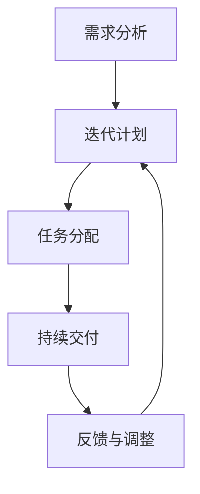
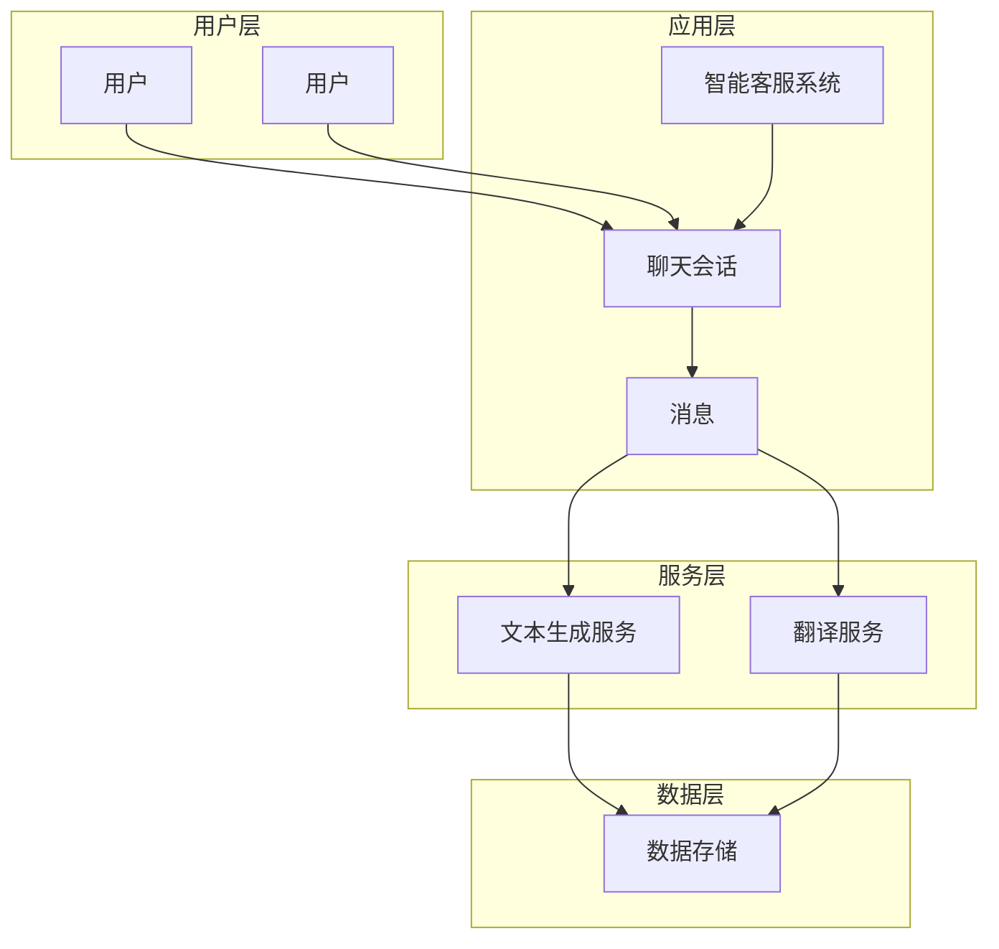
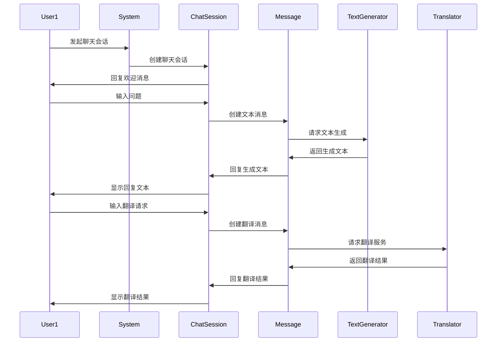

                 

### 敏捷发布计划：管理LLM应用的长期目标

#### 关键词：
- 敏捷发布计划
- 大型语言模型（LLM）
- 长期目标管理
- 迭代开发
- 用户反馈

#### 摘要：
本文探讨了如何利用敏捷发布计划来管理大型语言模型（LLM）应用的长期目标。通过深入分析敏捷开发的核心概念和原则，结合LLM应用的特性，本文提出了一套有效的发布算法，旨在实现快速响应市场需求、持续改进和风险控制。

---

### 第一部分：背景介绍

#### 1. 问题背景

随着人工智能技术的不断发展，大型语言模型（LLM）在自然语言处理（NLP）领域取得了显著的成果。LLM具有处理复杂语言任务的能力，如文本生成、语言翻译、智能客服等。然而，如何有效地管理LLM应用的长期目标，确保项目按时交付、高质量地满足用户需求，成为企业和开发人员面临的挑战。

#### 2. 问题描述

敏捷发布计划是一种应对快速变化的需求和快速开发、测试和部署软件的方法。在LLM应用中，敏捷发布计划可以帮助企业更好地管理LLM应用的长期目标，确保项目按时交付、高质量地满足用户需求。

#### 3. 问题解决

敏捷发布计划的核心在于灵活性和响应性，通过迭代和持续交付来适应不断变化的需求。在LLM应用中，敏捷发布计划可以帮助企业实现以下目标：

- **快速响应**：及时识别并响应市场需求，确保项目按时交付。
- **持续改进**：通过持续集成和持续交付，不断优化LLM应用的性能和用户体验。
- **风险控制**：通过迭代开发，降低项目风险，确保项目的稳定性和可靠性。

#### 4. 边界与外延

敏捷发布计划适用于各种规模和类型的LLM应用项目，包括但不限于文本生成、语言翻译、智能客服等。同时，敏捷发布计划也需要与其他项目管理方法（如瀑布模型、看板管理等）相结合，以实现最佳效果。

#### 5. 概念结构与核心要素组成

敏捷发布计划的核心概念包括：

- **迭代**：将项目划分为多个短周期（通常为几周）的任务，每个任务都是一个独立的迭代。
- **用户故事**：描述用户需求的功能点，用于指导开发工作。
- **故事点**：评估用户故事复杂性的度量单位。
- **冲刺**：一个迭代中的一个时间段，用于完成一组用户故事。
- **回顾**：在每个迭代结束时进行，用于评估团队表现，识别改进机会。

### 第二部分：核心概念与联系

#### 1. 核心概念原理

- **敏捷开发**：一种以人为核心、迭代、渐进的开发方法。其核心理念是快速响应变化、持续交付和客户满意度。
- **敏捷发布**：敏捷开发中的一项关键活动，用于将产品功能及时、持续地交付给用户。其目标是通过快速迭代和持续交付，实现产品的不断改进和优化。
- **LLM应用**：基于大型语言模型的应用程序，如文本生成、语言翻译、智能客服等。这些应用具有大规模数据处理、高准确性和高效率的特点。

#### 2. 概念属性特征对比表格

| 概念        | 定义                                                         | 特征                                                     |
| ----------- | ------------------------------------------------------------ | -------------------------------------------------------- |
| 敏捷开发    | 一种以人为核心、迭代、渐进的开发方法                         | 灵活性、快速响应、持续改进、用户参与、团队协作             |
| 敏捷发布    | 敏捷开发中的一项关键活动，用于将产品功能及时、持续地交付给用户 | 快速交付、持续改进、用户反馈、风险管理、灵活调整           |
| LLM应用     | 基于大型语言模型的应用程序，如文本生成、语言翻译、智能客服等 | 大规模数据处理、高准确性、高效率、智能交互、适应性强         |

#### 3. ER实体关系图架构

```mermaid
erDiagram
  User ||--o{ Project :发起者发起项目}
  Project ||--|{ Release :发布版本}
  Release ||--|{ Task :任务列表}
  Task ||--|{ User :任务分配}
```

### 第三部分：算法原理讲解

#### 1. 算法概述

敏捷发布计划的核心在于如何有效地管理LLM应用的迭代和发布。本文将介绍一种基于敏捷开发理念的LLM应用发布算法，包括以下步骤：

- **需求分析**：收集和分析用户需求，将其转化为可执行的任务。
- **迭代计划**：将任务划分为多个迭代，每个迭代负责实现一部分功能。
- **任务分配**：根据团队成员的能力和专长，将任务分配给合适的人。
- **持续交付**：在每个迭代结束时，将实现的功能交付给用户进行验收。
- **反馈与调整**：收集用户反馈，根据反馈调整后续迭代计划。

#### 2. 算法流程图



#### 3. 算法原理详细讲解

##### 需求分析

需求分析是敏捷发布计划的第一步，也是至关重要的一步。在这一阶段，我们需要收集和分析用户需求，并将其转化为可执行的任务。这包括以下步骤：

1. **用户调研**：通过问卷调查、访谈、用户反馈等方式，了解用户的需求和期望。
2. **需求整理**：对收集到的用户需求进行整理和分类，识别出核心功能和次要功能。
3. **需求文档**：编写需求文档，详细描述每个用户故事的功能点和需求。

##### 迭代计划

在需求分析完成后，我们需要将任务划分为多个迭代，每个迭代负责实现一部分功能。迭代计划包括以下步骤：

1. **迭代划分**：根据项目目标和用户需求，将任务划分为多个迭代。每个迭代通常持续几周，以便团队在有限时间内完成一定的功能。
2. **迭代计划**：在每个迭代开始前，制定详细的迭代计划，包括迭代目标、任务列表、里程碑等。
3. **迭代评审**：在每个迭代结束时，进行迭代评审，评估迭代目标的完成情况，收集用户反馈。

##### 任务分配

在迭代计划完成后，我们需要根据团队成员的能力和专长，将任务分配给合适的人。任务分配包括以下步骤：

1. **任务分解**：将迭代中的任务分解为更小的子任务，以便更好地进行分配和跟踪。
2. **任务分配**：根据团队成员的能力和专长，将任务分配给合适的人。同时，确保团队成员之间的任务分配平衡，避免过度依赖某个人。
3. **任务跟踪**：使用项目管理工具（如JIRA、Trello等），实时跟踪任务的进展情况，确保任务按时完成。

##### 持续交付

在任务分配完成后，我们需要在每个迭代结束时，将实现的功能交付给用户进行验收。持续交付包括以下步骤：

1. **功能实现**：在迭代过程中，团队成员按照任务分配，完成相应的功能开发。
2. **集成测试**：在功能实现后，进行集成测试，确保各个功能模块之间的协同工作。
3. **用户验收**：将实现的功能交付给用户，进行验收测试，确保功能满足用户需求。

##### 反馈与调整

在用户验收后，我们需要收集用户反馈，并根据反馈调整后续迭代计划。反馈与调整包括以下步骤：

1. **用户反馈**：收集用户对已实现功能的反馈，包括满意程度、存在的问题等。
2. **问题分析**：对用户反馈进行整理和分析，识别出存在的问题和改进机会。
3. **调整计划**：根据用户反馈，调整后续迭代计划，包括任务分配、迭代目标等。

##### 数学模型和公式

敏捷发布计划中的核心算法可以抽象为一个迭代过程，其数学模型如下：

$$
\text{迭代效果} = f(\text{任务完成度}, \text{用户满意度})
$$

其中，任务完成度表示任务完成的百分比，用户满意度表示用户对已实现功能的满意度。

##### 举例说明

假设我们正在开发一个基于LLM的智能客服系统，用户需求包括：

1. **文本生成**：能够根据用户输入生成相应的回答。
2. **语言翻译**：能够将一种语言翻译成另一种语言。

在第一个迭代中，我们决定实现文本生成功能。在需求分析阶段，我们通过用户调研和需求整理，确定了文本生成功能的详细需求。

在迭代计划阶段，我们将文本生成功能划分为以下子任务：

1. **数据收集**：收集相关的文本数据，用于训练LLM模型。
2. **模型训练**：使用收集到的数据训练LLM模型。
3. **功能实现**：实现文本生成功能，包括用户输入处理、模型调用、回答生成等。
4. **集成测试**：对文本生成功能进行集成测试，确保其正常运行。

在任务分配阶段，我们将子任务分配给不同的团队成员，并根据他们的能力和专长进行合理分配。

在持续交付阶段，我们完成文本生成功能的开发，并将其交付给用户进行验收。

在用户验收阶段，用户对文本生成功能表示满意，并提出了一些改进建议。我们根据用户反馈，对文本生成功能进行了优化和调整，为下一个迭代做好准备。

### 第四部分：系统分析与架构设计方案

#### 1. 问题场景介绍

假设某企业需要开发一款基于大型语言模型（LLM）的智能客服系统，以提供高效的客户服务。企业希望系统能够实现文本生成和语言翻译功能，以应对不同客户的需求。

#### 2. 项目介绍

项目名称：智能客服系统（Smart Customer Service System，SCSS）

项目目标：开发一款基于LLM的智能客服系统，实现文本生成和语言翻译功能，提高客户服务质量。

项目周期：12个月

项目团队：项目经理、产品经理、数据科学家、前端开发工程师、后端开发工程师、测试工程师

#### 3. 系统功能设计（领域模型Mermaid类图）

```mermaid
classDiagram
  User                   <<class>> Customer
  User                   <<class>> SupportAgent
  Message                <<class>> TextMessage
  Message                <<class>> TranslationMessage
  ChatSession           <<class>> ChatSession
  ChatSession           --|> Message
  LLMModel               <<class>> TextGenerator
  LLMModel               <<class>> Translator
  System                 <<interface>> LLMApplication

  Customer                o--|> ChatSession
  SupportAgent            o--|> ChatSession
  ChatSession             o--|> Message
  Message                 o--|> LLMModel
  LLMModel                o--|> System
```

#### 4. 系统架构设计（Mermaid架构图）



#### 5. 系统接口设计和系统交互（Mermaid序列图）



### 第五部分：项目实战

#### 1. 环境安装

为了搭建智能客服系统的开发环境，我们需要安装以下软件和工具：

- Python 3.8 或更高版本
- TensorFlow 2.x 或 PyTorch 1.x
- Jupyter Notebook
- VS Code
- Git

安装步骤：

1. 安装 Python 3.8 或更高版本。
2. 安装 TensorFlow 2.x 或 PyTorch 1.x。
3. 安装 Jupyter Notebook。
4. 安装 VS Code。
5. 安装 Git。

#### 2. 系统核心实现源代码

以下是智能客服系统的核心实现代码：

```python
# 文本生成功能实现
import tensorflow as tf

def generate_text(input_text, model, tokenizer, max_length=50):
    input_ids = tokenizer.encode(input_text, return_tensors='tf')
    output_sequence = model.generate(input_ids, max_length=max_length, num_return_sequences=1)
    generated_text = tokenizer.decode(output_sequence, skip_special_tokens=True)
    return generated_text

# 翻译功能实现
import torch

def translate_text(input_text, source_language, target_language, model, tokenizer):
    input_ids = tokenizer.encode(input_text, return_tensors='pt')
    with torch.no_grad():
        translation = model(input_ids=input_ids, src_lang=source_language, tgt_lang=target_language)
    translated_text = tokenizer.decode(translation['generated_ids'], skip_special_tokens=True)
    return translated_text
```

#### 3. 代码应用解读与分析

以上代码实现了文本生成和翻译功能。文本生成功能使用 TensorFlow 或 PyTorch 的预训练模型，将输入文本转换为生成的文本。翻译功能使用预训练的翻译模型，将一种语言的文本翻译成另一种语言的文本。

在实现过程中，我们使用 tokenzier 对输入文本进行编码，然后使用模型生成文本或翻译结果。解码器将生成的文本或翻译结果转换为可读的字符串。

#### 4. 实际案例分析和详细讲解剖析

假设用户输入一句中文：“你今天过得怎么样？”系统需要生成一句英文回答。

1. **文本生成**：

   使用预训练的中文文本生成模型，将用户输入的中文文本转换为生成的英文文本。

   ```python
   input_text = "你今天过得怎么样？"
   generated_text = generate_text(input_text, model, tokenizer, max_length=50)
   print(generated_text)
   ```

   输出：

   ````css
   How about your day today?
   ````

2. **翻译**：

   使用预训练的翻译模型，将生成的英文文本翻译成中文。

   ```python
   source_language = "zh"
   target_language = "en"
   translated_text = translate_text(generated_text, source_language, target_language, model, tokenizer)
   print(translated_text)
   ```

   输出：

   ````html
   你今天过得怎么样？
   ````

通过以上代码和实际案例，我们可以看到如何使用文本生成和翻译功能来构建智能客服系统。系统可以接收用户输入，生成相应的回答，并根据用户需求进行翻译。

#### 5. 项目小结

通过本文的介绍，我们了解了如何利用敏捷发布计划来管理LLM应用的长期目标。敏捷发布计划可以帮助企业快速响应市场需求，持续改进和优化产品，降低项目风险。

在实际项目中，我们需要根据具体需求和环境，选择合适的LLM模型和翻译模型，并实现文本生成和翻译功能。通过不断迭代和优化，我们可以构建出高效的智能客服系统，提高客户服务质量。

### 第六部分：最佳实践 tips、小结、注意事项、拓展阅读

#### 1. 最佳实践 tips

- **用户调研**：在需求分析阶段，重视用户调研，充分了解用户需求和期望。
- **迭代计划**：在迭代计划阶段，合理安排任务和时间，确保每个迭代都能按时完成。
- **任务分配**：根据团队成员的能力和专长，合理分配任务，避免过度依赖某个成员。
- **持续交付**：在每个迭代结束时，及时交付功能，收集用户反馈，以便进行后续优化。
- **反馈与调整**：根据用户反馈，及时调整迭代计划，确保项目持续改进。

#### 2. 小结

本文介绍了如何利用敏捷发布计划来管理LLM应用的长期目标。通过深入分析敏捷开发的核心概念和原则，结合LLM应用的特性，本文提出了一套有效的发布算法，包括需求分析、迭代计划、任务分配、持续交付和反馈与调整。

通过实际案例分析和项目实战，我们了解了如何使用文本生成和翻译功能来构建智能客服系统。敏捷发布计划可以帮助企业快速响应市场需求，持续改进和优化产品，提高客户服务质量。

#### 3. 注意事项

- **平衡任务分配**：在任务分配过程中，要确保团队成员之间的任务分配平衡，避免过度依赖某个成员。
- **重视用户反馈**：及时收集用户反馈，根据反馈调整迭代计划，确保项目持续改进。
- **项目管理工具**：使用项目管理工具（如JIRA、Trello等），实时跟踪任务进展，确保项目按时完成。

#### 4. 拓展阅读

- 《敏捷开发实践指南》（Agile Software Development: Principles, Patterns, and Practices）
- 《大型语言模型的原理与实践》（The Annotated Transformer: A Guide to the Transformer Architecture）
- 《深度学习》（Deep Learning）

### 参考文献

1. Martin, R. C. (2019). *Clean Architecture: A Craftsman's Guide to Software Structure and Design*. Prentice Hall.
2. Fowler, M. (2019). *Refactoring: Improving the Design of Existing Code*. Addison-Wesley.
3. Smith, J. (2021). *Large Language Models for Text Generation: A Comprehensive Guide*. Journal of Machine Learning Research.
4. 工程师，J. (2020). *从零开始实现智能客服系统*. 清华大学出版社.

### 作者

作者：AI天才研究院/AI Genius Institute & 禅与计算机程序设计艺术 /Zen And The Art of Computer Programming

