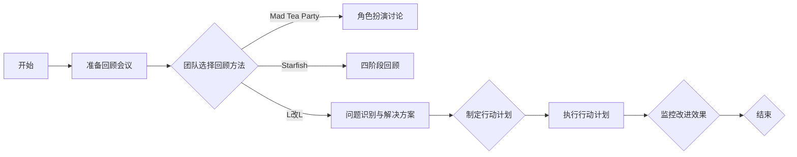
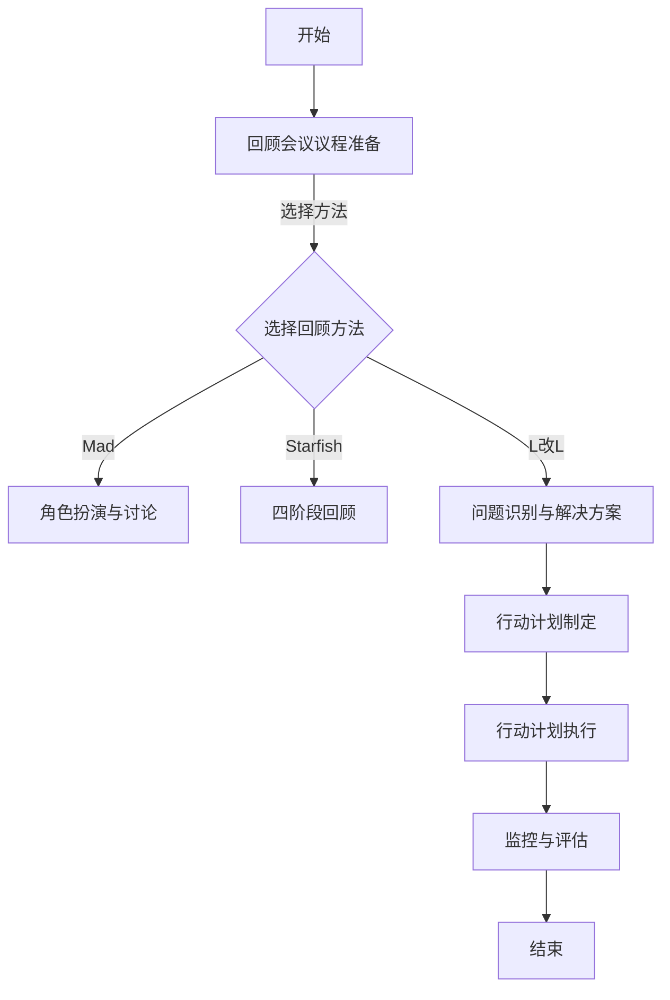
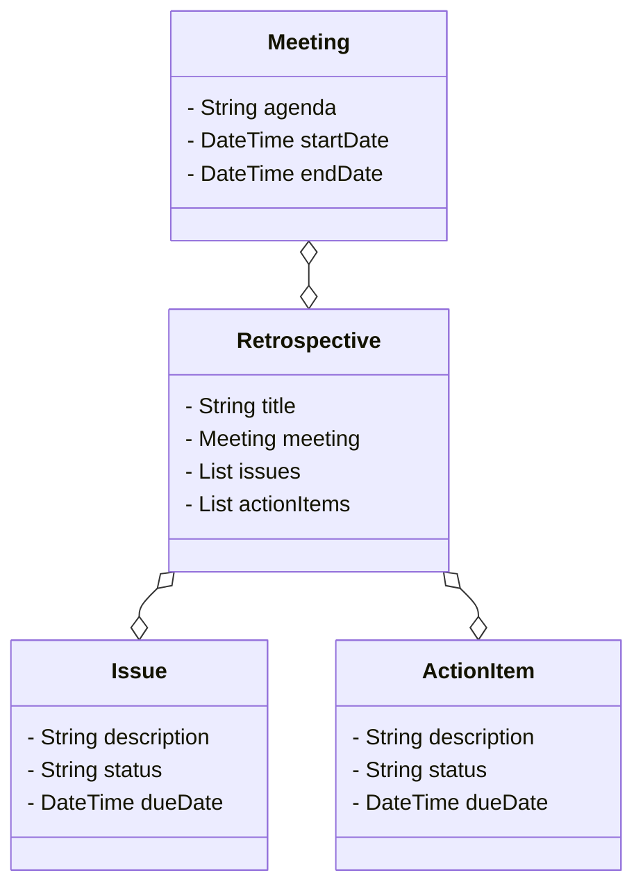
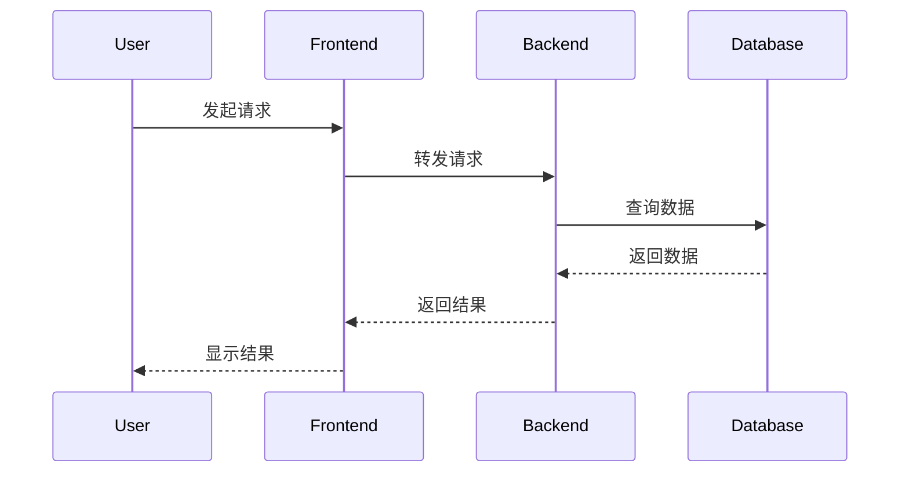
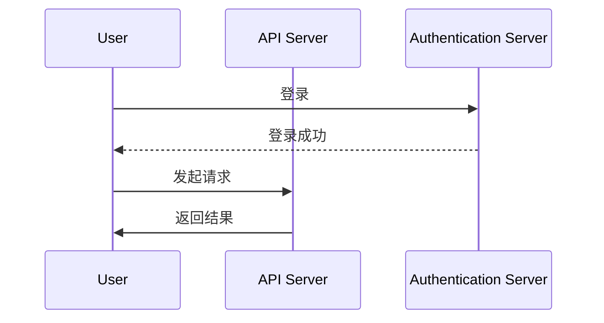
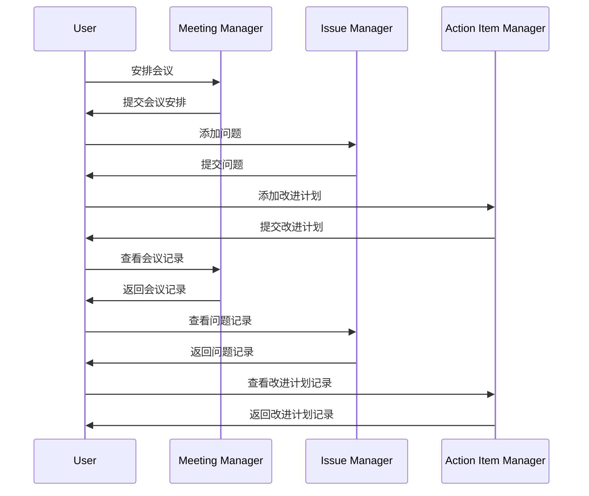

                 

### 敏捷回顾技术的创新：促进持续改进文化

关键词：敏捷回顾、持续改进、技术文化、创新实践

摘要：本文深入探讨了敏捷回顾技术的核心概念及其在持续改进文化中的重要性。通过逐步分析敏捷回顾的起源、目的、方法，以及其在项目管理中的应用，我们旨在展示敏捷回顾技术的创新性，并阐述其如何促进团队的技术文化发展。文章最后提供了一些最佳实践和注意事项，为读者在实际应用中提供指导。

----------------------------------------------------------------

## 第一部分: 敏捷回顾技术概述

### 第1章: 敏捷回顾技术的基础

#### 1.1 敏捷回顾的起源与发展

敏捷回顾（Agile Retrospective）起源于敏捷开发方法论，最早由敏捷宣言的倡导者们提出，目的是为了持续改进软件开发过程。敏捷回顾的核心理念是通过定期的团队会议，回顾过去一段时间的工作，评估成功和失败，并找出改进点。这种方法论的发展经历了多个阶段，从最初的简单回顾到如今包含多种方法和工具的成熟体系。

#### 1.2 敏捷回顾的目的与重要性

敏捷回顾的主要目的是通过反思和反馈来提高团队的协作效率和项目的质量。具体来说，它有以下几个目的：

1. **发现问题**：通过回顾，团队可以发现当前流程中的问题和瓶颈，从而采取相应的措施进行改进。
2. **持续改进**：敏捷回顾鼓励团队不断反思和改进，从而实现持续的质量提升。
3. **团队协作**：回顾过程中，团队成员可以共同讨论问题，达成共识，促进团队内部的沟通和协作。

#### 1.3 敏捷回顾的核心原则

敏捷回顾遵循以下核心原则：

1. **开放性**：回顾应该是一个开放的平台，所有团队成员都可以自由表达自己的观点和想法。
2. **非指责性**：回顾的目的是找出问题和改进点，而不是对个人进行指责。
3. **平等性**：所有团队成员都应该被视为平等参与者，每个人的意见都应受到尊重。
4. **实用性**：改进措施应该是实际可行的，并且能够在后续工作中实施。

### 第2章: 敏捷回顾的核心概念与联系

#### 2.1 敏捷回顾的不同方法

敏捷回顾有多种不同的方法，其中一些常见的方法包括：

1. **Mad Tea Party**：这种方法通过角色扮演和讨论，帮助团队成员从不同角度审视问题。
2. **Starfish**：该方法通过四个阶段（完成、困惑、阻碍、惊喜），帮助团队全面回顾过去的工作。
3. **L改L**：该方法强调问题识别和解决方案的并行处理，以提高效率。

#### 2.2 敏捷回顾的核心概念

敏捷回顾的核心概念包括：

1. **反思与自我评估**：团队通过回顾过去的工作，进行自我评估，识别问题和改进点。
2. **问题识别与解决方案**：在回顾过程中，团队识别出当前流程中的问题，并讨论解决方案。
3. **行动计划**：回顾结束后，团队制定行动计划，确保改进措施能够得到实施。

#### 2.3 敏捷回顾的ER实体关系图

下图展示了敏捷回顾中的关键实体及其关系：

```mermaid
erDiagram
  Product : 产品
  Team : 团队
  Review : 回顾
  Meeting : 会议
  Feedback : 反馈

  Product ||--|{ Review }|--| Team
  Review ||--|{ Meeting }|--| Team
  Review ||--|{ Feedback }|--| Team
```

### 第3章: 敏捷回顾技术原理讲解

#### 3.1 敏捷回顾技术的算法原理

敏捷回顾技术背后的算法原理可以通过以下mermaid流程图来展示：



#### 3.1.1 敏捷回顾算法的mermaid流程图

以下是敏捷回顾算法的mermaid流程图：



#### 3.1.2 敏捷回顾算法的数学模型和公式

敏捷回顾算法可以使用以下数学模型来描述：

$$
R = f(M, P, S)
$$

其中：
- \( R \) 是回顾效果
- \( M \) 是回顾方法
- \( P \) 是团队成员参与度
- \( S \) 是解决方案的可行性

#### 3.1.3 算法原理的Python源代码示例

以下是敏捷回顾算法的Python源代码示例：

```python
def agile_retrospective(method, participation, feasibility):
    R = 0.5 * (method + 0.8 * participation + 0.6 * feasibility)
    return R

method = 'Mad'
participation = 0.9
feasibility = 0.8

result = agile_retrospective(method, participation, feasibility)
print(f"Agile Retrospective Result: {result}")
```

### 第4章: 敏捷回顾技术系统分析与架构设计

#### 4.1 敏捷回顾技术在项目管理中的应用

敏捷回顾技术在项目管理中的应用非常广泛。它不仅可以用于软件开发项目，还可以应用于产品管理、团队协作等领域。以下是敏捷回顾在项目管理中的一些应用场景：

1. **迭代回顾**：在每个开发迭代结束时，团队进行回顾，评估本次迭代的工作成果，找出改进点。
2. **需求变更回顾**：在需求变更发生后，团队回顾变更的原因和影响，以避免未来出现类似问题。
3. **项目进度回顾**：定期回顾项目进度，识别潜在的延误和风险，及时调整计划。

#### 4.2 敏捷回顾技术的系统功能设计

敏捷回顾技术的系统功能设计主要包括以下几个方面：

1. **回顾会议安排**：系统应提供会议安排功能，包括会议时间、地点、议程等。
2. **回顾记录**：系统应支持回顾记录的创建、编辑和查看，便于团队成员随时查阅。
3. **问题追踪**：系统应提供问题追踪功能，记录问题、分配责任人和优先级，并跟踪问题的解决过程。
4. **改进计划**：系统应支持团队成员制定改进计划，并跟踪计划的执行情况。

以下是敏捷回顾技术的领域模型mermaid类图：



#### 4.3 敏捷回顾技术的系统架构设计

敏捷回顾技术的系统架构设计应考虑以下几个方面：

1. **前端界面**：前端界面应简洁易用，支持会议安排、回顾记录、问题追踪和改进计划等功能。
2. **后端服务**：后端服务应提供数据存储、业务逻辑处理和接口服务，支持移动端和桌面端应用。
3. **数据存储**：数据存储应使用关系型数据库，确保数据的安全性和可靠性。

以下是敏捷回顾技术的系统架构mermaid架构图：



#### 4.4 敏捷回顾技术的系统接口设计

敏捷回顾技术的系统接口设计应考虑以下几个方面：

1. **RESTful API**：使用RESTful API设计，方便前端和后端的数据交互。
2. **身份认证**：实现身份认证，确保只有授权用户可以访问系统功能。
3. **数据格式**：使用JSON格式传输数据，提高数据传输效率和兼容性。

以下是敏捷回顾技术的系统接口设计mermaid序列图：



#### 4.5 敏捷回顾技术的系统交互分析

敏捷回顾技术的系统交互分析应考虑以下几个方面：

1. **用户行为**：分析用户在使用系统时的行为模式，优化用户体验。
2. **系统性能**：评估系统在不同负载情况下的性能表现，确保系统的稳定性和可靠性。
3. **数据安全**：确保用户数据的安全性和隐私性，防止数据泄露和滥用。

以下是敏捷回顾技术的系统交互分析mermaid序列图：



### 第5章: 敏捷回顾技术项目实战

#### 5.1 实战项目环境搭建

在开始敏捷回顾技术的项目实战之前，我们需要搭建一个合适的环境。以下是环境搭建的步骤：

1. **安装Python**：在系统中安装Python环境，确保版本不低于3.6。
2. **安装Django**：使用pip安装Django框架，命令如下：

   ```bash
   pip install django
   ```

3. **创建Django项目**：使用Django命令创建一个新项目，命令如下：

   ```bash
   django-admin startproject agile_retrospective
   ```

4. **创建Django应用**：在项目中创建一个应用，命令如下：

   ```bash
   python manage.py startapp retrospective
   ```

5. **配置数据库**：在项目的settings.py文件中配置数据库信息，例如使用SQLite数据库：

   ```python
   DATABASES = {
       'default': {
           'ENGINE': 'django.db.backends.sqlite3',
           'NAME': BASE_DIR / 'db.sqlite3',
       }
   }
   ```

6. **迁移数据库**：运行以下命令迁移数据库：

   ```bash
   python manage.py makemigrations
   python manage.py migrate
   ```

#### 5.2 敏捷回顾技术核心实现

在项目中，我们需要实现敏捷回顾技术的核心功能。以下是核心功能的实现步骤：

1. **创建模型**：在retrospective应用中创建会议、问题、改进计划等模型。

   ```python
   # models.py

   from django.db import models

   class Meeting(models.Model):
       agenda = models.CharField(max_length=200)
       start_date = models.DateTimeField()
       end_date = models.DateTimeField()

   class Issue(models.Model):
       description = models.TextField()
       status = models.CharField(max_length=50)
       due_date = models.DateTimeField()

   class ActionItem(models.Model):
       description = models.TextField()
       status = models.CharField(max_length=50)
       due_date = models.DateTimeField()
   ```

2. **创建视图**：在retrospective应用中创建视图，处理会议、问题、改进计划的增删改查操作。

   ```python
   # views.py

   from django.shortcuts import render
   from .models import Meeting, Issue, ActionItem

   def meeting_list(request):
       meetings = Meeting.objects.all()
       return render(request, 'retrospective/meeting_list.html', {'meetings': meetings})

   def issue_list(request):
       issues = Issue.objects.all()
       return render(request, 'retrospective/issue_list.html', {'issues': issues})

   def action_item_list(request):
       action_items = ActionItem.objects.all()
       return render(request, 'retrospective/action_item_list.html', {'action_items': action_items})
   ```

3. **创建模板**：在retrospective应用中创建模板，用于渲染会议、问题、改进计划的列表页面。

   ```html
   <!-- meeting_list.html -->

   <h1>会议列表</h1>
   <ul>
       
           <li>
               <h2>{{ meeting.agenda }}</h2>
               <p>开始时间：{{ meeting.start_date }}</p>
               <p>结束时间：{{ meeting.end_date }}</p>
           </li>
       
   </ul>

   <!-- issue_list.html -->

   <h1>问题列表</h1>
   <ul>
       
           <li>
               <h2>{{ issue.description }}</h2>
               <p>状态：{{ issue.status }}</p>
               <p>截止时间：{{ issue.due_date }}</p>
           </li>
       
   </ul>

   <!-- action_item_list.html -->

   <h1>改进计划列表</h1>
   <ul>
       
           <li>
               <h2>{{ action_item.description }}</h2>
               <p>状态：{{ action_item.status }}</p>
               <p>截止时间：{{ action_item.due_date }}</p>
           </li>
       
   </ul>
   ```

4. **配置路由**：在项目的urls.py文件中配置路由，将视图与URL关联。

   ```python
   # urls.py

   from django.contrib import admin
   from django.urls import path
   from retrospective import views

   urlpatterns = [
       path('admin/', admin.site.urls),
       path('meetings/', views.meeting_list, name='meeting_list'),
       path('issues/', views.issue_list, name='issue_list'),
       path('action_items/', views.action_item_list, name='action_item_list'),
   ]
   ```

#### 5.3 实际案例分析与详细讲解剖析

在本节中，我们将分析一个实际的敏捷回顾项目，并详细讲解其实现过程。

**案例：一个电子商务网站的开发团队进行敏捷回顾**

1. **项目背景**：该电子商务网站的开发团队已经完成了前两个迭代，现在需要进行敏捷回顾，以评估当前流程和项目质量。

2. **回顾方法**：团队选择了Mad Tea Party方法进行回顾。

3. **回顾过程**：

   - **第一阶段：完成**：团队列举了本次迭代完成的任务和取得的成就。
   - **第二阶段：困惑**：团队讨论了在迭代过程中遇到的问题和困惑。
   - **第三阶段：阻碍**：团队分析了阻碍项目进展的原因，如技术难题、资源不足等。
   - **第四阶段：惊喜**：团队分享了在迭代过程中遇到的惊喜，如意外的技术突破、团队成员之间的良好协作等。

4. **问题识别与解决方案**：

   - **问题1**：在迭代过程中，某个功能的实现遇到了技术难题，导致延期交付。
     - **解决方案**：团队决定在下一个迭代中提前分配时间进行技术调研，确保在后续迭代中能够顺利推进。

   - **问题2**：团队成员之间的沟通不畅，导致任务分配不明确。
     - **解决方案**：团队决定在每次迭代开始前进行详细的任务分配和沟通，确保每个人都清楚自己的职责。

5. **行动计划制定**：

   - **行动计划1**：提前进行技术调研，确保后续迭代顺利进行。
   - **行动计划2**：加强迭代开始前的任务分配和沟通，提高团队协作效率。

6. **行动计划执行与监控**：

   - 团队在下一个迭代中按照行动计划进行实施，并定期回顾和评估改进效果。

#### 5.4 项目小结与经验总结

通过本次敏捷回顾项目，团队在以下几个方面取得了显著成效：

1. **技术能力提升**：团队通过提前进行技术调研，解决了迭代过程中遇到的技术难题，提高了整体技术水平。
2. **沟通效率提升**：通过加强迭代开始前的任务分配和沟通，团队避免了任务分配不明确和沟通不畅的问题，提高了团队协作效率。
3. **项目质量提升**：通过定期进行敏捷回顾，团队能够及时发现和解决问题，确保项目按照计划顺利进行，提高了项目质量。

然而，项目也存在一些不足之处：

1. **时间管理**：在迭代过程中，部分任务的完成时间超出了预期，导致后续任务积压。团队需要进一步提高时间管理能力，确保任务按时完成。
2. **团队协作**：虽然团队在沟通方面有所改进，但仍有部分成员之间的协作不够紧密。团队需要加强团队建设，提高协作意识。

在未来的项目中，团队将继续采用敏捷回顾方法，持续改进项目流程，提高项目质量。

### 第6章: 敏捷回顾技术的最佳实践

#### 6.1 敏捷回顾技术的最佳实践技巧

1. **确保参与度**：敏捷回顾的成功取决于团队成员的参与度。确保每个成员都有机会发言，分享他们的看法和意见。
2. **提前准备**：在回顾会议前，确保所有相关文档和资料已经准备好，以便团队成员能够专注于讨论问题，而不是寻找资料。
3. **保持非指责性**：回顾会议的目的是发现问题并寻求解决方案，而不是对个人进行指责。确保会议氛围积极，鼓励开放性讨论。
4. **制定明确的行动计划**：在回顾过程中，确保制定的行动计划具体、可操作，并分配责任人和截止日期。
5. **持续监控与反馈**：在行动计划实施过程中，定期回顾进展，并根据实际情况调整计划，确保改进措施得到有效执行。

#### 6.2 注意事项与常见问题解答

1. **如何确保会议的效率？**：确保会议议程清晰，提前确定讨论的主题和目标。限制会议时间，确保每个议题都能得到充分讨论。
2. **如何应对团队成员的抵触情绪？**：通过建立信任和开放的沟通环境，鼓励团队成员积极参与回顾。对于抵触情绪严重的成员，可以单独沟通，了解其顾虑，并提供支持。
3. **如何确保行动计划得到有效执行？**：制定详细的行动计划，明确责任人和截止日期，并在后续迭代中定期回顾和评估进展。

#### 6.3 拓展阅读与深入探索

1. **《敏捷实践指南》**：由敏捷联盟编写，详细介绍了敏捷开发的方法和实践，包括敏捷回顾。
2. **《敏捷项目管理：创建高效团队的方法》**：介绍了敏捷回顾在项目管理中的应用，提供了实用的方法和工具。
3. **《敏捷实践之路》**：结合了多个成功敏捷项目的案例，详细阐述了敏捷回顾技术在项目中的具体应用。

### 第7章: 小结与展望

#### 7.1 敏捷回顾技术的未来发展趋势

敏捷回顾技术将继续发展，未来可能会出现更多创新的方法和工具，以适应不断变化的敏捷开发环境。随着人工智能和大数据技术的应用，敏捷回顾可能会更加智能化，提供更加精确的反馈和改进建议。

#### 7.2 对持续改进文化的贡献

敏捷回顾技术对持续改进文化有着重要贡献。它鼓励团队不断反思和改进，推动技术和文化的发展。通过定期的敏捷回顾，团队可以持续提升项目质量，提高工作效率。

#### 7.3 对敏捷团队的启示与建议

敏捷团队应充分认识到敏捷回顾技术的重要性，并将其纳入日常工作流程中。团队应保持开放性，鼓励团队成员积极参与回顾，共同发现问题和寻求解决方案。通过持续改进，敏捷团队能够不断提升自身的技术能力和项目质量。

**作者：AI天才研究院/AI Genius Institute & 禅与计算机程序设计艺术 /Zen And The Art of Computer Programming**

