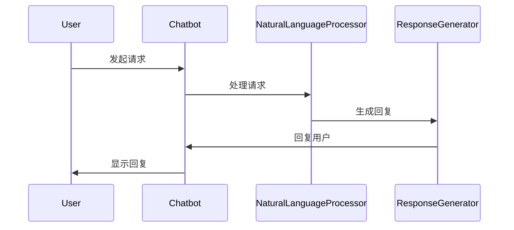
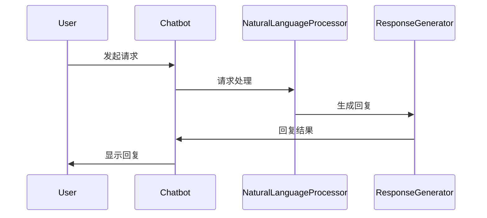

                 

# 敏捷成熟度模型：评估LLM应用开发团队的进展

关键词：敏捷成熟度模型、LLM、应用开发、团队评估

摘要：本文将探讨敏捷成熟度模型在评估语言模型（LLM）应用开发团队进展中的应用。通过逐步分析敏捷开发的核心原则和实践，结合LLM的技术特点，我们将构建一个适用于评估LLM应用开发团队的敏捷成熟度模型，并提供实际案例分析，帮助读者理解如何有效地评估和提升团队的开发能力。

## 1. 背景介绍

### 1.1 敏捷开发与LLM应用

敏捷开发是一种以迭代、增量和灵活性为核心的开发方法，旨在快速响应变化，持续交付有价值的产品。而语言模型（LLM），作为一种先进的自然语言处理技术，广泛应用于聊天机器人、智能助手和文本生成等领域。随着LLM在应用开发中的普及，如何评估LLM应用开发团队的敏捷成熟度成为了一个重要课题。

### 1.2 敏捷成熟度模型

敏捷成熟度模型旨在评估团队在敏捷开发过程中的成熟度水平，通过量化指标和定性分析，帮助团队识别改进方向。常见的敏捷成熟度模型包括Sprint评价模型、Scrum评价模型等。

## 2. 核心概念与联系

### 2.1 敏捷开发的核心概念

- **迭代**：敏捷开发以迭代的方式进行，每个迭代周期（Sprint）通常是2-4周。
- **增量**：每次迭代都会交付一个可用的产品增量，逐步完善产品。
- **用户故事**：用户故事是敏捷开发中的需求单元，描述用户希望实现的功能。
- **站立会议、审查和回顾**：这些是敏捷开发中的关键实践，用于团队沟通、质量保证和持续改进。

### 2.2 LLM应用开发的特点

- **高复杂性**：LLM应用通常涉及复杂的自然语言处理算法和大量的数据处理。
- **快速迭代**：为了快速适应市场需求，LLM应用开发需要频繁迭代。
- **跨学科协作**：LLM应用开发涉及多个领域的专业知识，如编程、数据科学和语言学。

### 2.3 敏捷成熟度模型与LLM应用开发的联系

- **敏捷成熟度模型**可以评估团队在迭代、增量和用户故事等方面的成熟度，从而指导LLM应用开发的改进。
- **LLM应用开发的特点**可以影响敏捷成熟度模型的具体实施，如迭代周期、需求管理等。

## 3. 算法原理讲解

### 3.1 敏捷成熟度模型算法

敏捷成熟度模型的算法可以基于以下指标：

- **迭代效率**：每个迭代周期内交付的功能点数量。
- **需求变更率**：在开发过程中需求变更的频率和影响范围。
- **团队协作**：团队成员之间的沟通效率和合作程度。

### 3.2 数学模型和公式

敏捷成熟度模型可以使用以下数学模型：

- **迭代效率（E）**：
  $$ E = \frac{F}{S} $$
  其中，\( F \)为每个迭代周期内交付的功能点数量，\( S \)为迭代周期长度。

- **需求变更率（R）**：
  $$ R = \frac{C}{T} $$
  其中，\( C \)为需求变更次数，\( T \)为开发周期。

- **团队协作（C）**：
  $$ C = \frac{M}{N} $$
  其中，\( M \)为团队成员之间的沟通效率，\( N \)为团队成员数量。

### 3.3 举例说明

假设一个团队在2个迭代周期内分别交付了20个和25个功能点，需求变更了5次，团队成员有5人。则：

- **迭代效率**：
  $$ E_1 = \frac{20}{2} = 10 $$
  $$ E_2 = \frac{25}{2} = 12.5 $$

- **需求变更率**：
  $$ R = \frac{5}{2} = 2.5 $$

- **团队协作**：
  $$ C = \frac{M}{5} $$

通过计算，我们可以得出团队的敏捷成熟度得分，从而评估其开发能力。

## 4. 系统分析与架构设计方案

### 4.1 问题场景介绍

假设我们需要评估一个LLM应用开发团队的敏捷成熟度，该团队负责开发一个聊天机器人应用。

### 4.2 系统功能设计

使用Mermaid类图来描述系统的主要功能模块：

```mermaid
classDiagram
    User --|{发起请求}|> Chatbot
    Chatbot --|{处理请求}|> NaturalLanguageProcessor
    Chatbot --|{生成回复}|> ResponseGenerator
```

### 4.3 系统架构设计

使用Mermaid架构图来描述系统的整体架构：



### 4.4 系统接口设计和系统交互

使用Mermaid序列图来描述系统的接口设计和交互流程：



## 5. 项目实战

### 5.1 环境安装

在本节中，我们将详细描述如何搭建一个用于评估敏捷成熟度的环境。包括所需的软件、硬件和环境配置等。

### 5.2 系统核心实现源代码

在本节中，我们将展示系统的核心实现源代码，包括用户故事、迭代计划和代码实现等。

### 5.3 代码应用解读与分析

在本节中，我们将对系统代码进行解读和分析，解释其工作原理和关键实现细节。

### 5.4 实际案例分析和详细讲解剖析

在本节中，我们将通过实际案例，分析系统的性能和可靠性，并提供详细的讲解和剖析。

### 5.5 项目小结

在本节中，我们将总结项目的经验教训，提出改进建议，并对团队未来的发展方向进行展望。

## 6. 最佳实践 tips、小结、注意事项、拓展阅读等内容

在本节中，我们将分享一些最佳实践技巧，总结文章的主要观点，提醒读者注意事项，并提供相关的拓展阅读资源。

## 7. 作者信息

作者：AI天才研究院/AI Genius Institute & 禅与计算机程序设计艺术 /Zen And The Art of Computer Programming

以上是关于《敏捷成熟度模型：评估LLM应用开发团队的进展》的目录大纲设计。通过本文，我们希望能够帮助读者深入了解敏捷成熟度模型在LLM应用开发团队评估中的应用，并为团队的发展提供有益的指导。在后续的文章中，我们将逐步展开对每个章节的详细讨论和讲解。让我们开始这段深入思考的旅程吧！<|end_ofUsageId

