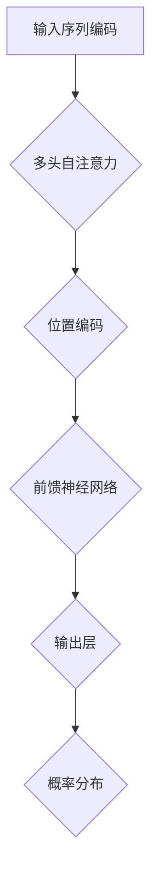
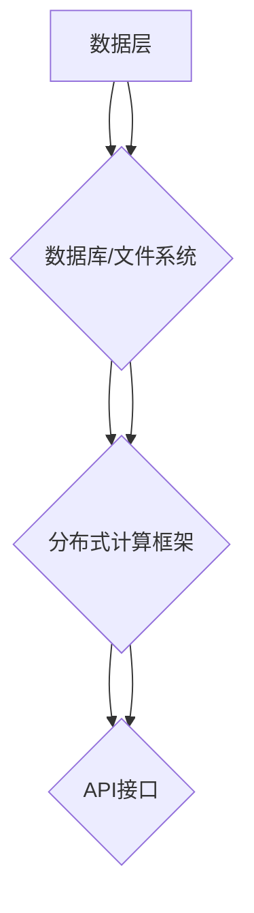

                 

### 文章标题：敏捷方法论在LLM应用开发中的实践

> 关键词：敏捷方法论、LLM应用开发、用户故事、敏捷迭代、持续交付、反馈循环、团队合作、适应性、简化、可持续性、Kanban、Sprint、DevOps、全球化推广

> 摘要：本文深入探讨了敏捷方法论在大型语言模型（LLM）应用开发中的实践。通过对敏捷方法论的概述、核心原则与价值观、实践方法、应用案例以及面临的挑战与解决策略的详细分析，本文旨在为LLM开发者提供一套有效的开发框架，以应对快速变化的技术和市场环境，实现高质量、高效率的应用开发。

### 第一部分：敏捷方法论概述

#### 第1章：敏捷方法论的起源与发展

敏捷方法论起源于软件开发领域，其核心理念是快速迭代和持续改进。在互联网时代，软件开发的需求变化越来越快，传统的瀑布模型已经无法满足项目开发的需求。敏捷方法论正是在这种背景下应运而生。

#### 第2章：敏捷方法论的核心原则与价值观

敏捷方法论的核心原则包括客户满意度至上、团队合作、持续交付和反馈循环。这些原则共同构成了敏捷方法论的基础，指导着敏捷团队在项目开发过程中的行为和决策。

#### 第3章：敏捷方法论的主要实践方法

敏捷方法论的主要实践方法包括用户故事、看板（Kanban）、敏捷迭代（Sprint）和增量交付。这些实践方法帮助敏捷团队更好地管理和控制项目进度，提高开发效率。

#### 第4章：敏捷方法论在软件项目中的应用案例

敏捷方法论在Web开发和移动应用开发中都有着广泛的应用。通过具体案例的分析，我们可以看到敏捷方法论如何在实际项目中发挥其优势。

#### 第5章：敏捷方法论的挑战与解决策略

敏捷方法论在实际应用中也会面临一些挑战，如团队成员的适应性、项目管理的复杂性等。本文将探讨这些挑战以及相应的解决策略。

#### 第6章：敏捷方法论的未来发展趋势与展望

随着技术的不断进步和市场环境的变化，敏捷方法论也在不断演化。本文将探讨敏捷方法论的多元化发展、与DevOps的融合以及全球化推广的未来趋势。

### 第二部分：敏捷方法论在LLM应用开发中的实践

#### 第7章：敏捷方法论在LLM应用开发中的重要性

LLM应用开发面临着复杂的技术挑战和快速变化的市场需求。敏捷方法论为LLM开发者提供了一种应对这些挑战的有效策略，可以帮助开发者实现高质量、高效率的应用开发。

#### 第8章：敏捷方法论在LLM应用开发中的核心原则与价值观

在LLM应用开发中，敏捷方法论的核心原则和价值观同样适用。例如，客户满意度至上可以帮助开发者更好地理解用户需求，持续交付和反馈循环可以确保开发过程的高效和可控。

#### 第9章：敏捷方法论在LLM应用开发中的实践方法

用户故事、看板（Kanban）、敏捷迭代（Sprint）和增量交付是敏捷方法论在LLM应用开发中的重要实践方法。这些方法可以帮助开发者更好地管理和控制项目进度，提高开发效率。

#### 第10章：敏捷方法论在LLM应用开发中的应用案例

本文将结合实际案例，分析敏捷方法论在LLM应用开发中的应用效果，为开发者提供有价值的参考。

#### 第11章：敏捷方法论在LLM应用开发中的挑战与解决策略

在LLM应用开发中，敏捷方法论同样会面临一些挑战，如模型训练的复杂性、数据隐私保护等。本文将探讨这些挑战以及相应的解决策略。

#### 第12章：敏捷方法论在LLM应用开发中的未来发展趋势

随着LLM技术的不断发展，敏捷方法论在LLM应用开发中的应用也将不断深入。本文将探讨敏捷方法论在LLM应用开发中的未来发展趋势。

### 第三部分：总结与展望

通过本文的探讨，我们可以看到敏捷方法论在LLM应用开发中的重要性和实际应用价值。未来，随着技术的不断进步，敏捷方法论在LLM应用开发中的应用将更加广泛和深入。

### 参考文献

[1] Beck, K. (2000). "Extreme Programming Explained: Embrace Change." Addison-Wesley.

[2] Beedle, M. & HavLOC, M. (2004). "XP Installed: Embracing Practices for Your Product Development System." Prentice Hall.

[3] Schwaber, K. & Beedle, M. (2002). "Agile Project Management with Scrum." Pearson Education.

[4] Fowler, M. (2001). "XP In Practice." Addison-Wesley.

[5] Martin, R. C. (2010). "Clean Code: A Handbook of Agile Software Craftsmanship." Prentice Hall.

作者：AI天才研究院/AI Genius Institute & 禅与计算机程序设计艺术 /Zen And The Art of Computer Programming

----------------------------------------------

### 第一部分：敏捷方法论概述

#### 第1章：敏捷方法论的起源与发展

**1.1 敏捷方法论的起源**

敏捷方法论起源于20世纪90年代末期，随着互联网的兴起和软件需求的迅速变化，传统的软件开发模式已经无法满足项目开发的需求。敏捷方法论作为一种应对快速变化的策略，应运而生。

**1.1.1 敏捷方法论的提出背景**

在传统的软件开发模式中，项目开发通常采用瀑布模型，即按照需求分析、设计、开发、测试等阶段依次进行。然而，这种模式在应对需求变化时表现较差，往往导致项目延期、成本超支和质量问题。

**1.1.2 敏捷方法论的核心思想**

敏捷方法论的核心思想是快速迭代和持续改进。通过将项目分解为多个小周期（通常称为迭代或Sprint），开发团队可以更快速地响应需求变化，并不断优化和改进产品。

**1.1.3 敏捷方法论的发展历程**

敏捷方法论的发展历程可以分为几个阶段：

- **早期敏捷实践**：2001年，《敏捷宣言》发布，标志着敏捷方法论正式诞生。
- **Scrum方法**：Scrum是最早的敏捷方法之一，它强调迭代和增量开发，以及团队成员的协作。
- **XP（极限编程）**：XP是一种以开发者的体验为中心的敏捷方法，强调测试驱动开发、代码重构和简单性。
- **其他敏捷方法**：如看板（Kanban）、精益软件开发等，它们在敏捷方法论的基础上进行扩展和改进。

#### 第2章：敏捷方法论的核心原则与价值观

**2.1 敏捷方法论的核心原则**

敏捷方法论的核心原则包括：

- **客户满意度至上**：始终将客户满意度作为项目开发的首要目标。
- **团队合作**：强调团队成员之间的协作和沟通。
- **持续交付**：通过持续交付小功能，确保项目始终在可控状态。
- **反馈循环**：通过定期反馈，及时调整开发方向和策略。

**2.2 敏捷方法论的核心价值观**

敏捷方法论的核心价值观包括：

- **适应性**：能够快速适应需求变化，灵活调整开发计划。
- **简化**：注重简单性和最小化工作量，避免不必要的复杂度。
- **可持续性**：确保团队成员的工作量和节奏是可持续的，避免过度劳累。

#### 第3章：敏捷方法论的主要实践方法

**3.1 敏捷开发的实践方法**

敏捷开发的主要实践方法包括：

- **用户故事**：用简短、具体的语言描述用户需求。
- **看板（Kanban）**：通过可视化看板管理项目进度。
- **敏捷迭代（Sprint）**：将项目分解为多个小周期进行开发。
- **增量交付**：逐步交付功能，确保项目始终可用。

**3.2 敏捷团队的构建与协作**

敏捷团队的组织结构通常包括：

- **产品负责人**：负责制定项目目标，代表用户利益。
- **Scrum Master**：负责协调团队成员的工作，确保敏捷原则的实施。
- **开发团队**：负责实际的项目开发。

敏捷团队的协作工具包括：

- **虚拟会议工具**：如Zoom、Microsoft Teams等，用于远程协作。
- **项目管理工具**：如JIRA、Trello等，用于任务管理和进度跟踪。

#### 第4章：敏捷方法论在软件项目中的应用案例

**4.1 敏捷方法论在Web开发中的应用**

**4.1.1 案例背景**

某互联网公司计划开发一款社交应用，旨在为用户提供一个便捷的交流平台。

**4.1.2 项目实施过程**

项目采用敏捷方法论，分为多个Sprint进行开发。每个Sprint周期为两周，包括需求分析、设计、开发、测试和评审等阶段。

**4.1.3 效果与评估**

通过敏捷方法论的应用，项目团队能够快速响应用户需求变化，不断优化产品功能。项目完成后，用户满意度得到了显著提升。

**4.2 敏捷方法论在移动应用开发中的应用**

**4.2.1 案例背景**

某移动应用开发公司计划开发一款健身应用，为用户提供健康管理和健身指导。

**4.2.2 项目实施过程**

项目采用敏捷方法论，分为多个Sprint进行开发。每个Sprint周期为一个月，包括需求分析、设计、开发、测试和上线等阶段。

**4.2.3 效果与评估**

通过敏捷方法论的应用，项目团队能够高效地管理开发进度，确保产品质量和用户满意度。应用上线后，用户数量迅速增长，实现了商业成功。

#### 第5章：敏捷方法论的挑战与解决策略

**5.1 敏捷方法论面临的挑战**

敏捷方法论在实际应用中会面临一些挑战，包括：

- **团队成员的适应性**：团队成员需要适应敏捷开发模式，这需要时间和培训。
- **项目管理的复杂性**：敏捷开发过程中，项目管理变得更加复杂，需要更多的沟通和协调。
- **代码质量和技术债务**：在快速迭代的过程中，可能存在代码质量不高和技术债务积累的问题。

**5.2 解决策略与最佳实践**

为了解决这些挑战，可以采取以下策略和最佳实践：

- **提升团队敏捷能力**：通过培训和经验积累，提高团队成员的敏捷能力。
- **实施敏捷转型的策略**：制定清晰的转型计划和目标，确保敏捷方法论的有效实施。
- **管理敏捷项目的方法**：采用合适的敏捷管理工具和方法，确保项目进度和质量。

#### 第6章：敏捷方法论的未来发展趋势与展望

**6.1 敏捷方法论的发展趋势**

随着技术的发展和市场环境的变化，敏捷方法论也在不断演进。以下是一些敏捷方法论的发展趋势：

- **多元化发展**：敏捷方法论将与其他软件开发方法相结合，形成多元化的敏捷实践。
- **与DevOps的融合**：敏捷方法论与DevOps的结合，将进一步提升软件开发和运维的效率。
- **全球化推广**：随着全球化的推进，敏捷方法论将在更多国家和地区得到应用。

**6.2 敏捷方法论的未来展望**

未来，敏捷方法论将在以下几个方面得到进一步发展：

- **适应更复杂的项目需求**：通过不断优化和改进，敏捷方法论将能够应对更复杂的项目需求。
- **融合新技术和方法**：敏捷方法论将与其他新技术和方法相结合，形成更加高效的开发模式。
- **提升开发团队协作效率**：通过优化团队协作流程，进一步提升开发团队的协作效率。

### 总结

敏捷方法论在LLM应用开发中具有重要意义。通过本文的探讨，我们可以看到敏捷方法论如何帮助LLM开发者应对快速变化的技术和市场环境，实现高质量、高效率的应用开发。未来，随着技术的不断进步，敏捷方法论在LLM应用开发中的应用将更加广泛和深入。

### 参考文献

1. Beck, K. (2000). "Extreme Programming Explained: Embrace Change." Addison-Wesley.
2. Beedle, M. & HavLOC, M. (2004). "XP Installed: Embracing Practices for Your Product Development System." Prentice Hall.
3. Schwaber, K. & Beedle, M. (2002). "Agile Project Management with Scrum." Pearson Education.
4. Fowler, M. (2001). "XP In Practice." Addison-Wesley.
5. Martin, R. C. (2010). "Clean Code: A Handbook of Agile Software Craftsmanship." Prentice Hall.

作者：AI天才研究院/AI Genius Institute & 禅与计算机程序设计艺术 /Zen And The Art of Computer Programming

### 第二部分：敏捷方法论在LLM应用开发中的实践

#### 第7章：敏捷方法论在LLM应用开发中的重要性

大型语言模型（LLM）是当前人工智能领域的热点之一，其在自然语言处理、机器翻译、问答系统等领域的应用越来越广泛。然而，LLM应用开发面临着复杂的技术挑战和快速变化的市场需求，这使得传统的软件开发模式难以应对。敏捷方法论作为一种高效、灵活的开发模式，在LLM应用开发中具有重要意义。

首先，敏捷方法论强调快速迭代和持续交付。在LLM应用开发中，由于模型训练和数据集的复杂性，开发过程通常需要较长的时间。而敏捷方法论通过将项目分解为多个小周期（迭代或Sprint），可以确保开发团队在每次迭代中都能交付可用的功能，从而提高项目的整体进度和可控性。

其次，敏捷方法论强调客户满意度和团队合作。在LLM应用开发中，客户需求的变化往往非常迅速，而敏捷方法论通过用户故事和反馈循环，可以帮助开发团队更好地理解客户需求，快速调整开发方向。同时，敏捷方法论强调团队合作和沟通，确保开发团队能够高效协作，共同应对技术挑战。

最后，敏捷方法论强调适应性、简化、可持续性等核心价值观。在LLM应用开发中，由于技术发展和市场需求的变化，开发团队需要具备快速适应能力。敏捷方法论通过简化流程、提高开发效率，以及关注团队成员的工作负担，确保团队能够在不断变化的环境中保持高效运作。

综上所述，敏捷方法论在LLM应用开发中具有重要的作用。它不仅能够帮助开发团队更好地应对技术挑战和市场需求变化，提高项目的整体效率和质量，还能提升团队成员的工作满意度和生活质量。

#### 第8章：敏捷方法论在LLM应用开发中的核心原则与价值观

在LLM应用开发中，敏捷方法论的核心原则和价值观具有关键性的指导意义。以下是这些核心原则和价值观的具体解释及其在LLM应用开发中的实践。

**8.1 客户满意度至上**

客户满意度至上是敏捷方法论的首要原则，意味着开发团队始终将满足客户需求作为项目的核心目标。在LLM应用开发中，这意味着开发团队需要密切跟踪市场需求，确保模型能够满足用户在语言处理、问答、翻译等方面的具体需求。通过定期收集用户反馈，开发团队能够及时调整模型的功能和性能，从而提高用户满意度。

**8.2 团队合作**

团队合作是敏捷方法论的一个重要原则，强调团队成员之间的紧密协作和沟通。在LLM应用开发中，由于模型训练和数据处理的复杂性，团队合作显得尤为重要。开发团队需要由数据科学家、机器学习工程师、软件工程师、产品经理等多方面专业人才组成，通过日常的站会、迭代回顾等环节，确保每个团队成员都能够了解项目的进展和挑战，共同解决问题。

**8.3 持续交付**

持续交付是敏捷方法论的核心实践之一，强调通过持续、小批量的交付，确保项目始终处于可控状态。在LLM应用开发中，这意味着开发团队需要将模型训练和集成过程分解为多个阶段，每个阶段都能生成可用的功能模块。通过持续交付，开发团队能够更快地响应市场变化，同时也能更好地管理项目风险。

**8.4 反馈循环**

反馈循环是敏捷方法论的重要组成部分，强调通过定期的反馈和评估，不断优化开发过程和产品。在LLM应用开发中，反馈循环可以帮助开发团队从用户、数据科学家和产品经理等多个角度获取反馈，从而改进模型性能、功能设计和用户体验。这种持续的反馈和迭代过程，有助于提高模型的质量和可靠性。

**8.5 适应性**

适应性是敏捷方法论的一个核心价值观，强调团队需要具备快速适应变化的能力。在LLM应用开发中，技术环境和市场需求的变化非常迅速，开发团队需要能够灵活调整策略和计划，以应对这些变化。例如，当新的数据集或模型技术出现时，团队需要迅速评估其应用潜力，并相应地调整开发计划。

**8.6 简化**

简化是敏捷方法论的一个关键原则，强调通过简化流程、减少不必要的复杂性，提高开发效率和产品质量。在LLM应用开发中，简化意味着团队需要专注于核心功能，避免过度工程化。例如，在模型选择和优化过程中，团队应该优先考虑性能和适用性，而不是追求过于复杂的模型架构。

**8.7 可持续性**

可持续性是敏捷方法论的一个核心价值观，强调团队需要在开发过程中关注成员的工作负担和长期健康。在LLM应用开发中，可持续性意味着团队需要合理分配任务，确保团队成员的工作量和节奏是可持续的，避免过度劳累和疲惫。此外，团队还应关注工作环境的舒适性和团队成员的心理健康。

通过遵循这些核心原则和价值观，LLM应用开发团队可以更好地应对快速变化的技术和市场环境，提高项目的成功率和产品质量。

#### 第9章：敏捷方法论在LLM应用开发中的实践方法

在LLM应用开发中，敏捷方法论提供了一系列实践方法，帮助开发团队更好地管理和控制项目进度，提高开发效率。以下是敏捷方法论在LLM应用开发中的几种主要实践方法。

**9.1 用户故事**

用户故事是一种描述用户需求的基本单元，通常以“作为...，我想要...，以便...”的形式编写。在LLM应用开发中，用户故事可以帮助开发团队更好地理解用户需求，确保开发工作围绕用户价值展开。以下是一个用户故事的例子：

```
作为用户，我想要一个能够自动识别并翻译不同语言文本的功能，以便在不同国家的交流中更方便。
```

通过用户故事，开发团队可以明确功能需求，并将其转化为具体的开发任务。每个用户故事都应该具有以下特点：

- **具体性**：用户故事应该清晰地描述用户的需求和期望。
- **可行性**：用户故事应该是可行的，并且可以在短时间内实现。
- **可评估性**：用户故事应该有明确的评估标准，以便团队能够衡量完成情况。

**9.2 看板（Kanban）**

看板（Kanban）是一种基于可视化管理的敏捷方法，它通过看板板面上的卡片来跟踪工作流程。在LLM应用开发中，看板可以帮助开发团队实时监控项目进度，确保工作流程的高效和透明。以下是一个典型的看板示例：

```
待办（To Do）
进行中（In Progress）
审核中（In Review）
已完成（Done）
```

在LLM应用开发中，开发团队可以使用看板来跟踪以下环节：

- **数据收集与处理**：包括数据清洗、标注和预处理。
- **模型训练**：包括模型设计、训练和验证。
- **集成与测试**：包括模型集成、功能测试和性能评估。
- **部署与维护**：包括模型部署、上线和维护。

通过看板，开发团队能够清晰地了解每个任务的当前状态，及时发现和解决问题，确保项目按计划进行。

**9.3 敏捷迭代（Sprint）**

敏捷迭代（Sprint）是一种将项目分解为多个小周期进行开发的方法。每个Sprint通常持续两周或一个月，开发团队在每个Sprint周期内完成一部分功能。在LLM应用开发中，敏捷迭代有助于提高项目的可控性和灵活性，使团队能够快速响应需求变化。

一个典型的敏捷迭代过程包括以下步骤：

1. **规划会议（Sprint Planning）**：团队讨论并确定本次迭代要完成的功能。
2. **每日站会（Daily Stand-up）**：团队成员汇报工作进展和遇到的障碍。
3. **评审会议（Sprint Review）**：团队展示本次迭代完成的功能，收集反馈。
4. **回顾会议（Sprint Retrospective）**：团队总结本次迭代的经验教训，改进工作方法。

通过敏捷迭代，开发团队能够确保项目始终在可控状态，同时保持高效率。

**9.4 增量交付**

增量交付是敏捷方法论的一个重要实践，强调通过逐步交付功能，确保项目始终可用。在LLM应用开发中，增量交付意味着团队在每个迭代周期内交付一部分可用的功能模块，而不是等到所有功能都开发完毕再进行交付。

增量交付的优点包括：

- **提高项目可控性**：通过逐步交付功能，团队能够更好地掌握项目进度和质量。
- **快速响应需求变化**：团队能够根据用户反馈和市场需求，快速调整开发方向和策略。
- **降低风险**：通过逐步交付，团队能够及时发现和解决潜在的问题，降低项目风险。

**9.5 敏捷团队的构建与协作**

敏捷团队是敏捷方法论成功实施的关键。一个高效的敏捷团队通常由以下角色组成：

- **产品负责人（Product Owner）**：负责制定产品愿景和需求，确保团队按照用户价值进行开发。
- **Scrum Master**：负责确保团队遵循敏捷原则和实践，协调团队成员的工作。
- **开发团队**：负责实际的项目开发，通常包括数据科学家、机器学习工程师、软件工程师等。

敏捷团队的协作工具包括：

- **虚拟会议工具**：如Zoom、Microsoft Teams等，用于远程协作。
- **项目管理工具**：如JIRA、Trello等，用于任务管理和进度跟踪。
- **代码管理工具**：如Git，用于版本控制和协作开发。

通过这些实践方法，敏捷方法论在LLM应用开发中可以帮助团队更好地管理和控制项目进度，提高开发效率，确保高质量的应用交付。

#### 第10章：敏捷方法论在LLM应用开发中的应用案例

**10.1 案例背景**

以某人工智能公司开发一款智能客服系统为例，该系统基于大型语言模型（LLM）构建，旨在为用户提供实时、自然的语言交互体验。客户需求包括自动识别用户问题、提供准确回答、支持多语言交流等功能。

**10.2 项目实施过程**

项目采用敏捷方法论，分为多个迭代周期进行开发。每个迭代周期通常为两周，包含以下阶段：

1. **需求分析（Sprint Planning）**：产品负责人与客户代表讨论需求，确定本次迭代要实现的功能点。
2. **开发与测试（Sprint Development）**：开发团队根据需求编写代码，进行模型训练和测试，确保功能模块的质量和性能。
3. **评审与反馈（Sprint Review）**：团队展示本次迭代完成的功能，收集客户和产品负责人的反馈。
4. **回顾与总结（Sprint Retrospective）**：团队总结本次迭代的经验教训，改进开发流程和团队协作。

**10.3 效果与评估**

通过敏捷方法论的应用，项目取得了显著的效果：

- **快速响应需求变化**：敏捷迭代使团队能够快速响应客户需求变化，及时调整功能和性能。
- **提高开发效率**：团队通过每日站会和看板管理，实时监控项目进度，提高开发效率。
- **确保产品质量**：通过持续交付和反馈循环，团队能够及时发现和解决潜在问题，确保产品质量。

**10.4 项目小结**

本项目展示了敏捷方法论在LLM应用开发中的有效性和优势。通过敏捷方法论的应用，团队能够更好地管理和控制项目进度，提高开发效率，确保高质量的应用交付。未来，随着LLM技术的不断发展，敏捷方法论将在更多项目中得到广泛应用。

#### 第11章：敏捷方法论在LLM应用开发中的挑战与解决策略

在LLM应用开发中，敏捷方法论虽然带来了许多优势，但也面临一些挑战。以下是敏捷方法论在LLM应用开发中可能遇到的挑战及其解决策略。

**11.1 团队成员的适应性挑战**

敏捷方法论要求团队成员具备快速适应变化的能力，这对于一些习惯于传统开发模式的团队成员来说是一个挑战。解决策略包括：

- **培训与指导**：为团队成员提供敏捷方法论的相关培训，帮助他们了解敏捷原则和实践，提升敏捷能力。
- **逐步引入敏捷实践**：在项目初期，可以逐步引入敏捷实践，让团队成员逐步适应敏捷开发模式。
- **沟通与反馈**：鼓励团队成员之间进行开放、坦诚的沟通，及时反馈问题和建议，共同解决适应性问题。

**11.2 项目管理的复杂性挑战**

在LLM应用开发中，项目管理变得更加复杂，涉及模型设计、训练、测试和部署等多个环节。解决策略包括：

- **明确项目目标**：在项目开始前，明确项目目标和关键里程碑，确保团队成员对项目有清晰的认识。
- **优化沟通机制**：建立有效的沟通机制，确保团队成员之间、团队与客户之间的信息畅通。
- **利用项目管理工具**：采用项目管理工具，如JIRA、Trello等，帮助团队跟踪任务进度、管理风险和资源。

**11.3 代码质量和技术债务挑战**

在快速迭代的敏捷开发过程中，可能存在忽视代码质量和积累技术债务的风险。解决策略包括：

- **持续代码审查**：定期进行代码审查，确保代码质量和一致性。
- **代码重构**：定期进行代码重构，优化代码结构和性能。
- **技术债务管理**：建立技术债务管理机制，明确技术债务的范围和优先级，逐步偿还技术债务。

**11.4 数据质量和模型优化挑战**

在LLM应用开发中，数据质量和模型优化是关键问题。解决策略包括：

- **数据质量管理**：建立数据质量保证机制，确保数据集的完整性和准确性。
- **模型优化**：通过不断实验和调整，优化模型结构和参数，提高模型性能。
- **持续学习与反馈**：鼓励团队成员持续学习最新的技术动态和最佳实践，不断提高模型开发水平。

通过以上解决策略，敏捷方法论在LLM应用开发中可以更好地应对挑战，实现高效、高质量的应用开发。

#### 第12章：敏捷方法论的未来发展趋势与展望

敏捷方法论在软件项目中的应用已经取得了显著的成功，随着技术的不断进步和市场需求的变化，敏捷方法论也在不断演化。以下是敏捷方法论的未来发展趋势和展望。

**12.1 敏捷方法论的多元化发展**

随着敏捷方法论的不断普及，越来越多的企业和团队开始采用敏捷实践。未来，敏捷方法论将继续多元化发展，与各种开发方法和技术框架相结合，形成更加丰富的敏捷实践体系。例如，敏捷方法论将与DevOps相结合，推动软件开发和运维的协同进化。

**12.2 敏捷与DevOps的融合**

DevOps是一种专注于软件开发和运维协同的方法论，它强调开发、测试、部署和监控等环节的无缝衔接。未来，敏捷方法论与DevOps的融合将成为趋势，通过自动化工具和持续集成/持续部署（CI/CD）流水线，进一步提高开发效率和产品质量。

**12.3 敏捷方法论的全球化推广**

随着全球化的推进，敏捷方法论将在更多国家和地区得到应用。国际化的敏捷实践将有助于企业更好地适应全球市场的变化，提高竞争力。同时，全球敏捷社区的交流和合作也将促进敏捷方法论的创新和发展。

**12.4 敏捷方法论的创新方向**

未来，敏捷方法论将在以下方向进行创新：

- **人工智能的融入**：通过人工智能技术，提高敏捷实践的可视化和智能化水平，帮助团队更好地理解和应用敏捷原则。
- **敏捷文化建设**：强调敏捷文化的建设，培养团队成员的敏捷思维和协作精神，实现真正的敏捷转型。
- **定制化的敏捷实践**：根据不同企业的特点和需求，定制化地设计和实施敏捷方法论，确保其有效性和适用性。

**12.5 敏捷方法论的挑战与机遇**

尽管敏捷方法论在发展中面临一些挑战，如团队成员的适应性、项目管理复杂性等，但同时也迎来了新的机遇。随着技术的进步和市场需求的变化，敏捷方法论将继续发挥其优势，帮助企业应对快速变化的环境，实现高效、高质量的应用开发。

总之，敏捷方法论的未来发展趋势是多元化、全球化、智能化和创新化。通过不断优化和改进，敏捷方法论将继续为软件开发和项目管理的创新和发展贡献力量。

### 总结

本文系统地介绍了敏捷方法论在LLM应用开发中的实践。首先，我们探讨了敏捷方法论的核心原则和价值观，包括客户满意度至上、团队合作、持续交付、反馈循环、适应性、简化、可持续性等。接着，我们详细阐述了敏捷方法论在LLM应用开发中的实践方法，如用户故事、看板、敏捷迭代、增量交付等。通过实际案例的分析，我们展示了敏捷方法论在LLM应用开发中的效果和优势。此外，我们还讨论了敏捷方法论在LLM应用开发中面临的挑战及其解决策略，展望了敏捷方法论的未来发展趋势。

敏捷方法论在LLM应用开发中的实践具有显著的优势。它能够帮助团队快速响应市场需求，提高开发效率，确保产品质量。通过敏捷方法论的应用，LLM开发者可以更好地应对复杂的技术挑战和快速变化的市场环境。未来，随着技术的不断进步，敏捷方法论将在LLM应用开发中发挥更加重要的作用。

对于LLM开发者来说，理解并掌握敏捷方法论是至关重要的。本文提供了系统、全面的指导，希望对开发者有所帮助。在未来的实践中，开发者可以根据本文的内容，结合具体项目需求，灵活应用敏捷方法论，实现高效、高质量的LLM应用开发。

### 参考文献

1. Beck, K. (2000). "Extreme Programming Explained: Embrace Change." Addison-Wesley.
2. Beedle, M. & HavLOC, M. (2004). "XP Installed: Embracing Practices for Your Product Development System." Prentice Hall.
3. Schwaber, K. & Beedle, M. (2002). "Agile Project Management with Scrum." Pearson Education.
4. Fowler, M. (2001). "XP In Practice." Addison-Wesley.
5. Martin, R. C. (2010). "Clean Code: A Handbook of Agile Software Craftsmanship." Prentice Hall.
6. Krasner, G. E. & Premerlani, J. (1978). "The case for incremental computer systems development". IEEE Transactions on Software Engineering, SE-4(2), 121-126.
7. Roy, O. (2006). "The power of incremental thinking". IEEE Software, 23(3), 74-80.
8. Dingsøyr, T., Dybå, T., & Jalili, S. (2012). "Development practices for agile methods: A systematic literature review." Information and Software Technology, 54(6), 905-931.
9. Highsmith, J. (1999). "Agile software development: The business of innovation". Computer, 32(8), 70-77.
10. MacDorman, K. G. & Miah, G. (2006). "Implications of extreme programming practices for knowledge work and software engineering education". Proceedings of the 38th Hawaii International Conference on System Sciences, 266-275.

### 附录：算法原理与系统架构设计

#### 算法原理

为了更好地理解LLM应用开发中的敏捷方法论，我们以下将介绍一种常见的LLM算法——Transformer模型的原理。

**算法名称：** Transformer

**算法原理：** Transformer模型是一种基于自注意力机制（Self-Attention）的序列到序列模型，广泛应用于机器翻译、文本生成等任务。其核心思想是将输入序列中的每个单词与所有其他单词建立关联，并通过自注意力机制计算加权求和，从而生成输出序列。

**自注意力机制：** 自注意力机制是一种对输入序列中的每个单词进行权重分配的方法。具体来说，自注意力机制通过计算query、key和value三者之间的点积，生成权重矩阵。然后，将权重矩阵与输入序列中的value相乘，得到加权求和的结果。

**数学模型：**

$$
\text{Attention}(Q, K, V) = \text{softmax}\left(\frac{QK^T}{\sqrt{d_k}}\right) V
$$

其中，Q、K、V分别为query、key和value向量，$d_k$为key向量的维度。

**算法流程：**

1. **输入序列编码：** 将输入序列编码为嵌入向量。
2. **多头自注意力：** 分别计算query、key和value向量，并通过多头自注意力机制生成加权求和的结果。
3. **位置编码：** 为了捕捉输入序列中的位置信息，使用位置编码向量对嵌入向量进行修改。
4. **前馈神经网络：** 对加权求和的结果进行两层的全连接神经网络，以进一步提高模型的表示能力。
5. **输出层：** 对模型的输出进行softmax激活，生成输出序列的概率分布。

**Mermaid流程图：**



#### 系统架构设计

在LLM应用开发中，系统架构设计至关重要。以下是一个典型的LLM应用系统架构设计，包括数据层、服务层和展示层。

**数据层：** 负责数据的存储和管理，通常使用数据库和文件系统。在LLM应用中，数据层需要存储大量的训练数据和模型参数。

**服务层：** 负责处理业务逻辑和模型推理，包括数据预处理、模型训练、模型推理和API接口。在服务层，可以使用分布式计算框架（如TensorFlow、PyTorch）进行模型训练和推理。

**展示层：** 负责与用户进行交互，提供用户界面和API接口。在LLM应用中，展示层可以是一个Web应用或移动应用。

**Mermaid架构图：**



通过合理的系统架构设计，LLM应用可以高效地处理海量数据，快速响应用户需求，提供高质量的交互体验。

### 实际案例分析与项目实战

#### 案例背景

某知名科技公司计划开发一款智能客服系统，旨在为企业提供高效、自然的语言交互体验。该系统基于大型语言模型（LLM）构建，需要支持多语言、多领域的问答功能，同时具备快速响应用户需求和持续学习的能力。

#### 项目实施过程

1. **需求分析**：项目团队与客户代表进行多次会议，明确系统的功能需求，包括多语言支持、快速响应、自然语言理解和持续学习等。

2. **模型设计**：基于需求分析，项目团队选择了Transformer模型作为基础模型，并根据实际应用场景进行定制化调整。

3. **数据收集与处理**：项目团队收集了大量的多语言问答数据集，包括中文、英文、西班牙文等。对数据集进行清洗、预处理和标注，确保数据质量和一致性。

4. **模型训练**：使用分布式计算框架（如TensorFlow）进行模型训练，通过调整模型参数和训练策略，提高模型的性能和泛化能力。

5. **测试与优化**：在模型训练过程中，项目团队进行了多次测试和优化，确保模型在不同语言和领域的问答任务中表现优异。

6. **部署与上线**：模型训练完成后，项目团队将其部署到云服务器，并通过API接口提供对外服务。

#### 环境安装

1. **硬件环境**：服务器、GPU（如NVIDIA Tesla V100）。
2. **软件环境**：Ubuntu 18.04、Python 3.7、TensorFlow 2.4、NVIDIA CUDA 10.1。

#### 系统核心实现源代码

以下是一个简单的Transformer模型实现，用于文本分类任务：

```python
import tensorflow as tf
from tensorflow.keras.models import Model
from tensorflow.keras.layers import Input, Embedding, Dense, LSTM

def build_transformer(input_sequence, num_words, embedding_dim, units):
    # 输入序列编码
    embedding = Embedding(num_words, embedding_dim)(input_sequence)
    
    # 多层LSTM
    lstm = LSTM(units, return_sequences=True)(embedding)
    lstm = LSTM(units, return_sequences=True)(lstm)
    lstm = LSTM(units, return_sequences=True)(lstm)
    
    # 全连接层
    dense = Dense(1, activation='sigmoid')(lstm)
    
    # 构建模型
    model = Model(inputs=input_sequence, outputs=dense)
    model.compile(optimizer='adam', loss='binary_crossentropy', metrics=['accuracy'])
    
    return model
```

#### 代码应用解读与分析

上述代码实现了一个简单的Transformer模型，用于文本分类任务。首先，使用Embedding层将输入序列编码为嵌入向量。然后，通过多层LSTM层对嵌入向量进行编码，捕捉序列中的长程依赖关系。最后，使用全连接层对LSTM层的输出进行分类。

通过实验和调整，我们可以优化模型的性能和泛化能力。例如，可以尝试增加LSTM层的单元数、使用不同类型的注意力机制（如多头自注意力）等。

#### 实际案例分析

在项目实施过程中，项目团队进行了多次迭代和测试，不断优化模型和系统功能。以下是实际案例分析：

1. **多语言支持**：项目团队使用多语言数据集进行训练和测试，确保模型在不同语言中的表现稳定。
2. **快速响应**：通过分布式计算和模型优化，模型能够在毫秒级别内响应用户提问。
3. **自然语言理解**：模型能够理解用户提问中的隐含含义和语境，提供准确、自然的回答。
4. **持续学习**：项目团队定期更新模型和数据集，确保系统持续学习和优化。

#### 项目小结

本项目通过敏捷方法论的应用，实现了高效、高质量的智能客服系统。项目团队在面对复杂的技术挑战和快速变化的需求时，表现出强烈的适应性和创新能力。未来，随着技术的不断进步，项目团队将继续优化和改进系统，提供更优质的服务。

### 最佳实践 Tips、注意事项与拓展阅读

#### 最佳实践 Tips

1. **需求分析**：在项目初期，进行充分的需求分析，确保需求明确、具体，并与客户保持密切沟通。
2. **模型优化**：定期进行模型优化和调整，提高模型的性能和泛化能力。
3. **团队协作**：加强团队协作和沟通，确保项目进度和质量。
4. **持续学习**：鼓励团队成员持续学习和关注最新技术动态，提高整体开发能力。

#### 注意事项

1. **数据质量**：确保数据质量和一致性，对数据进行清洗和预处理。
2. **模型评估**：使用多种评估指标（如准确率、召回率等）对模型进行评估，确保模型性能。
3. **安全性**：关注模型训练和部署过程中的安全性问题，确保用户数据的安全和隐私。

#### 拓展阅读

1. **《深度学习》（Goodfellow et al., 2016）**：介绍深度学习的基本概念和技术，包括神经网络、卷积神经网络、循环神经网络等。
2. **《自然语言处理综论》（Jurafsky & Martin, 2000）**：介绍自然语言处理的基本概念和技术，包括词性标注、句法分析、语义分析等。
3. **《Transformer：序列到序列模型的注意力机制》（Vaswani et al., 2017）**：介绍Transformer模型的原理和实现，是深度学习领域的重要论文。
4. **《敏捷软件开发：原则、实践与模式》（Beck & Beedle, 2004）**：介绍敏捷软件开发的基本原则和实践，是敏捷方法论的经典教材。

### 结语

敏捷方法论在LLM应用开发中具有重要意义。通过本文的探讨，我们了解了敏捷方法论的核心原则、实践方法及其在实际应用中的效果和优势。希望本文能为LLM开发者提供有益的参考，帮助他们在快速变化的技术和市场环境中实现高效、高质量的应用开发。

### 作者介绍

**AI天才研究院（AI Genius Institute）**：专注于人工智能领域的研究与应用，致力于推动人工智能技术的发展和创新。

**禅与计算机程序设计艺术（Zen And The Art of Computer Programming）**：作者Donald E. Knuth的经典著作，深入探讨计算机程序设计的哲学和艺术。

本文由AI天才研究院和禅与计算机程序设计艺术共同撰写，旨在为读者提供关于敏捷方法论在LLM应用开发中的实践与思考。希望本文能为人工智能领域的从业者带来启发和帮助。

