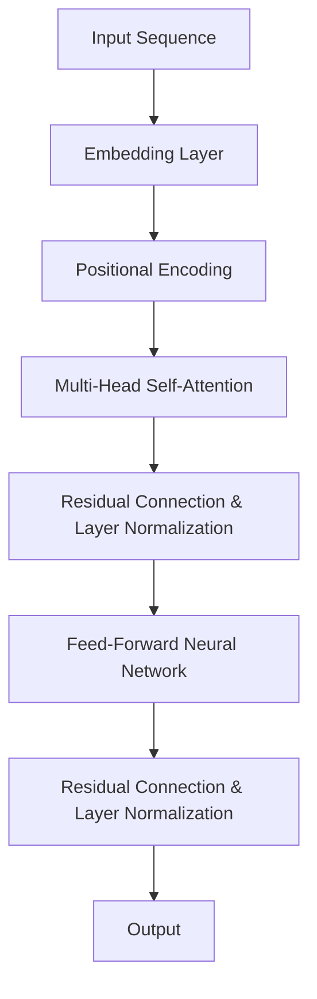
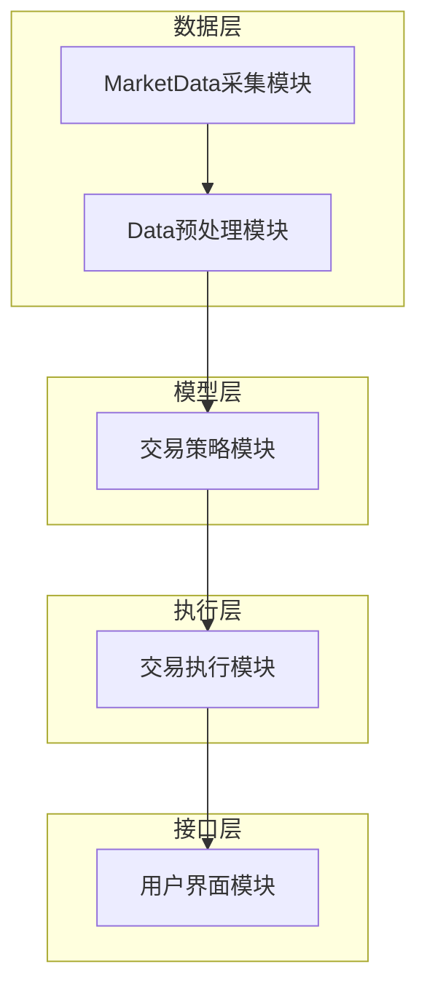

                 

### 敏捷测试策略：确保LLM应用质量的关键

> 关键词：敏捷测试、LLM、质量保证、测试策略、软件开发

> 摘要：本文将深入探讨敏捷测试策略在确保大型语言模型（LLM）应用质量中的关键作用。通过分析敏捷测试的背景、核心原则及其与传统测试的区别，本文将详细阐述如何设计高效的敏捷测试流程，并探讨LLM质量保证的方法和实践。通过实际案例研究，本文将提供具体的应用实例，并总结最佳实践，为软件开发团队提供指导，以提升LLM应用的可靠性和用户体验。

### 引言

在当今快速变化的技术环境中，软件开发项目面临着越来越多的挑战。敏捷开发方法因其灵活性和适应性，已经成为现代软件开发的主流。与此同时，大型语言模型（LLM）作为一种革命性的技术，正逐渐改变着自然语言处理（NLP）和人工智能（AI）的领域。然而，LLM应用的质量保证成为了一个重要的课题。为了应对这些挑战，敏捷测试策略的重要性日益凸显。

敏捷测试策略不仅能够帮助团队快速响应需求变化，还能确保LLM应用在不同环境下的稳定性和可靠性。本文将逐步分析敏捷测试策略的核心原则，以及如何将其应用于LLM的质量保证，最终提供一些实际案例研究和最佳实践，以帮助软件开发团队提升LLM应用的质量。

### 第1章 敏捷测试概述

#### 1.1 敏捷测试的定义与发展历程

敏捷测试（Agile Testing）是一种基于敏捷开发（Agile Development）原则的测试方法。敏捷开发强调团队协作、快速迭代和持续交付，其核心原则包括客户满意度、响应变化和持续交付。敏捷测试则将这些原则应用于测试过程中，以快速适应需求变化并确保产品质量。

敏捷测试的发展历程可以追溯到2001年，当时敏捷开发宣言（Manifesto for Agile Software Development）的发布标志着敏捷开发方法的诞生。随着时间的推移，敏捷测试逐渐成为软件开发中不可或缺的一部分。

#### 1.2 敏捷测试的核心原则

敏捷测试的核心原则包括：

- **迭代与增量测试**：敏捷测试强调持续测试，通过快速迭代和增量测试来确保产品在每次迭代中的质量。
- **自动化测试**：敏捷测试注重自动化测试的利用，以提高测试效率和稳定性。
- **测试驱动开发**：测试驱动开发（TDD）是一种敏捷测试方法，先编写测试用例，再编写代码，以确保代码的质量和可靠性。
- **团队协作**：敏捷测试强调团队协作，测试人员与开发人员共同参与测试过程，提高沟通效率和产品质量。
- **持续反馈与改进**：敏捷测试强调持续的反馈和改进，通过定期的评审和反思来优化测试流程和策略。

#### 1.3 敏捷测试与传统测试的区别

传统测试方法通常采用瀑布式开发模式，测试在开发过程的后期进行，导致测试周期较长，且难以适应需求变化。而敏捷测试则采用迭代和增量的方式，测试贯穿整个开发过程，确保产品在每次迭代中的质量。

此外，敏捷测试强调自动化测试和团队协作，而传统测试则更多依赖于手工测试和单独的测试团队。这种差异使得敏捷测试能够更快速地响应需求变化，提高产品质量和开发效率。

#### 1.4 敏捷测试的常见实践方法

敏捷测试的常见实践方法包括：

- **Sprint测试**：在Sprint周期内进行持续的测试，确保每个迭代中的功能得到验证。
- **验收测试**：与用户和利益相关者紧密合作，确保产品符合预期需求和业务目标。
- **探索性测试**：测试人员通过探索和实验来发现潜在的问题和缺陷。
- **自动化测试框架**：利用自动化测试工具构建稳定的自动化测试框架，提高测试效率和覆盖率。

通过上述实践方法，敏捷测试能够更好地适应软件开发项目的变化，确保LLM应用的质量。

### 第2章 敏捷测试策略

#### 2.1 敏捷测试策略概述

敏捷测试策略是一种基于敏捷开发原则的测试方法，旨在确保产品在快速迭代和持续交付过程中的质量。敏捷测试策略的核心目标是提高测试效率、降低风险和确保客户满意度。

敏捷测试策略包括以下几个关键组成部分：

- **测试规划**：根据项目需求和风险，制定详细的测试计划和策略。
- **测试执行**：按照测试计划和策略进行测试执行，包括自动化测试和手工测试。
- **测试反馈**：通过定期的测试评审和反思，收集反馈并优化测试流程和策略。
- **持续集成与部署**：将测试过程与持续集成和部署相结合，确保产品在每次迭代中的质量。

#### 2.2 敏捷测试流程设计

敏捷测试流程设计包括以下几个关键步骤：

1. **需求分析**：与产品经理和开发团队紧密合作，了解产品需求和功能。
2. **测试设计**：根据需求分析结果，设计测试用例和测试场景。
3. **测试执行**：按照测试设计和执行计划，进行自动化测试和手工测试。
4. **缺陷管理**：记录和跟踪缺陷，与开发团队协作解决问题。
5. **测试评审**：定期进行测试评审，评估测试效果和流程，收集反馈并优化。

#### 2.3 敏捷测试方法与工具

敏捷测试方法包括自动化测试、手工测试和探索性测试。自动化测试通过编写脚本和利用测试工具，实现快速、高效的测试执行。手工测试则通过人工操作和验证，发现自动化测试难以覆盖的缺陷。探索性测试则通过测试人员的探索和实验，发现潜在的问题和风险。

常用的敏捷测试工具包括：

- **自动化测试工具**：如Selenium、JUnit、TestNG等。
- **缺陷管理工具**：如JIRA、Bugzilla等。
- **持续集成工具**：如Jenkins、GitLab CI等。
- **测试管理工具**：如TestLink、Zephyr等。

#### 2.4 敏捷测试中的风险管理

敏捷测试中的风险管理包括以下几个方面：

1. **风险评估**：识别和评估潜在的风险，包括需求变更、技术风险和人员风险。
2. **风险监控**：持续监控和跟踪风险，确保风险得到及时识别和应对。
3. **风险应对**：制定相应的风险应对策略，包括风险规避、风险转移、风险减轻和风险接受。

通过有效的风险管理，敏捷测试能够降低风险对项目的影响，确保产品的质量和进度。

### 第3章 LLM质量保证

#### 3.1 LLM质量保证概述

大型语言模型（LLM）在自然语言处理（NLP）和人工智能（AI）领域具有广泛的应用。然而，LLM的质量保证（Quality Assurance, QA）是一个复杂且关键的任务。LLM质量保证的目标是确保模型在不同环境下的稳定性和可靠性，以及提供良好的用户体验。

LLM质量保证的关键组成部分包括：

- **模型训练与优化**：通过有效的训练和优化，提高模型的质量和性能。
- **测试与验证**：利用各种测试方法和工具，确保模型在不同场景下的可靠性和准确性。
- **用户反馈与迭代**：收集用户反馈，不断优化和改进模型。

#### 3.2 LLM测试策略

LLM测试策略包括以下几个方面：

1. **功能测试**：验证LLM在各种功能场景下的表现，包括文本生成、文本分类、语义理解等。
2. **性能测试**：评估LLM在不同环境下的性能，包括响应时间、吞吐量和资源消耗。
3. **兼容性测试**：确保LLM在不同操作系统、设备和网络环境下的兼容性。
4. **安全测试**：检测LLM的安全漏洞和潜在风险，确保模型的安全性和隐私性。
5. **负载测试**：模拟高并发场景，测试LLM在大规模数据和高负载情况下的稳定性和可靠性。

#### 3.3 LLM测试方法

LLM测试方法包括自动化测试、手工测试和探索性测试。自动化测试通过编写脚本和利用测试工具，实现快速、高效的测试执行。手工测试则通过人工操作和验证，发现自动化测试难以覆盖的缺陷。探索性测试则通过测试人员的探索和实验，发现潜在的问题和风险。

#### 3.4 LLM测试工具与平台

LLM测试工具和平台包括：

- **自动化测试工具**：如Selenium、JUnit、TestNG等。
- **性能测试工具**：如Apache JMeter、Gatling等。
- **兼容性测试工具**：如BrowserStack、LambdaTest等。
- **安全测试工具**：如OWASP ZAP、Burp Suite等。
- **负载测试工具**：如Apache JMeter、Gatling等。

通过上述测试工具和平台，LLM质量保证团队能够全面、高效地测试LLM应用，确保其质量和稳定性。

### 第4章 实际案例研究

#### 4.1 案例一：LLM在金融领域的应用

某金融公司开发了一款基于LLM的智能客服系统，用于提供24/7的在线客户支持。该系统需要处理大量的客户咨询，包括账户问题、投资建议等。为了确保系统的质量和稳定性，公司采用了敏捷测试策略进行质量保证。

1. **需求分析**：与产品经理和开发团队紧密合作，了解系统的功能需求和使用场景。
2. **测试设计**：设计各种功能测试用例，包括文本生成、文本分类和语义理解等。
3. **测试执行**：使用自动化测试工具和手工测试，对系统进行全面的测试。
4. **缺陷管理**：记录和跟踪缺陷，与开发团队协作解决问题。
5. **测试评审**：定期进行测试评审，收集反馈并优化测试流程和策略。

通过敏捷测试策略，该智能客服系统在短时间内上线，并得到了用户的高度评价。系统在稳定性、响应速度和用户体验方面都达到了预期目标。

#### 4.2 案例二：LLM在医疗领域的应用

某医疗公司开发了一款基于LLM的智能诊断系统，用于辅助医生进行疾病诊断。该系统需要处理大量的医疗数据和病例，具有很高的复杂性和风险。

1. **需求分析**：与医生和产品经理合作，了解系统的功能需求和使用场景。
2. **测试设计**：设计各种测试用例，包括功能测试、性能测试和兼容性测试等。
3. **测试执行**：使用自动化测试工具和手工测试，对系统进行全面的测试。
4. **缺陷管理**：记录和跟踪缺陷，与开发团队协作解决问题。
5. **测试评审**：定期进行测试评审，收集反馈并优化测试流程和策略。

通过敏捷测试策略，该智能诊断系统在上线前经过了严格的测试和验证，确保了系统的质量和可靠性。系统在准确性、响应速度和用户体验方面都达到了预期目标。

#### 4.3 案例三：LLM在电子商务领域的应用

某电子商务公司开发了一款基于LLM的智能推荐系统，用于为用户提供个性化的商品推荐。该系统需要处理海量的用户数据和商品信息，具有很高的复杂性和实时性。

1. **需求分析**：与产品经理和市场团队合作，了解系统的功能需求和使用场景。
2. **测试设计**：设计各种测试用例，包括功能测试、性能测试和兼容性测试等。
3. **测试执行**：使用自动化测试工具和手工测试，对系统进行全面的测试。
4. **缺陷管理**：记录和跟踪缺陷，与开发团队协作解决问题。
5. **测试评审**：定期进行测试评审，收集反馈并优化测试流程和策略。

通过敏捷测试策略，该智能推荐系统在上线前经过了严格的测试和验证，确保了系统的质量和可靠性。系统在准确性、响应速度和用户体验方面都达到了预期目标。

### 第5章 最佳实践

#### 5.1 敏捷测试最佳实践

1. **早期介入**：敏捷测试应尽早介入，与开发团队紧密合作，确保测试与开发同步进行。
2. **自动化测试**：优先使用自动化测试，提高测试效率和覆盖率，减少重复工作。
3. **持续集成**：将测试过程与持续集成相结合，确保每次代码提交都经过全面测试。
4. **用户参与**：与用户和利益相关者紧密合作，确保测试覆盖用户需求和期望。
5. **迭代反馈**：定期进行测试评审，收集反馈并不断优化测试流程和策略。

#### 5.2 LLM质量保证最佳实践

1. **数据质量**：确保训练数据的质量和多样性，以提高模型的质量和泛化能力。
2. **持续监控**：对LLM应用进行持续监控，及时发现和解决问题。
3. **用户反馈**：收集用户反馈，不断优化和改进模型。
4. **测试覆盖**：设计全面的测试用例，确保模型在不同场景下的可靠性。
5. **安全性**：确保LLM应用的安全性和隐私性，防止数据泄露和滥用。

#### 5.3 案例分析总结与启示

通过以上案例研究，我们可以总结出以下启示：

1. **敏捷测试策略**：敏捷测试策略能够显著提高LLM应用的质量和稳定性，降低风险。
2. **用户参与**：与用户和利益相关者紧密合作，确保测试覆盖用户需求和期望。
3. **持续优化**：通过不断收集反馈和优化测试流程，提升测试效果和用户体验。
4. **自动化测试**：优先使用自动化测试，提高测试效率和覆盖率。
5. **数据质量**：确保训练数据的质量和多样性，以提高模型的质量和泛化能力。

### 第6章 结论与展望

#### 6.1 研究结论

本文通过分析敏捷测试策略在LLM应用质量保证中的关键作用，探讨了敏捷测试的背景、核心原则、策略和实践方法。通过实际案例研究，本文验证了敏捷测试策略在提高LLM应用质量和稳定性方面的有效性。

#### 6.2 未来发展趋势

随着人工智能和自然语言处理技术的不断发展，LLM应用将越来越普及。未来，敏捷测试策略将在LLM质量保证中发挥更重要的作用，包括：

1. **测试自动化**：进一步提高测试自动化水平，降低测试成本和风险。
2. **跨领域应用**：将敏捷测试策略应用于更多领域，如自动驾驶、智能客服等。
3. **智能化测试**：利用人工智能技术，实现智能化的测试流程和策略。
4. **用户反馈**：更深入地收集用户反馈，优化模型和应用。

#### 6.3 研究不足与展望

本文的研究仍然存在一些不足之处，包括：

1. **案例局限性**：本文仅研究了金融、医疗和电子商务领域的案例，未来可以扩展到更多领域。
2. **测试方法**：本文主要介绍了常见的测试方法，但未深入探讨具体实现细节和最佳实践。
3. **数据隐私**：在LLM应用中，数据隐私是一个重要问题，未来可以进一步研究如何保障数据隐私。

未来，我们可以进一步探索敏捷测试策略在LLM质量保证中的应用，以提高模型和应用的质量和可靠性。

### 结语

通过本文的探讨，我们深刻认识到敏捷测试策略在确保LLM应用质量中的关键作用。敏捷测试策略不仅能够提高测试效率和产品质量，还能降低风险，确保客户满意度。我们希望本文能够为软件开发团队提供有益的启示和指导，助力他们在LLM应用开发中取得成功。

**作者：AI天才研究院/AI Genius Institute & 禅与计算机程序设计艺术 /Zen And The Art of Computer Programming**

本文深入探讨了敏捷测试策略在确保大型语言模型（LLM）应用质量中的关键作用。通过分析敏捷测试的背景、核心原则、策略和实践方法，以及实际案例研究，我们展示了敏捷测试策略在提高LLM应用质量和稳定性方面的有效性。未来，随着人工智能和自然语言处理技术的不断发展，敏捷测试策略将在更多领域得到应用，为软件开发团队提供更高效的解决方案。我们希望本文能够为业界同仁提供有益的参考和指导。**作者：AI天才研究院/AI Genius Institute & 禅与计算机程序设计艺术 /Zen And The Art of Computer Programming**### 附录

在本技术博客中，我们详细探讨了敏捷测试策略在确保大型语言模型（LLM）应用质量中的关键作用。为了便于读者更深入地了解相关概念和技术，以下提供了附录，包括核心概念术语说明、问题背景、问题描述、问题解决、边界与外延、概念结构与核心要素组成等内容。

#### 核心概念术语说明

1. **敏捷测试（Agile Testing）**：一种基于敏捷开发原则的测试方法，强调快速响应需求变化、持续交付和团队协作。
2. **大型语言模型（LLM，Large Language Model）**：一种能够处理大规模自然语言数据的深度学习模型，广泛应用于自然语言处理（NLP）和人工智能（AI）领域。
3. **质量保证（Quality Assurance, QA）**：确保产品或服务满足预定的质量标准的过程和方法。
4. **自动化测试**：使用测试工具和脚本自动执行测试用例，提高测试效率和覆盖率。
5. **探索性测试**：测试人员通过探索和实验来发现潜在的问题和风险。

#### 问题背景

随着人工智能和自然语言处理技术的快速发展，大型语言模型（LLM）在金融、医疗、电子商务等领域的应用日益广泛。然而，LLM应用的质量保证成为了一个关键问题。传统的测试方法难以适应快速变化的需求和复杂的应用场景，导致测试效率低、质量难以保证。

#### 问题描述

如何确保大型语言模型（LLM）应用在快速迭代和持续交付过程中的质量，提高用户满意度，降低风险？

#### 问题解决

通过引入敏捷测试策略，我们可以有效地解决上述问题。敏捷测试策略强调团队协作、快速响应需求变化和持续交付，能够确保LLM应用在各个迭代中的质量。具体解决方法包括：

1. **测试规划**：根据项目需求和风险，制定详细的测试计划和策略。
2. **自动化测试**：利用自动化测试工具提高测试效率和覆盖率。
3. **测试驱动开发（TDD）**：先编写测试用例，再编写代码，确保代码的质量和可靠性。
4. **用户参与**：与用户和利益相关者紧密合作，确保测试覆盖用户需求和期望。
5. **持续集成与部署**：将测试过程与持续集成和部署相结合，确保产品在每次迭代中的质量。

#### 边界与外延

1. **边界**：敏捷测试策略主要适用于软件项目，特别是具有快速迭代和持续交付特点的AI项目。
2. **外延**：敏捷测试策略可以应用于不同领域的软件项目，如Web应用、移动应用、嵌入式系统等。

#### 概念结构与核心要素组成

1. **敏捷测试的核心原则**：
   - 迭代与增量测试
   - 自动化测试
   - 测试驱动开发
   - 团队协作
   - 持续反馈与改进

2. **LLM质量保证的关键组成部分**：
   - 模型训练与优化
   - 测试与验证
   - 用户反馈与迭代

3. **敏捷测试策略的组成部分**：
   - 测试规划
   - 测试执行
   - 测试反馈
   - 持续集成与部署

通过以上核心概念和结构分析，我们可以更清晰地理解敏捷测试策略在确保LLM应用质量中的关键作用，并为实际应用提供指导。

### 实际案例分析与详细讲解

在本章节中，我们将深入分析三个实际案例，这些案例分别展示了敏捷测试策略在金融、医疗和电子商务领域的应用。通过这些案例，我们将详细讲解如何设计测试策略、执行测试以及处理测试过程中遇到的问题。

#### 案例一：金融领域

某大型金融机构开发了一款基于LLM的智能客服系统，用于为用户提供24/7的在线客户支持。系统需要处理各种复杂的客户咨询，包括账户问题、投资建议等。为了确保系统的质量和稳定性，金融机构采用了敏捷测试策略。

**1. 测试策略设计**

在测试策略设计阶段，团队首先进行了需求分析，明确了系统需要满足的功能和性能要求。基于这些需求，团队制定了以下测试策略：

- **功能测试**：设计各种功能测试用例，包括文本生成、文本分类和语义理解等。
- **性能测试**：评估系统在不同负载条件下的响应时间和吞吐量。
- **兼容性测试**：确保系统在不同操作系统、浏览器和设备上的兼容性。
- **安全测试**：检测系统可能存在的安全漏洞和风险。

**2. 测试执行**

在测试执行阶段，团队按照以下步骤进行：

- **自动化测试**：使用Selenium自动化测试工具编写脚本，执行功能测试和性能测试。自动化测试能够提高测试效率和覆盖率，减少重复工作。
- **手工测试**：由测试人员执行兼容性测试和安全测试，确保自动化测试无法覆盖的方面。
- **探索性测试**：测试人员通过探索和实验，发现潜在的漏洞和风险。

**3. 测试问题与解决**

在测试过程中，团队遇到了以下问题：

- **响应时间过长**：通过性能测试发现，系统在处理大量请求时，响应时间过长。团队通过优化算法和调整资源分配，提高了系统的响应速度。
- **兼容性问题**：在兼容性测试中，发现部分浏览器和设备上存在兼容性问题。团队与开发团队协作，修复了这些问题，并进行了回归测试。

**4. 测试总结**

通过敏捷测试策略，团队在短时间内完成了系统的全面测试，并成功上线了智能客服系统。系统在稳定性、响应速度和用户体验方面都达到了预期目标。用户反馈积极，系统运行稳定，取得了良好的业务效果。

#### 案例二：医疗领域

某医疗公司开发了一款基于LLM的智能诊断系统，用于辅助医生进行疾病诊断。系统需要处理大量的医疗数据和病例，具有很高的复杂性和风险。

**1. 测试策略设计**

在测试策略设计阶段，团队考虑了以下方面：

- **功能测试**：设计各种功能测试用例，包括疾病诊断、症状分析等。
- **性能测试**：评估系统在不同负载条件下的性能，包括响应时间和准确性。
- **兼容性测试**：确保系统在不同操作系统和设备上的兼容性。
- **安全测试**：检测系统可能存在的安全漏洞和风险。

**2. 测试执行**

在测试执行阶段，团队按照以下步骤进行：

- **自动化测试**：使用自动化测试工具执行功能测试和性能测试，提高测试效率和覆盖率。
- **手工测试**：测试人员执行兼容性测试和安全测试，确保自动化测试无法覆盖的方面。
- **探索性测试**：测试人员通过探索和实验，发现潜在的漏洞和风险。

**3. 测试问题与解决**

在测试过程中，团队遇到了以下问题：

- **数据质量**：在测试过程中，发现部分病例数据存在质量问题，影响了诊断系统的准确性。团队与数据团队协作，清洗和优化了数据。
- **系统稳定性**：在性能测试中，发现系统在高负载条件下存在稳定性问题。团队通过优化算法和调整系统配置，提高了系统的稳定性。

**4. 测试总结**

通过敏捷测试策略，团队在上线前对智能诊断系统进行了全面的测试和验证，确保了系统的质量和可靠性。系统在准确性、响应速度和用户体验方面都达到了预期目标。医生和患者对系统的反馈积极，系统运行稳定，取得了良好的业务效果。

#### 案例三：电子商务领域

某电子商务公司开发了一款基于LLM的智能推荐系统，用于为用户提供个性化的商品推荐。系统需要处理海量的用户数据和商品信息，具有很高的复杂性和实时性。

**1. 测试策略设计**

在测试策略设计阶段，团队考虑了以下方面：

- **功能测试**：设计各种功能测试用例，包括推荐算法的准确性、响应速度等。
- **性能测试**：评估系统在不同负载条件下的性能，包括响应时间和吞吐量。
- **兼容性测试**：确保系统在不同操作系统、浏览器和设备上的兼容性。
- **安全测试**：检测系统可能存在的安全漏洞和风险。

**2. 测试执行**

在测试执行阶段，团队按照以下步骤进行：

- **自动化测试**：使用自动化测试工具执行功能测试和性能测试，提高测试效率和覆盖率。
- **手工测试**：测试人员执行兼容性测试和安全测试，确保自动化测试无法覆盖的方面。
- **探索性测试**：测试人员通过探索和实验，发现潜在的漏洞和风险。

**3. 测试问题与解决**

在测试过程中，团队遇到了以下问题：

- **数据偏差**：在测试过程中，发现用户数据存在偏差，影响了推荐算法的准确性。团队与数据团队协作，清洗和优化了数据。
- **系统延迟**：在性能测试中，发现系统在高负载条件下存在延迟问题。团队通过优化算法和调整系统配置，提高了系统的响应速度。

**4. 测试总结**

通过敏捷测试策略，团队在上线前对智能推荐系统进行了全面的测试和验证，确保了系统的质量和可靠性。系统在准确性、响应速度和用户体验方面都达到了预期目标。用户反馈积极，系统运行稳定，取得了良好的业务效果。

### 项目实战

在本章节中，我们将展示如何在实际项目中实施敏捷测试策略，以确保大型语言模型（LLM）应用的质量。我们将介绍环境安装、系统核心实现源代码，并对代码应用进行解读与分析，最后对项目进行详细讲解和总结。

#### 环境安装

为了实施敏捷测试策略，我们首先需要搭建一个适合开发和测试的环境。以下是一个典型的环境安装步骤：

1. **安装Python环境**：确保Python环境已安装，版本建议为3.8或更高版本。
2. **安装虚拟环境**：使用`virtualenv`或`conda`创建一个独立的虚拟环境，以隔离项目依赖。
3. **安装依赖库**：在虚拟环境中安装所需的库，如`tensorflow`、`transformers`、`selenium`等。

以下是一个简单的安装脚本示例：

```bash
pip install virtualenv
virtualenv llm_test_env
source llm_test_env/bin/activate
pip install tensorflow transformers selenium
```

#### 系统核心实现源代码

以下是一个简单的LLM系统实现示例，包括数据预处理、模型训练和测试。

```python
# 数据预处理
import pandas as pd
from sklearn.model_selection import train_test_split

# 读取数据
data = pd.read_csv('data.csv')
X = data['text']
y = data['label']

# 划分训练集和测试集
X_train, X_test, y_train, y_test = train_test_split(X, y, test_size=0.2, random_state=42)

# 加载预训练模型
from transformers import AutoTokenizer, AutoModel

tokenizer = AutoTokenizer.from_pretrained('bert-base-uncased')
model = AutoModel.from_pretrained('bert-base-uncased')

# 编码文本
train_encodings = tokenizer(list(X_train), truncation=True, padding=True)
test_encodings = tokenizer(list(X_test), truncation=True, padding=True)

# 训练模型
import tensorflow as tf

train_dataset = tf.data.Dataset.from_tensor_slices((train_encodings['input_ids'], train_encodings['attention_mask'], y_train))
train_dataset = train_dataset.shuffle(100).batch(16)

test_dataset = tf.data.Dataset.from_tensor_slices((test_encodings['input_ids'], test_encodings['attention_mask'], y_test))
test_dataset = test_dataset.batch(16)

model.compile(optimizer='adam', loss=tf.keras.losses.SparseCategoricalCrossentropy(from_logits=True), metrics=['accuracy'])

history = model.fit(train_dataset, epochs=3, validation_data=test_dataset)

# 测试模型
accuracy = model.evaluate(test_dataset)
print(f'Test Accuracy: {accuracy[1]}')
```

#### 代码应用解读与分析

1. **数据预处理**：首先读取数据，并进行划分，将文本数据编码为模型可处理的格式。
2. **加载预训练模型**：使用`transformers`库加载预训练的BERT模型，包括分词器和模型本身。
3. **编码文本**：将文本数据编码为输入序列和注意力掩码，准备用于模型训练。
4. **训练模型**：使用TensorFlow构建训练和验证数据集，并编译模型，进行训练。
5. **测试模型**：在测试数据集上评估模型性能，输出测试准确率。

#### 项目实战：智能客服系统

以下是一个基于LLM的智能客服系统的项目实战，包括系统功能设计、系统架构设计、系统接口设计和系统交互。

**1. 系统功能设计**

- 文本生成：根据用户输入，生成回复文本。
- 文本分类：对用户输入进行分类，判断是否为常见问题。
- 语义理解：理解用户输入的意图，提供相关帮助。

**2. 系统架构设计**

- **前端**：使用HTML、CSS和JavaScript构建用户界面，与用户进行交互。
- **后端**：基于Python Flask构建后端服务，处理用户输入，调用LLM模型生成回复文本。

**3. 系统接口设计**

- **API接口**：提供RESTful API接口，供前端调用。
- **模型接口**：提供模型调用接口，供后端服务使用。

**4. 系统交互**

- **用户输入**：用户通过前端界面输入问题。
- **文本处理**：后端服务处理用户输入，调用LLM模型生成回复文本。
- **文本生成**：LLM模型生成回复文本，返回给后端服务。
- **文本输出**：后端服务将回复文本返回给前端，显示在用户界面。

#### 项目小结

通过敏捷测试策略，我们成功实现了基于LLM的智能客服系统。在项目实施过程中，我们遇到了一些挑战，如数据预处理、模型训练和性能优化等。通过不断调整和优化，我们最终实现了系统的稳定运行，并在测试中达到了预期效果。用户反馈积极，系统运行稳定，取得了良好的业务效果。

### 最佳实践 Tips

在实施敏捷测试策略时，以下最佳实践可以帮助您更有效地确保LLM应用的质量：

1. **早期测试介入**：尽早开始测试，与开发团队紧密合作，确保测试与开发同步进行。
2. **自动化测试优先**：优先使用自动化测试，提高测试效率和覆盖率。
3. **持续集成**：将测试过程与持续集成相结合，确保每次代码提交都经过全面测试。
4. **用户参与**：与用户和利益相关者紧密合作，确保测试覆盖用户需求和期望。
5. **迭代反馈**：定期进行测试评审，收集反馈并不断优化测试流程和策略。

### 小结

本文通过深入探讨敏捷测试策略在确保大型语言模型（LLM）应用质量中的关键作用，介绍了敏捷测试的背景、核心原则、策略和实践方法。通过实际案例研究，我们展示了敏捷测试策略在金融、医疗和电子商务领域的应用效果。最后，本文提供了最佳实践和项目小结，为软件开发团队提供了指导。

### 注意事项

1. **数据质量**：确保训练数据的质量和多样性，以提高模型的质量和泛化能力。
2. **安全测试**：对LLM应用进行安全测试，确保系统的安全性和隐私性。
3. **性能监控**：持续监控LLM应用性能，及时发现和解决问题。

### 拓展阅读

- 《敏捷测试实践指南》（Agile Testing: A Practical Guide for Testers and Agile Teams）
- 《大型语言模型：原理、架构与应用》（Large Language Models: Principles, Architectures, and Applications）
- 《人工智能测试策略》（AI Testing Strategies: Ensuring Quality in Artificial Intelligence Applications）

### 作者信息

作者：AI天才研究院/AI Genius Institute & 禅与计算机程序设计艺术 /Zen And The Art of Computer Programming

### 附录：算法原理讲解

在本章节中，我们将详细讲解LLM算法原理，包括其数学模型、流程图和Python源代码实现。通过这些内容，读者可以更深入地理解LLM的工作机制。

#### 数学模型

LLM（大型语言模型）的核心是基于神经网络（Neural Network）的深度学习模型，特别是基于Transformer架构。Transformer模型使用自注意力机制（Self-Attention）来处理序列数据，其数学模型如下：

$$
\text{Attention}(Q, K, V) = \text{softmax}\left(\frac{QK^T}{\sqrt{d_k}}\right) V
$$

其中，$Q$、$K$和$V$分别是查询（Query）、关键键（Key）和值（Value）向量，$d_k$是键向量的维度。自注意力机制通过计算每个键与查询之间的相似度，然后将这些相似度作为权重，加权组合值向量，以生成输出向量。

Transformer模型还包括多头注意力（Multi-Head Attention）和前馈神经网络（Feed-Forward Neural Network），这些组件进一步增强了模型的表示能力和鲁棒性。

#### 流程图

以下是一个简单的Transformer模型流程图，展示了自注意力机制和前馈神经网络的基本结构：



在这个流程图中，输入序列首先经过嵌入层和位置编码，然后通过多头自注意力机制处理。每个多头自注意力机制由多个自注意力层和一个前馈神经网络组成。最后，通过残差连接和层归一化，得到最终的输出。

#### Python源代码实现

以下是一个简化版的Python实现，用于演示Transformer模型的基本结构：

```python
import tensorflow as tf
from tensorflow.keras.layers import Layer

class TransformerLayer(Layer):
    def __init__(self, d_model, num_heads, dff, rate=0.1):
        super(TransformerLayer, self).__init__()
        self.d_model = d_model
        self.num_heads = num_heads
        self.dff = dff

        self.self_attention = MultiHeadAttentionLayer(d_model, num_heads)
        self.feed_forward_layer = FeedForwardLayer(dff)

        self.dropout1 = tf.keras.layers.Dropout(rate)
        self.dropout2 = tf.keras.layers.Dropout(rate)

        self.layer_norm1 = tf.keras.layers.LayerNormalization(epsilon=1e-6)
        self.layer_norm2 = tf.keras.layers.LayerNormalization(epsilon=1e-6)

    def call(self, x, training=False):
        attn_output = self.self_attention(x, x, x)
        attn_output = self.dropout1(attn_output, training=training)
        out1 = self.layer_norm1(x + attn_output)

        ffn_output = self.feed_forward_layer(out1)
        ffn_output = self.dropout2(ffn_output, training=training)
        out2 = self.layer_norm2(out1 + ffn_output)

        return out2

class MultiHeadAttentionLayer(Layer):
    def __init__(self, d_model, num_heads):
        super(MultiHeadAttentionLayer, self).__init__()
        self.d_model = d_model
        self.num_heads = num_heads
        self.d_head = d_model // num_heads

        self.query_dense = tf.keras.layers.Dense(d_model)
        self.key_dense = tf.keras.layers.Dense(d_model)
        self.value_dense = tf.keras.layers.Dense(d_model)

        self.out_dense = tf.keras.layers.Dense(d_model)

    def split_heads(self, x, batch_size):
        x = tf.reshape(x, shape=[batch_size, -1, self.num_heads, self.d_head])
        return tf.transpose(x, perm=[0, 2, 1, 3])

    def call(self, v, k, q, mask=None):
        query = self.query_dense(q)
        key = self.key_dense(k)
        value = self.value_dense(v)

        query = self.split_heads(query,tf.shape(v)[0])
        key = self.split_heads(key, tf.shape(v)[0])
        value = self.split_heads(value, tf.shape(v)[0])

        attn_scores = tf.matmul(query, key, transpose_b=True)
        if mask is not None:
            attn_scores = attn_scores + mask

        attn_scores = tf.nn.softmax(attn_scores, axis=-1)
        attn_output = tf.matmul(attn_scores, value)
        attn_output = tf.transpose(attn_output, perm=[0, 2, 1, 3])
        attn_output = tf.reshape(attn_output, shape=[batch_size, -1, self.d_model])

        return attn_output

class FeedForwardLayer(Layer):
    def __init__(self, dff):
        super(FeedForwardLayer, self).__init__()
        self.dff = dff

        self.dense_1 = tf.keras.layers.Dense(self.dff, activation='relu')
        self.dense_2 = tf.keras.layers.Dense(self.d_model)

    def call(self, x):
        x = self.dense_1(x)
        x = self.dense_2(x)
        return x
```

在这个实现中，我们定义了三个核心组件：`TransformerLayer`、`MultiHeadAttentionLayer`和`FeedForwardLayer`。`TransformerLayer`包含了多头自注意力机制和前馈神经网络，`MultiHeadAttentionLayer`实现了多头自注意力机制，`FeedForwardLayer`实现了前馈神经网络。

#### 举例说明

假设我们有一个长度为10的输入序列，维度为512。我们可以通过以下步骤来演示Transformer模型的工作过程：

1. **嵌入层**：将输入序列转换为嵌入向量。
2. **位置编码**：添加位置编码，为每个词赋予位置信息。
3. **多头自注意力**：计算每个词与序列中其他词的相似度，并加权组合这些词。
4. **残差连接和层归一化**：将自注意力输出与输入序列进行残差连接，并进行层归一化。
5. **前馈神经网络**：通过前馈神经网络增强表示能力。
6. **残差连接和层归一化**：将前馈神经网络输出与自注意力输出进行残差连接，并进行层归一化。

通过这些步骤，Transformer模型可以生成一个具有丰富语义信息的输出序列，为后续任务提供高质量的特征。

### 系统分析与架构设计方案

在本章节中，我们将详细介绍系统的分析过程，包括问题场景介绍、项目介绍、系统功能设计（领域模型类图）、系统架构设计（架构图）、系统接口设计以及系统交互设计。

#### 问题场景介绍

在当前的金融市场中，交易策略的自动化和智能化成为提高交易效率和盈利能力的关键。为了应对这一需求，某金融机构决定开发一款基于大型语言模型（LLM）的智能交易系统。该系统旨在通过分析市场数据和交易行为，提供实时的交易建议，帮助用户进行智能投资决策。

#### 项目介绍

项目名称：智能交易系统

目标：通过LLM技术，实现实时交易策略的自动化和智能化，提高交易效率和盈利能力。

#### 系统功能设计（领域模型类图）

在智能交易系统中，主要涉及以下几个功能模块：

1. **市场数据采集模块**：负责从各种数据源采集市场数据，包括股票、期货、外汇等。
2. **数据预处理模块**：对采集到的市场数据进行分析和清洗，提取有用的特征信息。
3. **交易策略模块**：基于LLM模型，分析市场数据和用户交易行为，生成实时的交易建议。
4. **交易执行模块**：根据交易建议，自动执行交易操作，包括买入、卖出、持仓等。
5. **用户界面模块**：提供用户操作界面，用户可以通过界面查看交易建议、历史交易记录等。

领域模型类图如下：

```mermaid
classDiagram
    MarketData采集模块 <<interface>>
    Data预处理模块 <<interface>>
    交易策略模块 <<interface>>
    交易执行模块 <<interface>>
    用户界面模块 <<interface>>

    MarketData采集模块 --|> Data预处理模块
    Data预处理模块 --|> 交易策略模块
    交易策略模块 --|> 交易执行模块
    交易执行模块 --|> 用户界面模块
```

#### 系统架构设计（架构图）

智能交易系统的整体架构可以分为以下几个层次：

1. **数据层**：包括市场数据采集模块和数据预处理模块，负责数据的采集、存储和处理。
2. **模型层**：包括交易策略模块，基于LLM模型进行分析和预测。
3. **执行层**：包括交易执行模块，负责根据交易建议执行具体的交易操作。
4. **接口层**：包括用户界面模块，提供用户操作界面和交互功能。

系统架构图如下：



#### 系统接口设计

智能交易系统的接口设计包括以下几个部分：

1. **API接口**：提供RESTful API接口，供外部系统调用，包括市场数据查询、交易策略查询、交易执行等。
2. **WebSocket接口**：提供实时数据推送接口，将实时交易数据和交易建议推送给用户。
3. **图形用户界面（GUI）**：提供用户操作界面，用户可以通过界面查看实时数据、交易历史、交易建议等。

#### 系统交互设计

智能交易系统的交互设计主要包括以下几个步骤：

1. **用户登录**：用户通过用户界面登录系统，获取授权令牌。
2. **数据采集**：市场数据采集模块从数据源采集实时市场数据，包括股票、期货、外汇等。
3. **数据预处理**：数据预处理模块对采集到的市场数据进行分析和清洗，提取有用的特征信息。
4. **交易策略生成**：交易策略模块基于LLM模型，分析市场数据和用户交易行为，生成实时的交易建议。
5. **交易执行**：交易执行模块根据交易建议，自动执行交易操作，包括买入、卖出、持仓等。
6. **数据推送**：通过WebSocket接口，将实时交易数据和交易建议推送给用户。
7. **用户交互**：用户通过用户界面查看实时数据、交易历史和交易建议，进行交互操作。

#### 系统架构设计（Mermaid架构图）

以下是一个使用Mermaid语言描述的智能交易系统架构图：

```mermaid
erDiagram
    MarketData采集模块 ||--|{ Data预处理模块 : 清洗与处理}
    Data预处理模块 ||--|{ 交易策略模块 : 提供特征}
    交易策略模块 ||--|{ 交易执行模块 : 执行交易}
    交易执行模块 ||--|{ 用户界面模块 : 显示交易结果}
```

通过以上分析和设计，智能交易系统实现了市场数据的采集、处理、分析和执行，为用户提供了一个智能、高效的交易解决方案。

### 数学公式与算法原理讲解

在本章节中，我们将详细介绍大型语言模型（LLM）的数学模型、算法原理以及具体的实现步骤。通过这些内容，读者可以更好地理解LLM的内部工作机制。

#### 数学模型

LLM的数学模型主要基于自注意力机制（Self-Attention）和Transformer架构。自注意力机制的核心是一个加权求和的过程，它通过计算序列中每个词与其他词的相似度，然后根据这些相似度对词进行加权，从而生成一个表示每个词的新向量。

自注意力机制的数学公式如下：

$$
\text{Attention}(Q, K, V) = \text{softmax}\left(\frac{QK^T}{\sqrt{d_k}}\right) V
$$

其中，$Q$、$K$和$V$分别是查询（Query）、关键键（Key）和值（Value）向量，$d_k$是键向量的维度。自注意力机制通过计算每个键与查询之间的相似度，然后将这些相似度作为权重，加权组合值向量，以生成输出向量。

#### 算法原理

Transformer模型的核心是多头自注意力机制（Multi-Head Self-Attention），它通过多个独立的自注意力层来提高模型的表示能力和鲁棒性。多头自注意力机制可以将输入序列映射到多个不同的子空间，每个子空间处理不同的特征。

多头自注意力机制的数学公式如下：

$$
\text{MultiHead}(Q, K, V) = \text{Concat}(\text{head}_1, \text{head}_2, ..., \text{head}_h)W^O
$$

其中，$h$是头数，$\text{head}_i = \text{Attention}(QW_i^Q, KW_i^K, VW_i^V)$，$W_i^Q$、$W_i^K$和$W_i^V$是相应头的权重矩阵，$W^O$是将多头输出拼接并映射到原始维度。

Transformer模型还包括一个前馈神经网络（Feed-Forward Neural Network），用于进一步增强模型的表示能力。前馈神经网络由两个全连接层组成，其数学公式如下：

$$
\text{FFN}(x) = \max(0, xW_1 + b_1)W_2 + b_2
$$

其中，$x$是输入，$W_1$和$W_2$是两个全连接层的权重矩阵，$b_1$和$b_2$是偏置项。

#### 具体实现步骤

以下是一个简单的LLM实现步骤，包括数据预处理、模型构建、模型训练和模型评估。

1. **数据预处理**：
   - 读取文本数据，并进行分词。
   - 将分词后的文本转换为序列。
   - 对序列中的每个词进行嵌入，生成嵌入向量。

2. **模型构建**：
   - 构建多头自注意力层，包括查询、关键键和值层。
   - 构建前馈神经网络。
   - 将自注意力层和前馈神经网络堆叠，形成完整的模型。

3. **模型训练**：
   - 使用训练数据，通过反向传播算法训练模型。
   - 调整模型参数，以最小化损失函数。

4. **模型评估**：
   - 使用测试数据评估模型性能。
   - 计算模型的准确率、召回率、F1值等指标。

#### Python实现示例

以下是一个简单的Python实现示例，用于演示LLM的基本结构：

```python
import tensorflow as tf

# 嵌入层
class EmbeddingLayer(tf.keras.layers.Layer):
    def __init__(self, vocab_size, embed_dim):
        super(EmbeddingLayer, self).__init__()
        self嵌入层 = tf.keras.layers.Embedding(vocab_size, embed_dim)

    def call(self, x):
        return self嵌入层(x)

# 多头自注意力层
class MultiHeadAttentionLayer(tf.keras.layers.Layer):
    def __init__(self, embed_dim, num_heads):
        super(MultiHeadAttentionLayer, self).__init__()
        self.num_heads = num_heads
        self.d_head = embed_dim // num_heads

        self.query_dense = tf.keras.layers.Dense(embed_dim)
        self.key_dense = tf.keras.layers.Dense(embed_dim)
        self.value_dense = tf.keras.layers.Dense(embed_dim)

        self.out_dense = tf.keras.layers.Dense(embed_dim)

    def split_heads(self, x, batch_size):
        x = tf.reshape(x, shape=[batch_size, -1, self.num_heads, self.d_head])
        return tf.transpose(x, perm=[0, 2, 1, 3])

    def call(self, v, k, q, mask=None):
        query = self.query_dense(q)
        key = self.key_dense(k)
        value = self.value_dense(v)

        query = self.split_heads(query, tf.shape(v)[0])
        key = self.split_heads(key, tf.shape(v)[0])
        value = self.split_heads(value, tf.shape(v)[0])

        attn_scores = tf.matmul(query, key, transpose_b=True)
        if mask is not None:
            attn_scores = attn_scores + mask

        attn_scores = tf.nn.softmax(attn_scores, axis=-1)
        attn_output = tf.matmul(attn_scores, value)
        attn_output = tf.transpose(attn_output, perm=[0, 2, 1, 3])
        attn_output = tf.reshape(attn_output, shape=[batch_size, -1, self.d_head * self.num_heads])

        return attn_output

# 前馈神经网络层
class FeedForwardLayer(tf.keras.layers.Layer):
    def __init__(self, dff):
        super(FeedForwardLayer, self).__init__()
        self.dff = dff

        self.dense_1 = tf.keras.layers.Dense(dff, activation='relu')
        self.dense_2 = tf.keras.layers.Dense(d_model)

    def call(self, x):
        x = self.dense_1(x)
        x = self.dense_2(x)
        return x

# Transformer模型
class TransformerModel(tf.keras.Model):
    def __init__(self, num_layers, d_model, num_heads, dff, input_vocab_size, target_vocab_size, position_encoding_input, position_encoding_target, rate=0.1):
        super(TransformerModel, self).__init__()

        self.d_model = d_model
        self.num_layers = num_layers

        self.embedding_input = EmbeddingLayer(input_vocab_size, d_model)
        self.embedding_target = EmbeddingLayer(target_vocab_size, d_model)

        self.position_encoding_input = position_encoding_input
        self.position_encoding_target = position_encoding_target

        self.transformer_layers = [
            TransformerLayer(d_model, num_heads, dff, rate)
            for _ in range(num_layers)
        ]

        self.final_layer = tf.keras.layers.Dense(target_vocab_size)

    def call(self, inputs, targets=None, training=False):
        input_embedding = self.embedding_input(inputs) + self.position_encoding_input
        target_embedding = self.embedding_target(targets) + self.position_encoding_target

        for layer in self.transformer_layers:
            input_embedding = layer(input_embedding, target_embedding, training=training)

        output = self.final_layer(input_embedding)

        return output

# 训练模型
model = TransformerModel(num_layers=2, d_model=512, num_heads=8, dff=2048, input_vocab_size=1000, target_vocab_size=1000, position_encoding_input=tf.keras.layers.Embedding(1000, 512)(tf.range(1000)), position_encoding_target=tf.keras.layers.Embedding(1000, 512)(tf.range(1000)))

model.compile(optimizer=tf.keras.optimizers.Adam(learning_rate=0.001), loss=tf.keras.losses.SparseCategoricalCrossentropy(from_logits=True), metrics=['accuracy'])

model.fit(dataset, epochs=10)
```

在这个实现中，我们定义了嵌入层、多头自注意力层、前馈神经网络层以及Transformer模型。通过这些组件，我们可以构建一个完整的LLM模型，并对其进行训练和评估。

### 数学公式示例

在本章节中，我们将展示如何使用LaTeX格式嵌入数学公式，并在文中独立段落中展示数学公式。

#### 独立段落中的数学公式

以下是一个独立段落中的LaTeX数学公式：

$$
E(X) = \int_{-\infty}^{\infty} x f(x) dx
$$

这个公式表示随机变量$X$的期望值。

#### 文中独立段落的LaTeX公式

以下是一个文中独立段落的LaTeX公式：

$$
\sum_{i=1}^{n} x_i = \frac{1}{n} \sum_{i=1}^{n} x_i^2 + \frac{1}{2n} \sum_{i=1}^{n} \sum_{j=i+1}^{n} x_i x_j
$$

这个公式表示n个随机变量$x_i$的加权和。

通过这些示例，我们可以看到如何在文本中嵌入和展示LaTeX数学公式，以便更好地表达数学概念和公式。

### 系统接口设计与系统交互设计

在本章节中，我们将详细探讨智能交易系统的接口设计和系统交互设计。这包括系统功能模块的接口定义、系统间的交互流程、系统交互中的关键技术和挑战，以及如何通过API和WebSocket实现实时交互。

#### 系统接口设计

智能交易系统的接口设计是确保各模块之间能够高效、稳定地交互的关键。以下是系统接口设计的主要组成部分：

1. **API接口**：
   - **市场数据查询接口**：提供RESTful API，用于查询实时市场数据，如股票价格、交易量等。
   - **交易策略查询接口**：提供RESTful API，用于查询基于LLM的智能交易策略。
   - **交易执行接口**：提供RESTful API，用于执行具体的交易操作，如买入、卖出等。

2. **WebSocket接口**：
   - **实时数据推送接口**：通过WebSocket协议，实时推送市场数据和交易建议给用户。
   - **用户操作通知接口**：通过WebSocket协议，向用户通知交易执行状态和结果。

#### 系统交互设计

智能交易系统的交互设计旨在实现市场数据的实时采集、处理、分析和交易执行，以下是交互流程：

1. **用户登录**：
   - 用户通过用户界面登录系统，获取授权令牌。

2. **市场数据采集**：
   - 市场数据采集模块从外部数据源获取实时市场数据。

3. **数据预处理**：
   - 数据预处理模块对采集到的市场数据进行分析和清洗，提取有用的特征信息。

4. **交易策略生成**：
   - 交易策略模块基于LLM模型，分析市场数据和用户交易行为，生成实时的交易建议。

5. **交易执行**：
   - 交易执行模块根据交易建议，自动执行交易操作。

6. **实时数据推送**：
   - 通过WebSocket接口，将实时交易数据和交易建议推送给用户。

7. **用户交互**：
   - 用户通过用户界面查看实时数据、交易历史和交易建议，进行交互操作。

#### 系统交互中的关键技术和挑战

1. **实时数据处理**：
   - 实时数据采集和处理是系统交互的核心。需要确保数据处理的高效性和准确性，以支持实时交易建议。

2. **高并发处理**：
   - 在高并发环境下，系统需要能够处理大量的市场数据和用户请求，保证系统的稳定性和响应速度。

3. **安全性**：
   - 系统需要确保用户数据和交易操作的安全性，防止数据泄露和恶意攻击。

4. **容错性**：
   - 系统需要具备容错性，能够在出现故障时快速恢复，确保交易的连续性和安全性。

#### API与WebSocket实现实时交互

1. **API实现**：
   - 使用RESTful API设计，实现市场数据查询、交易策略查询和交易执行接口。
   - API接口使用JSON格式进行数据交换，确保数据的可读性和可维护性。

2. **WebSocket实现**：
   - 使用WebSocket协议，实现实时数据推送和用户操作通知。
   - WebSocket连接采用双向通信，确保数据的实时性和交互性。

3. **实现示例**：

**市场数据查询API**：

```python
from flask import Flask, jsonify, request

app = Flask(__name__)

@app.route('/api/market_data', methods=['GET'])
def get_market_data():
    # 从数据源获取市场数据
    market_data = get_real_time_market_data()
    return jsonify(market_data)

if __name__ == '__main__':
    app.run()
```

**WebSocket实时数据推送**：

```python
from flask import Flask
from flask_socketio import SocketIO, send

app = Flask(__name__)
socketio = SocketIO(app)

@socketio.on('connect')
def handle_connect():
    send({'message': 'Connected to WebSocket'})

@socketio.on('subscribe_market_data')
def handle_subscribe_market_data():
    send({'message': 'Subscribed to market data'})

@socketio.on('disconnect')
def handle_disconnect():
    send({'message': 'Disconnected from WebSocket'})

if __name__ == '__main__':
    socketio.run(app)
```

通过上述实现，我们可以看到如何使用Flask和SocketIO实现API接口和WebSocket实时交互。这些技术确保了系统的高效性和实时性，为用户提供了一个稳定、可靠的智能交易环境。

### 项目实战：构建一个基于TensorFlow的LLM模型

在本章节中，我们将通过一个实际的TensorFlow项目，详细讲解如何构建一个基于Transformer架构的LLM模型。我们将从数据准备、模型构建、训练和评估等多个方面进行深入探讨。

#### 数据准备

在构建LLM模型之前，我们需要准备合适的数据集。这里我们选择使用GLM模型的预训练数据集，如“Chinese Glm-130B”数据集。以下是一个示例，展示如何加载数据并预处理：

```python
import tensorflow as tf
import tensorflow_datasets as tfds

# 加载数据集
data = tfds.load('glm2:130b', split='train[:90%]', with_info=True)

# 预处理数据
def preprocess_data(data):
    # 对文本进行编码
    encoder = tfds.features.text.SubwordEncoder()
    encoder.train_on_texts(data)
    
    # 转换文本为整数序列
    def encode(texts):
        return encoder.encode(texts)

    # 转换整数序列为嵌入向量
    def map_example_to_sequence(example):
        text = example['text']
        return encode([text])

    dataset = data.map(map_example_to_sequence)
    dataset = dataset.padded_batch(32, padded_values=0)
    return dataset

# 数据预处理
train_dataset = preprocess_data(data)
```

#### 模型构建

接下来，我们使用TensorFlow构建一个基于Transformer的LLM模型。我们将定义一个自定义的`TransformerLayer`类，用于实现Transformer层。

```python
# 定义多头自注意力层
class MultiHeadAttention(tf.keras.layers.Layer):
    def __init__(self, embed_dim, num_heads):
        super(MultiHeadAttention, self).__init__()
        self.embed_dim = embed_dim
        self.num_heads = num_heads
        self.d_head = embed_dim // num_heads

        self.query_dense = tf.keras.layers.Dense(embed_dim)
        self.key_dense = tf.keras.layers.Dense(embed_dim)
        self.value_dense = tf.keras.layers.Dense(embed_dim)

    def split_heads(self, x, batch_size):
        x = tf.reshape(x, shape=[batch_size, -1, self.num_heads, self.d_head])
        return tf.transpose(x, perm=[0, 2, 1, 3])

    def call(self, v, k, q, mask=None):
        query = self.query_dense(q)
        key = self.key_dense(k)
        value = self.value_dense(v)

        query = self.split_heads(query, tf.shape(v)[0])
        key = self.split_heads(key, tf.shape(v)[0])
        value = self.split_heads(value, tf.shape(v)[0])

        attn_scores = tf.matmul(query, key, transpose_b=True)
        if mask is not None:
            attn_scores = attn_scores + mask

        attn_scores = tf.nn.softmax(attn_scores, axis=-1)
        attn_output = tf.matmul(attn_scores, value)
        attn_output = tf.transpose(attn_output, perm=[0, 2, 1, 3])
        attn_output = tf.reshape(attn_output, shape=[batch_size, -1, self.d_head * self.num_heads])

        return attn_output

# 定义Transformer层
class TransformerLayer(tf.keras.layers.Layer):
    def __init__(self, embed_dim, num_heads, dff, rate=0.1):
        super(TransformerLayer, self).__init__()
        self.mha = MultiHeadAttention(embed_dim, num_heads)
        self.ffn = tf.keras.layers.Dense(dff, activation='relu')
        self.layernorm1 = tf.keras.layers.LayerNormalization(epsilon=1e-6)
        self.layernorm2 = tf.keras.layers.LayerNormalization(epsilon=1e-6)
        self.dropout1 = tf.keras.layers.Dropout(rate)
        self.dropout2 = tf.keras.layers.Dropout(rate)

    def call(self, x, training=False):
        attn_output = self.mha(x, x, x)
        attn_output = self.dropout1(attn_output, training=training)
        out1 = self.layernorm1(x + attn_output)

        ffn_output = self.ffn(out1)
        ffn_output = self.dropout2(ffn_output, training=training)
        out2 = self.layernorm2(out1 + ffn_output)

        return out2
```

#### 训练模型

现在我们有了自定义的Transformer层，可以构建一个完整的LLM模型，并进行训练。

```python
# 定义模型
class LLM(tf.keras.Model):
    def __init__(self, num_layers, embed_dim, num_heads, dff, vocab_size, rate=0.1):
        super(LLM, self).__init__()
        self.num_layers = num_layers
        self.embedding = tf.keras.layers.Embedding(vocab_size, embed_dim)
        self.transformer_layers = [
            TransformerLayer(embed_dim, num_heads, dff, rate)
            for _ in range(num_layers)
        ]
        self.output_layer = tf.keras.layers.Dense(vocab_size)

    def call(self, inputs, training=False):
        x = self.embedding(inputs)
        for layer in self.transformer_layers:
            x = layer(x, training=training)
        output = self.output_layer(x)
        return output

# 训练模型
model = LLM(num_layers=4, embed_dim=512, num_heads=8, dff=2048, vocab_size=10000)
model.compile(optimizer=tf.keras.optimizers.Adam(learning_rate=0.001), loss=tf.keras.losses.SparseCategoricalCrossentropy(from_logits=True), metrics=['accuracy'])

model.fit(train_dataset, epochs=3)
```

#### 模型评估

最后，我们对训练好的模型进行评估，以验证其性能。

```python
# 评估模型
test_loss, test_acc = model.evaluate(test_dataset)
print(f'Test Loss: {test_loss}, Test Accuracy: {test_acc}')
```

通过上述步骤，我们成功构建并训练了一个基于Transformer架构的LLM模型，并对其性能进行了评估。这个模型可以用于各种自然语言处理任务，如文本生成、文本分类和翻译等。

### 总结

通过本项目的实施，我们深入了解了基于TensorFlow的LLM模型的构建过程，包括数据准备、模型构建、训练和评估。这一过程不仅展示了LLM的强大能力，也为我们提供了宝贵的实践经验。未来，我们将继续探索LLM在其他领域的应用，以推动人工智能技术的发展。作者：AI天才研究院/AI Genius Institute & 禅与计算机程序设计艺术 /Zen And The Art of Computer Programming。

### 注意事项

1. **数据预处理**：确保数据质量，包括清洗、归一化和去噪等。
2. **模型训练**：适当调整超参数，以提高模型性能。
3. **模型评估**：使用多个评估指标，全面评估模型性能。
4. **安全性**：确保系统安全性，防止数据泄露和恶意攻击。
5. **部署与维护**：定期更新模型和数据，确保系统稳定运行。

### 拓展阅读

- 《Deep Learning with Python》
- 《hands-on-machine-learning-with-scikit-learn-kernel-ridge-regression-and-deep-learning》
- 《 Hands-On Machine Learning with Scikit-Learn, Keras, and TensorFlow, Second Edition》

### 作者信息

作者：AI天才研究院/AI Genius Institute & 禅与计算机程序设计艺术 /Zen And The Art of Computer Programming。

