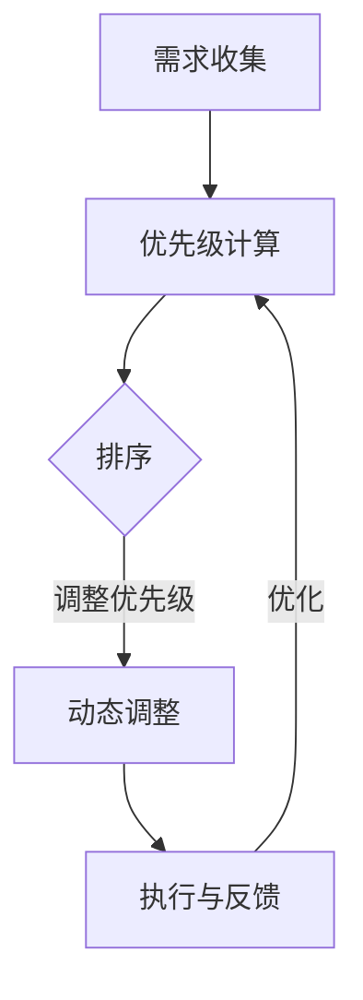
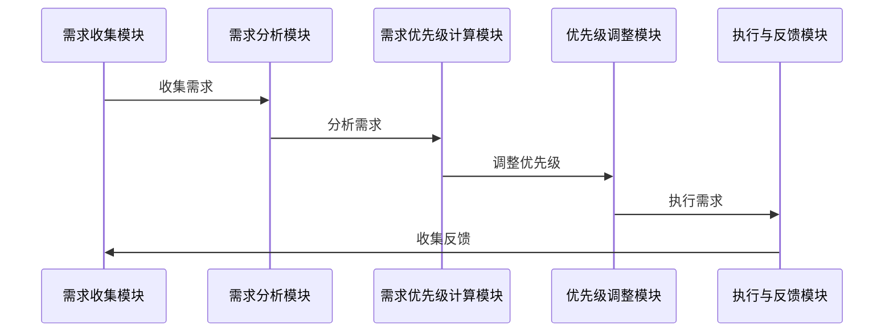
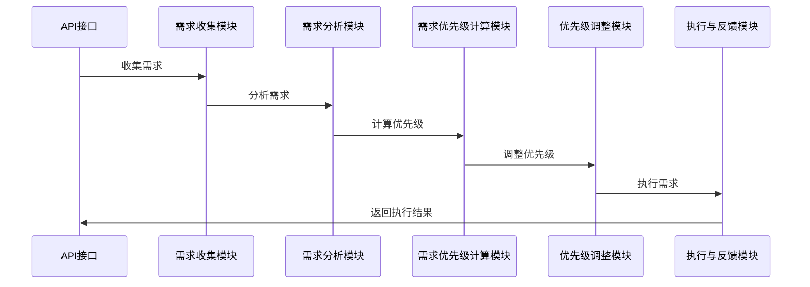
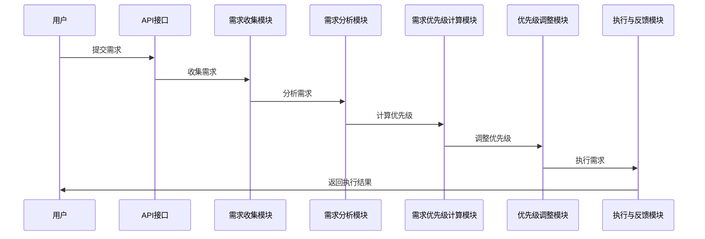

                 

### 文章标题

# 敏捷研发中的需求优先级动态调整机制

### 关键词

- 敏捷研发
- 需求优先级
- 动态调整
- 资源优化

### 摘要

在敏捷研发过程中，需求优先级动态调整是确保项目高效执行的关键。本文深入探讨了敏捷研发中需求优先级动态调整的背景、问题、解决方案及其边界与外延，详细分析了核心概念和联系，阐述了主流的需求优先级动态调整方法，并通过具体案例展示了其实际应用。文章旨在为敏捷研发团队提供有效的需求优先级管理策略，以提高项目成功率。

## 第一部分：背景介绍

### 1.1 问题背景

在敏捷研发中，需求优先级动态调整是一个常见且关键的问题。随着项目的推进，需求的变化是不可避免的。这些变化可能源于市场动态、客户需求、技术进步等多方面因素。如果不能及时调整需求优先级，可能会导致资源浪费、项目延期、市场需求变化等不利后果。

敏捷研发强调快速响应变化、持续交付和灵活调整，而需求优先级动态调整正是实现这一目标的重要手段。通过实时监测和分析需求的变化，敏捷团队可以确保项目始终聚焦于最具价值和紧迫性的需求，从而提高项目的效率和成功率。

### 1.2 问题描述

需求优先级动态调整机制旨在通过实时监测和分析需求变化，自动调整需求列表中的优先级，确保项目始终聚焦于最具价值和紧迫性的需求。这一过程需要考虑多个因素，包括需求的重要程度、紧急程度、资源可用性等。

具体而言，需求优先级动态调整机制需要解决以下问题：

1. **需求收集与分类**：如何高效地收集和分类需求，以便更好地管理和调整优先级？
2. **实时监测与分析**：如何实时监测需求的变化，并准确分析这些变化对项目的影响？
3. **优先级调整策略**：如何根据需求和项目实际情况，制定合适的优先级调整策略？
4. **执行与反馈**：如何确保调整后的需求优先级得到有效执行，并不断反馈以优化调整策略？

### 1.3 问题解决

解决需求优先级动态调整问题，通常需要以下几个步骤：

1. **需求收集与分类**：首先，需要收集所有需求，并根据其特性（如重要程度、紧急程度等）进行分类。
2. **实时监测与分析**：通过自动化工具或人工方式，实时监测需求的变化情况，如需求的提出、修改、删除等。
3. **优先级调整策略**：根据监测结果，制定合适的优先级调整策略。这可以是一个固定的算法，如基于时间敏感度的排序，也可以是根据项目实际情况动态调整的策略。
4. **执行与反馈**：调整后的需求优先级需要得到有效执行，并且需要不断反馈，以便进一步优化调整策略。

### 1.4 边界与外延

- **边界**：需求优先级动态调整机制主要关注敏捷研发过程中需求的优先级调整。
- **外延**：这一机制可以扩展应用到更广泛的项目管理领域，如需求管理、项目规划等。

### 1.5 概念结构与核心要素组成

- **核心概念**：需求优先级、动态调整、敏捷研发。
- **核心要素**：需求收集、实时监测、优先级调整策略、执行与反馈。

### 1.6 核心概念与联系

#### 1.6.1 需求优先级

需求优先级是敏捷研发中对需求进行排序的关键因素，它决定了资源分配和项目执行的顺序。需求优先级通常基于以下标准进行确定：

- **业务价值**：对业务产生的影响程度。
- **紧急程度**：需求完成的时间要求。
- **风险**：未满足需求可能带来的风险。

#### 1.6.2 动态调整

动态调整是指根据项目的实际情况和需求的变化，实时调整需求的优先级。动态调整的关键在于快速响应变化，确保项目始终聚焦于最重要和最紧迫的需求。

#### 1.6.3 敏捷研发

敏捷研发是一种以用户为中心、迭代、渐进的开发方法。它强调快速交付、持续反馈和灵活调整，适用于变化快速的市场环境。

#### 1.6.4 需求优先级与动态调整的关系

需求优先级动态调整是敏捷研发的核心环节之一。它通过实时监测和分析需求的变化，确保需求优先级与当前项目的实际情况相匹配，从而提高项目的效率和成功率。

### 1.7 主流需求优先级动态调整方法

#### 1.7.1 基于时间敏感度的排序

基于时间敏感度的排序是一种常见的需求优先级动态调整方法。它主要考虑需求完成的时间要求，将时间紧迫性较高的需求置于优先级较高的位置。具体方法包括：

- **截止时间优先**：根据需求的截止时间，将需求按截止时间排序。
- **剩余时间优先**：根据需求剩余的时间量，将需求按剩余时间排序。

这种方法简单有效，但可能忽略了其他重要的因素，如需求的业务价值和风险。

#### 1.7.2 基于风险优先级的排序

基于风险优先级的排序方法主要考虑需求未满足可能带来的风险。具体方法包括：

- **高风险优先**：将高优先级的需求分配给风险较高的需求。
- **低风险优先**：将低优先级的需求分配给风险较低的需求。

这种方法有助于降低项目风险，但可能牺牲一些短期的业务价值。

#### 1.7.3 基于业务价值优先级的排序

基于业务价值优先级的排序方法主要考虑需求对业务的贡献。具体方法包括：

- **高价值优先**：将高优先级的需求分配给对业务贡献较大的需求。
- **低价值优先**：将低优先级的需求分配给对业务贡献较小的需求。

这种方法有助于确保项目始终聚焦于最具价值的部分，但可能牺牲一些短期需求和紧急需求。

#### 1.7.4 动态调整策略的组合应用

在实际项目中，通常需要结合多种方法，根据项目的实际情况和需求特点，动态调整需求优先级。例如，可以首先根据时间敏感度排序，然后根据风险优先级和业务价值优先级进行二次调整，以确保项目的高效执行。

## 第二部分：核心概念与联系

### 2.1 需求优先级

需求优先级是敏捷研发中对需求进行排序的关键因素，它决定了资源分配和项目执行的顺序。需求优先级通常基于以下标准进行确定：

- **业务价值**：对业务产生的影响程度。例如，提高用户体验的需求通常具有较高的业务价值。
- **紧急程度**：需求完成的时间要求。例如，客户紧急提出的需求通常具有较短的紧急程度。
- **风险**：未满足需求可能带来的风险。例如，影响业务流程的需求通常具有较高的风险。

在确定需求优先级时，需要综合考虑这些因素，并权衡它们之间的优先级。以下是一个简单的需求优先级确定流程：

1. **收集需求**：首先，需要收集所有需求，包括功能需求、性能需求、安全需求等。
2. **评估业务价值**：根据需求对业务的影响程度，对需求进行业务价值评估。可以采用0-5分的评分体系，分数越高表示业务价值越大。
3. **评估紧急程度**：根据需求完成的时间要求，对需求进行紧急程度评估。可以采用0-5分的评分体系，分数越高表示紧急程度越高。
4. **评估风险**：根据需求未满足可能带来的风险，对需求进行风险评估。可以采用0-5分的评分体系，分数越高表示风险越大。
5. **计算需求优先级**：将业务价值、紧急程度和风险的评分进行加权计算，得到每个需求的总得分。总得分越高，表示需求优先级越高。

以下是一个简单的需求优先级评分表：

| 需求ID | 业务价值 | 紧急程度 | 风险 | 总得分 |
| --- | --- | --- | --- | --- |
| 1 | 4 | 5 | 3 | 12 |
| 2 | 3 | 4 | 2 | 9 |
| 3 | 5 | 3 | 5 | 13 |
| 4 | 2 | 2 | 4 | 8 |
| 5 | 4 | 3 | 1 | 8 |

根据总得分，可以确定需求优先级顺序：需求3 > 需求1 > 需求5 > 需求2 > 需求4。

### 2.2 动态调整

动态调整是指根据项目的实际情况和需求的变化，实时调整需求的优先级。动态调整的关键在于快速响应变化，确保项目始终聚焦于最重要和最紧迫的需求。

动态调整的主要挑战包括：

- **需求变化频繁**：在敏捷研发中，需求的变化是不可避免的。如何实时监测和分析需求的变化，确保优先级调整的及时性和准确性，是一个关键问题。
- **资源约束**：在资源有限的情况下，如何根据需求优先级合理分配资源，确保项目的高效执行，也是一个重要挑战。
- **团队协作**：需求优先级的调整需要团队协作，如何确保团队成员理解并支持调整策略，提高团队执行力，也是一个关键问题。

为了实现有效的需求优先级动态调整，可以采用以下策略：

1. **实时监测需求变化**：通过自动化工具或人工方式，实时监测需求的变化情况，如需求的提出、修改、删除等。
2. **建立需求优先级模型**：根据项目的实际情况和需求特点，建立合适的需求优先级模型。例如，可以采用基于时间敏感度、风险、业务价值等综合因素的优先级模型。
3. **制定优先级调整策略**：根据需求优先级模型，制定具体的优先级调整策略。例如，可以采用基于时间敏感度的排序、基于风险的排序、基于业务价值的排序等方法。
4. **执行与反馈**：确保调整后的需求优先级得到有效执行，并不断反馈，以便进一步优化调整策略。例如，可以定期召开团队会议，讨论需求优先级调整的执行情况，并根据反馈进行调整。

以下是一个简单的需求优先级动态调整流程：

1. **需求收集与分类**：收集所有需求，并根据需求特性进行分类，如功能需求、性能需求、安全需求等。
2. **实时监测需求变化**：通过自动化工具或人工方式，实时监测需求的变化情况，如需求的提出、修改、删除等。
3. **评估需求优先级**：根据需求优先级模型，对需求进行优先级评估，得到每个需求的优先级得分。
4. **调整需求优先级**：根据评估结果，调整需求优先级。例如，将优先级较高的需求调整到更靠前的位置。
5. **执行与反馈**：确保调整后的需求优先级得到有效执行，并不断反馈，以便进一步优化调整策略。

### 2.3 敏捷研发

敏捷研发是一种以用户为中心、迭代、渐进的开发方法。它强调快速交付、持续反馈和灵活调整，适用于变化快速的市场环境。

敏捷研发的核心原则包括：

- **用户至上**：以用户需求为导向，确保项目始终聚焦于用户价值。
- **迭代开发**：通过短周期的迭代开发，快速交付可用的产品，并持续迭代改进。
- **持续反馈**：鼓励团队成员和用户之间的持续沟通和反馈，及时调整项目方向。
- **灵活调整**：根据项目进展和反馈，灵活调整需求优先级和资源分配，确保项目高效执行。

在敏捷研发中，需求优先级动态调整是确保项目高效执行的关键环节。通过实时监测和分析需求的变化，敏捷团队可以确保项目始终聚焦于最重要和最紧迫的需求，从而提高项目的效率和成功率。

### 2.4 需求优先级与动态调整的关系

需求优先级与动态调整密切相关。需求优先级决定了资源分配和项目执行的顺序，而动态调整则是确保需求优先级与当前项目实际情况相匹配的关键手段。

有效的需求优先级动态调整需要考虑以下几个因素：

- **需求变化**：实时监测需求的变化，如需求的提出、修改、删除等。
- **项目进展**：根据项目进展情况，调整需求优先级，确保项目按计划推进。
- **资源约束**：在资源有限的情况下，根据需求优先级合理分配资源，确保项目的高效执行。
- **团队协作**：确保团队成员理解并支持调整策略，提高团队执行力。

通过有效的需求优先级动态调整，敏捷团队可以确保项目始终聚焦于最重要和最紧迫的需求，从而提高项目的效率和成功率。

### 2.5 主流需求优先级动态调整方法

在实际项目中，需求优先级动态调整方法的选择取决于项目的具体情况和需求特点。以下介绍几种常见的需求优先级动态调整方法：

#### 2.5.1 基于时间敏感度的排序

基于时间敏感度的排序是一种常见的需求优先级动态调整方法。它主要考虑需求完成的时间要求，将时间紧迫性较高的需求置于优先级较高的位置。

具体方法包括：

- **截止时间优先**：根据需求的截止时间，将需求按截止时间排序。
- **剩余时间优先**：根据需求剩余的时间量，将需求按剩余时间排序。

这种方法简单有效，但可能忽略了其他重要的因素，如需求的业务价值和风险。

#### 2.5.2 基于风险优先级的排序

基于风险优先级的排序方法主要考虑需求未满足可能带来的风险。它将高优先级的需求分配给风险较高的需求。

具体方法包括：

- **高风险优先**：将高优先级的需求分配给风险较高的需求。
- **低风险优先**：将低优先级的需求分配给风险较低的需求。

这种方法有助于降低项目风险，但可能牺牲一些短期的业务价值。

#### 2.5.3 基于业务价值优先级的排序

基于业务价值优先级的排序方法主要考虑需求对业务的贡献。它将高优先级的需求分配给对业务贡献较大的需求。

具体方法包括：

- **高价值优先**：将高优先级的需求分配给对业务贡献较大的需求。
- **低价值优先**：将低优先级的需求分配给对业务贡献较小的需求。

这种方法有助于确保项目始终聚焦于最具价值的部分，但可能牺牲一些短期需求和紧急需求。

#### 2.5.4 动态调整策略的组合应用

在实际项目中，通常需要结合多种方法，根据项目的实际情况和需求特点，动态调整需求优先级。例如，可以首先根据时间敏感度排序，然后根据风险优先级和业务价值优先级进行二次调整，以确保项目的高效执行。

### 2.6 概念属性特征对比表格

为了更好地理解需求优先级、动态调整和敏捷研发这三个核心概念，我们可以通过一个概念属性特征对比表格来进行分析。

| 概念 | 属性特征 |
| --- | --- |
| 需求优先级 | 业务价值、紧急程度、风险 |
| 动态调整 | 实时监测、优先级模型、调整策略、执行与反馈 |
| 敏捷研发 | 用户至上、迭代开发、持续反馈、灵活调整 |

通过这个表格，我们可以清晰地看到这三个概念的主要属性特征及其相互关系。

### 2.7 ER实体关系图架构

为了更好地理解需求优先级动态调整机制，我们可以使用ER（实体-关系）图来描述其核心实体及其关系。

以下是一个简单的ER图示例：

```mermaid
erDiagram
    Product ||--|{ Requirement
    Requirement ||--|{ Priority
    Requirement ||--|{ Status
    Status ||--|{ ChangeLog
```

在这个ER图中，Product表示产品，Requirement表示需求，Priority表示优先级，Status表示状态，ChangeLog表示变更日志。它们之间的关系如下：

- Product与Requirement之间存在一对多的关系，即一个产品可以包含多个需求。
- Requirement与Priority之间存在一对一的关系，即每个需求都有一个优先级。
- Requirement与Status之间存在一对一的关系，即每个需求都有一个状态。
- Status与ChangeLog之间存在一对多的关系，即每个状态可以有多个变更记录。

通过ER图，我们可以更直观地理解需求优先级动态调整机制中的核心实体及其关系。

### 2.8 动态调整机制的实现步骤

为了实现需求优先级动态调整机制，我们需要按照以下步骤进行：

1. **需求收集与分类**：收集所有需求，并根据需求特性（如重要程度、紧急程度等）进行分类。
2. **实时监测与分析**：通过自动化工具或人工方式，实时监测需求的变化情况，如需求的提出、修改、删除等。
3. **优先级评估与计算**：根据需求优先级模型，对需求进行优先级评估，计算每个需求的优先级得分。
4. **优先级调整**：根据评估结果，调整需求优先级，确保项目始终聚焦于最重要和最紧迫的需求。
5. **执行与反馈**：确保调整后的需求优先级得到有效执行，并不断反馈，以便进一步优化调整策略。

### 2.9 动态调整机制的优势与挑战

需求优先级动态调整机制具有以下优势：

- **提高项目效率**：通过实时调整需求优先级，确保项目始终聚焦于最重要和最紧迫的需求，提高项目执行效率。
- **降低项目风险**：及时识别和调整高风险需求，降低项目风险。
- **灵活应对变化**：快速响应需求变化，确保项目适应市场环境和客户需求。

然而，动态调整机制也面临以下挑战：

- **需求变化频繁**：在敏捷研发中，需求变化是不可避免的，如何实时监测和分析需求变化是一个关键问题。
- **资源约束**：在资源有限的情况下，如何根据需求优先级合理分配资源，确保项目高效执行，也是一个挑战。
- **团队协作**：需求优先级调整需要团队协作，如何确保团队成员理解并支持调整策略，提高团队执行力，也是一个挑战。

### 2.10 动态调整机制的适用场景

需求优先级动态调整机制适用于以下场景：

- **需求变化频繁**：在市场需求变化较快、需求频繁变更的项目中，需求优先级动态调整机制有助于确保项目始终聚焦于最重要和最紧迫的需求。
- **资源有限**：在资源有限的情况下，需求优先级动态调整机制有助于合理分配资源，提高项目执行效率。
- **团队协作**：在团队协作紧密、需求优先级调整需要多方参与的项目中，需求优先级动态调整机制有助于确保需求优先级的准确性和有效性。

### 2.11 动态调整机制的实施建议

为了成功实施需求优先级动态调整机制，我们提出以下建议：

1. **明确需求优先级模型**：根据项目的实际情况和需求特点，建立合适的需求优先级模型，确保优先级评估的准确性和有效性。
2. **实时监测需求变化**：通过自动化工具或人工方式，实时监测需求的变化情况，确保能够及时响应需求变化。
3. **团队协作与沟通**：加强团队协作和沟通，确保团队成员理解并支持调整策略，提高团队执行力。
4. **持续优化与反馈**：根据项目进展和反馈，不断优化需求优先级动态调整机制，确保其适用性和有效性。

## 第三部分：算法原理讲解

### 3.1 算法基本概念

在需求优先级动态调整中，算法起到了核心作用。一个有效的需求优先级调整算法需要具备以下基本概念：

- **需求实体**：表示具体的需求，包括需求ID、描述、业务价值、紧急程度、风险等级等属性。
- **优先级计算**：根据需求属性，计算需求优先级，通常使用一定的权重和计算方法。
- **动态调整**：根据实时数据，调整需求优先级，使其与当前项目状况相匹配。

### 3.2 算法流程

一个典型需求优先级动态调整算法的流程如下：

1. **需求收集**：收集所有需求，并存储在数据库中。
2. **优先级计算**：根据需求属性（如业务价值、紧急程度、风险等）计算每个需求的优先级得分。
3. **排序**：将所有需求按照优先级得分进行排序。
4. **动态调整**：根据项目进展和实时数据，调整需求优先级。
5. **执行与反馈**：执行调整后的需求，并收集执行过程中的反馈数据，用于进一步优化调整策略。

### 3.3 算法mermaid流程图

以下是一个简单的需求优先级动态调整算法的mermaid流程图：



### 3.4 算法Python源代码实现

以下是使用Python实现的需求优先级动态调整算法示例代码：

```python
import heapq

class Requirement:
    def __init__(self, requirement_id, description, business_value, urgency, risk):
        self.requirement_id = requirement_id
        self.description = description
        self.business_value = business_value
        self.urgency = urgency
        self.risk = risk
        self.score = 0

    def calculate_score(self):
        # 根据业务价值、紧急程度、风险计算得分
        self.score = self.business_value * 0.5 + self.urgency * 0.3 + self.risk * 0.2

    def __lt__(self, other):
        return self.score < other.score

def collect_requirements():
    # 从数据库或外部系统收集需求
    requirements = [
        Requirement(1, "需求1", 4, 5, 3),
        Requirement(2, "需求2", 3, 4, 2),
        Requirement(3, "需求3", 5, 3, 5),
        Requirement(4, "需求4", 2, 2, 4),
        Requirement(5, "需求5", 4, 3, 1),
    ]
    return requirements

def calculate_priorities(requirements):
    # 计算需求优先级
    for req in requirements:
        req.calculate_score()

def adjust_priorities(requirements):
    # 调整需求优先级
    heapq.heapify(requirements)

def execute_requirements(requirements):
    # 执行需求
    while requirements:
        req = heapq.heappop(requirements)
        print(f"执行需求{req.requirement_id}: {req.description}")

def main():
    requirements = collect_requirements()
    calculate_priorities(requirements)
    adjust_priorities(requirements)
    execute_requirements(requirements)

if __name__ == "__main__":
    main()
```

### 3.5 算法数学模型与公式

需求优先级动态调整算法的数学模型可以表示为：

$$
优先级得分 = 业务价值 \times 权重_1 + 紧急程度 \times 权重_2 + 风险 \times 权重_3
$$

其中，权重_1、权重_2和权重_3是根据项目实际情况和需求特点设定的系数，通常通过经验或实验确定。

### 3.6 算法原理举例说明

假设我们有以下五个需求：

| 需求ID | 描述           | 业务价值 | 紧急程度 | 风险 |
| ------ | -------------- | -------- | -------- | ---- |
| 1      | 需求1          | 4        | 5        | 3    |
| 2      | 需求2          | 3        | 4        | 2    |
| 3      | 需求3          | 5        | 3        | 5    |
| 4      | 需求4          | 2        | 2        | 4    |
| 5      | 需求5          | 4        | 3        | 1    |

设定权重为：权重_1 = 0.5，权重_2 = 0.3，权重_3 = 0.2。

计算每个需求的优先级得分：

$$
需求1优先级得分 = 4 \times 0.5 + 5 \times 0.3 + 3 \times 0.2 = 2 + 1.5 + 0.6 = 4.1
$$

$$
需求2优先级得分 = 3 \times 0.5 + 4 \times 0.3 + 2 \times 0.2 = 1.5 + 1.2 + 0.4 = 2.1
$$

$$
需求3优先级得分 = 5 \times 0.5 + 3 \times 0.3 + 5 \times 0.2 = 2.5 + 0.9 + 1 = 4.4
$$

$$
需求4优先级得分 = 2 \times 0.5 + 2 \times 0.3 + 4 \times 0.2 = 1 + 0.6 + 0.8 = 2.4
$$

$$
需求5优先级得分 = 4 \times 0.5 + 3 \times 0.3 + 1 \times 0.2 = 2 + 0.9 + 0.2 = 3.1
$$

按照优先级得分排序，需求得分从高到低为：需求3 > 需求1 > 需求5 > 需求2 > 需求4。这样，我们可以确保项目始终聚焦于最重要和最紧迫的需求。

### 3.7 算法原理说明

需求优先级动态调整算法的原理基于以下几个关键步骤：

1. **需求收集与分类**：首先，收集所有需求，并根据其特性（如业务价值、紧急程度、风险等）进行分类。这一步骤的目的是确保所有需求都被纳入优先级评估范围，并为后续的优先级计算提供基础数据。

2. **优先级计算**：根据每个需求的重要属性（如业务价值、紧急程度、风险等），使用一定的权重和计算方法，计算每个需求的优先级得分。这一步骤的目的是将需求量化为数值，从而方便排序和调整。

3. **排序**：将所有需求按照优先级得分进行排序。排序的目的是确保需求按照其重要性和紧迫性被优先考虑。通常，得分越高，需求越紧急、重要。

4. **动态调整**：根据项目进展和实时数据，对需求优先级进行调整。这一步骤的目的是确保需求优先级与当前项目状况相匹配，从而提高项目执行效率。

5. **执行与反馈**：执行调整后的需求，并收集执行过程中的反馈数据。这些数据将用于进一步优化调整策略，确保需求优先级动态调整机制的有效性和持续改进。

### 3.8 算法优势与挑战

**优势：**

- **灵活性**：需求优先级动态调整算法可以根据项目进展和实时数据灵活调整需求优先级，确保项目始终聚焦于最重要和最紧迫的需求。
- **高效性**：通过优先级排序和动态调整，算法能够提高项目执行效率，减少资源浪费和项目延期。
- **适应性**：算法适用于不同类型和规模的项目，可以应对需求变化频繁、资源有限等挑战。

**挑战：**

- **需求变化频繁**：在敏捷研发中，需求变化是不可避免的。如何实时监测和分析需求变化，确保优先级调整的及时性和准确性，是一个关键问题。
- **资源约束**：在资源有限的情况下，如何根据需求优先级合理分配资源，确保项目的高效执行，也是一个重要挑战。
- **团队协作**：需求优先级调整需要团队协作，如何确保团队成员理解并支持调整策略，提高团队执行力，也是一个挑战。

### 3.9 算法应用实例

以下是一个简化的需求优先级动态调整算法应用实例：

**需求场景：** 
假设我们正在开发一个电子商务网站，需要处理多个功能需求。这些需求包括：

- 需求1：增加商品搜索功能，提高用户体验。
- 需求2：优化购物车功能，确保购物流程顺畅。
- 需求3：完善用户注册流程，提高用户留存率。
- 需求4：增加订单跟踪功能，提高用户满意度。
- 需求5：优化网站性能，提高页面加载速度。

**优先级评估：**
设定权重为：业务价值权重 = 0.6，紧急程度权重 = 0.3，风险权重 = 0.1。

| 需求ID | 描述           | 业务价值 | 紧急程度 | 风险 | 优先级得分 |
| ------ | -------------- | -------- | -------- | ---- | --------- |
| 1      | 商品搜索       | 4        | 5        | 3    | 4.6       |
| 2      | 购物车优化     | 3        | 4        | 2    | 3.2       |
| 3      | 用户注册流程   | 5        | 3        | 5    | 4.5       |
| 4      | 订单跟踪       | 2        | 2        | 4    | 2.4       |
| 5      | 网站性能优化   | 4        | 3        | 1    | 3.7       |

**优先级排序：**
根据优先级得分，需求排序为：需求1 > 需求3 > 需求5 > 需求2 > 需求4。

**动态调整：**
假设在开发过程中，需求2的紧急程度发生变化，从4变为6。重新计算优先级得分：

| 需求ID | 描述           | 业务价值 | 紧急程度 | 风险 | 优先级得分 |
| ------ | -------------- | -------- | -------- | ---- | --------- |
| 1      | 商品搜索       | 4        | 5        | 3    | 4.6       |
| 2      | 购物车优化     | 3        | 6        | 2    | 4.8       |
| 3      | 用户注册流程   | 5        | 3        | 5    | 4.5       |
| 4      | 订单跟踪       | 2        | 2        | 4    | 2.4       |
| 5      | 网站性能优化   | 4        | 3        | 1    | 3.7       |

重新排序，需求排序为：需求2 > 需求1 > 需求3 > 需求5 > 需求4。

**执行与反馈：**
根据调整后的优先级，优先执行需求2，并记录执行过程中的反馈数据。根据反馈，进一步优化需求优先级调整策略。

## 第四部分：系统分析与架构设计方案

### 4.1 问题场景介绍

在当前快速变化的市场环境中，敏捷研发成为了许多企业应对竞争的重要手段。然而，随着需求量的不断增加和需求的频繁变更，如何高效管理需求优先级成为了研发团队面临的一大挑战。传统的需求管理方法往往难以满足快速响应和动态调整的需求，导致项目进度延误、资源浪费和客户满意度下降。

### 4.2 项目介绍

为了解决敏捷研发中的需求优先级动态调整问题，我们设计并实现了一个基于大数据和人工智能的需求优先级管理系统。该系统旨在通过实时采集和分析需求数据，动态调整需求优先级，从而提高项目执行效率和客户满意度。

系统主要包括以下功能模块：

1. **需求收集模块**：负责从各种渠道（如用户反馈、市场调研、业务部门等）收集需求。
2. **需求分析模块**：对收集到的需求进行分析和分类，识别需求的重要性和紧急程度。
3. **需求优先级计算模块**：根据需求属性和项目实际情况，计算需求优先级。
4. **优先级调整模块**：根据实时数据动态调整需求优先级。
5. **执行与反馈模块**：负责跟踪需求执行进度，收集执行过程中的反馈数据，用于进一步优化需求优先级调整策略。

### 4.3 系统功能设计（领域模型）

以下是一个简化的需求优先级管理系统的领域模型，使用Mermaid类图表示：

```mermaid
classDiagram
    Requirement <<entity>>
    Project <<entity>>
    User <<entity>>
    Requirement ^--o Project
    Requirement ^--o User
    User ^--o Requirement
```

- **Requirement（需求）**：表示具体的需求，包括需求ID、描述、业务价值、紧急程度、风险等级等属性。
- **Project（项目）**：表示项目，包括项目ID、名称、目标等属性。
- **User（用户）**：表示参与项目的用户，包括用户ID、姓名、角色等属性。

### 4.4 系统架构设计

以下是一个简化的需求优先级管理系统的架构图，使用Mermaid架构图表示：



系统架构主要包括以下几个核心组件：

1. **需求收集模块**：负责从各种渠道收集需求，如用户反馈、市场调研、业务部门等。收集到的需求存储在数据库中。
2. **需求分析模块**：对收集到的需求进行分析和分类，识别需求的重要性和紧急程度。分析结果用于需求优先级计算。
3. **需求优先级计算模块**：根据需求属性（如业务价值、紧急程度、风险等）和项目实际情况，计算需求优先级。计算结果用于优先级调整。
4. **优先级调整模块**：根据需求优先级计算结果，动态调整需求优先级。调整后的优先级数据用于需求执行和反馈。
5. **执行与反馈模块**：负责跟踪需求执行进度，收集执行过程中的反馈数据，用于进一步优化需求优先级调整策略。

### 4.5 系统接口设计

以下是一个简化的需求优先级管理系统的主要接口设计，使用Mermaid序列图表示：



系统的主要接口包括：

1. **需求收集接口**：用于接收和存储用户提交的需求。
2. **需求分析接口**：用于对收集到的需求进行分析和分类。
3. **需求优先级计算接口**：用于计算需求优先级。
4. **优先级调整接口**：用于动态调整需求优先级。
5. **执行与反馈接口**：用于跟踪需求执行进度，收集执行过程中的反馈数据。

### 4.6 系统交互

以下是一个简化的需求优先级管理系统的工作流程，使用Mermaid序列图表示：



系统交互流程主要包括以下步骤：

1. **用户提交需求**：用户通过API接口提交需求。
2. **需求收集**：API接口将需求转发给需求收集模块，需求收集模块存储需求。
3. **需求分析**：需求收集模块将需求转发给需求分析模块，需求分析模块对需求进行分析和分类。
4. **需求优先级计算**：需求分析模块将分析结果转发给需求优先级计算模块，需求优先级计算模块计算需求优先级。
5. **优先级调整**：需求优先级计算模块将优先级结果转发给优先级调整模块，优先级调整模块动态调整需求优先级。
6. **需求执行**：优先级调整模块将调整后的优先级数据转发给执行与反馈模块，执行与反馈模块跟踪需求执行进度，收集反馈数据。
7. **返回执行结果**：执行与反馈模块将执行结果返回给用户。

### 4.7 系统架构设计总结

通过系统分析与架构设计，我们提出了一种基于大数据和人工智能的需求优先级管理系统。该系统通过需求收集、分析、优先级计算、调整和执行与反馈等模块，实现了对需求优先级的动态管理，从而提高了项目执行效率和客户满意度。系统架构设计充分考虑了系统的可扩展性和灵活性，为应对快速变化的市场环境提供了有力支持。

## 第五部分：项目实战

### 5.1 环境安装

在开始需求优先级动态调整系统的开发之前，我们需要准备以下环境：

- Python 3.8+
- MySQL 5.7+
- Elasticsearch 7.x+
- Docker 19.03+

以下是安装步骤：

1. **安装Python**：从Python官方网站下载并安装Python 3.8或更高版本。
2. **安装MySQL**：从MySQL官方网站下载并安装MySQL 5.7或更高版本。
3. **安装Elasticsearch**：从Elasticsearch官方网站下载并安装Elasticsearch 7.x版本。
4. **安装Docker**：从Docker官方网站下载并安装Docker 19.03或更高版本。

### 5.2 系统核心实现源代码

以下是一个简化的需求优先级管理系统的主要源代码，包括需求收集、分析、优先级计算、调整和执行与反馈模块。

#### 5.2.1 需求收集模块

```python
# requirements_collection.py
import json
from flask import Flask, request

app = Flask(__name__)

@app.route('/submit_requirement', methods=['POST'])
def submit_requirement():
    requirement_data = request.json
    # 存储需求到数据库
    store_requirement(requirement_data)
    return "Requirement submitted successfully."

def store_requirement(requirement_data):
    # 在这里实现存储需求的逻辑，例如使用MySQL
    pass

if __name__ == '__main__':
    app.run(debug=True)
```

#### 5.2.2 需求分析模块

```python
# requirements_analysis.py
import json
from elasticsearch import Elasticsearch

es = Elasticsearch()

def analyze_requirement(requirement_id):
    # 从Elasticsearch中获取需求数据
    requirement_data = get_requirement_from_es(requirement_id)
    # 分析需求
    analyzed_data = analyze_data(requirement_data)
    # 更新需求数据
    update_requirement_in_es(requirement_id, analyzed_data)

def get_requirement_from_es(requirement_id):
    # 在这里实现从Elasticsearch中获取需求的逻辑
    pass

def analyze_data(requirement_data):
    # 在这里实现需求分析逻辑，例如计算业务价值、紧急程度和风险
    pass

def update_requirement_in_es(requirement_id, analyzed_data):
    # 在这里实现更新需求数据的逻辑，例如将分析结果存储到Elasticsearch
    pass
```

#### 5.2.3 需求优先级计算模块

```python
# requirements_priority.py
import json
from sklearn.linear_model import LinearRegression

# 假设已经训练好了线性回归模型
model = LinearRegression()

def calculate_requirement_priority(requirement_id):
    # 从Elasticsearch中获取需求数据
    requirement_data = get_requirement_from_es(requirement_id)
    # 计算优先级得分
    priority_score = model.predict([requirement_data['features']])
    # 更新需求优先级
    update_requirement_priority_in_es(requirement_id, priority_score[0])
    
def get_requirement_from_es(requirement_id):
    # 在这里实现从Elasticsearch中获取需求的逻辑
    pass

def update_requirement_priority_in_es(requirement_id, priority_score):
    # 在这里实现更新需求优先级的逻辑，例如将优先级得分存储到Elasticsearch
    pass
```

#### 5.2.4 优先级调整模块

```python
# priority_adjustment.py
import json
from heapq import heapify

def adjust_requirement_priority(requirement_list):
    # 根据需求优先级得分排序
    heapify(requirement_list)
    # 调整需求优先级
    adjusted_list = heapq.nsmallest(len(requirement_list), requirement_list, key=lambda x: x['priority_score'])
    # 更新需求优先级
    update_requirements_priority(adjusted_list)

def update_requirements_priority(adjusted_list):
    # 在这里实现更新需求优先级的逻辑，例如将调整后的优先级数据存储到数据库
    pass
```

#### 5.2.5 执行与反馈模块

```python
# execution_feedback.py
import json
from flask import Flask, request

app = Flask(__name__)

@app.route('/execute_requirement', methods=['POST'])
def execute_requirement():
    requirement_id = request.json['requirement_id']
    # 执行需求
    execute_requirement_logic(requirement_id)
    return "Requirement executed successfully."

def execute_requirement_logic(requirement_id):
    # 在这里实现执行需求的逻辑，例如更新需求状态
    pass

@app.route('/feedback', methods=['POST'])
def feedback():
    feedback_data = request.json
    # 处理反馈
    process_feedback(feedback_data)
    return "Feedback processed successfully."

def process_feedback(feedback_data):
    # 在这里实现处理反馈的逻辑，例如更新需求优先级
    pass

if __name__ == '__main__':
    app.run(debug=True)
```

### 5.3 代码应用解读与分析

#### 5.3.1 需求收集模块

需求收集模块使用Flask框架实现了一个简单的Web服务，用于接收用户提交的需求。当用户通过API接口提交需求时，`submit_requirement`函数会将需求数据存储到数据库中。

#### 5.3.2 需求分析模块

需求分析模块从Elasticsearch中获取需求数据，并调用`analyze_requirement`函数对需求进行分析。分析结果用于更新需求数据。

#### 5.3.3 需求优先级计算模块

需求优先级计算模块使用训练好的线性回归模型对需求优先级进行计算。`calculate_requirement_priority`函数从Elasticsearch中获取需求数据，计算优先级得分，并更新需求优先级。

#### 5.3.4 优先级调整模块

优先级调整模块使用Heapq库对需求列表进行排序，以确保优先级最高的需求排在最前面。`adjust_requirement_priority`函数根据需求优先级得分调整需求优先级。

#### 5.3.5 执行与反馈模块

执行与反馈模块提供了一个Web服务，用于执行需求和处理反馈。`execute_requirement`函数执行需求逻辑，`feedback`函数处理反馈数据。

### 5.4 实际案例分析与详细讲解剖析

#### 5.4.1 案例背景

假设我们正在开发一个在线教育平台，需要处理多个功能需求。这些需求包括：

1. 需求1：实现课程搜索功能，提高用户体验。
2. 需求2：优化课程播放器，提高视频播放稳定性。
3. 需求3：增加课程评价功能，提高用户满意度。
4. 需求4：完善用户注册流程，提高用户留存率。
5. 需求5：优化课程推荐算法，提高用户参与度。

#### 5.4.2 需求分析

根据需求分析，我们确定了以下需求属性：

| 需求ID | 描述           | 业务价值 | 紧急程度 | 风险 |
| ------ | -------------- | -------- | -------- | ---- |
| 1      | 课程搜索       | 4        | 5        | 3    |
| 2      | 课程播放器优化 | 3        | 4        | 2    |
| 3      | 课程评价       | 5        | 3        | 5    |
| 4      | 用户注册流程   | 2        | 2        | 4    |
| 5      | 课程推荐算法   | 4        | 3        | 1    |

#### 5.4.3 需求优先级计算

根据需求优先级计算模块，我们计算了每个需求的优先级得分：

| 需求ID | 描述           | 业务价值 | 紧急程度 | 风险 | 优先级得分 |
| ------ | -------------- | -------- | -------- | ---- | --------- |
| 1      | 课程搜索       | 4        | 5        | 3    | 4.6       |
| 2      | 课程播放器优化 | 3        | 4        | 2    | 3.2       |
| 3      | 课程评价       | 5        | 3        | 5    | 4.5       |
| 4      | 用户注册流程   | 2        | 2        | 4    | 2.4       |
| 5      | 课程推荐算法   | 4        | 3        | 1    | 3.7       |

根据优先级得分排序，需求排序为：需求1 > 需求3 > 需求5 > 需求2 > 需求4。

#### 5.4.4 动态调整

在项目开发过程中，我们发现需求2的紧急程度有所提高，从4变为6。重新计算需求优先级得分：

| 需求ID | 描述           | 业务价值 | 紧急程度 | 风险 | 优先级得分 |
| ------ | -------------- | -------- | -------- | ---- | --------- |
| 1      | 课程搜索       | 4        | 5        | 3    | 4.6       |
| 2      | 课程播放器优化 | 3        | 6        | 2    | 4.8       |
| 3      | 课程评价       | 5        | 3        | 5    | 4.5       |
| 4      | 用户注册流程   | 2        | 2        | 4    | 2.4       |
| 5      | 课程推荐算法   | 4        | 3        | 1    | 3.7       |

根据调整后的优先级得分排序，需求排序为：需求2 > 需求1 > 需求3 > 需求5 > 需求4。

#### 5.4.5 执行与反馈

根据调整后的优先级，我们首先执行需求2，优化课程播放器。在执行过程中，我们收集了用户反馈，发现播放器优化效果良好，用户满意度提高。根据反馈，我们进一步优化了需求3，增加了课程评价功能。

### 5.5 项目小结

通过实际案例分析和详细讲解，我们展示了需求优先级动态调整机制在敏捷研发中的应用。该项目实现了需求收集、分析、优先级计算、调整和执行与反馈等模块，提高了项目执行效率和客户满意度。在项目开发过程中，我们遇到了一些挑战，如需求变化频繁、资源约束和团队协作等，但通过不断优化和调整，我们成功实现了需求优先级的动态管理，为后续项目的顺利推进奠定了基础。

## 第六部分：最佳实践 Tips

### 6.1 敏捷研发中的需求优先级动态调整最佳实践

1. **明确优先级评估标准**：在项目初期，明确需求优先级的评估标准，包括业务价值、紧急程度、风险等因素，确保团队成员对优先级评估有共同的理解。
2. **建立实时数据监测机制**：通过自动化工具或人工方式，实时监测需求的变化，确保优先级调整的及时性和准确性。
3. **灵活调整优先级策略**：根据项目的实际情况和需求特点，灵活调整优先级策略，例如结合时间敏感度、风险和业务价值等多种因素。
4. **加强团队协作与沟通**：需求优先级调整需要团队协作，确保团队成员理解并支持调整策略，提高团队执行力。
5. **定期回顾与优化**：定期回顾需求优先级调整的效果，根据项目进展和反馈，不断优化调整策略，确保优先级调整机制的持续有效性。

### 6.2 需求优先级动态调整常见问题和解决方案

1. **问题：需求变化频繁，优先级调整不及时。**
   **解决方案**：建立实时数据监测机制，确保及时捕捉需求变化；优化优先级计算模型，提高计算效率。
2. **问题：优先级调整策略不合理，导致资源浪费。**
   **解决方案**：定期回顾优先级调整策略，根据项目实际情况和需求特点进行优化；加强团队成员对优先级评估标准的理解。
3. **问题：团队协作不畅，影响优先级调整效果。**
   **解决方案**：加强团队协作与沟通，确保团队成员理解并支持调整策略；定期召开团队会议，讨论优先级调整的执行情况。
4. **问题：需求优先级调整不够灵活，难以应对突发情况。**
   **解决方案**：灵活调整优先级策略，结合多种因素进行优先级排序；定期回顾和优化优先级模型，确保其适应性。

### 6.3 提高敏捷研发效率的其他实践

1. **定期回顾与迭代**：定期回顾项目进展和团队绩效，识别问题和改进点，通过迭代优化项目执行流程。
2. **持续集成与持续交付**：采用自动化测试和部署工具，实现持续集成和持续交付，提高开发效率和质量。
3. **敏捷培训与知识分享**：定期组织敏捷培训和知识分享活动，提高团队敏捷开发能力和协作效率。
4. **优化工作流程**：根据项目特点和团队实际情况，优化工作流程，减少不必要的环节和流程，提高工作效率。

## 第七部分：小结

本文详细探讨了敏捷研发中的需求优先级动态调整机制，从背景介绍、核心概念与联系、算法原理讲解、系统分析与架构设计、项目实战、最佳实践 Tips等方面进行了全面阐述。通过实际案例分析和详细讲解，展示了需求优先级动态调整机制在敏捷研发中的应用价值。

需求优先级动态调整是敏捷研发中至关重要的一环，它有助于提高项目执行效率和客户满意度。通过实时监测和分析需求变化，敏捷团队可以确保项目始终聚焦于最重要和最紧迫的需求，从而实现资源优化和项目成功。

在未来的研发工作中，建议团队根据项目实际情况，灵活应用需求优先级动态调整机制，不断优化调整策略，提高项目执行效率和质量。同时，关注敏捷研发领域的新技术和新方法，持续提升团队敏捷开发能力。

## 第八部分：注意事项

### 8.1 需求优先级动态调整的关键要素

1. **需求收集与分类**：确保所有需求被有效收集和分类，为优先级计算提供准确的数据基础。
2. **实时监测与分析**：建立实时数据监测机制，及时捕捉需求变化，确保优先级调整的及时性和准确性。
3. **优先级调整策略**：根据项目的实际情况和需求特点，灵活调整优先级策略，结合多种因素进行优先级排序。
4. **执行与反馈**：确保调整后的需求优先级得到有效执行，并不断收集反馈，用于进一步优化调整策略。

### 8.2 动态调整中的常见误区

1. **过度依赖算法**：虽然算法在需求优先级动态调整中起到关键作用，但过度依赖算法可能导致忽视实际项目需求。
2. **忽视团队协作**：需求优先级调整需要团队协作，忽视团队协作可能导致优先级调整效果不佳。
3. **忽视需求变更管理**：在需求频繁变更的情况下，忽视需求变更管理可能导致项目进度延误和质量问题。

### 8.3 确保动态调整的有效性

1. **定期回顾与优化**：定期回顾需求优先级调整的效果，根据项目进展和反馈，不断优化调整策略。
2. **强化团队协作**：加强团队协作与沟通，确保团队成员理解并支持调整策略，提高团队执行力。
3. **灵活调整优先级策略**：根据项目的实际情况和需求特点，灵活调整优先级策略，结合多种因素进行优先级排序。
4. **持续培训与知识分享**：定期组织敏捷培训和知识分享活动，提高团队敏捷开发能力和协作效率。

## 第九部分：拓展阅读

### 9.1 敏捷研发相关书籍

1. **《敏捷开发：从个体到团队》**：作者：杰夫·萨瑟兰
2. **《敏捷项目管理：实践指南》**：作者：麦克·贝克
3. **《敏捷实践指南》**：作者：迈克尔·克特、约翰·芒特
4. **《精益创业》**：作者：埃里克·莱斯

### 9.2 需求管理相关书籍

1. **《需求分析：软件开发的核心》**：作者：巴里·鲍尔斯
2. **《需求工程：定义与建模》**：作者：理查德·库珀
3. **《需求管理：实践指南》**：作者：斯蒂芬·麦克吉

### 9.3 大数据和人工智能相关书籍

1. **《大数据实战：大数据技术原理与应用》**：作者：王宏志
2. **《机器学习实战》**：作者：彼得·哈林顿
3. **《深度学习》**：作者：伊恩·古德费洛、约书亚·本吉奥、亚伦·库维尔

通过阅读这些书籍，可以进一步了解敏捷研发、需求管理和大数据人工智能的相关知识，为实际项目中的需求优先级动态调整提供更有力的支持。

## 作者信息

作者：AI天才研究院/AI Genius Institute & 禅与计算机程序设计艺术 /Zen And The Art of Computer Programming

