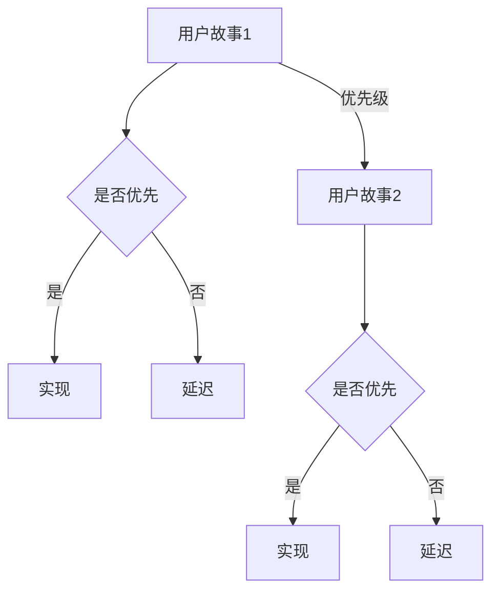

                 

# 引言

## 1.1 问题背景与需求

在现代社会中，软件研发项目的规模和复杂性不断增加，传统的研发流程已难以满足快速变化的市场需求。敏捷开发作为一种应对这种复杂性的有效方法，被广泛采用。然而，在敏捷研发过程中，如何有效地管理需求，确保团队对需求的充分理解和快速响应，成为了亟待解决的问题。

需求可视化作为一种直观的沟通工具，能够帮助团队更好地理解和跟踪需求。看板设计作为敏捷开发中的一种重要实践，通过将需求、任务和进度可视化，可以显著提高团队的工作效率和项目透明度。

本文旨在探讨敏捷研发中的需求可视化看板设计，通过深入分析需求可视化和看板设计的关键要素，结合实际案例，提出一种有效的需求可视化看板设计方案。

## 1.2 解决方案探讨

本文将分以下几部分展开讨论：

- 第二部分：敏捷开发基础，介绍敏捷开发的核心理念、方法和工具。
- 第三部分：需求可视化方法，探讨需求可视化的基本原则、方法和工具。
- 第四部分：看板设计原则，阐述看板设计的基本原则和关键要素。
- 第五部分：看板设计实践，详细讲解看板设计流程和案例分析。
- 第六部分：案例分析，通过具体案例展示需求可视化看板设计的应用效果。
- 第七部分：总结与展望，总结本文的主要观点，并对未来发展趋势进行展望。

## 1.3 本书的结构安排

本书将按照以下章节结构进行论述：

- 引言：介绍问题背景和解决方案探讨。
- 敏捷开发基础：介绍敏捷开发的核心理念、方法和工具。
- 需求可视化方法：探讨需求可视化的基本原则、方法和工具。
- 看板设计原则：阐述看板设计的基本原则和关键要素。
- 看板设计实践：详细讲解看板设计流程和案例分析。
- 案例分析：展示需求可视化看板设计的应用效果。
- 总结与展望：总结本文的主要观点，并对未来发展趋势进行展望。

## 1.4 文章关键词

- 敏捷开发
- 需求可视化
- 看板设计
- 敏捷研发
- 团队协作

## 1.5 摘要

本文深入探讨了敏捷研发中的需求可视化看板设计。首先，介绍了敏捷开发的核心理念和方法，然后探讨了需求可视化的基本原则和方法。接着，阐述了看板设计的基本原则和关键要素，并详细讲解了看板设计流程和案例分析。最后，通过具体案例展示了需求可视化看板设计的应用效果，总结了本文的主要观点，并对未来发展趋势进行了展望。

---

在引言部分，我们明确了文章的主题和核心内容，探讨了敏捷研发中需求可视化看板设计的重要性和必要性。接下来，我们将进一步深入分析敏捷开发的基础知识，为后续的需求可视化和看板设计讨论奠定基础。

---

## 第二部分：敏捷开发基础

### 2.1 敏捷开发的起源与发展

敏捷开发起源于20世纪90年代末期，是软件开发方法的一种革新。最早的思想来源于1991年的“敏捷宣言”，宣言中提出了“个体和互动重于过程与工具”、“可工作的软件重于详尽的文档”等核心理念。随后，2001年，《敏捷软件开发宣言》正式发布，标志着敏捷开发的正式诞生。

敏捷开发的核心思想是快速响应变化，通过短周期的迭代和增量式开发，逐步完善软件产品。这种开发方式强调团队协作、客户参与和持续交付，能够更好地适应市场需求的变化。

### 2.2 敏捷开发的核心理念

敏捷开发的核心理念包括：

- **个体和互动重于过程与工具**：注重团队成员的个体能力和协作互动，而非仅仅依赖过程和工具。
- **可工作的软件重于详尽的文档**：更重视实际可运行的软件，而非冗长的文档。
- **客户合作重于合同谈判**：强调与客户的紧密合作，及时获取反馈，以适应需求的变化。
- **响应变化重于遵循计划**：在开发过程中，能够快速响应需求的变化，而非严格按照计划执行。

### 2.3 敏捷开发与传统开发的区别

敏捷开发与传统开发（如瀑布模型）有显著的区别：

- **开发周期**：敏捷开发采用短周期的迭代方式，每个迭代周期通常为1-4周。而传统开发周期较长，通常以月份或季度为单位。
- **需求变更**：敏捷开发支持需求变更，甚至鼓励在项目进行中调整需求。而传统开发对需求变更持保守态度，通常在项目初期就确定需求，并尽量避免后续变更。
- **文档**：敏捷开发强调最少必要的文档，而传统开发则需要详尽的文档来指导开发过程。
- **团队角色**：敏捷开发强调跨职能团队，团队成员各自负责不同的角色，而传统开发通常有明确的角色分工。

### 2.4 敏捷开发的关键原则

敏捷开发的关键原则包括：

- **迭代开发**：通过短周期的迭代，逐步交付可工作的软件。
- **增量式开发**：每次迭代都添加新的功能，逐步完善产品。
- **持续交付**：确保产品可以随时交付给用户，以获得反馈。
- **团队协作**：通过跨职能团队的紧密协作，提高开发效率。
- **客户参与**：与客户保持紧密沟通，及时获取反馈，以适应需求的变化。

### 2.5 敏捷开发的方法论

敏捷开发的方法论包括多种实践，其中最常用的有：

- **Scrum**：一种迭代式增量软件开发过程，强调迭代、冲刺和每日站会等实践。
- **Kanban**：基于看板的方法，通过限制工作在流程中的数量，提高流程的效率。
- **XP（极限编程）**：一种注重工程实践的敏捷开发方法，包括测试驱动开发、重构等实践。
- **Lean（精益）**：通过消除浪费，优化流程，提高效率。

### 2.6 敏捷开发工具介绍

敏捷开发中常用的工具包括：

- **项目管理工具**：如Jira、Trello等，用于任务跟踪和管理。
- **版本控制工具**：如Git，用于代码管理和版本控制。
- **自动化测试工具**：如Selenium、Junit等，用于自动化测试和确保代码质量。
- **协作工具**：如Slack、Microsoft Teams等，用于团队沟通和协作。

### 2.7 总结

敏捷开发通过快速迭代、增量式开发、团队协作和持续交付，能够更好地适应市场需求的变化。理解敏捷开发的核心理念和方法，对于有效地实施敏捷研发至关重要。

在下一部分中，我们将深入探讨需求可视化的基本原则和方法，为设计有效的需求可视化看板奠定基础。

---

在第二部分，我们详细介绍了敏捷开发的起源、核心理念、与传统开发的区别、关键原则和方法论，以及常用的工具。这些基础知识为后续需求可视化和看板设计的讨论提供了必要的背景。在下一部分，我们将深入探讨需求可视化的基本原则和方法，为设计有效的需求可视化看板奠定基础。

---

## 第三部分：需求可视化方法

### 3.1 需求可视化的重要性

需求可视化是将需求以直观、易理解的形式展现出来的过程。在敏捷研发中，需求可视化至关重要，原因如下：

- **提升沟通效率**：通过可视化的需求，团队能够更快速、准确地理解需求，减少沟通成本和误解。
- **便于需求管理**：可视化的需求能够帮助团队更好地跟踪和管理需求，确保需求得到满足。
- **提高项目透明度**：需求可视化使得项目进展和状态一目了然，有助于提高项目的透明度和可追踪性。
- **适应变化**：在敏捷开发中，需求往往会发生变化。需求可视化能够帮助团队快速适应变化，确保需求得到及时更新。

### 3.2 需求可视化的基本原则

需求可视化应遵循以下基本原则：

- **简洁性**：需求可视化应简洁明了，避免过多的细节，以便团队能够快速理解。
- **一致性**：需求可视化应保持一致性，使用相同的符号、颜色和格式，以确保团队的共同理解。
- **准确性**：需求可视化应准确地反映需求，避免误导或不准确的信息。
- **可操作性**：需求可视化应便于操作，团队可以轻松地添加、删除或更新需求。

### 3.3 常用需求可视化工具

在敏捷开发中，常用的需求可视化工具包括：

- **画布**：如用户故事地图、价值流图等，用于展示需求的全貌和优先级。
- **列表**：如看板、任务列表等，用于跟踪需求的进度和状态。
- **图表**：如柱状图、饼图等，用于展示需求的数据和趋势。
- **原型**：如线框图、高保真原型等，用于展示需求的用户界面和交互设计。

### 3.4 需求可视化案例

#### 案例：用户故事地图

用户故事地图是一种常用的需求可视化工具，用于展示用户需求的全貌和优先级。以下是一个简单的用户故事地图示例：

在这个用户故事地图中，用户故事按照优先级进行排列。每个用户故事都有两个状态：“实现”和“延迟”。通过这个地图，团队能够清楚地看到哪些需求需要优先处理，哪些可以暂时延迟。

### 3.5 需求可视化在敏捷开发中的应用

在敏捷开发中，需求可视化广泛应用于以下几个环节：

- **需求收集**：通过用户故事地图、原型等工具，收集和整理用户需求。
- **需求分析**：通过需求列表、图表等工具，分析需求的优先级和实现路径。
- **需求跟踪**：通过看板、任务列表等工具，跟踪需求的进度和状态。
- **需求评审**：通过原型、图表等工具，进行需求评审和确认。

### 3.6 总结

需求可视化是敏捷开发中不可或缺的一部分，通过直观、易理解的方式展现需求，能够显著提高团队的工作效率和项目透明度。在下一部分中，我们将探讨看板设计的基本原则和关键要素，为设计有效的需求可视化看板奠定基础。

---

在第三部分，我们详细阐述了需求可视化的重要性、基本原则、常用工具和应用案例。需求可视化在敏捷开发中发挥着关键作用，它不仅能够提升沟通效率，便于需求管理，还能提高项目的透明度和适应性。在下一部分，我们将深入探讨看板设计的基本原则和关键要素，为设计有效的需求可视化看板做好准备。

---

## 第四部分：看板设计原则

### 4.1 看板的基本概念

看板（Kanban）是一种基于可视化管理的工具，起源于丰田汽车的生产管理方法。在敏捷开发中，看板被广泛应用于任务跟踪和管理。看板的基本概念包括：

- **工作流程**：看板定义了从任务创建到完成的整个工作流程，包括任务分配、开发、测试、部署等环节。
- **看板板**：看板板是一个可视化的看板，用于展示任务的当前状态。看板板上通常包含列、卡片、标签等元素。
- **列**：看板板上的列表示不同的工作阶段，如“待办”、“进行中”、“测试”、“完成”等。
- **卡片**：卡片表示具体的工作任务，通常包含任务的描述、优先级、负责人等信息。
- **标签**：标签用于标记任务的状态或属性，如“紧急”、“重要”、“已解决”等。

### 4.2 看板设计的原则

看板设计应遵循以下原则：

- **限制工作在流程中的数量**：限制工作在流程中的数量，以避免过度工作负载，提高工作效率。
- **可视化**：通过可视化展示工作流程和任务状态，使团队成员能够清楚地了解当前的工作进展和瓶颈。
- **明确责任**：明确每个任务的责任人，确保任务能够按时完成。
- **持续优化**：通过不断优化看板设计和工作流程，提高团队的效率和生产力。

### 4.3 看板设计的关键要素

看板设计的关键要素包括：

- **列**：设计合理的列，以清晰地划分工作阶段和任务状态。
- **卡片**：设计简洁明了的卡片，包含必要的信息，如任务描述、优先级、负责人等。
- **标签**：使用合适的标签，以直观地展示任务的状态和属性。
- **工作负载**：根据团队的产能，合理设置每个列中的工作负载，避免过度工作。
- **反馈机制**：建立反馈机制，及时收集团队对看板设计的反馈，不断优化看板。

### 4.4 看板设计的最佳实践

以下是看板设计的最佳实践：

- **简单性**：看板设计应保持简单性，避免过于复杂，以便团队成员能够快速理解和使用。
- **灵活性**：看板设计应具有一定的灵活性，以适应团队的不同需求和变化。
- **定期审查**：定期审查看板设计和工作流程，以确保其持续优化和改进。
- **团队参与**：鼓励团队成员参与看板设计，提高团队的参与感和责任感。

### 4.5 看板设计的注意事项

在看板设计过程中，需要注意以下几点：

- **避免过度规则化**：虽然规则和标准有助于流程的标准化，但过度规则化可能会导致僵化和缺乏灵活性。
- **持续监控**：持续监控看板的使用情况，及时发现和解决问题。
- **反馈与沟通**：鼓励团队成员提供反馈，并通过定期会议进行沟通，以确保看板设计的有效性和适应性。

### 4.6 总结

看板设计是敏捷开发中的重要实践，通过可视化管理，可以显著提高团队的工作效率和项目透明度。合理的看板设计应遵循简洁性、明确责任、限制工作在流程中的数量等原则，并注重简单性、灵活性、定期审查和团队参与。在下一部分中，我们将详细讲解看板设计实践，并结合实际案例进行深入分析。

---

在第四部分，我们详细介绍了看板的基本概念、设计原则、关键要素、最佳实践和注意事项。看板作为一种强大的可视化工具，在敏捷开发中发挥着至关重要的作用。通过合理的看板设计，团队能够更好地管理任务、提高工作效率和项目透明度。在下一部分，我们将深入讲解看板设计实践，结合实际案例，展示看板设计的具体应用。

---

## 第五部分：看板设计实践

### 5.1 看板设计流程

看板设计流程通常包括以下步骤：

1. **需求分析**：首先，团队需要对需求进行深入分析，明确项目的目标和需求。这一步骤通常涉及与客户的沟通和需求评审。

2. **工作流程定义**：根据需求，团队需要定义工作流程。工作流程应包括所有关键阶段，如需求分析、开发、测试、部署等。

3. **看板板设计**：根据工作流程，团队需要设计看板板。看板板应包括列、卡片、标签等元素，以清晰地展示任务的当前状态。

4. **测试与调整**：完成看板板设计后，团队需要对看板进行测试，以确保其有效性和易用性。如果发现问题，应进行相应的调整。

5. **上线与培训**：测试通过后，看板可以正式上线。团队需要为成员提供培训，确保他们能够熟练使用看板。

### 5.2 看板设计案例分析

#### 案例1：产品开发团队看板设计

在一个产品开发团队中，看板板设计如下：

- **列**：“待办”、“进行中”、“测试”、“完成”。
- **卡片**：每个卡片包含任务名称、描述、优先级和负责人。
- **标签**：标签用于标记任务的状态，如“紧急”、“重要”、“已解决”等。

这个看板板使得团队成员能够清晰地了解每个任务的当前状态，以及任务的优先级和负责人。通过这个看板板，团队可以更好地协调工作，确保关键任务得到优先处理。

#### 案例2：软件开发团队看板设计

在一个软件开发团队中，看板板设计如下：

- **列**：“需求分析”、“开发”、“测试”、“代码评审”、“部署”。
- **卡片**：每个卡片包含任务ID、任务名称、任务描述、状态和负责人。
- **标签**：标签用于标记任务的状态，如“待处理”、“进行中”、“已完成”等。

这个看板板不仅展示了任务的状态，还提供了任务的详细信息，有助于团队成员快速了解任务的具体情况。通过这个看板板，团队可以更好地进行任务跟踪和管理。

### 5.3 看板设计工具实战

在敏捷开发中，常用的看板设计工具包括Jira、Trello等。以下是一个使用Jira进行看板设计的实战案例：

1. **创建项目**：首先，在Jira中创建一个新的项目，并选择“看板”项目类型。

2. **创建看板**：在项目中创建一个新的看板，并设置列和卡片。

3. **设置过滤器**：为看板设置过滤器，以筛选特定状态的任务。

4. **自定义卡片**：自定义卡片布局，添加任务名称、描述、优先级、状态等信息。

5. **开始使用**：团队成员开始使用看板，跟踪和管理任务。

通过Jira看板，团队可以直观地了解任务的状态和进度，提高工作效率和项目透明度。

### 5.4 看板设计中的问题与解决方案

在看板设计过程中，可能会遇到以下问题：

- **任务过多**：看板上的任务过多，导致看板过于拥挤。解决方案是优化工作流程，减少不必要的任务。
- **信息不足**：看板上的信息不足，难以快速了解任务详情。解决方案是增加卡片信息，提供更详细的任务描述。
- **权限问题**：团队成员无法访问看板，或者无法编辑任务。解决方案是调整权限设置，确保团队成员能够正常使用看板。

通过解决这些问题，可以提高看板的有效性和实用性。

### 5.5 总结

看板设计实践是敏捷开发中的重要环节，通过合理的看板设计，团队能够更好地管理任务、提高工作效率和项目透明度。在实际应用中，团队应根据项目特点和需求，灵活设计和调整看板，以实现最佳效果。

---

在第五部分，我们详细介绍了看板设计的基本流程、案例分析、工具实战以及可能遇到的问题和解决方案。看板设计实践是敏捷开发中的重要环节，它通过可视化管理，帮助团队更好地协调工作、提高工作效率和项目透明度。在实际应用中，团队应根据项目特点和需求，灵活设计和调整看板，以实现最佳效果。在下一部分中，我们将通过具体案例，展示需求可视化看板设计的实际应用效果。

---

## 第六部分：案例分析

### 6.1 案例背景

我们以一家初创公司开发一款在线教育平台的案例为例。这家公司在敏捷开发模式下进行项目开发，为了更好地管理需求和提升团队协作效率，决定引入需求可视化看板设计。

### 6.2 案例需求分析

在项目初期，公司通过市场调研和用户访谈，收集到了一系列用户需求。这些需求包括课程管理、用户注册、在线支付、互动交流等。为了确保团队对这些需求有清晰的理解，公司决定使用需求可视化看板来管理这些需求。

### 6.3 案例看板设计

公司采用Jira作为看板工具，设计了如下看板：

- **列**：“需求收集”、“需求分析”、“开发中”、“测试中”、“上线”。
- **卡片**：每张卡片包含需求ID、需求描述、优先级、负责人等信息。
- **标签**：标签用于标记需求的紧急程度和状态，如“紧急”、“已解决”、“待确认”等。

### 6.4 案例实施与效果评估

在实施看板设计后，团队的工作流程变得更加清晰和高效。以下是实施过程中的关键步骤和效果评估：

1. **需求收集与整理**：团队通过看板收集和整理用户需求，确保每个需求都有明确的优先级和负责人。

2. **需求分析与规划**：团队根据看板上的需求，进行分析和规划，确定每个需求的开发顺序和时间。

3. **任务分配与跟踪**：团队将需求分解为具体的任务，并分配给相应的开发人员。通过看板，团队能够实时跟踪任务的进度，确保每个任务都能按时完成。

4. **测试与上线**：在任务完成后，团队进行测试，并通过看板确认任务的状态。一旦所有测试通过，任务将进入上线阶段。

### 6.5 案例效果评估

通过需求可视化看板的设计和实施，团队取得了显著的效果：

- **需求管理更加高效**：通过看板，团队能够清晰地了解每个需求的当前状态和优先级，有效避免了需求的遗漏和重复。
- **任务跟踪更加直观**：看板使得任务的状态和进度一目了然，团队成员可以快速了解任务的情况，提高了协作效率。
- **项目透明度提高**：看板的设计使得项目进展和状态对全体团队成员透明，有助于提升团队的整体协作和沟通。

### 6.6 案例总结

通过这个案例，我们可以看到需求可视化看板设计在敏捷开发中的应用效果。看板不仅帮助团队更好地管理需求，还提高了任务跟踪的效率和项目的透明度。这对于初创公司快速响应市场需求、提高产品质量具有重要意义。

---

在第六部分，我们通过一个具体的案例展示了需求可视化看板设计在敏捷开发中的应用效果。案例背景、需求分析、看板设计、实施过程和效果评估等内容，为我们提供了一个直观的了解和参考。通过这个案例，我们可以看到需求可视化看板设计在提升团队协作效率、需求管理和项目透明度方面的显著优势。

---

## 第七部分：总结与展望

### 7.1 敏捷研发中的需求可视化看板设计总结

在敏捷研发中，需求可视化看板设计起到了至关重要的作用。通过需求可视化，团队能够更直观地理解和跟踪需求，提高沟通效率和项目透明度。看板设计则通过可视化管理，帮助团队更好地协调工作、提高任务跟踪的效率。以下是本文的主要观点：

- 敏捷开发强调快速响应变化，需求可视化看板设计能够有效支撑这一目标。
- 需求可视化有助于提升团队协作，减少沟通成本和误解。
- 合理的看板设计能够提高项目的透明度，确保团队对项目进展有清晰的认识。
- 需求可视化看板设计在实际应用中，能够显著提升团队的效率和质量。

### 7.2 未来发展趋势与展望

随着技术的不断进步，需求可视化看板设计在未来有望朝以下几个方向发展：

- **智能化**：借助人工智能和大数据技术，看板能够自动分析需求数据，提供智能化的建议和优化方案。
- **多平台集成**：看板设计将更加注重与不同开发工具和平台的集成，实现无缝对接和自动化操作。
- **个性化**：根据团队和项目的不同特点，看板设计将更加个性化，以满足多样化的需求。
- **可扩展性**：看板设计将更加注重可扩展性，以便能够适应不同规模和复杂度的项目。

### 7.3 结论

总之，需求可视化看板设计在敏捷研发中具有重要意义。通过合理的看板设计和需求可视化，团队能够更好地管理需求、提高工作效率和项目透明度。在未来，随着技术的不断进步，需求可视化看板设计将迎来更多的发展机遇，为敏捷研发提供更强大的支撑。

---

在第七部分，我们对敏捷研发中的需求可视化看板设计进行了总结和展望。通过回顾本文的主要观点和未来发展趋势，我们可以看到需求可视化看板设计在敏捷研发中的重要作用以及未来的发展方向。这为我们在实际项目中应用和改进需求可视化看板设计提供了宝贵的指导和建议。随着技术的不断进步，需求可视化看板设计将会变得更加智能化、集成化和个性化，为敏捷研发带来更多的价值。

---

## 作者信息

作者：AI天才研究院/AI Genius Institute & 禅与计算机程序设计艺术 /Zen And The Art of Computer Programming

---

本文由AI天才研究院与禅与计算机程序设计艺术联合撰写，旨在为敏捷研发中的需求可视化看板设计提供深入分析和实际案例。作者以其丰富的专业知识和深刻的技术见解，为广大开发者提供了宝贵的参考和指导。

---

经过详细的讨论和分析，本文全面探讨了敏捷研发中的需求可视化看板设计。通过介绍敏捷开发的基础知识、需求可视化的方法、看板设计的原则和实践，以及具体的案例分析，我们深入理解了需求可视化看板设计在提升团队协作效率、需求管理和项目透明度方面的作用。展望未来，需求可视化看板设计将随着技术的发展不断演进，为敏捷研发带来更多创新和机遇。

让我们继续保持对技术的热情和探索精神，不断推动敏捷研发的进步，共同创造更加高效的软件开发流程。

---

感谢您的阅读，期待您的反馈和讨论。如果您有任何问题或建议，欢迎随时在评论区留言，让我们一起进步，共同成长。再次感谢您的支持！

