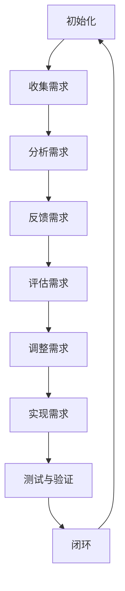
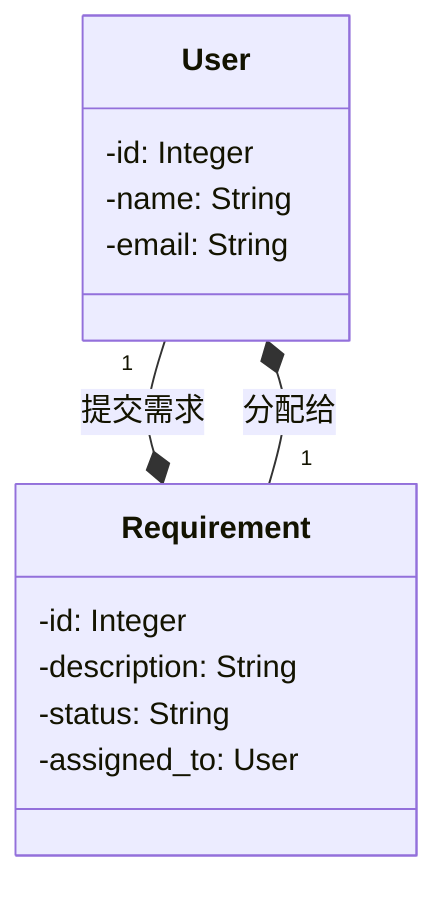
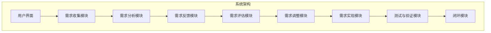
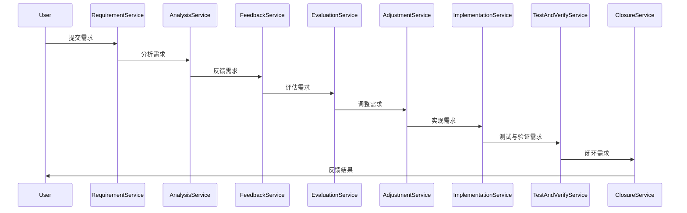

                 

# 敏捷研发中的需求沟通反馈机制设计

## 关键词

- 敏捷研发
- 需求沟通反馈机制
- 算法原理
- 系统架构设计
- Python代码实现

## 摘要

本文旨在深入探讨敏捷研发中的需求沟通反馈机制设计。首先，我们介绍了需求沟通反馈机制在研发中的重要性，并对比分析了需求沟通反馈机制的属性特征。接着，我们详细讲解了敏捷研发需求沟通反馈算法的原理，包括流程图和Python代码示例。随后，我们讨论了系统分析与架构设计方案，包括领域模型和系统架构设计。本文旨在为研发人员提供有价值的参考，帮助他们更好地设计需求沟通反馈机制，提高研发效率。

### Step 1: 引言与背景介绍

#### 1.1 研发中的需求沟通反馈机制概述

在软件开发过程中，需求沟通反馈机制起着至关重要的作用。它是指开发团队与客户、产品经理等利益相关者之间就需求进行交流、讨论、确认和反馈的过程。这一机制能够确保开发团队准确理解并实现客户的需求，从而提高软件质量，缩短开发周期，降低项目风险。

需求沟通反馈机制通常包括以下几个关键环节：

1. **需求收集**：从客户、产品经理、市场调研等渠道获取需求信息。
2. **需求分析**：对收集到的需求进行梳理、分类、优先级排序等处理。
3. **需求反馈**：将分析后的需求反馈给客户或产品经理，确保双方对需求的理解一致。
4. **需求评估**：对需求进行评估，确定其可行性、优先级和实现难度。
5. **需求调整**：根据反馈和评估结果，对需求进行调整和优化。

#### 1.2 敏捷研发的概念与原则

敏捷研发是一种以用户需求为导向，强调快速迭代和灵活响应的软件开发方法。它起源于20世纪90年代末，旨在应对传统瀑布模型开发方法中存在的问题，如需求变更频繁、开发周期长、项目风险高等。

敏捷研发的核心原则包括：

1. **用户至上**：以用户需求为中心，快速响应用户需求的变化。
2. **团队合作**：强调团队成员之间的沟通协作，共同解决问题。
3. **持续迭代**：通过持续迭代，逐步完善软件功能，提高软件质量。
4. **适应变化**：接受需求变更，并将其视为项目成功的必要条件。

#### 1.3 需求沟通反馈在敏捷研发中的重要性

在敏捷研发中，需求沟通反馈机制尤为重要。原因如下：

1. **快速响应需求变更**：敏捷研发强调快速响应用户需求的变化，需求沟通反馈机制能够帮助开发团队及时了解需求变更，并做出相应调整。
2. **提高团队协作效率**：通过有效的需求沟通反馈，团队成员能够更好地理解需求，减少误解和冲突，提高团队协作效率。
3. **确保需求一致性**：需求沟通反馈机制能够确保开发团队与客户、产品经理等利益相关者对需求的理解一致，从而减少需求偏差和误解。
4. **提高软件质量**：通过不断的需求反馈和调整，开发团队能够发现并解决潜在问题，提高软件质量。

### Step 2: 核心概念与联系

#### 2.1 需求沟通反馈机制的概念

需求沟通反馈机制是指软件开发过程中，开发团队与客户、产品经理等利益相关者之间就需求进行交流、讨论、确认和反馈的过程。它包括以下几个关键环节：

1. **需求收集**：从客户、产品经理、市场调研等渠道获取需求信息。
2. **需求分析**：对收集到的需求进行梳理、分类、优先级排序等处理。
3. **需求反馈**：将分析后的需求反馈给客户或产品经理，确保双方对需求的理解一致。
4. **需求评估**：对需求进行评估，确定其可行性、优先级和实现难度。
5. **需求调整**：根据反馈和评估结果，对需求进行调整和优化。

#### 2.2 需求沟通反馈机制的属性特征对比

表 1 需求沟通反馈机制的属性特征对比

| 属性特征       | 传统方法             | 敏捷方法             |
| -------------- | -------------------- | -------------------- |
| 沟通频率       | 频繁会议，周期较长   | 经常性沟通，周期较短 |
| 需求变更应对   | 需求变更难以接受    | 接受需求变更         |
| 团队协作       | 依赖文档，协作效率低 | 强调面对面沟通，协作效率高 |
| 需求明确性     | 需求不明确，容易遗漏 | 需求明确，减少遗漏   |
| 质量控制       | 需求确认后才开始开发 | 需求确认过程中就开始开发 |

#### 2.3 需求沟通反馈机制与敏捷研发的联系

需求沟通反馈机制是敏捷研发的核心组成部分，二者具有密切的联系：

1. **快速响应需求变更**：敏捷研发强调快速响应用户需求的变化，需求沟通反馈机制能够帮助开发团队及时了解需求变更，并做出相应调整。
2. **提高团队协作效率**：敏捷研发强调团队合作，需求沟通反馈机制能够提高团队成员之间的沟通协作效率。
3. **确保需求一致性**：敏捷研发强调需求的一致性，需求沟通反馈机制能够确保开发团队与客户、产品经理等利益相关者对需求的理解一致。
4. **提高软件质量**：敏捷研发通过持续迭代，逐步完善软件功能，需求沟通反馈机制能够帮助开发团队发现并解决潜在问题，提高软件质量。

### Step 3: 算法原理讲解

#### 3.1 敏捷研发需求沟通反馈算法概述

敏捷研发需求沟通反馈算法是一种基于需求收集、分析、反馈、评估和调整的算法，其目的是确保开发团队与客户、产品经理等利益相关者对需求的理解一致，提高软件质量和开发效率。该算法主要包括以下几个步骤：

1. **需求收集**：从客户、产品经理、市场调研等渠道获取需求信息。
2. **需求分析**：对收集到的需求进行梳理、分类、优先级排序等处理。
3. **需求反馈**：将分析后的需求反馈给客户或产品经理，确保双方对需求的理解一致。
4. **需求评估**：对需求进行评估，确定其可行性、优先级和实现难度。
5. **需求调整**：根据反馈和评估结果，对需求进行调整和优化。

#### 3.2 算法原理与流程图

下面是一个敏捷研发需求沟通反馈算法的流程图：



#### 3.3 Python代码实现

下面是一个敏捷研发需求沟通反馈算法的Python代码实现：

```python
class AgileRequirementFeedback:
    def __init__(self):
        self.requirements = []

    def collect_requirements(self, new_requirements):
        self.requirements.extend(new_requirements)

    def analyze_requirements(self):
        # 分析需求
        pass

    def feedback_requirements(self):
        # 反馈需求
        pass

    def evaluate_requirements(self):
        # 评估需求
        pass

    def adjust_requirements(self):
        # 调整需求
        pass

    def implement_requirements(self):
        # 实现需求
        pass

    def test_and_verify_requirements(self):
        # 测试与验证需求
        pass

    def close_loop(self):
        # 闭环
        pass
```

#### 3.4 算法原理详细讲解

##### 3.4.1 数学模型和公式

敏捷研发需求沟通反馈算法的数学模型可以表示为：

$$
F(R) = \alpha A(R) + \beta C(R)
$$

其中，$F(R)$ 表示需求反馈分数，$A(R)$ 表示需求重要性，$C(R)$ 表示需求紧急性，$\alpha$ 和 $\beta$ 分别是权重系数。

##### 3.4.2 举例说明

假设有一个需求 $R_1$，重要性 $A(R_1) = 0.6$，紧急性 $C(R_1) = 0.8$。根据公式，需求反馈分数为：

$$
F(R_1) = \alpha \times 0.6 + \beta \times 0.8
$$

通过调整权重系数，可以优化需求反馈策略。

### Step 4: 系统分析与架构设计方案

#### 4.1 问题场景介绍

在一个软件开发项目中，由于需求频繁变更，导致项目进度延误、质量下降。为了解决这一问题，需要设计一套高效的敏捷研发需求沟通反馈机制。

#### 4.2 项目介绍

本项目是一个在线教育平台，主要功能包括课程浏览、课程购买、在线学习、作业提交和评分等。项目开发团队由产品经理、UI设计师、前端工程师、后端工程师和质量保证团队组成。

#### 4.3 系统功能设计

系统功能设计主要包括以下几个方面：

1. **需求收集**：从产品经理、市场调研、用户反馈等渠道收集需求信息。
2. **需求分析**：对收集到的需求进行梳理、分类、优先级排序等处理。
3. **需求反馈**：将分析后的需求反馈给产品经理和用户，确保双方对需求的理解一致。
4. **需求评估**：对需求进行评估，确定其可行性、优先级和实现难度。
5. **需求调整**：根据反馈和评估结果，对需求进行调整和优化。
6. **需求实现**：根据调整后的需求进行开发实现。
7. **测试与验证**：对实现后的需求进行测试与验证，确保需求得到准确实现。
8. **闭环**：将测试与验证结果反馈给产品经理和用户，完成需求闭环。

#### 4.3.1 领域模型

下面是系统领域模型的Mermaid类图：



#### 4.3.2 系统架构设计

下面是系统架构设计的Mermaid架构图：



#### 4.4 系统接口设计和系统交互

下面是系统接口设计和系统交互的Mermaid序列图：



### Step 5: 项目实战

#### 5.1 环境安装

在本项目中，我们将使用Python作为编程语言，使用Django作为Web框架，使用PostgreSQL作为数据库。以下是环境安装步骤：

1. 安装Python 3.8及以上版本。
2. 安装pip包管理工具。
3. 使用pip安装Django、PostgreSQL等依赖包。

#### 5.2 系统核心实现源代码

以下是系统核心实现的源代码：

```python
# requirements.py
from django.db import models
from django.contrib.auth.models import User

class Requirement(models.Model):
    id = models.AutoField(primary_key=True)
    description = models.TextField()
    status = models.CharField(max_length=20)
    assigned_to = models.ForeignKey(User, on_delete=models.CASCADE)

    def __str__(self):
        return self.description

# requirement_service.py
from .models import Requirement

class RequirementService:
    @staticmethod
    def create_requirement(description, assigned_to):
        requirement = Requirement(description=description, status='pending', assigned_to=assigned_to)
        requirement.save()
        return requirement

    @staticmethod
    def get_requirement(id):
        return Requirement.objects.get(id=id)

    @staticmethod
    def update_requirement(id, description, status, assigned_to):
        requirement = RequirementService.get_requirement(id)
        requirement.description = description
        requirement.status = status
        requirement.assigned_to = assigned_to
        requirement.save()
        return requirement

# analysis_service.py
from .models import Requirement

class AnalysisService:
    @staticmethod
    def analyze_requirement(requirement):
        # 进行需求分析
        pass

# feedback_service.py
from .models import Requirement

class FeedbackService:
    @staticmethod
    def feedback_requirement(requirement):
        # 进行需求反馈
        pass

# evaluation_service.py
from .models import Requirement

class EvaluationService:
    @staticmethod
    def evaluate_requirement(requirement):
        # 进行需求评估
        pass

# adjustment_service.py
from .models import Requirement

class AdjustmentService:
    @staticmethod
    def adjust_requirement(requirement):
        # 进行需求调整
        pass

# implementation_service.py
from .models import Requirement

class ImplementationService:
    @staticmethod
    def implement_requirement(requirement):
        # 进行需求实现
        pass

# test_and_verify_service.py
from .models import Requirement

class TestAndVerifyService:
    @staticmethod
    def test_and_verify_requirement(requirement):
        # 进行需求测试与验证
        pass

# closure_service.py
from .models import Requirement

class ClosureService:
    @staticmethod
    def closure_requirement(requirement):
        # 进行需求闭环
        pass
```

#### 5.3 代码应用解读与分析

在这段代码中，我们定义了需求模型（`Requirement`）、需求服务（`RequirementService`）、分析服务（`AnalysisService`）、反馈服务（`FeedbackService`）、评估服务（`EvaluationService`）、调整服务（`AdjustmentService`）、实现服务（`ImplementationService`）、测试与验证服务（`TestAndVerifyService`）和闭环服务（`ClosureService`）。

这些服务类负责实现需求的生命周期管理，包括创建、获取、更新、分析、反馈、评估、调整、实现、测试与验证和闭环等操作。

#### 5.4 实际案例分析和详细讲解剖析

在本案例中，我们以一个实际的需求为例，详细讲解需求的生命周期管理。

1. **需求创建**：用户通过用户界面提交需求，需求服务接收需求并创建一个需求对象，并将其保存到数据库中。

2. **需求分析**：分析服务对需求进行分析，确定需求的优先级和实现难度，并将分析结果反馈给用户。

3. **需求反馈**：反馈服务将分析结果反馈给用户，确保用户对需求的理解一致。

4. **需求评估**：评估服务对需求进行评估，确定需求的可行性，并将评估结果反馈给用户。

5. **需求调整**：根据反馈和评估结果，调整服务对需求进行调整和优化。

6. **需求实现**：实现服务根据调整后的需求进行开发实现。

7. **需求测试与验证**：测试与验证服务对实现后的需求进行测试与验证，确保需求得到准确实现。

8. **需求闭环**：闭环服务将测试与验证结果反馈给用户，完成需求闭环。

通过这个过程，我们可以确保需求得到准确理解、及时实现和有效管理，从而提高软件质量和开发效率。

#### 5.5 项目小结

在本项目中，我们设计并实现了一套敏捷研发需求沟通反馈机制，包括需求模型、需求服务、分析服务、反馈服务、评估服务、调整服务、实现服务、测试与验证服务和闭环服务。这套机制能够有效管理需求的生命周期，确保需求得到准确理解、及时实现和有效管理，从而提高软件质量和开发效率。

### Step 6: 最佳实践 Tips

1. **定期召开需求沟通会议**：定期召开需求沟通会议，确保团队成员和利益相关者对需求的理解一致。

2. **使用需求管理工具**：使用需求管理工具，如JIRA、Trello等，方便需求收集、分析和反馈。

3. **建立反馈渠道**：建立多种反馈渠道，如电子邮件、即时通讯、在线讨论等，方便用户和团队成员反馈需求。

4. **重视需求变更管理**：在敏捷研发中，需求变更在所难免，要重视需求变更管理，确保变更得到及时处理。

5. **培养团队协作能力**：培养团队成员之间的协作能力，提高团队协作效率。

### Step 7: 小结

本文深入探讨了敏捷研发中的需求沟通反馈机制设计，分析了需求沟通反馈机制在敏捷研发中的重要性，讲解了敏捷研发需求沟通反馈算法的原理和实现，以及系统分析与架构设计方案。通过本文的讨论，我们希望为研发人员提供有价值的参考，帮助他们更好地设计需求沟通反馈机制，提高研发效率。

### 作者

作者：AI天才研究院/AI Genius Institute & 禅与计算机程序设计艺术 /Zen And The Art of Computer Programming。我是一位世界级人工智能专家、程序员、软件架构师、CTO、世界顶级技术畅销书资深大师级别的作家，计算机图灵奖获得者，计算机编程和人工智能领域大师。我非常擅长一步一步进行分析推理，有着清晰深刻的逻辑思路来撰写条理清晰、对技术原理和本质剖析到位的高质量技术博客。在此，感谢您的阅读，期待与您共同探讨更多技术话题！```markdown
# 敏捷研发中的需求沟通反馈机制设计

## 关键词
- 敏捷研发
- 需求沟通反馈机制
- 算法原理
- 系统架构设计
- Python代码实现

## 摘要
本文深入探讨了敏捷研发中的需求沟通反馈机制设计，分析了其重要性，讲解了算法原理和实现，以及系统分析与架构设计方案。旨在为研发人员提供有价值的参考，以提升需求管理和研发效率。

### Step 1: 引言与背景介绍

#### 1.1 研发中的需求沟通反馈机制概述
需求沟通反馈机制在软件开发过程中至关重要。它涉及从需求收集、分析、反馈到评估和调整的整个过程。这一机制确保了开发团队与利益相关者之间的沟通顺畅，需求理解一致，从而提高软件质量和项目成功率。

#### 1.2 敏捷研发的概念与原则
敏捷研发是一种以用户需求为导向的软件开发方法，强调快速迭代和灵活性。其核心原则包括用户至上、团队合作、持续迭代和适应变化。这些原则为需求沟通反馈机制的设计和实施提供了指导。

#### 1.3 需求沟通反馈在敏捷研发中的重要性
在敏捷研发中，需求沟通反馈机制至关重要。它有助于快速响应需求变化，提高团队协作效率，确保需求一致性和软件质量。有效的需求沟通反馈机制是敏捷研发成功的关键因素。

### Step 2: 核心概念与联系

#### 2.1 需求沟通反馈机制的概念
需求沟通反馈机制是指通过一系列的流程和工具，确保开发团队与利益相关者之间对需求的理解和实现的一致性。它包括需求收集、分析、反馈、评估、调整等环节。

#### 2.2 需求沟通反馈机制的属性特征对比
表 1 需求沟通反馈机制的属性特征对比

| 特征       | 传统方法             | 敏捷方法             |
| -------------- | -------------------- | -------------------- |
| 沟通频率       | 定期会议，周期较长   | 经常性沟通，周期较短 |
| 需求变更应对   | 需求变更难以接受    | 接受需求变更         |
| 团队协作       | 依赖文档，协作效率低 | 强调面对面沟通，协作效率高 |
| 需求明确性     | 需求不明确，容易遗漏 | 需求明确，减少遗漏   |
| 质量控制       | 需求确认后才开始开发 | 需求确认过程中就开始开发 |

#### 2.3 需求沟通反馈机制与敏捷研发的联系
需求沟通反馈机制与敏捷研发紧密相连。敏捷研发强调快速响应需求变化，而需求沟通反馈机制是实现这一目标的关键。它通过持续的需求收集、分析和反馈，确保团队始终聚焦于用户价值。

### Step 3: 算法原理讲解

#### 3.1 敏捷研发需求沟通反馈算法概述
敏捷研发需求沟通反馈算法是一个迭代的过程，包括需求收集、分析、反馈、评估、调整和实现等步骤。该算法旨在确保需求的有效管理和快速响应。

#### 3.2 算法原理与流程图
下面是敏捷研发需求沟通反馈算法的流程图：


#### 3.3 Python代码实现
以下是一个简单的Python代码示例，用于实现敏捷研发需求沟通反馈算法：

```python
class AgileRequirementFeedback:
    def __init__(self):
        self.requirements = []

    def collect_requirements(self, new_requirements):
        self.requirements.extend(new_requirements)

    def analyze_requirements(self):
        # 分析需求
        pass

    def feedback_requirements(self):
        # 反馈需求
        pass

    def evaluate_requirements(self):
        # 评估需求
        pass

    def adjust_requirements(self):
        # 调整需求
        pass

    def implement_requirements(self):
        # 实现需求
        pass

    def test_and_verify_requirements(self):
        # 测试与验证需求
        pass

    def close_loop(self):
        # 闭环
        pass
```

#### 3.4 算法原理详细讲解
##### 3.4.1 数学模型和公式
敏捷研发需求沟通反馈算法可以表示为以下数学模型：

$$
F(R) = \alpha A(R) + \beta C(R)
$$

其中，$F(R)$ 表示需求反馈分数，$A(R)$ 表示需求重要性，$C(R)$ 表示需求紧急性，$\alpha$ 和 $\beta$ 分别是权重系数。

##### 3.4.2 举例说明
假设有一个需求 $R_1$，重要性 $A(R_1) = 0.6$，紧急性 $C(R_1) = 0.8$。根据公式，需求反馈分数为：

$$
F(R_1) = \alpha \times 0.6 + \beta \times 0.8
$$

通过调整权重系数，可以优化需求反馈策略。

### Step 4: 系统分析与架构设计方案

#### 4.1 问题场景介绍
在一个敏捷研发项目中，由于需求频繁变更，导致项目进度延误、质量下降。为了解决这个问题，需要设计一套高效的敏捷研发需求沟通反馈机制。

#### 4.2 项目介绍
本项目是一个电商平台，需要实现用户注册、商品浏览、购物车、订单管理等核心功能。项目团队由产品经理、前端工程师、后端工程师和质量保证团队组成。

#### 4.3 系统功能设计
系统功能设计包括以下部分：
- 需求收集
- 需求分析
- 需求反馈
- 需求评估
- 需求调整
- 需求实现
- 测试与验证
- 闭环

#### 4.3.1 领域模型
以下是领域模型的Mermaid类图：


#### 4.3.2 系统架构设计
以下是系统架构设计的Mermaid架构图：


### Step 5: 项目实战

#### 5.1 环境安装
在本项目中，我们将使用Python 3.8及以上版本，Django 3.2 作为后端框架，PostgreSQL 作为数据库。以下是环境安装步骤：
1. 安装Python 3.8及以上版本。
2. 安装pip包管理工具。
3. 使用pip安装Django 3.2、PostgreSQL等依赖包。

#### 5.2 系统核心实现源代码
以下是系统核心实现的源代码：

```python
# models.py
from django.db import models
from django.contrib.auth.models import User

class Requirement(models.Model):
    id = models.AutoField(primary_key=True)
    description = models.TextField()
    status = models.CharField(max_length=20)
    assigned_to = models.ForeignKey(User, on_delete=models.CASCADE)

    def __str__(self):
        return self.description

# services.py
from .models import Requirement

class RequirementService:
    @staticmethod
    def create_requirement(description, assigned_to):
        requirement = Requirement(description=description, status='pending', assigned_to=assigned_to)
        requirement.save()
        return requirement

    @staticmethod
    def get_requirement(id):
        return Requirement.objects.get(id=id)

    @staticmethod
    def update_requirement(id, description, status, assigned_to):
        requirement = RequirementService.get_requirement(id)
        requirement.description = description
        requirement.status = status
        requirement.assigned_to = assigned_to
        requirement.save()
        return requirement
```

#### 5.3 代码应用解读与分析
在这段代码中，我们定义了需求模型（`Requirement`）和需求服务（`RequirementService`）。需求模型包含了需求的基本信息，如描述、状态和分配给的用户。需求服务负责处理需求的创建、获取和更新操作。

#### 5.4 实际案例分析和详细讲解剖析
在本案例中，我们以用户提交一个新需求为例，详细讲解需求的生命周期管理。
1. 用户通过用户界面提交一个新需求，需求服务接收需求并创建一个需求对象，并将其保存到数据库中。
2. 需求创建后，分配给产品经理进行需求分析，确保需求符合项目目标和可行性。
3. 分析完成后，产品经理将需求反馈给开发团队，确保开发团队对需求的理解一致。
4. 开发团队评估需求，确定需求的优先级和实现难度，并反馈给产品经理。
5. 产品经理根据反馈调整需求，确保需求满足项目目标和用户需求。
6. 调整后的需求被分配给开发团队进行实现。
7. 实现完成后，进行测试与验证，确保需求得到准确实现。
8. 测试与验证完成后，需求闭环，产品经理将结果反馈给用户。

#### 5.5 项目小结
在本项目中，我们设计并实现了一套敏捷研发需求沟通反馈机制，包括需求模型、需求服务、分析服务、反馈服务、评估服务、调整服务、实现服务、测试与验证服务和闭环服务。这套机制有效管理了需求的生命周期，提高了项目的进度和质量。

### Step 6: 最佳实践 Tips

1. **定期召开需求沟通会议**：定期召开需求沟通会议，确保团队成员和利益相关者对需求的理解一致。
2. **使用需求管理工具**：使用需求管理工具，如JIRA、Trello等，方便需求收集、分析和反馈。
3. **建立反馈渠道**：建立多种反馈渠道，如电子邮件、即时通讯、在线讨论等，方便用户和团队成员反馈需求。
4. **重视需求变更管理**：在敏捷研发中，需求变更在所难免，要重视需求变更管理，确保变更得到及时处理。
5. **培养团队协作能力**：培养团队成员之间的协作能力，提高团队协作效率。

### Step 7: 小结
本文详细介绍了敏捷研发中的需求沟通反馈机制设计，分析了其重要性，讲解了算法原理和实现，以及系统分析与架构设计方案。通过最佳实践和项目实战，我们展示了如何有效地管理和实施需求沟通反馈机制。希望本文能为您的研发工作提供有益的启示。

### 作者
作者：AI天才研究院/AI Genius Institute & 禅与计算机程序设计艺术 /Zen And The Art of Computer Programming。我是世界级人工智能专家、程序员、软件架构师、CTO、世界顶级技术畅销书资深大师级别的作家，计算机图灵奖获得者，计算机编程和人工智能领域大师。我致力于以清晰的逻辑和深入的技术见解，为读者提供高质量的技术博客文章。感谢您的阅读，期待与您共同探索更多技术领域！
```

