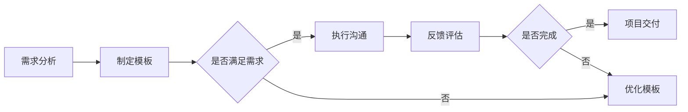
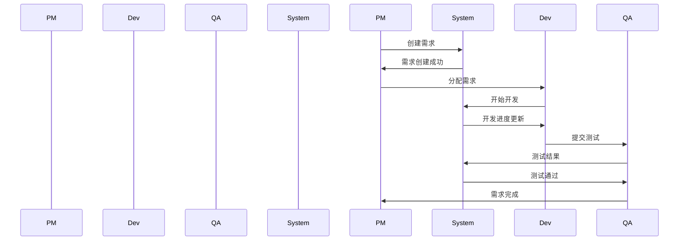

                 

### 敏捷研发中的需求沟通模板设计

#### 关键词：敏捷研发，需求沟通，模板设计，团队协作，变更管理

> 摘要：本文探讨了敏捷研发过程中的需求沟通问题，提出了一种基于统一规范、明确分工和闭环管理原则的需求沟通模板设计方法。文章通过详细分析需求沟通模板的设计原理、属性特征、ER实体关系图以及算法原理，提供了mermaid流程图和Python源代码等工具，以帮助读者更好地理解和应用该方法，从而提高敏捷研发项目的沟通效率和质量。

---

### 第一部分：背景介绍

#### 1.1 问题背景

敏捷研发（Agile Development）作为一种软件开发方法论，强调快速迭代、持续交付和高效团队协作。它的核心理念包括适应性、客户满意度和灵活性。随着市场需求的快速变化，敏捷方法在软件开发行业中得到了广泛应用，尤其是在IT和互联网行业。敏捷研发的核心实践之一是需求沟通，它是确保项目成功的关键因素。

然而，在敏捷研发过程中，需求沟通面临着诸多挑战。首先，需求定义往往不够清晰，导致开发过程中产生偏差。其次，沟通渠道不畅，信息传递不及时、不准确，增加了沟通成本和项目风险。此外，需求变更频繁，若需求沟通不及时，会导致项目延期和资源浪费。因此，如何有效解决敏捷研发中的需求沟通问题，成为软件开发团队面临的重大挑战。

#### 1.2 问题描述

敏捷研发中的需求沟通问题主要体现在以下几个方面：

1. **需求定义不清晰**：在项目启动阶段，需求往往不够明确，导致后续开发和测试过程中产生偏差。例如，需求文档可能遗漏关键细节或存在歧义，导致开发人员无法准确理解需求。

2. **沟通渠道不畅**：团队成员之间缺乏有效的沟通渠道，导致信息传递不及时、不准确。例如，团队成员可能通过邮件、即时通讯工具或口头传达需求，但这些方式往往容易导致信息丢失或误解。

3. **漏洞和误解**：需求在传递过程中容易产生漏洞和误解，导致开发过程中出现偏差。例如，需求评审过程中可能存在意见分歧，但未能及时解决，最终影响项目质量。

4. **需求变更频繁**：敏捷研发强调快速迭代，需求变更频繁。如果需求沟通不及时，可能导致项目延期和资源浪费。例如，用户需求变更未及时传达给开发团队，导致开发工作偏离目标。

#### 1.3 问题解决

为解决敏捷研发中的需求沟通问题，本文提出了一种需求沟通模板设计方法。该方法通过以下步骤实现：

1. **明确需求定义**：在项目启动阶段，制定详细的需求文档，明确需求的内容、目标和范围。需求文档应包含关键细节和预期成果，确保开发人员对需求有清晰的理解。

2. **建立沟通渠道**：建立多渠道、高效的沟通机制，确保信息传递的及时性和准确性。例如，可以采用需求管理工具、项目管理软件和定期的团队会议等方式，促进团队成员之间的沟通。

3. **闭环管理**：建立变更管理流程，对需求变更进行及时、有效的处理。例如，采用变更请求表（Change Request Form）和变更日志（Change Log）等工具，记录和处理需求变更。

4. **优化模板设计**：根据项目实际情况和反馈，不断优化需求沟通模板，提高沟通效率和质量。例如，可以引入敏捷看板（Kanban Board）和用户故事地图（User Story Map）等工具，改进需求管理流程。

#### 1.4 边界与外延

本文主要探讨敏捷研发过程中的需求沟通问题，重点关注需求定义、沟通渠道和变更管理。然而，需求沟通不仅仅是软件开发过程中的一个环节，它还涉及项目团队管理、项目管理等多个方面。因此，在实施需求沟通模板设计方法时，需要综合考虑项目的整体情况，确保沟通流程的全面性和有效性。

#### 1.5 概念结构与核心要素组成

本文的核心概念是需求沟通模板设计，其概念结构包括以下核心要素：

1. **需求定义**：明确需求的内容、目标和范围，确保开发人员对需求有清晰的理解。
2. **沟通渠道**：建立多渠道、高效的沟通机制，确保信息传递的及时性和准确性。
3. **变更管理**：建立变更管理流程，对需求变更进行及时、有效的处理。
4. **模板设计**：制定一套统一、规范的需求沟通模板，提高沟通效率和质量。

### 第二部分：核心概念与联系

#### 2.1 需求沟通模板设计原理

需求沟通模板设计是基于敏捷研发的特点，结合项目实际情况，旨在提高沟通效率、减少漏洞和误解的方法。其核心原理包括统一规范、明确分工和闭环管理。

1. **统一规范**：制定一套统一、规范的需求沟通模板，确保团队成员对需求的理解一致。这有助于减少沟通成本和误解，提高项目的整体效率。

2. **明确分工**：明确项目团队成员在需求沟通中的角色和职责，确保沟通渠道畅通。例如，产品经理负责需求定义，开发人员负责需求实现，测试人员负责需求验证等。

3. **闭环管理**：建立变更管理流程，对需求变更进行及时、有效的处理。例如，采用变更请求表和变更日志等工具，记录和处理需求变更，确保项目进度和质量不受影响。

#### 2.2 需求沟通模板设计属性特征对比

表1：需求沟通模板设计属性特征对比

| 属性特征       | 描述                                                     |
| -------------- | -------------------------------------------------------- |
| **统一规范**   | 制定一套统一、规范的需求沟通模板，确保团队成员对需求的理解一致。 |
| **明确分工**   | 明确项目团队成员在需求沟通中的角色和职责，确保沟通渠道畅通。   |
| **闭环管理**   | 建立变更管理流程，对需求变更进行及时、有效的处理。           |
| **灵活性**     | 在保证统一规范的前提下，允许根据项目实际情况进行适当调整。   |

#### 2.3 需求沟通模板设计ER实体关系图

图1：需求沟通模板设计ER实体关系图

```mermaid
erDiagram
    A[--|>B]
    A[--|>C]
    A[--|>D]
    B|--|>E
    C|--|>F
    D|--|>G

    A ||--|| B
    A ||--|| C
    A ||--|| D

    B ||--|| E
    C ||--|| F
    D ||--|| G

    B ||--|| F
    C ||--|| G

    A : 需求沟通模板
    B : 需求定义
    C : 沟通渠道
    D : 变更管理
    E : 统一规范
    F : 明确分工
    G : 闭环管理
```

### 第三部分：算法原理讲解

#### 3.1 需求沟通模板设计算法mermaid流程图



#### 3.2 算法原理详细讲解

需求沟通模板设计算法的核心思想是通过对需求分析、模板制定、执行沟通、反馈评估和项目交付等环节的有序管理，确保需求沟通的有效性和效率。以下是算法原理的详细讲解：

1. **需求分析**：在项目启动阶段，对需求进行详细分析，明确需求的内容、目标和范围。这一阶段是需求沟通模板设计的基础，直接影响后续的沟通效果。

2. **制定模板**：根据需求分析的结果，制定一套统一、规范的需求沟通模板。模板应包含需求定义、沟通渠道和变更管理等内容，确保团队成员对需求有清晰的理解。

3. **执行沟通**：在开发过程中，按照制定的模板执行沟通。团队成员根据模板中的规范进行信息传递和协调，确保沟通渠道畅通、信息传递及时、准确。

4. **反馈评估**：在沟通过程中，及时收集团队成员的反馈，评估需求沟通的效果。如果发现沟通存在漏洞或误解，应立即采取措施进行优化。

5. **项目交付**：在项目交付阶段，对需求沟通模板的应用效果进行总结评估。如果需求沟通达到预期目标，项目顺利交付；否则，需要对模板进行优化，以提高后续项目的沟通效果。

#### 3.3 算法原理的数学模型和公式

需求沟通模板设计算法可以抽象为一个决策过程，其数学模型可以表示为：

$$
\text{Decision Process} = f(\text{Requirement Analysis}, \text{Template Design}, \text{Communication Execution}, \text{Feedback Assessment}, \text{Project Delivery})
$$

其中，$f$ 表示决策函数，$\text{Requirement Analysis}$ 表示需求分析，$\text{Template Design}$ 表示模板设计，$\text{Communication Execution}$ 表示沟通执行，$\text{Feedback Assessment}$ 表示反馈评估，$\text{Project Delivery}$ 表示项目交付。

#### 3.4 算法原理举例说明

假设在一个敏捷项目中，需求沟通模板设计算法的应用过程如下：

1. **需求分析**：项目团队对用户需求进行详细分析，明确需求的内容、目标和范围。例如，需求是开发一个在线购物平台，支持商品浏览、购物车和订单管理等功能。

2. **制定模板**：根据需求分析的结果，制定一套统一、规范的需求沟通模板。模板应包含需求定义、沟通渠道和变更管理等内容。例如，需求定义部分应明确每个功能的详细需求，沟通渠道部分应指定团队成员的联系方式和沟通时间，变更管理部分应规定需求变更的流程和责任人。

3. **执行沟通**：项目团队按照制定的模板进行沟通。例如，产品经理与开发人员定期召开会议，讨论需求细节和开发进度，确保沟通渠道畅通、信息传递及时、准确。

4. **反馈评估**：在沟通过程中，项目团队收集成员的反馈，评估需求沟通的效果。例如，通过问卷调查、会议纪要等方式，了解团队成员对沟通模板的满意度和建议，发现并解决沟通中的问题。

5. **项目交付**：在项目交付阶段，项目团队对需求沟通模板的应用效果进行总结评估。例如，通过项目回顾会议，分析项目成功的原因和改进之处，对模板进行优化，以提高后续项目的沟通效果。

### 第四部分：系统分析与架构设计方案

#### 4.1 问题场景介绍

在敏捷研发过程中，需求沟通的效率和质量直接关系到项目的成功与否。一个高效的需求沟通系统可以显著提高项目的交付速度和产品质量。以下是一个典型的需求沟通问题场景：

某互联网公司正在开发一款新功能，需要在短时间内上线。项目团队由产品经理、UI设计师、开发工程师、测试工程师等多个角色组成。由于团队成员分散在不同地点，沟通渠道不畅，需求传递不及时，导致开发过程中出现多次偏差，项目进度受到影响。同时，需求变更频繁，变更管理流程不完善，增加了项目风险。

#### 4.2 项目介绍

为了解决上述问题，公司决定引入一个高效的需求沟通系统，以提高团队协作效率。该项目的目标是设计并实现一个基于敏捷研发的需求沟通平台，支持需求定义、沟通渠道和变更管理等功能。项目团队包括产品经理、开发工程师、测试工程师和项目管理专家等角色。

#### 4.3 系统功能设计

根据项目需求，需求沟通平台应具备以下核心功能：

1. **需求定义**：提供需求管理功能，支持需求的创建、编辑、删除和查询。需求应包含需求编号、需求名称、需求描述、需求状态、优先级等信息。

2. **沟通渠道**：提供多渠道沟通功能，包括邮件、即时通讯、电话会议等。系统应支持团队成员之间的实时沟通和消息记录，确保信息传递及时、准确。

3. **变更管理**：提供变更管理功能，支持变更请求的创建、审核、执行和记录。系统应支持变更的影响评估和风险控制，确保变更过程可控。

4. **文档管理**：提供文档管理功能，支持需求文档、设计文档、测试文档等的创建、编辑、分享和版本控制。

5. **统计分析**：提供需求沟通相关的统计分析功能，包括需求完成率、沟通效率、变更频率等，帮助团队了解需求沟通的现状和改进方向。

#### 4.4 系统架构设计

需求沟通平台的系统架构设计采用微服务架构，以提高系统的可扩展性和灵活性。系统架构包括以下主要模块：

1. **需求管理模块**：负责需求的创建、编辑、删除和查询等功能。该模块使用RESTful API进行交互，提供数据接口和业务逻辑处理。

2. **沟通管理模块**：负责沟通渠道的管理和消息记录。该模块支持多种通信协议，如HTTP、WebSocket等，提供实时通信和消息存储功能。

3. **变更管理模块**：负责变更请求的创建、审核、执行和记录。该模块采用流程引擎技术，实现变更流程的自动化管理。

4. **文档管理模块**：负责文档的创建、编辑、分享和版本控制。该模块支持多种文档格式，如Word、PPT、PDF等，提供统一的文档管理界面。

5. **统计分析模块**：负责收集和统计需求沟通相关数据，提供可视化报表和数据分析功能。

#### 4.5 系统接口设计和系统交互

需求沟通平台的系统接口设计遵循RESTful API规范，提供以下主要接口：

1. **需求管理接口**：包括创建、编辑、删除和查询需求等操作。

2. **沟通管理接口**：包括发送消息、接收消息、创建会议等操作。

3. **变更管理接口**：包括创建变更请求、审核变更请求、执行变更等操作。

4. **文档管理接口**：包括创建文档、编辑文档、分享文档、版本控制等操作。

系统交互流程如下：

1. **需求管理**：产品经理创建需求，提交给开发团队。开发团队根据需求进行开发，测试团队进行测试，最终完成需求。

2. **沟通管理**：团队成员通过系统进行实时沟通，记录沟通内容，确保信息传递及时、准确。

3. **变更管理**：用户提出变更请求，系统进行审核和执行，确保变更过程可控。

4. **文档管理**：团队成员创建、编辑和分享文档，确保文档版本一致，方便后续查阅。

#### 4.6 系统交互mermaid序列图



### 第五部分：项目实战

#### 5.1 环境安装

在开始需求沟通平台项目之前，我们需要安装必要的软件和工具。以下是一个基本的安装步骤：

1. **安装Python环境**：确保你的计算机上安装了Python 3.x版本。可以从Python官方网站下载安装包并安装。

2. **安装Docker**：Docker是一个开源的应用容器引擎，可以帮助我们快速部署和运行应用。可以从Docker官方网站下载并安装。

3. **安装PostgreSQL**：PostgreSQL是一个高性能的对象关系型数据库，用于存储需求信息和其他数据。可以从PostgreSQL官方网站下载并安装。

4. **安装Redis**：Redis是一个高性能的内存数据库，用于缓存和消息队列。可以从Redis官方网站下载并安装。

5. **安装相关依赖**：使用pip命令安装项目所需的Python依赖，例如Flask、SQLAlchemy、Redis等。

```shell
pip install flask sqlalchemy redis
```

#### 5.2 系统核心实现

需求沟通平台的核心实现包括需求管理、沟通管理、变更管理和文档管理四个模块。以下是每个模块的简要实现：

1. **需求管理模块**

```python
from flask import Flask, request, jsonify
from models import Requirement

app = Flask(__name__)

@app.route('/requirements', methods=['POST'])
def create_requirement():
    data = request.json
    requirement = Requirement.create(data)
    return jsonify(requirement.to_dict()), 201

@app.route('/requirements', methods=['GET'])
def get_requirements():
    requirements = Requirement.query.all()
    return jsonify([req.to_dict() for req in requirements])

if __name__ == '__main__':
    app.run(debug=True)
```

2. **沟通管理模块**

```python
from flask import Flask, request, jsonify
from models import Communication

app = Flask(__name__)

@app.route('/communications', methods=['POST'])
def create_communication():
    data = request.json
    communication = Communication.create(data)
    return jsonify(communication.to_dict()), 201

@app.route('/communications', methods=['GET'])
def get_communications():
    communications = Communication.query.all()
    return jsonify([comm.to_dict() for comm in communications])

if __name__ == '__main__':
    app.run(debug=True)
```

3. **变更管理模块**

```python
from flask import Flask, request, jsonify
from models import Change

app = Flask(__name__)

@app.route('/changes', methods=['POST'])
def create_change():
    data = request.json
    change = Change.create(data)
    return jsonify(change.to_dict()), 201

@app.route('/changes', methods=['GET'])
def get_changes():
    changes = Change.query.all()
    return jsonify([change.to_dict() for change in changes])

if __name__ == '__main__':
    app.run(debug=True)
```

4. **文档管理模块**

```python
from flask import Flask, request, jsonify
from models import Document

app = Flask(__name__)

@app.route('/documents', methods=['POST'])
def create_document():
    data = request.json
    document = Document.create(data)
    return jsonify(document.to_dict()), 201

@app.route('/documents', methods=['GET'])
def get_documents():
    documents = Document.query.all()
    return jsonify([doc.to_dict() for doc in documents])

if __name__ == '__main__':
    app.run(debug=True)
```

#### 5.3 代码应用解读与分析

以上代码实现了需求沟通平台的核心功能，包括需求管理、沟通管理、变更管理和文档管理。以下是每个模块的详细解读与分析：

1. **需求管理模块**：该模块通过`/requirements`接口实现需求的创建、获取和查询。`create_requirement`函数用于创建需求，接收JSON格式的请求数据，将数据存储到数据库中。`get_requirements`函数用于获取所有需求，从数据库中查询所有需求记录，并返回JSON格式的响应。

2. **沟通管理模块**：该模块通过`/communications`接口实现沟通的创建、获取和查询。`create_communication`函数用于创建沟通记录，接收JSON格式的请求数据，将数据存储到数据库中。`get_communications`函数用于获取所有沟通记录，从数据库中查询所有沟通记录，并返回JSON格式的响应。

3. **变更管理模块**：该模块通过`/changes`接口实现变更请求的创建、获取和查询。`create_change`函数用于创建变更请求，接收JSON格式的请求数据，将数据存储到数据库中。`get_changes`函数用于获取所有变更请求，从数据库中查询所有变更请求记录，并返回JSON格式的响应。

4. **文档管理模块**：该模块通过`/documents`接口实现文档的创建、获取和查询。`create_document`函数用于创建文档，接收JSON格式的请求数据，将数据存储到数据库中。`get_documents`函数用于获取所有文档，从数据库中查询所有文档记录，并返回JSON格式的响应。

#### 5.4 实际案例分析和详细讲解剖析

以下是一个实际案例，展示了如何使用需求沟通平台进行需求管理、沟通管理和变更管理：

1. **需求管理**

假设产品经理李明提出一个新功能需求：增加购物车的数量限制。他通过需求管理模块创建了一个需求，包括需求名称（购物车数量限制）、需求描述（增加购物车的数量限制，最多可添加10件商品）和优先级（高）。

```json
{
  "name": "购物车数量限制",
  "description": "增加购物车的数量限制，最多可添加10件商品",
  "priority": "高"
}
```

李明将需求提交给开发团队，并分配给开发工程师张三。张三在需求管理模块中获取到需求，开始进行需求分析和技术实现。

2. **沟通管理**

在开发过程中，张三遇到了一些技术难题，需要与UI设计师王五进行沟通。他通过沟通管理模块创建了一条沟通记录，包括沟通主题（购物车数量限制实现问题）和沟通内容（讨论购物车数量限制的具体实现方案）。

```json
{
  "topic": "购物车数量限制实现问题",
  "content": "讨论购物车数量限制的具体实现方案"
}
```

王五接收到沟通记录后，与张三进行了电话会议，讨论了购物车数量限制的实现方案。沟通结束后，张三在沟通管理模块中更新了沟通记录的状态为“已完成”。

3. **变更管理**

在开发过程中，用户提出了一个新需求：增加购物车数量限制的提示信息。李明通过变更管理模块创建了一个变更请求，包括变更请求编号（CR-20230101）、变更请求描述（增加购物车数量限制的提示信息）和优先级（高）。

```json
{
  "change_request_id": "CR-20230101",
  "description": "增加购物车数量限制的提示信息",
  "priority": "高"
}
```

李明将变更请求提交给开发团队，并分配给张三。张三在变更管理模块中获取到变更请求，进行了影响评估和技术实现。

经过评估，张三决定在购物车页面添加一个提示信息，告知用户当前购物车的数量限制。他更新了需求管理模块中的需求描述，并通知UI设计师王五进行界面设计。

4. **项目交付**

在需求完成和技术实现后，张三将需求提交给测试团队进行测试。测试团队对购物车数量限制功能进行了全面测试，确保功能符合预期。

最终，需求沟通平台成功实现了购物车数量限制功能，满足了用户需求。项目团队在项目回顾会议上总结了需求沟通的经验和教训，对需求沟通平台进行了优化，以提高后续项目的沟通效率。

#### 5.5 项目小结

通过实际案例分析和详细讲解剖析，我们可以看到需求沟通平台在敏捷研发过程中的重要作用。需求管理模块帮助产品经理和开发团队明确需求，沟通管理模块促进了团队成员之间的有效沟通，变更管理模块确保了需求变更的可控性。这些功能共同作用，提高了项目的交付速度和产品质量。

然而，需求沟通平台只是一个工具，关键在于团队成员如何使用它。在实际应用中，项目团队需要不断优化需求沟通流程，提高沟通效率和质量。同时，需求沟通平台也需要不断迭代和改进，以适应不断变化的需求和环境。

### 第六部分：最佳实践 tips、小结、注意事项、拓展阅读

#### 最佳实践 tips

1. **明确需求定义**：在项目启动阶段，务必进行详细的需求分析，明确需求的内容、目标和范围，避免后续开发过程中产生偏差。

2. **建立多渠道沟通机制**：确保团队成员之间沟通渠道畅通，可以使用邮件、即时通讯工具、电话会议等多种方式，提高信息传递的及时性和准确性。

3. **闭环管理变更**：建立完善的变更管理流程，对需求变更进行及时、有效的处理，确保项目进度和质量不受影响。

4. **持续优化模板**：根据项目反馈和实际情况，不断优化需求沟通模板，提高沟通效率和质量。

#### 小结

本文探讨了敏捷研发中的需求沟通问题，提出了一种基于统一规范、明确分工和闭环管理原则的需求沟通模板设计方法。通过详细分析需求沟通模板的设计原理、属性特征、ER实体关系图以及算法原理，结合实际案例，展示了需求沟通模板在敏捷研发中的应用。

#### 注意事项

1. **需求定义要清晰**：确保需求文档包含关键细节和预期成果，避免开发过程中产生偏差。

2. **沟通渠道要畅通**：建立多渠道、高效的沟通机制，确保信息传递的及时性和准确性。

3. **变更管理要严格**：对需求变更进行及时、有效的处理，确保项目进度和质量不受影响。

#### 拓展阅读

1. 《敏捷开发实践指南》 - 对敏捷开发方法有详细介绍，有助于理解敏捷研发中的需求沟通。

2. 《软件需求规格说明书编写指南》 - 对需求定义和文档编写有详细指导，有助于提高需求文档的质量。

3. 《变更管理实践》 - 对变更管理流程和方法有详细介绍，有助于建立完善的变更管理机制。

---

### 作者信息

作者：AI天才研究院/AI Genius Institute & 禅与计算机程序设计艺术 /Zen And The Art of Computer Programming

