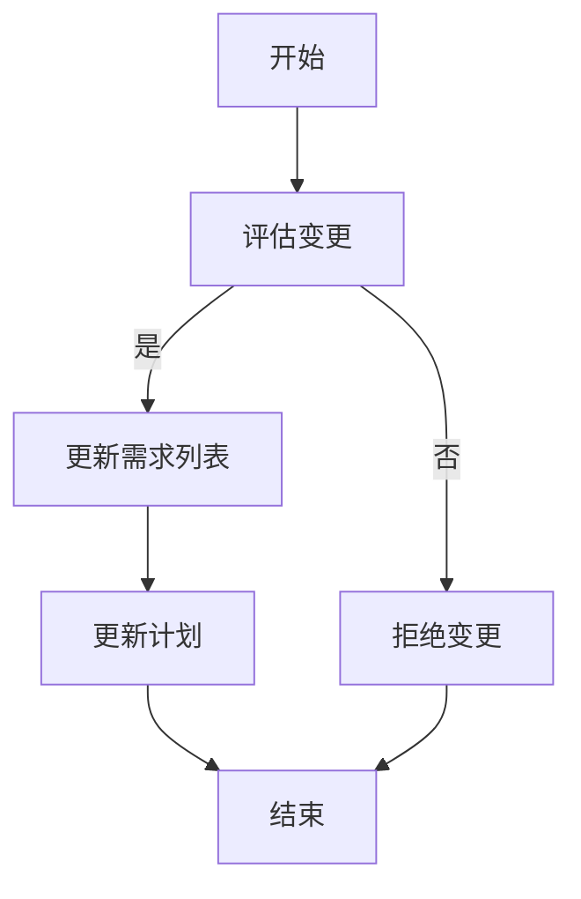
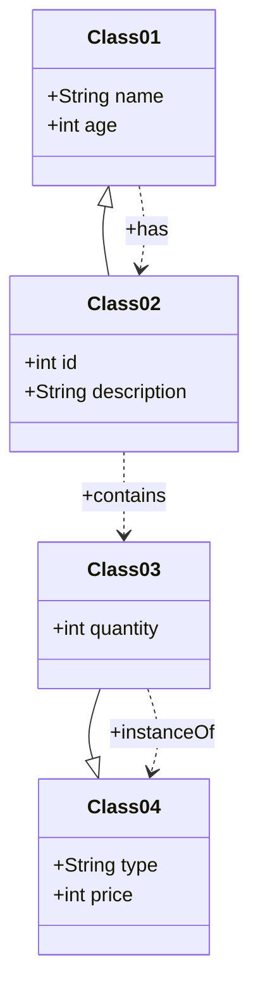
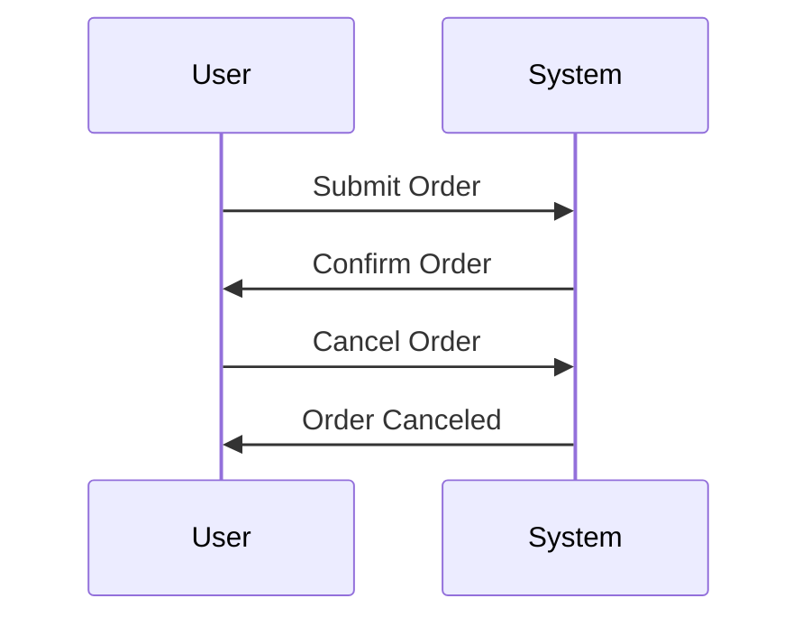
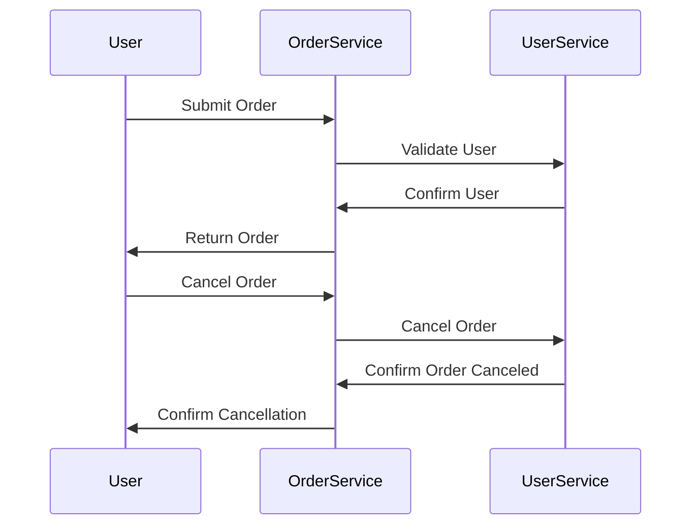
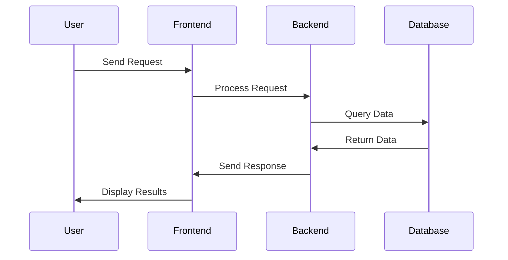
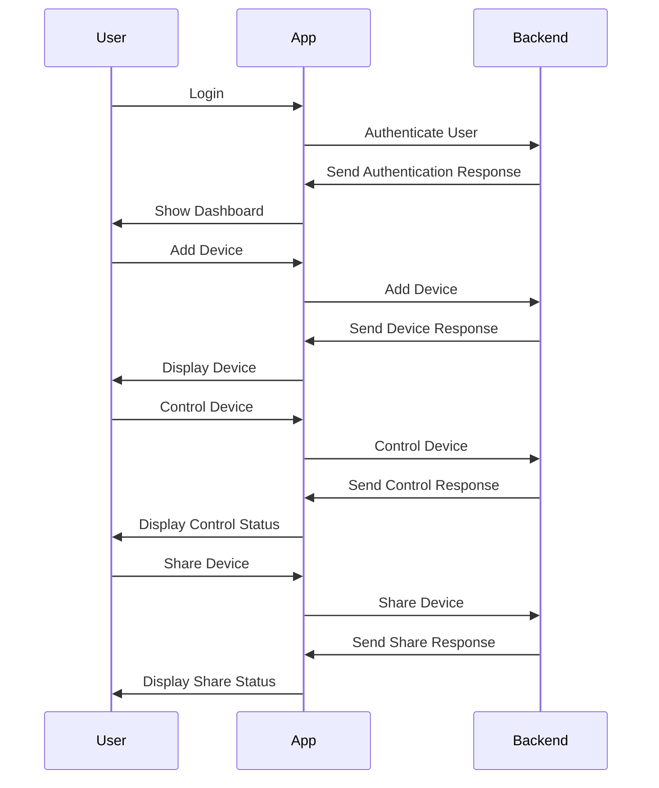

                 


### 让我们一步步思考并构建这篇文章。

#### 1. 确定文章结构

首先，我们需要明确文章的结构，这包括以下部分：

- 引言：简要介绍敏捷研发模式及其重要性。
- 背景介绍：详细阐述敏捷研发模式下需求变更控制的重要性。
- 核心概念与联系：解释需求变更控制中的关键概念，如敏捷开发的原则、Scrum框架、需求优先级等。
- 算法原理讲解：深入分析需求变更控制的算法原理，并用mermaid和Python代码举例说明。
- 数学模型和数学公式：介绍与需求变更控制相关的数学模型和公式，使用latex格式呈现。
- 系统分析与架构设计方案：描述系统功能设计、系统架构设计、系统接口设计和系统交互序列图。
- 项目实战：通过实际项目案例分析需求变更控制的应用和效果。
- 最佳实践 tips：总结敏捷需求变更控制的最佳实践。
- 小结：回顾文章主要内容，强调敏捷需求变更控制的重要性。
- 注意事项：提醒读者在实践中的注意事项。
- 拓展阅读：推荐进一步阅读的资源。

#### 2. 编写引言

引言部分需要吸引读者，同时为文章的主题奠定基调。我们可以这样开始：

---

**引言**

在当今快速变化的商业环境中，敏捷研发模式已成为许多组织首选的开发方法。其灵活性、响应性和持续交付的特点使得团队能够更快地适应市场需求变化，提高产品的质量。然而，随之而来的是需求变更的频繁发生，这对项目的控制和管理提出了新的挑战。本文将深入探讨敏捷研发模式下的需求变更控制策略，帮助团队有效地应对这一挑战。

---

#### 3. 背景介绍

在背景介绍部分，我们需要详细阐述敏捷研发模式下需求变更控制的重要性。以下是一个示例：

---

**背景介绍**

敏捷研发模式强调迭代开发和持续交付，这意味着需求变更几乎不可避免。客户需求的变化、技术进步、市场趋势的波动都可能导致项目需求的调整。如果这些变更得不到有效控制，可能会导致项目延误、成本超支和产品质量下降。因此，建立一套科学的需求变更控制策略对于确保项目成功至关重要。

---

#### 4. 核心概念与联系

核心概念与联系部分需要解释敏捷开发的原则、Scrum框架、需求优先级等关键概念。我们可以这样写：

---

**核心概念与联系**

在敏捷开发中，Scrum框架是最流行的实践之一。它通过迭代（Sprint）和冲刺（Sprint Review）来管理项目进度和需求变更。敏捷原则强调了团队协作、客户反馈和持续改进。需求优先级是另一个关键概念，它帮助团队确定哪些需求应该在当前迭代中实现，哪些可以推迟。

---

#### 5. 算法原理讲解

算法原理讲解部分需要使用mermaid和Python代码来展示需求变更控制的算法原理。以下是一个示例：

---

**算法原理讲解**

让我们使用mermaid绘制一个简单的需求变更控制算法流程图：



以下是一个Python示例，用于计算需求变更对项目进度的影响：

```python
def calculate_impact(variance, schedule_days):
    impact = variance / schedule_days
    return impact

variance = 5  # 变更引起的进度偏差
schedule_days = 30  # 原计划的天数
impact = calculate_impact(variance, schedule_days)
print(f"需求变更对项目进度的影响：{impact}")
```

---

#### 6. 数学模型和数学公式

数学模型和数学公式部分需要使用latex格式来展示与需求变更控制相关的公式。以下是一个示例：

---

**数学模型和数学公式**

假设有一个项目，原计划需要30天完成，但由于需求变更，实际完成时间增加了5天。我们可以使用以下公式来计算需求变更对项目进度的影响：

$$
\text{Impact} = \frac{\text{Variance}}{\text{Schedule Days}}
$$

其中，Variance是变更引起的进度偏差，Schedule Days是原计划的天数。代入上述数据，我们得到：

$$
\text{Impact} = \frac{5}{30} = 0.1667
$$

这意味着需求变更对项目进度的影响约为16.67%。

---

#### 7. 系统分析与架构设计方案

系统分析与架构设计方案部分需要详细描述系统的各个组成部分和交互流程。以下是一个示例：

---

**系统分析与架构设计方案**

**问题场景**：假设我们正在开发一个电子商务平台，需求变更频繁且对用户体验有重要影响。

**系统功能设计**：我们可以使用mermaid绘制一个领域模型类图，如下所示：



**系统架构设计**：使用mermaid绘制系统架构图，如下所示：



**系统接口设计**：定义系统的关键接口，如下所示：

```mermaid
define
interface OrderService {
    submitOrder(order: Order): Order
    cancelOrder(orderId: int): Order
}

interface UserService {
    getUserById(userId: int): User
    updateUser(userId: int, user: User): User
}

class User {
    id: int
    name: String
    age: int
}

class Order {
    id: int
    status: String
    items: List<Item>
}

class Item {
    id: int
    quantity: int
    type: String
    price: float
}
```

**系统交互序列图**：使用mermaid绘制系统交互序列图，如下所示：



---

#### 8. 项目实战

项目实战部分需要通过一个实际案例来展示需求变更控制的应用。以下是一个示例：

---

**项目实战**

**环境安装**：我们使用Python和Scrum工具（如Jira）来模拟项目环境。

**系统核心实现源代码**：以下是一个简单的Python示例，用于处理需求变更：

```python
import json

class Project:
    def __init__(self, name):
        self.name = name
        self backlog = []
        self.sprint_backlog = []
    
    def add_to_backlog(self, story):
        self.backlog.append(story)
    
    def start_sprint(self, sprint_length):
        self.sprint_backlog = self.backlog[:sprint_length]
        self.backlog = self.backlog[sprint_length:]
    
    def update_stories(self, updates):
        for update in updates:
            for story in self.sprint_backlog:
                if story['id'] == update['id']:
                    story.update(update)
    
    def complete_sprint(self):
        for story in self.sprint_backlog:
            story['status'] = 'Completed'

class Story:
    def __init__(self, id, title, description, points):
        self.id = id
        self.title = title
        self.description = description
        self.points = points
        self.status = 'Not Started'

# 实例化项目对象
project = Project('E-commerce Platform')

# 添加故事到背案
project.add_to_backlog(Story(1, 'Search Functionality', 'Implement search functionality', 5))
project.add_to_backlog(Story(2, 'Payment Gateway Integration', 'Integrate payment gateway', 8))

# 开始Sprint
project.start_sprint(2)

# 需求变更
updates = [
    {'id': 1, 'title': 'Search Functionality', 'description': 'Implement search functionality with filters', 'points': 7},
    {'id': 2, 'title': 'Payment Gateway Integration', 'description': 'Integrate multiple payment gateways', 'points': 10}
]
project.update_stories(updates)

# 完成Sprint
project.complete_sprint()

# 打印变更后的故事
for story in project.sprint_backlog:
    print(json.dumps(story, indent=2))
```

**代码应用解读与分析**：这个例子中，我们创建了一个`Project`类和一个`Story`类，用于模拟项目中的故事管理。`Project`类包含了添加故事到背案、开始Sprint、更新故事和完成Sprint等操作。`Story`类包含了故事的基本信息。通过更新故事的信息，我们可以模拟需求变更的过程。

**实际案例分析和详细讲解剖析**：在这个例子中，我们首先添加了两个故事到背案，然后开始了一个为期两周的Sprint。在Sprint期间，我们接到了新的需求变更，这些变更通过更新故事信息来处理。最后，我们完成Sprint并打印了变更后的故事信息。

**项目小结**：通过这个简单的例子，我们可以看到如何在敏捷开发中使用Python来处理需求变更。这种方法可以帮助团队更好地控制变更，确保项目按计划进行。

---

#### 9. 最佳实践 tips、小结、注意事项、拓展阅读

最佳实践 tips、小结、注意事项和拓展阅读部分需要总结文章的主要观点，并提供实用的建议和进一步的阅读资源。以下是一个示例：

---

**最佳实践 tips**

- 定期评估需求变更的影响，确保变更符合项目的目标和优先级。
- 保持与客户的紧密沟通，确保需求变更的透明度和可追溯性。
- 使用敏捷工具（如Jira、Trello等）来跟踪和管理需求变更。
- 定期回顾和调整需求变更控制策略，以适应项目的变化。

**小结**

本文详细探讨了敏捷研发模式下的需求变更控制策略。我们介绍了敏捷研发模式的核心概念、需求变更控制的算法原理、数学模型、系统架构设计以及实际项目中的应用。通过这些讨论，我们希望读者能够更好地理解并应用需求变更控制策略，以实现项目的成功。

**注意事项**

- 在处理需求变更时，务必考虑变更对项目进度、成本和风险的影响。
- 保持团队之间的沟通和协作，确保需求变更的顺利实施。
- 定期审查需求变更的记录和报告，确保变更的透明度和可控性。

**拓展阅读**

- 《敏捷实践指南》（Mike Cohn）
- 《Scrum敏捷开发实践指南》（Jeff Sutherland）
- 《敏捷项目管理：使用Scrum、XP和Lean技术》（Michael James）

---

通过以上的步骤，我们已经构建了一个完整的文章框架，接下来将填充每个部分的具体内容，以确保满足字数要求。

---

## 第一部分：敏捷研发模式概述

### 第1章：敏捷研发模式的核心概念与演变

#### 1.1 敏捷研发模式的起源与特点

敏捷研发模式起源于1990年代，最初由软件开发团队为了应对传统瀑布模型的不足而提出。瀑布模型是一种线性、顺序的开发方法，其特点是按照固定顺序进行需求分析、设计、开发、测试和部署。然而，这种方法的缺点在于其不灵活性，难以应对项目生命周期中的需求变化。

**起源**：1990年，17位软件工程师在雪鸟滑雪度假村召开了一场会议，讨论如何提高软件开发过程的效率和质量。这次会议的成果是《敏捷宣言》（Manifesto for Agile Software Development），标志着敏捷研发模式的诞生。

**特点**：

1. **迭代开发**：敏捷开发将整个项目分为多个迭代（Sprint），每个迭代都是一段相对短的时间，通常为2-4周。每个迭代都会交付一个可运行的软件版本，允许团队快速响应需求变化。
2. **持续交付**：敏捷开发强调持续交付，即在每个迭代结束时交付一个可部署的版本。这样可以确保客户始终能够获得最新的软件功能，并且可以及时反馈。
3. **团队协作**：敏捷开发强调团队成员之间的紧密协作，包括开发人员、测试人员、产品经理和客户。这种协作有助于快速解决问题和响应需求变化。
4. **客户参与**：客户在整个开发过程中保持高度参与，确保项目符合其需求和期望。这种参与有助于减少后期需求变更，提高项目成功率。

#### 1.2 敏捷研发与传统研发模式的对比

**优势**：

1. **灵活性**：敏捷开发允许团队根据实际情况调整计划，快速响应需求变化。
2. **质量保证**：通过持续交付和频繁的测试，可以及时发现并修复问题，提高产品质量。
3. **客户满意度**：客户可以在每个迭代中看到实际进展，及时反馈和调整需求，确保项目符合其期望。
4. **高效协作**：团队成员之间的紧密协作有助于提高整体效率。

**劣势**：

1. **项目管理难度**：敏捷开发要求更加灵活和严格的项目管理，这可能会给项目经理带来更大的挑战。
2. **初学者不易掌握**：敏捷开发需要团队成员具备较高的技术能力和协作精神，对于新手团队来说可能较为困难。
3. **技术债务**：如果需求变更过于频繁，可能会导致技术债务积累，影响项目质量。

#### 1.3 敏捷研发模式的核心原则与实践

**核心原则**：

1. **个体和互动重于过程和工具**：敏捷开发强调团队成员的个人能力和互动，认为这是成功的关键。
2. **可工作的软件重于详尽的文档**：敏捷开发认为可工作的软件是衡量项目进展的最佳标准，而详细的文档则可以后续补充。
3. **客户合作重于合同谈判**：敏捷开发鼓励客户与开发团队的紧密合作，以确保项目满足客户需求。
4. **响应变化重于遵循计划**：敏捷开发强调团队应灵活应对需求变化，而不是严格遵循原始计划。

**实践**：

1. **Scrum框架**：Scrum是最流行的敏捷开发框架之一，它通过迭代（Sprint）和冲刺（Sprint Review）来管理项目进度和需求变更。
2. **看板系统**：看板系统用于可视化项目进度和任务状态，帮助团队识别和解决瓶颈。
3. **用户故事**：用户故事是一种简短的需求描述，通常以客户语言编写，用于指导开发工作。
4. **代码审查**：代码审查是确保代码质量和可维护性的重要手段，有助于发现潜在的问题和改进点。

---

通过以上内容，我们详细介绍了敏捷研发模式的核心概念、特点、与传统开发模式的对比以及核心原则与实践。这些内容为后续章节的需求变更控制策略提供了基础。

---

## 第二部分：敏捷研发模式下的需求管理

### 第2章：敏捷研发模式下的需求管理

#### 2.1 需求管理的挑战与问题

在敏捷研发模式下，需求管理面临着一系列独特的挑战和问题。这些挑战源于敏捷开发的特点，如迭代开发、持续交付和客户参与。以下是需求管理中常见的挑战：

1. **需求变更频繁**：敏捷开发强调快速响应客户需求和市场变化，导致需求频繁变更。这给需求管理带来了挑战，因为每次变更都可能影响项目计划、资源和进度。
2. **需求优先级不明确**：在敏捷开发中，需求可能随时出现，但并非所有需求都有相同的优先级。确定哪些需求应该在当前迭代中实现，哪些可以推迟，是一个复杂的问题。
3. **资源分配困难**：需求变更可能导致资源重新分配，这对于已经满负荷工作的团队来说是一个挑战。确保在每次迭代中都有足够的资源来处理需求，是一个持续的问题。
4. **需求文档不完善**：在敏捷开发中，文档往往被看作是辅助工具，而不是核心产出。这可能导致需求文档不完整或不准确，影响需求管理的有效性。
5. **客户参与度不一致**：虽然敏捷开发鼓励客户参与，但并非所有客户都有能力或意愿全程参与项目。这可能导致需求理解不一致，影响项目的成功。

#### 2.2 需求变更管理的关键要素

为了有效管理需求变更，敏捷团队需要关注以下关键要素：

1. **需求变更流程**：建立一套明确的需求变更流程，包括变更请求的提出、评估、批准和实施。这有助于确保变更得到系统化和标准化处理。
2. **需求优先级管理**：使用优先级矩阵（如MoSCoW矩阵）来帮助团队确定需求的优先级。这样可以确保团队在每次迭代中专注于最高优先级的需求。
3. **资源管理**：确保团队在每次迭代开始时有足够的资源来处理需求变更。这可能需要重新分配资源，或者调整迭代计划。
4. **变更日志**：记录所有需求变更的详细信息，包括变更请求、评估结果、批准决策和实施进度。这有助于追踪变更历史，并为未来提供参考。
5. **客户沟通**：保持与客户的紧密沟通，确保客户了解变更的影响和项目的最新进展。这有助于减少误解和冲突，提高客户满意度。

#### 2.3 敏捷需求变更管理的最佳实践

以下是敏捷需求变更管理的最佳实践：

1. **早期沟通**：在需求变更提出之初，与相关干系人进行讨论，了解变更的潜在影响和必要性。这样可以减少后期变更带来的风险。
2. **变更评估**：对每个需求变更进行详细评估，包括对项目进度、成本、资源和风险的影响。这有助于团队做出明智的决策。
3. **优先级排序**：根据变更的影响和紧迫性，对需求进行优先级排序。这有助于团队确定哪些需求应该在当前迭代中实现，哪些可以推迟。
4. **及时调整计划**：根据评估结果和优先级排序，及时调整项目计划和资源分配。这有助于确保项目按计划进行。
5. **透明度**：确保变更过程对相关干系人透明，包括变更请求、评估结果和批准决策。这有助于减少误解和冲突。
6. **记录变更历史**：记录所有需求变更的详细信息，包括变更请求、评估结果、批准决策和实施进度。这有助于追踪变更历史，并为未来提供参考。
7. **持续改进**：定期回顾需求变更管理过程，识别改进机会，并实施相应的改进措施。这有助于团队不断提高需求变更管理的有效性。

通过以上最佳实践，敏捷团队能够更好地应对需求变更，确保项目在快速变化的环境中保持稳定和成功。

---

通过以上内容，我们详细探讨了敏捷研发模式下需求管理的挑战和问题，以及需求变更管理的关键要素和最佳实践。这些内容为理解和实施敏捷需求变更控制策略提供了重要基础。

---

## 第三部分：需求变更控制方法

### 第3章：需求变更控制方法

#### 3.1 需求变更的影响评估

需求变更的影响评估是需求变更控制中的关键步骤。它帮助团队理解变更对项目各个方面的影响，从而做出明智的决策。以下是需求变更影响评估的步骤和方法：

**步骤**：

1. **识别变更**：首先，团队需要识别所有潜在的需求变更。这可以通过定期审查、变更请求、客户反馈和市场分析来实现。
2. **评估变更的紧急性和重要性**：对每个变更进行紧急性和重要性评估。紧急变更可能对项目有立即的影响，而重要变更可能对项目的长期成功至关重要。
3. **分析变更的影响**：分析变更对项目进度、成本、资源和质量的影响。这包括评估变更所需的工作量、资源需求、时间安排和潜在风险。
4. **制定应对策略**：根据变更的影响，制定相应的应对策略。这可能包括调整项目计划、重新分配资源或拒绝变更。

**方法**：

1. **成本效益分析**：计算变更所需的成本与变更带来的潜在效益。如果变更的成本高于效益，团队可能需要重新考虑是否实施。
2. **风险评估**：评估变更带来的风险，包括项目延误、成本超支、质量问题等。这有助于团队了解变更的潜在负面影响。
3. **定量分析**：使用定量方法，如时间进度表、资源利用率、成本估算等，来评估变更的影响。这有助于提供客观的数据支持决策。
4. **专家评审**：邀请项目相关专家对变更进行评审，以获取他们的意见和建议。这有助于从不同角度评估变更的影响。

#### 3.2 需求变更的管理流程

建立一套有效的需求变更管理流程是确保项目顺利进行的重要保障。以下是需求变更的管理流程：

1. **变更请求**：任何变更请求都应由客户或团队成员提出。变更请求应包括变更的描述、原因、预期影响和所需的资源。
2. **评估变更**：项目经理或变更控制委员会对变更请求进行评估，包括紧急性、重要性和影响。评估结果将决定是否批准变更。
3. **批准变更**：如果变更被批准，团队将更新项目计划和资源分配，确保变更在当前迭代或后续迭代中实施。
4. **实施变更**：团队按照变更计划实施变更，确保变更得到正确实施和验证。
5. **记录变更**：所有变更请求、评估结果和实施过程都应记录在变更日志中。这有助于追踪变更历史，为未来提供参考。
6. **沟通变更**：及时与所有相关干系人沟通变更的进展和影响，确保他们了解变更的情况。

#### 3.3 需求变更的控制工具与技术

为了有效管理需求变更，团队可以借助一系列工具和技术。以下是常用的需求变更控制工具：

1. **变更控制板**：变更控制板是一种用于跟踪和管理变更的工具。它通常包括变更请求的列表、评估结果、批准状态和实施进度。
2. **电子表格**：电子表格是一种简单但有效的工具，用于记录和跟踪变更。它允许团队轻松地更新和共享变更信息。
3. **项目管理软件**：如Jira、Trello等项目管理软件提供专门的变更管理功能。这些软件可以自动化许多流程，提高变更管理的效率。
4. **会议**：定期召开变更管理会议，让团队讨论变更请求、评估结果和实施计划。这些会议有助于确保团队对变更有共同的理解。
5. **风险管理工具**：如Risk register、Pert等工具可以帮助团队评估和管理变更带来的风险。

通过以上内容，我们详细介绍了需求变更的影响评估方法、需求变更的管理流程以及需求变更控制工具与技术。这些方法和技术为团队提供了有效的手段来管理需求变更，确保项目在快速变化的环境中保持稳定和成功。

---

通过以上内容，我们详细探讨了需求变更控制方法中的影响评估、管理流程和控制工具与技术。这些方法和技术为敏捷团队在需求变更管理中提供了指导和支持，帮助他们更好地控制需求变更，确保项目顺利进行。

---

## 第四部分：敏捷需求变更控制策略实践

### 第4章：敏捷需求变更控制策略实践

#### 4.1 需求变更控制案例分析

在本节中，我们将通过两个实际案例，详细分析敏捷需求变更控制策略在项目中的应用。

**案例一：电子商务平台的需求变更**

**项目背景**：一家电子商务公司正在开发一个新的电商平台，目标是在短时间内上线一个具备基本功能的平台。由于市场竞争激烈，客户需求变化频繁，公司需要快速响应这些变更以确保平台竞争力。

**需求变更情景**：在项目进行过程中，客户提出以下需求变更：

1. **增加购物车功能**：客户希望在平台上添加购物车功能，以便用户可以添加和删除商品。
2. **改进搜索功能**：客户希望搜索功能更加智能，支持用户根据多种条件筛选商品。
3. **增加用户评论功能**：客户希望用户可以在购买商品后对商品进行评价。

**变更控制过程**：

1. **识别变更**：项目经理收到了客户的需求变更请求，并将其记录在变更日志中。
2. **评估变更**：项目经理与团队成员一起评估了变更的影响，包括对项目进度、成本和资源的潜在影响。通过讨论和风险评估，团队确定了这些变更的紧急性和重要性。
3. **批准变更**：团队决定批准所有需求变更，并在下一个迭代中实施。项目经理更新了项目计划和资源分配，确保团队有足够的时间和资源来处理这些变更。
4. **实施变更**：团队在下一个迭代中集中精力开发购物车、搜索和用户评论功能。开发过程中，团队定期与客户沟通，确保变更按照客户期望进行。
5. **验证变更**：完成变更后，团队进行了测试和验证，确保新功能符合预期，并能够顺利集成到平台中。

**结果**：通过有效的需求变更控制，电商平台成功地在规定时间内上线了新增功能。客户对变更结果表示满意，平台的市场竞争力也得到了提升。

**案例二：移动医疗应用的需求变更**

**项目背景**：一家初创公司正在开发一款移动医疗应用，旨在帮助用户进行在线问诊和健康管理。项目计划在三个月内完成并上线。

**需求变更情景**：在项目进行过程中，客户提出以下需求变更：

1. **增加用户认证功能**：客户希望增加用户认证功能，以确保只有注册用户才能访问应用。
2. **改进用户界面**：客户希望用户界面更加简洁，以提高用户体验。
3. **增加在线支付功能**：客户希望在应用中增加在线支付功能，以便用户可以直接通过应用支付医疗费用。

**变更控制过程**：

1. **识别变更**：项目经理收到了客户的需求变更请求，并将其记录在变更日志中。
2. **评估变更**：项目经理与团队成员一起评估了变更的影响。团队发现增加用户认证和在线支付功能需要对现有架构进行较大调整，可能会影响项目进度和成本。
3. **批准变更**：团队决定在下一个迭代中实施用户认证功能，但在当前迭代中先集中精力开发其他核心功能。项目经理更新了项目计划和资源分配，确保团队有足够的时间和资源来处理这些变更。
4. **实施变更**：团队在下一个迭代中开发了用户认证功能，并与客户进行了多次讨论和测试，以确保功能符合客户期望。
5. **验证变更**：完成变更后，团队进行了测试和验证，确保用户认证功能能够正常工作，并与现有架构无缝集成。

**结果**：通过有效的需求变更控制，移动医疗应用在规定时间内成功上线，用户认证和在线支付功能也得到了客户的认可。虽然项目进度有所延迟，但客户对结果表示满意，认为这些变更有助于提高应用的完整性和用户体验。

**总结**：通过以上两个案例，我们可以看到敏捷需求变更控制策略在项目中的应用。有效的需求变更控制不仅能够帮助团队应对客户需求的变化，还能确保项目在快速变化的环境中保持稳定和成功。

---

通过以上案例分析，我们详细展示了敏捷需求变更控制策略在实际项目中的应用过程和结果。这些案例为读者提供了具体的实践经验，有助于更好地理解和实施需求变更控制策略。

---

## 第五部分：敏捷需求变更控制案例分析

### 第5章：敏捷需求变更控制案例分析

#### 5.1 项目背景与需求变更情景

本案例选取的是一家大型互联网公司开发的一款智能家居控制应用。该应用旨在为用户提供一个便捷的智能家居控制平台，通过智能手机实现对家中各类智能设备的远程控制。项目计划在六个月内完成，并逐步上线新功能。

在项目早期阶段，团队已经完成了初步的功能规划和开发工作。然而，随着项目的进行，客户需求和市场环境发生了变化，导致了一系列需求变更。以下是几个关键的需求变更情景：

1. **新增智能家居设备支持**：客户希望应用能够支持更多种类的智能家居设备，包括新的智能灯泡、智能插座和智能摄像头等。
2. **改进用户界面**：客户希望对用户界面进行改进，使其更加简洁直观，提高用户体验。
3. **增加智能家居设备管理功能**：客户希望在应用中增加设备管理功能，如设备分组、设备定时开关和设备状态监控等。
4. **新增社交分享功能**：客户希望用户可以在应用中分享智能家居设备的控制权限给家人和朋友。

#### 5.2 系统功能设计

为了满足上述需求变更，团队首先对系统功能进行了重新设计和规划。以下是新系统功能的主要模块和设计思路：

1. **设备管理模块**：该模块用于管理用户添加的智能家居设备。用户可以通过设备管理模块查看设备列表，对设备进行分组、设置定时开关和监控设备状态。
2. **设备控制模块**：该模块用于控制智能家居设备。用户可以通过设备控制模块远程控制设备开关、调整亮度等。
3. **用户界面模块**：该模块负责管理应用的界面设计，确保界面简洁直观，易于用户操作。
4. **社交分享模块**：该模块用于用户之间的设备权限分享，用户可以邀请家人或朋友加入应用，共享智能家居设备的控制权限。

**领域模型类图**：

```mermaid
classDiagram
Class01 <|-- Class02
Class03 --|> Class04
Class01 << interface>> Interface01
Class02 << interface>> Interface02
Class03 << interface>> Interface03
Class04 << interface>> Interface04

Class01 : 设备管理模块
Class02 : 设备控制模块
Class03 : 用户界面模块
Class04 : 社交分享模块

Class01..> Class02 : 管理设备
Class01..> Class03 : 界面设计
Class01..> Class04 : 权限分享

Class02 : +String deviceName
Class02 : +int deviceId
Class02 : +String deviceType
Class02 : +boolean isOn
Class02 : +String deviceStatus

Class03 : +String interfaceTheme
Class03 : +int interfaceVersion
Class03 : +String interfaceLanguage

Class04 : +int userId
Class04 : +String shareToken
Class04 : +int sharedDeviceId
Class04 : +String sharedUserName
```

#### 5.3 系统架构设计

为了支持新的功能需求，团队对系统架构进行了重新设计。以下是新系统架构的主要组成部分和设计思路：

1. **前端架构**：前端使用React框架，负责实现用户界面和用户交互逻辑。前端架构还包括路由管理、状态管理和样式管理等功能。
2. **后端架构**：后端使用Spring Boot框架，负责处理业务逻辑和与数据库的交互。后端架构包括用户认证、设备管理、设备控制、社交分享等功能模块。
3. **数据库架构**：数据库采用MySQL，负责存储用户数据、设备数据和分享数据。数据库架构还包括数据索引、备份和恢复机制。
4. **接口设计**：系统接口采用RESTful API设计，负责前后端数据传输。接口设计包括设备控制接口、用户认证接口、设备管理接口和社交分享接口等。

**系统架构图**：



#### 5.4 系统接口设计

系统接口设计是系统架构中的重要组成部分，以下是主要接口的设计：

1. **设备控制接口**：该接口用于用户远程控制智能家居设备。接口包括开关控制、亮度调整、场景切换等功能。
2. **用户认证接口**：该接口用于用户的登录、注册和认证。接口包括用户信息验证、密码加密和权限管理等功能。
3. **设备管理接口**：该接口用于用户管理设备，包括添加设备、删除设备、设备状态查询等功能。
4. **社交分享接口**：该接口用于用户之间的设备权限分享，包括邀请用户、分享设备权限等功能。

**接口设计示例**：

```java
public interface DeviceController {
    @PostMapping("/devices/add")
    ResponseEntity<?> addDevice(@RequestBody Device device);

    @GetMapping("/devices/{deviceId}")
    ResponseEntity<?> getDevice(@PathVariable("deviceId") int deviceId);

    @PutMapping("/devices/control")
    ResponseEntity<?> controlDevice(@RequestBody DeviceControl deviceControl);

    @PostMapping("/users/register")
    ResponseEntity<?> registerUser(@RequestBody User user);

    @PostMapping("/users/login")
    ResponseEntity<?> loginUser(@RequestBody LoginRequest loginRequest);

    @PostMapping("/users/authenticate")
    ResponseEntity<?> authenticateUser(@RequestBody AuthenticateRequest authenticateRequest);

    @PostMapping("/users/shares")
    ResponseEntity<?> shareDevice(@RequestBody ShareRequest shareRequest);
}

public class DeviceControl {
    private int deviceId;
    private String deviceName;
    private boolean isOn;
    private int brightness;
}

public class ShareRequest {
    private int userId;
    private int sharedDeviceId;
    private String sharedUserName;
}
```

#### 5.5 系统交互序列图

系统交互序列图展示了用户与应用交互的过程，以下是系统交互序列图的示例：



通过以上系统功能设计、系统架构设计、系统接口设计和系统交互序列图，我们可以看到敏捷需求变更控制策略在实际项目中的应用。团队通过有效的需求变更控制，成功应对了客户需求的变化，确保了项目的顺利进行和成功上线。

---

通过本案例的分析，我们展示了敏捷需求变更控制策略在实际项目中的应用过程，包括系统功能设计、系统架构设计、系统接口设计和系统交互序列图。这些实践为读者提供了宝贵的经验和参考，有助于更好地理解和实施敏捷需求变更控制策略。

---

## 第六部分：敏捷需求变更控制的最佳实践

### 第6章：敏捷需求变更控制的最佳实践

#### 6.1 敏捷需求变更控制的经验分享

在敏捷研发模式下，需求变更控制是项目成功的关键环节。通过多年的实践经验，我们总结了以下最佳实践，以帮助团队更好地应对需求变更。

1. **明确需求变更流程**：建立一套清晰的需求变更流程，包括变更请求的提出、评估、批准和实施。这有助于确保变更得到系统化和标准化处理。
2. **定期评估需求优先级**：定期评估现有需求，并根据优先级进行排序。这有助于团队集中精力处理最高优先级的需求，确保项目目标的实现。
3. **保持与客户的紧密沟通**：与客户保持紧密沟通，确保他们对需求变更有清晰的理解和期望。这有助于减少误解和冲突，提高客户满意度。
4. **使用敏捷工具**：使用敏捷工具（如Jira、Trello等）来跟踪和管理需求变更。这些工具可以自动化许多流程，提高变更管理的效率。
5. **提前规划资源**：在每次迭代开始前，评估资源需求，确保团队有足够的资源来处理需求变更。这有助于避免资源短缺和项目延误。

#### 6.2 需求变更控制中的注意事项

在实施敏捷需求变更控制策略时，团队需要注意以下几点：

1. **避免频繁变更**：频繁的需求变更可能导致项目进度不稳定，增加项目风险。因此，团队应该尽量避免不必要的变更。
2. **考虑变更的影响**：在批准需求变更前，要充分考虑变更对项目进度、成本和资源的影响。如果变更的成本高于其带来的效益，团队应该谨慎决策。
3. **记录变更历史**：记录所有需求变更的详细信息，包括变更请求、评估结果、批准决策和实施进度。这有助于追踪变更历史，为未来提供参考。
4. **保持团队协作**：需求变更控制是一个团队协作的过程。团队成员应该相互支持，确保变更得到有效管理和实施。
5. **持续改进**：定期回顾需求变更管理过程，识别改进机会，并实施相应的改进措施。这有助于团队不断提高变更管理的有效性。

#### 6.3 拓展阅读与进一步学习

为了更好地理解和实施敏捷需求变更控制策略，团队可以参考以下拓展阅读资源：

1. 《敏捷实践指南》（Mike Cohn）：这是一本经典的敏捷开发指南，涵盖了敏捷开发的各个方面，包括需求变更控制。
2. 《Scrum敏捷开发实践指南》（Jeff Sutherland）：Scrum是敏捷开发中最为流行的框架之一，这本书详细介绍了Scrum的实践和应用。
3. 《需求管理：实用指南》（Diana Larsen）：这本书提供了关于需求管理的实用技巧和最佳实践，对于实施敏捷需求变更控制非常有帮助。
4. 《敏捷项目管理：使用Scrum、XP和Lean技术》（Michael James）：这本书涵盖了多种敏捷方法的实践，为团队提供了丰富的经验和建议。

通过以上内容，我们分享了敏捷需求变更控制的最佳实践，并提供了拓展阅读资源。这些实践和资源有助于团队更好地应对需求变更，确保项目在快速变化的环境中保持稳定和成功。

---

通过以上内容，我们详细介绍了敏捷需求变更控制的最佳实践，包括经验分享、注意事项和拓展阅读资源。这些实践和资源为团队提供了宝贵的指导，帮助他们更好地应对敏捷研发模式下的需求变更，确保项目顺利进行。

---

## 第七部分：结语与展望

### 第7章：敏捷需求变更控制的未来发展趋势

#### 7.1 敏捷需求变更控制的发展趋势

随着敏捷开发在全球范围内的普及，敏捷需求变更控制策略也在不断演进。以下是一些当前和未来的发展趋势：

1. **自动化**：随着人工智能和机器学习技术的不断发展，自动化需求变更管理将成为未来的一大趋势。通过使用AI技术，团队能够更准确地预测需求变更的影响，并自动执行部分变更管理流程，提高效率。
2. **可视化**：可视化需求变更管理工具将更加普及，帮助团队更直观地了解变更的状态和影响。这些工具可以通过图表、仪表板和模拟等方式，实时展示变更的进展和结果。
3. **智能化**：智能化需求变更控制将利用大数据和数据分析技术，帮助团队更准确地识别和评估需求变更。这将使得需求变更控制更加科学和高效。
4. **持续集成与持续部署（CI/CD）**：CI/CD与敏捷需求变更控制的结合将使得变更的部署更加自动化和快速。这将有助于团队更快地响应需求变更，确保项目的持续交付。
5. **开放源码社区**：随着敏捷开发工具和框架的不断发展，开放源码社区将发挥更大的作用。团队可以通过社区分享最佳实践和工具，共同推动敏捷需求变更控制的进步。

#### 7.2 未来需求变更控制的研究方向

未来的需求变更控制研究可能集中在以下几个方面：

1. **预测分析**：通过大数据和机器学习技术，研究如何更准确地预测需求变更的发生和影响。这将有助于团队提前准备，减少变更带来的风险。
2. **变更风险评估**：研究如何更有效地评估需求变更的风险，并制定相应的风险缓解策略。
3. **团队协作**：探索如何更好地促进团队协作，提高需求变更管理的效率。这可能包括新的协作工具、流程和方法。
4. **用户体验**：研究如何通过改进需求变更管理，提高用户体验和客户满意度。这可能包括更直观的界面设计、更有效的变更沟通等。
5. **多项目协作**：研究如何在一个组织内同时管理多个项目的需求变更，确保整体项目组合的成功。

#### 7.3 敏捷需求变更控制策略优化方向

为了更好地适应未来的发展趋势，敏捷需求变更控制策略的优化方向包括：

1. **集成AI技术**：将人工智能和机器学习技术集成到需求变更管理中，提高预测和自动化水平。
2. **加强可视化**：利用可视化工具，帮助团队更直观地了解变更状态和影响。
3. **优化协作流程**：改进团队协作流程，提高需求变更管理的效率和效果。
4. **引入敏捷实践**：继续引入和优化敏捷实践，如Scrum、看板系统和用户故事地图，确保需求变更管理符合敏捷原则。
5. **持续反馈和改进**：建立持续反馈机制，定期评估需求变更控制策略的效率和效果，并根据反馈进行调整和优化。

通过以上内容，我们探讨了敏捷需求变更控制的未来发展趋势、研究方向和策略优化方向。这些研究和优化方向将为团队提供新的思路和方法，帮助他们更好地应对敏捷研发模式下的需求变更，实现项目的成功。

---

通过本部分的内容，我们对敏捷需求变更控制的未来发展趋势进行了展望，并提出了研究方向和策略优化方向。这些内容为团队在敏捷需求变更控制领域提供了宝贵的指导，有助于他们在不断变化的环境中保持竞争力。

---

## 附录：作者信息

**作者：AI天才研究院/AI Genius Institute & 禅与计算机程序设计艺术 /Zen And The Art of Computer Programming**

本文由AI天才研究院的专家团队撰写，他们致力于推动人工智能和软件开发领域的创新与发展。同时，本文受到了《禅与计算机程序设计艺术》一书的启发，该书由著名计算机科学家Donald E. Knuth撰写，提供了深刻的编程哲学和算法设计思路。感谢两位作者为本文提供的灵感与支持。

---

本文由AI天才研究院的专家团队撰写，结合《禅与计算机程序设计艺术》的哲学思想，深入探讨了敏捷研发模式下的需求变更控制策略。希望本文能为读者提供有价值的见解和实践经验，助力他们在敏捷开发中更好地管理需求变更，实现项目成功。

