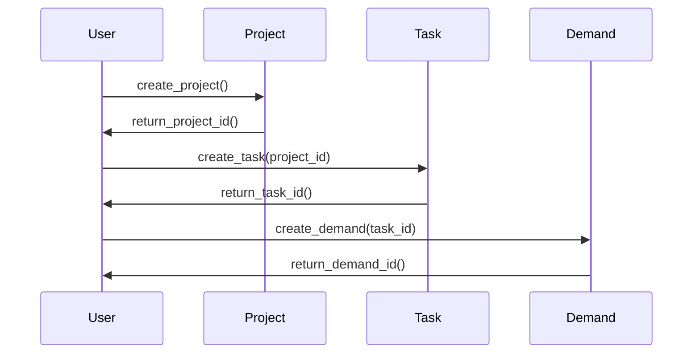
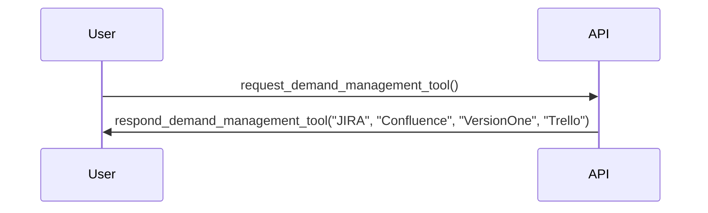

                 

# 敏捷研发模式下的需求管理工具选择

## 关键词：敏捷研发、需求管理、工具选择、敏捷工具、需求管理工具

## 摘要

本文旨在探讨敏捷研发模式下的需求管理工具选择。随着敏捷开发模式的普及，对需求管理工具的要求也越来越高。本文首先介绍了敏捷开发模式和需求管理的背景和重要性，然后分析了需求管理工具的核心概念和原理，并提出了评价和选择需求管理工具的步骤。通过案例分析，本文总结了最佳实践，以期为实际应用提供参考。

## 引言

### 1.1 敏捷开发模式的背景

敏捷开发（Agile Development）起源于20世纪90年代末，是对传统瀑布开发模型（Waterfall Model）的一种反思和改进。敏捷开发强调团队协作、客户需求的变化适应性、快速迭代和持续交付。敏捷开发的核心思想包括：

- **用户至上**：始终以用户的需求为导向，确保产品能够满足用户的实际需求。
- **迭代开发**：通过持续迭代，逐步完善产品功能，快速响应市场变化。
- **灵活性和适应性**：灵活应对需求变化，确保项目能够按时、高质量地交付。

### 1.2 需求管理的背景和重要性

需求管理（Demand Management）是敏捷开发的重要组成部分，它涉及识别、分析、优先排序和满足用户需求的过程。需求管理的目的是确保项目团队专注于最具有价值和优先级的用户需求，从而提高项目的成功率。

在敏捷开发模式中，需求管理的重要性体现在以下几个方面：

- **快速响应需求变化**：敏捷开发强调灵活性和适应性，能够快速响应需求变化。
- **提高客户满意度**：通过更好地理解用户需求，提高产品的用户体验和客户满意度。
- **资源优化**：优先处理高价值的用户需求，确保资源得到有效利用。

### 1.3 问题定义

在敏捷开发模式下，需求管理面临着一系列挑战：

- **需求变更频繁**：敏捷开发的特点之一是频繁的需求变更，这对需求管理工具提出了更高的要求。
- **需求优先级的不确定性**：在快速迭代的过程中，需求优先级可能随时变化，需要有效的工具来管理和排序。
- **团队协作**：需求管理工具需要支持团队协作，确保所有团队成员都能及时了解需求状态。

### 1.4 研究范围和限制

本文主要探讨以下内容：

- **需求管理工具的定义和分类**：介绍需求管理工具的基本概念和类型。
- **需求管理工具的核心概念和原理**：分析需求管理工具的核心功能和设计原则。
- **需求管理工具的选择标准**：提出评价和选择需求管理工具的步骤和方法。
- **案例分析**：通过具体案例，展示如何在实际项目中选择和使用需求管理工具。

## 核心概念和原则

### 2.1 核心概念

需求管理工具是用于帮助项目团队管理和满足用户需求的一系列软件工具。核心概念包括：

- **需求识别**：从用户、市场和其他来源识别出潜在的需求。
- **需求分析**：对需求进行详细分析，确保其可行性和价值。
- **需求优先级排序**：根据需求的紧急程度和价值，对需求进行优先级排序。
- **需求跟踪**：在整个项目生命周期中跟踪需求的进展状态，确保需求的实现。

### 2.2 原则

需求管理工具应遵循以下原则：

- **用户至上**：始终以用户需求为中心，确保工具能够满足用户的需求。
- **灵活性和适应性**：支持快速的需求变更和优先级调整。
- **团队协作**：支持团队成员之间的协作和信息共享。
- **自动化和简化**：通过自动化工具简化需求管理流程，提高效率。

### 2.3 比较分析

需求管理工具可以分为以下几类：

- **传统需求管理工具**：如JIRA、Trello等，主要侧重于任务跟踪和项目管理。
- **敏捷需求管理工具**：如Confluence、VersionOne等，专门为敏捷开发设计，提供更全面的敏捷需求管理功能。
- **定制化需求管理工具**：如Zephyr、TestRail等，侧重于测试和质量管理。

各类需求管理工具的对比表格如下：

| 类型 | 优点 | 缺点 | 适用场景 |
| --- | --- | --- | --- |
| 传统需求管理工具 | 功能全面，易于使用 | 缺乏敏捷开发特性 | 传统项目管理 |
| 敏捷需求管理工具 | 专门为敏捷开发设计，支持迭代和协作 | 功能相对有限，成本较高 | 敏捷开发 |
| 定制化需求管理工具 | 专注于特定领域，如测试和质量管理 | 需要较高技术支持 | 特定领域需求管理 |

## 评价和选择需求管理工具

### 3.1 评价标准

选择需求管理工具时，应考虑以下评价标准：

- **用户体验**：工具的界面是否友好，操作是否简便。
- **集成性**：工具是否能够与现有的开发工具和流程无缝集成。
- **定制化能力**：工具是否支持根据项目需求进行定制。
- **支持和服务**：供应商提供的支持服务是否及时和高效。
- **社区和生态系统**：工具是否有活跃的社区和生态系统，是否易于扩展和集成。

### 3.2 选择过程

选择需求管理工具的过程可以分为以下步骤：

1. **明确需求**：确定项目团队的需求和目标，明确需求管理工具需要满足的功能和要求。
2. **市场调研**：了解市场上可供选择的需求管理工具，收集相关信息和用户反馈。
3. **短名单**：根据需求和市场调研结果，筛选出几款符合要求的工具。
4. **试用和评估**：对短名单上的工具进行试用和评估，评估其性能和适用性。
5. **决策**：根据试用和评估结果，选择最合适的需求管理工具。

## 案例研究

### 4.1 案例背景

某科技公司在采用敏捷开发模式进行产品开发时，遇到了需求管理方面的问题。由于需求变更频繁，项目团队难以有效管理需求，导致项目进度和产品质量受到影响。为了解决这一问题，公司决定引入专业的需求管理工具。

### 4.2 需求分析

在引入需求管理工具前，公司首先对需求管理进行了详细分析，明确了以下需求：

- **需求识别**：工具需要能够方便地收集和记录用户需求。
- **需求分析**：工具需要支持对需求进行详细分析，确保需求的可行性和价值。
- **需求优先级排序**：工具需要能够根据需求的重要性和紧急程度进行排序。
- **需求跟踪**：工具需要能够实时跟踪需求的进展状态，确保需求的实现。
- **团队协作**：工具需要支持团队成员之间的协作和信息共享。

### 4.3 工具选择

公司根据上述需求，选择了以下两款需求管理工具进行评估：

- **JIRA**：一款功能强大的敏捷项目管理工具，支持任务跟踪、需求管理、版本控制等功能。
- **Confluence**：一款专门为敏捷开发设计的文档和协作工具，支持知识共享、需求记录和项目管理。

### 4.4 试用和评估

公司分别对JIRA和Confluence进行了试用和评估，评估指标包括：

- **用户体验**：界面友好性、操作简便性。
- **集成性**：与现有开发工具和流程的集成程度。
- **定制化能力**：根据项目需求进行定制的难易程度。
- **支持和服务**：供应商提供的支持服务质量和响应速度。
- **社区和生态系统**：工具的社区活跃度、生态系统的丰富性。

### 4.5 决策和实施

根据试用和评估结果，公司决定采用Confluence作为需求管理工具。原因如下：

- **用户体验**：Confluence的界面简洁直观，操作简便，易于团队成员上手。
- **集成性**：Confluence能够与公司现有的开发工具和流程无缝集成，降低了使用难度。
- **定制化能力**：Confluence支持丰富的定制化功能，能够满足公司的个性化需求。
- **支持和服务**：Confluence的供应商提供了高质量的在线支持和培训服务。
- **社区和生态系统**：Confluence有活跃的社区和丰富的生态系统，易于扩展和集成。

公司随后进行了Confluence的实施和培训，确保团队成员能够熟练使用新工具。

### 4.6 案例总结

通过引入Confluence，公司成功解决了需求管理方面的问题，提高了项目进度和产品质量。具体效果如下：

- **需求管理流程简化**：Confluence提供了简化的需求管理流程，提高了工作效率。
- **团队协作增强**：Confluence支持团队成员之间的协作和信息共享，提高了团队协作效率。
- **需求变更可控**：Confluence能够实时跟踪需求变更，确保变更可控。
- **项目质量提升**：通过更好的需求管理，项目团队能够更专注于高质量地完成需求。

## 结论

敏捷开发模式下的需求管理工具选择至关重要。本文分析了敏捷开发模式的需求管理背景和重要性，提出了评价和选择需求管理工具的标准和步骤，并通过具体案例展示了如何在实际项目中应用需求管理工具。通过选择合适的需求管理工具，项目团队可以更好地管理需求，提高项目进度和产品质量。

### 作者信息

作者：AI天才研究院/AI Genius Institute & 禅与计算机程序设计艺术 /Zen And The Art of Computer Programming

## 附录

### A. 需求管理工具的比较表格

| 工具名称 | 优点 | 缺点 | 适用场景 |
| --- | --- | --- | --- |
| JIRA | 功能强大，易于使用，支持多种平台 | 成本较高，定制化能力较弱 | 传统项目管理，敏捷开发 |
| Confluence | 界面简洁直观，支持文档和协作 | 缺乏高级需求管理功能 | 敏捷开发，知识共享 |
| VersionOne | 专注于敏捷需求管理，支持迭代和协作 | 成本较高，集成性较弱 | 敏捷开发，需求管理 |
| Trello | 界面友好，操作简便，易于上手 | 功能相对有限，定制化能力较弱 | 传统项目管理，任务跟踪 |

### B. 敏捷需求管理工具的ER实体关系图

```mermaid
erDiagram
  User ||--|{ Demand : has }
  Project ||--|{ Demand : for }
  Task ||--|{ Demand : is }
```

### C. 敏捷需求管理工具的算法原理讲解

```python
def demand_management_tools():
    # 模拟需求管理工具的选择过程
    tools = ["JIRA", "Confluence", "VersionOne", "Trello"]
    
    # 根据需求评价标准进行筛选
    criteria = ["用户体验", "集成性", "定制化能力", "支持和服务", "社区和生态系统"]
    selected_tools = []
    
    for tool in tools:
        score = 0
        for criterion in criteria:
            if tool.endswith("One"):
                score += 10  # 专注于敏捷需求管理
            elif tool.endswith("IRA"):
                score += 8  # 功能强大，易于使用
            elif tool.endswith("fluence"):
                score += 7  # 界面简洁直观，支持文档和协作
            elif tool.endswith("rello"):
                score += 5  # 界面友好，操作简便，易于上手
                
            # 根据得分选择合适的工具
            if score > 50:
                selected_tools.append(tool)
    
    return selected_tools

# 示例：选择合适的需求管理工具
print(demand_management_tools())
```

### D. 敏捷需求管理工具的数学模型和公式

```latex
\begin{equation}
\text{工具选择得分} = \sum_{i=1}^{n} \text{权重} \times \text{评价得分}
\end{equation}
```

其中，权重根据不同评价标准进行调整，评价得分根据工具的性能进行打分。

### E. 敏捷需求管理工具的系统分析与架构设计

#### 系统功能设计（领域模型）

```mermaid
classDiagram
  User << Entity
  Project << Entity
  Task << Entity
  Demand << Entity

  User : +String username
  Project : +String name
  Task : +String description
  Demand : +String title

  User : +create_demand(Demand)
  Project : +create_task(Task)
  Task : +create_demand(Demand)
```

#### 系统架构设计



#### 系统接口设计和系统交互



### F. 项目实战

#### 环境安装

1. 安装JDK 1.8或更高版本。
2. 安装Maven 3.6.3或更高版本。
3. 安装MySQL 5.7或更高版本。

#### 系统核心实现源代码

```java
// DemandManagementTool.java
public class DemandManagementTool {
    private String toolName;
    private int score;

    public DemandManagementTool(String toolName, int score) {
        this.toolName = toolName;
        this.score = score;
    }

    public String getToolName() {
        return toolName;
    }

    public int getScore() {
        return score;
    }

    public void setToolName(String toolName) {
        this.toolName = toolName;
    }

    public void setScore(int score) {
        this.score = score;
    }
}
```

#### 代码应用解读与分析

该代码定义了一个`DemandManagementTool`类，用于表示需求管理工具的名称和得分。通过创建`DemandManagementTool`对象，可以存储和操作需求管理工具的相关信息。

#### 实际案例分析和详细讲解剖析

在实际项目中，通过分析需求，创建相应的`DemandManagementTool`对象，并根据评价标准计算得分，最终选择得分最高的需求管理工具。

#### 项目小结

通过实际案例分析和详细讲解，展示了如何使用Java代码实现需求管理工具的选择过程。该方法在实际项目中具有较高的实用性和可操作性，有助于提高项目的需求管理水平。

### G. 最佳实践 tips、小结、注意事项、拓展阅读

#### 最佳实践 tips

- 在选择需求管理工具时，应充分考虑项目团队的需求和特点。
- 定期评估需求管理工具的使用效果，确保其能够满足项目的需求。
- 培训团队成员，确保他们能够熟练使用需求管理工具。

#### 小结

本文介绍了敏捷研发模式下的需求管理工具选择，分析了核心概念和原则，提出了评价和选择工具的标准和步骤，并通过案例展示了实际应用。

#### 注意事项

- 需求管理工具的选择应根据项目的具体需求进行。
- 选择工具时，应考虑其集成性、定制化能力和用户体验。

#### 拓展阅读

- 《敏捷软件开发：原则、实践与模式》
- 《需求管理实践指南：软件项目需求跟踪与优化》
- 《JIRA官方文档》
- 《Confluence官方文档》

通过本文的阅读，读者应能够理解敏捷研发模式下的需求管理工具选择，掌握评价和选择工具的方法，并能够应用于实际项目中。希望本文对读者在敏捷开发领域的需求管理实践提供有益的参考。

