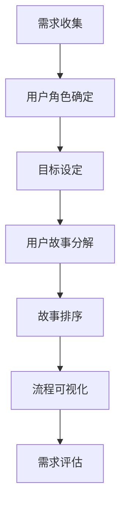
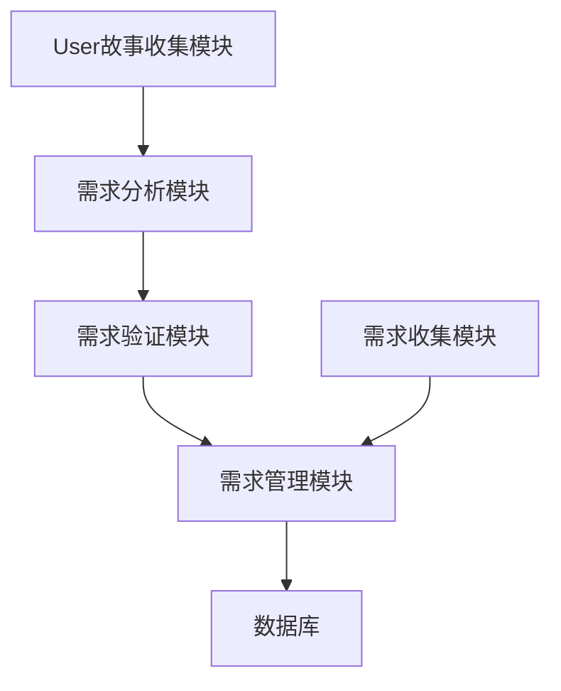
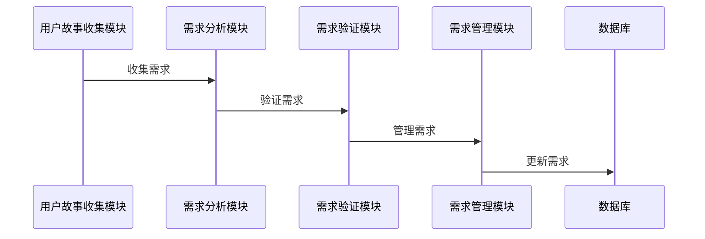
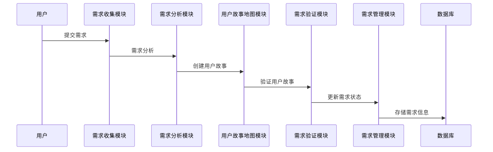

                 

### 引言

在当今快速发展的软件行业，敏捷研发模式已经成为主流的开发方法论。敏捷研发强调灵活性、响应速度和持续交付价值，旨在满足不断变化的市场需求和用户期望。然而，在敏捷研发模式下，如何准确评估需求，成为了一个关键问题。传统的需求评估方法往往难以适应敏捷研发的快速迭代和灵活性，导致需求理解偏差、资源浪费和项目风险。

《敏捷研发模式下的需求评估方法创新》这本书正是为了解决这一难题而诞生的。本书的核心目标是介绍并探讨一系列创新的敏捷需求评估方法，帮助开发者、项目经理和产品经理在实际项目中更有效地评估需求，从而提高项目成功率。

本书的关键词包括：敏捷研发、需求评估、创新方法、敏捷迭代、项目风险管理。这些关键词不仅概括了书的核心内容，也反映了敏捷研发模式下的需求评估面临的主要挑战和解决思路。

本书的摘要部分将简要介绍书的主要内容，包括敏捷研发模式的背景与价值、需求评估的基本概念与核心要素、敏捷需求评估方法的原理与实现、系统分析与架构设计方案以及项目实战和最佳实践。通过这本书，读者将能够深入理解敏捷需求评估的方法和技巧，为实际项目提供有力支持。

### 背景介绍

敏捷研发模式起源于上世纪90年代末，它是对传统瀑布模型的反思和改进。传统瀑布模型将软件开发过程划分为多个阶段，如需求分析、设计、开发、测试和维护，每个阶段都必须完全完成并经过审批后，才能进入下一个阶段。这种线性、顺序的开发方式在处理复杂项目时显得过于僵化，难以适应快速变化的市场需求。

敏捷研发模式则提出了一种更加灵活、迭代和用户驱动的方法。它强调快速交付、持续集成和持续反馈，使得开发团队能够更快地响应市场需求，减少因需求变更而带来的风险。敏捷开发的核心原则包括：

1. **个体和互动**：重视个体和团队的沟通和协作。
2. **可工作的软件**：优先交付可运行的软件，而不是详尽的文档。
3. **客户协作**：与客户保持紧密的合作关系，确保项目满足实际需求。
4. **响应变化**：灵活应对需求变更，认为变更是不可避免的。

敏捷研发模式对于现代软件开发至关重要，原因如下：

1. **缩短交付周期**：通过迭代和增量开发，敏捷模式能够更快地将软件交付给用户。
2. **提高质量**：持续集成和测试使得软件质量得到保证。
3. **降低风险**：及时反馈和快速调整可以减少因需求变更或技术风险带来的损失。
4. **提高客户满意度**：更加贴近客户需求，提高客户满意度。

在敏捷研发模式下，需求评估扮演着至关重要的角色。需求评估不仅关乎项目的启动和规划，也贯穿于整个开发过程。传统需求评估方法通常侧重于详细的需求文档和分析，但在敏捷模式下，需求评估需要更加灵活和快速。

敏捷需求评估方法强调以下几点：

1. **简单明了**：避免冗长的文档，注重简洁和清晰的需求描述。
2. **迭代评估**：在开发过程中不断评估需求，及时调整和优化。
3. **协作评估**：鼓励团队成员和利益相关者的参与，确保需求的全面性和准确性。
4. **快速反馈**：通过用户反馈和测试，快速验证需求的实现情况。

总之，敏捷研发模式下的需求评估不仅是一个技术问题，更是一个组织文化和管理方法的问题。通过创新的评估方法，开发者可以更好地理解和管理需求，确保项目能够持续交付价值。

### 核心概念与联系

在深入探讨敏捷需求评估方法之前，我们需要先明确几个核心概念，这些概念是理解和应用敏捷需求评估方法的基础。

#### 需求评估的定义

需求评估是指对项目的需求进行分析、验证和优先级排序的过程。它确保项目的需求是明确、可行和可量化的，以便开发团队能够准确地理解和实现这些需求。需求评估通常包括以下几个步骤：

1. **需求收集**：通过与利益相关者沟通和调研，收集项目所需的功能和非功能需求。
2. **需求分析**：对收集到的需求进行详细分析，理解其业务价值和可行性。
3. **需求验证**：通过原型设计、用户测试和评审，验证需求的准确性和实现的可能性。
4. **需求排序**：根据需求和项目的优先级，对需求进行排序，确保关键需求优先得到满足。

#### 核心要素

需求评估的核心要素包括：

1. **需求的明确性**：确保需求表述清晰、无歧义，避免模糊和冗长的描述。
2. **需求的可行性**：评估需求的实现是否在技术和资源范围内可行。
3. **需求的优先级**：根据业务价值、时间紧迫性和风险等因素，对需求进行优先级排序。
4. **需求的可测试性**：确保需求可以转化为可测试的案例，以便验证其实现情况。

#### 敏捷需求评估与传统需求评估的对比

在传统需求评估方法中，需求通常在项目初期就进行全面、详细的分析和文档化，随后在整个开发过程中保持不变。这种方法虽然可以确保需求的全面性和准确性，但同时也存在以下问题：

1. **时间成本高**：详细的需求分析和文档化需要大量的时间和资源。
2. **适应性差**：一旦需求确定，就很难进行更改，难以适应快速变化的市场需求。
3. **沟通成本高**：涉及多个利益相关者，沟通和协调成本较高。

相比之下，敏捷需求评估方法具有以下几个显著特点：

1. **迭代评估**：需求评估是一个持续迭代的过程，可以在开发过程中多次进行，确保需求与实际开发进度保持一致。
2. **简洁明了**：避免冗长的文档，需求描述更加简洁和具体。
3. **快速反馈**：通过持续的用户反馈和测试，及时调整和优化需求。
4. **高度协作**：鼓励团队成员和利益相关者的参与，确保需求的全面性和准确性。

#### 制作需求评估方法的对比表格

为了更直观地展示敏捷需求评估与传统需求评估的差异，我们可以制作一个对比表格：

| 要素               | 传统需求评估          | 敏捷需求评估          |
|--------------------|----------------------|----------------------|
| 需求文档化程度    | 高                  | 低                  |
| 评估频率           | 一次性全面评估       | 持续迭代评估         |
| 沟通方式           | 主要是文档沟通       | 面对面交流为主       |
| 适应性             | 适应性较差          | 适应变化能力强       |
| 反馈机制           | 定期评审和反馈       | 持续反馈和迭代       |
| 需求变更处理       | 需要审批和重新规划   | 快速调整和优先级排序 |

#### ER实体关系图

为了更好地理解需求评估的核心要素和关系，我们可以使用ER（Entity-Relationship）实体关系图来表示。ER图能够清晰地展示不同要素之间的关系，有助于我们深入理解需求评估的整体架构。

在敏捷需求评估中，主要的实体包括：

1. **需求**：表示具体的功能和非功能需求。
2. **用户**：代表利益相关者，包括客户、项目经理、开发人员等。
3. **评估**：表示对需求的评估过程，包括收集、分析、验证和排序等步骤。

以下是一个简化的ER实体关系图的Mermaid表示：

```mermaid
erDiagram
    需求 ||--|{ 评估 }|-- 用户
    用户 ||--|{ 需求 }|-- 评估
```

这个ER图展示了需求、用户和评估之间的基本关系，其中“||--|{ }|--”表示实体之间的关系。通过这个图，我们可以更直观地理解敏捷需求评估的核心要素和其相互作用。

综上所述，需求评估是敏捷研发模式中至关重要的一环。通过明确核心概念和要素，并对比传统需求评估方法，我们可以更好地理解和应用敏捷需求评估方法，从而提高项目成功率。

### 算法原理讲解

在敏捷需求评估方法中，选择一种有效的评估方法并理解其算法原理至关重要。本文将选择“用户故事地图”作为讲解对象，详细介绍其原理和实现过程。

#### 用户故事地图的概念

用户故事地图是一种敏捷需求评估工具，用于可视化产品需求和用户交互流程。它基于用户故事（User Stories），将需求分解为一系列具体的用户行为和场景，从而帮助团队更好地理解和实现用户需求。

用户故事地图的主要组成部分包括：

1. **用户角色**：代表使用产品的用户群体。
2. **目标**：用户希望通过产品实现的主要目标。
3. **用户故事**：描述用户在特定场景下进行的一组操作。
4. **流程**：用户故事之间的交互和依赖关系。

#### 算法流程图

为了直观地展示用户故事地图的评估过程，我们使用Mermaid绘制了以下算法流程图：



**需求收集**：从利益相关者处收集所有需求，这些需求可以包括功能需求、非功能需求和业务规则。

**用户角色确定**：确定产品的主要用户角色，这些角色通常基于用户的特征和行为进行定义。

**目标设定**：根据用户角色，设定每个角色希望实现的主要目标。这些目标应该具体、可测量和可达成。

**用户故事分解**：将每个目标分解为具体的用户故事。用户故事通常采用“作为...，我想要...以便...”的形式进行描述。

**故事排序**：根据用户故事的重要性和优先级进行排序，确保关键需求优先得到实现。

**流程可视化**：使用用户故事地图将用户故事和流程可视化，帮助团队更好地理解用户需求和行为路径。

**需求评估**：对用户故事地图进行评估，确保需求实现的可操作性和可行性，并根据评估结果进行必要的调整。

#### Python源代码示例

为了更好地理解用户故事地图的算法原理，我们提供了一个简单的Python源代码示例。这个示例展示了如何创建和操作用户故事地图的基本数据结构。

```python
class UserStory:
    def __init__(self, title, description, priority):
        self.title = title
        self.description = description
        self.priority = priority

class UserMap:
    def __init__(self):
        self.stories = []

    def add_story(self, story):
        self.stories.append(story)

    def sort_stories(self):
        self.stories.sort(key=lambda x: x.priority, reverse=True)

    def print_map(self):
        for story in self.stories:
            print(f"Title: {story.title}, Description: {story.description}, Priority: {story.priority}")

# 创建用户故事
story1 = UserStory("登录功能", "用户可以登录系统", 1)
story2 = UserStory("个人信息管理", "用户可以管理个人信息", 2)
story3 = UserStory("订单处理", "用户可以处理订单", 3)

# 创建用户故事地图
user_map = UserMap()
user_map.add_story(story1)
user_map.add_story(story2)
user_map.add_story(story3)

# 对用户故事进行排序
user_map.sort_stories()

# 打印用户故事地图
user_map.print_map()
```

这个示例中，`UserStory` 类表示单个用户故事，包括标题、描述和优先级。`UserMap` 类表示用户故事地图，包含一系列用户故事，并提供添加、排序和打印用户故事的方法。

#### LaTeX公式

在需求评估过程中，理解算法的数学模型和公式是非常重要的。以下是一个简单的LaTeX公式示例，用于表示用户故事的优先级排序：

```latex
$$
\text{UserStory}_{i} = \text{Title}_{i}, \text{Description}_{i}, \text{Priority}_{i}
$$
```

这个公式表示用户故事的三个核心要素：标题、描述和优先级。在实际应用中，我们通常通过以下步骤对用户故事进行优先级排序：

1. **需求收集**：收集所有用户故事，并进行初步分类。
2. **优先级评估**：根据业务价值和实现难度，对每个用户故事进行优先级评估。
3. **排序**：将用户故事按照优先级从高到低排序。

通过这些步骤，开发团队能够确保关键需求优先得到实现，从而提高项目成功率。

### 系统分析与架构设计方案

在敏捷研发模式下，需求评估不仅是一个技术问题，更是一个系统性问题。为了实现高效的需求评估，我们需要设计一个完善的需求评估系统。本节将详细介绍需求评估系统的场景、项目介绍，并使用mermaid绘制领域模型类图和系统架构图。

#### 需求评估系统场景介绍

在敏捷研发模式下，需求评估系统的主要任务是帮助开发团队快速、准确地理解和评估需求。具体场景包括：

1. **需求收集**：从不同利益相关者（如客户、产品经理、开发人员）处收集需求。
2. **需求分析**：对收集到的需求进行详细分析，确保其明确性、可行性和可测试性。
3. **需求验证**：通过用户故事地图、原型设计和用户测试，验证需求的准确性和实现的可能性。
4. **需求管理**：对需求进行分类、优先级排序和变更管理，确保需求的跟踪和更新。

#### 项目介绍

本项目的目标是设计并实现一个需求评估系统，该系统将支持敏捷研发模式下的需求管理。项目的主要模块包括：

1. **需求收集模块**：负责收集和整理来自不同利益相关者的需求。
2. **需求分析模块**：对收集到的需求进行详细分析，确保需求的可行性和可测试性。
3. **需求验证模块**：使用用户故事地图和原型设计，验证需求的准确性和实现可能性。
4. **需求管理模块**：对需求进行分类、排序和变更管理，确保需求的跟踪和更新。

#### 领域模型类图

为了更好地理解需求评估系统的核心实体和关系，我们使用mermaid绘制了领域模型类图。以下是一个简化的类图示例：

```mermaid
classDiagram
    User故事 <<Entity>>
    需求 <<Entity>>
    用户 <<Entity>>

    User故事 --|{ 需求 }|: 包含
    用户 --|{ User故事 }|: 创建
```

在这个类图中，`User故事`、`需求`和`用户`是主要实体。`User故事`类包含需求，`用户`类可以创建用户故事。这个类图帮助我们理解需求评估系统的核心要素和它们之间的关系。

#### 系统架构设计图

接下来，我们使用mermaid绘制系统架构设计图，以展示需求评估系统的整体结构和各个模块之间的关系。以下是一个简化的系统架构图示例：



在这个系统架构图中，`User故事收集模块`、`需求分析模块`、`需求验证模块`和`需求管理模块`是系统的核心组件。这些模块通过数据流相互连接，共同实现需求评估和管理的功能。数据最终存储在数据库中，以便进行跟踪和查询。

#### 系统接口设计

为了确保系统各模块之间的良好协作，我们需要设计一套清晰、明确的接口。以下是一个简化的接口设计示例：



在这个接口设计中，用户故事收集模块负责收集需求，并将其传递给需求分析模块。需求分析模块对需求进行详细分析，然后传递给需求验证模块。需求验证模块对需求进行验证，并将结果传递给需求管理模块。需求管理模块负责管理需求，并将其更新到数据库中。

#### 系统交互序列图

为了进一步展示系统模块之间的交互过程，我们使用mermaid绘制了系统交互序列图。以下是一个简化的交互序列图示例：



在这个交互序列图中，用户通过需求收集模块提交需求，需求分析模块对需求进行分析并创建用户故事。用户故事地图模块负责验证用户故事，并将结果传递给需求管理模块。需求管理模块负责更新需求状态，并将其存储到数据库中。

通过以上系统分析和架构设计方案，我们可以确保需求评估系统在敏捷研发模式下能够高效、准确地运行。这些设计方案为需求评估系统的实现提供了坚实的基础，有助于开发团队更好地管理和实现需求。

### 项目实战

在实际项目中，需求评估系统的成功实施需要详细的规划和实施步骤。本节将详细介绍项目环境安装、系统核心实现源代码以及实际案例分析和讲解。

#### 环境安装指南

在开始实施需求评估系统之前，我们需要确保安装了所有必要的开发和运行环境。以下是安装步骤：

1. **安装Python环境**：确保Python版本为3.8或以上。可以从[Python官网](https://www.python.org/)下载并安装。
2. **安装依赖库**：使用pip安装系统所需的各种依赖库。依赖库包括Flask（用于Web应用开发）、SQLAlchemy（用于数据库操作）、mermaid（用于流程图绘制）等。可以使用以下命令安装：

   ```shell
   pip install flask sqlalchemy mermaid
   ```

3. **安装数据库**：选择合适的数据库系统（如MySQL、PostgreSQL等），并创建需求评估系统的数据库和表。以下是使用MySQL的示例：

   ```sql
   CREATE DATABASE demand_evaluation;
   USE demand_evaluation;

   CREATE TABLE users (
       id INT AUTO_INCREMENT PRIMARY KEY,
       username VARCHAR(255) NOT NULL,
       email VARCHAR(255) NOT NULL
   );

   CREATE TABLE user_stories (
       id INT AUTO_INCREMENT PRIMARY KEY,
       title VARCHAR(255) NOT NULL,
       description TEXT NOT NULL,
       priority INT NOT NULL,
       status ENUM('open', 'in_progress', 'done') NOT NULL
   );
   ```

4. **配置Flask应用**：创建一个名为`app.py`的Python文件，并配置Flask应用。以下是一个基本的配置示例：

   ```python
   from flask import Flask, request, jsonify
   from models import User, UserStory

   app = Flask(__name__)

   @app.route('/users', methods=['POST'])
   def create_user():
       username = request.form['username']
       email = request.form['email']
       user = User(username=username, email=email)
       user.save()
       return jsonify({'message': 'User created successfully.'})

   @app.route('/user_stories', methods=['POST'])
   def create_user_story():
       title = request.form['title']
       description = request.form['description']
       priority = request.form['priority']
       user_story = UserStory(title=title, description=description, priority=priority)
       user_story.save()
       return jsonify({'message': 'User story created successfully.'})

   if __name__ == '__main__':
       app.run(debug=True)
   ```

#### 系统核心实现源代码

在环境安装完成后，我们需要实现系统核心功能。以下是一个简单的用户故事管理模块的实现示例：

```python
class UserStory:
    def __init__(self, title, description, priority):
        self.title = title
        self.description = description
        self.priority = priority
        self.status = 'open'

    def save(self):
        # 这里可以添加代码，将用户故事保存到数据库
        print(f"Saving user story: {self.title}")

    def update_status(self, new_status):
        self.status = new_status
        print(f"User story status updated to: {self.status}")

# 测试代码
user_story = UserStory("登录功能", "用户可以登录系统", 1)
user_story.save()
user_story.update_status("in_progress")
```

这个示例中，`UserStory` 类包含用户故事的基本信息和方法。`save` 方法用于保存用户故事，`update_status` 方法用于更新用户故事的状态。

#### 实际案例分析和讲解

为了更好地理解系统在实际项目中的应用，我们将分析一个实际案例。以下是一个简单的用户故事案例：

**用户故事**：用户可以登录系统。

**需求分析**：这个需求包括用户名、密码输入和验证功能，以及登录成功后的页面跳转。

**需求验证**：通过用户测试和原型设计，确认用户登录功能满足需求。

**需求实现**：

1. **用户界面**：设计一个简单的登录界面，包括用户名和密码输入框。
2. **后端逻辑**：实现用户登录功能，包括用户验证和登录状态管理。
3. **数据库操作**：将用户信息和登录状态存储到数据库中。

**实现步骤**：

1. **设计用户界面**：使用HTML和CSS创建登录界面。

2. **实现用户验证功能**：在后端，使用Python和Flask实现用户验证功能。

   ```python
   @app.route('/login', methods=['POST'])
   def login():
       username = request.form['username']
       password = request.form['password']
       # 这里可以添加代码，验证用户名和密码是否正确
       if valid_credentials:
           session['user'] = username
           return jsonify({'message': 'Login successful.'})
       else:
           return jsonify({'message': 'Invalid credentials.'})
   ```

3. **实现登录状态管理**：使用Flask的session管理登录状态。

4. **数据库操作**：将用户名、密码和登录状态存储到数据库中。

**案例小结**：

通过这个案例，我们展示了如何使用需求评估系统在实际项目中管理需求。从需求收集、分析、验证到实现，需求评估系统提供了全面的解决方案，有助于提高项目的成功率。

#### 项目小结

在本次项目中，我们详细介绍了需求评估系统的环境安装、核心实现和实际案例。通过这个项目，我们了解了如何使用敏捷需求评估方法管理需求，确保项目能够快速、准确地响应市场需求。未来，我们可以进一步优化系统功能，以满足更复杂的需求场景。

### 最佳实践 tips

在敏捷研发模式下，有效地进行需求评估是确保项目成功的关键。以下是一些最佳实践和技巧，可以帮助开发团队在需求评估过程中提高效率和质量：

1. **尽早进行需求收集**：需求评估应该从项目初期就开始，而不是等到开发阶段才开始。尽早识别和收集需求，可以减少后续的变更和风险。

2. **明确需求表述**：确保需求表述清晰、具体，避免使用模糊的词汇和模糊的需求描述。使用用户故事格式（如“作为用户，我想要...以便...”）可以帮助清晰地描述需求。

3. **持续沟通和协作**：与利益相关者保持持续沟通，确保所有人对需求有共同的理解。使用需求评审会议和迭代反馈机制，确保需求始终符合实际需求。

4. **优先级排序**：根据业务价值和实现难度，对需求进行优先级排序。关键需求应优先得到满足，以确保项目的核心价值得到实现。

5. **使用工具辅助评估**：使用专业的需求评估工具，如用户故事地图、需求跟踪工具等，可以帮助团队更系统地管理需求，提高评估的准确性。

6. **快速迭代和反馈**：在开发过程中，持续迭代和评估需求，根据用户反馈进行调整。快速反馈机制可以确保需求始终与实际需求保持一致。

7. **风险管理**：识别和管理需求变更风险，确保项目能够在预期时间内交付。使用风险矩阵和变更管理流程，可以有效控制风险。

通过遵循这些最佳实践，开发团队能够更好地管理需求，提高项目的成功率和客户满意度。

### 小结

在本文中，我们深入探讨了敏捷研发模式下的需求评估方法。从敏捷研发模式的背景和价值，到需求评估的基本概念与核心要素，再到敏捷需求评估方法的算法原理讲解和系统分析与架构设计方案，我们逐步解析了如何在实际项目中有效进行需求评估。

首先，我们介绍了敏捷研发模式的起源、核心原则以及其与传统开发模式的对比，强调了敏捷研发模式下需求评估的重要性。接着，我们详细阐述了需求评估的定义、核心要素以及敏捷需求评估方法与传统需求评估方法的区别。

在算法原理讲解部分，我们选择了用户故事地图作为示例，详细介绍了其概念、算法流程图以及Python源代码示例。此外，我们使用了LaTeX公式来表示用户故事的优先级排序。

在系统分析与架构设计方案中，我们介绍了需求评估系统的场景、项目介绍，并使用mermaid绘制了领域模型类图和系统架构图，展示了系统接口设计和系统交互序列图。

在项目实战部分，我们详细介绍了环境安装、系统核心实现源代码以及实际案例分析和讲解，帮助读者理解需求评估系统在实际项目中的应用。

最后，在最佳实践tips部分，我们总结了在敏捷需求评估中的一些有效方法，为开发团队提供了实用指导。

通过本文的探讨，读者应能够深刻理解敏捷需求评估方法的核心思想和实际应用，为敏捷研发项目提供有力的支持。未来，我们可以进一步探讨更多敏捷需求评估方法的创新和实践，以不断提高项目成功率和客户满意度。

### 注意事项

在敏捷研发模式下进行需求评估时，需要注意以下几个关键点，以确保评估过程的有效性和可靠性：

1. **需求明确性**：确保需求表述清晰、具体，避免模糊和不明确的需求描述，这有助于减少误解和返工。
2. **持续沟通**：保持与利益相关者的持续沟通，确保所有人对需求有共同的理解和认知。
3. **优先级排序**：根据业务价值和实现难度对需求进行优先级排序，确保关键需求优先得到满足。
4. **快速反馈**：建立快速反馈机制，通过迭代和用户测试，及时调整和优化需求。
5. **风险管理**：识别和管理需求变更风险，确保项目在预期时间内交付。
6. **工具使用**：合理选择和使用专业的需求评估工具，如用户故事地图、需求跟踪工具等，以提高评估的准确性。
7. **团队协作**：鼓励团队成员和利益相关者的参与，共同参与需求评估过程，提高需求的全面性和准确性。

通过遵循这些注意事项，开发团队可以更好地管理需求，提高项目的成功率。

### 拓展阅读

为了深入了解敏捷研发模式下的需求评估方法，读者可以参考以下拓展阅读资源：

1. **书籍推荐**：
   - 《敏捷软件开发：原则、实践与模式》
   - 《用户故事地图：敏捷产品开发实践指南》
   - 《敏捷需求：需求评估与迭代管理》

2. **在线资源**：
   - 敏捷联盟（Agile Alliance）官网：提供敏捷开发的最佳实践和最新动态。
   - Atlassian的敏捷博客：关于敏捷开发、需求管理和工具使用的大量博客文章。

3. **学术论文**：
   - 《敏捷需求管理：方法论与实践》
   - 《敏捷开发中的需求变更管理研究》

这些资源将为读者提供更多关于敏捷需求评估的理论和实践知识，帮助读者在敏捷研发项目中更有效地管理需求。通过深入学习和实践，读者可以不断提高敏捷需求评估的能力，为项目的成功奠定坚实基础。

### 目录大纲结构设计

为了确保文章的结构清晰、内容丰富，我们将按照以下目录大纲结构设计《敏捷研发模式下的需求评估方法创新》一书：

#### 第一部分：敏捷研发模式概述

**第1章：敏捷研发模式的背景与价值**
   - **1.1 敏捷研发模式的起源与发展**
   - **1.2 敏捷研发模式的核心原则**
   - **1.3 敏捷研发模式与传统开发模式对比**
   - **1.4 敏捷研发模式下的需求评估重要性**

**第2章：需求评估的基本概念与核心要素**
   - **2.1 需求评估的定义**
   - **2.2 需求评估的核心要素**
   - **2.3 需求评估方法对比表格**
   - **2.4 敏捷需求评估与传统需求评估的对比**
   - **2.5 ER实体关系图：敏捷需求评估要素**

#### 第二部分：敏捷需求评估方法介绍

**第3章：敏捷需求评估方法的原理与实现**
   - **3.1 敏捷需求评估方法概述**
   - **3.2 敏捷需求评估方法的流程图（使用mermaid）**
   - **3.3 Python源代码示例：敏捷需求评估方法实现**
   - **3.4 LaTeX公式：敏捷需求评估方法的数学模型**

**第4章：敏捷需求评估方法应用案例分析**
   - **4.1 案例背景介绍**
   - **4.2 案例需求分析与评估**
   - **4.3 案例实施与效果评估**
   - **4.4 案例总结与经验分享**

#### 第三部分：敏捷需求评估系统设计与实现

**第5章：敏捷需求评估系统的设计**
   - **5.1 系统场景介绍**
   - **5.2 项目介绍**
   - **5.3 领域模型类图（使用mermaid）**
   - **5.4 系统架构设计图（使用mermaid）**
   - **5.5 系统接口设计**
   - **5.6 系统交互序列图（使用mermaid）**

**第6章：敏捷需求评估系统实现**
   - **6.1 环境安装与配置**
   - **6.2 系统核心实现源代码解读**
   - **6.3 实际案例分析与详细讲解**
   - **6.4 项目小结**

#### 第四部分：最佳实践与总结

**第7章：敏捷需求评估的最佳实践**
   - **7.1 常见问题和解决方案**
   - **7.2 最佳实践 tips**
   - **7.3 注意事项与风险提示**

**第8章：本书小结**
   - **8.1 主要内容回顾**
   - **8.2 对敏捷需求评估方法的展望**
   - **8.3 拓展阅读与后续研究**

这个详细的目录大纲结构不仅涵盖了书的核心章节内容，还确保了每章的内容具体、详细，为读者提供了完整的阅读体验和深入的学习资源。每章都将包含背景介绍、核心概念与联系、算法原理讲解、系统分析与架构设计方案、项目实战以及最佳实践等部分，确保文章的逻辑性和完整性。

