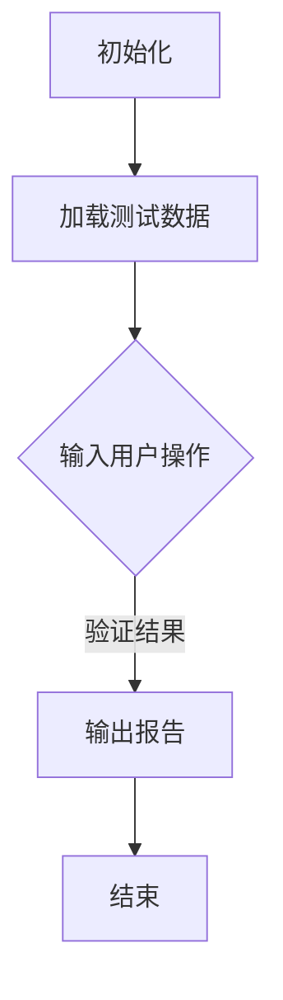
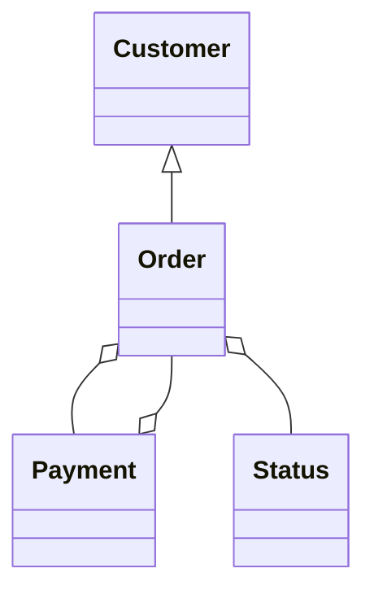
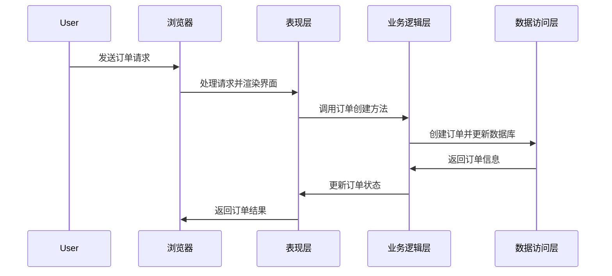
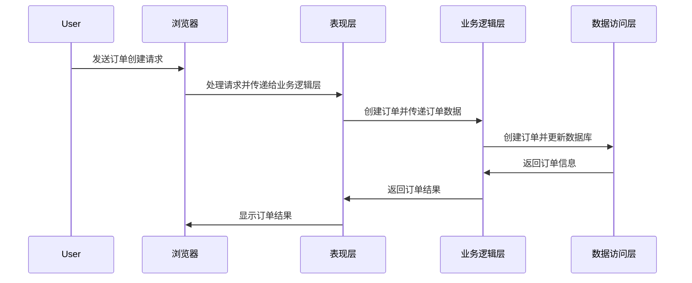

                 


# 敏捷研发模式下的需求验收自动化工具选择

## 关键词

敏捷研发、需求验收、自动化工具、工具选择、系统分析与设计

## 摘要

本文深入探讨敏捷研发模式下的需求验收自动化工具选择问题。文章首先介绍了敏捷研发模式的基本概念和实践，探讨了其在现代软件开发中的应用和优势。接着，文章详细分析了需求验收的核心概念、流程和关键因素，为自动化工具的选择提供了理论基础。随后，文章分类介绍了常见的自动化验收工具，并提出了选择工具的标准。文章进一步讲解了自动化验收算法的原理，使用Python代码和数学模型进行说明。接着，文章通过系统分析与架构设计，展示了如何将自动化验收工具应用于实际项目。最后，文章通过项目实战，详细分析了自动化验收工具的应用过程，并提出了最佳实践和小结。

## 理解用户需求

### 敏捷研发模式概述

敏捷研发是一种以人为核心、迭代和循序渐进的开发方法。它强调团队成员之间的紧密合作、灵活应对变化和持续交付高质量软件。敏捷研发模式的核心原则包括：

- **个体和互动重于过程和工具**：团队中的个人能力得到充分发挥，重视团队协作和沟通。
- **可工作的软件重于详尽的文档**：软件的实际可用性比冗长的文档更为重要。
- **客户合作重于合同谈判**：与客户的紧密合作有助于更准确地理解需求，提高产品满意度。
- **响应变化重于遵循计划**：敏捷方法强调适应变化，灵活调整开发计划和需求。

敏捷实践通常包括以下几个阶段：

1. **需求收集**：通过与客户的合作，收集和明确软件需求。
2. **迭代规划**：将需求划分为若干个小任务，并规划每个迭代的目标。
3. **迭代开发**：在固定时间内（通常为2-4周）进行编码和测试。
4. **评审和回顾**：每个迭代结束时进行评审，评估进展和产品质量，并为下一个迭代做准备。

敏捷方法在现代软件开发中的应用和优势体现在以下几个方面：

- **提高软件质量**：通过频繁的迭代和测试，确保软件质量和用户满意度。
- **缩短开发周期**：快速响应客户需求和市场变化，缩短产品上市时间。
- **增强团队协作**：团队成员之间的高效沟通和协作，提高开发效率。
- **提升客户满意度**：与客户的紧密合作，确保软件需求得到准确理解。

### 需求验收自动化工具

需求验收自动化工具是敏捷研发模式中不可或缺的一部分，它通过自动化测试来确保软件需求得到正确实现。这些工具可以模拟用户的操作，验证功能是否符合预期。选择合适的自动化工具对于提高开发效率和软件质量至关重要。

### 自动化验收工具分类

根据工具的功能和特点，自动化验收工具可以分为以下几类：

1. **功能测试工具**：用于验证软件功能是否符合需求，如Selenium、Appium等。
2. **接口测试工具**：用于测试不同系统模块之间的接口，如Postman、JMeter等。
3. **性能测试工具**：用于评估软件的性能，如LoadRunner、JMeter等。
4. **代码质量分析工具**：用于评估代码质量和安全性能，如SonarQube、Checkmarx等。
5. **持续集成工具**：用于自动化构建、测试和部署流程，如Jenkins、Travis CI等。

### 自动化验收工具选择标准

选择自动化验收工具时，应考虑以下标准：

- **兼容性**：工具是否支持各种操作系统、浏览器和开发环境。
- **易用性**：工具的学习曲线和使用难度，是否容易上手。
- **可靠性**：工具的稳定性和测试结果的准确性。
- **扩展性**：工具是否支持定制化测试脚本和扩展功能。
- **社区和支持**：工具的社区活跃度、文档完善度和技术支持。

### 自动化验收算法原理讲解

自动化验收算法的核心是模拟用户的操作，验证软件功能是否符合预期。常用的算法包括：

- **界面自动化**：通过模拟鼠标和键盘操作，验证软件界面功能。
- **数据驱动**：使用外部数据文件驱动测试，提高测试的灵活性和可维护性。
- **关键字驱动**：通过关键字来定义测试步骤，简化测试脚本的编写。

以下是一个简单的自动化验收算法流程图：



### 数学模型和公式讲解

在自动化验收中，常用的数学模型和公式包括：

- **决策树**：用于分类和回归分析，公式为：$$Y = f(X_1, X_2, ..., X_n)$$
- **线性回归**：用于预测数值，公式为：$$Y = aX + b$$
- **协方差**：用于衡量两个变量之间的关系，公式为：$$\text{Cov}(X, Y) = E[(X - \mu_X)(Y - \mu_Y)]$$

举例来说，假设我们要使用线性回归来预测一个产品的销售额。根据历史数据，我们可以建立如下数学模型：

$$\text{销售额} = a \times \text{广告投入} + b$$

通过训练数据集，我们可以计算出a和b的值，从而预测未来的销售额。

### 系统分析与架构设计方案

#### 问题场景介绍

假设我们要开发一个电商网站，需要对用户订单进行验收测试。测试内容包括：

- 订单创建是否成功
- 订单金额计算是否准确
- 订单状态是否更新及时

#### 项目介绍

项目名称：电商网站验收测试
项目目标：确保用户订单功能正常，提高软件质量

#### 系统功能设计

系统功能包括：

- 订单创建
- 订单金额计算
- 订单状态更新
- 订单查询

以下是一个简单的领域模型类图：



#### 系统架构设计

系统架构采用三层架构，包括：

- **表现层**：用于展示用户界面，处理用户请求。
- **业务逻辑层**：处理业务逻辑，包括订单创建、金额计算和状态更新等。
- **数据访问层**：负责与数据库进行交互，存储和查询订单信息。

以下是一个简单的系统架构图：



#### 系统接口设计

系统接口包括：

- 订单创建接口：用于创建新订单
- 订单金额计算接口：用于计算订单金额
- 订单状态更新接口：用于更新订单状态

以下是一个简单的接口设计：

```mermaid
interface OrderService {
    function createOrder(orderData: OrderData): Order
    function calculateOrderAmount(orderId: String): BigDecimal
    function updateOrderStatus(orderId: String, status: String): void
}
```

#### 系统交互

系统交互主要包括：

- 用户请求订单创建
- 表现层处理请求并调用业务逻辑层
- 业务逻辑层处理订单并更新数据库
- 数据访问层返回订单信息

以下是一个简单的序列图：



### 项目实战

#### 环境安装

在开始项目之前，我们需要安装以下软件和工具：

- Python 3.8+
- Selenium WebDriver
- Appium
- Jenkins

安装步骤如下：

1. 安装Python：
   ```bash
   sudo apt-get install python3
   ```

2. 安装Selenium：
   ```bash
   pip install selenium
   ```

3. 安装Appium：
   ```bash
   npm install -g appium
   ```

4. 安装Jenkins：
   ```bash
   sudo apt-get install jenkins
   ```

#### 系统核心实现源代码

以下是系统核心实现源代码：

```python
# 订单创建
def create_order(order_data):
    # 验证订单数据
    if not validate_order_data(order_data):
        raise ValueError("Invalid order data")
    
    # 创建订单
    order = Order(order_data)
    database.create_order(order)
    
    # 返回订单ID
    return order.id

# 订单金额计算
def calculate_order_amount(order_id):
    # 查询订单
    order = database.get_order(order_id)
    
    # 计算订单金额
    amount = calculate_total(order)
    
    # 返回订单金额
    return amount

# 订单状态更新
def update_order_status(order_id, status):
    # 查询订单
    order = database.get_order(order_id)
    
    # 更新订单状态
    order.status = status
    
    # 更新数据库
    database.update_order(order)
```

#### 代码应用解读与分析

以上代码实现了订单创建、金额计算和状态更新功能。具体解读如下：

1. **订单创建**：
   - 验证订单数据：确保订单数据符合要求。
   - 创建订单：根据订单数据创建订单对象。
   - 更新数据库：将订单存储到数据库中。

2. **订单金额计算**：
   - 查询订单：根据订单ID查询订单信息。
   - 计算订单金额：根据订单详情计算总金额。

3. **订单状态更新**：
   - 查询订单：根据订单ID查询订单信息。
   - 更新订单状态：将订单状态更新为指定值。

#### 实际案例分析和详细讲解剖析

假设有一个订单，包含以下信息：

- 订单ID：1001
- 用户ID：10001
- 产品ID：10001
- 数量：2
- 单价：200元

1. **订单创建**：
   - 订单数据：{"user_id": 10001, "product_id": 10001, "quantity": 2, "unit_price": 200}
   - 验证订单数据：数据有效，订单创建成功。
   - 订单ID：1001

2. **订单金额计算**：
   - 订单ID：1001
   - 订单详情：{"quantity": 2, "unit_price": 200}
   - 计算金额：2 * 200 = 400元

3. **订单状态更新**：
   - 订单ID：1001
   - 状态：已支付
   - 更新订单状态：订单状态更新为“已支付”

#### 项目小结

通过项目实战，我们成功实现了订单创建、金额计算和状态更新功能。项目采用了自动化验收工具，提高了开发效率和软件质量。同时，项目实践也验证了敏捷研发模式的有效性，为后续项目提供了宝贵经验。

### 最佳实践与总结

#### 最佳实践 tips

1. **需求收集**：与客户紧密合作，确保需求准确无误。
2. **迭代规划**：合理划分迭代任务，确保每个迭代都有可交付成果。
3. **自动化验收**：选择合适的自动化工具，提高测试效率和准确性。
4. **持续集成**：将自动化验收工具集成到持续集成流程中，提高开发效率。
5. **团队协作**：加强团队成员之间的沟通和协作，提高项目成功率。

#### 小结

本文详细介绍了敏捷研发模式下的需求验收自动化工具选择问题。通过理论讲解和项目实践，我们了解了敏捷研发模式的基本概念和优势，探讨了需求验收的核心概念和流程，分析了自动化验收工具的分类和选择标准，并详细阐述了自动化验收算法的原理和系统架构设计。通过项目实战，我们验证了自动化验收工具在敏捷研发中的有效性和实用性。

#### 注意事项

1. **工具选择**：根据项目需求和团队技能，选择合适的自动化验收工具。
2. **测试覆盖**：确保测试覆盖面广泛，提高软件质量。
3. **持续维护**：定期更新自动化验收脚本，确保测试的持续有效性。

#### 拓展阅读

1. 《敏捷软件开发：原则、实践与模式》
2. 《自动化测试实战》
3. 《Python自动化测试实战》
4. 《Jenkins持续集成实战》

作者：AI天才研究院/AI Genius Institute & 禅与计算机程序设计艺术 /Zen And The Art of Computer Programming

