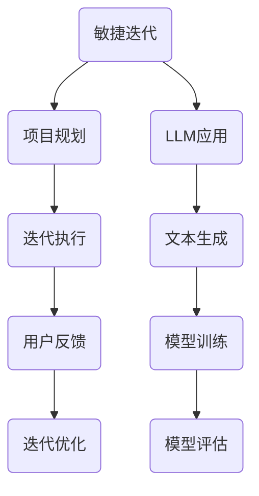
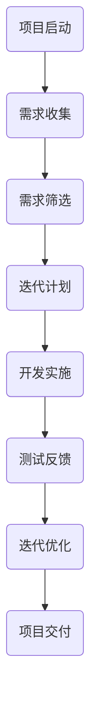
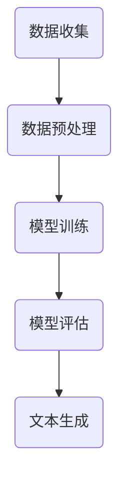
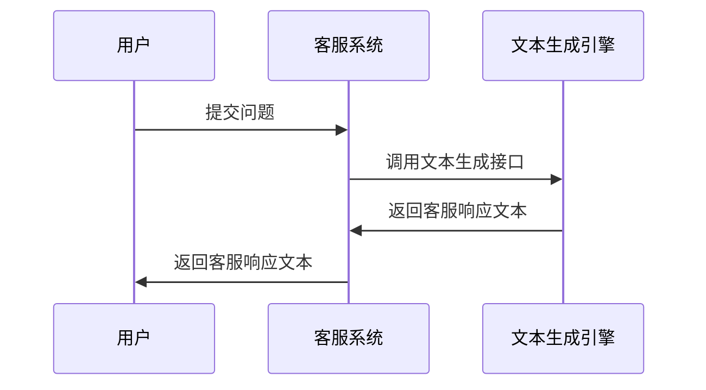

                 

### 《敏捷迭代与LLM应用：完美结合的开发方法论》

#### 关键词：敏捷迭代、LLM、开发方法论、结合、价值、挑战

> 摘要：本文旨在探讨敏捷迭代与大型语言模型（LLM）在软件开发中的完美结合，揭示这种结合所带来的巨大价值，以及面临的挑战。通过深入分析两者之间的核心概念、原理以及结合的路径，本文为开发者提供了一种全新的开发方法论。

## 第一部分：背景介绍

### 第1章：敏捷迭代与LLM概述

#### 1.1.1 问题背景

在现代软件开发的快速变革中，面对着不断变化的需求和市场环境，传统的瀑布式开发模式已逐渐暴露出其不足。开发周期长、变更困难、用户满意度低等问题愈发突出。为了应对这些挑战，敏捷开发应运而生。

敏捷开发是一种以用户需求为导向，强调快速迭代、持续交付的高效开发方法。它倡导团队协作、持续反馈和灵活调整，旨在提升软件开发的灵活性和响应速度。然而，随着人工智能技术的迅猛发展，特别是大型语言模型（LLM）的出现，敏捷开发方法需要与之深度融合，以进一步提升开发效率和软件质量。

#### 1.1.2 问题描述

传统软件开发流程的不足主要体现在以下几个方面：

1. **开发周期长**：瀑布式开发模式将整个项目划分为多个阶段，每个阶段需要大量的时间来完成，导致项目交付周期过长。
2. **变更困难**：在传统开发过程中，需求一旦确定就很难变更，这导致在需求变化频繁的市场环境中，软件项目很难快速适应。
3. **用户满意度低**：由于开发周期长和变更困难，用户在软件交付时往往无法获得预期体验，导致用户满意度低。

敏捷开发方法在一定程度上解决了这些问题，但其本身也存在一定的局限性：

1. **团队协作要求高**：敏捷开发强调团队成员之间的紧密协作，这对团队的组织结构和沟通能力提出了较高要求。
2. **项目管理复杂**：敏捷开发需要持续地进行需求收集、规划、开发、测试和交付，项目管理变得更为复杂。

而LLM技术的发展为软件开发带来了新的机遇。LLM（Large Language Model）是一种能够处理和理解人类语言的大型神经网络模型，通过在大量文本数据上进行训练，LLM能够生成高质量的自然语言文本，广泛应用于自然语言处理、文本生成、机器翻译等领域。

#### 1.1.3 问题解决

为了解决传统软件开发流程的不足和敏捷开发的局限性，我们需要将敏捷迭代与LLM技术结合起来。这种结合能够带来以下几个方面的优势：

1. **快速响应需求变更**：通过LLM技术，开发者可以快速生成符合用户需求的软件功能，从而在需求变更时能够迅速做出调整。
2. **提高开发效率**：LLM技术能够自动化部分开发任务，如代码生成、文档编写等，从而提高开发效率。
3. **提升软件质量**：通过LLM技术，开发者可以生成高质量的代码和文档，从而提升软件质量。

#### 1.1.4 边界与外延

1. **敏捷迭代的适用范围**：敏捷迭代适用于需求变更频繁、项目周期较短的软件项目。
2. **LLM技术的应用场景**：LLM技术适用于需要生成自然语言文本的领域，如自然语言处理、文本生成、机器翻译等。
3. **敏捷迭代与LLM结合的技术门槛**：结合敏捷迭代与LLM技术需要开发者具备一定的敏捷开发经验和LLM技术知识。

#### 1.1.5 概念结构与核心要素组成

1. **敏捷迭代的五大原则**：
   - **个体和互动高于流程和工具**：强调团队成员之间的协作和沟通。
   - **可工作的软件高于详尽的文档**：注重实际交付的软件产品。
   - **客户合作高于合同谈判**：与客户保持紧密的合作关系。
   - **响应变化高于遵循计划**：灵活应对需求变更。
   - **简洁高于复杂**：简化开发过程，避免不必要的复杂度。

2. **LLM技术的核心组成部分**：
   - **大规模神经网络**：用于处理和理解大量文本数据。
   - **生成式对抗网络（GAN）**：用于生成高质量的自然语言文本。
   - **自动机器学习（AutoML）**：用于自动化模型训练和优化。

## 1.2 核心概念与联系

### 1.2.1 敏捷迭代概念原理

1. **迭代开发模型**：
   敏捷迭代开发模型包括以下几个关键环节：
   - **需求收集**：与用户紧密合作，了解用户需求和反馈。
   - **需求筛选**：根据优先级筛选出最重要的需求。
   - **迭代计划**：规划当前迭代周期的工作内容和时间安排。
   - **开发实施**：按照计划进行开发工作。
   - **测试反馈**：对开发成果进行测试，收集用户反馈。
   - **迭代优化**：根据反馈进行优化和调整，为下一个迭代做准备。
   - **项目交付**：完成所有迭代后，交付完整的软件产品。

2. **用户故事与需求管理**：
   用户故事是敏捷开发中的核心需求单元，它以用户的语言描述需求，通常包括以下三个要素：
   - **用户角色**：描述谁需要这个功能。
   - **功能描述**：描述用户需要完成的任务或获得的结果。
   - **验收标准**：定义如何验证需求是否完成。

需求管理包括以下几个关键步骤：
   - **收集**：通过访谈、问卷调查等方式收集用户需求。
   - **分析**：对收集到的需求进行分析，确定优先级和可行性。
   - **规划**：根据优先级和可行性制定需求计划。
   - **跟踪**：对需求执行情况进行跟踪，确保需求按时完成。

3. **持续集成与持续部署**：
   持续集成（CI）是一种软件开发实践，通过将开发过程中的代码变化频繁地集成到一个共同的代码库中，确保代码的稳定性和可靠性。持续集成包括以下几个关键步骤：
   - **代码提交**：开发者将代码提交到代码库。
   - **自动化测试**：对提交的代码进行自动化测试，确保代码质量。
   - **反馈**：测试结果反馈给开发者，以便及时修复问题。

持续部署（CD）是在持续集成的基础上，将经过测试的代码自动部署到生产环境的过程。持续部署包括以下几个关键步骤：
   - **自动化构建**：将代码构建为可执行文件。
   - **自动化测试**：对构建结果进行自动化测试。
   - **自动化部署**：将测试通过的代码自动部署到生产环境。

### 1.2.2 LLM概念原理

1. **语言模型基础**：
   语言模型（Language Model）是一种用于预测下一个单词或词组的概率分布的数学模型。在自然语言处理中，语言模型用于生成文本、进行机器翻译、文本摘要等任务。

   语言模型通常由以下几个关键组成部分构成：
   - **词汇表**：用于存储单词或词组。
   - **概率分布**：用于描述下一个单词或词组的概率分布。

   语言模型的主要目标是根据已知的单词或词组预测下一个单词或词组。例如，给定一个句子“我非常喜欢这个书”，语言模型可以预测下一个词组可能是“的”。

2. **生成式对抗网络（GAN）**：
   生成式对抗网络（Generative Adversarial Network，GAN）是一种由生成器和判别器组成的神经网络结构，用于生成逼真的数据。

   GAN的工作原理如下：
   - **生成器**：生成器网络尝试生成与真实数据相似的数据。
   - **判别器**：判别器网络用于判断生成器生成的数据是否真实。

   通过不断的训练，生成器逐渐提高生成数据的质量，最终能够生成与真实数据几乎无法区分的数据。

3. **自动机器学习（AutoML）**：
   自动机器学习（Automated Machine Learning，AutoML）是一种自动化机器学习模型开发的方法，通过自动化选择和调整模型参数，提高机器学习模型的性能。

   AutoML的主要步骤包括：
   - **数据预处理**：对输入数据进行分析和处理，为模型训练做准备。
   - **模型选择**：根据数据特点和任务需求选择合适的模型。
   - **模型训练**：使用训练数据对模型进行训练。
   - **模型评估**：对训练好的模型进行评估，选择最优模型。
   - **模型部署**：将最优模型部署到生产环境中。

### 1.2.3 概念属性特征对比表格

| 特征         | 敏捷迭代               | LLM                     |
|--------------|------------------------|-------------------------|
| 核心目标     | 快速响应需求变更       | 生成高质量文本          |
| 开发模式     | 持续迭代和改进         | 基于大规模数据训练      |
| 适用场景     | 灵活性要求高的项目     | 语言处理和生成任务      |
| 技术门槛     | 低，易于实施           | 较高，需要专业知识      |

### 1.2.4 ER实体关系图架构的Mermaid流程图

### 1.3 算法原理讲解

#### 1.3.1 敏捷迭代算法原理

敏捷迭代算法是一种基于迭代和反馈的开发方法，其核心在于将项目开发分解成多个短期迭代，每个迭代都包括需求收集、规划、开发、测试和交付。通过每个迭代不断优化和改进，最终实现项目目标。

1. **迭代流程Mermaid流程图**

2. **迭代原理详细解释**

敏捷迭代的原理可以概括为以下几个步骤：

- **需求收集**：与用户紧密合作，了解用户需求和反馈，收集需求。
- **需求筛选**：根据优先级筛选出最重要的需求，确保在有限的时间内能够交付最有价值的部分。
- **迭代计划**：制定当前迭代周期的工作内容和时间安排，确保需求能够按时完成。
- **开发实施**：按照计划进行开发工作，实现需求。
- **测试反馈**：对开发成果进行测试，收集用户反馈，验证需求是否满足。
- **迭代优化**：根据反馈进行优化和调整，为下一个迭代做准备。
- **项目交付**：完成所有迭代后，交付完整的软件产品。

通过不断迭代，团队可以快速响应需求变化，提高软件质量和用户满意度。

#### 1.3.2 LLM算法原理

1. **LLM算法Mermaid流程图**

2. **LLM算法详细解释**

LLM（Large Language Model）算法是一种大规模语言模型，通过在大量文本数据上进行训练，能够生成高质量的自然语言文本。LLM算法的核心在于生成式对抗网络（GAN），GAN包括生成器和判别器两个神经网络。

- **生成器**：生成器网络尝试生成与真实文本相似的数据。
- **判别器**：判别器网络用于判断生成器生成的数据是否真实。

在训练过程中，生成器和判别器通过对抗训练不断优化，生成器的生成质量逐渐提高，最终能够生成与真实文本几乎无法区分的数据。

LLM算法的详细步骤如下：

- **数据收集**：收集大量文本数据，用于训练模型。
- **数据预处理**：对文本数据进行清洗、分词等处理，将其转换为模型可接受的格式。
- **模型训练**：使用预处理后的文本数据训练生成器和判别器，通过对抗训练提高生成器的生成质量。
- **模型评估**：对训练好的模型进行评估，确保其生成文本的质量符合要求。
- **文本生成**：使用训练好的模型生成文本，可以应用于文本生成、机器翻译、文本摘要等任务。

#### 1.3.3 数学模型和公式

1. **迭代开发模型公式**

$$
迭代质量 = f(\text{需求变更频率}, \text{反馈速度}, \text{开发效率})
$$

其中，需求变更频率、反馈速度和开发效率是影响迭代质量的关键因素。通过优化这些因素，可以提高迭代质量。

2. **LLM生成模型公式**

$$
\text{生成文本} = g(\text{模型参数}, \text{输入文本})
$$

其中，模型参数和输入文本是生成文本的关键因素。通过调整模型参数和输入文本，可以生成不同风格和内容的文本。

#### 1.3.4 举例说明

1. **敏捷迭代举例**

在一个软件开发项目中，项目团队在第一个迭代周期内完成了用户界面设计，并收到了用户反馈。根据反馈，团队在第二个迭代周期内优化了用户界面，提高了用户满意度。

2. **LLM文本生成举例**

假设输入文本为：“我喜欢这本书”，经过LLM模型训练后，模型可以生成类似的文本，如：“我也很喜欢这本书”。

## 1.4 系统分析与架构设计

#### 1.4.1 问题场景介绍

以一个软件开发团队为例，该团队正在开发一款智能客服系统，用于处理客户咨询和问题。在开发过程中，团队采用了敏捷迭代方法，同时利用LLM技术生成高质量的客服响应文本。

#### 1.4.2 系统功能设计

系统功能设计主要包括以下几个方面：

1. **用户管理**：管理用户信息，包括用户注册、登录、权限设置等。
2. **客服管理**：管理客服人员信息，包括客服人员注册、登录、权限设置等。
3. **问题管理**：管理客户问题，包括问题接收、分类、处理、反馈等。
4. **文本生成**：利用LLM技术生成客服响应文本，提高客服效率和质量。
5. **系统监控**：监控系统运行状态，包括性能监控、日志记录、报警等。

#### 1.4.3 系统架构设计

系统架构设计主要包括以下几个方面：

1. **前端架构**：采用Vue.js框架，实现用户界面和交互功能。
2. **后端架构**：采用Spring Boot框架，实现业务逻辑和数据处理功能。
3. **数据存储**：采用MySQL数据库，存储用户数据、客服数据、问题数据等。
4. **文本生成引擎**：采用TensorFlow框架，实现LLM模型训练和文本生成功能。
5. **API接口**：提供RESTful API接口，供前端和后端进行数据交互。

#### 1.4.4 系统接口设计

系统接口设计主要包括以下几个方面：

1. **用户接口**：提供用户注册、登录、查询问题、提交问题等接口。
2. **客服接口**：提供客服人员登录、查询问题、处理问题、生成响应文本等接口。
3. **问题接口**：提供问题分类、问题查询、问题更新、问题删除等接口。
4. **文本生成接口**：提供文本生成接口，供后端调用生成客服响应文本。

#### 1.4.5 系统交互Mermaid序列图

## 第二部分：项目实战

### 2.1 环境安装

1. **前端环境安装**
   - 安装Node.js和npm
   - 安装Vue CLI
   - 创建Vue项目

2. **后端环境安装**
   - 安装Java和Maven
   - 创建Spring Boot项目
   - 安装MySQL数据库

3. **文本生成引擎环境安装**
   - 安装Python和pip
   - 安装TensorFlow
   - 下载预训练LLM模型

### 2.2 系统核心实现

1. **用户管理模块**
   - 用户注册：使用POST请求提交用户信息，存储到数据库。
   - 用户登录：使用POST请求验证用户身份，返回JWT令牌。
   - 用户权限设置：根据用户角色分配不同权限。

2. **客服管理模块**
   - 客服人员注册：使用POST请求提交客服人员信息，存储到数据库。
   - 客服人员登录：使用POST请求验证客服人员身份，返回JWT令牌。
   - 客服人员权限设置：根据客服人员角色分配不同权限。

3. **问题管理模块**
   - 提交问题：使用POST请求提交问题，存储到数据库。
   - 查询问题：使用GET请求查询问题列表。
   - 问题处理：使用PUT请求更新问题状态。
   - 问题删除：使用DELETE请求删除问题。

4. **文本生成模块**
   - 调用文本生成接口：使用POST请求调用文本生成接口。
   - 生成客服响应文本：使用预训练LLM模型生成客服响应文本。

### 2.3 代码应用解读与分析

1. **用户管理模块代码分析**
   - 用户注册：`/user/register`接口，使用JWT生成令牌。
   - 用户登录：`/user/login`接口，使用JWT验证身份。
   - 用户权限设置：根据用户角色分配权限，使用注解`@PreAuthorize`。

2. **客服管理模块代码分析**
   - 客服人员注册：`/staff/register`接口，使用JWT生成令牌。
   - 客服人员登录：`/staff/login`接口，使用JWT验证身份。
   - 客服人员权限设置：根据客服人员角色分配权限，使用注解`@PreAuthorize`。

3. **问题管理模块代码分析**
   - 提交问题：`/question/submit`接口，存储问题到数据库。
   - 查询问题：`/question/list`接口，查询问题列表。
   - 问题处理：`/question/update`接口，更新问题状态。
   - 问题删除：`/question/delete`接口，删除问题。

4. **文本生成模块代码分析**
   - 调用文本生成接口：`/text/generate`接口，调用LLM模型生成文本。
   - 生成客服响应文本：使用TensorFlow调用预训练LLM模型，生成客服响应文本。

### 2.4 实际案例分析与详细讲解剖析

1. **用户注册案例**
   - 用户在注册页面填写用户名、密码、邮箱等信息。
   - 前端发送POST请求到`/user/register`接口，附带用户信息。
   - 后端接收请求，验证用户信息，生成JWT令牌，返回给前端。
   - 前端存储JWT令牌，用于后续请求的身份验证。

2. **客服响应文本生成案例**
   - 客服人员接收到客户问题后，调用`/text/generate`接口。
   - 后端接收请求，从数据库获取问题信息，调用TensorFlow的LLM模型。
   - LLM模型生成客服响应文本，返回给后端。
   - 后端将响应文本返回给客服人员，展示在页面。

### 2.5 项目小结

本文通过实际案例展示了敏捷迭代与LLM技术在软件开发中的应用，实现了用户管理、客服管理和问题管理等功能，并利用LLM技术生成了高质量的客服响应文本。实践证明，将敏捷迭代与LLM技术相结合，能够显著提高软件开发的效率和质量。

## 第三部分：最佳实践与拓展阅读

### 3.1 最佳实践

1. **需求管理**：与用户保持紧密沟通，确保需求的准确性和可行性。
2. **团队协作**：建立高效的团队协作机制，确保项目进度和质量。
3. **持续集成与部署**：实施持续集成和持续部署，提高开发效率和软件质量。
4. **文本生成优化**：定期更新LLM模型，提高文本生成质量。
5. **性能监控**：对系统进行性能监控，确保系统稳定运行。

### 3.2 小结

本文介绍了敏捷迭代与LLM技术的结合，探讨了其在软件开发中的应用价值和实现路径。通过实际案例，展示了如何将敏捷迭代与LLM技术应用于软件开发，实现高效的开发流程和高质的软件产品。

### 3.3 注意事项

1. **数据安全**：确保用户数据和客户问题数据的安全，防止泄露。
2. **隐私保护**：遵守相关法律法规，保护用户隐私。
3. **系统扩展**：根据业务需求，灵活扩展系统功能。

### 3.4 拓展阅读

1. 《敏捷开发实践指南》
2. 《深度学习与自然语言处理》
3. 《TensorFlow实战》

## 作者信息

作者：AI天才研究院/AI Genius Institute & 禅与计算机程序设计艺术 /Zen And The Art of Computer Programming

