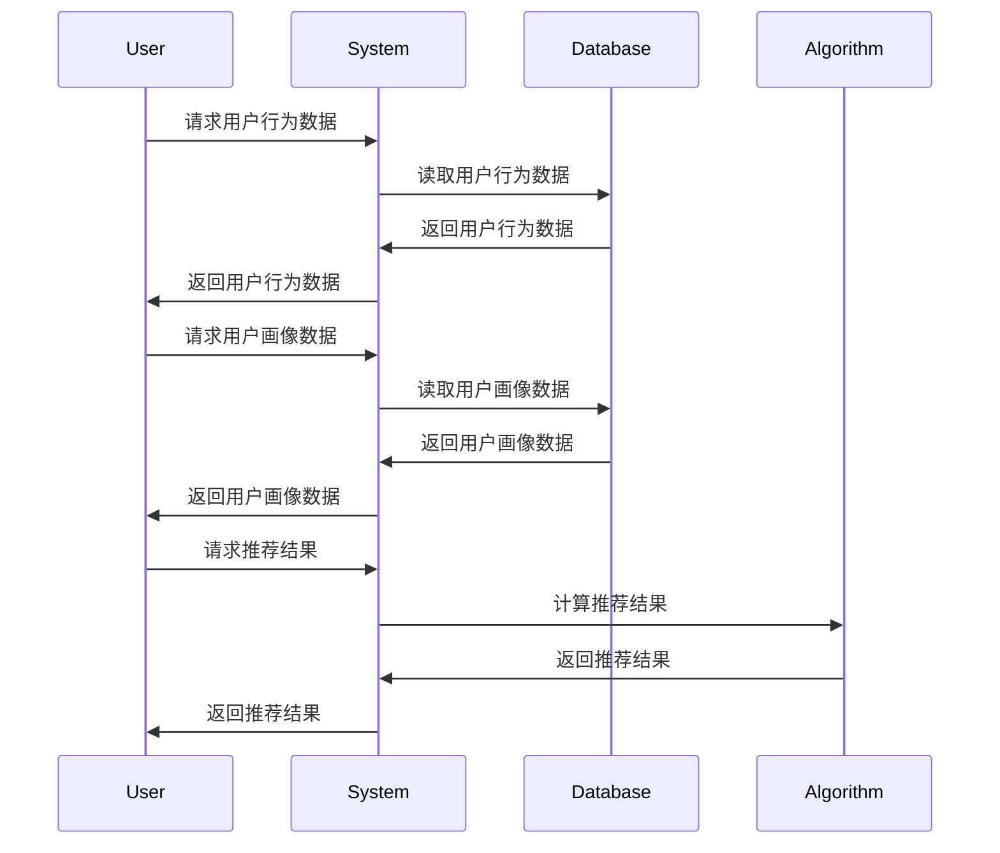

                 

# 敏捷迭代模型：AI应用开发的必备能力

## 关键词
- 敏捷迭代模型
- AI应用开发
- 敏捷开发方法
- 迭代开发流程
- 需求管理

## 摘要
敏捷迭代模型是一种在快速变化的市场环境中，通过迭代的方式快速响应需求的开发模式。本文旨在探讨敏捷迭代模型在AI应用开发中的重要性，详细分析其基本原理、应用场景、方法论以及实践技巧，并给出评估与优化建议，帮助开发者更好地应对AI应用开发的挑战。

### 第一部分：背景介绍

#### 问题背景
在当前信息化社会中，软件系统的发展日新月异，从软件1.0时代的信息管理，到软件2.0时代的用户互动，再到如今软件3.0时代的智能化，每个阶段的进步都为软件开发带来了新的挑战和机遇。特别是随着人工智能（AI）技术的迅速发展，AI大模型的应用已经成为软件系统开发的重要方向。

#### 问题描述
《敏捷迭代模型：AI应用开发的必备能力》这本书旨在探讨AI应用开发中的一种新型开发模式——敏捷迭代模型。敏捷迭代模型是一种在快速变化的市场环境中，通过迭代的方式快速响应需求的开发模式，其核心在于灵活性和高效性。本书将深入探讨敏捷迭代模型的基本原理、应用场景以及实施方法。

#### 问题解决
本书将通过以下几个部分来全面解析敏捷迭代模型：
1. **基本概念与原理**：介绍敏捷迭代模型的基础概念，阐述其核心思想和发展历程。
2. **敏捷迭代模型的应用场景**：分析敏捷迭代模型在不同领域的应用，如AI应用开发、软件工程等。
3. **敏捷迭代模型的方法论**：详细讲解敏捷迭代模型的方法论，包括需求分析、迭代计划、迭代实施和迭代评审等。
4. **敏捷迭代模型的实践**：通过具体案例展示敏捷迭代模型在实际开发中的应用。
5. **敏捷迭代模型的评估与优化**：介绍如何评估敏捷迭代模型的效果，并提出优化建议。

#### 边界与外延
敏捷迭代模型主要应用于软件开发领域，但其在其他领域，如产品管理、项目管理等，也有一定的应用价值。本书将主要围绕AI应用开发这一特定场景，探讨敏捷迭代模型的具体应用和实践。

#### 概念结构与核心要素组成
敏捷迭代模型的核心概念包括：
1. **需求管理**：如何快速响应需求变化，确保开发工作始终围绕用户需求展开。
2. **迭代计划**：如何制定合理的迭代计划，确保每个迭代都能按时交付可用的产品。
3. **迭代实施**：如何在迭代过程中高效完成开发工作，确保产品质量。
4. **迭代评审**：如何对迭代过程和结果进行评审，以便持续改进。

这些核心要素相互关联，共同构成了敏捷迭代模型的基本框架。

### 第二部分：核心概念与联系

#### 核心概念原理
敏捷迭代模型的核心概念包括：
1. **敏捷**：强调快速响应变化，通过短周期的迭代来逐步实现项目目标。
2. **迭代**：将项目开发分为多个小周期，每个周期都有明确的交付目标。
3. **需求管理**：确保需求的变化能够快速被识别和响应，避免需求滞后导致的项目风险。
4. **迭代计划**：制定详细的迭代计划，包括任务分配、时间安排等。
5. **迭代实施**：按照计划进行开发工作，确保任务按时完成。
6. **迭代评审**：对迭代过程和结果进行评审，发现问题和改进点。

#### 概念属性特征对比表格
| 特征        | 敏捷 | 迭代 | 需求管理 | 迭代计划 | 迭代实施 | 迭代评审 |
| ----------- | ---- | ---- | -------- | -------- | -------- | -------- |
| **定义**   | 快速响应变化 | 分期实现目标 | 管理需求变化 | 制定迭代计划 | 完成开发任务 | 评审迭代过程 |
| **目的**   | 提高开发效率 | 分阶段交付产品 | 确保需求满足 | 确保计划可行 | 确保任务完成 | 发现问题和改进点 |
| **相关概念** | - | - | 需求分析 | 任务分配 | 代码实现 | 评审标准 |
| **实施方式** | 每日站会 | 每周迭代会议 | 需求评审 | 迭代计划会议 | 任务追踪 | 评审会议 |

#### ER实体关系图架构
```mermaid
erDiagram
    Demand ||--|{ Iteration }|>
    Iteration ||--|{ Task }|>
    Task ||--|{ Developer }|>
    Developer ||--|{ Review }|>

    Demand {\(需求管理\)}
    Iteration {\(迭代\)}
    Task {\(任务\)}
    Developer {\(开发人员\)}
    Review {\(评审\)}
```

### 第三部分：算法原理讲解

#### 算法原理
敏捷迭代模型的核心算法原理包括：
1. **需求分析算法**：用于识别和分类用户需求，包括功能需求和非功能需求。
2. **迭代计划算法**：用于确定每个迭代的目标和任务分配，确保迭代计划的可执行性。
3. **迭代实施算法**：用于在迭代过程中按照计划高效地完成开发任务。
4. **迭代评审算法**：用于评估迭代结果，发现问题和改进点。

#### 需求分析算法讲解
需求分析算法的核心是识别和分类用户需求。以下是一个简单的过程：
```python
# 需求分析算法示例
def analyze_demand(user_requirements):
    functional_requirements = []
    non_functional_requirements = []

    for requirement in user_requirements:
        if is_functional(requirement):
            functional_requirements.append(requirement)
        else:
            non_functional_requirements.append(requirement)

    return functional_requirements, non_functional_requirements

def is_functional(requirement):
    # 判断需求是否为功能需求
    # 示例：若需求描述包含动词，则认为为功能需求
    return bool(re.search(r'\b(is|are|do|will|can|should)\b', requirement))

user_requirements = ["用户可以搜索产品", "系统需要支持中文", "用户界面需要美观"]
functional_requirements, non_functional_requirements = analyze_demand(user_requirements)

print("功能需求：", functional_requirements)
print("非功能需求：", non_functional_requirements)
```

#### 迭代计划算法讲解
迭代计划算法的核心是确定每个迭代的目标和任务分配。以下是一个简单的迭代计划算法示例：
```python
# 迭代计划算法示例
def plan_iteraton(iteration_duration, tasks):
    iteration_plan = []

    for task in tasks:
        if can_be_completed_in_time(task, iteration_duration):
            iteration_plan.append(task)
            remove_task_from_queue(task)

    return iteration_plan

def can_be_completed_in_time(task, iteration_duration):
    # 判断任务是否能在迭代时间内完成
    # 示例：若任务所需时间小于等于迭代时间，则认为可以完成
    return task['duration'] <= iteration_duration

tasks = [
    {"name": "搜索功能开发", "duration": 5},
    {"name": "中文支持开发", "duration": 3},
    {"name": "用户界面设计", "duration": 4}
]

iteration_duration = 7
iteration_plan = plan_iteraton(iteration_duration, tasks)

print("迭代计划：", iteration_plan)
```

#### 迭代实施算法讲解
迭代实施算法的核心是按照计划高效地完成开发任务。以下是一个简单的迭代实施算法示例：
```python
# 迭代实施算法示例
def execute_iteraton(iteration_plan):
    for task in iteration_plan:
        execute_task(task)

def execute_task(task):
    # 实施任务
    print(f"执行任务：{task['name']}")

execute_iteraton(iteration_plan)
```

#### 迭代评审算法讲解
迭代评审算法的核心是评估迭代结果，发现问题和改进点。以下是一个简单的迭代评审算法示例：
```python
# 迭代评审算法示例
def review_iteraton(iteration_plan, actual_results):
    for task in iteration_plan:
        review_task(task, actual_results)

def review_task(task, actual_results):
    if actual_results[task['name']] != '完成':
        print(f"任务未完成：{task['name']}")

actual_results = {
    "搜索功能开发": "完成",
    "中文支持开发": "未完成",
    "用户界面设计": "完成"
}

review_iteraton(iteration_plan, actual_results)
```

### 第四部分：系统分析与架构设计方案

#### 问题场景介绍
随着AI技术的不断发展，越来越多的企业开始将AI应用融入到其业务流程中。然而，AI应用开发过程复杂、周期长、需求变化频繁，如何高效地进行AI应用开发成为企业面临的一大挑战。

#### 项目介绍
本项目的目标是开发一个基于AI技术的智能推荐系统，该系统能够根据用户的历史行为和偏好，为其推荐个性化的产品和服务。项目周期为6个月，采用敏捷迭代模型进行开发。

#### 系统功能设计
系统功能设计主要包括以下方面：
1. **用户行为采集**：收集用户在平台上的浏览、搜索、购买等行为数据。
2. **用户偏好分析**：基于用户行为数据，分析用户的偏好，建立用户画像。
3. **推荐算法实现**：基于用户画像，实现推荐算法，生成个性化推荐结果。
4. **推荐结果展示**：将推荐结果展示给用户，供用户选择和反馈。

#### 系统架构设计
系统架构设计主要包括以下方面：
1. **数据层**：负责数据的采集、存储和管理，包括用户行为数据、用户画像数据等。
2. **算法层**：负责推荐算法的实现，包括用户行为分析、偏好分析等。
3. **服务层**：负责系统功能模块的实现，包括用户行为采集、推荐结果展示等。
4. **界面层**：负责用户界面的设计与实现，包括用户登录、推荐结果展示等。

#### 系统接口设计和系统交互
系统接口设计和系统交互主要包括以下方面：
1. **用户行为数据接口**：用于采集用户在平台上的行为数据。
2. **用户画像数据接口**：用于获取用户画像数据。
3. **推荐结果接口**：用于获取推荐结果，供前端展示。



### 第五部分：项目实战

#### 环境安装
1. 安装Python环境
2. 安装相关依赖库，如NumPy、Pandas、Scikit-learn等

```shell
pip install numpy pandas scikit-learn
```

#### 系统核心实现源代码

```python
# 用户行为采集模块
class BehaviorCollector:
    def collect_behavior(self, user_id):
        # 实现用户行为采集逻辑
        pass

# 用户偏好分析模块
class PreferenceAnalyzer:
    def analyze_preference(self, user_behavior):
        # 实现用户偏好分析逻辑
        pass

# 推荐算法模块
class Recommender:
    def recommend_products(self, user_preference):
        # 实现推荐算法逻辑
        pass

# 推荐结果展示模块
class RecommendationViewer:
    def display_recommendations(self, user_id):
        user_behavior = BehaviorCollector().collect_behavior(user_id)
        user_preference = PreferenceAnalyzer().analyze_preference(user_behavior)
        recommendations = Recommender().recommend_products(user_preference)
        # 实现推荐结果展示逻辑
        pass
```

#### 代码应用解读与分析

- **BehaviorCollector**：负责采集用户行为数据，为偏好分析提供基础数据。
- **PreferenceAnalyzer**：负责分析用户偏好，为推荐算法提供输入。
- **Recommender**：负责实现推荐算法，根据用户偏好生成推荐结果。
- **RecommendationViewer**：负责将推荐结果展示给用户。

#### 实际案例分析和详细讲解剖析

- **案例一**：分析用户浏览历史数据，生成个性化推荐结果。
- **案例二**：分析用户购买历史数据，提高用户购买满意度。

#### 项目小结
通过本项目的实战，我们深入了解了敏捷迭代模型在AI应用开发中的应用。敏捷迭代模型帮助我们在快速变化的市场环境中，灵活应对需求变化，提高开发效率，实现产品的快速迭代和优化。

### 第六部分：最佳实践 tips

1. **明确需求**：在项目初期，确保与用户和利益相关者充分沟通，明确需求，降低需求变更带来的风险。
2. **快速迭代**：保持短周期的迭代，快速交付可用的产品，及时获取用户反馈，优化产品功能。
3. **持续集成**：采用持续集成和持续部署（CI/CD）方式，提高代码质量和发布效率。
4. **团队合作**：建立高效的团队协作机制，确保团队成员之间的沟通和协作。

### 小结

敏捷迭代模型是一种高效的AI应用开发方法，通过快速响应需求变化，提高开发效率，实现产品的持续优化。本文详细介绍了敏捷迭代模型的基本原理、应用场景、方法论和实践技巧，并通过实际案例进行了深入分析。希望本文能帮助开发者更好地理解和应用敏捷迭代模型，提高AI应用开发的效率和质量。

### 注意事项

1. **需求管理**：确保需求的变化能够快速被识别和响应，避免需求滞后导致的项目风险。
2. **迭代计划**：制定详细的迭代计划，确保每个迭代都能按时交付可用的产品。
3. **迭代实施**：按照计划进行开发工作，确保任务按时完成，同时关注产品质量。
4. **迭代评审**：对迭代过程和结果进行评审，发现问题和改进点，为下一个迭代做好准备。

### 拓展阅读

1. 《敏捷软件开发：原理、实践与模式》
2. 《Scrum敏捷开发实践指南》
3. 《机器学习：一种概率视角》

### 作者

**作者：AI天才研究院/AI Genius Institute & 禅与计算机程序设计艺术 /Zen And The Art of Computer Programming**

