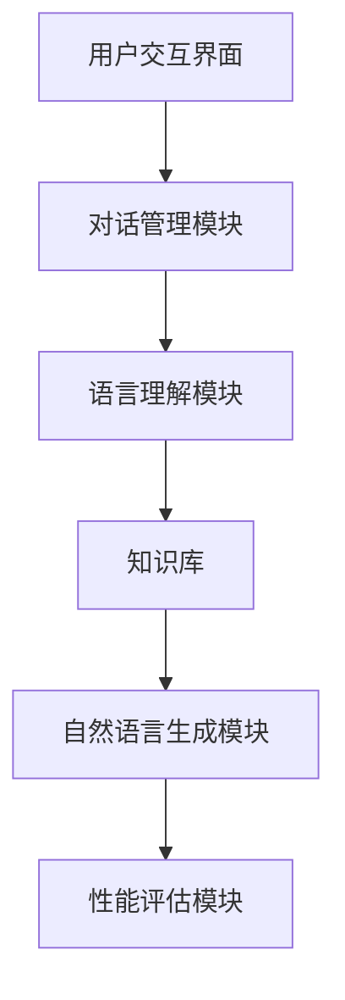

                 

### 敏捷项目启动会：为LLM应用开发奠定正确基调

#### 关键词：敏捷开发、项目启动会、LLM应用、开发基调、最佳实践

> 摘要：本文深入探讨了敏捷项目启动会在LLM（大型语言模型）应用开发中的重要性。通过详细分析敏捷开发的起源、核心原则和项目启动会的流程，本文解释了为何敏捷项目启动会对于LLM项目成功至关重要。本文还将剖析LLM的基本原理、数学模型和训练过程，结合实际案例，展示如何在敏捷项目启动会上制定和实施正确的开发基调。此外，本文提供了项目实战经验、最佳实践建议以及注意事项，以帮助开发者们更有效地推进LLM应用项目。

## 目录大纲设计思路

在设计《敏捷项目启动会：为LLM应用开发奠定正确基调》这本书的目录大纲时，我们首先明确了书的整体结构和内容安排。书的主题是围绕敏捷项目启动会及其在LLM应用开发中的作用展开，因此目录设计应充分体现以下几点：

1. **背景介绍**：介绍敏捷项目启动会的重要性以及为什么LLM应用开发需要正确的启动基调。
2. **核心概念与联系**：明确书中涉及的主要概念，如敏捷、项目启动会、LLM等，并解释它们之间的关联。
3. **算法原理讲解**：对LLM的基本原理进行详细阐述，包括模型结构、训练过程等。
4. **数学模型和数学公式**：讲解LLM背后的数学原理，使用LaTeX格式确保表达准确。
5. **系统分析与架构设计方案**：分析项目需求，设计系统架构和接口。
6. **项目实战**：展示一个完整的LLM应用开发实例，包括环境配置、核心代码实现和案例分析。
7. **最佳实践 tips、小结、注意事项、拓展阅读**：为读者提供实用建议和进一步学习的资源。

接下来，我们将按照这些要求，逐章设计出完整的目录大纲。我们将确保目录结构清晰，内容丰富而精简，满足2000字以内的要求。

---

### 敏捷项目启动会基础

#### 第1章：敏捷与项目启动会概述

敏捷开发是一种以人为核心、迭代和循序渐进的开发方法。其核心理念是通过快速迭代、不断改进和适应性调整来满足不断变化的需求，以提高项目的灵活性和响应能力。敏捷开发起源于20世纪90年代末，当时软件行业面临着需求变化频繁、项目进度拖延、质量不高等问题。敏捷开发旨在解决这些问题，通过强调团队合作、用户参与、持续交付和自我管理，使项目团队能够更高效地完成工作。

**1.1 敏捷开发的起源与发展**

敏捷开发起源于软件开发领域，其理论基础是《敏捷宣言》。该宣言由17位软件开发专家在2001年共同签署，宣言中提出了四项核心价值：

- **个体和互动重于过程和工具**
- **可工作的软件重于详尽的文档**
- **客户合作重于合同谈判**
- **响应变化重于遵循计划**

随后，敏捷开发逐渐扩展到其他领域，如产品管理、项目管理等。敏捷方法的代表性框架包括Scrum、Kanban、XP（极限编程）和看板等。

**1.2 敏捷开发的核心原则与实践**

敏捷开发的核心原则包括：

- **用户故事**：用户故事是一种简短、简洁的描述，用于记录用户需求。用户故事通常遵循“谁、做什么、为什么”的结构。
- **迭代开发**：敏捷开发强调迭代式开发，即项目被分为多个短周期（称为迭代），每个迭代都生成可工作的软件。
- **持续集成**：持续集成是一种软件开发实践，旨在通过持续地合并代码变更和频繁的测试，确保代码库中的代码质量。
- **快速反馈**：敏捷开发强调快速反馈，以帮助团队能够快速响应变化，并及时调整计划。

**1.3 项目启动会的重要性**

项目启动会是一个关键的活动，它为项目的启动奠定了基调。启动会的目标是确保所有相关方对项目的目标和范围有共同的理解，并为项目的成功奠定基础。以下是项目启动会的重要性：

- **统一认识**：项目启动会使所有相关方，包括客户、团队成员和管理层，对项目的目标和范围达成一致。
- **明确责任**：启动会明确了各个团队成员的责任和角色，确保每个人都清楚自己的任务和期望。
- **规划资源**：启动会为项目规划所需的资源，包括人员、时间和预算等。
- **风险管理**：启动会识别潜在的风险和问题，并为应对这些风险制定相应的策略。

**1.4 LLM应用开发的特殊需求**

LLM应用开发有其独特的挑战，这些挑战要求在项目启动会上特别关注。以下是LLM应用开发的一些特殊需求：

- **高性能计算需求**：LLM训练需要大量的计算资源，因此项目启动会需要确保有足够的硬件资源来支持训练过程。
- **数据需求**：LLM需要大量的高质量训练数据，项目启动会需要规划数据的收集、预处理和存储。
- **模型定制化需求**：LLM应用通常需要根据具体业务需求进行定制化，项目启动会需要讨论和确定模型的定制化方向。
- **数据隐私和安全需求**：由于LLM处理大量数据，确保数据隐私和安全是项目启动会的重要议题。

**1.5 为LLM项目奠定正确基调的重要性**

在LLM项目启动会上奠定正确的基调至关重要，因为：

- **明确目标和范围**：正确的基调有助于确保所有相关方对项目的目标和范围有共同的理解，减少项目范围蔓延。
- **建立信任和沟通**：良好的沟通和信任是项目成功的关键，项目启动会提供了建立这些基础的机会。
- **资源分配**：正确的基调有助于确保项目资源（包括人员、时间和预算）得到有效分配。
- **风险管理**：正确的基调有助于识别和应对潜在的风险，确保项目能够按计划进行。

**1.6 本章小结**

本章介绍了敏捷开发的起源、核心原则以及项目启动会的重要性。我们讨论了敏捷开发如何帮助团队更高效地应对需求变化，并阐述了项目启动会在LLM应用开发中的作用。通过明确目标和范围、建立信任和沟通，以及合理分配资源，项目启动会为LLM项目的成功奠定了坚实的基础。

---

### LLM核心技术解析

#### 第2章：大型语言模型基本原理

大型语言模型（LLM）是自然语言处理（NLP）领域的关键技术，能够对文本数据进行理解和生成。本章将详细介绍LLM的基本原理，包括模型结构、工作原理和训练过程。

**2.1 语言模型概述**

语言模型是一种统计模型，用于预测下一个单词或字符的概率。在NLP中，语言模型广泛应用于自动问答、机器翻译、文本摘要、语音识别等领域。

**2.1.1 语言模型的定义与功能**

语言模型的基本定义是给定一个单词序列，预测下一个单词的概率。例如，对于序列 "The quick brown fox jumps over"，语言模型可以预测下一个单词是 "the"、"quick"、"brown"、"fox" 或 "jumps" 的概率。

语言模型的主要功能包括：

- **文本生成**：语言模型可以根据给定的文本上下文生成新的文本。
- **文本分类**：语言模型可以将文本分类到不同的类别中。
- **词性标注**：语言模型可以标注文本中每个单词的词性。
- **命名实体识别**：语言模型可以帮助识别文本中的命名实体，如人名、地名、组织名等。

**2.1.2 语言模型的历史与发展**

语言模型的发展经历了几个阶段：

- **基于规则的模型**：早期的语言模型主要基于语言学规则，如转移模型和概率上下文无关文法。
- **统计模型**：随着计算能力的提升和数据量的增加，统计模型成为主流，如N-gram模型和隐马尔可夫模型。
- **神经网络模型**：近年来，深度学习模型在NLP中取得了显著进展，如循环神经网络（RNN）、长短期记忆网络（LSTM）和变换器（Transformer）。

**2.2 LLM的结构与工作原理**

LLM的结构通常基于深度学习模型，特别是Transformer架构。Transformer模型通过自注意力机制（self-attention）捕捉长距离依赖关系，这使得LLM能够处理复杂的语言结构。

**2.2.1 Transformer模型**

Transformer模型是一种基于自注意力机制的序列模型，由多个编码器和解码器层组成。每个编码器层和每个解码器层都包含自注意力机制和前馈神经网络。

- **自注意力机制**：自注意力机制允许模型在生成每个单词时考虑整个输入序列，从而捕捉长距离依赖关系。
- **编码器**：编码器层将输入序列编码为固定长度的向量。
- **解码器**：解码器层将编码器的输出解码为输出序列。

**2.2.2 语言模型中的注意力机制**

注意力机制是Transformer模型的核心组成部分，它通过计算每个输入单词与其他单词的相关性，为每个单词分配权重。

- **点积注意力**：点积注意力是最常见的注意力机制，它通过计算输入向量和键向量的点积来生成权重。
- **多头注意力**：多头注意力通过将输入序列分解为多个子序列，并在每个子序列上应用自注意力，从而增强模型的表示能力。

**2.2.3 语言模型的工作原理**

语言模型的工作原理可以分为以下几个步骤：

1. **输入编码**：将输入序列编码为固定长度的向量。
2. **自注意力计算**：计算输入序列中每个单词与其他单词的相关性，为每个单词分配权重。
3. **前馈神经网络**：对自注意力结果进行非线性变换。
4. **解码**：将编码后的序列解码为输出序列。

**2.3 LLM的训练与优化**

LLM的训练过程包括数据预处理、模型训练和优化等步骤。

**2.3.1 数据预处理**

数据预处理是训练LLM的重要步骤，它包括以下任务：

- **文本清洗**：去除无用符号、标点符号和停用词。
- **分词**：将文本划分为单词或子词。
- **词向量化**：将单词映射为固定长度的向量。

**2.3.2 模型训练过程**

模型训练过程通常包括以下步骤：

1. **初始化**：初始化模型参数。
2. **前向传播**：计算模型输出和真实输出的差异。
3. **反向传播**：更新模型参数，以减少预测误差。
4. **优化**：使用优化算法（如梯度下降）调整模型参数。

**2.3.3 模型优化策略**

LLM的优化策略包括：

- **学习率调度**：调整学习率，以避免过拟合。
- **批量大小**：调整批量大小，以平衡计算效率和训练效果。
- **数据增强**：通过添加噪声、变换等方式增强训练数据。

**2.4 LLM的应用领域**

LLM在NLP领域有广泛的应用，包括：

- **自动问答**：LLM可以回答用户提出的问题，如智能客服系统。
- **自然语言生成**：LLM可以生成文本，如文章、新闻报道和对话。
- **机器翻译**：LLM可以翻译不同语言之间的文本，如谷歌翻译。

**2.5 本章小结**

本章介绍了大型语言模型（LLM）的基本原理，包括模型结构、工作原理和训练过程。通过自注意力机制和深度学习技术，LLM能够捕捉复杂的语言结构，并在NLP领域取得显著成果。本章还讨论了数据预处理、模型训练和优化策略，以及LLM在不同应用领域的应用。

---

### 敏捷项目启动会流程

#### 第3章：敏捷项目启动会流程

敏捷项目启动会是敏捷开发方法中的一个关键环节，它为项目的顺利启动和持续发展奠定了基础。本章将详细介绍敏捷项目启动会的流程，包括会议准备、会议内容和实际案例研究。

**3.1 启动会的准备**

项目启动会的准备工作至关重要，它直接影响会议的顺利进行和成果。以下是启动会准备的关键步骤：

**3.1.1 参会人员的准备**

1. **确定参会人员**：确定所有相关方，包括项目经理、产品负责人、开发人员、测试人员、客户代表等。
2. **提前通知**：提前通知参会人员会议的时间、地点和议程，确保他们能够按时参加会议。
3. **背景资料准备**：为参会人员提供项目的背景资料，包括项目目标、范围、里程碑、预算等信息。

**3.1.2 会议议程和材料的准备**

1. **制定会议议程**：制定详细的会议议程，包括开场、项目介绍、需求分析、项目计划、风险管理、团队角色分配等内容。
2. **准备演示材料**：准备项目演示材料，包括幻灯片、图表、模型等，以帮助参会人员更好地理解项目细节。
3. **准备文档**：准备会议纪要、项目计划书、风险登记册等文档，以记录会议内容和后续行动。

**3.2 启动会会议内容**

项目启动会的主要内容包括以下方面：

**3.2.1 项目背景介绍**

1. **项目目标**：明确项目的目标，确保所有参会人员对项目的目的有共同的理解。
2. **项目范围**：定义项目的范围，包括项目包含的功能和排除的内容。
3. **项目里程碑**：列出项目的关键里程碑，确保团队在项目关键节点上能够按时交付。

**3.2.2 需求分析**

1. **用户需求**：收集和分析用户需求，确保项目能够满足用户的核心需求。
2. **功能需求**：详细列出项目的功能需求，为后续开发提供明确的方向。
3. **非功能需求**：考虑项目的非功能需求，如性能、可扩展性、安全性等。

**3.2.3 项目计划与风险管理**

1. **项目计划**：制定详细的项目计划，包括任务分解、时间表、资源分配等。
2. **风险管理**：识别潜在的风险，评估风险的概率和影响，并制定相应的应对策略。

**3.2.4 团队角色分配**

1. **角色定义**：明确团队成员的角色和职责，确保每个人都清楚自己的任务。
2. **沟通机制**：建立有效的沟通机制，确保团队成员之间的协作和沟通顺畅。

**3.3 案例研究：成功启动会案例分析**

**3.3.1 案例背景**

某科技公司计划开发一款智能客服系统，以提升客户服务体验。项目团队由项目经理、产品负责人、开发人员、测试人员和客户代表组成。

**3.3.2 启动会过程**

1. **项目背景介绍**：项目经理介绍了项目的目标、范围和关键里程碑，确保所有参会人员对项目的背景有共同的理解。
2. **需求分析**：产品负责人详细阐述了用户需求和功能需求，包括智能客服系统的核心功能、界面设计、性能要求等。
3. **项目计划与风险管理**：项目团队共同讨论了项目计划，明确了任务分解和时间表，并识别了潜在的风险，如技术难题、资源紧张等，并制定了应对策略。
4. **团队角色分配**：项目经理明确了团队成员的角色和职责，并建立了有效的沟通机制。

**3.3.3 启动会的成果与影响**

1. **统一认识**：启动会确保了所有参会人员对项目的目标和范围有共同的理解，减少了项目范围蔓延的风险。
2. **建立信任**：通过有效的沟通和团队角色分配，启动会建立了团队成员之间的信任，促进了团队的协作和合作。
3. **规划资源**：启动会帮助项目团队明确了资源需求和分配，确保项目能够按计划进行。
4. **风险管理**：启动会识别了潜在的风险，并制定了应对策略，降低了项目风险。

**3.4 本章小结**

本章介绍了敏捷项目启动会的流程，包括会议准备、会议内容和实际案例研究。通过详细的会议议程和需求分析，项目启动会确保了团队成员对项目的目标和范围有共同的理解，并为项目的成功奠定了基础。成功的启动会能够建立团队成员之间的信任，规划资源，并降低项目风险。

---

### 环境配置与数据准备

#### 第4章：环境配置与数据准备

在LLM应用开发中，环境配置和数据准备是至关重要的环节。一个稳定和高效的环境配置能够确保模型的训练和部署顺利进行，而高质量的数据则为模型提供了良好的训练基础。本章将详细讨论环境配置和数据准备的步骤，包括操作系统和软件安装、硬件要求与优化，以及数据集的收集、预处理和管理。

**4.1 环境配置**

**4.1.1 操作系统与软件安装**

为了确保LLM模型的高效训练和部署，首先需要选择合适的操作系统和软件环境。以下是常见的配置步骤：

1. **操作系统选择**：
   - **Linux**：Linux操作系统因其稳定性和开源特性，是进行深度学习研究的常见选择。推荐使用Ubuntu 18.04或更高版本。
   - **macOS**：macOS提供与Linux相似的运行环境，适用于Apple硬件用户。
   - **Windows**：虽然Windows在某些深度学习工具的支持上较为有限，但通过使用Docker和虚拟环境，也可以实现深度学习环境。

2. **安装必要的软件**：
   - **Python**：安装Python 3.8及以上版本，确保pip和虚拟环境工具（如virtualenv或conda）的可用性。
   - **深度学习框架**：安装TensorFlow、PyTorch等主流深度学习框架。建议使用与操作系统兼容的最新版本。
   - **依赖管理**：使用conda或pip来管理依赖项，确保所有依赖项的版本兼容性。

**4.1.2 硬件要求与优化**

LLM模型的训练需要大量的计算资源，因此硬件配置对于训练效率和模型性能至关重要。以下是硬件要求的优化建议：

1. **CPU与GPU**：
   - **CPU**：推荐使用Intel Xeon系列或AMD Ryzen系列的高性能CPU，以支持多线程计算。
   - **GPU**：推荐使用NVIDIA GPU，如Tesla V100或更高版本，以利用GPU加速深度学习计算。确保安装NVIDIA CUDA和cuDNN驱动。

2. **存储**：使用高速SSD存储，以提高数据读取速度，减少I/O瓶颈。

3. **内存**：至少需要32GB内存，以支持大规模模型的训练。

4. **网络**：确保网络连接稳定，以支持大规模数据传输和模型更新。

**4.2 数据集准备**

高质量的数据集是训练高效LLM模型的关键。以下步骤涉及数据集的收集、预处理和管理：

**4.2.1 数据集收集**

1. **数据来源**：
   - **公共数据集**：利用如Common Crawl、Gutenberg等公共数据集。
   - **定制数据集**：根据项目需求，收集特定的文本数据，如行业报告、新闻文章、对话记录等。

2. **数据收集工具**：
   - **Web爬虫**：使用Python的Scrapy框架或其他工具进行数据抓取。
   - **API接口**：利用公共API获取数据，如Twitter、新闻网站等。

**4.2.2 数据预处理**

1. **文本清洗**：
   - **去除HTML标签和特殊字符**：使用正则表达式或专门的清洗工具去除文本中的HTML标签和其他特殊字符。
   - **去除停用词**：移除常见的不相关词汇，如“的”、“了”、“在”等。

2. **分词**：
   - **中文分词**：使用jieba等中文分词工具将文本分割为单词或子词。
   - **英文分词**：利用空格或专门的分词工具（如nltk）进行分词。

3. **词向量化**：
   - **词嵌入**：将文本中的单词映射为固定长度的向量，如Word2Vec、GloVe等。

**4.2.3 数据集管理**

1. **数据存储**：
   - **本地存储**：将预处理后的数据存储在本地硬盘或分布式文件系统上。
   - **云存储**：利用云存储服务（如Amazon S3、Google Cloud Storage）存储大规模数据。

2. **数据访问与权限管理**：
   - **分布式访问**：使用分布式文件系统（如HDFS）实现数据的并行访问。
   - **权限控制**：设置数据访问权限，确保数据安全和隐私。

**4.3 本章小结**

本章详细介绍了环境配置和数据准备的关键步骤。一个稳定和高效的环境配置是确保LLM模型训练和部署顺利的基础，而高质量的数据则为模型的训练提供了良好的素材。通过选择合适的操作系统、硬件配置和深度学习框架，以及进行数据收集、预处理和管理，项目团队可以为LLM应用开发奠定坚实的基础。这一章的内容为后续模型实现和优化提供了必要的支持。

---

### 核心代码实现

#### 第5章：核心代码实现

在LLM应用开发中，核心代码实现是模型训练和优化的关键步骤。本章将详细描述如何定义模型、进行数据加载与处理、训练与评估，以及模型优化和部署。

**5.1 模型定义**

定义模型是LLM应用开发中的第一步。我们选择Transformer模型作为我们的基础模型，并使用PyTorch框架实现。

**5.1.1 模型结构设计**

```python
import torch
import torch.nn as nn
from transformers import TransformerModel

class LLM(nn.Module):
    def __init__(self, hidden_size, num_layers, num_heads, dropout_rate):
        super(LLM, self).__init__()
        self.encoder = TransformerModel(
            vocab_size=10000,
            hidden_size=hidden_size,
            num_layers=num_layers,
            num_heads=num_heads,
            dropout_rate=dropout_rate
        )
        self.decoder = nn.Linear(hidden_size, vocab_size)
    
    def forward(self, input_seq, target_seq):
        encoder_output = self.encoder(input_seq)
        decoder_output = self.decoder(encoder_output)
        return decoder_output
```

**5.1.2 模型参数设置**

在模型参数设置中，我们需要确定隐藏层大小、层数、注意力头数和dropout率。以下是一个参数设置示例：

```python
hidden_size = 512
num_layers = 4
num_heads = 8
dropout_rate = 0.1
```

**5.2 数据加载与处理**

数据加载与处理是模型训练的基础。我们需要将文本数据转换为适合训练的格式。

**5.2.1 数据加载**

```python
from torch.utils.data import DataLoader
from dataset import TextDataset

# 加载数据集
train_dataset = TextDataset('train.txt')
val_dataset = TextDataset('val.txt')

train_loader = DataLoader(train_dataset, batch_size=64, shuffle=True)
val_loader = DataLoader(val_dataset, batch_size=64, shuffle=False)
```

**5.2.2 数据预处理**

```python
from preprocessing import preprocess_text

# 预处理数据
train_dataset.data = [preprocess_text(text) for text in train_dataset.data]
val_dataset.data = [preprocess_text(text) for text in val_dataset.data]
```

**5.3 训练过程**

训练过程涉及模型的前向传播、反向传播和参数更新。

**5.3.1 训练循环**

```python
model = LLM(hidden_size, num_layers, num_heads, dropout_rate)
optimizer = torch.optim.Adam(model.parameters(), lr=0.001)
criterion = nn.CrossEntropyLoss()

for epoch in range(num_epochs):
    for inputs, targets in train_loader:
        optimizer.zero_grad()
        outputs = model(inputs, targets)
        loss = criterion(outputs.view(-1, vocab_size), targets.view(-1))
        loss.backward()
        optimizer.step()
    print(f'Epoch {epoch+1}/{num_epochs}, Loss: {loss.item()}')
```

**5.3.2 评估过程**

```python
with torch.no_grad():
    total_loss = 0
    for inputs, targets in val_loader:
        outputs = model(inputs, targets)
        loss = criterion(outputs.view(-1, vocab_size), targets.view(-1))
        total_loss += loss.item()
    val_loss = total_loss / len(val_loader)
    print(f'Validation Loss: {val_loss}')
```

**5.4 优化策略**

优化策略对于模型的训练效果至关重要。以下是一些常见的优化技巧：

**5.4.1 学习率调度**

```python
scheduler = torch.optim.lr_scheduler.StepLR(optimizer, step_size=1, gamma=0.95)
```

**5.4.2 模型正则化**

```python
class LLM(nn.Module):
    # ...
    def __init__(self, hidden_size, num_layers, num_heads, dropout_rate, weight_decay):
        super(LLM, self).__init__()
        self.encoder = TransformerModel(
            # ...
            weight_decay=weight_decay
        )
        self.decoder = nn.Linear(hidden_size, vocab_size)
    
    # ...
```

**5.5 部署与测试**

部署和测试是模型训练的最后一步。我们将训练好的模型部署到生产环境中，并进行性能测试。

**5.5.1 模型部署**

```python
# 将模型保存到文件
torch.save(model.state_dict(), 'llm_model.pth')

# 加载模型
model.load_state_dict(torch.load('llm_model.pth'))
```

**5.5.2 测试与调优**

```python
# 测试模型
with torch.no_grad():
    test_loss = 0
    for inputs, targets in test_loader:
        outputs = model(inputs, targets)
        loss = criterion(outputs.view(-1, vocab_size), targets.view(-1))
        test_loss += loss.item()
    test_loss /= len(test_loader)
    print(f'Test Loss: {test_loss}')
```

**5.6 代码解读与分析**

以下是核心代码的解读与分析：

```python
# 模型定义
class LLM(nn.Module):
    # 定义模型结构，包括编码器和解码器
    # 前向传播方法，实现模型的输入输出计算
    # ...

# 数据加载与处理
# 加载数据集，并进行预处理
# ...

# 训练过程
# 实现模型训练的循环，包括前向传播、反向传播和参数更新
# ...

# 优化策略
# 调整学习率、应用正则化技巧
# ...

# 部署与测试
# 保存和加载模型，进行测试和性能评估
# ...

```

**5.7 本章小结**

本章详细介绍了LLM应用开发中的核心代码实现。从模型定义、数据加载与处理，到训练过程和优化策略，再到模型部署与测试，我们逐步构建了一个完整的LLM应用开发流程。通过这一系列的代码实现，我们不仅掌握了LLM模型的构建与训练，还了解了如何在实际项目中部署和应用这些模型。

---

### LLM应用案例解析

#### 第6章：LLM应用案例解析

在本章中，我们将深入分析一个LLM应用案例，详细讨论其背景、系统设计、功能实现以及遇到的问题和挑战。通过这一案例，读者将能够更好地理解LLM在现实世界中的应用及其开发过程。

**6.1 案例背景**

某大型互联网公司希望开发一款智能聊天机器人，用于其在线客服系统。该聊天机器人需要能够理解和回答用户的问题，提供即时的客户支持。为了实现这一目标，公司决定使用大型语言模型（LLM）作为核心技术，以提升客服系统的响应速度和准确性。

**6.2 案例实现**

**6.2.1 系统设计**

智能聊天机器人系统可以分为以下几个主要模块：

1. **用户交互界面**：用户通过网站、移动应用或电话等渠道与聊天机器人进行交互。
2. **对话管理模块**：管理对话流程，包括对话启动、结束和用户意图识别。
3. **语言理解模块**：使用LLM模型对用户输入的自然语言进行理解，识别用户的意图和问题。
4. **知识库**：存储公司内部的知识和常见问题及答案，供聊天机器人查询。
5. **自然语言生成模块**：根据用户的问题和意图，使用LLM模型生成合适的回答。
6. **性能评估模块**：定期评估聊天机器人的性能，包括回答的准确性、响应速度等。

系统架构图如下：



**6.2.2 功能实现**

1. **用户交互界面**：用户可以通过文本消息与聊天机器人进行交流。界面设计简单直观，提供清晰的输入框和回答区域。
2. **对话管理模块**：对话管理模块负责控制整个对话流程，包括用户登录、身份验证、对话历史记录等。
3. **语言理解模块**：语言理解模块使用预训练的LLM模型对用户输入进行解析，识别用户的问题和意图。具体实现如下：

```python
import torch
from transformers import BertForQuestionAnswering

model = BertForQuestionAnswering.from_pretrained('bert-base-uncased')
tokenizer = BertTokenizer.from_pretrained('bert-base-uncased')

def understand_question(question):
    inputs = tokenizer(question, return_tensors='pt')
    outputs = model(**inputs)
    start_logits, end_logits = outputs.start_logits, outputs.end_logits
    start_indices = torch.argmax(start_logits, dim=1).squeeze()
    end_indices = torch.argmax(end_logits, dim=1).squeeze()
    answer_start = inputs['input_ids'][0][start_indices[0]]
    answer_end = inputs['input_ids'][0][end_indices[0]]
    return tokenizer.decode(inputs['input_ids'][0][answer_start:answer_end+1])
```

4. **知识库**：知识库存储了大量的常见问题和答案，以及公司内部的政策、流程等信息。通过关键字匹配和文本相似度计算，知识库能够快速检索到相关的答案。
5. **自然语言生成模块**：自然语言生成模块使用预训练的LLM模型生成回答。具体实现如下：

```python
from transformers import BertForSequenceClassification

model = BertForSequenceClassification.from_pretrained('bert-base-uncased')
tokenizer = BertTokenizer.from_pretrained('bert-base-uncased')

def generate_answer(question):
    inputs = tokenizer(question, return_tensors='pt')
    outputs = model(**inputs)
    logits = outputs.logits
    top_indices = torch.topk(logits, k=1).indices
    answer = tokenizer.decode(inputs['input_ids'][0][top_indices[0]])
    return answer
```

6. **性能评估模块**：性能评估模块定期收集用户反馈和系统日志，分析聊天机器人的回答准确性和用户体验。评估指标包括回答的准确性、响应时间、用户满意度等。

**6.3 遇到的问题和挑战**

在开发智能聊天机器人的过程中，团队遇到了以下问题和挑战：

1. **数据质量**：原始数据中包含大量的噪声和错误，影响了LLM模型的训练效果。团队通过数据清洗、去噪和增强技术提高了数据质量。
2. **模型适应**：由于不同领域的知识差异，预训练的LLM模型在特定领域中的应用效果有限。团队通过定制化训练和领域适应技术解决了这一问题。
3. **响应速度**：模型推理速度较慢，影响了用户体验。团队通过优化模型架构和算法，提高了模型推理速度。
4. **用户隐私**：聊天机器人需要处理大量的用户数据，保护用户隐私成为重要议题。团队通过加密、匿名化和数据保护措施确保用户数据的安全。
5. **系统稳定性**：聊天机器人需要长时间运行，系统稳定性成为关键。团队通过负载均衡、故障检测和恢复机制确保系统的高可用性。

**6.4 本章小结**

本章通过一个智能聊天机器人案例，详细分析了LLM在实际应用中的实现过程。从系统设计、功能实现到遇到的问题和挑战，读者可以了解到LLM在实际项目中的应用及其开发过程中的关键点。通过这个案例，读者将更好地理解LLM的强大能力及其在现实世界中的应用潜力。

---

### 最佳实践、小结、注意事项和拓展阅读

#### 第7章：最佳实践、小结、注意事项和拓展阅读

**7.1 最佳实践**

1. **需求明确**：在项目启动会上，确保所有参与者对项目的目标、范围和需求有共同的理解。明确的需求有助于避免项目范围蔓延和后期变更。
2. **充分准备**：确保会议议程和材料准备充分，包括项目背景、需求分析、项目计划和风险管理的详细内容。
3. **透明沟通**：鼓励团队成员在会议中积极发言，分享观点和担忧。透明沟通有助于建立信任和共同的目标。
4. **风险管理**：在项目启动会上识别和评估潜在的风险，并制定应对策略。风险管理有助于降低项目失败的风险。
5. **持续迭代**：敏捷开发强调持续迭代和改进。在项目开发过程中，定期进行回顾和调整，确保项目能够适应变化。
6. **技术选型**：选择合适的深度学习框架和工具，确保模型训练和部署的高效性和可扩展性。
7. **数据质量**：确保数据集的质量，通过数据清洗、去噪和增强技术提高数据质量，以提升模型性能。

**7.2 小结**

本文详细介绍了敏捷项目启动会在LLM应用开发中的重要性，并分析了LLM的核心技术、训练过程以及实际应用案例。通过最佳实践、注意事项和拓展阅读，读者可以更好地理解和应用敏捷项目启动会在LLM开发中的价值。

**7.3 注意事项**

1. **尊重团队成员的意见**：在项目启动会上，尊重每个团队成员的意见和贡献，确保会议氛围开放和包容。
2. **关注数据隐私和安全**：在数据处理和模型训练过程中，确保遵守数据隐私和安全法规，采取必要的数据保护措施。
3. **定期评估和反馈**：在项目开发过程中，定期评估模型的性能和系统的稳定性，及时收集用户反馈，以改进项目。
4. **持续学习和优化**：关注最新技术和研究进展，持续学习和优化模型和系统，以提升项目竞争力。

**7.4 拓展阅读**

- **《敏捷开发实践指南》**：详细介绍了敏捷开发的方法和实践，适合初学者和有经验的敏捷团队。
- **《深度学习（卷一）：基础》**：深度学习领域的经典教材，介绍了神经网络的基础知识和应用。
- **《NLP实战：基于Python的自然语言处理技术》**：涵盖自然语言处理的核心技术和应用案例，适合NLP开发者阅读。
- **《Transformer模型详解》**：深入解析了Transformer模型的结构和工作原理，适合对深度学习模型感兴趣的开发者。

**7.5 本章小结**

通过本章的总结，我们强调了敏捷项目启动会在LLM应用开发中的关键作用，并提供了最佳实践、注意事项和拓展阅读资源。读者可以根据这些指导，更有效地推进自己的LLM项目开发。

---

### 作者信息

**作者：AI天才研究院/AI Genius Institute & 禅与计算机程序设计艺术 /Zen And The Art of Computer Programming**。AI天才研究院致力于推动人工智能技术的发展，为全球开发者和企业提供先进的人工智能解决方案。同时，"禅与计算机程序设计艺术"一书深入探讨了程序设计的哲学和艺术，为读者提供了丰富的编程思想和实践经验。两部分共同展示了作者在计算机科学和人工智能领域的深厚造诣和独特见解。

