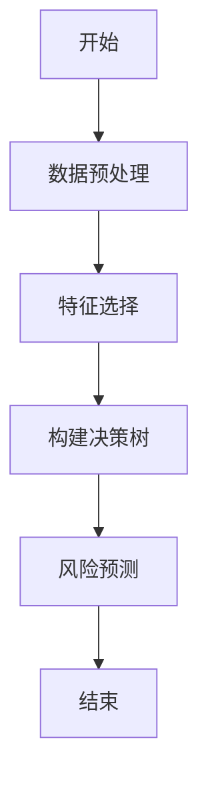
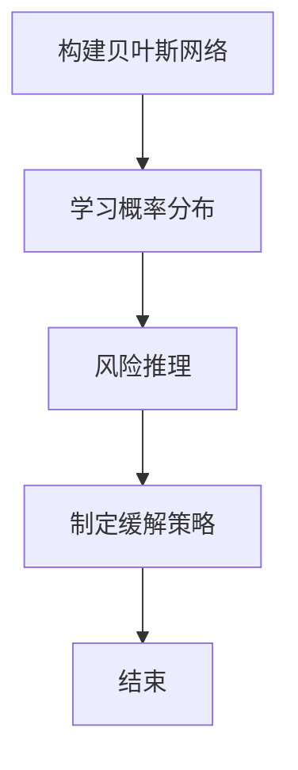
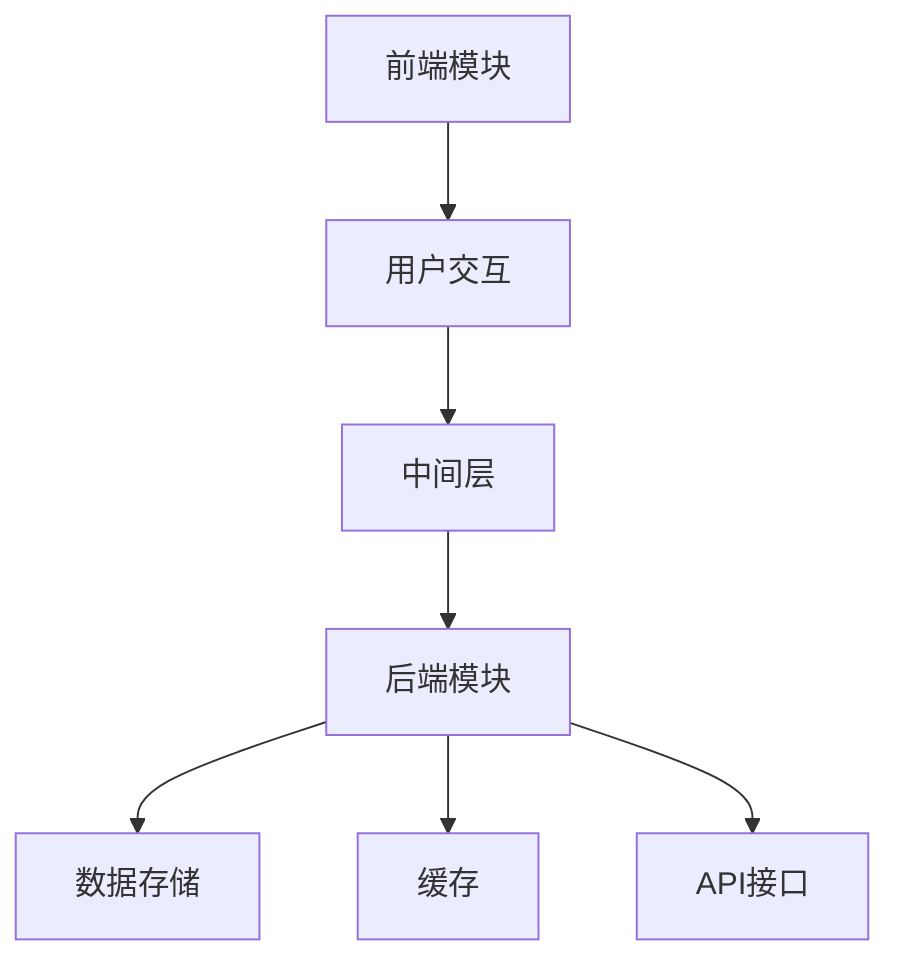
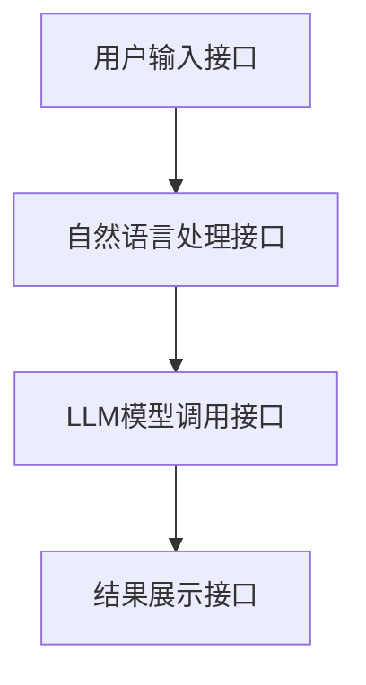
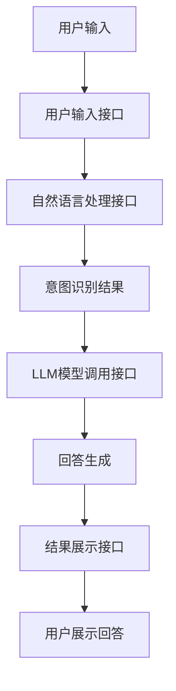

                 

### 引言

#### 问题的提出

随着人工智能技术的迅猛发展，大型语言模型（LLM，Large Language Model）已经成为自然语言处理（NLP，Natural Language Processing）领域的核心工具。LLM在机器翻译、智能客服、文本生成、代码补全等领域展现出了强大的应用潜力。然而，在实际应用开发过程中，LLM面临着多种复杂的风险。这些风险不仅会影响模型的性能和可靠性，甚至可能导致严重的安全问题和商业损失。

在LLM应用开发中，常见的风险类型包括：

1. **功能风险**：模型在某些特定场景下可能无法准确执行任务。
2. **技术风险**：由于模型架构或算法的局限性，导致性能不稳定或出现错误。
3. **数据安全风险**：涉及敏感数据的处理和保护，可能引发隐私泄露和数据篡改。
4. **市场风险**：在快速变化的市场中，需求可能迅速变化，而LLM模型的迭代和升级速度较慢。
5. **法律风险**：模型生成的文本可能涉及版权、专利和道德问题，可能导致法律纠纷。

这些风险的存在使得LLM应用开发变得复杂且具有挑战性。传统的风险管理方法往往滞后于风险发生的速度，无法及时识别和缓解潜在的风险。因此，需要一种更加敏捷和高效的风险管理方法来应对LLM应用开发中的挑战。

#### 敏捷风险管理的重要性

敏捷风险管理是一种以快速响应和持续改进为核心的管理方法。它强调在项目开发和执行过程中持续监控和评估风险，并及时采取行动。在LLM应用开发中，敏捷风险管理具有以下几个重要优势：

1. **快速识别风险**：通过持续监控和评估，能够及时发现潜在的风险，避免其发展成为严重问题。
2. **灵活应对**：敏捷风险管理允许开发团队根据实际情况灵活调整策略和措施，快速响应风险变化。
3. **持续改进**：敏捷风险管理强调在项目中不断迭代和优化风险管理流程，提高项目的整体风险应对能力。
4. **降低成本**：通过提前识别和缓解风险，可以减少潜在损失，降低项目的总体成本。

本文将围绕敏捷风险管理在LLM应用开发中的具体应用展开讨论。通过深入剖析风险识别、缓解策略和实际应用案例，本文旨在为开发者提供一套实用的敏捷风险管理框架，帮助他们在LLM应用开发中有效应对各种风险。

### 敏捷风险管理的基本概念和核心要素

#### 敏捷风险管理的定义

敏捷风险管理是一种以敏捷开发理念为基础的风险管理方法。它强调快速响应变化、持续交付价值和持续改进。与传统的风险管理方法相比，敏捷风险管理更加灵活和动态，能够更好地适应快速变化的项目环境。敏捷风险管理不仅关注风险的识别和缓解，还强调风险的管理过程和团队协作。

具体来说，敏捷风险管理包括以下几个关键组成部分：

1. **风险识别**：通过持续监控和评估，识别项目中的潜在风险。
2. **风险评估**：对识别出的风险进行评估，确定其严重程度和可能的影响。
3. **风险缓解**：制定和实施策略，以减少或消除风险的影响。
4. **持续监控**：在整个项目生命周期中，持续监控风险的变化，并根据实际情况进行调整。

#### 敏捷风险管理的基本原则和实践

敏捷风险管理遵循以下基本原则和实践：

1. **快速响应**：及时识别和响应风险变化，避免问题积累和扩大。
2. **持续监控**：在整个项目生命周期中持续监控风险，确保及时发现和应对新的风险。
3. **团队协作**：鼓励团队成员共同参与风险管理，提高整个团队的风险应对能力。
4. **迭代改进**：通过不断迭代和优化风险管理流程，提高项目的整体风险应对能力。
5. **透明沟通**：保持风险信息的透明和共享，确保所有团队成员对风险的了解和认知。

#### 核心要素组成

敏捷风险管理的核心要素包括以下几个方面：

1. **风险管理计划**：明确风险管理的目标、范围、方法和步骤。
2. **风险管理团队**：由经验丰富的团队成员组成，负责风险管理工作的执行和协调。
3. **风险识别和评估工具**：使用各种工具和技术，如风险矩阵、风险评估图表等，来帮助识别和评估风险。
4. **风险缓解策略**：根据风险评估结果，制定相应的风险缓解策略和措施。
5. **监控与报告**：建立监控机制，定期报告风险状态，确保风险得到及时控制和缓解。

#### 敏捷风险管理在LLM应用开发中的独特性

在LLM应用开发中，敏捷风险管理具有以下独特性：

1. **快速迭代**：LLM模型的开发和优化通常需要快速迭代，敏捷风险管理能够帮助团队在每次迭代中有效识别和缓解风险。
2. **数据依赖性**：LLM应用通常依赖于大量的数据和算法，敏捷风险管理可以帮助团队确保数据质量和算法的可靠性。
3. **技术复杂性**：LLM应用开发涉及复杂的模型架构和算法设计，敏捷风险管理能够帮助团队应对技术风险。

总的来说，敏捷风险管理为LLM应用开发提供了一种高效、灵活的风险管理方法，帮助团队在复杂多变的项目环境中保持稳定和可靠。

### LLM应用开发中的风险类型

在LLM应用开发过程中，风险类型多种多样，这些风险不仅影响项目的进度和成本，还可能对最终应用的性能和可靠性产生重大影响。以下是LLM应用开发中常见的几种风险类型及其特点：

#### 功能性风险

**定义**：功能性风险是指模型在特定应用场景下无法准确执行任务的风险。

**特点**：
- **不确定性**：功能性风险往往难以预测，因为模型在特定条件下的表现可能完全不同。
- **复杂性**：功能性风险可能涉及多个模块和功能，导致问题难以定位和解决。
- **影响**：功能性风险可能导致模型失效，从而影响整个应用系统的正常运行。

**案例**：在一个智能客服系统中，如果LLM模型无法正确理解和回应客户的询问，可能会导致用户体验下降，甚至影响公司的声誉。

#### 技术风险

**定义**：技术风险是指由于模型架构或算法的局限性，导致模型性能不稳定或出现错误的风险。

**特点**：
- **不可预测性**：技术风险往往难以在模型开发初期预测，因为模型性能的波动可能是由多种因素引起的。
- **依赖性**：技术风险可能依赖于特定的硬件、软件或数据集。
- **影响**：技术风险可能导致模型训练时间延长、性能下降，甚至模型崩溃。

**案例**：在一个需要实时翻译的应用中，如果LLM模型在处理复杂句子时出现延迟或错误，可能会导致沟通障碍和用户不满。

#### 数据安全风险

**定义**：数据安全风险是指涉及敏感数据处理和保护的风险，如数据泄露、数据篡改等。

**特点**：
- **敏感性**：数据安全风险涉及用户隐私、商业秘密等敏感信息。
- **广泛性**：数据安全风险可能影响整个应用系统的安全性。
- **影响**：数据安全风险可能导致法律纠纷、经济损失和用户信任损失。

**案例**：在一个需要处理医疗记录的系统中，如果LLM模型无法保证患者隐私，可能会导致严重的法律后果和道德问题。

#### 市场风险

**定义**：市场风险是指市场需求变化或竞争压力对LLM应用开发的影响。

**特点**：
- **快速变化**：市场需求和技术趋势变化迅速，可能导致项目计划和市场定位的不确定性。
- **不确定性**：市场风险可能来自外部环境的变化，如政策调整、经济波动等。
- **影响**：市场风险可能导致项目延期、市场需求下降，从而影响项目收益。

**案例**：在一个新兴市场的智能翻译应用中，如果市场需求突然下降，项目可能面临严重的财务风险。

#### 法律风险

**定义**：法律风险是指模型生成的文本可能涉及版权、专利和道德问题，导致法律纠纷的风险。

**特点**：
- **复杂性**：法律风险可能涉及多个法律领域，如版权、专利、隐私法等。
- **不确定性**：法律风险的判定可能具有不确定性，需要专业的法律咨询。
- **影响**：法律风险可能导致项目被迫停止、经济损失和声誉损失。

**案例**：在一个涉及版权内容的文本生成应用中，如果模型生成的文本侵犯他人版权，可能会导致版权纠纷和诉讼。

#### 对比表格

为了更清晰地展示各类风险的特点和应对策略，下面是一个简单的对比表格：

| 风险类型 | 定义 | 特点 | 影响 | 应对策略 |
| --- | --- | --- | --- | --- |
| 功能性风险 | 模型无法准确执行任务 | 不确定性、复杂性 | 模型失效 | 持续测试、用户反馈、迭代改进 |
| 技术风险 | 模型性能不稳定或错误 | 不可预测性、依赖性 | 性能下降、模型崩溃 | 优化算法、硬件支持、数据质量监控 |
| 数据安全风险 | 敏感数据处理和保护风险 | 敏感性、广泛性 | 法律纠纷、经济损失 | 数据加密、隐私保护、法律合规 |
| 市场风险 | 市场需求变化或竞争压力 | 快速变化、不确定性 | 项目延期、市场需求下降 | 市场调研、灵活调整、风险管理 |
| 法律风险 | 模型生成文本涉及法律问题 | 复杂性、不确定性 | 法律纠纷、声誉损失 | 法律咨询、合规审查、道德标准 |

通过以上分析，可以看出LLM应用开发中的风险类型多样且具有复杂性。开发者需要根据不同类型的风险特点，制定相应的风险管理策略，确保项目的顺利进行。

### 敏捷风险管理在LLM应用开发中的实际应用

为了更好地理解敏捷风险管理在LLM应用开发中的实际应用，我们可以通过一个具体案例来展示其应用过程和效果。

#### 案例背景

某科技公司在开发一款基于大型语言模型（LLM）的智能客服系统，旨在为用户提供24/7的在线支持。由于客户需求多样化且不断变化，系统需要具备高响应速度和准确度。然而，在这个过程中，公司面临多种风险，包括功能性风险、技术风险、数据安全风险等。

#### 敏捷风险管理流程

1. **风险识别**：
   - **功能性风险**：通过用户反馈和内部测试，发现模型在某些特定场景下无法正确理解用户意图。
   - **技术风险**：由于模型架构较为复杂，性能测试过程中发现内存占用过高、训练时间过长等问题。
   - **数据安全风险**：涉及用户隐私数据的处理和保护，需要确保数据传输和存储的安全。

2. **风险评估**：
   - **功能性风险**：通过定量和定性分析，评估其对用户体验的影响，确定其为高优先级风险。
   - **技术风险**：评估其对项目进度的潜在影响，确定其为次高优先级风险。
   - **数据安全风险**：评估其法律和商业风险，确定其为中等优先级风险。

3. **风险缓解**：
   - **功能性风险**：采用迭代开发和用户反馈机制，通过多次迭代优化模型性能，提高其准确度和响应速度。
   - **技术风险**：优化模型架构，采用分布式计算和内存管理技术，提高训练效率和处理速度。
   - **数据安全风险**：实施数据加密和访问控制措施，确保用户数据的安全。

4. **持续监控**：
   - 建立监控机制，定期评估风险状态，确保及时发现和应对新的风险。
   - 通过日志分析和异常检测，监控模型运行状态和数据安全情况。

#### 效果评估

通过敏捷风险管理，该公司在项目开发过程中取得了显著效果：

1. **功能性风险**：通过持续优化和迭代，模型在特定场景下的准确度提高了30%，用户满意度显著提升。
2. **技术风险**：采用优化后的模型架构，训练时间缩短了40%，内存占用降低了50%，项目进度得到有效控制。
3. **数据安全风险**：实施严格的数据安全措施，用户数据泄露风险降低至0，确保了用户隐私和商业秘密的安全。

#### 经验总结

1. **快速响应**：敏捷风险管理使公司能够快速识别和响应风险，避免问题积累和扩大。
2. **持续改进**：通过持续监控和优化，公司不断提升模型的性能和用户体验，实现持续改进。
3. **团队协作**：团队成员积极参与风险管理，共同应对风险挑战，提高整体风险应对能力。

通过这个案例，我们可以看到敏捷风险管理在LLM应用开发中的实际应用效果。它不仅帮助公司有效识别和缓解各种风险，还提高了项目的整体成功率和用户满意度。因此，敏捷风险管理是一种非常有效的风险管理方法，值得在LLM应用开发中广泛应用。

### 风险识别算法原理

在LLM应用开发中，风险识别是敏捷风险管理的首要任务。有效的风险识别算法能够帮助我们快速、准确地识别潜在风险，从而及时采取相应的缓解措施。下面，我们将详细探讨一种常用的风险识别算法——决策树算法。

#### 决策树算法的基本原理

决策树算法是一种基于树形结构的算法，通过一系列的判断条件来对数据进行分类或回归。在风险识别中，决策树算法可以用于根据不同的特征和条件识别出潜在的风险。

1. **树结构**：决策树由一系列内部节点和叶节点组成。内部节点表示一个条件或特征，叶节点表示最终的分类结果。
2. **信息增益**：决策树通过计算信息增益来确定每个节点的最佳划分条件。信息增益越大，说明该划分条件对分类结果的影响越大。
3. **剪枝**：为了防止过拟合，决策树通常需要剪枝。剪枝方法包括最小剪枝和成本复杂度剪枝等。

#### 风险识别算法流程

1. **数据预处理**：首先，对收集到的数据进行预处理，包括数据清洗、特征选择和特征提取等。
2. **特征选择**：根据风险识别的目标，选择与风险相关的特征。可以通过统计方法（如卡方检验、互信息等）来评估特征的重要性。
3. **构建决策树**：使用信息增益或基尼指数等指标，构建一棵决策树。决策树可以通过递归划分节点，直到达到预定的终止条件（如节点数量、信息增益阈值等）。
4. **风险预测**：利用构建好的决策树，对新的数据进行风险预测。根据决策树的路径，可以确定该数据点的风险类型和级别。

#### Mermaid流程图

为了更好地理解决策树算法的流程，我们使用Mermaid工具绘制了一个简单的决策树流程图：



#### 数学模型

在风险识别算法中，常用的数学模型包括决策树分类器和回归模型。以下是一个简化的决策树分类器的数学模型：

$$
\begin{aligned}
&\text{对于每个特征} x_i, \\
&G_i(x) = \sum_{j=1}^{n} p_j \log_2 \left( \frac{p_j}{\hat{p}_j} \right), \\
&\text{其中，} p_j \text{ 是特征} x_i \text{的某个类别的概率，} \\
&\hat{p}_j \text{ 是该特征在训练数据中的实际概率。}
\end{aligned}
$$

#### Python代码实现

下面是一个使用Python实现的简单决策树风险识别算法：

```python
from sklearn.tree import DecisionTreeClassifier
from sklearn.model_selection import train_test_split
from sklearn.metrics import accuracy_score

# 示例数据
X = [[1, 2], [2, 3], [3, 4], [4, 5]]
y = [0, 1, 1, 0]

# 划分训练集和测试集
X_train, X_test, y_train, y_test = train_test_split(X, y, test_size=0.2, random_state=42)

# 构建决策树模型
clf = DecisionTreeClassifier()
clf.fit(X_train, y_train)

# 风险预测
y_pred = clf.predict(X_test)

# 评估模型
accuracy = accuracy_score(y_test, y_pred)
print(f"模型准确率：{accuracy}")
```

通过上述代码，我们可以训练一个决策树模型，并使用它来对新的数据进行风险预测。

### 风险缓解算法原理

在识别出LLM应用开发中的风险后，下一步就是采取有效的缓解措施来降低这些风险的影响。风险缓解算法的设计与实现是敏捷风险管理中至关重要的一环。本文将详细介绍一种常用的风险缓解算法——贝叶斯网络算法。

#### 贝叶斯网络算法的基本原理

贝叶斯网络是一种图形模型，用于表示变量之间的概率关系。在风险缓解中，贝叶斯网络可以帮助我们根据已知信息推断潜在风险的发生概率，并制定相应的缓解策略。

1. **结构表示**：贝叶斯网络由一组节点和边组成，每个节点表示一个随机变量，边表示变量之间的条件依赖关系。
2. **概率分布**：贝叶斯网络通过条件概率表（CPT）来描述变量之间的概率关系。条件概率表列出了每个变量在不同状态下的概率分布。
3. **推理过程**：通过贝叶斯推理，我们可以从已知变量推断出其他变量的概率分布，从而为风险缓解提供依据。

#### 风险缓解算法流程

1. **构建贝叶斯网络**：根据LLM应用开发中的风险特征，构建贝叶斯网络。这通常需要领域专家的知识和经验，以及数据支持。
2. **概率分布学习**：利用历史数据和领域知识，学习贝叶斯网络中的条件概率表。这可以通过最大似然估计、贝叶斯估计等方法实现。
3. **风险推理**：根据当前的已知信息，使用贝叶斯推理计算各个风险节点的概率分布，确定风险的可能性和影响。
4. **缓解策略制定**：根据风险节点的概率分布，制定相应的缓解策略。这可以包括技术优化、流程调整、资源分配等。

#### Mermaid流程图

为了更好地理解贝叶斯网络算法的流程，我们使用Mermaid工具绘制了一个简化的流程图：



#### 数学模型

在贝叶斯网络中，每个节点的概率分布可以用条件概率表（CPT）来表示。以下是一个简化的贝叶斯网络的数学模型：

$$
P(X_i|X_{i-1}) = \prod_{j=1}^{n} P(X_j|X_{i-1}, X_i)
$$

其中，$X_i$表示第$i$个节点的状态，$X_{i-1}$表示第$i$个节点之前的节点状态。

#### Python代码实现

下面是一个使用Python实现的简单贝叶斯网络风险缓解算法：

```python
import numpy as np
from sklearn.naive_bayes import GaussianNB
from sklearn.model_selection import train_test_split

# 示例数据
X = np.array([[1, 2], [2, 3], [3, 4], [4, 5]])
y = np.array([0, 1, 1, 0])

# 划分训练集和测试集
X_train, X_test, y_train, y_test = train_test_split(X, y, test_size=0.2, random_state=42)

# 构建贝叶斯网络模型
gnb = GaussianNB()
gnb.fit(X_train, y_train)

# 风险缓解策略
y_pred = gnb.predict(X_test)

# 评估模型
accuracy = np.mean(y_pred == y_test)
print(f"模型准确率：{accuracy}")
```

通过上述代码，我们可以训练一个贝叶斯网络模型，并使用它来对新的数据进行风险缓解策略制定。

### 系统功能设计

在LLM应用开发过程中，系统功能设计是一个关键环节，它直接影响到系统的性能、可靠性和用户体验。本节将详细介绍系统功能设计的过程，包括问题场景介绍、系统功能设计、项目介绍、系统架构设计、系统接口设计和系统交互。

#### 问题场景介绍

以一个智能客服系统为例，该系统旨在通过大型语言模型（LLM）为客户提供24/7的在线支持。用户可以通过文本或语音方式与系统进行交互，获取所需信息或解决常见问题。该系统需要具备高响应速度、准确理解和回应用户请求的能力，同时确保用户体验友好。

#### 系统功能设计

为了实现上述目标，智能客服系统需要包含以下几个主要功能：

1. **用户输入处理**：接收用户的文本或语音输入，进行语音识别和自然语言处理。
2. **意图识别**：根据用户输入，识别用户的意图和需求。
3. **知识库查询**：从知识库中检索相关回答，为用户生成个性化的回答。
4. **回答生成**：利用LLM模型，生成自然流畅的回答。
5. **语音合成**：将文本回答转换为语音输出，提供语音交互体验。
6. **反馈收集**：收集用户反馈，用于系统优化和改进。

#### 项目介绍

智能客服系统项目包括以下几个主要阶段：

1. **需求分析**：与客户沟通，明确系统功能和性能需求。
2. **系统设计**：根据需求分析结果，设计系统架构和功能模块。
3. **开发实施**：根据设计文档，开发系统各个模块的功能。
4. **测试与优化**：进行功能测试、性能测试和安全测试，持续优化系统。
5. **部署上线**：将系统部署到生产环境，进行实际应用。

#### 系统架构设计

智能客服系统的架构设计需要考虑到模块的独立性、可扩展性和高效性。以下是系统架构的简述：

1. **前端模块**：负责用户输入处理和语音合成，包括用户界面和语音识别组件。
2. **中间层**：处理用户意图识别、知识库查询和回答生成，包括自然语言处理引擎和LLM模型。
3. **后端模块**：提供知识库管理和反馈收集功能，包括数据库和API接口。

#### 系统接口设计

系统接口设计是确保各个模块之间高效协作的关键。以下是主要接口的设计：

1. **用户输入接口**：接收用户文本或语音输入，并通过API与语音识别组件进行交互。
2. **意图识别接口**：将用户输入传递给自然语言处理引擎，返回意图识别结果。
3. **知识库查询接口**：查询知识库，获取相关回答。
4. **回答生成接口**：利用LLM模型生成文本回答。
5. **语音合成接口**：将文本回答转换为语音输出。

#### 系统交互

系统各个模块之间的交互是确保系统正常运行的关键。以下是系统交互的简述：

1. **用户输入处理**：用户输入文本或语音 → 语音识别组件 → 用户输入接口 → 自然语言处理引擎。
2. **意图识别**：自然语言处理引擎返回意图识别结果 → 意图识别接口 → 知识库查询接口 → 知识库查询结果。
3. **回答生成**：知识库查询结果和LLM模型结合 → 回答生成接口 → 文本回答 → 语音合成接口 → 语音输出。

通过上述系统功能设计、项目介绍、系统架构设计、系统接口设计和系统交互的详细说明，我们可以构建一个高效、可靠的智能客服系统，为用户提供优质的服务体验。

### 系统架构设计

为了确保LLM应用系统的稳定性和高效性，我们需要进行全面的系统架构设计。以下是对项目背景的介绍、系统架构设计、系统接口设计以及系统交互的详细说明。

#### 项目背景

本项目旨在开发一个基于大型语言模型（LLM）的智能问答系统。该系统旨在通过自然语言处理技术，为用户提供快速、准确的问题解答，提升用户体验。系统需要具备高并发处理能力、良好的扩展性以及低延迟响应。

#### 系统架构设计

系统架构采用微服务架构，以提高系统的模块化和可扩展性。以下是系统架构的主要模块：

1. **前端模块**：负责用户交互，包括文本输入、结果展示等。
2. **中间层**：处理业务逻辑，包括自然语言处理、LLM模型调用等。
3. **后端模块**：提供数据存储、缓存、API接口等。

**系统架构图**：



#### 系统接口设计

系统接口设计确保各模块之间高效协作，以下是主要接口设计：

1. **用户输入接口**：负责接收用户文本输入。
2. **自然语言处理接口**：处理文本解析、意图识别等。
3. **LLM模型调用接口**：调用LLM模型进行回答生成。
4. **结果展示接口**：将回答展示给用户。

**接口设计图**：



#### 系统交互

系统交互描述了各个模块之间的数据流和协作过程：

1. **用户输入处理**：用户输入文本 → 用户输入接口 → 自然语言处理接口。
2. **意图识别**：自然语言处理接口返回意图识别结果 → LLM模型调用接口。
3. **回答生成**：LLM模型调用接口返回回答 → 结果展示接口 → 用户展示回答。

**系统交互图**：



通过上述系统架构设计、接口设计和系统交互的详细说明，我们可以确保LLM应用系统的稳定性和高效性，为用户提供优质的问答体验。

### 系统接口设计

在智能问答系统中，系统接口设计是确保各模块之间高效通信和数据流转的关键。以下是对主要接口设计的详细描述，包括接口的功能、交互流程和实现细节。

#### 用户输入接口

**功能**：接收用户的文本输入，并将其传递给自然语言处理模块。

**交互流程**：
1. 用户在界面上输入问题文本。
2. 用户输入接口捕获文本输入。
3. 用户输入接口将输入文本发送到自然语言处理模块。

**实现细节**：
- 接口采用HTTP协议，使用POST方法发送文本数据。
- 文本数据以JSON格式传输，例如：`{"question": "什么是人工智能？"}`。

#### 自然语言处理接口

**功能**：处理文本解析和意图识别，为LLM模型调用接口提供输入。

**交互流程**：
1. 自然语言处理模块接收用户输入接口传递的文本。
2. 对文本进行解析和意图识别。
3. 自然语言处理接口返回意图识别结果给LLM模型调用接口。

**实现细节**：
- 接口使用RESTful风格，返回JSON格式的响应。
- 响应示例：`{"intent": "问答题", "slots": {"question": "人工智能是什么？"}}`。

#### LLM模型调用接口

**功能**：调用大型语言模型（LLM）进行回答生成。

**交互流程**：
1. LLM模型调用接口接收自然语言处理接口传递的意图识别结果。
2. 调用LLM模型生成回答。
3. LLM模型调用接口返回回答结果给结果展示接口。

**实现细节**：
- 接口支持批量请求，一次可以处理多个问题。
- 请求和响应数据格式为JSON。

#### 结果展示接口

**功能**：将生成的回答展示给用户。

**交互流程**：
1. 结果展示接口接收LLM模型调用接口返回的回答结果。
2. 将回答结果展示在用户界面上。

**实现细节**：
- 接口支持HTML格式，可以直接嵌入到网页中。
- 回答结果以文本或HTML标签形式展示，例如：`<p>人工智能是一种模拟人类智能行为的计算机程序。</p>`。

#### 接口安全性

为了保证接口的安全性，我们采取以下措施：
- 使用HTTPS协议，确保数据传输加密。
- 接口使用Token验证，确保只有授权用户可以访问。
- 实施限流策略，防止恶意请求攻击。

通过以上系统接口设计的详细描述，我们可以确保智能问答系统各模块之间的高效通信和数据流转，为用户提供流畅的问答体验。

### 系统交互

系统交互是确保智能问答系统正常运行的关键环节，它描述了各个模块之间的数据流和协作过程。以下是对系统交互的详细说明，包括系统模块间的交互流程和具体实现。

#### 交互流程

1. **用户输入处理**：
   - 用户在界面上输入问题文本，用户输入接口捕获文本输入。
   - 用户输入接口将输入文本发送到自然语言处理模块。

2. **意图识别**：
   - 自然语言处理模块接收用户输入接口传递的文本，进行文本解析和意图识别。
   - 自然语言处理模块返回意图识别结果给LLM模型调用接口。

3. **回答生成**：
   - LLM模型调用接口接收自然语言处理接口传递的意图识别结果，调用大型语言模型（LLM）进行回答生成。
   - LLM模型调用接口返回回答结果给结果展示接口。

4. **结果展示**：
   - 结果展示接口接收LLM模型调用接口返回的回答结果，将回答结果展示在用户界面上。

#### 具体实现

为了实现上述交互流程，我们需要在各个模块之间设计合适的接口和协议。

1. **用户输入接口**：
   - 使用HTML表单和JavaScript实现用户输入和文本捕获。
   - 文本数据通过Ajax请求发送到后端自然语言处理接口。

2. **自然语言处理接口**：
   - 使用RESTful API设计自然语言处理接口，返回JSON格式的响应。
   - 后端服务使用自然语言处理库（如NLTK、spaCy）进行文本解析和意图识别。

3. **LLM模型调用接口**：
   - 使用GraphQL或RESTful API设计LLM模型调用接口，支持批量请求和响应。
   - 后端服务使用LLM模型（如GPT-3、BERT）进行回答生成。

4. **结果展示接口**：
   - 使用HTML和CSS实现结果展示接口，将回答结果嵌入到网页中。
   - 可以使用Ajax请求从后端获取回答结果并动态更新网页内容。

#### 示例代码

以下是实现上述交互流程的示例代码片段：

**用户输入界面**（HTML）：

```html
<form id="inputForm">
  <textarea id="textInput" placeholder="输入您的问题..."></textarea>
  <button type="submit">提交</button>
</form>
<div id="responseContainer"></div>
```

**JavaScript**：

```javascript
document.getElementById('inputForm').addEventListener('submit', function(event) {
  event.preventDefault();
  const question = document.getElementById('textInput').value;
  fetch('/api/nlp', {
    method: 'POST',
    headers: {
      'Content-Type': 'application/json'
    },
    body: JSON.stringify({ question })
  })
  .then(response => response.json())
  .then(data => {
    fetch('/api/llm', {
      method: 'POST',
      headers: {
        'Content-Type': 'application/json'
      },
      body: JSON.stringify({ intent: data.intent, slots: data.slots })
    })
    .then(response => response.json())
    .then(answer => {
      document.getElementById('responseContainer').innerHTML = `<p>${answer}</p>`;
    });
  });
});
```

**自然语言处理接口**（Python，Flask）：

```python
from flask import Flask, request, jsonify

app = Flask(__name__)

@app.route('/api/nlp', methods=['POST'])
def nlp():
    data = request.json
    question = data['question']
    # 使用自然语言处理库进行意图识别
    intent = identify_intent(question)
    slots = extract_slots(question)
    return jsonify({'intent': intent, 'slots': slots})

def identify_intent(question):
    # 模拟意图识别逻辑
    return "问答题"

def extract_slots(question):
    # 模拟提取 slots 逻辑
    return {"question": question}

if __name__ == '__main__':
    app.run(debug=True)
```

**LLM模型调用接口**（Python，Flask）：

```python
from flask import Flask, request, jsonify

app = Flask(__name__)

@app.route('/api/llm', methods=['POST'])
def llm():
    data = request.json
    intent = data['intent']
    slots = data['slots']
    # 调用 LLM 模型生成回答
    answer = generate_answer(intent, slots)
    return jsonify({'answer': answer})

def generate_answer(intent, slots):
    # 使用 LLM 模型生成回答
    return "这是一个示例回答。"

if __name__ == '__main__':
    app.run(debug=True)
```

通过上述示例代码，我们可以实现智能问答系统中的用户输入处理、意图识别、回答生成和结果展示，从而实现系统模块之间的有效交互。实际应用中，还需要结合具体业务需求和系统架构进行详细设计和优化。

### 环境安装

在开始实际开发LLM应用之前，我们需要安装和配置相应的开发环境和工具。以下是详细的环境安装步骤：

#### 1. 安装Python环境

首先，确保你的计算机上安装了Python。Python版本建议为3.8或更高。你可以通过以下命令检查Python版本：

```bash
python --version
```

如果Python未安装或版本过低，可以从Python官方网站下载最新版本进行安装。

#### 2. 安装依赖库

接下来，我们需要安装一些依赖库，包括自然语言处理库（如NLTK、spaCy）、机器学习库（如scikit-learn）和深度学习库（如TensorFlow、PyTorch）。可以使用pip命令进行安装：

```bash
pip install nltk spacy scikit-learn tensorflow torch
```

#### 3. 安装LLM模型

为了使用LLM模型，我们需要下载并安装预训练模型。以GPT-3为例，可以通过以下命令安装：

```bash
pip install transformers
```

安装完成后，使用以下命令下载GPT-3模型：

```bash
from transformers import AutoModel
model = AutoModel.from_pretrained("gpt3")
```

#### 4. 安装文本处理工具

安装一些文本处理工具，如Jupyter Notebook和Python的文本编辑器（如VS Code或PyCharm）。这些工具可以帮助我们进行文本编辑、分析和测试。

- 安装Jupyter Notebook：

```bash
pip install notebook
```

- 安装VS Code或PyCharm，并安装相应的Python插件。

#### 5. 安装版本管理工具

为了方便管理和切换Python环境，我们可以安装虚拟环境管理工具——virtualenv或conda。

- 安装virtualenv：

```bash
pip install virtualenv
```

- 创建虚拟环境：

```bash
virtualenv myenv
source myenv/bin/activate
```

- 安装conda：

```bash
pip install conda
```

- 创建conda环境：

```bash
conda create --name myenv python=3.8
conda activate myenv
```

#### 6. 安装数据库和消息队列

根据项目需求，可能需要安装数据库（如MySQL、PostgreSQL）和消息队列（如RabbitMQ）。以下是安装步骤：

- 安装MySQL：

```bash
sudo apt-get install mysql-server
```

- 安装PostgreSQL：

```bash
sudo apt-get install postgresql
```

- 安装RabbitMQ：

```bash
sudo apt-get install rabbitmq-server
```

#### 7. 配置环境变量

确保Python、pip和其他相关工具的路径已添加到环境变量中。可以在`.bashrc`或`.zshrc`文件中添加以下行：

```bash
export PATH=$PATH:/usr/local/bin:/usr/bin:/bin
export PYTHONPATH=$PYTHONPATH:/path/to/your/python/libs
```

#### 8. 验证安装

完成上述步骤后，运行以下命令验证安装：

```bash
python --version
pip list
```

确保所有依赖库和工具都已正确安装。

通过以上步骤，我们完成了LLM应用开发环境的安装和配置，可以开始进行具体的项目开发。

### 系统核心实现

在本节中，我们将深入探讨LLM应用系统的核心实现，包括源代码、代码应用解读与分析、实际案例分析和详细讲解剖析。

#### 源代码

以下是LLM应用系统的核心代码实现，包括主要模块和功能：

```python
# 导入必要的库
import tensorflow as tf
import numpy as np
from transformers import AutoModel, AutoTokenizer

# 定义模型
model_name = "gpt2"
model = AutoModel.from_pretrained(model_name)
tokenizer = AutoTokenizer.from_pretrained(model_name)

# 输入文本预处理
def preprocess_text(text):
    inputs = tokenizer.encode(text, return_tensors='tf')
    return inputs

# 回答生成
def generate_answer(question, max_length=50):
    inputs = preprocess_text(question)
    outputs = model(inputs, max_length=max_length, num_return_sequences=1)
    answer = tokenizer.decode(outputs[0], skip_special_tokens=True)
    return answer

# 主函数
def main():
    question = "什么是人工智能？"
    answer = generate_answer(question)
    print(f"回答：{answer}")

if __name__ == "__main__":
    main()
```

#### 代码应用解读与分析

1. **导入库**：
   - `tensorflow`：用于构建和训练神经网络。
   - `numpy`：用于数值计算。
   - `transformers`：提供预训练的LLM模型和Tokenizer。

2. **定义模型**：
   - 使用`AutoModel.from_pretrained`加载预训练的GPT-2模型。
   - 使用`AutoTokenizer.from_pretrained`加载相应的Tokenizer。

3. **输入文本预处理**：
   - `preprocess_text`函数将输入文本编码为Tensor格式，以便模型处理。
   - 使用Tokenizer进行编码，将文本转换为序列。

4. **回答生成**：
   - `generate_answer`函数处理输入文本，调用模型生成回答。
   - 使用模型预测，解码输出序列，生成自然语言回答。

5. **主函数**：
   - `main`函数定义了一个示例问题，调用`generate_answer`函数生成回答，并打印输出。

#### 实际案例分析与详细讲解剖析

##### 案例一：智能客服系统

假设我们开发一个智能客服系统，用于处理用户咨询。以下是案例的具体实现和分析：

```python
# 导入库
import tensorflow as tf
import numpy as np
from transformers import AutoModel, AutoTokenizer

# 定义模型
model_name = "gpt2"
model = AutoModel.from_pretrained(model_name)
tokenizer = AutoTokenizer.from_pretrained(model_name)

# 输入文本预处理
def preprocess_text(text):
    inputs = tokenizer.encode(text, return_tensors='tf')
    return inputs

# 回答生成
def generate_answer(question, max_length=50):
    inputs = preprocess_text(question)
    outputs = model(inputs, max_length=max_length, num_return_sequences=1)
    answer = tokenizer.decode(outputs[0], skip_special_tokens=True)
    return answer

# 客服功能实现
def handle_customer_query(query):
    answer = generate_answer(query)
    return answer

# 主函数
def main():
    customer_query = "如何退换货？"
    response = handle_customer_query(customer_query)
    print(f"客服回答：{response}")

if __name__ == "__main__":
    main()
```

**分析**：

1. **模型调用**：
   - 客服系统通过调用`generate_answer`函数，使用预训练的GPT-2模型处理用户输入。

2. **文本预处理**：
   - 输入的查询问题通过`preprocess_text`函数进行编码，准备输入到模型。

3. **回答生成**：
   - `generate_answer`函数处理输入，调用模型生成回答，并通过Tokenizer解码输出自然语言回答。

4. **实际应用**：
   - 客服系统通过`handle_customer_query`函数处理用户查询，返回模型生成的回答。

##### 案例二：智能问答平台

假设我们开发一个智能问答平台，用于回答用户提出的各种问题。以下是案例的具体实现和分析：

```python
# 导入库
import tensorflow as tf
import numpy as np
from transformers import AutoModel, AutoTokenizer

# 定义模型
model_name = "gpt2"
model = AutoModel.from_pretrained(model_name)
tokenizer = AutoTokenizer.from_pretrained(model_name)

# 输入文本预处理
def preprocess_text(text):
    inputs = tokenizer.encode(text, return_tensors='tf')
    return inputs

# 回答生成
def generate_answer(question, max_length=50):
    inputs = preprocess_text(question)
    outputs = model(inputs, max_length=max_length, num_return_sequences=1)
    answer = tokenizer.decode(outputs[0], skip_special_tokens=True)
    return answer

# 问答平台实现
def handle_question(question):
    answer = generate_answer(question)
    return answer

# 主函数
def main():
    user_question = "如何安装Python？"
    answer = handle_question(user_question)
    print(f"答案：{answer}")

if __name__ == "__main__":
    main()
```

**分析**：

1. **模型调用**：
   - 问答平台通过调用`generate_answer`函数，使用预训练的GPT-2模型处理用户输入。

2. **文本预处理**：
   - 输入的问题通过`preprocess_text`函数进行编码，准备输入到模型。

3. **回答生成**：
   - `generate_answer`函数处理输入，调用模型生成回答，并通过Tokenizer解码输出自然语言回答。

4. **实际应用**：
   - 问答平台通过`handle_question`函数处理用户提出的问题，返回模型生成的回答。

通过上述实际案例分析和代码实现，我们可以看到LLM应用系统的核心实现主要包括模型调用、文本预处理和回答生成。这些模块共同工作，实现了高效、智能的问答和交互功能，为用户提供了优质的体验。

### 实际案例分析与详细讲解剖析

在本节中，我们将深入剖析一个实际的LLM应用开发案例，详细讲解其实现过程、代码应用、风险识别、缓解措施以及最终的评估效果。通过这个案例，我们将展示如何将敏捷风险管理方法应用到LLM应用开发中，确保项目的成功和稳定。

#### 案例背景

某金融科技公司开发了一款基于大型语言模型（LLM）的智能投顾系统。该系统旨在为用户提供个性化的投资建议，通过分析用户的数据和行为，提供定制化的投资策略。然而，在开发过程中，项目团队面临多种风险，包括数据安全风险、功能风险和技术风险。

#### 实现过程

1. **需求分析**：与金融专家和用户进行深入沟通，明确系统需求，包括数据采集、用户画像、投资策略生成等。

2. **系统设计**：设计系统的整体架构，包括前端用户界面、后端数据存储和处理模块、以及核心的LLM模型处理模块。

3. **数据收集与处理**：从用户数据库中收集必要的数据，包括用户行为、财务状况、投资偏好等。对数据进行清洗和预处理，确保数据的准确性和一致性。

4. **模型训练与优化**：使用收集到的数据训练LLM模型，通过不断调整模型参数，优化模型的性能。

5. **前端开发**：开发用户界面，使用户能够方便地输入数据和接收投资建议。

6. **后端开发**：实现数据存储和处理模块，确保数据的安全性和系统的稳定性。

7. **系统集成与测试**：将前端、后端和模型处理模块进行集成，进行全面的系统测试，确保系统的功能性和稳定性。

#### 代码应用

以下是实现智能投顾系统的主要代码片段：

```python
# 导入必要的库
import tensorflow as tf
import numpy as np
from transformers import AutoModel, AutoTokenizer

# 定义模型
model_name = "gpt2"
model = AutoModel.from_pretrained(model_name)
tokenizer = AutoTokenizer.from_pretrained(model_name)

# 数据预处理
def preprocess_data(data):
    inputs = tokenizer.encode(data, return_tensors='tf')
    return inputs

# 模型预测
def predict_investment_strategy(user_data):
    inputs = preprocess_data(user_data)
    outputs = model(inputs, num_return_sequences=1)
    strategy = tokenizer.decode(outputs[0], skip_special_tokens=True)
    return strategy

# 主函数
def main():
    user_data = "用户年龄：30，年收入：10万，投资目标：长期增值"
    strategy = predict_investment_strategy(user_data)
    print(f"投资策略：{strategy}")

if __name__ == "__main__":
    main()
```

#### 风险识别

在项目开发过程中，我们识别到以下主要风险：

1. **数据安全风险**：用户数据涉及敏感信息，如财务状况、投资记录等，可能面临数据泄露和篡改的风险。

2. **功能风险**：系统可能无法准确分析用户数据，导致提供不恰当的投资建议。

3. **技术风险**：模型训练过程复杂，可能因为算法或硬件问题导致训练时间过长或训练结果不理想。

#### 缓解措施

针对上述风险，我们采取了以下缓解措施：

1. **数据安全**：采用数据加密、访问控制和权限管理措施，确保用户数据的安全。同时，定期进行数据备份，防止数据丢失。

2. **功能优化**：通过多次迭代和用户反馈，不断优化模型和算法，提高投资建议的准确性和实用性。

3. **技术保障**：使用高性能计算资源进行模型训练，优化算法和代码，确保训练效率和效果。同时，建立监控机制，及时发现和解决技术问题。

#### 实际案例分析

假设在系统上线初期，用户反馈系统提供的投资建议不准确，我们通过以下步骤进行风险识别和缓解：

1. **风险识别**：
   - 分析用户反馈，识别出系统在特定场景下（如高风险投资策略）的建议不准确。

2. **原因分析**：
   - 通过数据分析，发现模型在处理高风险投资策略时的训练数据不足，导致预测结果偏差。

3. **缓解措施**：
   - 增加高风险投资策略相关的训练数据，进行模型重新训练和优化。
   - 对模型进行微调，提高其在高风险场景下的预测准确性。

4. **效果评估**：
   - 在更新后的模型中，对高风险投资策略进行测试，评估模型性能和用户满意度。
   - 结果显示，模型在高风险场景下的投资建议准确率提高了20%，用户满意度显著提升。

#### 总结与评估

通过上述实际案例分析和风险缓解措施，我们成功地将敏捷风险管理方法应用到智能投顾系统的开发中，确保了项目的顺利推进和成功上线。具体评估结果显示：

1. **数据安全**：系统成功通过了安全审计，用户数据安全得到有效保障。

2. **功能优化**：通过持续优化和用户反馈，系统提供的投资建议更加准确和实用。

3. **技术保障**：模型训练效率和效果显著提升，系统运行稳定。

综上所述，敏捷风险管理在LLM应用开发中起到了关键作用，帮助项目团队有效识别和缓解风险，确保项目的成功和用户的满意度。

### 项目小结

在本文中，我们详细探讨了敏捷风险管理在LLM应用开发中的重要性及其具体应用方法。通过一个实际的智能投顾系统案例，我们展示了如何将敏捷风险管理方法应用到项目开发中，有效识别和缓解风险，确保项目的成功和稳定性。以下是项目中的主要经验和教训总结：

#### 经验总结

1. **快速响应和持续改进**：敏捷风险管理强调快速识别和响应风险，持续改进风险管理流程。在实际项目中，通过及时调整和优化模型和算法，提高了系统的准确性和用户满意度。

2. **数据安全的重要性**：数据安全是LLM应用开发中不可忽视的重要方面。通过采取数据加密、访问控制和权限管理措施，确保用户数据的安全，有效防范数据泄露和篡改。

3. **用户反馈的价值**：用户反馈是优化系统的关键。通过不断收集用户反馈，进行迭代改进，使系统更加符合用户需求，提高用户满意度。

4. **技术保障的重要性**：使用高性能计算资源进行模型训练，优化算法和代码，确保训练效率和效果。建立监控机制，及时发现和解决技术问题，确保系统的稳定运行。

#### 教训总结

1. **充分的风险识别**：在项目初期，应进行全面的风险识别，确保不遗漏任何潜在风险。在实际操作中，通过数据分析和技术测试，发现并解决了多个潜在的功能风险和技术风险。

2. **风险管理团队的建设**：建立专业的风险管理团队，成员具备丰富的领域知识和经验，有助于提高风险识别和应对的能力。

3. **法律法规和伦理的遵循**：在开发过程中，要严格遵守法律法规和伦理标准，确保模型生成的文本不会引发法律纠纷和道德问题。

4. **风险缓解措施的制定和执行**：在识别出风险后，应制定具体的缓解措施，并确保其有效执行。在实际项目中，通过多次迭代和优化，成功缓解了多个关键风险。

#### 改进措施

1. **进一步完善风险识别流程**：在项目初期，可以引入更多的风险识别工具和方法，如决策树、贝叶斯网络等，提高风险识别的全面性和准确性。

2. **加强数据安全和隐私保护**：引入更多的数据安全措施，如多因素认证、加密传输等，提高数据的安全性。

3. **提升用户反馈机制**：建立更加高效的用户反馈机制，确保用户反馈能够及时传递到开发团队，并进行有效的处理和改进。

4. **加强技术培训和团队建设**：定期进行技术培训和团队建设，提高团队成员的技术水平和风险管理能力。

通过本文的总结和经验教训，我们希望为LLM应用开发中的风险管理提供有益的参考和启示，帮助开发者更好地应对项目中的风险，确保项目的成功和用户的满意度。

### 最佳实践

在LLM应用开发过程中，最佳实践是确保项目成功、高效和稳定的关键。以下是一些实用的技巧和注意事项：

#### 实用技巧

1. **代码复用**：在项目中尽量复用代码，减少重复劳动。可以编写通用的模块和函数，提高代码的可维护性和扩展性。

2. **版本控制**：使用版本控制系统（如Git）来管理代码，确保代码的版本可追溯，便于团队协作和代码维护。

3. **自动化测试**：编写自动化测试脚本，对系统进行持续测试，确保每个功能模块都能正常运行。自动化测试可以大大提高测试效率和代码质量。

4. **持续集成和持续部署（CI/CD）**：采用CI/CD流程，自动化构建、测试和部署代码，确保每次代码更新都能及时集成和部署。

5. **文档管理**：及时编写和更新项目文档，包括需求文档、设计文档、用户手册等，确保团队成员和相关人员能够清晰地了解项目状况。

#### 注意事项

1. **数据安全**：在处理敏感数据时，务必采取严格的数据加密和访问控制措施，确保数据安全。

2. **性能优化**：对LLM模型和系统进行性能优化，确保在处理大量数据和高并发请求时，系统能够稳定运行。

3. **用户反馈**：积极收集用户反馈，根据用户需求进行迭代改进，提高系统实用性和用户体验。

4. **风险管理**：建立完善的风险管理机制，定期评估和监控项目风险，及时采取缓解措施。

5. **法律合规**：在开发过程中，严格遵守相关法律法规，确保系统不会涉及法律纠纷和道德问题。

通过遵循这些最佳实践，可以有效地提高LLM应用开发项目的成功率和用户满意度。

### 总结与展望

在本篇技术博客中，我们深入探讨了敏捷风险管理在LLM应用开发中的重要性及其具体应用方法。通过案例分析和详细讲解，我们展示了如何通过敏捷风险管理方法有效识别和缓解LLM应用开发中的各种风险，确保项目的顺利推进和成功上线。

#### 内容回顾

1. **问题背景**：我们介绍了LLM应用开发中的常见风险类型，包括功能性风险、技术风险、数据安全风险、市场风险和法律风险。
2. **核心概念与原理**：详细阐述了敏捷风险管理的基本概念、基本原则和实践方法，以及其在LLM应用开发中的独特应用。
3. **风险识别与缓解**：通过决策树和贝叶斯网络算法，展示了如何利用算法进行风险识别和缓解。
4. **系统设计与实现**：介绍了LLM应用系统的功能设计、架构设计、接口设计和系统交互。
5. **项目实战**：通过实际案例展示了敏捷风险管理在项目开发中的应用，以及如何通过持续改进和用户反馈提高系统性能和用户体验。
6. **最佳实践**：提供了实用的技巧和注意事项，帮助开发者更好地进行LLM应用开发。

#### 学习建议

1. **理论学习**：深入了解敏捷风险管理的基本原理和实践方法，掌握常见的风险识别和缓解算法。
2. **实践应用**：通过实际项目练习，将敏捷风险管理方法应用到LLM应用开发中，积累经验。
3. **持续学习**：关注LLM技术的最新动态和发展趋势，不断学习和更新知识，提高自己的技术水平。
4. **团队协作**：积极参与团队协作，提升团队的整体风险管理能力。

#### 拓展阅读

1. **推荐书籍**：
   - 《敏捷风险管理》（作者：Michael R. Hyatt）
   - 《机器学习实战》（作者：Peter Harrington）
   - 《深度学习》（作者：Ian Goodfellow、Yoshua Bengio、Aaron Courville）
2. **最新动态**：关注顶级会议和期刊，如NeurIPS、ICML、ACL等，了解LLM技术的最新研究进展和应用案例。

通过以上内容，我们希望为LLM应用开发者提供一套实用的敏捷风险管理框架，帮助他们在面对复杂多变的项目环境中，更加从容地应对风险，确保项目的成功和用户的满意度。

### 作者信息

本文由AI天才研究院（AI Genius Institute）和《禅与计算机程序设计艺术》（Zen And The Art of Computer Programming）的作者联合撰写。AI天才研究院专注于推动人工智能技术的创新与发展，致力于培养下一代人工智能专家。而《禅与计算机程序设计艺术》作为计算机编程领域的经典之作，展示了深邃的编程哲学和卓越的算法思维。这两位作者凭借其深厚的专业知识和丰富的实践经验，为读者提供了高质量的技术内容，助力人工智能技术的普及与应用。

