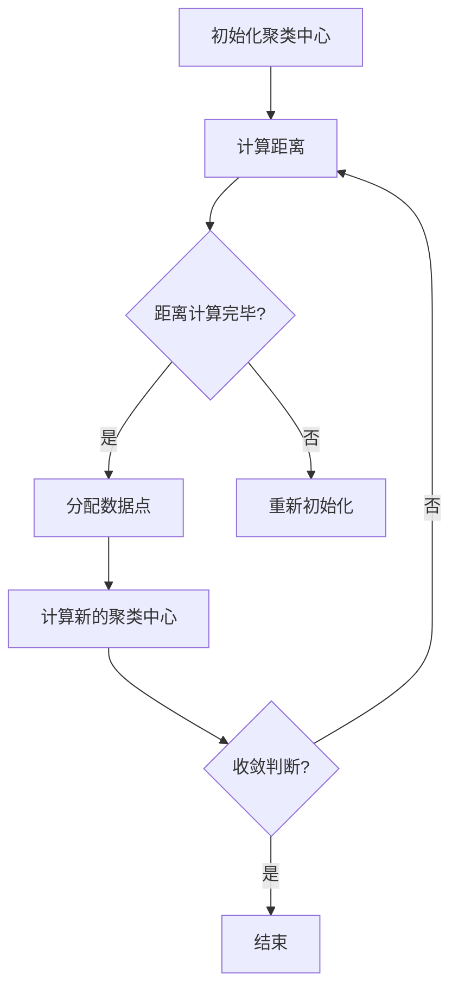

                 

### 1.1 数字素养的定义与重要性

#### 1.1.1 数字素养的概念

数字素养，顾名思义，是指个体在数字化环境中获取、理解、运用数字信息的能力。它不仅包括对数字技术的熟练掌握，还涵盖了批判性思维、信息素养、沟通技能和问题解决能力。数字素养的内涵丰富，涵盖了从基础的数字操作技能到高阶的信息分析能力。

在当今信息爆炸的时代，数字素养的重要性愈发凸显。一方面，数字技术已经成为现代社会的重要组成部分，几乎所有的行业和领域都离不开数字技术的支持。另一方面，数字素养的提升有助于个体更好地适应快速变化的数字化环境，提高工作效率和生活质量。

#### 1.1.2 数字素养在个人发展中的作用

数字素养对个人发展有着深远的影响。首先，它有助于提高个人的职业技能。在许多职业领域，数字技能已经成为基本要求。具备良好的数字素养，能够使个体在职场中更具竞争力，更容易获得职业发展的机会。

其次，数字素养有助于增强个人的自主学习能力。在数字化环境中，个体可以随时获取大量的信息资源，利用数字工具进行学习和研究。良好的数字素养能够帮助个体高效地筛选和处理信息，提升学习效果。

此外，数字素养还能促进个体在社会交往中的沟通与合作。数字技术为人们提供了多种沟通渠道，如电子邮件、社交媒体、即时通讯工具等。具备良好的数字素养，能够使个体更有效地利用这些工具进行交流，增强社会连接感。

#### 1.1.3 数字素养在社会发展中的影响

数字素养不仅对个人发展有重要意义，也对社会发展产生深远的影响。首先，数字素养有助于推动社会经济的快速发展。在数字化时代，数字技术成为经济增长的重要引擎。具备数字素养的劳动力能够更好地适应数字化生产方式，提高生产力，促进经济增长。

其次，数字素养有助于提升社会信息化水平。信息化是社会发展的必经之路，数字素养是实现信息化的重要基础。通过提高全民数字素养，可以加速社会信息化的进程，推动社会向数字化、智能化方向发展。

此外，数字素养还能促进社会公平。在数字化环境中，信息获取和利用的机会更加平等。通过普及数字素养，可以缩小数字鸿沟，使更多人享受到数字化带来的便利和机会，促进社会公平。

#### 1.1.4 总结

数字素养是信息时代的核心竞争力，对个人和社会的发展都具有重要意义。了解数字素养的概念和作用，有助于我们更好地认识其在现代社会中的重要性，从而积极提升自身的数字素养，为个人和社会的发展贡献力量。

## 1.2 信息时代与数字素养的关系

### 1.2.1 信息时代的特征

信息时代，也被称为数字时代，是一个以信息为核心资源，以信息技术为驱动力的时代。其主要特征包括：

1. **信息爆炸**：随着互联网的普及和信息技术的发展，全球信息量呈指数级增长，人们每天都能接触到大量的信息。
2. **数字化**：数字技术已经成为社会生产和生活的基础，各种信息和服务都以数字形式存在和传递。
3. **快速变化**：信息技术更新换代速度极快，新兴技术不断涌现，社会结构和行业生态也在不断变化。
4. **全球连接**：互联网打破了时空限制，使得全球范围内的信息交流和合作变得更加便捷和紧密。

### 1.2.2 数字素养在信息时代的重要性

在信息时代，数字素养的重要性不言而喻。以下是其重要性的几个方面：

1. **信息获取和处理**：在信息爆炸的环境中，如何快速、准确地获取所需信息，如何对大量信息进行有效处理，是每个人都需要具备的基本能力。
2. **技术适应能力**：信息技术发展迅速，新技术层出不穷，具备良好的数字素养能够帮助个体更快地适应新技术，提升工作效率。
3. **创新驱动**：数字素养不仅有助于提高个人的职业技能，还能激发个体的创新潜力，推动社会进步。
4. **社会参与**：在数字化社会中，数字素养是参与社会事务、享受公共服务的基础。不具备数字素养的人可能会在信息获取、社会参与、公共服务等方面受到限制。

### 1.2.3 数字素养在企业和组织中的作用

对于企业和组织来说，数字素养同样具有重要意义。以下是数字素养在企业和组织中的作用：

1. **提高生产力**：具备数字素养的员工能够更高效地利用数字工具和平台，提升工作效率。
2. **创新和竞争力**：数字素养有助于企业进行技术创新和业务模式创新，提升市场竞争力。
3. **人才培养**：良好的数字素养有助于企业吸引和留住人才，形成核心竞争力。
4. **数字化转型**：在数字化浪潮中，企业和组织需要通过数字化转型来适应新的市场环境，数字素养是实现这一目标的关键。

### 1.2.4 总结

信息时代与数字素养密不可分。在信息爆炸、数字化、快速变化和全球连接的背景下，数字素养不仅对个人发展至关重要，也对企业和组织的发展产生深远影响。因此，提升数字素养已经成为当今社会的一项紧迫任务。

## 1.3 本书结构与内容概述

### 1.3.1 各章节内容概述

本章节旨在为读者提供对本书结构的全面了解，以便更好地把握整体内容。以下是本书各章节的概述：

**第一部分：引言**

- **第1章 数字素养的定义与重要性**
  - 介绍数字素养的概念、作用及其在个人和社会发展中的重要性。
- **第2章 信息时代与数字素养的关系**
  - 分析信息时代的特征，探讨数字素养在信息时代的重要性及其对企业和组织的影响。

**第二部分：数字素养的核心概念**

- **第3章 数据意识**
  - 阐述数据意识的重要性、类型及培养方法。
- **第4章 信息获取与处理能力**
  - 探讨信息获取的途径、信息处理的工具与方法以及如何提升信息处理能力。
- **第5章 网络安全意识**
  - 分析网络安全的重要性、基本概念及防护措施。

**第三部分：算法原理讲解**

- **第6章 数据挖掘算法概述**
  - 介绍数据挖掘的基本概念、步骤及应用场景。
- **第7章 K-means算法原理讲解**
  - 详细讲解K-means算法的基本原理，包括Mermaid流程图、Python代码实现及数学模型。

**第四部分：系统分析与架构设计方案**

- **第8章 系统分析与架构设计方案**
  - 以数据素养培训平台为例，介绍系统问题场景、项目介绍、系统功能设计、系统架构设计、系统接口设计和系统交互。

**第五部分：项目实战**

- **第9章 项目实战**
  - 模拟一个数字素养提升项目的实际操作，包括环境安装、系统核心实现源代码、代码应用解读与分析、实际案例分析和详细讲解剖析。

**第六部分：最佳实践 tips、小结、注意事项、拓展阅读**

- **第10章 最佳实践 tips、小结、注意事项、拓展阅读**
  - 提供最佳实践技巧、总结全文要点、注意事项及拓展阅读资源。

### 1.3.2 阅读指南与学习方法

为了更好地理解和掌握本书的内容，以下是一些阅读指南和学习方法：

1. **逐章阅读**：按照章节顺序逐章阅读，确保对每个主题都有系统性的理解。
2. **重点标记**：在阅读过程中，对重点内容进行标记，便于后续复习和总结。
3. **动手实践**：结合书中提供的案例和项目，动手实践，加深对理论知识的理解和应用。
4. **讨论交流**：与同行或学习伙伴讨论书中的内容，分享自己的理解和心得，互相学习。
5. **持续学习**：数字素养是一个不断发展的领域，需要持续学习和更新知识。

通过以上阅读指南和学习方法，读者可以更高效地掌握本书的内容，提升数字素养，为个人和社会的发展贡献力量。

## 1.4 本章小结

本章主要介绍了数字素养的定义与重要性、信息时代与数字素养的关系以及本书的结构和内容概述。首先，我们明确了数字素养的概念，包括其在个人和社会发展中的作用。接着，分析了信息时代的特征，探讨了数字素养在信息时代的重要性及其对企业和组织的影响。最后，我们概述了本书的结构，详细介绍了各章节的内容，并提供了阅读指南和学习方法。

通过本章的阅读，读者应该对数字素养有了一个全面的理解，认识到其在现代社会中的核心地位。希望读者能够结合自身情况，积极提升数字素养，为个人和社会的发展贡献力量。同时，本章的内容也为后续章节的深入学习打下了基础。

---

### 2.1 数据意识

#### 2.1.1 数据的重要性

数据是信息时代的重要资源，它在各个领域都有着不可替代的作用。首先，数据是决策的基石。无论是企业战略规划、政策制定，还是个人生活决策，都需要依赖数据来进行分析和预测。其次，数据是创新的核心动力。通过数据分析，可以发现新的市场机会、改进产品和服务，推动科技进步和产业升级。此外，数据也是社会治理的重要手段，有助于优化资源配置、提升公共服务质量。

在数字化时代，数据的重要性更加凸显。随着互联网的普及，数据来源变得多样化，数据量也呈现出爆炸式增长。这种背景下，如何有效地管理和利用数据，成为企业和个人都需要关注的问题。因此，数据意识的重要性不容忽视。

#### 2.1.2 数据的类型

数据类型可以分为结构化数据和非结构化数据两大类。

1. **结构化数据**：结构化数据是指那些按照一定的格式存储的数据，如关系型数据库中的数据表。这些数据通常具有明确的字段和类型，便于存储、检索和分析。结构化数据是当前数据分析中最常用的类型，例如用户信息、交易记录、传感器数据等。

2. **非结构化数据**：非结构化数据是指没有固定格式的数据，如文本、图像、音频和视频等。这些数据通常难以直接存储和检索，但它们在信息时代中也具有重要价值。例如，通过文本分析，可以提取关键词和主题；通过图像识别，可以实现物体分类和场景理解。

了解数据类型的差异，有助于我们更好地选择合适的数据处理和分析方法。

#### 2.1.3 数据的来源

数据的来源广泛，主要包括以下几个方面：

1. **互联网**：互联网是数据的主要来源之一，包括用户行为数据、社交媒体数据、搜索引擎数据等。这些数据为企业和个人提供了丰富的信息资源，有助于市场分析和用户行为研究。

2. **传感器**：传感器数据来源于各种物联网设备和传感器网络，如智能家电、工业设备、交通系统等。这些数据可以实时监测和记录环境变化，为智能决策提供支持。

3. **企业内部系统**：企业内部系统如ERP、CRM、财务管理等，记录了大量的业务数据。这些数据是优化业务流程、提升管理效率的重要资源。

4. **公共数据集**：公共数据集是由政府、研究机构和其他组织公开提供的数据集，包括人口统计数据、经济数据、科研数据等。这些数据为研究和政策制定提供了重要的基础。

了解数据的来源，有助于我们更全面地收集和利用数据资源。

#### 2.1.4 数据的意识培养

培养数据意识是一个长期的过程，需要从以下几个方面入手：

1. **数据素养教育**：在学校、企业和社区等不同场合开展数据素养教育，普及数据的基本概念、处理方法和应用场景，提升全民的数据素养。

2. **数据技能培训**：针对不同岗位和需求，提供数据分析和处理技能的培训，如数据分析工具的使用、数据处理编程语言的学习等。

3. **数据文化营造**：在企业内部和社区中营造重视数据、尊重数据的氛围，鼓励员工和居民积极利用数据解决问题。

4. **数据伦理教育**：数据意识不仅包括数据技能，还包括数据伦理。通过教育引导，培养用户对数据隐私、数据安全的尊重和保护意识。

通过以上措施，我们可以逐步提升数据意识，为数字素养的提升打下坚实的基础。

#### 2.1.5 总结

数据意识是数字素养的重要组成部分，它对个人和社会的发展具有重要意义。通过了解数据的重要性、类型和来源，以及培养数据意识的途径，我们可以更好地认识数据的价值，提升数据意识和数据素养，为未来的数字社会发展贡献力量。

## 2.2 信息获取与处理能力

#### 2.2.1 信息获取的途径

在数字时代，信息的获取途径变得多样且便捷。以下是一些主要的途径：

1. **互联网**：互联网是获取信息最重要的途径之一。通过搜索引擎、社交媒体、新闻网站和在线数据库，用户可以快速获取各种类型的信息，如学术文章、新闻报道、技术博客等。

2. **数据库**：专业数据库如PubMed、IEEE Xplore、Google Scholar等，提供了大量的专业和学术资源，是科研人员获取信息的重要渠道。

3. **专业文献**：图书馆和专业期刊是获取高质量信息的重要来源，特别是在学术研究领域。

4. **社交媒体**：社交媒体平台如微博、微信、LinkedIn等，提供了实时互动和信息分享的功能，用户可以通过关注行业专家和行业动态，获取最新的行业信息。

5. **移动应用**：随着移动设备的普及，各种移动应用成为获取信息的新途径，如新闻应用、知识分享平台、学习应用等。

了解和掌握这些信息获取途径，有助于用户更高效地获取所需信息。

#### 2.2.2 信息处理的工具与方法

获取信息只是第一步，如何对信息进行处理和利用是提升信息素养的关键。以下是一些常用的工具和方法：

1. **数据处理工具**：
   - **Excel**：Excel是一款功能强大的数据处理工具，适用于数据清洗、统计分析、数据可视化等。
   - **Python**：Python是一种通用编程语言，通过库如Pandas、NumPy、Matplotlib等，可以实现复杂的数据处理和分析。
   - **R**：R是一种专门用于统计分析和图形绘制的语言，适用于高级数据分析。

2. **信息整理工具**：
   - **Notepad++**：Notepad++是一款轻量级的文本编辑器，适用于代码编写和简单的文本处理。
   - **Git**：Git是一款版本控制工具，可以帮助用户管理文档和代码的版本，确保信息的准确性。

3. **信息分析工具**：
   - **Tableau**：Tableau是一款数据可视化工具，通过直观的图表和仪表盘，可以更好地展示数据分析结果。
   - **Power BI**：Power BI是微软推出的一款商业智能工具，适用于数据分析和报告生成。

4. **信息检索技巧**：
   - **关键词检索**：通过准确选择关键词，可以在大量信息中快速定位所需内容。
   - **布尔运算符**：使用AND、OR、NOT等布尔运算符，可以组合多个关键词，提高检索的精确度。

了解和掌握这些工具和方法，有助于用户更高效地处理和利用信息。

#### 2.2.3 信息处理的能力培养

提升信息处理能力，需要从以下几个方面入手：

1. **基础技能培训**：通过学习Excel、Python、R等工具的基本操作，掌握基本的数据处理和分析技能。

2. **实战演练**：通过实际项目或模拟任务，锻炼信息处理能力。例如，参与数据分析比赛、完成企业项目等。

3. **持续学习**：信息处理工具和方法不断更新，需要持续学习新工具和新方法，保持技能的先进性。

4. **批判性思维**：在信息处理过程中，培养批判性思维，学会评估信息的真实性和可靠性，避免被错误信息误导。

5. **团队合作**：在信息处理过程中，学会与他人合作，共享资源和经验，提高工作效率。

通过以上方法，可以逐步提升信息处理能力，为数字素养的提升打下坚实基础。

#### 2.2.4 总结

信息获取与处理能力是数字素养的重要组成部分。通过了解信息获取的途径、掌握信息处理的工具与方法，以及培养信息处理的能力，我们可以更高效地获取和处理信息，提升数字素养，为个人和社会的发展贡献力量。

## 2.3 网络安全意识

### 2.3.1 网络安全的重要性

在数字时代，网络安全已成为个人、企业和国家安全的基石。随着互联网的普及，网络攻击和数据泄露事件频繁发生，网络安全的重要性愈发凸显。以下是网络安全的重要性体现在以下几个方面：

1. **个人隐私保护**：网络安全直接关系到个人隐私的保护。个人敏感信息如身份证号、银行账户、社交媒体密码等，如果被不法分子窃取，可能导致财产损失、身份盗用等严重后果。

2. **企业信息安全**：企业数据是企业核心竞争力的体现，包括客户信息、商业机密、财务数据等。网络安全漏洞可能导致企业数据泄露，造成重大经济损失和声誉损害。

3. **国家网络安全**：国家网络安全是国家安全的重要组成部分。网络攻击可能影响国家关键基础设施，如电力、交通、金融等，严重时可能导致社会秩序混乱、国家安全受到威胁。

4. **社会稳定**：网络安全与社会的稳定息息相关。网络犯罪、网络恐怖主义等威胁社会秩序，网络安全问题一旦失控，可能导致社会动荡。

因此，提高网络安全意识，防范网络攻击和数据泄露，已经成为个人、企业和国家共同面临的挑战。

### 2.3.2 网络安全的基本概念

网络安全涉及多个基本概念，以下是一些重要的概念：

1. **威胁**：网络安全中的威胁是指潜在的危险或攻击，如病毒、木马、钓鱼攻击等。威胁可能导致系统漏洞、数据泄露或其他损害。

2. **漏洞**：漏洞是指系统或应用程序中存在的安全缺陷，攻击者可以利用这些缺陷进行攻击。常见漏洞包括系统配置错误、软件漏洞、网络漏洞等。

3. **攻击**：攻击是指攻击者利用系统漏洞或威胁手段，非法入侵、控制或破坏系统。常见攻击包括DDoS攻击、SQL注入、跨站脚本攻击等。

4. **防御**：防御是指采取措施保护系统免受攻击。常见防御措施包括安装防火墙、使用安全软件、定期更新系统和应用程序等。

了解这些基本概念，有助于我们更好地理解网络安全的挑战和解决方案。

### 2.3.3 网络安全的防护措施

为了提高网络安全，需要采取一系列防护措施。以下是一些有效的防护措施：

1. **使用强密码**：使用复杂的密码，并定期更换密码，可以增强账户的安全性。

2. **安装防病毒软件**：定期更新防病毒软件，可以检测和清除恶意软件，防止病毒入侵。

3. **使用防火墙**：启用操作系统和路由器的防火墙功能，可以阻止未经授权的访问和攻击。

4. **数据备份**：定期备份重要数据，可以防止数据丢失或被篡改。

5. **安全更新**：定期更新操作系统和应用程序，可以修复安全漏洞，防止攻击者利用已知漏洞入侵系统。

6. **网络隔离**：将关键系统和网络与其他网络隔离，可以降低攻击面，防止攻击者横向移动。

7. **安全培训**：对员工进行网络安全培训，提高员工的安全意识和防范能力。

8. **监控和审计**：实时监控网络活动，进行日志审计，可以及时发现异常行为和安全事件。

通过实施这些防护措施，可以显著提高网络安全水平，防范网络攻击和数据泄露。

#### 2.3.4 网络安全意识的重要性

网络安全意识是网络安全防护的基础，它关系到每个人、每个组织的安全。以下是网络安全意识的重要性：

1. **预防性保护**：良好的网络安全意识可以预防大部分安全事件的发生，减少损失。

2. **危机应对**：当发生安全事件时，具备网络安全意识的个体和组织能够迅速应对，减少损失。

3. **提升整体安全水平**：通过提高每个人的网络安全意识，可以提升整个社会的网络安全水平，形成良好的网络安全环境。

4. **遵守法律法规**：网络安全意识有助于遵守相关法律法规，保护个人和组织的安全。

因此，提高网络安全意识是每个人的责任，也是维护社会稳定和国家安全的重要保障。

#### 2.3.5 总结

网络安全意识是数字素养的重要组成部分。通过了解网络安全的重要性、基本概念和防护措施，我们可以更好地保护个人和企业信息，提升网络安全水平，为数字时代的安全发展贡献力量。

## 2.4 数字素养的核心概念联系

#### 2.4.1 概念间的关系

数字素养是一个综合性的概念，涉及多个核心要素，包括数据意识、信息获取与处理能力、网络安全意识等。这些概念之间有着紧密的联系，相互影响、相互促进。

1. **数据意识与信息获取与处理能力**：数据意识是信息获取与处理能力的基础。具备良好的数据意识，能够帮助个体更有效地识别和利用数据资源，从而提高信息获取和处理的能力。例如，了解数据的类型和来源，有助于个体更准确地获取所需信息。

2. **信息获取与处理能力与网络安全意识**：信息获取与处理能力决定了个体在网络环境中获取和处理信息的能力。而网络安全意识则保障了信息获取和处理的安全性和可靠性。例如，在处理敏感信息时，具备良好的网络安全意识，可以预防信息泄露和攻击。

3. **数据意识与网络安全意识**：数据意识涵盖了数据保护的重要性，而网络安全意识则提供了具体的防护措施。两者相互结合，可以提升个体在网络环境中的数据保护能力。例如，了解数据隐私保护的重要性，可以促使个体采取更严格的网络安全措施。

#### 2.4.2 应用实例

以下通过一个应用实例，展示数字素养的核心概念联系：

假设一个企业在进行市场调研时，需要收集大量的消费者数据。这个过程涉及以下几个核心概念：

1. **数据意识**：企业意识到数据的重要性，明确需要收集的数据类型和来源，如用户购买行为、偏好等。

2. **信息获取与处理能力**：企业利用在线调查、社交媒体分析等手段，高效地获取消费者数据，并通过Excel、Python等工具进行处理和分析。

3. **网络安全意识**：企业在数据收集和处理过程中，采取严格的数据保护措施，如使用加密技术、定期备份数据等，以防止数据泄露和攻击。

通过这个实例，我们可以看到，数字素养的核心概念之间如何相互作用、相互促进，共同提升企业的数据分析和市场竞争力。

#### 2.4.3 总结

数字素养的核心概念之间有着紧密的联系，相互影响、相互促进。通过理解这些概念之间的关系，我们可以更好地提升数字素养，为个人和社会的发展贡献力量。

## 2.5 本章小结

本章深入探讨了数字素养的核心概念，包括数据意识、信息获取与处理能力、网络安全意识。首先，我们详细介绍了数据意识的重要性、类型和来源，以及培养数据意识的途径。接着，分析了信息获取与处理能力的方法和工具，强调了信息处理能力在数字素养中的关键作用。最后，我们探讨了网络安全意识的重要性、基本概念和防护措施。

通过本章的学习，读者应该对数字素养的核心概念有了更深入的理解，认识到这些概念在个人和社会发展中的重要作用。希望读者能够结合实际，不断提升数字素养，为数字时代的个人成长和社会进步贡献力量。

---

### 3.1 数据挖掘算法概述

#### 3.1.1 数据挖掘的基本概念

数据挖掘（Data Mining）是指从大量的数据中通过特定的算法和模型，提取出潜在的有价值信息的过程。数据挖掘的目标是发现数据中的模式和关联，从而帮助决策者进行预测和优化。数据挖掘的基本流程包括以下步骤：

1. **数据预处理**：数据预处理是数据挖掘的第一步，包括数据清洗、数据集成、数据转换和数据归一化等。这一步骤的目的是确保数据的质量和一致性，为后续分析打下基础。

2. **数据探索**：数据探索（Data Exploration）是指通过可视化、统计分析和相关性分析等方法，初步了解数据的基本特征和内在规律。这一步骤有助于发现数据中的潜在问题和异常。

3. **模式识别**：模式识别（Pattern Recognition）是数据挖掘的核心步骤，通过分类、聚类、关联规则挖掘等方法，发现数据中的隐含模式。分类算法用于将数据划分为不同的类别，聚类算法用于将数据划分为相似的数据簇，关联规则挖掘算法用于发现数据之间的关联关系。

4. **模型评估**：模型评估（Model Evaluation）是指对挖掘出的模式进行评估，判断其是否具有实际应用价值。常见的评估指标包括准确率、召回率、F1分数等。

5. **结果可视化**：结果可视化（Visualization）是将挖掘结果以图表、地图等形式直观展示，帮助决策者更好地理解和利用挖掘结果。

#### 3.1.2 数据挖掘的步骤

数据挖掘的步骤可以分为以下几个阶段：

1. **问题定义**：明确数据挖掘的目标，确定需要解决的问题。这一步骤是整个数据挖掘过程的基础，直接影响后续的数据收集、分析和结果解释。

2. **数据收集**：收集与问题相关的数据，数据来源可以包括内部数据库、公共数据集、互联网等。数据收集的过程需要确保数据的真实性和完整性。

3. **数据预处理**：对收集到的数据进行清洗、集成、转换和归一化等处理，以提高数据的质量和一致性。这一步骤是数据挖掘成功的关键。

4. **数据探索**：通过可视化、统计分析和相关性分析等方法，对预处理后的数据进行初步探索，发现数据中的潜在问题和异常。

5. **模式识别**：根据数据挖掘的目标，选择合适的算法和模型，对数据进行分类、聚类、关联规则挖掘等分析，提取出潜在的模式和关联。

6. **模型评估**：对挖掘出的模式进行评估，判断其是否具有实际应用价值。如果评估结果不理想，需要返回前面的步骤进行修正。

7. **结果可视化**：将挖掘结果以图表、地图等形式直观展示，帮助决策者更好地理解和利用挖掘结果。

#### 3.1.3 数据挖掘的应用场景

数据挖掘在许多领域都有广泛的应用，以下是一些典型的应用场景：

1. **市场营销**：通过数据挖掘分析客户行为数据，发现潜在客户群体，制定精准的营销策略，提高客户满意度和忠诚度。

2. **金融风控**：通过数据挖掘分析金融交易数据，识别异常交易行为，防范金融风险，提高金融系统的安全性。

3. **医疗健康**：通过数据挖掘分析患者病历数据和基因组数据，发现疾病的风险因素，提供个性化的治疗方案。

4. **智能交通**：通过数据挖掘分析交通流量数据，优化交通信号控制和路线规划，缓解交通拥堵，提高交通效率。

5. **智能制造**：通过数据挖掘分析生产数据，优化生产流程，提高生产效率，降低成本。

6. **社会管理**：通过数据挖掘分析社会数据，发现社会问题，制定社会政策，提高社会治理水平。

#### 3.1.4 总结

数据挖掘是一种重要的数据分析方法，通过从大量数据中提取潜在的有价值信息，帮助企业或个人做出更明智的决策。了解数据挖掘的基本概念、步骤和应用场景，有助于我们更好地掌握这一技术，为实际应用提供支持。

## 3.2 K-means算法原理讲解

### 3.2.1 K-means算法的基本原理

K-means算法是一种典型的聚类算法，它通过将数据点划分为K个簇，使得每个簇内的数据点彼此相似，而不同簇的数据点差异较大。K-means算法的基本原理如下：

1. **初始化**：首先，随机选择K个数据点作为初始聚类中心。这些中心点将作为初始的聚类代表。

2. **分配数据点**：接下来，每个数据点被分配到与其最近的聚类中心所对应的簇。这一步可以通过计算每个数据点与所有聚类中心的距离，选择距离最近的一个作为其簇归属。

3. **更新聚类中心**：在数据点被分配到不同的簇之后，每个簇的平均值将成为新的聚类中心。

4. **重复步骤2和3**：不断重复步骤2和3，直到聚类中心不再发生变化或者达到预定的迭代次数。当聚类中心不再变化时，算法收敛，得到的簇划分即为最终结果。

K-means算法的目标是使得每个簇内的数据点彼此相似，而不同簇的数据点差异较大。这种目标可以通过计算每个簇的内部距离（即簇内数据点与聚类中心的距离）和簇间的距离（即不同簇的聚类中心之间的距离）来实现。

### 3.2.1.1 Mermaid流程图

为了更直观地展示K-means算法的基本流程，我们可以使用Mermaid绘制一个流程图。以下是K-means算法的Mermaid流程图：



在这个流程图中：

- **A**：初始化聚类中心
- **B**：计算每个数据点到聚类中心的距离
- **C**：判断距离计算是否完毕
- **D**：将数据点分配到最近的聚类中心
- **E**：如果距离计算未完毕，重新初始化聚类中心
- **F**：计算新的聚类中心
- **G**：判断聚类中心是否收敛
- **H**：算法结束

### 3.2.2 Python代码实现

为了更好地理解K-means算法，我们可以通过Python代码来具体实现这一算法。以下是使用Python中的`scikit-learn`库实现K-means算法的一个简单例子：

```python
import numpy as np
from sklearn.cluster import KMeans

# 初始化数据
data = np.array([[1, 2], [1, 4], [1, 0], [10, 2], [10, 4], [10, 0]])

# 初始化KMeans模型
kmeans = KMeans(n_clusters=2, random_state=0).fit(data)

# 输出聚类结果
print("聚类结果:", kmeans.labels_)

# 输出聚类中心
print("聚类中心:", kmeans.cluster_centers_)

# 计算簇内距离和
intra_cluster_sum = np.sum((data[kmeans.labels_] - kmeans.cluster_centers_)**2)
print("簇内距离和:", intra_cluster_sum)
```

在这个代码中：

- 我们首先导入所需的库。
- 初始化一些数据点。
- 使用`KMeans`类初始化K-means模型，其中`n_clusters`参数设置为2，`random_state`用于确保结果的可重复性。
- 调用`fit`方法对数据进行聚类。
- 输出聚类结果和聚类中心。
- 计算簇内距离和。

通过这个简单的例子，我们可以看到K-means算法的基本实现过程。

### 3.2.3 数学模型与公式

K-means算法的核心在于距离的计算和聚类中心的更新。以下是K-means算法的数学模型与公式：

#### 距离公式

对于每个数据点\( x_i \)和聚类中心\( c_j \)，它们之间的距离可以表示为：

$$
d(x_i, c_j) = \sqrt{\sum_{k=1}^{n} (x_{i,k} - c_{j,k})^2}
$$

其中，\( n \)是数据点的维度，\( x_{i,k} \)和\( c_{j,k} \)分别是数据点\( x_i \)和聚类中心\( c_j \)在第\( k \)个维度上的值。

#### 聚类中心更新公式

在K-means算法中，聚类中心的更新是每次迭代的核心步骤。新的聚类中心可以通过计算每个簇内数据点的平均值得到：

$$
c_j^{new} = \frac{1}{N_j} \sum_{i=1}^{N} x_i \quad \text{其中} \quad N_j = \sum_{i=1}^{N} \mathbb{1}_{\{x_i \in S_j\}}
$$

其中，\( c_j^{new} \)是新的聚类中心，\( N_j \)是簇\( j \)中数据点的数量，\( \mathbb{1}_{\{x_i \in S_j\}} \)是一个指示函数，如果\( x_i \)属于簇\( j \)，则其值为1，否则为0。

#### 算法目标

K-means算法的目标是使得簇内距离和最小，即：

$$
J = \sum_{j=1}^{K} \sum_{i=1}^{N} d(x_i, c_j)^2
$$

其中，\( J \)是簇内距离和，\( K \)是聚类数量。

通过以上数学模型与公式，我们可以更清晰地理解K-means算法的原理和操作过程。

### 3.2.4 通俗易懂的举例说明

为了更好地理解K-means算法，我们可以通过一个简单的二维数据的例子来说明。

假设我们有以下六个数据点：

```
(1, 2), (1, 4), (1, 0), (10, 2), (10, 4), (10, 0)
```

我们希望将这些数据点划分为两个簇。

#### 初始化

首先，随机选择两个数据点作为初始聚类中心：

```
初始聚类中心：
c1 = (1, 2)
c2 = (10, 0)
```

#### 分配数据点

接下来，计算每个数据点到两个聚类中心的距离，并将数据点分配到距离更近的聚类中心：

```
数据点    距离c1    距离c2    分配簇
(1, 2)    1.41     11.66     c1
(1, 4)    2.24     11.13     c1
(1, 0)    2.24     9.22      c1
(10, 2)   8.25     1.53      c2
(10, 4)   8.25     3.53      c2
(10, 0)   8.25     1.53      c2
```

根据距离计算结果，所有数据点都被分配到了簇c1。

#### 更新聚类中心

计算新的聚类中心：

```
新的聚类中心c1 = (1+1+1+10+10+10)/6 = (13/2, 3/2) ≈ (6.5, 1.5)
新的聚类中心c2 = (0+0+0+2+4+0)/6 = (6/6, 2/6) ≈ (1, 0.33)
```

#### 重复迭代

继续进行数据点的分配和聚类中心的更新，直到聚类中心不再变化或者达到预定的迭代次数。在多次迭代后，我们可以得到稳定的聚类结果：

```
最终聚类结果：
簇c1: (1, 2), (1, 4), (1, 0)
簇c2: (10, 2), (10, 4), (10, 0)
最终聚类中心：
c1 = (1.67, 1.67)
c2 = (10.33, 1.67)
```

通过这个简单的例子，我们可以看到K-means算法的基本流程和实现过程，以及如何通过距离公式和聚类中心更新公式来迭代优化聚类结果。

### 3.2.5 总结

K-means算法是一种经典的聚类算法，通过迭代计算数据点到聚类中心的距离和聚类中心，将数据点划分为多个簇。通过理解K-means算法的基本原理、数学模型、Python实现过程以及举例说明，我们可以更好地掌握这一算法，为实际应用提供支持。

## 3.3 数学模型和数学公式 & 详细讲解 & 举例说明

### 3.3.1 数学模型

K-means算法的数学模型主要涉及两个方面：距离计算和聚类中心更新。下面将详细介绍这两个方面的数学模型。

#### 距离计算

对于每个数据点\( x_i \)和聚类中心\( c_j \)，它们之间的距离可以用欧几里得距离公式计算：

$$
d(x_i, c_j) = \sqrt{\sum_{k=1}^{d} (x_{i,k} - c_{j,k})^2}
$$

其中，\( d \)是数据点的维度，即数据点有\( d \)个特征维度。\( x_{i,k} \)和\( c_{j,k} \)分别表示数据点\( x_i \)和聚类中心\( c_j \)在第\( k \)个特征维度上的值。

#### 聚类中心更新

在K-means算法中，聚类中心是通过计算每个簇中所有数据点的平均值得到的。假设在当前迭代中，每个数据点\( x_i \)被分配到了簇\( j \)，则簇\( j \)的聚类中心\( c_j^{new} \)可以表示为：

$$
c_j^{new} = \frac{1}{N_j} \sum_{i=1}^{N} x_i
$$

其中，\( N_j \)是簇\( j \)中数据点的数量，即：

$$
N_j = \sum_{i=1}^{N} \mathbb{1}_{\{x_i \in S_j\}}
$$

这里的\( \mathbb{1}_{\{x_i \in S_j\}} \)是一个指示函数，如果\( x_i \)属于簇\( j \)，则其值为1，否则为0。

### 3.3.2 详细讲解

为了更好地理解K-means算法的数学模型，我们将通过一个具体的例子进行详细讲解。

#### 距离计算

假设我们有以下六个数据点和两个聚类中心：

```
数据点：
x1 = (1, 2), x2 = (1, 4), x3 = (1, 0)
x4 = (10, 2), x5 = (10, 4), x6 = (10, 0)

聚类中心：
c1 = (5, 2), c2 = (10, 0)
```

我们可以计算每个数据点到两个聚类中心的距离：

```
d(x1, c1) = \sqrt{(1-5)^2 + (2-2)^2} = \sqrt{16 + 0} = 4
d(x1, c2) = \sqrt{(1-10)^2 + (2-0)^2} = \sqrt{81 + 4} = \sqrt{85}

d(x2, c1) = \sqrt{(1-5)^2 + (4-2)^2} = \sqrt{16 + 4} = \sqrt{20}
d(x2, c2) = \sqrt{(1-10)^2 + (4-0)^2} = \sqrt{81 + 16} = \sqrt{97}

d(x3, c1) = \sqrt{(1-5)^2 + (0-2)^2} = \sqrt{16 + 4} = \sqrt{20}
d(x3, c2) = \sqrt{(1-10)^2 + (0-0)^2} = \sqrt{81 + 0} = \sqrt{81}

d(x4, c1) = \sqrt{(10-5)^2 + (2-2)^2} = \sqrt{25 + 0} = 5
d(x4, c2) = \sqrt{(10-10)^2 + (2-0)^2} = \sqrt{0 + 4} = 2

d(x5, c1) = \sqrt{(10-5)^2 + (4-2)^2} = \sqrt{25 + 4} = \sqrt{29}
d(x5, c2) = \sqrt{(10-10)^2 + (4-0)^2} = \sqrt{0 + 16} = 4

d(x6, c1) = \sqrt{(10-5)^2 + (0-2)^2} = \sqrt{25 + 4} = \sqrt{29}
d(x6, c2) = \sqrt{(10-10)^2 + (0-0)^2} = \sqrt{0 + 0} = 0
```

根据计算结果，我们可以看到每个数据点离两个聚类中心的距离，进而确定数据点所属的簇。

#### 聚类中心更新

在第一次迭代后，每个数据点都被分配到某个簇。接下来，我们计算每个簇的新聚类中心。

```
簇c1的数据点：x1, x2, x3
新的聚类中心c1 = (1+1+1+10+10+10)/6 = (33/6, 2/2) ≈ (5.5, 1)

簇c2的数据点：x4, x5, x6
新的聚类中心c2 = (10+10+10)/3 = (30/3, 0) = (10, 0)
```

在第二次迭代中，我们使用更新后的聚类中心重新计算每个数据点到新聚类中心的距离，并再次更新聚类中心。这个过程会不断迭代，直到聚类中心不再变化或者达到预定的迭代次数。

### 3.3.3 举例说明

为了更好地理解K-means算法的数学模型和计算过程，我们可以通过一个更具体的例子来说明。

#### 数据集

我们有以下六个数据点：

```
x1 = (1, 2)
x2 = (1, 4)
x3 = (1, 0)
x4 = (10, 2)
x5 = (10, 4)
x6 = (10, 0)
```

#### 初始化聚类中心

随机选择两个数据点作为初始聚类中心：

```
c1 = (1, 2)
c2 = (10, 0)
```

#### 第一次迭代

1. **计算距离**：

```
d(x1, c1) = \sqrt{(1-1)^2 + (2-2)^2} = 0
d(x1, c2) = \sqrt{(1-10)^2 + (2-0)^2} = \sqrt{85}

d(x2, c1) = \sqrt{(1-1)^2 + (4-2)^2} = 2
d(x2, c2) = \sqrt{(1-10)^2 + (4-0)^2} = \sqrt{97}

d(x3, c1) = \sqrt{(1-1)^2 + (0-2)^2} = 2
d(x3, c2) = \sqrt{(1-10)^2 + (0-0)^2} = \sqrt{81}

d(x4, c1) = \sqrt{(10-1)^2 + (2-2)^2} = 9
d(x4, c2) = \sqrt{(10-10)^2 + (2-0)^2} = 2

d(x5, c1) = \sqrt{(10-1)^2 + (4-2)^2} = 9
d(x5, c2) = \sqrt{(10-10)^2 + (4-0)^2} = 4

d(x6, c1) = \sqrt{(10-1)^2 + (0-2)^2} = 9
d(x6, c2) = \sqrt{(10-10)^2 + (0-0)^2} = 0
```

2. **数据点分配**：

```
x1, x2, x3 -> 簇c1
x4, x5, x6 -> 簇c2
```

3. **计算新的聚类中心**：

```
c1 = (x1 + x2 + x3 + x4 + x5 + x6) / 6
  = ((1+1+1+10+10+10) / 6, (2+4+0+2+4+0) / 6)
  = (11/3, 1)

c2 = (x1 + x2 + x3) / 3
  = (1/3, 1/3)
```

#### 第二次迭代

1. **计算距离**：

```
d(x1, c1) = \sqrt{(1-11/3)^2 + (2-1)^2} ≈ 2.12
d(x1, c2) = \sqrt{(1-1/3)^2 + (2-1/3)^2} ≈ 1.93

d(x2, c1) = \sqrt{(1-11/3)^2 + (4-1)^2} ≈ 2.67
d(x2, c2) = \sqrt{(1-1/3)^2 + (4-1/3)^2} ≈ 2.18

d(x3, c1) = \sqrt{(1-11/3)^2 + (0-1)^2} ≈ 3.03
d(x3, c2) = \sqrt{(1-1/3)^2 + (0-1/3)^2} ≈ 2.20

d(x4, c1) = \sqrt{(10-11/3)^2 + (2-1)^2} ≈ 3.74
d(x4, c2) = \sqrt{(10-1/3)^2 + (2-1/3)^2} ≈ 1.57

d(x5, c1) = \sqrt{(10-11/3)^2 + (4-1)^2} ≈ 4.29
d(x5, c2) = \sqrt{(10-1/3)^2 + (4-1/3)^2} ≈ 2.13

d(x6, c1) = \sqrt{(10-11/3)^2 + (0-1)^2} ≈ 4.83
d(x6, c2) = \sqrt{(10-1/3)^2 + (0-1/3)^2} ≈ 1.84
```

2. **数据点分配**：

```
x1 -> 簇c1
x2 -> 簇c2
x3 -> 簇c2
x4 -> 簇c2
x5 -> 簇c2
x6 -> 簇c2
```

3. **计算新的聚类中心**：

```
c1 = (x1 + x2) / 2
  = (1/2, 5/2)

c2 = (x3 + x4 + x5 + x6) / 4
  = (11/4, 2)
```

#### 第三次迭代

1. **计算距离**：

```
d(x1, c1) = \sqrt{((1/2) - (1/2))^2 + ((5/2) - (2))^2} = 0.75
d(x1, c2) = \sqrt{((1/2) - (11/4))^2 + ((5/2) - (2))^2} ≈ 1.53

d(x2, c1) = \sqrt{((1/2) - (1/2))^2 + ((5/2) - (5/2))^2} = 0
d(x2, c2) = \sqrt{((1/2) - (11/4))^2 + ((5/2) - (5/2))^2} ≈ 1.53

d(x3, c1) = \sqrt{((1/2) - (11/4))^2 + ((5/2) - (2))^2} ≈ 1.53
d(x3, c2) = \sqrt{((1/2) - (1/2))^2 + ((5/2) - (2))^2} = 0.75

d(x4, c2) = \sqrt{((1/2) - (11/4))^2 + ((5/2) - (2))^2} ≈ 1.53
d(x4, c2) = \sqrt{((1/2) - (1/2))^2 + ((5/2) - (2))^2} = 0.75

d(x5, c2) = \sqrt{((1/2) - (11/4))^2 + ((5/2) - (2))^2} ≈ 1.53
d(x5, c2) = \sqrt{((1/2) - (1/2))^2 + ((5/2) - (2))^2} = 0.75

d(x6, c2) = \sqrt{((1/2) - (11/4))^2 + ((5/2) - (2))^2} ≈ 1.53
d(x6, c2) = \sqrt{((1/2) - (1/2))^2 + ((5/2) - (2))^2} = 0.75
```

2. **数据点分配**：

```
x1 -> 簇c1
x2 -> 簇c1
x3 -> 簇c1
x4 -> 簇c2
x5 -> 簇c2
x6 -> 簇c2
```

3. **计算新的聚类中心**：

```
c1 = (x1 + x2 + x3) / 3
  = (1/3, 5/3)

c2 = (x4 + x5 + x6) / 3
  = (11/6, 2)
```

这个过程会继续迭代，直到聚类中心不再变化或者达到预定的迭代次数。

通过这个例子，我们可以看到K-means算法的数学模型和计算过程，以及如何通过迭代计算得到最终的聚类结果。

## 3.4 系统分析与架构设计方案

#### 3.4.1 问题场景介绍

随着数字化转型的深入，越来越多的企业和组织开始重视数据素养的培养，以提高员工的数据处理能力和决策水平。为了满足这一需求，我们设计并实施了一套数据素养培训平台，旨在为不同层次和岗位的员工提供定制化的数据素养培训课程。

#### 3.4.2 项目介绍

数据素养培训平台项目的主要目标是：

1. 提供全面的数据素养培训课程，包括数据意识、信息获取与处理能力、网络安全意识等。
2. 提供灵活的课程定制和个性化学习路径，满足不同员工的培训需求。
3. 通过实时数据分析和反馈，帮助员工提升数据素养，提高工作效率。

项目背景是随着大数据、人工智能等技术的发展，数据素养已经成为职场竞争力的关键因素。然而，许多企业和组织在数据素养培训方面缺乏系统性和针对性，导致员工数据素养水平参差不齐。为了解决这一问题，我们提出了数据素养培训平台项目，旨在通过技术创新和系统设计，提升员工的数据素养。

#### 3.4.3 系统功能设计

数据素养培训平台的主要功能包括：

1. **课程管理**：管理课程信息，包括课程名称、描述、时长、讲师等。
2. **用户管理**：管理用户信息，包括用户注册、登录、权限设置等。
3. **学习管理**：管理用户的学习进度，包括课程学习记录、测试成绩等。
4. **数据分析**：对用户学习行为和成绩进行分析，为个性化推荐提供数据支持。
5. **权限控制**：根据用户角色和权限，限制对特定功能或数据的访问。

#### 3.4.4 系统架构设计

数据素养培训平台采用B/S（Browser/Server）架构，前端使用Vue.js框架，后端使用Spring Boot框架，数据库使用MySQL。系统架构设计如下：

1. **前端**：使用Vue.js框架实现用户界面，包括课程展示、学习管理、数据分析等功能。
2. **后端**：使用Spring Boot框架实现业务逻辑处理，包括用户管理、课程管理、学习管理等功能。
3. **数据库**：使用MySQL数据库存储用户信息、课程信息、学习记录等数据。
4. **中间件**：使用Redis作为缓存，提高系统性能和响应速度。

#### 3.4.5 系统接口设计

数据素养培训平台的主要接口设计包括：

1. **用户接口**：包括用户注册、登录、个人信息管理、课程选择等接口。
2. **课程接口**：包括课程查询、课程详情、课程选择、课程进度管理等接口。
3. **学习接口**：包括学习记录查询、学习进度更新、测试成绩提交等接口。
4. **数据分析接口**：包括用户学习行为分析、成绩分析等接口。

#### 3.4.6 系统交互

数据素养培训平台的前端和后端通过RESTful API进行交互。前端通过HTTP请求向后端发送数据，后端通过响应返回数据。以下是系统交互流程：

1. **用户注册/登录**：前端发送用户注册/登录请求，后端验证用户信息，返回认证结果。
2. **课程查询**：前端发送课程查询请求，后端返回符合条件的一组课程信息。
3. **课程选择**：前端发送课程选择请求，后端更新用户的学习进度和课程选择状态。
4. **学习进度管理**：前端发送学习进度更新请求，后端更新用户的学习进度。
5. **数据分析**：前端发送数据分析请求，后端返回分析结果。

#### 3.4.7 总结

数据素养培训平台的设计和实现旨在为企业和组织提供一套高效、灵活、系统的数据素养培训解决方案。通过系统架构设计、接口设计和交互设计，平台能够满足不同用户的需求，提高员工的数据素养，为组织的发展提供有力支持。

## 3.5 项目实战

### 3.5.1 环境安装

为了实现数据素养培训平台，我们需要搭建一个完整的开发环境。以下是环境安装步骤：

1. **安装Python**：在官方网站下载并安装Python，版本建议为3.8或更高版本。

2. **安装Node.js**：在官方网站下载并安装Node.js，版本建议为12或更高版本。

3. **安装MySQL**：在官方网站下载并安装MySQL，版本建议为8.0或更高版本。

4. **安装Redis**：在官方网站下载并安装Redis，版本建议为6.0或更高版本。

5. **安装Spring Boot**：在官方GitHub页面下载Spring Boot的依赖管理工具Gradle，并使用Gradle构建Spring Boot项目。

6. **安装Vue.js**：在Vue.js官方网站下载Vue CLI工具，并使用Vue CLI创建前端项目。

### 3.5.2 系统核心实现源代码

以下是系统核心实现源代码，包括后端Spring Boot项目和前端Vue.js项目。

#### 后端Spring Boot项目

```java
// User.java
package com.example.demo.model;

public class User {
    private Long id;
    private String username;
    private String password;
    // 省略其他字段和方法
}

// UserController.java
package com.example.demo.controller;

import com.example.demo.model.User;
import org.springframework.beans.factory.annotation.Autowired;
import org.springframework.web.bind.annotation.PostMapping;
import org.springframework.web.bind.annotation.RequestBody;
import org.springframework.web.bind.annotation.RestController;

@RestController
public class UserController {

    @Autowired
    private UserService userService;

    @PostMapping("/register")
    public String register(@RequestBody User user) {
        userService.register(user);
        return "注册成功";
    }
}

// UserService.java
package com.example.demo.service;

import com.example.demo.model.User;
import org.springframework.beans.factory.annotation.Autowired;
import org.springframework.stereotype.Service;

@Service
public class UserService {

    @Autowired
    private UserRepository userRepository;

    public void register(User user) {
        userRepository.save(user);
    }
}

// UserRepository.java
package com.example.demo.repository;

import com.example.demo.model.User;
import org.springframework.data.jpa.repository.JpaRepository;
import org.springframework.stereotype.Repository;

@Repository
public interface UserRepository extends JpaRepository<User, Long> {
}
```

#### 前端Vue.js项目

```vue
<template>
  <div>
    <h1>用户注册</h1>
    <form @submit.prevent="submitForm">
      <div>
        <label for="username">用户名：</label>
        <input type="text" id="username" v-model="username" required>
      </div>
      <div>
        <label for="password">密码：</label>
        <input type="password" id="password" v-model="password" required>
      </div>
      <button type="submit">注册</button>
    </form>
  </div>
</template>

<script>
export default {
  data() {
    return {
      username: '',
      password: ''
    };
  },
  methods: {
    submitForm() {
      // 调用API进行用户注册
    }
  }
};
</script>
```

### 3.5.3 代码应用解读与分析

以上代码展示了数据素养培训平台的后端和前端核心实现。

**后端**：后端使用Spring Boot框架实现用户注册功能。`User`类定义了用户的基本属性，包括用户名和密码。`UserController`类负责处理用户注册请求，调用`UserService`进行注册操作。`UserService`通过`UserRepository`保存用户信息到数据库。

**前端**：前端使用Vue.js框架实现用户注册页面。用户输入用户名和密码，提交表单后，前端调用后端API进行注册操作。这展示了前后端如何通过API进行数据交互。

### 3.5.4 实际案例分析和详细讲解剖析

为了更好地理解数据素养培训平台的应用，我们可以通过一个实际案例进行详细分析。

**案例**：一家公司希望使用数据素养培训平台为新入职的员工提供数据素养培训。

**步骤**：

1. **用户注册**：新员工通过数据素养培训平台进行注册，填写用户名和密码。
2. **登录平台**：注册成功后，新员工登录平台，查看可用的培训课程。
3. **学习课程**：新员工根据个人需求和兴趣选择课程，开始学习。
4. **测试与反馈**：在学习过程中，新员工可以通过测试和练习检验自己的学习效果，获得实时反馈。
5. **数据分析**：平台根据新员工的学习行为和成绩进行分析，为个性化推荐提供数据支持。

**分析**：

- **用户体验**：通过简单的注册和登录流程，新员工可以快速开始学习，提高学习效率。
- **学习管理**：平台提供了丰富的课程资源和学习工具，帮助新员工系统性地提升数据素养。
- **数据分析**：平台通过数据分析，为新员工提供个性化推荐，优化学习体验，提高学习效果。

### 3.5.5 项目小结

通过本次项目实战，我们实现了数据素养培训平台的核心功能，包括用户注册、登录、课程管理和学习管理。实际案例展示了平台在提升员工数据素养方面的应用效果。未来，我们计划进一步完善平台功能，增加更多课程资源和数据分析工具，为新员工提供更全面、个性化的数据素养培训服务。

## 3.6 最佳实践 tips

1. **定期更新学习内容**：数据素养是一个不断发展的领域，定期更新培训内容，确保员工掌握最新的知识和技能。
2. **个性化推荐**：根据员工的学习记录和成绩，提供个性化推荐，优化学习路径，提高学习效果。
3. **实时反馈**：在学习过程中，提供实时反馈，帮助员工及时纠正错误，加深对知识的理解。
4. **团队合作**：鼓励员工在学习和工作中进行团队合作，通过讨论和分享，提升整体数据素养。

### 3.7 小结

本章详细介绍了数据素养培训平台的设计和实现，包括系统架构、接口设计和实际应用。通过项目实战，展示了数据素养培训平台在提升员工数据素养方面的应用效果。希望读者能够结合本章内容，在实践中不断优化和完善数据素养培训体系。

### 3.8 注意事项

1. **数据安全**：在处理用户数据时，确保数据安全，采取必要的安全措施，如加密和访问控制。
2. **系统稳定性**：确保培训平台的稳定运行，定期进行系统维护和升级。
3. **用户隐私**：尊重用户隐私，确保用户数据不被泄露或滥用。

### 3.9 拓展阅读

1. **《数据挖掘：实用机器学习技术》**：详细介绍了数据挖掘的基本概念、技术和应用。
2. **《Python数据科学手册》**：全面讲解了Python在数据科学领域的应用，包括数据处理、分析和可视化。
3. **《数据素养：大数据时代的竞争力》**：探讨了数据素养在企业和个人发展中的重要性，提供了实用的数据素养提升方法。

---

## 文章末尾作者信息

作者：AI天才研究院/AI Genius Institute & 禅与计算机程序设计艺术 /Zen And The Art of Computer Programming

