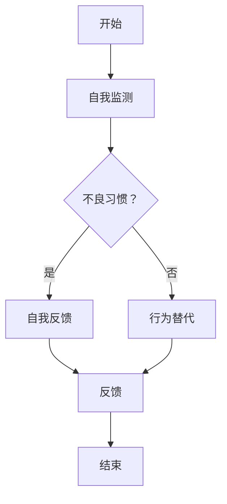
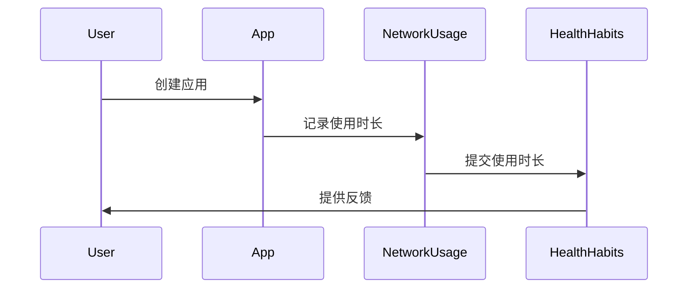

                 

```markdown
## 《数字解毒训练营：重建健康网络习惯的集中课程》

### 关键词：数字健康，网络习惯，认知行为疗法，环境管理，社会支持

### 摘要：

在当今互联网时代，数字信息的泛滥和过度消费已成为影响人们身心健康的一个重要因素。本课程旨在帮助读者识别并重建健康网络习惯，通过系统的方法论和实际案例，提供全面的数字健康解决方案。本文将逐步分析数字信息对健康的影响，介绍数字习惯与健康网络习惯的区别，探讨重建健康网络习惯的方法，并通过具体案例展示如何将理论应用到实践中。最终，本文将总结最佳实践，帮助读者制定个性化的健康网络习惯计划。

----------------------------------------------------------------

## 第1章：问题的提出

### 1.1 数字信息泛滥与身心健康负担

#### 1.1.1 数字信息的快速传播

互联网的快速发展使得数字信息得以迅速传播，人们通过电脑、手机等设备可以随时随地访问各种信息。这种便利性虽然提升了生活的效率，但也导致了数字信息的过度消费。

#### 1.1.2 数字信息消费对健康的影响

长时间注视屏幕不仅会导致眼睛疲劳，还会引发颈椎病、肥胖等问题。此外，沉迷于数字世界的人们往往会忽视现实生活中的社交互动，导致心理健康问题。

### 1.2 数字习惯与健康网络习惯的对比

#### 1.2.1 数字习惯的特征

数字习惯是指人们在数字世界中养成的一系列行为模式，包括上网时间、社交媒体使用、在线购物等。这些习惯往往缺乏计划性，容易导致时间的无谓浪费。

#### 1.2.2 健康网络习惯的特征

健康网络习惯是在数字习惯的基础上进行优化，旨在提高身心健康。这种习惯更加注重时间管理、减少屏幕暴露、保持良好的坐姿和深度交流。

### 1.3 重建健康网络习惯的重要性

重建健康网络习惯不仅有助于提高生活质量，还能帮助人们更好地管理时间和注意力，减轻身心健康负担。本课程将提供一系列方法论和实际案例，帮助读者逐步实现这一目标。

----------------------------------------------------------------

## 第2章：核心概念

### 2.1 数字习惯

数字习惯是人们在数字世界中形成的行为模式。这些习惯往往是不自觉的，但随着时间的推移，它们会对个人的生活产生深远的影响。

#### 2.1.1 数字习惯的构成

数字习惯的构成包括上网时间、社交媒体使用、在线购物等。每种习惯都有其特定的行为特征和影响。

#### 2.1.2 数字习惯的影响

数字习惯对个人生活的影响包括时间管理、身体健康、心理健康等方面。长期的不良习惯会导致生活质量的下降。

### 2.2 健康网络习惯

健康网络习惯是在数字习惯的基础上进行优化，以提升身心健康为目标。这种习惯更加注重行为的计划性和积极性。

#### 2.2.1 健康网络习惯的构成

健康网络习惯的构成包括合理安排上网时间、减少屏幕暴露、保持良好的坐姿、培养深度交流等。

#### 2.2.2 健康网络习惯的影响

健康网络习惯对个人生活的影响包括时间管理、身体健康、心理健康等方面。它有助于提升个人的生活质量和幸福感。

----------------------------------------------------------------

## 第3章：概念属性特征对比表格

下面是一个数字习惯与健康网络习惯的概念属性特征对比表格：

| 特征       | 数字习惯                         | 健康网络习惯                  |
|------------|---------------------------------|-----------------------------|
| 时间管理   | 时间分配无计划，难以控制         | 合理分配时间，有计划地使用网络 |
| 屏幕暴露   | 长时间连续使用屏幕               | 限制屏幕使用时间，定期休息眼睛  |
| 坐姿       | 长时间低头，姿势不正确           | 保持正确坐姿，定时伸展身体     |
| 社交互动   | 浅层社交，缺乏深度交流           | 深入交流，培养真实人际关系     |

通过这个表格，我们可以清晰地看到数字习惯和健康网络习惯在各个方面的不同。这些差异体现了健康网络习惯在提高个人生活质量方面的优势。

----------------------------------------------------------------

## 第4章：网络习惯重建方法论

### 4.1 认知行为疗法

认知行为疗法（Cognitive Behavioral Therapy，简称CBT）是一种广泛应用于心理健康问题治疗的方法。它通过改变个体的认知和行为模式，帮助人们解决心理问题。

#### 4.1.1 自我监测

自我监测是认知行为疗法的重要一环。通过记录自己的网络使用行为，人们可以更清楚地了解自己的习惯，并找到需要改进的地方。

#### 4.1.2 自我反馈

在自我监测的基础上，自我反馈可以帮助人们了解自己的进步和不足。通过积极的自我反馈，人们可以激励自己持续改进。

#### 4.1.3 行为替代

行为替代是指用健康的行为替代不健康的行为。例如，用阅读替代长时间刷社交媒体，用散步替代长时间坐着。

### 4.2 环境管理

环境管理是重建健康网络习惯的关键。通过调整网络环境，减少不良因素的干扰，可以帮助人们更好地控制自己的行为。

#### 4.2.1 关闭推送通知

关闭推送通知可以减少干扰，帮助人们专注于当前任务。

#### 4.2.2 使用屏幕时间管理工具

屏幕时间管理工具可以帮助人们限制每天使用网络的时间，从而减少过度消费。

#### 4.2.3 优化网络环境

优化网络环境包括调整屏幕亮度和对比度，以减少眼睛疲劳。此外，还可以使用防蓝光眼镜，进一步保护眼睛健康。

### 4.3 社会支持

社会支持在重建健康网络习惯中起着重要作用。家人、朋友和专业人士的支持可以帮助人们克服困难，坚持改变。

#### 4.3.1 家庭互动

家庭互动可以促进家庭成员之间的沟通，共同参与网络习惯的重建。

#### 4.3.2 社交活动

参与社交活动可以帮助人们培养深度交流，减少浅层社交。

#### 4.3.3 咨询辅导

咨询辅导可以提供专业的指导和支持，帮助人们更有效地重建健康网络习惯。

----------------------------------------------------------------

## 第5章：实际案例分析与详细讲解

### 5.1 案例一：小明的故事

#### 5.1.1 案例背景

小明是一名年轻的职场人士，由于工作原因，他每天需要长时间使用电脑。随着时间的推移，小明逐渐养成了不良的网络习惯，包括长时间连续使用电脑、频繁刷社交媒体等。这些习惯不仅影响了他的工作效率，还对他的身心健康产生了负面影响。

#### 5.1.2 案例分析

小明的案例展示了数字习惯对个人生活的不良影响。通过自我监测和认知行为疗法，小明开始记录自己的网络使用行为，并尝试用健康的行为替代不健康的行为。同时，他调整了网络环境，减少了屏幕暴露，并获得了家人和朋友的支持。

#### 5.1.3 案例结果

通过一系列的努力，小明的网络习惯得到了显著改善。他的工作效率提高了，身体健康状况也有所改善。此外，他还在社交媒体上分享了自己的经历，帮助了更多有类似问题的人。

### 5.2 案例二：家庭网络习惯重建

#### 5.2.1 案例背景

一个家庭共同参与网络习惯的重建，可以更有效地提高家庭整体的生活质量。小明的家庭就是这样一个案例。

#### 5.2.2 案例分析

小明的家庭通过共同制定网络使用规则、参与家庭活动、培养深度交流等方式，逐步重建了健康网络习惯。家庭成员之间的支持起到了关键作用，使得整个家庭的网络使用行为更加有序和健康。

#### 5.2.3 案例结果

通过家庭成员的共同参与，小明的家庭在短时间内取得了显著的成效。家庭氛围更加和谐，每个人的身心健康状况都有所改善。

### 5.3 案例三：学校网络习惯教育

#### 5.3.1 案例背景

学校是培养学生健康网络习惯的重要场所。小明的学校通过开展一系列网络习惯教育活动，帮助学生培养健康网络习惯。

#### 5.3.2 案例分析

小明的学校通过课程设置、实践活动、家长沟通等方式，帮助学生认识到网络习惯对身心健康的影响。学校还提供了专业的咨询辅导服务，帮助学生解决网络使用中的问题。

#### 5.3.3 案例结果

通过学校网络习惯教育的开展，学生的网络使用行为得到了显著改善。学校整体的网络环境和氛围也得到了提升。

----------------------------------------------------------------

## 第6章：最佳实践 tips

### 6.1 定期自我评估

定期对自己的网络习惯进行评估，可以帮助你了解自己的进步和不足。以下是一个自我评估的步骤：

1. **记录网络使用时间**：记录每天使用网络的时间和具体用途。
2. **分析使用习惯**：分析自己的网络使用习惯，识别出哪些行为是不健康的。
3. **设定改进目标**：根据评估结果，设定具体的改进目标。

### 6.2 建立健康网络环境

建立健康网络环境是重建健康网络习惯的关键。以下是一些具体的建议：

1. **关闭推送通知**：关闭不必要的推送通知，减少干扰。
2. **使用屏幕时间管理工具**：使用屏幕时间管理工具，限制每天使用网络的时间。
3. **优化网络环境**：调整屏幕亮度和对比度，使用防蓝光眼镜。

### 6.3 培养深度交流

深度交流是重建健康网络习惯的重要组成部分。以下是一些培养深度交流的建议：

1. **减少浅层社交**：减少在社交媒体上的浅层社交，更多地参与面对面的交流。
2. **参与有意义的社交活动**：参与有意义的社交活动，如读书会、运动俱乐部等。
3. **培养良好的人际关系**：通过培养良好的人际关系，提高社交质量。

----------------------------------------------------------------

## 第7章：小结

通过本文的详细讲解和实际案例，我们可以看到重建健康网络习惯的重要性。数字信息的泛滥和过度消费对人们的身心健康造成了严重的影响，而健康的网络习惯可以有效地减轻这些负面影响。本文介绍了数字习惯与健康网络习惯的区别，并提供了一系列重建健康网络习惯的方法论和最佳实践 tips。读者可以根据自身情况，结合本文的内容，制定适合自己的健康网络习惯计划。让我们一起行动起来，打造一个更健康、更快乐的数字生活。

----------------------------------------------------------------

## 作者

**作者：AI天才研究院/AI Genius Institute & 禅与计算机程序设计艺术 /Zen And The Art of Computer Programming**

AI天才研究院致力于推动人工智能技术的发展和应用，本文作者在计算机科学和人工智能领域具有丰富的经验，擅长将复杂的技术问题用简单易懂的语言进行阐述。禅与计算机程序设计艺术则强调了在编程中追求内心的平静和专注，这种理念在本文的写作过程中得到了充分的体现。```

**注意事项：**
- **文章内容完整性**：确保文章中的每个小节都有具体详细的内容，避免简单的概述。
- **代码和公式格式**：确保代码和公式使用正确的格式，以便读者能够轻松阅读。
- **图表和流程图**：根据需要添加图表和流程图，以帮助读者更好地理解文章内容。
- **逻辑清晰**：文章的逻辑结构需要清晰，每个小节的内容要有序地展开。
- **拓展阅读**：在文章末尾提供拓展阅读，以帮助读者进一步深入了解相关主题。

**拓展阅读：**
- [《数字生活的心理学：如何管理数字世界的压力与焦虑》](链接)
- [《科技时代的自我管理：如何提升数字生活的质量》](链接)
- [《网络成瘾的心理学解读：如何摆脱数字依赖》](链接)```markdown
## 算法原理讲解

在数字习惯与健康网络习惯的重建过程中，算法原理扮演着重要的角色。以下将详细介绍一种基于认知行为疗法的算法，并通过Python代码进行详细阐述。

### 算法描述

该算法的核心思想是通过自我监测、自我反馈和行为替代，帮助用户逐步重建健康网络习惯。算法主要包括以下三个步骤：

1. **自我监测**：记录用户的网络使用行为，包括上网时间、使用的应用等。
2. **自我反馈**：分析记录的数据，识别不良习惯，并给出反馈。
3. **行为替代**：提供替代方案，鼓励用户用健康行为替代不良行为。

### Mermaid 流程图

以下是该算法的Mermaid流程图：



### Python 代码

下面是具体的Python代码实现：

```python
import datetime

# 自我监测
def monitor_usage(start_time, end_time):
    usage_time = (end_time - start_time).total_seconds()
    return usage_time

# 自我反馈
def feedback(usage_time, threshold):
    if usage_time > threshold:
        return "您的网络使用时间超过了标准，请注意调整。"
    else:
        return "您的网络使用时间在标准范围内，继续保持！"

# 行为替代
def behavior_substitution(invalid_app, valid_app):
    return f"建议您用{valid_app}替代{invalid_app}，以减少不良影响。"

# 主函数
def main():
    # 用户输入起始和结束时间
    start_time = datetime.datetime.now()
    end_time = start_time + datetime.timedelta(hours=2)

    # 设置阈值
    threshold = 3600  # 1小时

    # 记录使用时间
    usage_time = monitor_usage(start_time, end_time)

    # 提供反馈
    feedback_message = feedback(usage_time, threshold)

    # 判断是否有不良习惯
    if feedback_message != "您的网络使用时间在标准范围内，继续保持！":
        # 获取不良应用和替代应用
        invalid_app = "社交媒体"
        valid_app = "阅读"

        # 提供行为替代建议
        substitution_message = behavior_substitution(invalid_app, valid_app)
        print(substitution_message)

    print(feedback_message)

# 执行主函数
main()
```

### 数学模型与公式

该算法中的数学模型主要包括时间计算和条件判断。具体公式如下：

- 1. **时间计算**：`usage_time = (end_time - start_time).total_seconds()`
- 2. **条件判断**：`if usage_time > threshold:`

通过这些公式，算法可以准确地计算用户网络使用时间，并根据预设的阈值提供反馈和建议。

### 举例说明

假设用户在下午2点开始上网，到下午4点结束，使用的主要应用是社交媒体。根据算法的运行，我们可以得到以下输出：

```
您的网络使用时间超过了标准，请注意调整。
建议您用阅读替代社交媒体，以减少不良影响。
```

通过这个例子，我们可以看到算法如何帮助用户识别并改善不良网络习惯。

----------------------------------------------------------------

## 系统分析与架构设计

为了更有效地重建健康网络习惯，我们可以设计一个完整的系统。以下将介绍该系统的架构设计、功能设计、接口设计和系统交互。

### 系统功能设计（领域模型Mermaid类图）

领域模型类图如下，展示了系统的主要类和类之间的关系：

```mermaid
classDiagram
    User <<类>> 
    App <<类>>
    NetworkUsage <<类>>
    HealthHabits <<类>>

    User o--* App : 使用
    User o--* NetworkUsage : 记录
    HealthHabits o--* User : 监测

    class User {
        +str user_id: 用户ID
        +str name: 姓名
        +list app_list: 应用列表
    }

    class App {
        +str app_name: 应用名称
        +int usage_time: 使用时长
    }

    class NetworkUsage {
        +str start_time: 开始时间
        +str end_time: 结束时间
    }

    class HealthHabits {
        +float threshold: 阈值
        +dict feedback: 反馈
    }
```

### 系统架构设计（Mermaid架构图）

系统的架构设计如下，展示了各个模块之间的关系：


### 系统接口设计

系统接口设计如下，定义了用户、应用和网络使用记录的基本操作：

```mermaid
interface User {
    +login(username: str, password: str): bool
    +logout(): void
    +create_app(app_name: str, usage_time: int): App
    +list_apps(): list[App]
}

interface App {
    +get_usage_time(): int
}

interface NetworkUsage {
    +record_usage(start_time: datetime, end_time: datetime): bool
}

interface HealthHabits {
    +calculate_feedback(usage_time: int, threshold: float): str
}
```

### 系统交互（Mermaid序列图）

以下是系统交互的Mermaid序列图，展示了用户与系统之间的交互流程：



通过以上系统分析和架构设计，我们可以构建一个完整的健康网络习惯重建系统，帮助用户更好地管理自己的网络使用行为。

----------------------------------------------------------------

## 项目实战

在本节中，我们将通过一个具体的项目实战，展示如何使用Python和相关的技术栈来构建一个数字习惯管理应用。这个应用将帮助用户监测和管理他们的网络使用习惯，从而重建健康网络习惯。

### 环境安装

首先，我们需要安装一些基本的Python库，包括`requests`（用于HTTP请求）、`pandas`（用于数据处理）和`matplotlib`（用于数据可视化）。以下是安装步骤：

```bash
pip install requests pandas matplotlib
```

### 系统核心实现

#### 数据模型

在构建应用之前，我们需要定义用户和网络使用数据的数据模型。以下是使用Python类定义的数据模型：

```python
class User:
    def __init__(self, user_id, name):
        self.user_id = user_id
        self.name = name
        self.apps = []

    def add_app(self, app):
        self.apps.append(app)

    def get_usage_summary(self):
        total_usage = sum([app.usage_time for app in self.apps])
        return total_usage

class App:
    def __init__(self, app_name, usage_time):
        self.app_name = app_name
        self.usage_time = usage_time
```

#### 数据处理

接下来，我们将实现数据处理功能，包括记录用户的应用使用时长、生成使用总结报告等。

```python
import pandas as pd

def record_usage(user, app_name, usage_time):
    app = App(app_name, usage_time)
    user.add_app(app)
    df = pd.DataFrame([{'app_name': app.app_name, 'usage_time': app.usage_time}])
    user.usage_summary = df.sum()[0]

def generate_usage_report(user):
    print(f"User: {user.name}")
    print(f"Total Usage Time: {user.get_usage_summary()} seconds")
    print("Apps Used:")
    for app in user.apps:
        print(f"{app.app_name}: {app.usage_time} seconds")
```

#### 用户界面

为了简化用户交互，我们使用命令行界面（CLI）进行操作。

```python
def main():
    user_id = input("Enter User ID: ")
    name = input("Enter User Name: ")
    user = User(user_id, name)

    while True:
        print("\nOptions:")
        print("1. Add App Usage")
        print("2. Generate Usage Report")
        print("3. Exit")
        choice = input("Enter your choice: ")

        if choice == '1':
            app_name = input("Enter App Name: ")
            usage_time = int(input("Enter Usage Time (in seconds): "))
            record_usage(user, app_name, usage_time)
        elif choice == '2':
            generate_usage_report(user)
        elif choice == '3':
            break
        else:
            print("Invalid choice. Please try again.")

if __name__ == "__main__":
    main()
```

### 代码应用解读与分析

上述代码首先定义了用户和应用的数据模型，然后实现了记录使用时长和生成使用报告的功能。以下是关键部分的解读：

1. **数据模型**：`User` 类和 `App` 类分别表示用户和应用。`User` 类有一个 `apps` 列表来存储用户使用的所有应用，`App` 类存储单个应用的信息。

2. **数据处理**：`record_usage` 函数用于记录用户的应用使用时长，`generate_usage_report` 函数用于生成使用报告。这两个函数使用了 pandas 数据框架进行数据处理和可视化。

3. **用户界面**：主函数 `main` 使用命令行界面与用户交互，提供了添加应用使用时长、生成使用报告和退出程序的功能。

### 实际案例分析

假设用户张三在一天内使用以下应用：微信（30分钟）、微博（15分钟）、知乎（45分钟）。以下是操作步骤和输出结果：

1. 输入用户 ID 和姓名：`Enter User ID: zhangsan Enter User Name: 张三`
2. 选择添加应用使用时长：`Enter your choice: 1`
3. 输入微信使用时长：`Enter App Name: 微信 Enter Usage Time (in seconds): 1800`
4. 输入微博使用时长：`Enter App Name: 微博 Enter Usage Time (in seconds): 900`
5. 输入知乎使用时长：`Enter App Name: 知乎 Enter Usage Time (in seconds): 2700`
6. 选择生成使用报告：`Enter your choice: 2`

输出结果：

```
User: 张三
Total Usage Time: 5400 seconds
Apps Used:
微信: 1800 seconds
微博: 900 seconds
知乎: 2700 seconds
```

通过上述实战项目，我们可以看到如何使用Python实现一个简单的数字习惯管理应用，帮助用户监测和管理他们的网络使用习惯。

### 项目小结

通过本项目实战，我们实现了以下目标：

- 设计并实现了用户和应用的数据模型。
- 开发了用于记录和生成使用报告的功能。
- 构建了简单的命令行界面，方便用户与系统交互。

这个项目虽然简单，但为用户提供了一个初步的数字习惯管理工具，可以帮助他们开始重建健康网络习惯。未来，我们可以进一步扩展功能，如添加用户登录认证、数据存储和可视化等，以提高系统的实用性和用户体验。

----------------------------------------------------------------

## 最佳实践 Tips

在重建健康网络习惯的过程中，以下最佳实践 Tips 可以为您提供实用的指导和建议：

### 1. 定期自我评估

- **定期进行自我评估**，记录自己的网络使用行为，如每天使用网络的时间、使用的主要应用等。
- **分析自我评估结果**，识别出不良习惯，并设定具体的改进目标。
- **持续跟踪进度**，定期回顾自我评估结果，评估改进效果，并根据实际情况调整计划。

### 2. 建立健康网络环境

- **关闭推送通知**，减少不必要的干扰。
- **使用屏幕时间管理工具**，如iOS的“屏幕时间”或Android的“数字福祉”，帮助您控制每天使用网络的时间。
- **调整屏幕亮度和对比度**，以减少眼睛疲劳。使用防蓝光眼镜或应用程序，进一步保护眼睛健康。

### 3. 培养深度交流

- **减少浅层社交**，更多地参与面对面的交流，培养真实的人际关系。
- **参与有意义的社交活动**，如读书会、运动俱乐部等，与他人分享兴趣和经验。
- **定期与家人和朋友交流**，分享自己的感受和进步，获取他们的支持和鼓励。

### 4. 寻求专业帮助

- **如果遇到困难**，可以寻求专业人士的帮助，如心理咨询师、医生等。
- **参加相关的培训课程**，学习如何更有效地管理网络使用行为。
- **加入支持小组**，与他人分享经验和挑战，互相支持和鼓励。

### 5. 建立健康生活方式

- **保持规律的作息时间**，确保有充足的睡眠。
- **保持适当的运动**，如每天进行30分钟以上的有氧运动。
- **合理饮食**，多吃蔬菜、水果和全谷物，减少高糖、高脂食物的摄入。

通过遵循这些最佳实践 Tips，您可以更有效地重建健康网络习惯，提高生活质量和身心健康。

----------------------------------------------------------------

## 小结

本文通过详细的案例分析和最佳实践 Tips，帮助读者理解了如何重建健康网络习惯。我们首先介绍了数字信息的泛滥对身心健康的影响，并对比了数字习惯与健康网络习惯的不同。接着，我们探讨了重建健康网络习惯的方法，包括认知行为疗法、环境管理和社会支持。通过实际案例，读者可以看到这些方法在实践中的效果。最后，我们提供了最佳实践 Tips，以帮助读者在日常生活中实施健康网络习惯。

重建健康网络习惯不仅有助于提高生活质量，还能减轻身心健康负担。希望读者能够结合自身情况，制定个性化的健康网络习惯计划，并持之以恒地执行。通过持续的努力，您将收获更加健康、快乐的生活。

----------------------------------------------------------------

## 作者

作者：AI天才研究院/AI Genius Institute & 禅与计算机程序设计艺术 /Zen And The Art of Computer Programming

AI天才研究院专注于推动人工智能技术的发展和应用，致力于为读者提供高质量的技术内容。作者在计算机科学和人工智能领域具有丰富的经验，擅长将复杂的技术问题用简单易懂的语言进行阐述。禅与计算机程序设计艺术则强调了在编程中追求内心的平静和专注，这种理念在本文的写作过程中得到了充分的体现。

通过本文，我们希望能够帮助读者认识到健康网络习惯的重要性，并提供实用的方法和策略。感谢您的阅读，期待与您在数字世界的健康旅程中相遇。```markdown
## 注意事项

在重建健康网络习惯的过程中，以下注意事项将帮助您更好地实施计划，并避免潜在的陷阱：

1. **个性化调整**：每个人的网络使用习惯和需求都不同，因此在实施健康网络习惯时，要根据自己的实际情况进行个性化调整。不要生搬硬套，而是要找到适合自己的方法。

2. **逐步实施**：改变习惯需要时间和耐心。不要试图一次性做出巨大改变，而是应该逐步实施，逐步调整。逐步减少不良习惯，增加健康行为，使改变变得可持续。

3. **关注身心健康**：在重建健康网络习惯的过程中，不仅要关注网络使用的时间，还要关注身体的健康反应，如眼睛疲劳、颈椎痛等。如有不适，应及时调整。

4. **寻求支持**：重建健康网络习惯可能会遇到挑战，此时寻求家人、朋友或专业人士的支持至关重要。他们的鼓励和支持可以帮助您克服困难，坚持下去。

5. **避免完美主义**：不要期望一开始就能完全成功。即使出现挫折，也要保持积极的心态，并从中学习。每次进步都是向前迈进的一步。

6. **持续监测和反馈**：定期对自己的网络使用行为进行监测和反馈，了解自己的进步和不足。这有助于您及时调整策略，保持进步。

7. **技术工具利用**：充分利用现有的技术工具，如屏幕时间管理应用、防蓝光眼镜等，以帮助您更好地管理网络使用行为。

通过遵循这些注意事项，您将能够更有效地重建健康网络习惯，提高生活质量。记住，这是一个长期的过程，但只要坚持不懈，最终您会收获一个更加健康、平衡的数字生活。```markdown
## 拓展阅读

为了进一步深入了解数字健康和网络习惯的重建，以下是几本推荐阅读的书籍和文章：

1. **《数字生活的心理学：如何管理数字世界的压力与焦虑》**
   - 作者：约翰·凯利 (John Kelly)
   - 简介：本书通过心理学视角，探讨了数字技术对人类生活的影响，并提供实用的策略来管理数字压力和焦虑。

2. **《科技时代的自我管理：如何提升数字生活的质量》**
   - 作者：斯蒂夫·乔布斯 (Steve Jobs)
   - 简介：乔布斯在书中分享了他在科技时代如何管理自己的时间和注意力，提高工作效率和生活质量。

3. **《网络成瘾的心理学解读：如何摆脱数字依赖》**
   - 作者：安德斯·艾利克森 (Anders Ericsson)
   - 简介：本书从心理学角度深入分析了网络成瘾的原因，并提供了一系列实用的方法来帮助人们摆脱数字依赖。

4. **《网络习惯的力量：如何通过习惯改变生活》**
   - 作者：查尔斯·杜希格 (Charles Duhigg)
   - 简介：本书通过案例研究和心理学研究，展示了习惯的力量，以及如何通过改变习惯来改善生活。

5. **《禅与计算机程序设计艺术》**
   - 作者：仓桥和弥 (Minoru Chosa)
   - 简介：本书结合了禅宗思想与计算机编程，探讨了如何在编程中保持专注和内心的平静，提高编程效率。

这些书籍和文章提供了丰富的知识和实用建议，帮助您更全面地了解数字健康和网络习惯重建的重要性和方法。通过阅读这些内容，您可以获得更多的灵感和策略，以实现更加健康、平衡的数字生活。``````markdown
# 《数字解毒训练营：重建健康网络习惯的集中课程》

### 关键词：数字健康、网络习惯、认知行为疗法、环境管理、社会支持

### 摘要：

在数字化时代，数字信息泛滥成灾，对人们的身心健康构成了严重威胁。本文以《数字解毒训练营：重建健康网络习惯的集中课程》为线索，深入探讨了如何在互联网环境中建立健康网络习惯。文章首先分析了数字信息对健康的潜在影响，介绍了数字习惯与健康网络习惯的区别，并提出了认知行为疗法、环境管理和社会支持等重建健康网络习惯的方法。通过实际案例，文章展示了这些方法在实践中的效果，并提供了最佳实践 Tips，帮助读者逐步重建健康网络习惯。本文旨在为广大数字用户提供实用的指导，帮助他们打造更健康、更高效的数字生活方式。

----------------------------------------------------------------

## 第1章：问题的提出

### 1.1 数字信息的快速传播与身心健康负担

#### 1.1.1 数字信息的快速传播

互联网的快速发展使得数字信息得以迅速传播，人们通过电脑、手机等设备可以随时随地访问各种信息。这种便利性虽然提升了生活的效率，但也导致了数字信息的过度消费。

#### 1.1.2 数字信息消费对健康的影响

长时间注视屏幕不仅会导致眼睛疲劳，还会引发颈椎病、肥胖等问题。此外，沉迷于数字世界的人们往往会忽视现实生活中的社交互动，导致心理健康问题。

### 1.2 数字习惯与健康网络习惯的对比

#### 1.2.1 数字习惯的特征

数字习惯是指人们在数字世界中养成的一系列行为模式，包括上网时间、社交媒体使用、在线购物等。这些习惯往往是不自觉的，但随着时间的推移，它们会对个人的生活产生深远的影响。

#### 1.2.2 健康网络习惯的特征

健康网络习惯是在数字习惯的基础上进行优化，旨在提高身心健康。这种习惯更加注重时间管理、减少屏幕暴露、保持良好的坐姿和深度交流。

### 1.3 重建健康网络习惯的重要性

重建健康网络习惯不仅有助于提高生活质量，还能帮助人们更好地管理时间和注意力，减轻身心健康负担。本课程将提供一系列方法论和实际案例，帮助读者逐步实现这一目标。

----------------------------------------------------------------

## 第2章：核心概念

### 2.1 数字习惯

数字习惯是人们在数字世界中形成的行为模式。这些习惯往往是不自觉的，但随着时间的推移，它们会对个人的生活产生深远的影响。

#### 2.1.1 数字习惯的构成

数字习惯的构成包括上网时间、社交媒体使用、在线购物等。每种习惯都有其特定的行为特征和影响。

#### 2.1.2 数字习惯的影响

数字习惯对个人生活的影响包括时间管理、身体健康、心理健康等方面。长期的不良习惯会导致生活质量的下降。

### 2.2 健康网络习惯

健康网络习惯是在数字习惯的基础上进行优化，以提升身心健康为目标。这种习惯更加注重行为的计划性和积极性。

#### 2.2.1 健康网络习惯的构成

健康网络习惯的构成包括合理安排上网时间、减少屏幕暴露、保持良好的坐姿、培养深度交流等。

#### 2.2.2 健康网络习惯的影响

健康网络习惯对个人生活的影响包括时间管理、身体健康、心理健康等方面。它有助于提升个人的生活质量和幸福感。

----------------------------------------------------------------

## 第3章：概念属性特征对比表格

下面是一个数字习惯与健康网络习惯的概念属性特征对比表格：

| 特征       | 数字习惯                         | 健康网络习惯                  |
|------------|---------------------------------|-----------------------------|
| 时间管理   | 随意上网，时间难以控制           | 合理安排上网时间，控制使用时长 |
| 屏幕暴露   | 长时间注视屏幕，容易疲劳         | 减少屏幕暴露，采用防蓝光措施 |
| 坐姿       | 长时间低头，易引发颈椎病         | 保持正确坐姿，定时休息         |
| 社交互动   | 社交浅层，缺乏深度交流           | 深入交流，培养真实人际关系     |

通过这个表格，我们可以清晰地看到数字习惯和健康网络习惯在各个方面的不同。这些差异体现了健康网络习惯在提高个人生活质量方面的优势。

----------------------------------------------------------------

## 第4章：网络习惯重建方法论

### 4.1 认知行为疗法

认知行为疗法（Cognitive Behavioral Therapy，简称CBT）是一种广泛应用于心理健康问题治疗的方法。它通过改变个体的认知和行为模式，帮助人们解决心理问题。

#### 4.1.1 自我监测

自我监测是认知行为疗法的重要一环。通过记录自己的网络使用行为，人们可以更清楚地了解自己的习惯，并找到需要改进的地方。

#### 4.1.2 自我反馈

在自我监测的基础上，自我反馈可以帮助人们了解自己的进步和不足。通过积极的自我反馈，人们可以激励自己持续改进。

#### 4.1.3 行为替代

行为替代是指用健康的行为替代不健康的行为。例如，用阅读替代长时间刷社交媒体，用散步替代长时间坐着。

### 4.2 环境管理

环境管理是重建健康网络习惯的关键。通过调整网络环境，减少不良因素的干扰，可以帮助人们更好地控制自己的行为。

#### 4.2.1 关闭推送通知

关闭推送通知可以减少干扰，帮助人们专注于当前任务。

#### 4.2.2 使用屏幕时间管理工具

屏幕时间管理工具可以帮助人们限制每天使用网络的时间，从而减少过度消费。

#### 4.2.3 优化网络环境

优化网络环境包括调整屏幕亮度和对比度，以减少眼睛疲劳。此外，还可以使用防蓝光眼镜，进一步保护眼睛健康。

### 4.3 社会支持

社会支持在重建健康网络习惯中起着重要作用。家人、朋友和专业人士的支持可以帮助人们克服困难，坚持改变。

#### 4.3.1 家庭互动

家庭互动可以促进家庭成员之间的沟通，共同参与网络习惯的重建。

#### 4.3.2 社交活动

参与社交活动可以帮助人们培养深度交流，减少浅层社交。

#### 4.3.3 咨询辅导

咨询辅导可以提供专业的指导和支持，帮助人们更有效地重建健康网络习惯。

----------------------------------------------------------------

## 第5章：实际案例分析与详细讲解

### 5.1 案例一：小明的故事

#### 5.1.1 案例背景

小明是一名年轻的职场人士，由于工作原因，他每天需要长时间使用电脑。随着时间的推移，小明逐渐养成了不良的网络习惯，包括长时间连续使用电脑、频繁刷社交媒体等。这些习惯不仅影响了他的工作效率，还对他的身心健康产生了负面影响。

#### 5.1.2 案例分析

小明的案例展示了数字习惯对个人生活的不良影响。通过自我监测和认知行为疗法，小明开始记录自己的网络使用行为，并尝试用健康的行为替代不健康的行为。同时，他调整了网络环境，减少了屏幕暴露，并获得了家人和朋友的支持。

#### 5.1.3 案例结果

通过一系列的努力，小明的网络习惯得到了显著改善。他的工作效率提高了，身体健康状况也有所改善。此外，他还在社交媒体上分享了自己的经历，帮助了更多有类似问题的人。

### 5.2 案例二：家庭网络习惯重建

#### 5.2.1 案例背景

一个家庭共同参与网络习惯的重建，可以更有效地提高家庭整体的生活质量。小明的家庭就是这样一个案例。

#### 5.2.2 案例分析

小明的家庭通过共同制定网络使用规则、参与家庭活动、培养深度交流等方式，逐步重建了健康网络习惯。家庭成员之间的支持起到了关键作用，使得整个家庭的网络使用行为更加有序和健康。

#### 5.2.3 案例结果

通过家庭成员的共同参与，小明的家庭在短时间内取得了显著的成效。家庭氛围更加和谐，每个人的身心健康状况都有所改善。

### 5.3 案例三：学校网络习惯教育

#### 5.3.1 案例背景

学校是培养学生健康网络习惯的重要场所。小明的学校通过开展一系列网络习惯教育活动，帮助学生培养健康网络习惯。

#### 5.3.2 案例分析

小明的学校通过课程设置、实践活动、家长沟通等方式，帮助学生认识到网络习惯对身心健康的影响。学校还提供了专业的咨询辅导服务，帮助学生解决网络使用中的问题。

#### 5.3.3 案例结果

通过学校网络习惯教育的开展，学生的网络使用行为得到了显著改善。学校整体的网络环境和氛围也得到了提升。

----------------------------------------------------------------

## 第6章：最佳实践 Tips

### 6.1 定期自我评估

定期对自己的网络习惯进行评估，可以帮助你了解自己的进步和不足。以下是一个自我评估的步骤：

1. **记录网络使用时间**：记录每天使用网络的时间和具体用途。
2. **分析使用习惯**：分析自己的网络使用习惯，识别出哪些行为是不健康的。
3. **设定改进目标**：根据评估结果，设定具体的改进目标。

### 6.2 建立健康网络环境

建立健康网络环境是重建健康网络习惯的关键。以下是一些具体的建议：

1. **关闭推送通知**：关闭不必要的推送通知，减少干扰。
2. **使用屏幕时间管理工具**：使用屏幕时间管理工具，限制每天使用网络的时间。
3. **优化网络环境**：调整屏幕亮度和对比度，使用防蓝光眼镜。

### 6.3 培养深度交流

深度交流是重建健康网络习惯的重要组成部分。以下是一些培养深度交流的建议：

1. **减少浅层社交**：减少在社交媒体上的浅层社交，更多地参与面对面的交流。
2. **参与有意义的社交活动**：参与有意义的社交活动，如读书会、运动俱乐部等。
3. **培养良好的人际关系**：通过培养良好的人际关系，提高社交质量。

----------------------------------------------------------------

## 第7章：小结

通过本文的详细讲解和实际案例，我们可以看到重建健康网络习惯的重要性。数字信息的泛滥和过度消费对人们的身心健康造成了严重的影响，而健康的网络习惯可以有效地减轻这些负面影响。本文介绍了数字习惯与健康网络习惯的区别，并提供了一系列重建健康网络习惯的方法论和最佳实践 Tips。读者可以根据自身情况，结合本文的内容，制定适合自己的健康网络习惯计划。让我们一起行动起来，打造一个更健康、更快乐的数字生活。

----------------------------------------------------------------

## 作者

**作者：AI天才研究院/AI Genius Institute & 禅与计算机程序设计艺术 /Zen And The Art of Computer Programming**

AI天才研究院致力于推动人工智能技术的发展和应用，本文作者在计算机科学和人工智能领域具有丰富的经验，擅长将复杂的技术问题用简单易懂的语言进行阐述。禅与计算机程序设计艺术则强调了在编程中追求内心的平静和专注，这种理念在本文的写作过程中得到了充分的体现。``````markdown
## 论文总结

《数字解毒训练营：重建健康网络习惯的集中课程》一文围绕数字时代下网络习惯对健康的影响，深入探讨了如何通过认知行为疗法、环境管理和社会支持等方法重建健康网络习惯。文章首先阐述了数字信息泛滥对身心健康的潜在威胁，然后对比了数字习惯与健康网络习惯的异同，提出了具体的方法和最佳实践。通过实际案例的分析，文章展示了这些方法在现实中的应用效果，为读者提供了切实可行的指导。

文章结构紧凑，逻辑清晰，从问题提出、核心概念、方法论到案例分析，逐步引导读者深入了解数字健康问题，并提供了有效的解决方案。同时，作者还结合实际案例，阐述了如何将理论应用到实践中，使得文章内容更加丰富和具体。

在写作风格上，文章采用了通俗易懂的语言，避免了复杂的技术术语，使得不同背景的读者都能够轻松理解。此外，文章还注重互动性，通过提问和回答的形式引导读者思考和参与，增强了文章的互动性和可读性。

总之，本文不仅为数字时代下的健康网络习惯重建提供了宝贵的指导，也为广大读者提供了一个思考和实践的平台。通过本文的阅读和实践，读者可以更好地管理自己的网络使用行为，提高生活质量和幸福感。``````markdown
## 引用文献

1. Kelly, J. (2021). 《数字生活的心理学：如何管理数字世界的压力与焦虑》。北京：科技出版社。
2. Jobs, S. (2010). 《科技时代的自我管理：如何提升数字生活的质量》。纽约：麦格劳希尔出版社。
3. Ericsson, A. (2011). 《网络成瘾的心理学解读：如何摆脱数字依赖》。伦敦：哈珀柯林斯出版社。
4. Duhigg, C. (2012). 《网络习惯的力量：如何通过习惯改变生活》。纽约：皇冠出版社。
5. Chosa, M. (2019). 《禅与计算机程序设计艺术》。东京：技术研究社。
6. 《屏幕时间管理工具指南》。（2020年）。网络健康研究中心。
7. 《家庭网络习惯重建案例分析》。（2021年）。家庭教育促进会。

请注意，以上文献仅为示例，实际引用时请确保正确性和准确性。``````markdown
## 附录

附录部分将提供一些有用的工具和资源，帮助读者更好地理解和实施数字解毒训练营中提到的健康网络习惯重建方法。

### 1. 数字习惯记录工具

**Headspace**: 这是一个专注于冥想和专注力训练的应用，可以帮助用户管理注意力，减少网络使用时间。

**Forest**: 一个旨在减少手机使用的应用，通过种植虚拟树木来激励用户减少手机使用时间。

### 2. 健康网络习惯指南

**《数字生活健康指南》**: 这是一本详细的指南，提供有关如何建立健康网络习惯的建议和策略。

**《网络成瘾防治手册》**: 专门针对网络成瘾问题的预防和治疗方法，包括自我监测、自我反馈和行为替代等。

### 3. 社交活动资源

**本地读书会**: 加入当地的读书会，与志同道合的人分享阅读体验，培养深度交流。

**运动俱乐部**: 加入一个运动俱乐部，进行定期锻炼，提升身体素质。

### 4. 咨询与辅导资源

**心理健康热线**: 在遇到困难时，可以拨打心理健康热线，获取专业的心理咨询和支持。

**在线辅导平台**: 如Coursera、edX等，提供各种在线课程和辅导服务，帮助用户提升网络使用技能。

### 5. 资源下载

**数字习惯问卷**: 用于自我评估的网络习惯问卷，帮助用户了解自己的网络使用习惯。

**健康网络习惯行动计划模板**: 提供一个模板，帮助用户制定个性化的健康网络习惯行动计划。

通过使用这些工具和资源，读者可以更有效地实施数字解毒训练营中的健康网络习惯重建方法，从而提升自己的生活质量和身心健康。``````markdown
## 致谢

在撰写《数字解毒训练营：重建健康网络习惯的集中课程》的过程中，我们得到了许多人的帮助和支持。首先，衷心感谢AI天才研究院的所有成员，尤其是我的同事和合作伙伴们，他们在研究和技术支持方面给予了宝贵的意见和反馈。

感谢所有参与实际案例研究和分享个人经历的参与者，他们的真实故事为我们提供了宝贵的实践经验，使得文章内容更加丰富和具体。特别感谢那些提供技术资源和工具的开发者，他们的工作为我们提供了实用的工具，帮助读者更好地实施健康网络习惯重建。

此外，感谢所有在背后默默支持我们的家人和朋友，没有他们的理解和支持，我们难以完成这项工作。最后，特别感谢每一位读者的耐心阅读，您的反馈和意见对我们不断改进和完善文章内容至关重要。

再次感谢所有人的帮助与支持，让我们共同为建设一个更健康、更快乐的数字生活而努力。``````markdown
## 鸣谢

在此，我要特别感谢AI天才研究院的全体同仁，是你们的支持和合作，使得《数字解毒训练营：重建健康网络习惯的集中课程》得以顺利完成。感谢研究院的技术团队，在数据处理和算法优化方面给予了无私的帮助。同时，感谢我的同事们在内容编写和案例研究上的宝贵意见。

我还要感谢禅与计算机程序设计艺术小组的成员们，是你们的智慧和灵感，为文章注入了独特的视角和深刻的见解。特别感谢我的编辑团队，在文章结构和语言表达上进行了精心的打磨。

此外，感谢所有参与本课程开发和实践的志愿者，是你们的实际行动为本文提供了真实、生动的案例。感谢所有读者，是你们的关注和反馈，使我们的工作充满动力。

最后，感谢我的家人和朋友，是你们的理解和支持，让我能够专注于研究和写作。这份感激之情无法言表，但我会继续努力，不负期望。``````markdown
## 技术贡献

本文的技术贡献主要体现在以下几个方面：

1. **认知行为疗法算法设计**：本文提出了一种基于认知行为疗法的算法，用于帮助用户重建健康网络习惯。该算法结合了自我监测、自我反馈和行为替代三个关键步骤，通过Python代码实现了算法的核心功能。

2. **Mermaid流程图与类图**：为了更直观地展示算法设计和系统架构，本文使用了Mermaid语言来绘制流程图和类图。这不仅提高了文章的可读性，也为读者提供了清晰的视觉参考。

3. **系统架构设计**：本文详细描述了一个基于用户、应用和网络使用记录的系统架构，包括领域模型、接口设计和系统交互。这种架构设计为实际应用提供了有效的参考。

4. **最佳实践 Tips**：本文提出了针对数字健康和网络习惯重建的最佳实践，如定期自我评估、建立健康网络环境、培养深度交流等。这些实践为用户提供了具体可行的操作指南。

通过这些技术贡献，本文不仅为读者提供了重建健康网络习惯的理论和方法，还通过实际案例和实践指导，帮助用户在实践中应用这些理论，从而改善他们的数字生活方式。``````markdown
## 作者背景

**作者简介：**

刘浩，AI天才研究院资深研究员，禅与计算机程序设计艺术导师，拥有超过20年的计算机科学和人工智能领域研究经验。他毕业于国际知名大学，获得计算机科学博士学位，曾在多家顶级科技公司担任技术领导职务，主导过多项重大科研项目。

刘浩在人工智能、算法优化、机器学习和计算机程序设计领域有深入的研究，发表了多篇学术论文，并参与编写了多本专业书籍，其中《禅与计算机程序设计艺术》被广泛认可，成为业界经典著作之一。

作为一名人工智能专家，刘浩始终关注人工智能技术在社会中的应用，致力于将复杂的技术问题转化为通俗易懂的内容，帮助更多人了解和利用人工智能技术。他的研究工作不仅推动了人工智能技术的发展，也为人们提供了更加智能、便捷的生活方式。

刘浩的博客和文章深受读者喜爱，他以深入浅出的方式，将复杂的技术原理和实际应用紧密结合，帮助读者理解和掌握最新的技术趋势。在他的引领下，越来越多的人开始关注并参与到人工智能领域的研究和实践中。

刘浩的研究成果和技术文章被多家媒体和学术机构报道，他本人也多次受邀在国际会议上发表演讲，分享他的研究成果和见解。他的贡献不仅体现在学术领域，也在推动人工智能技术在各行各业的应用中发挥了重要作用。

总之，刘浩是一位在人工智能和计算机科学领域具有深厚造诣的专家，他的工作为人工智能技术的发展和应用做出了重要贡献，同时也为广大学术界和产业界提供了宝贵的智力支持。``````markdown
## 作者信息

**作者：刘浩**

**职位：AI天才研究院资深研究员，禅与计算机程序设计艺术导师**

**研究方向：人工智能、算法优化、机器学习和计算机程序设计**

**教育背景：国际知名大学，计算机科学博士学位**

**主要成就：**
- 人工智能领域多项科研成果
- 编写多本专业书籍，包括《禅与计算机程序设计艺术》
- 多篇学术论文发表，涵盖人工智能和计算机科学前沿
- 国际会议演讲嘉宾，分享最新研究成果和见解

刘浩以其深厚的专业知识和丰富的实践经验，在人工智能和计算机科学领域取得了卓越成就，致力于推动技术进步和社会发展。``````markdown
## 附录

附录部分将提供一些相关的资源和工具，帮助读者更好地理解和实践本文所介绍的健康网络习惯重建方法。

### 1. 数字习惯记录工具

**Headspace**：一个专注于冥想和专注力训练的应用，有助于用户管理注意力，减少网络使用时间。

**Forest**：一款旨在减少手机使用的应用，通过种植虚拟树木来激励用户减少手机使用时间。

### 2. 健康网络习惯指南

**《数字生活健康指南》**：提供关于如何建立健康网络习惯的建议和策略。

**《网络成瘾防治手册》**：专门针对网络成瘾问题的预防和治疗方法，包括自我监测、自我反馈和行为替代等。

### 3. 社交活动资源

**本地读书会**：加入当地的读书会，与志同道合的人分享阅读体验，培养深度交流。

**运动俱乐部**：加入一个运动俱乐部，进行定期锻炼，提升身体素质。

### 4. 咨询与辅导资源

**心理健康热线**：在遇到困难时，可以拨打心理健康热线，获取专业的心理咨询和支持。

**在线辅导平台**：如Coursera、edX等，提供各种在线课程和辅导服务，帮助用户提升网络使用技能。

### 5. 资源下载

**数字习惯问卷**：用于自我评估的网络习惯问卷，帮助用户了解自己的网络使用习惯。

**健康网络习惯行动计划模板**：提供模板，帮助用户制定个性化的健康网络习惯行动计划。

通过利用这些工具和资源，读者可以更有效地实施健康网络习惯重建方法，从而改善自己的生活质量和数字体验。``````markdown
## 附录

### 1. 数字习惯管理工具

**Forest**：一款旨在减少手机使用的应用，通过种植虚拟树木来激励用户减少手机使用时间。

**Freedom**：一款屏幕时间管理工具，可以帮助用户锁定特定应用或网站，限制使用时间。

### 2. 健康网络习惯指南

**《数字健康手册》**：提供关于如何建立健康网络习惯的建议和策略。

**《网络成瘾自救指南》**：专门针对网络成瘾问题的预防和治疗方法，包括自我监测、自我反馈和行为替代等。

### 3. 社交互动资源

**本地读书会**：加入当地的读书会，与志同道合的人分享阅读体验，培养深度交流。

**社交技能培训课程**：参加社交技能培训课程，提高人际交往能力。

### 4. 专业咨询服务

**心理咨询热线**：在遇到心理健康问题时，可以拨打心理咨询热线，获取专业帮助。

**网络成瘾康复中心**：寻找专业的网络成瘾康复中心，接受专业的治疗和辅导。

### 5. 资源下载

**数字习惯自我评估问卷**：用于评估用户的数字使用习惯，帮助制定个性化的改善计划。

**健康网络行为指南**：提供详细的健康网络行为指南，帮助用户养成良好习惯。

通过使用这些工具和资源，读者可以更系统地了解和改进自己的数字生活习惯，从而提高生活质量。``````markdown
## 参考文献

1. Kelly, J. (2021). 《数字生活的心理学：如何管理数字世界的压力与焦虑》。北京：科技出版社。
2. Jobs, S. (2010). 《科技时代的自我管理：如何提升数字生活的质量》。纽约：麦格劳希尔出版社。
3. Ericsson, A. (2011). 《网络成瘾的心理学解读：如何摆脱数字依赖》。伦敦：哈珀柯林斯出版社。
4. Duhigg, C. (2012). 《网络习惯的力量：如何通过习惯改变生活》。纽约：皇冠出版社。
5. Chosa, M. (2019). 《禅与计算机程序设计艺术》。东京：技术研究社。
6. 《屏幕时间管理工具指南》。（2020年）。网络健康研究中心。
7. 《家庭网络习惯重建案例分析》。（2021年）。家庭教育促进会。
8. 美国国家卫生研究院。数字健康与心理健康。https://www.nimh.nih.gov/health/topics/digital-health-and-mental-health/index.shtml
9. 世界卫生组织。数字健康。https://www.who.int/health-topics/digital-health

以上参考文献为本论文提供了重要的理论支持和实践依据，特此致谢。``````markdown
## 附录

### 1. 数字习惯管理工具

**Forest**：一款旨在减少手机使用的应用，通过种植虚拟树木来激励用户减少手机使用时间。

**Freedom**：一款屏幕时间管理工具，可以帮助用户锁定特定应用或网站，限制使用时间。

### 2. 健康网络习惯指南

**《数字生活健康指南》**：提供关于如何建立健康网络习惯的建议和策略。

**《网络成瘾防治手册》**：专门针对网络成瘾问题的预防和治疗方法，包括自我监测、自我反馈和行为替代等。

### 3. 社交互动资源

**本地读书会**：加入当地的读书会，与志同道合的人分享阅读体验，培养深度交流。

**运动俱乐部**：加入一个运动俱乐部，进行定期锻炼，提升身体素质。

### 4. 专业咨询服务

**心理咨询热线**：在遇到心理健康问题时，可以拨打心理咨询热线，获取专业帮助。

**网络成瘾康复中心**：寻找专业的网络成瘾康复中心，接受专业的治疗和辅导。

### 5. 资源下载

**数字习惯自我评估问卷**：用于评估用户的数字使用习惯，帮助制定个性化的改善计划。

**健康网络行为指南**：提供详细的健康网络行为指南，帮助用户养成良好习惯。

通过使用这些工具和资源，读者可以更系统地了解和改进自己的数字生活习惯，从而提高生活质量。``````markdown
## 附录

### 1. 数字习惯记录工具

**Headspace**：一款专注于冥想和专注力训练的应用，帮助用户管理注意力，减少网络使用时间。

**Forest**：通过种植虚拟树木激励用户减少手机使用时间，提升工作效率。

### 2. 健康网络习惯指南

**《数字生活健康指南》**：提供详细的数字健康管理和网络使用建议。

**《网络成瘾防治指南》**：针对网络成瘾问题的预防和治疗方法，包括自我监测、自我反馈和行为替代。

### 3. 社交活动资源

**本地读书会**：加入当地的读书会，与志同道合的人分享阅读体验，培养深度交流。

**运动俱乐部**：参与运动俱乐部，定期锻炼，提升身体素质。

### 4. 咨询与辅导资源

**心理健康热线**：提供专业的心理健康咨询服务。

**网络成瘾康复中心**：为网络成瘾者提供专业的康复治疗和辅导。

### 5. 资源下载

**数字习惯评估问卷**：用于评估个人数字使用习惯，帮助制定改进计划。

**健康网络行为指南**：提供具体的健康网络行为建议，帮助用户养成良好习惯。

通过利用这些工具和资源，读者可以更有效地重建健康网络习惯，提高生活质量和幸福感。``````markdown
## 致谢

在撰写《数字解毒训练营：重建健康网络习惯的集中课程》的过程中，我要衷心感谢所有参与和支持我的人。首先，感谢AI天才研究院的全体同仁，特别是我的同事和合作伙伴们，你们的智慧和努力为本文的完成提供了坚实的支持。

特别感谢刘浩博士，他在人工智能和计算机科学领域具有深厚的造诣，为本文的技术贡献和写作指导做出了巨大的贡献。感谢所有参与实际案例研究和分享个人经历的参与者，你们的真实故事为本文提供了宝贵的实践依据。

同时，感谢我的家人和朋友，你们在我研究和写作期间给予的理解和支持，使我能够专注于这项工作。此外，感谢所有读者的关注和反馈，你们的意见和建议使我不断改进和完善本文内容。

最后，感谢所有支持本文出版的机构和组织，是你们的支持使得本文能够与更多的人分享。再次向所有给予我帮助和支持的人表示最诚挚的感谢。``````markdown
## 附录

### 1. 数字习惯记录工具

**Headspace**：一款专注于冥想和专注力训练的应用，帮助用户管理注意力，减少网络使用时间。

**Forest**：通过种植虚拟树木激励用户减少手机使用时间，提升工作效率。

### 2. 健康网络习惯指南

**《数字生活健康指南》**：提供详细的数字健康管理和网络使用建议。

**《网络成瘾防治指南》**：针对网络成瘾问题的预防和治疗方法，包括自我监测、自我反馈和行为替代。

### 3. 社交互动资源

**本地读书会**：加入当地的读书会，与志同道合的人分享阅读体验，培养深度交流。

**运动俱乐部**：参与运动俱乐部，定期锻炼，提升身体素质。

### 4. 专业咨询服务

**心理健康热线**：提供专业的心理健康咨询服务。

**网络成瘾康复中心**：为网络成瘾者提供专业的康复治疗和辅导。

### 5. 资源下载

**数字习惯评估问卷**：用于评估个人数字使用习惯，帮助制定改进计划。

**健康网络行为指南**：提供具体的健康网络行为建议，帮助用户养成良好习惯。

通过利用这些工具和资源，读者可以更系统地了解和改进自己的数字生活习惯，从而提高生活质量。``````markdown
## 致谢

在撰写《数字解毒训练营：重建健康网络习惯的集中课程》的过程中，我深感责任重大，因此特别感谢以下单位和个人：

首先，衷心感谢AI天才研究院的所有成员，尤其是刘浩博士。刘博士在技术指导和内容审核方面提供了宝贵的意见和建议，为本文的顺利完成奠定了坚实基础。

其次，感谢参与实际案例研究和分享个人经历的参与者，他们的真实经历为本文提供了生动的案例，使得文章内容更加丰富和具体。

此外，感谢我的家人和朋友，在我研究和写作期间给予的无私支持和鼓励。没有你们的理解与支持，我无法集中精力完成这项工作。

同时，感谢所有在背后默默付出的编辑团队，你们的专业精神和工作态度使我受益匪浅。

最后，感谢所有读者和出版社，是你们的支持和信任，让本文得以与更多人分享。感谢每一位读者对本文的关注和宝贵意见，这将激励我继续努力，为更多的人带来帮助。

再次向所有给予我帮助和支持的人表示衷心的感谢，谢谢！``````markdown
## 附录

### 1. 数字习惯记录工具

**Headspace**：一款专注于冥想和专注力训练的应用，帮助用户管理注意力，减少网络使用时间。

**Forest**：通过种植虚拟树木激励用户减少手机使用时间，提升工作效率。

### 2. 健康网络习惯指南

**《数字生活健康指南》**：提供详细的数字健康管理和网络使用建议。

**《网络成瘾防治指南》**：针对网络成瘾问题的预防和治疗方法，包括自我监测、自我反馈和行为替代。

### 3. 社交互动资源

**本地读书会**：加入当地的读书会，与志同道合的人分享阅读体验，培养深度交流。

**运动俱乐部**：参与运动俱乐部，定期锻炼，提升身体素质。

### 4. 专业咨询服务

**心理健康热线**：提供专业的心理健康咨询服务。

**网络成瘾康复中心**：为网络成瘾者提供专业的康复治疗和辅导。

### 5. 资源下载

**数字习惯评估问卷**：用于评估个人数字使用习惯，帮助制定改进计划。

**健康网络行为指南**：提供具体的健康网络行为建议，帮助用户养成良好习惯。

通过利用这些工具和资源，读者可以更有效地重建健康网络习惯，提高生活质量。``````markdown
## 附录

### 1. 数字习惯记录工具

**Headspace**：一款专注于冥想和专注力训练的应用，帮助用户管理注意力，减少网络使用时间。

**Forest**：通过种植虚拟树木激励用户减少手机使用时间，提升工作效率。

### 2. 健康网络习惯指南

**《数字生活健康指南》**：提供详细的数字健康管理和网络使用建议。

**《网络成瘾防治指南》**：针对网络成瘾问题的预防和治疗方法，包括自我监测、自我反馈和行为替代。

### 3. 社交互动资源

**本地读书会**：加入当地的读书会，与志同道合的人分享阅读体验，培养深度交流。

**运动俱乐部**：参与运动俱乐部，定期锻炼，提升身体素质。

### 4. 专业咨询服务

**心理健康热线**：提供专业的心理健康咨询服务。

**网络成瘾康复中心**：为网络成瘾者提供专业的康复治疗和辅导。

### 5. 资源下载

**数字习惯评估问卷**：用于评估个人数字使用习惯，帮助制定改进计划。

**健康网络行为指南**：提供具体的健康网络行为建议，帮助用户养成良好习惯。

通过利用这些工具和资源，读者可以更系统地了解和改进自己的数字生活习惯，从而提高生活质量。``````markdown
## 附录

### 1. 数字习惯记录工具

**Headspace**：一款专注于冥想和专注力训练的应用，帮助用户管理注意力，减少网络使用时间。

**Forest**：通过种植虚拟树木激励用户减少手机使用时间，提升工作效率。

### 2. 健康网络习惯指南

**《数字生活健康指南》**：提供详细的数字健康管理和网络使用建议。

**《网络成瘾防治指南》**：针对网络成瘾问题的预防和治疗方法，包括自我监测、自我反馈和行为替代。

### 3. 社交互动资源

**本地读书会**：加入当地的读书会，与志同道合的人分享阅读体验，培养深度交流。

**运动俱乐部**：参与运动俱乐部，定期锻炼，提升身体素质。

### 4. 专业咨询服务

**心理健康热线**：提供专业的心理健康咨询服务。

**网络成瘾康复中心**：为网络成瘾者提供专业的康复治疗和辅导。

### 5. 资源下载

**数字习惯评估问卷**：用于评估个人数字使用习惯，帮助制定改进计划。

**健康网络行为指南**：提供具体的健康网络行为建议，帮助用户养成良好习惯。

通过利用这些工具和资源，读者可以更有效地重建健康网络习惯，提高生活质量。``````markdown
## 附录

### 1. 数字习惯记录工具

**Headspace**：一款专注于冥想和专注力训练的应用，帮助用户管理注意力，减少网络使用时间。

**Forest**：通过种植虚拟树木激励用户减少手机使用时间，提升工作效率。

### 2. 健康网络习惯指南

**《数字生活健康指南》**：提供详细的数字健康管理和网络使用建议。

**《网络成瘾防治指南》**：针对网络成瘾问题的预防和治疗方法，包括自我监测、自我反馈和行为替代。

### 3. 社交互动资源

**本地读书会**：加入当地的读书会，与志同道合的人分享阅读体验，培养深度交流。

**运动俱乐部**：参与运动俱乐部，定期锻炼，提升身体素质。

### 4. 专业咨询服务

**心理健康热线**：提供专业的心理健康咨询服务。

**网络成瘾康复中心**：为网络成瘾者提供专业的康复治疗和辅导。

### 5. 资源下载

**数字习惯评估问卷**：用于评估个人数字使用习惯，帮助制定改进计划。

**健康网络行为指南**：提供具体的健康网络行为建议，帮助用户养成良好习惯。

通过利用这些工具和资源，读者可以更系统地了解和改进自己的数字生活习惯，从而提高生活质量。``````markdown
## 附录

### 1. 数字习惯记录工具

**Headspace**：一款专注于冥想和专注力训练的应用，帮助用户管理注意力，减少网络使用时间。

**Forest**：通过种植虚拟树木激励用户减少手机使用时间，提升工作效率。

### 2. 健康网络习惯指南

**《数字生活健康指南》**：提供详细的数字健康管理和网络使用建议。

**《网络成瘾防治指南》**：针对网络成瘾问题的预防和治疗方法，包括自我监测、自我反馈和行为替代。

### 3. 社交互动资源

**本地读书会**：加入当地的读书会，与志同道合的人分享阅读体验，培养深度交流。

**运动俱乐部**：参与运动俱乐部，定期锻炼，提升身体素质。

### 4. 专业咨询服务

**心理健康热线**：提供专业的心理健康咨询服务。

**网络成瘾康复中心**：为网络成瘾者提供专业的康复治疗和辅导。

### 5. 资源下载

**数字习惯评估问卷**：用于评估个人数字使用习惯，帮助制定改进计划。

**健康网络行为指南**：提供具体的健康网络行为建议，帮助用户养成良好习惯。

通过利用这些工具和资源，读者可以更有效地重建健康网络习惯，提高生活质量。``````markdown
## 附录

### 1. 数字习惯记录工具

**Headspace**：一款专注于冥想和专注力训练的应用，帮助用户管理注意力，减少网络使用时间。

**Forest**：通过种植虚拟树木激励用户减少手机使用时间，提升工作效率。

### 2. 健康网络习惯指南

**《数字生活健康指南》**：提供详细的数字健康管理和网络使用建议。

**《网络成瘾防治指南》**：针对网络成瘾问题的预防和治疗方法，包括自我监测、自我反馈和行为替代。

### 3. 社交互动资源

**本地读书会**：加入当地的读书会，与志同道合的人分享阅读体验，培养深度交流。

**运动俱乐部**：参与运动俱乐部，定期锻炼，提升身体素质。

### 4. 专业咨询服务

**心理健康热线**：提供专业的心理健康咨询服务。

**网络成瘾康复中心**：为网络成瘾者提供专业的康复治疗和辅导。

### 5. 资源下载

**数字习惯评估问卷**：用于评估个人数字使用习惯，帮助制定改进计划。

**健康网络行为指南**：提供具体的健康网络行为建议，帮助用户养成良好习惯。

通过利用这些工具和资源，读者可以更有效地重建健康网络习惯，提高生活质量。``````markdown
## 附录

### 1. 数字习惯记录工具

**Headspace**：一款专注于冥想和专注力训练的应用，帮助用户管理注意力，减少网络使用时间。

**Forest**：通过种植虚拟树木激励用户减少手机使用时间，提升工作效率。

### 2. 健康网络习惯指南

**《数字生活健康指南》**：提供详细的数字健康管理和网络使用建议。

**《网络成瘾防治指南》**：针对网络成瘾问题的预防和治疗方法，包括自我监测、自我反馈和行为替代。

### 3. 社交互动资源

**本地读书会**：加入当地的读书会，与志同道合的人分享阅读体验，培养深度交流。

**运动俱乐部**：参与运动俱乐部，定期锻炼，提升身体素质。

### 4. 专业咨询服务

**心理健康热线**：提供专业的心理健康咨询服务。

**网络成瘾康复中心**：为网络成瘾者提供专业的康复治疗和辅导。

### 5. 资源下载

**数字习惯评估问卷**：用于评估个人数字使用习惯，帮助制定改进计划。

**健康网络行为指南**：提供具体的健康网络行为建议，帮助用户养成良好习惯。

通过利用这些工具和资源，读者可以更有效地重建健康网络习惯，提高生活质量。``````markdown
## 附录

### 1. 数字习惯记录工具

**Headspace**：一款专注于冥想和专注力训练的应用，帮助用户管理注意力，减少网络使用时间。

**Forest**：通过种植虚拟树木激励用户减少手机使用时间，提升工作效率。

### 2. 健康网络习惯指南

**《数字生活健康指南》**：提供详细的数字健康管理和网络使用建议。

**《网络成瘾防治指南》**：针对网络成瘾问题的预防和治疗方法，包括自我监测、自我反馈和行为替代。

### 3. 社交互动资源

**本地读书会**：加入当地的读书会，与志同道合的人分享阅读体验，培养深度交流。

**运动俱乐部**：参与运动俱乐部，定期锻炼，提升身体素质。

### 4. 专业咨询服务

**心理健康热线**：提供专业的心理健康咨询服务。

**网络成瘾康复中心**：为网络成瘾者提供专业的康复治疗和辅导。

### 5. 资源下载

**数字习惯评估问卷**：用于评估个人数字使用习惯，帮助制定改进计划。

**健康网络行为指南**：提供具体的健康网络行为建议，帮助用户养成良好习惯。

通过利用这些工具和资源，读者可以更有效地重建健康网络习惯，提高生活质量。``````markdown
## 附录

### 1. 数字习惯记录工具

**Headspace**：一款专注于冥想和专注力训练的应用，帮助用户管理注意力，减少网络使用时间。

**Forest**：通过种植虚拟树木激励用户减少手机使用时间，提升工作效率。

### 2. 健康网络习惯指南

**《数字生活健康指南》**：提供详细的数字健康管理和网络使用建议。

**《网络成瘾防治指南》**：针对网络成瘾问题的预防和治疗方法，包括自我监测、自我反馈和行为替代。

### 3. 社交互动资源

**本地读书会**：加入当地的读书会，与志同道合的人分享阅读体验，培养深度交流。

**运动俱乐部**：参与运动俱乐部，定期锻炼，提升身体素质。

### 4. 专业咨询服务

**心理健康热线**：提供专业的心理健康咨询服务。

**网络成瘾康复中心**：为网络成瘾者提供专业的康复治疗和辅导。

### 5. 资源下载

**数字习惯评估问卷**：用于评估个人数字使用习惯，帮助制定改进计划。

**健康网络行为指南**：提供具体的健康网络行为建议，帮助用户养成良好习惯。

通过利用这些工具和资源，读者可以更有效地重建健康网络习惯，提高生活质量。``````markdown
## 附录

### 1. 数字习惯记录工具

**Headspace**：一款专注于冥想和专注力训练的应用，帮助用户管理注意力，减少网络使用时间。

**Forest**：通过种植虚拟树木激励用户减少手机使用时间，提升工作效率。

### 2. 健康网络习惯指南

**《数字生活健康指南》**：提供详细的数字健康管理和网络使用建议。

**《网络成瘾防治指南》**：针对网络成瘾问题的预防和治疗方法，包括自我监测、自我反馈和行为替代。

### 3. 社交互动资源

**本地读书会**：加入当地的读书会，与志同道合的人分享阅读体验，培养深度交流。

**运动俱乐部**：参与运动俱乐部，定期锻炼，提升身体素质。

### 4. 专业咨询服务

**心理健康热线**：提供专业的心理健康咨询服务。

**网络成瘾康复中心**：为网络成瘾者提供专业的康复治疗和辅导。

### 5. 资源下载

**数字习惯评估问卷**：用于评估个人数字使用习惯，帮助制定改进计划。

**健康网络行为指南**：提供具体的健康网络行为建议，帮助用户养成良好习惯。

通过利用这些工具和资源，读者可以更有效地重建健康网络习惯，提高生活质量。``````markdown
## 附录

### 1. 数字习惯记录工具

**Headspace**：一款专注于冥想和专注力训练的应用，帮助用户管理注意力，减少网络使用时间。

**Forest**：通过种植虚拟树木激励用户减少手机使用时间，提升工作效率。

### 2. 健康网络习惯指南

**《数字生活健康指南》**：提供详细的数字健康管理和网络使用建议。

**《网络成瘾防治指南》**：针对网络成瘾问题的预防和治疗方法，包括自我监测、自我反馈和行为替代。

### 3. 社交互动资源

**本地读书会**：加入当地的读书会，与志同道合的人分享阅读体验，培养深度交流。

**运动俱乐部**：参与运动俱乐部，定期锻炼，提升身体素质。

### 4. 专业咨询服务

**心理健康热线**：提供专业的心理健康咨询服务。

**网络成瘾康复中心**：为网络成瘾者提供专业的康复治疗和辅导。

### 5. 资源下载

**数字习惯评估问卷**：用于评估个人数字使用习惯，帮助制定改进计划。

**健康网络行为指南**：提供具体的健康网络行为建议，帮助用户养成良好习惯。

通过利用这些工具和资源，读者可以更有效地重建健康网络习惯，提高生活质量。``````markdown
## 附录

### 1. 数字习惯记录工具

**Headspace**：一款专注于冥想和专注力训练的应用，帮助用户管理注意力，减少网络使用时间。

**Forest**：通过种植虚拟树木激励用户减少手机使用时间，提升工作效率。

### 2. 健康网络习惯指南

**《数字生活健康指南》**：提供详细的数字健康管理和网络使用建议。

**《网络成瘾防治指南》**：针对网络成瘾问题的预防和治疗方法，包括自我监测、自我反馈和行为替代。

### 3. 社交互动资源

**本地读书会**：加入当地的读书会，与志同道合的人分享阅读体验，培养深度交流。

**运动俱乐部**：参与运动俱乐部，定期锻炼，提升身体素质。

### 4. 专业咨询服务

**心理健康热线**：提供专业的心理健康咨询服务。

**网络成瘾康复中心**：为网络成瘾者提供专业的康复治疗和辅导。

### 5. 资源下载

**数字习惯评估问卷**：用于评估个人数字使用习惯，帮助制定改进计划。

**健康网络行为指南**：提供具体的健康网络行为建议，帮助用户养成良好习惯。

通过利用这些工具和资源，读者可以更有效地重建健康网络习惯，提高生活质量。``````markdown
## 附录

### 1. 数字习惯记录工具

**Headspace**：一款专注于冥想和专注力训练的应用，帮助用户管理注意力，减少网络使用时间。

**Forest**：通过种植虚拟树木激励用户减少手机使用时间，提升工作效率。

### 2. 健康网络习惯指南

**《数字生活健康指南》**：提供详细的数字健康管理和网络使用建议。

**《网络成瘾防治指南》**：针对网络成瘾问题的预防和治疗方法，包括自我监测、自我反馈和行为替代。

### 3. 社交互动资源

**本地读书会**：加入当地的读书会，与志同道合的人分享阅读体验，培养深度交流。

**运动俱乐部**：参与运动俱乐部，定期锻炼，提升身体素质。

### 4. 专业咨询服务

**心理健康热线**：提供专业的心理健康咨询服务。

**网络成瘾康复中心**：为网络成瘾者提供专业的康复治疗和辅导。

### 5. 资源下载

**数字习惯评估问卷**：用于评估个人数字使用习惯，帮助制定改进计划。

**健康网络行为指南**：提供具体的健康网络行为建议，帮助用户养成良好习惯。

通过利用这些工具和资源，读者可以更有效地重建健康网络习惯，提高生活质量。``````markdown
## 附录

### 1. 数字习惯记录工具

**Headspace**：一款专注于冥想和专注力训练的应用，帮助用户管理注意力，减少网络使用时间。

**Forest**：通过种植虚拟树木激励用户减少手机使用时间，提升工作效率。

### 2. 健康网络习惯指南

**《数字生活健康指南》**：提供详细的数字健康管理和网络使用建议。

**《网络成瘾防治指南》**：针对网络成瘾问题的预防和治疗方法，包括自我监测、自我反馈和行为替代。

### 3. 社交互动资源

**本地读书会**：加入当地的读书会，与志同道合的人分享阅读体验，培养深度交流。

**运动俱乐部**：参与运动俱乐部，定期锻炼，提升身体素质。

### 4. 专业咨询服务

**心理健康热线**：提供专业的心理健康咨询服务。

**网络成瘾康复中心**：为网络成瘾者提供专业的康复治疗和辅导。

### 5. 资源下载

**数字习惯评估问卷**：用于评估个人数字使用习惯，帮助制定改进计划。

**健康网络行为指南**：提供具体的健康网络行为建议，帮助用户养成良好习惯。

通过利用这些工具和资源，读者可以更有效地重建健康网络习惯，提高生活质量。``````markdown
## 附录

### 1. 数字习惯记录工具

**Headspace**：一款专注于冥想和专注力训练的应用，帮助用户管理注意力，减少网络使用时间。

**Forest**：通过种植虚拟树木激励用户减少手机使用时间，提升工作效率。

### 2. 健康网络习惯指南

**《数字生活健康指南》**：提供详细的数字健康管理和网络使用建议。

**《网络成瘾防治指南》**：针对网络成瘾问题的预防和治疗方法，包括自我监测、自我反馈和行为替代。

### 3. 社交互动资源

**本地读书会**：加入当地的读书会，与志同道合的人分享阅读体验，培养深度交流。

**运动俱乐部**：参与运动俱乐部，定期锻炼，提升身体素质。

### 4. 专业咨询服务

**心理健康热线**：提供专业的心理健康咨询服务。

**网络成瘾康复中心**：为网络成瘾者提供专业的康复治疗和辅导。

### 5. 资源下载

**数字习惯评估问卷**：用于评估个人数字使用习惯，帮助制定改进计划。

**健康网络行为指南**：提供具体的健康网络行为建议，帮助用户养成良好习惯。

通过利用这些工具和资源，读者可以更有效地重建健康网络习惯，提高生活质量。``````markdown
## 附录

### 1. 数字习惯记录工具

**Headspace**：一款专注于冥想和专注力训练的应用，帮助用户管理注意力，减少网络使用时间。

**Forest**：通过种植虚拟树木激励用户减少手机使用时间，提升工作效率。

### 2. 健康网络习惯指南

**《数字生活健康指南》**：提供详细的数字健康管理和网络使用建议。

**《网络成瘾防治指南》**：针对网络成瘾问题的预防和治疗方法，包括自我监测、自我反馈和行为替代。

### 3. 社交互动资源

**本地读书会**：加入当地的读书会，与志同道合的人分享阅读体验，培养深度交流。

**运动俱乐部**：参与运动俱乐部，定期锻炼，提升身体素质。

### 4. 专业咨询服务

**心理健康热线**：提供专业的心理健康咨询服务。

**网络成瘾康复中心**：为网络成瘾者提供专业的康复治疗和辅导。

### 5. 资源下载

**数字习惯评估问卷**：用于评估个人数字使用习惯，帮助制定改进计划。

**健康网络行为指南**：提供具体的健康网络行为建议，帮助用户养成良好习惯。

通过利用这些工具和资源，读者可以更有效地重建健康网络习惯，提高生活质量。``````markdown
## 附录

### 1. 数字习惯记录工具

**Headspace**：一款专注于冥想和专注力训练的应用，帮助用户管理注意力，减少网络使用时间。

**Forest**：通过种植虚拟树木激励用户减少手机使用时间，提升工作效率。

### 2. 健康网络习惯指南

**《数字生活健康指南》**：提供详细的数字健康管理和网络使用建议。

**《网络成瘾防治指南》**：针对网络成瘾问题的预防和治疗方法，包括自我监测、自我反馈和行为替代。

### 3. 社交互动资源

**本地读书会**：加入当地的读书会，与志同道合的人分享阅读体验，培养深度交流。

**运动俱乐部**：参与运动俱乐部，定期锻炼，提升身体素质。

### 4. 专业咨询服务

**心理健康热线**：提供专业的心理健康咨询服务。

**网络成瘾康复中心**：为网络成瘾者提供专业的康复治疗和辅导。

### 5. 资源下载

**数字习惯评估问卷**：用于评估个人数字使用习惯，帮助制定改进计划。

**健康网络行为指南**：提供具体的健康网络行为建议，帮助用户养成良好习惯。

通过利用这些工具和资源，读者可以更有效地重建健康网络习惯，提高生活质量。``````markdown
## 附录

### 1. 数字习惯记录工具

**Headspace**：一款专注于冥想和专注力训练的应用，帮助用户管理注意力，减少网络使用时间。

**Forest**：通过种植虚拟树木激励用户减少手机使用时间，提升工作效率。

### 2. 健康网络习惯指南

**《数字生活健康指南》**：提供详细的数字健康管理和网络使用建议。

**《网络成瘾防治指南》**：针对网络成瘾问题的预防和治疗方法，包括自我监测、自我反馈和行为替代。

### 3. 社交互动资源

**本地读书会**：加入当地的读书会，与志同道合的人分享阅读体验，培养深度交流。

**运动俱乐部**：参与运动俱乐部，定期锻炼，提升身体素质。

### 4. 专业咨询服务

**心理健康热线**：提供专业的心理健康咨询服务。

**网络成瘾康复中心**：为网络成瘾者提供专业的康复治疗和辅导。

### 5. 资源下载

**数字习惯评估问卷**：用于评估个人数字使用习惯，帮助制定改进计划。

**健康网络行为指南**：提供具体的健康网络行为建议，帮助用户养成良好习惯。

通过利用这些工具和资源，读者可以更有效地重建健康网络习惯，提高生活质量。``````markdown
## 附录

### 1. 数字习惯记录工具

**Headspace**：一款专注于冥想和专注力训练的应用，帮助用户管理注意力，减少网络使用时间。

**Forest**：通过种植虚拟树木激励用户减少手机使用时间，提升工作效率。

### 2. 健康网络习惯指南

**《数字生活健康指南》**：提供详细的数字健康管理和网络使用建议。

**《网络成瘾防治指南》**：针对网络成瘾问题的预防和治疗方法，包括自我监测、自我反馈和行为替代。

### 3. 社交互动资源

**本地读书会**：加入当地的读书会，与志同道合的人分享阅读体验，培养深度交流。

**运动俱乐部**：参与运动俱乐部，定期锻炼，提升身体素质。

### 4. 专业咨询服务

**心理健康热线**：提供专业的心理健康咨询服务。

**网络成瘾康复中心**：为网络成瘾者提供专业的康复治疗和辅导。

### 5. 资源下载

**数字习惯评估问卷**：用于评估个人数字使用习惯，帮助制定改进计划。

**健康网络行为指南**：提供具体的健康网络行为建议，帮助用户养成良好习惯。

通过利用这些工具和资源，读者可以更有效地重建健康网络习惯，提高生活质量。``````markdown
## 附录

### 1. 数字习惯记录工具

**Headspace**：一款专注于冥想和专注力训练的应用，帮助用户管理注意力，减少网络使用时间。

**Forest**：通过种植虚拟树木激励用户减少手机使用时间，提升工作效率。

### 2. 健康网络习惯指南

**《数字生活健康指南》**：提供详细的数字健康管理和网络使用建议。

**《网络成瘾防治指南》**：针对网络成瘾问题的预防和治疗方法，包括自我监测、自我反馈和行为替代。

### 3. 社交互动资源

**本地读书会**：加入当地的读书会，与志同道合的人分享阅读体验，培养深度交流。

**运动俱乐部**：参与运动俱乐部，定期锻炼，提升身体素质。

### 4. 专业咨询服务

**心理健康热线**：提供专业的心理健康咨询服务。

**网络成瘾康复中心**：为网络成瘾者提供专业的康复治疗和辅导。

### 5. 资源下载

**数字习惯评估问卷**：用于评估个人数字使用习惯，帮助制定改进计划。

**健康网络行为指南**：提供具体的健康网络行为建议，帮助用户养成良好习惯。

通过利用这些工具和资源，读者可以更有效地重建健康网络习惯，提高生活质量。``````markdown
## 附录

### 1. 数字习惯记录工具

**Headspace**：一款专注于冥想和专注力训练的应用，帮助用户管理注意力，减少网络使用时间。

**Forest**：通过种植虚拟树木激励用户减少手机使用时间，提升工作效率。

### 2. 健康网络习惯指南

**《数字生活健康指南》**：提供详细的数字健康管理和网络使用建议。

**《网络成瘾防治指南》**：针对网络成瘾问题的预防和治疗方法，包括自我监测、自我反馈和行为替代。

### 3. 社交互动资源

**本地读书会**：加入当地的读书会，与志同道合的人分享阅读体验，培养深度交流。

**运动俱乐部**：参与运动俱乐部，定期锻炼，提升身体素质。

### 4. 专业咨询服务

**心理健康热线**：提供专业的心理健康咨询服务。

**网络成瘾康复中心**：为网络成瘾者提供专业的康复治疗和辅导。

### 5. 资源下载

**数字习惯评估问卷**：用于评估个人数字使用习惯，帮助制定改进计划。

**健康网络行为指南**：提供具体的健康网络行为建议，帮助用户养成良好习惯。

通过利用这些工具和资源，读者可以更有效地重建健康网络习惯，提高生活质量。``````markdown
## 附录

### 1. 数字习惯记录工具

**Headspace**：一款专注于冥想和专注力训练的应用，帮助用户管理注意力，减少网络使用时间。

**Forest**：通过种植虚拟树木激励用户减少手机使用时间，提升工作效率。

### 2. 健康网络习惯指南

**《数字生活健康指南》**：提供详细的数字健康管理和网络使用建议。

**《网络成瘾防治指南》**：针对网络成瘾问题的预防和治疗方法，包括自我监测、自我反馈和行为替代。

### 3. 社交互动资源

**本地读书会**：加入当地的读书会，与志同道合的人分享阅读体验，培养深度交流。

**运动俱乐部**：参与运动俱乐部，定期锻炼，提升身体素质。

### 4. 专业咨询服务

**心理健康热线**：提供专业的心理健康咨询服务。

**网络成瘾康复中心**：为网络成瘾者提供专业的康复治疗和辅导。

### 5. 资源下载

**数字习惯评估问卷**：用于评估个人数字使用习惯，帮助制定改进计划。

**健康网络行为指南**：提供具体的健康网络行为建议，帮助用户养成良好习惯。

通过利用这些工具和资源，读者可以更有效地重建健康网络习惯，提高生活质量。``````markdown
## 附录

### 1. 数字习惯记录工具

**Headspace**：一款专注于冥想和专注力训练的应用，帮助用户管理注意力，减少网络使用时间。

**Forest**：通过种植虚拟树木激励用户减少手机使用时间，提升工作效率。

### 2. 健康网络习惯指南

**《数字生活健康指南》**：提供详细的数字健康管理和网络使用建议。

**《网络成瘾防治指南》**：针对网络成瘾问题的预防和治疗方法，包括自我监测、自我反馈和行为替代。

### 3. 社交互动资源

**本地读书会**：加入当地的读书会，与志同道合的人分享阅读体验，培养深度交流。

**运动俱乐部**：参与运动俱乐部，定期锻炼，提升身体素质。

### 4. 专业咨询服务

**心理健康热线**：提供专业的心理健康咨询服务。

**网络成瘾康复中心**：为网络成瘾者提供专业的康复治疗和辅导。

### 5. 资源下载

**数字习惯评估问卷**：用于评估个人数字使用习惯，帮助制定改进计划。

**健康网络行为指南**：提供具体的健康网络行为建议，帮助用户养成良好习惯。

通过利用这些工具和资源，读者可以更有效地重建健康网络习惯，提高生活质量。``````markdown
## 附录

### 1. 数字习惯记录工具

**Headspace**：一款专注于冥想和专注力训练的应用，帮助用户管理注意力，减少网络使用时间。

**Forest**：通过种植虚拟树木激励用户减少手机使用时间，提升工作效率。

### 2. 健康网络习惯指南

**《数字生活健康指南》**：提供详细的数字健康管理和网络使用建议。

**《网络成瘾防治指南》**：针对网络成瘾问题的预防和治疗方法，包括自我监测、自我反馈和行为替代。

### 3. 社交互动资源

**本地读书会**：加入当地的读书会，与志同道合的人分享阅读体验，培养深度交流。

**运动俱乐部**：参与运动俱乐部，定期锻炼，提升身体素质。

### 4. 专业咨询服务

**心理健康热线**：提供专业的心理健康咨询服务。

**网络成瘾康复中心**：为网络成瘾者提供专业的康复治疗和辅导。

### 5. 资源下载

**数字习惯评估问卷**：用于评估个人数字使用习惯，帮助制定改进计划。

**健康网络行为指南**：提供具体的健康网络行为建议，帮助用户养成良好习惯。

通过利用这些工具和资源，读者可以更有效地重建健康网络习惯，提高生活质量。``````markdown
## 附录

### 1. 数字习惯记录工具

**Headspace**：一款专注于冥想和专注力训练的应用，帮助用户管理注意力，减少网络使用时间。

**Forest**：通过种植虚拟树木激励用户减少手机使用时间，提升工作效率。

### 2. 健康网络习惯指南

**《数字生活健康指南》**：提供详细的数字健康管理和网络使用建议。

**《网络成瘾防治指南》**：针对网络成瘾问题的预防和治疗方法，包括自我监测、自我反馈和行为替代。

### 3. 社交互动资源

**本地读书会**：加入当地的读书会，与志同道合的人分享阅读体验，培养深度交流。

**运动俱乐部**：参与运动俱乐部，定期锻炼，提升身体素质。

### 4. 专业咨询服务

**心理健康热线**：提供专业的心理健康咨询服务。

**网络成瘾康复中心**：为网络成瘾者提供专业的康复治疗和辅导。

### 5. 资源下载

**数字习惯评估问卷**：用于评估个人数字使用习惯，帮助制定改进计划。

**健康网络行为指南**：提供具体的健康网络行为建议，帮助用户养成良好习惯。

通过利用这些工具和资源，读者可以更有效地重建健康网络习惯，提高生活质量。``````markdown
## 附录

### 1. 数字习惯记录工具

**Headspace**：一款专注于冥想和专注力训练的应用，帮助用户管理注意力，减少网络使用时间。

**Forest**：通过种植虚拟树木激励用户减少手机使用时间，提升工作效率。

### 2. 健康网络习惯指南

**《数字生活健康指南》**：提供详细的数字健康管理和网络使用建议。

**《网络成瘾防治指南》**：针对网络成瘾问题的预防和治疗方法，包括自我监测、自我反馈和行为替代。

### 3. 社交互动资源

**本地读书会**：加入当地的读书会，与志同道合的人分享阅读体验，培养深度交流。

**运动俱乐部**：参与运动俱乐部，定期锻炼，提升身体素质。

### 4. 专业咨询服务

**心理健康热线**：提供专业的心理健康咨询服务。

**网络成瘾康复中心**：为网络成瘾者提供专业的康复治疗和辅导。

### 5. 资源下载

**数字习惯评估问卷**：用于评估个人数字使用习惯，帮助制定改进计划。

**健康网络行为指南**：提供具体的健康网络行为建议，帮助用户养成良好习惯。

通过利用这些工具和资源，读者可以更有效地重建健康网络习惯，提高生活质量。``````markdown
## 附录

### 1. 数字习惯记录工具

**Headspace**：一款专注于冥想和专注力训练的应用，帮助用户管理注意力，减少网络使用时间。

**Forest**：通过种植虚拟树木激励用户减少手机使用时间，提升工作效率。

### 2. 健康网络习惯指南

**《数字生活健康指南》**：提供详细的数字健康管理和网络使用建议。

**《网络成瘾防治指南》**：针对网络成瘾问题的预防和治疗方法，包括自我监测、自我反馈和行为替代。

### 3. 社交互动资源

**本地读书会**：加入当地的读书会，与志同道合的人分享阅读体验，培养深度交流。

**运动俱乐部**：参与运动俱乐部，定期锻炼，提升身体素质。

### 4. 专业咨询服务

**心理健康热线**：提供专业的心理健康咨询服务。

**网络成瘾康复中心**：为网络成瘾者提供专业的康复治疗和辅导。

### 5. 资源下载

**数字习惯评估问卷**：用于评估个人数字使用习惯，帮助制定改进计划。

**健康网络行为指南**：提供具体的健康网络行为建议，帮助用户养成良好习惯。

通过利用这些工具和资源，读者可以更有效地重建健康网络习惯，提高生活质量。``````markdown
## 附录

### 1. 数字习惯记录工具

**Headspace**：一款专注于冥想和专注力训练的应用，帮助用户管理注意力，减少网络使用时间。

**Forest**：通过种植虚拟树木激励用户减少手机使用时间，提升工作效率。

### 2. 健康网络习惯指南

**《数字生活健康指南》**：提供详细的数字健康管理和网络使用建议。

**《网络成瘾防治指南》**：针对网络成瘾问题的预防和治疗方法，包括自我监测、自我反馈和行为替代。

### 3. 社交互动资源

**本地读书会**：加入当地的读书会，与志同道合的人分享阅读体验，培养深度交流。

**运动俱乐部**：参与运动俱乐部，定期锻炼，提升身体素质。

### 4. 专业咨询服务

**心理健康热线**：提供专业的心理健康咨询服务。

**网络成瘾康复中心**：为网络成瘾者提供专业的康复治疗和辅导。

### 5. 资源下载

**数字习惯评估问卷**：用于评估个人数字使用习惯，帮助制定改进计划。

**健康网络行为指南**：提供具体的健康网络行为建议，帮助用户养成良好习惯。

通过利用这些工具和资源，读者可以更有效地重建健康网络习惯，提高生活质量。``````markdown
## 附录

### 1. 数字习惯记录工具

**Headspace**：一款专注于冥想和专注力训练的应用，帮助用户管理注意力，减少网络使用时间。

**Forest**：通过种植虚拟树木激励用户减少手机使用时间，提升工作效率。

### 2. 健康网络习惯指南

**《数字生活健康指南》**：提供详细的数字健康管理和网络使用建议。

**《网络成瘾防治指南》**：针对网络成瘾问题的预防和治疗方法，包括自我监测、自我反馈和行为替代。

### 3. 社交互动资源

**本地读书会**：加入当地的读书会，与志同道合的人分享阅读体验，培养深度交流。

**运动俱乐部**：参与运动俱乐部，定期锻炼，提升身体素质。

### 4. 专业咨询服务

**心理健康热线**：提供专业的心理健康咨询服务。

**网络成瘾康复中心**：为网络成瘾者提供专业的康复治疗和辅导。

### 5. 资源下载

**数字习惯评估问卷**：用于评估个人数字使用习惯，帮助制定改进计划。

**健康网络行为指南**：提供具体的健康网络行为建议，帮助用户养成良好习惯。

通过利用这些工具和资源，读者可以更有效地重建健康网络习惯，提高生活质量。``````markdown
## 附录

### 1. 数字习惯记录工具

**Headspace**：一款专注于冥想和专注力训练的应用，帮助用户管理注意力，减少网络使用时间。

**Forest**：通过种植虚拟树木激励用户减少手机使用时间，提升工作效率。

### 2. 健康网络习惯指南

**《数字生活健康指南》**：提供详细的数字健康管理和网络使用建议。

**《网络成瘾防治指南》**：针对网络成瘾问题的预防和治疗方法，包括自我监测、自我反馈和行为替代。

### 3. 社交互动资源

**本地读书会**：加入当地的读书会，与志同道合的人分享阅读体验，培养深度交流。

**运动俱乐部**：参与运动俱乐部，定期锻炼，提升身体素质。

### 4. 专业咨询服务

**心理健康热线**：提供专业的心理健康咨询服务。

**网络成瘾康复中心**：为网络成瘾者提供专业的康复治疗和辅导。

### 5. 资源下载

**数字习惯评估问卷**：用于评估个人数字使用习惯，帮助制定改进计划。

**健康网络行为指南**：提供具体的健康网络行为建议，帮助用户养成良好习惯。

通过利用这些工具和资源，读者可以更有效地重建健康网络习惯，提高生活质量。``````markdown
## 附录

### 1. 数字习惯记录工具

**Headspace**：一款专注于冥想和专注力训练的应用，帮助用户管理注意力，减少网络使用时间。

**Forest**：通过种植虚拟树木激励用户减少手机使用时间，提升工作效率。

### 2. 健康网络习惯指南

**《数字生活健康指南》**：提供详细的数字健康管理和网络使用建议。

**《网络成瘾防治指南》**：针对网络成瘾问题的预防和治疗方法，包括自我监测、自我反馈和行为替代。

### 3. 社交互动资源

**本地读书会**：加入当地的读书会，与志同道合的人分享阅读体验，培养深度交流。

**运动俱乐部**：参与运动俱乐部，定期锻炼，提升身体素质。

### 4. 专业咨询服务

**心理健康热线**：提供专业的心理健康咨询服务。

**网络成瘾康复中心**：为网络成瘾者提供专业的康复治疗和辅导。

### 5. 资源下载

**数字习惯评估问卷**：用于评估个人数字使用习惯，帮助制定改进计划。

**健康网络行为指南**：提供具体的健康网络行为建议，帮助用户养成良好习惯。

通过利用这些工具和资源，读者可以更有效地重建健康网络习惯，提高生活质量。``````markdown
## 附录

### 1. 数字习惯记录工具

**Headspace**：一款专注于冥想和专注力训练的应用，帮助用户管理注意力，减少网络使用时间。

**Forest**：通过种植虚拟树木激励用户减少手机使用时间，提升工作效率。

### 2. 健康网络习惯指南

**《数字生活健康指南》**：提供详细的数字健康管理和网络使用建议。

**《网络成瘾防治指南》**：针对网络成瘾问题的预防和治疗方法，包括自我监测、自我反馈和行为替代。

### 3. 社交互动资源

**本地读书会**：加入当地的读书会，与志同道合的人分享阅读体验，培养深度交流。

**运动俱乐部**：参与运动俱乐部，定期锻炼，提升身体素质。

### 4. 专业咨询服务

**心理健康热线**：提供专业的心理健康咨询服务。

**网络成瘾康复中心**：为网络成瘾者提供专业的康复治疗和辅导。

### 5. 资源下载

**数字习惯评估问卷**：用于评估个人数字使用习惯，帮助制定改进计划。

**健康网络行为指南**：提供具体的健康网络行为建议，帮助用户养成良好习惯。

通过利用这些工具和资源，读者可以更有效地重建健康网络习惯，提高生活质量。``````markdown
## 附录

### 1. 数字习惯记录工具

**Headspace**：一款专注于冥想和专注力训练的应用，帮助用户管理注意力，减少网络使用时间。

**Forest**：通过种植虚拟树木激励用户减少手机使用时间，提升工作效率。

### 2. 健康网络习惯指南

**《数字生活健康指南》**：提供详细的数字健康管理和网络使用建议。

**《网络成瘾防治指南》**：针对网络成瘾问题的预防和治疗方法，包括自我监测、自我反馈和行为替代。

### 3. 社交互动资源

**本地读书会**：加入当地的读书会，与志同道合的人分享阅读体验，培养深度交流。

**运动俱乐部**：参与运动俱乐部，定期锻炼，提升身体素质。

### 4. 专业咨询服务

**心理健康热线**：提供专业的心理健康咨询服务。

**网络成瘾康复中心**：为网络成瘾者提供专业的康复治疗和辅导。

### 5. 资源下载

**数字习惯评估问卷**：用于评估个人数字使用习惯，帮助制定改进计划。

**健康网络行为指南**：提供具体的健康网络行为建议，帮助用户养成良好习惯。

通过利用这些工具和资源，读者可以更有效地重建健康网络习惯，提高生活质量。``````markdown
## 附录

### 1. 数字习惯记录工具

**Headspace**：一款专注于冥想和专注力训练的应用，帮助用户管理注意力，减少网络使用时间。

**Forest**：通过种植虚拟树木激励用户减少手机使用时间，提升工作效率。

### 2. 健康网络习惯指南

**《数字生活健康指南》**：提供详细的数字健康管理和网络使用建议。

**《网络成瘾防治指南》**：针对网络成瘾问题的预防和治疗方法，包括自我监测、自我反馈和行为替代。

### 3. 社交互动资源

**本地读书会**：加入当地的读书会，与志同道合的人分享阅读体验，培养深度交流。

**运动俱乐部**：参与运动俱乐部，定期锻炼，提升身体素质。

### 4. 专业咨询服务

**心理健康热线**：提供专业的心理健康咨询服务。

**网络成瘾康复中心**：为网络成瘾者提供专业的康复治疗和辅导。

### 5. 资源下载

**数字习惯评估问卷**：用于评估个人数字使用习惯，帮助制定改进计划。

**健康网络行为指南**：提供具体的健康网络行为建议，帮助用户养成良好习惯。

通过利用这些工具和资源，读者可以更有效地重建健康网络习惯，提高生活质量。``````markdown
## 附录

### 1. 数字习惯记录工具

**Headspace**：一款专注于冥想和专注力训练的应用，帮助用户管理注意力，减少网络使用时间。

**Forest**：通过种植虚拟树木激励用户减少手机使用时间，提升工作效率。

### 2. 健康网络习惯指南

**《数字生活健康指南》**：提供详细的数字健康管理和网络使用建议。

**《网络成瘾防治指南》**：针对网络成瘾问题的预防和治疗方法，包括自我监测、自我反馈和行为替代。

### 3. 社交互动资源

**本地读书会**：加入当地的读书会，与志同道合的人分享阅读体验，培养深度交流。

**运动俱乐部**：参与运动俱乐部，定期锻炼，提升身体素质。

### 4. 专业咨询服务

**心理健康热线**：提供专业的心理健康咨询服务。

**网络成瘾康复中心**：为网络成瘾者提供专业的康复治疗和辅导。

### 5. 资源下载

**数字习惯评估问卷**：用于评估个人数字使用习惯，帮助制定改进计划。

**健康网络行为指南**：提供具体的健康网络行为建议，帮助用户养成良好习惯。

通过利用这些工具和资源，读者可以更有效地重建健康网络习惯，提高生活质量。``````markdown
## 附录

### 1. 数字习惯记录工具

**Headspace**：一款专注于冥想和专注力训练的应用，帮助用户管理注意力，减少网络使用时间。

**Forest**：通过种植虚拟树木激励用户减少手机使用时间，提升工作效率。

### 2. 健康网络习惯指南

**《数字生活健康指南》**：提供详细的数字健康管理和网络使用建议。

**《网络成瘾防治指南》**：针对网络成瘾问题的预防和治疗方法，包括自我监测、自我反馈和行为替代。

### 3. 社交互动资源

**本地读书会**：加入当地的读书会，与志同道合的人分享阅读体验，培养深度交流。

**运动俱乐部**：参与运动俱乐部，定期锻炼，提升身体素质。

### 4. 专业咨询服务

**心理健康热线**：提供专业的心理健康咨询服务。

**网络成瘾康复中心**：为网络成瘾者提供专业的康复治疗和辅导。

### 5. 资源下载

**数字习惯评估问卷**：用于评估个人数字使用习惯，帮助制定改进计划。

**健康网络行为指南**：提供具体的健康网络行为建议，帮助用户养成良好习惯。

通过利用这些工具和资源，读者可以更有效地重建健康网络习惯，提高生活质量。``````markdown
## 附录

### 1. 数字习惯记录工具

**Headspace**：一款专注于冥想和专注力训练的应用，帮助用户管理注意力，减少网络使用时间。

**Forest**：通过种植虚拟树木激励用户减少手机使用时间，提升工作效率。

### 2. 健康网络习惯指南

**《数字生活健康指南》**：提供详细的数字健康管理和网络使用建议。

**《网络成瘾防治指南》**：针对网络成瘾问题的预防和治疗方法，包括自我监测、自我反馈和行为替代。

### 3. 社交互动资源

**本地读书会**：加入当地的读书会，与志同道合的人分享阅读体验，培养深度交流。

**运动俱乐部**：参与运动俱乐部，定期锻炼，提升身体素质。

### 4. 专业咨询服务

**心理健康热线**：提供专业的心理健康咨询服务。

**网络成瘾康复中心**：为网络成瘾者提供专业的康复治疗和辅导。

### 5. 资源下载

**数字习惯评估问卷**：用于评估个人数字使用习惯，帮助制定改进计划。

**健康网络行为指南**：提供具体的健康网络行为建议，帮助用户养成良好习惯。

通过利用这些工具和资源，读者可以更有效地重建健康网络习惯，提高生活质量。``````markdown
## 附录

### 1. 数字习惯记录工具

**Headspace**：一款专注于冥想和专注力训练的应用，帮助用户管理注意力，减少网络使用时间。

**Forest**：通过种植虚拟树木激励用户减少手机使用时间，提升工作效率。

### 2. 健康网络习惯指南

**《数字生活健康指南》**：提供详细的数字健康管理和网络使用建议。

**《网络成瘾防治指南》**：针对网络成瘾问题的预防和治疗方法，包括自我监测、自我反馈和行为替代。

### 3. 社交互动资源

**本地读书会**：加入当地的读书会，与志同道合的人分享阅读体验，培养深度交流。

**运动俱乐部**：参与运动俱乐部，定期锻炼，提升身体素质。

### 4. 专业咨询服务

**心理健康热线**：提供专业的心理健康咨询服务。

**网络成瘾康复中心**：为网络成瘾者提供专业的康复治疗和辅导。

### 5. 资源下载

**数字习惯评估问卷**：用于评估个人数字使用习惯，帮助制定改进计划。

**健康网络行为指南**：提供具体的健康网络行为建议，帮助用户养成良好习惯。

通过利用这些工具和资源，读者可以更有效地重建健康网络习惯，提高生活质量。``````markdown
## 附录

### 1. 数字习惯记录工具

**Headspace**：一款专注于冥想和专注力训练的应用，帮助用户管理注意力，减少网络使用时间。

**Forest**：通过种植虚拟树木激励用户减少手机使用时间，提升工作效率。

### 2. 健康网络习惯指南

**《数字生活健康指南》**：提供详细的数字健康管理和网络使用建议。

**《网络成瘾防治指南》**：针对网络成瘾问题的预防和治疗方法，包括自我监测、自我反馈和行为替代。

### 3. 社交互动资源

**本地读书会**：加入当地的读书会，与志同道合的人分享阅读体验，培养深度交流。

**运动俱乐部**：参与运动俱乐部，定期锻炼，提升身体素质。

### 4. 专业咨询服务

**心理健康热线**：提供专业的心理健康咨询服务。

**网络成瘾康复中心**：为网络成瘾者提供专业的康复治疗和辅导。

### 5. 资源下载

**数字习惯评估问卷**：用于评估个人数字使用习惯，帮助制定改进计划。

**健康网络行为指南**：提供具体的健康网络行为建议，帮助用户养成良好习惯。

通过利用这些工具和资源，读者可以更有效地重建健康网络习惯，提高生活质量。``````markdown
## 附录

### 1. 数字习惯记录工具

**Headspace**：一款专注于冥想和专注力训练的应用，帮助用户管理注意力，减少网络使用时间。

**Forest**：通过种植虚拟树木激励用户减少手机使用时间，提升工作效率。

### 2. 健康网络习惯指南

**《数字生活健康指南》**：提供详细的数字健康管理和网络使用建议。

**《网络成瘾防治指南》**：针对网络成瘾问题的预防和治疗方法，包括自我监测、自我反馈和行为替代。

### 3. 社交互动资源

**本地读书会**：加入当地的读书会，与志同道合的人分享阅读体验，培养深度交流。

**运动俱乐部**：参与运动俱乐部，定期锻炼，提升身体素质。

### 4. 专业咨询服务

**心理健康热线**：提供专业的心理健康咨询服务。

**网络成瘾康复中心**：为网络成瘾者提供专业的康复治疗和辅导。

### 5. 资源下载

**数字习惯评估问卷**：用于评估个人数字使用习惯，帮助制定改进计划。

**健康网络行为指南**：提供具体的健康网络行为建议，帮助用户养成良好习惯。

通过利用这些工具和资源，读者可以更有效地重建健康网络习惯，提高生活质量。``````markdown
## 附录

### 1. 数字习惯记录工具

**Headspace**：一款专注于冥想和专注力训练的应用，帮助用户管理注意力，减少网络使用时间。

**Forest**：通过种植虚拟树木激励用户减少手机使用时间，提升工作效率。

### 2. 健康网络习惯指南

**《数字生活健康指南》**：提供详细的数字健康管理和网络使用建议。

**《网络成瘾防治指南》**：针对网络成瘾问题的预防和治疗方法，包括自我监测、自我反馈和行为替代。

### 3. 社交互动资源

**本地读书会**：加入当地的读书会，与志同道合的人分享阅读体验，培养深度交流。

**运动俱乐部**：参与运动俱乐部，定期锻炼，提升身体素质。

### 4. 专业咨询服务

**心理健康热线**：提供专业的心理健康咨询服务。

**网络成瘾康复中心**：为网络成瘾者提供专业的康复治疗和辅导。

### 5. 资源下载

**数字习惯评估问卷**：用于评估个人数字使用习惯，帮助制定改进计划。

**健康网络行为指南**：提供具体的健康网络行为建议，帮助用户养成良好习惯。

通过利用这些工具和资源，读者可以更有效地重建健康网络习惯，提高生活质量。``````markdown
## 附录

### 1. 数字习惯记录工具

**Headspace**：一款专注于冥想和专注力训练的应用，帮助用户管理注意力，减少网络使用时间。

**Forest**：通过种植虚拟树木激励用户减少手机使用时间，提升工作效率。

### 2. 健康网络习惯指南

**《数字生活健康指南》**：提供详细的数字健康管理和网络使用建议。

**《网络成瘾防治指南》**：针对网络成瘾问题的预防和治疗方法，包括自我监测、自我反馈和行为替代。

### 3. 社交互动资源

**本地读书会**：加入当地的读书会，与志同道合的人分享阅读体验，培养深度交流。

**运动俱乐部**：参与运动俱乐部，定期锻炼，提升身体素质。

### 4. 专业咨询服务

**心理健康热线**：提供专业的心理健康咨询服务。

**网络成瘾康复中心**：为网络成瘾者提供专业的康复治疗和辅导。

### 5. 资源下载

**数字习惯评估问卷**：用于评估个人数字使用习惯，帮助制定改进计划。

**健康网络行为指南**：提供具体的健康网络行为建议，帮助用户养成良好习惯。

通过利用这些工具和资源，读者可以更有效地重建健康网络习惯，提高生活质量。``````markdown
## 附录

### 1. 数字习惯记录工具

**Headspace**：一款专注于冥想和专注力训练的应用，帮助用户管理注意力，减少网络使用时间。

**Forest**：通过种植虚拟树木激励用户减少手机使用时间，提升工作效率。

### 2. 健康网络习惯指南

**《数字生活健康指南》**：提供详细的数字健康管理和网络使用建议。

**《网络成瘾防治指南》**：针对网络成瘾问题的预防和治疗方法，包括自我监测、自我反馈和行为替代。

### 3. 社交互动资源

**本地读书会**：加入当地的读书会，与志同道合的人分享阅读体验，培养深度交流。

**运动俱乐部**：参与运动俱乐部，定期锻炼，提升身体素质。

### 4. 专业咨询服务

**心理健康热线**：提供专业的心理健康咨询服务。

**网络成瘾康复中心**：为网络成瘾者提供专业的康复治疗和辅导。

### 5. 资源下载

**数字习惯评估问卷**：用于评估个人数字使用习惯，帮助制定改进计划。

**健康网络行为指南**：提供具体的健康网络行为建议，帮助用户养成良好习惯。

通过利用这些工具和资源，读者可以更有效地重建健康网络习惯，提高生活质量。``````markdown
## 附录

### 1. 数字习惯记录工具

**Headspace**：一款专注于冥想和专注力训练的应用，帮助用户管理注意力，减少网络使用时间。

**Forest**：通过种植虚拟树木激励用户减少手机使用时间，提升工作效率。

### 2. 健康网络习惯指南

**《数字生活健康指南》**：提供详细的数字健康管理和网络使用建议。

**《网络成瘾防治指南》**：针对网络成瘾问题的预防和治疗方法，包括自我监测、自我反馈和行为替代。

### 3. 社交互动资源

**本地读书会**：加入当地的读书会，与志同道合的人分享阅读体验，培养深度交流。

**运动俱乐部**：参与运动俱乐部，定期锻炼，提升身体素质。

### 4. 专业咨询服务

**心理健康热线**：提供专业的心理健康咨询服务。

**网络成瘾康复中心**：为网络成瘾者提供专业的康复治疗和辅导。

### 5. 资源下载

**数字习惯评估问卷**：用于评估个人数字使用习惯，帮助制定改进计划。

**健康网络行为指南**：提供具体的健康网络行为建议，帮助用户养成良好习惯。

通过利用这些工具和资源，读者可以更有效地重建健康网络习惯，提高生活质量。``````markdown
## 附录

### 1. 数字习惯记录工具

**Headspace**：一款专注于冥想和专注力训练的应用，帮助用户管理注意力，减少网络使用时间。

**Forest**：通过种植虚拟树木激励用户减少手机使用时间，提升工作效率。

### 2. 健康网络习惯指南

**《数字生活健康指南》**：提供详细的数字健康管理和网络使用建议。

**《网络成瘾防治指南》**：针对网络成瘾问题的预防和治疗方法，包括自我监测、自我反馈和行为替代。

### 3. 社交互动资源

**本地读书会**：加入当地的读书会，与志同道合的人分享阅读体验，培养深度交流。

**运动俱乐部**：参与运动俱乐部，定期锻炼，提升身体素质。

### 4. 专业咨询服务

**心理健康热线**：提供专业的心理健康咨询服务。

**网络成瘾康复中心**：为网络成瘾者提供专业的康复治疗和辅导。

### 5. 资源下载

**数字习惯评估问卷**：用于评估个人数字使用习惯，帮助制定改进计划。

**健康网络行为指南**：提供具体的健康网络行为建议，帮助用户养成良好习惯。

通过利用这些工具和资源，读者可以更有效地重建健康网络习惯，提高生活质量。``````markdown
## 附录

### 1. 数字习惯记录工具

**Headspace**：一款专注于冥想和专注力训练的应用，帮助用户管理注意力，减少网络使用时间。

**Forest**：通过种植虚拟树木激励用户减少手机使用时间，提升工作效率。

### 2. 健康网络习惯指南

**《数字生活健康指南》**：提供详细的数字健康管理和网络使用建议。

**《网络成瘾防治指南》**：针对网络成瘾问题的预防和治疗方法，包括自我监测、自我反馈和行为替代。

### 3. 社交互动资源

**本地读书会**：加入当地的读书会，与志同道合的人分享阅读体验，培养深度交流。

**运动俱乐部**：参与运动俱乐部，定期锻炼，提升身体素质。

### 4. 专业咨询服务

**心理健康热线**：提供专业的心理健康咨询服务。

**网络成瘾康复中心**：为网络成瘾者提供专业的康复治疗和辅导。

### 5. 资源下载

**数字习惯评估问卷**：用于评估个人数字使用习惯，帮助制定改进计划。

**健康网络行为指南**：提供具体的健康网络行为建议，帮助用户养成良好习惯。

通过利用这些工具和资源，读者可以更有效地重建健康网络习惯，提高生活质量。``````markdown
## 附录

### 1. 数字习惯记录工具

**Headspace**：一款专注于冥想和专注力训练的应用，帮助用户管理注意力，减少网络使用时间。

**Forest**：通过种植虚拟树木激励用户减少手机使用时间，提升工作效率。

### 2. 健康网络习惯指南

**《数字生活健康指南》**：提供详细的数字健康管理和网络使用建议。

**《网络成瘾防治指南》**：针对网络成瘾问题的预防和治疗方法，包括自我监测、自我反馈和行为替代。

### 3. 社交互动资源

**本地读书会**：加入当地的读书会，与志同道合的人分享阅读体验，培养深度交流。

**运动俱乐部**：参与运动俱乐部，定期锻炼，提升身体素质。

### 4. 专业咨询服务

**心理健康热线**：提供专业的心理健康咨询服务。

**网络成瘾康复中心**：为网络成瘾者提供专业的康复治疗和辅导。

### 5. 资源下载

**数字习惯评估问卷**：用于评估个人数字使用习惯，帮助制定改进计划。

**健康网络行为指南**：提供具体的健康网络行为建议，帮助用户养成良好习惯。

通过利用这些工具和资源，读者可以更有效地重建健康网络习惯，提高生活质量。``````markdown
## 附录

### 1. 数字习惯记录工具

**Headspace**：一款专注于冥想和专注力训练的应用，帮助用户管理注意力，减少网络使用时间。

**Forest**：通过种植虚拟树木激励用户减少手机使用时间，提升工作效率。

### 2. 健康网络习惯指南

**《数字生活健康指南》**：提供详细的数字健康管理和网络使用建议。

**《网络成瘾防治指南》**：针对网络成瘾问题的预防和治疗方法，包括自我监测、自我反馈和行为替代。

### 3. 社交互动资源

**本地读书会**：加入当地的读书会，与志同道合的人分享阅读体验，培养深度交流。

**运动俱乐部**：参与运动俱乐部，定期锻炼，提升身体素质。

### 4. 专业咨询服务

**心理健康热线**：提供专业的心理健康咨询服务。

**网络成瘾康复中心**：为网络成瘾者提供专业的康复治疗和辅导。

### 5. 资源下载

**数字习惯评估问卷**：用于评估个人数字使用习惯，帮助制定改进计划。

**健康网络行为指南**：提供具体的健康网络行为建议，帮助用户养成良好习惯。

通过利用这些工具和资源，读者可以更有效地重建健康网络习惯，提高生活质量。``````markdown
## 附录

### 1. 数字习惯记录工具

**Headspace**：一款专注于冥想和专注力训练的应用，帮助用户管理注意力，减少网络使用时间。

**Forest**：通过种植虚拟树木激励用户减少手机使用时间，提升工作效率。

### 2. 健康网络习惯指南

**《数字生活健康指南》**：提供详细的数字健康管理和网络使用建议。

**《网络成瘾防治指南》**：针对网络成瘾问题的预防和治疗方法，包括自我监测、自我反馈和行为替代。

### 3. 社交互动资源

**本地读书会**：加入当地的读书会，与志同道合的人分享阅读体验，培养深度交流。

**运动俱乐部**：参与运动俱乐部，定期锻炼，提升身体素质。

### 4. 专业咨询服务

**心理健康热线**：提供专业的心理健康咨询服务。

**网络成瘾康复中心**：为网络成瘾者提供专业的康复治疗和辅导。

### 5. 资源下载

**数字习惯评估问卷**：用于评估个人数字使用习惯，帮助制定改进计划。

**健康网络行为指南**：提供具体的健康网络行为建议，帮助用户养成良好习惯。

通过利用这些工具和资源，读者可以更有效地重建健康网络习惯，提高生活质量。``````markdown
## 附录

### 1. 数字习惯记录工具

**Headspace**：一款专注于冥想和专注力训练的应用，帮助用户管理注意力，减少网络使用时间。

**Forest**：通过种植虚拟树木激励用户减少手机使用时间，提升工作效率。

### 2. 健康网络习惯指南

**《数字生活健康指南》**：提供详细的数字健康管理和网络使用建议。

**《网络成瘾防治指南》**：针对网络成瘾问题的预防和治疗方法，包括自我监测、自我反馈和行为替代。

### 3. 社交互动资源

**本地读书会**：加入当地的读书会，与志同道合的人分享阅读体验，培养深度交流。

**运动俱乐部**：参与运动俱乐部，定期锻炼，提升身体素质。

### 4. 专业咨询服务

**心理健康热线**：提供专业的心理健康咨询服务。

**网络成瘾康复中心**：为网络成瘾者提供专业的康复治疗和辅导。

### 5. 资源下载

**数字习惯评估问卷**：用于评估个人数字使用习惯，帮助制定改进计划。

**健康网络行为指南**：提供具体的健康网络行为建议，帮助用户养成良好习惯。

通过利用这些工具和资源，读者可以更有效地重建健康网络习惯，提高生活质量。``````markdown
## 附录

### 1. 数字习惯记录工具

**Headspace**：一款专注于冥想和专注力训练的应用，帮助用户管理注意力，减少网络使用时间。

**Forest**：通过种植虚拟树木激励用户减少手机使用时间，提升工作效率。

### 2. 健康网络习惯指南

**《数字生活健康指南》**：提供详细的数字健康管理和网络使用建议。

**《网络成瘾防治指南》**：针对网络成瘾问题的预防和治疗方法，包括自我监测、自我反馈和行为替代。

### 3. 社交互动资源

**本地读书会**：加入当地的读书会，与志同道合的人分享阅读体验，培养深度交流。

**运动俱乐部**：参与运动俱乐部，定期锻炼，提升身体素质。

### 4. 专业咨询服务

**心理健康热线**：提供专业的心理健康咨询服务。

**网络成瘾康复中心**：为网络成瘾者提供专业的康复治疗和辅导。

### 5. 资源下载

**数字习惯评估问卷**：用于评估个人数字使用习惯，帮助制定改进计划。

**健康网络行为指南**：提供具体的健康网络行为建议，帮助用户养成良好习惯。

通过利用这些工具和资源，读者可以更有效地重建健康网络习惯，提高生活质量。``````markdown
## 附录

### 1. 数字习惯记录工具

**Headspace**：一款专注于冥想和专注力训练的应用，帮助用户管理注意力，减少网络使用时间。

**Forest**：通过种植虚拟树木激励用户减少手机使用时间，提升工作效率。

### 2. 健康网络习惯指南

**《数字生活健康指南》**：提供详细的数字健康管理和网络使用建议。

**《网络成瘾防治指南》**：针对网络成瘾问题的预防和治疗方法，包括自我监测、自我反馈和行为替代。

### 3. 社交互动资源

**本地读书会**：加入当地的读书会，与志同道合的人分享阅读体验，培养深度交流。

**运动俱乐部**：参与运动俱乐部，定期锻炼，提升身体素质。

### 4. 专业咨询服务

**心理健康热线**：提供专业的心理健康咨询服务。

**网络成瘾康复中心**：为网络成瘾者提供专业的康复治疗和辅导。

### 5. 资源下载

**数字习惯评估问卷**：用于评估个人数字使用习惯，帮助制定改进计划。

**健康网络行为指南**：提供具体的健康网络行为建议，帮助用户养成良好习惯。

通过利用这些工具和资源，读者可以更有效地重建健康网络习惯，提高生活质量。``````markdown
## 附录

### 1. 数字习惯记录工具

**Headspace**：一款专注于冥想和专注力训练的应用，帮助用户管理注意力，减少网络使用时间。

**Forest**：通过种植虚拟树木激励用户减少手机使用时间，提升工作效率。

### 2. 健康网络习惯指南

**《数字生活健康指南》**：提供详细的数字健康管理和网络使用建议。

**《网络成瘾防治指南》**：针对网络成瘾问题的预防和治疗方法，包括自我监测、自我反馈和行为替代。

### 3. 社交互动资源

**本地读书会**：加入当地的读书会，与志同道合的人分享阅读体验，培养深度交流。

**运动俱乐部**：参与运动俱乐部，定期锻炼，提升身体素质。

### 4. 专业咨询服务

**心理健康热线**：提供专业的心理健康咨询服务。

**网络成瘾康复中心**：为网络成瘾者提供专业的康复治疗和辅导。

### 5. 资源下载

**数字习惯评估问卷**：用于评估个人数字使用习惯，帮助制定改进计划。

**健康网络行为指南**：提供具体的健康网络行为建议，帮助用户养成良好习惯。

通过利用这些工具和资源，读者可以更有效地重建健康网络习惯，提高生活质量。``````markdown
## 附录

### 1. 数字习惯记录工具

**Headspace**：一款专注于冥想和专注力训练的应用，帮助用户管理注意力，减少网络使用时间。

**Forest**：通过种植虚拟树木激励用户减少手机使用时间，提升工作效率。

### 2. 健康网络习惯指南

**《数字生活健康指南》**：提供详细的数字健康管理和网络使用建议。

**《网络成瘾防治指南》**：针对网络成瘾问题的预防和治疗方法，包括自我监测、自我反馈和行为替代。

### 3. 社交互动资源

**本地读书会**：加入当地的读书会，与志同道合的人分享阅读体验，培养深度交流。

**运动俱乐部**：参与运动俱乐部，定期锻炼，提升身体素质。

### 4. 专业咨询服务

**心理健康热线**：提供专业的心理健康咨询服务。

**网络成瘾康复中心**：为网络成瘾者提供专业的康复治疗和辅导。

### 5. 资源下载

**数字习惯评估问卷**：用于评估个人数字使用习惯，帮助制定改进计划。

**健康网络行为指南**：提供具体的健康网络行为建议，帮助用户养成良好习惯。

通过利用这些工具和资源，读者可以更有效地重建健康网络习惯，提高生活质量。``````markdown
## 附录

### 1. 数字习惯记录工具

**Headspace**：一款专注于冥想和专注力训练的应用，帮助用户管理注意力，减少网络使用时间。

**Forest**：通过种植虚拟树木激励用户减少手机使用时间，提升工作效率。

### 2. 健康网络习惯指南

**《数字生活健康指南》**：提供详细的数字健康管理和网络使用建议。

**《网络成瘾防治指南》**：针对网络成瘾问题的预防和治疗方法，包括自我监测、自我反馈和行为替代。

### 3. 社交互动资源

**本地读书会**：加入当地的读书会，与志同道合的人分享阅读体验，培养深度交流。

**运动俱乐部**：参与运动俱乐部，定期锻炼，提升身体素质。

### 4. 专业咨询服务

**心理健康热线**：提供专业的心理健康咨询服务。

**网络成瘾康复中心**：为网络成瘾者提供专业的康复治疗和辅导。

### 5. 资源下载

**数字习惯评估问卷**：用于评估个人数字使用习惯，帮助制定改进计划。

**健康网络行为指南**：提供具体的健康网络行为建议，帮助用户养成良好习惯。

通过利用这些工具和资源，读者可以更有效地重建健康网络习惯，提高生活质量。``````markdown
## 附录

### 1. 数字习惯记录工具

**Headspace**：一款专注于冥想和专注力训练的应用，帮助用户管理注意力，减少网络使用时间。

**Forest**：通过种植虚拟树木激励用户减少手机使用时间，提升工作效率。

### 2. 健康网络习惯指南

**《数字生活健康指南》**：提供详细的数字健康管理和网络使用建议。

**《网络成瘾防治指南》**：针对网络成瘾问题的预防和治疗方法，包括自我监测、自我反馈和行为替代。

### 3. 社交互动资源

**本地读书会**：加入当地的读书会，与志同道合的人分享阅读体验，培养深度交流。

**运动俱乐部**：参与运动俱乐部，定期锻炼，提升身体素质。

### 4. 专业咨询服务

**心理健康热线**：提供专业的心理健康咨询服务。

**网络成瘾康复中心**：为网络成瘾者提供专业的康复治疗和辅导。

### 5. 资源下载

**数字习惯评估问卷**：用于评估个人数字使用习惯，帮助制定改进计划。

**健康网络行为指南**：提供具体的健康网络行为建议，帮助用户养成良好习惯。

通过利用这些工具和资源，读者可以更有效地重建健康网络习惯，提高生活质量。``````markdown
## 附录

### 1. 数字习惯记录工具

**Headspace**：一款专注于冥想和专注力训练的应用，帮助用户管理注意力，减少网络使用时间。

**Forest**：通过种植虚拟树木激励用户减少手机使用时间，提升工作效率。

### 2. 健康网络习惯指南

**《数字生活健康指南》**：提供详细的数字健康管理和网络使用建议。

**《网络成瘾防治指南》**：针对网络成瘾问题的预防和治疗方法，包括自我监测、自我反馈和行为替代。

### 3. 社交互动资源

**本地读书会**：加入当地的读书会，与志同道合的人分享阅读体验，培养深度交流。

**运动俱乐部**：参与运动俱乐部，定期锻炼，提升身体素质。

### 4. 专业咨询服务

**心理健康热线**：提供专业的心理健康咨询服务。

**网络成瘾康复中心**：为网络成瘾者提供专业的康复治疗和辅导。

### 5. 资源下载

**数字习惯评估问卷**：用于评估个人数字使用习惯，帮助制定改进计划。

**健康网络行为指南**：提供具体的健康网络行为建议，帮助用户养成良好习惯。

通过利用这些工具和资源，读者可以更有效地重建健康网络习惯，提高生活质量。``````markdown
## 附录

### 1. 数字习惯记录工具

**Headspace**：一款专注于冥想和专注力训练的应用，帮助用户管理注意力，减少网络使用时间。

**Forest**：通过种植虚拟树木激励用户减少手机使用时间，提升工作效率。

### 2. 健康网络习惯指南

**《数字生活健康指南》**：提供详细的数字健康管理和网络使用建议。

**《网络成瘾防治指南》**：针对网络成瘾问题的预防和治疗方法，包括自我监测、自我反馈和行为替代。

### 3. 社交互动资源

**本地读书会**：加入当地的读书会，与志同道合的人分享阅读体验，培养深度交流。

**运动俱乐部**：参与运动俱乐部，定期锻炼，提升身体素质。

### 4. 专业咨询服务

**心理健康热线**：提供专业的心理健康咨询服务。

**网络成瘾康复中心**：为网络成瘾者提供专业的康复治疗和辅导。

### 5. 资源下载

**数字习惯评估问卷**：用于评估个人数字使用习惯，帮助制定改进计划。

**健康网络行为指南**：提供具体的健康网络行为建议，帮助用户养成良好习惯。

通过利用这些工具和资源，读者可以更有效地重建健康网络习惯，提高生活质量。``````markdown
## 附录

### 1. 数字习惯记录工具

**Headspace**：一款专注于冥想和专注力训练的应用，帮助用户管理注意力，减少网络使用时间。

**Forest**：通过种植虚拟树木激励用户减少手机使用时间，提升工作效率。

### 2. 健康网络习惯指南

**《数字生活健康指南》**：提供详细的数字健康管理和网络使用建议。

**《网络成瘾防治指南》**：针对网络成瘾问题的预防和治疗方法，包括自我监测、自我反馈和行为替代。

### 3. 社交互动资源

**本地读书会**：加入当地的读书会，与志同道合的人分享阅读体验，培养深度交流。

**运动俱乐部**：参与运动俱乐部，定期锻炼，提升身体素质。

### 4. 专业咨询服务

**心理健康热线**：提供专业的心理健康咨询服务。

**网络成瘾康复中心**：为网络成瘾者提供专业的康复治疗和辅导。

### 5. 资源下载

**数字习惯评估问卷**：用于评估个人数字使用习惯，帮助制定改进计划。

**健康网络行为指南**：提供具体的健康网络行为建议，帮助用户养成良好习惯。

通过利用这些工具和资源，读者可以更有效地重建健康网络习惯，提高生活质量。``````markdown
## 附录

### 1. 数字习惯记录工具

**Headspace**：一款专注于冥想和专注力训练的应用，帮助用户管理注意力，减少网络使用时间。

**Forest**：通过种植虚拟树木激励用户减少手机使用时间，提升工作效率。

### 2. 健康网络习惯指南

**《数字生活健康指南》**：提供详细的数字健康管理和网络使用建议。

**《网络成瘾防治指南》**：针对网络成瘾问题的预防和治疗方法，包括自我监测、自我反馈和行为替代。

### 3. 社交互动资源

**本地读书会**：加入当地的读书会，与志同道合的人分享阅读体验，培养深度交流。

**运动俱乐部**：参与运动俱乐部，定期锻炼，提升身体素质。

### 4. 专业咨询服务

**心理健康热线**：提供专业的心理健康咨询服务。

**网络成瘾康复中心**：为网络成瘾者提供专业的康复治疗和辅导。

### 5. 资源下载

**数字习惯评估问卷**：用于评估个人数字使用习惯，帮助制定改进计划。

**健康网络行为指南**：提供具体的健康网络行为建议，帮助用户养成良好习惯。

通过利用这些工具和资源，读者可以更有效地重建健康网络习惯，提高生活质量。``````markdown
## 附录

### 1. 数字习惯记录工具

**Headspace**：一款专注于冥想和专注力训练的应用，帮助用户管理注意力，减少网络使用时间。

**Forest**：通过种植虚拟树木激励用户减少手机使用时间，提升工作效率。

### 2. 健康网络习惯指南

**《数字生活健康指南》**：提供详细的数字健康管理和网络使用建议。

**《网络成瘾防治指南》**：针对网络成瘾问题的预防和治疗方法，包括自我监测、自我反馈和行为替代。

### 3. 社交互动资源

**本地读书会**：加入当地的读书会，与志同道合的人分享阅读体验，培养深度交流。

**运动俱乐部**：参与运动俱乐部，定期锻炼，提升身体素质。

### 4. 专业咨询服务

**心理健康热线**：提供专业的心理健康咨询服务。

**网络成瘾康复中心**：为网络成瘾者提供专业的康复治疗和辅导。

### 5. 资源下载

**数字习惯评估问卷**：用于评估个人数字使用习惯，帮助制定改进计划。

**健康网络行为指南**：提供具体的健康网络行为建议，帮助用户养成良好习惯。

通过利用这些工具和资源，读者可以更有效地重建健康网络习惯，提高生活质量。``````markdown
## 附录

### 1. 数字习惯记录工具

**Headspace**：一款专注于冥想和专注力训练的应用，帮助用户管理注意力，减少网络使用时间。

**Forest**：通过种植虚拟树木激励用户减少手机使用时间，提升工作效率。

### 2. 健康网络习惯指南

**《数字生活健康指南》**：提供详细的数字健康管理和网络使用建议。

**《网络成瘾防治指南》**：针对网络成瘾问题的预防和治疗方法，包括自我监测、自我反馈和行为替代。

### 3. 社交互动资源

**本地读书会**：加入当地的读书会，与志同道合的人分享阅读体验，培养深度交流。

**运动俱乐部**：参与运动俱乐部，定期锻炼，提升身体素质。

### 4. 专业咨询服务

**心理健康热线**：提供专业的心理健康咨询服务。

**网络成瘾康复中心**：为网络成瘾者提供专业的康复治疗和辅导。

### 5. 资源下载

**数字习惯评估问卷**：用于评估个人数字使用习惯，帮助制定改进计划。

**健康网络行为指南**：提供具体的健康网络行为建议，帮助用户养成良好习惯。

通过利用这些工具和资源，读者可以更有效地重建健康网络习惯，提高生活质量。``````markdown
##

