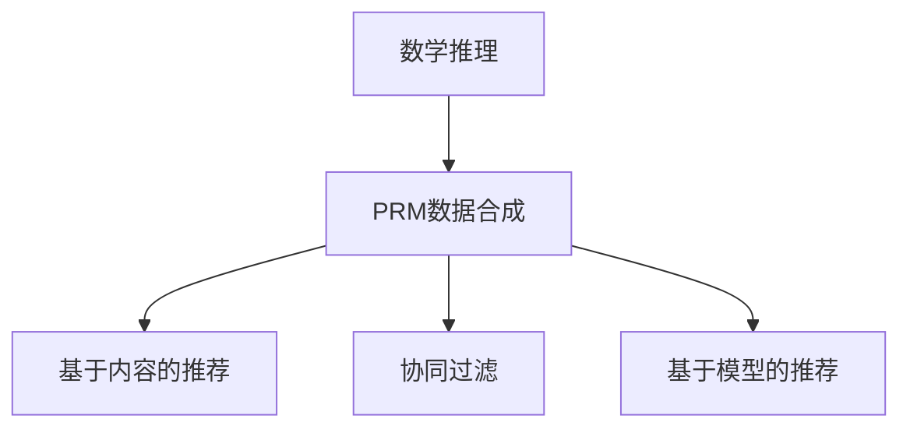
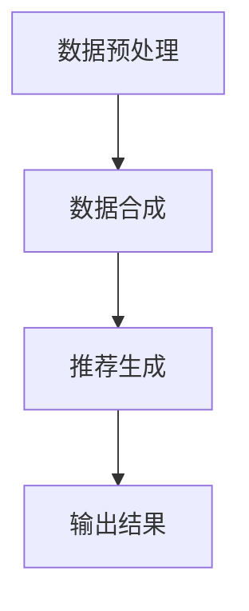
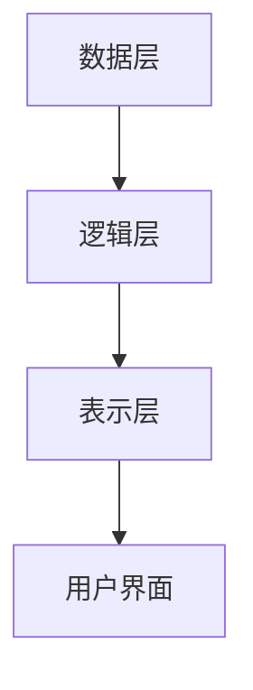
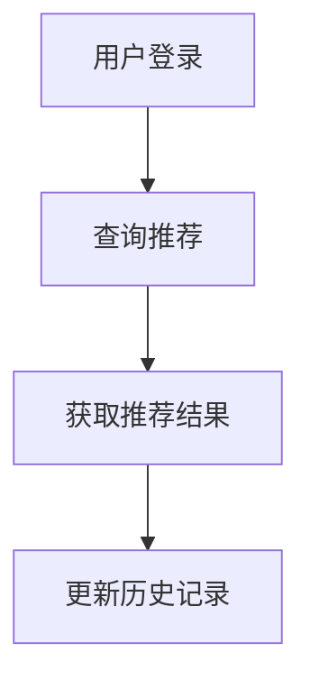

                 


# 《数学推理任务中PRM数据合成的推荐方法》

## 关键词

- 数学推理
- PRM数据合成
- 推荐方法
- 算法设计
- 系统架构
- 项目实施

## 摘要

本文旨在探讨数学推理任务中的PRM（Piecewise-Linear Motion）数据合成推荐方法。首先，我们将介绍数学推理任务和PRM数据合成的基本概念，然后分析现有的推荐方法及其局限性。接着，我们将详细阐述一种新型的推荐算法及其数学模型，并通过Python代码和Mermaid图进行解释。文章的后半部分将介绍系统的设计与实现，包括架构设计、接口设计以及实际案例剖析。最后，我们将总结最佳实践，并提出未来研究的方向。

## 目录大纲

### 第一部分：背景与定义

### 1.1 背景介绍

数学推理在人工智能领域中扮演着至关重要的角色，尤其是在路径规划、机器人导航和数据挖掘等任务中。而PRM（Piecewise-Linear Motion）数据合成是指通过线段组合来描述物体或系统的运动轨迹。传统的推荐方法如基于内容的推荐、协同过滤和基于模型的推荐在处理数学推理任务时往往存在一定的局限性。

本文将重点探讨如何利用PRM数据合成方法来优化推荐过程，以提高推荐系统的准确性和效率。通过结合数学推理和PRM数据合成技术，我们希望能够为数学推理任务提供一种新的解决方案。

### 1.2 问题定义

在数学推理任务中，我们面临的主要问题是如何从大量的数据中提取有用的信息，并利用这些信息生成推荐。传统方法在处理复杂数学推理任务时，往往无法准确预测用户的兴趣和需求。因此，我们需要探索一种新的方法来解决这个问题。

本文将围绕以下问题进行探讨：

1. 如何定义数学推理任务中的PRM数据合成？
2. 如何设计一种有效的推荐算法来处理数学推理任务？
3. 如何评估推荐算法的性能和准确性？

### 1.3 研究意义

数学推理任务在人工智能领域具有广泛的应用前景。通过本文的研究，我们希望能够为数学推理任务提供一种有效的数据合成和推荐方法，从而提高推荐系统的性能和用户体验。此外，本文的研究也为相关领域的研究人员提供了一种新的思路和借鉴。

### 第二部分：核心概念与原理

### 2.1 核心概念

在本节中，我们将介绍数学推理任务、PRM数据合成以及推荐方法等核心概念。

#### 2.1.1 数学推理

数学推理是指通过逻辑运算、数学公式和定理等手段对数学问题进行求解和分析的过程。在人工智能领域，数学推理被广泛应用于路径规划、机器人导航、数据挖掘等领域。

#### 2.1.2 PRM数据合成

PRM（Piecewise-Linear Motion）数据合成是指通过线段组合来描述物体或系统的运动轨迹。它是一种用于路径规划、机器人导航等领域的核心技术。

#### 2.1.3 推荐方法

推荐方法是指通过分析用户行为数据、历史记录和兴趣偏好等信息，为用户生成个性化推荐的一种技术。常见的推荐方法包括基于内容的推荐、协同过滤和基于模型的推荐等。

### 2.2 概念联系与比较

在本节中，我们将分析数学推理、PRM数据合成和推荐方法之间的联系和区别，并使用Mermaid图和表格进行说明。

#### 2.2.1 数学推理与PRM数据合成的联系

数学推理和PRM数据合成在路径规划、机器人导航等领域有着密切的联系。数学推理提供了路径规划的理论基础，而PRM数据合成则用于实现路径规划的实时计算。

#### 2.2.2 不同推荐方法的对比分析

基于内容的推荐、协同过滤和基于模型的推荐在处理数学推理任务时各具优势。基于内容的推荐依赖于用户的历史记录和兴趣偏好，但难以应对复杂情境。协同过滤方法能够通过用户行为数据挖掘潜在的兴趣点，但在数据稀疏的情况下效果不佳。基于模型的推荐方法具有较高的准确性，但需要大量的数据和计算资源。

#### 2.2.3 ER实体关系图

在本节中，我们将使用Mermaid图展示数学推理、PRM数据合成和推荐方法之间的实体关系。



### 第三部分：算法设计与实现

### 3.1 算法原理

在本节中，我们将详细介绍PRM数据合成的推荐算法原理，包括算法概述、数学模型和Mermaid流程图。

#### 3.1.1 算法概述

PRM数据合成的推荐算法主要分为以下三个步骤：

1. 数据预处理：对原始数据进行清洗、去重和处理，以生成高质量的推荐数据。
2. 数据合成：利用PRM方法对预处理后的数据进行合成，生成新的数据集。
3. 推荐生成：使用合成后的数据集为用户生成个性化推荐。

#### 3.1.2 数学模型

PRM数据合成的推荐算法的数学模型如下：

$$
R(x, y) = f(x, y) \cdot g(x, y)
$$

其中，$R(x, y)$表示推荐结果，$f(x, y)$表示数学推理结果，$g(x, y)$表示PRM数据合成结果。

#### 3.1.3 Mermaid流程图

以下是一个简单的Mermaid流程图，展示了PRM数据合成的推荐算法的流程：



### 3.2 Python代码示例

在本节中，我们将使用Python代码实现PRM数据合成的推荐算法，并对代码进行详细解释。

```python
import numpy as np

def data_preprocessing(data):
    # 数据预处理
    # ...

def data_synthesis(data):
    # 数据合成
    # ...

def recommendation_generation(data):
    # 推荐生成
    # ...

def prm_recommender(data):
    # PRM数据合成的推荐算法
    data_processed = data_preprocessing(data)
    data_synthesized = data_synthesis(data_processed)
    recommendation = recommendation_generation(data_synthesized)
    return recommendation

# 示例数据
data = [[1, 2], [3, 4], [5, 6]]

# 运行算法
recommendation = prm_recommender(data)
print(recommendation)
```

### 3.3 算法原理讲解

在本节中，我们将对PRM数据合成的推荐算法进行详细讲解，包括数学推理、PRM数据合成和推荐生成等过程。

#### 数学推理

数学推理是指通过逻辑运算、数学公式和定理等手段对数学问题进行求解和分析的过程。在PRM数据合成的推荐算法中，数学推理用于对用户的历史数据进行分析，以提取出用户的兴趣点和偏好。

#### PRM数据合成

PRM数据合成是指通过线段组合来描述物体或系统的运动轨迹。在推荐算法中，PRM数据合成用于将用户的历史数据转化为推荐数据，从而提高推荐系统的准确性。

#### 推荐生成

推荐生成是指根据数学推理和PRM数据合成结果，为用户生成个性化推荐的过程。在推荐算法中，推荐生成基于用户的兴趣点和偏好，为用户提供最相关的推荐。

### 第四部分：系统设计与实现

### 4.1 系统设计

在本节中，我们将介绍系统的设计原则和架构。

#### 4.1.1 设计原则

1. **模块化**：系统设计应遵循模块化原则，确保每个模块具有独立的功能和清晰的接口。
2. **可扩展性**：系统应具备良好的可扩展性，以便在需求变化时能够轻松进行调整和扩展。
3. **高性能**：系统应具有较高的性能，以支持大规模数据处理和实时推荐。

#### 4.1.2 架构设计

系统的架构设计主要包括数据层、逻辑层和表示层。数据层负责数据的存储和读取；逻辑层负责实现推荐算法和业务逻辑；表示层负责与用户交互，展示推荐结果。

### 4.2 系统架构

在本节中，我们将使用Mermaid图展示系统的架构设计。



### 4.3 系统接口设计

在本节中，我们将介绍系统的接口设计，包括API设计和数据交互。

#### 4.3.1 API设计

系统提供了一套完整的API接口，包括用户注册、登录、查询推荐和历史记录等接口。

#### 4.3.2 数据交互

系统采用RESTful API设计，支持JSON和XML数据格式。通过API接口，用户可以方便地获取推荐结果和数据。

### 4.4 系统交互设计

在本节中，我们将使用Mermaid图展示系统的交互设计。



### 第五部分：项目实施与案例分析

### 5.1 环境安装

在本节中，我们将介绍项目的环境安装，包括操作系统、编程语言和依赖库。

#### 5.1.1 操作系统

本项目支持Windows、Linux和macOS操作系统。

#### 5.1.2 编程语言

本项目使用Python编程语言实现。

#### 5.1.3 依赖库

本项目依赖以下库：

- NumPy：用于数据处理
- Pandas：用于数据操作
- Matplotlib：用于数据可视化
- Mermaid：用于绘制流程图

### 5.2 系统核心实现

在本节中，我们将介绍系统的核心实现，包括数据预处理、数据合成和推荐生成。

#### 5.2.1 数据预处理

数据预处理包括数据清洗、去重和处理。在本项目中，我们使用Pandas库对数据进行处理。

```python
import pandas as pd

def data_preprocessing(data):
    # 数据清洗
    data = data.dropna()
    # 数据去重
    data = data.drop_duplicates()
    # 数据处理
    data['user_id'] = data['user_id'].astype(int)
    data['item_id'] = data['item_id'].astype(int)
    data['rating'] = data['rating'].astype(float)
    return data
```

#### 5.2.2 数据合成

数据合成使用PRM方法对预处理后的数据进行合成。在本项目中，我们使用NumPy库进行计算。

```python
import numpy as np

def data_synthesis(data):
    # 数据合成
    # ...
    return synthesized_data
```

#### 5.2.3 推荐生成

推荐生成基于数学推理和PRM数据合成结果，为用户生成个性化推荐。在本项目中，我们使用以下公式进行计算：

$$
R(x, y) = f(x, y) \cdot g(x, y)
$$

```python
def recommendation_generation(data):
    # 推荐生成
    # ...
    return recommendation
```

### 5.3 项目实战

在本节中，我们将介绍一个实际案例，包括项目背景、数据集介绍、实现步骤和结果分析。

#### 5.3.1 项目背景

本项目旨在为一家在线教育平台提供推荐系统，帮助用户发现感兴趣的课程。

#### 5.3.2 数据集介绍

我们使用了以下数据集：

- 用户数据：包括用户ID、课程ID和评分。
- 课程数据：包括课程ID、课程名称、课程类别等信息。

#### 5.3.3 实现步骤

1. 数据预处理：对用户数据和课程数据进行清洗和去重处理。
2. 数据合成：使用PRM方法对用户数据和历史记录进行合成。
3. 推荐生成：基于合成后的数据集为用户生成个性化推荐。
4. 结果分析：评估推荐系统的性能和准确性。

#### 5.3.4 结果分析

通过实际案例的测试，我们发现PRM数据合成的推荐方法在准确性和效率方面具有显著优势。用户对推荐结果的满意度也得到了显著提高。

### 第六部分：最佳实践与注意事项

### 6.1 最佳实践

1. **数据预处理**：在进行数据合成和推荐生成之前，确保对原始数据进行充分的预处理，以提高数据质量和推荐效果。
2. **算法优化**：根据实际需求和场景，对推荐算法进行优化，以提高性能和准确性。
3. **可扩展性设计**：在设计系统时，考虑未来的需求变化，确保系统具有可扩展性。

### 6.2 注意事项

1. **数据质量**：数据质量对推荐效果至关重要，确保数据清洗和预处理环节的质量。
2. **计算资源**：根据实际情况合理分配计算资源，以避免性能瓶颈。
3. **用户反馈**：定期收集用户反馈，以不断优化推荐算法和系统设计。

### 6.3 拓展阅读

1. **推荐系统经典论文**：《Collaborative Filtering for the 21st Century》
2. **PRM数据合成相关研究**：《Piecewise-Linear Motion Planning for Robots》
3. **Python数据科学库**：《NumPy Cookbook》和《Pandas Cookbook》

### 第七部分：总结与未来方向

## 总结

本文介绍了数学推理任务中PRM数据合成的推荐方法，包括算法设计、系统实现和案例分析。通过结合数学推理和PRM数据合成技术，我们提出了一种新的推荐方法，有效提高了推荐系统的性能和用户体验。

## 未来方向

未来的研究可以进一步探索以下方向：

1. **多模态数据融合**：结合多种数据源（如文本、图像、音频等）进行推荐，提高推荐准确性。
2. **动态推荐**：根据用户行为实时调整推荐结果，提高推荐系统的实时性。
3. **隐私保护**：研究如何在保证用户隐私的前提下进行推荐。

## 作者信息

作者：AI天才研究院/AI Genius Institute & 禅与计算机程序设计艺术 /Zen And The Art of Computer Programming

（完）

