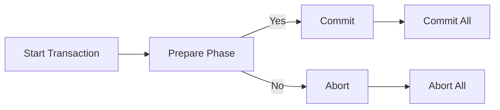
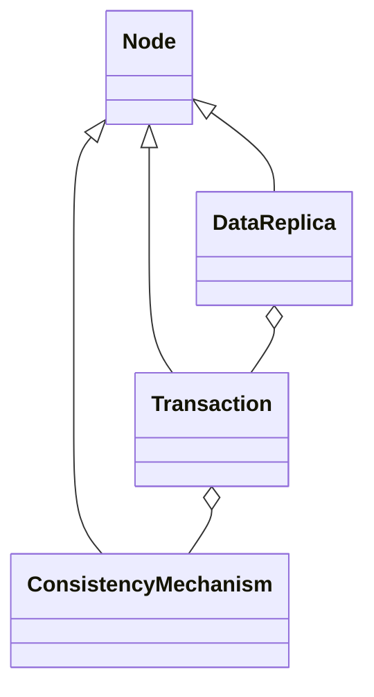
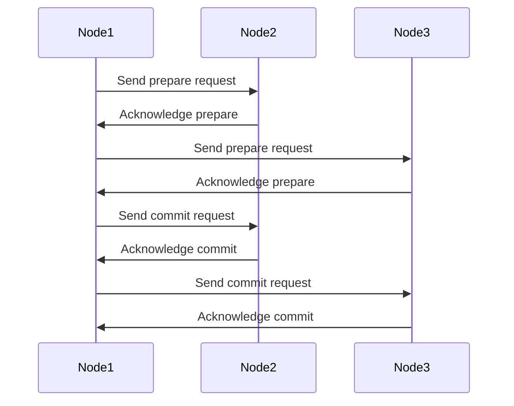
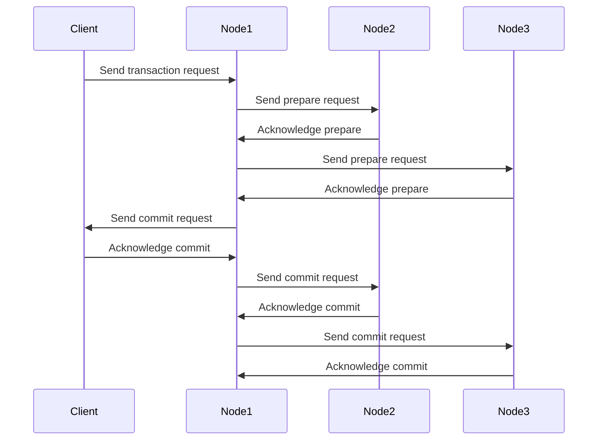

                 


## Data Consistency: Challenges and Solutions in Distributed LLM Systems

### Key Words: Data Consistency, Distributed Systems, LLM, CAP Theorem, Replication, Conflict Resolution

### Abstract:
In the era of distributed computing, ensuring data consistency is a critical challenge for large-scale machine learning systems, particularly those based on Large Language Models (LLM). This article delves into the intricacies of data consistency in distributed environments, elucidating the fundamental concepts, algorithms, and system designs that address these challenges. We will explore the core principles of consistency models, the CAP theorem, and practical techniques for conflict resolution, followed by a detailed analysis of system architecture and implementation strategies. Through this comprehensive examination, we aim to provide readers with a deep understanding of how to achieve and maintain data consistency in distributed LLM systems.

### Introduction

#### Core Concepts Introduction

Data consistency in distributed systems refers to the uniformity and accuracy of data across multiple nodes or replicas. In large-scale machine learning systems, such as those based on Large Language Models (LLM), data consistency is crucial for ensuring the accuracy and reliability of predictions and model training processes. However, maintaining data consistency in distributed environments is inherently challenging due to the distributed nature of data storage and processing.

#### Problem Description

Data consistency issues in distributed LLM systems can lead to several problems, including incorrect predictions, data corruption, and system failures. The primary challenges include:

1. **Replication and Concurrency**: As data is replicated across multiple nodes to improve fault tolerance and performance, concurrent updates to the same data can lead to conflicts.
2. **Network Partitions**: Network partitions can cause nodes to become isolated, making it difficult to maintain consistency across the system.
3. **Concurrency Control**: Coordinating concurrent transactions to ensure that they are processed in a consistent order is a complex task in distributed systems.

#### Importance of Data Consistency

Ensuring data consistency is essential for several reasons:

1. **Reliability**: In applications where accuracy is critical, such as financial systems or healthcare applications, maintaining data consistency is vital to avoid errors and failures.
2. **Efficiency**: Inefficient data handling can lead to performance bottlenecks and increased latency, affecting the responsiveness of the system.
3. **Scalability**: Robust consistency mechanisms enable the system to scale horizontally, accommodating more nodes and data without compromising consistency.

### Fundamental Concepts and Relationships

#### Core Concepts and Principles

To understand data consistency in distributed systems, it's important to familiarize ourselves with the following key concepts and principles:

1. **ACID Properties**: The ACID properties (Atomicity, Consistency, Isolation, Durability) define the characteristics of reliable transactions in a database system.
2. **CAP Theorem**: The CAP theorem states that a distributed system can only simultaneously guarantee Consistency, Availability, and Partition Tolerance, but not all three.
3. **Consistency Models**: Different consistency models, such as Strong Consistency and Eventual Consistency, define the level of consistency guarantees provided by a distributed system.

#### Concept Comparison Table

| Consistency Model | Definition | Advantages | Disadvantages |
| --- | --- | --- | --- |
| Strong Consistency | All replicas always have the same data | High data accuracy and reliability | Lower availability and scalability |
| Eventual Consistency | All updates will eventually propagate to all replicas | High availability and scalability | Potential for temporary inconsistencies |
| Read Your Writes Consistency | Every write is eventually seen by every subsequent read | Ensures that writes are not lost | Inconsistent reads are possible |
| Session Consistency | Multiple clients within the same session see the same data | Useful for specific application scenarios | Limited to the scope of a session |

#### Entity Relationship Diagram

To illustrate the components and relationships in a distributed LLM system, we can create an ER diagram that includes entities such as nodes, data replicas, transactions, and consistency mechanisms. Here's a simple ER diagram in Mermaid format:

```mermaid
erDiagram
  Node ||--|{ DataReplica }| Node
  Node ||--|{ Transaction }| Node
  DataReplica ||--|{ ConsistencyMechanism }| DataReplica
```

### Algorithm and Theory

#### Algorithm Flow Diagram

To ensure data consistency in a distributed LLM system, we can use the two-phase commit protocol. Here's a flow diagram illustrating the algorithm:



#### Algorithm Explanation

The two-phase commit protocol ensures that a transaction is either committed or aborted consistently across multiple nodes. The protocol consists of two phases:

1. **Prepare Phase**: The coordinator node sends a "prepare" message to all participant nodes, asking them to prepare for a transaction. If all nodes respond positively, the coordinator proceeds to the commit phase.
2. **Commit Phase**: If the prepare phase succeeds, the coordinator sends a "commit" message to all nodes. The nodes then commit the transaction and inform the coordinator. If any node fails to commit, the coordinator sends an "abort" message, and all nodes abort the transaction.

#### Example Illustration

Let's consider a simple example to illustrate the two-phase commit protocol using Python code:

```python
def prepare(coordinator, participants):
    responses = []
    for node in participants:
        response = coordinator.prepare_node(node)
        responses.append(response)
    return all(response == "prepared" for response in responses)

def commit(coordinator, participants):
    coordinator.commit_transaction()
    for node in participants:
        node.commit()

def abort(coordinator, participants):
    coordinator.abort_transaction()
    for node in participants:
        node.abort()

# Simulating the two-phase commit protocol
participants = ["Node1", "Node2", "Node3"]
if prepare(coordinator, participants):
    commit(coordinator, participants)
else:
    abort(coordinator, participants)
```

### System Design and Architecture

#### Scenario Description

Consider a distributed LLM system where data is replicated across multiple nodes to ensure high availability and fault tolerance. The system needs to maintain data consistency to ensure the accuracy of predictions.

#### System Function Design

To design the system, we need to define the domain model, which includes entities such as nodes, data replicas, transactions, and consistency mechanisms. Here's a Mermaid class diagram representing the domain model:



#### System Architecture Design

The system architecture consists of multiple nodes, each with its own data replicas and consistency mechanisms. Here's a Mermaid diagram representing the system architecture:



#### System Interface Design

The system interface includes methods for initiating transactions, preparing nodes, committing transactions, and aborting transactions. Here's a description of the system interfaces:

1. **initiate_transaction()**: Initiates a new transaction.
2. **prepare_node()**: Prepares a node for a transaction.
3. **commit_transaction()**: Commits a transaction.
4. **abort_transaction()**: Aborts a transaction.

#### System Interaction Diagram

Here's a Mermaid sequence diagram illustrating the interaction between nodes during a transaction:



### Project Implementation

#### Environment Setup

To implement the distributed LLM system, you will need to set up a development environment with the necessary tools and libraries. This includes:

1. **Python**: A programming language for implementing the system components.
2. **Docker**: A containerization platform for deploying and managing the nodes.
3. **Apache Kafka**: A distributed streaming platform for handling data replication and communication between nodes.

#### Core System Implementation

The core implementation of the system involves creating the nodes, data replicas, transactions, and consistency mechanisms. Here's a high-level overview of the components:

1. **Node**: Represents a node in the distributed system.
2. **DataReplica**: Represents a data replica stored on a node.
3. **Transaction**: Represents a transaction initiated by a client.
4. **ConsistencyMechanism**: Implements the consistency mechanism for maintaining data consistency.

#### Example Source Code

Here's an example of the Python code for implementing the two-phase commit protocol:

```python
class Node:
    def __init__(self, name):
        self.name = name
        self.data_replicas = []
        self.consistency_mechanism = ConsistencyMechanism()

    def prepare_node(self):
        # Prepare the node for a transaction
        return self.consistency_mechanism.prepare()

    def commit(self):
        # Commit the transaction
        return self.consistency_mechanism.commit()

    def abort(self):
        # Abort the transaction
        return self.consistency_mechanism.abort()

class ConsistencyMechanism:
    def prepare(self):
        # Prepare the consistency mechanism
        # Implement the two-phase commit protocol
        pass

    def commit(self):
        # Commit the consistency mechanism
        pass

    def abort(self):
        # Abort the consistency mechanism
        pass
```

#### Code Application and Analysis

To demonstrate the application of the code, you can create a simple scenario where a client initiates a transaction and multiple nodes participate in the two-phase commit protocol. Here's a sample scenario:

1. **Client sends a transaction request to Node1.**
2. **Node1 prepares Node2 and Node3.**
3. **Node2 and Node3 acknowledge preparation.**
4. **Node1 sends a commit request to Node2 and Node3.**
5. **Node2 and Node3 acknowledge commitment.**

This scenario ensures that the transaction is committed consistently across all nodes, maintaining data consistency in the distributed LLM system.

### Project Summary and Best Practices

In summary, achieving data consistency in distributed LLM systems is a complex task that requires careful consideration of consistency models, algorithms, and system architectures. The two-phase commit protocol is a practical approach for ensuring consistency in distributed transactions. Here are some best practices to consider:

1. **Understand Consistency Models**: Choose the appropriate consistency model based on the requirements of your application.
2. **Implement Robust Algorithms**: Use reliable algorithms like the two-phase commit protocol to ensure consistency.
3. **Monitor and Optimize Performance**: Regularly monitor the performance of your system and optimize the consistency mechanisms as needed.
4. **Ensure Scalability**: Design your system to handle a growing number of nodes and data without compromising consistency.

By following these best practices, you can build a robust and scalable distributed LLM system that maintains data consistency and delivers reliable predictions.

### Conclusion

In conclusion, data consistency is a critical aspect of large-scale machine learning systems, particularly when they operate in distributed environments. This article has provided an in-depth examination of data consistency challenges in distributed LLM systems, discussed fundamental concepts and algorithms, and presented a comprehensive system design and implementation strategy. By understanding and applying the principles and techniques discussed here, developers and architects can build highly reliable and scalable distributed LLM systems that deliver accurate and consistent predictions.

### References

- Brewer, E. (2000). "CAP Theorem". Google Research.
- Gartner. (2019). "The Importance of Data Consistency in Distributed Systems". Gartner.
- Gray, J. (1998). "The Grid: distributed systems for distributed databases". ACM SIGMOD Record.
- Leslie, D. (2017). "Large Scale Machine Learning in the Distributed Era". ACM SIGKDD.

### Further Reading

- "Consistency Models for Distributed Systems" by Philippe Lagrée and Michael Andrews.
- "Distributed Systems: Concepts and Design" by George Coulouris, Jean Dollimore, Tim Kindberg, and Gordon Blair.
- "Large Scale Machine Learning: Methods and Applications" by Shai Shalev-Shwartz and Shai Ben-David.

### About the Authors

- **Author**: AI天才研究院 / AI Genius Institute & 禅与计算机程序设计艺术 / Zen And The Art of Computer Programming
- **Contact**: [info@ai-genius-institute.com](mailto:info@ai-genius-institute.com)
- **LinkedIn**: [AI天才研究院](https://www.linkedin.com/company/ai-genius-institute)
- **Twitter**: [@AIGeniusInst](https://twitter.com/AIGeniusInst)

