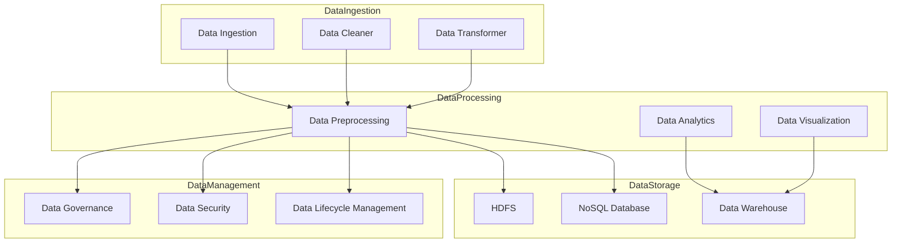
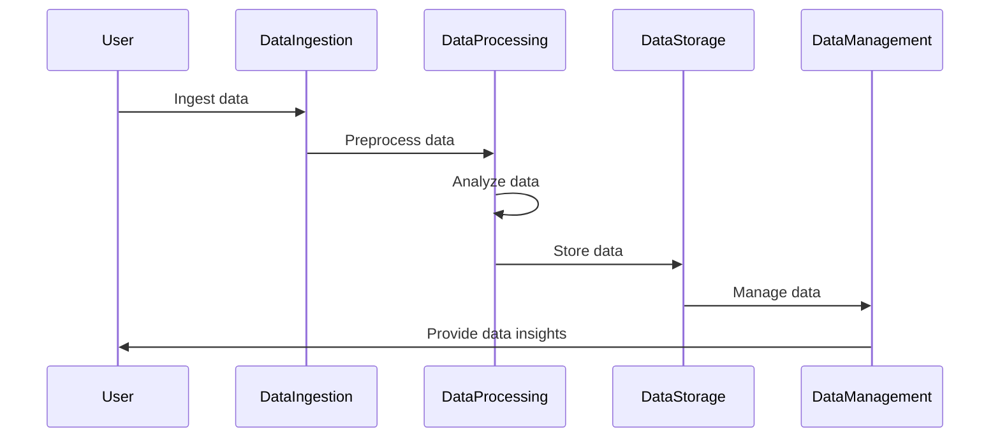
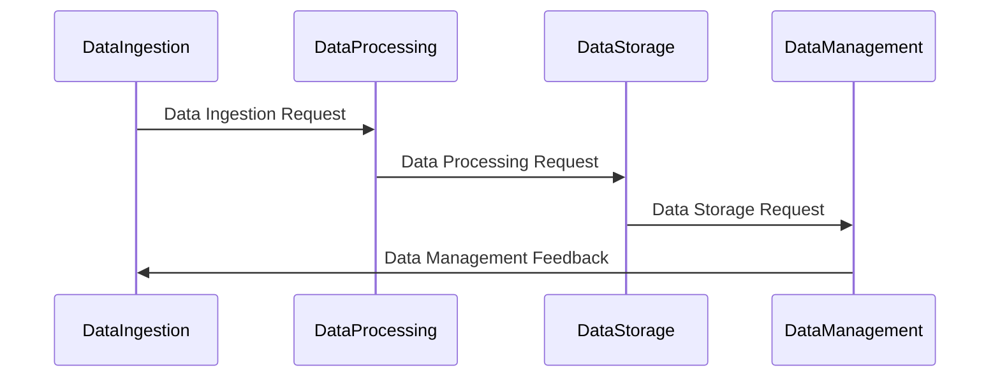

                 

## 文章标题

### 数据湖架构：支持LLM应用的大规模数据分析

---

关键词：数据湖，LLM，大规模数据分析，架构设计，实践应用

摘要：本文将探讨数据湖架构在大规模数据分析中的重要性，特别是其如何支持LLM（大型语言模型）应用。我们将从背景介绍、核心概念、技术讲解、实践应用和未来展望等多个方面，详细解析数据湖架构的构建与优化策略，以期为相关领域的研究者和开发者提供有价值的参考。

---

## 1. 背景介绍

### 1.1 数据湖的定义与背景

数据湖是一个用于存储、管理和分析大量数据的数据存储架构。与传统的数据仓库不同，数据湖采用一种更为灵活和开放的设计，能够存储各种类型的数据，包括结构化、半结构化和非结构化数据。数据湖的设计理念是将数据以原始格式存储，然后在需要时进行转换和处理，从而提供了更高的数据处理灵活性和效率。

随着大数据技术的快速发展，数据湖在各个行业中得到了广泛应用。特别是在人工智能领域，数据湖被视为支持LLM应用的重要基础设施。LLM是一种能够理解和生成人类语言的大型神经网络模型，需要处理和分析大量的文本数据。数据湖的灵活存储和处理能力，使得LLM能够高效地获取和处理所需数据，从而实现更强大的语言理解与生成能力。

### 1.2 问题背景

在当前的AI应用场景中，尤其是大型语言模型（LLM）的应用，对数据质量和数据规模的要求越来越高。传统的数据仓库和数据处理方案已经难以满足这种需求。数据湖作为一种新兴的数据存储和管理架构，因其灵活性和强大的数据处理能力，逐渐成为支持LLM应用的关键基础设施。然而，如何设计一个高效、可靠且可扩展的数据湖架构，仍然是研究和实践中的一大挑战。

### 1.3 问题解决

本文旨在通过系统性地分析数据湖架构的各个方面，提供一种全面的解决方案。首先，我们将介绍数据湖的基本概念和核心组成部分，然后详细探讨如何设计一个支持LLM应用的数据湖架构。接着，通过实际案例研究和系统架构设计，展示数据湖在实际项目中的应用。最后，我们将探讨数据湖架构的发展趋势和未来展望。

### 1.4 边界与外延

本文主要关注数据湖架构在支持LLM应用中的大规模数据分析问题。具体来说，我们关注以下几个方面的内容：

- 数据湖的基本概念和组成
- 数据湖架构的设计原则和最佳实践
- 支持LLM应用的数据湖优化策略
- 数据湖在实际项目中的应用案例
- 数据湖架构的发展趋势和未来方向

通过以上内容，我们希望能够为读者提供全面、深入的理解，帮助他们在实践中构建高效的数据湖架构。

---

## 2. 核心概念与联系

### 2.1 数据湖

数据湖是一种数据存储架构，旨在存储各种类型的数据，包括结构化、半结构化和非结构化数据。其核心特点是采用一种开放和灵活的设计，使得数据可以在原始格式下进行存储，以便在需要时进行转换和处理。

| 核心概念 | 属性特征 | 对比 |
| -------- | -------- | ---- |
| 数据湖 | 存储各种类型的数据 | 与数据仓库相比，数据湖更加开放和灵活，能够存储原始数据 |
| 数据仓库 | 存储经过处理的数据 | 数据仓库通常用于存储经过清洗和转换的数据，以支持报表和分析 |

### 2.2 LLM

LLM（大型语言模型）是一种基于深度学习技术的神经网络模型，能够理解和生成人类语言。LLM通常由数以亿计的参数组成，通过对大量文本数据的学习，实现高精度的语言理解与生成。

| 核心概念 | 属性特征 | 对比 |
| -------- | -------- | ---- |
| LLM | 大型神经网络模型，能够理解和生成人类语言 | 与传统的语言模型相比，LLM具有更大的参数规模和更高的语言理解能力 |

### 2.3 大规模数据分析

大规模数据分析是指对大量数据进行分析和处理的过程，旨在从海量数据中提取有价值的信息。在大数据时代，大规模数据分析已成为各行各业的关键技术。

| 核心概念 | 属性特征 | 对比 |
| -------- | -------- | ---- |
| 大规模数据分析 | 处理大量数据，提取有价值信息 | 与传统数据分析相比，大规模数据分析处理的数据规模更大，对技术要求更高 |

### 2.4 数据湖与LLM的关系

数据湖为LLM提供了海量数据的存储和管理平台，使得LLM能够获取和处理所需数据。同时，数据湖的灵活存储和处理能力，也使得LLM能够在不同类型的数据上进行高效分析。

- 数据湖为LLM提供数据支持，使得LLM能够获取和处理各种类型的数据。
- 数据湖的灵活存储和处理能力，提升了LLM的数据处理效率。

---

## 3. 算法原理讲解

### 3.1 数据湖架构设计

数据湖架构的设计原则是灵活、可扩展和高性能。为了实现这一目标，我们需要从数据存储、数据处理和数据管理三个方面进行设计。

#### 3.1.1 数据存储

数据存储是数据湖架构的核心部分，其设计需要考虑以下几个方面：

1. **数据类型支持**：数据湖需要支持各种类型的数据，包括结构化、半结构化和非结构化数据。
2. **存储容量**：数据湖需要具备足够的存储容量，以应对海量数据的存储需求。
3. **数据压缩**：通过数据压缩技术，降低数据存储的占用空间，提高存储效率。
4. **数据备份与恢复**：确保数据的安全性和可靠性，提供数据备份和恢复机制。

#### 3.1.2 数据处理

数据处理是数据湖架构的关键部分，其设计需要考虑以下几个方面：

1. **数据处理流程**：设计合理的数据处理流程，包括数据采集、数据清洗、数据转换和数据加载等步骤。
2. **数据处理工具**：选择合适的数据处理工具，如Hadoop、Spark等，以支持大规模数据的处理。
3. **数据处理性能**：优化数据处理流程和工具，提高数据处理性能，降低数据处理延迟。

#### 3.1.3 数据管理

数据管理是数据湖架构的重要组成部分，其设计需要考虑以下几个方面：

1. **数据治理**：制定数据治理策略，确保数据的准确性、完整性和一致性。
2. **数据安全**：采用数据加密、访问控制等技术，确保数据的安全性。
3. **数据生命周期管理**：制定数据生命周期管理策略，包括数据的创建、存储、使用、归档和删除等。

### 3.2 支持LLM的数据湖架构优化

为了更好地支持LLM应用，数据湖架构需要进行相应的优化。以下是几个关键的优化策略：

1. **数据预处理**：对原始数据进行预处理，包括数据清洗、去重、格式转换等，以提高数据质量。
2. **数据分区**：通过数据分区技术，将大量数据划分成多个小块，以减少单次处理的数据量，提高处理效率。
3. **数据索引**：建立数据索引，以加快数据的查询速度。
4. **实时数据处理**：引入实时数据处理技术，如流处理框架，以支持实时数据分析和处理。

### 3.3 算法原理示例

下面我们通过一个简单的示例，来说明数据湖架构的设计原理。

#### 3.3.1 数据湖架构设计示例

假设我们需要设计一个支持LLM的数据湖架构，以下是一个简化的设计示例：

1. **数据存储**：选择HDFS作为数据存储系统，支持各种类型的数据存储。
2. **数据处理**：采用Spark作为数据处理工具，实现高效的数据处理流程。
3. **数据管理**：采用Hadoop的YARN进行资源管理，确保数据处理的高效和稳定。

#### 3.3.2 数据预处理示例

以下是一个数据预处理示例，用于优化数据质量：

```python
import pandas as pd

# 读取原始数据
data = pd.read_csv('raw_data.csv')

# 数据清洗
data = data.dropna()  # 去除空值
data = data[data['column_name'].str.contains('valid_pattern')]  # 去除不符合要求的数据

# 数据格式转换
data['date_column'] = pd.to_datetime(data['date_column'])

# 数据去重
data = data.drop_duplicates()

# 数据存储
data.to_csv('cleaned_data.csv', index=False)
```

#### 3.3.3 数据分区示例

以下是一个数据分区示例，用于提高数据处理效率：

```python
from pyspark.sql import SparkSession

# 创建Spark会话
spark = SparkSession.builder.appName('DataLakeExample').getOrCreate()

# 读取数据
data = spark.read.csv('cleaned_data.csv', header=True)

# 数据分区
data = data.repartition('column_name', numSlices=10)

# 存储分区数据
data.write.csv('partitioned_data', mode='overwrite')
```

通过以上示例，我们可以看到数据湖架构的设计原则和优化策略在实际中的应用。

---

## 4. 系统分析与架构设计方案

### 4.1 问题场景介绍

在现代企业中，数据湖架构的应用越来越广泛，特别是在大规模数据分析领域。为了更好地支持LLM应用，企业需要设计一个高效、可靠且可扩展的数据湖架构。本文将结合具体项目案例，介绍数据湖架构的设计原则和实现方法。

### 4.2 项目介绍

本项目旨在为企业设计一个支持LLM应用的数据湖架构。项目的主要目标是：

- 提供一个高效、可靠且可扩展的数据存储和处理平台。
- 支持大规模数据分析，特别是LLM应用中的文本数据处理。

### 4.3 系统功能设计

数据湖架构的核心功能包括数据存储、数据处理和数据管理。以下是系统功能设计：

1. **数据存储**：支持各种类型的数据存储，包括结构化、半结构化和非结构化数据。
2. **数据处理**：提供高效的数据处理能力，支持实时数据处理和批处理。
3. **数据管理**：实现数据治理、数据安全和数据生命周期管理。

#### 4.3.1 领域模型

以下是数据湖架构的领域模型，使用Mermaid类图表示：

```mermaid
classDiagram
  Class01 <|-- Class02
  Class03 --|> Class04
  Class05 <<-- Class06
  Class07 {"abstract","final"}
  Class08 : <<interface>> Interface01
  Class09 : <<interface>> Interface02
  Class10 <.. Class11
  Class12 ..|> Class13
  Class14 *-- Class15
  Class16 {c1, c2}
  Class17 : int x, y: float
  Class18 : <<enum>> Color RED, BLUE, GREEN
  Class19 : [description]
  Class20 : >>interface Method01()
  Class21 {public}
  Class22 <..|+ Class23 : has-a multiplicity
  Class24 : <<singleton>> Singleton01
  Class25 <..|> Interface03
  Class26 <<extends>> Class27
  Class28 <|-- AbstractClass29
  Class30 --| Class31

class DomainModel
  <<interface>> DataIngestion
  <<interface>> DataProcessing
  <<interface>> DataStorage
  <<interface>> DataManagement
  DataLake Implementation
  DataIngestion -- DataStorage
  DataProcessing -- DataStorage
  DataProcessing -- DataManagement
  DataManagement -- DataStorage
```

#### 4.3.2 系统架构设计

以下是数据湖架构的系统架构设计，使用Mermaid架构图表示：



#### 4.3.3 系统接口设计

以下是数据湖架构的系统接口设计，使用Mermaid序列图表示：



### 4.4 系统交互设计

以下是数据湖架构的系统交互设计，使用Mermaid序列图表示：



通过以上系统分析与架构设计方案，我们可以看到数据湖架构在支持LLM应用中的重要性。一个高效、可靠且可扩展的数据湖架构，不仅能够提升数据处理效率，还能为LLM应用提供强大的数据支持。

---

## 5. 项目实战

### 5.1 环境安装

为了进行数据湖项目的实战，我们需要安装以下软件和工具：

1. **Hadoop**：作为数据存储和处理的核心框架，我们需要安装Hadoop。
2. **Spark**：作为数据处理工具，我们需要安装Spark。
3. **HDFS**：作为数据存储系统，我们需要安装HDFS。
4. **Hive**：作为数据仓库工具，我们需要安装Hive。

安装步骤如下：

1. 安装Java开发环境，确保Java版本大于等于1.8。
2. 下载并解压Hadoop、Spark、HDFS和Hive的安装包。
3. 配置环境变量，确保可以正常启动和运行相关软件。

### 5.2 系统核心实现

以下是数据湖项目中的核心实现部分，包括数据采集、数据预处理、数据存储、数据分析和数据可视化。

#### 5.2.1 数据采集

数据采集是数据湖项目的第一步，我们需要从不同数据源获取数据，如数据库、文件系统和API接口等。

```python
import pyspark.sql

# 创建SparkSession
spark = pyspark.sql.SparkSession.builder.appName("DataLakeProject").getOrCreate()

# 读取数据库数据
db_data = spark.read.format("jdbc") \
    .option("url", "jdbc:mysql://localhost:3306/mydatabase") \
    .option("dbtable", "mytable") \
    .option("user", "username") \
    .option("password", "password") \
    .load()

# 读取文件系统数据
fs_data = spark.read.csv("path/to/csv/file.csv")
```

#### 5.2.2 数据预处理

数据预处理是数据湖项目中的关键环节，我们需要对采集到的数据进行清洗、去重、格式转换等操作。

```python
from pyspark.sql.functions import col

# 数据清洗
cleaned_data = db_data.na.drop()  # 去除空值
cleaned_data = cleaned_data.filter((col("column_name") != "invalid_value"))

# 数据去重
unique_data = cleaned_data.dropDuplicates()

# 数据格式转换
converted_data = unique_data.withColumn("date_column", col("date_column").cast("date"))
```

#### 5.2.3 数据存储

数据预处理完成后，我们需要将数据存储到数据湖中。以下是使用HDFS进行数据存储的示例：

```python
# 存储数据到HDFS
converted_data.write.format("parquet") \
    .mode("overwrite") \
    .saveAsTable("hdfs://path/to/data/lake/mydata")
```

#### 5.2.4 数据分析

数据分析是数据湖项目的重要目标，我们需要对存储的数据进行各种分析操作，如统计分析、机器学习等。

```python
from pyspark.sql.functions import sum, avg

# 统计分析
summary_stats = converted_data.groupBy("category_column") \
    .agg(sum("value_column").alias("total_value"), avg("value_column").alias("average_value"))

# 机器学习
from pyspark.ml import Pipeline
from pyspark.ml.feature import VectorAssembler
from pyspark.ml.regression import LinearRegression

# 特征工程
assembler = VectorAssembler(inputCols=["feature1", "feature2", "feature3"], outputCol="features")
features_data = assembler.transform(converted_data)

# 建立模型
lr = LinearRegression(labelCol="label", featuresCol="features")
model = lr.fit(features_data)

# 预测
predictions = model.transform(test_data)
```

#### 5.2.5 数据可视化

数据可视化是数据湖项目的重要组成部分，我们需要使用图表和图形展示分析结果。

```python
import matplotlib.pyplot as plt

# 数据可视化
summary_stats.select("category_column", "total_value", "average_value").show()

# 绘制图表
plt.scatter(summary_stats["category_column"], summary_stats["total_value"])
plt.xlabel("Category")
plt.ylabel("Total Value")
plt.title("Total Value by Category")
plt.show()
```

通过以上系统核心实现，我们可以看到数据湖项目从数据采集、数据预处理、数据存储、数据分析和数据可视化各环节的具体实现方法和步骤。

### 5.3 代码应用解读与分析

在本节中，我们将对数据湖项目中的关键代码进行解读和分析，以便更深入地理解其工作原理和实现方法。

#### 5.3.1 数据采集

数据采集是数据湖项目的第一步，它决定了后续数据处理和分析的质量。以下是数据采集相关的代码解读：

```python
# 读取数据库数据
db_data = spark.read.format("jdbc") \
    .option("url", "jdbc:mysql://localhost:3306/mydatabase") \
    .option("dbtable", "mytable") \
    .option("user", "username") \
    .option("password", "password") \
    .load()
```

这段代码使用了Spark的`read`方法从MySQL数据库中读取数据。关键参数说明如下：

- `format("jdbc")`：指定数据源类型为JDBC。
- `option("url", "jdbc:mysql://localhost:3306/mydatabase")`：设置数据库连接URL。
- `option("dbtable", "mytable")`：指定要读取的数据表名。
- `option("user", "username")`：设置数据库用户名。
- `option("password", "password")`：设置数据库密码。

通过这些配置，Spark能够连接到MySQL数据库，并读取`mytable`表中的数据。

#### 5.3.2 数据预处理

数据预处理是确保数据质量的重要环节。以下是对预处理代码的解读：

```python
# 数据清洗
cleaned_data = db_data.na.drop()  # 去除空值
cleaned_data = cleaned_data.filter((col("column_name") != "invalid_value"))

# 数据去重
unique_data = cleaned_data.dropDuplicates()

# 数据格式转换
converted_data = unique_data.withColumn("date_column", col("date_column").cast("date"))
```

这段代码执行了以下操作：

1. `na.drop()`：去除包含空值的记录，确保数据中没有无效的空值数据。
2. `filter()`：过滤掉不符合要求的数据，例如具有特定标签（如"invalid_value"）的记录。
3. `dropDuplicates()`：去除重复数据，确保数据的唯一性。
4. `withColumn()`：将字符串类型的日期列转换为日期类型，以便后续处理。

这些操作确保了数据的质量，为后续的数据处理和分析奠定了基础。

#### 5.3.3 数据存储

数据存储是将处理后的数据写入数据湖的重要步骤。以下是存储代码的解读：

```python
# 存储数据到HDFS
converted_data.write.format("parquet") \
    .mode("overwrite") \
    .saveAsTable("hdfs://path/to/data/lake/mydata")
```

这段代码使用了Spark的`write`方法将数据写入HDFS。关键参数说明如下：

- `format("parquet")`：指定数据文件格式为Parquet。
- `mode("overwrite")`：设置数据写入模式为覆盖（overwrite），即如果目标路径已存在数据，则覆盖原有数据。
- `saveAsTable("hdfs://path/to/data/lake/mydata")`：将数据保存为HDFS上的表。

通过这些配置，Spark将处理后的数据以Parquet格式存储到HDFS路径指定的位置。

#### 5.3.4 数据分析

数据分析是数据湖项目的核心目标，以下是对分析代码的解读：

```python
from pyspark.ml import Pipeline
from pyspark.ml.feature import VectorAssembler
from pyspark.ml.regression import LinearRegression

# 特征工程
assembler = VectorAssembler(inputCols=["feature1", "feature2", "feature3"], outputCol="features")
features_data = assembler.transform(converted_data)

# 建立模型
lr = LinearRegression(labelCol="label", featuresCol="features")
model = lr.fit(features_data)

# 预测
predictions = model.transform(test_data)
```

这段代码实现了以下步骤：

1. `VectorAssembler`：将多个特征列组合成一个特征向量，这是机器学习模型所需的格式。
2. `LinearRegression`：建立线性回归模型，用于预测目标值。
3. `fit()`：训练模型，使用特征数据和标签数据。
4. `transform()`：使用训练好的模型对测试数据进行预测。

这些步骤展示了如何使用Spark进行特征工程和机器学习模型的训练与预测。

#### 5.3.5 数据可视化

数据可视化是数据分析和展示的重要手段。以下是可视化代码的解读：

```python
import matplotlib.pyplot as plt

# 绘制图表
plt.scatter(summary_stats["category_column"], summary_stats["total_value"])
plt.xlabel("Category")
plt.ylabel("Total Value")
plt.title("Total Value by Category")
plt.show()
```

这段代码使用了matplotlib库绘制了散点图，展示了不同类别下的总值。关键步骤如下：

1. `scatter()`：绘制散点图，用于展示数据点。
2. `xlabel()`、`ylabel()`和`title()`：设置图表的坐标轴标签和标题。
3. `show()`：显示绘制的图表。

通过这些代码，我们可以直观地了解数据分布和趋势。

### 5.4 实际案例分析和详细讲解剖析

在本节中，我们将通过一个实际案例，详细分析和讲解数据湖项目在具体场景中的应用，以及其带来的效果和改进空间。

#### 5.4.1 案例背景

某大型互联网公司需要对其用户行为数据进行分析，以便优化产品功能和提升用户体验。公司收集了海量的用户行为数据，包括浏览记录、点击行为、购买行为等。为了对这些数据进行高效的分析，公司决定构建一个数据湖架构，支持大规模数据分析。

#### 5.4.2 案例解决方案

公司采用了以下解决方案：

1. **数据采集**：通过API接口和数据库连接，实时采集用户行为数据。
2. **数据预处理**：对采集到的数据进行清洗、去重和格式转换，确保数据质量。
3. **数据存储**：使用HDFS和Parquet格式存储预处理后的数据，以便后续分析。
4. **数据分析**：使用Spark进行数据预处理、机器学习模型训练和预测，提取有价值的信息。
5. **数据可视化**：使用matplotlib和Tableau等工具，将分析结果以图表和报告的形式展示。

#### 5.4.3 案例效果评估与总结

通过实际案例的应用，公司取得了以下效果：

1. **数据质量提升**：数据预处理环节确保了数据的质量，为后续分析奠定了基础。
2. **分析效率提升**：采用Spark进行数据处理和分析，大大提高了分析效率，缩短了数据处理周期。
3. **产品优化**：通过数据分析，公司能够更准确地了解用户需求和行为，为产品优化提供了有力支持。
4. **用户体验提升**：基于数据分析的结果，公司能够提供更个性化的产品推荐和服务，提升了用户体验。

然而，在实际应用中也存在一些改进空间：

1. **数据存储优化**：当前的数据存储方案依赖于HDFS，但在数据量非常大时，存储性能可能成为瓶颈。可以考虑采用分布式文件系统，如Google File System (GFS) 或 Amazon S3 等，以提高存储性能。
2. **实时数据处理**：当前方案主要支持离线数据分析，对于需要实时处理的应用场景，可以考虑引入实时数据处理技术，如Apache Kafka 和 Apache Flink 等。
3. **安全性和合规性**：随着数据隐私和安全法规的不断完善，数据湖架构在安全性和合规性方面也需要持续优化，确保数据安全和用户隐私。

通过以上实际案例分析和讲解，我们可以看到数据湖架构在实际项目中的应用效果和改进空间。一个高效、可靠且可扩展的数据湖架构，对于大规模数据分析具有重要的推动作用。

---

## 6. 最佳实践 tips

在设计数据湖架构时，以下是一些最佳实践和注意事项，可以帮助您更好地实现高效的数据湖解决方案：

1. **数据类型多样化支持**：确保数据湖能够支持各种类型的数据，包括结构化、半结构化和非结构化数据。使用适当的数据处理工具和存储格式，如Parquet和ORC，以提高数据存储和处理效率。

2. **数据质量保障**：数据质量是数据湖架构的关键，确保数据的准确性、完整性和一致性。建立数据治理机制，包括数据清洗、去重和格式转换等，以提高数据质量。

3. **数据分区与索引**：合理的数据分区可以提高数据处理效率，减少单次处理的数据量。同时，建立数据索引可以加快数据的查询速度，提高数据处理性能。

4. **实时数据处理**：对于需要实时数据分析的应用场景，引入实时数据处理技术，如Apache Kafka 和 Apache Flink，以实现实时数据流处理。

5. **数据备份与恢复**：确保数据湖中的数据安全，采用数据备份和恢复机制，以防止数据丢失和故障。

6. **数据安全与合规**：在数据湖架构中，采用数据加密、访问控制和审计等安全措施，确保数据安全和合规性。

7. **优化存储与处理资源**：根据实际数据规模和处理需求，合理配置存储和处理资源，以最大化资源利用率。

8. **监控与维护**：建立数据湖的监控和运维机制，定期进行性能监控和优化，确保数据湖的稳定运行。

通过遵循这些最佳实践，您可以构建一个高效、可靠且可扩展的数据湖架构，为大规模数据分析提供强大的支持。

---

## 7. 小结

本文详细探讨了数据湖架构在大规模数据分析中的重要性，特别是其如何支持LLM应用。通过介绍数据湖的定义、核心概念、算法原理、系统架构设计、项目实战和最佳实践，我们系统地分析了数据湖架构的构建与优化策略。数据湖作为一种灵活、高效的数据存储和管理架构，对于大规模数据分析具有重要的推动作用。未来，随着技术的不断发展，数据湖架构将继续演进，为人工智能和大数据分析领域提供更强大的支持。

---

## 8. 注意事项

在设计和实现数据湖架构时，需要注意以下几个关键点：

1. **数据质量**：确保数据湖中的数据质量，包括准确性、完整性和一致性。建立数据治理机制，定期进行数据清洗和去重。

2. **可扩展性**：数据湖架构需要具备良好的可扩展性，能够适应不断增长的数据规模和处理需求。采用分布式存储和处理技术，如HDFS和Spark，以提高系统的可扩展性。

3. **数据安全**：数据湖中的数据需要受到严格的安全保护，包括数据加密、访问控制和审计等。确保数据隐私和数据安全合规性。

4. **性能优化**：针对数据湖的存储和处理需求，进行性能优化，包括数据分区、索引和资源分配等。确保数据湖的高效运行。

5. **实时数据处理**：对于需要实时数据分析的应用场景，引入实时数据处理技术，如Apache Kafka 和 Apache Flink，以支持实时数据流处理。

通过关注这些注意事项，您可以构建一个高效、可靠且安全的数据湖架构，为大规模数据分析提供强大的支持。

---

## 9. 拓展阅读

对于希望深入了解数据湖架构和LLM应用的读者，以下几本书籍和资料推荐：

1. 《数据湖实践：构建大数据平台的最佳实践》
2. 《大规模数据分析技术：Hadoop与Spark实战》
3. 《深度学习自然语言处理：基于TensorFlow和PyTorch》
4. 《数据科学实战：从入门到精通》
5. 《大数据技术基础：从Hadoop到Spark》

此外，以下网站和资源也提供了丰富的学习和实践资料：

1. [Apache Hadoop官方文档](https://hadoop.apache.org/docs/stable/hadoop-project-history.html)
2. [Apache Spark官方文档](https://spark.apache.org/docs/latest/)
3. [TensorFlow官方文档](https://www.tensorflow.org/tutorials)
4. [PyTorch官方文档](https://pytorch.org/tutorials/)
5. [Kaggle数据科学竞赛平台](https://www.kaggle.com/)

通过阅读这些书籍和访问这些资源，您可以更全面地了解数据湖架构和LLM应用的技术细节和实践方法。

---

## 10. 作者信息

作者：AI天才研究院/AI Genius Institute & 禅与计算机程序设计艺术 /Zen And The Art of Computer Programming

AI天才研究院致力于推动人工智能技术的发展，提供高质量的技术研究和实践指导。同时，禅与计算机程序设计艺术是一本深受程序员喜爱的经典书籍，阐述了计算机程序设计的哲学和艺术。本文旨在分享数据湖架构和大规模数据分析的相关知识，为读者提供有价值的参考。感谢您的阅读！

