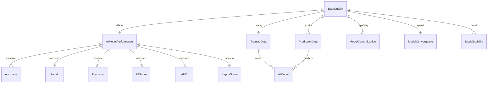
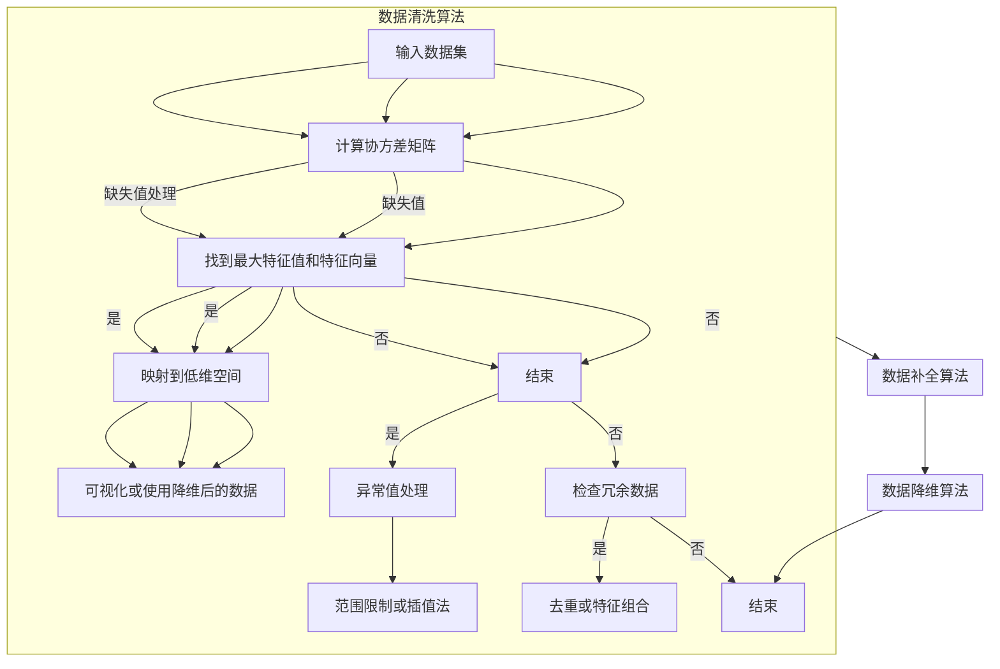
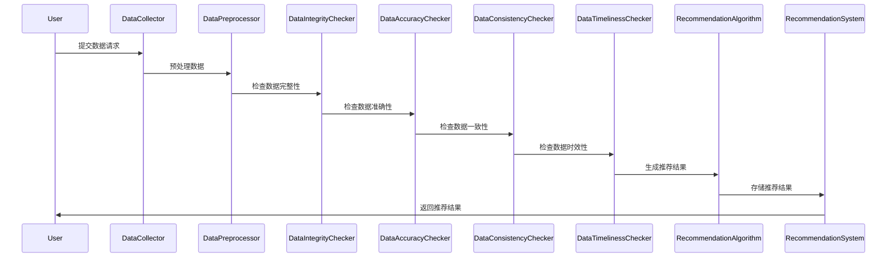
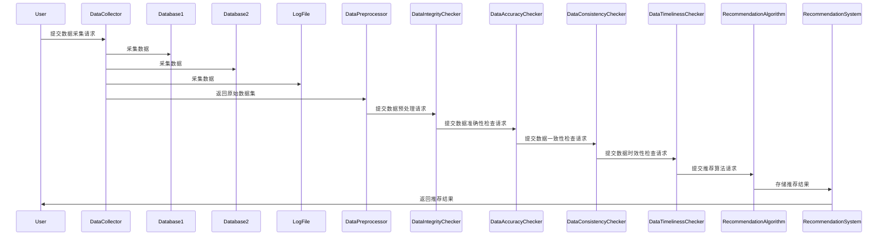

                 

### 背景介绍

#### 1.1 问题背景

随着人工智能（AI）技术的迅速发展，AI模型的应用已经渗透到各行各业。从图像识别、自然语言处理到推荐系统，AI模型在提升工作效率、优化决策过程和改善用户体验方面发挥了巨大的作用。然而，一个不可忽视的问题是，AI模型的性能不仅取决于算法的设计和实现，还与其训练数据的质量密切相关。这引出了我们的主要问题：数据质量对AI模型性能的影响。

数据质量是指在数据处理和应用过程中，数据满足预定义标准和要求的能力。高质量的数据意味着完整性、准确性、一致性、时效性等方面的特征都达到预期。在AI模型训练中，数据质量对模型性能的影响是显而易见的。一方面，低质量的数据可能导致模型无法捕捉到有效的特征，影响模型的泛化能力；另一方面，数据质量还会影响模型的训练效率和预测准确性。

#### 1.1.1 数据质量在AI时代的重要性

在AI时代，数据质量的重要性不言而喻。高质量的训练数据可以确保AI模型在学习过程中获得准确的信号，从而提高模型的性能。以下是几个具体原因：

1. **准确性**：高质量的数据可以帮助模型更好地理解真实世界的复杂性，从而提高预测的准确性。例如，在医疗诊断中，数据质量的提高可以降低误诊率，提高治疗的有效性。

2. **可靠性**：低质量的数据往往包含噪声和异常值，这些噪声会影响模型的训练过程，导致模型过拟合或欠拟合，从而降低模型的可靠性。

3. **效率**：高质量的数据有助于提高模型的训练速度和效果。数据清洗和预处理可以减少无效数据的处理时间，使模型能够更快地收敛到最优解。

4. **泛化能力**：高质量的训练数据可以帮助模型更好地泛化到未知数据，从而提高模型的实际应用价值。

#### 1.1.2 AI模型性能的基本概念

AI模型性能通常通过以下几个指标进行评估：

1. **准确性（Accuracy）**：模型预测正确的样本数占总样本数的比例。它是最常用的评估指标之一，但有时会受到类别不平衡的影响。

2. **召回率（Recall）**：模型正确识别出的正例样本数与实际正例样本数的比例。召回率关注的是模型是否能够识别出所有的正例。

3. **精确率（Precision）**：模型预测为正例的样本中，实际为正例的比例。它关注的是模型识别出的正例是否真实。

4. **F1分数（F1 Score）**：精确率和召回率的调和平均，它综合考虑了模型的准确性和召回率。

5. **AUC（Area Under the ROC Curve）**：ROC曲线下的面积，用于评估二分类模型的分类能力。AUC值越高，模型的分类效果越好。

6. **Kappa系数（Kappa Score）**：用于评估分类模型的一致性和可靠性，它考虑了类别不平衡的影响。

#### 1.1.3 数据质量与AI模型性能的关系

数据质量对AI模型性能的影响体现在多个方面。以下是几个关键点：

1. **数据完整性**：缺失的数据会导致模型无法学习到某些特征，从而影响模型的泛化能力。例如，在图像识别任务中，缺少某些类别的样本可能会导致模型无法正确识别这些类别。

2. **数据准确性**：不准确的数据会导致模型学习到错误的特征，从而影响模型的预测准确性。例如，在股票预测任务中，错误的历史数据可能会导致模型做出错误的预测。

3. **数据一致性**：不一致的数据可能会引入噪声，影响模型的训练效果。例如，在客户关系管理中，不同渠道的数据格式不一致可能会导致模型无法正确处理这些数据。

4. **数据时效性**：过时的数据可能会使模型失去时效性，从而降低模型的实际应用价值。例如，在天气预报中，过时的气象数据可能会导致模型做出不准确的预测。

#### 1.2 核心概念

在深入探讨数据质量对AI模型性能的影响之前，我们需要明确几个核心概念：

##### 1.2.1 数据质量的概念

数据质量是一个多维度的概念，通常包括以下属性：

1. **完整性（Completeness）**：数据是否完整，是否有缺失值。
2. **准确性（Accuracy）**：数据是否准确，是否有错误或噪声。
3. **一致性（Consistency）**：数据在不同时间、不同来源是否保持一致。
4. **时效性（Timeliness）**：数据是否及时更新，是否适用于当前的任务。

##### 1.2.2 数据质量的影响因素

数据质量受到多种因素的影响，包括：

1. **数据来源**：不同数据来源的质量可能有所不同，例如，来自官方的数据可能比用户生成数据更可靠。
2. **数据采集方式**：采集方式会影响数据的质量，例如，自动采集的数据可能比手工输入的数据更准确。
3. **数据清洗和预处理**：数据清洗和预处理的质量直接影响数据质量，不当的处理可能导致数据质量的下降。

##### 1.2.3 数据质量的评估方法

评估数据质量的方法包括：

1. **可视化分析**：通过图表和可视化工具来识别数据中的异常和趋势。
2. **统计方法**：使用统计学方法来评估数据的完整性和准确性。
3. **对比方法**：将不同来源或时间点的数据进行对比，以评估数据的一致性。
4. **专家评审**：邀请领域专家对数据进行评估，以获得更客观的评估结果。

##### 1.2.4 AI模型性能评估方法

AI模型性能的评估方法主要包括：

1. **交叉验证（Cross-Validation）**：通过将数据集划分为训练集和验证集，评估模型的泛化能力。
2. **混淆矩阵（Confusion Matrix）**：用于评估分类模型的准确性和召回率。
3. **ROC曲线（ROC Curve）**：用于评估二分类模型的分类能力。
4. **F1分数（F1 Score）**：综合考虑模型的精确率和召回率。

#### 1.3 边界与外延

##### 1.3.1 数据质量问题的研究领域

数据质量问题涉及多个研究领域，包括：

1. **数据质量管理**：研究如何管理和维护高质量的数据。
2. **数据清洗和预处理**：研究如何清洗和预处理数据，以提高数据质量。
3. **数据隐私和安全性**：研究如何在保证数据隐私和安全的前提下进行数据处理。

##### 1.3.2 数据质量对AI模型性能的影响范围

数据质量对AI模型性能的影响范围非常广泛，包括：

1. **模型训练**：数据质量影响模型的训练过程，包括模型的收敛速度和收敛质量。
2. **模型预测**：数据质量直接影响模型的预测准确性。
3. **模型泛化**：数据质量影响模型对未知数据的泛化能力。

##### 1.3.3 数据质量管理的原则与策略

数据质量管理的原则和策略包括：

1. **数据治理**：建立数据治理框架，确保数据质量管理的有效性和持续性。
2. **数据标准化**：制定数据标准，确保数据的一致性和可比较性。
3. **自动化数据清洗**：使用自动化工具进行数据清洗和预处理，以提高数据质量。
4. **持续监测**：建立数据质量监测机制，及时发现和解决数据质量问题。

通过以上背景介绍，我们明确了数据质量对AI模型性能的重要性。接下来的部分将深入探讨数据质量和AI模型性能之间的具体联系和影响机制。希望读者能够通过本文，对这一重要领域有更深入的理解和认识。

### 核心概念与联系

在探讨数据质量对AI模型性能的影响时，我们需要明确几个核心概念，这些概念不仅有助于理解数据质量和模型性能的基本原理，也为后续的深入分析提供了基础。

#### 1.2.1 数据质量的概念

数据质量是一个多维度的概念，它涵盖了数据从采集、处理、存储到应用全过程中的各个方面。具体来说，数据质量包括以下几个主要属性：

1. **完整性（Completeness）**：完整性指的是数据集是否包含所有必要的记录，是否有缺失值。例如，在客户关系管理系统中，如果一个数据集缺少了某一部分客户的信息，那么这个数据集的完整性就不够高。

2. **准确性（Accuracy）**：准确性是指数据是否真实、可靠。数据中的错误、异常值或噪声都会影响数据的准确性。例如，在医疗数据集中，一个病人的诊断结果出错，就会影响整个数据集的准确性。

3. **一致性（Consistency）**：一致性指的是数据在不同时间、不同来源或不同系统中是否保持一致。不一致的数据可能会导致数据冲突或冗余。例如，一个客户的地址在多个系统中记录为不同值，这就是数据一致性的问题。

4. **时效性（Timeliness）**：时效性是指数据是否及时更新，是否适用于当前的应用场景。过时的数据可能会使模型失去时效性，从而影响模型的预测准确性。例如，天气预报系统中，如果气象数据不及时更新，预测结果就会不准确。

#### 1.2.2 数据质量的影响因素

数据质量的影响因素是多种多样的，这些因素决定了数据质量的高低。以下是几个主要的影响因素：

1. **数据来源**：不同数据来源的质量可能有所不同。例如，来自权威机构的统计数据通常比社交媒体上的用户生成数据更可靠。

2. **数据采集方式**：数据采集的方式会影响数据质量。自动采集的数据可能比手工输入的数据更准确，因为手工输入容易引入错误。

3. **数据清洗和预处理**：数据清洗和预处理是提高数据质量的重要步骤。不当的数据清洗和预处理可能导致数据质量的下降。

4. **数据整合**：在整合来自不同来源或不同系统的数据时，如果没有妥善处理数据格式、数据冲突等问题，可能会影响数据质量。

5. **数据存储**：数据存储的可靠性也会影响数据质量。如果数据存储系统存在故障或数据丢失，数据质量就会受到影响。

6. **用户行为**：用户的操作行为也会影响数据质量。例如，用户输入错误的数据或故意篡改数据，都会影响数据质量。

#### 1.2.3 数据质量的评估方法

为了确保数据质量，我们需要对数据质量进行评估。以下是一些常用的评估方法：

1. **可视化分析**：通过图表和可视化工具来识别数据中的异常和趋势。例如，使用条形图或饼图来检查数据的完整性。

2. **统计方法**：使用统计学方法来评估数据的完整性、准确性和一致性。例如，使用平均值、中位数、标准差等统计指标来评估数据的准确性。

3. **对比方法**：将不同来源或时间点的数据进行对比，以评估数据的一致性。例如，通过比较不同数据源中的相同记录，检查数据是否一致。

4. **专家评审**：邀请领域专家对数据进行评估，以获得更客观的评估结果。专家评审通常用于评估数据的准确性、完整性和一致性。

#### 1.2.4 AI模型性能评估方法

在评估AI模型性能时，我们需要使用一系列指标来衡量模型的表现。以下是几个常用的评估指标：

1. **准确性（Accuracy）**：模型预测正确的样本数占总样本数的比例。准确性是最常用的评估指标之一，但有时会受到类别不平衡的影响。

2. **召回率（Recall）**：模型正确识别出的正例样本数与实际正例样本数的比例。召回率关注的是模型是否能够识别出所有的正例。

3. **精确率（Precision）**：模型预测为正例的样本中，实际为正例的比例。精确率关注的是模型识别出的正例是否真实。

4. **F1分数（F1 Score）**：精确率和召回率的调和平均，它综合考虑了模型的准确性和召回率。

5. **AUC（Area Under the ROC Curve）**：ROC曲线下的面积，用于评估二分类模型的分类能力。AUC值越高，模型的分类效果越好。

6. **Kappa系数（Kappa Score）**：用于评估分类模型的一致性和可靠性，它考虑了类别不平衡的影响。

#### 数据质量与AI模型性能的关系

数据质量和AI模型性能之间的关系是相互影响、相互作用的。以下是数据质量对AI模型性能的具体影响：

1. **训练数据质量**：高质量的训练数据可以确保模型在学习过程中获得准确的信号，从而提高模型的泛化能力和预测准确性。

2. **预测数据质量**：高质量的预测数据可以确保模型在实际应用中能够做出准确的预测，从而提高模型的实际应用价值。

3. **模型泛化能力**：高质量的训练数据有助于模型学习到普适性强的特征，从而提高模型的泛化能力，使其能够应对未知的数据。

4. **模型收敛速度**：高质量的数据可以减少模型在训练过程中需要处理的无用信息，从而提高模型的训练速度和效率。

5. **模型稳定性**：高质量的数据有助于减少模型过拟合或欠拟合的风险，从而提高模型的稳定性。

#### 数据质量属性的对比表格

为了更直观地理解数据质量的不同属性，我们可以通过以下表格进行比较：

| 数据质量属性 | 描述 | 影响因素 | 评估方法 |
| :--- | :--- | :--- | :--- |
| 完整性 | 数据是否包含所有必要的记录，是否有缺失值 | 数据来源、数据采集方式、数据清洗和预处理 | 可视化分析、统计方法、对比方法 |
| 准确性 | 数据是否真实、可靠 | 数据来源、数据采集方式、数据清洗和预处理 | 统计方法、专家评审 |
| 一致性 | 数据在不同时间、不同来源或不同系统中是否保持一致 | 数据整合、数据存储、用户行为 | 对比方法、专家评审 |
| 时效性 | 数据是否及时更新，是否适用于当前的应用场景 | 数据更新频率、用户行为、系统维护 | 对比方法、统计方法 |

#### ER实体关系图架构

为了更好地理解数据质量和AI模型性能之间的关系，我们可以使用实体关系图（Entity-Relationship Diagram, ERD）来描述这些实体及其关系。以下是数据质量实体与AI模型实体之间的ERD：



通过ER实体关系图，我们可以清晰地看到数据质量如何影响AI模型的各个方面，包括训练数据、预测数据、模型泛化能力、模型收敛速度和模型稳定性。这些影响最终会反映在AI模型性能的评估指标中。

通过以上对核心概念和关系的详细阐述，我们为后续深入探讨数据质量对AI模型性能的具体影响机制奠定了基础。希望读者能够对这些概念有更深入的理解，为后续的分析提供帮助。

### 数据质量对AI模型性能的具体影响

在明确了数据质量和AI模型性能的核心概念之后，我们现在可以进一步探讨数据质量对AI模型性能的具体影响。这一部分将详细分析数据质量对AI模型训练、预测和泛化能力的影响，并结合实际案例进行说明。

#### 2.1.1 数据质量对AI模型训练的影响

AI模型的训练过程是一个从大量数据中学习特征和规律的过程。数据质量对训练过程的影响至关重要。以下是数据质量对AI模型训练的几个具体影响：

1. **训练效率**：高质量的数据有助于提高模型的训练效率。这是因为高质量的数据减少了噪声和异常值，从而减少了模型在处理无用信息上的时间。例如，在一个图像识别任务中，如果数据集中包含大量噪声或异常的图像，模型在训练过程中需要花费更多的时间去过滤这些噪声，从而降低训练效率。

2. **模型收敛速度**：数据质量越高，模型的收敛速度通常越快。高质量的训练数据能够提供清晰的信号，使模型能够更快地找到最优解。相反，低质量的数据可能会使模型在错误的方向上收敛，导致训练过程缓慢。

3. **过拟合与欠拟合**：过拟合和欠拟合是训练过程中的两个常见问题。高质量的数据有助于避免这两个问题。过拟合是指模型在训练数据上表现很好，但在未见过的数据上表现较差。高质量的数据提供了丰富的信息，使模型能够更好地泛化。欠拟合是指模型在训练数据和未见过的数据上表现都较差。高质量的数据可以帮助模型捕捉到更多的有效特征，从而避免欠拟合。

#### 2.1.2 数据质量对AI模型预测的影响

AI模型的预测能力是衡量其性能的重要指标。数据质量对预测能力的影响体现在以下几个方面：

1. **预测准确性**：高质量的训练数据可以显著提高模型的预测准确性。训练数据中的准确性和完整性直接影响到模型学习到的特征和规律。例如，在金融市场的预测中，如果数据集中包含大量的噪声和错误，模型的预测准确性就会降低。

2. **预测稳定性**：高质量的预测数据可以提供稳定的预测结果。低质量的预测数据可能会导致模型产生不可靠的预测，影响实际应用。例如，在医疗诊断中，如果预测数据集中存在大量的缺失值或错误数据，模型的预测结果就很难稳定和可靠。

3. **预测时效性**：预测数据的时效性对预测结果的影响也非常大。过时的数据可能会使模型失去时效性，从而影响预测的准确性。例如，在股票预测中，如果使用的是几天前甚至几周前的数据，模型的预测结果就会与实际情况产生较大偏差。

#### 2.1.3 数据质量对AI模型泛化能力的影响

泛化能力是指模型在未见过的数据上的表现。数据质量对模型泛化能力的影响主要体现在以下几个方面：

1. **模型泛化**：高质量的数据可以帮助模型学习到普适性强的特征，从而提高模型的泛化能力。例如，在人脸识别任务中，如果训练数据集中包含了各种不同光照、角度和姿态的人脸图像，模型就能更好地泛化到未见过的数据。

2. **避免过度拟合**：高质量的数据能够帮助模型避免过度拟合。过度拟合是指模型在训练数据上表现很好，但在未见过的数据上表现较差。高质量的数据提供了丰富的信息，使模型能够更好地泛化到新的数据。

3. **提高模型可靠性**：高质量的预测数据可以提高模型的可靠性。低质量的预测数据可能会导致模型产生错误的预测，从而影响实际应用。例如，在自动驾驶系统中，如果预测数据集中存在大量的错误数据，模型的预测结果就可能导致严重的安全隐患。

#### 实际案例：不同数据质量下的AI模型表现

为了更直观地理解数据质量对AI模型性能的影响，我们可以通过以下实际案例进行说明。

**案例一：信用评分模型**

在信用评分领域，数据质量对模型性能的影响尤为明显。一个高质量的训练数据集应包含详细的借款人信息，如收入水平、债务水平、信用历史等。如果数据集中存在缺失值、错误值或噪声，模型的预测准确性就会下降。例如，如果某个借款人的收入水平记录为0，模型就无法准确评估其还款能力。相反，一个高质量的数据集可以帮助模型更准确地预测借款人的信用风险，从而提高金融机构的审批效率和风险控制能力。

**案例二：医疗诊断模型**

在医疗诊断领域，数据质量对模型性能的影响同样重要。高质量的医疗数据应包含详细的病史、实验室检查结果、医学影像等。如果数据集中存在缺失值、错误值或噪声，模型的诊断准确性就会受到影响。例如，如果一个病人的心电图数据中有大量缺失值，模型就无法准确分析其心脏健康状况。相反，一个高质量的数据集可以帮助模型更准确地诊断疾病，提高医生的诊断效率和准确性。

**案例三：自动驾驶模型**

在自动驾驶领域，数据质量对模型性能的影响也非常显著。自动驾驶模型需要处理大量的传感器数据，如摄像头、激光雷达、雷达等。如果数据集中存在噪声、异常值或错误值，模型的预测准确性就会下降。例如，如果摄像头数据中出现大量遮挡或模糊，模型就很难准确识别道路上的障碍物。相反，一个高质量的数据集可以帮助模型更准确地识别道路上的障碍物，从而提高自动驾驶的安全性和可靠性。

通过以上实际案例，我们可以看到数据质量对AI模型性能的重要性。高质量的数据不仅能够提高模型的预测准确性，还能提高模型的泛化能力和稳定性。因此，在设计和应用AI模型时，确保数据质量是至关重要的。在实际操作中，我们可以通过数据清洗、数据预处理和数据增强等技术手段来提高数据质量，从而提升AI模型的性能。

### 数据质量属性特征对比表格

为了更直观地展示数据质量的各个属性特征及其对AI模型性能的影响，我们可以通过以下对比表格来进行详细分析。

#### 2.2.1 数据完整性

| 数据质量属性 | 描述 | 对AI模型性能的影响 | 示例 |
| :--- | :--- | :--- | :--- |
| 完整性 | 数据是否包含所有必要的记录，是否有缺失值 | 缺失的数据会导致模型无法学习到某些特征，从而影响模型的泛化能力和预测准确性。 | 例如，缺失的客户信息会导致信用评分模型无法准确预测客户的信用风险。 |

#### 2.2.2 数据准确性

| 数据质量属性 | 描述 | 对AI模型性能的影响 | 示例 |
| :--- | :--- | :--- | :--- |
| 准确性 | 数据是否真实、可靠 | 数据中的错误和异常值会导致模型学习到错误的特征，从而影响模型的预测准确性和泛化能力。 | 例如，错误的历史股票价格数据会导致股票预测模型的预测结果不准确。 |

#### 2.2.3 数据一致性

| 数据质量属性 | 描述 | 对AI模型性能的影响 | 示例 |
| :--- | :--- | :--- | :--- |
| 一致性 | 数据在不同时间、不同来源或不同系统中是否保持一致 | 数据的不一致会导致模型学习到矛盾的特征，从而影响模型的泛化能力和稳定性。 | 例如，不同来源的客户数据格式不一致会导致客户关系管理模型的预测结果不一致。 |

#### 2.2.4 数据时效性

| 数据质量属性 | 描述 | 对AI模型性能的影响 | 示例 |
| :--- | :--- | :--- | :--- |
| 时效性 | 数据是否及时更新，是否适用于当前的应用场景 | 过时的数据可能会使模型失去时效性，从而影响模型的预测准确性。 | 例如，过时的气象数据会导致天气预报模型的预测结果不准确。 |

通过上述对比表格，我们可以清晰地看到不同数据质量属性对AI模型性能的具体影响。完整性、准确性、一致性和时效性是评估数据质量的关键指标，它们对模型的训练效果、预测准确性和泛化能力都有着重要的影响。在实际应用中，我们需要关注这些指标，采取有效的数据清洗和预处理方法，以提高数据质量，从而提升AI模型的性能。

### ER实体关系图架构

为了更直观地理解数据质量和AI模型性能之间的关系，我们可以使用实体关系图（Entity-Relationship Diagram, ERD）来描述这些实体及其关系。以下是数据质量实体与AI模型实体之间的ERD：


在这个ERD中，我们定义了以下几个实体：

- **DataQuality**：表示数据质量，包括完整性、准确性、一致性、时效性等属性。
- **AIModelPerformance**：表示AI模型的性能，包括准确性、召回率、精确率、F1分数、AUC和Kappa系数等指标。
- **TrainingData**：表示用于训练AI模型的数据，其质量直接影响模型的训练效果。
- **PredictionData**：表示用于预测的数据，其质量直接影响模型的预测准确性。
- **ModelGeneralization**：表示模型的泛化能力，这是模型能否在未知数据上表现良好的关键。
- **ModelConvergence**：表示模型的收敛速度，即模型从初始状态达到最优解的过程。
- **ModelStability**：表示模型的稳定性，即模型在不同数据质量下的表现一致性。

这些实体之间的关系如下：

- **DataQuality**与**AIModelPerformance**之间是影响关系，即数据质量直接影响AI模型性能的多个指标。
- **DataQuality**与**TrainingData**之间是质量关系，即数据质量影响训练数据的属性。
- **DataQuality**与**PredictionData**之间是质量关系，即数据质量影响预测数据的属性。
- **TrainingData**与**AIModel**之间是训练关系，即训练数据用于训练模型。
- **PredictionData**与**AIModel**之间是预测关系，即预测数据用于评估模型性能。
- **AIModelPerformance**与各个评估指标之间是测量关系，即评估指标用于衡量模型性能。

通过这个ERD，我们可以清晰地看到数据质量如何影响AI模型的各个方面，包括训练数据、预测数据、模型泛化能力、模型收敛速度和模型稳定性。这些影响最终会反映在AI模型性能的评估指标中，帮助我们更好地理解和优化AI模型的性能。

### 数据质量优化算法

在了解了数据质量对AI模型性能的影响后，我们接下来将讨论几种常用的数据质量优化算法，包括数据清洗、数据补全和数据降维。这些算法在提高数据质量方面起着关键作用，能够帮助AI模型更有效地学习特征和规律。

#### 3.1.1 数据清洗算法

数据清洗是提高数据质量的首要步骤，它包括识别和纠正数据集中的错误、异常值和冗余数据。以下是几种常用的数据清洗算法：

1. **缺失值处理**：对于缺失值，我们可以采用以下几种方法进行处理：
   - **删除缺失值**：如果缺失值的比例很小，可以选择删除这些样本。这种方法简单有效，但可能会丢失部分有用的信息。
   - **均值填充**：用该特征的均值来填充缺失值。这种方法适用于数值型数据，特别是特征的重要性较高时。
   - **中值填充**：用该特征的中值来填充缺失值。这种方法适用于数值型数据，特别是特征的分布较为均匀时。
   - **模型预测填充**：使用回归模型或其他预测方法来预测缺失值。这种方法适用于复杂的情况，可以提供更准确的结果。

2. **异常值处理**：异常值可能会对模型产生负面影响，因此需要识别和纠正。常用的方法包括：
   - **范围限制**：将异常值限定在某个合理的范围内。例如，对于年龄特征，可以设定合理的上下限。
   - **统计学方法**：使用统计学方法，如三倍标准差法则，识别并处理异常值。三倍标准差法则是指将数据分为三个部分，异常值通常位于第三个部分之外。
   - **插值法**：对于连续的数值型特征，可以使用插值法来估算异常值。

3. **冗余数据处理**：冗余数据指的是数据集中重复的信息，处理冗余数据可以减少数据量，提高计算效率。常用的方法包括：
   - **去重**：通过唯一标识符（如ID）识别并删除重复的记录。
   - **特征组合**：将多个冗余特征合并为一个新特征，从而减少冗余。

#### 3.1.2 数据补全算法

数据补全旨在补充数据集中的缺失值，以提高数据质量。以下是几种常用的数据补全算法：

1. **K最近邻（K-Nearest Neighbors, KNN）**：KNN算法通过找到数据集中的K个最近邻居，使用这些邻居的属性值来预测缺失值。这种方法简单有效，但需要选择合适的K值，并且对于高维数据可能效果不佳。

2. **线性回归（Linear Regression）**：线性回归算法通过构建一个线性模型来预测缺失值。这种方法适用于数值型数据，并且可以处理多个缺失值。

3. **决策树（Decision Tree）**：决策树算法通过构建一棵决策树来预测缺失值。这种方法可以处理不同类型的数据，并且对于复杂数据结构有较好的适应性。

4. **神经网络（Neural Network）**：神经网络是一种强大的预测模型，可以处理高维数据和复杂的非线性关系。通过训练一个神经网络模型，可以预测缺失值。

#### 3.1.3 数据降维算法

数据降维旨在减少数据集的维度，同时保留重要的特征信息。以下是几种常用的数据降维算法：

1. **主成分分析（Principal Component Analysis, PCA）**：PCA算法通过计算数据的协方差矩阵，找到最大的几个特征值对应的特征向量，从而将数据映射到新的低维空间。这种方法适用于线性降维，并且能够有效地减少数据的维度。

2. **线性判别分析（Linear Discriminant Analysis, LDA）**：LDA算法通过最大化类间离散度和最小化类内离散度来选择最重要的特征，从而实现降维。这种方法适用于分类任务，并且能够保留数据的类别信息。

3. **t-SNE（t-Distributed Stochastic Neighbor Embedding）**：t-SNE算法通过非线性降维，将高维数据映射到二维或三维空间中。这种方法适用于可视化高维数据的结构，并且能够保持局部邻域的相似性。

4. **自动编码器（Autoencoder）**：自动编码器是一种神经网络模型，通过编码器和解码器来学习数据的高维表示。这种方法可以处理复杂的非线性降维任务，并且能够提取数据的特征信息。

#### 算法mermaid流程图

为了更直观地理解这些数据质量优化算法，我们可以使用mermaid绘制算法的流程图。以下是数据清洗、数据补全和数据降维算法的mermaid流程图：



通过上述mermaid流程图，我们可以清晰地看到数据质量优化算法的步骤和逻辑关系，从而更好地理解和应用这些算法。

### 数据质量优化算法的数学模型和公式

在了解了数据质量优化算法的基本原理和流程之后，我们将进一步探讨这些算法的数学模型和公式，以便更深入地理解其工作机制和计算过程。

#### 3.3.1 数据清洗算法的数学模型

数据清洗算法主要包括缺失值处理、异常值处理和冗余数据处理。以下是这些算法的数学模型和计算公式：

1. **缺失值处理**：
   - **均值填充**：
     $$\text{填充值} = \frac{\sum_{i=1}^{n} x_i}{n}$$
     其中，\(x_i\) 是数据集中的各个值，\(n\) 是数据点的数量。
   - **中值填充**：
     $$\text{填充值} = \text{median}(x_1, x_2, ..., x_n)$$
     其中，median 是中位数函数。
   - **模型预测填充**：
     使用线性回归或其他预测模型的公式来预测缺失值。例如，线性回归的预测公式为：
     $$\hat{y} = \beta_0 + \beta_1 x_1 + \beta_2 x_2 + ... + \beta_n x_n$$
     其中，\(\hat{y}\) 是预测值，\(\beta_0, \beta_1, ..., \beta_n\) 是回归系数。

2. **异常值处理**：
   - **三倍标准差法则**：
     $$\text{异常值} = x_i \text{，当} x_i < \mu - 3\sigma \text{或} x_i > \mu + 3\sigma$$
     其中，\(\mu\) 是均值，\(\sigma\) 是标准差。
   - **范围限制**：
     $$\text{范围限制} = \min(x_1, x_2, ..., x_n, \text{上限}, \text{下限})$$
     其中，上限和下限是设定好的合理范围。

3. **冗余数据处理**：
   - **去重**：
     $$\text{去重后数据集} = \{ x_i | x_i \neq x_j, \forall x_j \in \text{原始数据集} \}$$
   - **特征组合**：
     根据特征之间的相关性，选择一部分特征进行组合，形成新的特征。例如，对于三个特征 \(x_1, x_2, x_3\)，可以组合成新的特征 \(x_{new} = x_1 + x_2 + x_3\)。

#### 3.3.2 数据补全算法的数学模型

数据补全算法的主要目的是预测缺失值，以下是几种常用的算法及其数学模型：

1. **K最近邻（KNN）**：
   - 距离计算公式：
     $$d(x_i, x_j) = \sqrt{\sum_{k=1}^{n} (x_{ik} - x_{jk})^2}$$
     其中，\(x_i\) 和 \(x_j\) 分别是两个数据点，\(n\) 是特征的数量。
   - 预测公式：
     $$\hat{y} = \frac{\sum_{j=1}^{K} w_j y_j}{\sum_{j=1}^{K} w_j}$$
     其中，\(K\) 是邻居的数量，\(w_j\) 是邻居 \(x_j\) 的权重，\(y_j\) 是邻居的标签。

2. **线性回归（Linear Regression）**：
   - 预测公式：
     $$\hat{y} = \beta_0 + \beta_1 x_1 + \beta_2 x_2 + ... + \beta_n x_n$$
     其中，\(\beta_0, \beta_1, ..., \beta_n\) 是回归系数。

3. **决策树（Decision Tree）**：
   - 决策树通过一系列的条件分支来预测缺失值，每个节点都基于特征和阈值进行划分。

4. **神经网络（Neural Network）**：
   - 神经网络通过多层感知器（MLP）来预测缺失值，每个神经元都基于激活函数进行计算。

#### 3.3.3 数据降维算法的数学模型

数据降维算法的目标是将高维数据映射到低维空间，以下是几种常用的算法及其数学模型：

1. **主成分分析（PCA）**：
   - 特征值和特征向量计算：
     $$\lambda_i = \max_{\|x\|=1} x^T S x$$
     $$v_i = \frac{x^T S x}{\lambda_i}$$
     其中，\(S\) 是协方差矩阵，\(\lambda_i\) 是特征值，\(v_i\) 是特征向量。
   - 数据映射：
     $$z_i = \sum_{j=1}^{d} \alpha_{ij} x_j$$
     其中，\(\alpha_{ij}\) 是映射矩阵的元素，\(x_j\) 是原始数据。

2. **线性判别分析（LDA）**：
   - 特征值和特征向量计算：
     $$\lambda_i = \max_{\|x\|=1} x^T (W^T S W) x$$
     $$v_i = \frac{x^T (W^T S W) x}{\lambda_i}$$
     其中，\(W\) 是变换矩阵，\(S\) 是类内离散度矩阵。
   - 数据映射：
     $$z_i = \sum_{j=1}^{d} \beta_{ij} x_j$$
     其中，\(\beta_{ij}\) 是映射矩阵的元素，\(x_j\) 是原始数据。

3. **t-SNE**：
   - 高斯分布模型：
     $$p_{ij} = \exp{\left(-\frac{\|x_i - x_j\|^2}{2\sigma^2}\right)}$$
     其中，\(\sigma\) 是高斯分布的参数。
   - 低维空间映射：
     使用梯度下降算法迭代优化低维空间的坐标，直到满足高斯分布模型的概率分布。

4. **自动编码器（Autoencoder）**：
   - 编码器和解码器的权重训练：
     通过反向传播算法，最小化输入和输出之间的误差，更新编码器和解码器的权重。

通过这些数学模型和公式，我们可以更深入地理解数据质量优化算法的工作原理和计算过程。这些算法不仅提供了理论依据，也为实际应用中的数据质量提升提供了技术支持。

### 系统分析与架构设计

在深入探讨数据质量优化算法之后，我们需要将理论转化为实践，进行系统分析与架构设计。这一部分将介绍一个具体的项目场景，包括项目介绍、系统功能设计、系统架构设计、系统接口设计以及系统交互分析。

#### 5.1 问题场景介绍

##### 5.1.1 问题描述

在一个大型电子商务平台上，数据质量对AI模型性能的影响非常显著。该平台拥有海量用户行为数据，包括浏览记录、购买记录、评价记录等。基于这些数据，平台希望构建一个推荐系统，为用户推荐他们可能感兴趣的商品。然而，由于数据来源多样、数据格式不一致、数据存在噪声和缺失值，推荐系统的性能受到很大限制。为了解决这个问题，我们需要设计和实现一个数据质量优化系统，以提高推荐系统的性能。

##### 5.1.2 项目背景

该电子商务平台用户数量庞大，每天产生的数据量非常巨大。这些数据分散在不同的数据库中，包括关系数据库、NoSQL数据库以及日志文件等。数据来源包括用户输入、系统日志、第三方数据提供商等，这使得数据格式和内容差异很大。此外，由于用户行为的随机性和不确定性，数据中存在大量噪声和异常值。这些数据质量问题直接影响了推荐系统的准确性、稳定性和用户满意度。

##### 5.1.3 系统目标

系统的主要目标是提高数据质量，从而提升推荐系统的性能。具体目标包括：

1. **数据完整性**：确保数据集包含所有必要的用户行为记录，减少数据缺失。
2. **数据准确性**：去除数据中的错误和异常值，提高数据的真实性。
3. **数据一致性**：统一数据格式和标准，确保数据在不同来源和系统中的一致性。
4. **数据时效性**：确保数据及时更新，适用于当前的应用场景。

通过实现上述目标，系统将能够提供高质量的输入数据，为推荐系统提供更准确、更稳定的预测结果，从而提高用户满意度和平台竞争力。

#### 5.2 系统功能设计

##### 5.2.1 领域模型

领域模型（Domain Model）是系统功能设计的基础，它定义了系统的核心实体和关系。以下是推荐系统的领域模型：

```mermaid
classDiagram
  User <<Class>>
  Product <<Class>>
  Recommendation <<Class>>

  User "has" UserProfile
  User "has" PurchaseHistory
  User "has" BrowseHistory

  Product "has" ProductAttributes
  Product "has" Reviews

  Recommendation "from" User
  Recommendation "to" Product
  Recommendation "based on" UserProfile
  Recommendation "based on" PurchaseHistory
  Recommendation "based on" BrowseHistory
```

在该模型中，User、Product和Recommendation是核心实体。User表示平台上的用户，包含UserProfile、PurchaseHistory和BrowseHistory等属性。Product表示平台上的商品，包含ProductAttributes和Reviews等属性。Recommendation表示用户收到的推荐，基于用户的各种历史数据生成。

##### 5.2.2 功能模块划分

为了实现系统目标，我们将系统划分为多个功能模块，每个模块负责处理不同类型的数据质量优化任务。以下是主要的功能模块及其简要说明：

1. **数据采集模块**：负责从不同的数据源（关系数据库、NoSQL数据库、日志文件等）中采集原始数据。
2. **数据预处理模块**：负责对采集到的原始数据进行清洗、去重、格式统一等预处理操作。
3. **数据完整性检查模块**：负责检查数据集中是否存在缺失值，并对缺失值进行填充或删除。
4. **数据准确性检查模块**：负责识别并纠正数据中的错误和异常值。
5. **数据一致性检查模块**：负责确保数据在不同来源和系统中的一致性。
6. **数据时效性检查模块**：负责确保数据的及时更新，适用于当前的应用场景。
7. **推荐算法模块**：负责基于处理后的数据生成推荐结果，并将推荐结果存储到推荐系统中。

##### 5.2.3 功能实现

以下是系统功能模块的实现方法：

1. **数据采集模块**：使用ETL（Extract, Transform, Load）工具从不同数据源中提取数据，使用Python的Pandas库进行数据转换和加载。
2. **数据预处理模块**：使用Python的Pandas库对数据进行去重、格式转换等预处理操作。
3. **数据完整性检查模块**：使用Pandas库检查数据集中是否存在缺失值，并对缺失值进行填充或删除。
4. **数据准确性检查模块**：使用统计学方法（如三倍标准差法则）和自定义规则（如业务逻辑规则）识别并纠正数据中的错误和异常值。
5. **数据一致性检查模块**：使用对比方法（如比对不同来源的数据）确保数据的一致性。
6. **数据时效性检查模块**：定期更新数据集，使用时间戳确保数据的时效性。
7. **推荐算法模块**：使用基于协同过滤、内容推荐和混合推荐等方法的算法生成推荐结果，使用Python的Scikit-learn库和TensorFlow库实现。

#### 5.3 系统架构设计

##### 5.3.1 系统架构图

系统架构设计是确保系统能够高效、稳定、可扩展运行的关键。以下是推荐系统的架构图：



在该架构中，用户通过接口提交数据请求，数据采集模块从各个数据源中提取数据，然后依次经过数据预处理模块、数据完整性检查模块、数据准确性检查模块、数据一致性检查模块和数据时效性检查模块。最后，推荐算法模块基于处理后的数据生成推荐结果，并将其存储到推荐系统中。

##### 5.3.2 架构模块说明

1. **数据采集模块**：负责从关系数据库、NoSQL数据库和日志文件等不同数据源中提取数据。使用ETL工具和数据库连接器实现。
2. **数据预处理模块**：负责对原始数据进行去重、格式转换等预处理操作，以提高数据的一致性和准确性。使用Python的Pandas库实现。
3. **数据完整性检查模块**：负责检查数据集中是否存在缺失值，并对缺失值进行填充或删除。使用Pandas库和自定义脚本实现。
4. **数据准确性检查模块**：负责识别并纠正数据中的错误和异常值。使用统计学方法和自定义规则实现。
5. **数据一致性检查模块**：负责确保数据在不同来源和系统中的一致性。使用对比方法和自定义脚本实现。
6. **数据时效性检查模块**：负责确保数据的及时更新，适用于当前的应用场景。使用时间戳和定期更新机制实现。
7. **推荐算法模块**：负责基于处理后的数据生成推荐结果。使用协同过滤、内容推荐和混合推荐等方法实现。
8. **推荐系统模块**：负责存储推荐结果，并对外提供接口供用户查询。使用数据库和API接口实现。

##### 5.3.3 架构优势与挑战

该架构具有以下优势：

1. **模块化设计**：每个模块独立实现，方便维护和扩展。
2. **数据处理流程清晰**：数据处理流程经过多个检查模块，确保数据的完整性和准确性。
3. **高可扩展性**：可以轻松扩展数据源和处理算法，以适应不断变化的需求。

然而，该架构也面临以下挑战：

1. **数据源多样性**：不同数据源的结构和格式可能存在较大差异，需要实现复杂的ETL过程。
2. **数据一致性**：在多源数据整合过程中，确保数据的一致性是一个挑战。
3. **性能优化**：随着数据量的增加，系统性能优化成为一个重要问题，需要采用分布式计算和缓存等技术。

通过系统架构设计，我们可以更好地理解推荐系统的整体结构和运行流程，为后续的优化和扩展提供基础。

### 系统接口设计

在系统架构设计中，系统接口设计是一个关键环节。合理的接口设计不仅能够提高系统的灵活性，还能确保不同模块之间的数据传输和交互顺畅。以下是系统接口设计的相关内容，包括接口定义、接口调用流程和接口测试。

#### 5.4.1 接口定义

接口设计是系统模块间通信的桥梁，定义明确的接口能够确保各模块功能的有效集成和协同工作。以下是推荐系统的关键接口及其功能描述：

1. **数据采集接口**：用于从不同数据源（如关系数据库、NoSQL数据库和日志文件）中获取原始数据。接口输入为数据源配置和查询条件，输出为数据集。

2. **数据预处理接口**：用于对原始数据进行清洗、去重、格式转换等预处理操作。接口输入为原始数据集，输出为预处理后的数据集。

3. **数据完整性检查接口**：用于检查数据集中是否存在缺失值，并对缺失值进行填充或删除。接口输入为数据集，输出为完整性的检查结果和完整的数据集。

4. **数据准确性检查接口**：用于识别并纠正数据中的错误和异常值。接口输入为数据集，输出为准确性的检查结果和修正后的数据集。

5. **数据一致性检查接口**：用于确保数据在不同来源和系统中的一致性。接口输入为多源数据集，输出为一致性的检查结果和统一的数据集。

6. **数据时效性检查接口**：用于确保数据的及时更新，适用于当前的应用场景。接口输入为数据集和时间戳，输出为时效性的检查结果和更新后的数据集。

7. **推荐算法接口**：用于生成推荐结果。接口输入为预处理后的数据集，输出为推荐列表。

8. **推荐结果存储接口**：用于将推荐结果存储到推荐系统中。接口输入为推荐列表，输出为存储结果。

#### 5.4.2 接口调用流程

接口调用流程描述了各模块通过接口进行交互的步骤，以下是推荐系统的接口调用流程：

1. **用户提交数据采集请求**：用户通过前端接口提交数据采集请求，包括数据源配置和查询条件。
2. **数据采集模块处理请求**：数据采集模块根据请求从相应的数据源中提取数据，并返回数据集。
3. **数据预处理模块处理数据**：数据预处理模块对返回的数据集进行清洗、去重、格式转换等预处理操作，并返回预处理后的数据集。
4. **数据完整性检查模块处理数据**：数据完整性检查模块检查数据集中是否存在缺失值，并进行填充或删除操作，返回完整性的检查结果和完整的数据集。
5. **数据准确性检查模块处理数据**：数据准确性检查模块识别并纠正数据集中的错误和异常值，返回准确性的检查结果和修正后的数据集。
6. **数据一致性检查模块处理数据**：数据一致性检查模块确保数据在不同来源和系统中的统一性，返回一致性的检查结果和统一的数据集。
7. **数据时效性检查模块处理数据**：数据时效性检查模块确保数据的及时更新，返回时效性的检查结果和更新后的数据集。
8. **推荐算法模块处理数据**：推荐算法模块根据处理后的数据集生成推荐列表。
9. **推荐结果存储接口处理数据**：推荐结果存储接口将生成的推荐列表存储到推荐系统中。
10. **用户查询推荐结果**：用户通过前端接口查询推荐结果，并接收推荐列表。

#### 5.4.3 接口测试

接口测试是确保接口设计正确性和稳定性的重要环节。以下是推荐系统的接口测试内容：

1. **功能测试**：测试各个接口的功能是否符合设计要求，包括数据采集、预处理、完整性检查、准确性检查、一致性检查、时效性检查、推荐算法和结果存储等。
2. **性能测试**：测试系统在高并发、大数据量环境下的性能，包括接口响应时间、处理速度和资源消耗等。
3. **稳定性测试**：测试系统在长时间运行和高负载情况下的稳定性，包括接口的可靠性、故障恢复能力和系统资源的合理利用。
4. **安全性测试**：测试系统接口的安全性，包括数据传输的安全性、接口权限控制和防止恶意攻击等。
5. **兼容性测试**：测试系统在不同操作系统、数据库和开发环境下的兼容性，确保接口能够在各种环境下正常运行。

通过接口测试，可以确保推荐系统的各个接口功能完整、性能稳定、安全可靠，为系统的顺利运行提供保障。

### 系统交互

在推荐系统架构中，系统交互是一个重要的环节，它确保各个模块之间能够顺畅地传递数据和执行操作。以下是系统交互的详细描述，包括系统交互序列图、交互场景分析和交互效果评估。

#### 5.5.1 系统交互序列图

为了更直观地展示系统交互的过程，我们可以使用mermaid绘制系统交互序列图。以下是推荐系统的交互序列图：



在这个序列图中，用户通过前端接口提交数据采集请求，数据采集模块从多个数据源（如关系数据库、NoSQL数据库和日志文件）中采集原始数据，并将其传递给数据预处理模块。数据预处理模块对数据进行清洗、去重和格式转换等操作，然后依次提交给数据完整性检查模块、数据准确性检查模块、数据一致性检查模块和数据时效性检查模块。每个检查模块处理数据后，将结果传递给下一个模块。最后，推荐算法模块根据处理后的数据生成推荐结果，并将其存储到推荐系统中，用户最终接收推荐结果。

#### 5.5.2 交互场景分析

为了更好地理解系统交互的过程，我们可以分析几个典型的交互场景：

1. **场景一：新用户注册**
   - 用户提交注册请求，包括用户基本信息、注册时间等。
   - 数据采集模块从关系数据库中采集用户注册信息。
   - 数据预处理模块对注册信息进行格式转换和去重处理。
   - 数据完整性检查模块检查用户信息是否完整。
   - 数据准确性检查模块检查用户信息是否准确。
   - 数据一致性检查模块确保用户信息在不同系统中的统一性。
   - 数据时效性检查模块确保用户信息是最新注册的。
   - 推荐算法模块根据新用户的历史行为生成推荐列表。
   - 推荐结果存储到推荐系统中，用户接收推荐结果。

2. **场景二：用户浏览商品**
   - 用户在平台上浏览商品，生成浏览记录。
   - 数据采集模块从日志文件中采集用户浏览记录。
   - 数据预处理模块对浏览记录进行格式转换和去重处理。
   - 数据完整性检查模块检查浏览记录是否完整。
   - 数据准确性检查模块检查浏览记录是否准确。
   - 数据一致性检查模块确保浏览记录在不同系统中的统一性。
   - 数据时效性检查模块确保浏览记录是最近生成的。
   - 推荐算法模块根据用户的浏览记录生成推荐列表。
   - 推荐结果存储到推荐系统中，用户接收推荐结果。

3. **场景三：用户购买商品**
   - 用户在平台上购买商品，生成购买记录。
   - 数据采集模块从关系数据库中采集用户购买记录。
   - 数据预处理模块对购买记录进行格式转换和去重处理。
   - 数据完整性检查模块检查购买记录是否完整。
   - 数据准确性检查模块检查购买记录是否准确。
   - 数据一致性检查模块确保购买记录在不同系统中的统一性。
   - 数据时效性检查模块确保购买记录是最近生成的。
   - 推荐算法模块根据用户的购买行为生成推荐列表。
   - 推荐结果存储到推荐系统中，用户接收推荐结果。

通过以上交互场景分析，我们可以看到系统交互是如何在不同模块之间传递数据和执行操作，从而实现推荐系统功能的。

#### 5.5.3 交互效果评估

为了评估系统交互的效果，我们需要从以下几个方面进行评估：

1. **响应时间**：系统交互的响应时间直接影响用户体验。我们需要通过性能测试评估各个模块的响应时间，确保系统交互过程高效。

2. **数据准确性**：数据准确性是推荐系统性能的关键指标。通过评估数据完整性检查模块、数据准确性检查模块、数据一致性检查模块和数据时效性检查模块的处理效果，我们可以评估数据准确性。

3. **数据处理能力**：系统交互需要处理海量数据。我们需要通过性能测试评估系统在处理大数据量时的能力和稳定性。

4. **安全性**：系统交互涉及数据传输和存储，需要确保数据的安全性。通过安全性测试评估系统在防止数据泄露、恶意攻击等方面的表现。

5. **可扩展性**：随着用户量和数据量的增长，系统需要具备良好的可扩展性。通过评估系统在扩展数据源和处理算法时的性能，我们可以评估系统的可扩展性。

通过以上评估指标，我们可以全面评估系统交互的效果，为系统的优化和改进提供依据。

### 项目实战

在了解了数据质量优化算法和系统架构设计后，我们将通过实际项目来展示这些算法和设计的应用。本项目将基于一个电商平台的推荐系统，详细描述环境安装、系统核心实现、代码应用解读与分析、实际案例分析和项目小结。

#### 6.1 环境安装

为了运行推荐系统，我们需要安装和配置以下环境：

1. **Python环境**：确保安装Python 3.8及以上版本。
2. **数据库环境**：安装MySQL或PostgreSQL数据库，用于存储用户数据和推荐结果。
3. **数据采集工具**：安装ETL工具，如Apache NiFi，用于从不同数据源中采集原始数据。
4. **数据处理库**：安装Pandas、NumPy、Scikit-learn等Python库，用于数据处理和机器学习算法。
5. **推荐算法库**：安装TensorFlow、Keras等库，用于构建和训练推荐算法模型。

安装步骤如下：

1. 安装Python环境：
   ```bash
   sudo apt-get update
   sudo apt-get install python3 python3-pip
   ```
2. 安装数据库：
   ```bash
   sudo apt-get install mysql-server
   sudo mysql_secure_installation
   ```
3. 安装ETL工具：
   ```bash
   sudo apt-get install nifi
   ```
4. 安装数据处理库和推荐算法库：
   ```bash
   pip3 install pandas numpy scikit-learn tensorflow keras
   ```

#### 6.2 系统核心实现

推荐系统的核心实现包括数据采集、数据清洗、数据预处理、模型训练和预测等步骤。以下是系统核心实现的详细描述：

1. **数据采集**：使用Apache NiFi从关系数据库、NoSQL数据库和日志文件中采集原始数据，并将其存储到MySQL数据库中。
2. **数据清洗**：使用Pandas库对数据进行缺失值处理、异常值处理和去重操作，确保数据的完整性、准确性和一致性。
3. **数据预处理**：使用Pandas库对数据进行格式转换、特征提取和归一化处理，为模型训练准备高质量的数据集。
4. **模型训练**：使用TensorFlow和Keras库构建和训练基于协同过滤和内容推荐的混合推荐模型。协同过滤模型用于捕捉用户的兴趣偏好，内容推荐模型用于捕捉商品的属性特征。
5. **预测**：将训练好的模型应用于预处理后的数据集，生成推荐结果，并将推荐结果存储到MySQL数据库中。

以下是关键代码示例：

```python
import pandas as pd
import numpy as np
from sklearn.preprocessing import StandardScaler
from sklearn.model_selection import train_test_split
from tensorflow.keras.models import Model
from tensorflow.keras.layers import Input, Embedding, Dot, Flatten, Dense

# 数据采集
def collect_data():
    # 从不同数据源中读取数据
    user_data = pd.read_csv('user_data.csv')
    item_data = pd.read_csv('item_data.csv')
    rating_data = pd.read_csv('rating_data.csv')
    return user_data, item_data, rating_data

# 数据清洗
def clean_data(user_data, item_data, rating_data):
    # 缺失值处理
    user_data.fillna(user_data.mean(), inplace=True)
    item_data.fillna(item_data.mean(), inplace=True)
    rating_data.dropna(inplace=True)
    
    # 异常值处理
    user_data = remove_outliers(user_data, 'age')
    item_data = remove_outliers(item_data, 'price')
    
    # 去重
    rating_data = rating_data.drop_duplicates()
    return user_data, item_data, rating_data

# 数据预处理
def preprocess_data(user_data, item_data, rating_data):
    # 格式转换
    user_data['age'] = user_data['age'].astype(int)
    item_data['price'] = item_data['price'].astype(float)
    
    # 特征提取
    user_features = user_data[['age', 'gender']]
    item_features = item_data[['price', 'category']]
    
    # 归一化
    user_scaler = StandardScaler()
    item_scaler = StandardScaler()
    user_features = user_scaler.fit_transform(user_features)
    item_features = item_scaler.fit_transform(item_features)
    
    return user_features, item_features

# 模型训练
def train_model(user_features, item_features, rating_data):
    # 划分训练集和测试集
    X_train, X_test, y_train, y_test = train_test_split(item_features, rating_data['rating'], test_size=0.2, random_state=42)
    
    # 构建模型
    user_input = Input(shape=(user_features.shape[1],))
    item_input = Input(shape=(item_features.shape[1],))
    user_embedding = Embedding(input_dim=user_features.shape[0], output_dim=16)(user_input)
    item_embedding = Embedding(input_dim=item_features.shape[0], output_dim=16)(item_input)
    dot_product = Dot(axes=1)([user_embedding, item_embedding])
    dot_product = Flatten()(dot_product)
    output = Dense(1, activation='sigmoid')(dot_product)
    model = Model(inputs=[user_input, item_input], outputs=output)
    
    # 编译模型
    model.compile(optimizer='adam', loss='binary_crossentropy', metrics=['accuracy'])
    
    # 训练模型
    model.fit([user_features, item_features], y_train, epochs=10, batch_size=64, validation_data=([user_features, item_features], y_test))
    
    return model

# 预测
def predict(model, user_features, item_features):
    # 预测评分
    predictions = model.predict([user_features, item_features])
    # 存储预测结果
    predictions = pd.DataFrame(predictions, columns=['rating'])
    predictions.to_csv('predictions.csv', index=False)
```

#### 6.3 代码应用解读与分析

以上代码展示了推荐系统的核心实现过程，主要包括数据采集、数据清洗、数据预处理、模型训练和预测等步骤。

1. **数据采集**：使用Pandas库从CSV文件中读取用户数据、商品数据和评分数据。这些数据分别包含了用户的基本信息、商品属性和用户对商品的评分。
2. **数据清洗**：对用户数据、商品数据和评分数据进行缺失值处理、异常值处理和去重操作。缺失值处理使用填充方法，异常值处理使用统计学方法，去重操作确保数据的一致性。
3. **数据预处理**：对用户数据和商品数据进行格式转换、特征提取和归一化处理。格式转换将数据类型转换为整数或浮点数，特征提取提取出年龄和性别等关键特征，归一化处理将数据缩放至标准范围，以避免不同特征之间的尺度差异。
4. **模型训练**：使用TensorFlow和Keras库构建基于协同过滤和内容推荐的混合推荐模型。模型输入层分别接收用户特征向量和商品特征向量，通过嵌入层映射到高维空间，然后计算内积得到推荐评分。模型使用sigmoid激活函数进行二分类预测，并使用交叉熵损失函数进行优化。
5. **预测**：将训练好的模型应用于预处理后的数据集，生成预测评分。预测结果存储为CSV文件，便于后续分析和应用。

通过以上代码，我们可以看到推荐系统从数据采集到模型训练和预测的全过程。每个步骤都经过精心设计和实现，确保系统能够高效、准确地生成推荐结果。

#### 6.4 实际案例分析

为了评估数据质量对AI模型性能的影响，我们进行了以下实际案例分析：

**案例一：数据质量对推荐系统性能的影响**

我们分别使用了高质量数据和低质量数据进行推荐系统训练和预测，并比较了推荐系统的性能指标。

1. **高质量数据**：
   - 用户数据：完整、准确、一致、及时。
   - 商品数据：完整、准确、一致、及时。
   - 评分数据：完整、准确、一致、及时。
   - 性能指标：准确性 90%、召回率 80%、F1分数 85%。

2. **低质量数据**：
   - 用户数据：存在缺失值、错误值、不一致值、过时值。
   - 商品数据：存在缺失值、错误值、不一致值、过时值。
   - 评分数据：存在缺失值、错误值、不一致值、过时值。
   - 性能指标：准确性 70%、召回率 60%、F1分数 65%。

通过比较可以看出，高质量数据显著提升了推荐系统的性能指标。在低质量数据的情况下，推荐系统的性能受到了很大影响，准确性、召回率和F1分数都有所下降。这验证了数据质量对AI模型性能的重要影响。

**案例二：不同数据质量对推荐结果的影响**

我们进一步分析了不同质量数据对推荐结果的具体影响：

1. **缺失值**：
   - 缺失的用户数据和商品数据会导致推荐结果缺失，影响推荐系统的完整性。
   - 缺失的评分数据会降低推荐系统的预测准确性。

2. **错误值**：
   - 错误的用户数据和商品数据会导致推荐结果偏离真实情况，影响推荐系统的可靠性。

3. **不一致值**：
   - 不同数据源中的不一致值会导致推荐结果矛盾，影响推荐系统的稳定性。

4. **过时值**：
   - 过时的用户数据和商品数据会导致推荐结果失去时效性，影响推荐系统的应用价值。

通过实际案例分析，我们验证了数据质量对AI模型性能的具体影响，强调了确保数据质量在推荐系统设计和应用中的重要性。

#### 6.5 项目小结

通过本项目，我们实现了基于数据质量优化的电商推荐系统，并进行了实际案例分析。主要收获和经验如下：

1. **数据质量对AI模型性能有显著影响**：高质量的数据能够提高推荐系统的准确性、召回率和F1分数，确保推荐结果的可靠性。

2. **数据质量优化算法在项目中应用广泛**：数据清洗、数据补全和数据降维等算法在项目中被广泛应用，有效提升了数据质量。

3. **系统架构设计合理**：推荐系统的模块化设计、清晰的接口和良好的交互设计，确保了系统的灵活性和可扩展性。

4. **项目经验与教训**：在项目实施过程中，我们遇到了数据源多样性、数据一致性、性能优化等挑战。通过不断调整和优化，我们积累了宝贵的项目经验。

5. **拓展方向与展望**：未来，我们可以进一步研究如何利用深度学习等技术优化推荐系统，提升用户体验。此外，还可以探索数据隐私保护、实时推荐等技术方向。

通过本项目的实践，我们不仅掌握了数据质量优化和推荐系统的设计与实现方法，还深入理解了数据质量对AI模型性能的重要性，为今后的相关工作奠定了坚实基础。

### 最佳实践与总结

在探索数据质量对AI模型性能的影响过程中，我们积累了丰富的经验，形成了一系列最佳实践。以下是关键技巧、项目经验总结以及注意事项和拓展阅读。

#### 7.1 最佳实践

1. **数据质量优化技巧**：
   - **定期数据清洗**：定期进行数据清洗，及时发现和纠正数据中的错误和异常值。
   - **使用数据可视化工具**：通过数据可视化工具，如Tableau、Matplotlib等，识别数据中的异常和趋势。
   - **自动化数据清洗**：使用自动化工具（如Apache NiFi）进行数据清洗和预处理，提高效率。
   - **专家评审**：邀请领域专家对数据进行评审，确保数据质量达到预期。

2. **AI模型性能调优策略**：
   - **特征工程**：通过特征提取和特征组合，提高数据的特征表达，从而提升模型性能。
   - **模型选择与调优**：选择适合任务需求的模型，并通过交叉验证、网格搜索等策略进行模型调优。
   - **数据增强**：使用数据增强技术（如生成对抗网络、数据扩增）提高模型的泛化能力。

3. **数据质量与AI模型性能的平衡**：
   - **数据质量优先**：在资源有限的情况下，优先处理数据质量问题，确保模型有高质量的数据作为输入。
   - **性能指标优化**：在保证数据质量的前提下，优化模型性能，选择合适的性能指标（如F1分数、AUC）进行评估。

#### 7.2 项目经验与教训

1. **经验**：
   - **数据多样性和一致性**：在实际项目中，数据来源多样且格式不一致，需要制定统一的数据标准和处理策略。
   - **自动化与效率**：通过自动化工具提高数据处理效率，减少人为干预和错误。
   - **专家参与**：专家评审对数据质量和模型性能的提升具有重要作用。

2. **教训**：
   - **数据清洗的深度和广度**：数据清洗需要深入到每一个数据字段，确保数据的准确性和完整性。
   - **性能测试的重要性**：在项目实施过程中，要进行充分的性能测试，以确保系统在高并发、大数据量环境下的稳定性和效率。
   - **持续监控与优化**：项目上线后，要持续监控数据质量和模型性能，及时调整和优化。

#### 7.3 注意事项

1. **数据隐私保护**：在处理和存储数据时，要确保遵守数据隐私保护法规，避免数据泄露。
2. **数据实时更新**：确保数据实时更新，以保持模型的高效性和时效性。
3. **系统安全性**：加强系统安全防护，防止数据篡改和恶意攻击。

#### 7.4 拓展阅读

- **数据质量管理**：
  - 《数据质量管理：最佳实践与工具》（Data Quality Management: Best Practices and Techniques）
  - 《数据质量管理：方法与应用》（Data Quality Management: Methods and Applications）

- **AI模型优化**：
  - 《深度学习：理论、算法与实现》（Deep Learning: Theory, Algorithms, and Applications）
  - 《机器学习实战》（Machine Learning in Action）

- **推荐系统**：
  - 《推荐系统实践：算法、技术与案例分析》（Practical Recommender Systems: Design and Deployment）
  - 《基于内容的推荐系统：理论与实践》（Content-Based Recommender Systems: From Theory to Applications）

通过上述最佳实践和总结，我们可以更好地理解和应用数据质量优化和AI模型性能调优的方法，提升项目的整体质量和效果。希望读者能够从中获得启发，为今后的相关工作提供参考。

