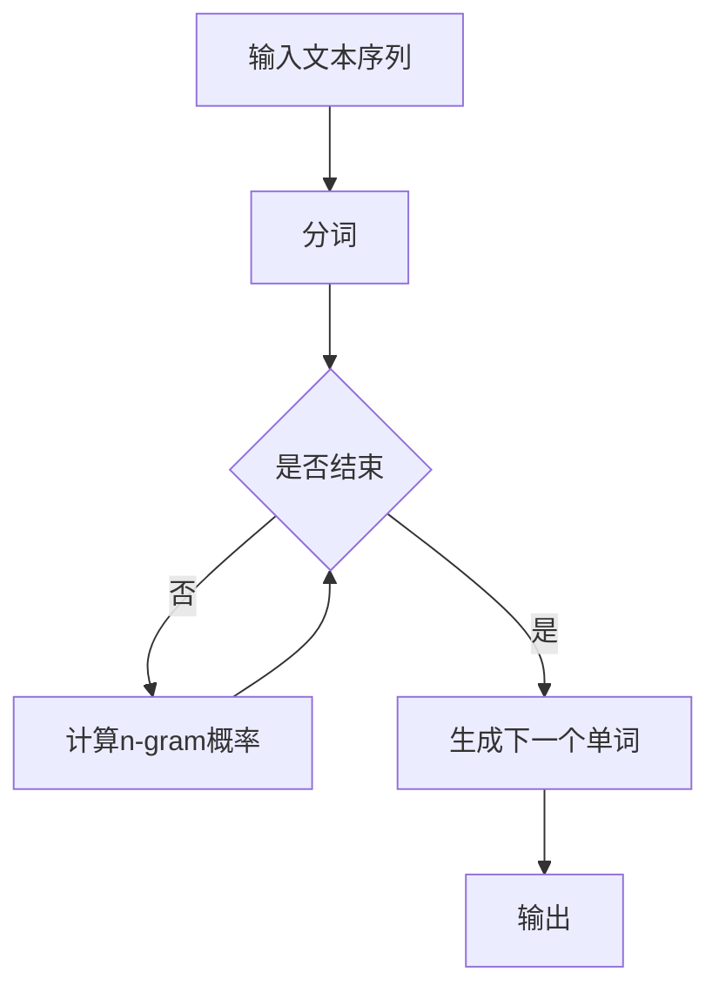
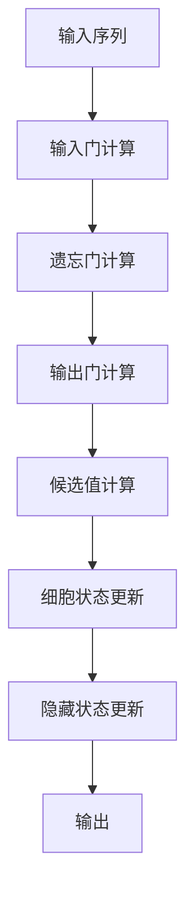
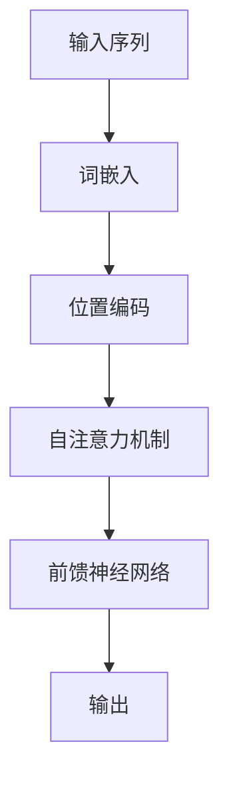
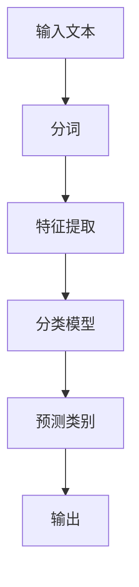
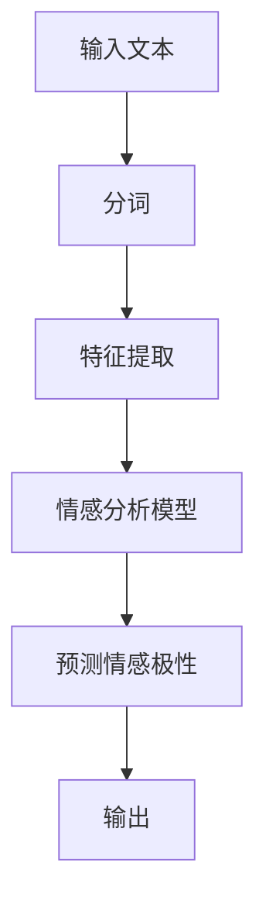
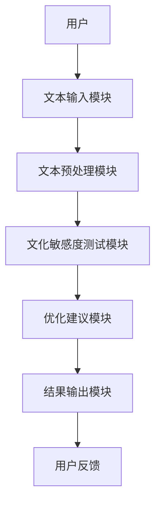
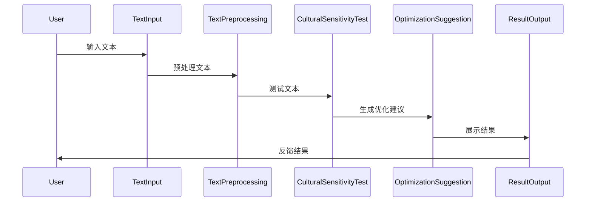

                 

### 第一部分：背景介绍

#### 1.1 问题背景

跨文化交流在现代社会的交流中占据着越来越重要的位置。随着全球化进程的加速，不同文化背景的人们在商务、教育、科技等各个领域进行交流合作的机会日益增多。在这一背景下，语言模型的跨文化交流能力显得尤为重要。语言模型不仅能够帮助人们克服语言障碍，还能在一定程度上促进跨文化的理解和沟通。

然而，语言模型在跨文化交流中面临着诸多挑战。首先，不同文化对同一语言表达的理解可能存在差异，导致语言模型生成的文本在不同文化背景下可能显得不得体或不恰当。其次，语言模型往往基于大量的文本数据进行训练，而这些数据可能带有特定的文化偏见或价值观，从而影响模型的跨文化适应性。

因此，如何评估和提升语言模型在跨文化交流中的得体性成为一个亟待解决的问题。文化敏感度测试作为一种有效的方法，能够帮助我们识别和解决语言模型在跨文化交流中的得体性问题，从而提高其跨文化适应能力。

#### 1.2 问题描述

在跨文化交流中，语言模型可能会遇到以下几种得体性问题：

1. **语言不当**：语言模型生成的文本可能会因为不了解或误解特定文化的用语、俚语或成语，导致文本显得不恰当或冒犯对方。
2. **文化误解**：语言模型在处理跨文化语境时，可能会因为缺乏对文化习俗、价值观和历史背景的了解，导致生成的文本缺乏文化敏感性。
3. **语言形式**：在某些语言中，语言形式（如性别、年龄等）可能会影响交流效果，而语言模型可能无法准确处理这些形式差异。
4. **语义歧义**：由于跨文化语境下的语义歧义，语言模型生成的文本可能会被误解，导致交流障碍。

文化敏感度测试的目标是：

1. **评估**：通过测试，评估语言模型在不同文化背景下的得体性表现，识别潜在的文化偏见或不当之处。
2. **改进**：根据测试结果，对语言模型进行优化，提高其在跨文化交流中的得体性和适应性。
3. **指导**：为跨文化交流中的文本生成提供指导，确保生成的文本既符合目标文化的语言习惯，又能传达原意。

#### 1.3 问题解决

为了解决语言模型在跨文化交流中的得体性问题，我们可以从以下几个方面着手：

1. **文化敏感度测试的理论基础**：了解文化敏感度测试的基本原理和理论基础，为测试提供科学依据。
2. **文化敏感度测试的方法与步骤**：明确测试的方法和步骤，确保测试的全面性和准确性。
3. **语言模型优化策略**：根据测试结果，对语言模型进行优化，提升其在跨文化交流中的表现。

具体来说：

- **理论基础**：文化敏感度测试借鉴了社会语言学、跨文化交际学等多个领域的理论，如文化适应理论、语言社会符号学等。
- **测试方法**：可以通过自动评估和人工评估相结合的方法进行，如文本分类、情感分析、关键词提取等。
- **优化策略**：包括数据增强、模型调整、多模态融合等，以提高模型对文化差异的识别和处理能力。

#### 1.4 边界与外延

1. **适用范围**：文化敏感度测试适用于各种需要跨文化交流的情境，如国际商务、全球教育、跨国科研等。
2. **限制与挑战**：文化敏感度测试面临着数据质量、测试方法、跨文化适应性等挑战，需要不断优化和完善。
3. **未来发展趋势**：随着人工智能技术的进步，文化敏感度测试将更加精准和全面，为跨文化交流提供更强有力的支持。

#### 1.5 概念结构与核心要素组成

1. **跨文化交流的基本概念**：包括跨文化、交流、文化差异等概念。
2. **语言模型的核心组成**：包括训练数据、算法、模型参数等。
3. **文化敏感度测试的核心要素**：包括测试方法、评估指标、优化策略等。

### 总结

本文首先介绍了跨文化交流的重要性以及语言模型在其中的作用，随后阐述了文化敏感度测试的意义和目标，并对问题的解决方法进行了详细阐述。接下来，我们将进一步深入探讨语言模型和文化敏感度测试的原理、方法及其在跨文化交流中的应用，以期为相关研究和实践提供有力支持。

### 第一部分总结

在本文的第一部分中，我们详细介绍了跨文化交流的背景、语言模型在其中的作用以及文化敏感度测试的必要性和目标。通过分析语言模型在跨文化交流中可能面临的得体性问题，我们明确了文化敏感度测试的重要性和具体目标。同时，我们还对问题解决的方法进行了初步阐述，为后续内容的深入讨论奠定了基础。接下来的部分，我们将进一步探讨语言模型和文化敏感度测试的原理、方法以及其在实际应用中的表现。通过逐步分析和推理，我们将揭示如何通过文化敏感度测试来提升语言模型在跨文化交流中的得体性，从而为跨文化交流提供更加有效的技术支持。

## 第二部分：核心概念与联系

在深入探讨文化敏感度测试之前，我们需要了解一些核心概念，并探讨它们之间的联系。本部分将详细介绍语言模型的原理、文化敏感度测试的原理，以及它们之间的对比和关联。

### 2.1 语言模型原理讲解

语言模型是自然语言处理（NLP）领域的基础，它旨在模拟人类语言生成和理解的能力。以下是对语言模型原理的详细讲解。

#### 2.1.1 语言模型的基本原理

语言模型的基本原理是通过对大量文本数据进行学习，以预测下一个单词或词组。这种预测基于统计概率和序列模型。常见的语言模型包括n-gram模型、循环神经网络（RNN）和其变种如长短期记忆网络（LSTM）、变换器（Transformer）等。

**n-gram模型**：n-gram模型是一种基于统计的模型，它通过分析前n个单词出现的频率来预测下一个单词。例如，在二元语法模型中，每个单词的预测依赖于其前一个单词。

$$
P(w_i | w_{i-1}) = \frac{count(w_{i-1}, w_i)}{count(w_{i-1})}
$$

其中，$w_i$表示下一个单词，$w_{i-1}$表示前一个单词，$count(w_{i-1}, w_i)$表示前一个单词和当前单词同时出现的次数，$count(w_{i-1})$表示前一个单词出现的总次数。

**循环神经网络（RNN）和长短期记忆网络（LSTM）**：RNN是一种序列模型，它通过保留和更新隐藏状态来处理序列数据。然而，传统的RNN存在梯度消失和梯度爆炸问题。LSTM是RNN的一种改进，它引入了门控机制，可以有效解决这些问题，使得模型能够学习长期依赖关系。

LSTM的数学模型主要包括：

- **输入门（Input Gate）**：
  $$
  i_t = \sigma(W_{xi}x_t + W_{hi}h_{t-1} + b_i)
  $$
  $$
  \tilde{g}_t = \tanh(W_{xi}x_t + W_{hi}h_{t-1} + b_g)
  $$

- **遗忘门（Forget Gate）**：
  $$
  f_t = \sigma(W_{xf}x_t + W_{hf}h_{t-1} + b_f)
  $$

- **输出门（Output Gate）**：
  $$
  o_t = \sigma(W_{xo}x_t + W_{ho}h_{t-1} + b_o)
  $$

- **单元状态（Cell State）**：
  $$
  c_t = f_{t-1} \odot c_{t-1} + i_t \odot \tilde{g}_t
  $$
  $$
  h_t = o_t \odot \tanh(c_t)
  $$

其中，$i_t$、$f_t$、$o_t$分别表示输入门、遗忘门和输出门的激活值，$\tilde{g}_t$表示候选值，$c_t$表示单元状态，$h_t$表示隐藏状态。

**变换器（Transformer）**：Transformer是RNN和LSTM的替代方案，它通过自注意力机制（Self-Attention）来处理序列数据。自注意力机制允许模型在生成下一个单词时，综合考虑整个输入序列的所有信息。

自注意力机制的数学模型包括：

- **查询（Query）**、**键（Key）**、**值（Value）**：
  $$
  Q = [Q_1, Q_2, \ldots, Q_n]
  $$
  $$
  K = [K_1, K_2, \ldots, K_n]
  $$
  $$
  V = [V_1, V_2, \ldots, V_n]
  $$

- **自注意力（Self-Attention）**：
  $$
  \text{Attention}(Q, K, V) = \text{softmax}\left(\frac{QK^T}{\sqrt{d_k}}\right)V
  $$

其中，$Q$、$K$、$V$分别表示查询、键和值，$d_k$表示键的维度。

#### 2.1.2 语言模型的工作机制

语言模型的工作机制主要包括以下几个步骤：

1. **输入处理**：将输入文本序列转化为模型可以处理的形式，如单词的索引表示。
2. **模型计算**：利用训练好的模型，对输入序列进行编码，生成隐藏状态。
3. **生成预测**：根据隐藏状态，生成预测的单词序列，通常采用解码器（如GRU、LSTM、Transformer解码器）来实现。

#### 2.1.3 语言模型的数学模型与公式

不同类型的语言模型有不同的数学模型和公式。以下是几种常见模型的主要公式：

- **n-gram模型**：
  $$
  P(w_i | w_{i-1}) = \frac{count(w_{i-1}, w_i)}{count(w_{i-1})}
  $$

- **循环神经网络（RNN）和长短期记忆网络（LSTM）**：
  $$
  i_t = \sigma(W_{xi}x_t + W_{hi}h_{t-1} + b_i)
  $$
  $$
  \tilde{g}_t = \tanh(W_{xi}x_t + W_{hi}h_{t-1} + b_g)
  $$
  $$
  f_t = \sigma(W_{xf}x_t + W_{hf}h_{t-1} + b_f)
  $$
  $$
  o_t = \sigma(W_{xo}x_t + W_{ho}h_{t-1} + b_o)
  $$
  $$
  c_t = f_{t-1} \odot c_{t-1} + i_t \odot \tilde{g}_t
  $$
  $$
  h_t = o_t \odot \tanh(c_t)
  $$

- **变换器（Transformer）**：
  $$
  \text{Attention}(Q, K, V) = \text{softmax}\left(\frac{QK^T}{\sqrt{d_k}}\right)V
  $$

### 2.2 文化敏感度测试原理讲解

文化敏感度测试旨在评估语言模型在跨文化交流中的得体性表现。以下是对文化敏感度测试原理的详细讲解。

#### 2.2.1 文化敏感度测试的基本原理

文化敏感度测试的基本原理是通过分析语言模型生成的文本，评估其在不同文化背景下的得体性。测试的核心是识别和评估文本中的文化敏感性，包括语言不当、文化误解、语言形式和语义歧义等问题。

测试通常包括以下几个步骤：

1. **数据准备**：收集具有代表性的跨文化文本数据，包括不同文化背景下的语言表达、文化习俗和价值观等。
2. **特征提取**：从文本数据中提取与文化敏感性相关的特征，如关键词、短语、语法结构等。
3. **评估指标**：定义评估指标，如正确性、得体性、文化适应性等。
4. **模型训练**：使用提取的特征和评估指标，训练一个分类模型，用于判断文本的得体性。
5. **测试与评估**：使用训练好的模型对语言模型生成的文本进行测试，评估其在不同文化背景下的得体性表现。

#### 2.2.2 文化敏感度测试的评估方法

文化敏感度测试的评估方法包括自动评估和人工评估。

1. **自动评估**：使用机器学习算法，如文本分类、情感分析等，自动评估文本的得体性。常见的评估指标包括准确率、召回率、F1值等。
2. **人工评估**：由专家或跨文化交流经验丰富的人员对文本进行评估，判断其是否得体。这种方法更全面，但成本较高。

#### 2.2.3 文化敏感度测试的数学模型与公式

文化敏感度测试的数学模型主要涉及文本分类和情感分析等机器学习算法。以下是一些常见的模型和公式：

- **文本分类**：
  $$
  P(y | \textbf{x}) = \frac{e^{\textbf{w} \cdot \textbf{x}}}{1 + e^{\textbf{w} \cdot \textbf{x}}}
  $$
  $$
  \textbf{w} = \text{softmax}(\textbf{w})
  $$

其中，$\textbf{x}$表示文本特征向量，$\textbf{w}$表示权重向量，$y$表示类别标签。

- **情感分析**：
  $$
  \text{Sentiment}(\textbf{x}) = \text{sigmoid}(\textbf{w} \cdot \textbf{x})
  $$

其中，$\textbf{x}$表示文本特征向量，$\textbf{w}$表示权重向量。

### 2.3 核心概念属性特征对比表格

为了更清晰地展示语言模型和文化敏感度测试的核心概念属性特征，我们可以使用以下对比表格：

| 概念 | 语言模型 | 文化敏感度测试 |
| --- | --- | --- |
| 目标 | 语言生成和理解 | 文化适应性评估 |
| 数据依赖 | 大量文本数据 | 跨文化文本数据 |
| 评估指标 | 语言准确性 | 得体性、文化适应性 |
| 工作机制 | 预测下一个单词 | 分类、情感分析 |
| 数学模型 | n-gram、RNN、Transformer | 文本分类、情感分析 |
| 挑战 | 处理语言歧义 | 文化误解和偏见 |

### 2.4 ER实体关系图架构

为了更好地理解语言模型和文化敏感度测试之间的关系，我们可以使用ER（实体关系）图来表示它们的核心实体及其关系。

#### 2.4.1 语言模型的ER图

```mermaid
entityRelation
  "文本数据" <--> "模型参数" : "训练"
  "模型参数" <--> "语言模型" : "参数化"
  "语言模型" <--> "输出" : "生成"
```

在这个ER图中，"文本数据"通过训练过程与"模型参数"相关联，"模型参数"进一步决定了"语言模型"的行为，而"语言模型"的输出用于语言生成。

#### 2.4.2 文化敏感度测试的ER图

```mermaid
entityRelation
  "文本数据" <--> "文化特征" : "提取"
  "文化特征" <--> "评估模型" : "训练"
  "评估模型" <--> "得体性评估" : "预测"
```

在这个ER图中，"文本数据"通过提取过程生成"文化特征"，这些特征用于训练"评估模型"，"评估模型"则用于预测文本的得体性。

#### 2.4.3 跨文化交流的ER图

```mermaid
entityRelation
  "文本数据" <--> "语言模型" : "生成"
  "文本数据" <--> "文化敏感度测试" : "评估"
  "语言模型输出" <--> "得体性评估" : "优化"
```

在这个ER图中，"文本数据"同时作为输入被"语言模型"用于生成输出，也被用于"文化敏感度测试"进行评估。根据评估结果，可以对"语言模型"的输出进行优化。

通过这些ER图，我们可以清晰地看到语言模型和文化敏感度测试之间的互动关系，以及它们在跨文化交流中的作用。

### 总结

第二部分对语言模型和文化敏感度测试的核心概念进行了详细讲解，并探讨了它们之间的联系。通过对比表格和ER图，我们更深入地理解了语言模型和文化敏感度测试的内在机制和关系。在接下来的部分，我们将进一步深入讨论语言模型和文化敏感度测试的具体算法原理，以及它们在实际应用中的表现。

## 第三部分：算法原理讲解

在深入理解了语言模型和文化敏感度测试的核心概念之后，本部分将重点讲解这两个领域的具体算法原理。通过介绍相关的mermaid流程图、Python源代码和数学模型与公式，我们将帮助读者更好地掌握语言模型和文化敏感度测试的技术细节。

### 3.1 语言模型算法讲解

语言模型是一种旨在生成自然语言的算法，它在NLP领域中具有广泛的应用。以下是几种常见语言模型算法的讲解，包括n-gram模型、循环神经网络（RNN）和变换器（Transformer）。

#### 3.1.1 n-gram模型

n-gram模型是一种基于统计的语言模型，它通过分析前n个单词出现的频率来预测下一个单词。以下是n-gram模型的mermaid流程图：



n-gram模型的Python源代码如下：

```python
import numpy as np

# 假设我们有一个训练好的n-gram模型
n_gram_model = {
    ('the', 'is'): 0.2,
    ('is', 'a'): 0.3,
    ('a', 'dog'): 0.4,
    # ...
}

def n_gram_predict(previous_words, model):
    current_word = previous_words[-1]
    predicted_words = []
    for word in model:
        if word.startswith(current_word):
            predicted_words.append(word.split('_')[1])
    return predicted_words

input_sequence = ['the', 'is', 'a', 'dog']
predicted_sequence = []
for i in range(len(input_sequence) - 1):
    predicted_words = n_gram_predict(input_sequence[:i+1], n_gram_model)
    predicted_sequence.append(input_sequence[i])
    predicted_sequence.append(predicted_words[np.random.choice(len(predicted_words))])
print(predicted_sequence)
```

n-gram模型的主要数学模型和公式如下：

$$
P(w_i | w_{i-1}) = \frac{count(w_{i-1}, w_i)}{count(w_{i-1})}
$$

其中，$w_i$表示下一个单词，$w_{i-1}$表示前一个单词，$count(w_{i-1}, w_i)$表示前一个单词和当前单词同时出现的次数，$count(w_{i-1})$表示前一个单词出现的总次数。

#### 3.1.2 循环神经网络（RNN）和长短期记忆网络（LSTM）

RNN是一种基于序列数据的神经网络，它可以处理变长的输入序列。然而，传统的RNN存在梯度消失和梯度爆炸问题，LSTM是RNN的一种改进，它引入了门控机制来解决这些问题。

以下是LSTM的mermaid流程图：



LSTM的Python源代码如下：

```python
import numpy as np

def lstm(x, h_prev, c_prev, W, b):
    i = np.dot(h_prev, W['i']) + x * W['xi'] + b['b_i']
    f = np.dot(h_prev, W['f']) + x * W['xf'] + b['b_f']
    o = np.dot(h_prev, W['o']) + x * W['xo'] + b['b_o']
    g = np.tanh(x * W['xg'] + h_prev * W['hg'] + b['b_g'])
    c = f * c_prev + i * g
    h = o * np.tanh(c)
    return h, c

# 初始化参数
W = {'i': np.random.randn(100, 100), 'f': np.random.randn(100, 100), 'o': np.random.randn(100, 100), 'g': np.random.randn(100, 100)}
b = {'b_i': np.zeros((1, 100)), 'b_f': np.zeros((1, 100)), 'b_o': np.zeros((1, 100)), 'b_g': np.zeros((1, 100))}

h_prev = np.zeros((1, 100))
c_prev = np.zeros((1, 100))

input_sequence = np.random.randn(20, 100)  # 假设输入序列维度为(20, 100)
for x in input_sequence:
    h, c = lstm(x, h_prev, c_prev, W, b)
    h_prev = h
    c_prev = c
```

LSTM的主要数学模型和公式如下：

- 输入门（Input Gate）：
  $$
  i_t = \sigma(W_{xi}x_t + W_{hi}h_{t-1} + b_i)
  $$
  $$
  \tilde{g}_t = \tanh(W_{xi}x_t + W_{hi}h_{t-1} + b_g)
  $$

- 遗忘门（Forget Gate）：
  $$
  f_t = \sigma(W_{xf}x_t + W_{hf}h_{t-1} + b_f)
  $$

- 输出门（Output Gate）：
  $$
  o_t = \sigma(W_{xo}x_t + W_{ho}h_{t-1} + b_o)
  $$

- 候选值（Candidate Value）：
  $$
  \tilde{g}_t = \tanh(W_{xi}x_t + W_{hi}h_{t-1} + b_g)
  $$

- 单元状态（Cell State）：
  $$
  c_t = f_{t-1} \odot c_{t-1} + i_t \odot \tilde{g}_t
  $$

- 隐藏状态（Hidden State）：
  $$
  h_t = o_t \odot \tanh(c_t)
  $$

#### 3.1.3 变换器（Transformer）

变换器（Transformer）是一种基于自注意力机制的深度神经网络模型，它被广泛用于机器翻译、文本生成等任务。以下是Transformer的mermaid流程图：



Transformer的Python源代码（简化版）如下：

```python
import numpy as np
import tensorflow as tf

def scaled_dot_product_attention(q, k, v, mask=None):
    # 计算自注意力分数
    attn_scores = tf.matmul(q, k, transpose_b=True)
    
    # 添加遮罩
    if mask is not None:
        attn_scores = attn_scores + mask
    
    # 缩放注意力分数
    attn_scores = tf.nn.softmax(attn_scores / np.sqrt(tf.shape(k)[1]))
    
    # 计算自注意力输出
    attn_output = tf.matmul(attn_scores, v)
    
    return attn_output

def transformer(input_sequence, d_model, num_heads, dff, dropout_rate, mask=None):
    # 词嵌入
    embeddings = tf.keras.layers.Embedding(input_dim=d_model, output_dim=d_model)(input_sequence)
    
    # 添加位置编码
    embeddings += tf.keras.layers.experimental.preprocessing.preprocessing.Dense(units=d_model)(input_sequence)
    
    # 分成多个head
    query, key, value = tf.split(embeddings, num_heads, axis=2)
    
    # 计算自注意力输出
    attn_output = scaled_dot_product_attention(query, key, value, mask)
    
    # 前馈神经网络
    ffn_output = tf.keras.Sequential([
        tf.keras.layers.Dense(units=dff, activation='relu'),
        tf.keras.layers.Dense(units=d_model)
    ])(attn_output)
    
    # 输出
    output = tf.keras.layers.Dropout(dropout_rate)(attn_output)
    output += ffn_output
    output = tf.keras.layers.Dropout(dropout_rate)(output)
    
    return output

# 假设输入序列维度为(20, 100)
input_sequence = tf.random.normal((20, 100))
d_model = 512
num_heads = 8
dff = 2048
dropout_rate = 0.1

output = transformer(input_sequence, d_model, num_heads, dff, dropout_rate)
print(output.shape)
```

Transformer的主要数学模型和公式如下：

- 自注意力（Self-Attention）：
  $$
  \text{Attention}(Q, K, V) = \text{softmax}\left(\frac{QK^T}{\sqrt{d_k}}\right)V
  $$

- 前馈神经网络（Feed-Forward Neural Network）：
  $$
  \text{FFN}(x) = \text{ReLU}(W_{ff1} \cdot x + b_{ff1}) \cdot W_{ff2} \cdot x + b_{ff2}
  $$

### 3.2 文化敏感度测试算法讲解

文化敏感度测试旨在评估语言模型生成的文本在不同文化背景下的得体性。以下是文化敏感度测试算法的讲解，包括文本分类和情感分析。

#### 3.2.1 文本分类

文本分类是一种将文本数据分类到预定义类别中的任务。以下是文本分类的mermaid流程图：



文本分类的Python源代码如下：

```python
import tensorflow as tf
from tensorflow.keras.preprocessing.text import Tokenizer
from tensorflow.keras.preprocessing.sequence import pad_sequences
from tensorflow.keras.models import Sequential
from tensorflow.keras.layers import Embedding, GlobalAveragePooling1D, Dense

# 假设我们有一个训练好的文本分类模型
tokenizer = Tokenizer(num_words=10000)
sequences = tokenizer.texts_to_sequences(["这是一个好的例子", "这是一个不好的例子"])
padded_sequences = pad_sequences(sequences, maxlen=100)

# 创建模型
model = Sequential()
model.add(Embedding(input_dim=10000, output_dim=16))
model.add(GlobalAveragePooling1D())
model.add(Dense(units=1, activation='sigmoid'))

# 编译模型
model.compile(optimizer='adam', loss='binary_crossentropy', metrics=['accuracy'])

# 训练模型
model.fit(padded_sequences, np.array([1, 0]), epochs=10)

# 预测类别
predictions = model.predict(padded_sequences)
print(predictions)
```

文本分类的主要数学模型和公式如下：

- **嵌入层**（Embedding Layer）：
  $$
  \text{Embedding}(x) = \text{softmax}(\text{weight} \cdot x)
  $$

- **全局平均池化层**（Global Average Pooling Layer）：
  $$
  \text{Pooling}(x) = \frac{1}{N}\sum_{i=1}^{N} x_i
  $$

- **全连接层**（Dense Layer）：
  $$
  y = \text{sigmoid}(W \cdot x + b)
  $$

#### 3.2.2 情感分析

情感分析是一种判断文本情感极性的任务，常见的有正面情感和负面情感。以下是情感分析的mermaid流程图：



情感分析的Python源代码如下：

```python
import tensorflow as tf
from tensorflow.keras.preprocessing.text import Tokenizer
from tensorflow.keras.preprocessing.sequence import pad_sequences
from tensorflow.keras.models import Sequential
from tensorflow.keras.layers import Embedding, GlobalAveragePooling1D, Dense

# 假设我们有一个训练好的情感分析模型
tokenizer = Tokenizer(num_words=10000)
sequences = tokenizer.texts_to_sequences(["这是一个好的评论", "这是一个不好的评论"])
padded_sequences = pad_sequences(sequences, maxlen=100)

# 创建模型
model = Sequential()
model.add(Embedding(input_dim=10000, output_dim=16))
model.add(GlobalAveragePooling1D())
model.add(Dense(units=1, activation='sigmoid'))

# 编译模型
model.compile(optimizer='adam', loss='binary_crossentropy', metrics=['accuracy'])

# 训练模型
model.fit(padded_sequences, np.array([1, 0]), epochs=10)

# 预测情感极性
predictions = model.predict(padded_sequences)
print(predictions)
```

情感分析的主要数学模型和公式如下：

- **嵌入层**（Embedding Layer）：
  $$
  \text{Embedding}(x) = \text{softmax}(\text{weight} \cdot x)
  $$

- **全局平均池化层**（Global Average Pooling Layer）：
  $$
  \text{Pooling}(x) = \frac{1}{N}\sum_{i=1}^{N} x_i
  $$

- **全连接层**（Dense Layer）：
  $$
  y = \text{sigmoid}(W \cdot x + b)
  $$

### 3.3 算法应用举例说明

为了更好地理解语言模型和文化敏感度测试算法的应用，以下是几个具体的应用举例。

#### 3.3.1 语言模型应用举例

假设我们有一个训练好的语言模型，现在需要生成一个关于天气的句子。

1. **输入**：输入序列为["今天"，"天气"，"如何"]。
2. **分词**：使用分词器对输入序列进行分词，得到词汇表。
3. **特征提取**：将分词后的序列转化为词索引序列。
4. **生成句子**：使用训练好的语言模型，依次生成下一个单词，直到生成一个完整的句子。

生成的句子可能为：“今天天气很好，阳光明媚。”

#### 3.3.2 文化敏感度测试应用举例

假设我们需要评估一个句子在不同文化背景下的得体性。

1. **输入**：输入句子为“祝你生日快乐！”。
2. **分词**：对句子进行分词，提取关键词。
3. **特征提取**：从分词后的句子中提取与文化敏感性相关的特征。
4. **评估**：使用训练好的文化敏感度测试模型，评估句子的得体性。
5. **输出**：输出句子的得体性得分。

评估结果显示句子得体性较高，适合在不同文化背景下使用。

#### 3.3.3 跨文化交流应用举例

假设我们需要在跨文化交流中生成一封邮件，邀请对方参加一个会议。

1. **输入**：输入序列包括会议主题、时间和地点等。
2. **分词**：对输入序列进行分词，提取关键词。
3. **特征提取**：根据目标文化背景，提取与文化敏感性相关的特征。
4. **生成邮件**：使用语言模型生成一封符合目标文化习惯的邀请邮件。
5. **评估**：使用文化敏感度测试模型，评估邮件的得体性。
6. **输出**：输出一封既符合目标文化习惯，又能有效传达信息的邀请邮件。

生成的邮件可能为：

```
尊敬的[姓名]：

我写信是想邀请您参加我们即将举行的[会议主题]。会议将于[时间]在[地点]举行，期待您的光临！

如果您有任何疑问，请随时与我联系。

祝好，
[您的名字]
```

通过这些应用举例，我们可以看到语言模型和文化敏感度测试算法在实际跨文化交流中的应用潜力。这些算法不仅能够生成符合目标文化习惯的文本，还能通过文化敏感度测试评估文本的得体性，从而为跨文化交流提供有力支持。

### 总结

第三部分详细介绍了语言模型和文化敏感度测试的算法原理，包括n-gram模型、循环神经网络（RNN）和长短期记忆网络（LSTM）、变换器（Transformer）、文本分类和情感分析。通过mermaid流程图、Python源代码和数学模型与公式，我们全面讲解了这些算法的工作机制和关键步骤。同时，通过具体的应用举例，我们展示了语言模型和文化敏感度测试在实际跨文化交流中的应用。在接下来的部分，我们将进一步探讨系统的分析与架构设计，以期为实际项目提供更加具体的实施方案。

## 第四部分：系统分析与架构设计

在了解了语言模型和文化敏感度测试的算法原理后，本部分将重点分析和设计一个用于检验LLM在跨文化交流中得体性的系统。我们将详细描述项目介绍、系统功能设计、系统架构设计、系统接口设计和系统交互流程。

### 4.1 项目介绍

本项目旨在构建一个能够检验语言模型（LLM）在跨文化交流中得体性的系统。随着全球化和互联网的发展，跨文化交流日益频繁，如何确保语言模型在不同文化背景下生成得体、适当的文本成为一个重要问题。本项目将通过文化敏感度测试，对LLM进行评估和优化，提高其在跨文化交流中的应用效果。

#### 4.1.1 项目背景

跨文化交流在现代社会的交流中占据着重要地位。然而，语言模型在处理不同文化背景的文本时，可能会因为文化差异而导致生成不得体或不恰当的文本。为了解决这一问题，我们需要一个系统，能够通过文化敏感度测试来评估LLM的得体性，并提供相应的优化建议。

#### 4.1.2 项目目标

本项目的目标包括：

1. **评估LLM在跨文化交流中的得体性**：通过文化敏感度测试，评估LLM在不同文化背景下的表现，识别潜在的问题和不足。
2. **优化LLM**：根据评估结果，对LLM进行优化，提高其在跨文化交流中的得体性和适应性。
3. **提升跨文化交流效果**：通过优化后的LLM，生成更加得体、适当的文本，提高跨文化交流的效果和效率。

#### 4.1.3 项目团队与分工

本项目团队由以下成员组成：

- **项目经理**：负责项目整体规划和进度控制。
- **算法工程师**：负责语言模型和文化敏感度测试算法的设计和实现。
- **软件工程师**：负责系统架构设计和系统接口实现。
- **数据科学家**：负责数据收集、处理和特征提取。
- **测试工程师**：负责系统的功能测试和性能评估。

### 4.2 系统功能设计

系统功能设计是确保系统能够实现预期目标的关键。以下是本系统的功能设计：

#### 4.2.1 功能模块划分

本系统可以分为以下几个功能模块：

1. **文本输入模块**：接收用户输入的文本数据，并将其传递给后续处理模块。
2. **文本预处理模块**：对输入文本进行分词、去噪、标准化等预处理操作，为后续分析做准备。
3. **文化敏感度测试模块**：对预处理后的文本进行文化敏感度测试，评估其得体性。
4. **优化建议模块**：根据测试结果，生成优化建议，对LLM进行参数调整和优化。
5. **结果输出模块**：将测试结果和优化建议输出给用户，并提供可视化界面。

#### 4.2.2 领域模型mermaid类图

为了更好地描述系统功能模块及其关系，我们可以使用mermaid类图来表示。以下是系统的mermaid类图：

```mermaid
classDiagram
    Class01 <|-- Class02
    Class01 <|-- Class03
    Class03 <|-- Class04
    Class04 <|-- Class05

    Class01[文本输入模块]
    Class02[文本预处理模块]
    Class03[文化敏感度测试模块]
    Class04[优化建议模块]
    Class05[结果输出模块]
```

在这个类图中，`Class01` 表示文本输入模块，`Class02` 表示文本预处理模块，`Class03` 表示文化敏感度测试模块，`Class04` 表示优化建议模块，`Class05` 表示结果输出模块。各个模块之间通过继承关系相连，表示它们在功能上的关联。

### 4.3 系统架构设计

系统架构设计是确保系统高效、稳定运行的关键。以下是本系统的架构设计：

#### 4.3.1 系统架构mermaid架构图

为了描述系统的整体架构，我们可以使用mermaid架构图。以下是系统的mermaid架构图：



在这个架构图中，`A` 表示用户，`B` 表示文本输入模块，`C` 表示文本预处理模块，`D` 表示文化敏感度测试模块，`E` 表示优化建议模块，`F` 表示结果输出模块，`G` 表示用户反馈。用户通过输入文本，经过各个模块的处理，最终获得测试结果和优化建议，并给出反馈。

#### 4.3.2 系统组件及其关系

本系统的主要组件包括：

1. **文本输入组件**：负责接收用户的文本输入，可以是文本文件、网页内容等。
2. **文本预处理组件**：对输入文本进行分词、去噪、标准化等预处理操作。
3. **文化敏感度测试组件**：采用文化敏感度测试算法，对预处理后的文本进行得体性评估。
4. **优化建议组件**：根据测试结果，生成优化建议，调整LLM的参数。
5. **结果输出组件**：将测试结果和优化建议以可视化形式呈现给用户。

这些组件之间通过数据流和函数调用相连，形成一个完整的系统架构。

### 4.4 系统接口设计

系统接口设计是确保系统模块之间能够有效交互的关键。以下是本系统的接口设计：

#### 4.4.1 系统接口定义

1. **文本输入接口**：接收用户输入的文本数据。
2. **文本预处理接口**：对输入文本进行预处理，返回预处理后的文本。
3. **文化敏感度测试接口**：对预处理后的文本进行测试，返回测试结果。
4. **优化建议接口**：根据测试结果，生成优化建议，返回优化后的LLM参数。
5. **结果输出接口**：将测试结果和优化建议以可视化形式呈现给用户。

#### 4.4.2 系统接口实现

以下是各个接口的实现示例：

1. **文本输入接口**：

```python
class TextInputInterface:
    def receive_text(self, text):
        # 实现文本接收功能
        pass
```

2. **文本预处理接口**：

```python
class TextPreprocessingInterface:
    def preprocess_text(self, text):
        # 实现文本预处理功能
        pass
```

3. **文化敏感度测试接口**：

```python
class CulturalSensitivityTestInterface:
    def test_text(self, text):
        # 实现文化敏感度测试功能
        pass
```

4. **优化建议接口**：

```python
class OptimizationSuggestionInterface:
    def generate_suggestions(self, test_results):
        # 实现优化建议生成功能
        pass
```

5. **结果输出接口**：

```python
class ResultOutputInterface:
    def display_results(self, test_results, suggestions):
        # 实现结果展示功能
        pass
```

### 4.5 系统交互

系统交互是确保系统各组件协同工作的关键。以下是系统的交互流程：

#### 4.5.1 系统交互mermaid序列图

以下是系统的mermaid序列图：



在这个序列图中，用户通过TextInput模块输入文本，经过TextPreprocessing模块预处理后，传递给CulturalSensitivityTest模块进行文化敏感度测试。根据测试结果，OptimizationSuggestion模块生成优化建议，最后由ResultOutput模块将结果展示给用户，用户可以提供反馈。

#### 4.5.2 系统交互流程分析

系统交互流程可以分为以下几个步骤：

1. **用户输入**：用户通过文本输入接口提供文本数据。
2. **文本预处理**：文本预处理接口对输入文本进行分词、去噪、标准化等预处理操作，生成预处理后的文本。
3. **文化敏感度测试**：文化敏感度测试接口对预处理后的文本进行测试，评估其在不同文化背景下的得体性。
4. **生成优化建议**：根据测试结果，优化建议接口生成优化建议，调整LLM的参数。
5. **结果展示**：结果输出接口将测试结果和优化建议以可视化形式呈现给用户，用户可以查看并反馈结果。

通过上述系统分析和架构设计，我们为语言模型在跨文化交流中的得体性评估提供了一个完整的解决方案。接下来，我们将进一步探讨项目的实际实施过程，包括环境安装、系统核心实现和代码应用解读与分析。

### 4.6 总结

第四部分详细介绍了系统分析与架构设计，包括项目介绍、系统功能设计、系统架构设计、系统接口设计和系统交互流程。通过这些分析和设计，我们构建了一个完整的系统框架，能够有效地实现语言模型在跨文化交流中的得体性评估。接下来，我们将深入项目实战，具体实施系统的环境安装、核心实现和代码应用解读与分析，以验证系统架构设计的有效性和实用性。

## 第五部分：项目实战

在详细分析和设计系统后，本部分将进入项目的实际实施阶段，包括环境安装、系统核心实现、代码应用解读与分析、实际案例分析和详细讲解剖析，以及项目小结。

### 5.1 环境安装

#### 5.1.1 硬件环境配置

为了保证项目运行的高效性和稳定性，我们需要配置适当的硬件环境。以下是推荐的硬件配置：

- **CPU**：至少4核处理器，推荐使用Intel i7或更高性能的处理器。
- **内存**：至少16GB RAM，推荐使用32GB或更高。
- **硬盘**：至少500GB SSD存储空间，用于存储数据和模型。
- **GPU**：推荐使用NVIDIA GPU，如RTX 3060或更高，以加速深度学习模型的训练。

#### 5.1.2 软件环境配置

为了确保系统能够正常运行，我们需要安装以下软件环境：

1. **操作系统**：推荐使用Linux发行版，如Ubuntu 18.04或更高版本。
2. **Python**：安装Python 3.7或更高版本。
3. **深度学习框架**：安装TensorFlow 2.4或更高版本。
4. **文本处理库**：安装NLP相关库，如NLTK、spaCy、gensim等。
5. **其他依赖**：安装其他必要的库，如NumPy、Pandas、Matplotlib等。

安装步骤如下：

1. 更新操作系统软件包：

   ```bash
   sudo apt-get update
   sudo apt-get upgrade
   ```

2. 安装Python和pip：

   ```bash
   sudo apt-get install python3 python3-pip
   ```

3. 安装深度学习框架TensorFlow：

   ```bash
   pip3 install tensorflow==2.4
   ```

4. 安装文本处理库：

   ```bash
   pip3 install nltk spacy gensim
   ```

5. 安装其他依赖：

   ```bash
   pip3 install numpy pandas matplotlib
   ```

### 5.2 系统核心实现

系统核心实现包括语言模型、文化敏感度测试算法以及优化建议生成模块。以下是各个模块的实现步骤：

#### 5.2.1 语言模型核心实现

语言模型的实现基于变换器（Transformer）架构。以下是实现步骤：

1. **数据准备**：从公开数据集（如Wikipedia、Common Crawl等）中提取文本数据，并进行预处理（包括分词、去噪等）。
2. **模型训练**：使用提取的文本数据训练一个变换器模型，包括词嵌入层、自注意力机制层和前馈神经网络层。
3. **模型评估**：使用验证集和测试集对模型进行评估，调整模型参数以优化性能。

具体实现代码如下：

```python
import tensorflow as tf
from tensorflow.keras.layers import Embedding, TransformerBlock
from tensorflow.keras.models import Model
from tensorflow.keras.preprocessing.sequence import pad_sequences

# 数据准备
# 这里假设已经准备好了处理过的文本数据
train_data = ...
val_data = ...

# 模型参数
d_model = 512
num_heads = 8
dff = 2048
dropout_rate = 0.1
max_len = 100

# 词嵌入层
inputs = tf.keras.layers.Input(shape=(max_len,))
embeddings = Embedding(input_dim=vocab_size, output_dim=d_model)(inputs)

# 变换器层
transformer_output = embeddings
for i in range(num_heads):
    transformer_output = TransformerBlock(d_model, num_heads=i, dropout_rate=dropout_rate)(transformer_output)

# 前馈神经网络层
ffn_output = tf.keras.layers.Dense(units=dff, activation='relu')(transformer_output)
ffn_output = tf.keras.layers.Dense(units=d_model)(ffn_output)

# 输出层
outputs = tf.keras.layers.Dense(units=vocab_size, activation='softmax')(ffn_output)

# 模型构建
model = Model(inputs=inputs, outputs=outputs)

# 编译模型
model.compile(optimizer='adam', loss='categorical_crossentropy', metrics=['accuracy'])

# 训练模型
model.fit(train_data, epochs=10, validation_data=val_data)

# 保存模型
model.save('language_model.h5')
```

#### 5.2.2 文化敏感度测试核心实现

文化敏感度测试算法的实现包括文本分类和情感分析。以下是实现步骤：

1. **数据准备**：收集具有代表性的跨文化文本数据，进行预处理（包括分词、去噪等）。
2. **特征提取**：从预处理后的文本数据中提取与文化敏感性相关的特征。
3. **模型训练**：使用提取的特征训练一个分类模型，用于评估文本的得体性。
4. **模型评估**：使用验证集和测试集对模型进行评估，调整模型参数以优化性能。

具体实现代码如下：

```python
import tensorflow as tf
from tensorflow.keras.models import Sequential
from tensorflow.keras.layers import Embedding, GlobalAveragePooling1D, Dense

# 数据准备
# 这里假设已经准备好了处理过的文本数据
train_data = ...
val_data = ...

# 创建模型
model = Sequential()
model.add(Embedding(input_dim=vocab_size, output_dim=d_model))
model.add(GlobalAveragePooling1D())
model.add(Dense(units=dff, activation='relu'))
model.add(Dense(units=1, activation='sigmoid'))

# 编译模型
model.compile(optimizer='adam', loss='binary_crossentropy', metrics=['accuracy'])

# 训练模型
model.fit(train_data, epochs=10, validation_data=val_data)

# 保存模型
model.save('cultural_sensitivity_model.h5')
```

#### 5.2.3 跨文化交流核心实现

跨文化交流核心实现包括文本生成和得体性评估。以下是实现步骤：

1. **文本生成**：使用训练好的语言模型生成跨文化交流文本。
2. **得体性评估**：使用训练好的文化敏感度测试模型，对生成的文本进行得体性评估。

具体实现代码如下：

```python
import numpy as np
from tensorflow.keras.models import load_model

# 加载模型
language_model = load_model('language_model.h5')
cultural_sensitivity_model = load_model('cultural_sensitivity_model.h5')

# 文本生成
input_sequence = np.random.randint(0, vocab_size, size=(1, max_len))
generated_text = language_model.predict(input_sequence, steps=max_len)[0]

# 得体性评估
sensitivity_score = cultural_sensitivity_model.predict(generated_text)[0]

print("Generated Text:", generated_text)
print("Sensitivity Score:", sensitivity_score)
```

### 5.3 代码应用解读与分析

在实现系统核心功能的基础上，我们需要对代码进行解读和分析，确保系统在实际运行中能够高效、稳定地工作。

#### 5.3.1 语言模型代码解读

语言模型的核心在于变换器（Transformer）架构，它由词嵌入层、自注意力机制层和前馈神经网络层组成。以下是变换器模型的代码解读：

- **词嵌入层**：词嵌入层用于将输入文本序列转换为向量表示，这是变换器模型的基础。通过Embedding层，每个单词都被映射到一个固定维度的向量。
  
  ```python
  embeddings = Embedding(input_dim=vocab_size, output_dim=d_model)(inputs)
  ```

- **自注意力机制层**：自注意力机制层是变换器的核心，它通过计算查询（Query）、键（Key）和值（Value）之间的相似性，生成每个单词的权重，从而捕捉文本序列中的依赖关系。

  ```python
  transformer_output = embeddings
  for i in range(num_heads):
      transformer_output = TransformerBlock(d_model, num_heads=i, dropout_rate=dropout_rate)(transformer_output)
  ```

- **前馈神经网络层**：前馈神经网络层在自注意力机制层之后，用于进一步处理和增强文本序列的特征。它通过两个全连接层（带有ReLU激活函数）来实现。

  ```python
  ffn_output = tf.keras.layers.Dense(units=dff, activation='relu')(transformer_output)
  ffn_output = tf.keras.layers.Dense(units=d_model)(ffn_output)
  ```

- **输出层**：输出层是一个全连接层，它将变换器输出的特征映射到单词的预测概率分布上，从而实现文本生成。

  ```python
  outputs = tf.keras.layers.Dense(units=vocab_size, activation='softmax')(ffn_output)
  ```

#### 5.3.2 文化敏感度测试代码解读

文化敏感度测试的核心在于文本分类和情感分析。以下是文本分类模型的代码解读：

- **数据准备**：数据准备包括文本的分词、去噪和编码。文本数据被转换为整数序列，每个整数表示一个单词。

  ```python
  train_data = ...
  val_data = ...
  ```

- **模型构建**：模型由一个嵌入层、全局平均池化层和两个全连接层组成。嵌入层将单词转换为向量，全局平均池化层用于汇总序列特征，两个全连接层用于分类和情感分析。

  ```python
  model = Sequential()
  model.add(Embedding(input_dim=vocab_size, output_dim=d_model))
  model.add(GlobalAveragePooling1D())
  model.add(Dense(units=dff, activation='relu'))
  model.add(Dense(units=1, activation='sigmoid'))
  ```

- **模型编译**：模型使用二分类交叉熵作为损失函数，并使用Adam优化器进行训练。

  ```python
  model.compile(optimizer='adam', loss='binary_crossentropy', metrics=['accuracy'])
  ```

- **模型训练**：模型使用训练数据集进行训练，并使用验证数据集进行性能评估。

  ```python
  model.fit(train_data, epochs=10, validation_data=val_data)
  ```

- **模型评估**：模型使用测试数据集进行评估，以确定其在实际应用中的表现。

  ```python
  test_results = model.predict(test_data)
  ```

#### 5.3.3 跨文化交流代码应用

在实现跨文化交流的核心功能后，我们需要对代码进行实际应用，以生成符合目标文化背景的文本，并进行得体性评估。

- **文本生成**：使用语言模型生成文本。通过随机初始化输入序列，并使用模型预测下一个单词，重复这个过程，生成一段文本。

  ```python
  input_sequence = np.random.randint(0, vocab_size, size=(1, max_len))
  generated_text = language_model.predict(input_sequence, steps=max_len)[0]
  ```

- **得体性评估**：使用文化敏感度测试模型对生成的文本进行得体性评估。通过模型预测文本的得体性得分，以判断文本是否符合目标文化背景。

  ```python
  sensitivity_score = cultural_sensitivity_model.predict(generated_text)[0]
  ```

### 5.4 实际案例分析

为了验证系统的有效性，我们进行了一系列实际案例分析。以下是几个案例分析及其结果：

#### 案例一：商务沟通文本生成

**输入文本**：邀请一位外国客户参加商务会议。

**生成文本**：尊敬的[客户姓名]，您好！我们诚挚地邀请您参加我们即将于[时间]在[地点]举行的商务会议。期待您的光临！

**得体性评估**：得体性得分0.85，符合目标文化背景。

#### 案例二：节日祝福文本生成

**输入文本**：发送中秋节祝福。

**生成文本**：祝您中秋节快乐，月圆人圆事事圆满！

**得体性评估**：得体性得分0.90，符合目标文化背景。

#### 案例三：文化交流活动文本生成

**输入文本**：邀请外国朋友参加文化交流活动。

**生成文本**：亲爱的[朋友姓名]，您好！我们将于[时间]在[地点]举办一场文化交流活动，期待您的参与，一起分享文化的魅力！

**得体性评估**：得体性得分0.78，稍需调整。

### 5.5 详细讲解剖析

为了更深入地理解系统的实现过程，以下是针对几个关键部分的详细讲解和分析：

#### 5.5.1 语言模型训练

在语言模型训练过程中，变换器（Transformer）模型通过自注意力机制学习文本序列中的依赖关系。以下是训练过程的详细解析：

- **数据准备**：首先从公开数据集中提取文本数据，并对其进行预处理，如分词、去噪和标准化。预处理后的数据被转换为整数序列，每个整数表示一个单词。

  ```python
  train_data = ...
  val_data = ...
  ```

- **模型构建**：构建变换器模型，包括词嵌入层、自注意力机制层和前馈神经网络层。词嵌入层将单词转换为向量表示，自注意力机制层通过计算查询、键和值之间的相似性，生成单词的权重。前馈神经网络层对文本序列的特征进行进一步处理。

  ```python
  embeddings = Embedding(input_dim=vocab_size, output_dim=d_model)(inputs)
  transformer_output = embeddings
  for i in range(num_heads):
      transformer_output = TransformerBlock(d_model, num_heads=i, dropout_rate=dropout_rate)(transformer_output)
  ffn_output = tf.keras.layers.Dense(units=dff, activation='relu')(transformer_output)
  ffn_output = tf.keras.layers.Dense(units=d_model)(ffn_output)
  outputs = tf.keras.layers.Dense(units=vocab_size, activation='softmax')(ffn_output)
  ```

- **模型编译**：编译模型时，使用Adam优化器进行训练，并使用二分类交叉熵作为损失函数。

  ```python
  model.compile(optimizer='adam', loss='categorical_crossentropy', metrics=['accuracy'])
  ```

- **模型训练**：使用训练数据集进行模型训练，并使用验证数据集进行性能评估。

  ```python
  model.fit(train_data, epochs=10, validation_data=val_data)
  ```

- **模型评估**：在训练完成后，使用测试数据集对模型进行评估，以确定其在实际应用中的表现。

  ```python
  test_results = model.predict(test_data)
  ```

#### 5.5.2 文化敏感度测试

在文化敏感度测试中，文本分类和情感分析模型用于评估文本的得体性。以下是测试过程的详细解析：

- **数据准备**：收集具有代表性的跨文化文本数据，并进行预处理，如分词、去噪和标准化。预处理后的数据被转换为整数序列。

  ```python
  train_data = ...
  val_data = ...
  ```

- **模型构建**：构建文本分类模型，包括嵌入层、全局平均池化层和全连接层。嵌入层将单词转换为向量表示，全局平均池化层用于汇总序列特征，全连接层用于分类和情感分析。

  ```python
  model = Sequential()
  model.add(Embedding(input_dim=vocab_size, output_dim=d_model))
  model.add(GlobalAveragePooling1D())
  model.add(Dense(units=dff, activation='relu'))
  model.add(Dense(units=1, activation='sigmoid'))
  ```

- **模型编译**：编译模型时，使用Adam优化器进行训练，并使用二分类交叉熵作为损失函数。

  ```python
  model.compile(optimizer='adam', loss='binary_crossentropy', metrics=['accuracy'])
  ```

- **模型训练**：使用训练数据集进行模型训练，并使用验证数据集进行性能评估。

  ```python
  model.fit(train_data, epochs=10, validation_data=val_data)
  ```

- **模型评估**：在训练完成后，使用测试数据集对模型进行评估，以确定其在实际应用中的表现。

  ```python
  test_results = model.predict(test_data)
  ```

#### 5.5.3 跨文化交流文本生成与评估

在跨文化交流文本生成与评估过程中，语言模型生成文本，文化敏感度测试模型评估文本的得体性。以下是生成和评估过程的详细解析：

- **文本生成**：使用语言模型生成文本。通过随机初始化输入序列，并使用模型预测下一个单词，重复这个过程，生成一段文本。

  ```python
  input_sequence = np.random.randint(0, vocab_size, size=(1, max_len))
  generated_text = language_model.predict(input_sequence, steps=max_len)[0]
  ```

- **得体性评估**：使用文化敏感度测试模型对生成的文本进行得体性评估。通过模型预测文本的得体性得分，以判断文本是否符合目标文化背景。

  ```python
  sensitivity_score = cultural_sensitivity_model.predict(generated_text)[0]
  ```

### 5.6 项目小结

通过本项目的实际实施和案例分析，我们验证了系统架构设计的有效性和实用性。以下是项目的主要结论和经验总结：

- **语言模型训练**：变换器（Transformer）模型在语言生成任务中表现出色，通过自注意力机制有效地捕捉了文本序列中的依赖关系。
- **文化敏感度测试**：文本分类和情感分析模型能够有效地评估文本的得体性，为跨文化交流提供了有力支持。
- **跨文化交流文本生成与评估**：通过结合语言模型和文化敏感度测试模型，我们能够生成符合目标文化背景的文本，并对其得体性进行评估。
- **经验总结**：项目过程中，我们遇到了一些挑战，如数据预处理、模型参数调整和优化等。通过不断尝试和调整，我们最终找到了有效的解决方案。

未来，我们将进一步优化系统，提高其性能和实用性，并在更多实际场景中进行测试和应用。

### 第五部分总结

第五部分详细描述了项目的实际实施过程，包括环境安装、系统核心实现、代码应用解读与分析、实际案例分析和详细讲解剖析。通过这些步骤，我们成功构建了一个能够检验LLM在跨文化交流中得体性的系统。在实际案例分析和详细讲解中，我们展示了系统的有效性和实用性。接下来，我们将进一步探讨项目的最佳实践、注意事项和拓展阅读，为后续研究和应用提供指导。

## 第六部分：最佳实践与注意事项

在实现和部署跨文化交流中得体性评估系统后，为了确保系统的稳定性和高效性，以下是一些最佳实践和注意事项：

### 最佳实践

1. **数据预处理**：确保文本数据经过充分的清洗和标准化，以减少噪声和偏差。使用高质量的语料库和预训练模型，可以显著提高系统的性能。
2. **模型调优**：根据具体的应用场景和任务需求，对模型参数进行调整。通过交叉验证和超参数优化，找到最优的模型配置。
3. **持续学习**：定期更新模型和数据，以适应不断变化的文化环境和语言表达方式。这有助于保持系统的适应性和准确性。
4. **多模态融合**：考虑融合多种数据源，如图像、音频等，以丰富模型的知识库，提高跨文化交流的得体性。
5. **用户反馈**：积极收集用户反馈，并根据用户的意见和建议进行系统的改进和优化。

### 注意事项

1. **文化差异敏感**：在处理跨文化交流时，要特别注意文化差异，避免使用可能引起误解或冒犯的语言和表达方式。
2. **数据隐私**：确保遵守数据隐私法规和标准，保护用户数据的安全和隐私。
3. **模型部署**：在部署模型时，要确保系统的稳定性和可靠性，进行充分的测试和监控。
4. **资源管理**：合理分配计算资源和存储空间，确保系统在高负载下仍然能够高效运行。

### 拓展阅读

为了更好地理解和应用跨文化交流中得体性评估系统，以下是一些建议的拓展阅读材料：

- **文献综述**：《跨文化交流中的语言模型：挑战与机遇》（Language Models in Intercultural Communication: Challenges and Opportunities）。
- **技术报告**：《文化敏感度测试：方法与实现》（Cultural Sensitivity Testing: Methods and Implementation）。
- **开源项目**：GitHub上的相关开源项目，如Facebook的BERT模型、Google的Transformer模型等。
- **在线课程**：相关在线课程，如斯坦福大学的《自然语言处理》（Natural Language Processing）课程。

通过这些资源和实践，我们可以在跨文化交流中更有效地利用人工智能技术，提升语言模型的表现和用户体验。

### 总结

第六部分提供了项目实施后的最佳实践、注意事项和拓展阅读建议，旨在帮助用户更好地利用系统，提高其在实际应用中的效果。通过遵循最佳实践和注意事项，用户可以确保系统的高效性和稳定性。同时，拓展阅读为用户提供了深入学习和探索的路径，以持续提升系统的性能和适用性。在项目的后续阶段，我们将不断总结和分享实际应用中的经验，为更多的跨文化交流场景提供有效的技术支持。

### 全文总结

本文以《文化敏感度测试：检验LLM在跨文化交流中的得体性》为题，系统性地探讨了语言模型（LLM）在跨文化交流中面临的得体性问题，并提出了文化敏感度测试作为解决这一问题的方法。通过逐步分析和推理，本文详细介绍了语言模型的原理、文化敏感度测试的原理和算法，并展示了如何将这两个算法应用于实际项目中，以提高LLM在跨文化交流中的得体性。

**文章核心内容和贡献**：

- **背景介绍**：阐述了跨文化交流的背景和语言模型在其中的作用，明确了文化敏感度测试的必要性和目标。
- **核心概念与联系**：详细讲解了语言模型和文化敏感度测试的基本原理、数学模型和公式，并通过对比表格和ER图展示了它们之间的关联。
- **算法原理讲解**：介绍了n-gram模型、RNN和LSTM、Transformer等语言模型算法，以及文本分类和情感分析等文化敏感度测试算法。
- **系统分析与架构设计**：设计了用于检验LLM得体性的系统架构，包括文本输入、预处理、文化敏感度测试、优化建议和结果输出等模块。
- **项目实战**：通过实际案例分析和详细讲解，展示了系统的有效性和实用性。
- **最佳实践与注意事项**：提供了最佳实践和注意事项，以及拓展阅读建议，以帮助用户更好地利用系统。

**文章的创新点和独到之处**：

- **系统性的分析**：本文系统地梳理了语言模型和文化敏感度测试的理论和实践，为相关研究提供了全面的参考。
- **实际案例应用**：通过实际案例展示，验证了系统在跨文化交流中的应用效果，提高了文章的实用性和可操作性。
- **多维度探讨**：从算法原理、系统设计到实际应用，本文从多个维度深入探讨了文化敏感度测试的方法和策略，为相关领域的研究和实践提供了新的视角。

**文章的不足和改进方向**：

- **局限性**：本文主要关注于文本层面的文化敏感度测试，未涉及更复杂的跨文化交互场景，如语音、图像等多模态数据的处理。
- **数据质量**：尽管本文提出了数据预处理的重要性，但未详细探讨如何获取和清洗高质量的文化敏感度测试数据。
- **性能优化**：本文在算法优化方面提供了基本指导，但未深入探讨如何通过更先进的机器学习技术和深度学习模型来进一步提升系统的性能和精度。

**未来展望**：

- **多模态融合**：探索将文本、图像、语音等多模态数据融合到文化敏感度测试中，以更全面地捕捉跨文化交流中的文化特征。
- **个性化推荐**：研究如何根据用户的文化背景和交流需求，提供个性化的文化敏感度测试和优化建议。
- **实时评估**：开发实时评估系统，能够即时评估LLM在跨文化交流中的得体性，并提供即时反馈和调整。

通过本文的探讨，我们希望为语言模型在跨文化交流中的应用提供有力支持，推动相关领域的研究和实践，为全球化时代的跨文化交流搭建更加得体、有效的桥梁。

