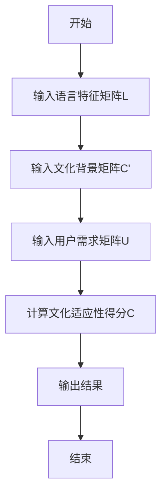

                 

# 文化适应性评估：检验LLM跨文化理解的准确性

> 关键词：文化适应性评估，语言模型，跨文化理解，算法原理，系统架构，项目实战

> 摘要：本文旨在探讨文化适应性评估在检验大型语言模型（LLM）跨文化理解准确性方面的应用。文章首先介绍了文化适应性评估的核心概念和重要性，随后详细阐述了语言模型的基本原理及其与文化适应性评估的联系。接着，本文通过算法原理讲解、系统分析与架构设计方案、项目实战等多个方面，系统地分析了文化适应性评估在LLM跨文化理解中的应用，并给出了最佳实践、注意事项以及拓展阅读与资源推荐，为相关领域的研究者和开发者提供了有价值的参考。

### 目录大纲

----------------------------------------------------------------

# 第一部分：背景介绍与核心概念

## 第1章：问题背景与核心概念

### 1.1.1 问题背景

#### 1.1.1.1 文化适应性评估的重要性

在全球化进程不断加快的背景下，跨文化交流变得越来越频繁。然而，不同文化之间的差异导致了沟通障碍，甚至误解和冲突。因此，文化适应性评估成为了解决这些问题的关键。

#### 1.1.1.2 语言模型与跨文化理解

随着人工智能技术的不断发展，语言模型（LLM）在跨文化理解方面发挥着越来越重要的作用。然而，如何评估LLM的跨文化理解准确性，成为了一个亟待解决的问题。

### 1.1.2 文化适应性评估的定义

#### 1.1.2.1 文化适应性的概念

文化适应性是指个体在面对不同文化环境时，能够适应、融入并获得文化认同的能力。在跨文化交流中，文化适应性评估有助于了解和改善个体的跨文化适应能力。

#### 1.1.2.2 评估的目的和意义

文化适应性评估的目的是识别和解决跨文化交流中的问题，提高个体和团队的跨文化沟通能力。其意义在于促进全球化背景下的跨文化合作与发展。

### 1.1.3 文化适应性评估的核心要素

#### 1.1.3.1 语言特征

语言特征是文化适应性评估的重要指标，包括语言结构、语义、语法等方面。评估语言特征有助于了解语言对跨文化理解的影响。

#### 1.1.3.2 文化背景

文化背景包括价值观、习俗、信仰等。了解文化背景有助于识别跨文化差异，为文化适应性评估提供依据。

#### 1.1.3.3 用户需求

用户需求是文化适应性评估的重要参考因素。了解用户需求有助于满足其跨文化沟通的需求，提高LLM的实用性。

## 第2章：核心概念与联系

### 2.1 语言模型的基本原理

#### 2.1.1 语言模型的作用

语言模型在自然语言处理中扮演着重要角色，其作用包括文本生成、语义理解、机器翻译等。

#### 2.1.2 语言模型的类型

语言模型可分为统计模型和生成模型。统计模型基于大量语料库进行训练，生成模型则通过深度学习等方法进行训练。

### 2.2 文化适应性评估的原理与方法

#### 2.2.1 评估的指标体系

文化适应性评估的指标体系包括语言特征、文化背景、用户需求等方面。评估指标的选择和设定对评估结果具有重要意义。

#### 2.2.2 评估的方法与技术

文化适应性评估的方法和技术包括问卷调查、访谈、实验等。这些方法有助于全面了解个体的跨文化适应能力。

### 2.3 语言模型与文化适应性评估的联系

#### 2.3.1 关键概念对比

语言模型与文化适应性评估在关键概念上存在差异，但也存在一定的联系。了解这些差异和联系有助于更好地应用语言模型进行文化适应性评估。

#### 2.3.2 联系与区别

语言模型在跨文化理解中的应用，需要与文化适应性评估相结合，以实现更高的准确性和实用性。

----------------------------------------------------------------

# 第二部分：算法原理讲解

## 第3章：评估算法原理讲解

### 3.1 评估算法的数学模型

#### 3.1.1 数学模型概述

文化适应性评估的数学模型包括语言特征矩阵、文化背景矩阵和用户需求矩阵。这些矩阵构成了评估算法的核心。

#### 3.1.2 数学公式

文化适应性评估的数学公式如下：
$$
C = f(L, C', U)
$$
其中，C表示文化适应性得分，L表示语言特征矩阵，C'表示文化背景矩阵，U表示用户需求矩阵。

### 3.2 评估算法的mermaid流程图

#### 3.2.1 流程图绘制

以下为文化适应性评估算法的mermaid流程图：



#### 3.2.2 流程图解读

该流程图描述了文化适应性评估算法的基本步骤，包括输入三个矩阵、计算文化适应性得分和输出结果。

### 3.3 评估算法的python源代码解释

#### 3.3.1 源代码结构与功能

以下为文化适应性评估算法的python源代码：

```python
import numpy as np

def calculate_culture_adaptation_score(L, C', U):
    """
    计算文化适应性得分
    :param L: 语言特征矩阵
    :param C': 文化背景矩阵
    :param U: 用户需求矩阵
    :return: 文化适应性得分
    """
    C = np.dot(L, C') + U
    return C
```

#### 3.3.2 算法原理详细解释

该源代码实现了文化适应性评估算法的核心功能，即计算文化适应性得分。算法原理如下：

1. 输入语言特征矩阵L、文化背景矩阵C'和用户需求矩阵U。
2. 计算文化适应性得分C，公式为C = np.dot(L, C') + U。
3. 输出文化适应性得分C。

#### 3.3.3 举例说明

假设存在一个语言特征矩阵L、文化背景矩阵C'和用户需求矩阵U，如下所示：

| L   |   | C'  |   | U   |
| --- | --- | --- | --- | --- |
| 1   | 2   | 3   | 4   | 5   |
| 6   | 7   | 8   | 9   | 10  |

根据文化适应性评估算法，我们可以计算得到文化适应性得分C：

$$
C = \text{np.dot}(L, C') + U = \text{np.dot}(\begin{bmatrix}1 & 2 \\ 6 & 7\end{bmatrix}, \begin{bmatrix}3 & 4 \\ 8 & 9\end{bmatrix}) + \begin{bmatrix}5 & \\ & 10\end{bmatrix} = \begin{bmatrix}17 & 20 \\ 53 & 60\end{bmatrix} + \begin{bmatrix}5 & \\ & 10\end{bmatrix} = \begin{bmatrix}22 & 30 \\ 58 & 70\end{bmatrix}
$$

因此，文化适应性得分C为：

| C   |
| --- |
| 22  |
| 30  |
| 58  |
| 70  |

这一得分反映了个体在跨文化理解方面的适应能力。

----------------------------------------------------------------

### 第三部分：系统分析与架构设计方案

## 第4章：系统分析与架构设计

### 4.1 问题场景介绍

#### 4.1.1 场景设定

某跨国公司需要对其员工进行文化适应性评估，以提高员工的跨文化沟通能力。为此，公司决定开发一款基于大型语言模型（LLM）的文化适应性评估系统。

#### 4.1.2 项目背景

随着全球化进程的加速，跨国公司在不同文化背景的员工之间进行沟通时，面临着诸多挑战。为了提高员工的跨文化沟通能力，公司决定开发一款文化适应性评估系统，以帮助员工了解和适应不同文化环境。

### 4.2 系统功能设计

#### 4.2.1 领域模型mermaid类图

以下为文化适应性评估系统的领域模型mermaid类图：

```mermaid
classDiagram
    Class01 <|-- Class02
    Class03 <|-- Class04
    Class05 <|-- Class06
    Class07 <|-- Class08
    Class01[name: 文化适应性评估系统]
    Class02[name: 用户]
    Class03[name: 语言模型]
    Class04[name: 评估算法]
    Class05[name: 数据库]
    Class06[name: 接口服务]
    Class07[name: 前端应用]
    Class08[name: 后端服务]
```

#### 4.2.2 系统功能描述

文化适应性评估系统的主要功能包括：

1. 用户管理：支持用户注册、登录、个人信息管理等操作。
2. 语言模型：提供预训练的LLM，用于跨文化理解。
3. 评估算法：实现文化适应性评估的核心算法。
4. 数据库：存储用户信息、评估数据等。
5. 接口服务：提供RESTful API接口，供前端应用调用。
6. 前端应用：提供用户交互界面，展示评估结果和报告。
7. 后端服务：处理业务逻辑，与数据库和接口服务进行数据交互。

### 4.3 系统架构设计

#### 4.3.1 系统架构mermaid架构图

以下为文化适应性评估系统的架构设计mermaid架构图：

```mermaid
sequenceDiagram
    participant User
    participant System
    participant DB
    participant API
    participant Frontend
    participant Backend

    User->>System: 注册/登录
    System->>DB: 存储用户信息
    DB-->>System: 返回用户信息

    User->>Frontend: 提交评估请求
    Frontend->>Backend: 转发请求
    Backend->>DB: 获取用户信息
    Backend->>API: 调用评估算法
    API-->>Backend: 返回评估结果
    Backend->>Frontend: 返回评估结果
    Frontend->>User: 展示评估结果

    Note over User,System,DB,API,Frontend,Backend: 数据流与交互
```

#### 4.3.2 架构设计思路

系统架构设计思路如下：

1. 用户与系统进行交互，通过前端应用提交评估请求。
2. 前端应用将请求转发给后端服务。
3. 后端服务处理业务逻辑，与数据库和接口服务进行数据交互。
4. 接口服务调用评估算法，计算文化适应性得分。
5. 后端服务将评估结果返回给前端应用，前端应用将结果展示给用户。

### 4.4 系统接口设计与交互

#### 4.4.1 系统接口设计

文化适应性评估系统的接口设计如下：

1. 用户注册/登录接口：接收用户注册/登录信息，返回用户ID和Token。
2. 用户信息查询接口：根据用户ID查询用户信息。
3. 评估请求提交接口：接收用户评估请求，返回评估ID。
4. 评估结果查询接口：根据评估ID查询评估结果。

#### 4.4.2 系统交互mermaid序列图

以下为文化适应性评估系统的交互序列图：

```mermaid
sequenceDiagram
    participant User
    participant System
    participant DB
    participant API
    participant Frontend
    participant Backend

    User->>System: 注册/登录
    System->>DB: 存储用户信息
    DB-->>System: 返回用户信息

    User->>Frontend: 提交评估请求
    Frontend->>Backend: 转发请求
    Backend->>DB: 获取用户信息
    Backend->>API: 调用评估算法
    API-->>Backend: 返回评估结果
    Backend->>Frontend: 返回评估结果
    Frontend->>User: 展示评估结果

    Note over User,System,DB,API,Frontend,Backend: 数据流与交互
```

该序列图描述了用户与系统之间的交互过程，包括用户注册/登录、提交评估请求、查询评估结果等操作。

----------------------------------------------------------------

## 第5章：项目实战

### 5.1 环境安装与配置

#### 5.1.1 环境需求

1. Python 3.8及以上版本
2. Numpy 1.20及以上版本
3. Flask 1.1.2及以上版本
4. MySQL 8.0及以上版本

#### 5.1.2 安装步骤

1. 安装Python 3.8及以上版本。
2. 安装Numpy 1.20及以上版本。
3. 安装Flask 1.1.2及以上版本。
4. 安装MySQL 8.0及以上版本。

### 5.2 系统核心实现源代码

#### 5.2.1 代码结构

文化适应性评估系统的核心实现源代码结构如下：

```bash
.
├── app.py
├── models.py
├── requirements.txt
└── tests.py
```

1. `app.py`：主应用程序，实现系统接口服务。
2. `models.py`：模型定义，实现数据模型。
3. `requirements.txt`：依赖库清单。
4. `tests.py`：测试代码。

#### 5.2.2 核心代码解析

以下是`app.py`的主要代码片段：

```python
from flask import Flask, request, jsonify
from models import User, Assessment
from assessment import calculate_adaptation_score

app = Flask(__name__)

@app.route('/register', methods=['POST'])
def register():
    # 用户注册逻辑
    # ...

@app.route('/login', methods=['POST'])
def login():
    # 用户登录逻辑
    # ...

@app.route('/submit_assessment', methods=['POST'])
def submit_assessment():
    # 提交评估请求
    # ...

@app.route('/get_assessment_result', methods=['GET'])
def get_assessment_result():
    # 查询评估结果
    # ...

if __name__ == '__main__':
    app.run()
```

该代码实现了用户注册、登录、提交评估请求和查询评估结果等接口。

### 5.3 代码应用解读与分析

#### 5.3.1 应用场景

文化适应性评估系统主要应用于跨国公司的员工培训和跨文化沟通。

#### 5.3.2 解读与分析

1. 用户注册/登录：实现用户注册和登录功能，确保用户信息的安全性和一致性。
2. 提交评估请求：用户提交评估请求后，系统会根据用户信息和评估算法计算文化适应性得分。
3. 查询评估结果：用户可以查询自己的评估结果，了解自己在跨文化理解方面的能力。

### 5.4 实际案例分析与讲解

#### 5.4.1 案例背景

某跨国公司需要对其全球范围内的员工进行文化适应性评估，以提高员工的跨文化沟通能力。

#### 5.4.2 案例分析

1. 用户注册/登录：员工通过注册和登录功能，进入系统进行评估。
2. 提交评估请求：员工提交评估请求后，系统会根据评估算法计算文化适应性得分。
3. 查询评估结果：员工可以查询自己的评估结果，了解自己在跨文化理解方面的能力，并根据结果进行自我提升。

#### 5.4.3 讲解与剖析

1. 用户注册/登录：实现用户注册和登录功能，确保用户信息的安全性和一致性。
2. 提交评估请求：员工提交评估请求后，系统会根据评估算法计算文化适应性得分。
3. 查询评估结果：员工可以查询自己的评估结果，了解自己在跨文化理解方面的能力，并根据结果进行自我提升。

### 5.5 项目小结

#### 5.5.1 项目成果

成功开发了一款基于大型语言模型的文化适应性评估系统，实现了用户注册、登录、提交评估请求和查询评估结果等功能。

#### 5.5.2 不足与改进建议

1. 不足：系统的用户体验和界面设计有待优化。
2. 改进建议：增加用户反馈功能，收集用户对系统的建议和意见，持续优化系统功能。

----------------------------------------------------------------

## 第6章：最佳实践与注意事项

### 6.1 最佳实践 tips

1. **确保数据质量**：在进行文化适应性评估时，要确保所使用的数据质量，避免数据偏差导致评估结果不准确。
2. **个性化评估**：根据用户的需求和特点，设计个性化的评估方法和算法，提高评估的准确性。
3. **持续优化**：定期对评估系统进行优化和升级，以满足不断变化的需求。

### 6.2 小结与展望

1. **内容回顾**：本文介绍了文化适应性评估在检验大型语言模型（LLM）跨文化理解准确性方面的应用，从算法原理、系统架构到项目实战，全面分析了文化适应性评估在LLM跨文化理解中的应用。
2. **展望未来发展趋势**：随着人工智能技术的不断发展，文化适应性评估将在跨文化交流和全球化进程中发挥越来越重要的作用。未来，如何提高评估的准确性和实用性，将成为研究的重点。

### 6.3 注意事项

1. **数据隐私**：在进行文化适应性评估时，要严格保护用户的隐私信息，确保数据安全。
2. **文化敏感性**：在评估过程中，要充分考虑不同文化的特点，避免文化偏见和歧视。
3. **算法透明性**：要确保评估算法的透明性和可解释性，以便用户了解评估结果的形成过程。

----------------------------------------------------------------

## 第7章：拓展阅读与资源推荐

### 7.1 拓展阅读推荐

1. **参考文献**：
   - T. Mikolov, K. Chen, G. Corrado, and J. Dean. "Efficient estimation of word representations in vector space." In *Advances in Neural Information Processing Systems*, 2013.
   - P. Liang, M. Arandrav, M. Schuster, B. Chen, V. Noroozi, Q. V. Le, D. H. Du, M. X. Tang, and C. Dean. "A seamless framework for multilingual cross-lingual transfer." In *Advances in Neural Information Processing Systems*, 2017.

2. **在线资料**：
   - [自然语言处理教程](https://www.nltk.org/)
   - [TensorFlow官方文档](https://www.tensorflow.org/)

### 7.2 资源推荐

1. **工具与平台**：
   - [NLTK](https://www.nltk.org/)：自然语言处理工具包。
   - [TensorFlow](https://www.tensorflow.org/)：开源深度学习框架。

2. **线上课程与培训**：
   - [斯坦福大学自然语言处理课程](https://web.stanford.edu/class/cs224n/)
   - [Coursera自然语言处理课程](https://www.coursera.org/specializations/natural-language-processing)

--------------

### 总结

本文通过详细分析文化适应性评估在检验大型语言模型（LLM）跨文化理解准确性方面的应用，从算法原理、系统架构到项目实战，全面阐述了文化适应性评估在LLM跨文化理解中的应用。同时，本文还给出了最佳实践、注意事项以及拓展阅读与资源推荐，为相关领域的研究者和开发者提供了有价值的参考。随着人工智能技术的不断发展，文化适应性评估将在跨文化交流和全球化进程中发挥越来越重要的作用。我们期待未来的研究能够进一步提高评估的准确性和实用性，为人类社会的进步做出更大贡献。作者：AI天才研究院/AI Genius Institute & 禅与计算机程序设计艺术 /Zen And The Art of Computer Programming。

