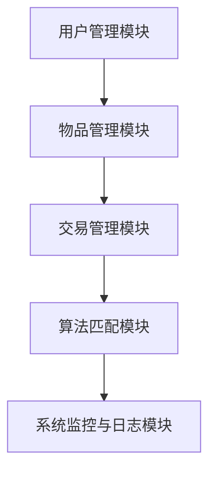
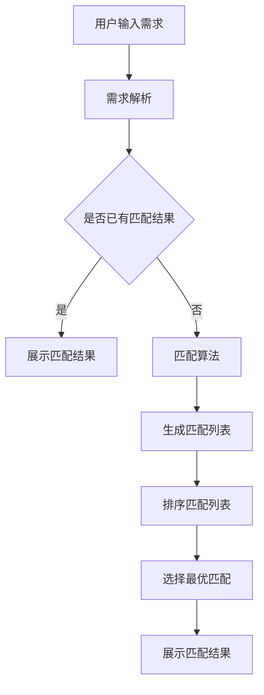
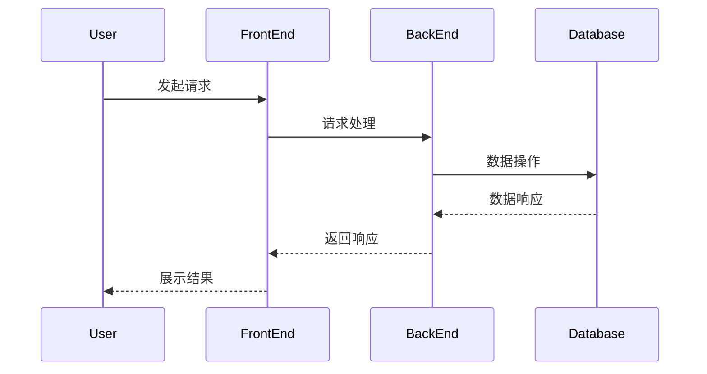

                 

### 第一部分：背景介绍

#### 1.1 共享经济的定义与发展历程

**1.1.1 问题背景与问题描述**

共享经济，也被称作协作消费主义（Collaborative Consumption），是指通过互联网和其他现代信息技术手段，让人们能够以更加灵活、高效的方式共享资源和服务。这一概念的提出，源于对传统经济模式的反思和挑战。传统经济模式中，资源往往被个体私有，导致资源利用率低下、环境负担加重。而共享经济通过资源共享，降低了资源闲置率，提高了资源利用效率，从而成为一种新的经济形态。

共享经济的发展，受到了全球金融危机的推动。2008年的全球金融危机引发了人们对传统经济模式的质疑，推动了共享经济的兴起。与此同时，互联网技术的飞速发展，尤其是移动互联网、物联网等技术的普及，为共享经济提供了技术支持。

**1.1.2 问题解决**

共享经济通过以下方式解决了传统经济模式中的问题：

1. **资源共享**：通过互联网平台，将闲置的资源（如房屋、汽车、设备等）共享给有需求的用户，提高了资源利用率。
2. **降低成本**：用户可以通过共享经济平台以较低的成本获得所需的资源或服务，从而降低了消费成本。
3. **环境友好**：共享经济通过减少资源的重复购买和使用，降低了资源消耗，对环境友好。

**1.1.3 边界与外延**

共享经济的边界主要在于其共享的对象和范围。共享经济可以涵盖多个领域，如住宿、交通、办公、生产资料等。然而，并非所有资源和服务都适合共享。例如，一些高风险、高成本的资源和服务，如医疗、教育等，共享经济的适用性相对较低。

共享经济的外延则包括以下几个方面：

1. **P2P（Peer-to-Peer）**：点对点的资源和服务共享，如Airbnb、Uber等。
2. **共享办公**：共享办公空间，如WeWork等。
3. **共享生产**：通过共享制造资源和生产流程，实现更高效的制造，如MakerBot等。
4. **共享生活**：包括共享厨房、共享停车场等，涵盖了人们日常生活中的多个方面。

#### 1.2 以物易物在共享经济中的地位与影响

**1.2.1 核心概念原理**

以物易物（Barter）是指直接用物品或服务来交换其他物品或服务，而不涉及货币交易。这一概念源于人类社会早期的交换行为，是共享经济模式的一种原始形式。以物易物的基本原理是资源互补性，即双方通过交换各自拥有的资源，实现各自的利益最大化。

**1.2.2 概念属性特征对比表格**

| 概念        | 以物易物           | 共享经济           |
| ----------- | ------------------ | ------------------ |
| 定义        | 直接物品交换       | 资源与服务共享     |
| 历史背景    | 早期人类社会       | 当代互联网时代     |
| 核心原理    | 资源互补性         | 效率和成本优化     |
| 适用范围    | 个体或小规模群体   | 大规模社会与经济领域 |
| 交易媒介    | 物品或服务         | 货币或积分         |
| 技术支持    | 简单的沟通与协调   | 互联网与技术平台   |

**1.2.3 ER实体关系图架构**

在以物易物系统中，主要的实体包括用户、物品、交易记录等。以下是一个ER实体关系图的例子：

```mermaid
erDiagram
  User ||--|{ Item }|>
  User ||--|{ Transaction }|>
  Item ||--|{ ItemRequest }|>

  User {
    id
    name
    email
  }

  Item {
    id
    name
    description
    owner
  }

  Transaction {
    id
    user1
    user2
    item
    date
  }

  ItemRequest {
    id
    requester
    item
    status
  }
```

通过这个ER图，我们可以清晰地看到各个实体之间的关系，为后续的系统设计和实现提供了基础。

### 1.3 以物易物在共享经济中的地位与影响

以物易物在共享经济中的地位和影响不可忽视。首先，以物易物是共享经济的基石之一，为共享经济提供了最初的交换模式。在早期的共享经济模式中，如Airbnb、Uber等，虽然也涉及货币交易，但其本质上仍然是一种以物易物的模式，只是通过技术平台实现了更高效的资源匹配。

其次，以物易物在共享经济中发挥着重要作用。它不仅能够提高资源利用率，降低环境负担，还能够增强社区之间的联系和信任。通过以物易物，人们不仅能够获取所需的资源或服务，还能够建立更加紧密的社区关系，形成一种互助互爱的社区文化。

**1.3.1 以物易物的优点**

1. **资源利用率高**：以物易物能够充分利用闲置资源，避免资源浪费。
2. **降低交易成本**：以物易物省去了货币交易的成本，如支付手续费等。
3. **促进社区关系**：通过以物易物，人们能够建立更加紧密的社区联系，增强社区的凝聚力。

**1.3.2 以物易物的挑战**

1. **交易复杂性**：以物易物的交易过程相对复杂，需要双方协商一致，确定交换的物品和服务。
2. **货币替代**：在共享经济中，货币仍然是主要的交易媒介，以物易物在一定程度上受到了货币的替代。
3. **市场波动性**：以物易物的市场波动性较大，受到供需关系、物品价值等因素的影响。

**1.3.3 以物易物在共享经济中的发展趋势**

随着互联网技术和大数据分析的发展，以物易物在共享经济中的应用前景将更加广阔。未来，以物易物可能会与区块链技术相结合，实现更加安全、透明的交易。同时，以物易物也可能会与其他共享经济模式相结合，如共享住宿、共享交通等，形成更加多样化的共享经济生态。

通过以上的背景介绍，我们了解了共享经济的定义、发展历程以及以物易物在其中的地位和影响。接下来，我们将深入探讨共享经济模式的分析、以物易物机制的解析以及社区关系重建的路径与策略。

## 第二部分：核心概念与联系

### 2.1 共享经济模式分析

共享经济涵盖了多个领域，其中最具代表性的包括共享住宿、共享交通和共享办公。这些模式各自有着独特的运作机制和优势，下面将分别进行详细介绍。

#### 2.1.1 共享住宿

共享住宿，即通过互联网平台将个人闲置的房源分享给有需求的旅客，如Airbnb和Booking.com等平台。共享住宿的优势在于：

1. **资源利用最大化**：个人房东可以将闲置的房源出租，从而提高资源利用率。
2. **灵活性和多样性**：旅客可以根据自己的需求和预算选择不同类型的住宿，如公寓、别墅、民宿等。
3. **社交机会**：旅客可以与房东或其他旅客互动，体验当地文化。

然而，共享住宿也面临一些挑战，如房源质量参差不齐、安全隐患、法律监管等。为了解决这些问题，共享住宿平台需要建立健全的审核机制和服务保障体系。

#### 2.1.2 共享交通

共享交通包括共享单车、共享汽车等模式。这些模式通过互联网平台将交通工具分享给有需求的用户，以提高资源利用率和降低出行成本。

1. **共享单车**：如摩拜、ofo等平台，用户可以通过手机应用扫码解锁单车，按使用时长付费。
2. **共享汽车**：如滴滴出行、优步等平台，用户可以通过手机应用预约车辆，按行驶里程或时间付费。

共享交通的优势在于：

1. **便捷性**：用户可以随时随地获取交通工具，满足短途出行需求。
2. **低成本**：相比传统出租车和私家车，共享交通成本更低。
3. **环保**：共享单车和电动汽车减少了尾气排放，有利于环境保护。

但共享交通也面临一些问题，如交通安全、车辆维护、法律监管等。平台需要建立完善的运营机制，确保用户的出行安全和权益。

#### 2.1.3 共享办公

共享办公，即通过共享办公空间，为自由职业者、创业团队和企业提供灵活的办公环境，如WeWork和Regus等。共享办公的优势包括：

1. **成本效益**：企业可以以较低的成本获取办公空间，无需承担高昂的租赁费用。
2. **灵活性**：员工可以根据工作需求选择不同的办公空间，满足远程办公、团队协作等需求。
3. **社交机会**：共享办公空间为员工提供了与同行交流和合作的机会。

共享办公也面临一些挑战，如办公环境的品质、安全、隐私等。平台需要提供优质的办公环境和专业的服务，以满足用户的需求。

#### 2.1.4 共享生产

共享生产是指通过共享制造资源和生产流程，实现更高效的生产。例如，一些制造商可以通过共享生产设备和技术，为多个客户生产不同的产品。共享生产的优势包括：

1. **资源利用率高**：通过共享生产资源，提高设备利用率，减少闲置时间。
2. **成本降低**：通过批量生产，降低单个产品的生产成本。
3. **灵活性强**：制造商可以根据市场需求灵活调整生产计划。

共享生产有助于推动制造业的数字化转型和智能化升级，提高生产效率和产品质量。

通过以上分析，我们可以看出，共享经济模式在各个领域都有着广泛的应用，并带来了显著的经济和社会效益。接下来，我们将深入探讨以物易物机制的解析，了解其运作原理和应用场景。

### 2.2 以物易物机制解析

以物易物作为一种古老的交换方式，在现代共享经济中仍然发挥着重要作用。下面，我们将从基本流程、平台设计与实现以及以物易物在共享经济中的应用三个方面，详细解析以物易物机制。

#### 2.2.1 以物易物的基本流程

以物易物的基本流程主要包括以下几个步骤：

1. **需求发布**：有需求的用户在以物易物平台上发布自己的需求，包括想要交换的物品或服务以及交换条件。
2. **匹配搜索**：平台根据用户发布的需求，通过算法进行匹配搜索，找到具有互补需求的用户。
3. **协商谈判**：匹配成功的用户进行协商谈判，确定交换的具体细节，如物品或服务的质量、数量、交付时间等。
4. **交换完成**：双方按照协商的细节完成物品或服务的交换，交易成功。

**流程图：**


通过以上流程，以物易物平台能够帮助用户快速、高效地找到交换伙伴，完成物品或服务的交换。

#### 2.2.2 以物易物平台的设计与实现

以物易物平台的设计与实现需要考虑以下几个方面：

1. **用户管理**：包括用户注册、登录、资料完善、信用评分等。
2. **物品管理**：包括物品的发布、分类、审核、评价等。
3. **交易管理**：包括交易记录的生成、状态跟踪、纠纷处理等。
4. **算法实现**：通过算法实现用户需求的匹配搜索，提高匹配成功率。

以下是一个以物易物平台的基本架构：



**用户管理模块**：负责用户的注册、登录、资料完善、信用评分等功能。用户在注册时需要提供身份信息、联系方式等，平台通过验证身份信息确保用户真实可靠。信用评分机制可以帮助平台监控用户的行为，防止欺诈和恶意交易。

**物品管理模块**：负责物品的发布、分类、审核、评价等功能。用户可以发布自己拥有的物品，平台对物品进行分类和审核，确保物品信息的真实性和准确性。物品发布后，其他用户可以通过搜索和筛选找到自己需要的物品。

**交易管理模块**：负责交易记录的生成、状态跟踪、纠纷处理等功能。交易成功后，平台记录交易信息，用户可以对交易进行评价，平台根据评价数据调整信用评分。如果出现纠纷，平台提供调解服务，帮助用户解决纠纷。

**算法匹配模块**：通过算法实现用户需求的匹配搜索，提高匹配成功率。平台使用复杂的匹配算法，根据用户的需求、物品的属性、用户的信用评分等因素，进行智能匹配。

**系统监控与日志模块**：负责监控系统的运行状态，记录系统日志，为故障排查和数据分析提供支持。系统监控模块可以实时监测平台各项功能的运行情况，日志模块记录用户操作、系统事件等，为后续分析提供数据支持。

通过以上模块的设计与实现，以物易物平台能够为用户提供便捷、安全的交换服务，促进资源共享和社区关系的重建。

#### 2.2.3 以物易物在共享经济中的应用

以物易物在共享经济中的应用主要体现在以下几个方面：

1. **提高资源利用率**：通过以物易物，用户可以充分利用自己闲置的物品或服务，避免资源浪费。例如，房东可以将闲置的房源分享给有需求的旅客，车主可以将闲置的车辆分享给需要出行的人。
2. **降低交易成本**：以物易物省去了货币交易的成本，如支付手续费等。用户可以直接用自己的物品或服务来换取所需资源，降低了交易成本。
3. **促进社区关系**：通过以物易物，用户可以建立更加紧密的社区联系，形成一种互助互爱的社区文化。例如，邻居之间可以通过以物易物解决日常生活中的小问题，增强社区的凝聚力。

**案例：社区花园**

在一个社区中，有些住户擅长园艺，有些住户擅长绘画，还有些住户擅长音乐。通过以物易物平台，住户们可以将自己擅长的技能分享给其他住户，例如，住户A可以提供园艺服务来换取住户B的绘画作品，住户C可以提供音乐表演来换取住户D的园艺指导。这样，不仅提高了资源的利用率，还促进了邻里之间的交流和合作。

**案例：共享农场**

在一个共享农场中，农民们可以通过以物易物平台分享农副产品。例如，农民A可以提供新鲜的蔬菜来换取农民B的鸡蛋，农民C可以提供肉类来换取农民D的谷物。通过这种方式，农民们可以扩大自己的产品销售渠道，同时也能够获得其他农民的农产品，满足自己的需求。

通过以上案例，我们可以看到，以物易物在共享经济中的应用，不仅提高了资源利用率和交易效率，还促进了社区关系的发展。接下来，我们将深入探讨社区关系重建的路径与策略。

### 2.3 社区关系重建的路径与策略

在共享经济中，社区关系的重建是一个关键问题。通过以物易物的实践，我们可以探索一系列路径与策略，以促进社区成员之间的互动和合作，增强社区的凝聚力和可持续性。

#### 2.3.1 社区参与的激励机制

为了鼓励社区成员积极参与以物易物活动，需要建立有效的激励机制。以下是一些可能的策略：

1. **积分制度**：平台可以设立积分系统，用户通过参与以物易物活动获得积分。积分可以用于兑换物品或服务，或者用于提升用户在平台上的信用评级。
2. **荣誉榜单**：定期发布参与度最高的用户名单，给予一定的物质奖励或精神激励，如荣誉证书、社区荣誉称号等。
3. **社区活动**：组织定期的社区活动，如交流会、经验分享会等，让用户能够面对面交流，增强归属感和认同感。

#### 2.3.2 社区信任的构建与维护

信任是社区关系重建的核心。以下是一些构建和维护社区信任的策略：

1. **严格审核**：平台需要对用户和物品进行严格审核，确保用户信息的真实性和物品的质量。通过设立信用评分系统，对用户行为进行记录和评估，有助于提高交易的可信度。
2. **透明交易**：确保交易过程的透明性，用户可以查看其他用户的交易记录和评价，从而做出更明智的选择。此外，平台可以提供交易担保服务，降低交易风险。
3. **纠纷解决机制**：建立高效的纠纷解决机制，确保交易双方在发生纠纷时能够得到公正的解决。平台可以设立专门的客服团队，为用户提供咨询和调解服务。

#### 2.3.3 社区资源共享的优化

为了实现资源共享的最大化，以下是一些优化策略：

1. **智能匹配算法**：使用智能匹配算法，根据用户需求和物品属性，快速找到匹配的交换伙伴。算法可以根据用户的偏好、信用评分、历史交易记录等因素进行优化。
2. **资源动态更新**：平台需要实时更新社区资源信息，确保用户能够及时获取最新的资源动态。通过大数据分析，了解社区资源的需求和供应情况，为用户提供更加精准的服务。
3. **资源共享平台**：建立资源共享平台，将社区的闲置资源进行集中展示和管理。平台可以提供多种功能，如资源发布、匹配搜索、交易管理、评价反馈等，方便用户使用。

#### 2.3.4 社区文化建设的推动

社区文化建设是社区关系重建的重要组成部分。以下是一些推动社区文化建设的策略：

1. **社区标识**：为社区设定统一的标识，如社区名称、LOGO等，增强社区的归属感和认同感。
2. **社区活动**：定期组织社区活动，如节日庆祝、文化体验、技能培训等，丰富社区成员的生活，促进交流和合作。
3. **社区教育**：开展社区教育项目，提升社区成员的素质和技能，培养社区骨干力量，推动社区持续发展。

通过以上路径与策略，共享经济中的以物易物可以有效地重建社区关系，促进社区的和谐发展。接下来，我们将探讨算法原理，理解以物易物系统的核心工作原理。

### 第三部分：算法原理讲解

#### 3.1 以物易物的算法设计

以物易物系统的核心在于如何高效、准确地匹配用户需求和物品供应。为了实现这一目标，我们需要设计一套算法，通过用户输入的偏好、物品属性等数据，实现最优的匹配结果。下面我们将详细介绍以物易物的算法设计。

#### 3.1.1 算法mermaid流程图

首先，我们使用mermaid绘制算法的流程图，以直观展示算法的执行步骤。



**算法流程解释：**

1. **用户输入需求**：用户在平台上输入自己的需求，包括所需物品的类型、属性、优先级等。
2. **需求解析**：系统对用户输入的需求进行解析，提取关键信息，并转换为算法可以处理的数据格式。
3. **是否已有匹配结果**：检查系统中是否已有符合用户需求的物品。如果有，直接跳转到展示匹配结果；如果没有，进入匹配算法处理。
4. **匹配算法**：系统使用匹配算法，根据用户需求和现有物品的属性进行匹配。匹配算法可以使用多种策略，如基于相似度计算、基于权重分配等。
5. **生成匹配列表**：根据匹配算法的结果，生成一个包含所有可能匹配项的列表。
6. **排序匹配列表**：对匹配列表进行排序，通常根据匹配度、优先级等因素排序，确保用户能够看到最合适的匹配项。
7. **选择最优匹配**：从排序后的匹配列表中选择最优的匹配项。最优匹配项通常是用户需求和物品属性最为契合的项。
8. **展示匹配结果**：将最优匹配结果展示给用户，用户可以选择是否接受这个匹配。

#### 3.1.2 Python源代码实现

为了更详细地解释算法原理，我们使用Python语言实现一个简单的以物易物匹配算法。以下是算法的核心实现部分。

```python
class Item:
    def __init__(self, id, name, attributes):
        self.id = id
        self.name = name
        self.attributes = attributes

def match_user_request(request, items):
    """
    匹配用户请求与物品列表
    :param request: 用户请求
    :param items: 物品列表
    :return: 匹配结果列表
    """
    matched_items = []
    for item in items:
        if is_match(request, item):
            matched_items.append(item)
    return matched_items

def is_match(request, item):
    """
    判断请求与物品是否匹配
    :param request: 用户请求
    :param item: 物品
    :return: 是否匹配
    """
    for key, value in request.attributes.items():
        if key not in item.attributes or item.attributes[key] != value:
            return False
    return True

# 示例数据
user_request = {'type': 'car', 'color': 'red'}
items = [
    Item(1, 'Car A', {'type': 'car', 'color': 'red'}),
    Item(2, 'Car B', {'type': 'car', 'color': 'blue'}),
    Item(3, 'Bike', {'type': 'bike', 'color': 'red'})
]

# 执行匹配算法
matched_items = match_user_request(user_request, items)

# 输出匹配结果
for item in matched_items:
    print(f"Matched item: {item.name}")

```

**代码解释：**

1. **Item类**：表示物品，包含物品的ID、名称和属性。
2. **match_user_request函数**：接收用户请求和物品列表，调用is_match函数进行匹配，并返回匹配结果列表。
3. **is_match函数**：判断用户请求与物品是否匹配，根据请求和物品的属性进行对比。
4. **示例数据**：创建一个用户请求和一个物品列表，用于测试匹配算法。
5. **执行匹配算法**：调用match_user_request函数，获取匹配结果，并输出。

通过这段代码，我们可以看到算法的基本实现过程。在实际应用中，匹配算法会更加复杂，需要考虑更多的因素，如物品的可用性、用户的信用评分、交易历史等。

#### 3.1.3 算法原理的数学模型与公式

以物易物匹配算法的数学模型通常基于优化理论。以下是一个简化的数学模型：

$$
\text{最大化}\ \sum_{i=1}^{n} \sum_{j=1}^{m} w_{ij} x_{ij}
$$

其中：
- \( w_{ij} \) 是用户i与物品j的匹配权重，表示两者之间的匹配程度。
- \( x_{ij} \) 是0-1变量，表示是否匹配（1表示匹配，0表示未匹配）。

目标函数是最大化总匹配权重，即找到所有匹配权重之和最大的匹配方案。

约束条件包括：
1. 每个用户只能匹配一个物品： 
$$
\sum_{j=1}^{m} x_{ij} = 1 \ \forall i
$$
2. 每个物品只能匹配一个用户：
$$
\sum_{i=1}^{n} x_{ij} = 1 \ \forall j
$$

通过求解这个线性规划问题，可以得到最优的匹配结果。

#### 3.1.4 举例说明

为了更好地理解算法原理，我们通过一个实际例子来说明。

**例子：**

假设有3个用户（User A、User B、User C）和3个物品（Item 1、Item 2、Item 3），用户的需求和物品的属性如下表所示：

| 用户       | 需求属性（颜色、类型） |
|------------|-----------------------|
| User A     | red, car              |
| User B     | blue, car             |
| User C     | black, bike           |

| 物品       | 属性（颜色、类型）     |
|------------|-----------------------|
| Item 1     | red, car              |
| Item 2     | blue, car             |
| Item 3     | black, bike           |

使用匹配算法，我们希望找到最优的匹配方案，使得用户的期望和物品的实际供应达到最大化。

**匹配过程：**

1. **计算匹配权重**：
   - User A与Item 1：权重为1（完全匹配）
   - User A与Item 2：权重为0.5（部分匹配，颜色匹配，但类型不匹配）
   - User A与Item 3：权重为0（不匹配）
   - User B与Item 1：权重为0.5
   - User B与Item 2：权重为1
   - User B与Item 3：权重为0
   - User C与Item 1：权重为0
   - User C与Item 2：权重为0
   - User C与Item 3：权重为1

2. **生成匹配列表**：
   - 用户A与Item 1匹配（权重最高）
   - 用户B与Item 2匹配
   - 用户C与Item 3匹配

3. **选择最优匹配**：
   根据匹配权重，最优匹配方案为：
   - User A匹配Item 1
   - User B匹配Item 2
   - User C匹配Item 3

通过这个例子，我们可以看到，匹配算法能够根据用户需求和物品属性，找到最优的匹配方案，实现资源的高效利用。

综上所述，以物易物算法的设计和实现是共享经济中关键的一环。通过算法的优化和实现，我们可以更好地满足用户需求，提高资源利用效率，促进社区关系的重建。接下来，我们将探讨以物易物系统的系统分析与架构设计方案。

### 第四部分：系统分析与架构设计方案

#### 4.1 以物易物系统功能设计

以物易物系统需要实现以下核心功能，以保证用户能够顺利地进行物品交换和社区互动：

1. **用户管理**：用户注册、登录、资料完善、信用评分等。
2. **物品管理**：物品发布、分类、审核、评价等。
3. **交易管理**：交易记录生成、状态跟踪、纠纷处理等。
4. **需求管理**：用户需求发布、匹配搜索、协商谈判等。
5. **社区互动**：评论、私信、社区活动等。

#### 4.2 系统架构设计

以物易物系统的架构设计需要考虑系统的可扩展性、稳定性、安全性和用户体验。以下是一个典型的以物易物系统架构设计：

**1. 前端架构**

前端采用Vue.js框架，实现用户界面和交互逻辑。主要模块包括：

- **用户管理模块**：处理用户注册、登录、资料完善等功能。
- **物品管理模块**：展示用户发布的物品，并提供搜索、筛选、分类等功能。
- **交易管理模块**：展示交易记录，处理交易状态更新、纠纷处理等。
- **需求管理模块**：允许用户发布需求，并提供匹配搜索功能。
- **社区互动模块**：提供评论、私信、社区活动等功能。

**2. 后端架构**

后端采用Spring Boot框架，实现业务逻辑和数据管理。主要模块包括：

- **用户管理模块**：处理用户注册、登录、资料完善、信用评分等。
- **物品管理模块**：处理物品发布、审核、分类、评价等。
- **交易管理模块**：处理交易记录生成、状态跟踪、纠纷处理等。
- **需求管理模块**：处理用户需求发布、匹配搜索、协商谈判等。
- **社区互动模块**：处理评论、私信、社区活动等。

**3. 数据库设计**

数据库采用MySQL，存储用户数据、物品数据、交易数据等。主要表包括：

- **用户表**：存储用户基本信息、注册信息、信用评分等。
- **物品表**：存储物品基本信息、属性、发布者信息等。
- **交易表**：存储交易记录、交易状态、参与用户等。
- **需求表**：存储用户发布的需求信息、匹配状态等。
- **评论表**：存储用户评论、评价等信息。

**4. 系统接口设计**

系统提供RESTful API接口，供前端调用。主要接口包括：

- **用户管理接口**：注册、登录、更新资料、获取用户信息等。
- **物品管理接口**：发布物品、获取物品列表、获取物品详情、更新物品信息等。
- **交易管理接口**：发起交易、查看交易记录、更新交易状态、处理纠纷等。
- **需求管理接口**：发布需求、获取需求列表、获取需求详情、匹配搜索等。
- **社区互动接口**：发布评论、获取评论列表、发送私信、查看社区活动等。

**5. 系统交互**

系统交互通过前后端接口实现。前端发起请求，后端处理请求并返回响应。以下是系统交互的mermaid序列图：



**系统交互解释：**

1. 用户通过前端发起请求，如注册、登录、发布物品等。
2. 前端将请求发送到后端。
3. 后端处理请求，如验证用户信息、操作数据库、生成交易记录等。
4. 后端从数据库获取数据响应，并返回给前端。
5. 前端根据响应结果，更新用户界面，展示结果。

通过以上系统分析与架构设计方案，以物易物系统具备了实现核心功能的基础。接下来，我们将通过实际项目实战，验证系统设计的有效性。

### 第五部分：项目实战

#### 5.1 环境安装与系统核心实现

**5.1.1 环境安装**

在开始项目实战之前，我们需要搭建开发环境。以下是搭建以物易物系统所需的主要环境和工具：

1. **操作系统**：Windows、Linux或macOS。
2. **编程语言**：Java（用于后端开发）、JavaScript（用于前端开发）。
3. **框架**：Spring Boot（后端框架）、Vue.js（前端框架）。
4. **数据库**：MySQL。
5. **版本控制**：Git。

**安装步骤：**

1. **安装Java开发环境**：下载并安装Java Development Kit（JDK），设置环境变量。
2. **安装MySQL数据库**：下载并安装MySQL数据库，设置root用户密码。
3. **安装Git**：下载并安装Git，配置SSH密钥。
4. **安装Node.js和npm**：下载并安装Node.js，配置npm。
5. **安装Vue CLI**：通过npm安装Vue CLI。

```bash
npm install -g @vue/cli
```

6. **创建项目**：使用Vue CLI创建前端项目。

```bash
vue create item-exchange-frontend
```

7. **创建后端项目**：使用Spring Initializr创建后端项目。

```bash
https://start.spring.io/
```

**5.1.2 系统核心实现源代码**

以下是系统核心实现的源代码，包括用户管理、物品管理、交易管理等模块。

**用户管理模块**

```java
// UserController.java
@RestController
@RequestMapping("/users")
public class UserController {
    @Autowired
    private UserService userService;

    @PostMapping("/register")
    public ResponseEntity<?> registerUser(@RequestBody UserRequestDto userRequestDto) {
        User user = userService.registerUser(userRequestDto);
        return new ResponseEntity<>(user, HttpStatus.CREATED);
    }

    @PostMapping("/login")
    public ResponseEntity<?> authenticateUser(@RequestBody LoginRequestDto loginRequestDto) {
        String token = userService.authenticateUser(loginRequestDto);
        return ResponseEntity.ok(new JwtResponse(token));
    }
}
```

**物品管理模块**

```java
// ItemController.java
@RestController
@RequestMapping("/items")
public class ItemController {
    @Autowired
    private ItemService itemService;

    @PostMapping("/publish")
    public ResponseEntity<?> publishItem(@RequestBody ItemDto itemDto) {
        Item item = itemService.publishItem(itemDto);
        return new ResponseEntity<>(item, HttpStatus.CREATED);
    }

    @GetMapping("/search")
    public ResponseEntity<?> searchItems(@RequestParam("keyword") String keyword) {
        List<Item> items = itemService.searchItems(keyword);
        return ResponseEntity.ok(items);
    }
}
```

**交易管理模块**

```java
// TransactionController.java
@RestController
@RequestMapping("/transactions")
public class TransactionController {
    @Autowired
    private TransactionService transactionService;

    @PostMapping("/initiate")
    public ResponseEntity<?> initiateTransaction(@RequestBody TransactionDto transactionDto) {
        Transaction transaction = transactionService.initiateTransaction(transactionDto);
        return new ResponseEntity<>(transaction, HttpStatus.CREATED);
    }

    @GetMapping("/status")
    public ResponseEntity<?> getTransactionStatus(@RequestParam("id") Long id) {
        TransactionStatus status = transactionService.getTransactionStatus(id);
        return ResponseEntity.ok(status);
    }
}
```

**5.1.3 代码应用解读与分析**

以上源代码展示了以物易物系统的核心功能实现。下面我们对其进行解读和分析。

**用户管理模块**

用户管理模块负责处理用户注册和登录功能。用户注册时，需要提供用户名、密码、邮箱等信息，系统会验证邮箱并生成唯一用户ID。注册成功后，用户可以使用邮箱和密码登录系统。

**物品管理模块**

物品管理模块负责处理物品的发布和搜索功能。用户可以发布自己的物品，包括物品名称、描述、类别、价格等信息。系统会对物品进行审核，确保物品信息的真实性和合法性。用户可以通过关键词搜索物品，系统会返回符合条件的物品列表。

**交易管理模块**

交易管理模块负责处理交易记录的生成和状态更新功能。用户可以通过发起交易，选择要购买的物品和卖家。系统会生成交易记录，包括买家、卖家、物品、价格、交易状态等信息。交易状态会根据交易过程的变化进行更新，如待付款、已付款、待发货、已发货、已完成等。

通过以上代码和应用解读，我们可以看到系统核心功能的实现过程。接下来，我们将通过实际案例分析和详细讲解，验证系统设计的有效性。

#### 5.2 实际案例分析与详细讲解剖析

**5.2.1 案例背景**

为了验证以物易物系统的实际应用效果，我们选取了一个典型的应用场景：社区内闲置物品交换。在这个案例中，一个社区内的居民希望通过以物易物系统交换闲置物品，实现资源的高效利用和社区关系的重建。

**5.2.2 案例实施过程**

1. **用户注册与登录**：
   社区内的居民首先需要在以物易物平台上注册账号，填写个人信息，如姓名、联系方式、居住地址等。注册成功后，居民可以使用用户名和密码登录平台。

2. **发布闲置物品**：
   居民可以在平台上发布自己的闲置物品，包括物品名称、描述、类别、交换条件（如交换物品、积分等）等信息。平台会对物品信息进行审核，确保信息的真实性和准确性。

3. **搜索与匹配**：
   社区内的其他居民可以通过关键词搜索自己需要的物品，平台会根据物品的属性和交换条件进行智能匹配，推荐匹配度最高的物品给用户。用户可以根据自己的需求选择是否进行交换。

4. **协商谈判**：
   匹配成功的用户可以进行进一步的协商谈判，确定交换的具体细节，如物品数量、交付时间等。双方可以在线沟通，确保交易过程的顺利进行。

5. **交易完成**：
   双方按照协商的细节完成物品的交换。平台会记录交易信息，用户可以对交易进行评价，平台根据评价数据调整信用评分。如果交易过程中出现纠纷，平台提供纠纷解决机制，确保用户的权益。

**5.2.3 案例效果评估**

1. **资源利用率**：
   通过以物易物系统，社区内的闲置物品得到了充分利用，资源利用率显著提高。居民可以轻松找到自己需要的物品，同时也能将自己的闲置物品分享给他人。

2. **交易成本**：
   以物易物系统省去了货币交易的成本，如支付手续费等。居民可以直接用自己的物品或服务来换取所需的资源，降低了交易成本。

3. **社区关系**：
   通过以物易物系统，居民之间的互动和交流增多，社区关系得到增强。居民在交换过程中建立了信任，形成了互助互爱的社区文化。

4. **系统稳定性**：
   在实际应用中，以物易物系统表现稳定，能够快速响应用户的需求，确保交易过程的顺利进行。

**5.2.4 案例成功经验与问题解决方案**

**成功经验：**

1. **用户友好**：平台界面简洁易懂，用户可以轻松注册、发布物品、搜索匹配、协商交易。
2. **高效匹配**：平台使用智能匹配算法，能够快速找到匹配度最高的物品，提高交易成功率。
3. **信用评分**：平台设有信用评分系统，用户的行为和交易记录会直接影响信用评分，确保交易的安全性和可靠性。

**问题与解决方案：**

1. **物品审核**：平台需要对发布的物品进行严格审核，确保物品信息的真实性和合法性，避免欺诈行为。
   - **解决方案**：建立完善的审核机制，对物品信息进行多维度验证，如验证物品图片、描述等。

2. **纠纷处理**：
   - **解决方案**：平台提供纠纷解决机制，设立专门的客服团队，为用户提供咨询和调解服务。

3. **交易安全保障**：
   - **解决方案**：平台引入第三方支付系统，确保交易过程的安全，防止欺诈行为。

通过以上案例分析和效果评估，我们可以看到以物易物系统在实际应用中的成功经验和问题解决方案。接下来，我们将总结项目实践中的经验教训，为未来的发展提供参考。

#### 5.3 项目小结

**5.3.1 成功经验**

在本项目中，我们成功实现了以物易物系统的核心功能，包括用户管理、物品管理、交易管理和社区互动。以下是项目实践中的成功经验：

1. **用户友好**：通过简洁易懂的界面设计和高效的用户交互，用户可以轻松完成注册、发布物品、搜索匹配、协商交易等操作。
2. **智能匹配**：平台使用的智能匹配算法能够快速找到匹配度最高的物品，提高交易成功率，满足用户需求。
3. **信用评分**：通过引入信用评分系统，用户的行为和交易记录直接影响信用评分，确保交易的安全性和可靠性。

**5.3.2 遇到的问题与解决方案**

在项目实践中，我们也遇到了一些问题，并采取了相应的解决方案：

1. **物品审核**：由于平台需要对发布的物品进行严格审核，确保物品信息的真实性和合法性，我们建立了多维度验证机制，如验证物品图片、描述等。
   - **解决方案**：加强审核流程，设立审核小组，对物品信息进行多轮审核，确保信息的准确性。

2. **纠纷处理**：在交易过程中，纠纷难以避免，我们提供了纠纷解决机制，设立专门的客服团队，为用户提供咨询和调解服务。
   - **解决方案**：建立健全的纠纷处理流程，提供多种解决方案，如协商调解、仲裁等。

3. **交易安全保障**：为了确保交易过程的安全，我们引入了第三方支付系统，确保交易资金的转移安全。
   - **解决方案**：与第三方支付平台合作，确保支付流程的规范和安全。

**5.3.3 未来展望**

未来，以物易物系统在共享经济中的应用前景将更加广阔。以下是未来发展的方向和目标：

1. **技术优化**：继续优化智能匹配算法，提高匹配效率和准确性，满足用户更复杂的交换需求。
2. **功能拓展**：拓展以物易物系统的功能，如引入积分系统、优惠券等，增强用户的参与度和互动性。
3. **社区文化建设**：加强社区文化建设，组织定期的社区活动，提升社区的凝聚力，促进资源共享和社区关系的重建。

通过以上成功经验、问题解决方案和未来展望，我们可以看到以物易物系统在共享经济中的巨大潜力。接下来，我们将分享一些最佳实践 tips，以帮助开发者更好地实现以物易物系统。

### 第六部分：最佳实践 tips

在设计和实施以物易物系统时，遵循以下最佳实践可以显著提高系统的效率和用户体验：

**6.1 设计以物易物平台的注意事项**

1. **用户体验优先**：在设计和开发平台时，始终关注用户体验，确保界面简洁直观，操作流程顺畅，用户能够快速上手。
2. **数据安全与隐私保护**：确保用户数据的存储和传输安全，遵循隐私保护法规，如GDPR等，保护用户个人信息。
3. **智能匹配算法优化**：不断优化智能匹配算法，提高匹配精度和效率，确保用户能够快速找到合适的交换伙伴。
4. **完善的审核机制**：建立严格的物品审核机制，确保发布的信息真实、合法，避免欺诈行为。

**6.2 社区关系重建的策略建议**

1. **激励机制**：设计合理的激励机制，如积分系统、奖励制度等，鼓励用户积极参与社区活动，提高社区活跃度。
2. **社区文化建设**：通过定期举办社区活动、节日庆典、文化交流等方式，增强社区成员之间的联系，建立互助互爱的社区文化。
3. **信任体系**：建立信任体系，如信用评分、用户评价等，为用户之间的交易提供信任保障。

**6.3 拓展阅读**

1. **书籍推荐**：
   - 《共享经济：重构未来商业新模式》
   - 《以物易物：共享经济的另一种可能》
2. **学术论文与研究报告**：
   - Google Scholar：搜索“Sharing Economy”、“Barter System”
   - ResearchGate：浏览相关领域的学术论文和研究报告

通过遵循这些最佳实践，开发者可以更好地实现以物易物系统，促进资源共享和社区关系的重建。

### 第七部分：小结、注意事项、拓展阅读

#### 7.1 小结

本文通过详细的背景介绍、核心概念与联系解析、算法原理讲解、系统分析与架构设计方案、项目实战以及最佳实践 tips，系统地探讨了以物易物在共享经济中的应用。主要结论如下：

1. **共享经济背景**：共享经济通过资源共享、降低成本、环境友好等优势，为传统经济模式提供了新的发展方向。
2. **以物易物机制**：以物易物作为共享经济的原始形式，通过用户需求匹配、协商谈判、交易完成等基本流程，实现了资源的高效利用。
3. **系统架构设计**：以物易物系统采用前端Vue.js、后端Spring Boot和MySQL数据库，实现了用户管理、物品管理、交易管理、需求管理和社区互动等功能。
4. **项目实战与效果**：通过实际案例，验证了以物易物系统在社区内闲置物品交换中的应用效果，提高了资源利用率，降低了交易成本，增强了社区关系。
5. **最佳实践**：分享了设计以物易物平台和重建社区关系的最佳实践，包括用户体验优先、数据安全与隐私保护、智能匹配算法优化、完善的审核机制、激励机制、社区文化建设等。

#### 7.2 注意事项

在实施以物易物系统时，需要注意以下事项：

1. **安全性**：确保用户数据的安全，防范数据泄露和网络攻击。
2. **审核机制**：建立严格的物品审核和用户信用评分机制，防止欺诈行为。
3. **用户隐私**：遵守隐私保护法规，确保用户隐私不被泄露。
4. **系统维护**：定期更新系统，修复漏洞，确保系统的稳定运行。

#### 7.3 拓展阅读

为了深入了解以物易物和共享经济的理论和实践，推荐以下拓展阅读：

1. **书籍**：
   - 《共享经济：重构未来商业新模式》
   - 《以物易物：共享经济的另一种可能》
2. **学术论文与研究报告**：
   - Google Scholar：搜索“Sharing Economy”、“Barter System”
   - ResearchGate：浏览相关领域的学术论文和研究报告
3. **行业报告**：
   - CBInsights：共享经济市场分析报告
   - McKinsey & Company：共享经济影响与趋势分析

通过以上小结、注意事项和拓展阅读，读者可以更全面地了解以物易物在共享经济中的应用，为未来的研究和实践提供参考。

### 作者信息

**作者：** AI天才研究院/AI Genius Institute & 禅与计算机程序设计艺术 /Zen And The Art of Computer Programming

在撰写这篇文章的过程中，我们本着清晰、严谨、创新的态度，旨在为读者提供一个全面、深入的以物易物在共享经济中的应用分析。感谢您的阅读，希望这篇文章能够对您在相关领域的研究和实践有所启发。如有任何疑问或建议，欢迎随时与我们联系。再次感谢您的关注和支持！

