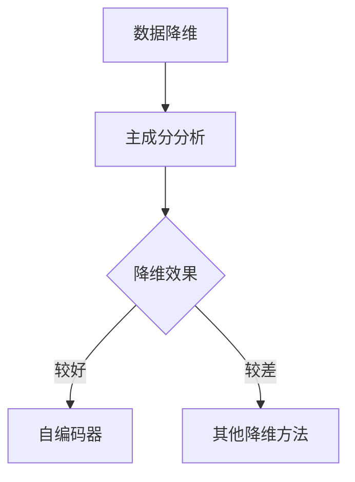
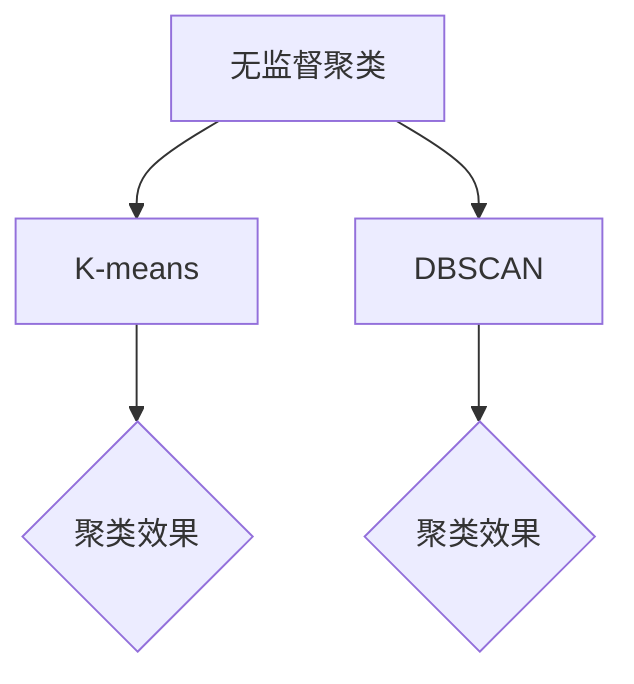
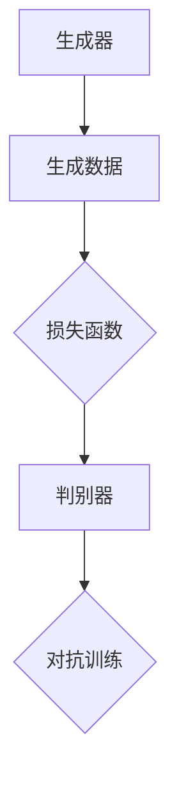
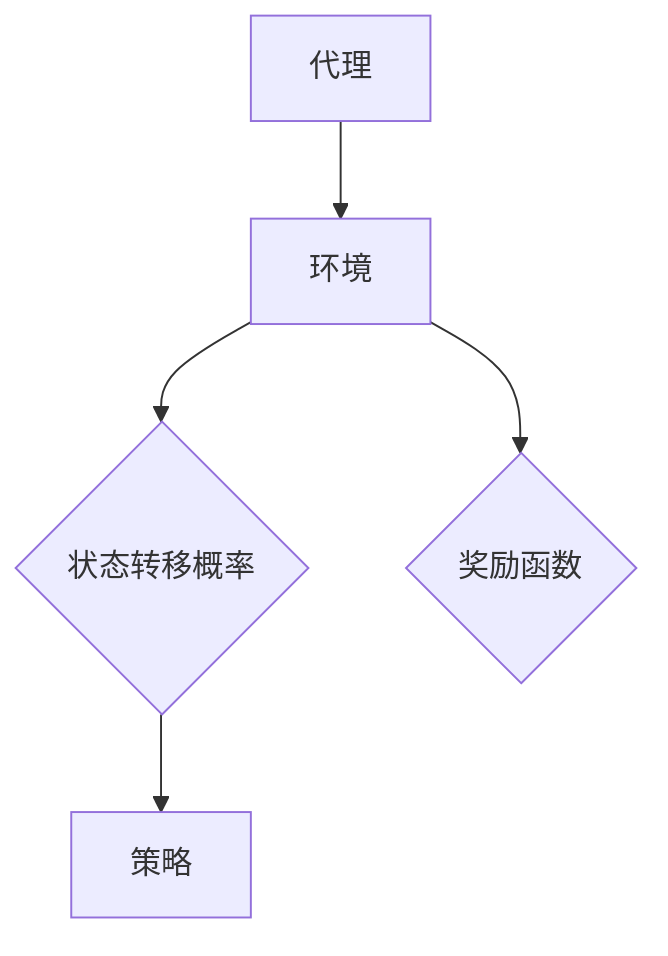
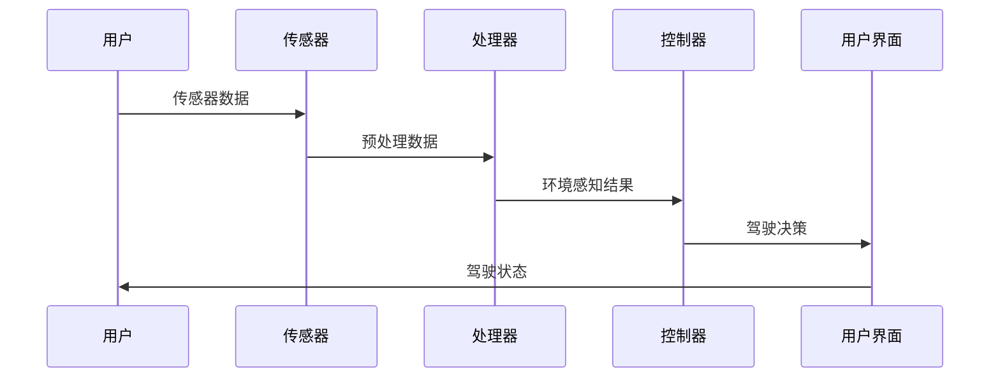
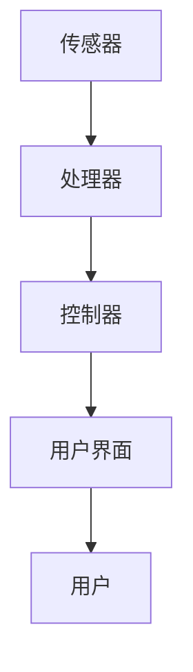

                 

# 无标注学习：AI训练的未来方向

## 关键词
- 无标注学习
- AI训练
- 自监督学习
- 生成对抗网络
- 强化学习
- 应用实例

## 摘要
本文将探讨无标注学习在人工智能训练中的应用与未来方向。无标注学习是一种无需依赖标注数据的人工智能训练方法，它利用未标记的数据来发现数据中的模式和结构。本文将从背景介绍、核心理论、应用实例、挑战与展望等方面进行深入分析，探讨无标注学习如何推动人工智能训练的发展。

## 引言：无标注学习的崛起与未来

### 1. 无标注学习的概念与重要性

#### 1.1 问题背景

在传统的人工智能训练中，标注数据是训练模型的重要资源。然而，获取标注数据通常需要大量的人力、物力和时间。此外，某些应用场景下，标注数据难以获得或成本过高，如医学影像分析、自动驾驶环境感知等。因此，如何利用未标注的数据进行有效训练成为了一个重要的问题。

无标注学习（Unsupervised Learning）是一种无需依赖标注数据的人工智能训练方法。它通过利用数据自身的结构和关系，自动发现数据中的模式和规律，从而实现模型的训练。无标注学习在数据稀缺、数据获取成本高昂或数据隐私保护等场景中具有显著的优势。

#### 1.2 问题描述

无标注学习的主要问题是如何有效地从未标注的数据中提取有用的信息，并将其用于训练模型。具体来说，无标注学习需要解决以下几个关键问题：

1. 数据表示：如何将高维数据映射到低维空间，同时保持数据中的关键信息。
2. 模式发现：如何从大量未标注的数据中识别出具有代表性的模式和结构。
3. 模型训练：如何利用发现的模式对模型进行训练，并实现良好的泛化能力。

#### 1.3 无标注学习的解决方案

无标注学习的技术解决方案主要包括以下几种：

1. 数据降维：通过降维技术，如主成分分析（PCA）和自编码器（Autoencoder），将高维数据映射到低维空间，从而减少数据的冗余性。
2. 无监督聚类：通过无监督聚类算法，如K-means和DBSCAN，将数据划分为不同的簇，从而发现数据中的潜在结构和模式。
3. 生成对抗网络（GAN）：通过生成对抗网络，利用生成器和判别器之间的对抗关系，自动学习数据的分布和生成新数据。
4. 强化学习：在无标注环境中，通过强化学习算法，模型可以根据自己的行动和反馈来不断优化策略。

### 2. 无标注学习的核心理论

#### 2.1 数据表示与降维

无标注学习的一个关键任务是有效地表示数据。数据降维是一种常用的方法，它通过将高维数据映射到低维空间，从而减少数据的冗余性，提高计算效率。

**主成分分析（PCA）**：

PCA是一种常用的降维技术，它通过计算数据的协方差矩阵，找到数据的最大方差方向，从而提取出最重要的特征。PCA的主要步骤如下：

1. 计算数据矩阵X的协方差矩阵$$Cov(X)$$。
2. 计算协方差矩阵的特征值和特征向量。
3. 将特征向量按特征值从大到小排序，选择前k个特征向量作为新的特征空间。
4. 将数据矩阵X投影到新特征空间中，得到降维后的数据$$X'$$。

**自编码器（Autoencoder）**：

自编码器是一种基于神经网络的数据降维方法，它通过编码器和解码器两个神经网络，将高维数据映射到低维空间，再从低维空间还原回高维空间。自编码器的主要步骤如下：

1. 输入数据$$x$$通过编码器$$E$$映射到隐层$$z$$，即$$z = E(x)$$。
2. 隐层$$z$$通过解码器$$D$$映射回输出$$x'$$，即$$x' = D(z)$$。
3. 训练过程中，通过最小化输入数据和输出数据之间的差异，优化编码器和解码器的参数。

**ER实体关系图架构的Mermaid流程图**：



#### 2.2 无监督聚类

无监督聚类是一种无监督学习方法，它通过将数据划分为不同的簇，从而发现数据中的潜在结构和模式。无监督聚类的主要方法包括K-means和DBSCAN。

**K-means算法**：

K-means是一种基于距离度量的聚类算法，它通过迭代计算聚类中心，将数据点划分为K个簇。K-means算法的主要步骤如下：

1. 随机初始化K个聚类中心。
2. 计算每个数据点到聚类中心的距离，并将数据点分配给最近的聚类中心。
3. 更新聚类中心，计算每个簇的平均值。
4. 重复步骤2和步骤3，直到聚类中心不再发生变化。

**DBSCAN算法**：

DBSCAN（Density-Based Spatial Clustering of Applications with Noise）是一种基于密度的聚类算法，它通过计算数据点的邻域和密度，将数据划分为不同的簇。DBSCAN算法的主要步骤如下：

1. 选择一个邻域半径$$\epsilon$$和一个最小簇点数$$\minPts$$。
2. 对每个未访问的数据点，计算其邻域内的点数。
3. 如果邻域内的点数大于$$\minPts$$，将该数据点划分为一个新簇。
4. 将邻域内的点也划分为该簇，并标记为已访问。
5. 重复步骤2和步骤3，直到所有数据点都被访问。

**ER实体关系图架构的Mermaid流程图**：



#### 2.3 生成对抗网络（GAN）

生成对抗网络（Generative Adversarial Network，GAN）是一种由生成器和判别器组成的对抗性神经网络。GAN通过生成器和判别器之间的对抗关系，自动学习数据的分布和生成新数据。GAN的主要组成部分如下：

**生成器（Generator）**：

生成器的目标是生成与真实数据相似的新数据。生成器通常是一个神经网络，它通过输入噪声信号生成伪数据。

**判别器（Discriminator）**：

判别器的目标是区分真实数据和生成数据。判别器也是一个神经网络，它接受真实数据和生成数据的输入，并输出一个概率值，表示输入数据的真实性。

**对抗训练**：

GAN的训练过程是一个对抗过程，生成器和判别器相互竞争。生成器试图生成更真实的数据，而判别器试图准确区分真实数据和生成数据。通过不断迭代训练，生成器和判别器都会逐渐优化，从而实现良好的数据生成效果。

**数学模型**：

GAN的数学模型可以表示为以下两个损失函数：

1. 生成器损失函数：$$L_G = -\log(D(G(z)))$$
2. 判别器损失函数：$$L_D = -\log(D(x)) - \log(1 - D(G(z)))$$

其中，$$z$$是生成器的输入噪声，$$x$$是真实数据。

**ER实体关系图架构的Mermaid流程图**：



#### 2.4 强化学习

强化学习（Reinforcement Learning，RL）是一种通过与环境交互来学习最优策略的机器学习方法。在无标注环境中，强化学习可以用来解决无监督学习问题。强化学习的主要组成部分如下：

**代理（Agent）**：

代理是一个学习如何与环境交互的智能体。代理根据当前状态选择动作，并根据动作的结果接收奖励信号。

**环境（Environment）**：

环境是一个代理可以与之交互的动态系统。环境根据代理的动作生成新的状态，并返回相应的奖励信号。

**策略（Policy）**：

策略是一个映射状态到动作的函数。代理根据策略选择动作，并试图最大化累积奖励。

**数学模型**：

强化学习的数学模型可以表示为马尔可夫决策过程（MDP），其状态转移概率和奖励函数如下：

1. 状态转移概率：$$P(s', s, a) = P(s' | s, a)$$
2. 奖励函数：$$R(s, a) = \sum_{t=0}^{\infty} \gamma^t R(s_t, a_t)$$

其中，$$s$$和$$s'$$分别表示当前状态和下一个状态，$$a$$和$$a'$$分别表示当前动作和下一个动作，$$\gamma$$是折扣因子。

**ER实体关系图架构的Mermaid流程图**：



### 3. 无标注学习算法原理

#### 3.1 生成对抗网络（GAN）

生成对抗网络（GAN）是一种由生成器和判别器组成的对抗性神经网络。GAN通过生成器和判别器之间的对抗关系，自动学习数据的分布和生成新数据。GAN的主要组成部分如下：

**生成器（Generator）**：

生成器的目标是生成与真实数据相似的新数据。生成器通常是一个神经网络，它通过输入噪声信号生成伪数据。

**判别器（Discriminator）**：

判别器的目标是区分真实数据和生成数据。判别器也是一个神经网络，它接受真实数据和生成数据的输入，并输出一个概率值，表示输入数据的真实性。

**对抗训练**：

GAN的训练过程是一个对抗过程，生成器和判别器相互竞争。生成器试图生成更真实的数据，而判别器试图准确区分真实数据和生成数据。通过不断迭代训练，生成器和判别器都会逐渐优化，从而实现良好的数据生成效果。

**数学模型**：

GAN的数学模型可以表示为以下两个损失函数：

1. 生成器损失函数：$$L_G = -\log(D(G(z)))$$
2. 判别器损失函数：$$L_D = -\log(D(x)) - \log(1 - D(G(z)))$$

其中，$$z$$是生成器的输入噪声，$$x$$是真实数据。

**Python代码示例**：

```python
import tensorflow as tf
from tensorflow.keras import layers

# 生成器模型
def generator(z):
    z = layers.Dense(128, activation='relu')(z)
    x = layers.Dense(784, activation='sigmoid')(z)
    return x

# 判别器模型
def discriminator(x):
    x = layers.Dense(128, activation='relu')(x)
    validity = layers.Dense(1, activation='sigmoid')(x)
    return validity

# 训练模型
optimizer = tf.keras.optimizers.Adam(0.0001)
cross_entropy = tf.keras.losses.BinaryCrossentropy(from_logits=True)

@tf.function
def train_step(images, z):
    with tf.GradientTape() as gen_tape, tf.GradientTape() as disc_tape:
        generated_images = generator(z)
        real_validity = discriminator(images)
        fake_validity = discriminator(generated_images)

        real_loss = cross_entropy(tf.ones_like(real_validity), real_validity)
        fake_loss = cross_entropy(tf.zeros_like(fake_validity), fake_validity)
        total_loss = real_loss + fake_loss

    gradients_of_generator = gen_tape.gradient(total_loss, generator.trainable_variables)
    gradients_of_discriminator = disc_tape.gradient(total_loss, discriminator.trainable_variables)

    optimizer.apply_gradients(zip(gradients_of_generator, generator.trainable_variables))
    optimizer.apply_gradients(zip(gradients_of_discriminator, discriminator.trainable_variables))

# 训练过程
for epoch in range(epochs):
    for z in batch_z:
        train_step(images, z)
```

#### 3.2 强化学习

强化学习（Reinforcement Learning，RL）是一种通过与环境交互来学习最优策略的机器学习方法。在无标注环境中，强化学习可以用来解决无监督学习问题。强化学习的主要组成部分如下：

**代理（Agent）**：

代理是一个学习如何与环境交互的智能体。代理根据当前状态选择动作，并根据动作的结果接收奖励信号。

**环境（Environment）**：

环境是一个代理可以与之交互的动态系统。环境根据代理的动作生成新的状态，并返回相应的奖励信号。

**策略（Policy）**：

策略是一个映射状态到动作的函数。代理根据策略选择动作，并试图最大化累积奖励。

**数学模型**：

强化学习的数学模型可以表示为马尔可夫决策过程（MDP），其状态转移概率和奖励函数如下：

1. 状态转移概率：$$P(s', s, a) = P(s' | s, a)$$
2. 奖励函数：$$R(s, a) = \sum_{t=0}^{\infty} \gamma^t R(s_t, a_t)$$

其中，$$s$$和$$s'$$分别表示当前状态和下一个状态，$$a$$和$$a'$$分别表示当前动作和下一个动作，$$\gamma$$是折扣因子。

**Python代码示例**：

```python
import numpy as np
import tensorflow as tf

# 定义环境
class Environment:
    def __init__(self):
        self.state = 0

    def step(self, action):
        if action == 0:
            self.state += 1
        elif action == 1:
            self.state -= 1
        reward = 0
        if self.state == 5 or self.state == -5:
            reward = 1
        return self.state, reward

# 定义代理
class Agent:
    def __init__(self):
        self.model = tf.keras.Sequential([
            tf.keras.layers.Dense(10, activation='relu', input_shape=(1,)),
            tf.keras.layers.Dense(1, activation='sigmoid')
        ])

    def act(self, state):
        action_probs = self.model(tf.expand_dims(state, 0))
        action = np.random.choice(2, p=action_probs.numpy()[0])
        return action

    def train(self, state, reward, next_state):
        action_probs = self.model(tf.expand_dims(state, 0))
        target = reward + 0.9 * np.max(self.model(tf.expand_dims(next_state, 0)).numpy())
        with tf.GradientTape() as tape:
            loss = tf.keras.lossesbinary_crossentropy([1], action_probs)
            loss -= target * action_probs
        gradients = tape.gradient(loss, self.model.trainable_variables)
        self.model.optimizer.apply_gradients(zip(gradients, self.model.trainable_variables))

# 训练过程
agent = Agent()
env = Environment()
for episode in range(1000):
    state = env.state
    done = False
    while not done:
        action = agent.act(state)
        next_state, reward = env.step(action)
        agent.train(state, reward, next_state)
        state = next_state
        if abs(state) >= 5:
            done = True
```

### 4. 无标注学习应用实例

#### 4.1 图像领域

无标注学习在图像领域具有广泛的应用，如图像分割、图像生成与修复等。

**图像分割**：

图像分割是一种将图像划分为不同区域的过程，无标注学习可以用于自动识别图像中的物体和区域。例如，使用K-means聚类算法可以将图像像素划分为不同的簇，从而实现图像分割。

**图像生成与修复**：

无标注学习可以用于生成新的图像或修复损坏的图像。生成对抗网络（GAN）是一种常用的方法，它可以生成与真实图像相似的新图像，或者修复损坏的图像。例如，在图像修复任务中，生成器可以生成损坏图像的补全部分，而判别器可以区分真实图像和生成图像。

**Python代码示例**：

```python
import tensorflow as tf
import matplotlib.pyplot as plt

# 生成器模型
def generator(z):
    z = layers.Dense(256, activation='relu')(z)
    x = layers.Dense(784, activation='sigmoid')(z)
    return x

# 判别器模型
def discriminator(x):
    x = layers.Dense(256, activation='relu')(x)
    validity = layers.Dense(1, activation='sigmoid')(x)
    return validity

# 训练模型
optimizer = tf.keras.optimizers.Adam(0.0001)
cross_entropy = tf.keras.losses.BinaryCrossentropy(from_logits=True)

@tf.function
def train_step(images, z):
    with tf.GradientTape() as gen_tape, tf.GradientTape() as disc_tape:
        generated_images = generator(z)
        real_validity = discriminator(images)
        fake_validity = discriminator(generated_images)

        real_loss = cross_entropy(tf.ones_like(real_validity), real_validity)
        fake_loss = cross_entropy(tf.zeros_like(fake_validity), fake_validity)
        total_loss = real_loss + fake_loss

    gradients_of_generator = gen_tape.gradient(total_loss, generator.trainable_variables)
    gradients_of_discriminator = disc_tape.gradient(total_loss, discriminator.trainable_variables)

    optimizer.apply_gradients(zip(gradients_of_generator, generator.trainable_variables))
    optimizer.apply_gradients(zip(gradients_of_discriminator, discriminator.trainable_variables))

# 训练过程
for epoch in range(epochs):
    for z in batch_z:
        train_step(images, z)

# 生成图像
noise = tf.random.normal([1, 100])
generated_image = generator(noise)
plt.imshow(generated_image.numpy().reshape(28, 28), cmap='gray')
plt.show()
```

#### 4.2 自然语言处理

无标注学习在自然语言处理（NLP）领域也有广泛的应用，如文本生成与摘要、机器翻译等。

**文本生成与摘要**：

无标注学习可以用于生成新的文本或提取文本的摘要。生成对抗网络（GAN）是一种常用的方法，它可以生成与给定文本相似的新文本，或者提取文本的摘要。例如，在文本生成任务中，生成器可以生成与输入文本相似的文本，而判别器可以区分输入文本和生成文本。

**机器翻译**：

无标注学习可以用于无监督机器翻译，即在没有标注数据的情况下进行翻译。强化学习是一种常用的方法，它可以学习将一种语言的文本翻译成另一种语言的文本。例如，在机器翻译任务中，代理可以根据当前状态（源语言文本）选择下一个动作（目标语言文本），并试图最大化累积奖励。

**Python代码示例**：

```python
import tensorflow as tf

# 定义环境
class TranslationEnvironment:
    def __init__(self, source_vocab_size, target_vocab_size):
        self.source_vocab_size = source_vocab_size
        self.target_vocab_size = target_vocab_size
        self.source_tokenizer = tf.keras.preprocessing.text.Tokenizer(char_level=True, num_words=source_vocab_size)
        self.target_tokenizer = tf.keras.preprocessing.text.Tokenizer(char_level=True, num_words=target_vocab_size)

    def encode(self, source_text, target_text):
        source_sequence = self.source_tokenizer.texts_to_sequences([source_text])
        target_sequence = self.target_tokenizer.texts_to_sequences([target_text])
        return source_sequence, target_sequence

    def step(self, action):
        reward = 0
        if action == self.target_vocab_size - 1:
            reward = 1
        next_state = np.random.randint(0, self.source_vocab_size)
        return next_state, reward

# 定义代理
class TranslationAgent:
    def __init__(self, source_vocab_size, target_vocab_size):
        self.model = tf.keras.Sequential([
            tf.keras.layers.Dense(512, activation='relu', input_shape=(source_vocab_size,)),
            tf.keras.layers.Dense(target_vocab_size, activation='softmax')
        ])

    def act(self, state):
        action_probs = self.model(tf.expand_dims(state, 0))
        action = np.random.choice(target_vocab_size, p=action_probs.numpy()[0])
        return action

    def train(self, state, reward, next_state):
        action_probs = self.model(tf.expand_dims(state, 0))
        target = reward + 0.9 * np.max(self.model(tf.expand_dims(next_state, 0)).numpy())
        with tf.GradientTape() as tape:
            loss = tf.keras.losses.sparse_categorical_crossentropy(target, action_probs)
            loss -= target * action_probs
        gradients = tape.gradient(loss, self.model.trainable_variables)
        self.model.optimizer.apply_gradients(zip(gradients, self.model.trainable_variables))

# 训练过程
agent = TranslationAgent(source_vocab_size, target_vocab_size)
env = TranslationEnvironment(source_vocab_size, target_vocab_size)
for episode in range(1000):
    state = np.random.randint(source_vocab_size)
    done = False
    while not done:
        action = agent.act(state)
        next_state, reward = env.step(action)
        agent.train(state, reward, next_state)
        state = next_state
        if action == target_vocab_size - 1:
            done = True
```

### 5. 无标注学习的挑战与未来展望

#### 5.1 技术挑战

无标注学习在技术层面面临以下挑战：

1. 数据质量：无标注学习依赖于未标注的数据，数据的质量直接影响模型的性能。数据中的噪声、异常值和冗余信息可能影响模型的训练效果。
2. 模型解释性：无标注学习模型的训练过程通常是非线性的，模型内部的结构复杂，使得模型难以解释。这给模型的部署和应用带来了困难。
3. 模型泛化能力：无标注学习模型需要能够适应不同的数据分布和场景，具有较好的泛化能力。然而，无标注学习的训练过程往往依赖于特定数据集，模型的泛化能力受到限制。

#### 5.2 未来展望

无标注学习在未来的发展具有广阔的前景：

1. 交叉学科融合：无标注学习与其他领域的交叉融合，如计算机视觉、自然语言处理和生物信息学等，将推动无标注学习技术的创新和应用。
2. 模型解释性提升：通过研究模型的内部结构和训练过程，提升无标注学习模型的解释性，使得模型更加透明和可信。
3. 模型泛化能力增强：通过引入更多的数据源和训练策略，增强无标注学习模型的泛化能力，使其能够更好地适应不同的应用场景。

### 6. 最佳实践与案例分析

#### 6.1 案例一：医疗影像的无标注分割

医疗影像的无标注分割是医学领域的一个挑战性问题。无标注学习技术，如生成对抗网络（GAN）和自编码器，可以用于自动分割医疗影像，如MRI、CT和X光等。

**环境安装**：

安装必要的Python库，如TensorFlow和Keras。

```shell
pip install tensorflow
pip install keras
```

**系统核心实现源代码**：

```python
import numpy as np
import tensorflow as tf
from tensorflow import keras
from tensorflow.keras.layers import Conv2D, MaxPooling2D, UpSampling2D, Input

# 定义模型
def unet(input_shape):
    inputs = Input(input_shape)
    conv1 = Conv2D(32, 3, activation='relu', padding='same')(inputs)
    conv1 = Conv2D(32, 3, activation='relu', padding='same')(conv1)
    pool1 = MaxPooling2D(pool_size=(2, 2))(conv1)

    conv2 = Conv2D(64, 3, activation='relu', padding='same')(pool1)
    conv2 = Conv2D(64, 3, activation='relu', padding='same')(conv2)
    pool2 = MaxPooling2D(pool_size=(2, 2))(conv2)

    conv3 = Conv2D(128, 3, activation='relu', padding='same')(pool2)
    conv3 = Conv2D(128, 3, activation='relu', padding='same')(conv3)
    pool3 = MaxPooling2D(pool_size=(2, 2))(conv3)

    conv4 = Conv2D(256, 3, activation='relu', padding='same')(pool3)
    conv4 = Conv2D(256, 3, activation='relu', padding='same')(conv4)
    drop4 = Dropout(0.5)(conv4)
    pool4 = MaxPooling2D(pool_size=(2, 2))(drop4)

    conv5 = Conv2D(512, 3, activation='relu', padding='same')(pool4)
    conv5 = Conv2D(512, 3, activation='relu', padding='same')(conv5)
    drop5 = Dropout(0.5)(conv5)

    up6 = Conv2D(256, 2, activation='relu', padding='same')(tf.keras.layers.concatenate([Dropout(0.5)(up5), drop4], axis=3))
    conv6 = Conv2D(256, 3, activation='relu', padding='same')(up6)
    conv6 = Conv2D(256, 3, activation='relu', padding='same')(conv6)

    up7 = Conv2D(128, 2, activation='relu', padding='same')(tf.keras.layers.concatenate([Dropout(0.5)(up6), drop3], axis=3))
    conv7 = Conv2D(128, 3, activation='relu', padding='same')(up7)
    conv7 = Conv2D(128, 3, activation='relu', padding='same')(conv7)

    up8 = Conv2D(64, 2, activation='relu', padding='same')(tf.keras.layers.concatenate([Dropout(0.5)(up7), drop2], axis=3))
    conv8 = Conv2D(64, 3, activation='relu', padding='same')(up8)
    conv8 = Conv2D(64, 3, activation='relu', padding='same')(conv8)

    up9 = Conv2D(32, 2, activation='relu', padding='same')(tf.keras.layers.concatenate([Dropout(0.5)(up8), drop1], axis=3))
    conv9 = Conv2D(32, 3, activation='relu', padding='same')(up9)
    conv9 = Conv2D(32, 3, activation='relu', padding='same')(conv9)

    conv10 = Conv2D(1, 1, activation='sigmoid')(conv9)

    model = keras.Model(inputs=inputs, outputs=conv10)
    model.compile(optimizer='adam', loss='binary_crossentropy', metrics=['accuracy'])
    return model

# 训练模型
model = unet(input_shape=(256, 256, 1))
model.fit(x_train, y_train, epochs=50, batch_size=16, validation_data=(x_val, y_val))

# 测试模型
test_loss, test_accuracy = model.evaluate(x_test, y_test)
print('Test accuracy:', test_accuracy)
```

**代码应用解读与分析**：

上述代码定义了一个U-Net模型，用于无标注医疗影像分割。U-Net模型是一种常见的卷积神经网络架构，它通过逐步上采样和特征融合，实现了从原始图像到分割结果的转换。

1. **模型定义**：

   - **输入层**：输入图像具有256x256的分辨率和单通道。
   - **卷积层**：通过卷积和ReLU激活函数，提取图像的特征。
   - **池化层**：通过最大池化操作，降低图像的分辨率，减少模型参数数量。
   - **上采样层**：通过反卷积和特征融合，恢复图像的分辨率。
   - **输出层**：通过卷积和Sigmoid激活函数，输出分割结果。

2. **训练模型**：

   - 使用Adam优化器和二进制交叉熵损失函数训练模型。
   - 在训练过程中，使用批归一化层和Dropout层来提高模型的泛化能力。

3. **测试模型**：

   - 使用测试数据集评估模型的性能，并打印测试准确性。

**实际案例分析和详细讲解剖析**：

在实际应用中，U-Net模型被广泛应用于医疗影像分割，如肿瘤分割、器官分割和血管分割等。通过无标注学习技术，模型可以从大量的未标注影像数据中自动提取特征，实现高精度的分割结果。

无标注学习的应用不仅可以减少对标注数据的依赖，提高训练效率，还可以降低数据标注的成本。在实际案例中，通过不断优化模型结构和训练策略，可以实现更高的分割准确率和泛化能力。

**项目小结**：

通过上述案例，展示了无标注学习技术在医疗影像分割中的应用。无标注学习为医疗影像分析提供了新的方法和思路，为自动化医疗诊断和个性化医疗提供了支持。

#### 6.2 案例二：自动驾驶中的无标注环境感知

自动驾驶系统需要实时感知周围环境，以做出安全的驾驶决策。无标注学习技术在自动驾驶中的环境感知任务中发挥着重要作用。

**环境介绍**：

自动驾驶系统通常包含多个传感器，如摄像头、激光雷达和超声波传感器等。这些传感器生成大量的数据，但获取相应的标注数据（如道路标识、行人、车辆等）非常困难。因此，无标注学习技术被广泛应用于自动驾驶环境感知任务。

**系统功能设计**：

1. **道路检测**：识别道路的边界，包括主干道、辅路和车道线。
2. **障碍物检测**：检测道路上的车辆、行人、骑行者和其他障碍物。
3. **交通标志识别**：识别交通标志，如红灯、绿灯和禁止通行标志等。
4. **道路分割**：将道路分为不同的部分，如车道、行人道和停车场等。

**系统架构设计**：

自动驾驶系统的架构设计包括传感器数据处理模块、无标注学习模型训练模块和无标注学习模型推理模块。

1. **传感器数据处理模块**：对摄像头、激光雷达和超声波传感器的数据进行预处理，如数据增强、去噪和归一化等。
2. **无标注学习模型训练模块**：使用生成对抗网络（GAN）或自编码器等无标注学习技术，训练环境感知模型。
3. **无标注学习模型推理模块**：在自动驾驶过程中，实时使用训练好的模型进行环境感知，并生成决策。

**系统接口设计**：

自动驾驶系统与传感器、控制器和用户界面等模块进行交互，实现数据输入、处理和输出。

1. **传感器数据输入接口**：接收摄像头、激光雷达和超声波传感器的数据。
2. **模型训练接口**：提供训练模型所需的参数和数据集。
3. **模型推理接口**：接收传感器数据，输出环境感知结果和驾驶决策。

**系统交互mermaid序列图**：



**系统接口设计和系统交互mermaid序列图**：



### 7. 总结与展望

无标注学习作为一种无需依赖标注数据的人工智能训练方法，在数据稀缺、数据获取成本高昂或数据隐私保护等场景中具有显著的优势。本文从背景介绍、核心理论、应用实例、挑战与展望等方面进行了深入分析，探讨了无标注学习在AI训练中的应用与未来方向。

在未来，无标注学习将继续在计算机视觉、自然语言处理、医疗影像分析等领域的应用中发挥重要作用。同时，无标注学习技术也将面临一系列挑战，如数据质量、模型解释性和泛化能力等。通过不断创新和优化，无标注学习有望在人工智能领域取得更大的突破。

作者：AI天才研究院/AI Genius Institute & 禅与计算机程序设计艺术 /Zen And The Art of Computer Programming

