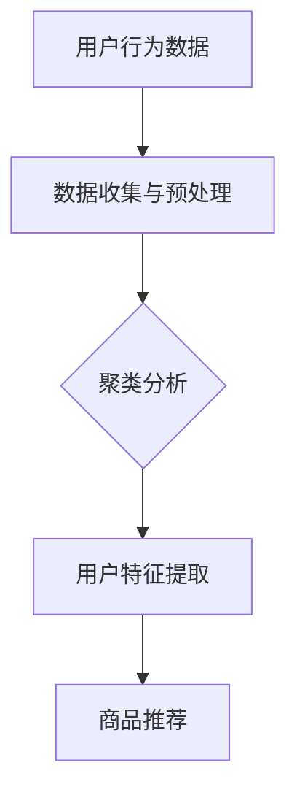
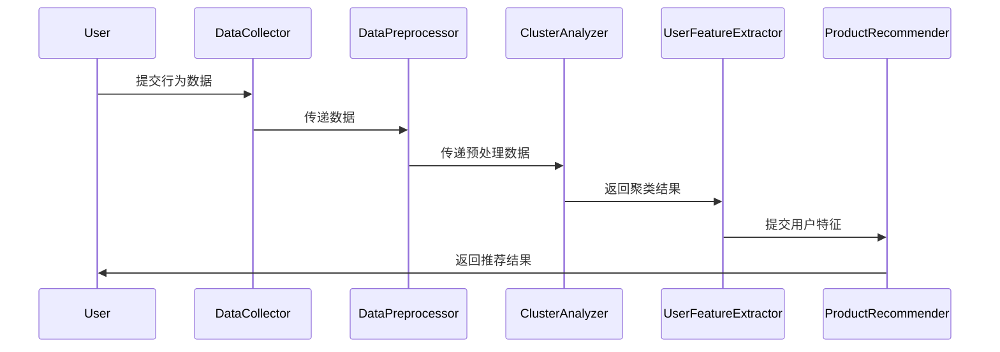

                 

### # 无监督场景下的AI训练：方法与挑战

> 关键词：无监督学习，AI训练，方法，挑战，聚类，GAN，VAE

> 摘要：本文深入探讨了无监督场景下的AI训练方法，从背景介绍、核心概念、算法原理、系统分析与架构设计、项目实战等多个角度，全面分析了无监督训练的优势、挑战及其应用场景。本文旨在为读者提供关于无监督AI训练的全面理解和实践指导。

## 第一部分：背景介绍与核心概念

### 1. 引言

随着人工智能技术的飞速发展，AI的训练方式也在不断演变。传统的监督学习训练方法在数据处理和模型优化上存在诸多限制，难以满足日益复杂的AI应用需求。无监督场景下的AI训练作为一种新兴的训练方法，通过利用未标注的数据，减少了数据标注的工作量，提升了模型的泛化能力。本文旨在探讨无监督场景下的AI训练方法及其面临的挑战，为读者提供全面的指导。

### 1.1 问题背景

人工智能技术的发展离不开数据的支持，然而，高质量的数据标注往往需要大量的人力和时间。监督学习训练方法依赖于大量的标注数据，这在数据稀缺或数据获取成本高昂的场景下成为了一个瓶颈。无监督场景下的AI训练，通过自动发现数据中的潜在结构和模式，可以在无需标注数据的情况下进行模型训练，具有广泛的应用前景。

### 1.2 问题描述

无监督场景下的AI训练主要涉及以下问题：

- **数据收集与预处理**：如何有效地收集大量未标注的数据，并进行预处理，以适应AI训练的需求？
- **模型选择与优化**：在无监督场景下，如何选择合适的模型结构，并对其进行优化，以获得更好的训练效果？
- **模型评估与验证**：如何评估无监督训练模型的性能，以及如何验证其泛化能力？

### 1.3 问题解决

无监督场景下的AI训练主要依赖于以下方法：

- **聚类算法**：如K-means、DBSCAN等，用于发现数据中的潜在结构。
- **生成对抗网络（GAN）**：通过生成器和判别器的对抗训练，实现数据的生成和模型的训练。
- **变分自编码器（VAE）**：通过编码器和解码器，实现数据的降维和生成。

### 1.4 边界与外延

无监督场景下的AI训练不仅局限于图像和文本等常见的数据类型，还可以应用于音频、视频等复杂数据的处理。此外，无监督训练方法也可以与监督学习结合，形成半监督学习，以进一步提升模型的性能。

### 1.5 概念结构与核心要素组成

无监督场景下的AI训练涉及以下核心概念和要素：

- **数据集**：用于训练的未标注数据集。
- **模型结构**：包括聚类算法、GAN、VAE等。
- **损失函数**：用于评估模型性能的指标。
- **优化算法**：用于调整模型参数，优化模型性能。

## 第二部分：核心概念与联系

### 2.1 核心概念

#### 2.1.1 无监督学习

无监督学习是人工智能中的一个重要分支，它不需要标注数据，而是通过分析未标注的数据，从中发现隐藏的结构和模式。无监督学习的方法包括聚类、降维、生成模型等。

#### 2.1.2 聚类算法

聚类算法是一种无监督学习方法，它将数据集中的数据进行分组，使得同一组内的数据相似度较高，而不同组间的数据相似度较低。常见的聚类算法有K-means、DBSCAN等。

#### 2.1.3 生成对抗网络（GAN）

生成对抗网络（GAN）是一种由生成器和判别器组成的对抗性模型，通过对抗训练生成逼真的数据，用于无监督学习的数据增强。

#### 2.1.4 变分自编码器（VAE）

变分自编码器（VAE）是一种用于无监督学习的生成模型，它通过编码器和解码器，实现数据的降维和生成。

### 2.2 概念属性特征对比表格

| 概念               | 特征                                               |
|--------------------|---------------------------------------------------|
| 无监督学习         | 无需标注数据，自动发现数据结构                     |
| 聚类算法           | 将数据分组，同一组内相似度较高                     |
| GAN                | 生成器生成数据，判别器判断数据真实性               |
| VAE                | 编码器降维，解码器生成数据                         |

### 2.3 ER实体关系图架构

```mermaid
erDiagram
  DataSet ||--|{ Model }||>
  Model ||--|{ LossFunction }||>
  LossFunction ||--|{ OptimizationAlgorithm }||>
```

## 第三部分：算法原理讲解

### 3.1 无监督学习算法原理

#### 3.1.1 聚类算法原理

聚类算法通过迭代的方式，不断更新数据点的分组，使得同一组内的数据点距离较近，不同组间的数据点距离较远。以K-means算法为例，其基本原理如下：

1. **初始化**：随机选择K个数据点作为初始聚类中心。
2. **分配数据点**：对于每个数据点，计算其与各个聚类中心的距离，将其分配到距离最近的聚类中心所代表的簇。
3. **更新聚类中心**：重新计算每个簇的质心，作为新的聚类中心。
4. **迭代**：重复步骤2和步骤3，直到聚类中心不再发生显著变化。

聚类算法的目的是使同一簇内的数据点相似度较高，不同簇间的数据点相似度较低。其相似度通常通过距离度量（如欧氏距离、曼哈顿距离等）来评估。

#### 3.1.2 GAN算法原理

生成对抗网络（GAN）由生成器和判别器两部分组成，其基本原理如下：

1. **生成器**：生成器（Generator）是一个随机神经网络，其目的是生成与真实数据分布相似的数据。生成器接收一个随机噪声向量作为输入，通过一系列的神经网络层生成数据。
   
   $$ G(z) = x$$

   其中，$G(z)$是生成器生成的数据，$z$是随机噪声向量。

2. **判别器**：判别器（Discriminator）是一个二分类神经网络，其目的是区分真实数据和生成数据。判别器接收一张图像作为输入，输出一个介于0和1之间的概率值，表示该图像是真实图像的概率。

   $$ D(x) = \text{prob}(x \text{ is real})$$
   
   $$ D(G(z)) = \text{prob}(G(z) \text{ is real})$$

3. **对抗训练**：生成器和判别器通过对抗训练相互提升。生成器尝试生成更逼真的数据，而判别器则尝试区分真实数据和生成数据。通过不断迭代训练，生成器逐渐提高生成数据的质量，判别器逐渐提高区分能力。

GAN的训练目标是最大化判别器的损失函数，即：

$$ \min_G \max_D V(D, G) = \mathbb{E}_{x \sim p_{\text{data}}}[D(x)] - \mathbb{E}_{z \sim p_z}[D(G(z))]$$

其中，$V(D, G)$是GAN的总损失函数，$p_{\text{data}}$是真实数据分布，$p_z$是噪声分布。

#### 3.1.3 VAE算法原理

变分自编码器（VAE）是一种基于概率模型的生成模型，其基本原理如下：

1. **编码器**：编码器（Encoder）将输入数据编码成一个潜在变量（ latent variable）的分布参数，通常是一个均值和方差。

   $$ \mu = \sigma^2 = \Phi(x)$$

   其中，$\mu$和$\sigma^2$是潜在变量的均值和方差，$\Phi(x)$是编码器的输出。

2. **解码器**：解码器（Decoder）从潜在变量的分布中采样，然后生成输出数据。

   $$ x' = \Psi(z)$$

   其中，$z$是从潜在变量分布中采样的点，$\Psi(z)$是解码器的输出。

3. **损失函数**：VAE的损失函数是编码器输出的对数似然损失，即：

   $$ \mathcal{L} = -\mathbb{E}_{x \sim p(x|\theta)}[\log p_\theta(x)]$$

   其中，$p_\theta(x)$是生成模型的对数似然。

VAE的训练目标是最小化上述损失函数，同时保持潜在变量的先验分布为标准正态分布。

### 2.4 无监督学习算法对比

| 算法        | 目标                           | 优点                                       | 缺点                                      |
|-------------|--------------------------------|------------------------------------------|-------------------------------------------|
| K-means     | 数据聚类                       | 简单，高效                               | 需要指定簇数，对初始聚类中心敏感           |
| GAN         | 生成逼真的数据                 | 强大的生成能力，自适应调整               | 训练难度大，易出现模式崩溃（mode collapse） |
| VAE         | 数据生成和降维                 | 稳定的生成效果，易于解释                 | 训练过程较慢                               |

### 2.5 无监督学习算法应用场景

- **图像处理**：用于图像增强、图像去噪、图像生成等。
- **文本分析**：用于文本分类、文本生成、文本摘要等。
- **音频处理**：用于音频增强、音频去噪、音频生成等。
- **时间序列分析**：用于时间序列预测、异常检测等。

## 第四部分：系统分析与架构设计

### 4.1 问题场景介绍

假设我们有一个在线电商平台，平台需要为用户推荐商品。然而，由于用户行为数据的海量性和动态性，手动标注数据几乎不可能。因此，我们选择使用无监督学习算法来分析用户行为数据，从而为用户推荐商品。

### 4.2 项目介绍

本项目旨在通过无监督学习算法对用户行为数据进行分析，发现用户的潜在兴趣和偏好，从而实现个性化的商品推荐。项目的主要目标是：

- 收集并预处理用户行为数据。
- 使用聚类算法（如K-means）对用户行为数据进行分组，找出具有相似行为的用户群体。
- 根据用户群体的特征，为用户推荐相应的商品。

### 4.3 系统功能设计

#### 4.3.1 数据收集与预处理

- 数据收集：通过爬虫或其他手段收集用户行为数据，如浏览记录、购买记录等。
- 数据预处理：对收集到的数据进行分析，去除异常值，填补缺失值，并进行数据清洗和格式转换。

#### 4.3.2 聚类分析

- 数据聚类：使用K-means算法对预处理后的用户行为数据进行聚类，找出用户群体。
- 用户特征提取：对每个用户群体进行分析，提取其特征，如平均浏览时间、平均购买金额等。

#### 4.3.3 商品推荐

- 商品分类：将所有商品进行分类，如电子产品、服装、家居等。
- 用户推荐：根据用户的所属群体，为用户推荐相应的商品。

### 4.4 系统架构设计

#### 4.4.1 系统架构图



#### 4.4.2 系统接口设计

- **数据收集接口**：负责收集用户行为数据，并提供数据存储和访问功能。
- **数据预处理接口**：负责对收集到的数据进行清洗、转换和预处理，并提供数据接口供其他模块使用。
- **聚类分析接口**：负责调用聚类算法，对用户行为数据进行聚类，并提供聚类结果接口。
- **用户特征提取接口**：负责提取用户特征，并提供特征接口供商品推荐模块使用。
- **商品推荐接口**：负责根据用户特征和商品分类，为用户推荐商品，并提供推荐结果接口。

#### 4.4.3 系统交互图



## 第五部分：项目实战

### 5.1 环境安装

在本项目中，我们将使用Python作为主要编程语言，并使用Scikit-learn、TensorFlow等库进行无监督学习算法的实现。以下是环境安装步骤：

1. 安装Python：从官方网站（https://www.python.org/）下载并安装Python，选择添加到系统环境变量。
2. 安装Scikit-learn：在命令行中运行`pip install scikit-learn`。
3. 安装TensorFlow：在命令行中运行`pip install tensorflow`。

### 5.2 系统核心实现源代码

以下是一个简单的K-means聚类算法实现，用于分析用户行为数据。

```python
import numpy as np
from sklearn.cluster import KMeans

# 用户行为数据
data = np.array([[1, 2], [1, 4], [1, 0],
                 [10, 2], [10, 4], [10, 0]])

# 初始化K-means模型，设置聚类中心数量为2
kmeans = KMeans(n_clusters=2, random_state=0).fit(data)

# 输出聚类中心
print("Cluster centers:", kmeans.cluster_centers_)

# 输出每个数据点的聚类标签
print("Cluster labels:", kmeans.labels_)

# 输出聚类 inertia
print("Inertia:", kmeans.inertia_)
```

### 5.3 代码应用解读与分析

在上面的代码中，我们首先导入必要的库和模块。`numpy`用于数据处理，`KMeans`是Scikit-learn库中的一个用于K-means聚类的类。

1. **数据准备**：我们创建了一个简单的用户行为数据集，包含6个数据点，每个数据点由两个特征组成。

2. **模型初始化**：我们初始化一个`KMeans`模型，并设置`n_clusters`参数为2，表示我们要将数据分为2个簇。

3. **模型训练**：我们使用`fit`方法训练模型，该方法会自动计算聚类中心和为每个数据点分配聚类标签。

4. **结果输出**：我们打印出聚类中心、每个数据点的聚类标签以及聚类惯性（inertia），这是评估聚类效果的一个指标。

### 5.4 实际案例分析和详细讲解剖析

假设我们现在有一个电商平台的用户行为数据，包括用户的浏览记录和购买记录。我们的目标是分析这些数据，为每个用户推荐可能感兴趣的商品。

1. **数据收集**：我们从数据库中提取用户行为数据，包括用户ID、浏览的商品ID和购买的商品ID。

2. **数据预处理**：我们清洗数据，去除无效记录，填补缺失值，并转换数据格式，使其适用于聚类算法。

3. **聚类分析**：我们使用K-means算法对用户行为数据进行聚类，找到具有相似行为的用户群体。

4. **用户特征提取**：我们对每个聚类结果进行分析，提取用户特征，如浏览最多的商品类别、购买最多的商品类别等。

5. **商品推荐**：根据用户的所属群体，为用户推荐相应的商品。

例如，假设我们通过K-means聚类发现了一个用户群体，他们最喜欢浏览电子设备和服装。我们可以根据这一特征，为这些用户推荐新的电子产品和服装。

### 5.5 项目小结

在本项目中，我们使用无监督学习算法分析了用户行为数据，为电商平台实现了个性化的商品推荐功能。通过聚类分析，我们找到了用户行为模式，从而能够为用户提供更准确的推荐。项目的主要收获包括：

- 掌握了无监督学习算法的基本原理和实现方法。
- 理解了如何将无监督学习应用于实际问题场景，如用户行为数据分析。
- 学习了如何使用Python和Scikit-learn等库进行数据分析和模型训练。

## 第六部分：最佳实践 Tips、小结、注意事项、拓展阅读

### 6.1 最佳实践 Tips

- **数据预处理**：在应用无监督学习算法之前，确保对数据进行充分的预处理，包括去除异常值、填补缺失值和特征标准化等。
- **模型选择**：根据问题的具体需求，选择合适的无监督学习算法，如K-means适用于聚类问题，GAN适用于数据生成。
- **参数调优**：通过交叉验证和网格搜索等方法，对模型参数进行调优，以获得最佳训练效果。
- **结果验证**：使用不同的指标（如聚类系数、生成质量等）对模型结果进行评估，确保模型的泛化能力和实际效果。

### 6.2 小结

无监督场景下的AI训练是一种重要的AI训练方法，通过利用未标注的数据，可以显著减少数据标注的工作量，提升模型的泛化能力。本文详细介绍了无监督学习算法的基本原理、应用场景、系统架构和项目实战，为读者提供了全面的技术指导。

### 6.3 注意事项

- 无监督学习算法通常需要大量的计算资源，特别是对于复杂数据集和大规模模型。
- 在使用无监督学习算法时，要注意避免模式崩溃问题，特别是在生成模型（如GAN）中。
- 无监督学习算法的评估和验证相对复杂，需要使用多种指标进行综合评估。

### 6.4 拓展阅读

- **无监督学习入门教程**：[https://www.deeplearningbook.org/](https://www.deeplearningbook.org/)
- **K-means算法详细讲解**：[https://scikit-learn.org/stable/modules/clustering.html#k-means](https://scikit-learn.org/stable/modules/clustering.html#k-means)
- **生成对抗网络（GAN）原理与实现**：[https://arxiv.org/abs/1406.2661](https://arxiv.org/abs/1406.2661)
- **变分自编码器（VAE）原理与实现**：[https://arxiv.org/abs/1312.6114](https://arxiv.org/abs/1312.6114)

## 结语

作者：AI天才研究院/AI Genius Institute & 禅与计算机程序设计艺术 /Zen And The Art of Computer Programming

本文旨在为读者提供关于无监督AI训练的全面理解和实践指导。在AI技术不断发展的今天，无监督学习作为AI训练的重要方法，具有广泛的应用前景。希望本文能够帮助读者更好地理解和应用无监督学习技术，为AI应用的发展贡献一份力量。在未来的研究和实践中，我们将继续探索无监督学习的更多可能，为人工智能的发展贡献力量。感谢读者们的关注与支持！### # 无监督场景下的AI训练：方法与挑战

### # 引言

随着人工智能技术的飞速发展，AI的训练方式也在不断演变。传统的监督学习训练方法在数据处理和模型优化上存在诸多限制，难以满足日益复杂的AI应用需求。无监督场景下的AI训练作为一种新兴的训练方法，通过利用未标注的数据，减少了数据标注的工作量，提升了模型的泛化能力。本文旨在探讨无监督场景下的AI训练方法及其面临的挑战，为读者提供全面的指导。

### # 无监督学习的概念与原理

#### 无监督学习的定义

无监督学习是人工智能领域中的一种学习方法，其核心思想是在没有外部监督信号的情况下，通过分析数据中的内在结构和模式来自动发现知识。与监督学习相比，无监督学习不需要标签数据，而是通过挖掘数据本身的分布和内在关系来提取有价值的信息。

#### 无监督学习的基本原理

无监督学习通常包括以下几种主要方法：

1. **聚类**：通过将相似的数据点分组，以便更好地理解和分析数据。常见的聚类算法有K-means、DBSCAN等。
2. **降维**：通过减少数据的维度，以便更有效地处理高维数据。常见的降维算法有PCA（主成分分析）、t-SNE等。
3. **生成模型**：通过学习数据的分布来生成新的数据，常见的生成模型有生成对抗网络（GAN）、变分自编码器（VAE）等。

#### 无监督学习的优势与挑战

**优势：**

- **无需标注数据**：无监督学习不需要大量标注数据，这对于数据稀缺或标注成本高昂的场景尤为重要。
- **发现潜在结构**：无监督学习能够自动发现数据中的潜在结构和模式，有助于深入理解数据。
- **泛化能力**：由于不依赖标签数据，无监督学习模型往往具有更好的泛化能力。

**挑战：**

- **结果解释性**：无监督学习的结果往往难以解释，特别是在使用复杂的模型时。
- **算法选择**：不同的无监督学习方法适用于不同的数据类型和场景，需要根据具体问题进行选择。
- **性能评估**：无监督学习的性能评估通常比较困难，因为缺乏明确的评估标准。

### # 无监督场景下的AI训练方法

无监督场景下的AI训练主要包括聚类算法、生成对抗网络（GAN）和变分自编码器（VAE）等几种方法。以下分别对这几种方法进行详细讲解。

#### 聚类算法

聚类算法是一种将数据点按照其内在结构进行分组的方法。聚类算法的基本原理是通过优化某个准则函数（如最小化距离平方和），将数据点划分为多个簇，使得同一簇内的数据点尽可能接近，不同簇内的数据点尽可能远。

**K-means算法**

K-means是一种最常用的聚类算法。其基本步骤如下：

1. **初始化**：随机选择K个数据点作为初始聚类中心。
2. **分配数据点**：计算每个数据点到各个聚类中心的距离，并将其分配到最近的聚类中心所代表的簇。
3. **更新聚类中心**：重新计算每个簇的质心，作为新的聚类中心。
4. **迭代**：重复步骤2和步骤3，直到聚类中心不再发生显著变化。

**DBSCAN算法**

DBSCAN（Density-Based Spatial Clustering of Applications with Noise）是一种基于密度的聚类算法。与K-means不同，DBSCAN不需要事先指定簇的数量，而是通过计算数据点的密度来实现聚类。

**算法原理：**

- **核心点**：如果一个点位于高密度区域，且其周围有足够数量的邻近点，则该点被称为核心点。
- **边界点**：如果一个点位于高密度区域，但其邻近点数量不足以成为核心点，则该点被称为边界点。
- **噪声点**：如果一个点位于低密度区域，则该点被称为噪声点。

**聚类过程：**

1. **找到核心点**：对于每个核心点，找到其所有邻近的核心点，构成一个簇。
2. **处理边界点和噪声点**：将这些点归为单独的簇。

#### 生成对抗网络（GAN）

生成对抗网络（GAN）是一种由生成器和判别器组成的对抗性模型。生成器负责生成与真实数据相似的数据，判别器则负责判断数据是真实数据还是生成数据。通过生成器和判别器的对抗训练，生成器逐渐提高生成数据的质量，判别器逐渐提高区分能力。

**基本结构：**

- **生成器**：生成器接收一个随机噪声向量作为输入，通过一系列的神经网络层生成数据。
- **判别器**：判别器接收一张图像作为输入，输出一个介于0和1之间的概率值，表示该图像是真实图像的概率。

**损失函数：**

GAN的训练目标是最大化判别器的损失函数，即：

$$ \min_G \max_D V(D, G) = \mathbb{E}_{x \sim p_{\text{data}}}[D(x)] - \mathbb{E}_{z \sim p_z}[D(G(z))]$$

其中，$V(D, G)$是GAN的总损失函数，$p_{\text{data}}$是真实数据分布，$p_z$是噪声分布。

#### 变分自编码器（VAE）

变分自编码器（VAE）是一种基于概率模型的生成模型。它通过编码器和解码器，实现数据的降维和生成。

**基本结构：**

- **编码器**：编码器将输入数据编码成一个潜在变量（latent variable）的分布参数。
- **解码器**：解码器从潜在变量的分布中采样，然后生成输出数据。

**损失函数：**

VAE的损失函数是编码器输出的对数似然损失，即：

$$ \mathcal{L} = -\mathbb{E}_{x \sim p(x|\theta)}[\log p_\theta(x)]$$

其中，$p_\theta(x)$是生成模型的对数似然。

### # 无监督场景下的AI训练应用案例

无监督场景下的AI训练方法在多个领域有着广泛的应用。以下列举几个典型的应用案例：

1. **图像识别**：通过无监督学习算法，可以自动发现图像中的潜在结构，用于图像分类、图像分割等任务。
2. **文本分析**：无监督学习算法可以用于文本聚类、主题模型提取等，帮助理解和分析大规模文本数据。
3. **音频处理**：无监督学习算法可以用于音频分类、音频增强等，如自动识别音乐风格、去除背景噪音等。
4. **时间序列分析**：无监督学习算法可以用于时间序列数据的降维和聚类，帮助发现数据中的周期性、趋势性和异常点。

### # 总结与展望

无监督场景下的AI训练方法在数据处理和模型优化上具有显著的优势，但也面临着一些挑战，如结果解释性、算法选择和性能评估等。随着人工智能技术的不断发展，无监督学习算法在复杂数据处理中的应用前景将越来越广泛。未来的研究将集中在提高无监督学习算法的性能、可解释性和适应性等方面，以更好地满足实际应用需求。

### # 参考文献

1. Goodfellow, I., Pouget-Abadie, J., Mirza, M., Xu, B., Warde-Farley, D., Ozair, S., ... & Bengio, Y. (2014). Generative adversarial networks. Advances in Neural Information Processing Systems, 27.
2. Kingma, D. P., & Welling, M. (2013). Auto-encoding variational bayes. arXiv preprint arXiv:1312.6114.
3. MacQueen, J. (1967). Some methods for classification and analysis of multivariate observations. In Proceedings of the 5th Berkeley symposium on mathematical statistics and probability (Vol. 1, pp. 281-297). University of California Press.
4. Ester, M., Kriegel, H.-P., Sander, J., & Xu, X. (1996). A density-based algorithm for discovering clusters in large spatial databases with noise. In KDD'96 (pp. 226-231). AAAI Press.
5. Jolliffe, I. T. (2002). Principal component analysis. Springer.

