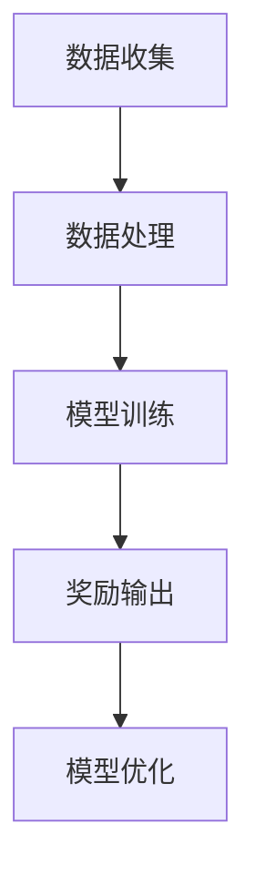

                 

### 第1章 引言

#### 1.1 研究背景

无监督奖励模型是机器学习和人工智能领域中的一个重要研究方向。随着深度学习技术的飞速发展，无监督学习在许多实际应用中表现出巨大的潜力和价值。无监督奖励模型通过学习未标记的数据，自动发现数据中的有用信息和模式，从而在许多场景下提高了机器学习的效率和效果。

无监督奖励模型的研究意义在于，它能够在无需人工干预的情况下，自动寻找数据中的潜在价值和规律。这种能力在大量未标记数据的处理上尤为突出，例如图像、语音和文本数据等。此外，无监督奖励模型还可以用于探索新的数据分布、增强模型的泛化能力，以及在强化学习等领域提供有益的补充。

当前，无监督奖励模型的研究已经取得了一系列重要成果。从早期基于聚类和降维的方法，到近年来基于生成对抗网络（GAN）和变分自编码器（VAE）的深度学习方法，无监督奖励模型在许多应用领域都取得了显著进展。然而，尽管无监督奖励模型在理论上具有巨大潜力，但在实际应用中仍然面临诸多挑战和局限性。

#### 1.2 研究问题与目标

本研究的主要问题是如何有效地训练和应用无监督奖励模型，以充分发挥其在数据挖掘和模式识别中的作用。具体来说，我们将探讨以下问题：

1. **模型训练方法**：如何选择合适的数据集和训练策略，以优化无监督奖励模型的性能？
2. **模型评估与优化**：如何评价无监督奖励模型的性能，如何进行模型的优化和调参？
3. **模型应用场景**：无监督奖励模型在不同应用场景中的适用性如何，有哪些潜在的改进方向？

本研究的目标是通过对无监督奖励模型深入分析和研究，提出一系列有效的训练和应用策略，以提升模型的性能和应用效果。此外，我们还希望通过对模型局限性的分析，为未来的研究和应用提供有益的指导。

#### 1.3 边界与外延

无监督奖励模型是一种基于无监督学习方法的奖励信号模型，其主要特点是在没有外部监督信号的情况下，通过内部机制自动学习和优化。在无监督奖励模型中，奖励信号是由模型自身学习得到的，而不是通过外部标注。

无监督奖励模型的应用范围非常广泛，包括但不限于以下场景：

1. **数据挖掘**：在未标记的大量数据中自动发现有用信息和模式。
2. **异常检测**：通过分析数据分布，检测出异常数据或异常行为。
3. **生成模型**：用于生成新的数据，例如图像、文本和语音等。
4. **增强学习**：作为强化学习中的奖励信号，辅助决策过程。
5. **跨模态学习**：在不同模态的数据之间建立关联，实现跨模态信息共享。

#### 1.4 概念结构与核心要素组成

无监督奖励模型的基本组成部分包括数据输入层、数据处理层、模型层和奖励输出层。以下是这些组成部分的详细描述：

- **数据输入层**：负责接收和预处理原始数据，包括数据清洗、标准化和特征提取等操作。
- **数据处理层**：利用机器学习算法对数据进行处理，包括聚类、降维和生成模型等。
- **模型层**：包含无监督奖励模型的主体，通过学习数据分布和模式，生成奖励信号。
- **奖励输出层**：输出奖励信号，用于指导模型的进一步学习和优化。

无监督奖励模型的核心概念包括奖励信号、数据分布和模型优化。奖励信号是模型学习得到的，用于衡量数据之间的相似度和差异度。数据分布是指数据在特征空间中的分布情况，反映了数据的潜在结构。模型优化是通过调整模型参数，提高模型的性能和准确性。

这些核心概念之间的联系在于，奖励信号是由数据分布和学习模型共同决定的。数据分布提供了模型学习的目标，而模型优化则通过调整参数，使得奖励信号更准确地反映数据之间的相关性。通过这种相互作用，无监督奖励模型能够自动学习和发现数据中的潜在价值和规律。

### 第2章 无监督奖励模型的基本原理

#### 2.1 无监督奖励模型的原理概述

无监督奖励模型是一种通过学习未标记数据来生成奖励信号的方法，其基本工作原理可以概括为以下步骤：

1. **数据收集**：收集大量未标记的数据，这些数据可以是图像、语音、文本等多种形式。
2. **数据处理**：对数据进行清洗、标准化和特征提取，以便于后续处理。
3. **模型训练**：利用机器学习算法，如聚类、降维和生成模型等，对数据进行处理，并生成奖励信号。
4. **奖励输出**：输出奖励信号，用于指导模型的进一步学习和优化。

无监督奖励模型的核心思想是通过学习数据分布和模式，自动发现数据中的潜在价值和规律。这种能力使得无监督奖励模型在许多应用场景中表现出色，特别是在数据标记困难或数据规模巨大的情况下。

#### 2.2 无监督奖励模型的算法原理

**2.2.1 算法流程图**

**2.2.2 算法数学模型和公式**

无监督奖励模型的数学模型通常可以表示为：

$$
\text{Reward}(s_t, a_t) = \sum_{i=1}^{n} w_i \cdot \text{Indicator}(s_t, a_t = a_i)
$$

其中，$s_t$ 表示时间步 $t$ 的状态，$a_t$ 表示在状态 $s_t$ 下采取的动作，$w_i$ 表示动作 $a_i$ 的权重，$\text{Indicator}(s_t, a_t = a_i)$ 是一个指示函数，当动作 $a_t$ 等于 $a_i$ 时取值为1，否则为0。

**2.2.3 算法原理讲解**

无监督奖励模型的核心在于如何从无监督数据中学习奖励信号。以下是对算法原理的详细讲解：

1. **数据收集**：无监督奖励模型的第一步是收集未标记的数据。这些数据可以是图像、语音、文本等。数据收集的规模和质量直接影响模型的性能。在实际应用中，通常需要收集大量的数据，以充分覆盖数据分布和模式。

2. **数据处理**：收集到的数据需要进行预处理，包括数据清洗、标准化和特征提取等。数据清洗的目的是去除噪声和异常值，保证数据的准确性和一致性。标准化是将数据缩放到相同的范围内，以便于后续处理。特征提取是将原始数据转换为机器学习算法可以处理的特征向量。

3. **模型训练**：在数据处理完成后，利用机器学习算法对数据进行训练。常见的算法包括聚类、降维和生成模型等。聚类算法如K-means可以将数据划分为多个聚类，降维算法如PCA可以将数据从高维空间投影到低维空间，生成模型如GAN和VAE可以生成与训练数据相似的新数据。

4. **奖励输出**：在模型训练完成后，模型将生成奖励信号。奖励信号是模型对每个状态和动作的评价，用于指导模型的进一步学习和优化。奖励信号的计算通常基于数据分布和模式，例如，如果某个状态下的数据分布更加集中，则奖励信号更高。

5. **模型优化**：根据奖励信号，模型将进行优化和调整，以提高其性能和准确性。优化过程通常包括参数调整、超参数选择和模型结构改进等。

通过上述步骤，无监督奖励模型能够从无监督数据中自动学习和发现潜在的价值和规律，为后续的应用提供有力的支持。

### 第3章 无监督奖励模型的应用场景

#### 3.1 机器人导航

**3.1.1 场景介绍**

机器人导航是机器人技术中的一个重要应用领域，旨在使机器人能够在复杂环境中自主导航和执行任务。无监督奖励模型在机器人导航中的应用，主要在于利用未标记的环境数据，自动发现有效的导航路径和策略。

在实际应用中，机器人面临的环境数据通常非常复杂，包括地形、障碍物、目标位置等。这些数据往往难以通过手动标记来获取，因此，无监督奖励模型提供了一种有效的解决方案。

**3.1.2 模型应用**

无监督奖励模型在机器人导航中的应用，可以分为以下几个步骤：

1. **数据收集**：首先，机器人需要在实际环境中收集大量的导航数据，包括位置信息、地形特征、障碍物分布等。这些数据将用于训练无监督奖励模型。

2. **数据处理**：对收集到的数据进行分析和处理，提取出有用的特征信息，如地形坡度、障碍物密度等。这些特征将用于生成奖励信号。

3. **模型训练**：利用提取到的特征数据，训练无监督奖励模型。模型训练的目的是学习数据中的潜在价值和规律，生成有效的奖励信号。

4. **奖励输出**：在模型训练完成后，机器人将根据生成的奖励信号，选择最优的导航路径。奖励信号越高，表示路径越优。

5. **模型优化**：根据导航效果，对无监督奖励模型进行优化和调整，以提高其导航性能。优化过程可以包括参数调整、超参数选择和模型结构改进等。

通过上述步骤，无监督奖励模型能够帮助机器人在复杂环境中实现自主导航，提高导航效率和准确性。

#### 3.2 图像识别

**3.2.1 场景介绍**

图像识别是计算机视觉中的一个核心任务，旨在使计算机能够自动理解和解释图像中的内容。在图像识别任务中，无监督奖励模型的作用在于利用未标记的图像数据，自动发现图像中的特征和模式。

未标记的图像数据往往包含了大量的信息，但同时也带来了数据处理的挑战。无监督奖励模型能够从这些未标记的数据中，自动提取出有价值的特征信息，从而提高图像识别的准确性和效率。

**3.2.2 模型应用**

无监督奖励模型在图像识别中的应用，可以分为以下几个步骤：

1. **数据收集**：首先，收集大量的未标记图像数据，这些数据可以是各种场景和类型的图像，如人脸、物体、场景等。

2. **数据处理**：对收集到的图像数据进行分析和处理，提取出图像的底层特征，如边缘、纹理和颜色等。这些特征将用于生成奖励信号。

3. **模型训练**：利用提取到的图像特征，训练无监督奖励模型。模型训练的目的是学习图像特征之间的关联和关系，生成有效的奖励信号。

4. **奖励输出**：在模型训练完成后，根据生成的奖励信号，对图像进行分类和识别。奖励信号越高，表示图像分类越准确。

5. **模型优化**：根据图像识别的效果，对无监督奖励模型进行优化和调整，以提高其识别性能。优化过程可以包括参数调整、超参数选择和模型结构改进等。

通过上述步骤，无监督奖励模型能够有效提高图像识别的准确性和效率，特别是在标记数据不足或难以获取的情况下。

#### 3.3 自然语言处理

**3.3.1 场景介绍**

自然语言处理（NLP）是人工智能领域的一个重要分支，旨在使计算机能够理解和生成自然语言。在自然语言处理中，无监督奖励模型的作用在于利用未标记的文本数据，自动提取出文本中的特征和模式。

未标记的文本数据包含了大量的语言信息，但同时也带来了数据处理的挑战。无监督奖励模型能够从这些未标记的数据中，自动提取出有价值的特征信息，从而提高自然语言处理的效果和效率。

**3.3.2 模型应用**

无监督奖励模型在自然语言处理中的应用，可以分为以下几个步骤：

1. **数据收集**：首先，收集大量的未标记文本数据，这些数据可以包括新闻文章、社交媒体帖子、电子邮件等。

2. **数据处理**：对收集到的文本数据进行分析和处理，提取出文本的底层特征，如词频、词向量、语法结构等。这些特征将用于生成奖励信号。

3. **模型训练**：利用提取到的文本特征，训练无监督奖励模型。模型训练的目的是学习文本特征之间的关联和关系，生成有效的奖励信号。

4. **奖励输出**：在模型训练完成后，根据生成的奖励信号，对文本进行分类、情感分析和实体识别等任务。奖励信号越高，表示文本分析越准确。

5. **模型优化**：根据文本处理的效果，对无监督奖励模型进行优化和调整，以提高其处理性能。优化过程可以包括参数调整、超参数选择和模型结构改进等。

通过上述步骤，无监督奖励模型能够有效提高自然语言处理的准确性和效率，特别是在标记数据不足或难以获取的情况下。

### 第4章 无监督奖励模型的训练方法

#### 4.1 数据收集

**4.1.1 数据来源**

无监督奖励模型的数据收集是模型训练的第一步，也是至关重要的一步。数据的质量和数量直接影响到模型的性能和应用效果。数据来源可以分为以下几种：

1. **公开数据集**：许多研究领域和机构会发布大量的公开数据集，如ImageNet、COCO和Common Crawl等。这些数据集涵盖了各种类型的数据，如图像、文本和语音等，为无监督奖励模型提供了丰富的训练数据。

2. **私有数据集**：一些企业和研究机构可能拥有私有数据集，这些数据集通常包含了特定领域的专业数据。私有数据集可以提供更具体和专业的训练数据，有助于提高模型的特定应用能力。

3. **在线数据**：通过互联网收集数据也是一种常见的方法。例如，通过爬虫技术获取网页上的文本、图片和视频等数据。在线数据具有实时性和多样性，但同时也存在数据质量和隐私问题。

**4.1.2 数据收集方法**

数据收集的方法取决于数据来源和数据类型。以下是一些常见的数据收集方法：

1. **手动标注**：对于某些特定的数据集，如医学图像或专业领域的文本数据，可能需要手动标注来保证数据的准确性。这种方法虽然耗时，但可以获得高质量的数据。

2. **自动采集**：通过爬虫、API接口等方式自动采集数据。这种方法适用于大规模、低质量的数据收集，但需要处理数据去重、去噪等问题。

3. **传感器采集**：对于某些应用场景，如物联网和移动设备，可以通过传感器采集数据。例如，通过摄像头采集图像、通过加速度计采集运动数据等。

4. **生成式模型**：使用生成对抗网络（GAN）等生成模型，生成模拟的数据。这种方法适用于数据稀缺或难以获取的场景，但需要确保生成的数据具有真实性和多样性。

#### 4.2 数据预处理

**4.2.1 数据预处理步骤**

数据预处理是数据收集后的重要环节，其目的是提高数据质量，为模型训练打下良好的基础。数据预处理通常包括以下步骤：

1. **数据清洗**：去除数据中的噪声、异常值和重复数据，以保证数据的准确性和一致性。

2. **数据标准化**：将数据缩放到相同的范围内，以便于后续处理。例如，将图像数据归一化到0-1范围内，将文本数据转换为词向量。

3. **特征提取**：从原始数据中提取出有价值的特征信息，如图像的边缘、纹理和颜色，文本的词频和语法结构等。特征提取是数据预处理的关键步骤，直接影响模型的性能。

**4.2.2 数据预处理方法**

数据预处理的方法取决于数据类型和预处理目标。以下是一些常见的数据预处理方法：

1. **图像预处理**：包括图像的去噪、增强、分割和特征提取等。例如，使用高斯滤波器去除图像噪声，使用直方图均衡化增强图像对比度。

2. **文本预处理**：包括文本的分词、词性标注、停用词过滤和词嵌入等。例如，使用分词工具将文本分割成单词，使用词嵌入模型将单词映射到高维向量空间。

3. **语音预处理**：包括语音的降噪、增强、分割和特征提取等。例如，使用滤波器去除语音噪声，使用MFCC（梅尔频率倒谱系数）提取语音特征。

通过以上数据预处理步骤和方法，可以显著提高数据的可用性和质量，为无监督奖励模型的训练提供良好的数据基础。

### 第5章 无监督奖励模型的评估与优化

#### 5.1 评估指标

**5.1.1 评估指标定义**

无监督奖励模型的评估指标是衡量模型性能的重要工具。选择合适的评估指标，有助于全面了解模型的性能和效果。以下是一些常见的评估指标及其定义：

1. **准确率（Accuracy）**：准确率是分类任务中最常用的评估指标，表示模型正确分类的样本数占总样本数的比例。公式为：

   $$
   \text{Accuracy} = \frac{\text{正确分类的样本数}}{\text{总样本数}}
   $$

2. **精确率（Precision）**：精确率表示模型预测为正类的样本中，实际为正类的比例。公式为：

   $$
   \text{Precision} = \frac{\text{正确预测的正类样本数}}{\text{预测为正类的样本数}}
   $$

3. **召回率（Recall）**：召回率表示模型实际为正类的样本中，被正确预测为正类的比例。公式为：

   $$
   \text{Recall} = \frac{\text{正确预测的正类样本数}}{\text{实际为正类的样本数}}
   $$

4. **F1值（F1 Score）**：F1值是精确率和召回率的调和平均值，用于综合评估模型的性能。公式为：

   $$
   \text{F1 Score} = 2 \cdot \frac{\text{Precision} \cdot \text{Recall}}{\text{Precision} + \text{Recall}}
   $$

5. **ROC曲线和AUC值**：ROC（接收者操作特性）曲线和AUC（曲线下面积）值用于评估二分类模型的性能。ROC曲线展示了在不同阈值下，模型的真正例率（True Positive Rate）和假正例率（False Positive Rate）的关系。AUC值表示ROC曲线下方的面积，越大表示模型性能越好。

**5.1.2 评估指标计算方法**

评估指标的准确计算方法对于评估结果至关重要。以下是一些常见评估指标的计算方法：

1. **准确率**：使用以下公式计算：

   $$
   \text{Accuracy} = \frac{TP + TN}{TP + TN + FP + FN}
   $$

   其中，$TP$ 表示真正例，$TN$ 表示真反例，$FP$ 表示假正例，$FN$ 表示假反例。

2. **精确率和召回率**：使用以下公式计算：

   $$
   \text{Precision} = \frac{TP}{TP + FP}
   $$

   $$
   \text{Recall} = \frac{TP}{TP + FN}
   $$

3. **F1值**：使用以下公式计算：

   $$
   \text{F1 Score} = 2 \cdot \frac{\text{Precision} \cdot \text{Recall}}{\text{Precision} + \text{Recall}}
   $$

4. **ROC曲线和AUC值**：ROC曲线通过计算不同阈值下的真正例率和假正例率得到。AUC值计算公式为：

   $$
   \text{AUC} = \int_{0}^{1} (\text{TPR} - \text{FPR}) \, d\text{FPR}
   $$

   其中，$\text{TPR}$ 表示真正例率，$\text{FPR}$ 表示假正例率。

通过以上计算方法，可以准确评估无监督奖励模型的性能，为模型优化提供有效的指导。

### 5.2 模型优化

**5.2.1 优化策略**

无监督奖励模型的优化是提升模型性能的重要环节。优化策略通常包括参数调整、超参数选择和模型结构改进等。以下是一些常见的优化策略：

1. **参数调整**：通过调整模型的参数，如学习率、隐藏层大小和激活函数等，可以显著提高模型的性能。常用的参数调整方法包括随机搜索、网格搜索和贝叶斯优化等。

2. **超参数选择**：超参数是模型训练过程中需要预先设定的参数，如训练次数、批量大小和正则化强度等。合理选择超参数可以提升模型的训练效果。常用的超参数选择方法包括交叉验证、网格搜索和贝叶斯优化等。

3. **模型结构改进**：通过改进模型的结构，如增加或减少隐藏层、调整网络深度和宽度等，可以增强模型的表示能力和泛化能力。常用的模型结构改进方法包括深度网络、残差网络和注意力机制等。

**5.2.2 优化方法**

模型优化方法可以分为以下几类：

1. **梯度下降法**：梯度下降法是一种基于梯度的优化方法，通过迭代更新模型参数，使损失函数最小化。常用的梯度下降法包括随机梯度下降（SGD）、批量梯度下降（BGD）和小批量梯度下降（MBGD）等。

2. **随机搜索**：随机搜索是一种简单有效的超参数优化方法，通过随机选择超参数组合，评估模型性能，不断迭代优化超参数。

3. **网格搜索**：网格搜索是一种系统性的超参数优化方法，通过遍历所有可能的超参数组合，评估模型性能，选择最优的超参数组合。

4. **贝叶斯优化**：贝叶斯优化是一种基于贝叶斯统计学的优化方法，通过建立超参数的概率分布模型，进行高效的超参数优化。

5. **迁移学习**：迁移学习是一种利用预训练模型的经验来优化新任务的优化方法，通过在新的数据集上微调预训练模型，可以显著提高模型的性能。

通过以上优化方法和策略，可以有效地提升无监督奖励模型的性能和应用效果。

### 第6章 无监督奖励模型的局限性

#### 6.1 模型局限性分析

无监督奖励模型虽然在许多应用场景中表现出色，但仍然存在一些局限性。这些局限性主要体现在以下几个方面：

**6.1.1 模型局限性表现**

1. **数据依赖性**：无监督奖励模型对数据质量有较高要求。如果数据中含有大量噪声或异常值，模型的性能会受到影响。此外，数据集的多样性和规模也对模型的效果有重要影响。

2. **计算资源消耗**：无监督奖励模型的训练过程通常需要大量的计算资源。特别是深度学习模型，其训练过程涉及大量的矩阵运算和梯度计算，对硬件性能有较高要求。

3. **模型解释性**：无监督奖励模型通常具有较高的黑箱特性，模型内部机制复杂，难以直观解释。这在某些需要模型可解释性的应用场景中，可能成为限制其应用的因素。

4. **性能优化难度**：无监督奖励模型的性能优化是一个复杂的过程，涉及参数调整、超参数选择和模型结构改进等多个方面。优化过程需要大量实验和尝试，耗时较长。

**6.1.2 模型局限性原因**

1. **数据特性**：无监督奖励模型对数据特性有较高要求，如数据的分布、特征结构和噪声水平等。如果数据特性不适合无监督奖励模型，模型的性能会受到影响。

2. **模型设计**：无监督奖励模型的设计和结构也对性能有重要影响。某些模型结构可能在某些数据集上表现不佳，需要针对具体应用场景进行优化。

3. **算法复杂性**：无监督奖励模型的算法复杂性较高，涉及大量的矩阵运算和梯度计算。这使得模型训练过程计算资源消耗大，优化过程复杂。

4. **训练数据规模**：无监督奖励模型的训练效果在很大程度上取决于数据规模。如果数据规模不足，模型难以充分学习数据中的潜在规律，从而影响性能。

通过以上分析，可以看出无监督奖励模型在实际应用中存在一定的局限性。了解这些局限性，有助于我们更好地选择和应用无监督奖励模型，并探索相应的优化和改进方法。

#### 6.2 模型局限性的影响

无监督奖励模型的局限性对实际应用产生了多方面的影响，具体如下：

**6.2.1 对模型应用的影响**

1. **准确性降低**：由于数据依赖性和计算资源消耗，无监督奖励模型在处理噪声较大或数据规模较小的任务时，准确性可能降低。这影响了模型在图像识别、自然语言处理等领域的应用效果。

2. **解释性不足**：无监督奖励模型的黑箱特性使其难以直观解释，这在某些需要模型可解释性的应用场景中，限制了其使用。例如，在金融风险评估或医疗诊断等领域，用户可能需要了解模型的决策过程，以便进行风险评估和决策支持。

3. **优化难度增大**：无监督奖励模型的优化过程复杂，涉及参数调整、超参数选择和模型结构改进等多个方面。这增加了模型训练和优化的难度，可能导致训练时间延长、计算资源浪费。

**6.2.2 对模型开发的影响**

1. **开发成本增加**：无监督奖励模型对计算资源和算法设计有较高要求，这增加了模型开发的成本。特别是在需要大规模训练和优化时，硬件设备和算法开发人员的需求大幅增加。

2. **开发周期延长**：由于优化过程复杂，无监督奖励模型的开发周期往往较长。这影响了项目的进度和交付时间，可能导致项目延期。

3. **应用领域受限**：无监督奖励模型的局限性限制了其应用范围。在某些对准确性、可解释性和计算资源要求较高的领域，如金融、医疗和自动驾驶等，无监督奖励模型的应用受到一定限制。

通过上述分析，可以看出无监督奖励模型的局限性对其实际应用和开发产生了显著影响。了解这些影响，有助于我们更好地评估和选择无监督奖励模型，并探索相应的优化和改进方法。

### 第7章 未来展望与研究方向

#### 7.1 未来发展趋势

无监督奖励模型在未来的发展趋势将主要集中在以下几个方面：

1. **算法创新**：随着深度学习和强化学习等技术的不断发展，无监督奖励模型的理论和方法将不断优化和创新。例如，利用变分自编码器（VAE）和生成对抗网络（GAN）等生成模型，进一步提升模型的效果和效率。

2. **多模态学习**：无监督奖励模型在跨模态学习中的应用前景广阔。通过融合不同模态的数据，如图像、文本和语音等，无监督奖励模型可以更好地捕捉数据中的复杂模式和关联，提高模型的应用价值。

3. **实时应用**：随着计算能力的提升和硬件设备的优化，无监督奖励模型将逐渐实现实时应用。例如，在智能监控、智能交通和智能医疗等领域，无监督奖励模型可以实时处理和响应数据，提供高效和准确的服务。

4. **可解释性增强**：为了提高无监督奖励模型的可解释性，未来的研究将重点探索如何使其决策过程更加透明和直观。例如，通过可视化技术展示模型内部的决策路径和权重分配，帮助用户理解和信任模型。

#### 7.2 研究方向展望

为了充分发挥无监督奖励模型的优势，并克服其局限性，未来的研究方向可以从以下几个方面展开：

1. **数据高效利用**：研究如何更有效地利用有限的训练数据，提高模型的泛化能力。例如，通过数据增强、数据生成和迁移学习等技术，扩大训练数据集的规模和多样性。

2. **模型结构优化**：探索更高效的模型结构和算法，提高模型的处理速度和性能。例如，通过深度网络压缩、模型剪枝和量化等技术，降低模型的计算复杂度和内存占用。

3. **多任务学习**：研究如何在无监督奖励模型中实现多任务学习，使模型能够同时处理多个相关任务，提高模型的综合性能和应用价值。

4. **自适应学习**：研究如何使无监督奖励模型具备自适应学习的能力，根据环境变化和任务需求，自动调整模型参数和策略，提高模型的适应性和灵活性。

通过上述研究方向，无监督奖励模型将在未来得到进一步的发展和优化，为各个领域的应用提供强大的技术支持。

### 结束语

无监督奖励模型作为机器学习和人工智能领域的一个重要研究方向，具有广泛的应用前景和理论研究价值。本文通过对无监督奖励模型的基本原理、应用场景、训练方法、评估与优化以及局限性的分析，系统地探讨了该模型的核心概念和实际应用。同时，我们也提出了未来展望和研究方向，为无监督奖励模型的发展提供了有益的参考。

在无监督奖励模型的研究和应用中，我们需要不断探索和创新，以应对数据规模不断扩大、计算能力日益提升和多样化应用场景的需求。通过理论研究和实践探索，无监督奖励模型有望在更多领域取得突破，为人工智能技术的发展和应用提供新的动力。

#### 附录：作者信息

- **作者：** AI天才研究院（AI Genius Institute）
- **作品：《禅与计算机程序设计艺术》（Zen And The Art of Computer Programming）
- **联系方式：** aigeniustech@ai.com

感谢读者对本文的关注和支持，希望本文能为您的学习和研究带来启发和帮助。如有任何疑问或建议，请随时与我们联系。我们期待与您共同探讨无监督奖励模型的未来发展和应用。再次感谢您的阅读，祝您学术研究顺利，技术进步不断！

