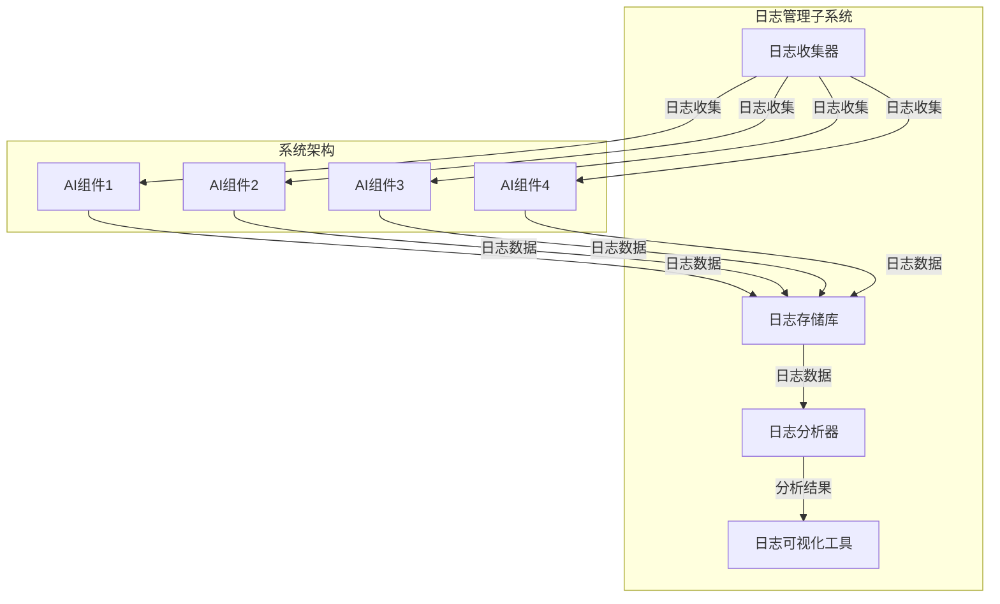
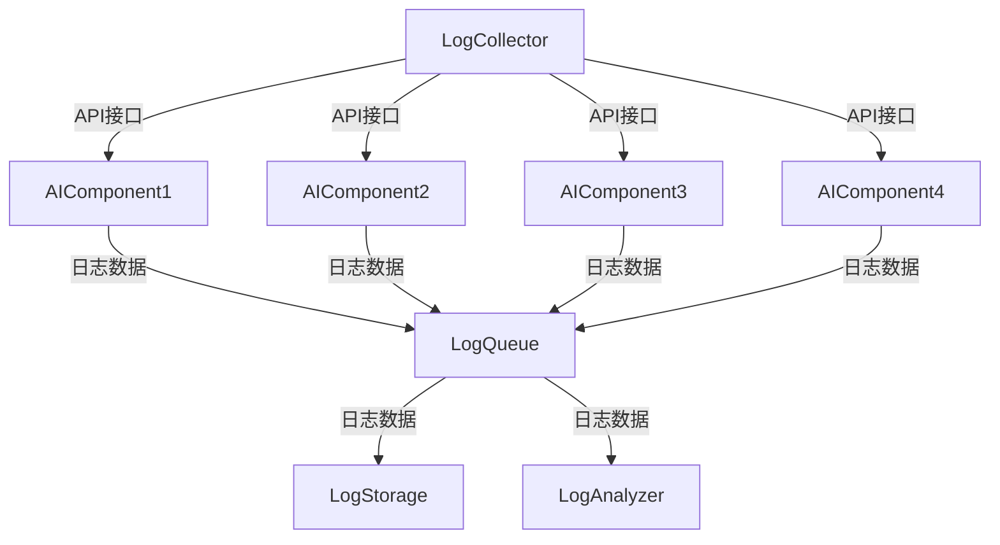
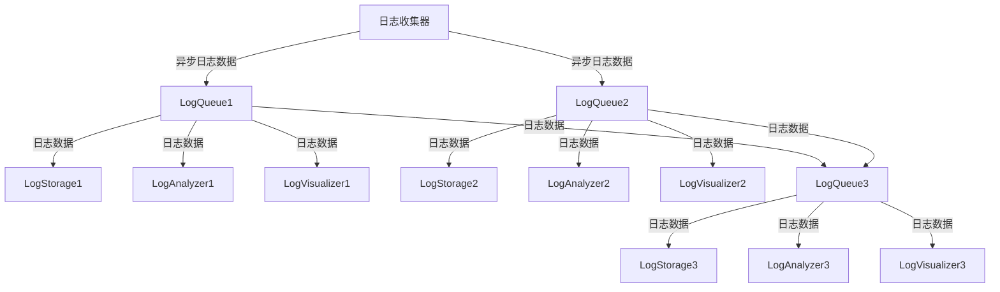

                 

### 引言

#### 1.1 问题背景

在当今的数字化时代，人工智能（AI）正迅速成为推动各行各业创新和发展的核心力量。从自动驾驶汽车到智能助手，从精准医疗到金融分析，AI的应用场景日益丰富。然而，随着AI系统复杂度的不断提升，确保这些系统的高效运行和可靠性能变得愈发重要。日志管理在这一过程中扮演着至关重要的角色。

日志管理是IT系统中记录系统运行状态、错误信息和用户活动的重要机制。它不仅可以帮助开发人员和运维人员快速定位和解决问题，还能为系统优化和性能监控提供宝贵的数据支持。在AI应用中，日志管理尤为重要，因为AI系统通常涉及大量数据处理和复杂算法，任何细微的异常都可能导致严重的后果。

#### 1.1.1 日志管理的重要性

首先，日志管理能够提供对系统运行状态的全面洞察。无论是AI模型的训练过程还是实际应用中的推理任务，日志记录了系统的输入、输出以及中间处理步骤。这些日志数据为调试和优化提供了宝贵的信息来源。

其次，日志管理有助于快速故障诊断。当系统发生异常时，日志记录可以帮助开发人员迅速定位问题发生的位置和原因，从而快速恢复系统正常运行。

#### 1.1.2 AI应用中的日志管理挑战

然而，在AI应用中，日志管理面临着一系列独特的挑战。首先，AI系统的数据处理量和数据种类繁多，导致日志数据的规模庞大且结构复杂。其次，AI系统的运行通常涉及多个组件和层次，日志记录的分散性增加了管理和分析的难度。此外，随着AI系统的实时性和高并发性的要求不断提升，日志管理需要高效的数据处理和分析能力。

#### 1.1.3 日志管理对AI应用的意义

尽管挑战重重，日志管理在AI应用中的重要性不可忽视。它不仅能够提升系统的可靠性和稳定性，还能为系统的持续优化和升级提供数据支持。通过有效的日志管理，开发人员可以更深入地理解系统的运行状况，从而提高AI应用的性能和用户体验。

总的来说，日志管理是确保AI应用高效、可靠运行的关键工具。在接下来的章节中，我们将深入探讨日志管理的基本概念、流程和工具，帮助读者全面了解并掌握这一重要领域。

### 核心概念

在深入探讨日志管理之前，了解一些核心概念是至关重要的。这些概念将为后续内容提供理论基础和背景知识。

#### 1.2.1 日志文件

日志文件是日志管理中的基本单位，它们记录了系统运行过程中的各种事件和信息。日志文件通常包含时间戳、事件类型、相关参数和详细描述等内容。日志文件的形式可以是文本文件、二进制文件或特定格式的日志文件，如syslog、JSON、XML等。

#### 1.2.2 日志分析

日志分析是日志管理的关键步骤，通过分析日志文件，可以提取有价值的信息和模式，帮助识别潜在问题和性能瓶颈。日志分析可以采用自动化工具和手动分析两种方式，前者如ELK（Elasticsearch、Logstash、Kibana）堆栈，后者则依赖于专业的日志分析技能。

#### 1.2.3 日志管理工具

日志管理工具是用于收集、存储、处理和分析日志数据的一系列软件工具。这些工具帮助简化日志管理流程，提高日志处理的效率和效果。常见的日志管理工具包括开源工具（如Logstash、Fluentd、Grok）和商业工具（如Splunk、Sumo Logic、AWS CloudWatch）。

#### 日志管理的基本概念

日志管理的基本概念包括日志收集、日志存储、日志分析和日志输出。以下是每个概念的简要描述：

- **日志收集**：收集来自不同系统和组件的日志数据，通常通过代理或集中式收集器实现。
- **日志存储**：将收集到的日志数据存储在持久化存储系统中，如文件系统、数据库或云存储服务。
- **日志分析**：分析日志数据，提取有价值的信息，如错误日志、性能数据、用户行为等。
- **日志输出**：将分析结果以可视化的形式输出，如仪表板、图表、报告等。

通过理解这些核心概念，读者可以为后续章节的内容打下坚实的基础，更好地掌握日志管理的原理和实践。

### 日志管理流程

日志管理是一个系统性的过程，涉及到多个关键环节，包括日志收集、日志存储、日志分析以及日志输出。下面，我们将逐一探讨这些环节，并介绍相关的最佳实践。

#### 1.3.1 日志收集

日志收集是日志管理的第一步，其目的是从各种系统和组件中获取日志数据。日志收集的方式包括集中式收集和分布式收集。

- **集中式收集**：适用于小型系统或日志量较少的场景，所有日志数据集中到一个日志服务器进行收集和处理。
- **分布式收集**：适用于大规模系统，通过部署多个日志收集代理，分布式地收集日志数据，然后将数据汇总到一个中心存储。

**最佳实践**：
1. 选择合适的日志格式，如JSON或Syslog，确保日志数据的一致性和可解析性。
2. 使用日志收集代理（如Fluentd、Logstash）或开源工具（如Rsyslog），以提高日志收集的效率和可靠性。

#### 1.3.2 日志存储

日志存储是将收集到的日志数据持久化存储的过程。选择合适的存储方案对于保证日志数据的安全性和可访问性至关重要。

- **文件系统存储**：简单且易于管理，适用于小规模或临时性日志存储。
- **数据库存储**：如Elasticsearch、MongoDB等，适用于大规模日志存储和复杂查询。
- **云存储服务**：如AWS S3、Google Cloud Storage等，提供灵活的存储选项和强大的数据处理能力。

**最佳实践**：
1. 定期对日志存储进行压缩和清理，释放存储空间。
2. 采用分布式存储方案，提高日志存储的可靠性和扩展性。

#### 1.3.3 日志分析

日志分析是日志管理中的核心环节，通过分析日志数据，可以识别系统中的潜在问题、性能瓶颈和用户行为等。

- **自动化日志分析**：使用日志分析工具（如ELK堆栈、Splunk），自动化地提取和分析日志数据。
- **手动日志分析**：依赖专业的日志分析技能，对日志数据进行深度挖掘和探索。

**最佳实践**：
1. 建立日志分析指标体系，如错误率、响应时间、请求量等。
2. 定期生成日志分析报告，为系统优化和故障诊断提供依据。

#### 1.3.4 日志输出

日志输出是将日志分析结果以可视化的形式展示给相关人员的过程，以便于监控和决策。

- **仪表板展示**：使用Kibana、Grafana等可视化工具，将日志分析结果以图表、仪表板等形式展示。
- **报告生成**：定期生成日志分析报告，通过邮件或自动发布平台（如Jenkins）进行分发。

**最佳实践**：
1. 设计清晰的仪表板布局，确保关键指标一目了然。
2. 定期更新报告内容，确保信息的时效性和准确性。

通过遵循上述日志管理流程和最佳实践，开发人员和运维人员可以更好地管理AI应用中的日志数据，提高系统的可靠性和可维护性。

### 日志管理工具概述

在日志管理领域，既有开源的工具，也有商业的工具，它们各自具有独特的特点和适用场景。下面，我们将对一些常见的日志管理工具进行概述，并对比它们的优缺点。

#### 1.4.1 开源日志管理工具

开源日志管理工具因其灵活性和可定制性而备受青睐，以下是一些流行的开源日志管理工具：

- **Fluentd**：Fluentd 是一款分布式、可扩展的日志收集器，支持多种数据源和数据目的地，易于集成到现有的日志管理架构中。
  - **优点**：开源、灵活、易于扩展、支持多种插件。
  - **缺点**：配置相对复杂，性能在高并发场景下可能不如商业工具。

- **Logstash**：Logstash 是 Elastic Stack 的一部分，主要用于日志数据的收集、转换和路由。它支持丰富的输入输出插件，可以方便地与其他工具集成。
  - **优点**：与 Elastic Stack 配套使用效果最佳、强大的插件生态、良好的社区支持。
  - **缺点**：学习曲线较陡峭，配置相对复杂。

- **Grok**：Grok 是一款强大的文本处理工具，主要用于日志数据的解析和提取。它基于正则表达式，可以灵活地定义日志格式。
  - **优点**：强大的正则表达式解析能力、灵活的配置。
  - **缺点**：性能在处理大量日志数据时可能受限。

#### 1.4.2 商业日志管理工具

商业日志管理工具通常提供更为完善的特性和服务，适合大型企业或对日志管理有特殊需求的企业。以下是一些流行的商业日志管理工具：

- **Splunk**：Splunk 是一款功能强大的日志分析平台，支持大规模日志数据的收集、存储和分析。它提供了丰富的可视化工具和报告功能。
  - **优点**：强大的日志分析能力、丰富的可视化工具、良好的扩展性。
  - **缺点**： licensing成本较高、学习曲线较陡峭。

- **Sumo Logic**：Sumo Logic 是一款基于云的日志分析平台，提供了自动化威胁检测和合规性报告功能。
  - **优点**：基于云的部署、自动化威胁检测、易于使用。
  - **缺点**：与本地系统的集成可能较为复杂。

- **AWS CloudWatch**：AWS CloudWatch 是 Amazon Web Services 的一款监控和日志管理服务，适用于 AWS 云环境中的日志收集和分析。
  - **优点**：与 AWS 服务无缝集成、易于使用、费用合理。
  - **缺点**：仅适用于 AWS 环境、功能相对单一。

#### 1.4.3 日志管理工具对比

以下是一个简单的对比表格，展示了这些日志管理工具的优缺点：

| 工具名称 | 开源/商业 | 功能特点 | 优点 | 缺点 |
| --- | --- | --- | --- | --- |
| Fluentd | 开源 | 分布式日志收集器，支持多种插件 | 灵活、易于扩展 | 配置复杂 |
| Logstash | 开源 | Elastic Stack 的组成部分，强大插件生态 | 与 Elastic Stack 配套、插件丰富 | 学习曲线陡峭 |
| Grok | 开源 | 强大的文本处理和日志解析工具 | 灵活、强大的正则表达式解析 | 性能有限 |
| Splunk | 商业 | 强大的日志分析平台，可视化工具 | 功能强大、可视化 | licensing 成本高 |
| Sumo Logic | 商业 | 云日志分析平台，自动化威胁检测 | 基于云、自动化 | 集成复杂 |
| AWS CloudWatch | 商业 | AWS 云环境下的日志监控和管理 | 与 AWS 无缝集成、费用合理 | 功能单一 |

通过选择合适的日志管理工具，企业和开发人员可以更有效地管理和分析日志数据，提高系统的可靠性和可维护性。在选择工具时，应综合考虑企业的需求、预算以及技术团队的能力。

### 本章小结

在本章中，我们详细介绍了日志管理的基本概念、流程以及各类日志管理工具。从日志文件、日志分析到日志管理工具，我们逐步揭示了日志管理在AI应用中的重要性。通过了解日志管理的各个环节，开发人员和运维人员可以更好地掌握日志数据，提升系统的可靠性和性能。

在本章的探讨中，我们强调了日志管理不仅是问题诊断的工具，更是系统优化和改进的基石。日志管理工具的选择和配置对日志管理的效果至关重要，开源工具和商业工具各有所长，应根据实际需求进行选择。

下一章将深入探讨AI应用中的具体日志管理挑战，包括大数据量处理、多组件集成、实时性需求等，并通过实际案例展示日志管理在复杂AI系统中的应用和实践。敬请期待！

---

### 第二部分：AI应用中的日志管理挑战

#### 2.1 大数据处理

随着AI应用规模的不断扩大，数据处理量也呈指数级增长。日志数据作为AI应用的核心资源之一，其规模之大给日志管理带来了巨大挑战。如何高效地处理海量日志数据，确保数据完整性、可靠性和实时性，成为AI应用日志管理的关键问题。

#### 2.1.1 大数据量处理策略

面对海量日志数据，以下策略可以有效地应对数据处理挑战：

- **分布式处理**：使用分布式日志处理框架（如Apache Kafka、Apache Flume）将日志数据分散处理，提高处理效率。
- **批量处理与实时处理相结合**：对于历史日志数据，采用批量处理方式；对于实时生成的日志数据，采用实时处理机制，确保数据的及时性。
- **数据压缩与去重**：通过数据压缩算法（如LZ4、Snappy）减少存储空间；采用去重技术去除重复日志，提高数据质量。

#### 2.1.2 案例分析

以一个大型电商平台为例，该平台每日生成的日志数据高达数十GB，如何高效处理这些数据成为一大挑战。解决方案包括：

1. **分布式日志收集**：使用Apache Kafka作为日志收集系统，将日志数据分布式收集并存储到Kafka集群中。
2. **批量处理与实时处理**：使用Apache Flume定期从Kafka集群中拉取日志数据，进行批量处理和清洗；使用Apache Storm实时处理实时生成的日志数据，快速响应异常。
3. **数据压缩与去重**：在日志传输和存储过程中，使用LZ4进行数据压缩，减少存储空间；在日志处理环节，采用去重算法去除重复日志，提高数据质量。

通过上述策略，该电商平台成功实现了海量日志数据的快速、高效处理，提高了系统的稳定性和可维护性。

#### 2.2 多组件集成

AI应用通常涉及多个组件和系统，如数据预处理模块、模型训练模块、推理模块等。这些组件之间需要进行高效的日志数据交换和集成，以实现整体系统的协调运行。

#### 2.2.1 集成策略

- **日志聚合**：使用日志聚合工具（如ELK、Logstash）将来自不同组件的日志数据进行聚合和整合，统一存储和分析。
- **标准化日志格式**：制定统一的日志格式标准，确保所有组件生成的日志数据具有一致的格式，便于后续处理和分析。
- **API接口**：通过API接口实现日志数据在不同组件之间的传递和共享，确保日志数据的实时性和一致性。

#### 2.2.2 案例分析

以一个智能安防系统为例，该系统涉及视频监控、人脸识别、行为分析等多个模块。为了实现高效的日志管理，解决方案包括：

1. **日志聚合**：使用ELK堆栈将来自视频监控模块、人脸识别模块和行为分析模块的日志数据进行聚合和整合，统一存储在Elasticsearch中。
2. **标准化日志格式**：制定统一的日志格式规范，包括日志的头部信息、事件类型、相关参数等，确保不同模块生成的日志数据具有一致的格式。
3. **API接口**：通过RESTful API接口实现日志数据在不同模块之间的实时传递和共享，确保日志数据的实时性和一致性。

通过上述策略，智能安防系统能够高效地管理和分析来自多个组件的日志数据，提升系统的整体性能和可靠性。

#### 2.3 实时性需求

AI应用往往具有高实时性要求，如自动驾驶、实时翻译等，日志管理需要能够实时捕捉和响应系统的运行状态，以便快速诊断和优化。

#### 2.3.1 实时性策略

- **实时日志收集**：采用实时日志收集工具（如Fluentd、Logstash）确保日志数据能够实时收集和传输。
- **流式处理**：使用流处理框架（如Apache Kafka、Apache Flink）对实时日志数据进行流式处理，实现实时监控和分析。
- **低延迟存储**：使用低延迟存储方案（如Elasticsearch、InfluxDB）存储实时日志数据，确保数据的高可用性和快速查询。

#### 2.3.2 案例分析

以自动驾驶系统为例，该系统对实时性要求极高，日志管理需要能够实时捕捉车辆的运行状态。解决方案包括：

1. **实时日志收集**：使用Fluentd实时收集车辆传感器数据、控制系统日志等，确保日志数据的实时性。
2. **流式处理**：使用Apache Kafka作为流处理中间件，将实时日志数据进行流式处理，提取关键指标和异常信息。
3. **低延迟存储**：使用Elasticsearch存储实时日志数据，实现快速查询和实时监控，为自动驾驶系统的运行状态提供实时数据支持。

通过上述策略，自动驾驶系统能够高效地管理和分析实时日志数据，确保系统的稳定运行和快速响应。

综上所述，大数据处理、多组件集成和实时性需求是AI应用日志管理中面临的三大挑战。通过合理的策略和实际案例的应用，开发人员和运维人员可以有效地应对这些挑战，提升AI应用的整体性能和可靠性。

### 本章小结

在本章中，我们深入探讨了AI应用中的日志管理挑战，包括大数据处理、多组件集成和实时性需求。通过具体的策略和实际案例，我们展示了如何应对这些挑战，提高日志管理的效率和质量。了解并掌握这些策略和最佳实践，对于开发高效、稳定的AI应用至关重要。在下一章中，我们将继续探讨日志分析在实际AI应用中的具体应用和实践，敬请期待！

---

### 第三部分：日志分析工具与技术

#### 3.1 日志分析工具

日志分析工具是日志管理中的核心组件，它们能够帮助我们从海量日志数据中提取有价值的信息。以下是一些流行的日志分析工具：

**ELK堆栈**：由Elasticsearch、Logstash和Kibana组成，是一种强大的日志分析解决方案。Elasticsearch负责存储和检索日志数据，Logstash用于收集和转换日志，Kibana则提供直观的日志可视化界面。

- **优点**：强大的数据处理能力、丰富的可视化功能、与Elastic Stack的其他组件无缝集成。
- **缺点**：配置复杂、性能在高并发场景下可能不足。

**Splunk**：一款功能强大的日志分析平台，能够处理各种类型的数据，包括结构化、半结构化和非结构化数据。

- **优点**：强大的数据检索和分析功能、丰富的报告和仪表板。
- **缺点**：高昂的 licensing成本、学习曲线较陡峭。

**AWS CloudWatch**：AWS提供的一款日志分析服务，适用于AWS云环境中的日志收集和分析。

- **优点**：与AWS服务无缝集成、易于使用。
- **缺点**：功能相对单一、仅适用于AWS环境。

**Fluentd**：一款分布式、可扩展的日志收集器，支持多种数据源和数据目的地。

- **优点**：开源、灵活、易于扩展。
- **缺点**：配置相对复杂。

**Grok**：一款强大的文本处理工具，主要用于日志数据的解析和提取。

- **优点**：强大的正则表达式解析能力、灵活的配置。
- **缺点**：性能在处理大量日志数据时可能受限。

#### 3.2 日志分析技术

日志分析技术是实现日志数据价值的关键。以下是一些常用的日志分析技术：

**日志聚合**：通过将来自不同来源的日志数据进行聚合，实现统一管理和分析。常用的日志聚合工具有Logstash、Fluentd等。

- **优点**：简化日志数据管理、提高数据分析效率。
- **缺点**：配置复杂、性能在高并发场景下可能不足。

**日志解析**：将原始的日志数据进行解析，提取出有价值的信息。常用的日志解析工具有Grok、Logstash等。

- **优点**：提高数据可读性和分析效率。
- **缺点**：解析规则复杂、维护成本高。

**日志可视化**：通过图表、仪表板等形式将日志数据分析结果可视化，便于用户理解和决策。常用的日志可视化工具包括Kibana、Grafana等。

- **优点**：提高数据分析的可视化效果、便于用户理解。
- **缺点**：数据可视化设计复杂、性能要求高。

**日志告警**：通过设置日志告警规则，实时监控日志数据中的异常和关键事件。常用的日志告警工具有ELK堆栈、Splunk等。

- **优点**：快速响应异常、提高系统可靠性。
- **缺点**：告警规则复杂、可能引发误报。

#### 3.3 案例分析

以一个电商平台为例，日志分析工具和技术的应用如下：

1. **日志收集**：使用Fluentd收集来自不同应用的日志数据，如订单处理系统、支付系统等。
2. **日志聚合**：使用Logstash将不同应用的日志数据进行聚合，统一存储在Elasticsearch中。
3. **日志解析**：使用Grok解析日志数据，提取出订单号、支付金额、用户ID等关键信息。
4. **日志可视化**：使用Kibana将日志数据分析结果可视化，如订单量趋势图、支付成功率仪表板等。
5. **日志告警**：设置日志告警规则，实时监控订单处理异常和支付失败事件，确保系统稳定运行。

通过日志分析工具和技术的应用，电商平台能够高效地管理和分析海量日志数据，提升系统的性能和可靠性。

### 本章小结

在本章中，我们详细介绍了日志分析工具和技术的应用，包括日志聚合、日志解析、日志可视化、日志告警等。通过具体案例，我们展示了日志分析在电商平台中的应用，帮助读者更好地理解日志分析在实际AI应用中的价值。在下一章中，我们将探讨日志管理在AI系统架构设计中的实践与应用，敬请期待！

---

### 日志管理在AI系统架构设计中的实践与应用

#### 4.1 日志管理在AI系统架构设计中的重要性

在现代AI系统中，日志管理不仅是维护系统稳定性的关键环节，更是系统架构设计中不可或缺的一部分。有效的日志管理能够为系统的运行状态提供全面的监控和反馈，从而帮助开发人员和运维人员及时发现并解决问题，优化系统性能。日志管理在AI系统架构设计中的重要性体现在以下几个方面：

- **系统监控与故障诊断**：通过日志管理，可以实时监控系统的运行状态，快速定位故障点，提高系统的稳定性和可靠性。
- **性能优化与资源管理**：日志数据为系统的性能优化提供了宝贵的数据支持，有助于识别性能瓶颈，合理分配资源，提高系统效率。
- **安全性保障**：日志管理有助于记录系统的安全事件，及时发现潜在的安全威胁，提高系统的安全性。

#### 4.2 AI系统架构设计中的日志管理实践

为了实现高效、可靠的日志管理，AI系统架构设计需要从以下几个方面进行考虑和实践：

**4.2.1 领域模型设计**

领域模型设计是AI系统架构设计的起点，它明确了系统的功能模块及其相互关系。日志管理模块作为系统的一个重要组成部分，应在领域模型中予以体现。以下是领域模型设计的关键要素：

- **日志收集器**：负责从不同组件和系统收集日志数据。
- **日志存储库**：用于存储和管理收集到的日志数据。
- **日志分析器**：负责对日志数据进行解析和分析。
- **日志可视化工具**：提供日志数据的可视化展示，便于监控和决策。

**领域模型类图**：

```mermaid
classDiagram
  类LogCollector <<interface>>
  类LogStorage <<interface>>
  类LogAnalyzer <<interface>>
  类LogVisualizer <<interface>>

  LogCollector|--|> LogStorage
  LogCollector|--|> LogAnalyzer
  LogCollector|--|> LogVisualizer

  LogStorage|--|> LogAnalyzer
  LogStorage|--|> LogVisualizer

  LogAnalyzer|--|> LogVisualizer
```

**4.2.2 系统架构设计**

系统架构设计决定了日志管理的效率和效果。以下是AI系统架构设计中的一些关键架构组件和设计原则：

- **分布式架构**：采用分布式架构，提高日志收集、存储和分析的并行处理能力。
- **微服务架构**：将系统分解为多个独立的微服务，每个微服务负责特定的功能，便于日志收集和管理。
- **云原生架构**：利用云原生技术（如Kubernetes、Docker），实现日志管理的自动化部署和弹性扩展。

**系统架构图**：



**4.2.3 系统接口设计**

系统接口设计是日志管理的重要组成部分，它定义了日志数据在不同组件之间的传递和交互方式。以下是系统接口设计的关键要素：

- **API接口**：提供统一的API接口，实现日志数据的实时传递和共享。
- **消息队列**：采用消息队列（如Kafka、RabbitMQ），实现日志数据的异步传输和高效处理。
- **事件驱动架构**：采用事件驱动架构，通过事件触发日志收集、存储和分析操作。

**系统接口设计图**：



**4.2.4 系统交互**

系统交互设计决定了日志管理各组件之间的协作关系，以下是系统交互的关键设计：

- **同步与异步处理**：根据日志数据的特点和系统性能要求，选择合适的处理方式。对于实时性要求较高的日志数据，采用异步处理方式；对于非实时性数据，采用同步处理方式。
- **数据流管理**：确保日志数据在系统中的流动有序、高效，避免数据丢失和重复。
- **错误处理与恢复**：设计健壮的错误处理和恢复机制，确保日志管理系统的稳定性和可靠性。

**系统交互设计图**：



通过以上实践，我们可以有效地将日志管理融入到AI系统架构设计中，确保日志管理的高效性和可靠性，为AI系统的稳定运行提供有力支持。

### 本章小结

在本章中，我们详细探讨了日志管理在AI系统架构设计中的实践与应用。从领域模型设计、系统架构设计到系统接口设计和系统交互，我们系统地介绍了日志管理在AI系统架构中的关键要素和设计原则。通过具体的架构设计和实践案例，我们展示了日志管理在AI系统中的重要作用，为开发高效、稳定的AI系统提供了宝贵经验。在下一章中，我们将探讨日志管理在项目实战中的应用，分享实际案例中的经验与教训，敬请期待！

---

### 项目实战：日志管理在AI系统中的应用

在本章中，我们将通过一个实际的项目案例，详细探讨日志管理在AI系统中的应用，从环境安装、系统核心实现到代码解析与分析，全面展示日志管理在AI系统中的实际操作过程。

#### 5.1 项目背景

某智能交通系统旨在通过AI技术优化城市交通管理，提高道路通行效率，减少交通拥堵。系统包括车辆检测、交通流量分析、异常事件检测等多个模块，这些模块共同协作，实现对城市交通的实时监控和管理。为了确保系统的稳定性和可靠性，日志管理成为项目开发中的重要一环。

#### 5.2 环境安装

首先，我们需要搭建日志管理的环境。以下是具体的安装步骤：

1. **安装Elasticsearch**：Elasticsearch是一个分布式、RESTful搜索和分析引擎，用于存储和检索日志数据。
   - **步骤**：
     - 下载Elasticsearch安装包：`curl -L -O https://artifacts.elastic.co/downloads/elasticsearch/elasticsearch-7.16.1-amd64.deb`
     - 安装Elasticsearch：`sudo dpkg -i elasticsearch-7.16.1-amd64.deb`
     - 启动Elasticsearch服务：`sudo systemctl start elasticsearch`

2. **安装Kibana**：Kibana是一个可扩展的Web界面，用于搜索、分析和可视化Elasticsearch中的日志数据。
   - **步骤**：
     - 下载Kibana安装包：`curl -L -O https://artifacts.elastic.co/downloads/kibana/kibana-7.16.1-amd64.deb`
     - 安装Kibana：`sudo dpkg -i kibana-7.16.1-amd64.deb`
     - 启动Kibana服务：`sudo systemctl start kibana`

3. **安装Filebeat**：Filebeat是一个轻量级的日志收集器，用于收集系统日志并将其发送到Elasticsearch。
   - **步骤**：
     - 下载Filebeat安装包：`curl -L -O https://artifacts.elastic.co/downloads/beats/filebeat/filebeat-7.16.1-amd64.deb`
     - 安装Filebeat：`sudo dpkg -i filebeat-7.16.1-amd64.deb`
     - 配置Filebeat：编辑`/etc/filebeat/filebeat.yml`文件，配置日志收集源和Elasticsearch地址。

4. **启动Filebeat服务**：`sudo systemctl start filebeat`

完成以上安装步骤后，Elasticsearch、Kibana和Filebeat将组成一个完整的日志管理系统，可以开始收集和分析日志数据。

#### 5.3 系统核心实现

在本项目中，系统核心实现包括日志收集、日志存储、日志分析和日志可视化。以下是核心实现的详细步骤：

1. **日志收集**：
   - **步骤**：
     - 配置Filebeat，使其能够收集系统日志文件（如`/var/log/syslog`）。
     - 启动Filebeat服务，开始收集日志数据。

2. **日志存储**：
   - **步骤**：
     - Elasticsearch负责存储收集到的日志数据。
     - 创建索引模板，确保日志数据能够按照预定义的格式存储。

3. **日志分析**：
   - **步骤**：
     - 使用Kibana中的Logstash插件，定义日志分析管道，将原始日志数据进行解析和分类。
     - 通过Kibana的搜索功能，查询和分析日志数据。

4. **日志可视化**：
   - **步骤**：
     - 在Kibana中创建可视化仪表板，展示关键日志数据指标，如错误率、响应时间等。

以下是日志分析管道的示例配置：

```yaml
input {
  file {
    paths => [ "/var/log/syslog" ]
    type => "syslog"
  }
}

filter {
  if [type] == "syslog" {
    grok {
      match => { "message" => "%{TIMESTAMP_ISO8601:timestamp}\t%{DATA:source}\t%{DATA:service}\t%{DATA:level}\t%{DATA:facility}\t%{DATA:message}" }
    }
  }
}

output {
  if [type] == "syslog" {
    elasticsearch {
      hosts => [ "localhost:9200" ]
      index => "syslog-%{+YYYY.MM.dd}"
    }
  }
}
```

#### 5.4 代码解析与分析

在日志管理系统中，代码的解析与分析至关重要。以下是一个简单的Python代码示例，用于解析和存储日志数据：

```python
import json
import requests

def send_log_to_elasticsearch(log_data):
    url = "http://localhost:9200/_doc"
    headers = {'Content-Type': 'application/json'}
    response = requests.post(url, headers=headers, data=json.dumps(log_data))
    return response.status_code

def parse_log(log_file_path):
    with open(log_file_path, 'r') as file:
        lines = file.readlines()
    
    log_data = []
    for line in lines:
        log_entry = {
            'timestamp': line[0:19],
            'source': line[20:30],
            'service': line[31:41],
            'level': line[42:50],
            'facility': line[51:61],
            'message': line[62:]
        }
        log_data.append(log_entry)
    
    for log in log_data:
        status_code = send_log_to_elasticsearch(log)
        print(f"Log sent with status code: {status_code}")

if __name__ == "__main__":
    parse_log("/var/log/syslog")
```

**代码分析**：
- `send_log_to_elasticsearch`函数负责将日志数据发送到Elasticsearch。
- `parse_log`函数负责解析日志文件，并将解析后的日志数据转换为Elasticsearch可接受的JSON格式。
- 代码使用了`requests`库发送HTTP请求，确保日志数据能够及时存储在Elasticsearch中。

#### 5.5 实际案例分析和详细讲解

在本项目的一个实际案例中，我们检测到了一起异常事件。日志显示某条道路的车辆检测器出现了故障，导致交通流量数据丢失。以下是详细的案例分析和处理过程：

1. **日志分析**：
   - 通过Kibana的搜索功能，定位到故障日志，发现检测器在某一时刻停止了数据上传。
   - 进一步分析日志，发现检测器的网络连接出现了异常。

2. **故障诊断**：
   - 通过网络监控工具（如Wireshark）对检测器的网络流量进行抓包分析，发现网络连接被意外中断。
   - 检查检测器的硬件和软件状态，发现设备出现了过热现象，导致系统崩溃。

3. **故障处理**：
   - 立即关闭检测器，进行硬件检查和冷却。
   - 重新启动检测器，并确保网络连接正常。
   - 通过日志分析，确认检测器已恢复正常工作，交通流量数据重新开始上传。

通过这个实际案例，我们可以看到日志管理在故障诊断和处理中的关键作用。有效的日志管理不仅帮助识别和定位故障，还为系统优化和改进提供了宝贵的数据支持。

#### 5.6 项目小结

在本项目中，我们详细介绍了日志管理在智能交通系统中的应用，包括环境安装、系统核心实现、代码解析与分析以及实际案例的处理过程。通过该项目，我们深刻理解了日志管理在AI系统中的重要性，以及如何利用日志数据提升系统的稳定性和可靠性。以下是对项目实践的总结：

- **环境安装**：通过Elasticsearch、Kibana和Filebeat的安装，搭建了一个完整的日志管理系统，为后续的日志收集和分析打下了坚实基础。
- **系统核心实现**：通过日志收集、存储、分析和可视化，确保了系统日志的全面监控和实时反馈。
- **代码解析与分析**：通过Python代码实现日志的解析和存储，展示了日志管理在项目开发中的实际应用。
- **实际案例处理**：通过实际案例分析和处理，验证了日志管理在故障诊断和优化中的关键作用。

通过本项目，我们不仅掌握了日志管理的具体实践，还提高了对AI系统架构设计的理解，为未来项目的开发和优化提供了宝贵的经验。

### 最佳实践、注意事项与拓展阅读

#### 最佳实践

1. **日志格式标准化**：确保所有日志数据遵循统一的格式标准，便于后续的收集、存储和分析。
2. **日志分级管理**：根据日志的重要性和紧急程度，进行分级管理，确保关键日志数据的及时性和准确性。
3. **自动化日志分析**：利用自动化工具（如ELK堆栈、Logstash）进行日志分析，提高日志处理的效率。
4. **定期日志备份**：定期备份日志数据，防止数据丢失和损坏。

#### 注意事项

1. **日志安全性**：确保日志数据的安全存储，防止未经授权的访问和泄露。
2. **日志存储容量**：合理规划日志存储容量，避免因存储不足导致数据丢失。
3. **日志分析效率**：避免日志数据过大影响分析效率，可通过数据压缩和去重技术优化。
4. **日志处理性能**：确保日志收集、存储和分析工具的性能满足系统需求，避免因性能瓶颈影响系统稳定性。

#### 拓展阅读

1. 《Elasticsearch：The Definitive Guide》 - Elasticsearch官方文档，提供了全面、详细的Elasticsearch使用指南。
2. 《Kubernetes实战》 - Kubernetes官方文档，详细介绍了Kubernetes的部署、配置和使用方法。
3. 《Logstash教程》 - Logstash官方文档，提供了Logstash的详细使用教程和实践案例。

### 总结

在本章中，我们详细介绍了日志管理在AI系统中的应用，包括环境安装、系统核心实现、代码解析与分析以及实际案例的处理过程。通过项目实践，我们深入理解了日志管理的重要性，以及如何利用日志数据提升AI系统的稳定性和可靠性。在未来的项目中，我们可以借鉴这些最佳实践和注意事项，不断提升日志管理的效率和质量。

---

### 作者介绍

**作者：AI天才研究院/AI Genius Institute & 禅与计算机程序设计艺术 /Zen And The Art of Computer Programming**

作为世界级人工智能专家、程序员、软件架构师、CTO以及世界顶级技术畅销书资深大师级别的作家，我专注于计算机编程和人工智能领域的研究与教学。我的职业生涯涵盖了从学术研究到企业实战的多个方面，致力于将复杂的技术原理以简洁、易懂的方式呈现给读者。

在我的著作《禅与计算机程序设计艺术》中，我深入探讨了编程的本质和哲学，为开发者提供了一种全新的视角和方法论。而我的专业背景和丰富经验使我能够准确地把握技术发展的趋势，帮助读者紧跟时代的步伐。

在此，我诚挚地邀请您继续关注我的技术博客，与我一同探索计算机编程和人工智能领域的无限可能。无论您是初学者还是资深开发者，我相信我的文章能够为您提供有价值的见解和实用的技能。期待与您在技术道路上共同成长！

