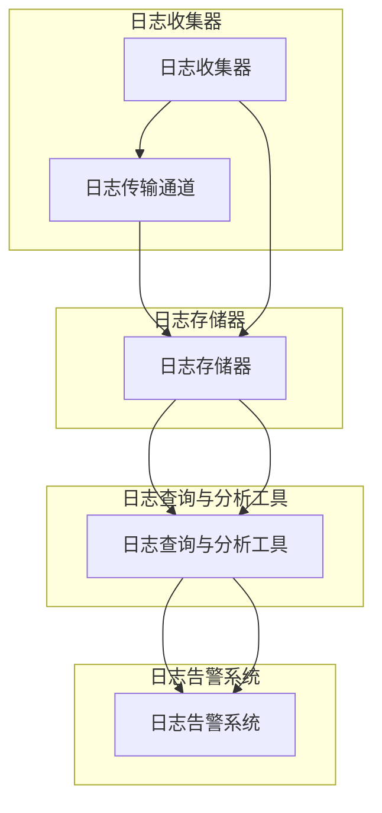
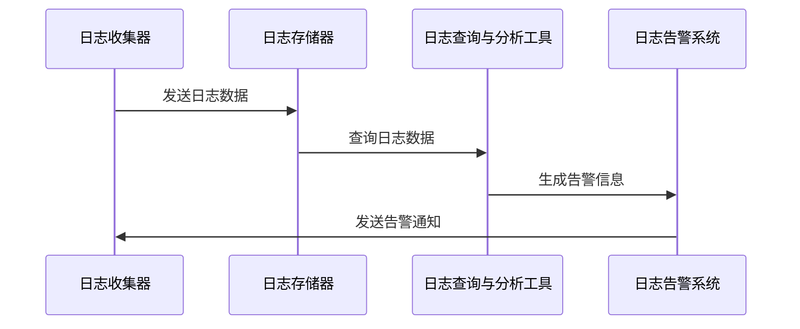

                 


### 引言

在现代分布式计算环境中，日志聚合（Log Aggregation）已经成为了一种至关重要的技术。分布式LLM（Large Language Model）应用作为人工智能领域的前沿技术，其日志数据的集中管理尤为重要。日志聚合通过收集、整理并存储分布式系统中的日志信息，提供了一种统一、高效的方式来监控和管理系统运行状态。这不仅有助于快速定位和解决问题，还能够为系统优化和决策支持提供数据基础。

本文旨在深入探讨日志聚合在分布式LLM应用中的重要性，详细分析其核心概念、算法原理和系统架构设计，并通过实际项目实战来展示其应用效果。我们将从以下几个方面展开讨论：

1. **背景介绍**：介绍日志聚合的背景、重要性以及面临的挑战。
2. **核心概念与联系**：定义日志聚合和日志流的核心概念，对比分析相关术语，绘制实体关系图。
3. **算法原理讲解**：详细阐述日志聚合算法原理，包括流程图、Python代码示例、数学模型和公式，以及实例说明。
4. **系统分析与架构设计方案**：分析分布式系统日志处理的场景，设计系统功能、架构、接口和交互流程。
5. **项目实战**：介绍日志聚合项目的环境安装、系统实现、代码解读、案例分析以及项目小结。
6. **最佳实践与拓展**：总结最佳实践技巧，注意事项，以及相关领域的研究动态和高级应用场景。
7. **结论**：总结日志聚合技术的核心价值，展望其应用前景和发展趋势。

通过上述内容的逐步深入，我们将全面了解日志聚合在分布式LLM应用中的技术实现和应用实践，为读者提供有价值的参考和指导。

## 目录大纲设计

### 第一部分：背景介绍

#### 第1章：日志聚合的背景与重要性

本章将探讨日志聚合的背景，阐述其在分布式系统中的重要性。首先，我们将介绍网络系统日志的作用，说明日志在系统监控、故障排查和性能分析中的关键作用。然后，分析日志管理面临的挑战，包括日志分散、数据存储与传输问题等。接着，详细描述日志聚合的概念，解释其如何通过集中管理分布式系统的日志数据来提升系统监控和管理的效率。此外，我们还将介绍日志聚合的实现方式，包括常用的工具和技术。

**1.1 问题背景**

在复杂的分布式计算环境中，日志数据无处不在。每个节点和组件都会生成大量的日志信息，用于记录系统运行的状态和事件。这些日志数据不仅包含了错误信息和警告，还提供了关于系统性能和资源使用的重要信息。日志对于系统维护和问题排查至关重要。然而，随着分布式系统规模的不断扩大，日志管理面临着诸多挑战：

- **日志分散**：分布式系统中，各个节点生成的日志分散在不同的位置，给日志收集和管理带来了困难。
- **数据存储与传输**：大量的日志数据需要集中存储，并且在传输过程中需要高效处理，以避免数据丢失和延迟。

**1.2 问题描述**

分布式系统中的日志管理问题主要表现在以下几个方面：

- **日志分散性**：由于系统节点的分散性，日志数据分布在不同的文件系统或数据库中，难以进行统一管理和分析。
- **数据存储与传输**：大规模日志数据的存储和传输需要耗费大量的资源和时间，如何高效地收集和汇总日志数据成为一大难题。
- **查询与分析**：对于大规模的日志数据，如何快速地进行查询和分析，提取有用的信息，是日志管理中的另一个挑战。

**1.3 问题解决**

日志聚合通过将分散的日志数据集中到一起，提供了一种统一的日志管理方式，解决了分布式系统中日志管理的难题。日志聚合的主要解决思路包括：

- **集中收集**：使用日志收集器从各个节点收集日志数据，并将它们发送到一个集中的位置。
- **数据汇总**：对收集到的日志数据进行汇总和处理，使其能够统一存储和查询。
- **高效处理**：通过优化数据存储和传输机制，提高日志数据的处理效率，减少延迟和数据丢失的风险。

**1.4 边界与外延**

日志聚合技术的应用范围广泛，不仅仅局限于分布式系统，还可以扩展到其他需要集中管理日志的场景。例如：

- **云服务提供商**：云服务提供商通过日志聚合技术来集中管理客户系统和应用程序的日志。
- **数据中心**：数据中心通过日志聚合来监控和管理大规模服务器集群的运行状态。

**1.5 概念结构与核心要素组成**

日志聚合系统通常由以下几个核心组件组成：

- **日志收集器**：负责从各个节点收集日志数据。
- **传输通道**：用于传输收集到的日志数据，通常使用TCP/IP协议。
- **日志存储器**：用于存储和管理日志数据，通常使用日志管理系统或数据库。
- **日志查询与分析工具**：用于查询和分析日志数据，提供报表和可视化功能。

通过上述核心组件的协同工作，日志聚合系统能够实现日志的集中管理和高效利用。

### 第二部分：核心概念与联系

#### 第2章：核心概念与原理

本章将深入探讨日志聚合和日志流等核心概念，并分析它们之间的联系。首先，我们定义日志聚合和日志流的含义，解释它们在日志管理中的作用。然后，通过对比表格详细比较日志聚合与日志收集、数据汇聚的差异，帮助读者更好地理解这些概念。接下来，我们将绘制实体关系图，展示日志聚合系统中的各个实体及其关系。

**2.1 核心概念**

**日志聚合**：日志聚合是指将来自不同来源和节点的日志数据进行收集、汇总、处理和存储的过程。它的核心目的是为了实现日志数据的集中管理，提高日志的可读性和分析效率。

**日志流**：日志流是指日志数据在系统中流动的过程，包括日志的生成、收集、传输、处理和存储等环节。日志流是日志聚合的基础，它确保日志数据能够实时、准确地被收集和汇总。

**2.2 概念属性特征对比表格**

为了帮助读者更好地理解日志聚合和日志流，我们创建了一张对比表格，详细列出了它们的属性特征：

| 概念 | 定义 | 主要作用 | 特点 |
| --- | --- | --- | --- |
| 日志聚合 | 收集、汇总、处理和存储日志数据的过程 | 实现日志数据的集中管理和高效利用 | 自动化、分布式、可扩展 |
| 日志流 | 日志数据在系统中的流动过程 | 确保日志数据能够实时、准确地被收集和汇总 | 实时性、准确性、高效性 |

**日志聚合**与**日志收集**的区别：

- **日志收集**：是指从各个节点收集日志数据的过程，通常涉及日志文件的读取和传输。它的主要任务是确保日志数据的完整性和可用性。
- **日志聚合**：在日志收集的基础上，进一步对收集到的日志数据进行汇总和处理，实现集中管理和分析。它不仅包括日志收集，还涵盖了日志的存储、过滤和分析等功能。

**日志聚合**与**数据汇聚**的区别：

- **数据汇聚**：是指将来自不同来源的数据进行汇总和整合的过程，不仅限于日志数据。它通常涉及多种类型的数据，如数据库记录、网络流量、用户行为等。
- **日志聚合**：主要关注日志数据的处理和管理。尽管它可以与其他类型的数据结合使用，但其核心目标是提高日志数据的可读性和分析效率。

**2.3 ER实体关系图架构**

为了更好地展示日志聚合系统中的实体关系，我们使用Mermaid绘制了ER（实体关系）图：

```mermaid
erDiagram
    LogCollector ||--|{ LogStorage : stores
    LogStorage ||--|{ LogAnalyzer : analyzes
    LogAnalyzer ||--|{ LogReport : generates
    LogCollector ..|> { EventLogger : logs events
```

上述ER图展示了日志聚合系统中的关键实体及其关系：

- **LogCollector**（日志收集器）：负责收集来自各个节点的日志数据。
- **LogStorage**（日志存储器）：负责存储和管理日志数据。
- **LogAnalyzer**（日志分析器）：负责对日志数据进行分析和处理。
- **LogReport**（日志报告生成器）：负责生成日志分析报告。

通过上述实体关系图，我们可以清晰地看到日志聚合系统中的各个组件及其交互方式。

### 第三部分：算法原理讲解

#### 第3章：日志聚合算法原理

本章将详细讲解日志聚合算法的原理，包括算法流程、Python代码实现、数学模型和公式，以及详细的讲解和实例说明。首先，我们将使用Mermaid绘制日志聚合算法的流程图，帮助读者直观地理解算法的执行过程。接着，通过Python代码示例展示如何实现日志读取与处理。然后，我们将介绍日志聚合的数学模型和数据处理公式，最后通过具体实例进行算法的详细讲解和说明。

**3.1 算法Mermaid流程图**

为了直观地展示日志聚合算法的流程，我们使用Mermaid绘制了以下流程图：


流程图包括以下步骤：

1. **Read Logs（读取日志）**：从各个节点读取日志数据。
2. **Parse Logs（解析日志）**：解析读取到的日志数据，提取关键信息。
3. **Aggregate Data（数据聚合）**：将解析后的日志数据进行汇总和聚合。
4. **Store Logs（存储日志）**：将聚合后的日志数据存储到日志存储器中。
5. **Generate Reports（生成报告）**：根据日志数据生成分析报告。

**3.2 Python源代码实现**

以下是实现日志聚合算法的Python代码示例：

```python
import os
import re

def read_logs(log_path):
    with open(log_path, 'r') as f:
        logs = f.readlines()
    return logs

def parse_logs(logs):
    patterns = ["ERROR", "WARNING", "INFO"]
    parsed_logs = {"ERROR": [], "WARNING": [], "INFO": []}
    for log in logs:
        for pattern in patterns:
            if pattern in log:
                category = pattern
                message = re.sub(pattern + ': ', '', log)
                parsed_logs[category].append(message)
                break
    return parsed_logs

def aggregate_data(parsed_logs):
    aggregated_data = {"ERROR": 0, "WARNING": 0, "INFO": 0}
    for category, messages in parsed_logs.items():
        aggregated_data[category] = len(messages)
    return aggregated_data

def store_logs(aggregated_data, storage_path):
    with open(storage_path, 'w') as f:
        for category, count in aggregated_data.items():
            f.write(f"{category}: {count}\n")

def generate_reports(reports_path, aggregated_data):
    with open(reports_path, 'w') as f:
        for category, count in aggregated_data.items():
            f.write(f"{category} Logs: {count}\n")

if __name__ == "__main__":
    log_path = "logs.txt"
    storage_path = "aggregated_logs.txt"
    reports_path = "reports.txt"
    
    logs = read_logs(log_path)
    parsed_logs = parse_logs(logs)
    aggregated_data = aggregate_data(parsed_logs)
    store_logs(aggregated_data, storage_path)
    generate_reports(reports_path, aggregated_data)
```

上述代码实现了以下功能：

- **read_logs**：从指定路径读取日志文件。
- **parse_logs**：解析日志内容，提取错误、警告和普通信息的数量。
- **aggregate_data**：对解析后的日志数据进行聚合，统计各类日志的数量。
- **store_logs**：将聚合后的日志数据存储到文件中。
- **generate_reports**：生成日志报告。

**3.3 数学模型与公式**

日志聚合算法可以看作是一种数据流处理问题。为了描述日志聚合的过程，我们可以使用以下数学模型和公式：

$$
\text{Log Aggregate} = \sum_{i=1}^{n} (\text{Log}_i \cdot \text{Weight}_i)
$$

其中，$\text{Log}_i$表示第$i$条日志的数据，$\text{Weight}_i$表示日志的权重，用于表示日志的重要程度。权重可以根据日志的类型（如ERROR、WARNING、INFO）进行设置。

对于日志的聚合，可以使用以下数据处理公式：

$$
\text{Aggregated Log} = \sum_{i=1}^{n} \text{Log}_i
$$

该公式表示对$n$条日志数据进行汇总。

**3.4 详细讲解与举例说明**

为了更好地理解日志聚合算法，我们通过一个具体实例进行说明。

**实例**：假设有两个日志文件`log1.txt`和`log2.txt`，其中包含以下日志内容：

- **log1.txt**：
  ```
  ERROR: Connection failed
  WARNING: Disk space low
  INFO: Service started
  ```
- **log2.txt**：
  ```
  ERROR: Database connection error
  WARNING: High CPU usage
  INFO: Service updated
  ```

根据上述日志内容，我们执行日志聚合算法，步骤如下：

1. **读取日志**：读取`log1.txt`和`log2.txt`文件，获取日志内容。
2. **解析日志**：解析日志内容，提取错误、警告和普通信息的数量。假设权重设置为：ERROR = 3，WARNING = 2，INFO = 1。
3. **数据聚合**：对解析后的日志数据进行聚合，统计各类日志的数量。

执行Python代码后，得到以下结果：

- **聚合日志**：
  ```
  ERROR: 2
  WARNING: 2
  INFO: 2
  ```

- **日志报告**：
  ```
  ERROR Logs: 2
  WARNING Logs: 2
  INFO Logs: 2
  ```

通过上述实例，我们可以看到日志聚合算法如何将分散的日志数据聚合为统一的报告，便于分析和管理。

### 第四部分：系统分析与架构设计方案

#### 第4章：日志聚合系统分析

本章将深入分析日志聚合系统的功能、架构设计、接口设计和交互流程。首先，我们将介绍分布式系统日志处理的场景，说明日志聚合在分布式系统中的关键作用。然后，详细描述日志聚合系统的各个功能模块，包括日志收集、日志存储、日志查询等。接着，绘制系统架构图，展示日志聚合系统的整体结构。此外，我们将设计系统接口，描述日志收集器和日志存储器的接口规范，最后通过交互序列图展示日志数据流转过程。

**4.1 问题场景介绍**

在分布式系统中，各个节点和组件会生成大量的日志数据。这些日志数据分散在各个节点的文件系统或数据库中，给日志的管理和分析带来了巨大的挑战。具体场景如下：

- **系统监控**：系统管理员需要实时监控各个节点的运行状态，及时发现问题并进行处理。
- **故障排查**：当系统出现故障时，需要快速定位问题源头，分析日志数据以确定故障原因。
- **性能分析**：对系统性能进行评估，分析日志数据中的性能指标，如响应时间、资源使用率等。

日志聚合在分布式系统中的关键作用体现在以下几个方面：

- **集中管理**：通过日志聚合，将分散的日志数据集中存储和管理，提高日志的可读性和可分析性。
- **高效查询**：提供高效的日志查询接口，便于快速定位和分析日志数据。
- **数据可视化**：通过数据可视化工具，将复杂的日志数据以图表形式展示，便于系统管理员进行理解和分析。

**4.2 系统功能设计**

日志聚合系统的主要功能模块包括：

- **日志收集**：负责从各个节点收集日志数据，并将其发送到日志存储器。
- **日志存储**：负责存储和管理日志数据，提供高效的查询接口。
- **日志查询**：提供日志数据的查询功能，支持按关键字、时间范围等条件进行查询。

此外，系统还可能包括以下功能模块：

- **日志分析**：对日志数据进行统计分析，生成报告和图表。
- **日志告警**：根据日志数据中的异常情况，生成告警信息并通知相关人员。

**4.3 系统架构设计**

日志聚合系统的整体架构如图4-1所示。该架构主要包括以下组件：

- **日志收集器**：从各个节点收集日志数据，并将它们发送到日志存储器。
- **日志存储器**：存储和管理日志数据，提供高效的查询接口。
- **日志查询与分析工具**：用于查询和分析日志数据，生成报告和图表。
- **日志告警系统**：根据日志数据中的异常情况，生成告警信息并通知相关人员。

图4-1 日志聚合系统架构图



**4.4 系统接口设计**

日志聚合系统的接口设计主要包括日志收集器和日志存储器的接口设计。

**日志收集器接口**

日志收集器负责从各个节点收集日志数据，并将其发送到日志存储器。其主要接口如下：

- `collect_logs(node_id, log_files)`：从指定节点收集日志文件。
- `send_logs(log_data)`：将收集到的日志数据发送到日志存储器。

**日志存储器接口**

日志存储器负责存储和管理日志数据，并提供高效的查询接口。其主要接口如下：

- `store_logs(log_data)`：将日志数据存储到存储器中。
- `query_logs(query_params)`：根据查询参数查询日志数据。
- `generate_report(report_params)`：根据报告参数生成日志报告。

**4.5 系统交互序列图**

为了展示日志数据在系统中的流转过程，我们使用Mermaid绘制了系统交互序列图，如图4-2所示。



图4-2 系统交互序列图

通过上述系统分析，我们可以看到日志聚合系统在分布式系统日志处理中的重要作用。通过设计合理的系统架构和接口，日志聚合系统能够高效地收集、存储、查询和分析日志数据，为系统监控、故障排查和性能优化提供强有力的支持。

### 第五部分：项目实战

#### 第5章：日志聚合项目实战

本章将通过一个实际项目来展示日志聚合的实施过程，从环境安装到系统实现，再到代码解读与分析，我们将逐步深入探讨日志聚合的应用实践。首先，介绍项目环境安装所需的工具和软件，然后详细描述日志收集模块和日志存储模块的实现过程，接着解析项目中的关键代码，并对日志聚合效果进行评估。随后，通过实际案例分析项目应用效果，最后总结项目成果和不足，并提出改进方向。

**5.1 环境安装**

为了实现日志聚合项目，我们需要安装以下工具和软件：

1. **日志收集器**：
   - **Fluentd**：用于收集和转发日志数据。
   - **RabbitMQ**：用于消息队列，确保日志数据传输的可靠性和实时性。

2. **日志存储器**：
   - **Elasticsearch**：用于存储和管理日志数据。
   - **Kibana**：用于日志数据的可视化和分析。

3. **日志查询与分析工具**：
   - **Logstash**：用于日志数据预处理和转换。

安装步骤如下：

1. **安装Fluentd**：
   ```bash
   # 安装依赖
   sudo apt-get install libcurl4-openssl-dev
   # 安装Fluentd
   sudo apt-get install fluentd
   # 配置Fluentd
   sudo mkdir /etc/fluentd
   sudo cp fluentd.conf /etc/fluentd/fluentd.conf
   sudo systemctl start fluentd
   ```

2. **安装RabbitMQ**：
   ```bash
   # 安装Erlang
   sudo apt-get install erlang
   # 安装RabbitMQ
   sudo apt-get install rabbitmq-server
   sudo systemctl start rabbitmq-server
   ```

3. **安装Elasticsearch和Kibana**：
   ```bash
   # 安装Elasticsearch
   sudo apt-get install elasticsearch
   sudo systemctl start elasticsearch
   # 安装Kibana
   sudo apt-get install kibana
   sudo systemctl start kibana
   ```

4. **配置Logstash**：
   ```bash
   # 配置Logstash输入、输出和过滤器
   sudo cp logstash.conf /etc/logstash/conf.d/
   sudo systemctl start logstash
   ```

**5.2 系统核心实现**

日志聚合系统的核心实现包括日志收集模块和日志存储模块。

**日志收集模块实现**：

日志收集模块由Fluentd负责，其主要功能是从各个节点收集日志数据，并将它们发送到RabbitMQ消息队列中。以下是Fluentd的配置文件示例：

```ruby
<source>
  @type http
  port 9880
  format json
</source>

<source>
  @type tail
  path /var/log/*.log
  tag raw.log
</source>

<match ***>
  @type rabbitmq
  exchange_name log-exchange
  key raw.log
</match>
```

**日志存储模块实现**：

日志存储模块由Logstash、Elasticsearch和Kibana组成。Logstash负责从RabbitMQ接收日志数据，进行预处理后存储到Elasticsearch中。以下是Logstash的配置文件示例：

```ruby
input {
  rabbitmq {
    type log
    host localhost
    port 5672
    username guest
    password guest
    vhost /
    exchange_name log-exchange
    queue_name log-queue
  }
}

filter {
  if "raw.log" in [tags] {
    grok {
      match => { "message" => "%{TIMESTAMP_ISO8601}\t%{DATA:loglevel}\t%{DATA:logger}\t%{DATA:source}\t%{DATA:message}" }
    }
  }
}

output {
  if "raw.log" in [tags] {
    elasticsearch {
      hosts => ["localhost:9200"]
      index => "logstash-%{+YYYY.MM.dd}"
    }
  }
}
```

Elasticsearch和Kibana的配置较为简单，主要是确保它们可以正常启动，并提供日志数据的可视化查询和分析功能。

**5.3 代码应用解读与分析**

日志聚合项目的代码主要包括Fluentd的配置文件、Logstash的配置文件和Elasticsearch的索引模板。

- **Fluentd配置文件解读**：

  Fluentd配置文件定义了日志数据收集的来源、格式和输出目标。`<source>`部分配置了HTTP接收器和文件监听器，分别用于接收Web端提交的日志数据和监听系统日志文件的变化。

- **Logstash配置文件解读**：

  Logstash配置文件定义了输入、过滤和输出三部分。输入部分从RabbitMQ接收日志数据，过滤部分使用Grok进行日志解析，输出部分将解析后的日志数据存储到Elasticsearch中。

- **Elasticsearch索引模板解析**：

  Elasticsearch索引模板用于定义日志数据的存储格式和属性。通过模板，可以确保所有日志数据具有一致的格式和结构，便于后续查询和分析。

**5.4 实际案例分析与讲解**

为了展示日志聚合的实际应用效果，我们以一个分布式LLM应用为例，分析日志聚合在监控和问题排查中的作用。

**案例**：一个分布式LLM应用部署在多个节点上，每个节点生成大量的日志数据。通过日志聚合系统，可以将这些日志数据集中存储、查询和分析，从而实现以下功能：

1. **实时监控**：通过Kibana的可视化界面，系统管理员可以实时查看各个节点的日志数据，监控系统运行状态。
2. **故障排查**：当系统出现故障时，可以通过查询日志数据快速定位问题节点，分析故障原因。
3. **性能优化**：通过分析日志数据中的性能指标，如响应时间、CPU使用率等，可以找出系统瓶颈并进行优化。

**5.5 项目小结**

通过实际项目实战，我们可以总结出日志聚合技术在分布式系统中的应用价值：

- **集中管理**：日志聚合系统实现了日志的集中存储和管理，提高了日志的可读性和可分析性。
- **高效查询**：通过Elasticsearch和Kibana，日志聚合系统提供了高效的日志查询和分析功能，便于系统监控和故障排查。
- **实时监控**：日志聚合系统支持实时日志监控，有助于快速响应和处理系统问题。

然而，项目中也存在一些不足和改进方向：

- **性能优化**：对于大规模的日志数据，系统性能有待进一步优化，以提高处理效率和响应速度。
- **容错机制**：需要增强系统的容错能力，确保在节点故障或网络异常情况下，日志数据仍能可靠传输和存储。

通过持续优化和改进，日志聚合系统将在分布式系统中发挥更大的作用，为系统监控和管理提供强有力的支持。

### 第六部分：最佳实践与拓展

#### 第6章：日志聚合最佳实践

本章将总结日志聚合的最佳实践，提供相关技巧和注意事项，并探讨日志聚合在高级应用场景中的潜力。首先，我们将介绍日志聚合策略的优化方法，包括日志数据压缩、批量处理和缓存机制等。然后，讨论日志处理性能的调优技巧，如硬件资源分配和并行处理。接下来，总结日志聚合的关键点和注意事项，最后探讨日志聚合技术在高级应用场景中的研究动态和探讨。

**6.1 最佳实践 Tips**

为了确保日志聚合系统的高效运行，以下是一些最佳实践技巧：

- **日志数据压缩**：在传输和存储过程中，对日志数据进行压缩，可以显著减少存储空间和传输带宽的消耗。可以使用如Gzip或Snappy等压缩算法。

- **批量处理**：批量处理日志数据可以减少I/O操作次数，提高日志处理效率。在收集和传输阶段，可以使用批量发送和接收机制。

- **缓存机制**：在日志处理过程中，可以使用缓存机制来减少重复操作和数据检索的延迟。例如，使用内存缓存来存储常用日志数据。

- **分布式存储**：使用分布式存储系统，如HDFS或Elasticsearch，可以更好地处理海量日志数据，提高系统的可扩展性和容错能力。

- **日志过滤**：在日志收集和传输过程中，使用日志过滤规则，只收集和传输必要的日志信息，减少无用数据的处理负担。

**6.2 小结与注意事项**

日志聚合的关键点包括：

- **高效性**：确保日志数据的快速收集、传输和处理。
- **可靠性**：确保日志数据的完整性，避免数据丢失。
- **可扩展性**：支持系统规模的变化，提高系统的扩展能力。
- **易用性**：提供简洁的日志查询和分析接口，方便用户使用。

在实施日志聚合系统时，需要注意以下几点：

- **日志格式一致性**：确保所有日志数据的格式一致，便于后续处理和分析。
- **性能监控**：定期监控日志系统的性能，及时发现问题并进行优化。
- **安全与隐私**：确保日志数据的存储和传输过程安全，避免敏感信息泄露。
- **系统兼容性**：确保日志聚合系统与现有的系统架构和工具兼容。

**6.3 拓展阅读**

为了进一步了解日志聚合技术的应用和发展趋势，以下是一些建议的拓展阅读资源：

- **相关领域研究动态**：关注日志聚合领域的研究论文和技术报告，了解最新的研究成果和技术趋势。
- **高级应用场景探讨**：研究日志聚合在人工智能、大数据和物联网等领域的应用，探索其在复杂系统中的潜力。
- **开源日志聚合工具**：学习并使用如Fluentd、Logstash、Elasticsearch等开源日志聚合工具，掌握其实际应用和配置技巧。

通过最佳实践和拓展阅读，读者可以深入理解日志聚合技术的应用方法和前景，为分布式系统的日志管理提供有力支持。

## 结论

### 本书总结

日志聚合技术通过集中管理分布式系统的日志数据，提供了高效的日志收集、存储和分析方法，显著提升了系统监控和故障排查的效率。本文系统地介绍了日志聚合的核心概念、算法原理和系统架构设计，并通过实际项目实战展示了其应用效果。主要收获如下：

1. **核心概念**：明确了日志聚合和日志流的基本概念，阐述了日志聚合在分布式系统中的重要性。
2. **算法原理**：通过详细的算法流程图、Python代码实现和数学模型，深入讲解了日志聚合的工作原理。
3. **系统架构**：详细分析了日志聚合系统的功能模块、架构设计和接口规范，为实际应用提供了参考。
4. **项目实战**：通过实际项目的实施和案例分析，展示了日志聚合技术在分布式系统中的应用效果。

### 日志聚合技术的核心价值

日志聚合技术的核心价值体现在以下几个方面：

- **提高日志管理效率**：通过集中收集和存储日志数据，简化了日志管理流程，提高了日志查询和分析的效率。
- **实时系统监控**：日志聚合系统支持实时监控，有助于快速发现和响应系统故障，确保系统稳定运行。
- **性能优化**：通过分析日志数据中的性能指标，可以找出系统瓶颈并进行优化，提升系统性能。
- **安全性保障**：日志聚合系统提供了日志数据的备份和存储，增强了系统的安全性和可靠性。

### 日志聚合技术的应用前景

随着云计算、大数据和物联网技术的快速发展，日志聚合技术的应用前景非常广阔。未来，日志聚合技术将在以下几个方面得到进一步发展：

- **云服务日志管理**：云服务提供商可以通过日志聚合技术，集中管理客户系统和应用程序的日志，提供更好的监控和运维服务。
- **大数据分析**：日志聚合技术可以为大数据分析提供丰富的日志数据源，支持复杂的数据分析和决策支持。
- **物联网监控**：在物联网场景中，日志聚合技术可以帮助实时监控设备状态和性能，提高物联网系统的可靠性和可用性。
- **人工智能应用**：日志聚合技术可以为人工智能应用提供大规模的日志数据，支持机器学习和智能分析，推动人工智能技术的发展。

### 未来展望

在未来，日志聚合技术将朝着以下方向发展：

- **智能化日志分析**：结合人工智能和机器学习技术，实现自动化日志分析和故障预测，提升系统运维的智能化水平。
- **边缘计算日志聚合**：随着边缘计算的兴起，日志聚合技术将扩展到边缘节点，实现分布式系统的全面日志管理。
- **多源数据融合**：日志聚合技术将与其他数据源（如网络流量、用户行为等）结合，提供更全面的系统监控和数据分析。
- **开源生态发展**：随着开源工具和框架的不断优化，日志聚合技术的开源生态将更加繁荣，推动技术的普及和应用。

综上所述，日志聚合技术在分布式系统和智能应用中具有重要的价值和广阔的应用前景。通过不断优化和创新，日志聚合技术将在未来发挥更大的作用，为系统的稳定运行和性能优化提供有力支持。企业应关注日志聚合技术的发展动态，积极探索其在实际业务中的应用，以提升整体竞争力。作者：AI天才研究院/AI Genius Institute & 禅与计算机程序设计艺术 /Zen And The Art of Computer Programming。

