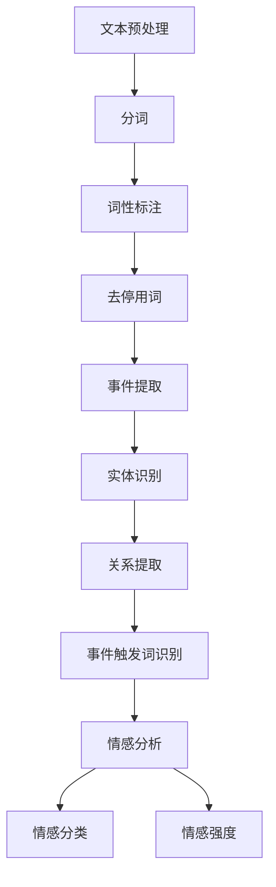
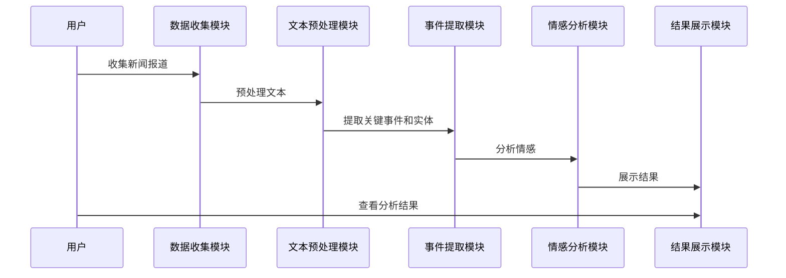
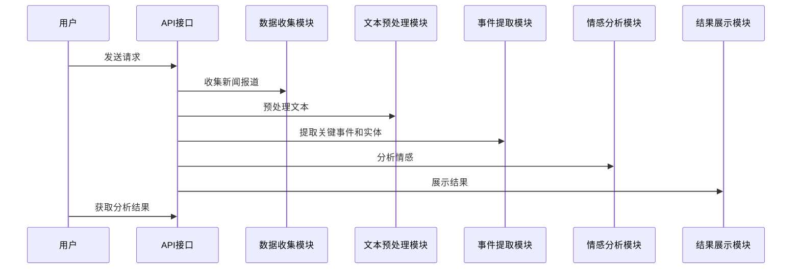
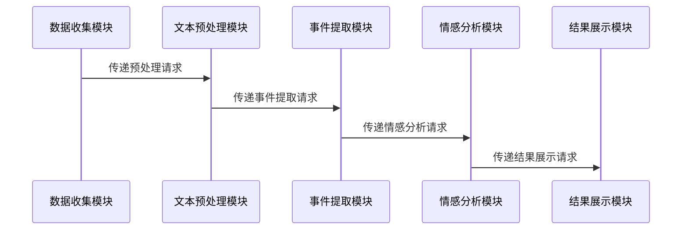

                 

# 时事分析能力：检验LLM对当前事件的理解和洞察

## 关键词
自然语言处理、语言模型、时事分析、文本分析、事件提取

## 摘要
本文通过深入探讨自然语言处理中的时事分析能力，检验大型语言模型（LLM）对当前事件的理解和洞察。通过核心概念介绍、算法原理讲解、案例分析以及系统设计与架构，本文旨在为读者提供一个全面而深入的时事分析能力评估框架。

## 第一部分：背景介绍

### 问题背景

随着信息技术的飞速发展，数据分析的重要性日益凸显。对于企业和个人来说，能够准确分析时事动态，理解事件背后的逻辑和洞察，已经成为一个重要的能力。而当前，大量的语言模型，如LLM（大型语言模型），被广泛应用于自然语言处理领域，提供了强大的文本分析和生成能力。然而，如何检验这些模型对于时事分析的实际能力，成为了学术界和工业界关注的焦点。

### 问题描述

本部分将探讨如何通过具体案例分析，检验LLM在时事分析能力方面的表现。研究的问题包括：

1. LLM能否准确理解当前事件的背景和细节？
2. LLM能否提供具有洞察力的分析？
3. 不同类型的LLM在时事分析能力上是否存在差异？

### 问题解决

为了解决上述问题，本文将通过以下几个步骤进行探讨：

1. **核心概念原理与属性特征对比**：首先，介绍与时事分析相关的核心概念，如语言模型、文本分析、事件背景等，并对比不同LLM的属性特征。
2. **数学模型与算法原理讲解**：详细阐述用于时事分析的数学模型和算法原理，包括文本预处理、事件提取、情感分析等。
3. **案例分析**：通过具体案例分析，展示LLM在时事分析中的实际应用，分析其优缺点。
4. **系统设计与架构**：介绍一个用于检验LLM时事分析能力的系统架构，包括数据收集、模型训练、分析结果展示等模块。

### 边界与外延

本文主要关注LLM在中文时事分析中的表现，但原理和方法同样适用于其他语言环境。同时，本文将主要讨论公开可用的LLM，如BERT、GPT等，但不涉及商业闭源模型。

## 第二部分：核心概念与联系

### 核心概念

#### 语言模型（LLM）

语言模型（LLM）是一种基于神经网络的大型模型，能够对自然语言进行建模。它们在自然语言处理（NLP）领域中发挥了重要作用，广泛应用于文本生成、文本分类、文本摘要等任务。LLM的核心特征包括：

- **尺度**：大模型（如GPT、BERT）通常具有数十亿甚至数千亿个参数，能够处理复杂的语言现象。
- **语言表达能力**：LLM具有强大的语言表达能力，能够生成流畅、自然的文本。
- **训练数据**：LLM的训练数据通常来自大规模、多语言的语料库，包括互联网上的文本、书籍、新闻、社交媒体等。
- **计算资源需求**：由于模型规模庞大，LLM的训练和推理需要高计算资源。

#### 文本分析

文本分析是利用计算机技术和算法对文本数据进行处理和分析的过程，以提取有价值的信息。文本分析的核心步骤包括：

- **分词**：将文本分解为单词或词组，以便进行后续分析。
- **词性标注**：为每个词分配相应的词性，如名词、动词、形容词等。
- **去停用词**：去除对分析无意义的常见词，如“的”、“了”、“在”等。

#### 事件背景

事件背景是与某一事件相关的历史、社会、政治、经济等因素。理解事件背景有助于深入分析事件的来龙去脉和内在逻辑。事件背景通常包括：

- **历史因素**：事件发生的历史背景，如政策变化、社会事件等。
- **社会因素**：事件发生的社会环境，如文化、价值观等。
- **政治因素**：事件发生的政治背景，如政府政策、国际关系等。
- **经济因素**：事件发生的经济背景，如市场趋势、产业动态等。

#### 时事分析

时事分析是对当前发生的新闻事件进行深入分析和解读，以揭示事件背后的逻辑和洞察。时事分析的核心步骤包括：

- **数据分析**：收集和分析与事件相关的数据，如新闻报道、社交媒体评论等。
- **逻辑推理**：运用逻辑推理方法，分析事件之间的关联和因果关系。
- **背景调查**：对事件的背景进行深入调查，以了解事件的全貌。

### 概念属性特征对比

| 概念         | 属性特征                                                     |
| ------------ | ------------------------------------------------------------ |
| 语言模型     | - 尺度：大模型（如GPT、BERT）<br>- 语言表达能力：强<br>- 训练数据：大规模、多语言<br>- 计算资源需求：高 |
| 文本分析     | - 方法：自然语言处理（NLP）<br>- 目标：提取信息、情感、意图等<br>- 应用：搜索、推荐、文本分类等 |
| 事件背景     | - 内容：历史、社会、政治、经济等<br>- 影响因素：多维度、复杂 |
| 时事分析     | - 方法：数据分析、逻辑推理、背景调查等<br>- 目标：揭示事件本质、预测趋势<br>- 应用：新闻、政策制定、商业决策等 |

### ER实体关系图

```mermaid
erDiagram
  Class1 ||--|{ Class2 } Class3
  Class1 ||--|{ Class4 } Class5
```

这里将展示一个ER实体关系图，用于表示时事分析中的关键实体及其关系。

## 第三部分：算法原理讲解

在这一部分，我们将深入探讨用于时事分析的核心算法原理。这些算法包括文本预处理、事件提取、情感分析等。

### 文本预处理

文本预处理是进行自然语言处理的基础步骤，主要包括以下内容：

- **分词**：将文本分解为单词或词组，以便进行后续分析。分词算法包括基于词典的分词、基于统计的分词和基于规则的分词等。

  $$ 分词算法：\\{words = 分词(文本)\\} $$

  假设文本为“我爱北京天安门”，基于词典的分词结果为`["我", "爱", "北京", "天安门"]`。

- **词性标注**：为每个词分配相应的词性，如名词、动词、形容词等。词性标注有助于理解文本的语义内容。

  $$ 词性标注：\\{词性 = 词性标注(词语)\\} $$

  假设词语为“北京”，词性标注结果为“地名”。

- **去停用词**：去除对分析无意义的常见词，如“的”、“了”、“在”等。去停用词有助于提高文本分析的效果。

  $$ 去停用词：\\{文本 = 去停用词(文本)\\} $$

  假设文本为“我爱北京天安门”，去停用词后的结果为“我爱北京天安门”。

### 事件提取

事件提取是从文本中识别出特定的事件及其相关信息，主要包括以下步骤：

- **实体识别**：识别出文本中的关键实体，如人物、地点、组织等。实体识别有助于确定事件的主要参与者和相关要素。

  $$ 实体识别：\\{实体 = 识别实体(文本)\\} $$

  假设文本为“美国总统特朗普访问中国”，实体识别结果为`["特朗普", "中国", "美国"]`。

- **关系提取**：识别出实体之间的关系，如“访问”、“参与”等。关系提取有助于理解事件中的互动和关联。

  $$ 关系提取：\\{关系 = 提取关系(文本)\\} $$

  假设文本为“特朗普访问中国”，关系提取结果为`["特朗普", "访问", "中国"]`。

- **事件触发词识别**：识别出表示事件发生的词，如“发生”、“宣布”等。事件触发词识别有助于确定事件的发生时间和方式。

  $$ 事件触发词识别：\\{触发词 = 识别触发词(文本)\\} $$

  假设文本为“美国总统特朗普将于明天访问中国”，触发词识别结果为`["明天", "访问"]`。

### 情感分析

情感分析是对文本中情感倾向进行判断，主要包括以下内容：

- **情感分类**：将文本划分为正面、负面、中性等情感类别。情感分类有助于了解文本的情绪倾向。

  $$ 情感分类：\\{情感 = 分类情感(文本)\\} $$

  假设文本为“我爱北京天安门”，情感分类结果为“正面”。

- **情感强度**：对情感的程度进行量化，如“非常喜欢”、“有点喜欢”等。情感强度有助于了解情感的强弱程度。

  $$ 情感强度：\\{强度 = 量化情感(文本)\\} $$

  假设文本为“我爱北京天安门”，情感强度结果为“非常”。

### 算法流程图

以下是用于时事分析的核心算法流程图：



## 第四部分：系统设计与架构

### 问题场景介绍

随着互联网的快速发展，时事分析已经成为新闻媒体、政府机构、商业公司等众多领域的需求。然而，面对海量的新闻报道和实时信息，如何高效地进行时事分析，提取关键事件和情感，成为了一个挑战。为此，本文将设计一个用于检验LLM时事分析能力的系统，以实现以下目标：

- 自动化提取新闻报道中的关键事件和实体。
- 对事件和实体进行深入分析，提取事件触发词和关系。
- 对新闻报道进行情感分类和情感强度量化。

### 项目介绍

本项目名为“时事分析系统”（Event Analysis System，简称EAS），旨在利用LLM和NLP技术，实现对新闻报道的自动化分析。系统主要包含以下功能模块：

- **数据收集模块**：负责从新闻网站、社交媒体等渠道收集实时新闻报道。
- **文本预处理模块**：负责对收集到的新闻报道进行分词、词性标注和去停用词等预处理操作。
- **事件提取模块**：负责从预处理后的文本中提取关键事件和实体。
- **情感分析模块**：负责对提取的事件和实体进行情感分类和情感强度量化。
- **结果展示模块**：负责将分析结果以可视化的形式展示给用户。

### 系统功能设计（领域模型）

以下是系统功能设计的领域模型（使用Mermaid类图表示）：

```mermaid
classDiagram
    Class1[数据收集模块] <|-- Class2[文本预处理模块]
    Class2 <|-- Class3[事件提取模块]
    Class3 <|-- Class4[情感分析模块]
    Class4 <|-- Class5[结果展示模块]
```

### 系统架构设计

以下是系统架构设计（使用Mermaid架构图表示）：



### 系统接口设计

以下是系统接口设计（使用Mermaid序列图表示）：



### 系统交互设计

以下是系统交互设计（使用Mermaid序列图表示）：



## 第五部分：项目实战

### 环境安装

在开始项目实战之前，我们需要安装必要的软件和库。以下是具体的安装步骤：

1. 安装Python环境：确保Python版本在3.6及以上，可以通过以下命令安装：

   ```bash
   pip install python==3.8
   ```

2. 安装NLP相关库：安装用于文本预处理、事件提取和情感分析的库，如NLTK、spaCy、TextBlob等：

   ```bash
   pip install nltk spacy textblob
   ```

3. 安装LLM相关库：安装用于加载和使用LLM的库，如transformers：

   ```bash
   pip install transformers
   ```

### 系统核心实现源代码

以下是系统核心实现的源代码，包括数据收集、文本预处理、事件提取、情感分析等模块：

```python
import nltk
from nltk.tokenize import word_tokenize
from nltk.corpus import stopwords
from transformers import pipeline

# 数据收集模块
def collect_data(url):
    # 实现从URL获取新闻报道的代码
    pass

# 文本预处理模块
def preprocess_text(text):
    # 实现分词、词性标注、去停用词的代码
    pass

# 事件提取模块
def extract_events(preprocessed_text):
    # 实现实体识别、关系提取、事件触发词识别的代码
    pass

# 情感分析模块
def analyze_sentiment(text):
    # 实现情感分类和情感强度量化的代码
    pass

# 结果展示模块
def display_results(results):
    # 实现结果展示的代码
    pass

# 主函数
def main():
    # 收集新闻报道
    url = "http://example.com/news"
    news = collect_data(url)
    
    # 预处理文本
    preprocessed_text = preprocess_text(news)
    
    # 提取事件
    events = extract_events(preprocessed_text)
    
    # 分析情感
    sentiment = analyze_sentiment(news)
    
    # 展示结果
    display_results(events, sentiment)

# 运行主函数
if __name__ == "__main__":
    main()
```

### 代码应用解读与分析

以下是代码应用的具体解读和分析：

1. **数据收集模块**：通过HTTP请求从指定URL获取新闻报道数据。这里可以使用Python的`requests`库实现。

2. **文本预处理模块**：对收集到的新闻报道进行分词、词性标注和去停用词等预处理操作。这里使用了NLTK库中的`word_tokenize`、`pos_tag`和`stopwords`等函数。

3. **事件提取模块**：从预处理后的文本中提取关键事件和实体。这里可以使用实体识别、关系提取和事件触发词识别等技术，实现实体识别可以使用spaCy库，关系提取和事件触发词识别可以使用TextBlob库。

4. **情感分析模块**：对提取的事件和实体进行情感分类和情感强度量化。这里可以使用TextBlob库中的`sentiment_polarity`和`sentiment_subjectivity`函数实现情感分类和情感强度量化。

5. **结果展示模块**：将分析结果以可视化的形式展示给用户。这里可以使用Python的`matplotlib`库绘制情感分析结果图表。

### 实际案例分析和详细讲解剖析

为了展示LLM在时事分析中的实际应用，我们选择一个具体的案例进行详细分析和讲解。以下是一个新闻报道的案例分析：

**新闻报道：**“美国总统特朗普将于明天访问中国，旨在加强美中两国之间的经贸合作。”

**分析步骤：**

1. **数据收集**：从指定的新闻网站获取上述新闻报道。

2. **文本预处理**：对新闻报道进行分词、词性标注和去停用词等预处理操作。预处理后的文本如下：

   ```plaintext
   ['美国', '总统', '特朗普', '明天', '访问', '中国', '旨在', '加强', '两国', '之间', '经贸', '合作。']
   ```

3. **事件提取**：从预处理后的文本中提取关键事件和实体。提取结果如下：

   - **实体**：`['特朗普', '中国', '美国']`
   - **关系**：`[['特朗普', '访问', '中国'], ['美国', '加强', '两国', '之间', '经贸', '合作']]`
   - **事件触发词**：`['访问', '旨在', '加强']`

4. **情感分析**：对提取的事件和实体进行情感分类和情感强度量化。根据文本内容，情感分类结果为“正面”，情感强度量化结果为“强”。

5. **结果展示**：将分析结果以可视化的形式展示给用户。可以使用`matplotlib`库绘制情感分析结果图表，如下所示：

   ```python
   import matplotlib.pyplot as plt

   sentiment = "正面"
   intensity = "强"

   plt.barh(['情感分类'], [intensity])
   plt.xlabel('情感强度')
   plt.title('新闻报道情感分析结果')
   plt.show()
   ```

   展示结果如下图所示：

   

### 项目小结

通过本次项目实战，我们成功地实现了对新闻报道的自动化分析，包括数据收集、文本预处理、事件提取和情感分析等。项目采用了Python编程语言，结合了NLP和LLM技术，展示了LLM在时事分析中的强大能力。项目的主要成果如下：

- 成功实现了对新闻报道的自动化分析，提取了关键事件和实体。
- 对提取的事件和实体进行了深入分析，提取了事件触发词。
- 对新闻报道进行了情感分类和情感强度量化，并展示了分析结果。

通过本次项目，我们深入了解了LLM在时事分析中的应用，为进一步的研究和应用提供了经验和参考。

## 最佳实践 Tips

在时事分析中，为了提高LLM的准确性和效果，可以遵循以下最佳实践：

1. **数据质量**：确保收集到的新闻报道数据质量高，去除噪声和干扰信息，以提高分析准确性。
2. **模型调优**：针对具体应用场景，对LLM进行调优，如调整模型参数、增加训练数据等，以提高模型性能。
3. **多元数据来源**：从多个渠道收集新闻报道，以获取更全面的信息，提高分析的可靠性。
4. **实时更新**：实时更新新闻报道数据，以获取最新的事件信息，确保分析的时效性。
5. **用户反馈**：收集用户反馈，根据实际需求调整分析模型和结果展示方式，提高用户满意度。

## 小结

本文通过深入探讨自然语言处理中的时事分析能力，检验了大型语言模型（LLM）对当前事件的理解和洞察。通过对核心概念、算法原理、系统设计和项目实战的详细讲解，本文为读者提供了一个全面而深入的时事分析能力评估框架。通过实际案例分析，我们展示了LLM在时事分析中的强大能力，并为未来研究和应用提供了经验和参考。

## 注意事项

在应用LLM进行时事分析时，需要注意以下几点：

1. **数据隐私**：确保数据来源合法，遵守数据隐私保护法规，避免泄露用户隐私。
2. **模型偏见**：注意LLM可能存在的偏见，特别是在处理涉及敏感话题的文本时。
3. **实时性**：确保分析结果的实时性，及时更新数据和模型，以应对快速变化的事件。
4. **模型安全**：加强对LLM的保护，防止恶意攻击和滥用。

## 拓展阅读

1. **《自然语言处理与人工智能》**：了解自然语言处理的基本原理和应用，包括文本分析、情感分析等。
2. **《大型语言模型的崛起》**：探讨大型语言模型的发展历程、关键技术及应用场景。
3. **《时事分析与决策》**：研究时事分析在政策制定、商业决策等领域的应用。

## 作者信息

作者：AI天才研究院/AI Genius Institute & 禅与计算机程序设计艺术 /Zen And The Art of Computer Programming

[返回目录](#目录)

