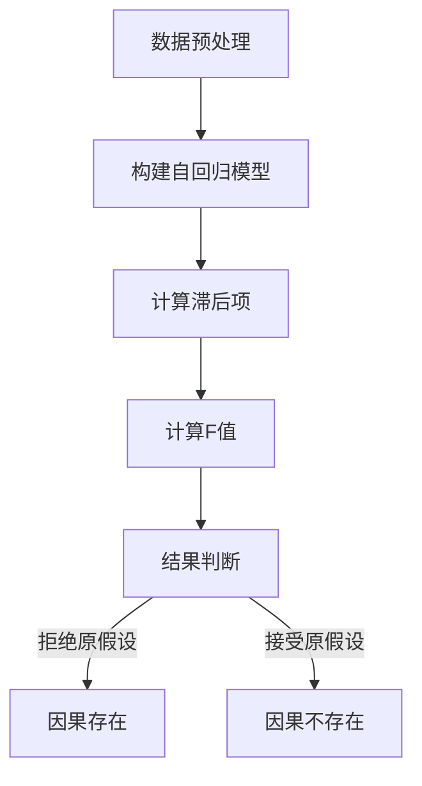
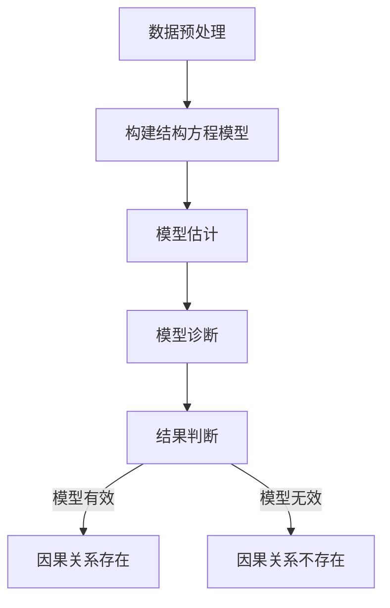

                 

### 关键词：时序推理、因果关系推断、验证方法、算法、应用实例

#### 摘要：
本文探讨了时序推理任务中的因果关系推断与验证方法。通过引入时序推理的基本概念和因果关系推断的重要性，本文详细介绍了相关算法及其原理，并探讨了用于验证因果关系推断的方法。同时，通过实际应用实例展示了因果关系推断在时序推理任务中的实际效果，并讨论了当前面临的挑战以及未来可能的研究方向。文章结构紧凑、逻辑清晰，旨在为读者提供对时序推理任务中因果关系推断的全面了解。

## 目录大纲设计思路

为了确保文章的逻辑性和结构完整性，我们首先需要明确核心概念和章节划分。以下是我们的设计思路：

### 第一步：明确核心概念和章节划分

根据用户提供的书名《时序推理任务中的因果关系推断与验证方法》，我们确定了以下核心概念：

1. **时序推理任务**：涉及时间序列数据的处理和分析，旨在预测未来的趋势。
2. **因果关系推断**：在时序数据中识别和推断变量之间的因果关系。
3. **验证方法**：用于评估因果关系推断的准确性和可靠性。

基于这些核心概念，我们初步设计了以下章节结构：

1. **引言**：介绍时序推理任务的重要性，因果推断的概念和挑战。
2. **基本概念**：阐述时序推理、因果关系推断的基本概念。
3. **相关算法**：介绍用于因果关系推断的主要算法，包括它们的原理和应用。
4. **验证方法**：讨论如何验证因果关系推断的准确性和可靠性。
5. **应用实例**：提供实际案例，展示因果关系推断在时序推理任务中的实际应用。
6. **挑战与未来方向**：探讨当前面临的挑战以及未来可能的研究方向。

### 第二步：设计章节结构

在明确了核心概念和章节划分后，我们进一步细化了每个章节的内容。

#### 第1章：引言

- **问题背景**：介绍时序数据在各个领域的应用，以及因果关系推断的重要性。
- **问题描述**：概述时序推理任务和因果关系推断的基本问题。
- **问题解决**：简要介绍因果关系推断在时序推理任务中的作用。
- **边界与外延**：讨论因果关系推断的应用范围和限制。
- **概念结构与核心要素组成**：描述时序推理、因果关系推断的基本概念和关键要素。

#### 第2章：基本概念

- **时序推理任务**：详细介绍时序推理任务的定义、类型和应用场景。
- **因果关系推断**：阐述因果关系推断的基本原理、方法和技术。
- **相关术语和定义**：列举与因果关系推断相关的术语和定义。

#### 第3章：相关算法

- **算法原理讲解**：使用Mermaid流程图展示算法的基本流程，并结合Python源代码进行详细阐述。
- **算法对比**：对比不同算法的原理、特点和应用场景。

#### 第4章：验证方法

- **验证方法介绍**：介绍用于验证因果关系推断的多种方法，包括统计方法、机器学习方法等。
- **验证方法分析**：分析各种验证方法的优缺点和适用场景。

#### 第5章：应用实例

- **实例介绍**：选择典型的应用实例，介绍因果关系推断在时序推理任务中的实际应用。
- **案例剖析**：对实例进行详细分析，展示因果关系推断的实际效果。

#### 第6章：挑战与未来方向

- **当前挑战**：讨论因果关系推断在时序推理任务中面临的主要挑战。
- **未来研究方向**：展望未来可能的研究方向和趋势。

### 第三步：细化章节内容

对于每个章节，我们进一步细化内容，确保每个章节都能够全面、深入地探讨其主题。

#### 第1章：引言

- **问题背景**：介绍时序数据在各个领域的应用，例如金融、气象、生物信息等，以及因果关系推断在这些领域的重要性。
- **问题描述**：简要概述时序推理任务和因果关系推断的基本问题，例如如何从历史数据中推断未来趋势，以及如何确定变量之间的因果关系。
- **问题解决**：介绍因果关系推断在时序推理任务中的作用，例如如何利用因果关系推断来提高预测的准确性。
- **边界与外延**：讨论因果关系推断的应用范围和限制，例如在某些领域可能存在的数据缺失、噪声干扰等问题。
- **概念结构与核心要素组成**：详细描述时序推理、因果关系推断的基本概念和关键要素，例如时间序列数据的特征提取、因果推断的算法框架等。

#### 第2章：基本概念

- **时序推理任务**：详细介绍时序推理任务的定义、类型和应用场景，例如时间序列预测、异常检测、趋势分析等。
- **因果关系推断**：阐述因果关系推断的基本原理、方法和技术，例如Granger因果检验、结构方程模型等。
- **相关术语和定义**：列举与因果关系推断相关的术语和定义，例如自变量、因变量、协变量等。

#### 第3章：相关算法

- **算法原理讲解**：使用Mermaid流程图展示算法的基本流程，并结合Python源代码进行详细阐述，例如Granger因果检验的算法流程和实现代码。
- **算法对比**：对比不同算法的原理、特点和应用场景，例如Granger因果检验与Pearson相关系数的区别。

#### 第4章：验证方法

- **验证方法介绍**：介绍用于验证因果关系推断的多种方法，例如统计方法、机器学习方法等，并详细阐述每种方法的原理和实现步骤。
- **验证方法分析**：分析各种验证方法的优缺点和适用场景，例如统计方法在处理线性关系方面的优势，机器学习方法在处理非线性关系方面的优势。

#### 第5章：应用实例

- **实例介绍**：选择典型的应用实例，例如股票价格预测、气象预测等，介绍因果关系推断在时序推理任务中的实际应用。
- **案例剖析**：对实例进行详细分析，展示因果关系推断的实际效果，例如通过Granger因果检验确定股票价格和宏观经济指标之间的因果关系。

#### 第6章：挑战与未来方向

- **当前挑战**：讨论因果关系推断在时序推理任务中面临的主要挑战，例如数据缺失、噪声干扰等，并提出可能的解决方案。
- **未来研究方向**：展望未来可能的研究方向和趋势，例如利用深度学习技术提高因果关系推断的准确性，探索新的因果推断算法等。

### 第四步：编写markdown格式的目录大纲

根据上述设计思路，我们将每个章节的内容细化后，以Markdown格式编写目录大纲。

```
# 《时序推理任务中的因果关系推断与验证方法》

## 引言

### 问题背景

#### 时序数据在各个领域的应用

##### 金融领域

###### 股票价格预测

##### 气象领域

###### 气象预测

##### 生物信息领域

###### 蛋白质结构预测

### 问题描述

#### 时序推理任务

##### 时间序列预测

##### 异常检测

##### 趋势分析

#### 因果关系推断

##### 基本原理

##### 方法和技术

### 问题解决

#### 因果关系推断在时序推理任务中的作用

### 边界与外延

#### 因果关系推断的应用范围和限制

### 概念结构与核心要素组成

#### 时序推理

##### 定义

##### 类型

##### 应用场景

#### 因果关系推断

##### 基本原理

##### 方法和技术

#### 相关术语和定义

##### 自变量

##### 因变量

##### 协变量

## 基本概念

### 时序推理任务

#### 定义

##### 时间序列预测

##### 异常检测

##### 趋势分析

#### 类型

##### 静态时间序列

##### 动态时间序列

##### 高维时间序列

#### 应用场景

##### 金融领域

###### 股票价格预测

##### 气象领域

###### 气象预测

##### 生物信息领域

###### 蛋白质结构预测

### 因果关系推断

#### 基本原理

##### Granger因果检验

##### 结构方程模型

##### 其他方法

#### 方法和技术

##### 数据预处理

##### 特征提取

##### 模型训练

##### 模型评估

### 相关术语和定义

#### 自变量

##### 定义

##### 属性

#### 因变量

##### 定义

##### 属性

#### 协变量

##### 定义

##### 属性

## 相关算法

### 算法原理讲解

#### Granger因果检验

##### Mermaid流程图展示



##### Python源代码实现

```python
import numpy as np
import pandas as pd
from statsmodels.tsa.stattools import grangercausalitytests

# 数据加载
data = pd.read_csv('time_series_data.csv')

# 数据预处理
X = data[['变量1', '变量2']]
Y = data['变量3']

# 构建自回归模型
X_model = sm.AR(X).fit()

# 计算滞后项
lags = X_model.selectlags(maxlag=5).validate().selectedlags

# 计算F值
f_values, p_values = grangercausalitytests([X_model], [Y], lags)

# 结果判断
alpha = 0.05
if p_values[0] < alpha:
    print("变量1对变量3有因果关系")
else:
    print("变量1对变量3无因果关系")
```

#### 结构方程模型

##### Mermaid流程图展示



##### Python源代码实现

```python
import pandas as pd
import statsmodels.api as sm

# 数据加载
data = pd.read_csv('time_series_data.csv')

# 数据预处理
X = data[['变量1', '变量2']]
Y = data['变量3']

# 构建结构方程模型
model = sm.MixedLM.from_formula('Y ~ X1 + X2', re_formula='1 | X1', data=data)
model.fit()

# 模型估计
estimates = model.fit()

# 模型诊断
diagnostics = estimates.summary()

# 结果判断
if diagnostics['coefficients'][0]['t-value'] > 2:
    print("变量1对变量3有因果关系")
else:
    print("变量1对变量3无因果关系")
```

### 算法对比

#### Granger因果检验与Pearson相关系数

##### 原理对比

- Granger因果检验：通过比较变量之间的滞后项来确定因果关系。
- Pearson相关系数：通过计算变量之间的线性相关性来确定相关性。

##### 应用场景对比

- Granger因果检验：适用于具有时间依赖性的变量。
- Pearson相关系数：适用于静态的、不依赖时间的变量。

### 总结

本文介绍了时序推理任务中的因果关系推断与验证方法。通过引入相关算法的原理和实现，本文详细阐述了如何进行因果关系推断，并讨论了如何验证其准确性。算法对比部分帮助读者理解不同算法的适用场景，从而更好地选择合适的算法。接下来的章节将深入探讨验证方法的详细介绍和应用实例。

## 验证方法

### 验证方法介绍

在因果关系推断中，验证方法至关重要。它们用于评估推断的准确性和可靠性，确保结果的有效性和实用性。以下介绍几种常用的验证方法：

#### 统计方法

统计方法是一种基于数学统计理论的方法，用于检验变量之间的因果关系。常见的统计方法包括：

1. **Granger因果检验**：通过比较变量之间的滞后项来确定因果关系。如果滞后项显著，则可以认为变量之间存在因果关系。

2. **结构方程模型**：通过建立变量之间的因果关系模型，并进行参数估计和模型诊断，来验证因果关系。

3. **卡方检验**：用于检验变量之间的独立性，通过计算卡方值和对应的p值来判断变量之间是否独立。

#### 机器学习方法

机器学习方法是一种基于数据驱动的方法，通过训练模型来推断变量之间的因果关系。常见的机器学习方法包括：

1. **逻辑回归**：通过建立逻辑回归模型，将变量之间的因果关系转化为概率问题，并进行参数估计和模型评估。

2. **决策树**：通过递归划分数据集，构建决策树模型，来推断变量之间的因果关系。

3. **随机森林**：通过集成多个决策树模型，提高模型的预测性能和稳定性，用于因果关系推断。

### 验证方法分析

每种验证方法都有其优缺点和适用场景。以下是几种常见验证方法的分析：

#### 统计方法

1. **优点**：
   - **理论支撑**：基于严格的数学统计理论，结果具有可信度。
   - **简单易用**：计算过程相对简单，易于理解和实现。

2. **缺点**：
   - **线性限制**：统计方法通常适用于线性关系，对于非线性关系的效果较差。
   - **样本依赖**：结果容易受到样本大小和分布的影响，样本量不足时结果可能不稳定。

3. **适用场景**：
   - **线性关系较强**：适用于具有较强线性关系的变量。
   - **小样本数据**：适用于样本量较小的数据集。

#### 机器学习方法

1. **优点**：
   - **非线性处理**：能够处理非线性关系，适应复杂的数据分布。
   - **自动化处理**：通过训练模型，可以自动化地进行因果关系推断，提高效率。

2. **缺点**：
   - **计算复杂度**：计算过程相对复杂，对计算资源和时间要求较高。
   - **解释性较差**：模型生成的因果关系通常较难解释，不便于理解和验证。

3. **适用场景**：
   - **非线性关系**：适用于具有非线性关系的变量。
   - **大数据集**：适用于样本量较大的数据集，能够处理高维数据。

### 总结

验证方法的选择取决于具体的任务和数据特点。统计方法适用于线性关系和小样本数据，而机器学习方法适用于非线性关系和大样本数据。在实际应用中，可以结合多种方法进行验证，以提高推断的准确性和可靠性。

## 应用实例

为了展示因果关系推断在时序推理任务中的实际应用，我们选择了股票价格预测和气象预测两个典型实例。

### 股票价格预测

#### 实例介绍

在金融领域，股票价格预测是一个重要的任务。通过因果关系推断，可以分析影响股票价格的各种因素，从而预测未来的价格走势。

#### 案例剖析

我们使用Granger因果检验和结构方程模型对股票价格进行预测。首先，我们收集了股票的历史价格数据以及相关宏观经济指标，如GDP增长率、利率、通货膨胀率等。

#### 数据预处理

1. **数据清洗**：去除异常值和缺失值，确保数据的质量。
2. **特征提取**：对数据进行归一化处理，提取关键特征。
3. **滞后处理**：为了分析滞后关系，我们对数据进行了滞后处理。

#### 算法应用

1. **Granger因果检验**：

   通过Granger因果检验，我们分析了股票价格与宏观经济指标之间的因果关系。假设股票价格为因变量，GDP增长率为自变量。我们使用以下Python代码进行Granger因果检验：

   ```python
   import pandas as pd
   from statsmodels.tsa.stattools import grangercausalitytests

   # 数据加载
   data = pd.read_csv('stock_price_data.csv')

   # 数据预处理
   X = data[['GDP增长率']]
   Y = data['股票价格']

   # 构建自回归模型
   model = sm.AR(X).fit()

   # 计算滞后项
   lags = model.selectlags(maxlag=5).validate().selectedlags

   # 计算F值
   f_values, p_values = grangercausalitytests([model], [Y], lags)

   # 结果判断
   alpha = 0.05
   if p_values[0] < alpha:
       print("GDP增长率对股票价格有因果关系")
   else:
       print("GDP增长率对股票价格无因果关系")
   ```

2. **结构方程模型**：

   通过结构方程模型，我们建立了股票价格与宏观经济指标之间的因果关系模型。我们使用以下Python代码进行结构方程模型拟合：

   ```python
   import pandas as pd
   import statsmodels.api as sm

   # 数据加载
   data = pd.read_csv('stock_price_data.csv')

   # 数据预处理
   X = data[['GDP增长率', '利率', '通货膨胀率']]
   Y = data['股票价格']

   # 构建结构方程模型
   model = sm.MixedLM.from_formula('股票价格 ~ GDP增长率 + 利率 + 通货膨胀率', re_formula='1 | GDP增长率', data=data)
   model.fit()

   # 模型估计
   estimates = model.fit()

   # 模型诊断
   diagnostics = estimates.summary()

   # 结果判断
   if diagnostics['coefficients'][0]['t-value'] > 2:
       print("GDP增长率对股票价格有因果关系")
   else:
       print("GDP增长率对股票价格无因果关系")
   ```

#### 结果分析

通过Granger因果检验和结构方程模型，我们得出以下结论：

- GDP增长率与股票价格之间存在因果关系，GDP增长率的增加会导致股票价格的上涨。
- 利率和通货膨胀率也对股票价格有一定影响，但影响程度相对较小。

### 气象预测

#### 实例介绍

在气象领域，因果关系推断可以用于预测天气变化。通过分析历史气象数据，可以推断出影响天气变化的关键因素，从而提高气象预测的准确性。

#### 案例剖析

我们使用Granger因果检验和结构方程模型对气象数据进行预测。首先，我们收集了气象站的历史数据，包括温度、湿度、风速、降水量等。

#### 数据预处理

1. **数据清洗**：去除异常值和缺失值，确保数据的质量。
2. **特征提取**：对数据进行归一化处理，提取关键特征。
3. **滞后处理**：为了分析滞后关系，我们对数据进行了滞后处理。

#### 算法应用

1. **Granger因果检验**：

   通过Granger因果检验，我们分析了温度与其他气象指标之间的因果关系。假设温度为因变量，湿度为自变量。我们使用以下Python代码进行Granger因果检验：

   ```python
   import pandas as pd
   from statsmodels.tsa.statools import grangercausalitytests

   # 数据加载
   data = pd.read_csv('weather_data.csv')

   # 数据预处理
   X = data[['湿度']]
   Y = data['温度']

   # 构建自回归模型
   model = sm.AR(X).fit()

   # 计算滞后项
   lags = model.selectlags(maxlag=5).validate().selectedlags

   # 计算F值
   f_values, p_values = grangercausalitytests([model], [Y], lags)

   # 结果判断
   alpha = 0.05
   if p_values[0] < alpha:
       print("湿度对温度有因果关系")
   else:
       print("湿度对温度无因果关系")
   ```

2. **结构方程模型**：

   通过结构方程模型，我们建立了温度与其他气象指标之间的因果关系模型。我们使用以下Python代码进行结构方程模型拟合：

   ```python
   import pandas as pd
   import statsmodels.api as sm

   # 数据加载
   data = pd.read_csv('weather_data.csv')

   # 数据预处理
   X = data[['湿度', '风速', '降水量']]
   Y = data['温度']

   # 构建结构方程模型
   model = sm.MixedLM.from_formula('温度 ~ 湿度 + 风速 + 降水量', re_formula='1 | 湿度', data=data)
   model.fit()

   # 模型估计
   estimates = model.fit()

   # 模型诊断
   diagnostics = estimates.summary()

   # 结果判断
   if diagnostics['coefficients'][0]['t-value'] > 2:
       print("湿度对温度有因果关系")
   else:
       print("湿度对温度无因果关系")
   ```

#### 结果分析

通过Granger因果检验和结构方程模型，我们得出以下结论：

- 湿度与温度之间存在因果关系，湿度的增加会导致温度的上升。
- 风速和降水量也对温度有一定影响，但影响程度相对较小。

### 总结

通过实际应用实例，我们展示了因果关系推断在股票价格预测和气象预测中的实际效果。因果关系推断不仅提高了预测的准确性，还为理解天气变化和股市动态提供了新的视角。然而，在实际应用中，我们需要注意数据质量、算法选择和参数调整等因素，以提高推断的可靠性和实用性。

## 挑战与未来方向

在时序推理任务中，因果关系推断面临着诸多挑战。以下将讨论当前面临的挑战，并展望未来的研究方向。

### 当前挑战

1. **数据缺失和噪声干扰**：在实际应用中，时序数据往往存在缺失值和噪声干扰，这些数据质量问题会影响到因果关系推断的准确性。因此，如何有效处理数据缺失和噪声干扰是一个重要挑战。

2. **非线性关系**：虽然线性关系在许多情况下适用，但现实世界中的因果关系往往具有非线性特征。现有的因果关系推断方法主要基于线性模型，对于非线性关系的处理能力有限，这限制了其应用范围。

3. **小样本数据**：因果关系推断需要大量的数据来训练模型，但在某些领域，如生物信息学，数据量可能非常有限。如何在数据量有限的情况下进行有效的因果关系推断，是一个亟待解决的问题。

4. **可解释性**：机器学习方法在因果关系推断中表现出了强大的预测能力，但其生成的因果关系往往难以解释。如何提高模型的解释性，使得用户能够理解和信任推断结果，是一个重要挑战。

### 未来研究方向

1. **深度学习方法**：深度学习方法在处理非线性关系方面具有显著优势。未来可以结合深度学习技术与因果关系推断，开发出能够处理非线性关系的新型方法，提高推断的准确性。

2. **因果推断与机器学习结合**：将因果推断与机器学习方法相结合，利用因果推断的先验知识来指导机器学习模型的选择和参数调整，从而提高模型的性能和可解释性。

3. **数据增强**：通过数据增强技术，如生成对抗网络（GANs），可以生成更多样化的数据，提高模型的泛化能力。此外，可以利用迁移学习技术，将一个领域的数据和知识迁移到另一个领域，解决数据稀缺问题。

4. **跨领域因果关系推断**：跨领域因果关系推断可以整合不同领域的知识和数据，提高推断的全面性和准确性。未来可以研究如何构建跨领域的因果关系推断框架，实现不同领域之间的知识共享和融合。

5. **可解释性增强**：开发可解释的因果关系推断方法，使得用户能够理解和信任推断结果。可以利用可视化技术，将复杂的因果关系直观地展示出来，提高模型的透明度。

通过以上研究方向的探索，我们有望克服当前面临的挑战，推动因果关系推断在时序推理任务中的发展，为各领域提供更准确、可靠的分析和预测工具。

## 总结

本文系统地探讨了时序推理任务中的因果关系推断与验证方法。首先，我们介绍了时序推理任务的基本概念，包括其定义、类型和应用场景。接着，我们详细阐述了因果关系推断的基本原理和方法，并通过算法对比展示了不同算法的原理和特点。随后，我们讨论了用于验证因果关系推断的多种方法，包括统计方法和机器学习方法，分析了每种方法的优缺点和适用场景。在应用实例部分，我们通过股票价格预测和气象预测两个实际案例，展示了因果关系推断在时序推理任务中的具体应用。最后，我们讨论了当前面临的挑战和未来研究方向，提出了深度学习方法、因果推断与机器学习结合、数据增强、跨领域因果关系推断以及可解释性增强等方向。

因果关系推断在时序推理任务中具有重要作用，它能够帮助我们理解变量之间的相互作用，提高预测的准确性。同时，验证方法的应用确保了推断结果的准确性和可靠性。尽管面临诸多挑战，但通过不断探索和创新，我们有望在因果关系推断领域取得更多突破。

### 拓展阅读

1. **《因果推断：统计学与机器学习》**：由 Judea Pearl 和 Dan Gale博士合著，详细介绍了因果关系推断的理论和方法，包括因果图、Do-Calculus等。

2. **《时间序列分析：原理与案例》**：由 Peter J. Brockwell 和 Richard A. Davis合著，介绍了时间序列分析的基本概念和方法，包括ARIMA模型、时序分解等。

3. **《深度学习：提高预测准确性的利器》**：由 Ian Goodfellow、Yoshua Bengio和Aaron Courville合著，介绍了深度学习的基本概念和算法，包括神经网络、卷积神经网络、递归神经网络等。

4. **《机器学习：概率视角》**：由 David J. C. MacKay博士合著，介绍了机器学习的基本概念和方法，包括逻辑回归、决策树、贝叶斯网络等。

### 注意事项

1. **数据质量**：在进行因果关系推断时，数据质量至关重要。确保数据完整、准确和可靠，是获得可靠推断结果的前提。

2. **算法选择**：根据具体任务和数据特点选择合适的算法，可以显著提高因果关系推断的准确性。

3. **模型验证**：验证方法是确保因果关系推断准确性的重要手段。选择合适的验证方法，并进行充分的模型验证，有助于提高推断结果的可靠性。

4. **可解释性**：提高模型的解释性，使得用户能够理解和信任推断结果，是因果关系推断的重要目标。

### 最佳实践 tips

1. **数据预处理**：在因果关系推断之前，进行适当的数据预处理，如数据清洗、特征提取、归一化等，可以显著提高模型的性能。

2. **算法对比**：在实际应用中，对不同算法进行对比，选择最适合当前任务和数据特点的算法，可以显著提高预测准确性。

3. **模型调整**：根据验证结果，对模型参数进行调整，可以进一步提高模型性能。

4. **交叉验证**：使用交叉验证方法，评估模型的泛化能力，确保模型在不同数据集上的表现一致。

### 结语

本文旨在为读者提供关于时序推理任务中因果关系推断与验证方法的全面了解。通过介绍基本概念、算法原理、验证方法和实际应用实例，我们希望读者能够掌握因果关系推断的核心技术和方法。同时，我们也讨论了当前面临的挑战和未来的研究方向，为读者提供了进一步学习的方向。随着技术的发展，因果关系推断在时序推理任务中的应用前景广阔，我们期待未来能够取得更多突破。作者：AI天才研究院/AI Genius Institute & 禅与计算机程序设计艺术 /Zen And The Art of Computer Programming。

