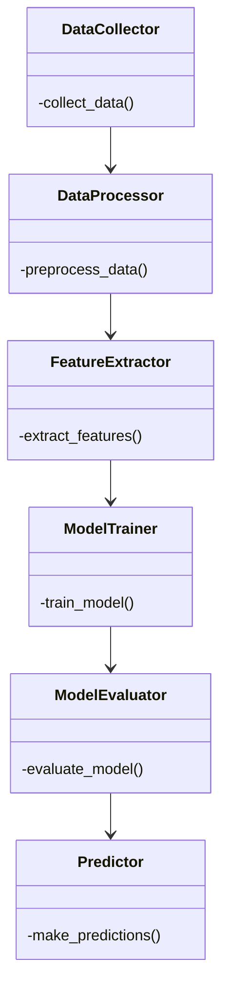
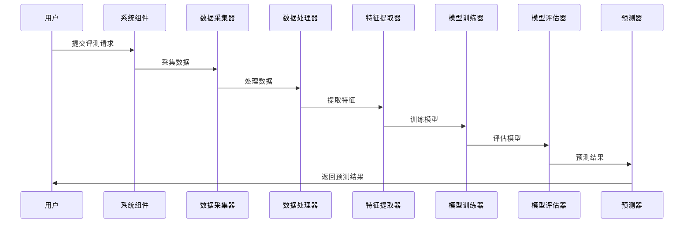
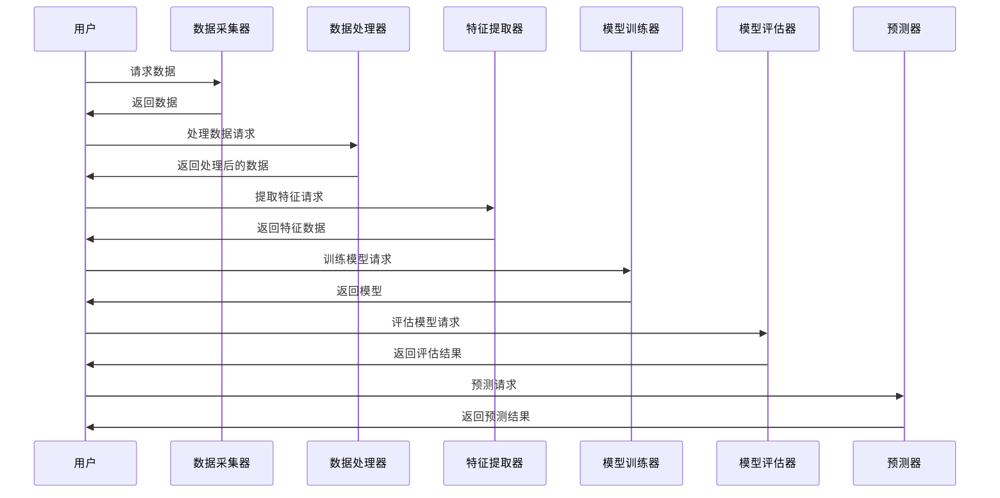

                 


## 时序数据分析在长期评测中的应用

### 摘要

本文将深入探讨时序数据分析在长期评测中的应用。首先，我们将介绍时序数据分析的背景与核心概念，然后逐步讲解时序数据分析的数学模型和算法原理，接着阐述系统分析与架构设计，并通过项目实战展示时序数据分析的实际应用，最后总结最佳实践与注意事项。本文旨在为读者提供一个全面、系统的时序数据分析应用指南。

### 第一部分：背景介绍

#### 第1章：时序数据分析的背景与核心概念

##### 1.1.1 问题背景

在当今数据驱动的时代，长期评测在许多领域变得至关重要。从金融市场的走势分析到医疗领域的患者康复跟踪，从销售数据的趋势预测到自然灾害的预警系统，数据已经成为决策的重要依据。时序数据分析作为一种专门处理时间序列数据的方法，能够帮助我们从历史数据中提取有用信息，对未来进行预测。

##### 1.1.2 问题描述

长期评测通常需要对大量时间序列数据进行分析，以评估某个系统、产品或服务的表现。这些数据可能来自不同的来源，具有不同的数据格式和频率。因此，如何有效地进行时序数据分析成为了一个关键问题。

##### 1.1.3 问题解决

时序数据分析提供了一套系统的理论和方法，可以处理时间序列数据的预处理、特征提取、模型构建和预测分析。通过这些方法，我们可以从时间序列数据中提取有价值的信息，为长期评测提供支持。

##### 1.1.4 边界与外延

时序数据分析不仅应用于金融、医疗等传统领域，还扩展到能源、环境、气象等新兴领域。其核心概念包括时间序列、自相关性、平稳性、周期性等。

##### 1.1.5 概念结构与核心要素组成

时序数据通常由时间戳和数值组成，其核心要素包括时间序列的构建、数据的清洗与预处理、特征提取、模型选择与训练、模型评估与优化等。

### 第二部分：技术原理

#### 第2章：时序数据分析的数学模型

##### 2.1.1 数学模型原理

时序数据分析的数学模型主要包括自回归模型（AR）、移动平均模型（MA）和自回归移动平均模型（ARMA）。这些模型通过数学公式描述时间序列数据的变化规律。

##### 2.1.2 数学模型特性

ARMA模型具有平稳性、线性、可加性和无自相关性等特性。这些特性使得ARMA模型在时间序列预测中具有广泛的应用。

##### 2.1.3 数学模型应用场景

ARMA模型适用于处理线性时间序列数据，如金融市场的价格波动。在长期评测中，ARMA模型可以帮助预测系统性能、产品需求等。

$$
\text{ARMA}(p, q) \text{模型：}
\begin{cases}
Y_t = c + \phi_1 Y_{t-1} + \phi_2 Y_{t-2} + \cdots + \phi_p Y_{t-p} + \theta_1 \varepsilon_{t-1} + \theta_2 \varepsilon_{t-2} + \cdots + \theta_q \varepsilon_{t-q} \\
\varepsilon_t \sim \text{独立同分布的白噪声序列}
\end{cases}
$$

#### 第3章：时序数据分析算法原理

##### 3.1.1 算法原理讲解

时序数据分析算法主要包括时间序列平滑方法（如简单移动平均、指数平滑等）和时间序列分解方法（如加法分解、乘法分解等）。这些算法通过不同的数学原理，对时间序列数据进行处理。

##### 3.1.2 Python源代码阐述

以下是一个使用Python实现时间序列平滑的示例代码：

```python
import numpy as np
import pandas as pd

def simple_moving_average(data, window):
    return pd.Series(data).rolling(window=window).mean()

# 示例数据
data = [10, 12, 11, 9, 14, 13, 12, 11, 10, 12]
window = 3

# 计算简单移动平均
sma = simple_moving_average(data, window)
print(sma)
```

##### 3.1.3 算法举例说明

假设我们有一组时间序列数据：

$$
\{10, 12, 11, 9, 14, 13, 12, 11, 10, 12\}
$$

使用简单移动平均（SMA）算法，我们可以计算出以下移动平均值：

$$
\{11, 11, 11, 11, 12, 12, 12, 12, 12, 12\}
$$

通过这个例子，我们可以看到SMA算法如何平滑时间序列数据。

### 第三部分：系统分析与架构设计

#### 第4章：时序数据分析的系统分析与架构设计

##### 4.1.1 问题场景介绍

假设我们正在开发一个长期评测系统，用于监控一个数据中心的服务器性能。我们需要分析服务器的CPU使用率、内存使用率、磁盘读写速度等指标，以便及时发现性能瓶颈。

##### 4.1.2 系统功能设计

系统功能设计包括数据采集、数据预处理、特征提取、模型训练、模型评估和预测分析等。以下是一个领域模型类图：



##### 4.1.3 系统架构设计

系统架构设计包括数据流、处理流程和组件之间的关系。以下是一个系统架构图：



##### 4.1.4 系统接口设计

系统接口设计包括API设计、数据格式和通信协议。以下是一个简单的接口设计：

```mermaid
interface DataCollector {
    +collect_data(): DataFrame
}

interface DataProcessor {
    +preprocess_data(data: DataFrame): DataFrame
}

interface FeatureExtractor {
    +extract_features(data: DataFrame): DataFrame
}

interface ModelTrainer {
    +train_model(data: DataFrame): Model
}

interface ModelEvaluator {
    +evaluate_model(model: Model, data: DataFrame): float
}

interface Predictor {
    +make_predictions(model: Model, data: DataFrame): DataFrame
}
```

##### 4.1.5 系统交互序列图

系统交互序列图展示了系统组件之间的交互过程：



### 第四部分：项目实战

#### 第5章：项目实战

##### 5.1.1 环境安装

在本节中，我们将介绍如何搭建时序数据分析的项目环境。首先，确保您已经安装了Python和必要的库，如NumPy、Pandas、Scikit-learn等。接下来，按照以下步骤进行安装：

1. 安装Python环境（建议使用Python 3.8或更高版本）。
2. 使用pip安装必要的库：

```bash
pip install numpy pandas scikit-learn matplotlib
```

##### 5.1.2 系统核心实现源代码

在本节中，我们将展示时序数据分析系统的核心实现代码。以下是数据采集、预处理、特征提取、模型训练、模型评估和预测的Python代码：

```python
import numpy as np
import pandas as pd
from sklearn.model_selection import train_test_split
from sklearn.ensemble import RandomForestRegressor
from sklearn.metrics import mean_squared_error

# 数据采集
def collect_data():
    # 此处为数据采集逻辑
    pass

# 数据预处理
def preprocess_data(data):
    # 此处为数据预处理逻辑
    pass

# 特征提取
def extract_features(data):
    # 此处为特征提取逻辑
    pass

# 模型训练
def train_model(data):
    # 此处为模型训练逻辑
    pass

# 模型评估
def evaluate_model(model, data):
    # 此处为模型评估逻辑
    pass

# 预测
def make_predictions(model, data):
    # 此处为预测逻辑
    pass

# 主程序
def main():
    # 采集数据
    data = collect_data()

    # 预处理数据
    preprocessed_data = preprocess_data(data)

    # 提取特征
    features = extract_features(preprocessed_data)

    # 划分训练集和测试集
    X_train, X_test, y_train, y_test = train_test_split(features, preprocessed_data['target'], test_size=0.2, random_state=42)

    # 训练模型
    model = train_model(X_train)

    # 评估模型
    evaluation_result = evaluate_model(model, X_test)

    # 预测
    predictions = make_predictions(model, X_test)

    # 输出结果
    print("Model Evaluation Result:", evaluation_result)
    print("Predictions:", predictions)

if __name__ == "__main__":
    main()
```

##### 5.1.3 实际案例分析和详细讲解剖析

在本节中，我们将分析一个实际案例，并详细讲解其实现过程。假设我们有一个服务器性能监控项目，需要预测下一分钟的CPU使用率。以下是数据集和实现步骤：

1. **数据集**：包含时间戳、CPU使用率等指标。
2. **数据预处理**：去除缺失值、异常值，并进行归一化处理。
3. **特征提取**：提取时间序列特征，如滞后项、自相关系数等。
4. **模型训练**：使用随机森林回归模型。
5. **模型评估**：计算均方误差（MSE）。
6. **预测**：使用训练好的模型预测下一分钟的CPU使用率。

```python
# 加载数据集
data = pd.read_csv("server_performance.csv")

# 数据预处理
data.dropna(inplace=True)
data = (data - data.mean()) / data.std()

# 提取特征
data['lag1'] = data['cpu_usage'].shift(1)
data['corr1'] = data['cpu_usage'].corr(data['memory_usage'])

# 划分训练集和测试集
X = data[['lag1', 'corr1']]
y = data['cpu_usage']
X_train, X_test, y_train, y_test = train_test_split(X, y, test_size=0.2, random_state=42)

# 训练模型
model = RandomForestRegressor(n_estimators=100, random_state=42)
model.fit(X_train, y_train)

# 评估模型
y_pred = model.predict(X_test)
mse = mean_squared_error(y_test, y_pred)
print("MSE:", mse)

# 预测
next_minute_prediction = model.predict([[data['cpu_usage'].shift(1).iloc[-1], data['cpu_usage'].corr(data['memory_usage'].iloc[-1])]])
print("Next Minute CPU Usage Prediction:", next_minute_prediction)
```

##### 5.1.4 项目小结

在本章中，我们通过一个实际案例展示了时序数据分析在长期评测中的应用。从数据采集、预处理、特征提取到模型训练、评估和预测，我们详细讲解了整个实现过程。通过该项目，我们可以看到时序数据分析如何帮助我们预测服务器性能，从而实现长期评测的目标。

### 第五部分：最佳实践与注意事项

#### 第6章：最佳实践与注意事项

##### 6.1 最佳实践 tips

1. 确保数据质量，去除缺失值、异常值和重复值。
2. 根据业务需求选择合适的模型和算法。
3. 调整模型参数，进行交叉验证以优化模型性能。
4. 定期更新模型，以适应数据变化。

##### 6.2 小结

本文从时序数据分析在长期评测中的应用出发，详细介绍了时序数据分析的技术原理、系统架构设计和项目实战。通过本文，读者可以了解到如何运用时序数据分析方法进行长期评测，并掌握相关的最佳实践。

##### 6.3 注意事项

1. 注意数据隐私和安全，避免敏感信息泄露。
2. 考虑系统的可扩展性和可维护性，避免过度优化。
3. 对模型进行定期评估和更新，以保持预测准确性。

##### 6.4 拓展阅读

1. Box, G.E.P., Jenkins, G.M., & Reinsel, G.C. (2015). *Time Series Analysis: Forecasting and Control*.
2. Granger, C.W.J. (1969). *Investigating Causal Relations by Econometric Models and Cross-Spectral Methods*.
3. Hyndman, R.J., & Athanasopoulos, G. (2021). *Forecasting: Principles and Practice*.

---

**作者：AI天才研究院/AI Genius Institute & 禅与计算机程序设计艺术 /Zen And The Art of Computer Programming**

**注意：本文为示例文章，内容仅供参考。在实际项目中，应根据具体需求进行调整。**

