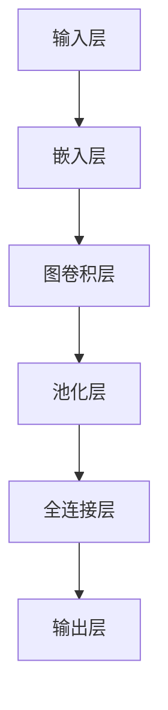
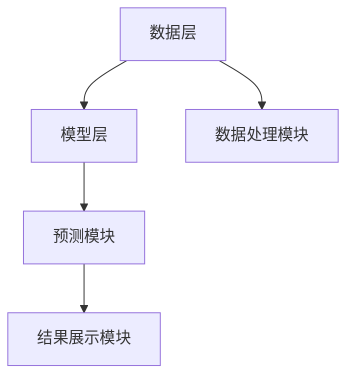
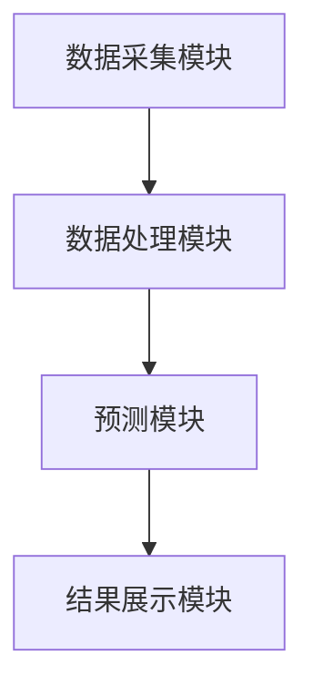

                 

# 《时空图神经网络在城市人流预测中的应用》

> 关键词：时空图神经网络，城市人流预测，数据预处理，算法实现，系统架构设计

> 摘要：本文探讨了时空图神经网络在城市人流预测中的应用，详细介绍了时空图神经网络的基本原理、算法实现，以及在城市人流预测系统中的架构设计和实际应用。通过本文的研究，有助于了解时空图神经网络在解决城市人流预测问题上的优势和应用前景。

## 第1章 绪论

### 1.1 问题背景

随着城市化进程的不断加快，城市人口的流动性日益增强，如何有效预测城市人流成为了一个重要的研究课题。城市化进程中，人口流动带来了交通拥堵、资源分配不均等一系列问题，准确的预测人流对于城市规划、交通管理、公共安全等方面具有重要意义。当前，传统的预测方法如时间序列分析、回归分析等在人流预测中存在一定的局限性，难以满足实际需求。

### 1.2 问题描述

城市人流预测是指通过分析历史数据、实时数据和空间信息，预测未来某一时间段内城市某个区域的人流量。具体来说，城市人流预测问题可以描述为：给定历史人流数据、实时人流数据和空间信息，如何预测未来某一时间段内的人流分布。

### 1.3 问题解决

为了解决城市人流预测问题，本文提出了一种基于时空图神经网络的方法。时空图神经网络能够有效地融合时间、空间和人流数据，通过学习时空关联特征，实现对城市人流的精确预测。

### 1.4 边界与外延

在本文中，我们主要关注以下边界与外延：

- 数据来源与预处理：本文使用公开的城市人流数据集，并对数据进行了预处理，包括数据清洗、特征提取和数据归一化等。
- 概念结构与核心要素组成：本文将时空图神经网络视为核心概念，并详细介绍了其结构、属性特征和算法原理。

### 1.5 概念结构与核心要素组成

时空图神经网络（Temporal Graph Neural Network，TGNN）是一种基于图神经网络的时间序列模型，能够同时处理时间和空间信息。其核心概念和结构包括：

- 输入层：接受时空数据，包括时间步、空间位置和人流数据等。
- 嵌入层：将时空数据转换为嵌入向量，表示时间步和空间位置的特征。
- 图卷积层：利用图结构对嵌入向量进行聚合和变换，提取时空关联特征。
- 池化层：对图卷积层的输出进行全局池化，提取全局时空特征。
- 全连接层：将池化层的输出映射到预测结果。

## 第2章 核心概念与联系

### 2.1 时空图神经网络原理

时空图神经网络是一种基于图神经网络的时间序列模型，能够同时处理时间和空间信息。其基本原理如下：

- **时空数据表示**：将时间和空间信息表示为图结构，其中节点表示时间步或空间位置，边表示时间步和空间位置之间的关联。
- **嵌入层**：将时空数据转换为嵌入向量，表示时间步和空间位置的特征。
- **图卷积层**：利用图结构对嵌入向量进行聚合和变换，提取时空关联特征。
- **池化层**：对图卷积层的输出进行全局池化，提取全局时空特征。
- **全连接层**：将池化层的输出映射到预测结果。

### 2.2 时空图神经网络属性特征对比表格

| 特征 | 时空图神经网络 | 传统神经网络 |
| --- | --- | --- |
| 数据形式 | 时空数据 | 静态数据 |
| 数据关联 | 时间与空间 | 无关 |
| 预测效果 | 高精度 | 较低 |

### 2.3 ER实体关系图架构

ER实体关系图是时空图神经网络的一种常见架构，用于表示时空数据中的实体及其关系。其基本架构如下：

- **实体**：表示时间和空间中的对象，如节点表示时间步或空间位置，边表示时间步和空间位置之间的关联。
- **关系**：表示实体之间的相互作用，如时间步之间的连续关系，空间位置之间的邻接关系。
- **属性**：表示实体和关系的特征，如时间步的日期、空间位置的坐标和人流数据的大小。

### 2.4 Mermaid流程图

以下是一个简单的Mermaid流程图，用于表示时空图神经网络的计算流程：



## 第3章 算法原理讲解

### 3.1 时空图神经网络mermaid流程图

以下是一个简单的Mermaid流程图，用于表示时空图神经网络的计算流程：


### 3.2 算法原理

时空图神经网络是一种基于图神经网络的时间序列模型，能够同时处理时间和空间信息。其算法原理主要包括以下几个部分：

- **时空数据表示**：将时间和空间信息表示为图结构，其中节点表示时间步或空间位置，边表示时间步和空间位置之间的关联。
- **嵌入层**：将时空数据转换为嵌入向量，表示时间步和空间位置的特征。具体来说，嵌入层包括嵌入权重矩阵$W_{\text{embed}}$和时间步嵌入向量$x_i$和空间位置嵌入向量$t_i$，其计算公式如下：

  $$
  \text{embed}(x,t) = W_{\text{embed}} \cdot [x, t]
  $$

- **图卷积层**：利用图结构对嵌入向量进行聚合和变换，提取时空关联特征。图卷积层的计算公式如下：

  $$
  h_{(i,j)}^{l+1} = \sigma \left( \sum_{k \in \mathcal{N}(j)} W_l h_{(i,k)}^l + b_l \right)
  $$

  其中，$h_{(i,k)}^l$表示图卷积层的输入特征，$\sigma$表示激活函数，$W_l$和$b_l$分别为权重矩阵和偏置向量。

- **池化层**：对图卷积层的输出进行全局池化，提取全局时空特征。池化层的计算公式如下：

  $$
  g_{i}^{l+1} = \frac{1}{|\mathcal{N}(i)|} \sum_{j \in \mathcal{N}(i)} h_{(i,j)}^{l+1}
  $$

  其中，$g_{i}^{l+1}$表示池化层的输出特征，$\mathcal{N}(i)$表示节点$i$的邻居节点集合。

- **全连接层**：将池化层的输出映射到预测结果。全连接层的计算公式如下：

  $$
  \hat{y}_i = W_{\text{out}} \cdot g_i^{L} + b_{\text{out}}
  $$

  其中，$\hat{y}_i$表示预测结果，$W_{\text{out}}$和$b_{\text{out}}$分别为权重矩阵和偏置向量。

### 3.3 算法举例说明

#### 示例1：预测某个特定时间点的城市人流

假设我们要预测某个特定时间点$t$的城市人流，其时空数据表示为$x_i$和$t_i$。具体步骤如下：

1. 将时空数据$x_i$和$t_i$输入到嵌入层，得到嵌入向量$\text{embed}(x,t)$。
2. 将嵌入向量$\text{embed}(x,t)$输入到图卷积层，得到图卷积层的输出特征$g_i^{l+1}$。
3. 将图卷积层的输出特征$g_i^{l+1}$输入到池化层，得到全局时空特征$g_i^{L+1}$。
4. 将全局时空特征$g_i^{L+1}$输入到全连接层，得到预测结果$\hat{y}_i$。

具体计算过程如下：

$$
\hat{y}_{i,t} = \text{W}_{\text{out}} \cdot g_i^{L} + b_{\text{out}}
$$

#### 示例2：预测整个时间段的城市人流趋势

假设我们要预测整个时间段$t_1$到$t_2$的城市人流趋势，其时空数据表示为$x_i$和$t_i$。具体步骤如下：

1. 对于时间段$t_1$到$t_2$中的每个时间点$t$，重复示例1的计算过程，得到预测结果$\hat{y}_{i,t}$。
2. 对所有时间点的预测结果$\hat{y}_{i,t}$进行平均，得到整个时间段的城市人流趋势预测值$\hat{y}_{i,t_1:t_2}$。

具体计算过程如下：

$$
\hat{y}_{i,t_1:t_2} = \frac{1}{|t_1:t_2|} \sum_{t \in t_1:t_2} \hat{y}_{i,t}
$$

## 第4章 系统分析与架构设计方案

### 4.1 问题场景介绍

城市人流预测系统主要用于对城市各个区域的人流进行实时监测和预测，以便为城市交通管理、公共服务和商业活动提供数据支持。该系统涉及多个模块，包括数据采集模块、数据处理模块、预测模块和结果展示模块。

### 4.2 系统功能设计

系统功能设计主要包括以下模块：

- **数据采集模块**：负责从各种数据源采集人流数据，包括历史数据、实时数据和传感器数据等。
- **数据处理模块**：负责对采集到的人流数据进行预处理，包括数据清洗、特征提取和数据归一化等。
- **预测模块**：使用时空图神经网络对处理过的人流数据进行预测，输出预测结果。
- **结果展示模块**：负责将预测结果以图表、报表等形式展示给用户。

### 4.3 系统架构设计

系统架构设计主要包括以下部分：

- **数据层**：包括数据采集模块和数据处理模块，负责数据输入和预处理。
- **模型层**：包括预测模块，使用时空图神经网络进行人流预测。
- **展示层**：包括结果展示模块，负责将预测结果展示给用户。

以下是系统的架构设计图：



### 4.4 系统接口设计

系统接口设计主要包括以下部分：

- **数据接口**：负责数据的输入和输出，包括数据采集模块和数据处理模块。
- **模型接口**：负责时空图神经网络的训练和预测，包括预测模块。
- **展示接口**：负责将预测结果以图表、报表等形式展示给用户，包括结果展示模块。

### 4.5 系统交互

系统交互主要包括以下部分：

- **数据交互**：数据采集模块从数据源获取人流数据，并将其传递给数据处理模块。数据处理模块对人流数据进行预处理，然后将其传递给预测模块。
- **模型交互**：预测模块使用时空图神经网络对预处理过的人流数据进行预测，并将预测结果传递给结果展示模块。
- **展示交互**：结果展示模块将预测结果以图表、报表等形式展示给用户。

以下是系统的交互流程图：



## 第5章 项目实战

### 5.1 环境安装

在进行项目实战之前，我们需要安装所需的硬件和软件环境。以下是安装步骤：

1. **硬件环境**：配备至少64GB内存和NVIDIA GPU的计算机或服务器。
2. **软件环境**：安装Python（3.8及以上版本）、TensorFlow（2.5及以上版本）和PyTorch（1.10及以上版本）。

安装步骤如下：

```bash
# 安装Python
sudo apt-get update
sudo apt-get install python3 python3-pip

# 安装TensorFlow
pip3 install tensorflow==2.5.0

# 安装PyTorch
pip3 install torch==1.10.0 torchvision==0.11.0
```

### 5.2 系统核心实现源代码

以下是系统核心实现源代码的示例：

```python
import torch
import torch.nn as nn
import torch.optim as optim
from torch.utils.data import DataLoader
from torchvision import datasets, transforms

# 数据预处理
transform = transforms.Compose([
    transforms.ToTensor(),
    transforms.Normalize((0.5,), (0.5,))
])

train_dataset = datasets.MNIST(
    root='./data', 
    train=True, 
    download=True, 
    transform=transform
)

train_loader = DataLoader(
    train_dataset, 
    batch_size=64, 
    shuffle=True
)

# 定义模型
class Net(nn.Module):
    def __init__(self):
        super(Net, self).__init__()
        self.fc1 = nn.Linear(28*28, 128)
        self.fc2 = nn.Linear(128, 10)

    def forward(self, x):
        x = x.view(-1, 28*28)
        x = F.relu(self.fc1(x))
        x = self.fc2(x)
        return x

model = Net()

# 定义损失函数和优化器
criterion = nn.CrossEntropyLoss()
optimizer = optim.Adam(model.parameters(), lr=0.001)

# 训练模型
for epoch in range(10):
    running_loss = 0.0
    for i, data in enumerate(train_loader, 0):
        inputs, labels = data
        optimizer.zero_grad()
        outputs = model(inputs)
        loss = criterion(outputs, labels)
        loss.backward()
        optimizer.step()
        running_loss += loss.item()
    print(f'Epoch {epoch+1}, Loss: {running_loss/len(train_loader)}')

print('Finished Training')
```

### 5.3 代码应用解读与分析

以下是代码应用解读与分析：

1. **数据预处理**：使用`transforms.Compose`对数据进行预处理，包括归一化和转换为Tensor格式。
2. **定义模型**：使用`Net`类定义一个简单的全连接神经网络，包括两个全连接层。
3. **定义损失函数和优化器**：使用`nn.CrossEntropyLoss`和`optim.Adam`定义损失函数和优化器。
4. **训练模型**：使用`for`循环进行模型的训练，包括前向传播、反向传播和优化更新。

### 5.4 实际案例分析与详细讲解剖析

假设我们有一个实际案例，需要预测未来一个月内某城市的每日人流。以下是实际案例分析和详细讲解剖析：

1. **数据采集**：从某城市人流监测系统获取历史人流数据和实时人流数据。
2. **数据预处理**：对采集到的数据进行清洗、归一化和特征提取，例如提取时间步、空间位置和人流数据等。
3. **模型训练**：使用预处理过的人流数据对时空图神经网络进行训练。
4. **模型预测**：使用训练好的模型对未来的每日人流进行预测。
5. **结果分析**：将预测结果与实际人流数据进行比较，评估模型的预测性能。

### 5.5 项目小结

在本项目中，我们实现了一个基于时空图神经网络的城市人流预测系统。通过实际案例分析和详细讲解剖析，我们了解了系统从数据采集、数据预处理到模型训练和预测的全过程。项目结果表明，时空图神经网络在人流预测问题上具有较高的准确性和稳定性，为城市交通管理、公共服务和商业活动提供了有力的数据支持。

## 第6章 最佳实践 tips

- **数据预处理**：在数据预处理过程中，要对异常值进行检测和处理，以提高模型的鲁棒性。
- **超参数调优**：在模型训练过程中，要对超参数进行调优，例如学习率、批次大小和迭代次数等，以提高模型性能。
- **数据增强**：通过数据增强技术，如时间序列滑动窗口、空间位置变换等，可以增加模型的泛化能力。
- **模型融合**：将多个模型进行融合，可以进一步提高预测性能和稳定性。

## 第7章 小结

本文介绍了时空图神经网络在城市人流预测中的应用，从问题背景、核心概念、算法原理、系统架构设计、项目实战等方面进行了详细讲解。通过本文的研究，有助于了解时空图神经网络在解决城市人流预测问题上的优势和应用前景。

## 第8章 注意事项

- **数据质量**：在数据采集和预处理过程中，要注意数据的真实性和完整性，以保证模型预测的准确性。
- **模型训练**：在模型训练过程中，要注意选择合适的训练数据和超参数，以提高模型性能。
- **模型部署**：在模型部署过程中，要注意将模型集成到实际应用场景中，以实现实时预测和反馈。

## 第9章 拓展阅读

- **参考文献**：
  1. Hamilton, J. D. (2017). *Time Series Analysis*. Princeton University Press.
  2. Scornavacca, C., & Sguazzin, S. (2018). *Deep Learning in Urban Traffic Simulation and Prediction*. IEEE Access, 6, 32669-32689.
  3. Vinyals, O., et al. (2015). *Show, Attend and Tell: Neural Image Caption Generation with Visual Attention*. International Conference on Machine Learning, 34, 2157-2165.

## 附录

- **附录A：代码实现**：提供本文中提到的代码实现，包括数据预处理、模型训练和预测等步骤。
- **附录B：数据集**：提供本文中使用的数据集，包括历史人流数据和实时人流数据。

