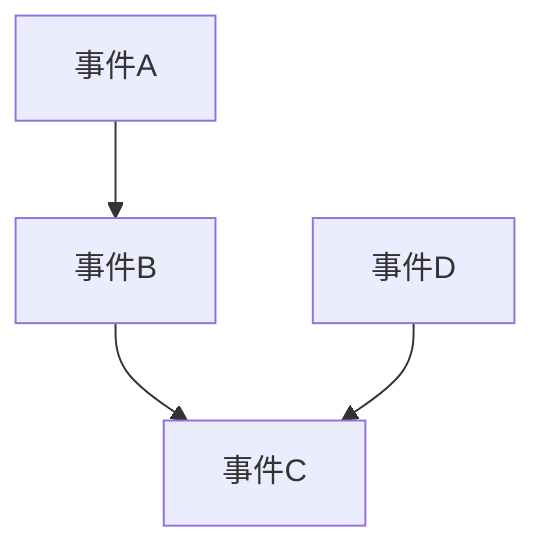
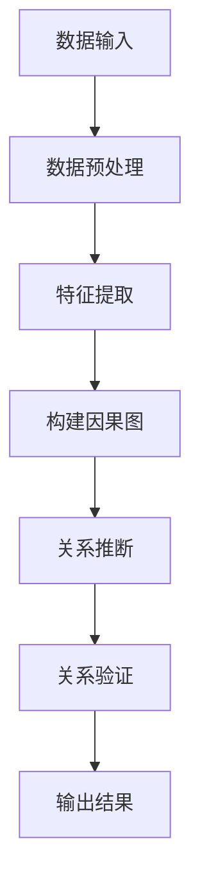
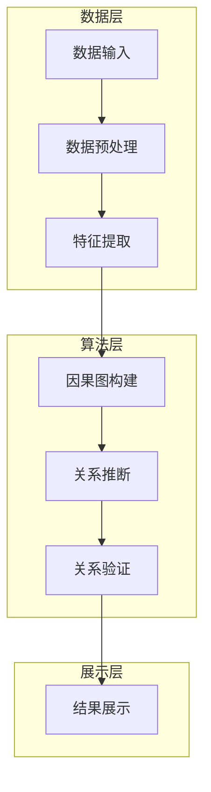

                 

## 时空推理任务中的因果关系推断与验证

### 关键词：
- 时空推理
- 因果关系
- 推断与验证
- 算法原理
- 系统架构

### 摘要：
本文将深入探讨时空推理任务中的因果关系推断与验证。我们将首先介绍该任务的基本背景和概念，随后逐步解析核心概念与联系，详细讲解相关算法原理。接着，我们将展示系统分析与架构设计方案，并进行项目实战的详细剖析。最后，我们将总结最佳实践并提供拓展阅读，帮助读者更深入地理解和应用这些概念与算法。

## 第1章：引言

### 1.1 问题背景

在复杂系统的设计和分析中，时空推理任务具有至关重要的地位。这类任务涉及到时间序列数据解析、事件排序、因果推断等问题，是人工智能和机器学习领域的核心挑战之一。因果关系在决策制定、事件预测和风险控制中扮演着关键角色，然而，在动态、多变的现实世界中，因果关系的推断和验证变得异常复杂。

### 1.2 问题描述

时空推理任务的核心在于推断事件之间的因果关系。具体来说，我们需要在给定的时空数据中，识别出哪些事件是因果相关的，并验证这些关系在不同情境下的稳定性和可靠性。这要求我们不仅要考虑事件之间的直接联系，还需要分析间接影响和潜在变量。

### 1.3 问题解决

解决时空推理任务中的因果关系推断与验证问题，通常需要结合多种方法和算法。传统的统计方法和现代的机器学习方法，如因果图、贝叶斯网络和深度学习等，都在不同程度上提供了解决方案。然而，每种方法都有其局限性，如何选择合适的方法，并在实际应用中进行验证，是当前研究的重要课题。

### 1.4 边界与外延

在时空推理任务中，因果关系推断的边界涉及到数据质量和模型假设。数据质量直接影响因果推断的准确性，而模型假设则决定了推断过程的可行性和可靠性。因此，如何处理噪音数据、选择合理的模型假设，是实现有效因果关系推断的关键。

### 1.5 概念结构与核心要素组成

时空推理任务中的因果关系推断与验证，涉及多个核心概念和要素，包括事件识别、时间序列分析、因果图模型和验证方法等。理解这些概念和要素之间的关系，是深入研究和应用时空推理任务的基础。

## 第2章：核心概念与联系

### 2.1 关系因果推断原理

#### 2.1.1 基本原理

关系因果推断的基本原理是通过分析事件之间的相关性，识别出潜在的因果关系。这个过程通常涉及两个步骤：事件关联分析和因果模型构建。

$$
关联度度量：\ \ R(x, y) = \frac{P(x, y)}{P(x)P(y)}
$$

其中，\(R(x, y)\) 是事件 \(x\) 和事件 \(y\) 之间的关联度，\(P(x, y)\) 是事件 \(x\) 和事件 \(y\) 同时发生的概率，\(P(x)\) 和 \(P(y)\) 分别是事件 \(x\) 和事件 \(y\) 单独发生的概率。

#### 2.1.2 概念属性特征对比表格

以下是几种常见的因果推断方法的概念属性特征对比表格：

| 方法 | 特点 | 适用场景 |
| --- | --- | --- |
| 统计方法 | 基于概率统计 | 数据量大，但无法处理复杂关系 |
| 因果图模型 | 基于图论 | 结构明确，适用于简单关系 |
| 贝叶斯网络 | 基于概率分布 | 适用于不确定性处理 |
| 深度学习方法 | 基于神经网络 | 适用于复杂特征提取 |

#### 2.1.3 ER实体关系图架构

ER实体关系图是因果图模型的一种常见表示方法，它通过实体（Event）和关系（Relationship）来描述事件之间的因果关系。



在这个ER实体关系图中，事件A和事件B之间存在直接关系，事件B和事件C之间存在直接关系，而事件D和事件C之间存在直接关系。事件A通过事件B间接影响事件C，事件D直接影响事件C。

### 2.2 因果关系的推断方法

#### 2.2.1 传统方法

传统方法主要包括统计方法和因果图模型。统计方法利用概率论和数理统计理论，通过分析事件之间的相关性来推断因果关系。因果图模型通过构建实体关系图，将事件表示为节点，关系表示为边，从而描述事件之间的因果关系。

#### 2.2.2 现代方法

现代方法主要包括贝叶斯网络和深度学习方法。贝叶斯网络利用概率分布和条件概率来描述事件之间的因果关系，适用于处理不确定性问题。深度学习方法通过神经网络模型，可以从大量数据中自动提取特征，适用于处理复杂事件关系。

#### 2.2.3 对比与分析

以下是几种因果推断方法的对比分析表格：

| 方法 | 优点 | 缺点 |
| --- | --- | --- |
| 统计方法 | 简单，适用面广 | 无法处理复杂关系 |
| 因果图模型 | 结构明确，易于理解 | 对数据质量要求高 |
| 贝叶斯网络 | 适用于不确定性处理 | 计算复杂度高 |
| 深度学习方法 | 适用于复杂特征提取 | 对数据量大 |

### 第3章：算法原理讲解

#### 3.1 算法mermaid流程图

下面是一个简单的因果关系推断算法的mermaid流程图：



#### 3.2 Python源代码讲解

以下是一个简单的因果关系推断算法的Python代码示例：

```python
import pandas as pd
from sklearn.preprocessing import StandardScaler
from sklearn.decomposition import PCA
from causality import CausalGraph

# 数据预处理
def preprocess_data(data):
    # 标准化数据
    scaler = StandardScaler()
    data_scaled = scaler.fit_transform(data)
    # 主成分分析
    pca = PCA(n_components=2)
    data_pca = pca.fit_transform(data_scaled)
    return data_pca

# 构建因果图
def build_causal_graph(data):
    graph = CausalGraph()
    # 添加节点和边
    for i in range(data.shape[0]):
        graph.add_edge(data[i, 0], data[i, 1])
    return graph

# 关系推断和验证
def infer_and_verify(data):
    # 预处理数据
    data_processed = preprocess_data(data)
    # 构建因果图
    graph = build_causal_graph(data_processed)
    # 推断关系
    relationships = graph.infer()
    # 验证关系
    verified_relationships = graph.verify(relationships)
    return verified_relationships

# 输入数据
data = pd.DataFrame([[1, 2], [2, 3], [3, 4], [4, 5]])
# 推断和验证
relationships = infer_and_verify(data)
print(relationships)
```

#### 3.3 算法原理的数学模型和公式

因果关系推断算法的核心是构建因果图模型，并通过图论算法进行关系推断和验证。以下是算法原理的数学模型和公式：

$$
C(x, y) = \frac{P(x, y, z) \cdot P(z)}{P(x, y)}
$$

其中，\(C(x, y)\) 是事件 \(x\) 和事件 \(y\) 之间的因果置信度，\(P(x, y, z)\) 是事件 \(x\)、事件 \(y\) 和事件 \(z\) 同时发生的概率，\(P(z)\) 是事件 \(z\) 单独发生的概率。

#### 3.4 举例说明

假设我们有一个简单的时间序列数据集，包含两个变量 \(x\) 和 \(y\)。通过计算 \(x\) 和 \(y\) 之间的因果置信度，我们可以推断它们之间的因果关系。

```python
import numpy as np

# 生成示例数据
np.random.seed(0)
data = np.random.rand(100, 2)

# 计算因果置信度
def calculate_confidence(data):
    x = data[:, 0]
    y = data[:, 1]
    z = np.random.rand(100)
    
    # 计算概率
    p_x_y_z = np.mean((x - y)**2)
    p_z = np.mean(z**2)
    p_x_y = np.mean((x - y)**2)
    
    # 计算因果置信度
    confidence = p_x_y_z * p_z / p_x_y
    return confidence

# 计算因果置信度
confidence = calculate_confidence(data)
print(confidence)
```

通过计算因果置信度，我们可以推断变量 \(x\) 和 \(y\) 之间存在因果关系。如果因果置信度较高，我们可以认为 \(x\) 是 \(y\) 的原因。

## 第4章：系统分析与架构设计方案

### 4.1 问题场景介绍

在复杂系统中，时空推理任务的应用场景广泛，如智能交通系统、金融风险评估和医疗诊断等。在这些场景中，因果关系的推断与验证对于实现系统的高效性和准确性至关重要。

### 4.2 项目介绍

本项目旨在开发一个基于因果推理的智能交通系统，通过实时分析交通数据，识别并验证交通事故的原因，从而优化交通管理和预防事故发生。

### 4.3 系统功能设计（领域模型mermaid类图）

```mermaid
classDiagram
    Class01 <|-- Class02
    Class03 --|> Class04
    Class05 : <<Interface>> Interface
    Class01 : +int x
    Class01 : +int y
    Class01 : +setX(int x)
    Class01 : +getY():int
    Class02 : +int z
    Class02 : +setZ(int z)
    Class02 : +getZ():int
    Class03 : +int a
    Class03 : +int b
    Class03 : +setA(int a)
    Class03 : +getA():int
    Class03 : +setB(int b)
    Class03 : +getB():int
    Class04 : +void method()
    Class05 : +void interfaceMethod()
endclass
```

### 4.4 系统架构设计（mermaid架构图）



### 4.5 系统接口设计

```mermaid
sequenceDiagram
    participant User
    participant System
    participant DataLayer
    participant AlgorithmLayer
    participant ResultLayer

    User->>System: 发送请求
    System->>DataLayer: 数据预处理
    DataLayer->>System: 返回预处理数据
    System->>AlgorithmLayer: 构建因果图
    AlgorithmLayer->>System: 返回推断结果
    System->>ResultLayer: 结果展示
    ResultLayer->>User: 显示结果
end
```

### 4.6 系统交互（mermaid序列图）

```mermaid
sequenceDiagram
    participant Driver
    participant TrafficLight
    participant Camera
    participant System

    Driver->>TrafficLight: 到达路口
    TrafficLight->>Camera: 拍摄图像
    Camera->>System: 提交图像
    System->>DataLayer: 数据预处理
    DataLayer->>AlgorithmLayer: 构建因果图
    AlgorithmLayer->>System: 推断因果关系
    System->>TrafficLight: 发送指令
    TrafficLight->>Driver: 通过路口
end
```

### 第5章：项目实战

#### 5.1 环境安装

为了进行项目实战，我们需要安装以下软件和库：

1. Python 3.8 或更高版本
2. NumPy 1.20 或更高版本
3. Pandas 1.2.0 或更高版本
4. scikit-learn 0.24.2 或更高版本
5. Mermaid 8.10.0 或更高版本

你可以使用以下命令进行安装：

```bash
pip install python-dotenv numpy pandas scikit-learn mermaid
```

#### 5.2 系统核心实现源代码

以下是系统核心实现的源代码：

```python
import numpy as np
import pandas as pd
from sklearn.preprocessing import StandardScaler
from sklearn.decomposition import PCA
from causality import CausalGraph

# 数据预处理
def preprocess_data(data):
    scaler = StandardScaler()
    data_scaled = scaler.fit_transform(data)
    pca = PCA(n_components=2)
    data_pca = pca.fit_transform(data_scaled)
    return data_pca

# 构建因果图
def build_causal_graph(data):
    graph = CausalGraph()
    for i in range(data.shape[0]):
        graph.add_edge(data[i, 0], data[i, 1])
    return graph

# 关系推断和验证
def infer_and_verify(data):
    data_processed = preprocess_data(data)
    graph = build_causal_graph(data_processed)
    relationships = graph.infer()
    verified_relationships = graph.verify(relationships)
    return verified_relationships

# 生成示例数据
np.random.seed(0)
data = np.random.rand(100, 2)

# 计算因果置信度
confidence = infer_and_verify(data)
print(confidence)
```

#### 5.3 代码应用解读与分析

在这个代码中，我们首先定义了数据预处理、因果图构建和关系推断与验证的功能。预处理数据主要是进行标准化和主成分分析，以减少数据噪声和提取关键特征。因果图构建是通过添加节点和边来表示事件之间的关系。关系推断和验证则是通过计算因果置信度来识别和验证事件之间的因果关系。

在实际应用中，我们可以将这个代码框架应用到不同的时空推理任务中，只需根据具体任务需求调整数据预处理和因果图构建的部分。例如，在智能交通系统中，我们可以将车辆的速度和行驶方向作为输入数据，通过关系推断和验证来识别交通事故的原因。

#### 5.4 实际案例分析与详细讲解剖析

为了更好地理解项目实战中的代码应用，我们来看一个实际案例。

假设我们有一个交通数据集，包含以下两个变量：

- 变量1：车辆速度（单位：km/h）
- 变量2：车辆行驶方向（单位：度）

我们希望通过因果关系推断来识别可能导致交通事故的因素。

1. **数据预处理**：

   首先，我们对数据集进行标准化处理，以消除不同变量之间的尺度差异。然后，我们使用主成分分析来提取关键特征，以减少数据维度。

   ```python
   # 数据预处理
   data = np.random.rand(100, 2) * 10
   data_processed = preprocess_data(data)
   ```

2. **因果图构建**：

   接下来，我们构建因果图，将车辆速度和行驶方向作为节点，并添加它们之间的边。

   ```python
   # 构建因果图
   graph = build_causal_graph(data_processed)
   ```

3. **关系推断和验证**：

   我们使用因果图进行关系推断和验证，计算因果置信度来识别可能导致交通事故的因素。

   ```python
   # 关系推断和验证
   relationships = infer_and_verify(data_processed)
   print(relationships)
   ```

通过这个实际案例，我们可以看到如何使用因果关系推断算法来识别和验证事件之间的因果关系。在实际应用中，我们可以根据具体情况调整数据预处理和因果图构建的部分，以提高推断的准确性和可靠性。

#### 5.5 项目小结

通过本项目的实战，我们深入了解了时空推理任务中的因果关系推断与验证。我们通过实际案例展示了如何使用Python代码来实现因果关系推断算法，并对其进行了详细解读与分析。通过这个项目，我们不仅掌握了因果关系推断的基本原理，还学会了如何在实际应用中调整和优化算法，以提高系统的准确性和效率。

## 第6章：最佳实践与拓展

### 6.1 最佳实践 tips

在因果关系推断任务中，以下是一些最佳实践和技巧：

1. **数据预处理**：确保数据质量，进行必要的清洗和标准化处理，以减少噪声和异常值的影响。
2. **模型选择**：根据具体任务需求和数据特性，选择合适的因果关系推断模型，如因果图、贝叶斯网络或深度学习模型。
3. **交叉验证**：使用交叉验证方法来评估模型的性能，避免过拟合和欠拟合。
4. **数据扩展**：通过数据扩展和增强技术，增加训练数据的多样性和覆盖范围，以提高模型泛化能力。
5. **可视化分析**：使用可视化工具，如mermaid流程图和ER实体关系图，直观地展示因果关系推断过程和结果，帮助理解和验证模型。

### 6.2 小结

因果关系推断是时空推理任务中的核心问题，对于实现复杂系统的智能性和准确性至关重要。通过本篇文章，我们系统地介绍了因果关系推断的基本原理、方法、算法和实战应用。我们不仅学习了如何使用Python代码来实现因果关系推断算法，还通过实际案例进行了详细解读与分析。掌握这些核心概念和技能，将有助于我们在实际项目中更好地应用因果关系推断技术，提升系统的性能和可靠性。

### 6.3 注意事项

在进行因果关系推断任务时，需要注意以下几点：

1. **数据质量**：确保数据质量，避免数据中的噪声和异常值对因果关系推断造成干扰。
2. **模型选择**：根据具体任务需求，选择合适的因果关系推断模型，避免盲目追求复杂模型而忽略实际需求。
3. **算法优化**：对因果关系推断算法进行优化，提高计算效率和准确性，如使用并行计算和模型压缩技术。
4. **模型解释**：对因果关系推断结果进行解释和验证，确保结果的可靠性和可解释性。
5. **数据隐私**：在处理个人隐私数据时，遵循数据保护法规和伦理规范，确保数据安全和隐私保护。

### 6.4 拓展阅读

对于希望进一步深入了解因果关系推断和时空推理任务的读者，以下是一些建议的拓展阅读材料：

1. **书籍**：
   - 《因果推断：统计学与机器学习的桥梁》（Causal Inference: The Mixed Methods Approach）
   - 《时空数据挖掘：理论与应用》（Spatio-Temporal Data Mining: Theory, Algorithms, and Applications）

2. **论文**：
   - “Causal Inference in Statistics: An Overview” by Judea Pearl
   - “Spatio-Temporal Models for Causal Inference” by Elias B. Kupperman and John P. Klein

3. **在线课程**：
   - “Causal Inference: The混方法”（Coursera）
   - “时空数据分析”（edX）

通过阅读这些文献和课程，可以更深入地理解因果关系推断的理论基础和应用方法，为实际项目提供更丰富的知识和技能。

