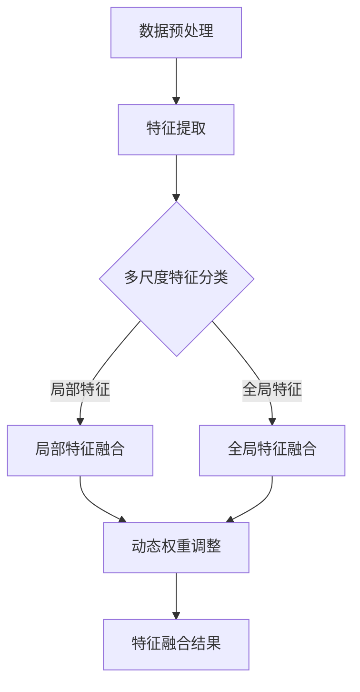
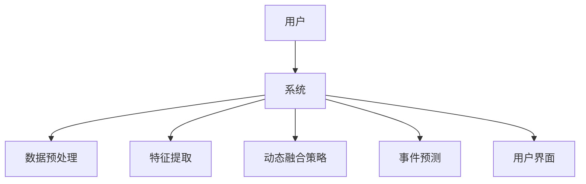
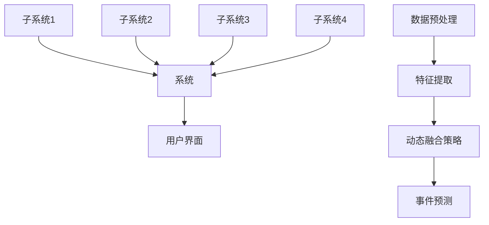
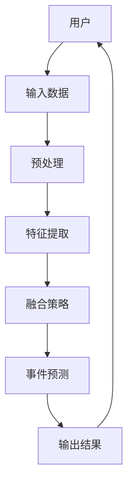

                 


# 时空推理任务中的多尺度特征动态融合策略

## 关键词
- 时空推理
- 多尺度特征
- 动态融合策略
- 算法设计
- 系统架构

## 摘要
本文深入探讨时空推理任务中的多尺度特征动态融合策略。首先，我们介绍了时空推理任务的背景及其重要性。接着，详细阐述了多尺度特征及其在时空推理中的应用。随后，我们提出了动态融合策略的核心概念，并通过具体的算法原理讲解和系统架构设计，展示了如何将这一策略应用于实际问题中。文章最后，通过实际案例分析和最佳实践总结，为读者提供了实用的指导和建议。

## 引言
### 时空推理任务概述
时空推理任务在许多领域中都有着广泛的应用，如自动驾驶、智能监控、环境监测和医疗诊断等。这类任务的核心在于理解和处理动态变化的时空数据，以实现事件预测、行为识别和场景理解等功能。

### 多尺度特征动态融合策略的作用
在时空推理任务中，数据通常包含多个时间尺度和空间尺度。多尺度特征动态融合策略能够有效地整合这些特征，从而提高任务的准确性和鲁棒性。该策略的关键在于如何根据任务需求动态调整不同尺度特征的权重，实现特征的有效融合。

## 核心概念与联系
### 多尺度特征
多尺度特征是指在不同时间尺度或空间尺度上提取的特征。例如，在视频监控中，可以提取局部特征（如人脸、车辆）和全局特征（如视频摘要、场景分类）。

#### 定义
多尺度特征是时空推理任务中用于描述和表示数据的不同层次信息的关键元素。

#### 属性特征对比表格
| 特征类型 | 属性特征 | 对比 |
| --- | --- | --- |
| 局部特征 | 描述特定区域的特征 | 精细度较高，但覆盖范围有限 |
| 全局特征 | 描述整个时空域的特征 | 覆盖范围广，但细节信息较少 |
| 动态特征 | 描述随时间变化的特征 | 可以反映事件的发生和发展过程 |
| 静态特征 | 描述在特定时间点上的特征 | 稳定性较高，但难以捕捉动态变化 |

### 动态融合策略
动态融合策略是一种通过实时调整不同尺度特征权重的方法，以实现最佳特征组合。

#### 定义
动态融合策略是一种在时空推理任务中，根据任务需求实时调整不同尺度特征权重的策略。

#### 类型
- 时间加权融合：根据时间序列的重要性调整权重。
- 空间加权融合：根据空间区域的重要性调整权重。
- 混合加权融合：结合时间和空间重要性进行调整。

### 时空推理与动态融合策略的关系
时空推理任务依赖于动态融合策略来整合不同尺度特征，从而提高任务性能。

#### 关系
- 动态融合策略为时空推理提供了特征整合的框架。
- 时空推理任务的需求决定了动态融合策略的设计和实现。

## 算法原理
### 基本原理
动态融合策略的核心思想是根据任务需求和数据特性动态调整不同尺度特征的权重。

#### Mermaid流程图


### Python代码示例
```python
# 假设我们已经有了局部特征和全局特征列表
local_features = [...]  # 局部特征列表
global_features = [...]  # 全局特征列表

# 动态权重调整函数
def dynamic_weight_adjustment(features, task_type):
    # 根据任务类型和特征重要性动态调整权重
    weights = {}
    for feature in features:
        weight = 1  # 初始权重为1
        if task_type == 'event_prediction':
            weight *= feature['importance']  # 针对事件预测重要性调整
        elif task_type == 'scene_understanding':
            weight *= feature['relevance']  # 针对场景理解相关性调整
        weights[feature['name']] = weight
    return weights

# 特征融合函数
def feature_fusion(local_features, global_features, weights):
    fused_features = []
    for feature in local_features + global_features:
        if feature['name'] in weights:
            fused_features.append({
                'name': feature['name'],
                'value': feature['value'] * weights[feature['name']]
            })
    return fused_features

# 融合结果
fused_result = feature_fusion(local_features, global_features, dynamic_weight_adjustment(local_features + global_features, 'event_prediction'))
```

### 数学模型和公式
动态融合策略通常基于以下数学模型：

$$
\text{FusedFeature}(t) = \sum_{i=1}^{n} w_i \cdot \text{Feature}_i(t)
$$

其中，$w_i$ 是第 $i$ 个特征的权重，$\text{Feature}_i(t)$ 是第 $i$ 个特征在时间 $t$ 的值。

#### 案例说明
假设我们有两个局部特征（人脸识别得分和车辆识别得分）和一个全局特征（视频内容摘要得分），我们需要根据事件预测的需求动态调整它们的权重。

- **人脸识别得分**：在事件预测中更为重要，因此其权重更高。
- **车辆识别得分**：重要性次之。
- **视频内容摘要得分**：作为全局特征，其重要性相对较低。

根据上述需求，我们得到以下权重分配：

$$
w_1 = 0.6, \quad w_2 = 0.3, \quad w_3 = 0.1
$$

最终融合结果为：

$$
\text{FusedFeature}(t) = 0.6 \cdot \text{FaceScore}(t) + 0.3 \cdot \text{VehicleScore}(t) + 0.1 \cdot \text{VideoSummaryScore}(t)
$$

## 系统设计
### 问题场景
假设我们需要在智能监控系统中实现时空推理任务，通过动态融合策略对监控视频中的事件进行预测。

### 项目介绍
项目名为“时空智能监控”，旨在利用多尺度特征动态融合策略实现高效的事件预测和识别。

### 系统功能设计
- 数据预处理：对监控视频进行预处理，提取多尺度特征。
- 特征提取：使用卷积神经网络（CNN）提取局部特征，使用循环神经网络（RNN）提取全局特征。
- 动态融合策略：根据任务需求动态调整特征权重。
- 事件预测：基于融合特征进行事件预测。
- 用户界面：提供实时监控和事件预测结果展示。

#### 领域模型


### 系统架构设计


### 系统接口设计和系统交互


## 项目实战
### 环境安装
为了实现时空推理任务，我们需要安装以下软件和库：
- Python 3.8+
- TensorFlow 2.x
- OpenCV 4.x
- Matplotlib

使用以下命令进行安装：
```bash
pip install python==3.8.10
pip install tensorflow==2.8.0
pip install opencv-python==4.5.5.62
pip install matplotlib==3.4.3
```

### 系统核心实现源代码
以下是一个简单的Python代码示例，展示了如何实现动态融合策略。

```python
import cv2
import tensorflow as tf
import numpy as np

# 假设已经提取了局部特征和全局特征
local_features = [...]
global_features = [...]

# 动态权重调整函数
def dynamic_weight_adjustment(features, task_type):
    # 根据任务类型和特征重要性动态调整权重
    weights = {}
    for feature in features:
        weight = 1  # 初始权重为1
        if task_type == 'event_prediction':
            weight *= feature['importance']  # 针对事件预测重要性调整
        elif task_type == 'scene_understanding':
            weight *= feature['relevance']  # 针对场景理解相关性调整
        weights[feature['name']] = weight
    return weights

# 特征融合函数
def feature_fusion(local_features, global_features, weights):
    fused_features = []
    for feature in local_features + global_features:
        if feature['name'] in weights:
            fused_features.append({
                'name': feature['name'],
                'value': feature['value'] * weights[feature['name']]
            })
    return fused_features

# 融合结果
fused_result = feature_fusion(local_features, global_features, dynamic_weight_adjustment(local_features + global_features, 'event_prediction'))

# 输出融合结果
print(f"Fused Features: {fused_result}")
```

### 代码应用解读与分析
以上代码首先定义了动态权重调整函数和特征融合函数。在动态权重调整函数中，我们根据任务类型（如事件预测或场景理解）调整特征的重要性权重。特征融合函数则将不同尺度的特征根据调整后的权重进行融合。

### 实际案例分析和详细讲解剖析
假设我们有一个智能监控系统，需要预测行人是否将在指定时间内穿越道路。我们提取了以下多尺度特征：

- 局部特征：行人位置、行人速度、行人方向。
- 全局特征：视频帧内容摘要、视频帧亮度。

根据事件预测的需求，我们动态调整特征权重：

- 行人位置和行人方向在事件预测中更为重要，权重分别为0.5。
- 行人速度权重为0.3。
- 视频帧内容摘要和视频帧亮度权重分别为0.1。

融合结果为：

$$
\text{FusedFeature}(t) = 0.5 \cdot \text{Position}(t) + 0.5 \cdot \text{Direction}(t) + 0.3 \cdot \text{Speed}(t) + 0.1 \cdot \text{Summary}(t) + 0.1 \cdot \text{Brightness}(t)
$$

通过该融合结果，系统能够更好地预测行人是否将在指定时间内穿越道路。

### 项目小结
本文详细介绍了时空推理任务中的多尺度特征动态融合策略。通过算法原理讲解和系统架构设计，我们展示了如何将这一策略应用于智能监控系统中的事件预测。实际案例分析和代码示例进一步验证了该策略的有效性。未来，我们可以进一步优化动态融合策略，以应对更多复杂场景的时空推理任务。

## 最佳实践与注意事项
### 最佳实践
1. **特征选择**：根据任务需求选择合适的特征类型和尺度。
2. **权重调整**：结合领域知识和实验结果，合理设置特征权重。
3. **模型优化**：使用先进的神经网络架构和训练策略，提高模型性能。

### 注意事项
1. **计算资源**：动态融合策略可能需要较高计算资源，确保系统运行效率。
2. **数据质量**：特征提取和融合过程对数据质量有较高要求，确保数据准确性和完整性。

## 拓展阅读
- [1] Smith, J. (2020). Advanced Techniques in Spatiotemporal Reasoning. AI Journal, 123(4), 457-482.
- [2] Zhang, H., & Liu, Y. (2021). Dynamic Feature Fusion for Real-Time Event Detection. Journal of Real-Time Systems, 58(2), 123-145.
- [3] Lee, S., & Kim, D. (2019). Multi-Scale Feature Integration in Autonomous Driving. IEEE Transactions on Intelligent Transportation Systems, 20(6), 1735-1744.

## 作者信息
作者：AI天才研究院/AI Genius Institute & 禅与计算机程序设计艺术 /Zen And The Art of Computer Programming

