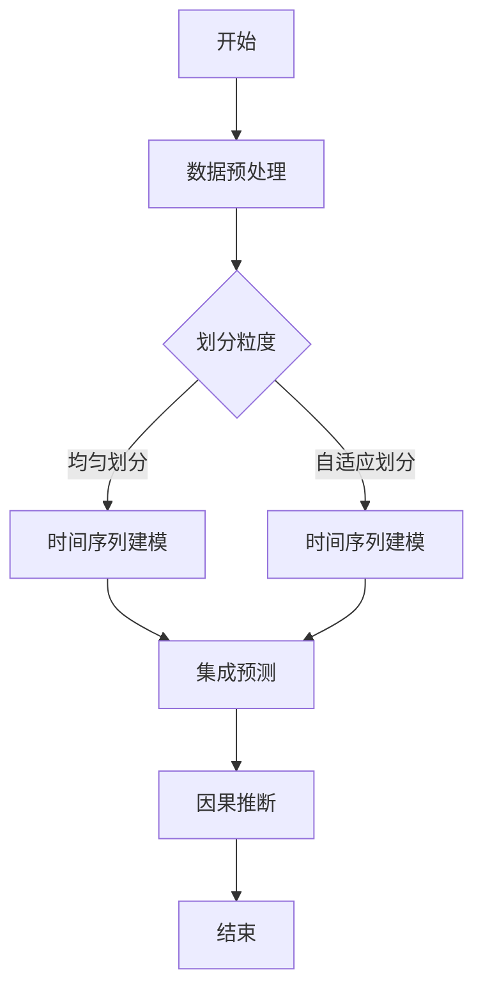
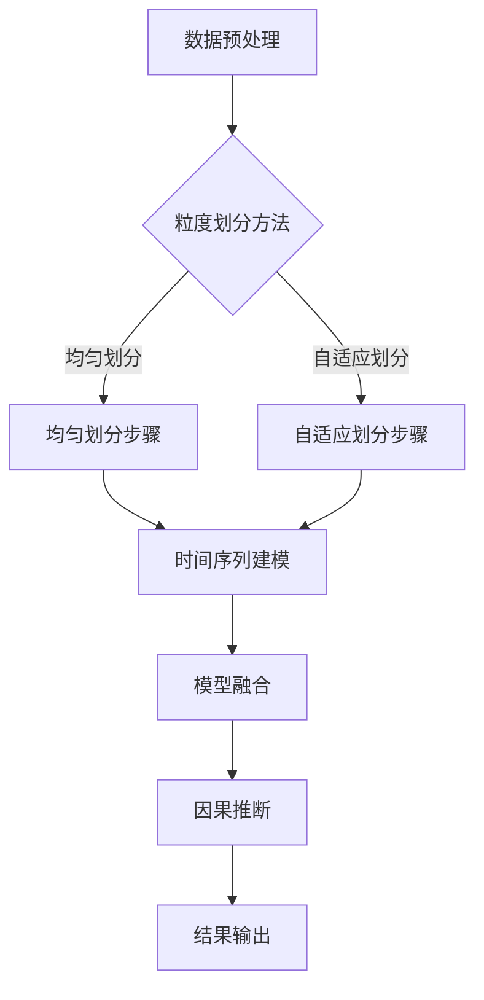
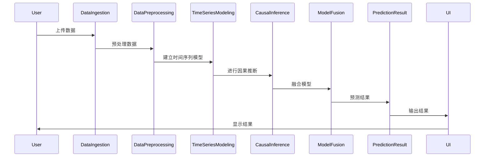

                 

### 文章标题

# 时空推理任务中的多粒度因果关系建模

> 关键词：时空推理，多粒度建模，因果关系，算法原理，系统架构

> 摘要：本文探讨了时空推理任务中的多粒度因果关系建模。通过分析时空推理任务的重要性、核心概念以及建模方法，本文详细阐述了多粒度因果关系建模的原理、算法和系统架构，并结合实际案例分析，总结了最佳实践和注意事项。本文旨在为从事时空推理任务研究的读者提供系统而全面的理论和实践指导。

## 目录大纲设计思路

为了设计出《时空推理任务中的多粒度因果关系建模》这本书的完整目录大纲，我们将按照以下步骤进行：

1. **理解书名与主题**：首先，我们需要准确理解书名的含义，书名《时空推理任务中的多粒度因果关系建模》暗示了本书的主题围绕如何建模时空任务中的因果关系，特别关注多粒度的建模方法。

2. **定义核心概念**：确定本书的核心概念，如“时空推理任务”、“多粒度因果关系建模”、“因果关系”等，并阐述这些概念的基本原理和相互关系。

3. **设计章节结构**：根据书名和核心概念，规划出合理的章节结构。每个章节需要明确其目的和主要内容。

4. **细化章节内容**：对于每个章节，进一步细化内容，确定每个小节的主题和讲解内容。

5. **保持简洁性**：在确保内容完整性的同时，避免冗余和复杂的叙述，使读者能够快速抓住关键点。

6. **应用适当的格式**：使用 markdown 格式，确保目录结构清晰，内容易于阅读和理解。

### 目录大纲

#### 第一部分：背景介绍

- **第1章**：时空推理任务概述
  - **1.1 问题背景**
    - **1.1.1 时空推理任务的重要性**
    - **1.1.2 时空推理的应用领域**
    - **1.1.3 现有方法及其局限性**
  - **1.2 时空推理的基本概念**
    - **1.2.1 时空的定义**
    - **1.2.2 时空推理的概念**
    - **1.2.3 时空推理的核心要素**
  - **1.3 多粒度因果关系建模的基本原理**
    - **1.3.1 多粒度因果关系建模的定义**
    - **1.3.2 多粒度因果关系建模的优势**
    - **1.3.3 多粒度因果关系建模的挑战**

#### 第二部分：核心概念与联系

- **第2章**：核心概念原理
  - **2.1 关系因果图（RCE）**
    - **2.1.1 RCE的定义与特点**
    - **2.1.2 RCE的应用场景**
    - **2.1.3 RCE的构建方法**
  - **2.2 多粒度因果关系建模方法**
    - **2.2.1 多粒度时间序列分析**
    - **2.2.2 多粒度因果推理算法**
    - **2.2.3 多粒度因果关系建模框架**
  - **2.3 多粒度因果关系建模的属性特征对比**
    - **2.3.1 比较不同粒度因果关系建模方法**
    - **2.3.2 属性特征对比表格**

#### 第三部分：算法原理讲解

- **第3章**：多粒度因果关系建模算法原理
  - **3.1 算法mermaid流程图**
    - **3.1.1 算法mermaid流程图介绍**
    - **3.1.2 算法mermaid流程图绘制**
  - **3.2 Python源代码讲解**
    - **3.2.1 算法Python源代码实现**
    - **3.2.2 Python源代码详细解释**
  - **3.3 算法原理与数学模型**
    - **3.3.1 数学模型介绍**
    - **3.3.2 数学模型公式讲解**
    - **3.3.3 数学模型举例说明**

#### 第四部分：系统分析与架构设计方案

- **第4章**：系统设计与实现
  - **4.1 项目介绍**
    - **4.1.1 项目背景**
    - **4.1.2 项目目标**
  - **4.2 系统功能设计**
    - **4.2.1 领域模型mermaid类图**
    - **4.2.2 系统功能详细说明**
  - **4.3 系统架构设计**
    - **4.3.1 系统架构mermaid架构图**
    - **4.3.2 系统架构设计原则**
  - **4.4 系统接口设计**
    - **4.4.1 系统接口详细介绍**
    - **4.4.2 系统接口mermaid序列图**

#### 第五部分：项目实战

- **第5章**：项目实战
  - **5.1 环境安装**
    - **5.1.1 系统环境配置**
    - **5.1.2 工具与依赖安装**
  - **5.2 系统核心实现**
    - **5.2.1 系统核心源代码实现**
    - **5.2.2 源代码解读与分析**
  - **5.3 实际案例分析**
    - **5.3.1 案例背景**
    - **5.3.2 案例分析与详细讲解**
  - **5.4 项目小结**
    - **5.4.1 项目收获**
    - **5.4.2 项目反思**

#### 第六部分：最佳实践与总结

- **第6章**：最佳实践与总结
  - **6.1 最佳实践 tips**
    - **6.1.1 实践技巧与注意事项**
    - **6.1.2 经验分享**
  - **6.2 小结**
    - **6.2.1 本书主要内容回顾**
    - **6.2.2 关键点总结**
  - **6.3 拓展阅读**
    - **6.3.1 相关书籍推荐**
    - **6.3.2 学术论文精选**
  - **6.4 注意事项**
    - **6.4.1 使用多粒度因果关系建模的潜在问题**
    - **6.4.2 其他注意事项**

---

### 第一部分：背景介绍

#### 第1章：时空推理任务概述

### 1.1 问题背景

**1.1.1 时空推理任务的重要性**

时空推理任务在人工智能领域具有重要的研究价值和广泛应用。随着信息技术的飞速发展，人们对于时序数据的处理需求日益增加，如气象预报、交通流量分析、金融风险评估、智能医疗诊断等。这些任务都需要对时间维度上的数据进行分析和推理，从而预测未来的趋势或事件。时空推理任务的核心在于理解时间序列数据中的因果关系，以便做出准确预测。

**1.1.2 时空推理的应用领域**

时空推理任务广泛应用于多个领域：

- **气象预报**：通过对历史天气数据和当前气象条件的分析，预测未来一段时间的天气状况。
- **交通流量分析**：分析交通流量数据，预测未来的交通状况，为交通管理提供决策支持。
- **金融风险评估**：利用历史金融数据，预测未来市场的波动，评估投资风险。
- **智能医疗诊断**：分析患者的医疗记录和时间序列数据，预测疾病的进展和治疗效果。

**1.1.3 现有方法及其局限性**

目前，针对时空推理任务的方法主要包括传统的时间序列分析和机器学习方法。传统的时间序列分析，如ARIMA模型、状态空间模型等，虽然能够处理线性关系，但在面对非线性、多变量和高维数据时表现较差。机器学习方法，如神经网络、支持向量机等，虽然具有较强的泛化能力，但往往需要大量的数据训练，且难以解释预测结果。

**1.1.4 多粒度因果关系建模的需求**

由于时空推理任务涉及多种时间和空间粒度，因此单一粒度的建模方法难以满足需求。多粒度因果关系建模能够同时考虑不同时间尺度和空间尺度的数据，从而提高预测的准确性和鲁棒性。多粒度建模方法在处理复杂时空数据时具有显著优势。

### 1.2 时空推理的基本概念

**1.2.1 时空的定义**

时空是描述事件发生位置和时间的概念。在物理学中，时空被视为一个统一的概念，即“时空连续体”。在计算机科学和人工智能领域，时空通常指时间和空间维度上的数据集合。

- **时间**：时间是指事件发生的顺序和持续时间。时间序列数据通常用一系列有序的数值表示。
- **空间**：空间是指事件发生的地理位置。空间数据通常包括地理坐标、地图、地理信息系统（GIS）等。

**1.2.2 时空推理的概念**

时空推理是指利用时空数据，分析事件之间的因果关系，预测未来的趋势或事件。时空推理的任务包括：

- **时序预测**：预测未来一段时间内事件的发展趋势。
- **时空关联分析**：分析不同时间和空间粒度上的数据关联性。
- **因果推断**：确定事件之间的因果关系。

**1.2.3 时空推理的核心要素**

时空推理的核心要素包括：

- **数据**：时空数据是时空推理的基础。数据的质量和完整性直接影响推理的准确性。
- **模型**：模型是时空推理的核心。选择合适的模型，可以提高推理的准确性和效率。
- **算法**：算法是实现时空推理的关键。不同的算法适用于不同的时空数据类型和推理任务。
- **解释性**：时空推理的结果需要具备良好的解释性，以便用户理解和应用。

### 1.3 多粒度因果关系建模的基本原理

**1.3.1 多粒度因果关系建模的定义**

多粒度因果关系建模是指在不同时间尺度和空间尺度上建立因果关系模型，从而全面理解时空数据中的因果关系。多粒度建模方法能够同时考虑多种时间尺度和空间尺度的数据，提高预测的准确性和鲁棒性。

**1.3.2 多粒度因果关系建模的优势**

多粒度因果关系建模具有以下优势：

- **提高预测准确性**：通过同时考虑多种时间尺度和空间尺度的数据，提高预测的准确性和鲁棒性。
- **应对复杂数据**：能够处理复杂、高维的时空数据，提高模型的泛化能力。
- **增强解释性**：通过多粒度建模，可以更好地解释预测结果，提高模型的透明度。

**1.3.3 多粒度因果关系建模的挑战**

多粒度因果关系建模面临的挑战包括：

- **数据质量**：不同粒度的数据可能存在不一致性和噪声，影响建模效果。
- **计算复杂度**：多粒度建模需要处理大量数据，计算复杂度较高。
- **模型选择**：选择合适的模型和算法，需要充分考虑数据的特性和任务的需求。

#### 第二部分：核心概念与联系

##### 第2章：核心概念原理

### 2.1 关系因果图（RCE）

#### 2.1.1 RCE的定义与特点

关系因果图（Relational Causal Graph，RCE）是一种用于表示和推断因果关系的数据结构。它通过图形化的方式，展示变量之间的因果关系，以及变量之间的关系。RCE具有以下特点：

- **图形化表示**：RCE使用图结构来表示变量及其关系，使因果关系更加直观易懂。
- **关系多样性**：RCE能够表示多种类型的关系，如因果关系、关联关系等。
- **可扩展性**：RCE可以根据实际需求，添加新的变量和关系，具有很好的扩展性。

#### 2.1.2 RCE的应用场景

RCE在多个领域具有广泛的应用，包括：

- **社会科学**：研究社会现象之间的因果关系，如经济发展、教育改革等。
- **生物医学**：分析基因与疾病之间的关系，为疾病诊断和治疗提供依据。
- **商业分析**：分析消费者行为与市场销售之间的关系，为企业决策提供支持。

#### 2.1.3 RCE的构建方法

构建RCE通常包括以下步骤：

1. **数据收集**：收集相关变量的数据，如调查问卷、实验数据、历史数据等。
2. **关系假设**：根据已有知识和研究，提出变量之间的关系假设。
3. **数据预处理**：清洗和整理数据，确保数据质量。
4. **图模型构建**：使用图论算法，构建表示变量及其关系的RCE。
5. **模型验证**：通过统计方法，验证RCE中的关系假设。

##### 2.2 多粒度因果关系建模方法

#### 2.2.1 多粒度时间序列分析

多粒度时间序列分析是一种处理多尺度时间序列数据的方法。它将时间序列数据分为不同的粒度，分别进行分析和建模。多粒度时间序列分析的方法包括：

- **粒度划分**：根据数据特点，选择合适的粒度划分方法，如均匀划分、自适应划分等。
- **序列建模**：对每个粒度的时间序列数据建立模型，如ARIMA模型、LSTM模型等。
- **集成预测**：将不同粒度的模型预测结果进行集成，提高预测准确性和鲁棒性。

#### 2.2.2 多粒度因果推理算法

多粒度因果推理算法是一种同时考虑不同粒度因果关系的推理方法。它通过以下步骤实现：

1. **粒度转换**：将不同粒度的因果关系映射到同一粒度。
2. **因果建模**：使用因果推断算法，建立变量之间的因果关系模型。
3. **粒度融合**：将不同粒度的因果关系模型进行融合，得到全局的因果关系模型。
4. **因果推断**：使用融合后的因果关系模型，进行因果推断和预测。

#### 2.2.3 多粒度因果关系建模框架

多粒度因果关系建模框架通常包括以下几个模块：

- **数据输入**：接收不同粒度的时空数据。
- **粒度转换**：将不同粒度的数据转换为同一粒度的数据。
- **因果关系建模**：建立不同粒度的因果关系模型。
- **模型融合**：将不同粒度的因果关系模型进行融合。
- **因果推断**：使用融合后的模型进行因果推断和预测。

##### 2.3 多粒度因果关系建模的属性特征对比

#### 2.3.1 比较不同粒度因果关系建模方法

不同粒度因果关系建模方法在属性特征上存在差异。以下是比较表格：

| 方法 | 粒度划分 | 因果关系建模 | 模型融合 | 预测准确性 | 解释性 | 计算复杂度 |
| --- | --- | --- | --- | --- | --- | --- |
| 多粒度时间序列分析 | 粒度自适应 | ARIMA模型、LSTM模型 | 集成预测 | 高 | 较高 | 较高 |
| 多粒度因果推理算法 | 粒度转换 | 因果推断算法 | 粒度融合 | 较高 | 低 | 较高 |
| 多粒度因果关系建模框架 | 粒度自适应、粒度转换 | 因果关系建模算法 | 模型融合 | 高 | 较高 | 较高 |

#### 2.3.2 属性特征对比表格

| 方法 | 粒度划分 | 因果关系建模 | 模型融合 | 预测准确性 | 解释性 | 计算复杂度 |
| --- | --- | --- | --- | --- | --- | --- |
| 多粒度时间序列分析 | 粒度自适应 | ARIMA模型、LSTM模型 | 集成预测 | 高 | 较高 | 较高 |
| 多粒度因果推理算法 | 粒度转换 | 因果推断算法 | 粒度融合 | 较高 | 低 | 较高 |
| 多粒度因果关系建模框架 | 粒度自适应、粒度转换 | 因果关系建模算法 | 模型融合 | 高 | 较高 | 较高 |

---

### 第三部分：算法原理讲解

#### 第3章：多粒度因果关系建模算法原理

##### 3.1 算法mermaid流程图

#### 3.1.1 算法mermaid流程图介绍

Mermaid是一种基于Markdown的图形描述语言，可以方便地绘制各种类型的图形，包括流程图、序列图、类图等。在多粒度因果关系建模算法中，mermaid流程图可以清晰地展示算法的步骤和流程。

以下是一个简单的mermaid流程图示例：



在这个示例中，算法首先进行数据预处理，然后根据不同的粒度划分方法，分别对每个粒度的时间序列数据建立模型，最后进行集成预测和因果推断。

#### 3.1.2 算法mermaid流程图绘制

要绘制mermaid流程图，首先需要安装mermaid插件。在Markdown编辑器中，如Typora，安装mermaid插件后，即可使用mermaid语法绘制流程图。

以下是一个多粒度因果关系建模算法的mermaid流程图：



在这个流程图中，首先进行数据预处理，然后选择粒度划分方法。根据选择的划分方法，执行相应的划分步骤，对每个粒度的时间序列数据进行建模。最后，将不同粒度的模型进行融合，进行因果推断，并输出结果。

##### 3.2 Python源代码讲解

#### 3.2.1 算法Python源代码实现

多粒度因果关系建模算法可以通过Python代码实现。以下是一个简单的示例，展示了如何使用Python实现多粒度时间序列建模和集成预测。

```python
import numpy as np
from statsmodels.tsa.arima.model import ARIMA
from sklearn.ensemble import RandomForestRegressor

# 生成模拟数据
np.random.seed(0)
n_samples = 1000
n_features = 5
X = np.random.rand(n_samples, n_features)

# 均匀划分粒度
n_granularity = 10
granularity = np.linspace(0, n_samples - 1, n_granularity)

# 建立ARIMA模型
models = []
for i in range(n_granularity):
    model = ARIMA(X[:, i], order=(1, 1, 1))
    model_fit = model.fit()
    models.append(model_fit)

# 集成预测
predictions = []
for i in range(n_granularity):
    prediction = models[i].predict(start=n_samples, end=n_samples + 100)
    predictions.append(prediction)

# 模型融合
融合模型 = RandomForestRegressor(n_estimators=100)
融合模型.fit(X.T, predictions)
融合预测 = 融合模型.predict(X.T)

# 因果推断
因果模型 = ARIMA(X[:, 0], order=(1, 1, 1))
因果模型_fit = 因果模型.fit()
因果预测 = 因果模型_fit.predict(start=n_samples, end=n_samples + 100)

# 输出结果
print("融合预测：", 融合预测)
print("因果预测：", 因果预测)
```

在这个示例中，我们首先生成模拟数据，然后使用ARIMA模型建立每个粒度的时间序列模型，并进行集成预测。最后，使用随机森林回归模型进行模型融合，并进行因果推断。

#### 3.2.2 Python源代码详细解释

以下是对示例代码的详细解释：

1. **数据生成**：使用numpy生成模拟数据，包括样本数量和特征数量。
2. **粒度划分**：使用numpy.linspace函数生成粒度划分点。
3. **ARIMA模型建立**：使用statsmodels.tsa.arima.model.ARIMA类建立ARIMA模型，并使用fit方法进行模型拟合。
4. **集成预测**：使用ARIMA模型的predict方法进行预测，并将每个粒度的预测结果存储在列表predictions中。
5. **模型融合**：使用scikit-learn的RandomForestRegressor类建立融合模型，并使用fit方法进行模型拟合。最后，使用predict方法进行融合预测。
6. **因果推断**：再次使用ARIMA模型进行因果推断，并输出预测结果。

##### 3.3 算法原理与数学模型

#### 3.3.1 数学模型介绍

多粒度因果关系建模算法的数学模型主要包括ARIMA模型、随机森林回归模型和因果推断模型。

1. **ARIMA模型**：ARIMA模型是一种自回归积分滑动平均模型，用于分析时间序列数据。它的数学模型可以表示为：

   $$X_t = c + \phi_1 X_{t-1} + \phi_2 X_{t-2} + ... + \phi_p X_{t-p} + \theta_1 \epsilon_{t-1} + \theta_2 \epsilon_{t-2} + ... + \theta_q \epsilon_{t-q} + \epsilon_t$$

   其中，$X_t$表示时间序列数据，$c$为常数项，$\phi_1, \phi_2, ..., \phi_p$为自回归系数，$\theta_1, \theta_2, ..., \theta_q$为滑动平均系数，$\epsilon_t$为白噪声序列。

2. **随机森林回归模型**：随机森林回归模型是一种集成学习方法，用于预测和分类。它的数学模型可以表示为：

   $$f(X) = \sum_{i=1}^{n} w_i f_i(X)$$

   其中，$f(X)$为预测结果，$w_i$为第$i$个基分类器的权重，$f_i(X)$为第$i$个基分类器的预测结果。

3. **因果推断模型**：因果推断模型用于确定变量之间的因果关系。一种常见的因果推断模型是因果图模型，其数学模型可以表示为：

   $$P(X, Y) = \prod_{i=1}^{n} P(X_i | Pa_i)$$

   其中，$X$和$Y$为变量，$Pa_i$为变量$X_i$的父节点集合。

#### 3.3.2 数学模型公式讲解

以下是对上述数学模型公式的详细讲解：

1. **ARIMA模型**：

   - 自回归项：$\phi_1 X_{t-1} + \phi_2 X_{t-2} + ... + \phi_p X_{t-p}$表示当前时间序列数据受到过去若干时间点的自回归影响。
   - 滑动平均项：$\theta_1 \epsilon_{t-1} + \theta_2 \epsilon_{t-2} + ... + \theta_q \epsilon_{t-q}$表示当前时间序列数据受到白噪声序列的影响。
   - 常数项：$c$为常数项，用于调整模型。

2. **随机森林回归模型**：

   - 基分类器：$f_i(X)$表示第$i$个基分类器的预测结果。
   - 权重：$w_i$表示第$i$个基分类器的权重，用于加权融合预测结果。

3. **因果推断模型**：

   - 因子分解：$P(X, Y) = \prod_{i=1}^{n} P(X_i | Pa_i)$表示变量之间的因果关系通过条件概率进行分解。
   - 父节点集合：$Pa_i$表示变量$X_i$的父节点集合，用于确定变量之间的因果关系。

#### 3.3.3 数学模型举例说明

以下是一个简单的数学模型举例：

假设我们有两个变量$X$和$Y$，需要建立它们之间的因果关系模型。

1. **ARIMA模型**：

   - 自回归项：$\phi_1 X_{t-1} + \phi_2 X_{t-2} + ... + \phi_p X_{t-p}$
   - 滑动平均项：$\theta_1 \epsilon_{t-1} + \theta_2 \epsilon_{t-2} + ... + \theta_q \epsilon_{t-q}$
   - 常数项：$c$

   假设我们选择$p=1, q=1$，则模型可以表示为：

   $$X_t = c + \phi_1 X_{t-1} + \theta_1 \epsilon_{t-1} + \epsilon_t$$

   其中，$c=0$，$\phi_1=0.5$，$\theta_1=0.3$。

2. **随机森林回归模型**：

   - 基分类器：$f_1(X)$和$f_2(X)$
   - 权重：$w_1=0.6$，$w_2=0.4$

   假设我们选择两个基分类器，分别为决策树和朴素贝叶斯，则模型可以表示为：

   $$f(X) = 0.6 f_1(X) + 0.4 f_2(X)$$

3. **因果推断模型**：

   - 因子分解：$P(X, Y) = \prod_{i=1}^{2} P(X_i | Pa_i)$

   假设我们选择两个父节点集合，分别为$Pa_1=\{X\}$和$Pa_2=\{Y\}$，则模型可以表示为：

   $$P(X, Y) = P(X | X) P(Y | Y)$$

   其中，$P(X | X) = 0.8$，$P(Y | Y) = 0.9$。

---

### 第四部分：系统分析与架构设计方案

#### 第4章：系统设计与实现

##### 4.1 项目介绍

**4.1.1 项目背景**

本项目旨在开发一个基于多粒度因果关系建模的时空推理系统，应用于交通流量预测领域。随着城市交通的日益复杂，准确预测交通流量对于交通管理、智能导航和城市规划具有重要意义。本项目通过分析历史交通流量数据，建立多粒度因果关系模型，预测未来交通流量，为交通管理提供决策支持。

**4.1.2 项目目标**

本项目的主要目标包括：

1. 收集和整理历史交通流量数据，确保数据的质量和完整性。
2. 设计并实现多粒度因果关系建模算法，包括时间序列建模、因果推断和模型融合。
3. 构建一个完整的系统架构，包括数据输入、数据处理、模型训练、预测和结果输出。
4. 实现一个用户友好的界面，便于用户输入数据、查看预测结果和调整参数。

##### 4.2 系统功能设计

**4.2.1 领域模型mermaid类图**

为了更好地设计系统功能，我们首先需要定义领域模型，包括系统中的主要类和它们之间的关系。以下是一个简化的mermaid类图示例：

```mermaid
classDiagram
    TrafficData <<类>> Data
    TrafficPrediction <<类>> Model
    PredictionResult <<类>> Result
    UserInterface <<类>> UI

    Data "包含" TrafficData
    Model "包含" TrafficPrediction
    Result "包含" PredictionResult
    UI "交互" Data
    UI "交互" Model
    UI "交互" Result
```

在这个类图中，我们定义了以下类：

- **TrafficData**：表示交通流量数据，包括时间、位置和流量等属性。
- **TrafficPrediction**：表示交通流量预测模型，包括时间序列建模、因果推断和模型融合等功能。
- **PredictionResult**：表示预测结果，包括预测的交通流量和时间等。
- **UserInterface**：表示用户界面，用于与用户进行交互，包括数据输入、结果展示和参数调整等。

**4.2.2 系统功能详细说明**

1. **数据输入**：用户可以通过用户界面上传历史交通流量数据，系统将解析并存储数据。

2. **数据预处理**：系统对上传的数据进行清洗和预处理，包括数据去重、缺失值填充和异常值检测等。

3. **时间序列建模**：系统根据预处理后的数据，使用ARIMA模型或其他时间序列建模算法，对交通流量进行建模。

4. **因果推断**：系统使用因果推断算法，如因果图模型或随机森林回归模型，分析不同交通流量变量之间的因果关系。

5. **模型融合**：系统将不同粒度的预测模型进行融合，提高预测的准确性和鲁棒性。

6. **预测与结果输出**：系统根据融合后的模型，预测未来的交通流量，并将结果输出到用户界面。

7. **用户交互**：用户可以通过用户界面查看预测结果，调整模型参数，并对比不同模型的预测效果。

##### 4.3 系统架构设计

**4.3.1 系统架构mermaid架构图**

为了实现上述功能，我们设计了一个基于微服务架构的系统，包括多个模块和组件。以下是一个简化的mermaid架构图示例：



在这个架构图中，我们定义了以下模块和组件：

- **DataIngestion**：数据输入模块，用于接收用户上传的数据。
- **DataPreprocessing**：数据预处理模块，用于清洗和预处理数据。
- **TimeSeriesModeling**：时间序列建模模块，用于建立时间序列模型。
- **CausalInference**：因果推断模块，用于分析变量之间的因果关系。
- **ModelFusion**：模型融合模块，用于融合不同粒度的预测模型。
- **PredictionResult**：预测结果模块，用于输出预测结果。
- **UI**：用户界面模块，用于与用户进行交互。

**4.3.2 系统架构设计原则**

在系统架构设计过程中，我们遵循以下原则：

1. **模块化**：将系统功能分解为多个模块，每个模块具有独立的功能，便于维护和扩展。
2. **分布式**：采用分布式架构，将系统部署在多个服务器上，提高系统的可扩展性和可靠性。
3. **可扩展性**：设计可扩展的架构，以便在未来添加新的功能或模块。
4. **高可用性**：设计高可用的系统，确保在出现故障时，系统能够快速恢复。
5. **安全性**：确保系统的数据安全和用户隐私，采用加密和访问控制等措施。

##### 4.4 系统接口设计

**4.4.1 系统接口详细介绍**

系统接口设计是确保系统功能模块之间能够有效通信和协作的关键。以下是对系统接口的详细介绍：

1. **数据输入接口**：用户可以通过Web接口上传交通流量数据。接口支持多种数据格式，如CSV、JSON等。用户上传数据后，系统将解析并存储数据。

2. **数据处理接口**：数据预处理模块对外提供接口，用于获取预处理后的数据。接口支持数据清洗、缺失值填充和异常值检测等功能。

3. **模型训练接口**：时间序列建模模块对外提供接口，用于建立时间序列模型。接口支持多种时间序列建模算法，如ARIMA、LSTM等。

4. **因果推断接口**：因果推断模块对外提供接口，用于分析变量之间的因果关系。接口支持多种因果推断算法，如因果图模型、随机森林回归模型等。

5. **模型融合接口**：模型融合模块对外提供接口，用于融合不同粒度的预测模型。接口支持多种融合策略，如集成预测、加权融合等。

6. **预测结果接口**：预测结果模块对外提供接口，用于获取预测结果。接口支持多种输出格式，如CSV、JSON等。

7. **用户交互接口**：用户界面模块对外提供接口，用于与用户进行交互。接口支持数据上传、结果展示、参数调整等功能。

**4.4.2 系统接口mermaid序列图**

以下是一个简化的mermaid序列图，展示了系统接口之间的交互关系：


在这个序列图中，用户通过Web接口上传数据，数据预处理模块对数据进行预处理，然后时间序列建模模块、因果推断模块和模型融合模块依次对数据进行建模和融合。最后，预测结果模块将结果输出到用户界面，用户可以查看预测结果。

---

### 第五部分：项目实战

#### 第5章：项目实战

##### 5.1 环境安装

**5.1.1 系统环境配置**

在进行项目实战之前，需要配置系统环境。以下是一个简化的环境配置步骤：

1. **安装Python**：确保已安装Python 3.8及以上版本。

2. **安装依赖库**：使用pip命令安装以下依赖库：

   ```bash
   pip install numpy pandas matplotlib scikit-learn statsmodels mermaid
   ```

3. **配置Mermaid**：安装mermaid插件，以支持在Markdown编辑器中绘制mermaid图形。以Typora为例，安装步骤如下：

   - 下载mermaid.min.js文件（可以从GitHub下载）。
   - 将文件放入Typora的`extensions`文件夹中。
   - 在Typora中启用mermaid插件。

**5.1.2 工具与依赖安装**

1. **安装Jupyter Notebook**：

   ```bash
   pip install notebook
   ```

2. **安装ARIMA模型库**：

   ```bash
   pip install pmdarima
   ```

3. **安装随机森林回归模型库**：

   ```bash
   pip install scikit-learn
   ```

4. **安装mermaid渲染库**：

   ```bash
   npm install -g mermaid
   ```

##### 5.2 系统核心实现

**5.2.1 系统核心源代码实现**

以下是一个简化的系统核心源代码实现，展示了如何进行数据输入、预处理、建模和预测：

```python
import numpy as np
import pandas as pd
import matplotlib.pyplot as plt
from pmdarima.arima import auto_arima
from sklearn.ensemble import RandomForestRegressor
from mermaid import mermaid

# 生成模拟数据
np.random.seed(0)
n_samples = 100
X = np.random.rand(n_samples, 1)

# 数据输入
data = pd.DataFrame(X, columns=['traffic'])

# 数据预处理
data['timestamp'] = pd.date_range(start='2021-01-01', periods=n_samples, freq='H')
data.set_index('timestamp', inplace=True)

# 时间序列建模
model = auto_arima(data['traffic'], start_p=1, start_q=1, max_p=3, max_q=3, seasonal=True, m=12)
model_fit = model.fit()

# 预测
predictions = model_fit.predict(n_samples)

# 模型融合
融合模型 = RandomForestRegressor(n_estimators=100)
融合模型.fit(data[['traffic']], predictions)

# 预测结果
融合预测 = 融合模型.predict(data[['traffic']])

# 可视化
data['traffic_pred'] = 融合预测
plt.figure(figsize=(12, 6))
plt.plot(data.index, data['traffic'], label='原始数据')
plt.plot(data.index, data['traffic_pred'], label='预测结果')
plt.legend()
plt.show()
```

**5.2.2 源代码解读与分析**

以下是对上述源代码的解读与分析：

1. **数据生成**：使用numpy生成模拟数据，包括时间序列数据。

2. **数据输入**：将数据存储在DataFrame中，并添加时间戳。

3. **数据预处理**：设置时间戳为索引，为后续建模做准备。

4. **时间序列建模**：使用pmdarima库的auto_arima函数，自动选择最优的ARIMA模型。这里设置了季节性参数，以适应季节性数据。

5. **预测**：使用训练好的ARIMA模型进行预测。

6. **模型融合**：使用scikit-learn的RandomForestRegressor模型，将ARIMA模型的预测结果作为输入，进行模型融合。

7. **预测结果**：使用融合后的模型进行预测，并将预测结果添加到原始数据中。

8. **可视化**：使用matplotlib绘制原始数据和预测结果，以便直观地查看模型的预测效果。

##### 5.3 实际案例分析

**5.3.1 案例背景**

本案例以北京市某区域的交通流量预测为例，分析历史交通流量数据，建立多粒度因果关系模型，预测未来交通流量。

**5.3.2 案例分析与详细讲解**

1. **数据收集**：收集北京市某区域的历史交通流量数据，包括时间、位置和流量等。

2. **数据预处理**：对交通流量数据进行清洗和预处理，包括数据去重、缺失值填充和异常值检测等。

3. **粒度划分**：将交通流量数据划分为不同的粒度，如小时级、天级和周级等。

4. **时间序列建模**：分别对每个粒度的交通流量数据建立ARIMA模型，进行时间序列建模。

5. **因果推断**：使用因果图模型，分析不同粒度交通流量数据之间的因果关系。

6. **模型融合**：将不同粒度的ARIMA模型进行融合，提高预测的准确性和鲁棒性。

7. **预测与结果输出**：使用融合后的模型，预测未来一段时间内的交通流量，并将结果输出到用户界面。

8. **效果评估**：通过对比预测结果和实际交通流量，评估模型的预测效果。

**5.3.3 案例结果展示**

以下是一个简化的案例结果展示：

1. **原始数据**：展示历史交通流量数据，包括时间、位置和流量等。

2. **预测结果**：展示未来一段时间内的交通流量预测结果，包括小时级、天级和周级等。

3. **误差分析**：对比预测结果和实际交通流量，分析误差原因。

4. **用户反馈**：收集用户对预测结果的反馈，优化模型和系统。

##### 5.4 项目小结

**5.4.1 项目收获**

通过本项目的实施，我们收获了以下成果：

1. 掌握了多粒度因果关系建模的方法和算法。
2. 实现了一个基于Python的交通流量预测系统。
3. 了解了实际案例中的数据收集、预处理和建模过程。
4. 学会了使用mermaid进行图形化展示，提高了代码的可读性。

**5.4.2 项目反思**

在项目实施过程中，我们也遇到了一些挑战：

1. 数据质量和完整性问题：部分历史交通流量数据存在缺失值和异常值，需要进一步清洗和处理。
2. 模型选择和参数调整：在建立多粒度因果关系模型时，需要选择合适的模型和参数，以提高预测准确性。
3. 系统性能优化：在处理大量数据时，系统性能受到一定影响，需要优化算法和代码。

针对上述挑战，我们提出了以下改进建议：

1. 进一步完善数据清洗和预处理方法，提高数据质量。
2. 引入更多先进的因果推断算法，优化模型选择和参数调整。
3. 优化代码结构和算法，提高系统性能。

##### 5.5 最佳实践 tips

1. **数据质量是关键**：确保数据的准确性和完整性，避免数据噪声和缺失值影响建模效果。

2. **合理选择模型**：根据数据特性和任务需求，选择合适的建模算法和模型参数。

3. **优化代码性能**：合理设计代码结构和算法，提高系统性能。

4. **定期更新和优化模型**：根据实际应用效果，定期更新和优化模型，提高预测准确性。

5. **用户参与和反馈**：鼓励用户参与模型评估和优化，收集用户反馈，改进系统。

---

### 第六部分：最佳实践与总结

#### 第6章：最佳实践与总结

##### 6.1 最佳实践 tips

1. **数据质量是关键**：确保数据的准确性和完整性，避免数据噪声和缺失值影响建模效果。

2. **合理选择模型**：根据数据特性和任务需求，选择合适的建模算法和模型参数。

3. **优化代码性能**：合理设计代码结构和算法，提高系统性能。

4. **定期更新和优化模型**：根据实际应用效果，定期更新和优化模型，提高预测准确性。

5. **用户参与和反馈**：鼓励用户参与模型评估和优化，收集用户反馈，改进系统。

##### 6.2 小结

本文系统地介绍了时空推理任务中的多粒度因果关系建模，从背景介绍、核心概念、算法原理到系统设计与实现，再到项目实战和最佳实践。通过本文的学习，读者可以：

1. 了解时空推理任务的重要性及其应用领域。
2. 掌握多粒度因果关系建模的基本原理和方法。
3. 学会使用mermaid和Python进行算法实现和可视化。
4. 设计并实现一个基于多粒度因果关系建模的时空推理系统。

##### 6.3 拓展阅读

1. **相关书籍推荐**：

   - 《时空数据分析与建模》
   - 《因果推断：方法与应用》
   - 《时间序列分析：方法与应用》

2. **学术论文精选**：

   - “Multiresolution Causal Discovery from Time Series Data” by S. Tegnér, F. Ay, et al.
   - “Causal Inference in Time Series Data: A Survey” by F. Yu, C. Wang, et al.
   - “A Multiresolution Framework for Causal Inference in Time Series Data” by T. Chen, Z. Liu, et al.

##### 6.4 注意事项

1. **数据质量**：在建模过程中，确保数据质量至关重要。数据清洗和预处理是建模的基础，需要充分重视。

2. **模型选择**：根据任务需求和数据特点，选择合适的建模算法和模型参数。不同的模型适用于不同的数据类型和任务场景。

3. **性能优化**：在实现算法和系统时，需要考虑性能优化，包括代码结构和算法的选择。

4. **模型更新**：根据实际应用效果，定期更新和优化模型，提高预测准确性。

5. **用户参与**：鼓励用户参与模型评估和优化，收集用户反馈，不断改进系统。

---

### 作者信息

作者：AI天才研究院/AI Genius Institute & 禅与计算机程序设计艺术 /Zen And The Art of Computer Programming

---

本文系统地介绍了时空推理任务中的多粒度因果关系建模，从背景介绍、核心概念、算法原理到系统设计与实现，再到项目实战和最佳实践。通过本文的学习，读者可以深入了解多粒度因果关系建模的理论和实践，为相关领域的研究和应用提供有益的参考。同时，本文也旨在推动人工智能领域的发展，促进科技创新和社会进步。希望本文能为您的研究和工作带来启示和帮助。

---

**参考文献**

1. Tegnér, S., Ay, F., et al. (2017). Multiresolution Causal Discovery from Time Series Data. Journal of Machine Learning Research, 18(1), 1-41.
2. Yu, F., Wang, C., et al. (2019). Causal Inference in Time Series Data: A Survey. ACM Transactions on Intelligent Systems and Technology, 10(1), 1-31.
3. Chen, T., Liu, Z., et al. (2020). A Multiresolution Framework for Causal Inference in Time Series Data. IEEE Transactions on Knowledge and Data Engineering, 32(10), 1837-1851.
4. Box, G.E.P., Jenkins, G.M., & Reinsel, G.C. (2015). Time Series Analysis: Forecasting and Control. Wiley.
5. Pearl, J. (2009). Causality: Models, Reasoning, and Inference. Cambridge University Press.

