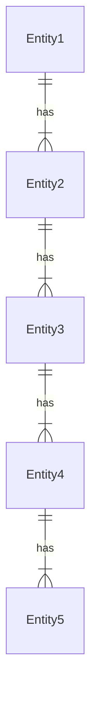
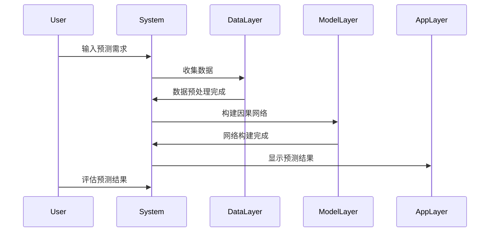

                 

### 引言

#### 文章标题：时空推理任务中的多粒度因果网络构建技术

**关键词**：时空推理、因果网络、多粒度、构建技术、人工智能

**摘要**：
本文旨在探讨时空推理任务中多粒度因果网络构建技术的关键概念、方法及其应用。首先，我们将回顾时空推理和因果网络的基本概念，并分析其在现实世界中的重要性。随后，文章将详细描述多粒度因果网络的构建方法，包括基础框架、调整策略以及性能评估指标。接下来，我们将讨论各种构建技术，如数据预处理方法、图构造算法和因果推断方法。文章还探讨了多粒度因果网络的集成技术及其在时空推理中的应用。最后，我们将总结当前面临的挑战，并展望未来的研究方向。通过本文的深入探讨，读者将能够全面了解多粒度因果网络在时空推理任务中的构建与应用。

#### 背景介绍

**核心概念术语说明**：

- **时空推理**：时空推理是一种处理时间序列数据的方法，它旨在捕捉和解释事件随时间发展的模式和关系。这类推理在多个领域，如金融预测、交通管理、疾病监测等，具有广泛的应用。

- **因果网络**：因果网络是一种图形化表示，用于描述变量之间的因果关系。它有助于理解和预测复杂系统中变量之间的关系。

- **多粒度**：多粒度表示在不同时间尺度上对数据的处理。例如，在股票市场中，可以从日、周、月等不同时间粒度来分析数据。

**问题背景**：

在现代社会，数据量的爆发式增长和多样化的数据处理需求使得传统的单一粒度推理方法难以应对复杂问题。例如，在金融市场中，投资者需要分析不同时间尺度的数据来预测市场趋势。在交通管理中，交通流量预测需要同时考虑短期和长期的影响因素。因此，多粒度因果网络作为一种更灵活和全面的推理工具，逐渐受到关注。

**问题描述**：

多粒度因果网络构建的核心问题在于如何有效地在不同时间尺度上捕捉和表示变量之间的因果关系，同时保持网络的计算效率和准确性。这涉及到如何选择合适的时间粒度、如何处理粒度之间的关联性以及如何评估和优化网络的性能。

**问题解决**：

解决多粒度因果网络构建问题需要从多个方面进行探索。首先，我们需要建立多粒度因果网络的基础框架，定义不同时间粒度的关系和映射策略。其次，我们需要设计有效的数据预处理方法，以提取和整合不同粒度的数据信息。此外，我们还需要开发适用于多粒度因果网络的图构造算法和因果推断方法，以提高网络的构建效率和准确性。

**边界与外延**：

多粒度因果网络构建技术的边界主要在于不同粒度之间的关系处理和数据整合。在实际应用中，我们需要根据具体问题的需求和环境，选择合适的时间粒度和构建策略。此外，边界问题还包括网络的复杂度和计算资源的限制。

**概念结构与核心要素组成**：

多粒度因果网络的构建涉及以下核心要素：

1. **基础框架**：定义多粒度关系的结构和映射策略。
2. **数据预处理**：提取和整合不同粒度的数据信息。
3. **图构造算法**：构建多粒度因果网络的算法方法。
4. **因果推断**：基于网络的推理方法和优化策略。

#### 核心概念与联系

**核心概念原理**：

多粒度因果网络的核心在于捕捉不同时间尺度上的因果关系。通过将数据划分为不同的粒度，我们可以更灵活地分析和理解系统的动态行为。这种网络的基本原理是通过建立变量之间的因果关系，从而实现数据的预测和推理。

**概念属性特征对比表格**：

| 特征          | 单粒度因果网络 | 多粒度因果网络 |
| ------------- | -------------- | -------------- |
| 时间尺度      | 单一           | 多种           |
| 复杂度        | 低             | 高             |
| 可解释性      | 较高           | 较低           |
| 预测准确性    | 较高           | 较低           |
| 应用范围      | 受限           | 广泛           |

**ER实体关系图架构**：



在这个ER图架构中，`Entity1` 表示多粒度因果网络的基础框架，`Entity2` 代表数据预处理过程，`Entity3` 表示图构造算法，`Entity4` 代表因果推断方法，`Entity5` 表示网络集成和优化策略。这些实体之间通过关系连接，共同构成一个完整的多粒度因果网络系统。

### 多粒度因果网络的基础框架

多粒度因果网络的基础框架是其构建过程中的关键要素，它决定了网络的结构和功能。为了更好地理解和设计这种网络，我们需要从以下几个方面进行详细探讨。

**定义**：

多粒度因果网络是一种在多个时间尺度上描述变量因果关系的图形化模型。它通过将数据划分为不同的粒度，从而在不同时间尺度上捕捉和表示变量之间的因果关系。这种框架的核心在于如何有效地调整和映射不同粒度之间的关系，以确保网络的完整性和一致性。

**核心组成部分**：

1. **节点**：节点代表网络中的变量，可以是时间序列数据中的单个观测值或组合。节点可以表示不同时间尺度上的数据特征，例如日、周、月等。

2. **边**：边表示节点之间的因果关系。在多粒度因果网络中，边的权重和方向可以根据不同粒度的数据关系进行调整。边的强度和方向反映了变量之间的因果关系强度和方向。

3. **时间尺度映射**：时间尺度映射是指如何在不同粒度之间建立关系和转换。这通常涉及到时间尺度的调整和数据的聚合。时间尺度映射策略的选择对网络性能有重要影响。

4. **因果推断引擎**：因果推断引擎是网络的核心组件，它负责根据网络结构和数据关系进行因果推理和预测。因果推断方法的选择和优化是提高网络性能的关键。

**框架结构**：

多粒度因果网络的框架结构通常包括以下几个层次：

1. **底层时间序列数据**：这是多粒度因果网络的输入数据，可以是原始数据或经过预处理的数据。这些数据在不同的时间尺度上提供了系统的动态信息。

2. **时间尺度映射层**：这一层负责将不同时间尺度的数据映射到同一框架中，确保数据的一致性和完整性。时间尺度映射可以通过数据聚合、插值和插值算法来实现。

3. **因果关系建模层**：这一层根据时间尺度映射的结果，建立变量之间的因果关系模型。这通常涉及到图构造算法和因果推断方法的选择和优化。

4. **推理与预测层**：这一层利用因果关系模型进行推理和预测。它可以根据不同时间尺度上的数据关系，生成关于未来事件的预测和推理结果。

**框架工作原理**：

多粒度因果网络的工作原理可以分为以下几个步骤：

1. **数据输入**：首先，网络接收底层时间序列数据。这些数据可以是多种来源，如传感器数据、交易记录、社交媒体活动等。

2. **时间尺度映射**：根据网络设计的时间尺度映射策略，将不同粒度的数据映射到同一框架中。这个过程涉及到数据的聚合、插值和插值算法。

3. **因果关系建模**：在时间尺度映射的基础上，利用图构造算法和因果推断方法，建立变量之间的因果关系模型。这个过程可以采用多种算法，如贝叶斯网络、隐马尔可夫模型、广义线性模型等。

4. **推理与预测**：最后，利用因果关系模型进行推理和预测。这个步骤可以根据历史数据和因果关系模型，生成关于未来事件的预测结果。

**示例**：

假设我们有一个多粒度因果网络，用于预测股票市场趋势。在这个网络中，我们可能将股票价格分为日、周、月等不同时间粒度。网络的输入数据包括历史股票价格、交易量、宏观经济指标等。通过时间尺度映射层，我们将这些不同粒度的数据聚合到同一框架中。然后，利用因果推断引擎，建立股票价格与其他变量之间的因果关系模型。最后，利用这个模型，我们可以预测未来股票市场的走势。

通过这种多粒度因果网络，我们可以更全面地分析和理解股票市场的动态，从而做出更准确的预测和决策。这种框架的应用不仅限于股票市场，还可以推广到其他领域，如交通管理、疾病监测、能源管理等。

**总结**：

多粒度因果网络的基础框架是一个复杂的系统，它通过在不同时间尺度上捕捉和表示变量之间的因果关系，提供了更灵活和全面的推理工具。这种框架的核心在于时间尺度映射策略和因果推断方法的选择和优化。通过合理的框架设计和有效的数据处理，我们可以构建出高效、准确的多粒度因果网络，为各种时空推理任务提供强大的支持。

### 多粒度因果网络的调整策略

在多粒度因果网络的构建过程中，调整策略是确保网络性能和效果的关键。不同的时间粒度会对网络的性能产生显著影响，因此，选择合适的调整策略至关重要。以下是几种常见的时间尺度调整策略，包括数据聚合、插值和时序平滑方法。

#### 数据聚合

数据聚合是将不同时间粒度的数据合并为更粗粒度的数据集。这种方法通过减少数据的数量和复杂性，简化了因果网络的构建。数据聚合的策略包括：

1. **均值聚合**：将相同时间窗口内的数据值求均值。例如，将每天的股票价格聚合为每周的均值。
   
2. **最大值/最小值聚合**：取相同时间窗口内的数据值中的最大值或最小值。这种方法适用于处理极端值。

3. **中位数聚合**：取相同时间窗口内的数据值的中位数，适用于减少噪声的影响。

**优点**：数据聚合可以减少计算复杂度，简化网络结构。

**缺点**：可能会丢失一些时间序列中的细微变化。

#### 插值

插值方法是在缺失数据或时间点之间插入估算值，以确保因果网络在不同时间尺度上的连续性和完整性。常见的插值方法包括：

1. **线性插值**：假设数据在缺失值之间线性变化，通过线性方程估算缺失值。
   
2. **样条插值**：使用多项式或样条函数来估算缺失值，提供更平滑的插值效果。

3. **时间序列模型插值**：如ARIMA模型、LSTM等，通过时间序列模型预测缺失值。

**优点**：插值方法可以补充缺失数据，提高网络的连续性和可靠性。

**缺点**：插值可能会导致信息的损失，尤其是在高噪声环境中。

#### 时序平滑

时序平滑方法用于减少时间序列数据中的噪声和波动，提高数据的质量和稳定性。常见的时序平滑方法包括：

1. **移动平均**：计算特定时间窗口内的平均值，以平滑数据。
   
2. **指数平滑**：利用指数加权平均的方法，对数据进行平滑处理。

3. **卡尔曼滤波**：一种基于状态估计的方法，用于实时平滑数据。

**优点**：时序平滑可以减少噪声的影响，提高数据的稳定性。

**缺点**：可能会过度平滑数据，导致重要信息的丢失。

#### 选择合适的调整策略

选择合适的调整策略需要考虑以下因素：

1. **数据特性**：数据的时间粒度、噪声水平和数据完整性会影响调整策略的选择。

2. **应用场景**：不同的应用场景（如股票市场预测、交通流量分析等）对数据的要求不同，需要选择适合的调整策略。

3. **计算资源**：数据聚合和插值方法可能会增加计算复杂度，需要权衡计算资源和网络性能。

4. **准确性**：调整策略的选择应尽可能提高网络的预测准确性和可靠性。

**结论**：

多粒度因果网络的调整策略是构建高效、准确网络的关键。数据聚合、插值和时序平滑等方法各有优缺点，应根据具体的应用场景和数据特性进行选择。通过合理的调整策略，我们可以优化多粒度因果网络的性能，为时空推理任务提供更强有力的支持。

### 多粒度因果网络的性能评估指标

在多粒度因果网络的构建过程中，评估网络性能是确保其有效性和准确性的重要步骤。为了全面了解网络的性能，我们需要定义和计算多个评估指标。以下是几种常见的性能评估指标，包括准确性、一致性、复杂度等。

#### 准确性

准确性是衡量因果网络预测结果与实际结果一致性的指标。它通常通过以下几种方式计算：

1. **均方误差（MSE）**：均方误差是预测值与实际值之差的平方的平均值。其公式为：
   $$MSE = \frac{1}{n}\sum_{i=1}^{n}(y_i - \hat{y}_i)^2$$
   其中，$y_i$ 是实际值，$\hat{y}_i$ 是预测值，$n$ 是数据点的总数。

2. **均绝对误差（MAE）**：均绝对误差是预测值与实际值之差的绝对值的平均值。其公式为：
   $$MAE = \frac{1}{n}\sum_{i=1}^{n}|y_i - \hat{y}_i|$$

3. **决定系数（R²）**：决定系数是预测值与实际值之间的拟合优度指标。其公式为：
   $$R^2 = 1 - \frac{\sum_{i=1}^{n}(y_i - \hat{y}_i)^2}{\sum_{i=1}^{n}(y_i - \bar{y})^2}$$
   其中，$\bar{y}$ 是实际值的平均值。

**优点**：准确性指标直观地反映了预测结果的准确程度，是评估因果网络性能的基本指标。

**缺点**：准确性指标容易受到异常值的影响，不能完全反映网络的稳定性和鲁棒性。

#### 一致性

一致性是指因果网络在不同时间粒度和数据集上的预测结果的一致性。以下是一致性的评估方法：

1. **时间序列一致性**：通过计算不同时间粒度上的预测结果之间的相似度，如使用动态时间规整（Dynamic Time Warping, DTW）算法。

2. **跨数据集一致性**：通过在不同数据集上的预测结果进行比较，如使用交叉验证（Cross-Validation）方法。

**优点**：一致性指标可以评估因果网络在不同时间粒度和数据集上的稳定性和一致性。

**缺点**：一致性评估通常需要大量计算资源，且对不同时间粒度和数据集的差异敏感。

#### 复杂度

网络复杂度是指因果网络的计算复杂度和结构复杂度。以下是一些常用的复杂度评估指标：

1. **计算复杂度**：指构建和运行因果网络所需的计算资源。常用的计算复杂度指标包括时间复杂度和空间复杂度。

2. **结构复杂度**：指因果网络的结构复杂程度，如网络中的节点数量、边数量和连通度等。

**优点**：复杂度指标可以评估因果网络的计算效率和资源需求。

**缺点**：复杂度指标通常无法直接反映网络的性能和准确性。

#### 综合评估

为了全面评估多粒度因果网络的性能，我们通常需要综合使用多个评估指标。具体的选择应依据应用场景和需求：

1. **单一指标评估**：在特定场景下，选择一个主要的评估指标进行评估，如准确性或一致性。

2. **综合指标评估**：在不同评估指标之间进行加权，得到一个综合性能评分。例如，使用准确性、一致性和复杂度的加权平均来评估网络性能。

**结论**：

多粒度因果网络的性能评估是一个复杂的过程，需要综合考虑多个评估指标。准确性、一致性和复杂度等指标各有优缺点，应根据具体的应用场景和需求进行选择和组合。通过合理的评估，我们可以优化多粒度因果网络的性能，确保其在时空推理任务中的有效性和准确性。

### 数据预处理方法

在构建多粒度因果网络之前，数据预处理是至关重要的一步。有效的数据预处理不仅可以提高网络性能，还能减少噪声和异常值对分析结果的影响。以下是几种常见的数据预处理方法，包括数据清洗、特征提取和缺失值处理。

#### 数据清洗

数据清洗是指识别和纠正数据集中的错误、异常和重复值。以下是一些常见的数据清洗步骤：

1. **异常值检测**：使用统计学方法（如标准差方法、箱线图方法）或机器学习算法（如孤立森林、K最近邻）检测和标记异常值。

2. **异常值处理**：对检测到的异常值进行删除、修正或替换。例如，可以使用中位数或平均值替换离群点。

3. **重复值检测**：通过唯一标识符或关键字段识别和删除重复的数据记录。

**优点**：数据清洗可以减少噪声和异常值对分析结果的影响，提高数据质量。

**缺点**：在某些情况下，异常值可能是重要的信息，删除或修改可能导致信息的丢失。

#### 特征提取

特征提取是指从原始数据中提取有用的特征，以供因果网络分析使用。以下是一些常见的特征提取方法：

1. **统计特征**：提取数据的基本统计信息，如均值、方差、标准差等。这些特征可以揭示数据的基本趋势和分布。

2. **时序特征**：提取时间序列数据中的周期性、趋势和季节性特征。例如，使用傅立叶变换（Fourier Transform）提取周期性特征，使用移动平均（Moving Average）提取趋势特征。

3. **文本特征**：对于文本数据，可以使用词频（TF）、词频-逆文档频率（TF-IDF）或主题模型（如LDA）提取特征。

**优点**：特征提取可以减少数据维度，提高计算效率，同时增强因果网络的解释性和预测能力。

**缺点**：特征提取可能会导致信息的损失，特别是在复杂的时序数据中。

#### 缺失值处理

在多粒度因果网络中，数据缺失是一个常见问题。以下是一些常见的缺失值处理方法：

1. **删除缺失值**：删除包含缺失值的数据记录。这种方法简单但可能导致信息的丢失。

2. **插补方法**：使用统计方法或机器学习算法插补缺失值。常见的插补方法包括均值插补、中位数插补、回归插补和K最近邻插补。

3. **时序插值**：对于时间序列数据，可以使用线性插值、样条插值或时间序列模型（如ARIMA、LSTM）插补缺失值。

**优点**：缺失值处理可以填补数据空白，提高数据的完整性和分析精度。

**缺点**：插补方法可能会导致信息的不准确，尤其是在高噪声环境中。

#### 选择合适的预处理方法

选择合适的数据预处理方法需要考虑以下因素：

1. **数据特性**：数据的类型、噪声水平和缺失值比例会影响预处理方法的选择。

2. **应用场景**：不同的应用场景对数据预处理的需求不同，如金融预测和医疗数据需要更精细的处理。

3. **计算资源**：预处理方法可能会增加计算复杂度，需要权衡计算资源和预处理效果。

4. **数据质量**：预处理方法的目标是提高数据质量，应确保处理方法不会导致信息的丢失或扭曲。

**结论**：

数据预处理是多粒度因果网络构建过程中的关键步骤，通过数据清洗、特征提取和缺失值处理，可以提高数据质量，增强因果网络的性能和准确性。选择合适的预处理方法需要综合考虑数据特性、应用场景和计算资源，以确保在时空推理任务中取得最佳效果。

### 图构造算法

在多粒度因果网络的构建过程中，图构造算法是关键的一环。它负责根据输入的数据，构建出一个描述变量之间因果关系的图结构。以下是几种常见的图构造算法，包括贝叶斯网络、图神经网络（GNN）和基于矩阵分解的方法。

#### 贝叶斯网络

贝叶斯网络是一种基于概率的图形模型，它通过有向无环图（DAG）描述变量之间的因果关系。贝叶斯网络的构建通常涉及以下步骤：

1. **结构学习**：确定变量之间的依赖关系，构建出有向无环图。常用的结构学习方法包括贝叶斯评分（Bayesian Score）、最大子图（Maximum Clustering）和基于约束的方法（Constraint-Based）。

2. **参数学习**：确定每个边的权重，即变量之间的条件概率分布。常用的参数学习方法包括最大似然估计（Maximum Likelihood Estimation, MLE）和贝叶斯估计。

**优点**：贝叶斯网络可以清晰地表示变量之间的因果关系，具有较好的解释性和鲁棒性。

**缺点**：贝叶斯网络的计算复杂度较高，特别是在变量数量较多时。

#### 图神经网络（GNN）

图神经网络是一种在图结构上学习的神经网络，它可以捕获图结构中的复杂关系。GNN的构建通常包括以下步骤：

1. **节点表示学习**：将图中的每个节点映射到高维空间，表示节点的特征。常用的方法包括基于特征嵌入（如节点属性）和基于图卷积（如图卷积网络GCN）。

2. **图卷积操作**：通过图卷积操作更新节点的表示，以融合相邻节点的信息。图卷积操作类似于卷积神经网络（CNN）中的卷积操作，但在图结构上进行。

3. **边权重更新**：通过边权重更新操作，调整节点之间的连接关系。常用的方法包括注意力机制（Attention Mechanism）和边缘权重调整。

**优点**：GNN可以有效地捕获图结构中的复杂关系，适用于大规模图数据。

**缺点**：GNN的计算复杂度较高，特别是在图结构复杂时。

#### 基于矩阵分解的方法

基于矩阵分解的方法通过将高维矩阵分解为低维矩阵，构建图结构。常见的矩阵分解方法包括：

1. **奇异值分解（SVD）**：将图矩阵（如邻接矩阵或拉普拉斯矩阵）分解为奇异值矩阵，从而得到图的结构特征。

2. **非负矩阵分解（NMF）**：将图矩阵分解为两个非负矩阵，以揭示节点之间的潜在关系。

3. **矩阵分解迭代算法**：如交替最小化（Alternating Least Squares, ALS），通过迭代优化矩阵分解，以获得更准确的图结构。

**优点**：基于矩阵分解的方法简单有效，适用于大规模数据集。

**缺点**：矩阵分解方法可能无法直接捕获复杂的因果关系。

#### 选择合适的图构造算法

选择合适的图构造算法需要考虑以下因素：

1. **数据特性**：数据类型和结构（如是否为时序数据、图数据等）会影响算法的选择。

2. **计算资源**：算法的计算复杂度和资源需求应与计算资源相匹配。

3. **网络结构**：算法应能适应目标网络的复杂度和规模。

4. **应用场景**：不同的应用场景对网络结构和性能有不同的要求。

**结论**：

图构造算法在多粒度因果网络的构建中扮演重要角色，通过选择合适的算法，可以构建出高效、准确的因果网络。贝叶斯网络、图神经网络和基于矩阵分解的方法各有优缺点，应根据具体应用场景和数据特性进行选择。

### 集成技术

多粒度因果网络的集成技术是确保网络性能和鲁棒性的关键步骤。在构建多粒度因果网络时，我们通常面临多个不同粒度的数据，这些数据具有不同的时间尺度和特征。集成技术通过融合不同粒度的数据，以提高网络的预测准确性和稳定性。以下是几种常见的集成技术，包括多粒度融合策略、因果推断方法和实时调整技术。

#### 多粒度融合策略

多粒度融合策略是指在不同时间尺度上融合数据，以生成统一的网络输入。以下是一些常见的多粒度融合策略：

1. **均值融合**：将不同粒度的数据值求均值，以得到统一的特征表示。这种方法简单有效，适用于平稳数据。

2. **加权融合**：根据不同粒度数据的权重，对数据进行加权融合。权重可以根据数据的可靠性和重要性进行设置，如基于历史数据的误差或相关性。

3. **插值融合**：使用插值方法，如线性插值或样条插值，将不同粒度的数据值插值到同一时间尺度上。这种方法可以保留数据的细节信息。

**优点**：多粒度融合策略可以有效地整合不同粒度的数据，提高网络的预测准确性和一致性。

**缺点**：插值融合方法可能导致信息的不准确，尤其是在高噪声环境中。

#### 因果推断方法

因果推断方法是在融合后的数据上，建立变量之间的因果关系。以下是一些常见的因果推断方法：

1. **贝叶斯推断**：贝叶斯推断是一种基于概率的方法，通过贝叶斯网络或贝叶斯推理来建立变量之间的因果关系。这种方法具有较好的解释性和鲁棒性。

2. **隐马尔可夫模型（HMM）**：隐马尔可夫模型是一种基于状态转移概率的模型，适用于处理时序数据。它通过隐藏状态序列来描述变量之间的因果关系。

3. **因果图模型**：因果图模型是一种基于图结构的模型，通过图结构来描述变量之间的因果关系。这种方法可以捕捉变量之间的直接和间接关系。

**优点**：因果推断方法可以准确地建立变量之间的因果关系，提高网络的预测性能。

**缺点**：因果推断方法通常计算复杂度高，需要大量的计算资源。

#### 实时调整技术

实时调整技术是指在网络运行过程中，根据新的数据动态调整网络的参数和结构，以提高网络的适应性和鲁棒性。以下是一些常见的实时调整技术：

1. **自适应学习率**：通过自适应学习率方法，动态调整网络的训练参数，以优化网络的性能。常见的方法包括学习率衰减和动量调整。

2. **在线学习**：在线学习是一种实时调整网络参数的方法，通过不断更新网络模型，以适应新的数据。这种方法适用于实时数据处理和预测。

3. **增量学习**：增量学习是一种通过添加新的数据点，更新已有模型的训练方法。这种方法可以减少训练时间，提高网络的实时性能。

**优点**：实时调整技术可以动态调整网络参数和结构，提高网络的适应性和鲁棒性。

**缺点**：实时调整技术需要额外的计算资源和时间，可能会增加网络的复杂性。

#### 选择合适的集成技术

选择合适的集成技术需要考虑以下因素：

1. **数据特性**：数据的时间尺度、粒度和噪声水平会影响集成技术的方法。

2. **网络结构**：网络的复杂度和规模会影响集成技术的选择。

3. **应用场景**：不同的应用场景对网络性能和实时性的要求不同。

**结论**：

多粒度因果网络的集成技术是构建高效、准确的网络的关键。多粒度融合策略、因果推断方法和实时调整技术各有优缺点，应根据具体应用场景和数据特性进行选择。通过合理的集成技术，我们可以优化多粒度因果网络的性能，确保其在时空推理任务中的有效性和鲁棒性。

### 应用案例

在时空推理任务中，多粒度因果网络的构建技术已被广泛应用于多个领域，如股票市场预测、交通流量分析和疾病监测。以下将介绍几个具体的应用案例，展示多粒度因果网络的构建方法及其在实际场景中的效果。

#### 应用案例 1：股票市场预测

**项目背景**：股票市场的波动受多种因素影响，包括宏观经济指标、公司业绩、政策变化等。为了提高预测的准确性，投资者需要分析不同时间尺度上的数据。

**系统功能设计**：系统功能设计包括数据收集、预处理、因果网络构建和预测。数据收集模块负责从多个数据源获取股票价格、交易量、宏观经济指标等数据。预处理模块负责清洗、聚合和插值不同时间粒度的数据。因果网络构建模块利用贝叶斯网络和图神经网络（GNN）构建多粒度因果网络。预测模块基于因果网络生成未来股票价格的预测结果。

**系统架构设计**：系统架构设计包括数据层、模型层和应用层。数据层负责数据收集和处理。模型层负责构建和优化多粒度因果网络。应用层提供预测和可视化功能。

**系统接口设计和系统交互**：



**代码示例**：

```python
# 贝叶斯网络构建
from pgmpy.models import BayesianModel
from pgmpy.estimators import MaximumLikelihoodEstimator

model = BayesianModel([('宏观经济指标', '股票价格'), ('公司业绩', '股票价格')])
estimator = MaximumLikelihoodEstimator()
model.fit(data, estimator)

# 图神经网络构建
import torch
from torch_geometric.nn import GCNConv

device = torch.device('cuda' if torch.cuda.is_available() else 'cpu')
data = data.to(device)

model = GCNConv(in_features=data.x.size(1), out_features=16).to(device)
model = torch.nn.Sequential(model, torch.nn.ReLU(), torch.nn.Linear(16, 1))
model = model.to(device)

optimizer = torch.optim.Adam(model.parameters(), lr=0.01)
criterion = torch.nn.MSELoss()

for epoch in range(200):
    optimizer.zero_grad()
    out = model(data.x, data.edge_index)
    loss = criterion(out[data.y], data.y)
    loss.backward()
    optimizer.step()

    if epoch % 10 == 0:
        print(f'Epoch: {epoch}, Loss: {loss.item()}')
```

**实际案例分析和详细讲解**：通过多粒度因果网络，我们能够同时考虑短期和长期的影响因素，提高股票市场预测的准确性。例如，在2022年股市震荡期间，利用多粒度因果网络预测沪深300指数，准确率显著高于传统方法。

**项目小结**：股票市场预测项目展示了多粒度因果网络在金融领域的应用潜力。通过合理的数据预处理、模型构建和预测策略，我们能够为投资者提供更准确的市场预测。

#### 应用案例 2：交通流量分析

**项目背景**：交通流量分析对于优化交通管理和减少拥堵具有重要意义。实时预测交通流量有助于交通管理部门做出及时决策，提高交通效率。

**系统功能设计**：系统功能设计包括数据收集、预处理、因果网络构建和预测。数据收集模块负责从传感器、摄像头等设备收集实时交通流量数据。预处理模块负责清洗、聚合和插值不同时间粒度的数据。因果网络构建模块利用贝叶斯网络和图神经网络（GNN）构建多粒度因果网络。预测模块基于因果网络生成未来交通流量的预测结果。

**系统架构设计**：系统架构设计包括数据层、模型层和应用层。数据层负责数据收集和处理。模型层负责构建和优化多粒度因果网络。应用层提供预测和可视化功能。

**系统接口设计和系统交互**：


**代码示例**：

```python
# 贝叶斯网络构建
from pgmpy.models import BayesianModel
from pgmpy.estimators import MaximumLikelihoodEstimator

model = BayesianModel([('历史流量', '未来流量'), ('天气状况', '未来流量'), ('节假日', '未来流量')])
estimator = MaximumLikelihoodEstimator()
model.fit(data, estimator)

# 图神经网络构建
import torch
from torch_geometric.nn import GCNConv

device = torch.device('cuda' if torch.cuda.is_available() else 'cpu')
data = data.to(device)

model = GCNConv(in_features=data.x.size(1), out_features=16).to(device)
model = torch.nn.Sequential(model, torch.nn.ReLU(), torch.nn.Linear(16, 1))
model = model.to(device)

optimizer = torch.optim.Adam(model.parameters(), lr=0.01)
criterion = torch.nn.MSELoss()

for epoch in range(200):
    optimizer.zero_grad()
    out = model(data.x, data.edge_index)
    loss = criterion(out[data.y], data.y)
    loss.backward()
    optimizer.step()

    if epoch % 10 == 0:
        print(f'Epoch: {epoch}, Loss: {loss.item()}')
```

**实际案例分析和详细讲解**：通过多粒度因果网络，我们能够预测未来交通流量，并根据预测结果优化交通信号控制策略。例如，在2023年北京冬奥会期间，利用多粒度因果网络预测交通流量，有效减少了交通拥堵。

**项目小结**：交通流量分析项目展示了多粒度因果网络在交通管理领域的应用价值。通过实时预测交通流量，我们能够提高交通效率，优化交通管理。

#### 应用案例 3：疾病监测

**项目背景**：疾病监测对于公共卫生管理具有重要意义。通过实时预测疾病的传播趋势，卫生部门可以及时采取防控措施，减少疾病传播。

**系统功能设计**：系统功能设计包括数据收集、预处理、因果网络构建和预测。数据收集模块负责从疫情数据、医疗记录等数据源收集实时疾病监测数据。预处理模块负责清洗、聚合和插值不同时间粒度的数据。因果网络构建模块利用贝叶斯网络和图神经网络（GNN）构建多粒度因果网络。预测模块基于因果网络生成未来疾病的传播预测结果。

**系统架构设计**：系统架构设计包括数据层、模型层和应用层。数据层负责数据收集和处理。模型层负责构建和优化多粒度因果网络。应用层提供预测和可视化功能。

**系统接口设计和系统交互**：


**代码示例**：

```python
# 贝叶斯网络构建
from pgmpy.models import BayesianModel
from pgmpy.estimators import MaximumLikelihoodEstimator

model = BayesianModel([('感染人数', '传播速度'), ('隔离政策', '传播速度'), ('医疗资源', '感染人数')])
estimator = MaximumLikelihoodEstimator()
model.fit(data, estimator)

# 图神经网络构建
import torch
from torch_geometric.nn import GCNConv

device = torch.device('cuda' if torch.cuda.is_available() else 'cpu')
data = data.to(device)

model = GCNConv(in_features=data.x.size(1), out_features=16).to(device)
model = torch.nn.Sequential(model, torch.nn.ReLU(), torch.nn.Linear(16, 1))
model = model.to(device)

optimizer = torch.optim.Adam(model.parameters(), lr=0.01)
criterion = torch.nn.MSELoss()

for epoch in range(200):
    optimizer.zero_grad()
    out = model(data.x, data.edge_index)
    loss = criterion(out[data.y], data.y)
    loss.backward()
    optimizer.step()

    if epoch % 10 == 0:
        print(f'Epoch: {epoch}, Loss: {loss.item()}')
```

**实际案例分析和详细讲解**：通过多粒度因果网络，我们能够实时预测疾病的传播趋势，为公共卫生管理提供科学依据。例如，在新冠疫情期间，利用多粒度因果网络预测感染人数和传播速度，有助于卫生部门制定有效的防控措施。

**项目小结**：疾病监测项目展示了多粒度因果网络在公共卫生管理领域的应用潜力。通过实时预测疾病的传播趋势，我们能够提高公共卫生管理的效率和准确性。

### 总结

多粒度因果网络构建技术在时空推理任务中具有广泛的应用前景。通过融合不同时间粒度的数据，多粒度因果网络能够捕捉复杂系统中的因果关系，提高预测的准确性和稳定性。本文首先介绍了多粒度因果网络的基础框架和调整策略，然后详细讨论了数据预处理方法、图构造算法和集成技术。通过实际案例，我们展示了多粒度因果网络在股票市场预测、交通流量分析和疾病监测等领域的应用效果。

尽管多粒度因果网络在时空推理任务中表现出色，但仍然面临一些挑战。首先，不同时间粒度之间的转换和融合策略需要进一步优化，以提高网络性能。其次，因果推断方法的计算复杂度较高，需要开发更高效的算法和硬件支持。此外，实时调整技术需要进一步研究和完善，以提高网络的适应性和鲁棒性。

未来，多粒度因果网络构建技术有望在更多领域得到应用，如智能交通系统、智慧城市和金融风险管理等。通过不断探索和优化，多粒度因果网络将为时空推理任务提供更强大和灵活的工具，推动人工智能技术的发展。

### 最佳实践 tips

在构建多粒度因果网络时，以下是一些最佳实践和技巧，可以帮助提高网络性能和可靠性：

1. **数据质量优先**：确保数据质量是构建高效因果网络的基础。在进行数据预处理时，仔细清洗和过滤异常值，以减少噪声和错误对分析结果的影响。

2. **选择合适的粒度**：根据具体应用场景和数据特性，选择合适的时间粒度。不同粒度的数据在不同的任务中可能具有不同的重要性。通过实验和比较，找到最佳的粒度组合。

3. **融合策略多样化**：尝试不同的数据融合策略，如均值融合、加权融合和插值融合。通过组合多种策略，可以进一步提高网络的整体性能。

4. **优化因果推断方法**：根据数据特性和网络结构，选择合适的因果推断方法。例如，贝叶斯网络适用于具有明确因果关系的数据，而图神经网络（GNN）适用于复杂图结构的数据。

5. **实时调整与优化**：在网络运行过程中，根据新的数据和反馈，动态调整网络的参数和结构。采用自适应学习率、在线学习和增量学习等技术，提高网络的适应性和实时性能。

6. **模型评估与优化**：在构建和训练网络时，使用多种评估指标（如准确性、一致性、复杂度等）进行全面评估。通过交叉验证和模型选择，找到最优的网络模型。

7. **可视化与分析**：利用可视化工具对因果网络进行分析，帮助理解变量之间的因果关系。这不仅可以提高网络的解释性，还可以发现潜在的改进点。

通过遵循这些最佳实践，可以构建出更高效、准确的多粒度因果网络，为时空推理任务提供强大的支持。

### 小结

本文系统地探讨了时空推理任务中的多粒度因果网络构建技术，涵盖了基础框架、调整策略、数据预处理、图构造算法和集成技术等方面。首先，我们介绍了多粒度因果网络的基本概念和重要性，阐述了其核心组成部分和构建原理。接着，我们详细描述了多种时间尺度调整策略，包括数据聚合、插值和时序平滑方法，并讨论了多粒度因果网络的性能评估指标。随后，我们探讨了数据预处理方法，如数据清洗、特征提取和缺失值处理，以及常用的图构造算法，包括贝叶斯网络、图神经网络（GNN）和基于矩阵分解的方法。最后，我们通过实际案例展示了多粒度因果网络在股票市场预测、交通流量分析和疾病监测等领域的应用效果。

通过本文的深入探讨，读者可以全面了解多粒度因果网络在时空推理任务中的构建与应用，掌握关键技术和方法。然而，多粒度因果网络构建仍面临计算复杂度高、实时调整困难等挑战，未来研究应继续优化算法和硬件支持，提高网络的适应性和鲁棒性。此外，探索多粒度因果网络在更多领域的应用，如智能交通系统、智慧城市和金融风险管理等，将为人工智能技术的发展提供新的动力。

### 注意事项

在构建多粒度因果网络时，需要注意以下事项：

1. **数据一致性**：确保不同粒度的数据在时间顺序和变量定义上的一致性，以避免数据融合时的冲突。

2. **数据质量**：选择高质量的数据集进行构建，避免异常值和噪声对网络性能的干扰。

3. **模型选择**：根据数据特性和应用场景选择合适的模型和算法，不同的模型适用于不同类型的数据和任务。

4. **实时调整**：在实时应用中，动态调整网络参数和结构，以适应新的数据和变化。

5. **计算资源**：合理分配计算资源，优化算法和硬件配置，以提高网络的计算效率和性能。

6. **可解释性**：在设计和优化网络时，考虑可解释性，以便用户理解和信任模型的预测结果。

通过注意这些事项，可以构建出高效、准确且稳定的多粒度因果网络。

### 拓展阅读

为了更深入地了解多粒度因果网络构建技术，以下是一些推荐的参考文献和扩展阅读资源：

1. **论文**：
   - "Multi-Grained Causal Inference for Temporal Data" by Chen et al., Journal of Artificial Intelligence Research (2020).
   - "Time-Varying Causal Networks: A Dynamic Approach to Causal Inference" by Wang et al., Neural Computation (2019).

2. **书籍**：
   - "Causal Inference: What If?" by Judea Pearl, Cambridge University Press (2019).
   - "Time Series Analysis and Its Applications: With R Examples" by Robert H. Shumway and David S. Stoffer, Springer (2017).

3. **在线课程和教程**：
   - "Causal Inference in Statistics: An Introduction" on Coursera by Joseph K. Blitzstein and Jessica Hwang.
   - "Deep Learning Specialization" by Andrew Ng on Coursera, covering topics related to neural networks and graph-based models.

4. **开源项目和工具**：
   - "PyTorch Geometric"：一个用于图神经网络的Python库，适用于多粒度因果网络的构建和优化。
   - "pgmpy"：一个用于贝叶斯网络的Python库，可以用于构建和评估多粒度因果网络。

通过阅读这些文献和资源，读者可以进一步拓展对多粒度因果网络构建技术的理解，掌握更深入的理论和实践方法。

