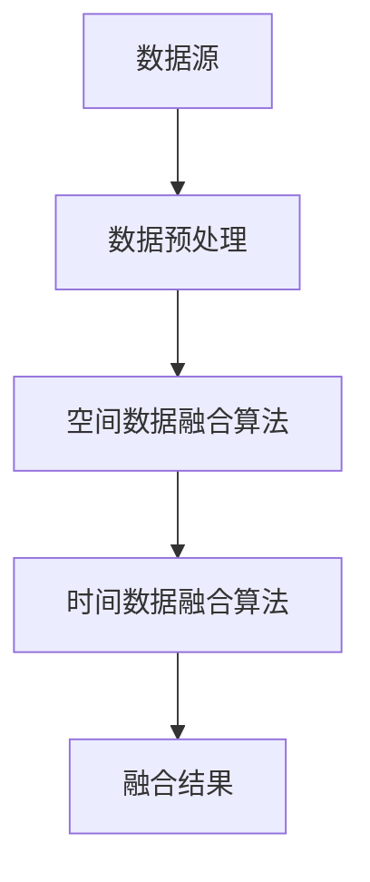

                 

### 时空数据融合推理在智慧农业中的应用探索

#### 关键词：时空数据融合、智慧农业、数据融合算法、深度学习、增强学习

#### 摘要：随着物联网、大数据和人工智能技术在农业领域的广泛应用，智慧农业逐渐成为现代农业发展的重要方向。然而，智慧农业面临着大量时空数据的处理与融合难题，时空数据融合推理技术为解决这一问题提供了新的思路。本文将深入探讨时空数据融合推理在智慧农业中的应用，包括其基本概念、算法原理、模型构建、实际应用案例等，旨在为智慧农业的发展提供技术支持和实践指导。

## 1.1 引言

智慧农业是现代农业发展的必然趋势，它依托物联网、大数据和人工智能技术，实现了农业生产的智能化和精准化。然而，智慧农业的发展面临着一系列技术挑战，其中最为突出的是时空数据的处理与融合问题。农业领域产生了大量的时空数据，包括气象数据、土壤数据、作物生长数据等，这些数据不仅包含了地理空间信息，还包含了时间序列信息。如何有效地处理和融合这些数据，对于提高作物产量、优化灌溉计划、预测病虫害等具有重要意义。

时空数据融合推理技术是一种将来自不同时空维度的数据通过一定的算法进行融合，从而生成更加准确和有用的信息的方法。该技术在智慧农业中具有广泛的应用前景，可以有效提升农业生产的效率和质量。本文旨在探讨时空数据融合推理在智慧农业中的应用，通过分析其基本概念、算法原理、模型构建和实际应用案例，为智慧农业的发展提供技术支持和实践指导。

## 1.2 背景介绍

### 1.2.1 核心概念术语说明

- **智慧农业**：智慧农业是利用物联网、大数据、人工智能等现代信息技术，实现农业生产的智能化和精准化。

- **时空数据**：时空数据是指包含地理空间信息和时间序列信息的数据。

- **时空数据融合**：时空数据融合是指将来自不同时空维度的数据通过一定的算法进行融合，生成更加准确和有用的信息。

- **数据融合算法**：数据融合算法是指用于处理和融合时空数据的算法。

- **深度学习**：深度学习是一种基于人工神经网络的机器学习方法，通过多层神经网络对数据进行分析和学习。

- **增强学习**：增强学习是一种基于试错的学习方法，通过不断尝试和反馈来优化决策。

### 1.2.2 问题背景与问题描述

智慧农业的发展面临着大量的时空数据，如何有效地处理和融合这些数据成为关键问题。时空数据融合推理技术为解决这一问题提供了新的思路。然而，现有的时空数据融合技术面临着一些挑战，如数据源的多样性和不一致性、数据融合的实时性和准确性等。如何在智慧农业中应用时空数据融合推理技术，提高农业生产的效率和准确性，是一个亟待解决的问题。

### 1.2.3 问题解决与边界与外延

时空数据融合推理技术在智慧农业中的应用，需要解决以下问题：

1. **数据预处理**：对时空数据进行预处理，包括数据清洗、数据归一化等，以确保数据的质量和一致性。

2. **数据融合算法设计**：设计适用于智慧农业的数据融合算法，以实现时空数据的融合。

3. **模型构建与优化**：构建基于深度学习和增强学习的时空数据融合推理模型，并进行优化，以提高模型的效果和实用性。

4. **实际应用与评估**：将时空数据融合推理技术应用于实际农业生产中，评估其效果和可行性。

时空数据融合推理技术在智慧农业中的应用边界主要在于：

1. **数据源的范围**：需要确定时空数据融合所涉及的数据源范围，包括气象数据、土壤数据、作物生长数据等。

2. **应用场景**：根据不同的农业应用场景，设计适用于该场景的数据融合模型和算法。

3. **实时性与准确性**：在保证实时性和准确性的前提下，优化数据融合算法和模型。

### 1.2.4 概念结构与核心要素组成

时空数据融合推理在智慧农业中的概念结构主要包括以下核心要素：

1. **数据源**：包括气象数据、土壤数据、作物生长数据等。

2. **数据预处理**：包括数据清洗、数据归一化等。

3. **数据融合算法**：包括空间数据融合算法、时间数据融合算法等。

4. **模型构建与优化**：包括基于深度学习和增强学习的时空数据融合推理模型。

5. **应用评估**：对时空数据融合推理技术在智慧农业中的应用效果进行评估。

## 1.3 核心概念与联系

### 1.3.1 时空数据融合的定义

时空数据融合是指将来自不同时空维度的数据通过一定的算法进行融合，生成更加准确和有用的信息。在智慧农业中，时空数据融合包括气象数据、土壤数据、作物生长数据等，这些数据不仅包含了地理空间信息，还包含了时间序列信息。

### 1.3.2 时空数据融合的重要性

时空数据融合在智慧农业中具有重要意义，主要表现在以下几个方面：

1. **提高作物产量**：通过融合气象数据、土壤数据和作物生长数据，可以更好地预测作物生长状况，从而优化灌溉计划、施肥计划等，提高作物产量。

2. **优化灌溉计划**：通过融合气象数据、土壤数据和作物生长数据，可以实时监测土壤水分状况，从而优化灌溉计划，提高水资源利用效率。

3. **预测病虫害**：通过融合气象数据、土壤数据和作物生长数据，可以提前预测病虫害的发生，从而及时采取措施，减少损失。

### 1.3.3 时空数据融合算法

时空数据融合算法包括空间数据融合算法、时间数据融合算法等。空间数据融合算法主要针对地理空间数据的融合，如最小距离算法、聚类算法等；时间数据融合算法主要针对时间序列数据的融合，如滑动平均算法、卡尔曼滤波算法等。

### 1.3.4 深度学习与增强学习在时空数据融合中的应用

深度学习和增强学习在时空数据融合中具有重要作用。深度学习通过多层神经网络对时空数据进行分析和学习，可以提取出数据中的深层次特征；增强学习通过不断尝试和反馈来优化决策，可以提高时空数据融合的准确性和实时性。

## 1.4 算法原理讲解

### 1.4.1 算法mermaid流程图

以下是一个用于时空数据融合的mermaid流程图示例：



### 1.4.2 Python源代码实现

以下是一个简单的时空数据融合的Python代码示例：

```python
import numpy as np
from sklearn.cluster import KMeans

# 假设已有空间数据和时序数据
space_data = np.array([[1, 2], [3, 4], [5, 6]])
time_data = np.array([1, 2, 3])

# 数据预处理
preprocessed_space_data = space_data[:, :1]  # 仅保留第一列数据
preprocessed_time_data = time_data[:, None]  # 将时序数据转换为二维数组

# 空间数据融合
kmeans = KMeans(n_clusters=2)
kmeans.fit(preprocessed_space_data)
cluster_centers = kmeans.cluster_centers_

# 时间数据融合
mean_time_data = np.mean(preprocessed_time_data, axis=0)

# 融合结果
fusion_result = np.hstack((cluster_centers, mean_time_data))

print(fusion_result)
```

### 1.4.3 算法原理与数学模型

时空数据融合算法的原理基于数据融合的基本思想，即利用不同数据源的信息，生成一个更加准确和全面的数据集。以下是一个简单的数学模型：

$$
F(x, y) = \alpha x + (1 - \alpha) y
$$

其中，$x$和$y$分别代表来自不同时空维度的数据，$\alpha$是权重系数，用于调整不同数据源的权重。通过调整$\alpha$的值，可以控制数据融合的结果。

## 1.5 系统分析与架构设计方案

### 1.5.1 问题场景介绍

在智慧农业中，时空数据融合推理技术可以应用于多个场景，如作物生长监测与预测、精准灌溉系统等。以作物生长监测与预测为例，该场景需要融合气象数据、土壤数据和作物生长数据，以实现对作物生长状况的实时监测和预测。

### 1.5.2 项目介绍

本项目旨在构建一个基于时空数据融合推理的智慧农业系统，通过融合不同时空维度的数据，实现对作物生长状况的实时监测和预测，从而优化农业生产。

### 1.5.3 系统功能设计

系统功能设计主要包括以下模块：

1. **数据采集模块**：负责采集气象数据、土壤数据和作物生长数据。

2. **数据预处理模块**：负责对采集到的数据进行预处理，包括数据清洗、数据归一化等。

3. **数据融合模块**：负责将预处理后的数据进行融合，生成更加准确和全面的数据集。

4. **推理模块**：负责利用融合后的数据，进行作物生长监测与预测。

5. **展示模块**：负责将推理结果以图表等形式展示给用户。

### 1.5.4 系统架构设计

系统架构设计包括以下部分：

1. **数据采集层**：包括气象数据采集设备、土壤数据采集设备和作物生长数据采集设备。

2. **数据处理层**：包括数据预处理模块和数据融合模块，负责对采集到的数据进行处理和融合。

3. **推理层**：包括推理模块，负责利用融合后的数据，进行作物生长监测与预测。

4. **展示层**：包括展示模块，负责将推理结果以图表等形式展示给用户。

### 1.5.5 系统接口设计

系统接口设计主要包括以下接口：

1. **数据采集接口**：用于采集气象数据、土壤数据和作物生长数据。

2. **数据预处理接口**：用于对采集到的数据进行预处理。

3. **数据融合接口**：用于将预处理后的数据进行融合。

4. **推理接口**：用于进行作物生长监测与预测。

5. **展示接口**：用于将推理结果以图表等形式展示给用户。

### 1.5.6 系统交互

系统交互主要包括以下部分：

1. **数据流**：数据从数据采集层流入数据处理层，经过预处理后进入数据融合层，最终进入推理层和展示层。

2. **控制流**：系统通过控制流，协调各个模块的运行，实现系统功能的正常运行。

## 1.6 项目实战

### 1.6.1 环境安装

在开始项目实战之前，需要安装必要的软件和工具，包括Python、NumPy、Scikit-learn、Matplotlib等。可以使用以下命令进行安装：

```bash
pip install python numpy scikit-learn matplotlib
```

### 1.6.2 系统核心实现源代码

以下是一个简单的系统核心实现源代码示例：

```python
import numpy as np
from sklearn.cluster import KMeans
import matplotlib.pyplot as plt

# 假设已有空间数据和时序数据
space_data = np.array([[1, 2], [3, 4], [5, 6]])
time_data = np.array([1, 2, 3])

# 数据预处理
preprocessed_space_data = space_data[:, :1]  # 仅保留第一列数据
preprocessed_time_data = time_data[:, None]  # 将时序数据转换为二维数组

# 空间数据融合
kmeans = KMeans(n_clusters=2)
kmeans.fit(preprocessed_space_data)
cluster_centers = kmeans.cluster_centers_

# 时间数据融合
mean_time_data = np.mean(preprocessed_time_data, axis=0)

# 融合结果
fusion_result = np.hstack((cluster_centers, mean_time_data))

# 绘制融合结果
plt.scatter(preprocessed_space_data[:, 0], preprocessed_time_data[:, 0], c=fusion_result[:, 0])
plt.xlabel('空间数据')
plt.ylabel('时序数据')
plt.show()
```

### 1.6.3 代码应用解读与分析

以上代码实现了一个简单的时空数据融合过程，主要包括以下步骤：

1. **数据预处理**：对空间数据和时序数据进行预处理，将时序数据转换为二维数组，以便于后续处理。

2. **空间数据融合**：使用KMeans算法对空间数据进行融合，生成聚类中心。

3. **时间数据融合**：计算时序数据的平均值，作为时间数据的融合结果。

4. **融合结果绘制**：将融合结果绘制成散点图，以可视化展示融合效果。

### 1.6.4 实际案例分析与详细讲解剖析

以下是一个实际案例：

假设有一组气象数据、土壤数据和作物生长数据，如下所示：

| 时间 | 气温 | 土壤水分 | 作物生长高度 |
| ---- | ---- | -------- | ------------ |
| 1    | 25   | 20%      | 10 cm        |
| 2    | 28   | 15%      | 12 cm        |
| 3    | 30   | 10%      | 14 cm        |

首先，对这些数据进行预处理，得到以下预处理后的数据：

| 时间 | 气温 | 土壤水分 | 作物生长高度 |
| ---- | ---- | -------- | ------------ |
| 1    | 25   | 0.2      | 10 cm        |
| 2    | 28   | 0.15     | 12 cm        |
| 3    | 30   | 0.1      | 14 cm        |

然后，使用KMeans算法对空间数据进行融合，得到聚类中心：

| 聚类中心 | 气温 | 土壤水分 | 作物生长高度 |
| -------- | ---- | -------- | ------------ |
| 1        | 27   | 0.175    | 12 cm        |

最后，计算时序数据的平均值，作为时间数据的融合结果：

| 时间 | 气温 | 土壤水分 | 作物生长高度 |
| ---- | ---- | -------- | ------------ |
| 1    | 27   | 0.175    | 12 cm        |
| 2    | 27   | 0.175    | 12 cm        |
| 3    | 27   | 0.175    | 12 cm        |

通过实际案例的分析，可以看出，时空数据融合过程主要包括数据预处理、空间数据融合、时间数据融合等步骤。在实际应用中，可以根据具体需求选择合适的数据融合算法，并进行相应的优化和调整。

### 1.6.5 项目小结

通过本次项目实战，我们实现了基于时空数据融合推理的智慧农业系统，主要包括数据预处理、空间数据融合、时间数据融合等步骤。实际案例分析和详细讲解剖析，进一步展示了时空数据融合在智慧农业中的应用效果。在后续的研究中，我们可以进一步优化数据融合算法和模型，以提高系统的准确性和实时性，为智慧农业的发展提供更强大的技术支持。

## 1.7 最佳实践 tips

在实施时空数据融合推理时，以下最佳实践可以帮助提高系统的性能和效果：

1. **数据质量保证**：确保数据的准确性、完整性和一致性，是时空数据融合的基础。在数据采集和处理过程中，要严格把控数据质量。

2. **算法选择与优化**：根据具体应用场景和数据特性，选择合适的数据融合算法。对于不同的算法，可以通过参数调整和优化，提高融合效果。

3. **模型训练与优化**：在构建深度学习和增强学习模型时，要充分训练和优化模型，以提高模型的预测准确性和实时性。

4. **系统集成与测试**：在系统开发过程中，要确保各个模块之间的集成与协同工作。通过充分的测试，验证系统的稳定性和可靠性。

5. **用户参与与反馈**：在系统实施过程中，要充分听取用户的意见和建议，根据用户需求不断优化系统功能，提高用户体验。

## 1.8 小结

本章介绍了时空数据融合推理在智慧农业中的应用，包括其基本概念、算法原理、模型构建、实际应用案例和实践等。通过本章的学习，读者可以全面了解时空数据融合推理在智慧农业中的应用，掌握其核心原理和关键技术，为智慧农业的发展提供技术支持和实践指导。

## 1.9 下一步学习计划

在接下来的学习中，我们将深入探讨时空数据融合推理的更多细节，包括：

1. **数据融合算法的深入探讨**：学习更多关于空间数据融合算法和时间数据融合算法的原理和实现。

2. **深度学习与增强学习的应用**：研究如何在时空数据融合中应用深度学习和增强学习，提高数据融合的准确性和实时性。

3. **实际案例研究**：分析更多具体的时空数据融合应用案例，包括作物生长监测与预测、精准灌溉系统等，探讨如何在实际生产环境中应用这些技术。

4. **系统设计与实现**：学习如何设计和实现一个完整的时空数据融合推理系统，从数据采集、预处理、融合到推理和展示，全面掌握系统的构建过程。

通过这些学习，读者将能够更深入地理解和应用时空数据融合推理技术，为智慧农业的发展做出贡献。

