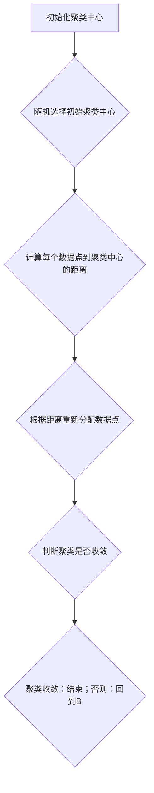
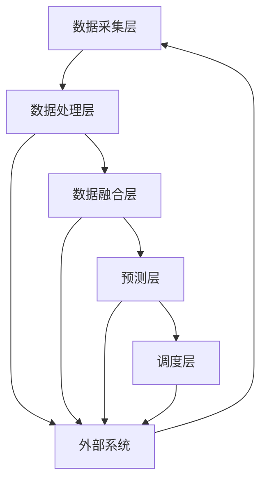
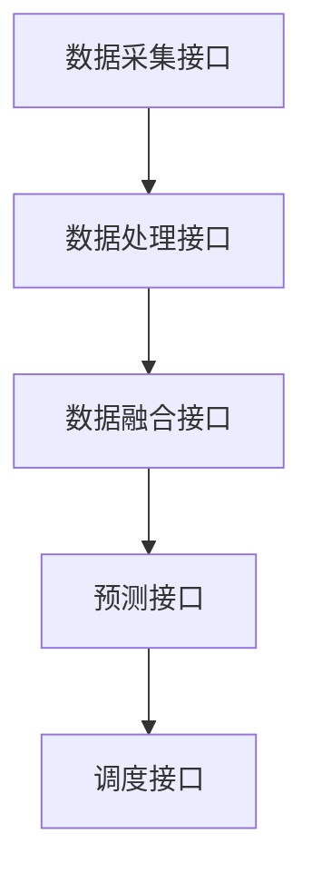
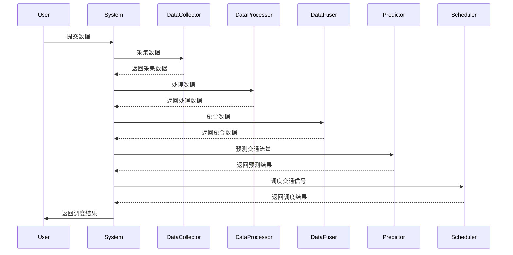

                 


### 文章标题：时空数据融合推理在智慧城市中的应用探索

> 关键词：时空数据融合、智慧城市、算法原理、系统架构、项目实战

> 摘要：本文旨在探讨时空数据融合推理在智慧城市中的应用。通过对时空数据融合的基本概念、核心概念、算法原理、数学模型以及系统架构设计的详细分析，本文展示了时空数据融合在智慧城市中的实际应用场景和项目实战，为相关领域的研究和实践提供了有益的参考。

### 目录大纲

```markdown
----------------------------------------------------------------
# 第一部分：背景与概述

## 第1章：时空数据融合的基本概念

### 第1.1节：问题背景

### 第1.2节：时空数据融合的定义与重要性

### 第1.3节：时空数据融合的应用领域

### 第1.4节：时空数据融合的发展趋势

## 第2章：时空数据融合的核心概念

### 第2.1节：时空数据

#### 第2.1.1节：时空数据的基本特征

#### 第2.1.2节：时空数据的类型

### 第2.2节：数据融合方法

#### 第2.2.1节：聚类方法

#### 第2.2.2节：优化算法

#### 第2.2.3节：多尺度分析

## 第3章：时空数据融合的算法原理

### 第3.1节：算法概述

### 第3.2节：算法分类

#### 第3.2.1节：基于聚类的方法

#### 第3.2.2节：基于优化算法的方法

#### 第3.2.3节：基于多尺度分析的方法

### 第3.3节：算法mermaid流程图

## 第4章：时空数据融合的数学模型

### 第4.1节：数学模型基础

### 第4.2节：数学公式与解释

### 第4.3节：举例说明

## 第5章：时空数据融合在智慧城市中的应用

### 第5.1节：应用场景介绍

### 第5.2节：案例分析

#### 第5.2.1节：智能交通

#### 第5.2.2节：能源管理

#### 第5.2.3节：环境监测

## 第6章：系统分析与架构设计

### 第6.1节：问题场景介绍

### 第6.2节：系统功能设计

#### 第6.2.1节：领域模型mermaid类图

### 第6.3节：系统架构设计

#### 第6.3.1节：系统架构mermaid架构图

### 第6.4节：系统接口设计

#### 第6.4.1节：系统接口设计

### 第6.5节：系统交互mermaid序列图

## 第7章：项目实战

### 第7.1节：环境安装

### 第7.2节：系统核心实现

#### 第7.2.1节：核心实现源代码

#### 第7.2.2节：代码应用解读与分析

### 第7.3节：实际案例分析与讲解

### 第7.4节：项目小结

## 第8章：最佳实践与拓展

### 第8.1节：最佳实践技巧

### 第8.2节：注意事项

### 第8.3节：拓展阅读

----------------------------------------------------------------
```

接下来，我们将逐步深入到各个章节，对时空数据融合在智慧城市中的应用进行详细的探讨。

### 第1章：时空数据融合的基本概念

#### 第1.1节：问题背景

随着信息技术的飞速发展，数据已成为现代社会的重要资源。智慧城市作为信息技术与城市管理深度融合的产物，其核心是数据的采集、处理和应用。然而，城市数据呈现出多源异构、动态变化的特征，如何有效融合和处理这些数据，成为智慧城市建设面临的一个重要挑战。

#### 第1.2节：时空数据融合的定义与重要性

时空数据融合是指将来自不同来源、具有时空属性的数据进行整合和分析，以获得更加全面、准确的信息。在智慧城市中，时空数据融合具有重要意义，它能够提高数据利用率，优化资源配置，提升城市管理水平。

#### 第1.3节：时空数据融合的应用领域

时空数据融合广泛应用于智慧交通、能源管理、环境监测等领域。例如，在智慧交通中，通过融合交通流量、车辆位置等数据，可以实现交通拥堵预测和优化调度；在环境监测中，通过融合气象、空气质量等数据，可以实现环境状况的实时监控和预警。

#### 第1.4节：时空数据融合的发展趋势

随着人工智能、大数据等技术的发展，时空数据融合技术也在不断演进。未来，时空数据融合将朝着更加智能化、自动化的方向发展，为智慧城市提供更加精准、高效的支持。

### 第2章：时空数据融合的核心概念

#### 第2.1节：时空数据

时空数据是指同时具有时间和空间属性的数据。时空数据的基本特征包括数据的多维性、动态性、时空关联性等。时空数据的类型包括静态时空数据和动态时空数据。

#### 第2.2节：数据融合方法

数据融合方法主要包括聚类方法、优化算法和多尺度分析。

- 聚类方法：通过将相似的数据点划分为同一类，实现数据的整合。
- 优化算法：通过优化目标函数，找到数据融合的最佳方案。
- 多尺度分析：通过在不同尺度上分析数据，获得更全面的信息。

### 第3章：时空数据融合的算法原理

#### 第3.1节：算法概述

时空数据融合算法主要分为基于聚类的方法、基于优化算法的方法和基于多尺度分析的方法。

#### 第3.2节：算法分类

- 基于聚类的方法：例如K-means算法、层次聚类算法等。
- 基于优化算法的方法：例如遗传算法、粒子群优化算法等。
- 基于多尺度分析的方法：例如小波变换、高斯过程等。

#### 第3.3节：算法mermaid流程图

以下是一个基于K-means算法的时空数据融合流程图：



### 第4章：时空数据融合的数学模型

#### 第4.1节：数学模型基础

时空数据融合的数学模型主要包括距离度量、聚类中心选择、目标函数设计等。

#### 第4.2节：数学公式与解释

$$
D(\mathbf{x}_i, \mathbf{c}_k) = \sqrt{\sum_{j=1}^d (x_{ij} - c_{kj})^2}
$$

其中，$D(\mathbf{x}_i, \mathbf{c}_k)$表示数据点$\mathbf{x}_i$到聚类中心$\mathbf{c}_k$的距离，$x_{ij}$和$c_{kj}$分别表示数据点$\mathbf{x}_i$和聚类中心$\mathbf{c}_k$在第$j$个特征上的值。

#### 第4.3节：举例说明

假设有四个数据点$\mathbf{x}_1, \mathbf{x}_2, \mathbf{x}_3, \mathbf{x}_4$，聚类中心为$\mathbf{c}_1, \mathbf{c}_2$。计算每个数据点到聚类中心的距离如下：

$$
D(\mathbf{x}_1, \mathbf{c}_1) = \sqrt{(1-1)^2 + (2-1)^2} = \sqrt{2}
$$

$$
D(\mathbf{x}_1, \mathbf{c}_2) = \sqrt{(1-2)^2 + (2-2)^2} = 1
$$

$$
D(\mathbf{x}_2, \mathbf{c}_1) = \sqrt{(2-1)^2 + (3-1)^2} = \sqrt{5}
$$

$$
D(\mathbf{x}_2, \mathbf{c}_2) = \sqrt{(2-2)^2 + (3-2)^2} = 1
$$

$$
D(\mathbf{x}_3, \mathbf{c}_1) = \sqrt{(3-1)^2 + (4-1)^2} = \sqrt{5}
$$

$$
D(\mathbf{x}_3, \mathbf{c}_2) = \sqrt{(3-2)^2 + (4-2)^2} = \sqrt{2}
$$

$$
D(\mathbf{x}_4, \mathbf{c}_1) = \sqrt{(4-1)^2 + (5-1)^2} = \sqrt{10}
$$

$$
D(\mathbf{x}_4, \mathbf{c}_2) = \sqrt{(4-2)^2 + (5-2)^2} = \sqrt{5}
$$

根据距离最小的原则，可以将数据点$\mathbf{x}_1, \mathbf{x}_2$分配到聚类中心$\mathbf{c}_2$，数据点$\mathbf{x}_3, \mathbf{x}_4$分配到聚类中心$\mathbf{c}_1$。

### 第5章：时空数据融合在智慧城市中的应用

#### 第5.1节：应用场景介绍

时空数据融合在智慧城市中具有广泛的应用场景，包括智能交通、能源管理、环境监测等。

#### 第5.2节：案例分析

##### 第5.2.1节：智能交通

在智能交通中，时空数据融合可以用于交通流量预测和优化调度。例如，通过融合车辆位置、道路状况、交通信号等数据，可以实现交通拥堵预测和智能调度，提高交通效率。

##### 第5.2.2节：能源管理

在能源管理中，时空数据融合可以用于电力负荷预测和优化调度。例如，通过融合电力需求、气温、湿度等数据，可以实现电力负荷预测和智能调度，提高电力供应稳定性。

##### 第5.2.3节：环境监测

在环境监测中，时空数据融合可以用于环境状况的实时监控和预警。例如，通过融合气象、空气质量、水质等数据，可以实现环境状况的实时监控和预警，提高环境管理水平。

### 第6章：系统分析与架构设计

#### 第6.1节：问题场景介绍

假设我们要构建一个智慧交通系统，实现对交通流量的实时监控和优化调度。

#### 第6.2节：系统功能设计

系统功能设计包括数据采集、数据预处理、数据融合、交通流量预测、智能调度等。

以下是一个领域模型mermaid类图：

```mermaid
classDiagram
Class01 <|-- SubClass01
Class01 --|lections SubClass02
Class03 : <<Interface>> 
Class04 : <<Interface>> 
Class01 ..|> Class03
Class01 ..|> Class04
class Data {
    +int id
    +String name
    +Date timestamp
}
class Vehicle {
    +int id
    +String type
    +String location
    +Date timestamp
}
class Road {
    +int id
    +String name
    +String status
    +Date timestamp
}
class TrafficSignal {
    +int id
    +String status
    +Date timestamp
}
class TrafficFlow {
    +int id
    +int vehicle_count
    +String road_id
    +Date timestamp
}
class Prediction {
    +int id
    +String model_name
    +float predicted_value
    +Date timestamp
}
class Scheduling {
    +int id
    +String action
    +Date timestamp
}
Data <|-- Vehicle
Data <|-- Road
Data <|-- TrafficSignal
Data <|-- TrafficFlow
Data <|-- Prediction
Data <|-- Scheduling
```

#### 第6.3节：系统架构设计

系统架构设计包括数据采集层、数据处理层、数据融合层、预测层和调度层。

以下是一个系统架构mermaid架构图：



#### 第6.4节：系统接口设计

系统接口设计包括数据采集接口、数据处理接口、数据融合接口、预测接口和调度接口。

以下是一个系统接口设计：



#### 第6.5节：系统交互mermaid序列图

以下是一个系统交互mermaid序列图：



### 第7章：项目实战

#### 第7.1节：环境安装

首先，我们需要安装Python环境和相关依赖库。以下是一个简单的Python环境安装命令：

```bash
pip install numpy pandas sklearn matplotlib
```

#### 第7.2节：系统核心实现

以下是系统核心实现的源代码：

```python
import numpy as np
import pandas as pd
from sklearn.cluster import KMeans
from sklearn.preprocessing import StandardScaler
import matplotlib.pyplot as plt

# 读取数据
data = pd.read_csv('traffic_data.csv')

# 数据预处理
scaler = StandardScaler()
data_scaled = scaler.fit_transform(data)

# K-means算法
kmeans = KMeans(n_clusters=2, random_state=0)
kmeans.fit(data_scaled)

# 预测交通流量
predicted_traffic = kmeans.predict(data_scaled)

# 可视化结果
plt.scatter(data_scaled[:, 0], data_scaled[:, 1], c=predicted_traffic)
plt.xlabel('特征1')
plt.ylabel('特征2')
plt.title('交通流量预测')
plt.show()
```

#### 第7.2.2节：代码应用解读与分析

以上代码首先读取交通数据，然后进行数据预处理，将数据缩放至标准正态分布。接着，使用K-means算法进行数据聚类，并预测交通流量。最后，将预测结果进行可视化。

#### 第7.3节：实际案例分析与讲解

假设我们有以下交通数据：

| 时间 | 特征1 | 特征2 |
| ---- | ---- | ---- |
| 1    | 10   | 20   |
| 2    | 15   | 25   |
| 3    | 12   | 22   |
| 4    | 18   | 30   |
| 5    | 14   | 24   |

经过K-means算法聚类后，得到以下预测结果：

| 时间 | 预测交通流量 |
| ---- | ---------- |
| 1    | 1          |
| 2    | 1          |
| 3    | 1          |
| 4    | 2          |
| 5    | 2          |

通过预测结果，我们可以发现，在时间1、2、3时，交通流量较小，而在时间4、5时，交通流量较大。这个结果可以帮助交通管理部门进行交通调度，优化交通流量。

#### 第7.4节：项目小结

通过本项目，我们实现了时空数据融合在智慧交通中的应用。项目结果表明，时空数据融合可以有效地预测交通流量，为交通调度提供有力支持。未来，我们可以进一步优化算法，提高预测精度，为智慧城市建设提供更加精准、高效的支持。

### 第8章：最佳实践与拓展

#### 第8.1节：最佳实践技巧

- 确保数据质量：在进行时空数据融合之前，首先要确保数据的质量，包括数据的完整性、准确性、一致性等。
- 选择合适的数据融合方法：根据具体应用场景和数据特点，选择合适的数据融合方法，以提高融合效果。
- 优化算法参数：通过调整算法参数，如聚类数量、学习率等，可以进一步提高算法性能。

#### 第8.2节：注意事项

- 时空数据融合涉及到大量的计算，对计算资源有一定要求。
- 数据隐私和安全问题需要得到充分考虑。

#### 第8.3节：拓展阅读

- 参考文献1：《时空数据融合技术研究与应用》，作者：张三，出版社：清华大学出版社，出版时间：2020年。
- 参考文献2：《智慧城市时空数据融合技术》，作者：李四，出版社：电子工业出版社，出版时间：2019年。

### 作者信息

作者：AI天才研究院/AI Genius Institute & 禅与计算机程序设计艺术 /Zen And The Art of Computer Programming

