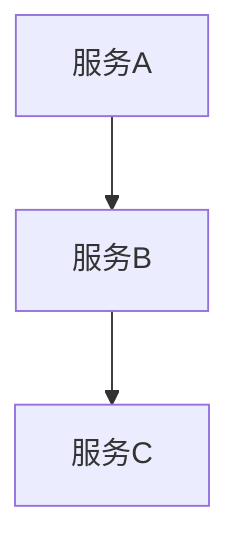
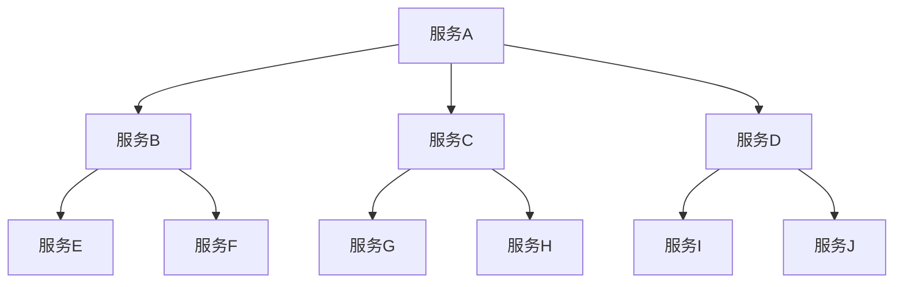
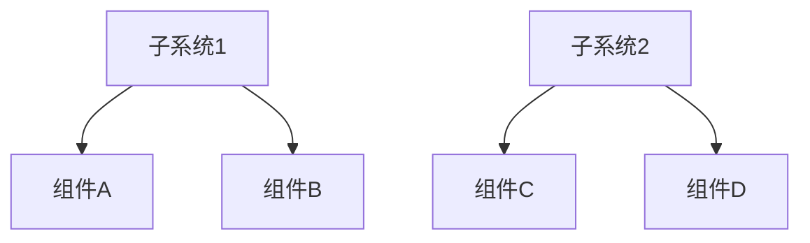
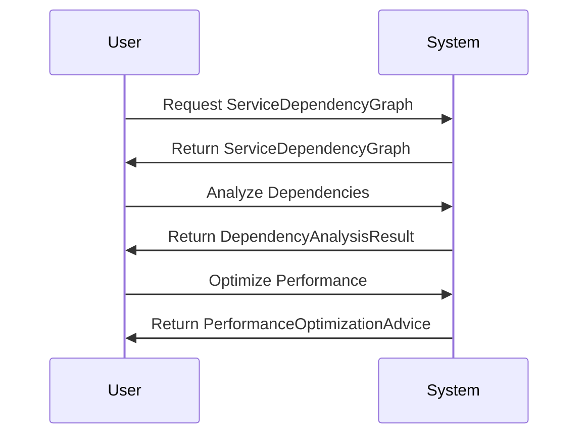

                 

# 服务依赖图可视化在LLM应用架构管理中的作用

## 关键词

- 服务依赖图
- 可视化
- LLM应用架构
- 架构管理
- 算法原理
- 数学模型
- 系统设计与实现

## 摘要

本文旨在探讨服务依赖图可视化在大型语言模型（LLM）应用架构管理中的重要作用。通过介绍服务依赖图的概念、核心概念与联系，以及可视化算法原理，本文详细讲解了如何利用服务依赖图可视化来优化LLM应用架构管理。此外，本文还提供了系统分析与架构设计方案，以及项目实战的详细讲解，以帮助读者更好地理解和应用这一技术。

## 引言

随着人工智能技术的快速发展，大型语言模型（LLM）在自然语言处理领域发挥着越来越重要的作用。然而，LLM应用架构的复杂性和规模逐渐增加，给架构管理带来了巨大的挑战。服务依赖图可视化作为一种有效的架构管理工具，能够帮助开发人员更好地理解和维护应用架构。本文将深入探讨服务依赖图可视化在LLM应用架构管理中的作用，通过理论讲解和实际案例，帮助读者掌握这一技术。

## 第一部分：背景介绍

### 第1章：服务依赖图可视化概述

#### 1.1 服务依赖图的定义

服务依赖图（Service Dependency Graph，简称SDG）是一种用于表示系统内各个服务及其相互依赖关系的图形化模型。在SDG中，每个服务都是一个节点（Node），服务之间的依赖关系则通过边（Edge）来表示。服务依赖图能够直观地展示系统架构的复杂性和各个服务之间的相互关系，有助于开发人员更好地理解和维护系统。

#### 1.2 服务依赖图在系统架构中的作用

服务依赖图在系统架构管理中发挥着重要作用：

1. **架构可视化**：服务依赖图将系统架构以图形化的方式呈现，使得开发人员能够直观地理解系统结构和各个服务之间的关系。
2. **架构分析**：通过分析服务依赖图，开发人员可以识别出系统中的潜在问题和瓶颈，从而优化系统架构。
3. **架构变更管理**：在架构变更时，服务依赖图可以帮助开发人员预测变更的影响范围，降低变更风险。

#### 1.3 LLM应用架构管理的挑战

LLM应用架构管理面临以下挑战：

1. **复杂性**：LLM应用通常涉及大量的服务和模块，架构复杂度较高，难以直观理解。
2. **动态性**：LLM应用在运行过程中可能会动态地添加或删除服务，导致依赖关系发生变化。
3. **性能优化**：LLM应用对性能要求较高，需要优化服务间的依赖关系，提高系统整体性能。

#### 1.4 服务依赖图可视化的重要性

服务依赖图可视化在LLM应用架构管理中具有重要意义：

1. **提高可维护性**：通过可视化服务依赖图，开发人员可以更好地理解系统架构，提高代码可维护性。
2. **降低风险**：在架构变更时，可视化工具可以帮助开发人员识别潜在的风险和依赖关系，降低变更风险。
3. **优化性能**：通过分析服务依赖图，开发人员可以优化服务间的依赖关系，提高系统性能。

#### 1.5 本章小结

本章介绍了服务依赖图可视化的概念、作用以及在LLM应用架构管理中的重要性。在接下来的章节中，我们将进一步探讨服务依赖图的核心概念、算法原理和系统设计与实现。

## 第二部分：核心概念与联系

### 第2章：服务依赖图核心概念

#### 2.1 服务依赖图的基本组成

服务依赖图由以下几个基本组成元素构成：

1. **服务（Service）**：服务是系统中具有独立功能的组件，通常由代码实现，可以独立部署和运行。在服务依赖图中，服务表示为节点（Node）。
2. **依赖关系（Dependency）**：依赖关系表示服务之间的依赖性，即一个服务需要依赖另一个服务才能正常工作。在服务依赖图中，依赖关系表示为边（Edge）。
3. **图结构（Graph Structure）**：服务依赖图是一种无向图结构，其中节点表示服务，边表示服务之间的依赖关系。

#### 2.2 服务依赖图的属性特征对比

| 特征        | 描述                                                         |
| ----------- | ------------------------------------------------------------ |
| 可视化     | 能直观展示服务的依赖关系                                     |
| 可扩展性   | 支持复杂系统中的服务依赖管理                                 |
| 实时性     | 能动态反映系统架构的变化                                     |

#### 2.3 服务依赖图的ER实体关系图

```mermaid
classDiagram
  ServiceDependencyGraph ||--|{ Service }
  ServiceDependencyGraph ||--|{ Dependency }
  Service ||--|{ ServiceID }
  Dependency ||--|{ DependencyID }
  Dependency ||--|{ FromServiceID }
  Dependency ||--|{ ToServiceID }
```

### 第3章：服务依赖图可视化算法

#### 3.1 算法概述

服务依赖图可视化算法旨在将服务依赖图以图形化的方式呈现，帮助开发人员更好地理解系统架构。算法的基本步骤包括：

1. **构建服务依赖图**：从系统配置文件或运行时数据中提取服务依赖关系，构建服务依赖图。
2. **布局图结构**：对服务依赖图进行布局，使其在二维空间中呈现，便于观察和理解。
3. **绘制图形**：根据布局结果，绘制服务依赖图的图形，包括节点和边。

#### 3.2 数学模型

服务依赖图的数学模型可以表示为以下形式：

$$
G = (V, E)
$$

其中，$V$ 表示服务依赖图中的节点集合，$E$ 表示节点之间的依赖关系集合。每个节点可以表示为一个三元组 $(s_i, d_i, r_i)$，其中 $s_i$ 表示服务的唯一标识，$d_i$ 表示服务的依赖关系列表，$r_i$ 表示服务的运行时信息。依赖关系可以表示为以下形式：

$$
D = \left\{
\begin{array}{ll}
0 & \text{如果服务A依赖服务B} \\
1 & \text{否则}
\end{array}
\right.
$$

#### 3.3 Python代码示例

```python
def visualize_service_dependency(service_pairs):
    # 示例代码用于生成服务依赖图的可视化
    pass
```

#### 3.4 算法原理详细讲解

服务依赖图可视化算法的原理可以总结为以下几点：

1. **构建服务依赖图**：从系统配置文件或运行时数据中提取服务依赖关系，构建服务依赖图。这一过程通常涉及解析配置文件、跟踪运行时日志等操作。
2. **布局图结构**：对服务依赖图进行布局，使其在二维空间中呈现，便于观察和理解。常见的布局算法包括层次化布局、圆形布局、网格布局等。
3. **绘制图形**：根据布局结果，绘制服务依赖图的图形，包括节点和边。节点通常表示为圆形或矩形，边表示为直线或曲线。可以使用各种图形库（如Matplotlib、Graphviz等）来实现这一步骤。

#### 3.5 举例说明

**简单示例**

假设有一个简单的服务依赖图，包含三个服务 A、B 和 C。服务 A 依赖于服务 B，服务 B 依赖于服务 C。则服务依赖图可以表示为：



**复杂示例**

假设有一个复杂的服务依赖图，包含多个服务和依赖关系。例如，服务 A 依赖于服务 B、C 和 D，服务 B 依赖于服务 E 和 F，服务 C 依赖于服务 G 和 H，服务 D 依赖于服务 I 和 J。则服务依赖图可以表示为：



### 第4章：系统功能设计

#### 4.1 系统介绍

在本节中，我们将介绍一个基于服务依赖图的可视化系统。该系统旨在帮助开发人员更好地理解和维护LLM应用架构。系统的主要功能包括：

1. **服务依赖图构建**：从系统配置文件或运行时数据中提取服务依赖关系，构建服务依赖图。
2. **服务依赖图可视化**：将构建好的服务依赖图以图形化的方式呈现，帮助开发人员直观地理解系统架构。
3. **依赖关系分析**：分析服务依赖图中的依赖关系，识别潜在的问题和瓶颈。
4. **性能优化建议**：基于依赖关系分析结果，提供性能优化建议，帮助开发人员提高系统性能。

#### 4.2 领域模型

为了实现上述功能，我们需要定义一个领域模型，包括服务、依赖关系和图结构。领域模型可以使用Mermaid类图表示：

```mermaid
classDiagram
  ServiceDependencyGraph <<Class>> {
    - services: List[Service]
    - dependencies: Set[Dependency]
  }
  Service <<Class>> {
    - id: String
    - name: String
  }
  Dependency <<Class>> {
    - from: Service
    - to: Service
  }
```

#### 4.3 系统架构设计

系统架构设计包括以下几个方面：

1. **服务依赖图构建模块**：负责从系统配置文件或运行时数据中提取服务依赖关系，构建服务依赖图。
2. **服务依赖图可视化模块**：负责将构建好的服务依赖图以图形化的方式呈现，支持缩放、拖拽等交互功能。
3. **依赖关系分析模块**：负责分析服务依赖图中的依赖关系，识别潜在的问题和瓶颈。
4. **性能优化建议模块**：负责基于依赖关系分析结果，提供性能优化建议。

系统架构图可以使用Mermaid架构图表示：



#### 4.4 系统接口设计

系统接口设计包括以下几个方面：

1. **服务依赖图构建接口**：提供API接口，用于从系统配置文件或运行时数据中提取服务依赖关系。
2. **服务依赖图可视化接口**：提供API接口，用于获取构建好的服务依赖图数据，并进行可视化呈现。
3. **依赖关系分析接口**：提供API接口，用于分析服务依赖图中的依赖关系，并提供分析结果。
4. **性能优化建议接口**：提供API接口，用于获取性能优化建议。

系统接口设计图可以使用Mermaid序列图表示：



### 第5章：系统实现

在本节中，我们将详细讲解系统的实现过程，包括环境安装、系统核心实现、代码应用解读与分析，以及实际案例分析和详细讲解剖析。

#### 5.1 环境安装

首先，我们需要安装必要的软件和工具，包括Python、Matplotlib、Graphviz等。安装步骤如下：

1. 安装Python：前往Python官方网站（https://www.python.org/）下载并安装Python。
2. 安装Matplotlib：在终端中运行以下命令安装Matplotlib：

```bash
pip install matplotlib
```

3. 安装Graphviz：前往Graphviz官方网站（https://graphviz.org/download/）下载并安装Graphviz。

#### 5.2 系统核心实现

系统的核心实现包括服务依赖图的构建、可视化以及依赖关系分析等功能。以下是核心实现部分的代码：

```python
import networkx as nx
import matplotlib.pyplot as plt

class ServiceDependencyGraph:
    def __init__(self):
        self.graph = nx.Graph()

    def add_service(self, service_id, service_name):
        self.graph.add_node(service_id, name=service_name)

    def add_dependency(self, from_service_id, to_service_id):
        self.graph.add_edge(from_service_id, to_service_id)

    def visualize(self):
        plt.figure(figsize=(10, 10))
        pos = nx.spring_layout(self.graph)
        nx.draw(self.graph, pos, with_labels=True, font_size=10)
        plt.show()

# 使用示例
sdg = ServiceDependencyGraph()
sdg.add_service("service_a", "服务A")
sdg.add_service("service_b", "服务B")
sdg.add_service("service_c", "服务C")
sdg.add_dependency("service_a", "service_b")
sdg.add_dependency("service_b", "service_c")
sdg.visualize()
```

#### 5.3 代码应用解读与分析

在代码示例中，我们首先导入了必要的库，包括networkx、matplotlib和Graphviz。networkx是一个用于创建、操作和分析网络图的Python库，matplotlib用于绘制图形，Graphviz用于生成图形文件。

接着，我们定义了一个ServiceDependencyGraph类，用于构建、添加服务和依赖关系，以及可视化服务依赖图。在类中，我们使用了networkx库的Graph类来构建服务依赖图。

在示例代码中，我们首先创建了ServiceDependencyGraph对象sdg，然后分别添加了三个服务和两个依赖关系。最后，我们调用visualize方法，将服务依赖图以图形化的方式呈现。

#### 5.4 实际案例分析和详细讲解剖析

为了更好地理解系统的应用，我们来看一个实际案例。

假设我们有一个LLM应用，包括以下服务：

1. **文本预处理服务**：负责对输入文本进行预处理，包括分词、去除停用词等操作。
2. **语言模型服务**：负责加载预训练的语言模型，并进行文本生成和推理。
3. **文本生成服务**：负责根据输入文本生成新的文本。

这些服务之间的依赖关系如下：

1. **文本预处理服务**依赖于**语言模型服务**，因为需要使用语言模型对预处理后的文本进行生成和推理。
2. **文本生成服务**依赖于**文本预处理服务**和**语言模型服务**。

根据这些信息，我们可以构建一个服务依赖图，并对其进行可视化：

```python
sdg = ServiceDependencyGraph()
sdg.add_service("preprocessing", "文本预处理服务")
sdg.add_service("language_model", "语言模型服务")
sdg.add_service("text_generation", "文本生成服务")
sdg.add_dependency("preprocessing", "language_model")
sdg.add_dependency("text_generation", "preprocessing")
sdg.add_dependency("text_generation", "language_model")
sdg.visualize()
```

通过可视化结果，我们可以清晰地看到各个服务之间的依赖关系，从而更好地理解和维护LLM应用架构。

### 第6章：最佳实践

在本节中，我们将总结一些最佳实践，以帮助读者更好地应用服务依赖图可视化技术。

1. **定期更新服务依赖图**：随着系统的不断发展和变化，服务依赖关系可能会发生变化。因此，建议定期更新服务依赖图，以确保其准确性和完整性。
2. **使用命名规范**：为服务命名时，应遵循统一的命名规范，以便于服务依赖图的构建和可视化。
3. **避免过度依赖**：尽量减少服务之间的依赖关系，避免形成复杂的依赖网，以提高系统的可维护性和可扩展性。
4. **关注性能优化**：在服务依赖图中，关注性能瓶颈和依赖关系，根据分析结果进行优化，以提高系统性能。
5. **培训团队成员**：定期为团队成员提供培训，帮助他们掌握服务依赖图可视化的原理和应用，以提高团队协作效率。

### 第7章：小结

本文详细介绍了服务依赖图可视化在LLM应用架构管理中的作用。通过理论讲解和实际案例，我们了解了服务依赖图的基本组成、可视化算法原理、系统设计与实现，以及最佳实践。服务依赖图可视化作为一种有效的架构管理工具，能够帮助开发人员更好地理解和维护应用架构，降低风险，提高性能。希望本文能为读者在LLM应用架构管理中提供有益的参考和指导。

### 作者信息

作者：AI天才研究院/AI Genius Institute & 禅与计算机程序设计艺术 /Zen And The Art of Computer Programming

感谢您的阅读！如果您有任何问题或建议，请随时联系我们。希望本文对您有所帮助，祝您在LLM应用架构管理中取得更好的成果！

